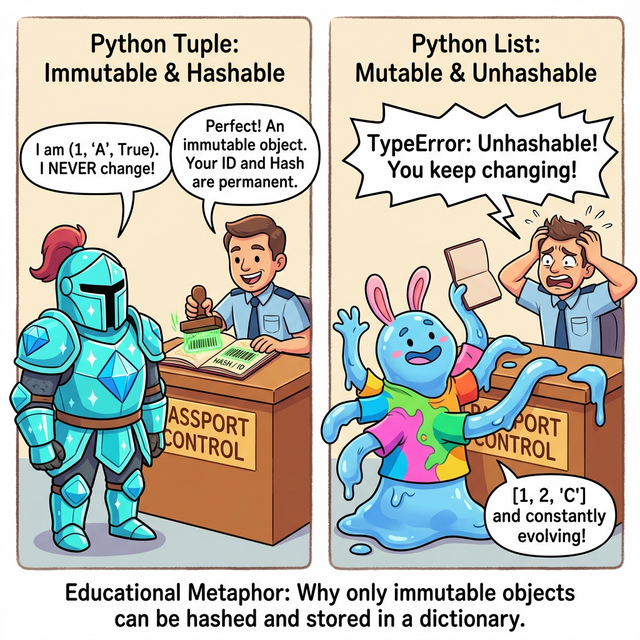

# 3.4.5 수정 불가(Immutable)와 메모리의 진실: hash()와 id()

## 학습목표
본 장에서는 "왜 리스트는 딕셔너리의 열쇠(Key)나 세트(Set)의 원소가 될 수 없는가?"라는 파이썬 최대의 미스터리를 해결원격 심층 분석합니다. 데이터가 절대 변하지 않는다는 **불변성(Immutable)**, 그 데이터를 컴퓨터만의 암호로 변환하는 **`hash()`**, 그리고 데이터가 실제로 살고 있는 물리적 집 주소인 **`id()`** 함수를 통해 파이썬 수면 아래 작동하는 거대한 메모리의 진실을 마주하게 됩니다.

---

## 💡 TL;DR (1분 핵심 요약): 해시(Hash)가 대체 뭔가요?

1. **불변성 (Immutable)**: 한 번 태어나면 자기 내용을 죽을 때까지 바꿀 수 없는 고집불통 데이터입니다. (숫자, 글자, 튜플)
2. **해시 (Hash)**: 데이터의 "주민등록번호(바코드)"입니다. 오직 내용이 **변하지 않는(Immutable)** 데이터만이 이 바코드를 발급받을 수 있습니다.
3. **딕셔너리와 세트의 절대 규칙**: 파이썬의 `Dictionary Key`와 `Set`는 데이터를 빛의 속도로 찾기 위해 **반드시 이 '해시 바코드'가 있는 녀석들만** 입장을 허락합니다. (리스트처럼 내용이 자꾸 변하는 녀석은 바코드를 발급해 줄 수 없으므로 입구 컷 당합니다!)

---

## 1. 해시 출입국의 심사대 (왜 리스트는 입구 컷 당할까?)

파이썬의 딕셔너리(사전)와 세트(집합)는 수백만 개의 데이터 중에서도 내가 원하는 것을 **단 1초(O(1))** 만에 찾아내는 마법의 속도를 자랑합니다. 그 비결이 바로 **'해시(Hash)'**라는 고유 바코드 시스템 덕분입니다.


*(웹툰 비유: 심사대(Dictionary) 직원이 출입국 검사를 하고 있습니다. 왼쪽의 '튜플' 기사는 다이아몬드 철갑(Immutable)을 입고 있어 얼굴이 영원히 변하지 않으므로, 직원이 안심하고 영구적인 '해시 바코드' 여권 도장을 찍어 통과시킵니다. 반면 오른쪽의 '리스트' 젤리 소년은 1초 전엔 사과 옷을, 지금은 바나나 옷을 입으며 자꾸 모양을 바꿉니다(Mutable). 직원은 "네 얼굴이 계속 바뀌어 신분증 사진을 찍을 수가 없잖아!"라며 `TypeError(Unhashable)` 도장을 찍어 입구에서 쫓아냅니다.)*

---

## 2. 불변성(Immutable)과 `hash()` 함수의 관계

`hash()` 내장 함수는 데이터를 통째로 믹서기에 갈아서 컴퓨터만의 **고유한 정수 지문(숫자)**으로 만들어 반환해 줍니다. 

**오직 수정 불가능한(Immutable) 객체만 `hash()` 지문을 찍을 수 있습니다.**


### 예제 1: 튜플 vs 리스트의 운명 (해시 스캐너)
```python
# 1. 불변하는 튜플 (통과!)
tp = (1, 2, 3)
print(hash(tp)) # -3550055125485641917 (컴퓨터마다 숫자는 다르게 나옵니다)

# 2. 불변하는 문자열 (통과!)
word = "Python"
print(hash(word)) # 8746231012391238

# 3. 변하는 리스트 (적발 및 입구 컷! 🚨)
my_list = [1, 2, 3]

# print(hash(my_list))
# 🚨 주석 해제 시 TypeError: unhashable type: 'list' 에러 폭발!
```

이것이 바로 `my_list`가 딕셔너리의 열쇠(Key)나 세트(Set)의 원소가 될 수 없었던 진짜 이유입니다. 그들은 입장하려면 해시 지문이 필요한데, 리스트는 지문을 찍어줄 수가 없기 때문입니다.

---

## 3. 메모리의 진짜 집 주소, `id()` 함수

`hash()`가 데이터를 갈아 만든 '바코드 지문'이라면, **`id()`는 그 데이터가 컴퓨터의 RAM 소자 어딘가에 살고 있는 실제 '집 주소(메모리 위치)'**를 정수 값으로 알려줍니다.

### 예제 2: 파이썬의 정수 캐싱 (Integer Caching) 절약술
파이썬은 메모리를 아끼기 위해, 사람들이 자주 쓰는 작은 숫자(보통 -5 ~ 256)들은 미리 메모리에 하나만 예쁘게 만들어 놓고, 여러 변수가 **다 같이 그 집을 공유해서 바라보게(레이저 포인터)** 만듭니다.


```python
x = 10
y = 10

# x와 y는 내용물(10)만 같은 게 아니라, 아예 100% 동일한 집 주소를 공유합니다!
print("x의 주소:", id(x)) # 예: 140704255284296
print("y의 주소:", id(y)) # 예: 140704255284296

# 그래서 집 주소가 같니? 라고 물어보면 True 가 나옵니다.
print(x is y) # True (값(==)만 같은 게 아니라, 아예 동일한 '존재'입니다)
```

### 예제 3: 큰 숫자나 리스트의 집 주소는 다릅니다
자주 안 쓰는 큰 숫자나, 내용이 자꾸 변하는 리스트는 똑같은 모양으로 쌍둥이를 만들어도 파이썬이 아예 **서로 다른 두 채의 집**을 지어버립니다.

```python
a = [1, 2, 3]
b = [1, 2, 3]

print(id(a)) # 예: 2530182410240
print(id(b)) # 예: 2530182390144 (분명 내용은 똑같은데, 집 주소가 다릅니다!)

print(a == b) # True  (안에 들어있는 내용물 쌍둥이의 얼굴이 똑같니? -> 네!)
print(a is b) # False (둘이 아예 같은 집에 사는 동일 인물이니? -> 아니요!)
```

---

## ☕ Java vs 🐍 Python 스나이퍼 비교

### 1. `==` 와 `is` 의 극명한 철학 차이 (초당황 주의 🚨)
이 부분에서 자바 개발자들이 파이썬을 배울 때 가장 크게 비명을 지릅니다. 작동 방식이 **정확히 정반대**이기 때문입니다!

*   **Java**: `a == b` 연산자가 **'메모리 주소(id)'**를 비교합니다. `a.equals(b)`를 써야 내용물을 비교합니다. 그래서 자바에서는 문자열이 같은지 볼 때 실수로 `==`를 썼다가 피를 보는 경우가 허다합니다.
*   **Python**: `a == b` 연산자가 **'내용물(값)'**을 친절하게 비교합니다!! 그리고 굳이 메모리 주소가 100% 똑같은지 하드웨어 집 주소를 집요하게 묻고 싶을 때만 `is` 연산자(`id(a) == id(b)`)를 씁니다. 파이썬이 훨씬 인간 친화적입니다.

### 2. 해시 함수의 오버라이딩 (Overriding)
*   **Java**: 커스텀 클래스를 해시맵 테이블(HashMap)에 넣으려면 `hashCode()`와 `equals()` 메서드를 개발자가 둘 다 강제로 오버라이딩해서 외우듯 구현해야 합니다.
*   **Python**: 객체의 고유 정보를 바탕으로 `__hash__()` 매직 메서드 하나만 우아하게 정의해 주면 끝납니다.

---

## 🎧 Vibe Coding

> **🗣️ 학생 프롬프트 (AI에게 이렇게 명령해 보세요):**
> "파이썬으로 `student1 = {'name': 'Alice', 'age': 20}` 딕셔너리와, `student2 = {'name': 'Alice', 'age': 20}` 딕셔너리를 두 개 만들어줘. 내용물은 완전히 똑같아. 그 다음 콘솔 출력으로 1) 두 딕셔너리를 `==` 로 비교한 결과, 2) 두 딕셔너리를 `is` 로 비교한 결과, 3) 두 변수의 `id()` 최종 출력값을 순서대로 띄워주는 코드를 짜줘. 그리고 왜 `==` 결과와 `is` 결과가 다르게 나오는지 주석으로 아주 쉽게 설명해 줘."

---

## 코딩 영단어 학습 📝

*   **Immutable**: 불변의. (Im(아니다) + Mutable(변하다). 한 번 메모리에 집을 짓고 입주하면, 죽을 때까지 성형수술(값 변경)이 불가능한 강철 같은 데이터입니다. 정수, 플로트, 문자열, 튜플이 여기에 속합니다.)
*   **Hash**: 잘게 썰어 섞다. (해시 포테이토할 때의 그 해시입니다. 아무리 긴 소설책 데이터라도, 해시 함수 믹서기에 넣고 갈아버리면 항상 똑같은 길이의 고정된 암호 숫자(지문) 덩어리가 튀어나오는 마법의 암호화 기술입니다.)
*   **ID (Identifier)**: 식별자. (너와 나를 구별하는 고유한 번호표입니다. 파이썬에서는 `id()` 함수를 통해 변수라는 포인터가 가리키고 있는 데이터 덩어리의 **진짜 물리적인 RAM 메모리 주소(번지수)**를 10진수로 꺼내 보여줍니다.)
