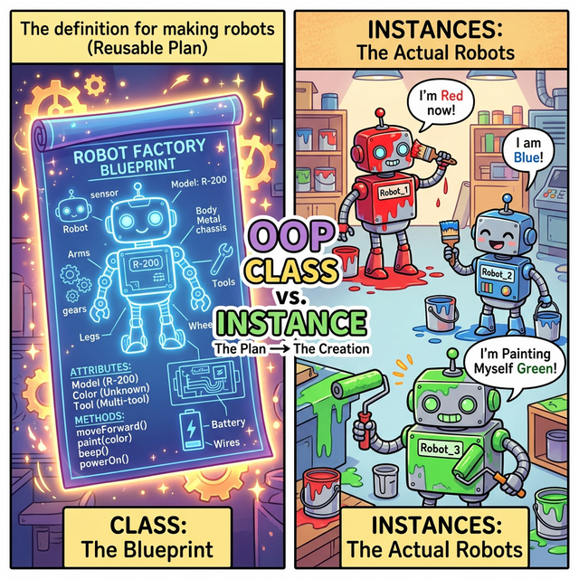

# 3.5.1 클래스와 인스턴스 (Class & Instance)

## 학습목표
본 장에서는 붕어빵을 끝없이 잉태해 내는 추상적인 황금 틀인 **'클래스(Class)'**와 제각각 다른 맛을 품고 그 틀에서 찍혀 나온 구체적인 실체인 **'인스턴스(Instance)'**의 차이를 명확하게 눈으로 확인합니다. 단순히 문법을 암기하는 것에서 벗어나, "왜 함수와 변수를 굳이 한 덩어리로 묶어서 관리해야 하는가?"라는 **유지보수 관점에서의 객체지향적 설계 철학(OOP Design)**을 깨우칩니다. 객체의 첫 숨을 불어넣는 생성자(`__init__`)의 역할과 원리를 투명하게 이해합니다.

---

## 💡 TL;DR (1분 핵심 요약): 객체지향 클래스란?

1. **클래스 (Class)**: 물건을 찍어내기 위한 종이 위 **"설계도"** 혹은 **"공장 라인"**입니다. 여기엔 아무런 실체(메모리)도, 색깔도 없습니다. 단순히 "로봇은 이름과 배터리가 있고, 걸을 수 있다"는 설계만 존재합니다.
2. **인스턴스 (Instance)**: 설계도를 통해 실제로 공장에서 철판을 조립해 만든 **"구체적인 로봇 실물 장난감"**입니다. 이 장난감들은 각자 다른 이름(Wall-E, R2D2)과 배터리 잔량을 가지며 독립적으로 움직입니다.
3. **설계의 핵심**: 파이썬은 **"상태를 나타내는 데이터(명사/변수)"**와 **"그 데이터를 조작하는 행동(동사/함수)"**을 하나로 튼튼하게 묶어버리기 위해 클래스를 도입했습니다. 이를 **캡슐화(Encapsulation)**라고 부릅니다.

---

## 1. 세상 모든 것을 찍어내는 마법의 설계도

파이썬의 세계에서는 숫자, 문자열, 리스트, 나아가 함수까지도 무언가의 설계도로부터 찍혀 나온 **모든 것이 객체(Object)**입니다. 우리가 직접 우리만의 독창적인 새로운 데이터 타입(설계도)을 정의할 때 `class`를 사용합니다.


*(웹툰 비유: 화면 왼쪽에는 추상적인 선방향만 그려져 있는 홀로그램 설계도(클래스)가 떠 있습니다. 그러나 현실 세계인 오른쪽에서는, 이 단 하나의 설계도로부터 빨간 페인트를 뒤집어쓴 로봇, 빗자루를 든 파란 로봇 등 '진짜 실체(인스턴스)'들이 끊임없이 조립되어 양산되고 있습니다.)*

---

## 2. 기본 문법: 선언과 탄생의 순간

클래스를 정의할 때는 `class` 키워드를 사용하며, 파이썬의 클래스 이름은 전통적으로 **파스칼 케이스(PascalCase: 단어의 첫 글자마다 대문자)**로 짓습니다.


### 예제 1: 빈 껍데기 설계도와 독립된 두 개의 개체
```python
# 1. 세상에 없던 나만의 '설계도(클래스)'를 하나 등록합니다.
class Robot:
    pass # 아직 내용은 텅 비어 있습니다.

# 2. 공장에 주문을 넣어 실물 장난감(인스턴스) 2대를 찍어냅니다!
robot_a = Robot()
robot_b = Robot()

print(type(robot_a)) # <class '__main__.Robot'>
print(robot_a == robot_b) # False (설계도만 같을 뿐, 각자 다른 메모리 집 주소를 가진 완전히 남남입니다!)
```

---

## 3. 생성자 (Constructor): 객체의 첫 숨결 `__init__`

공장에서 막 찍혀 나온 로봇은 이름도 색깔도 없는 깡통입니다. **객체가 이 세상에 태어나는 바로 그 0.1초의 찰나!** 가장 먼저 자동으로 한 번 실행되면서 로봇의 초기화 세팅(도색, 이름표 부착)을 강제로 집행하는 함수가 바로 **생성자 `__init__`** 입니다.

### 예제 2: 초기화 세일즈맨 `__init__`
```python
class Robot:
    # 파이썬 특수 매직 메서드 (양쪽 언더바 2개)
    # 로봇() 을 찍어내는 순간 무조건 제일 먼저 은밀하게 실행됩니다!
    def __init__(self, name, color):
        self.name = name   # 이 로봇의 명찰에 외부에서 받아온 name을 적습니다.
        self.color = color # 이 로봇의 도색을 외부에서 받아온 color로 칠합니다.
        print(f"삐릭! [{self.name}] 로봇({self.color}색) 초기화 완료!")

# 괄호 안에 값을 넘겨주면, 그 값들이 __init__ 메서드로 곧장 빨려 들어갑니다.
robot1 = Robot("R2D2", "White/Blue")
robot2 = Robot("C3PO", "Gold")

# robot1.name 은 R2D2, robot2.name 은 C3PO로 완벽히 격리된 데이터를 가집니다.
```

---

## ☕ Java vs 🐍 Python 스나이퍼 비교

### 생성자의 이름
*   **Java**: 생성자의 이름이 `public Robot()` 처럼 클래스 이름과 100% 똑같아야 합니다. 클래스 이름 바꾸면 생성자 이름도 싹 다 고쳐야 하는 번거로움이 있습니다.
*   **Python**: 클래스 이름이 Robot이든 Terminator든 상관없이, 생성자는 평생 고정된 예약어 마법인 `__init__` 하나만을 죽어라 씁니다.

---

## 코딩 영단어 학습 📝

*   **OOP (Object-Oriented Programming)**: 객체 지향 프로그래밍. (현실 세계의 사물들(물건, 무기, 몬스터, 자동차)을 있는 그대로 컴퓨터 속으로 복사해서 상태와 행동을 묶고 각자의 역할을 부여해 상호작용하게 만드는 위대한 설계주의 철학입니다.)
*   **Class**: 부류, 등급, 학급. (공통된 성질이나 규격을 분류해 놓은 종이 도면(Blueprint)입니다. '자동차 설계도'지 실제 굴러가는 람보르기니가 아닙니다.)
*   **Instance**: 사례, 경우, 구체적인 실체. (설계도 원본이 아니라, 그 도면을 보고 실제로 나사 하나하나 조여서 내 손에 만져지게 뚝딱 만들어져 나온 '실물 장난감 1호'를 뜻합니다.)
*   **Constructor (`__init__`)**: 생성자, 건설자. (건물을 처음 지을 때 가장 먼저 뼈대를 세우고 기초공사를 하듯, 객체가 태어날 때 가장 먼저 내부 변수(체력, 마나, 이름)를 초기 세팅해 주는 특별한 노동자 함수입니다.)
