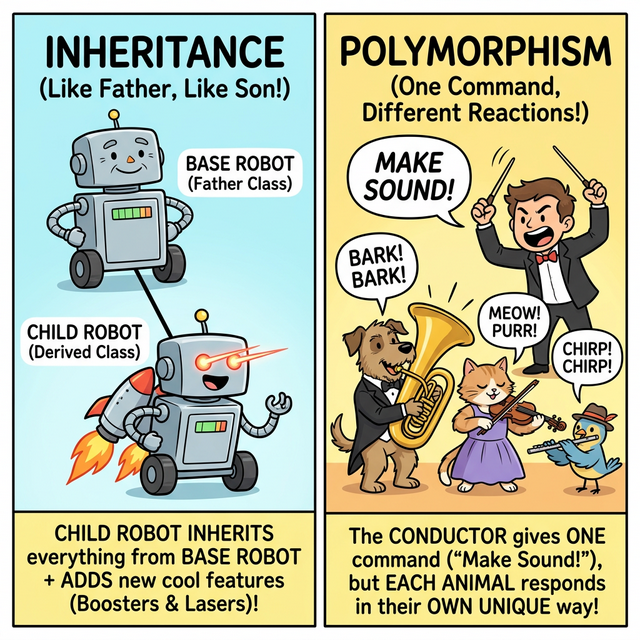

# 3.5.2 상속과 다형성 (Inheritance & Polymorphism)

## 학습목표
본 장에서는 부모가 피땀 흘려 짜놓은 수만 줄의 코드를 자식 클래스가 단 한 줄만으로 꿀꺽 삼키며 **수직적인 코드 재사용의 극치**를 보여주는 **'상속(Inheritance)'**의 원리를 다룹니다. 또한 부모의 간섭을 피해 내 입맛대로 행동을 갈아엎는 오버라이딩(Overriding)과, 똑같은 지시문(`울어라!`) 하나로 강아지는 짖고 고양이는 야옹하게 만드는 **'다형성(Polymorphism)'**의 마법 같은 쾌감을 통해 진정한 객체지향 설계의 확장성을 무기로 삼습니다.

---

## 💡 TL;DR (1분 핵심 요약): 상속과 다형성이란?

1. **상속 (Inheritance)**: "복사 & 붙여넣기는 하수나 하는 짓이다!" 부모 클래스가 가진 변수와 함수를 새로운 자식 클래스가 그대로 물려받아, 뼈대는 재활용하고 본인만의 새로운 기능(로켓 부스터, 레이저 빔)만 쏙쏙 추가하는 **진화의 과정**입니다.
2. **오버라이딩 (Overriding)**: 부모가 물려준 방식이 구식이라 마음에 안 들면, 자식이 똑같은 이름의 함수를 다시 만들어서 아예 **덮어써서(개조해서)** 사용합니다.
3. **다형성 (Polymorphism)**: 수백 마리의 다른 동물들을 리스트에 싹 다 가둬놓고, `동물.짖어라()` 단 한 줄만 명령하면, 강아지는 알아서 "멍멍!", 닭은 "꼬끼오!" 하고 각자의 생태계에 맞게 **똑똑하게 다르게 행동**하는 파이썬 최고의 마법입니다.

---

## 1. 상속: 부모의 유전자를 물려받는 진화 장치

객체지향(OOP)을 쓰는 절대적인 이유는 **'코드의 재사용성'**입니다. 똑같은 이름표와 배터리 속성을 가진 로봇을 100종류나 매번 처음부터 정의한다면 밤을 새워야 합니다. 상속은 이 고통을 끝내줍니다.


*(웹툰 비유: 화면 왼쪽(상속), 바퀴 하나 달린 구형 '부모 로봇' 옆에, 그 바퀴를 똑같이 물려받으면서도 제트팩과 레이저 눈을 추가 장착한 화려한 '자식 로봇'이 서 있습니다. 화면 오른쪽(다형성), 하나의 오케스트라 지휘자가 "소리 내!"라고 하나의 마법봉을 휘두르자, 똑같은 명령을 받은 강아지는 뼈다귀를 물고 짖고, 고양이는 야옹하고, 새는 짹짹우며 완벽한 하모니를 만들어 냅니다.)*

---

## 2. 기본 문법: 피를 이어받는 자식 클래스

### 예제 1: 부모의 능력은 나의 것 (기본 상속)
클래스를 새로 만들 때, 괄호 `()` 안에 물려받고 싶은 **부모(Super) 클래스**의 이름을 적어주기만 하면 끝입니다.

```python
# 1. 뼈대가 되는 위대한 부모 클래스 선언
class Animal:
    def __init__(self, name):
        self.name = name

    def eat(self):
        print(f"[{self.name}] 와구와구 밥을 먹습니다.")

# 2. 괄호 안에 Animal을 넣어 부모의 유전자를 모두 물려받은 자식 클래스
class Dog(Animal):
    # 부모에게 없는 나만의 새로운 필살기 추가!
    def bark(self):
        print(f"[{self.name}] 멍멍 짖습니다! 왈왈!")

class Cat(Animal):
    def meow(self):
        print(f"[{self.name}] 야옹하고 웁니다.")

# 3. 객체 실전 조종
dog1 = Dog("바둑이")
dog1.eat()  # 자식은 코드를 짠 적도 없는데 부모의 '먹기' 능력을 그대로 사용합니다.
dog1.bark() # 자신만의 고유 능력 방출!

cat1 = Cat("나비")
cat1.eat()
cat1.meow()
```

---

## 3. 부모님께 용돈 타오기: `super()` 의 마법

자식이 태어날 때 뭔가 자기만의 초기화 작업(`__init__`)을 하고 싶어서 생성자를 덮어쓰게 되면, **비극적이게도 부모가 초기화해주던 세팅(`name`)이 동작하지 않고 끊겨버립니다.** 이때 끊어진 부모의 생성자 파이프라인을 다시 연결해 주는 혈맹 코드가 바로 **`super()`** 입니다.



### 예제 2: 부모의 `__init__`을 강제 기상시키기
```python
class Bird(Animal):
    def __init__(self, name, wing_span):
        # 🚨 여기서 super().__init__(name)을 안 부르면 큰일 납니다!
        # 부모님, 제발 일어나서 제 '이름(name)' 좀 먼저 초기화 세팅해 주세요!
        super().__init__(name) 
        
        # 부모가 이름을 지어줬으니, 이제 제 고유 속성인 '날개 길이'를 세팅합니다.
        self.wing_span = wing_span 
        
    def fly(self):
        print(f"[{self.name}] 날개를 폅니다. 길이는 {self.wing_span}cm 입니다.")

bird1 = Bird("참새", 20)
bird1.eat() # name이 super()를 통해 완벽하게 세팅되어 오류 없이 밥을 먹습니다.
bird1.fly()
```

---

## 4. 부모를 딛고 일어서라: 오버라이딩 (Overriding)

부모에게 물려받은 기능이 낡고 구식이거나 내 입맛에 맞지 않나요? 그럼 자식 클래스 안에서 똑같은 이름의 스킬(메서드)을 다시 만들면 됩니다. 파이썬은 **망설임 없이 부모의 스킬을 폐기하고 자식의 최신 스킬로 덮어씌워(Override)** 줍니다.

### 예제 3: 부모의 행동 내 맘대로 개조하기
```python
class Duck(Animal):
    # 부모 Animal에도 eat()이 있지만, 오리답게 쪼아 먹도록 덮어씌웁니다! (오버라이딩)
    def eat(self):
        print(f"[{self.name}] 부리로 바닥의 곡물을 쪼아 먹습니다. 꽥꽥!")

duck1 = Duck("도널드")
duck1.eat() # 원본인 '와구와구 밥을 먹습니다'는 소멸하고, 오버라이딩된 결과가 나옵니다.
```

---

## 5. 다형성 (Polymorphism): 동일한 명령, 위대한 각자의 행동

'다형성'이란 이름표 하나로 여러 객체를 조종하는 객체지향의 궁극적인 마법입니다. **메인 지휘자(나의 코드)는 괄호 속의 동물이 강아지인지, 오리인지 조사할 필요 자체가 아예 없습니다.** 그냥 리스트에 다 때려 넣고 한 번만 지시하면 끝납니다.


### 예제 4: 100종류의 동물을 단 두 줄로 조종하는 기적
오버라이딩(Overriding)된 자식들이 각자 알아서 행동하기 때문에 코드가 극도로 짧아지고 우아해집니다.
```python
# 세상의 온갖 동물들을 하나의 큰 우리[리스트]에 다 집어넣어 버립니다.
animals = [Dog("멍멍이"), Cat("야옹이"), Duck("오리"), Animal("이름없는 괴수")]

# 지휘자 출격: 동물들의 종류 따위는 검사하지 않는다. 그냥 무조건 먹어라!
for animal in animals:
    animal.eat() 
```

**[다형성의 화려한 콘솔 출력]**
> [멍멍이] 와구와구 밥을 먹습니다.  
> [야옹이] 와구와구 밥을 먹습니다.  
> [오리] 부리로 바닥의 곡물을 쪼아 먹습니다. 꽥꽥!  *(<- 스스로 오버라이딩된 스킬 발동)*  
> [이름없는 괴수] 와구와구 밥을 먹습니다.  

이것이 파이썬 데이터 엔지너어들이 수백만 줄의 비즈니스 로직을 `if / elif / else` 떡칠 없이 깔끔하고 무제한 확장이 가능하도록 짜는 절대적인 비결입니다.

---

## ☕ Java vs 🐍 Python 스나이퍼 비교

### 1. 상속 선언 키워드
*   **Java**: `class Dog extends Animal` 이라는 길고 명시적인 키워드를 써야 합니다.
*   **Python**: 압도적으로 쿨합니다. 그냥 괄호만 치면 끝입니다. `class Dog(Animal):`

### 2. 고통스런 다중 상속의 유무
*   **Java**: 부모를 2명 이상 모시는 다중 상속(Multiple Inheritance)을 철저히 금지합니다. 피가 섞이면 복잡해진다고 강력히 규제하며 오직 인터페이스(`implements`)로만 우회시킵니다.
*   **Python**: "규제 그딴 거 없다. 네 자유다." 파이썬은 `class Liger(Lion, Tiger):` 처럼 당당하게 다중 상속을 지원합니다. MRO(메서드 탐색 순서)라는 내부 규칙으로 충돌을 알아서 정리합니다. (강력하지만, 설계의 복잡성을 초래하므로 고급 개발자들만 조심해서 다룹니다.)

### 3. 인터페이스와 덕 타이핑 (Duck Typing)
*   **Java**: 다형성을 구현하려면 철저한 계약서인 `Interface`를 설계해서 강제로 `implements` 시키고 족쇄를 채워야만 컴파일 에러를 피할 수 있습니다.
*   **Python**: 파이썬은 **"오리처럼 걷고 오리처럼 꽥꽥거리면, 그냥 오리인갑다 하고 넘어가자(Duck Typing)"**라는 매우 자유로운 심리학을 가집니다. 부모가 누구든, 인터페이스를 맺었든 말든 묻지 않습니다. 객체 안에 `eat()` 이라는 이름의 스킬만 진짜로 달려 있다면 파이썬은 군말 없이 실행해 주는 초유연성의 극치를 보여줍니다.

---

## 🎧 Vibe Coding

> **🗣️ 학생 프롬프트 (AI에게 이렇게 명령해 보세요):**
> "파이썬 다형성(Polymorphism)을 활용해서 스타크래프트 유닛 공격 시스템을 만들어 줘.
> 1) 부모 클래스 `Unit`을 만들고, 방어력(`armor`) 속성을 초기화해 줘. 그리고 비어있는 `attack()` 스킬을 만들어.
> 2) `Unit`을 상속받는 자식 클래스 `Marine`(마린)과 `Tank`(탱크) 두 개를 만들어 줘.
> 3) 자식들은 오버라이딩을 통해 `attack()` 스킬을 덮어써서 마린은 '두두두! 총 발사!', 탱크는 '쾅! 대포 발사!' 라고 출력하게 해. 
> 4) 리스트에 마린 2마리, 탱크 1마리를 넣고 딱 한 번의 `for` 문을 돌려서 모든 유닛이 동시에 `attack()` 하도록 명령하는 코드를 짜줘."

---

## 코딩 영단어 학습 📝

*   **Inheritance**: 상속, 유전. (부모가 자식에게 재산이나 DNA를 넘겨주듯, 코드를 복사 붙여넣기 할 필요 없이 부모의 스펙을 그대로 이어받는 시스템입니다.)
*   **Super**: 위쪽의, 초월적인. (`super()`의 본 뜻은 초인(슈퍼맨)이 아니라, 계급 구조상 내 머리 꼭대기 위에 있는 최상위 개체, 즉 나를 낳아 준 '부모 설계도'를 지칭하는 예약어입니다.)
*   **Override**: 짓밟다, 무시하다, 무효로 하다. (Over(위로) + Ride(타다). 부모의 낡고 구식인 메서드 지시 위로 자식이 새롭게 올라타서 기존 코드를 완전히 무시하고 산산조각 덮어씌워 버리는 혁명적인 키워드입니다.)
*   **Polymorphism**: 다형성. (Poly(많다) + Morphos(형태, 모양). 하나의 지시봉(함수명)을 휘둘렀는데, 바라보는 객체가 마린이냐 탱크냐 강아지냐에 따라 알아서 수만 가지의 다채로운 형태로 쪼개져 작동하는 가장 아름다운 객체지향 건축 미학입니다.)
