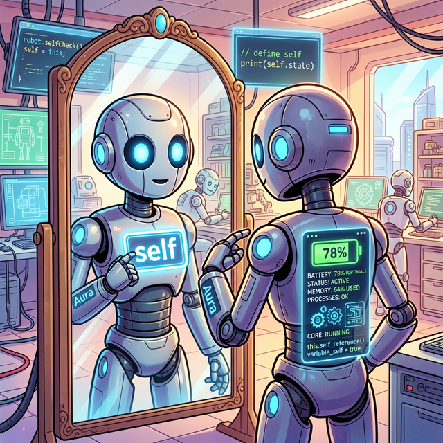
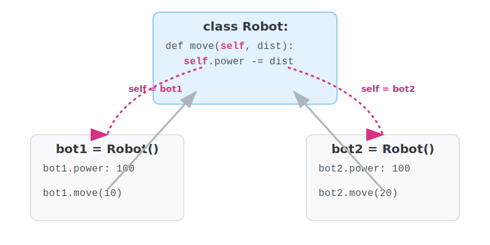

# 3.5.2 파이썬의 self (THIS)

## 학습목표
클래스 안의 가장 강력한 매직 코어이자 매개변수인 `self`의 정체를 통달합니다. 자바의 `this` 키워드와의 차이점을 이해하고, 왜 파이썬은 이토록 강박적으로 명시적인 `self`를 고집하는지 객체지향의 사상적 측면에서 파고듭니다.

---

## 💡 TL;DR (1분 핵심 요약): self란?

1. **self**: 공장에서 찍혀 나온 무수한 인스턴스(객체)들 중에서, **"지금 당장 행동을 취하고 있는 바로 그 '나 자신'"**을 가리키는 파이썬의 거울입니다. 자바나 C++의 `this`와 동일한 역할을 합니다.
2. **명시적 선언**: 파이썬에서는 클래스 내부의 일반 메서드를 선언할 때, **무조건 첫 번째 매개변수로 `self`를 적어 주어야만 합니다.**

---

## 1. 파이썬 최대의 수수께끼: `self`가 도대체 뭔가요?

클래스 안의 모든 괄호마다 귀신처럼 맨 앞자리를 꿰차고 있는 매개변수 `self`. 그 정체는 바로 **"공장에서 찍혀 나온 무수한 로봇 복제 인간들 중에서, 지금 당장 키보드 버튼을 눌러 행동하고 있는 바로 그 '나 자신(현재 인스턴스)'"**을 의미하는 거울입니다.


*(웹툰 비유: 거울을 바라보고 있는 로봇. 로봇의 가슴에는 'self'라는 빛나는 명찰이 붙어 있으며, 거울에 비친 자신의 모습(내부 배터리 잔량)을 들여다보고 있습니다. 아무리 수많은 로봇이 있어도, 이 로봇이 말하는 'self'는 오직 거울 앞의 '자기 자신'뿐입니다.)*

<br>


### 예제: `self`를 통한 행동 반경 제어
메서드(클래스 안에 소속된 함수)를 정의할 때, 무조건 무조건 첫 번째 매개변수로 `self`를 강제해야 합니다.

```python
class Robot:
    def __init__(self, name):
        self.name = name
        self.power = 100 # 기본 배터리는 100% 충전
        
    def say_hello(self): # 반드시 첫 파라미터는 self!
        print(f"안녕하세요! 저는 {self.name}입니다. 잔여 배터리: {self.power}%")
        
    def move(self, distance):
        self.power -= distance # '나 자신'의 배터리 창고에서 값을 빼야 합니다!
        print(f"위이잉~ {distance}m 이동완료. (현재 배터리: {self.power}%)")

# 로봇 조종 시작
bot = Robot("Wall-E")
bot.say_hello()

# 눈에 보이지 않지만, 파이썬은 내부적으로 bot.move(10) 을 Robot.move(bot, 10) 으로 변환해서 
# 10m를 움직인 로봇이 'bot'이라는 것을 self 자리에 주입해 줍니다!!
bot.move(15) 
bot.say_hello()
```

---

## 2. ☕ Java vs 🐍 Python 스나이퍼 비교

### `this` vs `self`
*   **Java**: 자바에서는 클래스 변수에 접근할 때 암시적으로 `this.` 키워드를 깔아줍니다(이름 충돌이 나지 않는 한 생략 가능). 컴파일러가 알아서 현재 객체 자원을 연결해줍니다.
*   **Python**: 파이썬은 **"명시적인 것이 암시적인 것보다 낫다"**는 무서운 철학을 고집합니다. 절대 자동으로 숨겨주지 않고, 네가 남의 변수를 건드리는지 네 자신의 속성을 건드리는지 모조리 `self.` 를 타이핑해서 육안상 명확히 구분하라고 혹독하게 강제합니다. (처음엔 귀찮아도 나중엔 버그를 막아주는 생명줄이 됩니다.)

---

## 코딩 영단어 학습 📝

*   **Self**: 자아, 자신. (클래스라는 하나의 뼈대 안에서 활동하지만, 결국 조작되는 메모리는 각 독립적인 '인스턴스(객체)'입니다. 내가 쏘는 미사일이 남의 배터리를 닳게 하지 않도록, 온전히 나의 내면 상태(변수)를 가리킬 때 쓰는 지시대명사입니다.)
*   **This**: 이것. (자바, C++, 자바스크립트 등 대다수 객체지향 언어에서 현재 인스턴스 자신을 가리키는 키워드입니다. 파이썬의 `self`와 근본적으로 하는 일이 같습니다.)
