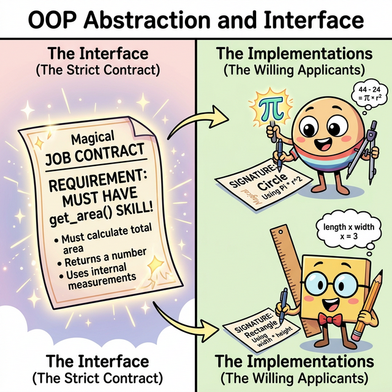

# 3.5.3 추상화와 인터페이스 (Abstraction & Interface)

## 학습목표
본 장에서는 깡통(몸통) 구현 없이 오직 자식 클래스가 하늘이 두 쪽 나도 지켜야만 하는 뼈대(규칙)만 세워두는 **'추상 베이스 클래스(ABC)'**의 악덕 고용주 같은 철저한 통제 시스템을 깨우칩니다. 파이썬만의 느슨하고 자유로운 '덕 타이핑(Duck Typing)' 문화 속에서도, 대형 프로젝트의 치명적인 에러를 원천 봉쇄하기 위해 견고한 **인터페이스(Interface) 계약서**를 어떻게 코드로 작성하고 강제하는지 실전 코드로 익힙니다.

---

## 💡 TL;DR (1분 핵심 요약): 추상화와 인터페이스란?

1. **추상 클래스 (Abstract Class)**: 직접 붕어빵을 찍어낼 수 없도록 막아놓은 **"미완성 설계도(계약서 원본)"**입니다. 수십 명의 협업자들이 각자의 모양대로 클래스를 만들 때, "반드시 이 기능만큼은 빼먹지 말고 똑같은 이름으로 구현해라!"라고 강제하는 법적 장치입니다.
2. **덕 타이핑 🦆 (Duck Typing)**: 자바처럼 서약서(`implements`)를 명시적으로 쓰지 않아도, 꽥꽥(필수 스킬) 소리만 낼 수 있다면 시스템이 용인해 주는 파이썬 특유의 자유로운 문화입니다.
3. **`abc` 모듈**: 덕 타이핑의 자유로움이 가져오는 '휴먼 에러(메서드명 오타, 미구현)'를 막기 위해, 파이썬에서 공식적으로 제공하는 추상화 강제 모듈입니다. 에러를 런타임(실행)이 아닌 객체 생성 파임에 칼같이 잡아냅니다.

---

## 1. 지켜야만 하는 단단한 약속, 추상화 계약서

협업 시 "도형을 만들 때는 넓이를 구하는 `get_area` 함수를 필수로 만들어 줘!"라고 말로만 부탁하면 누군가는 `area()`, 누군가는 `calculate_area()`로 각기 다르게 이름을 지어버려 결국 전체 시스템(다형성)이 붕괴됩니다. **추상화는 이 약속을 코드로 서명하게 만들고, 어기면 프로그램이 강제 종료되도록 통제합니다.**


*(웹툰 비유: 공중에 마법처럼 빛나는 "근로 계약서(인터페이스)"가 떠 있습니다. 동그라미(Circle) 지원자와 네모(Rectangle) 지원자는 그 계약서에 적힌 "반드시 `get_area()` 작업을 수행할 것"이라는 조항에 똑같이 사인합니다. 동그라미는 파이(π) 공구를 들고, 네모는 눈금자(W×H)를 들고 각자의 방식으로 완벽히 지시를 이행합니다.)*

---

## 2. 파이썬의 `abc` (Abstract Base Classes)

파이썬은 공식 내장 라이브러리인 `abc` 패키지를 통해 추상Base클래스를 작성할 수 있습니다.
*   자신은 절대로 인스턴스(객체)를 허락하지 않습니다.
*   `@abstractmethod` 라는 왕관(데코레이터)이 씌워진 스킬은, 자식이 반드시 복사해서 구현체를 오버라이딩(채워넣기)해야만 살려줍니다.


### 예제 1: 계약서는 실체가 아니다! (에러 발생의 미학)
```python
from abc import ABC, abstractmethod

# 1. 추상 베이스 클래스 선언 (반드시 괄호 안에 ABC를 넣습니다)
class Shape(ABC):
    
    # 이 메서드는 껍데기만 존재하며, 자식이 무조건 속을 채워야 합니다!
    @abstractmethod
    def get_area(self):
        pass

# 🚨 에러 폭발 테스트 🚨
# 무지몽매한 개발자가 계약서 원본(Shape) 자체를 장난감(객체)으로 조립하려고 합니다.
# 삐용삐용! "TypeError: 추상 클래스는 인스턴스화 될 수 없습니다!" 라며 파이썬이 즉각 차단합니다.
s = Shape() 
```

---

## 3. 계약 의무 불이행 시의 참사

이번엔 하청업체(자식 클래스 `Circle`)가 계약서(Shape)에 사인(상속)은 해놓고선, 실수로 `get_area` 구현을 빼먹었다고 가정해 봅시다.

```python
class Circle(Shape):
    def __init__(self, radius):
        self.radius = radius
        
    # 앗! 깜빡하고 @abstractmethod 인 get_area() 를 오버라이딩하지 않았습니다!

# 테스트: 자식 로봇을 가동합니다.
# c = Circle(5)
# 🚨 폭발! TypeError: 추상 메서드 get_area 가 구현되지 않아서 조립(인스턴스화) 불가!
```
코드가 다 실행되고 나서 한참 뒤에 에러가 터지는 대참사 대신, 아예 태어나는 순간 조립을 막아버려 개발자에게 실수를 즉각 알려줍니다.

---

## 4. 확고한 계약 이행과 다형성의 승리

안전 장치를 뚫고 완벽하게 규격을 맞춘 모범 답안을 보겠습니다.


### 예제 2: 각자의 방식으로 계약 이행
```python
import math

# 동그라미: 자신만의 파이(π) 방식을 사용하여 완벽하게 구현을 해냈습니다!
class Circle(Shape):
    def __init__(self, radius):
        self.radius = radius
        
    def get_area(self): # 계약서에 명시된 이름 토시 하나 틀리지 않음
        return math.pi * (self.radius ** 2)

# 네모: 자신만의 (가로 * 세로) 공식을 사용하여 완벽하게 구현을 해냈습니다!
class Rectangle(Shape):
    def __init__(self, w, h):
        self.w = w
        self.h = h
        
    def get_area(self): # 계약서 조항 완벽 이행
        return self.w * self.h

# ✅ 통과! 에러 없이 부드럽게 실체화됩니다.
c = Circle(5)
r = Rectangle(4, 5)

print(f"원 넓이: {c.get_area()} | 사각형 넓이: {r.get_area()}")
```
이 깐깐한 인터페이스(Interface) 계약서 제도가 정착되면, 메인 지휘자는 "이 도형이 원인지 네모인지" 검사할 필요 없이 눈을 감고 `도형.get_area()`를 마음껏 호출하며 다형성을 폭발시킬 수 있습니다.

---

## ☕ Java vs 🐍 Python 스나이퍼 비교

### 1. 전용 키워드의 유무
*   **Java**: `interface`, `implements`, `abstract` 라는 전용 문법 키워드가 언어 스펙에 하드코딩 되어있을 정도로 인터페이스 설계의 심장 같은 언어입니다.
*   **Python**: 인터페이스라는 전용 키워드가 아예 없습니다! 오직 외부 플러그인 같은 느낌의 `from abc import ABC` 패키지를 끌어앉고 `class Shape(ABC):` 와 같이 우회하여 구현합니다.

### 2. 덕 타이핑 (Duck Typing)의 용인
*   **Java**: 인터페이스 계약서(`implements Animal`)에 사인하지 않은 객체는, 아무리 `eat()` 함수를 완벽하게 구현했어도 결코 다형성 리스트에 들어갈 수 없습니다. 엄청나게 고지식합니다.
*   **Python**: 파이썬은 호탕합니다. 굳이 `Shape(ABC)` 가문 소속이라고 사인해주지 않았더라도, 객체 배때지에 누군가 몰래 `get_area()` 함수 하나만 끼워놓았다면, 다형성 리스트에서 군말 없이 정상 실행시켜 버립니다. "오리 소리가 나면 그냥 오리지 족보가 뭐가 중요해!" 마인드입니다.

---

## 🎧 Vibe Coding

> **🗣️ 학생 프롬프트 (AI에게 이렇게 명령해 보세요):**
> "파이썬 `abc` 패키지를 이용해서 `Payment`(결제)라는 추상 클래스를 만들어줘.
> 1) `process_payment(amount)` 라는 추상 메서드(@abstractmethod)를 딱 하나만 선언해.
> 2) 이걸 상속받는 자식 클래스 `CreditCard` 랑 `Paypal` 두 개를 만들고, `process_payment`를 정상적으로 오버라이딩해서 알아서 콘솔에 결제수단과 금액을 출력하게 해. 
> 3) 마지막으로 `Bitcoin` 클래스도 `Payment`를 상속받게 만드는데, 고의로 `process_payment` 구축을 빼먹(pass)어봐.
> 4) 세 개의 클래스를 직접 다 실체화(인스턴스 생성) 하려고 시도해 보고 어떤 콘솔 에러가 터지는지, 그 이유를 내게 아주 쉽게 주석으로 타이핑해 줘."

---

## 코딩 영단어 학습 📝

*   **Abstraction**: 추상화. (Abstract(추상적인). 구체적인 디테일이나 계산 로직은 껍데기에 감춰버리고, 오직 바깥으로 드러나는 핵심 개념(버튼 이름, 함수 이름) 스케치만 남겨 하위 조립자들에게 "여기에 맞춰서 짜기만 해!"를 지시하는 설계 기법입니다.)
*   **Interface**: 경계면, 소통 접점. (Inter(사이) + Face(얼굴). 자판기를 쓸 때 안에 복잡한 회로도 몰라도 '동전 구멍'과 '콜라 버튼'만 누르면 작동하듯이, 클래스와 클래스 사이의 사용 약속 계약서 명세를 의미합니다.)
*   **Duck Typing**: 덕 타이핑. ("만약 어떤 동물이 오리처럼 생겼고, 오리처럼 헤엄치고, 오리처럼 꽥꽥 소리를 낸다면, 우리는 그걸 그냥 오리라고 부른다."라는 유명한 미국 시에서 유래한 프로그래밍 언어의 쿨하고 동적인 성향을 뜻합니다.)
