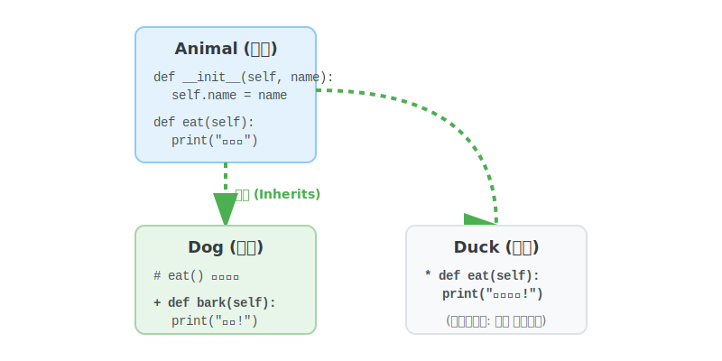

# 3.5.3 상속 (Inheritance)

## 학습목표
본 장에서는 부모가 피땀 흘려 짜놓은 수만 줄의 코드를 자식 클래스가 단 한 줄만으로 꿀꺽 삼키며 **수직적인 코드 재사용의 극치**를 보여주는 **'상속(Inheritance)'**의 원리를 다룹니다. 또한 부모의 간섭을 피해 내 입맛대로 행동을 갈아엎는 오버라이딩(Overriding)을 통해 코드 중복을 줄이고 구조를 확장하는 방법을 알아봅니다.

---

## 💡 TL;DR (1분 핵심 요약): 상속이란?

1. **상속 (Inheritance)**: "복사 & 붙여넣기는 하수나 하는 짓이다!" 부모 클래스가 가진 변수와 함수를 새로운 자식 클래스가 그대로 물려받아, 뼈대는 재활용하고 본인만의 새로운 기능(로켓 부스터, 레이저 빔)만 쏙쏙 추가하는 **진화의 과정**입니다.
2. **오버라이딩 (Overriding)**: 부모가 물려준 방식이 구식이라 마음에 안 들면, 자식이 똑같은 이름의 함수를 다시 만들어서 아예 **덮어써서(개조해서)** 사용하는 기법입니다.

---

## 1. 상속: 부모의 유전자를 물려받는 진화 장치

객체지향(OOP)을 쓰는 절대적인 이유는 **'코드의 재사용성'**입니다. 똑같은 이름표와 배터리 속성을 가진 로봇을 100종류나 매번 처음부터 정의한다면 밤을 새워야 합니다. 상속은 이 고통을 끝내줍니다.


*(웹툰 비유: 화면 왼쪽, 바퀴 하나 달린 구형 '부모 로봇' 옆에, 그 바퀴를 똑같이 물려받으면서도 제트팩과 레이저 눈을 추가 장착한 화려한 '자식 로봇'이 서 있습니다.)*

<br>



---

## 2. 기본 문법: 피를 이어받는 자식 클래스

### 예제 1: 부모의 능력은 나의 것 (기본 상속)
클래스를 새로 만들 때, 괄호 `()` 안에 물려받고 싶은 **부모(Super) 클래스**의 이름을 적어주기만 하면 끝입니다.

```python
# 1. 뼈대가 되는 위대한 부모 클래스 선언
class Animal:
    def __init__(self, name):
        self.name = name

    def eat(self):
        print(f"[{self.name}] 와구와구 밥을 먹습니다.")

# 2. 괄호 안에 Animal을 넣어 부모의 유전자를 모두 물려받은 자식 클래스
class Dog(Animal):
    # 부모에게 없는 나만의 새로운 필살기 추가!
    def bark(self):
        print(f"[{self.name}] 멍멍 짖습니다! 왈왈!")

class Cat(Animal):
    def meow(self):
        print(f"[{self.name}] 야옹하고 웁니다.")

# 3. 객체 실전 조종
dog1 = Dog("바둑이")
dog1.eat()  # 자식은 코드를 짠 적도 없는데 부모의 '먹기' 능력을 그대로 사용합니다.
dog1.bark() # 자신만의 고유 능력 방출!

cat1 = Cat("나비")
cat1.eat()
cat1.meow()
```

---

## 3. 부모님께 용돈 타오기: `super()` 의 마법

자식이 태어날 때 뭔가 자기만의 초기화 작업(`__init__`)을 하고 싶어서 생성자를 덮어쓰게 되면, **비극적이게도 부모가 초기화해주던 세팅(`name`)이 동작하지 않고 끊겨버립니다.** 이때 끊어진 부모의 생성자 파이프라인을 다시 연결해 주는 혈맹 코드가 바로 **`super()`** 입니다.


### 예제 2: 부모의 `__init__`을 강제 기상시키기
```python
class Bird(Animal):
    def __init__(self, name, wing_span):
        # 🚨 여기서 super().__init__(name)을 안 부르면 큰일 납니다!
        # 부모님, 제발 일어나서 제 '이름(name)' 좀 먼저 초기화 세팅해 주세요!
        super().__init__(name) 
        
        # 부모가 이름을 지어줬으니, 이제 제 고유 속성인 '날개 길이'를 세팅합니다.
        self.wing_span = wing_span 
        
    def fly(self):
        print(f"[{self.name}] 날개를 폅니다. 길이는 {self.wing_span}cm 입니다.")

bird1 = Bird("참새", 20)
bird1.eat() # name이 super()를 통해 완벽하게 세팅되어 오류 없이 밥을 먹습니다.
bird1.fly()
```

---

## 4. 부모를 딛고 일어서라: 오버라이딩 (Overriding)

부모에게 물려받은 기능이 낡고 구식이거나 내 입맛에 맞지 않나요? 그럼 자식 클래스 안에서 똑같은 이름의 스킬(메서드)을 다시 만들면 됩니다. 파이썬은 **망설임 없이 부모의 스킬을 폐기하고 자식의 최신 스킬로 덮어씌워(Override)** 줍니다.

### 예제 3: 부모의 행동 내 맘대로 개조하기
```python
class Duck(Animal):
    # 부모 Animal에도 eat()이 있지만, 오리답게 쪼아 먹도록 덮어씌웁니다! (오버라이딩)
    def eat(self):
        print(f"[{self.name}] 부리로 바닥의 곡물을 쪼아 먹습니다. 꽥꽥!")

duck1 = Duck("도널드")
duck1.eat() # 원본인 '와구와구 밥을 먹습니다'는 소멸하고, 오버라이딩된 결과가 나옵니다.
```

---

## ☕ Java vs 🐍 Python 스나이퍼 비교

### 1. 상속 선언 키워드
*   **Java**: `class Dog extends Animal` 이라는 길고 명시적인 키워드를 써야 합니다.
*   **Python**: 압도적으로 쿨합니다. 그냥 괄호만 치면 끝입니다. `class Dog(Animal):`

### 2. 고통스런 다중 상속의 유무
*   **Java**: 부모를 2명 이상 모시는 다중 상속(Multiple Inheritance)을 철저히 금지합니다. 피가 섞이면 복잡해진다고 강력히 규제하며 오직 인터페이스(`implements`)로만 우회시킵니다.
*   **Python**: "규제 그딴 거 없다. 네 자유다." 파이썬은 `class Liger(Lion, Tiger):` 처럼 당당하게 다중 상속을 지원합니다. MRO(메서드 탐색 순서)라는 내부 규칙으로 충돌을 알아서 정리합니다. (강력하지만, 설계의 복잡성을 초래하므로 고급 개발자들만 조심해서 다룹니다.)

---

## 코딩 영단어 학습 📝

*   **Inheritance**: 상속, 유전. (부모가 자식에게 재산이나 DNA를 넘겨주듯, 코드를 복사 붙여넣기 할 필요 없이 부모의 스펙을 그대로 이어받는 시스템입니다.)
*   **Super**: 위쪽의, 초월적인. (`super()`의 본 뜻은 초인(슈퍼맨)이 아니라, 계급 구조상 내 머리 꼭대기 위에 있는 최상위 개체, 즉 나를 낳아 준 '부모 설계도'를 지칭하는 예약어입니다.)
*   **Override**: 짓밟다, 무시하다, 무효로 하다. (Over(위로) + Ride(타다). 부모의 낡고 구식인 메서드 지시 위로 자식이 새롭게 올라타서 기존 코드를 완전히 무시하고 산산조각 덮어씌워 버리는 혁명적인 키워드입니다.)
