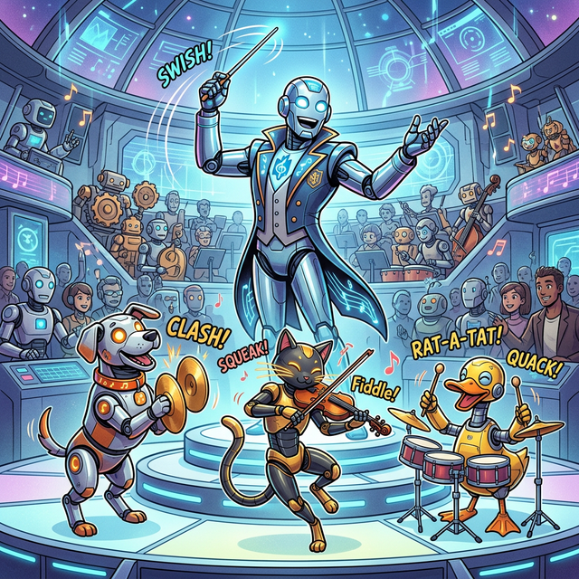
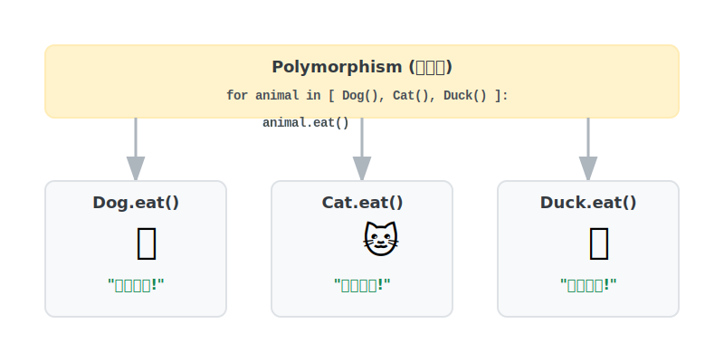

# 3.5.4 다형성 (Polymorphism)

## 학습목표
본 장에서는 똑같은 지시문(`울어라!`) 하나로 강아지는 짖고 고양이는 야옹하게 만드는 **'다형성(Polymorphism)'**의 마법 같은 쾌감을 통해 진정한 객체지향 설계의 확장성을 무기로 삼습니다. 동일한 코드가 다양한 모습으로 실행되는 방법을 완벽히 이해합니다.

---

## 💡 TL;DR (1분 핵심 요약): 다형성이란?

1. **다형성 (Polymorphism)**: 수백 마리의 다른 동물들을 리스트에 싹 다 가둬놓고, `동물.짖어라()` 단 한 줄만 명령하면, 강아지는 알아서 "멍멍!", 닭은 "꼬끼오!" 하고 각자의 생태계에 맞게 **똑똑하게 다르게 행동**하는 파이썬 최고의 마법입니다.

---

## 1. 다형성 (Polymorphism): 동일한 명령, 위대한 각자의 행동

'다형성'이란 이름표 하나로 여러 객체를 조종하는 객체지향의 궁극적인 마법입니다. 이전 장에서 배운 추상화나 오버라이딩을 활용하여 자식 클래스가 부모의 메서드를 새롭게 재정의하면, 메인 프로그램은 그 자식의 정확한 종류를 모른 채 동일한 지침으로 다루기만 해도 알아서 적절히 동작합니다.

**메인 지휘자(나의 코드)는 괄호 속의 동물이 강아지인지, 오리인지 조사할 필요 자체가 아예 없습니다.** 그냥 리스트에 다 때려 넣고 한 번만 지시하면 끝납니다.


*(웹툰 비유: 하나의 지휘자 로봇이 "연주해!"라고 단 한 번 마법봉을 휘두릅니다. 똑같은 명령을 받은 강아지 로봇은 바이올린을, 고양이 로봇은 피아노를, 오리 로봇은 드럼을 치며 각자의 방식으로 완벽한 교향곡을 만들어냅니다.)*

<br>


### 예제: 100종류의 동물을 단 두 줄로 조종하는 기적
오버라이딩(Overriding)된 자식들이 각자 알아서 행동하기 때문에 코드가 극도로 짧아지고 우아해집니다.

```python
class Animal:
    def eat(self):
        print("동물이 먹이를 먹습니다.")

class Dog(Animal):
    def eat(self):
        print("[멍멍이] 와구와구 밥을 먹습니다.")

class Cat(Animal):
    def eat(self):
        print("[야옹이] 와구와구 밥을 먹습니다.")

class Duck(Animal):
    def eat(self):
        print("[오리] 부리로 바닥의 곡물을 쪼아 먹습니다. 꽥꽥!")

# 세상의 온갖 동물들을 하나의 큰 우리[리스트]에 다 집어넣어 버립니다.
animals = [Dog(), Cat(), Duck(), Animal()]

# 지휘자 출격: 동물들의 종류 따위는 검사하지 않는다. 그냥 무조건 먹어라!
for animal in animals:
    animal.eat() 
```

**[다형성의 화려한 콘솔 출력]**
> [멍멍이] 와구와구 밥을 먹습니다.  
> [야옹이] 와구와구 밥을 먹습니다.  
> [오리] 부리로 바닥의 곡물을 쪼아 먹습니다. 꽥꽥! *(<- 스스로 오버라이딩된 스킬 발동)*  
> 동물이 먹이를 먹습니다.  

이것이 파이썬 데이터 엔지너어들이 수백만 줄의 비즈니스 로직을 `if / elif / else` 떡칠 없이 깔끔하고 무제한 확장이 가능하도록 짜는 절대적인 비결입니다.

---

## ☕ Java vs 🐍 Python 스나이퍼 비교

### 1. 인터페이스와 덕 타이핑 (Duck Typing)
*   **Java**: 다형성을 구현하려면 철저한 계약서인 `Interface`를 설계해서 강제로 `implements` 시키고 족쇄를 채워야만 컴파일 에러를 피할 수 있습니다.
*   **Python**: 파이썬은 **"오리처럼 걷고 오리처럼 꽥꽥거리면, 그냥 오리인갑다 하고 넘어가자(Duck Typing)"**라는 매우 자유로운 심리학을 가집니다. 부모가 누구든, 인터페이스를 맺었든 말든 묻지 않습니다. 객체 안에 `eat()` 이라는 이름의 스킬만 진짜로 달려 있다면 파이썬은 군말 없이 실행해 주는 초유연성의 극치를 보여줍니다.

---

## 🎧 Vibe Coding

> **🗣️ 학생 프롬프트 (AI에게 이렇게 명령해 보세요):**
> "파이썬 다형성(Polymorphism)을 활용해서 스타크래프트 유닛 공격 시스템을 만들어 줘.
> 1) 부모 클래스 `Unit`을 만들고, 방어력(`armor`) 속성을 초기화해 줘. 그리고 비어있는 `attack()` 스킬을 만들어.
> 2) `Unit`을 상속받는 자식 클래스 `Marine`(마린)과 `Tank`(탱크) 두 개를 만들어 줘.
> 3) 자식들은 오버라이딩을 통해 `attack()` 스킬을 덮어써서 마린은 '두두두! 총 발사!', 탱크는 '쾅! 대포 발사!' 라고 출력하게 해. 
> 4) 리스트에 마린 2마리, 탱크 1마리를 넣고 딱 한 번의 `for` 문을 돌려서 모든 유닛이 동시에 `attack()` 하도록 명령하는 코드를 짜줘."

---

## 코딩 영단어 학습 📝

*   **Polymorphism**: 다형성. (Poly(많다) + Morphos(형태, 모양). 하나의 지시봉(함수명)을 휘둘렀는데, 바라보는 객체가 마린이냐 탱크냐 강아지냐에 따라 알아서 수만 가지의 다채로운 형태로 쪼개져 작동하는 가장 아름다운 객체지향 건축 미학입니다.)
