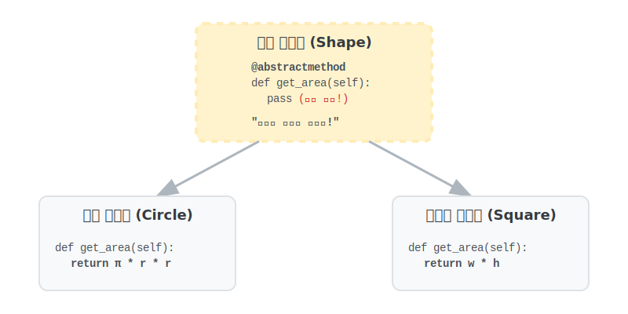

# 3.5.5 추상화 (Abstraction)

## 학습목표
본 장에서는 깡통(몸통) 구현 없이 오직 자식 클래스가 하늘이 두 쪽 나도 지켜야만 하는 뼈대(규칙)만 세워두는 **'추상 베이스 클래스(ABC)'**의 악덕 고용주 같은 철저한 통제 시스템을 깨우칩니다. 공통적인 속성과 행위를 모아 상위 클래스를 설계하는 방법을 배웁니다.

---

## 💡 TL;DR (1분 핵심 요약): 추상화란?

1. **추상 클래스 (Abstract Class)**: 직접 붕어빵을 찍어낼 수 없도록 막아놓은 **"미완성 설계도(계약서 원본)"**입니다. 수십 명의 협업자들이 각자의 모양대로 클래스를 만들 때, "반드시 이 기능만큼은 빼먹지 말고 똑같은 이름으로 구현해라!"라고 강제하는 법적 장치입니다.
2. **`abc` 모듈**: 덕 타이핑의 자유로움이 가져오는 '휴먼 에러(메서드명 오타, 미구현)'를 막기 위해, 파이썬에서 공식적으로 제공하는 추상화 강제 모듈입니다. 에러를 런타임(실행)이 아닌 객체 생성시에 칼같이 잡아냅니다.

---

## 1. 지켜야만 하는 단단한 약속, 추상화 설계

협업 시 "도형을 만들 때는 넓이를 구하는 `get_area` 함수를 필수로 만들어 줘!"라고 말로만 부탁하면 누군가는 `area()`, 누군가는 `calculate_area()`로 각기 다르게 이름을 지어버려 결국 전체 시스템(다형성)이 붕괴됩니다. **추상화는 이 약속을 코드로 서명하게 만들고, 어기면 프로그램이 강제 종료되도록 통제합니다.**

---

## 2. 파이썬의 `abc` (Abstract Base Classes)

파이썬은 공식 내장 라이브러리인 `abc` 패키지를 통해 추상Base클래스를 작성할 수 있습니다.
*   자신은 절대로 인스턴스(객체)를 허락하지 않습니다.
*   `@abstractmethod` 라는 왕관(데코레이터)이 씌워진 스킬은, 자식이 반드시 복사해서 구현체를 오버라이딩(채워넣기)해야만 살려줍니다.


*(웹툰 비유: 깐깐한 로봇 매니저가 일부분이 텅 비어 있는 추상적인 계약서(Shape)를 들고, 원형 로봇과 사각형 로봇에게 서명을 지시합니다. 이 계약서에는 "너희 몸통(면적)을 어떻게든 스스로 증명하라!"는 빈칸 조항이 강제되어 있습니다.)*

<br>


### 예제 1: 추상 클래스는 실체가 아니다! (에러 발생의 미학)
```python
from abc import ABC, abstractmethod

# 1. 추상 베이스 클래스 선언 (반드시 괄호 안에 ABC를 넣습니다)
class Shape(ABC):
    
    # 이 메서드는 껍데기만 존재하며, 자식이 무조건 속을 채워야 합니다!
    @abstractmethod
    def get_area(self):
        pass

# 🚨 에러 폭발 테스트 🚨
# 무지몽매한 개발자가 계약서 원본(Shape) 자체를 장난감(객체)으로 조립하려고 합니다.
# 삐용삐용! "TypeError: 추상 클래스는 인스턴스화 될 수 없습니다!" 라며 파이썬이 즉각 차단합니다.
s = Shape() 
```

---

## 3. 필수 구현 의무 불이행 시의 참사

이번엔 하청업체(자식 클래스 `Circle`)가 추상 클래스(Shape)를 상속은 해놓고선, 실수로 `get_area` 구현을 빼먹었다고 가정해 봅시다.

```python
class Circle(Shape):
    def __init__(self, radius):
        self.radius = radius
        
    # 앗! 깜빡하고 @abstractmethod 인 get_area() 를 오버라이딩하지 않았습니다!

# 테스트: 자식 로봇을 가동합니다.
# c = Circle(5)
# 🚨 폭발! TypeError: 추상 메서드 get_area 가 구현되지 않아서 조립(인스턴스화) 불가!
```
코드가 다 실행되고 나서 한참 뒤에 에러가 터지는 대참사 대신, 아예 태어나는 순간 조립을 막아버려 개발자에게 실수를 즉각 알려줍니다.

---

## 🎧 Vibe Coding

> **🗣️ 학생 프롬프트 (AI에게 이렇게 명령해 보세요):**
> "파이썬 `abc` 패키지를 이용해서 `Payment`(결제)라는 추상 클래스를 만들어줘.
> 1) `process_payment(amount)` 라는 추상 메서드(@abstractmethod)를 딱 하나만 선언해.
> 2) 이걸 상속받는 자식 클래스 `CreditCard` 랑 `Paypal` 두 개를 만들고, `process_payment`를 정상적으로 오버라이딩해서 알아서 콘솔에 결제수단과 금액을 출력하게 해. 
> 3) 마지막으로 `Bitcoin` 클래스도 `Payment`를 상속받게 만드는데, 고의로 `process_payment` 구축을 빼먹(pass)어봐.
> 4) 세 개의 클래스를 직접 다 실체화(인스턴스 생성) 하려고 시도해 보고 어떤 콘솔 에러가 터지는지, 그 이유를 내게 아주 쉽게 주석으로 타이핑해 줘."

---

## 코딩 영단어 학습 📝

*   **Abstraction**: 추상화. (Abstract(추상적인). 구체적인 디테일이나 계산 로직은 껍데기에 감춰버리고, 오직 바깥으로 드러나는 핵심 개념(버튼 이름, 함수 이름) 스케치만 남겨 하위 조립자들에게 "여기에 맞춰서 짜기만 해!"를 지시하는 설계 기법입니다.)
