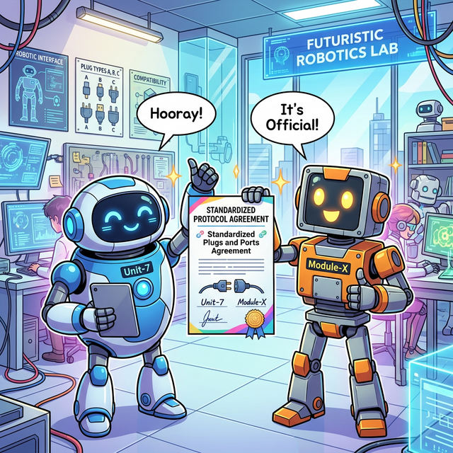
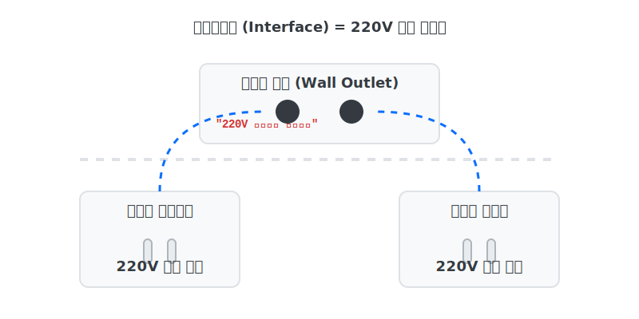

# 3.5.6 인터페이스 (Interface)

## 학습목표
본 장에서는 클래스와 클래스 사이의 사용 약속인 **인터페이스(Interface)**를 배웁니다. 파이썬만의 느슨하고 자유로운 '덕 타이핑(Duck Typing)' 문화 속에서도, 대형 프로젝트의 치명적인 에러를 원천 봉쇄하기 위해 견고한 인터페이스 계약서를 어떻게 코드로 작성하고 강제하는지 실전 코드로 익힙니다.

---

## 💡 TL;DR (1분 핵심 요약): 인터페이스란?

1. **인터페이스 (Interface)**: "반드시 이 기능만큼은 빼먹지 말고 구현해라!"라는 기능 명세, 즉 계약서 역할을 기대하는 것입니다. 파이썬에서는 별도의 `interface` 키워드가 없기에 보통 추상 클래스(`abc`)나 덕 타이핑을 통해 이를 달성합니다.
2. **덕 타이핑 🦆 (Duck Typing)**: 자바처럼 서약서(`implements`)를 명시적으로 쓰지 않아도, 꽥꽥(필수 스킬) 소리만 낼 수 있다면 시스템이 용인해 주는 파이썬 특유의 자유로운 문화입니다.

---

## 1. 인터페이스 계약 의무의 완벽한 이행과 다형성

이전 장(`추상화`)의 `Shape` 추상 클래스가 제시한 안전 장치를 뚫고, 완벽하게 인터페이스 규격을 맞춘 모범 답안을 보겠습니다.


*(웹툰 비유: 동그라미 로봇과 네모 로봇이 겉모습은 전혀 다르지만, 둘 다 완벽히 똑같은 규격의 "220V 표준 플러그"를 번쩍 들고 환호합니다. 220V 소켓 입장에서 저 로봇이 동그라미든 네모든 알 바 아닙니다. 규격에 맞는 플러그만 꽂히면 전기를 통하게 해 줍니다.)*

<br>



### 예제: 각자의 방식으로 계약 이행
```python
import math
from abc import ABC, abstractmethod

class Shape(ABC):
    @abstractmethod
    def get_area(self):
        pass

# 동그라미: 자신만의 파이(π) 방식을 사용하여 완벽하게 구현을 해냈습니다!
class Circle(Shape):
    def __init__(self, radius):
        self.radius = radius
        
    def get_area(self): # 계약서에 명시된 이름 토시 하나 틀리지 않음
        return math.pi * (self.radius ** 2)

# 네모: 자신만의 (가로 * 세로) 공식을 사용하여 완벽하게 구현을 해냈습니다!
class Rectangle(Shape):
    def __init__(self, w, h):
        self.w = w
        self.h = h
        
    def get_area(self): # 계약서 조항 완벽 이행
        return self.w * self.h

# ✅ 통과! 에러 없이 부드럽게 실체화됩니다.
c = Circle(5)
r = Rectangle(4, 5)

print(f"원 넓이: {c.get_area()} | 사각형 넓이: {r.get_area()}")
```
이 깐깐한 인터페이스(Interface) 계약서 제도가 정착되면, 메인 지휘자는 "이 도형이 원인지 네모인지" 검사할 필요 없이 눈을 감고 `도형.get_area()`를 마음껏 호출하며 다형성을 폭발시킬 수 있습니다.

---

## 2. ☕ Java vs 🐍 Python 스나이퍼 비교

### 1. 전용 키워드의 유무
*   **Java**: `interface`, `implements`, `abstract` 라는 전용 문법 키워드가 언어 스펙에 하드코딩 되어있을 정도로 인터페이스 설계의 심장 같은 언어입니다.
*   **Python**: 인터페이스라는 전용 키워드가 아예 없습니다! 오직 외부 플러그인 같은 느낌의 `from abc import ABC` 패키지를 끌어앉고 `class Shape(ABC):` 와 같이 우회하여 구현합니다.

### 2. 덕 타이핑 (Duck Typing)의 용인
*   **Java**: 인터페이스 계약서(`implements Animal`)에 사인하지 않은 객체는, 아무리 `eat()` 함수를 완벽하게 구현했어도 결코 다형성 리스트에 들어갈 수 없습니다. 엄청나게 고지식합니다.
*   **Python**: 파이썬은 호탕합니다. 굳이 `Shape(ABC)` 가문 소속이라고 사인해주지 않았더라도, 객체 배때지에 누군가 몰래 `get_area()` 함수 하나만 끼워놓았다면, 다형성 리스트에서 군말 없이 정상 실행시켜 버립니다. "오리 소리가 나면 그냥 오리지 족보가 뭐가 중요해!" 마인드입니다.

---

## 🎧 Vibe Coding

> **🗣️ 학생 프롬프트 (AI에게 이렇게 명령해 보세요):**
> "파이썬으로 '오리(Duck)'와 '로봇 오리(RobotDuck)' 클래스를 만들어줘. 
> 공통 부모를 상속받거나 `abc`를 사용하지 말고, 둘 다 각각 `quack()` 이라는 메서드만 갖게 해. 
> 외부에서 어떤 리스트에 담긴 객체들을 넘겨받아서, 그 객체들의 타입이 뭔지 전혀 확인하지 않고 무작정 `.quack()`을 호출해보는 `make_it_quack` 함수를 만들어 줘.
> 그리고 이게 왜 파이썬의 '덕 타이핑'이라는 매력인지 초보자에게 쉽고 재치있게 주석으로 설명해 줘."

---

## 코딩 영단어 학습 📝

*   **Interface**: 경계면, 소통 접점. (Inter(사이) + Face(얼굴). 자판기를 쓸 때 안에 복잡한 회로도 몰라도 '동전 구멍'과 '콜라 버튼'만 누르면 작동하듯이, 클래스와 클래스 사이의 사용 약속 계약서 명세를 의미합니다.)
*   **Duck Typing**: 덕 타이핑. ("만약 어떤 동물이 오리처럼 생겼고, 오리처럼 헤엄치고, 오리처럼 꽥꽥 소리를 낸다면, 우리는 그걸 그냥 오리라고 부른다."라는 유명한 미국 시에서 유래한 프로그래밍 언어의 쿨하고 동적인 성향을 뜻합니다.)
