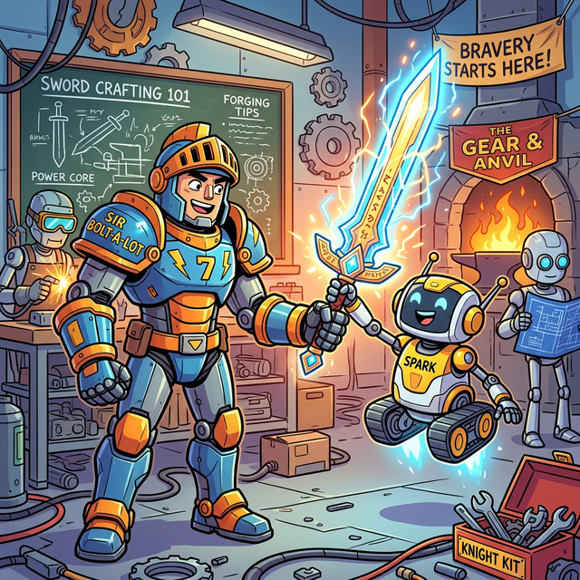
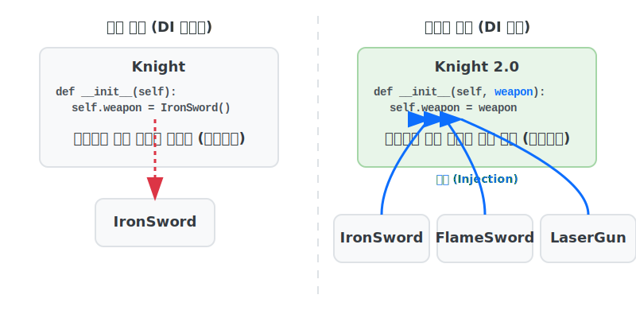

# 3.5.7 의존성 주입 (Dependency Injection, DI)

## 학습목표
본 장에서는 클래스 간의 결합도를 획기적으로 낮추어 "언제든지 부품을 갈아 끼울 수 있는" 유연한 아키텍처를 진두지휘하는 **의존성 주입(DI)**의 개념을 익힙니다. 상속을 넘어선 객체지향 확장성의 끝판왕 설계 패턴을 경험합니다.

---

## 💡 TL;DR (1분 핵심 요약): 의존성 주입이란?

1. **의존성 (Dependency)**: A 클래스가 동작하기 위해 B 클래스가 반드시 필요한 상태(연결된 상태)를 말합니다. 보통 "기사가 칼을 가지고 있는 상황"과 같습니다.
2. **주입 (Injection)**: 기사 몸속(코드 내부)에서 칼(객체)을 직접 생성하지 않고, **밖에서(코드 외부에서) 누군가 칼을 만들어서 기사의 손에 쥐여주는(전달해 주는) 방식**입니다.
3. **DI의 목적**: 언제든지 녹슨 칼은 버리고 번개 칼로 무기를 교체할 수 있듯이, 코드의 수정을 최소화하고 **클래스 간의 느슨한 결합(Loose Coupling)**을 달성하기 위해서입니다.

---

## 1. 꽉 막힌 의존성: 기사가 몸속에서 칼을 제련한다?

의존성 주입을 쓰지 않은 끔찍한 코드를 보겠습니다.

### 예제 1: 강한 결합 (Tight Coupling)
클래스 내부에서 필요한 객체를 무작정 스스로 생성해 버리면, 평생 그 객체에만 묶이는 노예가 됩니다.


*(웹툰 비유: 최전방에 기사 로봇 한 명이 서 있습니다. 철광석을 주워서 자기 배 속에 있는 대장간 용광로에서 낑낑대며 칼을 스스로 만들어 쓰고 있습니다(강한 결합). 옆에 있던 만렙 로봇이 기겁하며 묻습니다. "아니, 밖에서 칼을 만들어다가 네 손에 쥐여주면(주입) 되잖아?")*

<br>



```python
class IronSword:

    def attack(self):
        return "철검으로 찌르기! 10 데미지!"

class Knight:
    def __init__(self):
        # 🚨 최악의 설계: 기사가 직접 몸속에서 철검을 생성합니다. 
        # 이 기사는 평생 철검밖에 못 쓰는 저주에 걸렸습니다.
        self.weapon = IronSword() 

    def attack(self):
        print(self.weapon.attack())

k = Knight()
k.attack() 
# 만약 상황이 변해 기사에게 '전설의 불꽃검'을 쥐어주고 싶다면? 
# 안타깝게도 Knight 클래스의 내부 코드를 직접 뜯어 고쳐야(수정) 합니다.
```

---

## 2. 의존성 주입 (DI): 밖에서 무기를 쥐여줘라! 

이번엔 아주 깔끔하게 바뀐 설계입니다. 무기를 스스로 만들지 말고, 생성자(또는 메서드)를 통해 **외부에서 건네받도록 설계**합니다.

### 예제 2: 느슨한 결합 (Loose Coupling)
```python
# 다양한 무기들 제조
class IronSword:
    def swing(self):
        return "챙강! 철검 치기!"

class FlameSword:
    def swing(self):
        return "화르륵! 불꽃의 베기!"

# 기사 2.0 설계
class Knight:
    # 💡 핵심: 외부에서 weapon을 '주입(Injection)' 받습니다!
    def __init__(self, weapon):
        self.weapon = weapon

    def attack(self):
        print(self.weapon.swing())

# 상황에 따라 밖(Main 로직)에서 알아서 무기를 교체해 주입합니다.
iron_sword = IronSword()
flame_sword = FlameSword()

# 1. 초보 기사: 철검 주입
k1 = Knight(weapon=iron_sword)
k1.attack()

# 2. 만렙 기사: 불꽃검 주입 (Knight 코드 내부를 1줄도 수정하지 않았습니다!)
k2 = Knight(weapon=flame_sword)
k2.attack()
```
이처럼 "내부에서 `new(생성)`하지 말고 밖에서 받자!"는 아주 단순한 원리 하나가 수만 줄짜리 엔터프라이즈 시스템의 플러그인(Plug-in) 아키텍처를 뒤받치고 있는 제1원칙입니다.

---

## 코딩 영단어 학습 📝

*   **Dependency**: 의존성. (내가 살기 위해 남에게 기대고 있는 상태. 코딩에서는 내 클래스가 돌아가기 위해 반드시 다른 클래스의 객체가 필요한 끈끈한 관계를 말합니다.)
*   **Injection**: 주입, 주사. (내부에서 자체 생성하지 않고, 혈관에 주사액을 꽂아 넣듯 바깥의 프레임워크나 메인 컨트롤러가 객체를 쓱 밀어 넣어 주는 동작을 의미합니다.)
*   **Loose Coupling**: 느슨한 결합. (두 객체가 서로 알긴 알지만, 언제든 다른 놈으로 갈아 치워도 시스템이 터지지 않도록 가볍게 연결된 유연한 구조를 말합니다.)
