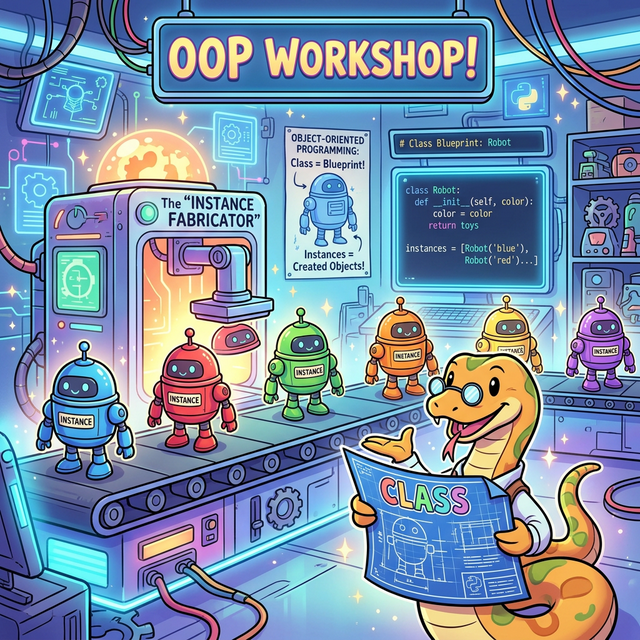

# 3.5 객체지향 프로그래밍 (OOP)

현대 프로그래밍의 가장 중요한 패러다임인 객체지향 프로그래밍(Object-Oriented Programming)을 파이썬으로 구현하는 방법을 배웁니다. 

## 학습목표
본 장에서는 현실 세계의 사물을 컴퓨터 세상에 붕어빵 찍어내듯 원형 틀을 바탕으로 수없이 복제해 내는 **객체지향 프로그래밍(OOP)**의 위대한 패러다임을 확립합니다. 수천 줄의 코드를 깔끔하게 묶어 재사용하게 해주는 기둥인 **캡슐화(클래스와 인스턴스), 상속/다형성, 추상화/인터페이스, 그리고 의존성 주입**의 핵심 뼈대를 완벽히 이해합니다.

---

## 📚 세부 학습 목차

### [3.5.1 클래스와 인스턴스 (Class & Instance)](./01_class_instance/)
객체지향의 가장 기초가 되는 붕어빵 기계 도면(클래스)과, 그 도면에 밀가루와 팥고물을 부어 구워낸 달콤한 실체인 붕어빵(인스턴스)의 근본적인 차이를 파헤칩니다. 

### [3.5.2 파이썬의 self (THIS)](./02_python_self/)
자신이 누구인지 스스로를 가리키는 파이썬의 독특한 `self` 키워드의 역할과 원리를 이해하며, 다른 언어의 `this`와의 차이점을 명확히 알아봅니다.

### [3.5.3 상속 (Inheritance)](./03_inheritance/)
명작 RPG 게임을 만들면서, 기본적인 '몬스터'의 공격력과 체력 특성을 상속받아 불 뿜는 '드래곤'과 독침을 쏘는 '보스몹'을 찍어내듯 부모의 코드를 재사용하는 상속의 개념을 배웁니다.

### [3.5.4 다형성 (Polymorphism)](./04_polymorphism/)
겉보기엔 똑같은 "공격해!"라는 명령을 내려도, 어떻게 객체의 종류에 따라 슬라임은 들이받고 드래곤은 불을 뿜게 되는지 화려한 다형성(Polymorphism) 설계 기법을 코드로 입증합니다.

### [3.5.5 추상화 (Abstraction)](./05_abstraction/)
"반드시 파란색 붕어빵을 구워야만 해!"라고 강제로 규격을 지정하는 설계의 척추, 자식 클래스에게 특정 메서드의 구현을 강제하는 추상 베이스 클래스(ABC) 도면을 작성하는 법을 이해합니다.

### [3.5.6 인터페이스 (Interface)](./06_interface/)
자바의 깐깐한 `interface` 문법을 파이썬 내부 모듈인 `abc(Abstract Base Classes)` 모듈을 활용하여 구현하는 법을 알아보고, 나아가 굳이 꼬들꼬들하게 강제하지 않아도 새처럼 울고 새처럼 걸으면 그냥 새로 인정해버리는 파이썬 특유의 자유분방한 '덕 타이핑(Duck Typing)' 철학에 감탄해 봅니다.

### [3.5.7 의존성 주입 (Dependency Injection)](./07_dependency_injection/)
칼을 스스로 제련하지 않고 밖에서 건네받는 기사처럼, 클래스 내부에서 다른 객체를 직접 생성하지 않고 외부에서 넘겨받음으로써 코드 간의 결합도를 낮추는 의존성 주입(DI)의 핵심 구조를 깨우칩니다.

---

## 🎉 정리
수백 줄, 수천 줄로 길어지는 절차적 코드(한 줄로 죽 늘어진 코드)의 한계를 극복하기 위해 인류가 고안해 낸 가장 위대한 발명품 중 하나가 바로 객체지향(OOP)입니다. 서로 독립적으로 각자의 체력(상태)을 가진 '인스턴스' 객체들이, 거대한 생태계 안에서 자율적으로 움직이며 각자의 '메서드(행동)'로 소통하는 견고한 데이터 구조를 짤 수 있게 됨으로써, 여러분은 이제 단순한 코더(Coder)를 넘어 진정한 **소프트웨어 아키텍트(Software Architect)**의 넓은 시야를 갖추게 되었습니다.
