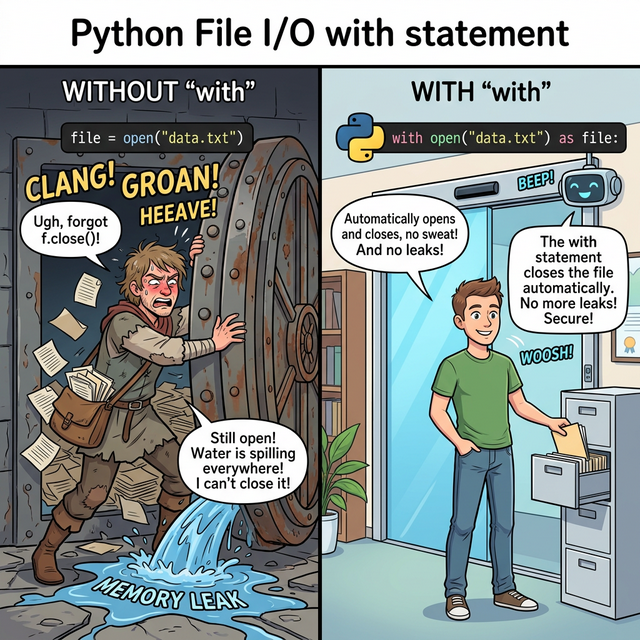

# 3.6.1 파일 입출력의 개념과 필요성 (File I/O Concepts)

## 학습목표
코딩 초보자들이 흔히 간과하는 **램(RAM)의 휘발성** 문제를 자각하고, 데이터가 영구히 저장되는 **하드디스크(SSD/HDD)** 공간에서 파이썬 프로그램 안으로 데이터를 밀어넣고(Input) 빼내는(Output) **스트림(Stream)**의 원리를 이해합니다.

---

## 💡 TL;DR (1분 핵심 요약): 왜 파일을 열고 닫아야 할까?

1. **메모리 증발 (RAM)**: 파이썬에서 `a = 10` 이라는 변수를 만들었더라도, 터미널 프로그램을 끄거나 컴퓨터 코드가 종료되면 메모리에 있던 `10`은 영원히 허공으로 사라집니다. (휘발성)
2. **영구 보존 (Disk)**: 내일 컴퓨터를 다시 켜도 데이터(`10`)가 살아있게 하려면, 전원이 끊겨도 데이터가 남아있는 하드디스크의 **파일(`.txt`, `.csv` 등)** 형태로 저장해 두어야 합니다. (비휘발성)
3. **입출력 (I/O)**: 따라서 프로그램(RAM)과 하드디스크(File) 사이에는 데이터를 실어 나르는 거대한 파이프가 필요한데, 데이터를 빨아들이는 것을 **Input (입력/Read)**, 다시 밀어내는 것을 **Output (출력/Write)**이라고 부릅니다. 

---

## 1. 기억 상실증에 걸린 프로그램과 일기장

우리가 지금까지 작성한 파이썬 코드는 전원이 꺼지면 모든 기억을 잃는 단기 기억상실증 환자와 같습니다.

아무리 복잡한 데이터 분석 코드를 짜서 주식 환율의 최저점 타이밍을 계산해 냈더라도, 그 결과값이 화면(Console)에만 한 번 찍히고 파이썬이 종료돼버리면 그 귀중한 계산 결과는 영원히 소멸합니다. 

그래서 우리는 외장 뇌(일기장)인 **파일(File)**을 꺼내와야 합니다. 하드디스크에 `.txt` 나 `.csv` 파일을 만들어 파이썬이 계산해 낸 데이터를 펜으로 꾹꾹 눌러 써서 영구 기록으로 남기는 과정을 **파일 출력(Write)**이라고 합니다. 반대로, 어제 기록해 둔 일기장을 열어 오늘 파이썬 코드에서 다시 그 수치를 가져다 계산하는 것을 **파일 입력(Read)**이라고 합니다.

---

## 2. 파일 I/O 파이프(스트림)의 작동 원리

하드디스크는 파이썬 프로그램과 완전히 분리된 거대한 요새입니다. 성벽 너머에 있는 데이터를 가져오기 위해 파이썬은 **스트림(Stream)**이라는 한 방향으로 흐르는 기다란 파이프 관을 꽂아야 합니다.

*(웹툰 비유: 화면 왼쪽에 파이썬 프로그램이라는 거대한 공장이 돌아가고 있습니다. 오른쪽에는 성벽으로 둘러싸인 안전한 금고(하드디스크)가 있고, 그 안에 파일이라는 일기장이 들어 있습니다. 공장장이 파이프(open)를 성벽 건너편 일기장에 강제로 꽂고, 펌프질(Read/Write)을 통해 텍스트 구슬들을 빨아들이고 내보냅니다. 하지만 파이프를 뽑지 않고(close를 생략하고) 방치하면, 쥐가 파이프를 갉아먹거나 쓰레기가 유입되어 일기장이 망가지는 끔찍한 사태(Error)가 벌어집니다.)*

---

## 🎧 Vibe Coding

> **🗣️ 학생 프롬프트 (AI에게 이렇게 질문해 보세요):**
> "램(RAM)과 하드디스크(HDD)의 차이점을, 요리사가 요리하는 '주방의 도마'와 재료를 보관하는 '초대형 냉장고'의 비유를 들어서 초등학생도 이해할 수 있게 짧은 만화 대본처럼 설명해 줘."

---

## 코딩 영단어 학습 📝

*   **I/O (Input / Output)**: 입력과 출력. (컴퓨터 입장에서 외부 소스로부터 데이터를 빨아들이는 행위를 인풋(Input, 키보드 치기, 파일 읽기), 밖으로 뱉어내는 행위를 아웃풋(Output, 모니터에 그리기, 파일 쓰기)이라고 부르는 가장 근본적인 프로그래밍 단어입니다.)
*   **Volatile (휘발성의)**: 날아가 버리기 쉬운. (RAM 메모리처럼 전기 공급이 끊어지는 즉시 저장된 데이터가 흔적도 없이 사라지는 특성을 말합니다. 알코올이 공기 중으로 휘발되어 날아가는 것을 연상하면 됩니다.)
*   **Stream (스트림)**: 시냇물, 물줄기. (하드디스크 파일에서 파이썬 코드로 데이터가 이동할 때 뭉텅이로 순간이동하는 것이 아니라, 수도꼭지를 틀어놓은 것처럼 바이트(Byte) 조각들이 한 줄로 졸졸졸 끊임없이 흘러들어오는 통로를 뜻합니다.)
