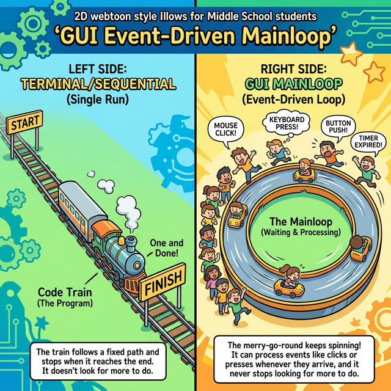
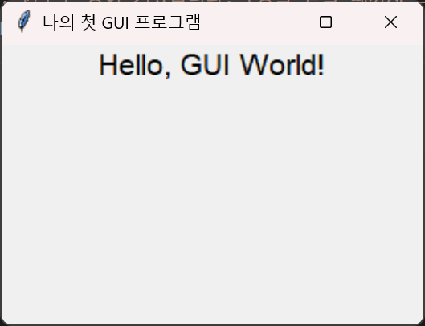

# 3.7.2 첫 GUI: Hello World와 Mainloop

## 학습목표
Tkinter 라이브러리를 임포트(Import)하여, 수초 만에 내 컴퓨터 모니터 정중앙에 나만의 윈도우 그래픽 창(Window)을 띄우는 역사적인 "Hello World" 스크립트를 작성합니다. 특히 코드가 종료되지 않고 백그라운드에서 영원히 불침번을 서며 마우스 클릭 이벤트(Event)를 무한 대기하는 핵심 원리인 **`mainloop()`** 함수를 완벽히 이해합니다.

---

## 💡 TL;DR (1분 핵심 요약): 윈도우 창 띄우기의 3단계 뼈대

1. **객체 생성 (`tk.Tk()`)**: 메모리 상에 안 보이는 투명한 윈도우 창 공책을 한 권 펼칩니다.
2. **위젯 조립 (`tk.Label().pack()`)**: 글자나 버튼 등 내용물(레고 블록)을 윈도우 창 위에 턱턱 올려 스티커로 붙입니다.
3. **심장 박동 펌프 작동 (`root.mainloop()`)**: 완성된 창을 모니터에 실제로 "짠!" 띄우고, **프로그램이 절대로 꺼지지 않게 무한 루프**를 돌려 멈춰 세웁니다.

---

## 1. 터미널의 기차 vs GUI의 무한 회전목마

파이썬 터미널 코드는 기차와 같습니다. 1번 줄부터 100번 줄까지 쏜살같이 달린 후 종착역에 도달하면 프로그램이 끝납니다. 

반대로 GUI 프로그램은 **무한히 돌아가는 회전목마(`mainloop`)**입니다. 프로그램이 종료되지 않은 채 끝없이 대기하다가, 사용자가 버튼을 누르면 그제서야 해당 톱니바퀴만 찰칵 돌아갑니다.


*(웹툰 비유: 화면 왼쪽엔 기차가 출발선부터 도착선까지 한 번 달리고 멈춰버리는 직진 선로(터미널)가 보입니다. 오른쪽 화면엔 영원히 멈추지 않고 빙글빙글 도는 거대한 회전목마(Mainloop)가 있고, 옆에서 '마우스 클릭', '키보드 입력'이라는 귀여운 난쟁이들(Event)이 회전목마 안으로 폴짝폴짝 뛰어 들어갈 타이밍을 기다리며 대기하고 있습니다.)*

---

## 2. Hello World 윈도우 띄우기 실전 코드

`tkinter`는 별도의 `pip` 설치 없이 파이썬을 설치하면 같이 설치되는 막강한 표준 라이브러리입니다. 코드 에디터(VS Code 등)에서 바로 타이핑해서 실행(`F5` 혹은 Run)해 봅시다!

```python
import tkinter as tk

# 1. 메인 윈도우(도화지) 생성
root = tk.Tk() 
root.title("나의 첫 GUI 프로그램") # 창의 상단 타이틀 바 이름 지정
root.geometry("300x200")       # 창의 가로x세로 해상도 크기 (띄어쓰기 없이 소문자 엑스 x 사용)

# 2. 위젯(글자 스티커) 만들어서 도화지에 붙이기
label = tk.Label(root, text="Hello, GUI World!", font=("Helvetica", 16))
label.pack() # 윈도우 화면 정중앙 최상단에 위에서부터 블록처럼 찍어 바릅니다.

# 3. 메인 루프 (심장) 작동 시작! 
# 주의: 이 줄 아래로는 사용자가 X(닫기) 버튼을 눌러 창을 부수기 전까지 코드가 내려오지 않습니다!
print("이 메세지는 터미널에 윈도우 창이 켜지기 직전에만 한 번 보입니다.")

root.mainloop() 

print("창을 완전히 닫은 후에야 이 메세지가 터미널에 나타나며 기차가 종착역에 도달합니다.")
```

이 코드를 실행하면 까만 터미널 화면 대신 아름다운(?) 작은 윈도우 창 하나가 뜹니다.





---

## ☕ Java (Swing) vs 🐍 Python 스나이퍼 대결

### 1. 거대한 타이핑 노동 극복
*   **Java (`Swing`)**: 창 하나를 띄우려면 `extends JFrame` 등 부모를 상속받고, 거대한 블록 클래스를 감싸고 그 안에 생성자를 파서 `setVisible(true)` 등 끝없는 명령을 지시해야 합니다.
*   **Python (`Tkinter`)**: 오직 `root = tk.Tk()` 로 도화지를 까고 밑에 `mainloop()` 한 줄만 묶어주면 끝입니다. 스크립트 언어 특유의 절차적 코드 라인으로 압살하는 놀라운 스피드를 보여줍니다.

---

## 🎧 Vibe Coding

> **🗣️ 학생 프롬프트 (AI에게 이렇게 명령해 보세요):**
> "파이썬 `Tkinter`를 써서 가로 세로 400x400 크기의 윈도우 창 하나를 만들어줘. 
> 제목(title)은 '단어 암기장'으로 설정해.
> 그리고 창 정중앙에 `tk.Label`을 이용해서 'apple: 사과' 라는 글자를 무려 폰트 사이즈 30 크기로 아주 큼지막하고 빨간색 글씨로 띄워줘! 맨 밑에는 잊지 말고 `mainloop()`도 돌려 놔."

---

## 코딩 영단어 학습 📝

*   **Mainloop (메인루프)**: 메인(주된) + 루프(무한 반복). (도화지가 사라지지 않고 투명한 쳇바퀴를 1초에 수십 바퀴씩 돌면서, 누가 내 배를 만지지는 않는지(클릭), 키보드를 누르는지 매의 눈으로 끊임없이 감시하는 GUI의 심장 코드입니다.)
*   **Widget (위젯)**: 소형 장치, 레고 블록 단위. (스마트폰 앱에서 화면을 구성하는 가장 작은 부품 단위 조각입니다. 단순히 글자를 보여주는 `Label`(라벨), 클립을 인식하는 `Button`(버튼), 타이핑 입력을 받는 `Entry`(엔트리) 등이 대표적입니다.)
*   **Geometry (지오메트리)**: 기하학, 부피, 크기 구도. (수학에서는 도형의 성질을 뜻하지만, 프로그래밍 GUI 에서는 "윈도우 창의 가로 사이즈 × 세로 사이즈, 그리고 모니터 화면 몇 픽셀 위치에서 팝업창을 시작시킬지"를 지정해 주는 아주 필수적인 창 크기 제어 함수 명령어입니다.)
