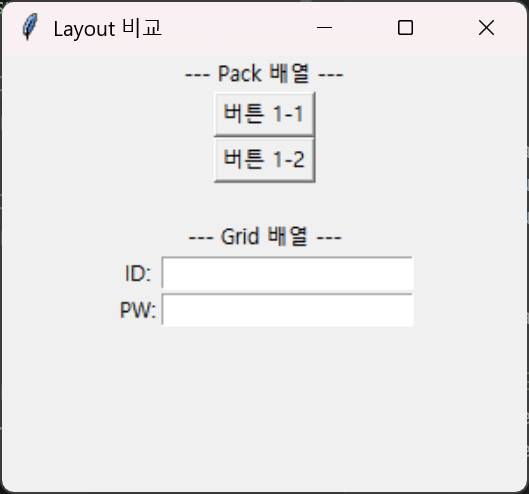
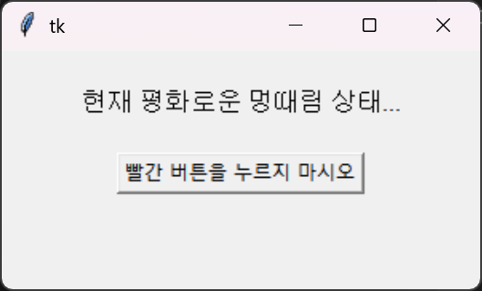

# 3.7.3 위젯 배치와 이벤트 구동 (Layout & Event-Driven)

## 학습목표
`Tkinter` 버튼, 텍스트창, 라벨 같은 위젯 부품들을 단순하게 가운데 정렬로 부어버리는 `pack()`과 엑셀 시트처럼 정교하게 좌표로 꽂아 넣는 `grid()` 레이아웃의 차이를 배웁니다. 더불어, 화면에 던져놓은 버튼을 눌렀을 때 비로소 파이썬 함수가 발동하게 전선을 이어주는 **이벤트 구동(Event-Driven)** 방식의 결정체인 `command=` 파라미터 활용법을 체화합니다.

---

## 💡 TL;DR (1분 핵심 요약): 배치와 액션

1. **위젯(Widget)**: 버튼, 입력창, 라벨 등 화면을 구성하는 가장 작은 레고 분자 블록입니다.
2. **레이아웃 매니저**: 내가 만든 위젯을 빈 도화지(Window) 어디에 꽂을지를 결정하는 자석입니다. (`pack`은 김밥 말기처럼 위에서부터 차곡차곡 쌓는 방식, `grid`는 모눈종이 십자 좌표표에 박아넣는 방식입니다.)
3. **이벤트 핸들링 (`command=`)**: 껍데기뿐인 버튼에 생명을 불어넣는 전류선 연결 작업입니다. 함수 괄호를 빼먹고 이름만 적어야(`command=my_click`) 클릭 시점에만 총알이 발사됩니다.

---

## 1. 화면 배치(레이아웃)의 양대 산맥

버튼(Widget)을 화면에 그냥 던지면 아무것도 보이지 않습니다. 반드시 `팩(pack)` 이나 `그리드(grid)` 라는 레이아웃 매니저 함수를 뒤에 붙여주어야 화면에 본드가 칠해지며 찰싹 달라붙습니다. 


### 예제 1: `pack()` 블록 쌓기와 `grid()` 엑셀 정렬
```python
import tkinter as tk

root = tk.Tk()
root.title("Layout 비교")
root.geometry("300x250") # 가로x세로 크기

# ---------------------------------------------
# 1. pack() 방식: 마트료시카 블록처럼 위에서 아래로 중앙 정렬 쑤셔 넣기 (빠름)
tk.Label(root, text="--- Pack 배열 ---").pack()
tk.Button(root, text="버튼 1-1").pack()
tk.Button(root, text="버튼 1-2").pack()

# ---------------------------------------------
# 2. grid() 방식: 정교하게 엑셀 행(Row)과 열(Column) 셀 나누기 (정교함)
tk.Label(root, text="--- Grid 배열 ---").pack(pady=(20, 0)) # 여백용 꼼수

# 별도의 뼈대 프레임(투명한 액자)을 만들고, 그 안에 그리드를 칩니다.
# (하나의 root 창 안에서 pack과 grid를 함부로 섞어 쓰면 에러 쾅 납니다!)
frame = tk.Frame(root) 
frame.pack()

tk.Label(frame, text="ID:").grid(row=0, column=0)
tk.Entry(frame).grid(row=0, column=1) # 글자를 입력받는 빈칸

tk.Label(frame, text="PW:").grid(row=1, column=0)
tk.Entry(frame).grid(row=1, column=1)

# 심장 박동(회전목마) 무한 실행 시작! 
root.mainloop()
```





---

## 2. 이벤트 드리븐 (Event-Driven)의 마법

사용자가 버튼을 클릭했을 때 어떤 함수를 실행할지 미리 **전선(Command)**을 연결해 두어야 합니다.


### 예제 2: 버튼 클릭과 함수 실행 연결
```python
import tkinter as tk

# 1. 동작할 함수 (총알) 미리 장전!
def force_on_click():
    # 사용자가 버튼을 클릭하면, 이 회로로 전기가 흐르며 함수 발동!
    print("터미널: 앗! 찌릿찌릿! 왼쪽 버튼이 클릭되었습니다!")
    
    # GUI 화면의 라벨 내용을 강제 수정
    label_status.config(text="🔥 미사일 발사 완료! 🔥", fg="red") 

# ---------------------------------------------

root = tk.Tk()
root.geometry("300x150")

# 2. 라벨 만들기 (처음 상태)
label_status = tk.Label(root, text="현재 평화로운 멍때림 상태...", font=("Arial", 12))
label_status.pack(pady=20)

# 3. 버튼 만들기 (command=force_on_click 코드가 바로 핵심 전선(방아쇠) 역할!)
# 🚨 절대 주의: 함수명 뒤에 괄호를 치는 순간( force_on_click() ), 
# 파이썬은 프로그램이 뜨기도 전에 버튼 생성을 하다가 저 함수를 먼저 폭파(실행)시켜 버립니다.
# 방사능 물질(매개변수)이 필요 없는 버튼 연결은 무조건 괄호 생략!
btn = tk.Button(root, text="빨간 버튼을 누르지 마시오", command=force_on_click)
btn.pack()

root.mainloop()
```





---

## ☕ Java vs 🐍 Python 스나이퍼 대결

### 이벤트 감지 (리스너 연결)의 고통 차이
*   **Java (`Swing`)**: 자바에서 버튼을 누를 때 `"hello"`를 찍게 하려면 `ActionEventListener`라는 객체 인터페이스 지옥을 만듭니다. `button.addActionListener(new ActionListener() { public void actionPerformed(ActionEvent e) { System.out.println("hello"); } });` 처럼 거대한 익명 인터페이스 클래스 덩어리를 우겨 넣어야 합니다. 코드 줄 수가 무지막지하게 길고 지저분해집니다.
*   **Python (`Tkinter`)**: 자바의 그 무거운 익명 객체를 버리고, 그냥 파이썬의 **일급 객체(First-class Object)** 특성을 발동시킵니다. `def` 로 함수를 하나 짠 뒤, `tk.Button(..., command=함수명)` 이라는 파라미터 값으로 화살표 포인터 리스트 하나 던져주면 자바의 모든 리스너 오버라이드 과정을 단 한 줄로 철저히 강제 압축시켜버립니다.

---

## 🎧 Vibe Coding

> **🗣️ 학생 프롬프트 (AI에게 이렇게 명령해 보세요):**
> "파이썬 `Tkinter`를 써서 간단한 '비만도(BMI) 계산기' GUI 창을 만들어줘. 
> 1) 몸무게 입력창(Entry), 키 입력창(Entry) 두 개를 나란히 `grid()` 로 예쁘게 배치해.
> 2) 그 아래에 '계산하기' 버튼을 만들고, 클릭하면 `calculate_bmi()` 함수가 이벤트로 발동하게 해 줘.
> 3) 함수 안에서는 `entry_weight.get()` 같은 `get()` 문법을 통해 몸무게값 문자열을 쑥 뽑아오고 실수(float)로 형변환한 뒤, 공식(몸무게 / 키의 제곱)으로 식을 풀고 맨 밑에 있는 라벨의 글자를 '당신의 BMI는 XX입니다' 로 변경해 줘."

---

## 코딩 영단어 학습 📝

*   **Config (Configure)**: 구성하다, 설정값을 뒤바꾸다. (화면에 이미 뿌려진 라벨(Label)의 글자 내용(`text= `)이나 배경색(`bg= `)을, 버튼 클릭 등 동적인 상황이 발생했을 때 실시간으로 강제로 덮어씌워 바꾸기 위해 호출하는 막강한 업데이트 메서드입니다.)
*   **Pack (팩)**: 꾸러미를 싸다. (HTML/CSS 퍼블리싱을 모르는 개발자를 위해 파이썬이 던져주는 마법의 상자. `pack()` 이라고 선언하면 여백이나 공간 계산을 할 필요 없이 윗줄부터 가운데 정렬 차곡차곡 스택처럼 예쁘게 위젯을 쌓아 내립니다.)
*   **Grid (그리드)**: 격자무늬, 모눈종이. (`pack`으로 대충 세팅이 안 되는 까다로운 바둑판, 액셀 테이블형 UI를 짤 때 무조건 꺼내 드는 레이아웃 치트키. 내가 만든 버튼을 `row=3, column=2`의 정확한 좌표 셀(Cell) 박스 안에 때려 넣게 해 줍니다.)
