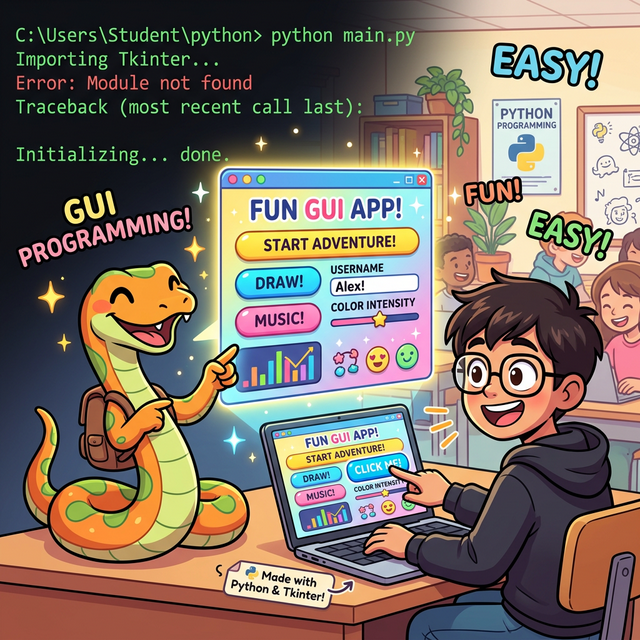

# 3.7 파이썬 GUI 프로그래밍 (Tkinter)

## 학습목표
데이터 분석의 핵심 로직을 짰더라도, 일반 사용자(고객)는 터미널 검은 화면의 명령어 입력을 이해하지 못합니다. 고객에게 내 프로그램의 가치를 온전히 전달하기 위해서는 버튼을 클릭하고 창을 넘길 수 있는 **시각적인 윈도우 그래픽 화면(GUI)**으로 예쁘게 포장해 주어야 합니다. 

본 장에서는 파이썬의 여러 GUI 툴킷 중 가장 가볍고 내장되어 있어 환경 세팅이 필요 없는 **`Tkinter`**를 사용하여 기초적인 윈도우 창 띄우기와 위젯 조작법을 배웁니다. 이 과정을 통해 훗날 더 방대하고 세련된 `PyQt`나 웹 기반 대시보드(Streamlit 등)로 넘어가기 위한 핵심 사고력인 **이벤트 드리븐(Event-Driven)** 아키텍처의 뼈대를 다지게 될 것입니다.

---

## 📑 세부 학습 목차

### [3.7.1 GUI 구동 원리와 환경 설정 (Principles & Setup)](./01_gui_principles/)
*   **이벤트 드리븐(Event-Driven)의 철학**: 한 번 코드가 떨어지고 끝나는 터미널 방식(기차)에서 벗어나, 무한히 살아 숨 쉬며 사용자의 클릭 이벤트(사건)를 기다리는 회전목마 모델로 머릿속 스위치를 전환합니다.
*   **파이썬 GUI 양대 산맥**: 기본 내장된 가벼운 순정 기기 `Tkinter`와 C++ 기반의 화려하지만 무겁고 라이선스 주의가 필요한 외부 패키지 `PyQt/PySide`의 장단점을 명확히 비교합니다.
*   **VS Code 환경 세팅**: 외부 패키지를 쓸 때를 대비하여 시스템 의존성 꼬임을 원천 차단하는 `venv` (가상 환경 캡슐) 생성법을 현업 프로 개발자의 관점에서 짚고 넘어갑니다.

### [3.7.2 첫 GUI: Hello World와 Mainloop](./02_tkinter_hello_world/)
*   **가장 위대한 첫걸음**: 복잡한 환경 설정이나 거대한 클래스 상속(Java Swing)의 고통 없이, 메모리상에 투명한 공책 한 권(`tk.Tk()`)을 펼치는 순간을 경험합니다.
*   **도화지에 스티커 붙이기 (위젯 조립)**: 모니터 화면에 "Hello, GUI World!" 라벨 위젯(Widget)을 얹고 풀칠을 합니다.
*   **절대 멈추지 않는 심장 (`mainloop`)**: 만들어진 도화지와 스티커를 실제로 눈앞에 띄워주고, 사용자가 X버튼을 부수기 전까지 코드가 죽지 않게 꼭 붙들고 무한 쳇바퀴를 돌리는 절대 문법의 진수를 확인합니다.

### [3.7.3 위젯 배치와 이벤트 구동 (Layout & Event-Driven)](./03_widget_layout/)
*   **위젯 레이아웃의 마법**: 화면에 부품을 그냥 던져 놓는 것은 허락되지 않습니다. 마트료시카 블록처럼 한 줄로 쓸어 담아 내리는 `pack()`과 엑셀 시트처럼 정교한 행/열 좌표를 꽂아 정확한 자리에 고정시키는 `grid()`의 차이점을 확실히 파악합니다.
*   **버튼에 생명선 연결 (Event Handling)**: 껍데기뿐인 버튼에 전류(Command) 선을 이어, 버튼을 누르는 즉시 위에서 장전해둔 커스텀 함수(총알)가 번개처럼 실행되게 묶어버립니다. (파이썬의 일급 객체 특성이 자바의 익명 인터페이스 클래스 지옥을 어떻게 단 한 줄로 분쇄하는지 환호하게 됩니다.)

### [3.7.4 미니 프로젝트: CSV 데이터를 GUI로 띄우기](./04_data_analysis_gui/)
*   **미니 프로젝트: CSV 데이터를 GUI로 띄우기**: 앞서 3.6장에서 배운 파일 입출력(`sales.csv` 읽기) 및 데이터 시각화(`Matplotlib` 차트 그리기) 기술을 화면에 나타난 버튼 하나로 발동시키는 궁극의 통합 실습을 진행합니다.

---

## 🎉 정리
터미널의 흑백 화면을 벗어나, 스마트폰 앱이나 윈도우 프로그램처럼 **사용자와 상호작용(Interaction)**할 수 있는 진짜 소프트웨어를 껍데기까지 만들어 보았습니다. 파이썬의 핵심 문법과 자료구조, 파일 입출력을 하나로 묶어 이처럼 예쁘게 포장하는 과정을 거치며, 여러분은 개발부터 배포 직전의 패키징 단계까지 프로그래밍의 A to Z 사이클을 모두 경험하게 되었습니다!
