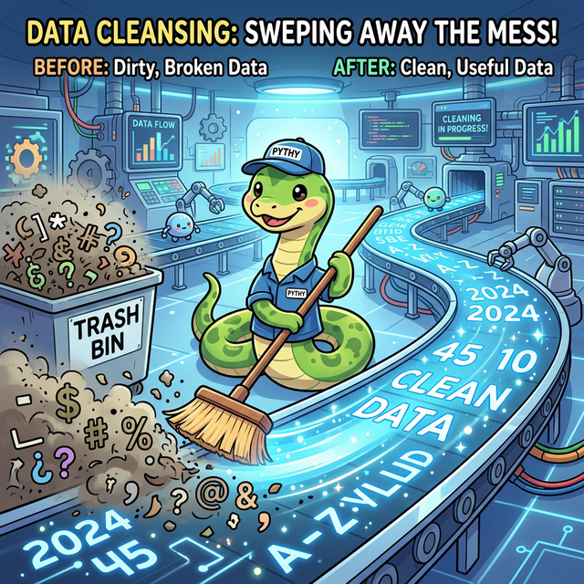
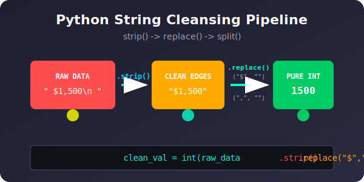

# 3.8.1 문자열 정제와 데이터 클렌징 (String Manipulation)

## 학습목표
실무 데이터 분석의 80%는 지저분한 텍스트를 청소하는 '데이터 클렌징(Data Cleansing)' 작업입니다. 본 장에서는 파이썬이 제공하는 강력하고 다채로운 내장 문자열 메서드(`split`, `join`, `strip`, `replace`)를 마스터하여, 웹 스크래핑이나 엑셀에서 긁어온 엉망진창인 데이터를 깔끔한 리스트 구조로 정제하는 피지컬을 기릅니다. 더불어 텍스트 처리의 끝판왕인 **정규표현식(Regular Expressions)**의 기초를 맛봅니다.


<div align="center">
  
</div>

---

## 💡 TL;DR (1분 핵심 요약)

*   **`split(구분자)`**: 하나의 긴 문장(String)을 칼로 썰어서 리스트(List)로 분해합니다. (CSV 파싱의 핵심)
*   **`join(리스트)`**: 흩어진 리스트(List)의 조각들을 접착제(구분자)로 발라 하나의 문장(String)으로 이어 붙입니다.
*   **`strip()`**: 문자열 양끝에 묻은 더러운 공백이나 줄바꿈(`\n`) 찌꺼기를 세탁합니다.
*   **`replace(A, B)`**: 오타나 불필요한 단어 A를 찾아 B로 일괄 치환(교체)합니다.

---

## 1. 텍스트 세탁소: 파이썬 문자열 4대장

파이썬은 문자열 그 자체를 하나의 객체로 취급하며, 내부에 무수히 많은 청소 도구(메서드)를 가지고 있습니다.

### 1) 자르기: `split()`
띄어쓰기나 쉼표(,) 같은 특정 기호를 기준으로 문자열을 조각내어 **리스트(List)** 타입으로 반환합니다.

```python
# 1. 공백 기준 자르기 (기본값)
sentence = "Python is very powerful"
words = sentence.split()
print(words) # 출력: ['Python', 'is', 'very', 'powerful']

# 2. 쉼표(,) 기준 자르기 (CSV 데이터 찢을 때 필수)
csv_data = "홍길동,25,seoul,010-1234-5678"
user_info = csv_data.split(",")
print(user_info) # 출력: ['홍길동', '25', 'seoul', '010-1234-5678']
```

### 2) 붙이기: `join()`
`split`의 정확히 반대 역할입니다. **문자열(접착제)**.join(리스트) 형태로 사용합니다.

```python
pieces = ["010", "1234", "5678"]
# 조각들을 휴대전화 번호 형식(-)으로 조립하기
phone_number = "-".join(pieces)
print(phone_number) # 출력: 010-1234-5678

# 띄어쓰기로 이어 붙이기
sentence = " ".join(["Hello", "World", "Python"])
print(sentence) # 출력: Hello World Python
```

### 3) 벗겨내기: `strip()`
인터넷에서 긁어온 데이터는 양옆에 쓰레기 공백이 묻어있는 경우가 많습니다. `strip()`은 양옆의 공백, 탭(`\t`), 줄바꿈(`\n`) 기호를 싹 벗겨냅니다.

```python
dirty_text = "   \n\t  불가사리 \n  "
clean_text = dirty_text.strip()
print(f"청소 전: '{dirty_text}'")
print(f"청소 후: '{clean_text}'") # 출력: '불가사리'

# 참고: lstrip()은 왼쪽만, rstrip()은 오른쪽만 지웁니다.
```

### 4) 교체하기: `replace(old, new)`
특정 문자열을 찾아 다른 문자열로 바꿉니다. 데이터에서 특정 불순물을 제거할 때 빈 문자열(`""`)로 치환하는 꼼수로 많이 쓰입니다.

```python
typo_text = "I hxte bug, hxte error!"
fixed_text = typo_text.replace("hxte", "love")
print(fixed_text) # 출력: I love bug, love error!

# 불필요한 문자 제거 꼼수 (달러 기호 날리기)
price = "$1,500"
clean_price = price.replace("$", "").replace(",", "")
print(int(clean_price)) # 출력: 1500 (성공적인 정수 변환)
```

---

## 2. 실전 클렌징 파이프라인 (체인 액션)

파이썬의 문자열 메서드들은 실행 결과로 또다시 문자열을 반환하기 때문에, 꼬리에 꼬리를 무는 **체인(Chain)** 형태로 한 줄에 몰아 쓸 수 있습니다.

```python
# 웹에서 스크래핑한 더러운 데이터
raw_data = "   \n [속보] 파이썬, 우주 정복... 가격은 $99,999 \n\n "

# 1. 양옆 쓰레기 제거 (strip)
# 2. '[속보] ' 제거 (replace)
# 3. '$' 기호 제거 (replace)
# 4. ',' 쉼표 제거 (replace)

clean_data = raw_data.strip().replace("[속보] ", "").replace("$", "").replace(",", "")

print(f"원래 데이터: {raw_data}")
print(f"정제 데이터: {clean_data}") 
# 출력: 파이썬 우주 정복... 가격은 99999
```

---

## ☕ Java vs 🐍 Python 스나이퍼 대결

**문자열 조작 편의성 비교**

*   **Java**: 자바에서 문자열(`String`)은 불변 객체인데다 메모리 성능 이슈 때문에 무지성으로 `+` 연산이나 `replace` 체인을 쓰면 앱이 느려집니다. 그래서 번거롭게 `StringBuilder` 나 `StringBuffer` 객체를 만들어서 써야 하는 함정이 널려 있습니다. 배열을 하나로 합치기도(join) 꽤 귀찮습니다.
*   **Python**: 그런 거 없습니다. 체인 함수를 마음대로 덕지덕지 붙여서 `raw_data.strip().replace().lower()` 형태로 마구 써도 짧고 우아하게 동작합니다. 

---

## 3. 끝판왕: 정규표현식(Regex) 기초 맛보기

만약 텍스트 안에서 **"숫자 3자리-숫자 4자리-숫자 4자리"**로 생긴 전화번호 형식만 다 뽑아내야 한다면 어떨까요? `split`과 `replace`만으로는 수십 줄의 짜증 나는 `if`문이 필요합니다. 
이때 파이썬의 `re` (Regular Expression) 내장 모듈을 쓰면 패턴 탐지를 단 한 줄로 끝냅니다.

> 정규표현식은 하나의 거대한 프로그래밍 언어 수준이므로, 여기서는 그 강력함의 맛만 봅니다.

```python
import re

text = "제 연락처는 010-1234-5678 이고, 업무용 폰은 010-9876-5432입니다. 메일은 info@test.com 입니다."

# 1. 전화번호 패턴 정의 (\d는 숫자를 의미)
phone_pattern = r"\d{3}-\d{3,4}-\d{4}"

# 2. findall() 로 텍스트 싹쓸이
phones = re.findall(phone_pattern, text)
print(phones) # 출력: ['010-1234-5678', '010-9876-5432']

# 3. sub() 로 패턴을 뭉개서 치환하기 (개인정보 마스킹)
masked_text = re.sub(phone_pattern, "***-****-****", text)
print(masked_text) 
# 출력: 제 연락처는 ***-****-**** 이고, 업무용 폰은 ***-****-****입니다. 메일은 info@test.com 입니다.
```

---

## 🎧 Vibe Coding

> **🗣️ 학생 프롬프트 (AI에게 이렇게 명령해 보세요):**
> "파이썬으로 더러운 이메일 주소 데이터를 청소하는 정규표현식 코드를 짜줘. 
> 문자열 리스트 안에는 `['  user1@gmail.com\n', 'USER2@NAVER.COM  ', 'invalid-email', '  user3@daum.net']` 이 들어있어. 
> 1) 양옆 공백 싹 날리고, 2) 전부 소문자로 바꾸고, 3) 정규표현식으로 진짜 이메일 형식(골뱅이와 점이 있는)에 맞는 놈들만 추려서 새로운 리스트로 만들어줘."

---

## 코딩 영단어 학습 📝

*   **Cleanse (클렌즈)**: 세척하다, 정화하다. (화장 지울 때 쓰는 클렌징 폼이랑 똑같습니다. 데이터에 묻은 더러운 문자열 화장을 지워 생얼(정수/실수/깔끔한 텍스트)로 만드는 과정을 Data Cleansing이라 부릅니다.)
*   **Strip (스트립)**: 껍질을 벗기다. (과일 껍질 까듯 문자열 양 끝단의 쓸데없는 빈 공간(공백)이나 엔터키 흔적을 확 벗겨내는 파이썬 메서드입니다.)
*   **Regex / Regular Expression (레젝스 / 레귤러 익스프레션)**: 정규표현식. ('규칙(패턴)'을 가진 문장 표현법. "숫자 3개 연달아 나오는 것 다 잡아와!" 같은 수배 전단을 `\d{3}`이라는 암호 같은 규칙으로 명령하는 기술입니다.)
