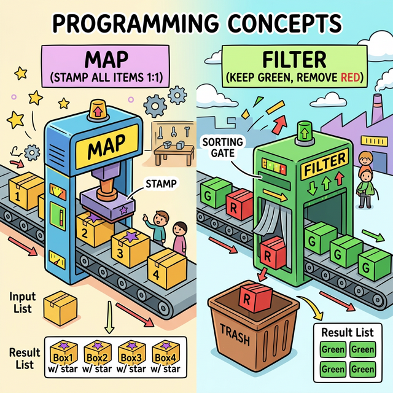
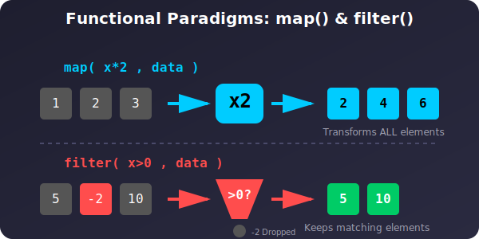

# 3.8.2 함수형 처리 도구 (Map, Filter)

## 학습목표
거대한 숫자 1,000개가 들어있는 리스트의 모든 숫자에 2를 곱해야 한다면 어떻게 해야 할까요? 초보자는 습관적으로 `for` 반복문을 씁니다. 하지만 파이썬이 자랑하는 함수형 패러다임 도구인 `map()`과 `filter()`를 사용하면 거대한 데이터 열(Column) 단위로 변형 작업을 **for문 없이 한 번에(Vectorize)** 처리할 수 있습니다. 3.3.3장에서 배운 이름 없는 함수 **람다(Lambda)** 와 환상적인 호흡을 보여주는 이 도구들을 마스터합니다.


<div align="center">
  
</div>

---

## 💡 TL;DR (1분 핵심 요약)

*   **`map(함수, 데이터)`**: 컨베이어 벨트에 리스트를 올려놓고, 똑같은 도장(함수)을 모든 원소에 "쾅! 쾅! 쾅!" 찍어냅니다. (데이터 일괄 **변형**)
*   **`filter(함수, 데이터)`**: 거름망(True/False를 판별하는 함수)을 통과시켜, 내가 원하는 조건(True)을 만족하는 데이터만 **추출**합니다.
*   위 두 함수는 보통 1회용 함수인 `lambda`와 세트로 묶여 **데이터프레임(Pandas)**의 열(Series) 전처리에 매일같이 쓰입니다.

---

## 1. Map() : 모든 원소에 똑같은 도장 찍기

우리가 가진 리스트의 숫자들을 전부 문자열(String)로 바꾸고 싶다고 가정하겠습니다. 

```python
# 기존의 촌스러운 for문 방식
numbers = [1, 2, 3, 4, 5]
str_numbers_for = []

for n in numbers:
    str_numbers_for.append(str(n)) # 일일이 str() 도장을 찍음

print(str_numbers_for) # ['1', '2', '3', '4', '5']
```

**`map()`을 이용한 우아한 방식**
```python
numbers = [1, 2, 3, 4, 5]

# map(적용할_함수, 데이터배열)
# 내장함수 str을 numbers 리스트 전체에 한 번에 맴핑!
# 주의: map 결과는 제네레이터 객체이므로 list()로 변환해서 까봐야 함.
str_numbers_map = list(map(str, numbers)) 

print(str_numbers_map) # ['1', '2', '3', '4', '5']
```

`map()`과 `람다(lambda)`의 콜라보레이션으로 데이터 형식을 한 번에 바꾸는 데이터 분석 실전 예제입니다.

```python
prices = [1000, 2500, 3000]

# "모든 가격에 10% 부가세를 더해서 곱해주는 1회용 로직(lambda)" 적용
tax_prices = list(map(lambda x: int(x * 1.1), prices))

print(tax_prices) # [1100, 2750, 3300]
```

---

## 2. Filter() : 원하는 조건만 족집게로 걸러내기

이번엔 데이터 속에서 짝수만 걸러내고 싶습니다. `filter`의 첫 번째 인자로 들어가는 함수는 반드시 `True`나 `False`를 뱉어내는 조건 판독기여야 합니다. 

```python
# 기존 for문 + if문 방식 
raw_data = [1, -5, 10, 3, -2, 8]
positives_for = []

for x in raw_data:
    if x > 0: # 양수인지 판별
        positives_for.append(x)

print(positives_for) # [1, 10, 3, 8]
```

**`filter()` + `lambda`의 우아한 방식**
```python
raw_data = [1, -5, 10, 3, -2, 8]

# filter(True를 뱉는 람다식, 데이터배열)
# 양수(x > 0)인 놈들만 거름망을 통과시킴
positives_filter = list(filter(lambda x: x > 0, raw_data))

print(positives_filter) # [1, 10, 3, 8]
```

---

## 3. Map과 Filter의 콤보 파이프라인

데이터 분석 현장에서 가장 흔한 시나리오는 쓰레기가 섞인 배열에서 정상 데이터를 거르고(`filter`), 그 데이터를 특정 형태로 가공하는(`map`) 연속 작업입니다.

```python
# [미션] 매출 데이터 중 올바른 형식의 데이터만 뽑아서, 원화(KRW 1,300원)로 뻥튀기 환전하라!
dirty_sales_usd = [10, "error", 50, -20, 100, None]

# 1단계: filter로 쓰레기(문자열, None, 음수) 거르기 
# (조건: 정수형이면서 0보다 커야 함)
clean_usd = list(filter(lambda x: isinstance(x, int) and x > 0, dirty_sales_usd))
print(f"필터링 1단계: {clean_usd}") # [10, 50, 100]

# 2단계: map으로 환율 적용하기 (1300배)
krw_sales = list(map(lambda x: x * 1300, clean_usd))
print(f"변환 2단계: {krw_sales}") # [13000, 65000, 130000]
```

---

## ☕ Java vs 🐍 Python 스나이퍼 대결

**함수형 프로그래밍(Functional Stream) 비교**

*   **Java 8+**: 자바도 8버전부터 눈부신 발전을 이뤄 똑같은 맵핑을 할 수 있습니다. `list.stream().filter(x -> x > 0).map(x -> x * 1300).collect(Collectors.toList());` 하지만 코드가 여전히 길고 무거우며, 리스트를 먼저 스트림 객체로 뽑고 다시 리스트로 묶는 보일러플레이트 코드가 거슬립니다.
*   **Python**: `map`과 `filter`가 태생부터 내장 함수로 존재하기 때문에 즉시 데이터 덩어리를 욱여넣어 변형이 가능합니다. (물론 이보다 한 단계 더 우아한 버전이 앞서 3.4.1장에서 배운 **리스트 컴프리헨션(List Comprehension)** 기술입니다. 개발자 취향에 따라 컴프리헨션과 Map/Filter를 섞어 씁니다!)

---

## 🎧 Vibe Coding

> **🗣️ 학생 프롬프트 (AI에게 이렇게 명령해 보세요):**
> "내가 가진 학생 성적 리스트가 `scores = [{"name": "A", "score": 45}, {"name": "B", "score": 80}, {"name": "C", "score": 95}]` 이렇게 생겼는데, 파이썬의 `filter()`를 써서 성적이 80점 이상인 합격자 딕셔너리만 쪽 뽑아내 줘! 람다 함수를 꼭 섞어서."

---

## 코딩 영단어 학습 📝

*   **Map (맵 / 맵핑)**: 지도, 배치하다. (수학에서는 하나의 값 $x$ 를 다른 값 $y$ 로 대응시키는 함수 관계인 '사상(Mapping)'을 뜻합니다. `f(x) = y`라는 기계를 거쳐 원래 리스트의 얼굴을 싹 일대일로 맵핑(변형) 시킨다고 이해하세요.)
*   **Filter (필터)**: 거르다, 여과기. (정수기 필터처럼 더러운 불순물이나 조건에 안 맞는 찌꺼기를 걸러내어, 순수한 True 데이터만 아래로 똑똑 떨어뜨립니다.)
