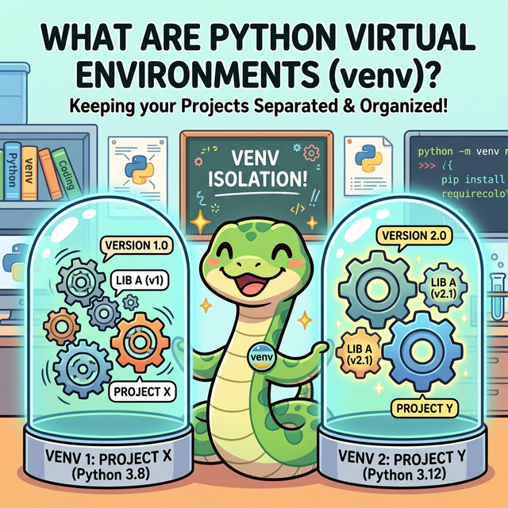
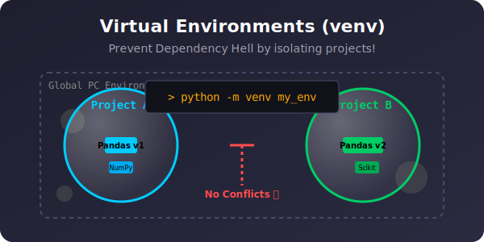

# 3.8.3 환경 격리와 커스텀 모듈 (venv & modules)

## 학습목표
내가 짠 파이썬 코드 길이가 수백 줄을 넘어가면, 마치 수학의 인수분해처럼 코드를 의미 있는 단위(파일)로 쪼개어 다른 파일에서 수입(`import`)해 쓰는 아키텍처적 사고가 필요합니다. 본 장에서는 나만의 커스텀 모듈을 만들 때 필수적인 흑마법 방어막 **`if __name__ == "__main__":`** 의 정체를 파악합니다. 나아가 데이터 분석 여정에서 피할 수 없는 '의존성 지옥(Dependency Hell)'을 막아주는 안전한 방공호, **가상환경(`venv`)**과 패키지 관리장부(`requirements.txt`) 세팅법을 확립합니다.


<div align="center">
  
</div>

---

## 💡 TL;DR (1분 핵심 요약)

*   **커스텀 모듈**: 내가 짜놓은 `my_math.py` 파일은 언제든 다른 파일에서 `import my_math` 로 불러와 쓸 수 있는 훌륭한 부품이 됩니다.
*   **`__name__ == "__main__"`**: 내가 직접 이 파일을 실행했을 때만 동작하고, 남이 나를 `import` 해서 부품으로 쓸 때는 함부로 켜지지 않게 막아주는 방어막 씰(Seal)입니다.
*   **`venv` (가상환경)**: A 프로젝트는 Pandas 1.0이, B 프로젝트는 Pandas 2.0이 필요할 때 파이썬끼리 싸우지 않도록 폴더마다 독립된 원룸을 배정해주는 기술입니다.

---

## 1. 나만의 모듈(Module) 만들기 기초

파이썬에서는 거창한 선언 없이, **그저 `.py` 확장자로 저장한 모든 파일이 모듈(Module)**이 됩니다.

**[상황]**
같은 폴더에 두 개의 파이썬 파일이 존재합니다.
1. `my_tools.py` (도구를 모아놓은 창고 파일)
2. `main.py` (실제 도구를 가져다 쓰는 사령부 파일)

### `my_tools.py` 작성
```python
# my_tools.py
def add(a, b):
    return a + b

def multiply(a, b):
    return a * b

print("my_tools 공장이 가동되었습니다!")
```

### `main.py` 에서 불러다 쓰기
```python
# main.py
import my_tools

# 남의 파일(모듈)에 있는 함수 사용하기!
result = my_tools.add(10, 20)
print(f"결과: {result}")
```

> **🚨 문제 발생!**
> `main.py`를 실행하면 콘솔에 다음과 같이 뜹니다.
> ```text
> my_tools 공장이 가동되었습니다!
> 결과: 30
> ```
> 나는 단순히 함수 부품만 가져오고 싶었는데(`import`), 파이썬은 모듈을 import 하는 순간 그 파일 전체를 한 번 스윽 읽어버립니다. 그래서 원치 않던 `print` 문까지 강제로 터져버리는 부작용이 생깁니다.

---

## 2. 방어막 전개: `if __name__ == "__main__":`

위와 같은 "부작용 터짐 현상"을 막기 위해 파이썬 창시자들이 만들어 둔 룰이 있습니다. 바로 **"이 코드가 직접 실행된 진짜 주인공(Main) 일 때만 작동하라!"**라는 마법의 주문입니다.

### `my_tools.py` 수정본 (방어막 적용)
```python
# my_tools.py
def add(a, b):
    return a + b

# ---- 흑마법 방어막 경계선 ----
if __name__ == "__main__":
    # 이 아래의 코드들은 'my_tools.py'를 [직접 실행] 했을 때만 작동합니다.
    # 남이 import 해서 쓸 때는 코딱지도 건드려지지 않고 철저히 무시됩니다!
    print("my_tools 공장이 [직접 실행]으로 가동되었습니다!")
    print(add(5, 5))
```

이제 다시 `main.py`를 실행해 보면, 쓸데없는 프린트 문장이 뜨지 않고 깔끔하게 덧셈 결과만 출력됩니다!

---

## ☕ Java vs 🐍 Python 스나이퍼 대결

**진입점(Entry Point) 비교**

*   **Java**: 프로그램이 무조건 시작되는 지점은 `public static void main(String[] args)` 라는 거대한 선언문이 독점합니다.
*   **Python**: 파일 실행 시 묻지도 따지지도 않고 최상단부터 순차 실행됩니다. 단축키 격인 보이지 않는 `__name__` 변수에 파이썬이 몰래 `"__main__"` 이라는 명찰을 달아줍니다. 남에게 부품으로 불려왔을 때는 명찰이 `"__main__"` 이 아니기 때문에 방어벽(`if`)을 뚫을 수 없습니다.

---

## 3. 의존성 지옥과 가상환경(Virtual Environment)

실무 개발에서는 여러 외주 프로젝트를 동시에 뜁니다. 
*   A 회사 프로젝트: 원시적인 `Pandas v0.25` 구버전이 필요함
*   B 회사 프로젝트: 최신 `Pandas v2.2` 신버전이 필요함

이때 내 컴퓨터 파이썬 폴더에 `pip install pandas`를 함부로 때리면, 이전 버전을 갈아엎고 신버전만 깔리면서 A 회사 프로젝트에 접속하는 순간 에러를 뿜으며 대폭발(Dependency Hell)합니다. 

이를 막기 위해 파이썬은 해당 소스코드 폴더 안에 **나만의 원룸(가상환경)**을 파주는 `venv` 모듈을 기본 제공합니다.

### 🛠️ 필수 가상환경 세팅 3단계 명령 (터미널)

1. **내 방(원룸) 계약하기 (생성)**
   ```bash
   python -m venv my_env
   # 작업 폴더 안에 'my_env' 라는 작은 파이썬 복사본 폴더가 통째로 지어집니다.
   ```

2. **내 방 불 켜기 (활성화 - Windows VS Code 기준)**
   ```bash
   my_env\Scripts\activate
   # 터미널 프롬프트 앞에 (my_env) 라는 녹색 마크가 뜨면 성공! 이제부터 까는 패키지는 내 컴퓨터(Global)가 아니라 이 원룸에만 격리되어 깔립니다.
   ```

3. **원룸에 가구(패키지) 들여놓기**
   ```bash
   (my_env) pip install pandas matplotlib
   ```

### 📄 영수증 발급: `requirements.txt`

이 프로젝트를 남(팀원 구글 드라이브나 GitHub)에게 넘길 때, 쓸데없이 수백 메가바이트짜리 가상환경 폴더(`my_env`)를 통째로 압축해 보내면 욕을 먹습니다. 
대신, "이 프로젝트를 돌리려면 이 가구(버전) 목록이 필요합니다"라는 **영수증 파일**만 뽑아서 소스코드와 함께 한 장 떨궈주면 됩니다.

*   **영수증 발급 (내가 치는 명령어)**
    ```bash
    pip freeze > requirements.txt
    ```
*   **영수증대로 가구 자동 세팅 (팀원이 치는 명령어)**
    ```bash
    pip install -r requirements.txt
    ```

---

## 🎧 Vibe Coding

> **🗣️ 학생 프롬프트 (AI에게 이렇게 명령해 보세요):**
> "파이썬 `venv` 가상환경을 잡았는데 터미널에서 빨간색으로 `PSSC 실행 정책 요류 (허가되지 않은 스크립트 실행 불가)` 같은 보안 에러 뜨면서 `activate`가 안 먹혀. 이거 윈도우 파워쉘 보안 문제 같은데 어떻게 우회해서 켤 수 있는지 알려줘." *(💡 VS Code 초기 세팅 시 가장 많이 부딪히는 실전 버그 투표 1위입니다!)*

---

## 코딩 영단어 학습 📝

*   **Dependency Hell (디펜던시 헬)**: 의존성 지옥. (내 코드가 A모듈에 의존하고, A모듈은 B모듈 버전1에 의존하는데, 내가 새로 깐 C모듈이 B모듈 버전2를 깔아 덮어버리면서 전체 프로그램이 연쇄 붕괴하는 악몽 같은 상황입니다. 가상환경이 피난처입니다.)
*   **Virtual Environment (버추얼 엔바이런먼트 / venv)**: 가상 환경. (현실의 내 컴퓨터(자원)를 더럽히지 않고 샌드박스처럼 격리된 파이썬 실행 환경. 폴더 단위로 1채씩 지어집니다.)
*   **Freeze (프리즈)**: 얼리다, 고정하다. (`pip freeze`는 지금 당장 내 원룸에 깔려있는 패키지와 그 정확한 버전 번호(예: `pandas==2.0.3`)를 스냅샷 사진 찍듯 딱 얼려서 출력해주는 명령어입니다.)
