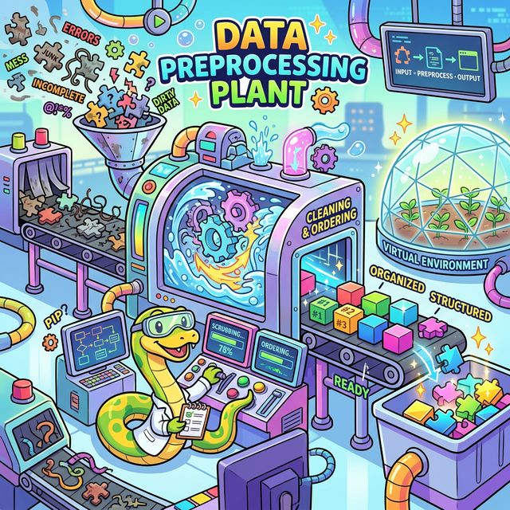

# 3.8 데이터 전처리와 환경 세팅 심화 (Pre-processing & Env)

## 학습목표
지금까지 배운 파이썬 3대장(제어문, 자료구조, 시각화)만으로도 훌륭한 프로그램을 짤 수 있습니다. 하지만 본격적인 실무 데이터 분석(Pandas)이라는 거대한 바다로 나가기 전, 피할 수 없는 두 가지 장벽이 기다리고 있습니다.

첫째는 **더럽고 꼬인 텍스트 데이터(문자열 정제)**이고, 둘째는 **패키지 충돌로 폭발하는 내 컴퓨터 환경(의존성 관리)**입니다. 본 장에서는 진짜 실무를 위해 반드시 갖춰야 할 '데이터 클렌징 피지컬'과 '안전한 격리 환경 구축법'을 마스터합니다.

---

## 📑 세부 학습 목차

### [3.8.1 문자열 정제와 데이터 클렌징 (String & Regex)](./01_string_manipulation/)
*   **텍스트 세탁소**: 스크래핑해 온 데이터에 묻어있는 불필요한 공백을 깎아내고(`strip`), 오타를 찾아 일괄 교체하고(`replace`), 문장을 단어 단위로 토막 내는(`split`) 핵심 마법을 배웁니다.
*   **정규표현식(Regex) 기초**: 수십 개의 `if`문으로도 못 잡는 복잡한 이메일이나 주민번호 패턴을 단 한 줄의 암호 같은 코드로 싹쓸이해 내는 개발자의 궁극기, `re` 모듈을 경험합니다.

### [3.8.2 함수형 처리 도구 (Map, Filter)](./02_functional_map_filter/)
*   **데이터 맵핑과 필터링**: 거대한 배열이나 데이터프레임의 모든 원소에 `for`문 없이 한 방에 함수를 적용시키는 `map()`과, 원하는 조건만 족집게처럼 뽑아내는 `filter()`의 함수형 패러다임을 이해합니다.
*   앞서 배운 람다(Lambda) 함수와 환상적인 궁합을 자랑하는 실전 예제를 실습합니다.

### [3.8.3 환경 격리와 커스텀 모듈 (venv & modules)](./03_modules_and_venv/)
*   **나만의 라이브러리 만들기**: 남이 만든 모듈만 수입(`import`)하는 것을 넘어, 내가 짠 코드를 여러 파일로 쪼개어 체계적으로 조립하는 아키텍처(`__name__ == "__main__"`)를 배웁니다.
*   **가상환경(venv)과 패키지 관리**: 프로젝트마다 서로 다른 라이브러리 버전이 충돌하지 않도록 완벽히 격리된 방을 파고(`venv`), 내가 쓴 패키지 영수증(`requirements.txt`)을 뽑아 남들에게 공유하는 프로페셔널한 세팅법을 확립합니다.

---

## 🎉 정리
이 장을 마스터함으로써 여러분은 더러운 쓰레기 데이터를 반짝이는 금괴로 정제기술을 터득한 진정한 '데이터 마이너(Data Miner)'로 거듭났습니다! 뿐만 아니라 가상환경(`venv`)과 모듈 설계의 프로페셔널한 지식까지 장착했으니, 이제 당장 내일 거대한 실무 Pandas 데이터프레임이나 통계 알고리즘 코드를 작성하더라도 컴퓨터 터질 일 없이 우아하게 프로젝트를 이끌어나갈 준비가 끝났습니다.
