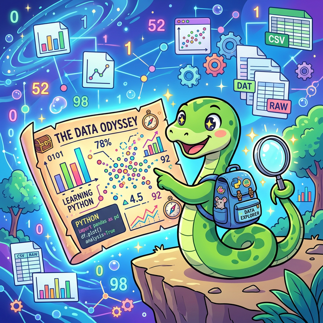

# 3 파이썬 기반 데이터 분석 기초 체력

문서가 각각의 주제별로 분리되었습니다. 아래의 링크를 클릭하여 해당 학습 내용으로 이동하세요.

## 학습목표 {#objectives}
- **기초 문법 구사**: 파이썬의 핵심 기본 문법(변수, 자료형, 연산자)을 이해하고 활용할 수 있다.
- **흐름 제어**: 조건문(`if`, `match`)과 반복문(`for`, `while`)을 바탕으로 논리적인 제어 흐름을 설계할 수 있다.
- **자료 구조 이해**: 리스트, 딕셔너리, 튜플, 세트의 특성과 메서드들을 숙지하고 목적에 맞게 사용할 수 있다.
- **객체지향 설계**: 클래스와 인스턴스를 이해하고, 상속과 다형성, 추상화 개념을 접목하여 견고한 객체지향 프로그래밍(OOP)을 수행한다.
- **데이터 활용 실무**: 파일 입출력을 시작으로 GUI 프로그래밍, 데이터 클렌징(전처리)과 환경 변수 관리 등 본격적인 Pandas 진입을 위한 실무 기반을 마스터한다.

---

## 3.1 파이썬 기초 {#section-01}

### [3.1.1 데이터 분석 언어와 파이썬의 미래](/python/01_basic/01_python_intro/)
일반 소프트웨어 개발 언어와 데이터 분석용 특화 언어의 차별점을 이해하고, 파이썬을 선택하는 비전과 로드맵을 명확히 알아봅니다.

### [3.1.2 주석과 상수](/python/01_basic/02_comments_constants/)
파이썬의 기본 문법인 주석 작성법과 정수, 실수 등 다양한 상수 값의 개념을 알아봅니다.

### [3.1.3 변수와 대입](/python/01_basic/03_variables_assignment/)
데이터를 임시로 저장하는 변수에 값을 담는 대입 연산자 `=`를 사용하는 방법을 배웁니다.

### [3.1.4 변수 이름 조건](/python/01_basic/04_variable_naming/)
파이썬에서 변수나 함수 등 식별자 이름을 지을 때 지켜야 할 규칙과 제약사항을 정리합니다.

### [3.1.5 자료형(Data Types)의 이해](/python/01_basic/05_data_types_operators/)
정수, 실수, 논리, 문자열, 복소수 등 파이썬이 제공하는 기본 구조와 수의 체계를 살펴봅니다.

### [3.1.6 다양한 연산자](/python/01_basic/06_various_operators/)
사칙연산, 몫, 나머지 등 연산자의 사용법을 학습합니다.

### [3.1.7 내장 함수와 메서드 활용](/python/01_basic/07_built_in_functions/)
파이썬 설치 시 기본으로 제공되는 유용한 내장 함수와 형변환 도구들의 기능을 파악합니다.

### [3.1.8 내장 모듈 math 활용](/python/01_basic/07_math_module/)
수학적인 연산이 필요할 때 기본 탑재된 `math` 모듈을 불러들여 사용하는 방법을 배웁니다.

---

## 3.2 제어 흐름 {#section-02}

### [3.2.1 조건문 if](/python/02_control_flow/01_if_statement/)
특정 조건일 때만 코드를 실행하게 하는 `if`, `elif`, `else` 구문을 학습합니다.

### [3.2.2 match 구문](/python/02_control_flow/02_match_statement/)
최신 파이썬에 도입된 패턴 매칭 구문인 `match` 문의 사용법을 살펴봅니다.

### [3.2.3 반복문 for와 while](/python/02_control_flow/03_for_while_loops/)
요소들을 순회하는 `for` 문과 조건이 참인 동안 반복하는 `while` 문의 패러다임을 이해합니다.

### [3.2.4 예외 처리](/python/02_control_flow/04_exceptions/)
프로그램 실행 중 발생하는 오류(Error)를 우아하게 잡아내고 대비하는 예외 처리(`try~except`) 기법을 익힙니다.

---

## 3.3 함수 {#section-03}

### [3.3.1 함수란 무엇인가?](/python/03_functions/01_function_concepts/)
함수의 개념을 블랙박스와 마법 오븐 비유를 통해 능동적으로 이해합니다.

### [3.3.2 함수 선언과 사용](/python/03_functions/02_function_usage/)
파이썬에서 `def`로 함수를 정의하고 다중 반환과 인수를 다루는 실전 문법을 익힙니다.

### [3.3.3 변수 스코프와 람다 함수](/python/03_functions/03_lambda_functions/)
지역/전역 변수를 이해하고, 데이터 전처리에 필수적인 이름 없는 함수 `lambda` 익명 함수의 작성법을 배웁니다.

---

## 3.4 자료 구조 {#section-04}

### [3.4.1 리스트](/python/04_data_structures/01_list/)
파이썬의 대표 자료구조인 리스트의 다기능적 특징과 슬라이싱 기법을 배웁니다.

### [3.4.2 사전](/python/04_data_structures/02_dictionary/)
키와 값의 결합으로 이루어진 해시 맵 형태의 강력한 사전 구조를 익힙니다.

### [3.4.3 튜플](/python/04_data_structures/03_tuple/)
데이터를 안전하게 보호하는 불변(Immutable) 특성을 지닌 튜플을 배웁니다.

### [3.4.4 집합](/python/04_data_structures/04_set/)
중복을 제거하고 교집합/합집합 연산을 초고속으로 수행하는 세트를 배웁니다.

### [3.4.5 수정 불가능(immutable)과 함수 hash() id()](/python/04_data_structures/05_immutable_hash_id/)
파이썬 객체들의 불변 특성과 메모리 구조의 핵심인 해시 원리를 판별합니다.

---

## 3.5 객체지향 {#section-05}

### [3.5.1 클래스와 인스턴스](/python/05_oop/01_class_instance/)
`self` 키워드와 클래스 생성 도면을 파악하여 실용적인 객체를 직접 설계해 봅니다.

### [3.5.2 상속과 다형성](/python/05_oop/02_inheritance_polymorphism/)
상속을 통한 코드 재사용성과 객체지향의 꽃인 다형성(오버라이딩)을 마스터합니다.

### [3.5.3 추상화와 인터페이스](/python/05_oop/03_abstraction_interface/)
설계의 본질인 가이드라인, 즉 추상 클래스와 파이썬 특유의 덕 타이핑(Duck Typing)을 이해합니다.

---

## 3.6 데이터 입출력 (File I/O & Prep) {#section-06}

### [3.6.1 파일 입출력의 개념과 필요성](/python/06_data_viz_prep/01_file_io_concept/)
메모리와 디스크의 본질적인 차이를 이해하고 영구 저장을 위한 입출력을 알아봅니다.

### [3.6.2 파일 열기와 닫기 (open, with)](/python/06_data_viz_prep/02_file_open/)
파이썬에서 안전하게 파일을 읽고 쓰는 `with open()` 문맥 관리자 문법을 배웁니다.

### [3.6.3 데이터 분석 실습 (Matplotlib 맛보기)](/python/06_data_viz_prep/03_data_analysis/)
텍스트 파일에 담긴 데이터를 파이썬으로 파싱하고 시각화하는 맛보기 프로젝트를 수행합니다.

---

## 3.7 GUI 프로그래밍 {#section-07}

### [3.7.1 GUI 구동 원리와 환경 설정](/python/07_gui_programming/01_gui_principles/)
개발자 콘솔 창을 넘어 일반 사용자를 위한 윈도우 인터페이스를 만드는 철학을 이해합니다.

### [3.7.2 첫 GUI: Hello World와 Mainloop](/python/07_gui_programming/02_tkinter_hello_world/)
Tkinter를 이용해 메인 윈도우를 띄우고 종료 전까지 계속 도는 메인루프 이벤트를 알아봅니다.

### [3.7.3 위젯 배치와 이벤트 구동](/python/07_gui_programming/03_widget_layout/)
명령어 버튼클릭 등 사용자의 이벤트 액션과 요소들을 배치하는 레이아웃 매니저를 습득합니다.

### [3.7.4 미니 프로젝트: CSV 데이터를 GUI로 띄우기](/python/07_gui_programming/04_data_analysis_gui/)
파일 입출력과 시각화, 그리고 마우스 이벤트를 결합하여 로컬 데이터 분석 프로그램(exe)뷰어를 완성해 봅니다.

---

## 3.8 데이터 전처리와 환경 세팅 심화 {#section-08}

### [3.8.1 문자열 정제와 데이터 클렌징](/python/08_data_preprocessing/01_string_manipulation/)
`strip`, `replace`, `split` 등의 체인 액션과 정규표현식(`re`)으로 오염된 텍스트 데이터를 정리하는 기술을 배웁니다.

### [3.8.2 함수형 처리 도구 (Map, Filter)](/python/08_data_preprocessing/02_functional_map_filter/)
수백만 개의 데이터를 `for`문 없이 한 번에 일괄 변형하고 조건 추출하는 `map()`과 `filter()` 함수형 프로그래밍을 마스터합니다.

### [3.8.3 환경 격리와 커스텀 모듈 (venv & modules)](/python/08_data_preprocessing/03_modules_and_venv/)
충돌 없는 패키지 관리장부인 가상환경(`venv`)과 외부 모듈 설계 방어막(`__name__ == "__main__"`)의 원리를 파악합니다.

---

## 🎉 마무리 정리
지금까지 파이썬의 핵심 문법부터 시작해 강력한 백본인 제어/자료구조, 객체지향 철학, 그리고 실전 프로젝트 성격인 파일 입출력/GUI/데이터 클렌징/가상환경 세팅까지 거대한 산맥을 완벽히 넘었습니다. 대단히 수고 많으셨습니다! 

이것은 단순히 파이썬이라는 언어 하나를 배운 것이 아니라, 수천만 줄짜리 엑셀이나 정형 데이터를 자유자재로 요리하여 새로운 비즈니스 통찰(Insight)을 도출해 낼 **"최고급 엔진 설계도"**를 획득하신 것과 같습니다.

이제 당신은 이 엔진을 싣고 데이터의 호수(Data Lake)를 자유롭게 항해하는 차세대 핵심 기술, **Pandas와 머신러닝** 세계로 뛰어들 모든 기초 체력을 완성했습니다. 다음 여정에서 뵙겠습니다!
