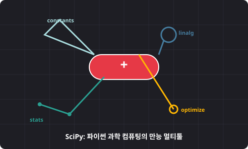

# 7.1.1 사이파이 개요 및 특징


> **NumPy는 화물 상자(ndarray)를 실어 나르는 트럭이고, SciPy는 그 화물들을 분석하고 설계하는 고성능 연구실(멀티툴)입니다.**

---

## 1. 과학용 컴퓨팅(Scientific Computing)의 난제
데이터를 수집하여 2차원 표나 다차원 배열로 정리한 직후, 분석가는 다음과 같은 복잡한 수학적 연산 요구에 직면합니다.
* **보정**: 기온 관측 장비가 1시간 단위로 기록한 흩어진 점들 사이를 메워서 매끄러운 24시간 곡선으로 만들고 싶을 때 (보간법)
* **최적화**: 회사 물류 창고의 배송 비용을 최소화하는 최적의 배송 경로 및 변수 값을 찾고 싶을 때 (최적화)
* **신호 분석**: 잡음이 가득한 음성 파일에서 특정 주파수 대역만 걸러내고 깨끗한 소리로 정화하고 싶을 때 (신호 처리)

단순 사칙연산과 행렬 곱을 지원하는 NumPy만으로는 이 모든 복잡한 알고리즘을 매번 바닥부터 구현해야 합니다. 이 어려움을 한 방에 해결해 주기 위해 등장한 패키지가 바로 **SciPy(사이파이)**입니다.

---

## 2. NumPy vs SciPy: 역할의 경계

SciPy는 내부적으로 NumPy를 완전히 포함(Wrapper)하고 있으며, NumPy의 `ndarray` 배열 데이터를 연산 대상으로 삼습니다. 두 라이브러리의 기능적 비유는 다음과 같습니다.

| 구분 | **NumPy (넘파이)** | **SciPy (사이파이)** |
| :--- | :--- | :--- |
| **비주얼 비유** | **컨테이너 트럭 🚛** | **국가 지정 첨단 과학 연구실 🔬** |
| **핵심 역할** | 대규모 수치 데이터를 연속적인 메모리에 규격화하여 적재하고, 초고속으로 전송 및 단순 가공 | 적재된 데이터를 바탕으로 고차원 미적분, 방정식 찾기, 통계 검정, 최적 경로 계산 등 전문 연산 수행 |
| **핵심 객체** | `ndarray` (다차원 배열 객체 하나에 집중) | `scipy.optimize`, `scipy.stats` 등 각 도구에 최적화된 복합 알고리즘 및 함수군 |

---

## 3. 🎧 Vibe Coding: SciPy 설치 및 동작 테스트

SciPy를 사용하려면 라이브러리를 설치하고 가져와야 합니다. 

> **🗣️ 학생 프롬프트 (AI에게 이렇게 명령해 보세요):**
> "SciPy 패키지가 무엇인지, NumPy와 어떤 시너지를 내는지 아주 친절하게 설명해 주고, `pip install scipy`로 설치하는 방법과 라이브러리 버전을 파이썬 쉘에서 확인하는 예제 코드를 짜줘."

### 실전 코드 작성
```python
import numpy as np
import scipy

print(f"NumPy 버전: {np.__version__}")
print(f"SciPy 버전: {scipy.__version__}")
```

### [실행 결과 해석]
```text
NumPy 버전: 1.26.4
SciPy 버전: 1.13.1
```
버전이 출력된다면, 당신의 파이썬 가상환경에 데이터 과학 연구 엔진이 안전하게 이식된 것입니다.

---

## 코딩 영단어 학습 📝

코딩에서 영어 단어의 의미만 정확히 이해해도 절반은 성공입니다! 오늘 배운 핵심 영단어들이나 약자들을 다시 한번 짚고 넘어가 볼까요?

*   **`SciPy (Scientific Python)`**: 과학용 파이썬. 과학, 공학, 수학 계산을 위한 핵심 라이브러리입니다.
*   **`Wrapper (래퍼)`**: 포장지. 내부의 복잡한 로직이나 다른 데이터 구조를 겉에서 한 번 더 감싸서 사용하기 편하게 포장해 놓은 코드 단위입니다.
*   **`Scientific Computing`**: 과학용 컴퓨팅. 수학적 모델과 컴퓨터를 이용해 복잡한 과학/공학 문제를 해결하는 컴퓨터 과학의 한 분야입니다.
