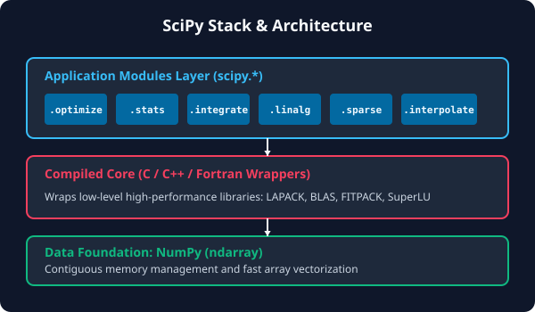

# 7.1.2 설치 및 아키텍처


> **SciPy는 파이썬의 편리함 뒤에 C와 Fortran으로 작성된 세계 최고 수준의 고속 수학 엔진(LAPACK/BLAS)들을 결합한 고성능 아키텍처를 품고 있습니다.**

---

## 1. SciPy의 고성능 비밀: 컴파일드 코어(Compiled Core)
파이썬은 개발이 쉽고 가독성이 높은 언어이지만, 대량의 행렬 연산이나 미적분 등 복잡한 수치 연산을 순수 파이썬 루프로 수행하면 속도가 매우 느려집니다. 
SciPy는 이 문제를 해결하기 위해, 수십 년간 신뢰성과 성능이 검증된 **저수준 C, C++, Fortran 컴파일 라이브러리**를 감싸는(Wrap) 방식으로 아키텍처가 설계되어 있습니다.

*   **BLAS (Basic Linear Algebra Subprograms)**: 벡터와 행렬의 기초 연산(곱셈, 덧셈 등)을 초고속으로 수행하는 최저 수준 라이브러리입니다.
*   **LAPACK (Linear Algebra Package)**: BLAS 위에서 동작하며 행렬 분해(LU, QR, SVD 등)와 연립방정식 풀이 등을 제공하는 수치 선형대수의 표준 라이브러리입니다.
*   **FITPACK & SuperLU**: 곡선 보간(Fitting)과 희소 행렬 연산을 해결하기 위한 전문 컴파일 패키지입니다.

파이썬 개발자가 `scipy.linalg`나 `scipy.optimize` 모듈을 실행하면, 파이썬 인터프리터가 아닌 내부의 최적화된 C/Fortran 컴파일 본체가 호출되므로 C언어 수준의 압도적인 실행 속도를 낼 수 있습니다.

---

## 2. SciPy 설치 가이드
SciPy를 개발 환경에 설치하는 가장 표준적이고 간단한 방법은 `pip` 또는 `conda` 패키지 관리자를 사용하는 것입니다.

### pip를 이용한 설치 (일반 환경)
가상환경(venv)을 활성화한 후 터미널에 다음 명령어를 입력합니다.
```bash
pip install scipy
```
*이 명령은 필요한 필수 의존성 패키지인 **NumPy**도 자동으로 감지하여 함께 설치합니다.*

### conda를 이용한 설치 (Anaconda 환경)
데이터 과학 및 분석 전용 배포판인 Anaconda 또는 Miniconda 환경을 사용한다면 아래 명령어로 설치합니다.
```bash
conda install scipy
```

---

## 3. 🎧 Vibe Coding: 설치 확인 및 라이브러리 아키텍처 진단
SciPy가 성공적으로 설치되었는지 확인하고, 현재 시스템에서 어떤 고성능 컴파일 라이브러리(BLAS/LAPACK)와 연결되어 연산 속도를 가속하고 있는지 확인해 보겠습니다.

> **🗣️ 학생 프롬프트 (AI에게 이렇게 명령해 보세요):**
> "SciPy 라이브러리가 내 컴퓨터에서 어떤 BLAS/LAPACK 라이브러리를 통해 최적화되어 있는지 출력해 주는 파이썬 코드를 작성해 줘. 그리고 그 결과를 해석해 줘."

### 실전 코드 작성
```python
import scipy

# SciPy가 내부적으로 연결하고 있는 하드웨어 가속 라이브러리 정보 출력
scipy.show_config()
```

### [실행 결과 해석 (예시)]
```text
Build Dependencies:
  blas:
    name: openblas
    found: true
    ...
  lapack:
    name: openblas
    found: true
    ...
```
*실행 환경에 따라 `openblas`, `MKL` (Intel Math Kernel Library), 혹은 macOS의 `Accelerate` 프레임워크가 보일 수 있습니다. 이 이름들이 나타난다면 SciPy가 최적화된 컴파일 라이브러리와 올바르게 바인딩되어 고속 연산을 수행할 준비가 완료되었음을 의미합니다.*

---

## 코딩 영단어 학습 📝

*   **`Architecture (아키텍처)`**: 구조. 소프트웨어나 하드웨어의 구성 요소들이 서로 어떻게 상호작용하고 결합해 있는지를 나타내는 설계 방식입니다.
*   **`Dependency (의존성)`**: 프로그램이 작동하기 위해 반드시 미리 설치되어 있거나 필요한 외부 라이브러리나 패키지를 의미합니다.
*   **`show_config() (설정 표시)`**: 설정 및 빌드 환경을 보여주는 함수입니다. 라이브러리가 어떤 컴파일러와 물리 가속 엔진을 사용하는지 내부 정보를 출력할 때 유용하게 쓰입니다.
