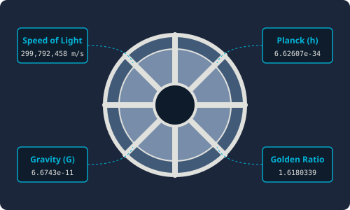

# 7.2.1 상수 모듈 (scipy.constants)


> **scipy.constants는 세계 과학 기구들이 합의한 물리적 규격과 고정된 절대 단위를 모아놓은 '우주 공통 도량형 보관소'입니다.**

---

## 1. 수작업 상수 입력의 재앙
우주선을 쏘아 올리거나 정밀 반도체를 설계할 때 광속($$c$$)이나 플랑크 상수($$h$$) 같은 정밀한 물리 계수를 사용해야 합니다.
이때 개발자가 직접 소수점 아래 10자리까지 `c = 299792458`이나 `h = 6.62607015e-34` 같은 수치들을 코드에 하드코딩하게 되면 다음과 같은 재앙이 발생합니다.
1. **오타 위험**: 0 하나를 빼먹거나 자릿수를 잘못 표기해 계산 전체가 빗나감.
2. **해석 불가**: `6.626e-34`가 무엇을 뜻하는 숫자 식별자인지 코드를 읽는 동료가 직관적으로 이해하지 못함.
3. **단위 혼선**: 마일(mile), 파운드(lb), 섭씨(°C) 등 지역마다 다른 단위들을 계산할 때 직접 변환 공식을 구현하다 오차가 생김.

`scipy.constants`는 국제 도량형 위원회(CODATA)의 표준 측정 자료를 파이썬 코드 안으로 즉각 불러오는 **절대 상수 자물쇠** 역할을 합니다.

---

## 2. 주요 제공 상수군

이 모듈은 수학적 무리수부터 전자기학, 양자역학, 천문학적 핵심 변수를 총망라합니다.

* **수학 상수**: 원주율 `pi`, 황금비 `golden`
* **물리 기본 상수**: 빛의 속도 `c` (또는 `speed_of_light`), 플랑크 상수 `h`, 만유인력 상수 `G`, 아보가드로 수 `Avogadro`
* **단위 접두사**: 킬로 `kilo` ($$10^3$$), 메가 `mega` ($$10^6$$), 마이크로 `micro` ($$10^{-6}$$), 나노 `nano` ($$10^{-9}$$)

---

## 3. 🎧 Vibe Coding: 물리 상수 조회 및 단위 변환

> **🗣️ 학생 프롬프트 (AI에게 이렇게 명령해 보세요):**
> "파이썬 `scipy.constants`를 사용해서 빛의 속도(c)와 플랑크 상수(h)를 구해서 출력하고, 100마일(mile)을 킬로미터(km)로, 150파운드(pound)를 킬로그램(kg)으로 바꾸는 변환 코드를 구현해줘."

### 실전 코드 작성
```python
import scipy.constants as const

# 1. 절대 물리 상수 조회
print(f"1. 빛의 속도 (c)     : {const.c} m/s")
print(f"2. 플랑크 상수 (h)    : {const.h} J·s")
print(f"3. 만유인력 상수 (G)  : {const.G} m^3/(kg·s^2)")
print(f"4. 아보가드로 수      : {const.Avogadro} mol^-1")
print(f"5. 황금비 (golden)   : {const.golden}\n")

# 2. 국제 단위 변환 (마일 -> 미터 -> 킬로미터)
mile_in_meters = const.mile
hundred_miles_to_km = (100 * mile_in_meters) / const.kilo
print(f"6. 100 마일(mile)은 {hundred_miles_to_km:.2f} km 입니다.")

# 3. 질량 단위 변환 (파운드 -> 킬로그램)
pound_in_kg = const.pound
hundred_fifty_lbs_to_kg = 150 * pound_in_kg
print(f"7. 150 파운드(lb)는 {hundred_fifty_lbs_to_kg:.2f} kg 입니다.")
```

### [실행 결과 해석]
```text
1. 빛의 속도 (c)     : 299792458.0 m/s
2. 플랑크 상수 (h)    : 6.62607015e-34 J·s
3. 만유인력 상수 (G)  : 6.6743e-11 m^3/(kg·s^2)
4. 아보가드로 수      : 6.02214076e+23 mol^-1
5. 황금비 (golden)   : 1.618033988749895

6. 100 마일(mile)은 160.93 km 입니다.
7. 150 파운드(lb)는 68.04 kg 입니다.
```
소수점 끝자리까지 오차 없이 합의된 표준 스케일 수치들이 정확히 적용된 것을 확인할 수 있습니다. 이제 계산할 때 귀찮게 구글에 단위 변환 수치를 입력할 필요 없이 `scipy.constants` 상수를 곱해주기만 하면 됩니다.

---

## 코딩 영단어 학습 📝

코딩에서 영어 단어의 의미만 정확히 이해해도 절반은 성공입니다! 오늘 배운 핵심 영단어들이나 약자들을 다시 한번 짚고 넘어가 볼까요?

*   **`Constants`**: 상수. 변하지 않고 고정된 값을 의미합니다.
*   **`Vault`**: 금고, 보관소. 안전하게 귀중품을 저장해 두는 곳입니다.
*   **`CODATA`**: 국제 과학 기술 데이터 위원회. 전 세계 과학 상수 표준을 권고하는 공인 기관입니다.
*   **`Avogadro`**: 아보가드로. 물질량 단위인 1몰(mol) 안에 들어있는 입자 수의 상수입니다.
