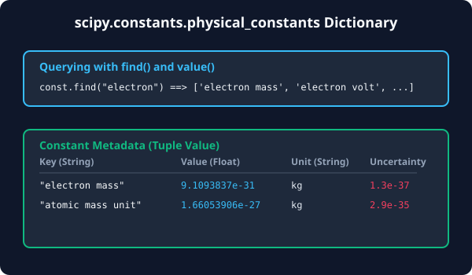

# 7.2.2 물리 상수군과 검색


> **물리학, 화학, 천문학 등 정밀 과학 분야에서 상수는 단순히 숫자 하나가 아닙니다. 값과 표준 오차(불확도), 그리고 물리 단위가 결합된 정보 패키지입니다.**

---

## 1. 물리 상수 딕셔너리 구조
`scipy.constants.physical_constants`는 단순한 변수가 아니라, 파이썬 **딕셔너리(Dictionary)** 구조로 되어 있습니다. 
원하는 물리 상수의 고유 키(String)를 대괄호 `[]` 안에 넣어서 조회하면, 다음과 같은 **3요소 튜플(Tuple)**을 반환합니다.

$$\text{physical\_constants[키]} \rightarrow (\text{값}, \text{단위}, \text{불확도})$$

*   **값 (Value)**: 과학 표준 단위계(SI Unit)로 표현된 상수의 실수값입니다.
*   **단위 (Unit)**: 해당 상수가 나타내는 물리적 단위(예: `kg`, `J`, `m/s`)입니다.
*   **불확도 (Uncertainty)**: 측정 상수의 정밀성을 나타내는 표준 편차입니다. (상수가 정의된 고정 상수인 경우 불확도는 `0.0`입니다.)

---

## 2. 원하는 상수를 찾는 열쇠: find()
SciPy에는 수백 가지의 물리 상수가 들어있기 때문에, 정확한 키의 이름을 외우기 어렵습니다. 이때 특정 키워드로 상수의 이름을 검색할 수 있는 유용한 도구가 **`scipy.constants.find()`** 함수입니다.

*   `const.find('electron')`: 'electron'이라는 단어가 들어간 모든 상수 키 리스트를 반환합니다.
*   `const.find('mass')`: 질량과 관련된 물리 상수 키들을 모두 검색해 줍니다.

---

## 3. 🎧 Vibe Coding: 전자(electron) 관련 상수 검색 및 조회
직접 'electron'(전자)과 관련된 상수를 검색하고, 전자의 정밀 질량을 구하는 코드를 구현해 보겠습니다.

> **🗣️ 학생 프롬프트 (AI에게 이렇게 명령해 보세요):**
> "scipy.constants에서 'electron'이 포함된 상수의 목록을 검색해서 출력해 줘. 그리고 그중에서 'electron mass'의 정확한 값, 단위, 오차 범위를 가져와 출력하는 예제 코드를 짜줘."

### 실전 코드 작성
```python
import scipy.constants as const

# 1. 'electron' 키워드가 들어간 물리 상수 목록 검색
electron_constants = const.find("electron")
print("=== 전자(electron) 관련 상수 목록 ===")
for key in electron_constants[:5]:  # 상위 5개만 출력
    print(f"- {key}")
print("...\n")

# 2. 'electron mass'의 구체적인 정보 조회
# 딕셔너리에서 튜플 형태로 언패킹(Unpacking)
value, unit, uncertainty = const.physical_constants["electron mass"]

print("=== 전자 질량(electron mass) 상세 정보 ===")
print(f"1. 상수값   : {value} {unit}")
print(f"2. 물리 단위 : {unit}")
print(f"3. 불확도   : {uncertainty} (표준편차)")
```

### [실행 결과 해석]
```text
=== 전자(electron) 관련 상수 목록 ===
- electron mass
- electron mass energy equivalent
- electron mass energy equivalent in MeV
- electron volt
- electron volt-atomic mass unit relationship
...

=== 전자 질량(electron mass) 상세 정보 ===
1. 상수값   : 9.1093837015e-31 kg
2. 물리 단위 : kg
3. 불확도   : 1.5e-40 (표준편차)
```
*`const.find()`를 활용하면 방대한 상수 사전에서 정확한 이름을 쉽게 검색할 수 있으며, 튜플 언패킹을 통해 복잡한 오차 계산이나 논문용 단위 표기를 코드 상에서 세밀하게 자동화할 수 있습니다.*

---

## 코딩 영단어 학습 📝

*   **`Physical Constants`**: 물리 상수. 자연계에 존재하는 변하지 않는 물리적 기본 상수군을 의미합니다.
*   **`Uncertainty (불확도)`**: 오차 범위. 측정값의 정밀도를 나타내는 척도이며, 이 값이 작을수록 신뢰도가 높습니다.
*   **`Find (찾기)`**: 검색 함수. 특정 패턴이나 키워드를 기반으로 딕셔너리 안의 일치하는 키 리스트를 탐색할 때 사용됩니다.
