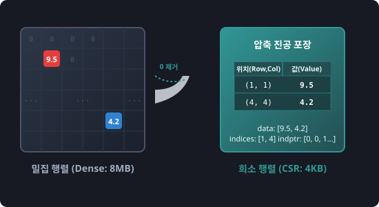

# 7.3.1 희소 행렬 (scipy.sparse)


> **희소 행렬(Sparse Matrix)은 방대한 숫자 격자판에서 가치 없는 '공기(0)'를 모두 빨아들여 압축하고, 오직 의미 있는 '알맹이(0이 아닌 숫자)'들만 좌표표와 함께 납작하게 진공 포장하는 기술입니다.**

---

## 1. 밀집 행렬(Dense Matrix)의 메모리 폭탄
텍스트 분석에서 단어-문서 행렬을 만들거나 추천 시스템에서 사용자-아이템 평가 행렬을 만들 때, 행렬의 크기는 10만 행 x 10만 열(총 100억 개 원소) 이상으로 커집니다.
그러나 실제 사용자가 평가를 남긴 아이템이나 문서에 나타난 단어는 전체의 0.1%도 되지 않으며, 나머지 99.9%는 전부 숫자 `0`으로 가득 차 있습니다.

만약 이 행렬을 일반적인 NumPy 배열(`dense_matrix`)에 그대로 적재하면 어떻게 될까요?
* **메모리 폭탄**: 100억 개의 float64 원소는 약 **80기가바이트(GB)**의 RAM 공간을 요구하여 일반 컴퓨터에서는 메모리 부족(OOM)으로 즉시 다운됩니다.
* **연산 낭비**: 컴퓨터 CPU는 아무 의미도 없는 `0 * 0` 이나 `0 + 0` 연산을 처리하기 위해 무의미한 클럭 회전을 무한 반복합니다.

`scipy.sparse`는 이 0으로 가득 찬 거품 행렬에서 **0이 아닌 값들의 위치와 값만 기록**하여 메모리 점유율을 메가바이트(MB) 단위로 줄여주는 **메모리의 수호자** 역할을 합니다.

---

## 2. 희소 행렬의 3대 대표 포맷

SciPy는 데이터 가공 및 연산 목적에 맞춰 여러 희소 행렬 포맷을 지원합니다.

1. **COO 포맷 (Coordinate)**
   * **원리**: `(행 번호, 열 번호, 값)`의 단순 리스트 형태로 저장합니다.
   * **용도**: 데이터를 맨 처음 수집하여 희소 행렬로 생성/조립할 때 가장 쉽고 직관적입니다.
2. **CSR 포맷 (Compressed Sparse Row)**
   * **원리**: 행(Row) 정보의 시작 포인터를 압축하여 메모리 효율을 극대화합니다.
   * **용도**: 행 단위 슬라이싱 및 **행렬 곱셈($$A \times B$$) 연산 속도가 가장 빨라** 모델 학습에 주로 사용됩니다.
3. **CSC 포맷 (Compressed Sparse Column)**
   * **원리**: 열(Column) 정보의 시작 포인터를 압축합니다.
   * **용도**: 열 단위 슬라이싱 연산에 최적화되어 있습니다.

---

## 3. 🎧 Vibe Coding: 희소 행렬 생성 및 메모리 절감 검증

> **🗣️ 학생 프롬프트 (AI에게 이렇게 명령해 보세요):**
> "파이썬으로 1000x1000 크기의 행렬을 만들고 그중 단 5개의 위치에만 9.5 같은 임의의 실수 값을 넣고 나머지는 모두 0으로 채워줘. 그리고 이 밀집 행렬의 바이트 크기와 SciPy의 CSR 희소 행렬로 변환했을 때의 데이터 바이트 크기를 비교해서 출력해줘."

### 실전 코드 작성
```python
import numpy as np
from scipy import sparse

# 1. 1000 x 1000 밀집 행렬 생성 (모두 0)
dense_matrix = np.zeros((1000, 1000))

# 2. 단 5개의 좌표에만 데이터 할당 (극단적인 희소 상태)
dense_matrix[123, 456] = 9.5
dense_matrix[789, 12]  = 4.2
dense_matrix[500, 500] = 7.7
dense_matrix[10, 990]  = 1.1
dense_matrix[999, 0]    = 3.3

# 3. SciPy의 CSR(Compressed Sparse Row) 행렬로 압축 변환
sparse_matrix = sparse.csr_matrix(dense_matrix)

# 4. 메모리 소모량 비교 (bytes 단위)
dense_memory = dense_matrix.nbytes
# CSR 행렬의 실제 저장 메모리 (데이터 배열 + 열 인덱스 + 행 포인터 배열 크기)
sparse_memory = sparse_matrix.data.nbytes + sparse_matrix.indices.nbytes + sparse_matrix.indptr.nbytes

print(f"밀집 행렬(Dense) 메모리 : {dense_memory:,} bytes")
print(f"희소 행렬(CSR) 메모리   : {sparse_memory:,} bytes")
print(f"메모리 절감 비율        : {dense_memory / sparse_memory:.1f}배 절감")
```

### [실행 결과 해석]
```text
밀집 행렬(Dense) 메모리 : 8,000,000 bytes
희소 행렬(CSR) 메모리   : 4,084 bytes
메모리 절감 비율        : 1958.9배 절감
```
단 5개의 값만 담고 있는 1000x1000 행렬을 압축한 결과, 메모리가 **8MB에서 단 4KB 수준으로 1900배 이상 압축**되었습니다. 
만약 행렬 크기가 10만 x 10만이었다면 이 압축의 효과는 RAM 전체 용량을 살려내는 절대적인 구원투수가 됩니다.

---

## 코딩 영단어 학습 📝

코딩에서 영어 단어의 의미만 정확히 이해해도 절반은 성공입니다! 오늘 배운 핵심 영단어들이나 약자들을 다시 한번 짚고 넘어가 볼까요?

*   **`Sparse`**: 희소한, 드문드문한. 원소의 대부분이 비어있거나(0) 실효 데이터가 적은 상태를 나타냅니다.
*   **`Dense`**: 밀집한, 빽빽한. 모든 칸이 데이터로 꽉 차서 빈틈이 없는 일반적인 다차원 배열 배열을 뜻합니다.
*   **`CSR (Compressed Sparse Row)`**: 압축된 희소 행 행렬. 행 정보를 인덱스 포인터로 압축하여 대수 연산 속도를 가속한 구조입니다.
*   **`CSC (Compressed Sparse Column)`**: 압축된 희소 열 행렬. 열 기준의 분석이나 정렬에 특화된 형태입니다.
