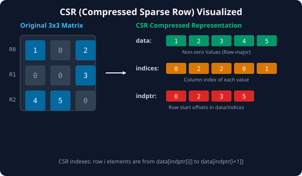

# 7.3.2 희소 행렬 연산과 최적화


> **희소 행렬 포맷의 내부 구조를 상세히 들여다보는 것은 대규모 추천 시스템이나 인공지능 모델(예: 그래프 신경망)의 메모리 병목을 극복하는 기반이 됩니다.**

---

## 1. CSR(Compressed Sparse Row) 포맷의 3대 핵심 배열
SciPy의 `csr_matrix` 객체는 내부적으로 2차원 행렬을 저장하기 위해 다음 3개의 1차원 NumPy 배열을 관리합니다.

1.  **`data` (값 배열)**: 
    *   행렬 내에서 `0`이 아닌 모든 실제 데이터 값들을 행(Row) 우선 순서로 모은 배열입니다.
    *   위의 그림에서는 `[1, 2, 3, 4, 5]`가 저장됩니다.
2.  **`indices` (열 인덱스 배열)**:
    *   `data` 배열에 담긴 각 원소의 원래 열(Column) 위치를 나타내는 인덱스 배열입니다.
    *   `data[i]` 원소의 열 번호는 `indices[i]`가 됩니다.
3.  **`indptr` (행 시작 오프셋 포인터 배열)**:
    *   각 행(Row)의 데이터가 `data` 배열의 몇 번째 인덱스에서 시작해서 어디서 끝나는지를 가리키는 지표 배열입니다.
    *   `i`번째 행의 비제로 원소들은 `data[indptr[i]]`부터 `data[indptr[i+1]-1]`까지에 존재합니다.
    *   배열 크기는 항상 `(행 개수 + 1)` 입니다.

---

## 2. 연산과 포맷 변환 규칙
희소 행렬은 저장 방식에 따라 연산 효율이 천차만별입니다.
*   **CSR vs CSC**: 행 단위의 슬라이싱이나 행렬곱 연산($$A \times B$$)은 행 방향 조회가 빠른 **CSR**이 유리하며, 열 단위의 통계나 열 슬라이싱은 **CSC**가 압도적으로 빠릅니다.
*   **toarray() / todense()**: 희소 행렬을 다시 원래의 메모리 낭비가 심한 NumPy 밀집 행렬로 역변환하는 함수입니다. 행렬 크기가 매우 클 때는 이 메소드를 남발하면 곧바로 메모리 오버플로우가 나므로 주의해야 합니다.

---

## 3. 🎧 Vibe Coding: CSR 내부 배열 뜯어보기와 곱셈 연산
직접 3x3 크기의 행렬을 CSR 희소 행렬로 변환한 뒤, 내부의 3대 배열 정보를 확인하고 행렬곱 연산을 실행해 보겠습니다.

> **🗣️ 학생 프롬프트 (AI에게 이렇게 명령해 보세요):**
> "파이썬으로 3x3 크기의 dense 행렬을 선언하고 CSR 포맷으로 변환한 다음, 내부의 `data`, `indices`, `indptr` 배열을 확인하는 코드를 짜줘. 그리고 다른 희소 행렬과 행렬곱(dot) 연산을 수행한 뒤 결과를 다시 밀집 행렬(dense)로 복원해서 출력하는 부분까지 구현해줘."

### 실전 코드 작성
```python
import numpy as np
from scipy.sparse import csr_matrix

# 1. 원래의 3x3 밀집 행렬 생성
A_dense = np.array([
    [1, 0, 2],
    [0, 0, 3],
    [4, 5, 0]
])

# 2. CSR 희소 행렬 변환
A_sparse = csr_matrix(A_dense)

print("=== CSR 내부 배열 정보 ===")
print(f"1. data (실제 값)    : {A_sparse.data}")
print(f"2. indices (열 번호) : {A_sparse.indices}")
print(f"3. indptr (행 오프셋): {A_sparse.indptr}\n")

# 3. 행렬곱 연산용 두 번째 희소 행렬 생성 (3x3)
B_dense = np.array([
    [0, 1, 0],
    [2, 0, 0],
    [0, 0, 3]
])
B_sparse = csr_matrix(B_dense)

# 4. 희소 행렬 간의 곱셈 (dot) 수행
C_sparse = A_sparse.dot(B_sparse)

print("=== 행렬곱 결과 (밀집 행렬 복원) ===")
print(C_sparse.toarray())
```

### [실행 결과 해석]
```text
=== CSR 내부 배열 정보 ===
1. data (실제 값)    : [1 2 3 4 5]
2. indices (열 번호) : [0 2 2 0 1]
3. indptr (행 오프셋): [0 2 3 5]

=== 행렬곱 결과 (밀집 행렬 복원) ===
[[0 1 6]
 [0 0 9]
 [10 4 0]]
```
*`indptr`이 `[0, 2, 3, 5]`인 것은, 0번째 행의 값들이 `data[0:2]`(즉 `[1, 2]`), 1번째 행의 값들이 `data[2:3]`(즉 `[3]`), 2번째 행의 값들이 `data[3:5]`(즉 `[4, 5]`)에 들어있음을 뜻합니다. 이 컴팩트한 포인터 기반 인덱싱 덕분에 불필요한 `0` 연산이 모두 생략되고 극대화된 수치 연산 성능을 얻을 수 있습니다.*

---

## 코딩 영단어 학습 📝

*   **`indptr (Index Pointer)`**: 인덱스 포인터. 희소 행렬에서 행이나 열의 구간을 나누는 메모리 주소(오프셋) 인덱스 배열입니다.
*   **`dot`**: 행렬곱. 선형대수학에서 행렬과 행렬의 곱셈 연산을 지칭하는 메소드명입니다.
*   **`toarray()`**: 배열로 변환. 희소 행렬 객체를 다시 NumPy의 표준 밀집 배열(Dense Array) 형식으로 풀어헤쳐 출력하거나 조작할 수 있게 해줍니다.
