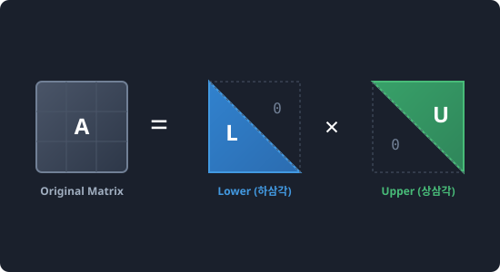

# 7.4.1 고급 선형대수 (scipy.linalg)


> **scipy.linalg는 복잡한 대칭 행렬과 정방 격자 데이터를 기저(Base)가 되는 삼각형 부품(LU)이나 직교 기하 부품(SVD)으로 정밀 해체하여 핵심 골격만을 분석하는 선형대수 수리공입니다.**

---

## 1. NumPy vs SciPy 선형대수의 차이
NumPy에도 `numpy.linalg`라는 선형대수 모듈이 내장되어 있습니다. 그렇다면 왜 우리는 굳이 SciPy의 `scipy.linalg`를 사용해야 할까요?

1. **원 성능 (Raw Performance)**: SciPy의 `linalg`는 세계 표준 고성능 포트란(Fortran) 라이브러리인 **BLAS 및 LAPACK**과 항상 직접 연결되어 빌드되므로, 내부 컴파일 가속 속도가 NumPy보다 월등히 빠르고 안정적입니다.
2. **풍부한 전문 함수**: NumPy는 단순한 행렬식(det)이나 연립방정식 풀이(`solve`)에 머무르지만, SciPy는 **LU 분해, QR 분해, Schur 분해, Cholesky 분해** 등 공학 및 인공지능 연구에 필수적인 고급 행렬 분해 도구들을 전부 지원합니다.

---

## 2. 대표적인 행렬 분해 (Decomposition) 기법

행렬 분해는 거대한 숫자 타일 뭉치를 연산하기 편한 여러 개의 특수 행렬들의 곱으로 쪼개는 마법입니다.

* **LU 분해 (LU Decomposition)**
  * **원리**: 임의의 행렬 $$A$$를 하삼각행렬(Lower, $$L$$)과 상삼각행렬(Upper, $$U$$)의 곱으로 쪼갭니다 ($$A = P \times L \times U$$).
  * **목적**: 연립방정식을 풀 때 반복되는 나눗셈 연산을 제거하여 CPU 부하를 극적으로 낮춥니다.
* **SVD (특이값 분해, Singular Value Decomposition)**
  * **원리**: 행렬을 회전($$U$$), 스케일 변환($$\Sigma$$), 다시 회전($$V^T$$)의 세 축으로 나눕니다.
  * **목적**: 주성분 분석(PCA), 이미지 압축, 추천 시스템(넷플릭스 영화 추천 모델)의 핵심 연산 엔진입니다.

---

## 3. 🎧 Vibe Coding: LU 분해 및 복원 실습

> **🗣️ 학생 프롬프트 (AI에게 이렇게 명령해 보세요):**
> "파이썬 `scipy.linalg`를 사용해서 임의의 3x3 정방 행렬을 만들고 이를 LU 분해(P, L, U 행렬 구하기)한 다음, 얻은 삼각 행렬들을 곱해 원래 행렬로 역복원해 일치하는지 검증하는 예제 코드를 짜줘."

### 실전 코드 작성
```python
import numpy as np
from scipy import linalg

# 1. 분해할 원본 정방 행렬 A 정의
A = np.array([[2, 5, 8],
              [1, 9, 3],
              [7, 4, 6]])

# 2. LU 분해 수행 (P: 행 교환 순열 매트릭스, L: 하삼각, U: 상삼각)
P, L, U = linalg.lu(A)

print("--- [LU 분해 결과] ---")
print("1. 순열 행렬 (P):\n", P)
print("2. 하삼각 행렬 (L):\n", L)
print("3. 상삼각 행렬 (U):\n", U)

# 3. 분해된 행렬들의 곱으로 원본 행렬 A 복원 (P * L * U)
# @ 기호는 파이썬에서 행렬 곱셈(Matrix Multiplication)을 뜻합니다.
A_reconstructed = P @ L @ U

print("\n--- [복원 검증] ---")
print("원본 행렬 A:\n", A)
print("복원된 행렬:\n", A_reconstructed)

# 두 행렬이 수학적 오차 내에서 완전히 동일한지 비교
is_match = np.allclose(A, A_reconstructed)
print(f"\n원본 행렬과 복원된 행렬이 완벽히 일치합니까? -> {is_match}")
```

### [실행 결과 해석]
```text
--- [LU 분해 결과] ---
1. 순열 행렬 (P):
 [[0. 1. 0.]
  [0. 0. 1.]
  [1. 0. 0.]]
2. 하삼각 행렬 (L):
 [[1.          0.          0.        ]
  [0.28571429  1.          0.        ]
  [0.14285714  0.22012579  1.        ]]
3. 상삼각 행렬 (U):
 [[7.          4.          6.        ]
  [0.          3.85714286  6.28571429]
  [0.          0.          0.75471698]]

--- [복원 검증] ---
원본 행렬 A:
 [[2 5 8]
  [1 9 3]
  [7 4 6]]
복원된 행렬:
 [[2. 5. 8.]
  [1. 9. 3.]
  [7. 4. 6.]]

원본 행렬과 복원된 행렬이 완벽히 일치합니까? -> True
```
행렬의 대대적인 쪼개짐과 합병을 거친 뒤에도 원본 행렬이 오차 없이 정확히 복원되었습니다. 이 LU 분해를 통해 시스템의 복잡한 선형 해를 찾는 계산 속도를 극대화할 수 있게 됩니다.

---

## 코딩 영단어 학습 📝

코딩에서 영어 단어의 의미만 정확히 이해해도 절반은 성공입니다! 오늘 배운 핵심 영단어들이나 약자들을 다시 한번 짚고 넘어가 볼까요?

*   **`Linalg (Linear Algebra)`**: 선형대수학. 벡터와 행렬, 선형 공간을 다루는 대수학 분야입니다.
*   **`Decomposition (Factorization)`**: 분해. 하나의 수학적 객체를 여러 인자(Factor)들의 곱으로 해체하는 기법입니다.
*   **`Lower (L)`**: 하삼각 행렬. 주대각선을 기준으로 윗부분의 모든 값이 0인 행렬입니다.
*   **`Upper (U)`**: 상삼각 행렬. 주대각선을 기준으로 아랫부분의 모든 값이 0인 행렬입니다.
*   **`LAPACK (Linear Algebra Package)`**: 수치 선형 대수학 소프트웨어 패키지. 고성능 행렬 연산 표준을 제공합니다.
