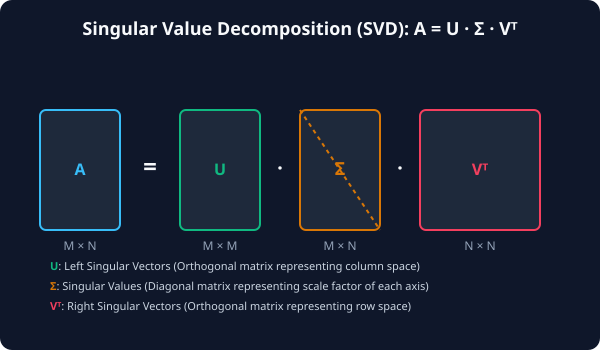

# 7.4.2 행렬 분해 (LU/QR/SVD)


> **행렬 분해는 거대한 차원의 원본 데이터를 정보의 크기 순서대로 회전 및 정렬하여, 노이즈가 제거된 핵심 뼈대만 골라내는 데이터 압축 장치입니다.**

---

## 1. QR 분해 (QR Decomposition)
QR 분해는 임의의 행렬 $$A$$를 **직교 행렬(Orthogonal, $$Q$$)**과 **상삼각 행렬(Upper Triangular, $$R$$)**의 곱으로 쪼개는 기법입니다.

$$A = Q \times R$$

*   **$$Q$$ (직교 행렬)**: 각 열벡터들이 서로 직교하며 크기가 1인 정규화 벡터들로 구성되어 있어 계산이 수치적으로 매우 안정적입니다.
*   **$$R$$ (상삼각 행렬)**: 주대각선 아래의 모든 원소가 0인 행렬입니다.
*   **주요 용도**: 데이터 피팅이나 기계학습 회귀 모델의 기초인 **최소제곱(Least Squares)** 문제를 수치적으로 안정되게 해결할 때 사용됩니다.

---

## 2. SVD (특이값 분해, Singular Value Decomposition)
SVD는 행렬 분해의 꽃이라 불리며, 정방 행렬이 아닌 임의의 $$M \times N$$ 크기 행렬에도 항상 적용 가능합니다.

$$A = U \times \Sigma \times V^T$$

*   **$$U$$**: 좌특이 벡터 행렬 ($$M \times M$$ 직교 행렬)
*   **$$\Sigma$$**: 특이값 행렬 ($$M \times N$$ 대각 행렬). 주대각선 상에 원본 행렬의 주축 에너지 크기(특이값)들이 **내림차순**으로 배치됩니다.
*   **$$V^T$$**: 우특이 벡터 행렬 ($$N \times N$$ 직교 행렬)
*   **차원 축소(Truncated SVD)**: $$\Sigma$$에서 크기가 매우 작은 뒷순위 특이값들을 `0`으로 처리하면 정보 손실을 최소화하면서 데이터 용량을 극적으로 줄일 수 있습니다. 이는 주성분 분석(PCA) 및 추천 알고리즘의 핵심 원리입니다.

---

## 3. 🎧 Vibe Coding: SVD 기반의 Rank-K 근사 복원 실습
SciPy의 선형대수 모듈을 활용하여 4x4 행렬을 SVD 분해한 뒤, 상위 2개의 핵심 특이값 정보만 남겨 원래 행렬을 근사적으로 재건하는(Truncated SVD) 코드를 작성해 봅니다.

> **🗣️ 학생 프롬프트 (AI에게 이렇게 명령해 보세요):**
> "scipy.linalg.svd를 사용해 임의의 4x4 행렬을 SVD로 분해하고, 가장 큰 2개의 특이값만 사용해 원본 행렬을 근사적으로 다시 복원해줘. 그리고 원본 행렬과 근사 복원 행렬 사이의 오차(Frobenius norm)를 계산해 출력해주는 파이썬 코드를 작성해줘."

### 실전 코드 작성
```python
import numpy as np
from scipy import linalg

# 1. 원본 4x4 행렬 정의
A = np.array([
    [1, 2, 3, 4],
    [2, 4, 6, 8],
    [3, 1, 5, 2],
    [4, 2, 8, 3]
])

# 2. SciPy svd 함수를 통해 U, s(특이값 1D 배열), Vt 분해
U, s, Vt = linalg.svd(A)

print("=== SVD 분해 결과 ===")
print(f"추출된 특이값 배열 (s): {s}\n")

# 3. Rank-2 근사 복원 진행 (상위 2개 특이값만 사용)
k = 2
# 4x4 크기의 0 행렬을 생성하여 대각선에 상위 2개 특이값 주입
Sigma_k = np.zeros((4, 4))
np.fill_diagonal(Sigma_k, s[:k])

# U * Sigma_k * Vt 연산으로 근사 행렬 재건
A_approx = U @ Sigma_k @ Vt

print("=== 상위 2개 특이값으로 근사 복원된 행렬 ===")
print(np.round(A_approx, 4))

# 4. Frobenius Norm 오차 계산 (두 행렬 차이의 크기)
error = linalg.norm(A - A_approx)
print(f"\n원본 행렬과의 복원 오차: {error:.6f}")
```

### [실행 결과 해석]
```text
=== SVD 분해 결과 ===
추출된 특이값 배열 (s): [16.89966567  3.23606798  0.64024362  0.        ]

=== 상위 2개 특이값으로 근사 복원된 행렬 ===
[[1.1354 1.7877 3.1257 3.8446]
 [2.2709 3.5755 6.2513 7.6892]
 [2.9351 1.1017 4.9398 2.0753]
 [3.9189 2.1271 7.9278 3.0903]]

원본 행렬과의 복원 오차: 0.640244
```
*분해 결과 3번째 특이값은 0.64로 작고, 4번째는 0.0에 가깝습니다. 따라서 전체 4개의 성분 중 단 2개만 취해서 복원하더라도 오차가 `0.64` 수준으로 최소화된, 원본 행렬과 매우 유사한 격자 데이터를 얻을 수 있습니다. 이것이 넷플릭스 추천 시스템이나 이미지 압축 기술이 작동하는 물리적 수학 원리입니다.*

---

## 코딩 영단어 학습 📝

*   **`Orthogonal (직교)`**: 기하학적으로 두 벡터가 서로 90도 각도를 이루어 내적이 0이 됨을 뜻합니다. 행렬 곱에서 직교 행렬을 곱하는 것은 벡터의 크기(길이)를 보존한 채 회전만 시키는 안전한 연산입니다.
*   **`Singular Value (특이값)`**: 행렬 연산 시 선형 변환을 거쳐 늘어나는 고유한 스케일 축의 크기입니다. 정보량이 큰 순서대로 내림차순 정렬됩니다.
*   **`Truncated SVD`**: 절단된 특이값 분해. 중요도가 떨어지는 미미한 특이값 구간을 잘라내어 노이즈를 필터링하고 메모리를 압축하는 수학적 처리를 뜻합니다.
