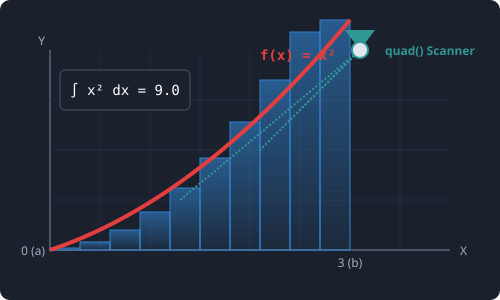

# 7.5.1 수치 적분 (scipy.integrate)


> **수치 적분(Numerical Integration)은 굴곡진 곡선 아랫부분의 면적을 구하기 위해, 곡선을 아주 얇은 현미경 슬라이스(사다리꼴/직사각형)로 쪼개어 번개 같은 속도로 일괄 합산하는 레이저 스캐너입니다.**

---

## 1. 수식 적분의 한계와 수치적 접근
고등학교 수학 시간에 배운 정적분은 부정적분 공식($$F(b) - F(a)$$)을 찾아 대입하는 방식이었습니다. 하지만 현실의 데이터 과학 세계에서는 다음과 같은 문제 때문에 공식 대입식 적분이 불가능합니다.
1. **공식이 없음**: 센서가 0.1초마다 기록한 불규칙적인 차량 속도 데이터 곡선처럼, 수학적 수식 자체가 존재하지 않는 경우.
2. **풀 수 없는 수식**: 확률 이론의 핵심인 정규분포 곡선의 면적식($$e^{-x^2}$$)처럼 수학적으로 부정적분 함수($$F(x)$$)를 손으로 유도하는 것이 불가능한 경우.

`scipy.integrate`는 수식을 기호적으로 푸는 대신, 컴퓨터의 반복 연산 능력을 극대화하여 **곡선의 아랫면적을 잘게 쪼개어 수치적으로 근사(Approximation)해내는 해결사** 역할을 합니다.

---

## 2. 핵심 함수군

* **`quad` (Quadrature)**
  * **용도**: 1변수 함수 $$f(x)$$의 단일 정적분 계산. SciPy에서 가장 신뢰성 높고 많이 쓰이는 적분 함수입니다.
* **`dblquad` / `tplquad`**
  * **용도**: 2중 및 3중 다차원 공간 적분. 면적을 넘어 부피나 입체 질량 등을 계산할 때 쓰입니다.
* **`solve_ivp`**
  * **용도**: 상미분 방정식(ODE) 초기값 문제 해결. 물리계 시뮬레이션(우주선 궤도, 전염병 확산 모델 등)의 핵심 엔진입니다.

---

## 3. 🎧 Vibe Coding: 2차 곡선 정적분 구하기

가장 간단한 2차 포물선 함수 $$f(x) = x^2$$를 특정 구간에서 정적분해 보겠습니다.
수학적 정석으로 풀면 다음과 같습니다.

$$\int_{0}^{3} x^2 \, dx = \left[ \frac{1}{3}x^3 \right]_{0}^{3} = \frac{27}{3} - 0 = 9$$

컴퓨터가 수치 적분으로 이 이론값인 `9`를 정확히 맞추는지, 그리고 오차 범위는 얼마인지 검증해 보겠습니다.

> **🗣️ 학생 프롬프트 (AI에게 이렇게 명령해 보세요):**
> "파이썬 `scipy.integrate.quad`를 사용해서 $$f(x) = x^2$$ 함수를 정의하고, 0부터 3까지의 정적분 값과 계산된 오차 추정값을 구하는 코드를 짜줘."

### 실전 코드 작성
```python
from scipy import integrate

# 1. 적분 대상인 피적분 함수 f(x) 정의
def f(x):
    return x**2

# 2. quad(함수, 하한값, 상한값) 실행
# 결과값으로 (적분값, 추정 오차) 2개의 값을 튜플로 반환합니다.
result, error = integrate.quad(f, 0, 3)

print("--- [정적분 결과] ---")
print(f"1. 계산된 적분값 (Area) : {result}")
print(f"2. 계산 오차 한계 (Error): {error}")

# 이론값인 9와 비교
print(f"3. 이론값(9.0)과의 일치 여부: {result == 9.0}")
```

### [실행 결과 해석]
```text
--- [정적분 결과] ---
1. 계산된 적분값 (Area) : 9.0
2. 계산 오차 한계 (Error): 9.992007221626409e-14
3. 이론값(9.0)과의 일치 여부: True
```
수치 해석 스캐너가 소수점 아래 14번째 자리($$10^{-14}$$) 수준의 극도로 미세한 오차 안에서 정확하게 면적값인 `9.0`을 스캔해 냈습니다. 이 강력한 기능을 활용하면 아무리 기괴하고 복잡한 수식이나 데이터 분포라도 단 몇 밀리초(ms) 만에 면적(누적 확률, 총 이동 거리 등)을 구해낼 수 있습니다.

---

## 코딩 영단어 학습 📝

코딩에서 영어 단어의 의미만 정확히 이해해도 절반은 성공입니다! 오늘 배운 핵심 영단어들이나 약자들을 다시 한번 짚고 넘어가 볼까요?

*   **`Integrate`**: 적분하다, 통합하다. 잘게 쪼갠 부품들을 모아 전체 면적이나 부피를 구하는 계산입니다.
*   **`Quadrature (Quad)`**: 구적법. 곡선으로 둘러싸인 면적을 사각형들의 합으로 근사하여 계산하는 전통 수학 용어입니다.
*   **`Approximation`**: 근사치. 완벽한 참값에 컴퓨터의 고속 연산으로 최대한 가깝게 다가간 수치입니다.
*   **`Solve_ivp (Solve Initial Value Problem)`**: 초기값 문제 풀이. 미분 방정식에서 시간 t=0 일 때의 초기값을 기준으로 미래의 궤적을 추적하는 알고리즘입니다.
