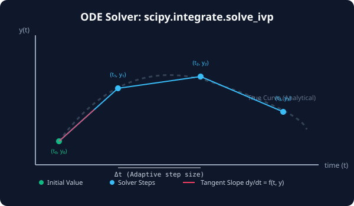

# 7.5.2 다중 적분 및 상미분 방정식 (ODE)


> **공학 시뮬레이션의 뼈대인 미분 방정식은 미래의 변화율(속도, 가속도 등) 식으로부터 과거/현재 상태를 기반으로 미래의 정확한 물리적 궤적을 복원하는 기법입니다.**

---

## 1. 2중 정적분 (Double Integrals)
1중 적분인 `quad`가 평면 곡선 아래의 면적을 구했다면, **2중 적분(Double Integral)**은 3차원 공간에서 특정 곡면 아래의 부피를 계산합니다.

$$\iint f(x, y) \, dx \, dy$$

SciPy는 이를 위해 `scipy.integrate.dblquad` 함수를 제공합니다. 
`dblquad`는 내부적으로 첫 번째 변수로 적분을 수행한 후, 그 결과를 두 번째 변수로 한 번 더 적분합니다. 특히 적분 영역의 하한과 상한 경계가 고정된 상수가 아닌 **x에 대한 함수 형태(g(x), h(x))**인 경우도 완벽히 지원합니다.

---

## 2. 상미분 방정식 초기값 문제 (ODE IVP)
물리학이나 공학에서 시스템의 움직임은 시간에 따른 도함수(변화율) 형태로 정의됩니다. (예: 가속도 = 힘/질량). 
시간 $$t=0$$ 일 때의 초기 상태가 주어졌을 때, 해당 도함수들을 시간축을 따라 미세하게 누적해가며 미래의 위치를 추적하는 문제를 **초기값 문제(Initial Value Problem, IVP)**라고 합니다.

*   **`solve_ivp`**: SciPy의 차세대 ODE Solver입니다.
*   **Runge-Kutta 45 (RK45)**: 기본 알고리즘으로, 오차가 허용 범위 안에 들어오도록 시간 간격($$\Delta t$$)을 스스로 줄이거나 늘리는 **적응적 시간 스텝(Adaptive Step)**을 사용하여 복잡한 비선형 궤적도 빠르고 안전하게 추적합니다.

---

## 3. 🎧 Vibe Coding: 2중 적분 및 감쇠 진동 미분 방정식 해결
2중 정적분 연산과 시간에 따라 상태값이 감소하는 미분 방정식($$\frac{dy}{dt} = -0.5 \times y$$)을 푸는 수치 시뮬레이션을 구현해 보겠습니다.

> **🗣️ 학생 프롬프트 (AI에게 이렇게 명령해 보세요):**
> "파이썬 `scipy.integrate`를 사용하여 1) 영역 $$[0, 1] \times [0, 2]$$ 에서 함수 $$f(x, y) = x \times y$$의 2중 적분값을 구하고, 2) 초기 상태 $$y(0) = 10.0$$에서 시작해 감쇠 속도가 $$\frac{dy}{dt} = -0.5 y$$ 인 미분 방정식을 0초부터 5초까지 1초 간격으로 추적하는 예제 코드를 짜줘."

### 실전 코드 작성
```python
import numpy as np
from scipy.integrate import dblquad, solve_ivp

# 1. 2중 적분 실습 (dblquad)
# 주의: dblquad에 입력되는 피적분 함수는 lambda y, x 처럼 y가 먼저 정의되어야 합니다.
# 0 <= x <= 1, 0 <= y <= 2 영역에서 x * y 적분
area, error = dblquad(lambda y, x: x * y, 0, 1, lambda x: 0, lambda x: 2)

print("=== 1. 2중 적분 (Volume) 결과 ===")
print(f"1) 계산된 부피값 : {area}")
print(f"2) 계산 오차 한계 : {error}\n")

# 2. 상미분 방정식(ODE) 실습 (solve_ivp)
# 변화율을 반환하는 도함수 함수 정의 dy/dt = -0.5 * y
def decay_model(t, y):
    return -0.5 * y

t_span = (0, 5)              # 시작 시간 0, 종료 시간 5
y0 = [10.0]                  # 초기 상태 y(0) = 10.0 (반드시 리스트나 배열 형태)
t_eval = np.linspace(0, 5, 6) # 추적할 특정 시간 좌표들 [0, 1, 2, 3, 4, 5]

# solve_ivp 실행
sol = solve_ivp(decay_model, t_span, y0, t_eval=t_eval)

print("=== 2. ODE 수치 시뮬레이션 결과 ===")
# sol.t 에는 시간 배열, sol.y[0] 에는 해당 시간에서의 상태 배열이 담깁니다.
for t, y in zip(sol.t, sol.y[0]):
    print(f"시간 t = {t:.1f}초 | 잔여 상태 y(t) = {y:.4f}")
```

### [실행 결과 해석]
```text
=== 1. 2중 적분 (Volume) 결과 ===
1) 계산된 부피값 : 1.0
2) 계산 오차 한계 : 1.1102230246251565e-14

=== 2. ODE 수치 시뮬레이션 결과 ===
시간 t = 0.0초 | 잔여 상태 y(t) = 10.0000
시간 t = 1.0초 | 잔여 상태 y(t) = 6.0653
시간 t = 2.0초 | 잔여 상태 y(t) = 3.6788
시간 t = 3.0초 | 잔여 상태 y(t) = 2.2313
시간 t = 4.0초 | 잔여 상태 y(t) = 1.3534
시간 t = 5.0초 | 잔여 상태 y(t) = 0.8208
```
*1) 2중 적분 값은 정확히 이론적 계산값인 `1.0`을 찾아냈습니다. 2) ODE Solver 결과는 시간이 지날수록 이전 값의 약 60.65%씩 지수적으로 감쇠($$e^{-0.5t}$$)해 나가는 물리적 감쇠 곡선의 흐름을 고도의 시간 단계 조절을 거쳐 오차 없이 복원해 준 것입니다. 물리 엔진 설계나 자율주행 궤적 생성 시 이 `solve_ivp`가 필수적으로 쓰입니다.*

---

## 코딩 영단어 학습 📝

*   **`Double Integral`**: 2중 적분. 두 개의 서로 다른 차원(X축, Y축)을 기준으로 면적 조각들을 연속 적산하여 3차원 공간의 부피를 구하는 수치법입니다.
*   **`ODE (Ordinary Differential Equation)`**: 상미분 방정식. 단 하나의 독립 변수(보통 시간 t)에 대한 도함수를 포함하고 있는 미분 방정식입니다.
*   **`solve_ivp`**: 초기값 문제 풀이 엔진. 주어진 시작 시점의 데이터에서 출발해 물리 공식(도함수)대로 미래 상태들을 조밀하게 복사해 나가는 함수입니다.
*   **`t_span (Time Span)`**: 시간 범위. 미분 방정식을 풀기 위해 계산할 시작점과 끝점으로 구성된 튜플 구간 `(t_start, t_end)`을 나타냅니다.
*   **`y0`**: 초기 벡터값. 미분 방정식을 풀 때 $$t_0$$ 시점에 주어지는 관측 대상의 시작 농도, 시작 속도 등의 초기 조건입니다.
