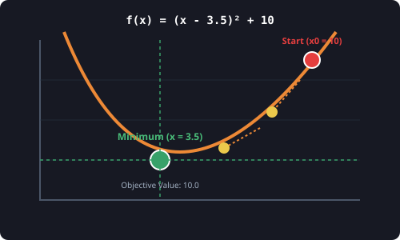

# 7.6.1 함수 최적화 (scipy.optimize)


> **최적화(Optimization)는 짙은 안개로 가득 찬 수학적 곡선 산맥에서 발끝의 경사(미분계수)만 느끼며 오직 내리막길만을 따라 가장 낮은 계곡 밑바닥(최소 손실점)을 찾아 전진하는 탐험가입니다.**

---

## 1. 최적화 알고리즘의 필요성
머신러닝과 딥러닝 모델의 학습 과정은 사실 **"오차(Loss)를 최소화하는 파라미터(Weight)를 찾는 게임"**입니다.
이 오차 함수는 복잡하고 구불구불한 다차원 곡선 형태를 띱니다. 수많은 입력 변수가 얽힌 복잡한 오차 산맥에서 손으로 미분을 계산하여 꼭대기나 계곡 아래를 찾는 것은 불가능합니다.

`scipy.optimize`는 다음과 같은 수학적 골칫거리들을 해결하는 최적화 패키지입니다.
* **해 찾기 (Root Finding)**: $$f(x) = 0$$을 만족하는 정밀한 변수 $$x$$값 계산.
* **최소화 (Minimization)**: 손실 함수의 값을 최소로 만드는 조건 변수 조합 찾기.
* **곡선 맞춤 (Curve Fitting)**: 실제 측정 노이즈 데이터에 가장 완벽하게 부합하는 추세 함수 계수들을 자동 설계.

---

## 2. 핵심 함수군

* **`root` / `fsolve`**
  * **용도**: 비선형 방정식 및 연립방정식의 해(Root)를 탐색합니다.
* **`minimize`**
  * **용도**: 제약 조건이 있거나 없는 상태에서, 다변수 함수의 최소값을 찾아줍니다. 경사하강법 및 다양한 고급 최적화 알고리즘(BFGS, Nelder-Mead 등)을 기본 제공합니다.
* **`curve_fit`**
  * **용도**: 노이즈가 섞인 비선형 샘플 데이터에 수학적 모델 함수를 회귀(Regression)시켜 최적의 모수를 구합니다.

---

## 3. 🎧 Vibe Coding: 2차 손실 함수 최소화 추적

오차를 대변하는 2차 함수 $$f(x) = (x - 3.5)^2 + 10$$ 가 있다고 해봅시다.
이 함수의 최소값은 눈으로 봐도 쉽게 알 수 있듯이 $$x = 3.5$$ 일 때 최소값 $$10$$ 입니다.
컴퓨터가 임의의 출발점(예: $$x = 10.0$$)에서 시작하여 이 오차 골짜기의 최저점인 $$3.5$$를 제대로 찾아가는지 구현해 보겠습니다.

> **🗣️ 학생 프롬프트 (AI에게 이렇게 명령해 보세요):**
> "파이썬 `scipy.optimize.minimize`를 사용해서 임의의 초기값 $$x_0 = 10.0$$ 에서 시작해 함수 $$f(x) = (x - 3.5)^2 + 10$$ 의 최적화된 최소점 x와 최소값(fun)을 찾아내는 코드를 작성해줘."

### 실전 코드 작성
```python
from scipy.optimize import minimize

# 1. 최소값을 찾을 타겟 손실 함수 f(x) 정의
def objective_function(x):
    # x는 다차원 입력에 대비해 배열 형태로 전달됩니다.
    return (x[0] - 3.5)**2 + 10

# 2. 임의의 초기 추정값 설정 (골짜기에서 멀리 떨어진 언덕 위)
x_init = [10.0]

# 3. minimize(함수, 초기값) 실행
result = minimize(objective_function, x_init)

print("--- [최적화 탐색 결과] ---")
print(result) # 최적화 결과 객체 전체 출력

print("\n--- [최저점 요약] ---")
print(f"1. 최적의 x값 (최저점 위치)     : {result.x[0]:.4f}")
print(f"2. 그때의 최소값 (Objective Value): {result.fun:.4f}")
print(f"3. 최적화 탐색 성공 여부 (Success): {result.success}")
```

### [실행 결과 해석]
```text
--- [최적화 탐색 결과] ---
  message: Optimization terminated successfully.
  success: True
   status: 0
      fun: 10.0
        x: [ 3.500e+00]
      nit: 3
      jac: [ 0.000e+00]
 hess_inv: [[ 5.000e-01]]
 nfev: 8
 njev: 4

--- [최저점 요약] ---
1. 최적의 x값 (최저점 위치)     : 3.5000
2. 그때의 최소값 (Objective Value): 10.0000
3. 최적화 탐색 성공 여부 (Success): True
```
최적화 엔진이 경사면을 따라 미끄러지듯 이동하여 단 3번의 루프 반복(`nit: 3`, Number of Iterations)만에 정확한 최저점 $$x = 3.5$$ 와 최소값 `10.0`을 찾아내는 데 성공(`success: True`)했습니다. 이 알고리즘을 확장하면 인공지능 신경망의 거대한 파라미터 오차를 최소화하는 가속 학습기를 직접 구현할 수 있습니다.

---

## 코딩 영단어 학습 📝

코딩에서 영어 단어의 의미만 정확히 이해해도 절반은 성공입니다! 오늘 배운 핵심 영단어들이나 약자들을 다시 한번 짚고 넘어가 볼까요?

*   **`Optimize`**: 최적화하다. 주어진 제약 내에서 가장 효율적이거나 뛰어난 값을 찾아내는 과정입니다.
*   **`Minimize`**: 최소화하다. 함수의 출력이 가장 작은 상태가 되도록 제어합니다.
*   **`Objective Function`**: 목적 함수 (또는 손실 함수). 최적화 알고리즘이 최소화 또는 최대화하고자 하는 목표 수식입니다.
*   **`Success`**: 성공 여부. 최적화 알고리즘이 수렴 조건(Tolerance)을 달성하여 무사히 멈추었는지를 뜻합니다.
