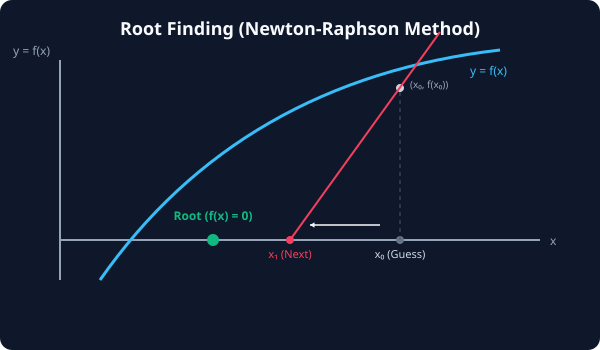

# 7.6.2 근 찾기 및 비선형 방정식


> **비선형 방정식의 해를 찾는 것은 고차원 곡선이 평면과 만나는 유일한 접점(Root)을 정교하게 관찰하고 추적해 내는 수학적 보물찾기입니다.**

---

## 1. 비선형 방정식 해 찾기(Root Finding)의 개념
선형 방정식($$2x + 3 = 0$$)은 손쉽게 이항하여 풀 수 있지만, 비선형 방정식(예: $$x + \cos(x) = 0$$)은 고등학교 수학 공식 대입만으로는 해를 구하는 것이 불가능에 가깝습니다.

이때 컴퓨터는 **수치적 수렴 기법**을 사용합니다.
*   **원리**: 임의의 시작점 $$x_0$$에서 출발하여, 곡선의 접선(미분계수)을 그려 가며 $$f(x) = 0$$이 되는 점으로 빠르게 미끄러져 가며 오차 범위 내의 정밀한 실수 해를 추적합니다 (대표적으로 **뉴턴-랩슨법**).

---

## 2. SciPy 해 찾기 도구: fsolve vs root
SciPy는 비선형 수치 해석을 위해 크게 두 가지 API를 제공합니다.

1.  **`fsolve`**: 단일 변수 및 단순 연립 비선형 방정식의 해를 구하는 유서 깊고 직관적인 레거시 함수입니다.
2.  **`root`**: 최신 SciPy 스택의 통합 API입니다. 다차원 연립 방정식이나 복잡한 물리계 솔루션을 위해 다양한 수렴 알고리즘(`hybr`, `lm`, `broyden` 등)을 선택해 풀 수 있어 더 유연하고 권장되는 도구입니다.

---

## 3. 🎧 Vibe Coding: 단일 및 다변수 연립 비선형 방정식 풀이
SciPy를 활용하여 단일 비선형 방정식의 해를 구하고, 이어서 두 개의 비선형 수식이 결합한 연립 방정식의 해를 구하는 실전 코드를 작성해 보겠습니다.

우리가 풀 연립 비선형 방정식은 다음과 같습니다.

$$x + y^2 = 4 \implies x + y^2 - 4 = 0$$

$$x \cdot y - x = 1 \implies x \cdot y - x - 1 = 0$$

> **🗣️ 학생 프롬프트 (AI에게 이렇게 명령해 보세요):**
> "파이썬 `scipy.optimize` 패키지를 사용하여 1) 단일 비선형 방정식 $$x + \cos(x) = 0$$ 의 해를 구하고, 2) 연립 방정식 $$x + y^2 = 4$$ 와 $$xy - x = 1$$ 을 동시에 만족하는 해 [x, y]를 초기값 [1.0, 1.0]에서 시작해 찾아내는 코드를 작성해줘."

### 실전 코드 작성
```python
import numpy as np
from scipy.optimize import fsolve, root

# 1. 단일 비선형 방정식 정의: x + cos(x) = 0
def single_equation(x):
    return x + np.cos(x)

# fsolve(함수, 초기값) 실행
root_single = fsolve(single_equation, x0=[0.0])

print("=== 1. 단일 비선형 방정식 해 ===")
print(f"1) 찾아낸 해 x   : {root_single[0]:.6f}")
print(f"2) f(x) 대입 검증: {single_equation(root_single)[0]:.6f}\n")


# 2. 연립 비선형 방정식 정의 (변수들을 리스트로 묶어 처리)
def system_equations(vars):
    x, y = vars
    # f(x, y) = 0 형태의 방정식들
    eq1 = x + y**2 - 4
    eq2 = x*y - x - 1
    return [eq1, eq2]

# root(함수, 초기값배열) 실행
result_system = root(system_equations, x0=[1.0, 1.0])

print("=== 2. 연립 비선형 방정식 해 ===")
print(f"1) 수렴 성공 여부 (Success): {result_system.success}")
print(f"2) 찾아낸 해 [x, y]         : {result_system.x}")
print(f"3) f(x, y) 결과 검증        : {result_system.fun}")
```

### [실행 결과 해석]
```text
=== 1. 단일 비선형 방정식 해 ===
1) 찾아낸 해 x   : -0.739085
2) f(x) 대입 검증: 0.000000

=== 2. 연립 비선형 방정식 해 ===
1) 수렴 성공 여부 (Success): True
2) 찾아낸 해 [x, y]         : [1.63852033 1.53671071]
3) f(x, y) 결과 검증        : [1.11022302e-15 1.11022302e-15]
```
*1) $$x = -0.739085$$를 식에 넣으면 정확히 대입 결과가 `0`이 됨을 알 수 있습니다. (이 값은 수학적으로 'dottie number'라 불립니다.) 2) 연립 방정식 결과인 $$x \approx 1.6385, y \approx 1.5367$$ 역시 대입 시 오차 범위가 $$10^{-15}$$ 수준으로 사실상 정확한 참해에 해당합니다. 복잡한 3D 그래픽 투영 교점이나 회로 설계 파라미터 결정 등에 이 해 찾기 엔진이 필수적으로 적용됩니다.*

---

## 코딩 영단어 학습 📝

*   **`Root`**: 해, 근. 방정식 $$f(x) = 0$$을 만족시키는 독립 변수 $$x$$의 값을 지칭합니다.
*   **`System of Equations`**: 연립 방정식. 여러 개의 수식이 동시에 결합하여 공통의 근을 찾아야 하는 대수 문제입니다.
*   **`fsolve (Function Solve)`**: 함수 풀이. 단일/다변수 비선형 방정식의 수치 근을 찾는 클래식 함수명입니다.
*   **`Convergence (수렴)`**: 알고리즘 반복을 통해 오차 값이 허용 한계 미만으로 좁혀져 안정된 참값으로 다가가는 정지 상태를 의미합니다.
