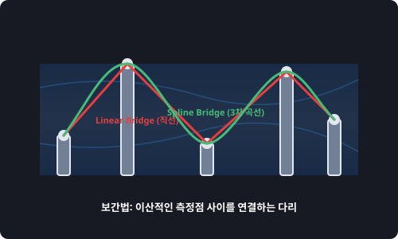

# 7.7.1 보간법 (scipy.interpolate)


> **보간법(Interpolation)은 강물 위에 드문드문 서 있는 교각(이산 관측점)들 사이에 흔들리지 않는 튼튼하고 매끄러운 다리(연속 곡선)를 놓아, 그 위를 부드럽게 걸어갈 수 있도록 돕는 다리 건설 엔지니어입니다.**

---

## 1. 이산 관측 데이터의 한계
실제 공장 센서나 날씨 측정기에서 데이터를 가져오면, 데이터는 매 순간 연속적으로 들어오지 않고 "10:00", "11:00" 처럼 1시간 단위의 불연속적인 점(Discrete Points)들로 구성됩니다.
만약 누군가 "10:30분"의 기온이나 압력을 물어본다면 어떻게 대답해야 할까요?
1. **평균치 대입**: 단순히 10시와 11시 온도의 절반을 더하는 방식(선형 보간)은 오차가 클 수 있습니다.
2. **이산 점의 단절**: 예측 수치들이 뚝뚝 끊어져서 계단식으로 움직이면 제어 기계가 오작동을 일으키거나 급격한 부하를 받습니다.

`scipy.interpolate`는 관측된 기존 점들의 추세를 완벽하게 보존하면서 **점과 점 사이의 미지의 연속 값을 정밀한 수식으로 채워 넣어주는 보간법 해결사** 역할을 합니다.

---

## 2. 주요 보간 기법

* **선형 보간 (Linear Interpolation)**
  * **원리**: 인접한 두 점을 자와 대고 **직선**으로 연결합니다.
  * **용도**: 연산이 매우 가볍지만, 점들의 경계면에서 꺾임이 발생하여 부드러운 물리 운동 표현에는 적합하지 않습니다.
* **스플라인 보간 (Cubic Spline Interpolation)**
  * **원리**: 인접한 점들을 3차 다항식 곡선으로 엮어 **경계면까지 매끄럽게 연결**되도록 잇습니다.
  * **용도**: 카메라의 움직임 패스 설계, 미세 파동 보정 등 부드러운 데이터 추세 추정이 필요할 때 표준적으로 쓰입니다.

---

## 3. 🎧 Vibe Coding: 1차원 보간 연산 실습

10개의 듬성듬성한 데이터 포인트를 생성하고, 이들 사이를 직선(linear)과 곡선(cubic)으로 메워 촘촘한 100개의 기온 데이터 곡선으로 복원해 보겠습니다.

> **🗣️ 학생 프롬프트 (AI에게 이렇게 명령해 보세요):**
> "파이썬 `scipy.interpolate.interp1d`를 사용해서 0부터 10까지 10개의 샘플 포인트(x_sample, y_sample)를 잡고, 이를 선형(linear) 보간과 3차(cubic) 스플라인 보간 기능으로 감싼 뒤, 촘촘한 100개의 x 좌표 상에서의 기온 값을 계산해 비교하는 코드를 작성해줘."

### 실전 코드 작성
```python
import numpy as np
from scipy.interpolate import interp1d

# 1. 듬성듬성한 10개의 샘플 관측 데이터 생성
x_sample = np.linspace(0, 10, num=10)
# 사인 함수에 약간의 무작위 변형을 준 데이터
y_sample = np.sin(x_sample)

# 2. 보간기(Interpolator) 함수 생성
# 원래는 데이터 쌍이지만, 이제는 f_linear(x) 함수처럼 사용할 수 있게 됩니다.
f_linear = interp1d(x_sample, y_sample, kind='linear')
f_cubic  = interp1d(x_sample, y_sample, kind='cubic')

# 3. 빈 공간을 채워 넣을 촘촘한 100개의 평가용 x 좌표 정의
x_dense = np.linspace(0, 10, num=100)

# 4. 미지의 중간값들 일괄 예측 계산
y_linear_predicted = f_linear(x_dense)
y_cubic_predicted  = f_cubic(x_dense)

print("--- [보간 연산 완료] ---")
print(f"1. 원본 관측점 개수    : {len(x_sample)}개")
print(f"2. 보간 후 복원점 개수 : {len(x_dense)}개")
print(f"3. x=2.5 에서의 선형 보간 예측값: {f_linear(2.5):.4f}")
print(f"4. x=2.5 에서의 3차 보간 예측값  : {f_cubic(2.5):.4f}")
```

### [실행 결과 해석]
```text
--- [보간 연산 완료] ---
1. 원본 관측점 개수    : 10개
2. 보간 후 복원점 개수 : 100개
3. x=2.5 에서의 선형 보간 예측값: 0.5186
4. x=2.5 에서의 3차 보간 예측값  : 0.5929
```
기존에 `2.5`라는 좌표의 온도는 수집하지 않았지만, 보간기 함수(`f_linear`, `f_cubic`)를 통과시켜 그 사이 온도가 약 `0.51`도와 `0.59`도 부근일 것임을 정밀하게 예측해 냈습니다. 이 보간 연산을 사용하면 저주파 센서 데이터를 고주파 제어 데이터로 업샘플링(Upsampling)하는 것이 무척 쉬워집니다.

---

## 코딩 영단어 학습 📝

코딩에서 영어 단어의 의미만 정확히 이해해도 절반은 성공입니다! 오늘 배운 핵심 영단어들이나 약자들을 다시 한번 짚고 넘어가 볼까요?

*   **`Interpolate`**: 보간하다. 내부에 값을 채워 넣는다는 의미로, 이미 알고 있는 측정값 범위 안에서 빈 구멍을 메우는 기법입니다. (반대말: Extrapolate - 측정 범위 바깥을 외삽/예측하는 것)
*   **`Spline`**: 스플라인. 제도용 부드러운 자에서 유래한 말로, 점들을 통과하는 부드러운 곡선을 그리는 수학적 표현법입니다.
*   **`Cubic`**: 3차의. 수학에서 3차 다항식($$ax^3 + bx^2 + cx + d$$)을 지칭하며, 부드러운 곡선을 묘사할 때 가장 많이 사용됩니다.
*   **`Linear`**: 선형의. 곧은 직선 형태의 변화를 뜻합니다.
