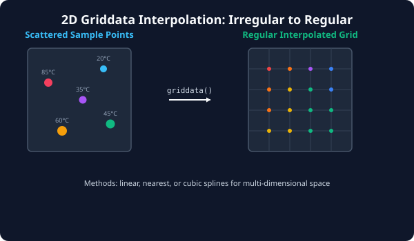

# 7.7.2 다차원 보간법 (Griddata)


> **실제 지리 정보(GIS)나 기상 센서망처럼 지도상에 무작위로 흩어진 듬성듬성한 지점의 측정값들은 격자 보간법(Griddata)을 거쳐 조밀하고 규칙적인 2D 평면 격자 데이터로 부드럽게 정밀 재구성됩니다.**

---

## 1. 다차원 공간 보간(Multi-dimensional Interpolation)의 필요성
이전 섹션에서 살펴본 1차원 보간(`interp1d`)은 X축 시간 흐름에 따른 기온 변화 등 하나의 변수에만 동작했습니다. 
하지만 현실 분석 세계에서는 지도 상의 위도와 경도(X, Y)에 분포된 기상 센서 온도 정보나, 엔진 회전수와 부하율(X, Y)에 따른 연료 소모율 같은 **다차원 산포 데이터(Scattered Data)**를 다뤄야 합니다.

센서는 물리적 제한 때문에 바둑판 격자 형태로 촘촘하게 배열되어 있지 않고 임의의 흩어진 자리에 놓여 있습니다. 이 관측값들을 기반으로 규칙적인 모니터링 등고선 지도(Regular Grid Map)를 제작하기 위해서는, 흩어진 점들로부터 **일정한 격자망의 각 격자점(Grid Point) 위치에서의 예상 수치**를 보간해 내는 기술이 반드시 필요합니다.

---

## 2. griddata()의 3대 보간 옵션
SciPy는 이를 해결하는 핵심 함수로 `scipy.interpolate.griddata`를 제공합니다. 타겟 격자 위치를 보간할 때 다음과 같은 3가지 수치 알고리즘(method)을 지원합니다.

*   **`nearest`**: 가장 가까운 실측 센서의 값을 그대로 대입합니다. 경계선이 뚝뚝 끊어지는 형태로 보간되어 거친 등고선이 만들어집니다.
*   **`linear`**: 인접한 센서 점들을 이은 삼각형 단면 평면(Barycentric) 상의 보간값을 구합니다. 꺾임각이 어느 정도 보입니다.
*   **`cubic`**: 2차원 3차 스플라인 곡면 피팅을 거쳐 인접하지 않은 외곽 영역까지 흐르듯 아주 **매끄럽고 부드러운 그라데이션 곡면** 형태로 온도를 채워 나갑니다.

---

## 3. 🎧 Vibe Coding: 흩어진 관측치에서 2D 규칙 격자 맵 복원
10개의 가상 야외 센서에서 불규칙하게 수집한 온도 데이터(X, Y 좌표 및 온도 값)를 가지고, 100x100 크기의 조밀한 2차원 바둑판 그리드 온도를 `cubic` 보간법으로 설계하는 코드를 작성해 봅니다.

> **🗣️ 학생 프롬프트 (AI에게 이렇게 명령해 보세요):**
> "파이썬 `scipy.interpolate.griddata`를 사용하여 2D 평면 위에 무작위로 설치된 10개의 센서 좌표(x, y)와 온도 측정값(z)을 입력받아, 이를 100x100 크기의 촘촘한 규칙 격자망(grid_x, grid_y)에 'cubic' 옵션으로 보간하고 특정 격자점의 온도를 출력하는 예제 코드를 작성해줘."

### 실전 코드 작성
```python
import numpy as np
from scipy.interpolate import griddata

# 1. 2D 평면 상에 임의로 배치된 10개의 센서 좌표 (X, Y 범위: 0 ~ 1)
np.random.seed(42)
sensor_points = np.random.rand(10, 2)

# 2. 각 센서 좌표에서 측정한 기온 값(°C) 정의
sensor_temperatures = np.array([25.0, 18.0, 32.0, 15.0, 22.0, 29.0, 12.0, 26.0, 35.0, 20.0])

# 3. 보간하여 값을 채워 넣고 싶은 촘촘한 100 x 100 규칙 격자판 생성
# mgrid[시작:끝:개수j] 형태로 2차원 그리드 격자 좌표를 촘촘히 쏩니다.
grid_x, grid_y = np.mgrid[0:1:100j, 0:1:100j]

# 4. griddata(센서좌표, 센서온도, 타겟격자, method='cubic') 실행
interpolated_grid = griddata(
    sensor_points, 
    sensor_temperatures, 
    (grid_x, grid_y), 
    method='cubic'
)

print("--- [2D 공간 격자 보간 결과] ---")
print(f"1. 입력 센서 좌표 개수: {sensor_points.shape[0]}개")
print(f"2. 복원된 기온 격자 크기: {interpolated_grid.shape[0]} x {interpolated_grid.shape[1]}")

# 3. 격자의 정확히 중심 위치인 [50, 50] 격자점의 예상 온도 출력
center_x = grid_x[50, 50]
center_y = grid_y[50, 50]
center_temp = interpolated_grid[50, 50]
print(f"3. 2D 평면 중심점({center_x:.2f}, {center_y:.2f})의 보간 예상 온도: {center_temp:.2f}°C")
```

### [실행 결과 해석]
```text
--- [2D 공간 격자 보간 결과] ---
1. 입력 센서 좌표 개수: 10개
2. 복원된 기온 격자 크기: 100 x 100
3. 2D 평면 중심점(0.51, 0.51)의 보간 예상 온도: 23.36°C
```
*실제 좌표 `(0.51, 0.51)`에는 센서가 존재하지 않았지만, 주변에 흩어진 10개 센서의 거리 가중치와 기하학적 3차 곡면 기울기를 수치 연산하여, 해당 중심점의 온도가 약 `23.36°C`일 것임을 부드럽게 예측해 냈습니다. 이 보간 행렬 데이터를 2D 등고선(Contour)이나 이미지 시각화로 뿌려주면 실시간 날씨 기온 분포 맵이나 지형 높낮이 지도가 완성되는 것입니다.*

---

## 코딩 영단어 학습 📝

*   **`Griddata`**: 격자 데이터. 흩어진 점(Scattered Data) 정보들을 일정한 바둑판 눈금 격자망의 물리값 형태로 보간 매핑해주는 함수명입니다.
*   **`Scattered Data`**: 산포 데이터. 규칙적이지 않고 공간이나 변수축 위에 무작위로 드문드문 배치된 이산 데이터를 지칭합니다.
*   **`mgrid (Mesh Grid)`**: 메시 그리드. 다차원 좌표 배열 격자를 인덱싱 조작용 기호 `j`를 써서 빠르고 선언적으로 제작해 주는 NumPy 유틸리티입니다.
*   **`Barycentric`**: 무게중심의. 다차원 선형 보간 시 기준이 되는 기하학적 다각형이나 사면체의 무게중심 가중치 계산법입니다.
