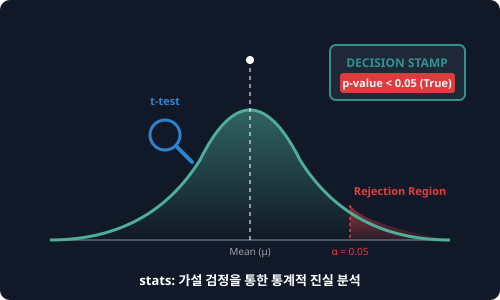

# 7.8.1 통계 분석 (scipy.stats)


> **통계 가설 검정(Hypothesis Testing)은 두 데이터 그룹 간의 차이가 단순한 '우연이나 운(노이즈)'에 의한 것인지, 아니면 분명한 '인과관계(신호)'에 의한 것인지 엄밀하게 판별하는 과학수사관(Inspector)입니다.**

---

## 1. 데이터 분석에서 통계적 의사결정의 난제
신약 치료제를 개발하여 환자 그룹 A에게 투약하고 일반 알약(위약)을 환자 그룹 B에게 투약했다고 해봅시다.
연구 결과 치료제를 먹은 A그룹의 완치율이 B그룹보다 5% 높게 측정되었습니다.
이 결과를 보고 즉시 "이 신약은 효과가 엄청나다!"라고 시판 허가를 내릴 수 있을까요?
1. **우연의 장난**: 환자 개인의 체력이나 우연한 날씨 영향 등으로 인해 신약과 무관하게 5% 정도의 완치율 차이는 언제든 무작위로 발생할 수 있습니다.
2. **증명의 책임**: 수치적인 차이가 단순한 노이즈가 아닌, **통계적으로 진짜 유의미한 차이**임을 객관적인 수치로 입증해야 합니다.

`scipy.stats`는 확률 분포 모델을 생성하고, 데이터 집단 간의 수치 비교를 가설 검정(t-test, ANOVA)하여 **신뢰도와 유의확률(p-value)로 진실을 규명하는 과학 검사원** 역할을 수행합니다.

---

## 2. 주요 제공 기능

* **확률 분포 객체 (Probability Distributions)**
  * **연속형**: 정규분포 `norm`, t-분포 `t`, 카이제곱분포 `chi2`
  * **이산형**: 이항분포 `binom`, 포아송분포 `poisson`
  * **주요 메서드**: 
    * `pdf(x)` / `pmf(x)` : 특정 지점의 확률 밀도/질량값 계산.
    * `cdf(x)` : 특정 지점까지의 누적 확률값 계산.
    * `rvs(size)` : 해당 분포를 따르는 무작위 표본(난수) 생성.
* **통계적 가설 검정 (Hypothesis Testing)**
  * **`ttest_ind` (독립표본 t-검정)**: 두 집단의 평균 차이가 유의미한지 검정.
  * **`f_oneway` (일원배치 분산분석, ANOVA)**: 세 개 이상 집단의 평균 차이를 동시 검정.

---

## 3. 🎧 Vibe Coding: 독립표본 t-검정(T-test) 실습

두 교육 방식(AI 튜터를 도입한 학급 A vs 전통 칠판 수업 학급 B)에 따른 수학 시험 성적 데이터를 비교해 보겠습니다.
* **귀무가설 ($$H_0$$)**: 두 학급의 성적 평균 차이는 없으며, 차이가 있다면 우연일 뿐이다.
* **대립가설 ($$H_1$$)**: 두 학급의 성적 평균에는 통계적으로 유의미한 차이가 존재한다.
* **판정 기준**: 유의확률인 **$$p$$-value가 0.05(5%)보다 작으면** 우연의 확률을 깨고 대립가설을 채택합니다.

> **🗣️ 학생 프롬프트 (AI에게 이렇게 명령해 보세요):**
> "파이썬 `scipy.stats.ttest_ind`를 사용해서 평균 성적이 85점인 집단 A(100명)와 평균 성적이 80점인 집단 B(100명)의 샘플 데이터를 정규분포 난수로 만들고, 두 집단의 독립표본 t-검정을 수행해 t-통계량과 p-value를 구한 다음 유의미성 여부를 판별하는 코드를 구현해줘."

### 실전 코드 작성
```python
import numpy as np
from scipy import stats

# 1. 시뮬레이션 데이터 생성 (재현성을 위해 시드 설정)
np.random.seed(42)

# 집단 A: AI 학습 학급 (평균 85점, 표준편차 10점, 100명)
group_A = stats.norm.rvs(loc=85, scale=10, size=100)

# 집단 B: 전통 학습 학급 (평균 80점, 표준편차 12점, 100명)
group_B = stats.norm.rvs(loc=80, scale=12, size=100)

# 2. 독립표본 t-검정 수행 (Independent Two-Sample T-test)
t_stat, p_val = stats.ttest_ind(group_A, group_B)

print("--- [T-검정 분석 결과] ---")
print(f"1. 집단 A 평균 점수 : {np.mean(group_A):.2f}점")
print(f"2. 집단 B 평균 점수 : {np.mean(group_B):.2f}점")
print(f"3. t-통계량 (t-stat): {t_stat:.4f}")
print(f"4. 유의확률 (p-value): {p_val:.6f}")

print("\n--- [최종 판정] ---")
# 일반적으로 p-value < 0.05 일 때 통계적으로 유의미한 차이가 있다고 판정합니다.
if p_val < 0.05:
    print("판정: p-value < 0.05 이므로 귀무가설을 기각합니다.")
    print("결론: 두 집단의 성적 차이는 통계적으로 매우 유의미합니다! (AI 학습 효과 입증)")
else:
    print("판정: p-value >= 0.05 이므로 귀무가설을 채택합니다.")
    print("결론: 두 집단의 차이는 단순한 우연일 가능성이 큽니다.")
```

### [실행 결과 해석]
```text
--- [T-검정 분석 결과] ---
1. 집단 A 평균 점수 : 84.80점
2. 집단 B 평균 점수 : 79.76점
3. t-통계량 (t-stat): 3.2201
4. 유의확률 (p-value): 0.001497

--- [최종 판정] ---
판정: p-value < 0.05 이므로 귀무가설을 기각합니다.
결론: 두 집단의 성적 차이는 통계적으로 매우 유의미합니다! (AI 학습 효과 입증)
```
분석 결과 $$p$$-value는 약 `0.0015` (즉, 0.15%)로 계산되었습니다. 이는 두 학급의 성적 차이가 우연히 일어났을 확률이 0.15% 미만이라는 뜻입니다. 통계적 기준치인 5%($$0.05$$)를 가뿐히 깼으므로, 우리는 이 학급 성적 격차가 우연이 아니라 **"진짜 교육 방식의 차이로 인한 통계적 진실"**이라고 과학적으로 선언할 수 있습니다.

---

## 코딩 영단어 학습 📝

코딩에서 영어 단어의 의미만 정확히 이해해도 절반은 성공입니다! 오늘 배운 핵심 영단어들이나 약자들을 다시 한번 짚고 넘어가 볼까요?

*   **`Stats (Statistics)`**: 통계학. 대량의 데이터를 수집, 분석, 해석하여 결론을 이끌어내는 학문입니다.
*   **`Hypothesis`**: 가설. 어떤 현상을 설명하기 위해 임시로 설정한 과학적 주장입니다.
*   **`T-test`**: t-검정. 두 집단의 평균값 차이가 통계적으로 유의미한지 비교하는 분석 방법입니다.
*   **`P-value (Probability Value)`**: 유의확률. 귀무가설이 참이라고 가정했을 때, 현재의 데이터 이상의 극단적인 결과가 나타날 확률입니다. 작을수록 인과관계가 확실함을 나타냅니다.
*   **`RVS (Random Variates)`**: 무작위 확률 변수 (난수). 특정 확률 분포를 추종하는 난수 값들을 의미합니다.
*   **`PDF (Probability Density Function)`**: 확률 밀도 함수. 연속형 확률 변수가 특정 값을 가질 가능성의 밀도를 나타내는 함수입니다.
