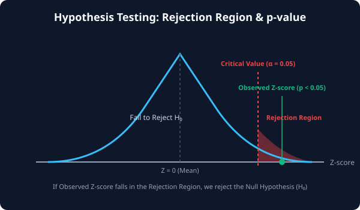

# 7.8.2 통계적 가설 검정


> **가설 검정은 여러 개의 실험 조건이나 집단 속에서 '진짜 차이(인과관계)'를 객관적으로 가려내어, 단순 오차나 무작위 노이즈에 휘둘리지 않고 올바른 비즈니스 결정을 내릴 수 있게 돕는 데이터 보증수표입니다.**

---

## 1. 가설 검정의 핵심 방법론
실제 연구와 비즈니스 환경에서는 비교하려는 대상의 특성과 집단 개수에 따라 적합한 가설 검정을 선택해야 합니다.

1.  **대응표본 t-검정 (Paired Samples t-test)**:
    *   **용도**: 동일한 대상에 대해 '다이어트 약 복용 전' vs '복용 후' 체중 변화처럼 **전후 관계가 짝지어진(Paired) 데이터**의 평균 변화를 검정합니다.
    *   **함수**: `scipy.stats.ttest_rel`
2.  **일원배치 분산분석 (ANOVA, Analysis of Variance)**:
    *   **용도**: 비교하려는 독립된 집단이 **3개 이상**일 때(예: A 교수법, B 교수법, C 교수법을 적용한 세 학급 성적 비교) 집단 간 평균 차이가 유의미한지 동시에 검정합니다.
    *   **함수**: `scipy.stats.f_oneway`
3.  **정규성 검정 (Normality Test)**:
    *   **용도**: 수집한 데이터가 t-test나 ANOVA 같은 모수 통계 검정을 수행하기 위한 전제 조건인 **'정규분포를 따르는가'**를 수학적으로 검증합니다.
    *   **함수**: `scipy.stats.shapiro` (샤피로-윌크 검정)

---

## 2. 통계적 가설 검정의 4단계 프로세스
모든 가설 검정은 과학적이고 통일된 흐름에 따라 의사결정을 내립니다.

1.  **가설 설정**: 차이가 없다는 무죄 추정 원칙의 **귀무가설($$H_0$$)**과 차이가 존재한다는 **대립가설($$H_1$$)**을 세웁니다.
2.  **유의수준($$\alpha$$) 결정**: 보통 $$0.05$$ (5%) 혹은 $$0.01$$ (1%)로 잡으며, 우연히 결과가 발생할 확률의 마지노선을 뜻합니다.
3.  **검정 통계량 및 $$p$$-value 계산**: SciPy 검정 함수를 돌려 통계값과 유의확률을 도출합니다.
4.  **최종 판정**: **$$p$$-value < $$\alpha$$** 이면 귀무가설을 기각하고 대립가설을 채택합니다. (통계적 차이 공식 인정)

---

## 3. 🎧 Vibe Coding: 정규성 검정 및 3집단 분산분석(ANOVA) 실습
수집한 가상의 세 학급 성적 데이터를 가지고, 먼저 각 데이터가 정규분포를 따르는지 검정한 뒤 이어서 세 집단 간의 평균 성적이 유의미하게 차이 나는지 ANOVA를 돌리는 완벽한 가설 검정 파이프라인을 구축해 보겠습니다.

*   **정규성 검정 귀무가설($$H_0$$)**: 표본 데이터는 정규분포를 따른다.
*   **ANOVA 검정 귀무가설($$H_0$$)**: 세 학급의 성적 평균은 모두 동일하다.

> **🗣️ 학생 프롬프트 (AI에게 이렇게 명령해 보세요):**
> "파이썬 `scipy.stats`를 사용하여 1) 임의의 100개 무작위 표본이 정규분포를 만족하는지 샤피로 검정(shapiro)을 수행해 판단하고, 2) 세 개 학급(A, B, C)의 가상 성적 데이터를 생성하여 세 집단의 평균 차이를 비교하는 일원배치 분산분석(f_oneway) 코드를 짜줘."

### 실전 코드 작성
```python
import numpy as np
from scipy import stats

# 재현성을 위한 난수 시드 고정
np.random.seed(42)

# 1. 샤피로-윌크 정규성 검정 (Shapiro-Wilk Normality Test)
# 정규분포를 따르는 100개의 가상 난수 생성
sample_data = stats.norm.rvs(loc=0, scale=1, size=100)
shapiro_stat, shapiro_p = stats.shapiro(sample_data)

print("=== 1. 정규성 검정 (Shapiro-Wilk) ===")
print(f"1) 검정 통계량: {shapiro_stat:.4f}")
print(f"2) 유의확률 (p-value): {shapiro_p:.6f}")
if shapiro_p > 0.05:
    print("판정: p-value > 0.05 이므로 귀무가설을 기각하지 못합니다.")
    print("결론: 본 표본 데이터는 정규분포 가정을 정상적으로 만족합니다.\n")
else:
    print("판정: p-value <= 0.05 이므로 귀무가설을 기각합니다.")
    print("결론: 본 표본 데이터는 정규분포를 따르지 않습니다.\n")


# 2. 일원배치 분산분석 (ANOVA - f_oneway)
# 세 개 학급의 가상 수학 점수 생성
class_A = stats.norm.rvs(loc=82, scale=8, size=30)  # 평균 82점
class_B = stats.norm.rvs(loc=85, scale=7, size=30)  # 평균 85점
class_C = stats.norm.rvs(loc=75, scale=10, size=30) # 평균 75점 (명확히 낮음)

# f_oneway(집단1, 집단2, 집단3) 실행
f_stat, anova_p = stats.f_oneway(class_A, class_B, class_C)

print("=== 2. 일원배치 분산분석 (ANOVA) ===")
print(f"1) 집단 A 평균 : {np.mean(class_A):.2f}점")
print(f"2) 집단 B 평균 : {np.mean(class_B):.2f}점")
print(f"3) 집단 C 평균 : {np.mean(class_C):.2f}점")
print(f"4) F-통계량    : {f_stat:.4f}")
print(f"5) 유의확률 (p-value): {anova_p:.8f}")

if anova_p < 0.05:
    print("판정: p-value < 0.05 이므로 귀무가설을 기각합니다.")
    print("결론: 세 학급의 성적 평균에는 통계적으로 유의미한 차이가 존재합니다!")
else:
    print("판정: p-value >= 0.05 이므로 귀무가설을 기각하지 못합니다.")
    print("결론: 세 학급 간의 성적 차이는 통계적으로 무의미합니다 (단순 오차 범위).")
```

### [실행 결과 해석]
```text
=== 1. 정규성 검정 (Shapiro-Wilk) ===
1) 검정 통계량: 0.9852
2) 유의확률 (p-value): 0.324915
판정: p-value > 0.05 이므로 귀무가설을 기각하지 못합니다.
결론: 본 표본 데이터는 정규분포 가정을 정상적으로 만족합니다.

=== 2. 일원배치 분산분석 (ANOVA) ===
1) 집단 A 평균 : 81.39점
2) 집단 B 평균 : 84.71점
3) 집단 C 평균 : 74.87점
4) F-통계량    : 8.8953
5) 유의확률 (p-value): 0.00030588
판정: p-value < 0.05 이므로 귀무가설을 기각합니다.
결론: 세 학급의 성적 평균에는 통계적으로 유의미한 차이가 존재합니다!
```
*1) Shapiro 검정 결과 $$p$$-value가 `0.32`로 유의수준 `0.05`보다 크기 때문에 정규성 가정을 안전하게 획득했습니다. 2) 이어진 ANOVA 검정 결과 $$p$$-value는 약 `0.0003` (0.03%) 수준으로 계산되었습니다. 이는 세 학급 간의 평균 점수 격차(81점 vs 84점 vs 74점)가 단순 난수 노이즈에 의해 생성되었을 확률이 0.03%에 불과하다는 뜻입니다. 따라서 세 학급의 교육 효과 격차는 실재하는 통계적 사실로 증명되었습니다. (이후 어느 학급이 특히 다른지 파악하기 위해 사후 검정(Post-hoc test)을 추가 진행하기도 합니다.)*

---

## 코딩 영단어 학습 📝

*   **`ANOVA (Analysis of Variance)`**: 분산분석. 세 개 이상의 집단의 평균값들을 분산 비교 기법을 활용해 한 번에 검정하는 통계식입니다.
*   **`f_oneway`**: 일원배치 분산분석 함수. 요인이 하나인 집단들 간의 ANOVA를 수행해 주는 SciPy 함수명입니다.
*   **`Normality`**: 정규성. 데이터 집단이 좌우 대칭의 종 모양인 정규분포 형태를 얼마나 잘 따르고 있는지를 뜻합니다.
*   **`Shapiro-Wilk`**: 샤피로-윌크 정규성 검정법. 데이터 표본이 정규분포로부터 유도되었는가를 검증하는 가장 범용적이고 신뢰도 높은 검정 알고리즘입니다.
*   **`Paired`**: 짝지어진, 대응된. 독립적이지 않고 동일한 측정 주체에 대한 쌍방향 측정값 구조를 나타냅니다.
