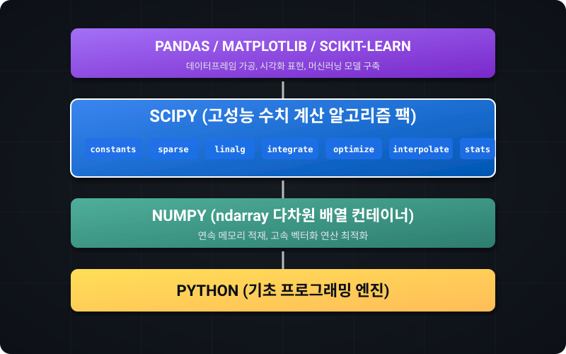

# 사이파이 (SciPy) 핵심 가이드

이 섹션에서는 파이썬 과학용 컴퓨팅과 수치 해석의 대표 라이브러리인 **SciPy(사이파이)**에 대해 다룹니다.
SciPy는 NumPy의 고속 다차원 배열 구조를 뼈대로 하여, 실제 과학, 공학, 그리고 데이터 분석의 핵심적인 수학적 알고리즘(상수 변환, 희소 행렬 연산, 행렬 분해, 미적분, 최적화, 보간법, 고급 통계)들을 표준적이고 일관된 API로 제공합니다.

## 학습목표 {#objectives}
* **NumPy와 SciPy의 관계**를 이해하고 과학용 컴퓨팅 스택의 구조를 설명할 수 있습니다.
* 물리 및 화학 실험 데이터 처리에 유용한 **상수(constants) 모듈**과 메모리를 절약하는 **희소 행렬(sparse) 객체**를 활용할 수 있습니다.
* **linalg(선형대수)** 모듈을 활용하여 연립방정식을 해결하고, 대규모 행렬 분해(LU, QR, SVD)를 최적화된 연산으로 처리합니다.
* **integrate(미적분) 및 optimize(최적화)** 모듈로 적분 값을 구하고, 손실 함수의 최소 지점이나 비선형 함수의 파라미터 최적값을 추적해 봅니다.
* **interpolate(보간법)**을 이용해 불연속적으로 끊어진 샘플 데이터 사이를 메우고, **stats(통계)**를 통해 확률 분포 분석 및 통계적 가설 검정을 내릴 수 있습니다.

## 과목 핵심 목차 {#core-contents}

### [7.1 사이파이 기초](01_scipy_basics/)
* [7.1.1 사이파이 개요 및 특징](01_scipy_basics/01_intro/)
* [7.1.2 사이파이 설치 및 아키텍처](01_scipy_basics/02_install_arch/)

### [7.2 물리/수학 상수](02_constants/)
* [7.2.1 상수 모듈 (scipy.constants)](02_constants/01_constants/)
* [7.2.2 물리 상수군과 검색](02_constants/02_physics_constants/)

### [7.3 희소 행렬](03_sparse/)
* [7.3.1 희소 행렬 (scipy.sparse)](03_sparse/01_sparse_matrix/)
* [7.3.2 희소 행렬 연산과 최적화](03_sparse/02_sparse_types/)

### [7.4 선형대수](04_linalg/)
* [7.4.1 고급 선형대수 (scipy.linalg)](04_linalg/01_linalg_advanced/)
* [7.4.2 행렬 분해 (LU/QR/SVD)](04_linalg/02_matrix_decompositions/)

### [7.5 수치 적분](05_integrate/)
* [7.5.1 수치 적분 (scipy.integrate)](05_integrate/01_integration/)
* [7.5.2 다중 적분 및 상미분 방정식 (ODE)](05_integrate/02_ode_solver/)

### [7.6 최적화 및 방정식 해 구하기](06_optimize/)
* [7.6.1 함수 최적화 (scipy.optimize)](06_optimize/01_optimization/)
* [7.6.2 근 찾기 및 비선형 방정식](06_optimize/02_root_finding/)

### [7.7 보간법](07_interpolate/)
* [7.7.1 보간법 (scipy.interpolate)](07_interpolate/01_interpolation/)
* [7.7.2 다차원 보간법 (Griddata)](07_interpolate/02_splines/)

### [7.8 통계 및 가설 검정](08_stats/)
* [7.8.1 통계 분석 (scipy.stats)](08_stats/01_statistics/)
* [7.8.2 통계적 가설 검정](08_stats/02_hypothesis_testing/)

## 정리 {#summary}
SciPy를 통해 우리는 NumPy로 구조화한 날것의 행렬 데이터 위에 **강력한 전산 알고리즘 엔진**을 장착하게 되었습니다. 단순한 덧셈, 뺄셈, 곱셈을 넘어 적분을 구하고, 산맥의 최저점을 찾고, 끊어진 교각을 잇고, 가설 검정을 내리는 고급 수치 연산 및 과학적 통계의 세계는 여러분을 더 깊고 풍부한 인공지능과 데이터 분석의 영역으로 인도할 것입니다.
