# 2.6 구글 코랩(Google Colab) 환경 설정 및 사용법

> **학습목표**: 구글 코랩(Google Colab)의 특징을 이해하고, 접속부터 파일 생성, 코드 실행 및 시각화 준비, 데이터 전처리, 그리고 구글 드라이브 연동 저장까지 코랩을 완벽하게 활용하는 방법을 배웁니다.


## 1. 구글 코랩(Colab) 개요
`구글` 코랩(Google Colab)은 구글이 제공하는 `클라우드` 기반의 `주피터 노트북`(Jupyter Notebook) 환경입니다.
주로 `파이썬`을 기반으로 한 `데이터 분석`, `머신러닝`, `딥러닝` 등의 작업을 수행할 때 그 진가를 발휘합니다.

코랩은 `브라우저`에서 실행되며, `무료`로 사용할 수 있는 가상 머신을 제공하여 사용자가 별도로 고성능 서버를 구축하지 않고도 하드웨어 자원을 활용할 수 있게 해줍니다.


### 코랩의 주요 특징
- **무료 GPU 지원**: 무료로 사용할 수 있는 GPU를 제공하여 딥러닝 모델 학습 등에 매우 유용합니다.
- **클라우드 기반**: 모든 작업은 구글 클라우드 서버에서 이루어지기 때문에 내 컴퓨터(로컬 환경)의 사양 성능에 구애받지 않습니다.
- **주피터 노트북 통합**: 기존 주피터 노트북과 완벽히 호환되어 코드와 문서를 함께 작성하고 시각화할 수 있습니다.
- **필수 패키지 사전 설치**: Pandas, Numpy, Matplotlib 등 주요 데이터 과학 패키지가 이미 설치되어 있습니다.
- **구글 드라이브 연동**: 구글 드라이브 파일과 동기화되어 코드 및 데이터를 손쉽게 저장하고 언제든 꺼내 쓸 수 있습니다.


## 2. 코랩 접속 및 새 파일(노트북) 생성하기
구글 계정이 없다면 먼저 계정을 만듭니다. 구글 계정으로 로그인한 후 코랩 홈페이지에 접속하여 문서 작업을 시작해 봅니다.


### 브라우저 접속

웹 브라우저 주소창에 [https://colab.research.google.com](https://colab.research.google.com)을 입력하여 이동합니다.


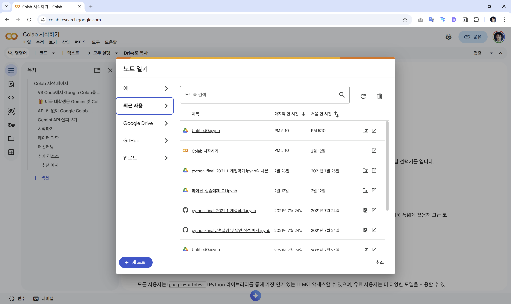


### 새노트 생성

팝업으로 뜨는 **[노트 열기]** 화면 우측 하단의 **[+ 새 노트]** 버튼을 클릭합니다.
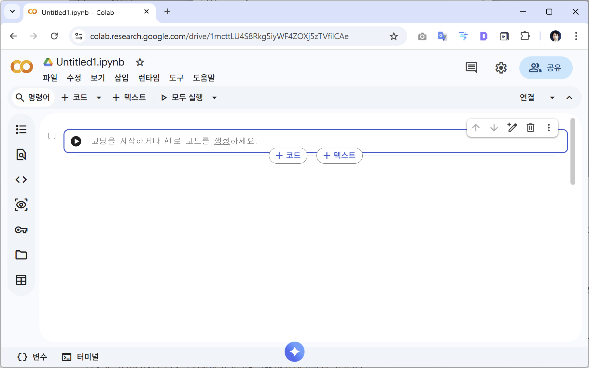


새로운 파일이 생성되면 좌측 상단에 `Untitled0.ipynb`라는 임시 파일 이름이 보입니다. 

이 파일명을 클릭하여 원하는 이름으로 변경해 줍니다.

> 


### 연결

문서를 편집하거나 코드를 실행하기 전, 구글 서버PC 한 대를 대여받기 위해 우측 상단의 **[연결]** 버튼을 누릅니다. 


우측과 하단에 RAM, 디스크 용량이 표기되며 코랩 엔진 연결이 완료됩니다.

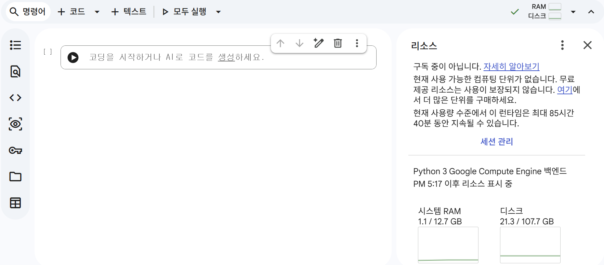


## 3. 셀(Cell)의 이해와 코드 실행 메커니즘
주피터 노트북 환경은 **셀(Cell)**이라는 네모난 블록 단위로 이루어져 있습니다.

셀은 크게 **코드 셀**과 **텍스트 셀**로 나뉩니다.

- **코드 셀(Code Cell)**: 실제 파이썬 코드를 작성하고 계산 식을 적어 넣는 공간입니다.
- **텍스트 셀(Text Cell)**: 설명문, 제목 등을 **마크다운(Markdown)** 문법으로 자유롭게 꾸며서 작성하는 발표형 문서 공간입니다.


> 마크다운이란?
>
> 


텍스트 셀에 마크다운을 적으면 우측에 즉시 미리보기가 표시되어 깔끔한 문서를 조판할 수 있습니다.


코드 셀에 파이썬 코드를 입력한 후, 셀 왼쪽의 둥근 **재생(▶) 버튼**을 누르거나 키보드 단축키인 `Shift + Enter`를 누르면 코드가 실행되고 그 결괏값이 셀 바로 밑에 출력됩니다. 
좌측에 뜨는 `[1]`, `[2]` 표시는 코드를 실행한 순서를 나타냅니다.


```python
import sys
sys.version
```
```text
'3.10.12 (main, Nov 20 2023, 15:14:05) [GCC 11.4.0]'
```


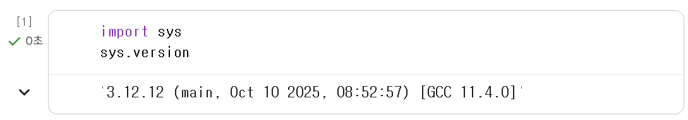


> 참고: 위처럼 코랩은 구글의 거대한 리눅스 서버망을 대여받아 사용하는 것이기 때문에, 내 PC(로컬) 환경과는 파이썬 설치 경로와 버전이 조금씩 다를 수 있습니다.


## 4. 데이터 시각화를 위한 한글 폰트 준비
코랩에서는 기본적으로 영어 폰트만 지원하기 때문에, 한글로 된 제목을 넣은 그래프를 그리면 글자가 네모 모양(ㅁㅁㅁ)으로 모두 깨져버립니다.

아래의 3단계 코드를 순서대로 실행시켜 시각화 그래프를 선명하게 만들고 한글 깨짐 방지 패키지를 설치합니다.

```python
# 2.6 그림을 망막(Retina) 디스플레이에도 선명하게 출력하도록 설정
%config InlineBackend.figure_format = 'retina'

# 2.6 한글 출력 모듈 강제 설치 (!pip 명령어는 코랩(리눅스) 서버에 직접 다운로드 명령을 내립니다.)
!pip install koreanize-matplotlib

# 2.6 필요 패키지 import 후 정상 작동 테스트
import koreanize_matplotlib
import matplotlib.pyplot as plt

plt.title('데이터 시각화의 한글 준비와 기본 직선 그래프')
plt.plot([10, 5, 20, 30])
plt.show() # 한글이 깨지지 않고 예쁜 꺾은선 그래프가 나타납니다.
```


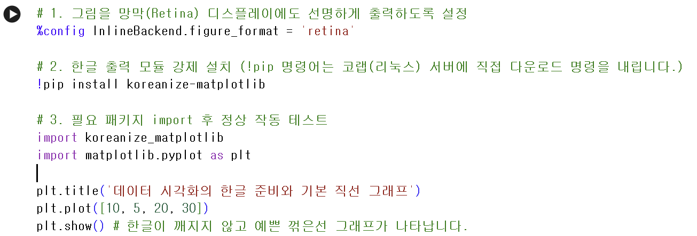


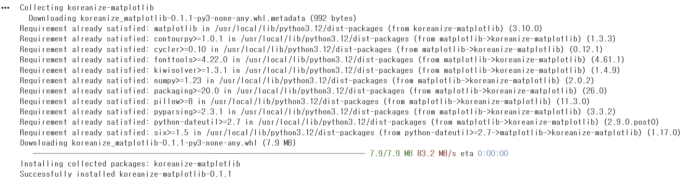


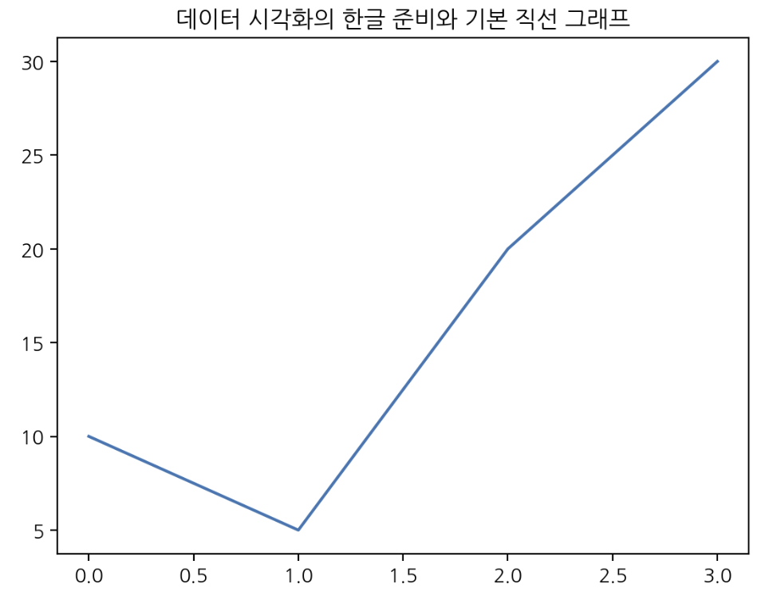


## 5.추가 실습

```python
import site
site.getsitepackages()
```


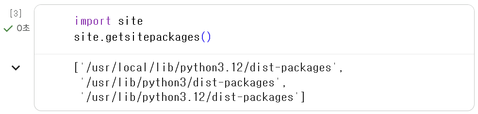


```py
import sys
sys.version
```


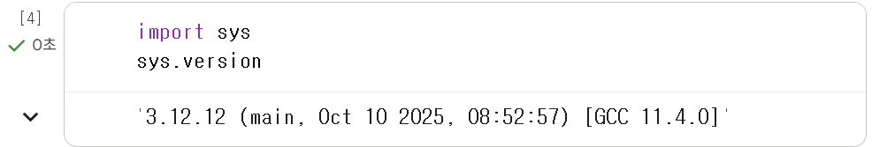


## 6. 나의 엑셀/CSV 데이터파일 업로드 및 처리
내 컴퓨터 바탕화면에 있는 엑셀이나 CSV 파일을 코랩 서버로 가져와 분석하는 방법입니다.


### 6.1 학습 셈플 데이터 받기

https://jumin.mois.go.kr/statMonth.do 로 접속합니다.

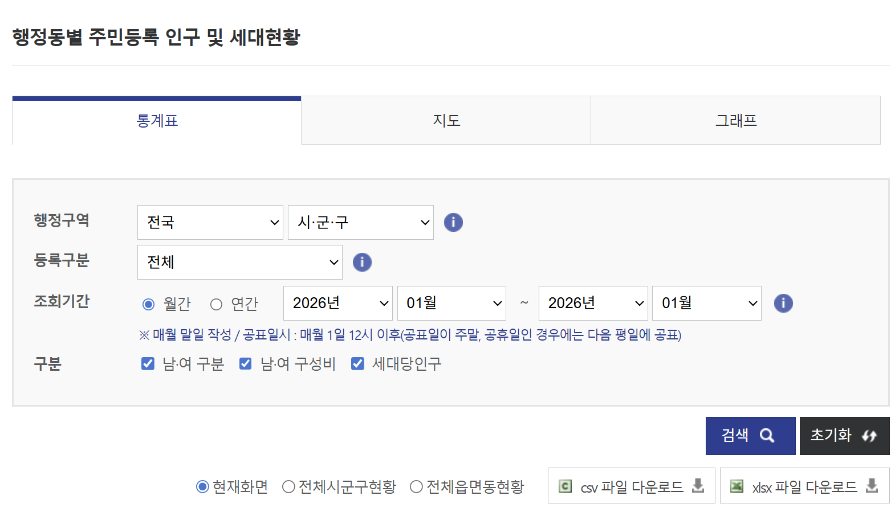

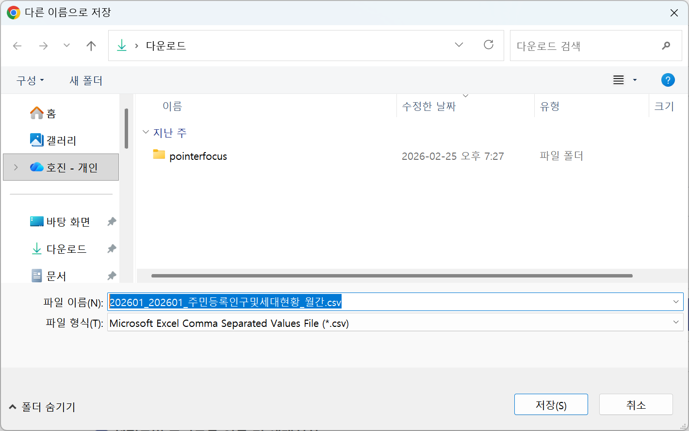

저장합니다.


### 6.2 업로드

코랩 좌측 메뉴 바에서 두꺼운 **[폴더]** 모양 아이콘을 클릭합니다.


내 컴퓨터의 '행정안전부 주민등록 인구통계 파일'을 브라우저 좌측 여백으로 **드래그 앤 드롭**하여 업로드합니다.

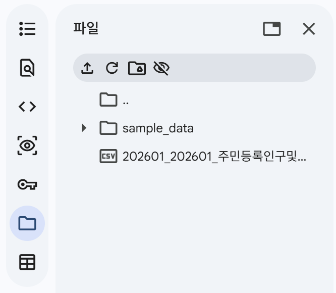


>  주의: "런타임이 종료되면 파일이 삭제된다"는 경고창이 뜹니다. 
>
> 이는 코랩 서버 컴퓨터를 끄면 서버에 올린 임시 파일도 사라진다는 뜻이므로 [확인]을 누르면 됩니다.


### 6.3 Pandas 로 읽어오기

올라간 파일을 Pandas 라이브러리로 읽어 전처리하는 예시 코드입니다.
```python
import pandas as pd

# 2.6 한글 파일(cp949)을 깨지지 않게 읽고 콤마(,) 숫자를 정수로 인식하게 하여 불러옴
pop = pd.read_csv("202311popmonth.csv", encoding='cp949', index_col=0, thousands=',')

# 2.6 컬럼명(열 제목) 깔끔하게 재정의
pop.columns = ['총인구수', '세대수', '세대당인구', '남자인구수', '여자인구수', '남여비율']

# 2.6 지저분하게 작성된 텍스트 인덱스를 띄어쓰기 기준으로 앞부분 단어 지역명만 뽑아서 깔끔하게 자름
pop.index = [pop.index[i].split()[0] for i in range(len(pop))]
pop.head() # 상위 5개 데이터 미리보기
```


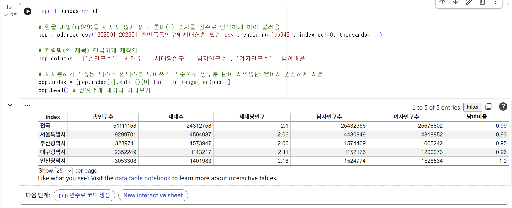


간단하게 전처리된 인구수 데이터를 시각화 함수(`sns.scatterplot`)에 넣어 아름다운 분포 차트를 그릴 수 있습니다.

```python
import seaborn as sns

sns.scatterplot(pop['총인구수'])
plt.xticks(rotation=90) # 행정구역 이름이 겹치지 않게 90도로 세워줌
plt.show()
```
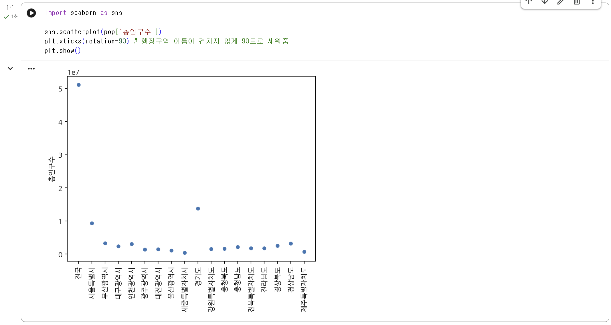


## 7. 노트북 파일 안전하게 구글 드라이브에 저장하기
열심히 작성한 노트북의 파이썬 코드들은 내 구글 아이디의 구글 드라이브에 안전하게 보관할 수 있습니다.
- 좌측 상단 메뉴 모음에서 **[파일] -> [저장(S)]**을 누르면 구글 드라이브 내 정해진 영역에 자동 동기화되어 저장됩니다. (`Ctrl + S` 키보드 단축키 사용 추천)

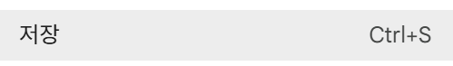


- **[Drive에 사본 저장]** 버튼을 누르면 원본을 그대로 냅두고 똑같은 복사본 노트북 탭을 생성시켜 2개를 분기하여 작업할 수 있습니다.

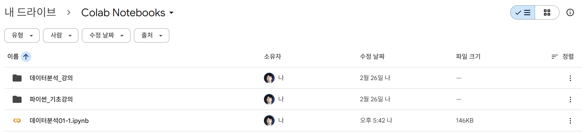

보관된 모든 나의 노트북 파일들은 컴퓨터나 스마트폰에서 내 구글 드라이브로 직접 접속 시 **`Colab Notebooks`** 라는 전용 폴더 하위 위치에 완벽하게 일괄 저장되어 있음을 언제든 확인할 수 있습니다.


## 정리 

간단하게 코랩 사용법에 대해서 알아 보았습니다.

> 실습파일 : https://colab.research.google.com/drive/1mcttLU4S8Rkg5iyWF4ZOXj5zTVfilCAe?usp=sharing
