# 2.7 VS Code(Visual Studio Code)

> **학습목표**: 프로 개발자들이 가장 많이 쓰는 스마트한 코드 편집기 'VS Code'를 알아보고, 데이터 분석가처럼 쓸 수 있도록 설치부터 마법의 확장팩(Extensions) 세팅, 그리고 초기화 설정법까지 완벽히 마스터합니다.


## 1. VS Code가 뭔가요? 🤔
비주얼 스튜디오 코드(Visual Studio Code, 이하 VS Code)는 마이크로소프트가 만들어서 천사처럼 전 세계에 **무료로(오픈소스)** 오픈한 '프로그래밍용 스마트 메모장'입니다. 2016년 정식판 발표 이후 폭발적으로 성장하여 현재 전 세계 개발자 1위의 점유율 최강 에디터 자리를 차지하고 있습니다.

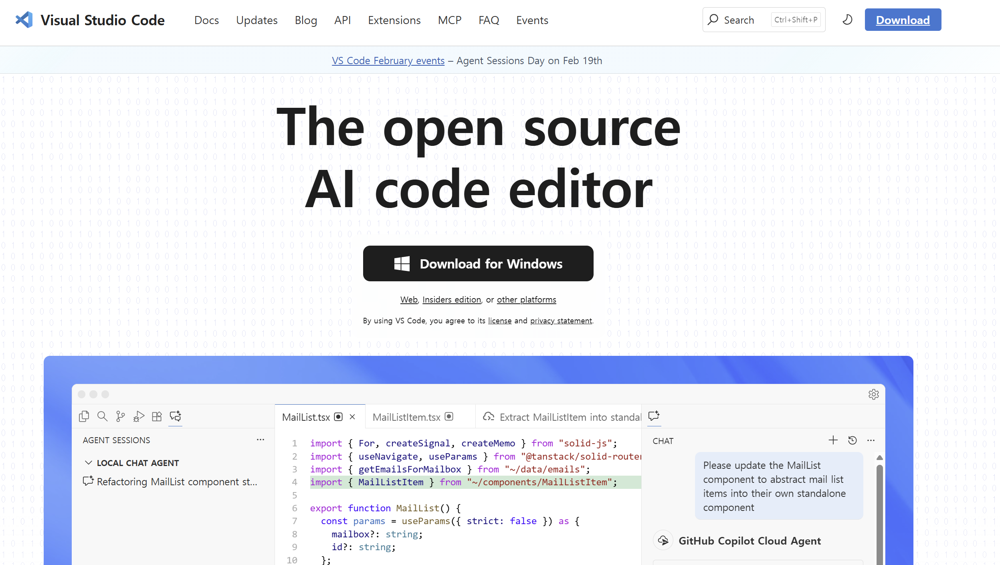


### VS Code의 막강한 장점들
- **가볍고 빠른 실행**: 무거운 타 통합개발환경(IDE)에 비해 프로그램이 매우 가볍고 동작이 빠릅니다.
- **인텔리센스(IntelliSense)**: 코드를 칠 때 색깔을 예쁘게 칠해주고, 내가 치려는 코드를 미리 똑똑하게 문맥을 파악하여 '자동완성' 단어를 띄워줍니다!
- **무한한 확장성(Extensions)**: 스마트폰 앱스토어에서 앱을 깔듯, 레고 블록처럼 수많은 확장 프로그램을 붙여 내가 원하는 아주아주 강력한 만능 컴퓨터로 조립할 수 있습니다.
- **통합 터미널 및 Git 연동**: 창을 왔다 갔다 할 필요 없이 내장된 터미널로 명령어를 치고, 소스코드 버전 관리(Git) 협업까지 한 번에 끝낼 수 있습니다.
- **데이터 분석 최적화**: 노트북 파일(`.ipynb`)을 그대로 열어서 셀 단위로 실행하는 기능을 완벽하게 내장 지원합니다.


## 2. VS Code 다운로드 및 설치하기
1. 공식 홈페이지 방문: [https://code.visualstudio.com/](https://code.visualstudio.com/)
2. 파란색 커다란 **`Download for Windows` (또는 Mac)** 버튼을 눌러서 셋업 파일을 받습니다.
3. 설치 창이 뜨면 다 `동의함`, `다음(Next)`을 누르되, 아주 중요한 순간이 있습니다!
   - 중간에 체크박스들이 여러 개 나오는 단계에서 **"바탕화면에 아이콘 만들기"**, **"PATH에 추가(Add to PATH)"**, **"Windows 탐색기 파일/디렉토리 컨텍스트 메뉴에 추가"** 등이 나온다면 하나도 빠짐없이 **전부 V 체크** 되게 꼭 눌러주세요!


## 3. 한글 패치 장착하기 🇰🇷
처음 열면 온통 영어라서 당황스럽죠? 한국어로 언어를 바꿔봅시다.
1. 프로그램 왼쪽 가장자리에 네모 블록들이 흩어져 있는 모양의 아이콘(**`Extensions(확장)`**, 단축키 `Ctrl+Shift+X`)을 창 클릭합니다.
2. 위쪽에 뜨는 검색창에 `Korean` 이라고 칩니다.
3. 지구본 모양이 그려진 **Korean Language Pack for Visual Studio Code** 라는 것을 찾아서 파란색 `Install(설치)` 버튼을 누릅니다.
4. 설치가 끝나면 오른쪽 화면 아래 구석에 작게 [Change Language and Restart] 라는 파란 버튼이 뜨는데 이것을 누르면 VS Code가 재시작하면서 완벽한 한글 메뉴로 기적처럼 변신해 있습니다.


## 4. 파이썬 확장팩
VS Code 자체는 지금 껍데기일 뿐이라, 파이썬 코드를 알아듣게 하려면 두뇌를 심어줘야 합니다.

1. 아까 그 **확장(Extensions)** 메뉴로 또 갑니다.

2. 검색창에 **`Python`** 이라고 치고 가장 맨 위(마이크로소프트 MS 공식 로고가 박힌 것)에 있는 걸 `설치(Install)` 합니다. 이제 에러가 났을 때 친절한 문법 검사와 팁을 해설사처럼 받을 수 있습니다!

   > 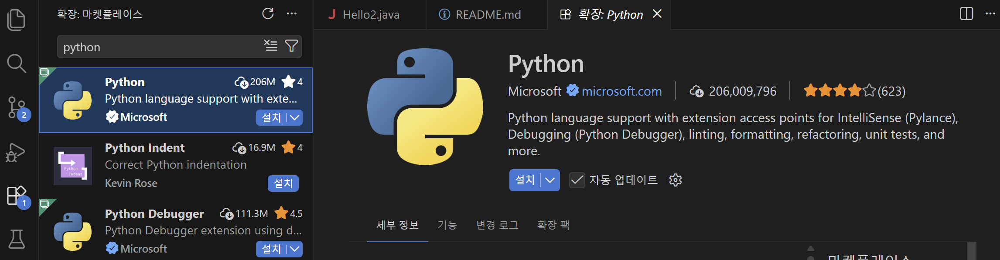

3. 검색창 글씨를 지우고 이번엔 **`Jupyter`** 라고 쳐서 설치합니다. 아나콘다에서 썼던 그 예쁜 블록 모양의 스케치북 시스템(`.ipynb`)을 VS Code 안에서도 똑같이, 더 예쁘고 강력하게 쓸 수 있게 만들어주는 엄청난 플러그인입니다.

   > 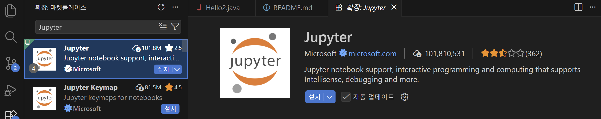


## 5. 첫 파이썬 파일 생성 및 터미널 실행해 보기
확장팩 설치가 끝났다면 실제 폴더를 열고 파이썬 코드를 작성해 보겠습니다.

1. VS Code 좌측 상단의 종이 두 장 겹친 모양(`Explorer` 탐색기) 아이콘을 눌러 **'Open Folder(폴더 열기)'** 버튼을 누릅니다. 작업할 내 컴퓨터의 빈 폴더를 선택합니다.

2. 팝업이 뜨면 **'Yes, I trust the authors(예, 작성자를 신뢰합니다)'** 파란색 버튼을 눌러 권한을 허용합니다.

3. 탐색기 여백에 마우스 우클릭 후 **'새 파일(New File)'**을 누르고, 파일 이름을 `hello.py`로 짓습니다. `.py` 확장자는 이 파일이 파이썬 소스코드임을 뜻합니다.

4. 파일 창에 `print("Hello, VS Code!")` 라고 코드를 적습니다.

   > ```py
   > print("Hello, VsCode!")
   > ```
   >
   > 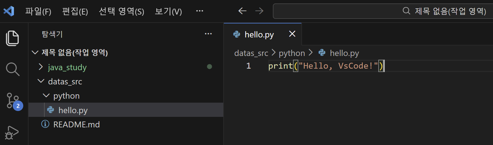

5. 메뉴 상단에서 **Run(실행) -> Run Without Debugging(디버깅 없이 실행)**을 누르거나 키보드 단축키 `Ctrl + F5`를 누릅니다.

   > 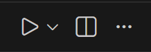

1. 하단에 `Terminal(터미널)` 창이 쑥 올라오면서 코드가 실행되고 결괏값이 출력되는 것을 볼 수 있습니다!

   > 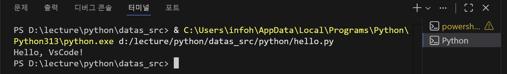


## 6. 주피터 노트북 파일(*.ipynb) 생성 및 실행해 보기
최신 데이터 분석의 꽃인 주피터 노트북도 똑같이 사용 가능합니다.

1. 마찬가지로 탐색기에서 **'새 파일'**을 만들되 이번엔 `hello.ipynb` 처럼 파이썬 노트북 확장자(`.ipynb`)로 만듭니다.

   > 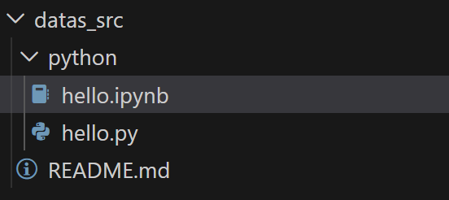

2. 예쁜 블록(셀) 모양의 화면이 나타납니다. 빈 셀에 코드를 입력해 봅니다.

   > 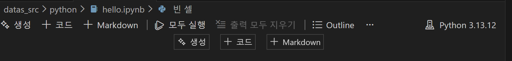
   >
   > 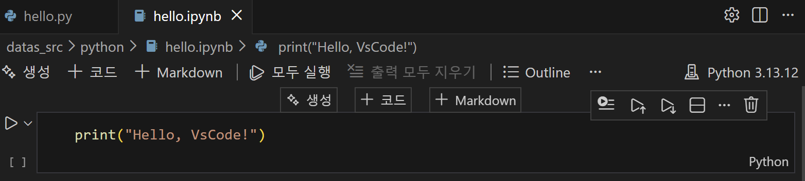

3. 최초 실행 시, 화면 우측 상단이나 중앙 팝업에 파이썬 엔진을 선택해 달라는 **'Select Kernel(커널 선택)'** 문구가 뜹니다.

   > 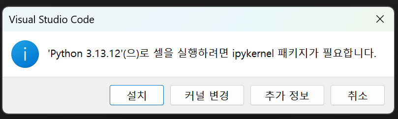
   >
   > 설치를 진행합니다.
   >
   > 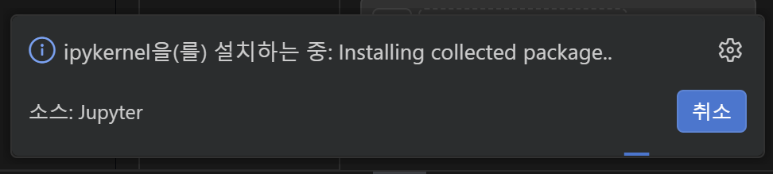


1. 커널을 누른 뒤 **'Python Environments(파이썬 환경)'** 메뉴에서 현재 컴퓨터에 설치된 가장 권장되는 Python 버전을 클릭하여 연결합니다. (만약 설치 과정에서 에러가 나거나 추가 설치 팝업이 뜨면 Install을 무조건 누르면 알아서 세팅됩니다.)

2. 연결 후 셀 왼쪽에 있는 **재생 버튼(▶)**을 누르거나 `Shift + Enter` 단축키를 치면, 코랩(Colab)에서 했던 것과 완벽히 똑같이 코드가 블록 바로 밑에 실행됩니다.

   > 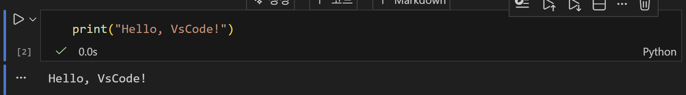


## 7. (부록) VS Code 환경 설정 초기화 팁 (Troubleshooting)
플러그인을 이것저것 깔다가 꼬였거나 VS Code가 오류를 뿜을 때, **아예 처음 설치했던 백지상태로 되돌리는 가장 확실한 방법**입니다.
VS Code는 사용자가 설치한 확장팩과 세팅 정보를 특정 폴더들에 파일로 꽁꽁 숨겨 저장해 둡니다. 프로그램을 삭제했다 깔아도 이 폴더가 남아있으면 설정이 그대로 유지됩니다.

따라서 초기화를 원한다면 VS Code를 종료한 뒤 아래 두 개의 숨겨진 폴더를 삭제(휴지통)해 버리면, 다음 실행 시 완벽하게 초심자의 초기 설정으로 시작할 수 있습니다.
- `C:\Users\[내 윈도우 로그인계정명]\.vscode`
- `C:\Users\[내 윈도우 로그인계정명]\AppData\Roaming\Code`


