# 1. 파이썬 기초

데이터 분석을 위한 파이썬을 알아보고, 기초 문법을 학습합니다


Python 코드를 이용하여 데이터 처리를 위한 핵심 개념을 학습합니다 .

 변수를 활용하여 데이터를 저장하고， 제어문과 반복문을 통해 프 로그램의 흐름을 제어하는 방법을 배웁니다． 

◇ 주요 내용

- 변수와 데이터 타입 : 정수 , 실수 , 문자열 , 리스트， 튜플 , 딕셔너리 등 다양한 데이터 타입

- 연산자 활용 : 산술 , 비교， 논리 연산자를 사용하여 데이터를 조작하고 조건을 설정
- 제어문과 반복문 : if-else 조건문과 for, while 반복문을 활용하여 프로그램의 흐름을 제어

- 함수의 정의와 호출 : def를 사용해 함수를 만들꾀 return을 통해 결과를 반환하는방법


## 1.1 변수와 연산


### 1.1.1 변수 개념 이해하기 

파이썬에서 변수는 데이터를 저장하는 컨테이너입니다 . 변수를 사용하면 코드 내에서 데이터를 더 쉽 게 관리할 수 있습니다． 


#### ① 변수 선언과 할당

- 파이썬에서 변수를 선언하고 값을 할당하는 것은 간단하게 = 연산자를 사용합니다．
```python
# 변수에 값을 할당
number = 10 
greeting = " 안녕하세요！"
```
> 위 예제에서 number 변수는 정수 10, greeting 변수는 문자열 " 안녕하세요！ " 를 각각 저장하고 있습니다 .


#### ② 변수 사용하기

- 변수에 값을 할당한 후에는 변수의 이름을 통해 해당 값을 언제든지 참조 확인할 수 있습니다．
```python
# 변수 값을 출력 
print(number) 
print(greeting)
```
>  print() 함수를 사용하여 이들 변수의 내용을 콘솔에 출력합니다．


출력결과

```
10
안녕하세요!
```

> 코랩에서 실행하기 : https://colab.research.google.com/drive/1zrDt8Lp4QX1sfvcecP-0t_nXLGcdSMWf?usp=drive_link


 

#### ③ 변수의 동적 타이핑

파이썬은 동적 타입 언어입니다 . 

이는 변수의 데이터 타입을 미리 선언할 필요가 없다는 의미입니다 .


 변수의 타입은 할당되는 값에 따라 자동으로 결정됩니다．

```python
# 변수의 타입을 변경
number = " 이제 문자열입니다" 
print(number)
```
이제 문자열입니다 


### 1.1.2 Python에서 변수명 만들기 

파이썬에서 변수를 선언할 때는 몇 가지 중요 규칙과 관례를 따라야 합니다 .

이러한 규칙들은  코드 의 가독성과 유지 보수정을 높이는 데 기여합니다． 


#### ① 변수명 규칙

다음은 파이썬에서 변수의 이름을 지을 때 따라야 하는 기본인 규칙들입니다． 
	1 . 변수명은 알파벳 , 슷자 , 밑줄（-）로구성하며 , 숫자로시작은불가능하다． 

​	2 . 파이썬은 대소문자를구분한다 . 예를들어 , data와Data는서로 다른 변수이다． 

​	3 . 파이썬의 예약어（if, for, class 등）는 변수명으로 사용할수 없다． 

​	4 . 변수명은 그 용도나 저장된 데이터를 명확히 설명하도록 의미 있는 이름을 사용한다．


> 좋은 변수명 예시 
>
> user_age : 사용자의 나이 
>
> num_items : 항목 수 
>
> totaL_price : 총 가격 
>
> is_active : 활성 상태 


#### ② 변수명 스타일

파이썬 커뮤니티 등에서 권장하는 몇 가지 변수명 스타일입니다． 
1 . 스네이크 케이스（snake_case) : 모든 글자를 소문자로 하고 단어 사이에 밑줄을 사용한다 . 함수 와 변수명에 주로 사용한다． 

2 . 카멜 케이스（CamelCase) : 각 단어의 첫 글자를 대문자로 시작한다 . 클래스 이름에 주로 사용 한다．


 ' 이러한 규칙을 따르는 것은 코드를 보다 효율적으로 작성하고 , 다른 개발자들과 협업 시 원활한 소통과 이해하기 쉬운 코드를 유지하는 데 도움이 됩니다． 


### 1.1.3  연산자 학습하기 

파이썬에서는 다양한 종류의 연산자를 제공하여 데이터 처리와 계산을 용이하게 합니다 . 

기본적인 산 술 연산자부터 시작해 보겠습니다． 


#### ① 기본 산술 연산자

두 변수 a와b에 각각 슷자를 할당하고 , 이를 사용하여 기본적인 산술 연산을 수행해 보겠습니다．

실습예제

```python
# 변수 할당
a = 10
b = 3.3

# 기본 산술 연산자 
print('a + b =", a + b) # 덧셈
print('a - b =", a - b) # 뺄셈
print('a * b =", a * b) # 곱셈
print("a I b =", a / b) # 나눗셍
print('a % b = ", a % b)  # 나눗섣I 연산 후 나머지를 계산
print("a // b =', a // b) # 나눗셈의 몫을 정수로 반환
print("a ** b =", a ** b) # 거듭제곱 계산

```


출력결과

a + b = 13.3 

a - b = 6.7 

a * b = 33.0 

a / b = 3. 0303030303030303 

a % b = 0. 10000000000000053 

a II b = 3.0 a ** b = 1995.2623149688789 

> 코랩으로 결과 확인하기 : 


#### ② 비교 연산자

비교 연산자는 두 값의 관계를 평가하는 데 사용됩니다 .

이 결과는 조건문과 반복문에서 중요한 역할을 합니다 . 

파이썬에서 사용되는 비교 연산자들과 그 의미는 아래 표와 같습니다．


* Python 비교 연산자
  - 

> 


위 연산자들은 수학적 비교를 기반으로 하며 , 논리적 조건 평가에 사용됩니다．


비교 연산자 코드 예시

```python
# 동등 비교
a = 10
b = 20 
print("a == b: '닙 a==b) 
#a와 b가 같은지 비교
# 부등 비교 
print("a != b:", a != b) 
# a와 b가 다른지 비교
# 크기 비교 
print("a < b: ", a < b) 
print('a > b: ", a > b)
# a가 b보다 작은지 비교
# a가 b보다 큰지 비교
# 크거나 같음， 작거나 같음 
print('a <= b:", a <= b) 
print("a >= b:", a >= b)
# a가 b보다 작거나 같은지 비교
# a가 b보다 크거나 같은지 비교
```


출력결과

a == b: False 

a != b: True 

a < b: True 

a > b: False 

a <= b: True 

a >= b: False

> 코랩으로 결과 확인하기


비교 연산자는 조건문에서 변수나 표현식의 값을 평가하는 데 유용하게 사졍됩니다 . 

예를 들어 , 사용자 입력값의 검증 , 데이터의 필터링 , 특정 조건에 따른 처리 등으로 프로그램의 흐름을 제어할 수 있습니다．


```python
# 사용자 나이 검증 예제
user_age = 25 
is_adult = user_age >= 18 
print(" 성인입니까？ " , is_adult)
```
위 예제에서는 사용자의 나이가 성인 기준인 18세 이상인지를 검사합니다 . 이를 통해 True 또는  False 결과를 얻어 프로그램에서 다양한 로직을 구현할 수 있습니다．


출력 예시:

성인입니까？ True

> 코랩으로 결과 확인하기:


비교 연산자는 프로그램에서 조건을 설정하고 , 데이터를 분류하며 , 특정 조건에 따라 다른 작업을 수행하게 하는 등의 중요한 역할을 합니다 . 

이들 연산자의 정확한 이해와 사용은 프로그램의 효율성 과 정확성을 높이는 데 기여합니다． 


#### ③ 논리 연산자

논리 연산자는 주로 불리언（참 또는 거짓） 값을 조작하는 데 사용됩니다 . 이 연산자들은 복잡한 조건문을 구성할 때 매우 유용합니다．


>  Boolean 
>
> '불리언（Boolean) ' 은 수학자 조지 불（George Boole）의 이름에서 유래되었으며 . 컴퓨터 과학에서는 참（True) 또는 거짓（False）의 두 가지 값만을 가질 수 있는 데이터 타입을 지칭합니다．
>


논리 연산자 코드 예시

```python
# 논리 연산자 예제
a = True
b = False
# and 연산자
print('a and b: ", a and b) 
# Fa'se, a와 b 둘 다 참이어야 참 반환
# or 연산자 
print("a or b: 식 aorb) 
#True, a와 b 중 하나라도 참이면 참 반환
# not 연산시 
print("not a:", not a)
# Fa1se, a의 반대 불리언 값 반환
```
a and b: False 

a or b: True 

not a: False


위 예제에서 a는 True, b는 False로 정의되었습니다 . and 연산자는 두 조건이 모두 참일 때만 참 을 반환하며 , or 연산자는 두 조건 중 하나라도 참이면 참을 반환합니다 . not 연산자는 조건의 불리 언 값을 반전시킵니다．

논리 연산자를 사용하는 것은 프로그램의 로직을 제어하는 데 매우 중요합니다 . 

복잡한 조건을 평가하거나 , 특정 조건에 따라 다른 동작을 수행하도록 프로그램을 설계할 때 필수적으로 사용됩니다． 


### 1.1.4 연습문제
I 다음 내용을 변수에 저장하고 phnt( ) 함수로 출력하시오．

- 본인의 도시 이름을 저장하는 변수（변수명： city_name)
- 본인의 나이를 저장하는 변수（변수명： age)
- 본인이 학생인지 여부를 저장하는 변수（변수명＝ is_student)
- 
- 
- 2 다음 중 올바른 변수명을 모두 고르시오．
- user name 
- 3val.ue 
- totaiPrice 
- if
- number 2
3 값이 12 및 4인 변수 >< , y를 사용하여 다음 연산을 수행하고 결과를 출력하시오． (x - y) * y / x x ** y If x (x % y) + 2 4 다음 조건을 만족하는 코드를 작성하시오．
- 변수 priceOll 12000, 변수 quantity에 3을 저장
- 총 금액을 계산하여 total_price 변수에 저장
- 총 금액이 10000 이상이고 50000 이하인 경우 True를 출력， 그렇지 않으면 False를 출력
연습문제· SECTUN 01 39

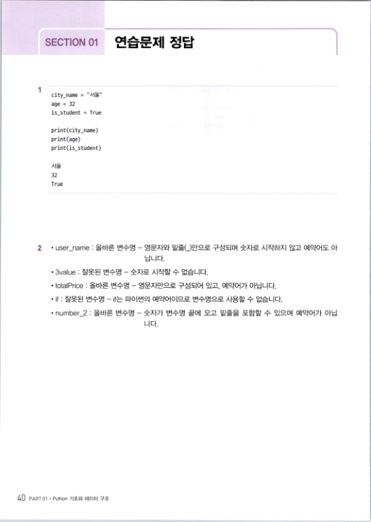
## SECTION 01 
연습문제 정답

```python
city_name = "서울"
age = 32 
is student = True
print(city_name) 
print(age) 
print(is_student)
```
서울 32 True 2

- user_name : 올바른 변수명 - 영문자와 밑줄（-）만으로 구성되며 숫자로 시작하지 않고 예약어도 아
닙니다．

- 3value : 잘못된 변수명 - 숫자로 시작할 수 없습니다．
- totalPrice : 올바른 변수명 - 영문자만으로 구성되어 있고 , 예약어가 아닙니다．
- if : 잘못된 변수명 - ∥는 파이썬의 예약어이므로 변수명으로 사용할 수 없습니다．
- number_2 : 올바른 변수명 
숫자가 변수명 끝에 오고 밑줄을 포함할 수 있으며 예약어가 아닙 니다． 40 PART 01 . Pyth。n 기초와 데이터 구조

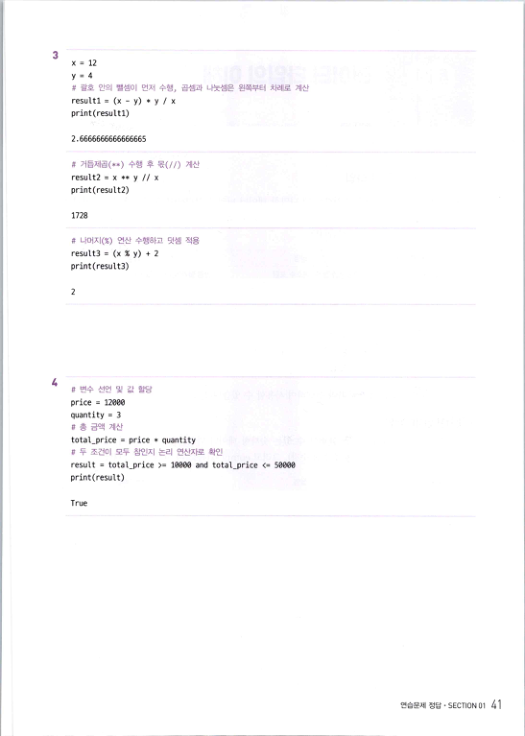
```python
3 
x = 12 
y= 4
# 괄호 안의 뺄셈이 먼저 수행 , 곱셈과 나눗셈은 왼쪽부터 차례로 계산 
resulti = (x - y) * y / x 
print(resultl)
```
2.6666666666666665

```python
# 거듭제곱（**) 수행 후 몫（//) 계산
resu1t2 = x ** y // x 
print(resu1t2)
```
1728

```python
# 나머지（%) 연산 수행하고 덧셈 적용
resu1t3 = (x % y) + 2 
print(resu1t3)
# 변수 선언 및 값 할당 
price = 12000 
quantity = 3
# 총 금액 계산 
total_price = price * quantity 
# 두 조건이 모두 참인지 논리 연산자로 확인 
result = total_price >= 10000 and total_price <= 50000 
print(result)
```
True 연습문제 정답· 


## 1.2 데이터 타입의 이해


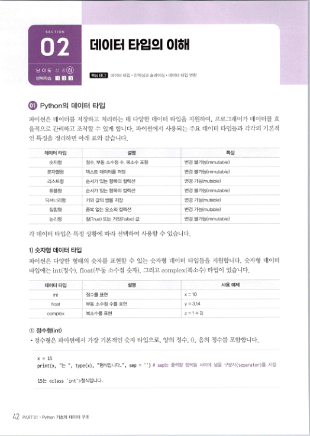
# 


파이썬은 데이터를 저장하고 처리하는 데 다양한 데이터 타입을 지원하여 , 프로그래머가 데이터를 효 율적으로 관리하고 조작할 수 있게 합니다 . 

파이썬에서 사용되는 주요 데이터 타입들과 각각의 기본적 인 특징을 정리하면 아래 표와 같습니다． 데이터 타입 설명 특징 숫자형 정수， 부동 소수점 수． 복소수 포함 변경 불가능지mmutable) 문자열형 텍스트 데이터를 저장 변경 불가능〈immutable) 리스트형 순서가 있는 항목의 컬렉션 변경 가능〈mutable) 튜플형 순서가 있는 항목의 컬렉션 변경 불가능＜immutable) 딕셔너리형 키와 값의 쌍을 저장 변경 가능《mutable) 집합형 중복 없는 요소의 컬렉션 변경 가능＜mutable) 논리형 침(True) 또는 거짓（False) 값 변경 불가능心mmutable) 각 데이터 타입은 특정 상황에 따라 선택하여 사용할 수 있습니다． 1) 숫자형 데이터 타입 파이썬은 다양한 형태의 숫자를 표현할 수 있는 숫자형 데이터 타입들을 지원합니다 . 숫자형 데이터 타입에는 mT1t（정수） , float（부동 소수점 숫자） , 그리고 complex（복소수） 타입이 있습니다． 데이터 타입 설명 사용여떼

```python
nt 
정수를 표현 
x =10
float 
부동 소수점 수를 표현 
y = 3.14
complex 
복소수를 표현 
z = 1 + 긱
```
《j:) 정수형6n)

- 정수형은 파이썬에서 가장 기본적인 숫자 타입으로 , 양의 정수 , 0 , 음의 정수를 포함합니다．
```python
x = 15 
print(x, " 는 " , type(x), " 형식입니다． ", sep = " ) # sep는 출력할 항목들 사이에 넣을 구분자（separator）를 지정
```
15는 <class ' int ' ＞형식입니다． 42 PART 01 'Python 기초와 데이터 구조

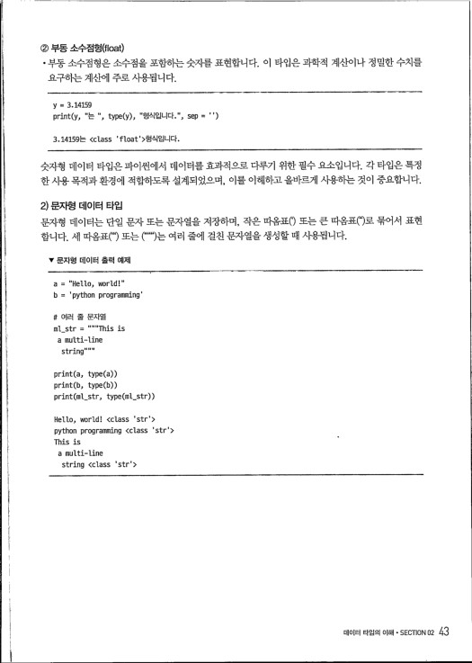
② 부동 소수점형（float)

- 부동 소수점형은 소수점을 포함하는 슷자를 표현합니다 . 이 타입은 과학적 계산이나 정밀한 수치를
요구하는 계산에 주로 사용됩니다．

```python
y = 3.14159 
print(y, " 는 " ' type(y), " 형식입니다． " , sep = " )
```
3. 14159는 <class 'float ' ＞형식입니다．
숫자형 데이터 타입은파이썬에서 데이터를효과적으로 다루기 위한 필수요소입니다 . 각타입은특정 한사용 목적과 환경에 적합하도록 설계되었으며 , 이를 이해하고 올바르게 사용하는 것이 중요합니다． 2) 문자형 데이터 타입 문자형 데이터는 단일 문자 또는 문자열을 저장하며 , 작은 따옴표（') 또는 큰 따옴표（"）로 묶어서 표현 합니다 . 세 따옴표（' " ) 또는（ " " " ）는 여러 줄에 걸친문자열을생성할때 사용됩니다． ▼ 문자헝 데이터 출력 예제

```python
a = "Hello, world!'
b = 'python programming'
# 여러 줄 문자열
```
ml. str = "This is a multi-line string"

```python
print(a, type(a)) 
print(b, type(b)) 
print(ml_str, type(ml. str))
```
Hello, world! <class 'str'> python programing <class 'str'> This is a multi-line string <class 'str '> 데01터 타입의 이해 . SECTION 02 43

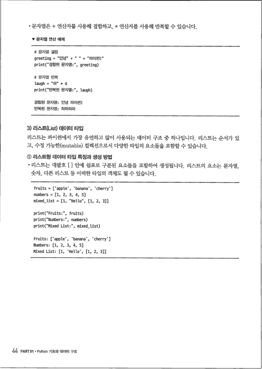
' 문자열은 + 연산자를 사용해 결합하고 , * 연산자를 사용해 반복할 수 있습니다． ▼ 문자열 연산 예제

```python
# 문자열 결합 
greeting = " 안녕 " + " " + " 파이썬르" 
print(" 결합된 문자열： ", greeting)
# 문자열 반복 
lau醜 = " 하 " * 4 
print(" 반복된 문자열： ", laugh)
```
결합된 문자열： 안녕 파이썬끄 반복된 문자열＝ 하하하하 3) 리스트（List) 데이터 타입 리스트는 파이썬에서 가장 유연하고 많이 사용되는 데이터 구조 중 하나입니다 . 리스트는 순서가 있 고， 수정 가능한（mutable) 컬렉션으로서 다양한 타입의 요소들을 포함할 수 있습니다． ① 리스트형 데이터 타입 특징과 생성 방법 ' 리스트는 대괄호 [ 〕 안에 쉼표로 구분된 요소들을 포함하여 생성됩니다 . 리스트의 요소는 문자열， 슷자 , 다른 리스트 등 어떠한 타입의 객쳬도 될 수 있습니다．

```python
fruits = ['apple', 'banana', 'cherry'] 
numbers = [1, 2, 3, 4, 5] 
mixed- list = [1, "Hello', [1, 2, 3]]
print("Fruits:", fruits) 
print("Numbers:", numbers) 
print("Mixed List:", mixed_list)
```
Fruits: ['apple', 'banana', 'cherry'] Numbers: [1, 2, 3, 4, 5] Mixed List: [1, 'Hello', [1, 2, 3]] 44 PART01 .P넜hon 기초와 데이터 구조

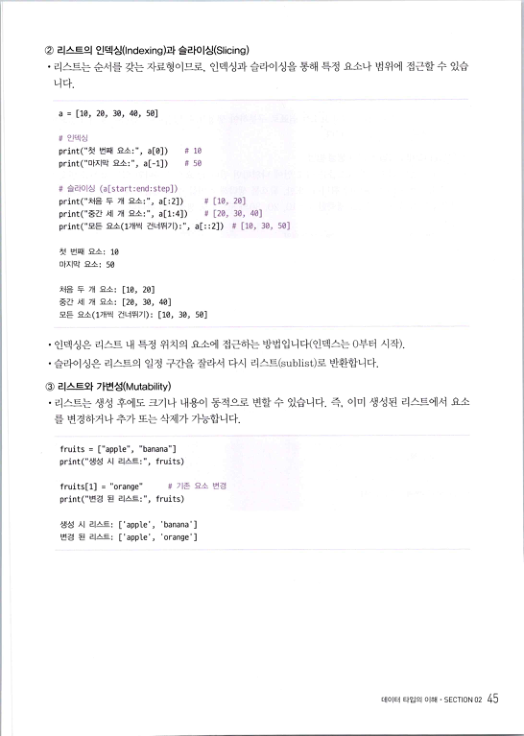
② 리스트의 인덱싱(Indexing）과 슬라이싱（Slicing)

- 리스트는 순서를 갖는 자료형이므로 , 인덱싱과 슬라이싱을 통해 특정 요소나 범위에 접근할 수 있습
니다．

```python
a = [10, 20, 30, 40, 50]
# 인덱싱 
print(" 첫 번째 요소： ", a[0]) 
#10 
print(" 마지막 요소： ', a[ -1]) 
# 50
# 슬라이싱 (a[start:end:step〕) 
print(" 처음 두 개 요소： ', a[:2]) 
# [10, 20] 
print(" 중간 세 개 요소＝ ", a[1:4]) 
# [20, 30, 40] 
print(" 모든 요소（1개씩 건너뛰기）:", a[::2]) 
# [10, 30, 50]
```
첫 번째 요소： 1o 마지막 요소： 50 처음 두 개 요소： [10, 20] 중간 세 개 요소： [20, 30, 4이 모든 요소（1개씩 건너뛰기）= [10, 30, 50]

- 인덱싱은 리스트 내 특정 위치의 요소에 접근하는 방법입니다（인덱스는 0부터 시작）.
- 슬라이싱은 리스트의 일정 구간을 잘라서 다시 리스트（sublist）로 반환합니다．
③ 리스트와 가변성（Mutability)

- 리스트는 생성 후에도 크기나 내용이 동적으로 변할 수 있습니다 . 즉 , 이미 생성된 리스트에서 요소
를 변경하거나 추가 또는 삭제가 가능합니다．

```python
fruits = ["apple", "banana'] 
print(" 생성 시 리스트 " ', fruits)
fruits[1] = " orange " 
# 기존 요소 변경 
print(" 변경 된 리스트： ', fruits)
```
생성 시 리스트＝ ['apple', ' banana '] 변경 된 리스트 ' ['apple닙 ' orange'] 데이터 타입의 이해 . SECTION 02 45

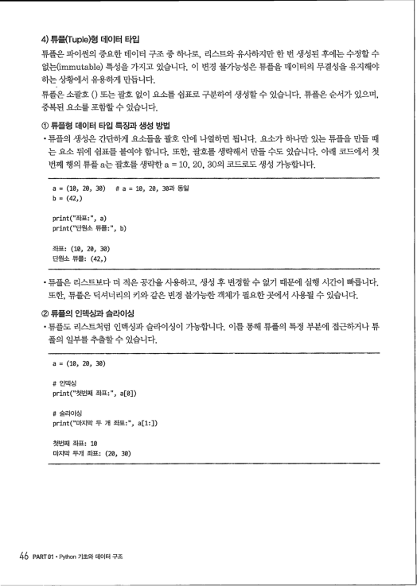
4) 튜플《tU倒e）형 데이터 타입 튜플은 파이썬의 중요한 데이터 구조 중 하나로 , 리스트와 유사하지만 한 번 생성된 후에는 수정할 수 없는（immutable) 특정을 가지고 있습니다 . 이 변경 불가능성은 튜플을 데이터의 무결성을 유지해야 하는 상황에서 유용하게 만듭니다． 튜플은 소괄호 () 또는 괄호 없이 요소를 쉼표로 구분하여 생성할 수 있습니다 . 튜플은 순서가 있으며， 중복된 요소를 포함할 수 있습니다． ① 튜플형 데이터 타입 특징과 생성 방법

- 튜플의 생성은 간단하게 요소들을 괄호 안에 나열하면 됩니다 . 요소가 하나만 있는 튜플을 만들 때 
는 요소 뒤에 쉼표를 붙여야 합니다 . 또한 , 괄호를 생략해서 만들 수도 있습니다 . 아래 코드에서 첫 번째 행의 튜플 a는괄호를 생략한a = 10, 20, 30의 ㅋㄷ무두 생성 가능합니다．

```python
a = (10, 20, 30) 
if a = 10, 20, 30과 동일
b = (42,)
print(" 촤표： " , a) 
print(" 단원소 튜플＝ ', b)
```
좌표： (10, 20, 30) 단원소 튜플： (42,)

- 튜플은 리스트보다 더 적은 공간을 사용하고 , 생성 후 변경할 수 없기 때문에 실행 시간이 빠릅니다．
또한 , 튜플은 딕셔너리의 키와 같은 변경 불가능한 객쳬가 필요한 곳에서 사용될 수 있습니다． ② 튜플의 인덱싱과 슬라이싱

- 튜플도 리스트처럼 인덱싱과 슬라이싱이 가능합니다 . 이를 통해 튜플의 특정 부분에 접근하거나 튜
플의 일부를 추출할 수 있습니다．

```python
a = (10, 20, 30)
# 인덱싱 
print(" 첫번째 좌표＝ ", a[0])
＃슬라이싱 
print(" 마지막 두 개 좌표＝ ", a[1:])
```
첫번째 좌표： 10 마지막 두개 좌표： (20, 30) 48 PART 01 · Python 기초와 데이터 구조

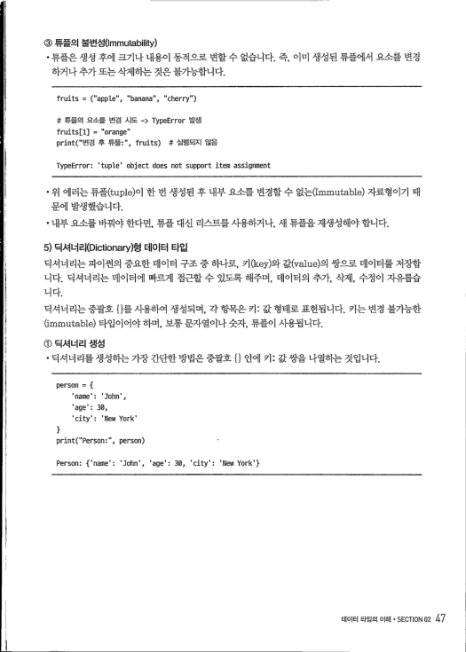
③ 튜플의 불변성(Immutability)

- 튜플은 생성 후에 크기나 내용이 동적으로 변할 수 없습니다 . 즉 , 이미 생성된 튜플에서 요소를 변경
하거나 추가 또는 삭제하는 것은 불가능합니다．

```python
fruits = ("appl.e", "banana", "cherry")
# 튜플의 요소를 변경 시도 -> TypeError 발생 
fruitsEl] = "orange" 
print(" 변경 후 튜플： ", fruit5') 
# 실행되지 않음
```
TypeError: 'tuple' object does not support item assignment

- 위 에러는 튜플（tuple）이 한 번 생성된 후 내부 요소를 변경할 수 없는（Immutable) 자료형이기 때
문에 발생했습니다．

- 내부 요소를 바꿔야 한다면 , 튜플 대신 리스트를 사용하거나 , 새 튜플을 재생성해야 합니다．
5) 딕셔너리（Dictionary）형 데이터 타입 딕셔너리는 파이썬의 중요한 데이터 구조 중 하나로 , 키（key）와 값（value）의 쌍으로 데이터를 저장합 니다 . 딕셔너리는 데이터에 빠르게 접근할 수 있도록 해주며 , 데이터의 추가 , 삭제 , 수정이 자유롭습 니다． 딕셔너리는중괄호 ＂를사용하여 생성되며 , 각항목은 키： 값 형태로 표현됩니다 . 키는 변경 불가능한 (immutable) 타입이어야하며 , 보통문자열이나숫자 , 튜플이 사용됩니다 .

① 딕셔너리 생성

- 딕셔너리를 생성하는 가장 간단한 방법은 중괄호 {} 안에 키： 값 쌍을 나열하는 것입니다．
```python
person = {
```
'name': 'John', 'age': 30, 'city': 'New York'

```python
} 
print("Person:", person)
```
Person: {'name': 'John', 'age': 30, 'city' : 'New York'} 데이터 타입의 이해 . SECTION 02 47

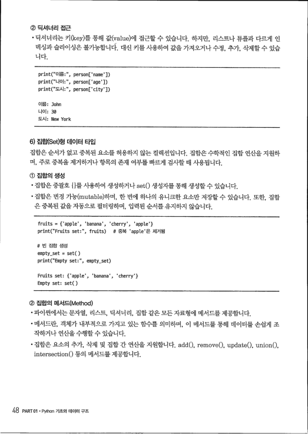
② 딕셔너리 접근 ' 딕셔너리는 키（key）를 통해 값（value）에 접근할 수 있습니다 . 하지만 , 리스트나 튜플과 다르게 인 덱싱과슬라이싱은불가능합니다 . 대신 키를사용하여 값을가져오거나수정 , 추가 , 삭제할수 있습 니다．

```python
print("O!름:", person[ 'name'J) 
print("LFOJ:", personf rages 〕） 
print(" 도I:", personf 'city'])
```
이름： John 나이＝ 30 도시： New York 6) 집합（Set）형 데이터 타입 집합은 순서가 없고중복된 요소를 허용하지 않는 컬렉션입니다 . 집합은 수학적인 집합 연산을 지원하 며 , 주로 중복을 제거하거나 항목의 존재 여부를 빠르게 검사할 때 사졍됩니다． ① 집합의 생성 ' 집합은중괄호 ｝를 사용하여 생성하거나 set() 생성자를 통해 생성할수 있습니다． ' 집합은 변경 가능（mutable）하며 , 한 번에 하나의 유니크한 요소만 저장할 수 있습니다 . 또한 , 집합 은중복된 값을자동으로 필터링하며 , 입력된 순서를유지하지 않습니다．

```python
fruits = {'apple', 'banana', 'cherry', 'appl.e'} 
print("Fruits set:", fruits) 
# 중복 ' apple ' 은 제거됨
# 빈 집합 생성
empty_set = set() 
print("Empty set:", empty_set)
```
Fruits set: {'apple', 'banana', 'cherry'} Empty set: set() ② 집합의 메서드（Method)

- 파이썬에서는문자열 , 리스트 , 딕셔너리 , 집합같은모든자료형에 메서드를제공합니다．
' 메서드란, 객쳬가 내부적으로 가지고 있는 함수를 의미하며 , 이 메서드를 통해 데이터를 손쉽게 조 작하거나 연산을 수행할수 있습니다． ' 집함은 요소의 추가 , 삭제 및 집합간 연산을 지원합니다 . addO, removeO, updateO, unionO, intersection() 등의 메서드를 제공합니다． 48 PART 01 . PyTh。n 기초와 데이터 구조

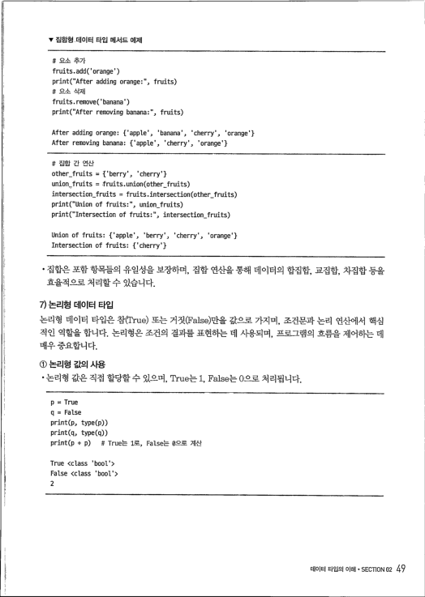
▼ 집합형．데이터 타입 메서드 예제

```python
# 요소 추가 
fruits. add( 'orange') 
print("After adding orange:", fruits) 
# 요소 삭제 
fruits. remove( 'banana') 
print("After removing banana:", fruits)
```
After adding orange: {'apple', 'banana', 'cherry', 'orange'} After removing banana: {'appl.e', 'cherry', 'orange'}

```python
# 집합 간 연산 
other_fruits = {'berry', 'cherry'} 
union_fruits = fruits.union(other_fruits) 
intersection_fruits = fruits. intersection(other_fruits) 
print("Union of fruits:", union_fruits) 
print("Intersection of fruits:", intersection_fruits)
```
Union of fruits: {'apple', 'berry', 'cherry', 'orange'} Intersection of fruits: {'cherry'} ' 집합은 포함 항목들의 유일성을 보장하며 , 집합 연산을 통해 데이터의 합집합 , 교집합 , 차집합 등을 효율적으로 처리할 수 있습니다． 7) 논리형 데이터 타입 논리형 데이터 타입은 참（山rue) 또는 거짓（False）만을 값으로 가지며 , 조건문과 논리 연산에서 핵심 적인 역할을 합니다 . 논리형은 조건의 결과를 표현하는 데 사용되며 , 프로그램의 흐름을 제아하는 데 매우 중요합니다． ① 논리형 값의 사용 ' 논리형 값은 직접 할당할수 있으며 , True는 1, False는 0으로 처리됩니다．

```python
p = True
q = False 
print(p, type(p)) 
print(q, type(q)) 
print(p + p) 
# True는 1로 , False는 0으로 계산
```
True <class 'bool'> False <class 'bool'> 2 데이터 타입의 이해 · SECT!아J 02 49

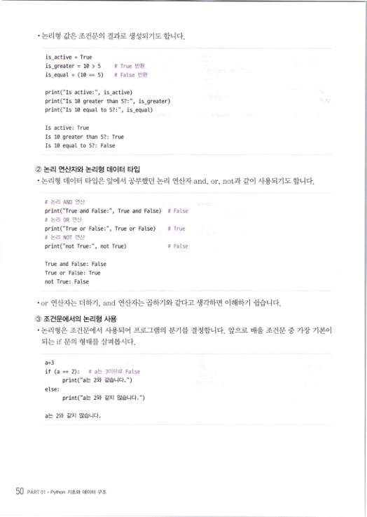
- 논리형 값은 조건문의 결과로 생성되기도 합니다．
```python
is active = True 
is_greater = 10 > 5 
is_equal = (10 == 5)
# True 반환
# False 반환
print(Is active:", is_active) 
print("Is 10 greater than 5?:", is_greater) 
print(Is 10 equal to 5?:", is_equal)
```
Is active: True Is 10 greater than 5?: True Is 10 equal to 5?: False ② 논리 연산자와 논리형 데이터 타입

- 논리형 데이터 타입은 앞에서 공부했던 논리 연산자 and, or, not과 같이 사용되기도 합니다．
```python
# 논리 AND 연산 
print("True and False:", True and False)
# False
# 논리 OR 연산 
print('True or False: ", True or False)
# True
# 논리 NOT 연산 
print("not True: ", not True)
# False
```
True and False: False True or False: True not True: False

- or 연산자는 더하기 , and 연산자는 곱하기와 같다고 생각하면 이해하기 쉽습니다．
③ 조건문에서의 논리형 사용

- 논리형은 조건문에서 사용되어 프로그램의 분기를 결정합니다 . 앞으로 배울 조건문 중 가장 기본이
되는 if 문의 형태를 살펴봅시다．

```python
a=3 
if (a == 2): 
# a는 3이므로 False 
print("a는 2와 같습니다． " ) 
else: 
print('a는 2와 같지 않습니다． " )
```
a는 2와 같지 않습니다． 50 PART01 ·Python 기초와 데이터 구조

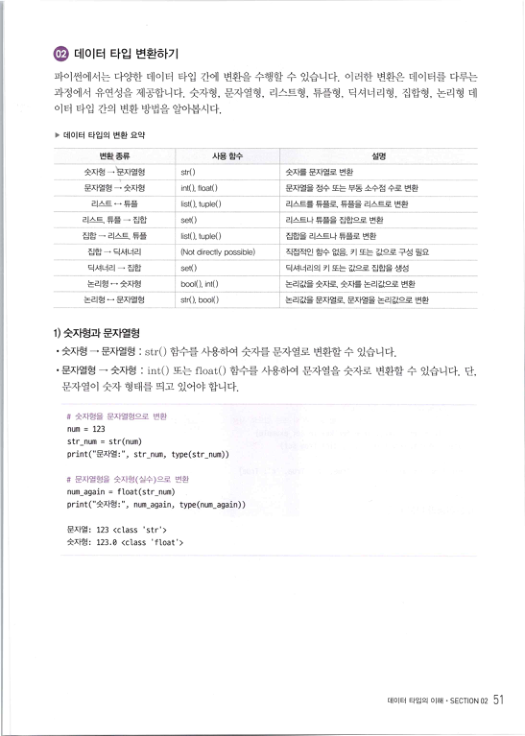
.

데이터 타입 변환하기 파이썬에서는 다양한 데이터 타입 간에 변환을 수행할 수 있습니다 . 이러한 변환은 데이터를 다루는 과정에서 유연성을 제공합니다 . 숫자형 , 문자열형 , 리스트형 , 튜플형 , 딕셔너리형 , 집합형 , 논리형 데 이터 타입 간의 변환 방법을 알아봅시다．

* 데이터 타입의 변환 요약
변환 종류 乎 隱 火 설영 숫자형 →문자열형 str() 숫자를 문자열로 변환 문자열형 - 숫자형 ntO. float() 문자열을 정수 또는 부동 소수점 수로 변환 리스트 - 튜플 list)), tuple() 리스트를 튜플로， 튜플을 리스트로 변환 리스트， 튜플 → 집합 setO 리스트나 튜플을 집합으로 변환 집합 - 리스트， 튜플 list)), tuple() 집합을 리스트나 튜플로 변환 집합 → 딕셔너리 (Not directly possible) 직접적인 함수 없음 , 키 또는 값으로 구성 필요 딕셔너리 → 집합 set)) 딕셔너리의 키 또는 값으로 집합을 생성 논리형 - 숫자형 booK). into) 논리값을 숫자로， 숫자를 논리값으로 변환 논리형 - 문자열형 str( ), bool() 논리값을 문자열로， 문자열을 논리값으로 변환 1) 숫자형과 문자열형

- 숫자형 → 문자열형 : str() 함수를 사용하여 숫자를 문자열로 변환할 수 있습니다．
- 문자열형 → 숫자형 : int() 또는 float() 함수를 사용하여 문자열을 숫자로 변환할 수 있습니다 . 단，
문자열이 숫자 형태를 띄고 있어야 합니다．

```python
# 숫자형을 문자열형으로 변환
num = 123 
str_num = str(num) 
print(" 문자열: ", str_num, type(str_num))
# 문자열형을 슷자형（실수）으로 변환
num_again = float(str_num) 
print(" 숫자형: ", num_again, type(num_again))
```
문자열＝ 123 <class ' str ' > 숫자형＝ 123.0 <class ' f1oat '> 데이터 타입의 이해 · SECTION 02 51

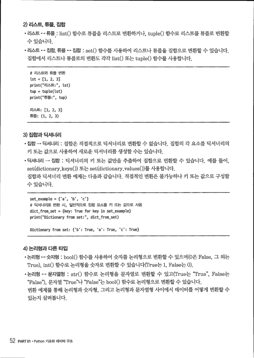
2) 리스트 , 튜플, 집합

- 리스트－ 튜플 : list() 함수로 튜플을 리스트로 변환하거나 , tuple() 함수로 리스트를 튜플로 변환할
수 있습니다．

- 리스트 - 집합, 튜플 - 집합 : set() 함수를 사용하여 리스트나 튜플을 집합으로 변환할 수 있습니다．
집합에서 리스트나 튜플로의 변환도 각각 list() 또는 tuple() 함수를 사용합니다．

```python
# 리스트와 튜플 변환 
1st = [1, 2, 3] 
print(" 리스트＝ " 』 1st)
tup = tuple(Lst) 
print(" 튜플＝ " , tup)
```
리스트＝ [1, 2, 3] 튜플： (1, 2, 3) 3) 집합과 딕셔너리

- 집합→ 딕셔너리 : 집합은 직접적으로 딕셔너리로 변환할 수 없습니다 . 집합의 각 요소를 딕셔너리의
키 또는 값으로 사용하여 새로운 딕셔너리를 생성할 수는 있습니다．

- 딕셔너리 → 집합 : 딕셔너리의 키 또는 값만을 추출하여 집합으로 변환할 수 있습니다 . 예를 들어，
set(dictionary.keys()) 또는 set(dictionary.values()）를 사용합니다． 집합과 딕셔너리 변환 예제는 다음과 같습니다 . 직접적인 변환은 불가능하나 키 또는 값으로 구성할 수 있습니다．

```python
set_example = {'a', ' b', 'c'}
# 딕셔너리로 변환 시， 일반적으로 집합 요소를 키 또는 값으로 사용 
dict_f ram_set = {key: True for key in set_example} 
print("Dictionary from set:", dict_from_set)
```
Dictionary from set: {'b': True, 'a': True, 'c': True} 4) 논리형과 다른 타입

- 논리형 - 숫자형 : bool() 함수를 사용하여 슷자를 논리형으로 변환할 수 있으며（0은 False , 그 외는
True), int() 함수로 논리형을 숫자로 변환할 수 있습니다（True는 1, False는 0).

- 논리형 - 문자열형 : str() 함수로 논리형을 문자열로 변환할 수 있고（True는 " True", False는
"False") , 문자열 " True " 나 " False " 는 )ool() 함수로논리형으로 변환할수 있습니다． 변환 예제를 통해 논리형과숫자형 , 그리고 논리형과문자열형 사이에서 데이터를 어떻게 변환할 수 있는지 살펴봅니다 .

52 PART01 .Python 기초와 데이터 구조

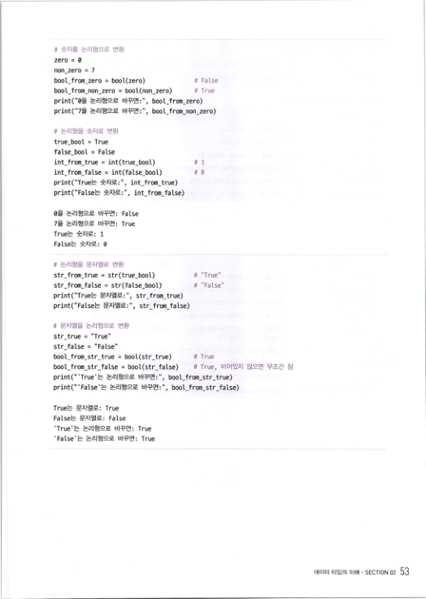
```python
# 숫자를 논리형으로 변환
zero = 0
non zero = 7 
bool_from_zero = bool(zero) 
bool_froni_non_zero = bool(non_zero) 
print("0을 논리형으로 바꾸면： ", bool_from_zero) 
print("7을 논리형으로 바꾸면＝ ", boal_from_non_zer이
if False
if True
# 논리형을 숫자로 변환 
true bool = True 
false bool = False
mnt_from_true = int(true_bool)
mnt_from_false = int(false_bool) 
print("True는 숫자로： ", mnt_from_true) 
print('False는 숫자로＝ ", mnt_from_false)
```
0을 논리형으로 바꾸면： False 7을 논리형으로 바꾸면： True True는 숫자로： 1 False는 숫자로： 0

```python
# 논리형을 문자열로 변환 
str_from_true = str(true_bool) 
str_from_false = str(false_bool) 
print("True는 문자열로： ", str_from_true) 
print("False는 문자열로＝ ", str_from_false)
if "True '
if 'False"
# 문자열을 논리형으로 변환 
str true = "True" 
str false = "False" 
bool_from_str_true = bool(str_true) 
bool_from_str_false = bool(str_false)
# True
# True' 비어있지 않으면 무조건 참 
print(" 'True ' 는 논리형으로 바꾸면： ", bool_from_str_true) 
print(" 'False ' 는 논리형으로 바꾸면： ", bool_from_str_false)
```
True는 문자열로： True False는 문자열로： False 'True ' 는 논리형으로 바꾸면： True 'False ' 는 논리형으로 바꾸면： True 데이터 타입의 이해 · SEC지0N02 53

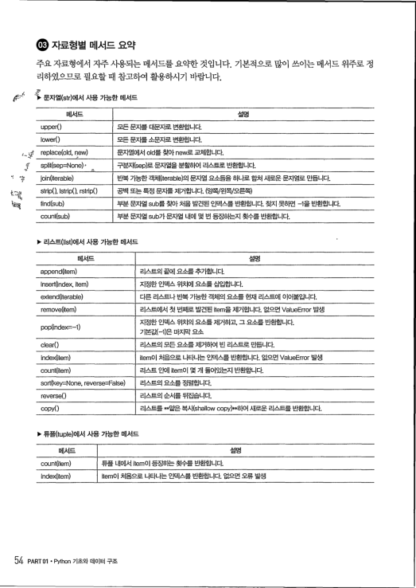
.

자료형별 메서드 요약 주요 자료형에서 자주 사용되는 메서드를 요약한 것입니다 . 기본적으로 많이 쓰이는 메서드 위주로 정 리하였으므로 필요할 때 참고하여 활용하시기 바랍니다．

+ 문자열（str）에서 사용 가능한 메서드
메서드 설명 upper() 모든 문ㅈ隱 대문ㅈ隍 변환합니다． lower() 모든 문자를 소문자로 변환합니다． replace(old, new) 문자열에서 old를 찾아 new로 교페합니다． 』＊季 split(sep=None):

구분자（sep）로 문자열을 분할하여 리스트로 반환합니다． join(iterable) 반복 가능한 객체（iterable）의 문자열 요소들을 하나로 합쳐 새로운 문자열로 만듭니다． stripO, lstripQ, rstrip() 공짹 또는 특정 문자를 제거합니다. （딛嬅／왼쪽／오른쪽） find(sub) 부분 문자열 sub를 찾아 처음 발견된 인덱스를 반환합니다. 찾지 못하면 ㅢ을 반환합니다． count(sub) 부분 문자열 sub가 문자열 내에 몇 번 。。하는지 횟수를 반환합니다．

> 리스트（list）에서 사용 가능한 메서드
메서드 설명 append(item) 리스트의 끌게 요소를 추가합니다． insert(index, item) 지정한 인덱스 위치에 요소를 삽입합니다． extend(iterable) 다른 리스트나 반복 가능한 객체의 요소를 현재 리스트에 이어붙입니다． remove(item) 리스트에서 첫 번짜扈 발견된 item을 제거합니다. 없으면 ValueError 발생 pop(index=-1) 지정한 인덱스 위치의 요소를 제거하고， 그 요소를 반환합니다． 기본값《-1）은 마지막 요소 clear() 리스트의 모든 요소를 제거하여 빈 리스트로 만듭니다． index(item) item이 처음으로 나타나는 인덱스를 반환합니다 . 없으면 ValueError 발생 count(item) 리스트 안에 item이 몇 개 들어있는지 반환합니다． sort(key=None, reverse=False) 리스트의 요소를 정렬합니다． reverseQ 리스트의 순서를 뒤집습니다． copy() 리스트를 *＊얕은복사（삶，헤ow copy)i＊하여 새로운 리스트를 반환합니다．

> 튜플（tu이e）에서 사용 가능한 메서드
메서드 설명 count(item) 튜플 내에서 item이 등장0隱 횟수를 반환합니다． index(item) item이 처음으로 나타나는 인덱스를 반환합니다. 없요면 오류 발생 54 PART 01 · Pyth。n 기초와 데이터 구조

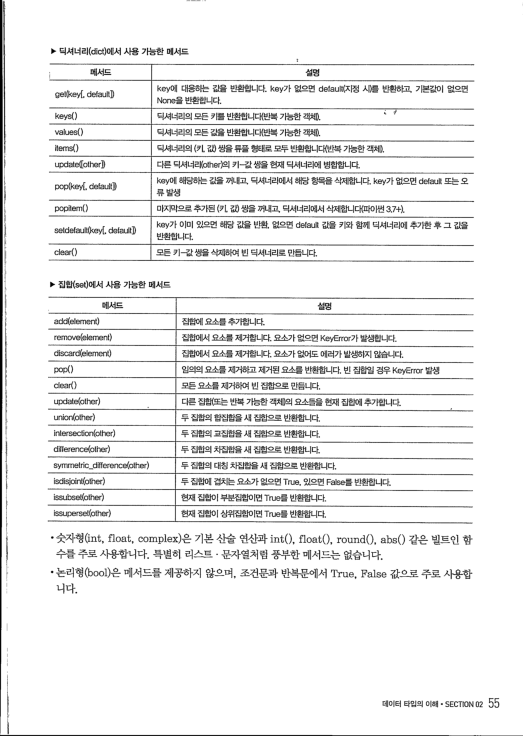
》 딕셔너리（dict）에서 사용 가능한 메서드 메서드 설명 get(key[, default]) key에 대응하는 값을 반환합니다. key가 없으면 default（지정 시）를 반환하고， 기본값이 없으면 None을 반환합니다． keys() 딕셔너리의 모든 키를 반환합니다（반복 가능한 객체）.

" ' values() 딕셔너리의 모든 값을 반환합니다（반복 가능한 객체）.

items() 딕셔너리의 （키 , 값） 쌍을 튜플 형태로 모두 반환합니다（반복 가능한 객체）.

update([otheriD 다른 딕셔너리（0小er）의 키－값 쌍을 현재 딕셔너리에 병합합니다． pop(key[, default]) key에 해딩同는 값을 꺼내고， 딕셔너리에서 해당 항목을 삭제합니다 . key가 없으면 default 또는 오 류 발생 popitem() 마지막으로 추가된 （키 . 珌 쌍을 꺼내고， 딕셔너리에서 삭제합니다（파이썬 3.7+).

setdefault(key[, default]) key가 이미 있으면 해당 값을 반환, 없으면 default 값을 키와 함께 딕셔너리에 추가한 후 그 값을 반환합니다． clear() 모든 키－값 쌍을 삭제하여 빈 딕셔너리로 만듭니다．

> 집합（set）에서 사용 가능한 메서드
메서드 설명 add(e!ement) 집합에 요소를 추가합니다． remove(element) 집합에서 요소를 제거합니다. 됴소가 없으 KeyError가 발생합니다． discard(element) 집합에서 요소를 제거합니다. 요소가 없어도 에러가 발생하지 않습니다． pop() 임의의 요소를 제거하고 제거된 요소를 반환합니다 . 빈 집합일 경위〈eyError 발생 clear() 모든 요소를 제거하여 빈 집합으로 만듭니다． update(other) 다른 집합（또는 반복 가능한 객체）의 요소들을 현재 집합에 추가합니다． union(other) 두 집합의 합집합을 새 집합으로 반환합니다． intersection(other) 두 집합의 교집합을 새 집합으로 반환합니다． difference(other) 두 집합의 차집합을 새 집합으로 반환합니다． symmetric_difference(other) 두 집합의 대칭 차집합을 새 집합으로 반환합니다． isdisjoint(other) 두 집합에 겹치는 요소가 없으면 True . 있으면 False를 반환합니다． issubset(other) 헌재 집합이 부분집합이면 True를 반환합니다． issuperset(other) 현재 집합이 상위집합이면 True를 반환합니다． ' 슷자형（int, float, complex）은 기본 산술 연산과intO, floatO, roundO, abs() 같은 빌트인 함 수를 주로 사용합니다 . 특별히 리스트 · 문자열처럼 풍부한 메서드는 없습니다． ' 논리형（bool）은 메서드를 제공하지 않으며 , 조건문과 반복문에서 True, False 값으로 주로 사용합 니다． 데이터 타입의 이해 · SECTION 02 55

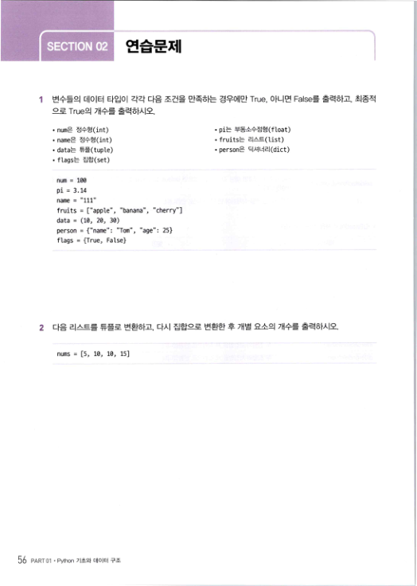
## 연습문제
I 변수들의 데이터 타입이 각각 다음 조건을 만족하는 경우에만 True , 아니면 False를 출력하고 , 최종적 으로 True의 개수를 출력하시오．

- num은 정수형（int) 
- pi는 부동소수점형（float)
- name은 정수형（int) 
- fruit＄는 리스트（list)
- data는 튜플（tuple) 
- person은 딕셔너리（dict) 
- flag＄는 집합（set)
```python
num = 100 
pi = 3.14
name = "111" 
fruits = ["apple ", " banana ", "cherry"]
data = (10, 20, 30)
person = { "name ": 'Torn ", " age ": 25} 
flags = {True, False}
```
2 다음 리스트를 튜플로 변환하고 , 다시 집합으로 변환한 후 개별 요소의 개수를 출력하시오．

```python
nums = [5, 10, 10, 15]
```
56 PART 01 . Python 기초와 데이터 구조

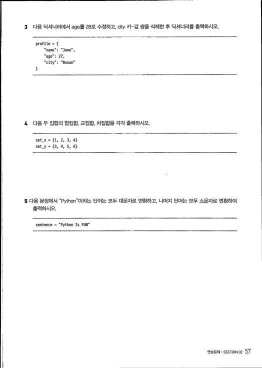
3 다음 딕셔너리에서 age를28로 수정하고 . city 키－값 쌍을삭제한 후 딕셔너리를출력하시오

```python
profile = {
```
"name": "3ane", "age": 27, 'city": "Busan' 4 다음 두 집합의 합집합 , 교집합 , 차집합을 각각 출력하시오．

```python
set_x = {l, 2, 3, 4} 
set_y = {3, 4, 5, 6}
```
5 다음 문장에서 ' Python ' 이라는 단어는 모두 대문자로 변환하고 , 나머지 단어는 모두 소문자로 변환하여 출력하시오．

```python
sentence = "Python Is FUN"
```
연습문제．SECTION 02 57

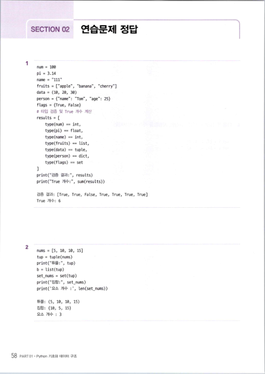
## SECTION 02 
연습문제 정답

```python
num = 100 
pi = 3.14
name = "111" 
fruits = ["apple ', 'banana", " cherry"] 
data = (10, 20, 30)
person = {"name": "Tom", "age": 25} 
flags = {True, False}
# 타입 검증 및 True 개수 계산 
results = [
```
type(num) == int, type(pi) == float, type(name) == int, type(fruits) == list, type(data) == tuple, type(person) == dict, type(flags) == set

```python
print(" 검증 결과： ", results) 
print("True 개수:", suni(results))
```
검증 결과: [True, True, False, True, True, True, True] True 개수： 6

```python
nums = [5, 10, 10, 15] 
tup = tuple(nums) 
print(" 튜플： " , tup) 
b = list (tup) 
set_nums = set(tup) 
print(" 집합:", set_nums) 
print(' 요소 개수 : ', len(set_nums))
```
튜플： (5, 10, 10, 15) 집합： {10, 5, 15} 요소 개수 : 3 58 PART 01 · Python 기초와 데이터 구조

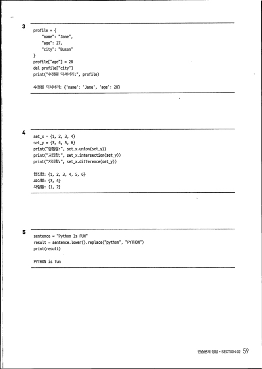
3

```python
profile = {
```
"name": "Jane", "age": 27, "city": "Busan"

```python
profile['age"] = 28 
del profile["city"] 
print(" 수정된 딕셔너리＝ ", profile)
```
수정된 딕셔너리： {'name': 'Jane', 'age': 28} 4

```python
set_x = {l, 2, 3, 4} 
set_y = {3, 4, 5, 6} 
print(" 합집합:", set_x.union(set.y)) 
print(" 교집합:", set_x,intersection(set_y)) 
print(" 차집합:", set_x.difference(set_y))
```
합집합＝ {i, 2, 3, 4, 5, 6} 교집합＝ {3, 4} 차집합＝ {1, 2}

```python
sentence = "Python Is FUN" 
result = sentence. 1.ower() . replace("python", "PYTHON") 
print(result)
```
PYTHON is fun 연습문제정답．SECTION 02 59

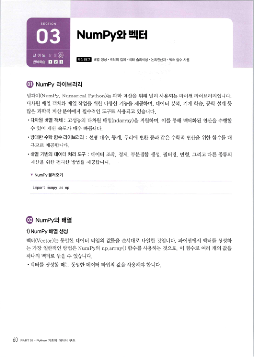
SECTION

# NumPy와벡터
난이 도 （勣 핵심 태그 배열 생성 · 벡터의 길이 · 벡터 슬라이싱 · 논리연산자 · 벡터 함수 사용 반복학습 灘． 口 口 .l NumPy 라이브러리 넘파이（NumPy, Numerical Python）는 과학 계산을 위해 널리 사용되는 파이썬 라이브러리입니다． 다차원 배열 객쳬와 배열 작업을 위한 다양한 기능을 제공하며 , 데이터 분석 , 기계 학습 , 공학 설계 등 많은 과학적 계산 분야에서 필수적인 도구로 사용되고 있습니다．

- 다차원 배열 객체 : 고성능의 다차원 배열（ndarray）을 지원하며 , 이를 통해 벡터화된 연산을 수행할 
수 있어 계산 속도가 매우 빠릅니다．

- 방대한 수학 함수 라이브러리 : 선형 대수 , 통계 , 푸리에 변환 등과 같은 수학적 연산을 위한 함수를 대 
규모로 제공합니다．

- 배열 기반의 데이터 처리 도구 : 데이터 조작 , 정제 , 부분집합 생성 , 필터링 , 변형 , 그리고 다른종류의 
계산을 위한 편리한 방법을 제공합니다． ▼ NumPy 볼러오기

```python
import numpy as np
```
.

NumPy와 배열 1) NumPy 배열 생성 벡터（Vector）는 동일한 데이터 타입의 값들을 순서대로 나열한 것입니다 . 파이썬에서 벡터를 생성하 는 가장 일반적인 방법은 NumPy의 np. array() 함수를 사용하는 것으로 , 이 함수로 여러 개의 값을 하나의 벡터로 묶을 수 있습니다．

- 벡터를 생성할 때는 동일한 데이터 타입의 값을 사용해야 합니다．
60 PART이 . P4hon 기초와 데이터 구조

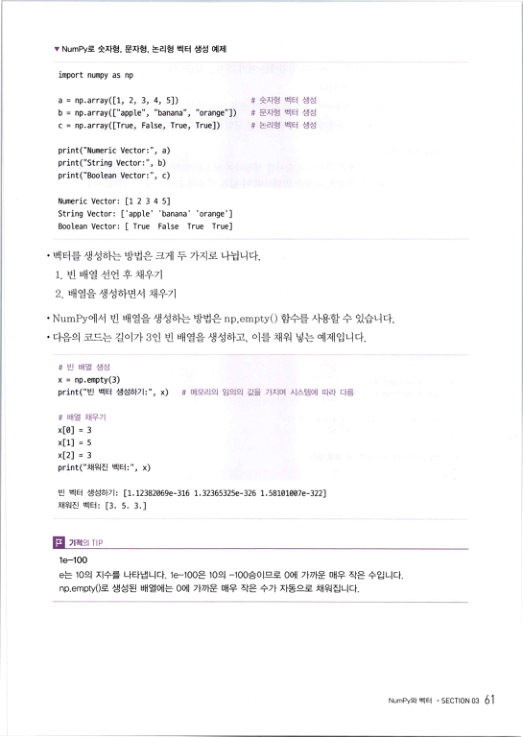
V NumPy로 숫자헝 , 문자형 , 논리형 벡터 생성 예제

```python
import nunipy as np
a = np.array([1, 2, 3, 4, 5])
# 숫자형 벡터 생성
# 문자형 벡터 생성
b = np.array(["apple", " banana ', "orange"])
c = np.array([True, Fa'se, True, True])
# 논리형 벡터 생성
print("Numeric Vector:", a) 
print('String Vector:", b) 
print('Boolean Vector:", c)
```
Numeric Vector: [1 2 3 4 5] String Vector: ['apple' 'banana ' orange'] Boolean Vector: [ True Fa'se True True]

- 벡터를 생성하는 방법은 크게 두 가지로 나뉩니다．
1 . 빈 배열 선언 후 채우기 2 . 배열을생성하면서 채우기

- NumPy에서 빈 배열을 생성하는 방법은 np. empty() 함수를 사용할 수 있습니다．
- 다음의 코드는 길이가 3인 빈 배열을 생성하고 , 이를 채워 넣는 예제입니다．
```python
# 빈 배열 생성
x = np.empty(3) 
print(" 빈 벡터 생성하기： ' , x) 
# 메모리의 임의의 값을 가지며 시스템에 따라 다름
# 배열 채우기 
x[0] = 3 
x[1] = 5 
x[2] = 3 
print(" 채워진 벡터： ", x)
```
빈 벡터 생성하기： [1. 12382069e-316 1. 32365325e-326 1. 581010@7e-322] 채워진 벡터： [3. 5. 3.] .

기적의 뀌P le-100 e는 10의 지수를 나타냅니다 . le-100은 10의 ㅢ00승이므로 00ㅔ 가까운 매우 작은 수입니다． n p. em pty(）로 생성된 배열에는 0에 가까운 매우 작은 수가 자동으로 채워집니다． NumPy와벡터 ·SECTION 03 61

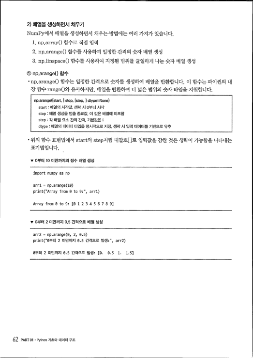
2) 배열을 생성하면서 채우기 NumPy에서 배열을 생성하면서 채우는，방법에는 여러 가지가 있습니다．

1. np,array() 함수로 직접 입력
2. np.arange() 함수를 사용하여 일정한 간격의 숫자 배열 생성
3. np.linspace() 함수를 사용하여 지정된 범위를 균일하게 나눈 숫자 배열 생성
① np.arange() 함수

- np.arange() 함수는 일정한 간격으로 숫자를 생성하여 배열을 반환합니다 . 이 함수는 파이썬의 내 
장 함수 range(）와 유사하지만 , 배열을 반환하며 더 넓은 범위의 슷자 타입을 지원합니다． np.arange([start, I stop, [step, I dtype=None) start : 배열의 시작값 , 생략 시 0부터 시작 stop : 배열 생성을 멈출 종료값, 이 값은 배열에 미포함 step : 각 배열 요소 간의 간격 . 기본값은 1 dtype : 배열의 데이터 타입을 명시적으로 지정 , 생략 시 입력 데이터를 기반으로 유추

- 위의 함수 표현법에서 start와 step처럼 대괄호□로 입력값을 감싼 것은 생략이 가능함을 나타내는
표기법입니다． To부터 10 미만까지의 정수 배열 생성

```python
import nunipy as np
arri = np.arange(i@) 
print("Array from 0 to 9:", arri)
```
Arrayfrom0to9: [0123456789] v0부터 2 미만까지 0.5 간격으로 배열 생성

```python
arr2 = np.arange(0, 2, 0.5) 
print("0부터 2 미만까지 0.5 간격으로 발생： ", arr2)
```
0부터 2 미만까지 0.5 간격으로 발생＝ [0. 0.5 1. 1.5] 62 PART01 'Python 기초와 데이터 구조

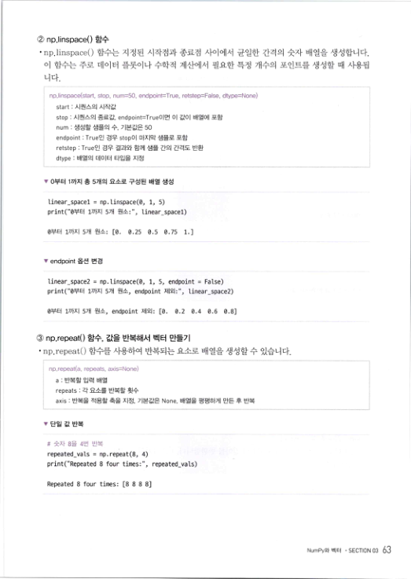
② np.Iinspace() 함수

- np.linspace() 함수는 지정된 시작점과 종료점 사이에서 균일한 간격의 숫자 배열을 생성합니다．
이 함수는 주로 데이터 플롯이나 수학적 계산에서 필요한 특정 개수의 포인트를 생성할 때 사용됩 니다． np.Iinspace(start, stop, num=50, endpoint=True, retstep=False, dtype=None) start : 시퀀스의 시작값 stop : 시퀀스의 종료값 . end poi nt=Tru e이면 이 값이 배열에 포함 num : 생성할 샘플의 수 , 기본값은 50 endpoint : True인 경우 stop이 마지막 샘플로 포함 retstep : True인 경우 결과와 함께 샘플 간의 간격도 반환 dtype : 배열의 데이터 타입을 지정 To부터 쟘까지 총 5개의 요소로 구성된 배열 생성

```python
1.inear_spacel = np.linspace(0, 1, 5) 
print("0부터 1까지 5개 원소＝ ", linear_spacel)
```
0부터 1까지 5개 원소： [0. 0.25 0.5 0.75 1.] V endpoint 옵션 변경

```python
linear_space2 = np.linspace(0, 1, 5, endpoint = False) 
print("0부터 1까지 5개 원소， endpoint 제외： " , linear_space2)
```
0부터 1까지 5개 원소， endpoint 제외： [0. 0.2 0.4 0.6 0.8] ③np.repeat() 함수 , 값을 반복해서 벡터 만들기

- np.repeat() 함수를 사용하여 반복되는 요소로 배열을 생성할 수 있습니다．
np.repeat(a, repeats, axis=None) a : 반복할 입력 배열 repeats : 각 요소를 반복할 횟수 axis : 반복을 적용할 축을 지정 , 기본값은 None , 배열을 평평하게 만든 후 반복 ▼ 단일 값 반복

```python
# 숫자 8을 4번 반복
repeated_vals = np.repeat(8, 4) 
print('Repeated 8 four times:", repeated_vals)
```
Repeated 8 four times: [8 8 8 8] NumPy와벡터 *SECTION 03 63

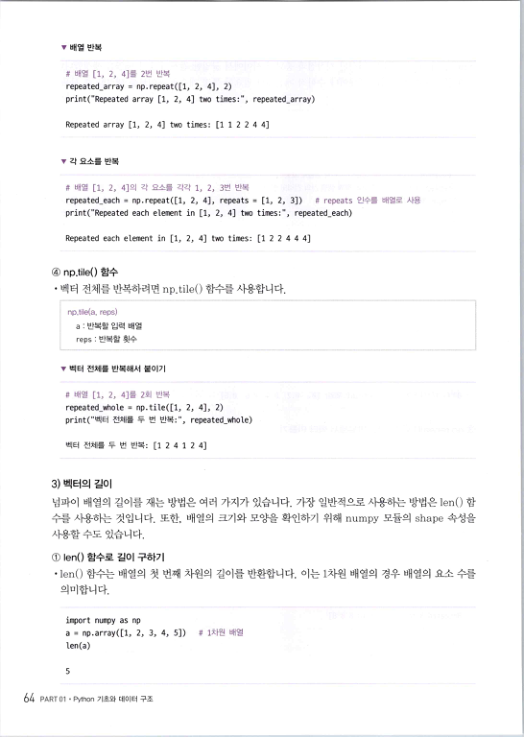
▼ 배열 반복

```python
# 배열 〔1, 2, 4］를 2번 반복
repeated_array = np.repeat({1, 2, 4], 2) 
print("Repeated array [1, 2, 4] two times:", repeated_array)
```
Repeated array [1, 2, 4] two times: {1 1 2 2 4 4] : 각 요소를 반복

```python
# 배열 [1, 2, 4］의 각 요소를 각각 1, 2, 3번 반복
repeated_each = np.repeat([1, 2, 4], repeats = [1, 2, 3]) 
# repeats 인수를 배열로 사용 
print("Repeated each element in [1, 2, 4] two times: ", repeated_each)
```
Repeated each element in [1, 2, 4] two times: [1 2 2 4 4 4] ④ np.tile() 함수

- 벡터 전체를 반복하려면 np.tile() 함수를 사용합니다．
np.tile(a, reps) a : 반복할 입력 배열 reps : 반복할 횟수 ▼ 벡터 전체를 반복해서 붙이기

```python
# 배열 〔1, 2, 4］롤 2회 반복
repeated_whole = np.tile([1, 2, 4], 2) 
print("벡터 전체를 두 번 반복: ', repeated_whole)
```
벡터 전체를 두 번 반복： [1 2 4 1 2 4] 3) 벡터의 길이 넘파이 배열의 길이를 재는 방법은 여러 가지가 있습니다 . 가장 일반적으로 사용하는 방법은 len() 함 수를 사용하는 것입니다 . 또한 , 배열의 크기와 모양을 확인하기 위해 numpy 모듈의 shape 속정을 사용할 수도 있습니다． ①Ien() 함수로 길이 구하기

- len() 함수는 배열의 첫 번째 차원의 길이를 반환합니다 . 이는 1차원 배열의 경우 배열의 요소 수를
의미합니다．

```python
import numpy as np
#1차원 배열
a = np.array([1, 2, 3, 4, 5]) 
len(a)
```
64 PART이 · Python 기초와 데이터 구조

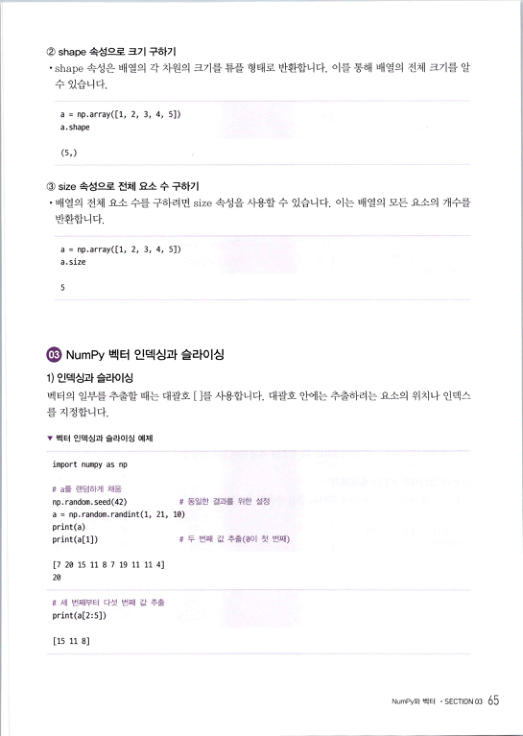
② 삶，ape 속성으로 크기 구하기

- shape 속성은 배열의 각 차원의 크기를 튜플 형태로 반환합니다 . 이를 통해 배열의 전쳬 크기를 알
수 있습니다．

```python
a = np.array([1, 2, 3, 4, 5])
```
a.shape (5,) 瓘） 勃ze 속성으로 전체 요소 수 구하기

- 배열의 전쳬 요소 수를 구하려면 size 속성을 사용할 수 있습니다 . 이는 배열의 모든 요소의 개수를
반환합니다．

```python
a = np.array([1, 2, 3, 4, 5])
```
a. size .NumPy 벡터 인덱싱과 슬라이싱 1) 인덱싱과 슬라이싱 벡터의 일부를 추출할 때는 대괄호 [ ］를 사용합니다 . 대괄호 안에는 추출하려는 요소의 위치나 인덱스 를 지정합니다． ▼ 벡터 인덱싱과 슬라이싱 예제

```python
import numpy as np
# a를 랜덤하게 채움
np. random. seed(42) 
# 동일한 결과를 위한 설정
a = np.random.randint(1, 21, 10) 
print(a) 
print(a[1]) 
# 두 번째 값 추출（0이 첫 번째）
```
[7 20 15 11 8 7 19 11 11 4] 20

```python
# 세 번째부터 다섯 번째 값 추출 
print(a[2:5])
```
[15 11 8] NumPy와벡터 ·SECTION 03 65

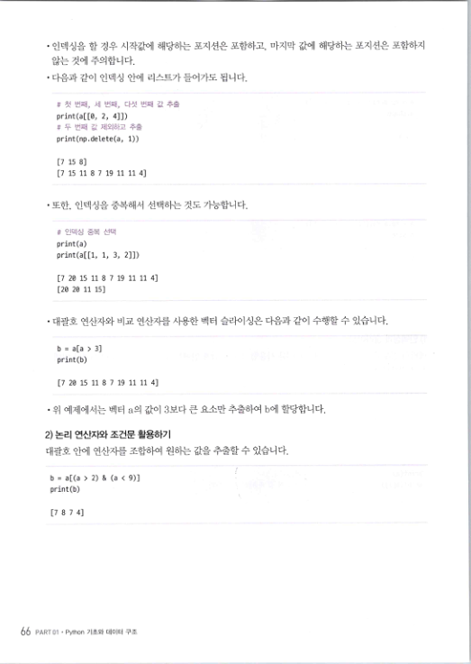
- 인덱싱을 할 경우 시작값에 해당하는 포지션은 포함하고 , 마지막 값에 해당하는 포지션은 포함하지
않는 것에 주의합니다．

- 다음과 같이 인덱싱 안에 리스트가 들어가도 됩니다．
```python
# 첫 번째， 세 번째， 다섯 번째 값 추출 
print(a[[0, 2, 4]])
# 두 번째 값 제외하고 추출 
print(np.delete(a, 1))
```
[7 15 8] [7 15 11 8 7 19 11 11 4]

- 또한 , 인덱싱을 중복해서 선택하는 것도 가능합니다．
```python
# 인덱싱 중복 선택 
print(a) 
print(a[[1, 1, 3, 2]])
```
[7 20 15 11 8 7 19 11 11 4] [20 20 11 15]

- 대괄호 연산자와 비교 연산자를 사용한 벡터 슬라이싱은 다음과 같이 수행할 수 있습니다．
```python
b = a[a > 3] 
print(b)
```
[7 20 15 11 8 7 19 11 11 4]

- 위 예제에서는 벡터 a의 값이 3보다 큰 요소만 추출하여 b에 할당합니다．
2) 논리 연산자와 조건문 활용하기 대괄호 안에 연산자를 조합하여 원하는 값을 추출할 수 있습니다．

```python
b = a[(a > 2) & (a < 9)] 
print(b)
```
[7 8 7 4] b6 PART 01 · Python 기초와 데이터 구조

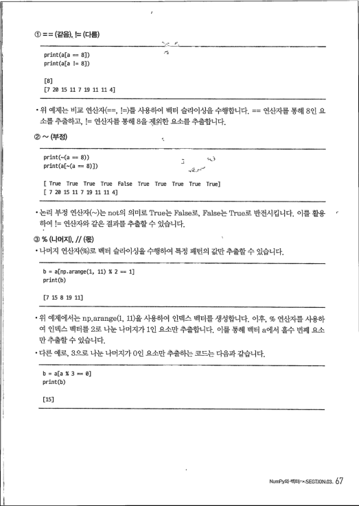
① == （같음） != （다름） ∼∼ 略

```python
print(a[a == 8]) 
print(a[a != 8])
```
[8] [7 20 15 11 7 19 11 11 4] ' 위 예제는 비교 연산자（== , !=）를 사용하여 벡터 슬라이싱을 수행합니다 . - 연산자를 통해 8인 요 소를 추출하고， != 연산자를 통해 8을게외한요소를 추출합니다． ② ＾』 （부정）

```python
print(" (a == 8)) 
` 
윕｀．찮 
print(a[-(a == 8)]) 
｀숟
```
[ True True True True False True True True True True] [ 7 20 15 11 7 19 11 11 4]

- 논리 부정 연산자（∼）는 not의 의미로 True는 False로 , False는 True로 반전시킵니다 . 이를 활용 
하여 != 연산자와 같은 결과를 추출할 수 있습니다． ③ % （나머지） , // （몫） " ' 나머지 연산자（%）로 벡터 슬라이싱을 수행하여 특정 패턴의 값만 추출할 수 있습니다．

```python
b = a[rip.arange(1, 11) % 2 == 1] 
print(b)
```
[7 15 8 19 11] ' 위 예제에서는 np.arange(1, 11）을 사용하여 인덱스 벡터를 생성합니다 . 이후 , % 연산자를 사용하 여 인덱스 벡터를 2로 나눈 나머지가 1인 요소만 추출합니다 . 이를 통해 벡터 a에서 흘수 번째 요소 만 추출할 수 있습니다． ' 다른 예로 , 3으로 나눈 나머지가 0인 요소만 추출하는 코드는 다음과 같습니다．

```python
b = a[a % 3 == 0] 
print(b)
```
[15] NumPy와】벡터7=-《SEGTJGN;Oa. 67

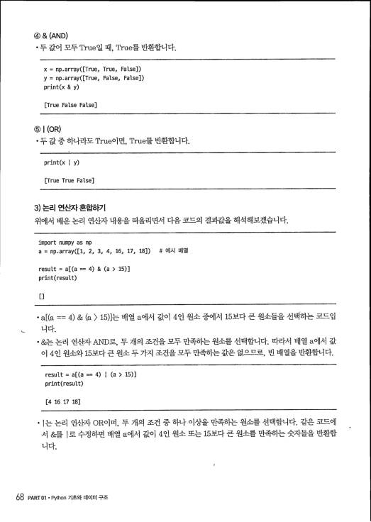
④& (AND)

- 두 값이 모두 True일 때 , True를 반환합니다．
```python
x = np.array([True, True, False])
,y = np.array([True, False, False]) 
print(x & y)
```
[True False False] ⑤I (OR)

- 두값중하나라도True이먼 , True를반환합니다．
```python
print(x I y)
```
[True True False] 3) 논리 연산자 혼합하기 위에서 배운 논리 연산자 내용을 떠올리면서 다음 코드의 결과값을 해석해보겠습니다．

```python
import numpy as np
a = np.array([l, 2, 3, 4, 16, 17, 18]) 
# 예시 배열
result = a[(a == 4) & (a > 15)] 
print(result)
```
[]

- a[(a -4)
&(a> 15)〕는 배열 a에서 값이 4인 원소 중에서 15보다 큰 원소들을 선택하는 코드입 ` 니다．

- ＆는 논리 연산자 AND로 , 두 개의 조건을 모두 만족하는 원소를 선택합니다 . 따라서 배열 a에서 값
이 4인 원소와 15보다 큰 원소 두 가지 조건을 모두 만족하는 값은 없으므로 , 빈 배열을 반환합니다．

```python
result = a[(a == 4) 1 (a > 15)] 
print(result)
```
[4 16 17 18]

- 隱 논리 연산자 OR이며 , 두 개의 조건 중 하나 이상을 만족하는 원소를 선택합니다 . 같은 코드에
서 盼를 陣 수정하면 배열 a에서 값이 4인 원소 또는 15보다 큰 원소를 만족하는 숫자들을 반환합 니다． 68 PART01 ·PYthOrI 기초와 데이터 구조

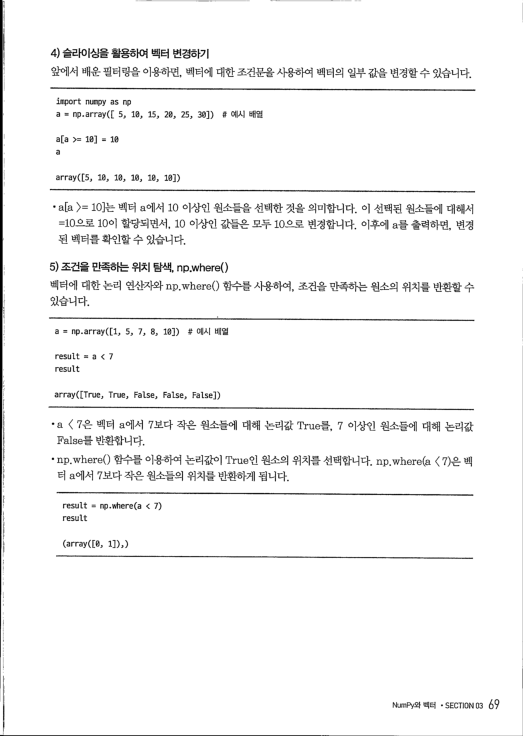
4) 슬라이싱을 활용하여 벡터 변경하기 앞에서 배운 필터링을 이용하면 , 벡터에 대한 조건문을 사용하여 벡터의 일부 값을 변경할 수 있습니다．

```python
import numpy as rip
a = np.array([ 5, 10, 15, 20, 25, 30]) # 예시 배열
```
a{a >= 10] = 10 a array([5, 10, 10, 10, 10, 10]) ' a[a>=10］는 벡터 a에서 10 이상인 원소들을 선택한 것을 의미합니다 . 이 선택된 원소들에 대해서 =10으로 10이 할당되면서 , t0 이상인 값들은 모두 10으로 변경합니다 . 이후에 a를 출력하면 , 변경 된 벡터를 확인할 수 있습니다． 5) 조건을 만족하는 위치 탐색 , np.whereO 벡터에 대한 논리 연산자와 np.where() 함수를 사용하여 , 조건을 만족하는 원소의 위치를 반환할 수 있습니다．

```python
a = np.array([1, 5, 7, 8, 10]) # 예시 배열
result = a < 7 
result
```
array([True, True, False, False, False]) ' a <7은 벡터 a에서 7보다 작은 원소들에 대해 논리값 True를 , 7 이상인 원소들에 대해 논리값 False를 반환합니다． ' np.where() 함수를 이용하여 논리값이 True인 원소의 위치를 선택합니다 . np.where(a <7）은 벡 터 a에서 7보다 작은 원소들의 위치를 반환하게 됩니다．

```python
result = np.where(a < 7) 
result
```
(array([0, 1]),) NumPy와벡터 ·SECTION 03 6?

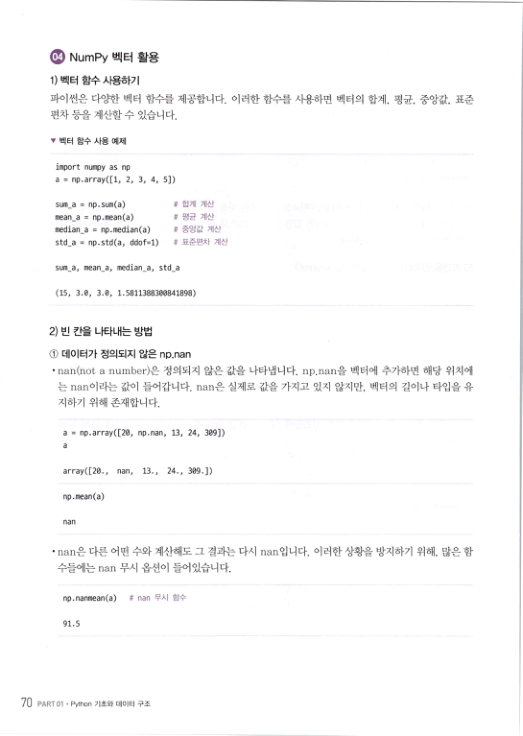
.NumPy 벡터 활용 1) 벡터 함수 사용하기 파이썬은 다양한 벡터 함수를 제공합니다 . 이러한 함수를 사용하면 벡터의 합계 , 평균 , 중앙값 , 표준 편차 등을 계산할 수 있습니다． ▼ 벡터 함수 사용 예제

```python
import numpy as np
a = np.array([1, 2, 3, 4, 5])
# 합계 계산
sum_a = np.sum(a)
# 평균 계산
mean_a = np.mean(a)
# 중앙값 계산
median_a = np.median(a) 
std_a = np.std(a, ddof=1)
# 표준편차 계산
```
sum_a, mean_a, median_a, std_a (15, 3.0, 3.0, 1.5811388300841898) 2) 빈 칸을 나타내는 방법 ① 데이터가 정의되지 않은 np.nan

- nan(not a number）은 정의되지 않은 값을 나타냅니다 . np.nan을 벡터에 추가하면 해당 위치에 
는 nan이라는 값이 들어갑니다 . nan은 실제로 값을 가지고 있지 않지만 , 벡터의 길이나 타입을 유 지하기 위해 존재합니다．

```python
a = np.array([20, np.nan, 13, 24, 309])
```
a array([20., nan, 13., 24., 309.]) np. mean (a) nan

- nan은 다른 어떤 수와 계산해도 그 결과는 다시 nan입니다 . 이러한 상황을 방지하기 위해 , 많은 함
수들에는 nan 무시 옵션이 들어있습니다．

```python
np.nanmean(a) 
# nan 무시 함수
```
91.5 70 PART01 · Pyth。n 기초와 데이터 구조

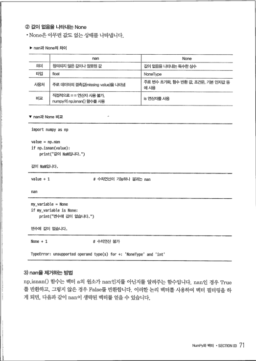
② 값이 없음을 나타내는 None

- None은 아무런 값도 없는 상태를 나타냅니다．
>nan과 None의 차이
nan None 의미 정의되지 않은 값이나 잘못된 값 값이 없음을 나타내는 특수한 상수 타입 float NoneType 사용처 주로 데이터의 결측값〈missing value）을 나타냄 주로 변수 초기화. 함수 반환 값． 조건문 , 기본 인자값 등 에 사용 비교 직접적으로 = = 연산자 사용 불가， numpy의 np.isnan()，함수를 사용 is 연산자를 사용 ▼ nan과 None 비교 iniport nurupy as np

```python
value = np.nan 
if np.isnan(value): 
print(" 값이 Na．』입니다． " )
```
값이 NaN입니다．

```python
val.ue + 1 
# 수치연산이 가능하나 결과는 nan
```
nan

```python
my_variable = None 
if my_variable is None: 
print(" 변수에 값이 없습니다． " )
```
변수에 값이 없습니다．

```python
None + 1 
# 수치연산 불가
```
TypeError: unsupported operand type(s) for +: ' NoneTyp& and 'mnt ' 3) nan을 제거하는 방법 np.isnan() 함수는 벡터 a의 원소가 nan인지를 아닌지를 알려주는 함수입니다 . nan인 경우 True 를 반환하고， 그렇지 않은 경우 False를 반환합니다 . 이러한 논리 벡터를 사용하여 벡터 필터링을 하 게 되먼 , 다음과 같이 nan이 생략돤벡터를 얻을 수 있습니다． NumPy와벡터 ·SECTION 03 71

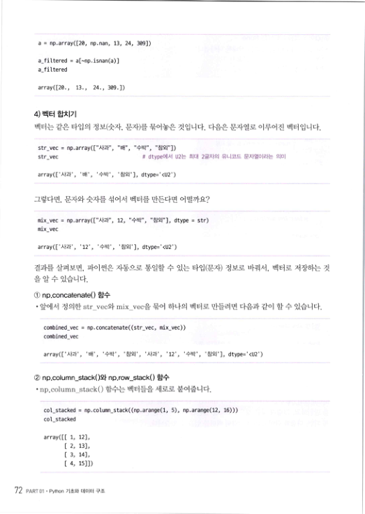
```python
a = np.array([20, np.nan, 13, 24, 309])
a_filtered = a[=np.isnan(a)]
```
a filtered array([20., 13., 24., 309.]) 4) 벡터 합치기 벡터는 같은 타입의 정보（숫자 , 문자）를 묶어놓은 것입니다 . 다음은 문자열로 이루어진 벡터입니다．

```python
str_vec = np.array([ " 사과 " ' "배 " , " 수박 " , " 참외 " ]) 
str_vec 
# dtype에서 U2는 최대 2글자의 유니코드 문자열이라는 의미
```
array([ ' 사과 ' , ' 배’， ' 수박 ' , ’참외 ' ], dtype='<U2 ' ) 그렇다면 , 문자와 숫자를 섞어서 벡터를 만든다면 어떨까요？

```python
mix_vec = np.array([ " 사과 " , 12, "수박 " , " 참외 " ], dtype = str)
```
mix vec array([ ' 사과 ' , ' 12 ' , ' 수박 ' , ' 참외 ' ], dtype= '<U2' ) 결과를 살펴보면 , 파이썬은 자동으로 통일할 수 있는 타입（문자） 정보로 바꿔서 , 벡터로 저장하는 것 을 알 수 있습니다． ① np.concatenate() 함수

- 앞에서 정의한 str vec와 mix vec을 묶어 하나의 벡터로 만들려면 다음과 같이 할 수 있습니다．
```python
combined_vec = np.concatenate((str_vec, mix_vec))
```
combined vec array(［니사과 ' , ' 배 ' , ' 수박’， ‘참외 ' , ' 사과 ' , ' 12 ', ’수박 ' , ' 참외 ' ], dtype= ' 긴J2') ②np.column_stack( )와 np.row_stack() 함수

- np.column_stack() 함수는 벡터들을 세로로 붙여줍니다．
```python
col_stacked = np.column_stack((np.arange(1, 5), np.arange(12, 16))) 
cal stacked
```
array([[ 1, 12], [2, 13], [ 3, 14], [ 4, 15]]) 72 PART 01 . Pyth。n 기초와 데이터 구조

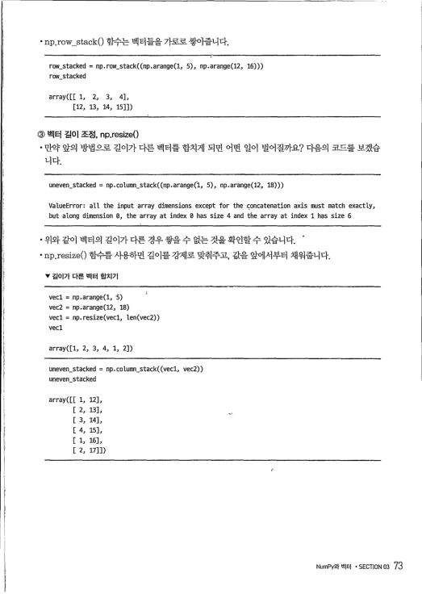
- np.row_stack() 함수는 벡터들을 가로로 찧하줍니다．
```python
row_stacked = np.row_stack((np.arange(1, 5), np.arange(12, 16))) 
row stacked
```
array([[ 1, 2, 3, 4], [12, 13, 14, 15]]) ③ 벡터 길이 조정 , np.resize()

- 만약 앞의 방법으로 길이가 다른 벡터를 합치게 되먼 어떤 일이 벌어질까요？ 다음의 코드를 보겠습
니다．

```python
uneven_stacked = np.column_stack((np.arange(1, 5), np.arange(12, 18)))
```
ValueError: all the input array dimensions except for the concatenation axis must match exactly, but along dimension 0, the array at index 0 has size 4 and the array at index 1 has size 6

- 위와 같이 벡터의 길이가 다른 경우 쌓을 수 없는 것을 확인할 수 있습니다．'
- np.resize() 함수를 사용하면 길이를 강제로 맞춰주고 , 값을 앞에서부터 채워줍니다．
▼ 길이가 다른 벡터 합치기

```python
veci = np.arange(1, 「 5) 
vec2 = np.arange(12, 18) 
veci = np.resize(vecl, len(vec2)) 
veci
```
array([1, 2, 3, 4, 1, 2])

```python
uneven_stacked = np.column_stack((vecl, vec2))
```
uneven stacked array([[ 1, 12], [ 2,, 13], i: 3, 14], [ 4, 15], [ 1, 16], [ 2, 17]]) NumPy와벡터 .SECTION 03 73

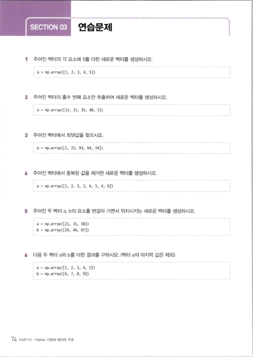
## 연습문제
I 주어진 벡터의 각 요소에 5를 더한 새로운 벡터를 생성하시오．

```python
a = np.array([1, 2, 3, 4, 5])
```
2 주어진 벡터의 홀수 번째 요소만 추출하여 새로운 벡터를 생성하시오．

```python
a = np.array([12, 21, 35, 48, 5])
```
3 주어진 벡터에서 최댓값을 찾으시오．

```python
a = np.array([1, 22, 93, 64, 54])
```
' 주어진 벡터에서 중복된 값을 제거한 새로운 벡터를 생성하시오．

```python
a = np.array([1, 2, 3, 2, 4, 5, 4, 6])
```
5 주어진 두 벡터 a, b의 요소를 번갈아 가면서 위치시키는 새로운 벡터를 생성하시오．

```python
a = np.array([21, 31, 58])
b = np.array([24, 44, 67])
```
6 다음 두 벡터 a와 b를 더한 결과를 구하시오 . （벡터 a의 마지막 값은 제외）

```python
a = np.array([1, 2, 3, 4, 5])
b = np.array([6, 7, 8, 9])
```
74 PART 01 . Python 기초와 데이터 구조

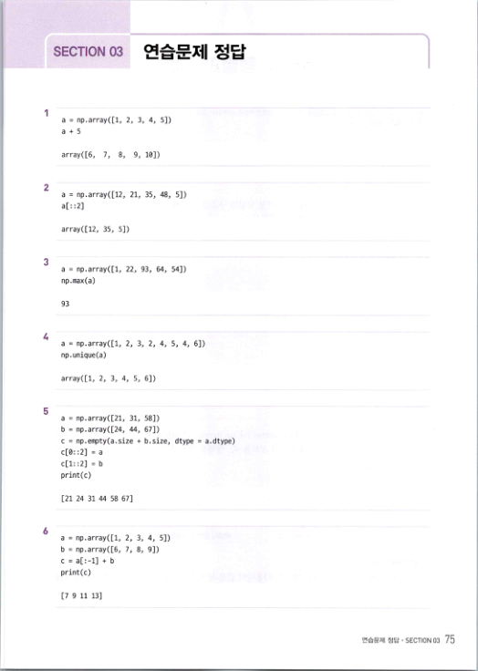
## SECTION 03 
연습문제 정답

```python
a = np.array([1, 2, 3, 4, 5]) 
a+ 5
```
array([6, 7, 8, 9, 10])

```python
2 
a = np.array([12, 21, 35, 48, 5]) 
a[: :2]
```
array([12, 35, 5])

```python
a = np.array([1, 22, 93, 64, 54])
```
np.max(a) 93

```python
a = np.array([1, 2, 3, 2, 4, 5, 4, 6])
```
np . unique(a) array([1, 2, 3, 4, 5, 6])

```python
a = np.array([21, 31, 58])
b = np.array([24, 44, 67])
c = np.empty(a.size + b.size, dtype = a.dtype) 
c[0::2] = a 
c[1::2] = b 
print(c)
```
[21 24 31 44 58 67]

```python
a = np.array([1, 2, 3, 4, 5])
b = np.array([6, 7, 8, 9])
c = a[:-1] + b 
print(c)
```
[7 9 11 13] 연습문제 정답 · SEC지아』03 75

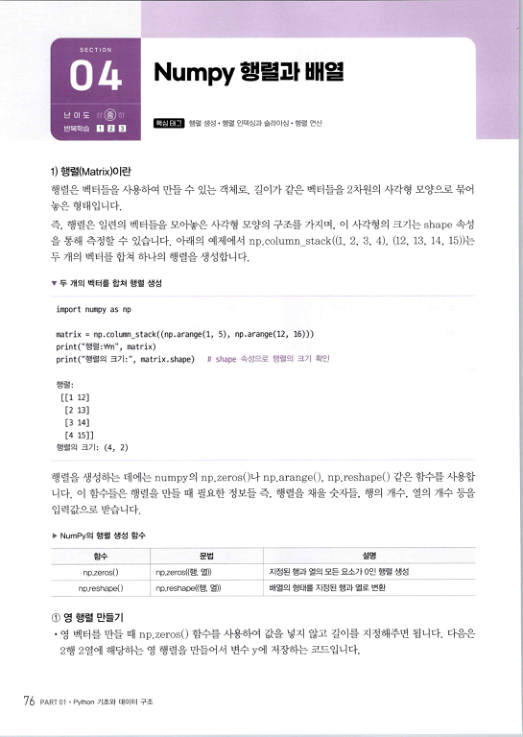
# Numpy 행렬과 배열
난이 도 （劃 반복학습 푄． .

n 핵심 태그 행렬 생성 · 행렬 인덱싱과 슬라이싱 · 행렬 연산 1) 행렬（Matrix）이란 행렬은 벡터들을 사용하여 만들 수 있는 객쳬로 , 길이가 같은 벡터들을 2차원의 사각형 모양으로 묶어 놓은 형태입니다． 즉 , 행렬은 일련의 벡터들을 모아놓은 사각형 모양의 구조를 가지며 , 이 사각형의 크기는 shape 속성 을 통해 측정할수 있습니다 . 아래의 예제에서 np.column_stack((1, 2, 3, 4), (12, 13, 14, 15)）는 두 개의 벡터를 합쳐 하나의 행렬을 생성합니다． ▼ 두 개의 벡터를 합쳐 행렬 생성

```python
import numpy as np
matrix = np.column_stack((np.arange(1, 5), np.arange(12, 16))) 
print(' 행렬:Wn", matrix) 
print(" 행렬의 크기＝ ", matrix.shape) 
# shape 속성으로 행렬의 크기 확인
```
행렬＝ [[1 12] [2 13] [3 14] [4 15]] 행렬의 크기： (4, 2) 행렬을 생성하는 데에는 numpy의 np.zeros(）나 np.arangeQ, np.reshape() 같은 함수를 사용합 니다 . 이 함수들은 행렬을 만들 때 필요한 정보들 즉 , 행렬을 채울 숫자들 , 행의 개수 , 열의 개수 등을 입력값으로 받습니다．

>NumPy의 행렬 생성 함수
문법 설명 함수 np.zeros(（행 , 열）) 지정된 행과 열의 모든요소가 0인 행렬 생성 np.zerosO rp.reshape(（행 , 열）) 배열의 형태를 지정된 행과 열로 변환 np.reshape() (j) 영 행렬 만들기

- 영 벡터를 만들 때 np. zeros() 함수를 사용하여 값을 넣지 않고 길이를 지정해주면 됩니다 . 다음은
2행 2열에 해당하는 영 행렬을 만들어서 변수 y에 저장하는 코드입니다． 76 PART01 ·Python 기초와 데이터 구조

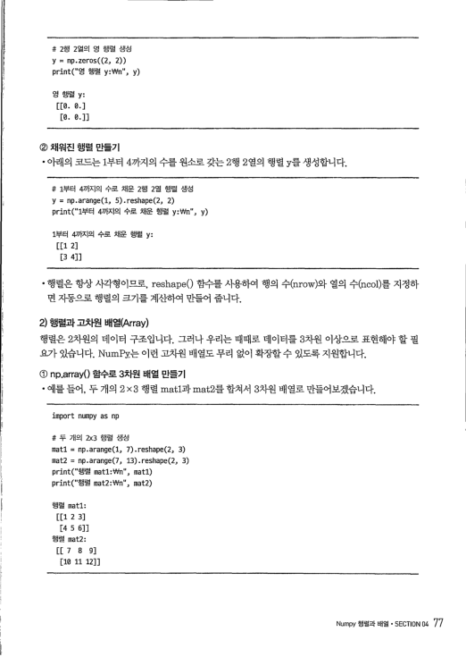
I 紛 ― 砂 ． ` l L ㅔ 引 .

"

```python
#2행 2열의 영 행렬 생성
y = np.zeros((2, 2)) 
print(" 영 행렬 y:Wn ', y)
```
영 행렬 y:

[[0. 0.] [0. 0.]] ② 채워진 행렬 만들기

- 아래의 코드는 1부터 4까지의 수를 원소로 갖는 2행 2열의 행렬 y를 생성합니다．
```python
#1부터 4까지의 수로 채운 2행 2열 행렬 생성
y = np.arange(1, 5).reshape(2, 2) 
print(1부터 4까지의 수로 채운 행렬 y:Wn ", y)
```
1부터 4까지의 수로 채운 행렬 y:

[[1 2] [3 4]]

- 행렬은 항상 사각형이므로 , reshape() 함수를 사용하여 행의 수（nrow）와 열의 수（nCo'）를 지정하 
면 자동으로 행럴의 크기를 계산하여 만들어 줍니다． 2) 행렬과 고차원 배열（Array) 행렬은 2차원의 데이터 구조입니다 . 그러나 우리는 때때로 데이터를 3차원 이상으로 표현해야 할 필 요가 있습니다. NumPy는 이런 고차원 배열도 무리 없이 확장할 수 있도록 지원합니다． ①np.array() 함수로 3차원 배열 만들기

- 예를 들어 , 두 개의 2x3 행렬 mati과 mat2를 합쳐서 3차원 배열로 만들어보겠습니다．
```python
import nunipy as np
# 두 개의 2x3 행렬 생성 
mati = np.arange(1, 7).reshape(2, 3)
mat2 = np.arange(7, 13).reshape(2, 3) 
print(" 행렬 matl:Wn ', mati) 
print(' 행렬 mat2:Wn', mat2)
```
행렬 matl:

[[1 2 3] [4 5 6]] 행렬 mat2:

[[ 7 8 9] [10 11 12]] Numpy행렬과배열· SECTION 04 77

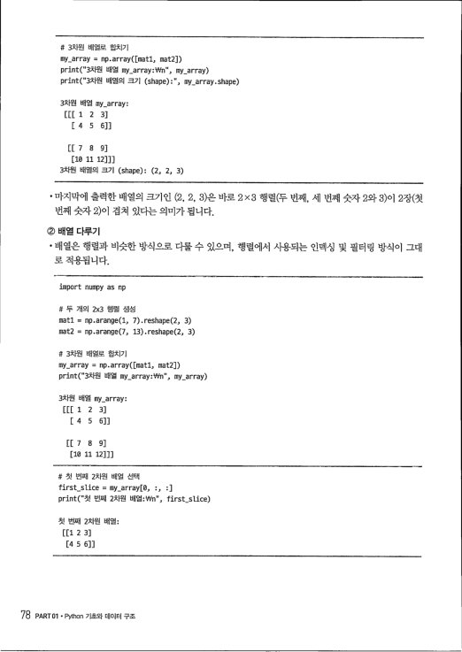
```python
#3차원 배열로 합치기
my_array = np.array([matl, mat2]) 
print("3차원 배열 my_array:Wn", my_array) 
print("3차원 배열의 크기 (shape):", niy_array.shape)
```
3차원 배열 my_array:

E[ J 1 2 3] Ii 4 5 6]] [11 7 8 9] [10 11 12]]] 3차원 배열의 크기 (shape): (2, 2, 3) ' 마지막에 출력한 배열의 크기인 (2, 2, 3）은 바로 2x3 행렬（두 번째 , 세 번째 슷자 2와 3）이 2장（첫 번째 숫자 2）이 겹쳐 있다는 의미가 됩니다． ② 배열 다루기 ' 배열은 행렬과 비슷한 방식으로 다룰 수 있으며 , 행렬에서 사용되는 인덱싱 및 필터링 방식이 그대 로 적용됩니다．

```python
import numpy as np
# 두 개의 2x3 행렬 생성 
niati = np.arange(1, 7).reshape(2, 3) 
niat2 = np.arange(7, 13).reshape(2, 3)
#3차원 배열로 합치기
my_array = np.array([matl, mat2]) 
print("3차원 배열 my_array:Wn", my_array)
```
3차원 배열 my_array:

[[[ 1 2 3] [ 4 5 6]] {[ 7 8 9] [10 11 12]]]

```python
# 첫 번째 2차원 배열 선택 
first_slice = my_array[0, :, :] 
print(" 첫 번째 2차원 배열：Wn", first_slice)
```
첫 번째 2차원 배열： [[1 2 3] [4 5 6]] 78 PART 01 · Python 기초와 데이터 구조

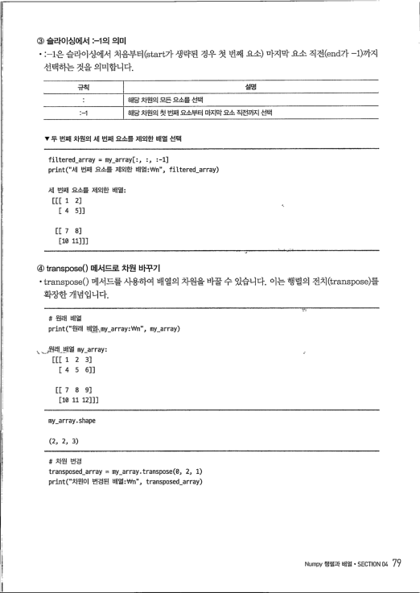
③ 슬라이싱에서 :-1의 의미

- : -1은 슬라이싱，에서 처음부터（start가 생략된 경우 첫 번쨔 요소） 마지막 요소 직전（end가 -1）까지
선택하는 것을 의미합니다． 규돈f 설명 해당 차원의 모든 요소를 선택 ：궉 해당 차원의 첫 번째 요소부터 마지막 요소 직전까지 선택 ▼ 두 번째 차원의 제 번째 요소를 제외한 배열 선택

```python
filtered_array = my_array[:, :, :-1] 
print(" 세 번째 요소를 제외한 배열：Wn", filtered_array)
```
세 번째 요소를 제외한 배열＝ [[[ 1 2] [ 4 5]] [[ 7 8] 1.10 11]]] ④transpose() 메서드로 차원 바꾸기

- transpose() 메서드를 사용하여 배열의 차원을 바꿀 수 있습니다 . 이는 행렬의 전치（transpose）를
확장한 개념 입니다．

```python
# 원래 배열 
print(" 원EH H1l옅.my_array:Wn ', my_array)
```
` , ．∼』원래．．배열 my_array:

[[[ 1 2 3] [ 4 5 6]] [[ 7 8 9] [10 11 12]]] my_array.shape (2, 2, 3)

```python
# 차원 변경
transposed_array = my_array.transpose(0, 2, 1) 
print(" 차원이 변경된 배열＝Wn", transposed_array)
```
Numpy행렬과배열· SECTION 04 79

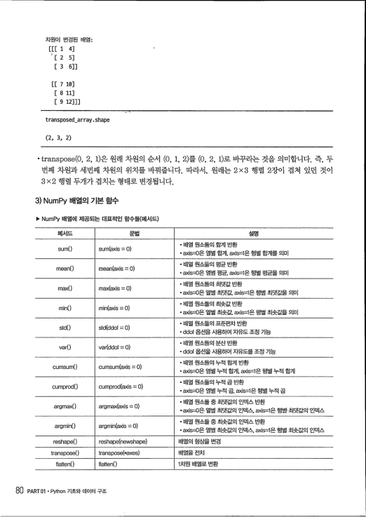
차원이 변경된 배열： [[II 1 4] ' [2 5] [ 3 6]] transposed_array.shape (2, 3, 2)

- transpose(O, 2, 1）은 원래 차원의 순서 (0, 1, 2）를 (0, 2. 1）로 바꾸라는 것을 의미합니다 . 즉 , 두
번째 차원과 세번째 차원의 위치를 바꿔줍니다 . 따라서 , 원래는 2x3 행렬 2장이 겹쳐 있던 것이 3x2 행렬 두개가 겹치는 형태로 변경됩니다． 3) NumPy 배열의 기본 함수 I NumPy 배열에 제공되는 대표적인 함수들《메서드） 메서드 문법 설명 sum() sum(axis == 0)

- 배열 원소들의 합계 반환
- axis＝펫〕은 열별 합계 . axis=1은 행별 합계를 의미
mean() mean(axis, =0)

- 배열 원소들의 평균 반환
- axis＝력〕은 열별 펑균, axis=1은 행별 평균을 의미
max() max(axis =0)

- 배열 원소들의 최댓값 반환 
- axis=0은 열별 최댓값， axis=l은 행별 최댓값을 의미
min() min(axis = 0)

- 배열 원소들의 최솟값 반환 
- axis=(〕은‘열별 최솟값긺axis=1은 행별 최솟값을 의미
stdO std(ddof = 0)

- 배열 원소들의 표뀄l차 반환 
- ddof 옵션을 사용하여 자유도 조정 가능
var() var(ddof = 0)

- 배열 원소들의 분산 반환 
- ddof 옵션을 사용하여 차유도를 조정 가능
cumsum() cumsum(axis =0)

- 배열 원소들의 누적 합계 반환 
- a)ds=0은 열별 누적 합계 . axis=1은 행별 누적 합계
cumprod() cumprod(axis =0)

- 배열 원소들의 누적 곱 반환 
- axis=0은 열별 누적 곱. axis=1은 행별 누적 곱
argmax() argmax(axis =0)

- 배열 원소들 중 최댓값의 인덱스 반환
`axis낙〕은열별 최댓값으l 인덱스， axis=1은 행별 " 최댓값의민덱스 argmin() argmin(axis =0)

- 배열 원소들 중 최솟값의 인덱스 반환 
- axis=0은 열별 최솟값의 인덱스， axis=1은 행별 최솟값의 인덱스
reshape() reshape(newshape) 배열의 형상을 변경 trarispose() transpose(*axes) 배열을 전치 flatton() flatten() 1차원 배열로 변환 80 PART 01 * Python 기초와 데이터 구조

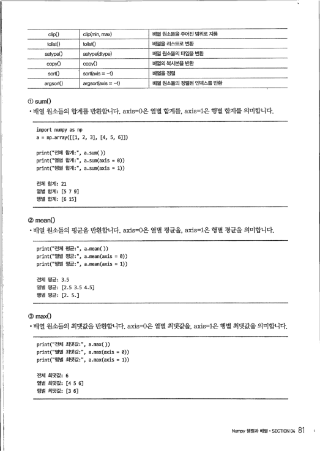
clip() clip(min, max) 배열 원소들을 주어진 범위로 자름 tolistO tolist() 빼열을 리스트로 변환 astype() astype(dtype) 배열 원소들의 타입을 변환 copy() copy() 배열의 복사본을 반환 sort() sort(axis = -1) 배열을정렬 argsort() argsort(axis = -1) 배열 원소들의 정렬된 인덱스를 반환 ①sumO

- 배열 원소들의 합계를 반환합니다 . axis=0은 열별 합계를 , axis=1은 행별 합계를 의미합니다．
```python
import numpy as np
a = np.array([[1, 2, 3], [4, 5, 6]])
print(" 전체 합계： ", a.sumO) 
print(" 열별 합계： ", a.sum(axis = 0)) 
print(" 행별 합계： ", a.sum(axis = 1))
```
전체 합계＝ 21 열별 합계＝ [5 7 9] 행별 합계＝ [6 151 ②meanO

- 배열 원소들의 평균을 반환합니다 . ax1s=0은 열별 평균을 , axis=l은 행별 평균을 의미합니다．
```python
print(" 전체 평균＝ ", a.meanO) 
print(" 열별 평균＝ ", a.mean(axis = 0)) 
print(" 행별 평균： ", a.mean(axis = 1))
```
전체 평균·. 3.5 열별 평균： [2.5 3.5 4.5] 행별 평균： [2. 5.] ③max()

- 배열 원소들의 최댓값을 반환합니다 . axis=O은 열별 최댓값을 , axis=l은 행별 최댓값을 의미합니다．
```python
print(" 전체 최댓값： ", a.max( )) 
print(" 열별 최댓값： ", a.max(axis = 0)) 
print(" 행별 최댓값： ", a.max(axis = 1))
```
전체 최댓값： 6 열별 최댓값： [4 5 6] 행별 최댓값： [3 6] I'Iumpy행렬과배열· SECTION 04 81

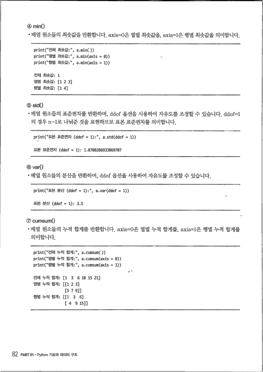
④min() ' 배열 원소들의 최솟값을반환합니다 . axis=0은 열별 최솟값을 , axis=1은 행별 최솟값을 의미합니다．

```python
print(" 전체 최솟값： ", a.minO) 
print(" 열별 최솟값： ", a.min(axis = 0)) 
print(" 행별 최솟값： ", a.niin(axis = 1))
```
전체 최솟값: 1 열별 최솟값＝ 11 2 3] 행별 최솟값： [1 4] ⑤stdO

- 배열 원소들의 표준편차를 반환하며 , ddof 옵션을 사용하여 자유도를 조정할 수 있습니다 . ddof=i 
의 경우 n-i로 나눠준 것을 표현하므로 표본 표준편차를 의미합니다．

```python
print(" 표본 표준편차 (ddof = 1): ', a.std(ddof = 1))
```
표본 표준편차 (ddof = 1): 1.8708286933869707 ⑥var()

- 배열 원소들의 분산을 반환하며 , ddof 옵션을 사용하여 자유도를 조정할 수 있습니다．
```python
print(" 표본 분산 (ddof = 1):", a.var(ddof = 1))
```
표본 분산 (ddof = 1): 3.5 ⑦cumsum()

- 배열 원소들의 누적 합계를 반환함니다 . axis=0은 열별 누적 합계를 , axis=i은 행별 누적 합계를
의미합니다．

```python
print(" 전체 누적 합계： ", a.cunisuniO) 
print(" 열별 누적 합계： ", a.cumsum(axis = 0)) 
print(" 행별 누적 합계： ", a.cunisum(axis = 1))
```
전체 누적 합계： [1 3 6 10 15 21] 열별 누적 합계： [[1 2 3] [5 7 9]] 행별 누적 합계： [[1 3 6] [ 4 9 15]] 82 PART 01 · Python 기초와 데이터 구조

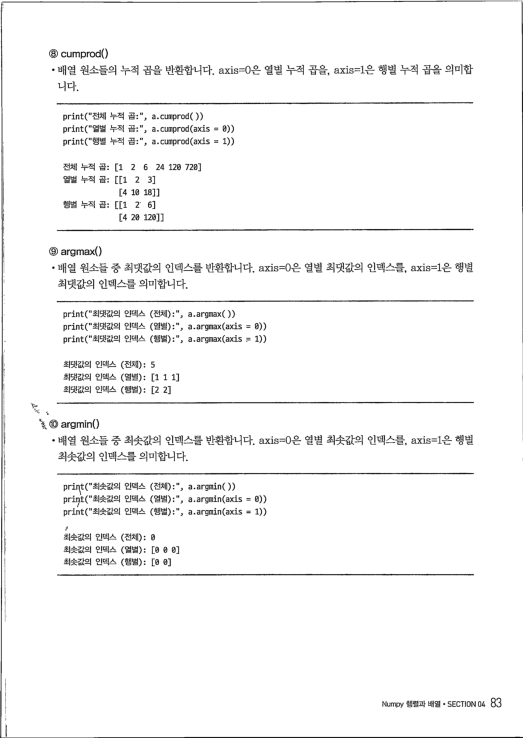
⑧cumprod()

- 배열 원소들의 누적 곱을 반환합니다 . axis=0은 열별 누적 곱을 , axis=l은 행별 누적 곱을 의미합
니다．

```python
print(" 전체 누적 곱： ', a.cumprodO) 
print(" 열별 누적 곱： ", a.cumprod(axis = 0)) 
print(" 행별 누적 곱＝ ", a.cumprod(axis = 1))
```
전체 누적 곱： [1 2 6 24 120 720] 열별 누적 곱： [[1 2 3] [4 10 18]] 행별 누적 곱： [I1 2' 6] [4 20 120]] ⑨argmaxO

- 배열 원소들 중 최댓값의 인덱스를 반환합니다 . axis=0은 열별 최댓값의 인덱스를 , axis4은 행별
최댓값의 인덱스를 의미합니다．

```python
print(" 최댓값으I 인덱스 （전체）: " , a.argmax() ) 
print(" 최댓값의 인덱스 （열별）: ", a.argmax(axis = 0)) 
print(" 최댓값의 인덱스 （행별）: ", a.argniax(axis F 1))
```
최댓값의 인덱스 （전체): 5 최댓값의 인덱스 （열별）: [1 1 1] 최댓값의 인덱스 （행별）: [2 2] '결｀ ⑩argmin()

- 배열 원소들 중 최솟값의 인덱스를 반환합니다 . ax1s=0은 열별 최솟값의 인덱스를 , axis=l은 행별
최솟값의 인덱스를 의미합니다．

```python
print(" 최솟값으I 인덱스 （전체）= " , a. argniin( )) 
prit < " 최솟값의 인덱스 （열별）:", a.argmin(axis = 0)) 
print(" 최솟값의 인덱스 （행별）: ', a.argmin(axis = 1))
```
최솟값의 인덱스 （전체）: 0 최솟값의 인덱스 （열별）: [0 0 0] 최솟값의 인덱스 （행별）= [0 0] Numpy행렬과배열· SECTION 04 83

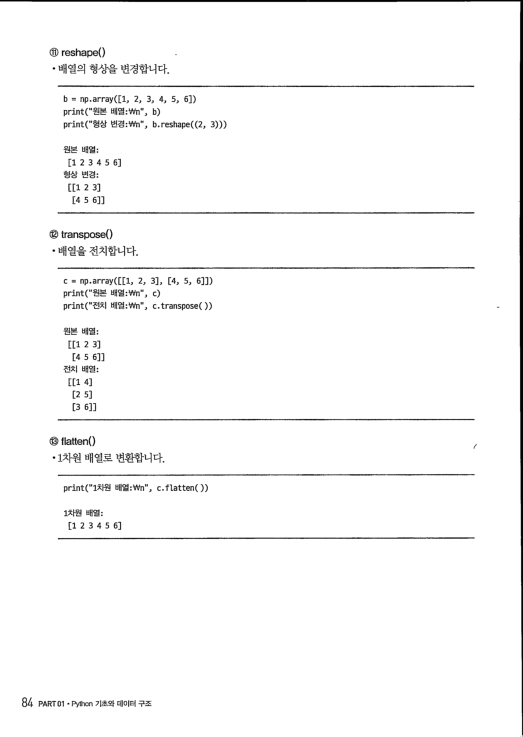
C) reshape()

- 배열의 형상을 변경합니다．
```python
b = np.array([1, 2, 3, 4, 5, 6]) 
print(" 원본 배열：Wn ", b) 
print(" 형상 변경:Wn", b.reshape((2, 3)))
```
원본 배열＝ [1 2 3 4 5 6] 형상 변경： [[1 2 3] [4 5 6]] ⑩transposeO

- 배열을 전치합니다．
```python
c = np.array([[1, 2, 3], [4, 5, 6]]) 
print(" 원본 배열：Wn ', c) 
print(" 전치 배열：Wn ', c.transposeO)
```
원본 배열＝ [[1 2 3] [4 5 6]] 전치 배열＝ [[1 4] [2 5] [3 6]] ⑩flatten()

- 1차원 배열로 변환합니다．
```python
print("1차원 배열＝Wn", c.flattenQ)
```
1차원 배열＝ [1 2 3 4 5 6] 84 PART 01 · Python 기초와 데이터 구조

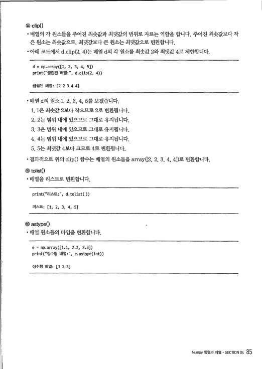
⑩）clip()

- 배열의 각 원소들을 주어진 최솟값과 최댓값의 범위로 자르는 역할을 합니다 . 주어진 최솟값보다 작 
은 원소는 최솟값으로 , 최댓값보다 큰 원소는 최댓값으로 변환합니다．

- 아래 코드에서 d.clip(2, 4）는 배열 d의 각 원소를 최솟값 2와 최댓값 4로 제한합니다．
```python
d = np.array({1, 2, 3, 4, 5]) 
print(" 클립된 배열： ", d.cTip(2, 4))
```
클립된 배열： [2 2 3 4 4]

- 배열 d의 원소1, 2, 3, 4, 5를보겠습니다．
1. 1은 최솟값 2보다 작으므로 2로 변환됩니다．
2. 2는 범위 내에 딧綽므로 그대로 유지됩니다．
3. 3은 범위 내에 있으므로 그대로 유지됩니다．
4. 4는 범위 내에 있으므로 그대로 유지됩니다．
5. 5는 최댓값 4보다 크므로 4로 변환됩니다．
- 결과적으로 위의 clip() 함수는 배열의 원소들을 array([2, 2, 3, 4, 4]）로 변환합니다．
⑩tolistO

- 배열을 리스트로 변환합니다．
```python
print(" 리스트＝ " , d.tol.ist( ))
```
리스트： [1, 2, 3, 4, 5] ⑩astype()

- 배열 원소들의 타입을 변환합니다．
```python
e = np.array([1.1, 2.2, 3.3]) 
print(" 정수형 배열＝ ", e.astype(int))
```
정수형 배열＝ [1 2 3] Numpy행렬과배열· SECTION 04 85

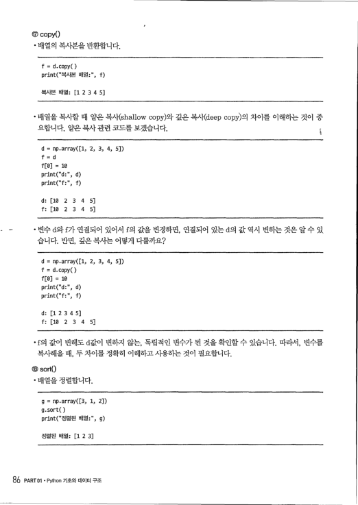
屹）copy()

- 배열의 복사본을 반환합니다．
```python
f = d.copy() 
print(" 복사본 배열： ", f)
```
복사본 배열： [1 2 3 4 5]

- 배열을 복사할 때 얕은 복사（shallow copy）와 깊은 복사（deep copy）의 차이를 이해하는 것이 중 
요합니다 . 얕은복사관련코드를보겠습니다． ,

```python
d = np.array([1, 2, 3, 4, 5:1) 
f= d 
f[0] = 10 
print("d:", d) 
print(f:", f)
```
` < J ＾ 죠 J 1 → , J , J 괘 ， ㅗ 1 ㅗ L L

- - ,
, 4 * 4 , d ㅗ 죠 0 0 z ^z

- 변수 d와 f가 연결되어 있어서 f의 값을 변경하면 , 연결되어 있는 d의 값 역시 변하는 것은 알 수 있
습니다 . 반면 , 깊은복사는 어떻게 다를까요？

```python
d = np.array([1, 2, 3, 4, 5]) 
f = d.copy() 
f[0] = 10 
printed:", d) 
print('f: ", f)
```
d: ti 2 3 4 5] f: {10 2 3 4 5]

- f의 값이 변해도 d값이 변하지 않는 , 독립적인 변수가 된 것을 확인할 수 있습니다 . 따라서 , 변수를
복사해올때 , 두차이를 정확히 이해하고사용하는 것이 필요합니다． ⑩sort()

- 배열을 정렬합니다．
```python
g = np.array(t3, 1, 2])
g.sort() 
print(" 정렬된 배열： " , g)
```
정렬된 배열＝ [1 2 3] 86 PART01 ·Python 기초와 데이터 구조

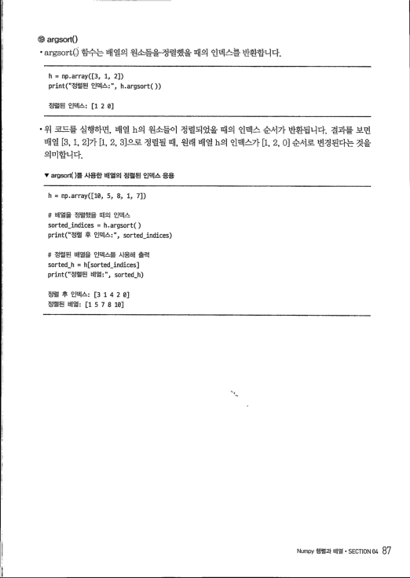
⑩argsort()

- argsort() 함수는 배열의 원소들을정렬했을 때의 인덱스블 반환합니다．
```python
h = np.array({3, 1, 2]) 
print(" 정렬된 인덱스＝ ", h.argsort(仍
```
정렬된 인덱스： [1 2 01

- 위 코드를 실행하면 , 배열 h의 원소들이 정렬되었을 때의 인덱스 순서가 반환됩니다 . 결과를 보면 
배열 〔3, 1, 2〕가 〔1, 2, 비으로 정렬될 때 , 원래 배열 h의 인덱스가 〔1, 2, 0〕 순서로 변경된다는 것을 의미합니다． V argsort( ）를 사용한 배열의 정렬된 인덱스 응용

```python
h = np.array([10, 5, 8, 1, 71)
# 배열을 정렬했을 때의 인덱스
sorted_indices = h.argsort() 
print(" 정렬 후 인덱스： ", sorted_indices)
# 정렬된 배열을 인덱스를 사용해 출력 
sorted_h = h[sorted_indices] 
print(" 정렬된 배열： ", sorted_h)
```
정렬 후 인덱스： [3 1 4 2 0] 정렬된 배열： [1 5 7 8 10] Numpy행렬과배열· SECTION 04 87

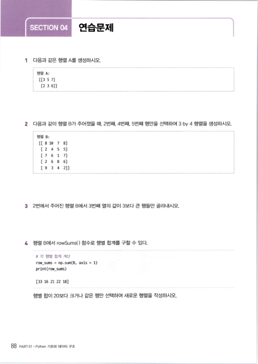
## 연습문제
I 다음과 같은 행렬 A를 생성하시오． 행렬 A:

[[3 5 7] [2 3 6]] 2 다음과 같이 행렬 B가 주어졌을 때 , 2번째 , 4번째 , 5번째 행만을 선택하여 3 by 4 행렬을 생성하시오． 행렬 B:

[[ 8 10 7 8] 5] 7] 6] 2]] → z ' ' → z 。

J r L r r ㄷ 7 ． ㅗ 8 4 4 ' b → b 1 J 3 2번에서 주어진 행렬 B에서 3번째 열의 값이 3보다 큰 행들만 골라내시오． 4 행렬 B에서 rowSums() 함수로 행별 합계를 구할 수 있다．

```python
# 각 행별 합계 계산
row_sums = np.sum(B, axis = 1) 
print(row_sums)
```
[33 16 21 22 18] 행별 합이 20보다 크거나 같은 행만 선택하여 새로운 행렬을 작성하시오． 88 PARTU1 · Pyth。n 기초와 데이터 구조

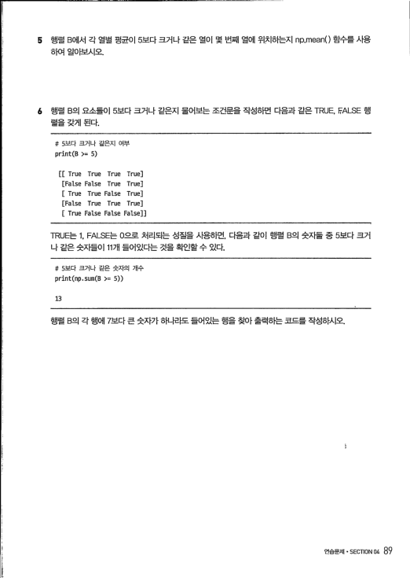
5 행렬 B에서 각 열별 평균이 5보다 크거나 같은 열이 몇 번째 열에 위치하는지 np.mean() 함수를 사용 하여 알아보시오． 6 행렬 B의 요소들이 5보다 크거나 같은지 물어보는 조건문을 작성하면 다음과 같은 TRUE. FALSE 행 렬을 갖게 된다．

```python
#5보다 크거나 같은지 여부 
print(B >= 5)
```
[[ True True True True] [False False True True] [ True True False True] [ False True True True] ji True False False False]] TRUE는 1, FALSE는 0으로 처리되는 성질을 사용하면 , 다음과 같이 행렬 B의 숫자들 중 5보다 크거 나 같은 숫자들이 11개 들어있다는 것을 확인할 수 있다．

```python
#5보다 크거나 같은 숫자의 개수 
print(np.sum(B >= 5))
```
13 행렬 B의 각 행에 7보다 큰 숫자가 하나라도 들어있는 행을 찾아 출력하는 코드를 작성하시오． 연습문제．SECTION 04 89

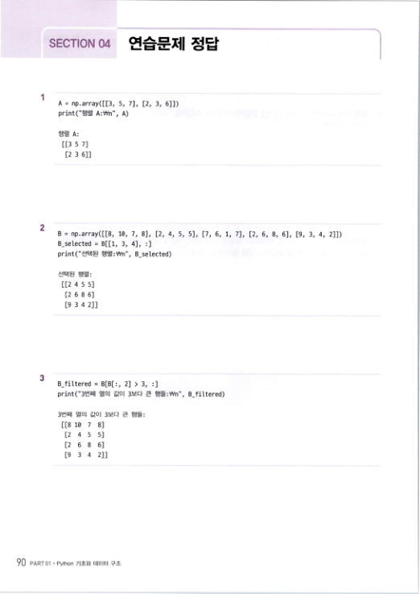
## SECTION 04 
연습문제 정답

```python
A = np.array([[3, 5, 7], [2, 3, 6]]) 
print(" 행렬 A:Wn ", A)
```
행렬 A:

[[3 5 7] [2 3 6]]

```python
B = np.array([[8, 10, 7, 8], [2, 4, 5, 5], [7, 6, 1, 7], [2, 6, 8, 6], [9, 3, 4, 2]])
B_selected = B[[l, 3, 4], :] 
print("선택된 행렬：Wn ", B_selected)
```
선택된 행렬： [[2 4 5 5] [2 6 8 6] [9 3 4 2]]

```python
B_filtered = B[B[:, 2] > 3, :] 
print(" 3번째 열의 값이 3보다 큰 행들＝Wn', B_filtered)
```
3번째 열의 값이 3보다 큰 행들： [[8 10 7 8] [2 4 5 5] [2 6 8 6] [9 3 4 2]] 90 PART 01 · Python 기초와 데이터 구조

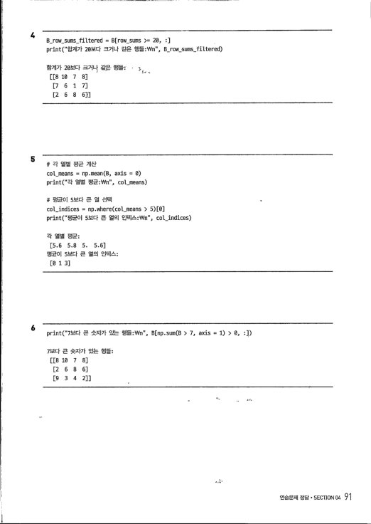
```python
4 
B_row_sums_filtered = B[row_surns >= 20, :] 
print(" 합계가 20보다 크거나 같은 행들：Wn", B_raw_sums_filtered)
```
합계가 20보다 크거나 같은 행들： " [[8 10 7 8] [7 6 1 7] [2, 6 8 6]']

```python
# 각 열별 펑균 계산
cal_means = np.mean(B, axis = 0) 
print(" 각 열별 평균＝Wi-i", cal_means)
# 평균이 5보다 큰 열 선택
cal_indices = np.where(col_means > 5)[0] 
print(" 평균이 5보다 큰 열의 인덱스：Wn", cal_indices)
```
각 열별 평균： [5.6 5.8 5. 5.6] 평균이 5보다 큰 열의 인덱스＝ [0 1 3]

```python
print("7보다 큰 숫자가 있는 행들：Wi-i", B[np.sum(B > 7, axis = 1) > 0, ：끄
```
7보다 큰 숫자가 있는 행들： [[8 10 7 8] [2 6 8 6] [9 3 4 2]] 연습문제정답．SECTION 04 오1

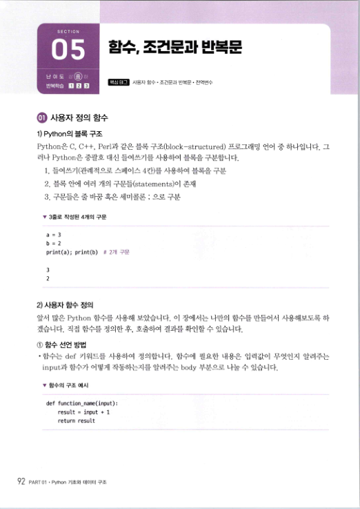
# SECTION 05
# 함수 . 조건문과반복문
난이 도 厓） 핵심 태그 사용자 함수 · 조건문과 반복문 · 전역변수 반복학습 日 . 口 .l 사용자 정의 함수 1) Python의 블록 구조 Python은C, C++, Penl과같은블록구조（block-structured) 프로그래밍 언어 중하나입니다 . 그 러나 Python은 중괄호 대신 들여쓰기를 사용하여 블록을 구분합니다． 1 . 들여쓰기（관례적으로 스페이스 4칸）를 사용하여 블록을 구분 2 . 블록 안에 여러 개의 구문들（statements）이 존재 3 . 구문들은 줄 바꿈 혹은 세미콜론 ; 으로 구분 "3줄로 작성된 4개의 구문

```python
a= 3 
b= 2 
print(a); print(b) # 2개 구
```
3 2 2) 사용자 함수 정의 앞서 많은 Python 함수를 사용해 보았습니다 . 이 장에서는 나만의 향수를 만들어서 사용해보도록 하 겠습니다 . 직접 함수를 정의한 후 , 호출하여 결과를 확인할 수 있습니다． ① 함수 선언 방법

- 함수는 def 키워드를 사용하여 정의합니다 . 함수에 필요한 내용은 입력값이 무엇인지 알려주는 
input과 함수가 어떻게 작동하는지를 알려주는 body 부분으로 나눌 수 있습니다． ▼ 함수의 구조 예시

```python
def function_name(input): 
result = input + 1 
return result
```
92 PART01 .Python 기초와 데0I터 구조

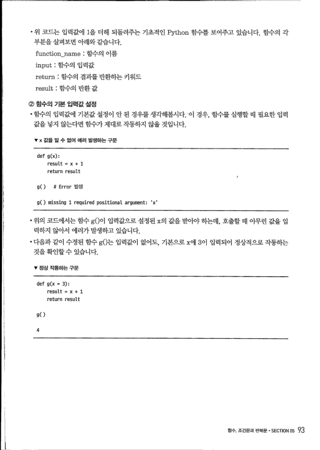
' 위 코드는 입력값에 1을 더해 되돌려주는 기초적인 Python 함수를 보여주고 있습니다 . 함수의 각 부분을 살펴보면 아래와 같습니다． function name : 함수의 이름 input : 함수의 입력값

```python
return : 함수의 결과를 반환하는 키워드
```
result : 함수의 반환 값 ② 함수의 기본 입력값 설정

- 함수의 입력값에 기본값 설정이 안 된 경우를 생각해봅시다 . " ＼이 경우 , 함수를 실행할 때 필요한 입력 
값을 넣지 않는다면 함수가 제대로 작동하지 않을 것입니다． yx 값을 알 수 없어 에러 발생하는 구문

```python
def g(x): 
resul.t = x + 1 
return result
g( ) 
# Error 발생
```
go ) missing 1 required positional. argument: 'x'

- 위의 코드에서는 향논 g(）이 입력값으로 설정된 x의 값을 받아야 하는데 , 호출할 때「아무런 값을 입
력하지 않아서 에러가 발생하고 있습니다．

- 다음과 같이 수정된 함수 g(）는 입력값이 없어도 , 기본으로 x에 3이 입력되어 정상적으로 작동하는 
것을 확인할 수 있습니다． ▼ 정상 작동하는 구문

```python
def g(x = 3): 
result = x + 1 
return result
```
go ) 함수 . 조건문과 반복문 · SECTION 05 93

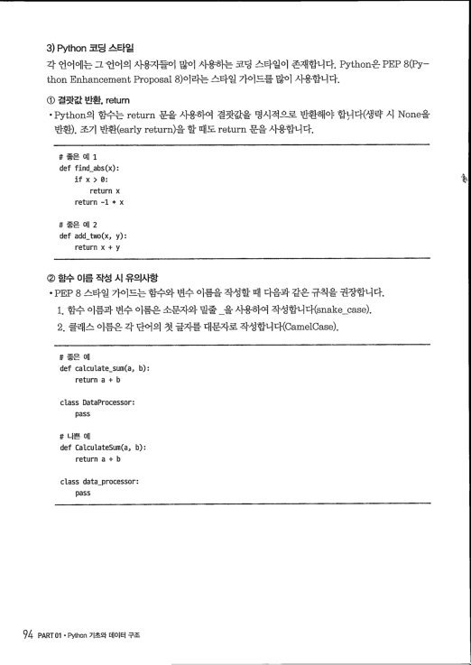
3) Python 코딩 스타일 각 언어에는 그 " 인어의 사용＝자들이 많이 사용하는 코딩 스타일이 존재합니다 . Python은 PEP 8(Py- thon Enhanceme끄t Proposal 8）이라는 스타일 가이드를 많이 사용합니다． (j:) 켤괏값 반환 , return

- Python의 함수는 return 문을 사용하여 결괏값을 명시적으로 반환해야 합니다（생략 시 None을
반환） . 조기 반환（early return）을 할 때도 return 문을 사용합니다．

```python
# 좋은 예 1 
def find- abs(x): 
if x > 0: 
return x 
return -1 * x
# 좋은 예 2 
def add_two(x, y): 
return x + y
```
② 함수 이름 작성 시 유의사항

- PEP 8 스타일 가이드는 함수와 변수 이름을 작성할 때 다음과 같은 규칙을 권장합니다．
1 . 함수 이름과 변수 이름은 소문자와 밑줄 －을 사용하여 작성합니다（snake_case).

2 . 클래스 이름은 각 단어의 첫 글자를 대문자로 작성합니다（CamelCase).

```python
# 좋은 예 
def calculate_sum(a, b): 
return a + b
class DataProcessor: 
pass
# 나쁜 예 
def CalculateSum(a, b): 
return a + b
class data_processor: 
pass
```
94 PART01 'Python 기초와 데이터 구조

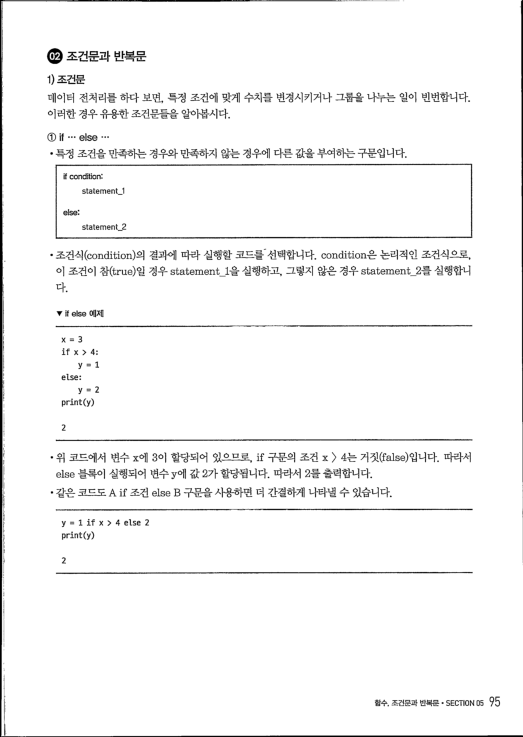
.

조건문과 반복문 1）조건문 데이터 전처리를 하다 보먼 , 특정 조건에 맞게 수치를 변경시키거나 그룹을 나누는 일이 빈번합니다． 이러한 경우 유용한 조건문들을 알아봅시다． (I) if … else ···

- 특정 조건을 만족하는 경우와 만족하지 않는 경우에 다른 값을 부여하는 구문입니다．
```python
if condition:
```
statement 1 else= statement 2

- 조건식（condition）의 결과에 따라 실행할 코드를‘선택합니다 . condition은 논리적인 조건식으로，
이 조건이 참（true）일 경우 statement_i을 실행하고 , 그렇지 않은 경우 statement_2를 실행합니 다． ▼ if else 예제

```python
x= 3 
if x > 4: 
y= l 
else: 
y= 2 
print(y)
```
- 위 코드에서 변수 x에 3이 할당되어 있으므로 , if 구문의 조건 x> 4는 거짓（false）입니다 . 따라서
else 블록이 실행되어 변수y에 값2가할당됩니다 . 따라서 2를 출력합니다．

- 같은  1i 두 Aif 조건 else B 구문을 사용하면 더 간결하게 나타낼 수 있습니다．
```python
y = 1 if x > 4 else 2 
print(y)
```
함수 . 조건문과반복문．SECTION 05 95

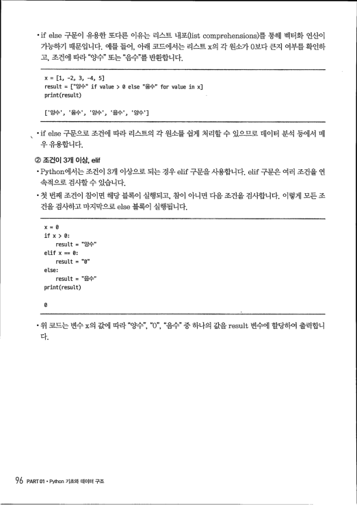
- if else 구문이 유용한 또다른 이유는 리스트 내포（list comprehensions）를 통해 벡터화 연산이
가능하기 때문입니다 . 예를들어 , 아래 코드에서는 리스트 x의 각 원소가 0보다 큰지 여부를확인하 고 , 조건에」따라 " 양수" 또는 " 음수 " 를반환합니다．

```python
x = [1, -2, 3, -4, 5] 
result - 〔 " 양수 " if value > 0 else "수" for value in x]
- L. 
print(result)
```
[ ' 양수 ' , ' 음수 ' , ' 양수 ' , ' 음수 ' , ' 양수 ' 〕 . 'if else 구문으로 조건에 따라 리스트의 각 원소를 쉽게 처리할 수 있으므로 데이터 분석 등에서 매 우 유용합니다． ② 조건이 3개 이상 , elif

- Python에서는 조건이 3개 이상으로 되는 경우 elif 구문을 사용합니다 . elif 구문은 여러 조건을 연
속적으로 검사할 수 있습니다．

- 첫 번째 조건이 참이면 해당 블록이 실행되고 , 참이 아니면 다음 조건을 검사합니다 . 이렇게 모든 조
건을 검사하고 마지막으로 else 블록이 실행됩니다．

```python
x 섭 0 
if x > 0: 
result = " 양수" 
elif x == 0: 
result = "0" 
else: 
result . " 음수" 
print(result)
```
- 위 코드는 변수 x의 값에 따라 " 양수” , " 0 " , " 음수 " 중 하나의 값을 result 변수에 할당하여 출력합니
다． % PART01 . Python 기초와 데이터 구조

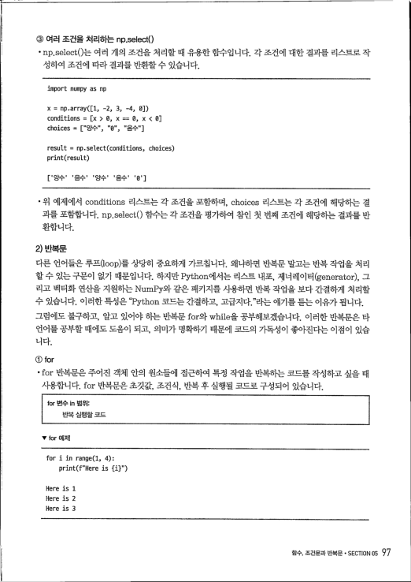
③ 여러 조건을 처리하는 np .seIect()

- np.select(）는 여러 개의 조건을 처리할 때 유용한 함수입니다 . 각 조건에 대한 결과를 리스트로 작
성하여 조건에 따라 결과를 반환할 수 있습니다．

```python
import numpy as np
x = np.array([1, -2, 3, -4, @]) 
conditions = [x > 0, x == 0, x < 0] 
choices = [ " 양수 " ' hell , " 음수 " 〕
result = np.select(conditions, choices) 
print(resul.t)
```
[ ' 양수 " 음수 " 양수 " 음수 " 0 ' 〕 ' 위 예제에서 conditions 리스트는 각 조건을 포함하며 , choices 리스트는 각 조건에 해당하는 결 과를 포함합니다 . np.select() 함수는 각 조건을 평가하여 참인 첫 번째 조건에 해당하는 결과를 반 환합니다． 2）반복문 다른 언어들은 루프（loop）를 상당히 중요하게 가르칩니다 . 왜냐하면 반복푼말고는 반복 작업을 처리 할수 있는구문이 없기 때문입니다 . 하지만Python에서는 리스트 내포 , 제너레이터（generator) , 그 리고 벡터화 연산을 지원하는 NumPy와 같은 패키지를 사용하면 반복 작업을 보다 간결하게 처리할 수 있습니다 . 이러한특정은 " Python 코드는간결하고 , 고급지다 . " 라는 얘기를듣는 이유가됩니다． 그럼에도 불구하고 , 알고 있어야 하는 반복문for와while을공부해보겠습니다 . 이러한반복문은 타 언어를 공부할 때에도 도움이 되고 , 의미가 명확하기 때문에 코드의 가독성이 좋아진다는 이점이 있습 니다． 'D for ' for 반복문은 주어진 객쳬 안의 원소들에 접근하여 특정 작업을 반복하는 코드를 작성하고 싶을 때 사용합니다 . for 반복문은초깃값 , 조건식 , 반복후 실행될 코드로 구성되어 있습니다．

```python
for 변수 In 범위＝
```
반복 실행할 코드 ▼ fo「 예제

```python
for i in range(l, 4): 
print(f"Here is {i}")
```
Here is 1 Here is 2 Here is 3 함수 . 조건문과반복문· SECT!아切5 97

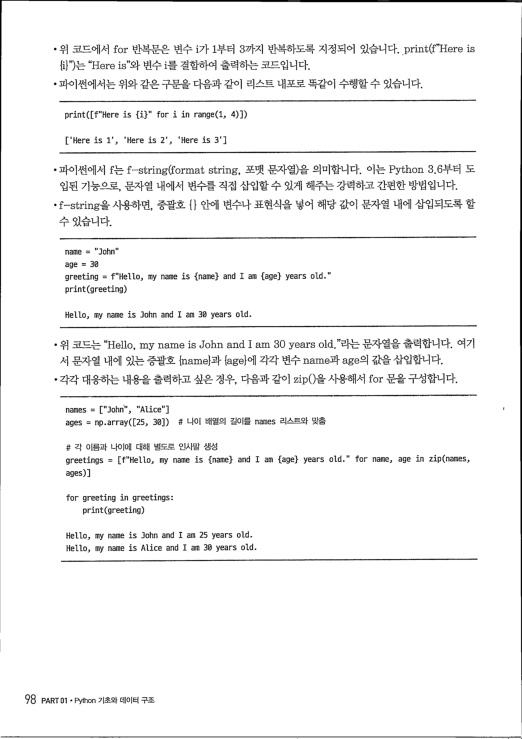
- 위 코드에서 for 반복문은 변수 1가 1부터 3까지 반복하도록 지정되어 있습니다 . print(f"Here is
I과 " ）는 " Here is " 와 변수 1를 결합하여 출력하는 코드입니다．

- 파이썬에서는 위와 같은 구문을 다음과 같이 리스트 내포로 똑같이 수행할 수 있습니다．
```python
print([f"Here is {i} " for i in range(l, 4)])
```
[ 'Here is 1', 'Here is 2', 'Here is 3']

- 파이썬에서 f는 f-string(format string , 포맷 문자열）을 의미합니다 . 이는 Python 3.6부터 도
입된 기능으로 , 문자열 내에서 변수를 직접 삽입할 수 있게 해주는 강력하고 간편한 방법입니다．

- f- string을 사용하면 , 중괄호 {} 안에 변수나 표현식을 넣어 해당 값이 문자열 내에 삽입되도록 할
수 있습니다．

```python
name = "John'
age = 30 
greeting = f"Hello, my name is {name} and 工 am {age} years old.' 
print(greeting)
```
Hello, my name is John and I am 30 years old.

- 위 코드는 " Hello, my name is John and I am 30 years old. " 라는 문자열을 출력합니다 . 여기
서 문자열 내에 있는 중괄호 nam하과age｝에 각각 변수 name과 age의 값을 삽입합니다．

- 각각 대응하는 내용을출력하고 싶은 경우 , 다음과같이 zip(）을사용해서 for 문을구성합니다．
```python
names = ["John", "Alice"]
ages = np.array([25, 30]) # 나이 배열의 길이를 name$ 리스트와 맞춤
# 각 이름과 나이에 대해 별도로 인사말 생성
greetings = [f "Hello, my name is {name} and I am {age} years old." for name, age in zip(names,
```
ages)]

```python
for greeting in greetings: 
print(greeting)
```
Hello, my name is John and I am 25 years old.

Hello, my name is Alice and I am 30 years old.

98 PART며 · Python 기초와 데이터 구조

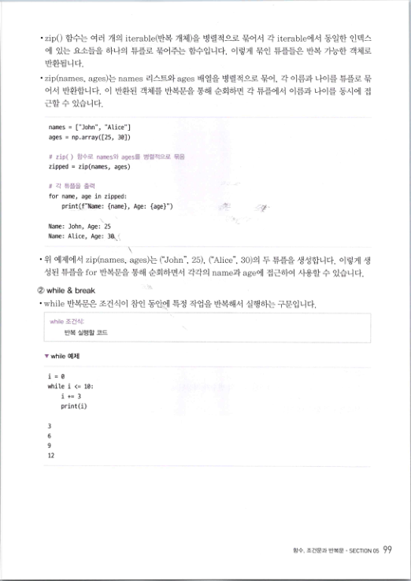
- zip() 함수는 여러 개의 iterable（반복 개쳬）을 병렬적으로 묶어서 각 iterable에서 동일한 인덱스
에 있는 요소들을 하나의 튜플로 묶어주는 함수입니다 . 이렇게 묶인 튜플들은 반복 가능한 객체로 반환됩니다．

- zip(names, ages）는names 리스트와ages 배열을 병렬적으로묶어 , 각 이름과나이를튜플로묶
어서 반환합니다 . 이 반환된 객쳬를 반복문을 통해 순회하면 각 튜플에서 이름과 나이를 동시에 접 근할 수 있습니다 .

```python
names = ["John", 'AUce ']
ages = np.array([25, 30])
# zip( ) 함수로 names와 ages를 병렬적으로
```
묶 음

```python
zipped = zip(names, ages)
# 각 튜플을 출력 
for name, age in zipped: 
print(f"Naine: {name}, Age: {age}")
```
Name: John, Age: 25 Name: A1.ice, Age: 3비， \ ' 위 예제에서 zip(names, ages）는 ("John", 25), ("Alice", 30）의 두튜플을생성합니다 . 이렇게 생 성된 튜플을 for 반복문을 통해 순회하면서 각각의 name과 age에 접근하여 사용할 수 있습니다． (2) while & break " ' while 반복문은 조건식이 참인 동안에 특정 작업을 반복해서 실행하는 구문입니다．

```python
while 조건식：
```
반복 실행할 코드 ▼ while 예제

```python
i=
0 
while I <== 10: 
i += 3 
print(i)
```
3 6 9 12 함수 , 조건문과반복문．SECTION 05 ?9

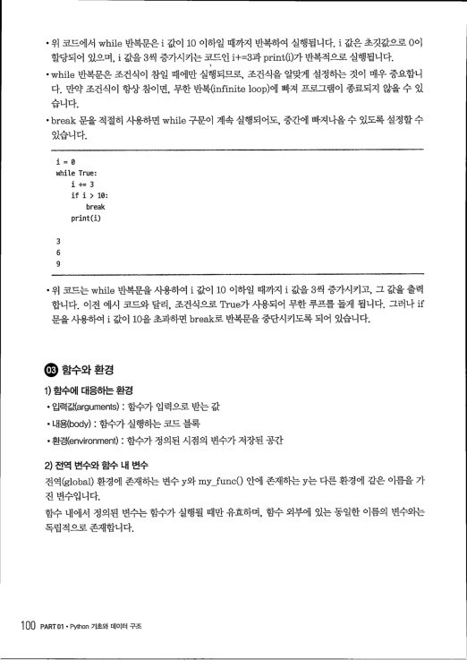
- 위 코드에서 while 반복문은 1 값이 10 이하일 때까지 반복하여 실행됩니다 . 1 값은 초깃값으로 0이
할당되어 있으며 , 1 값을 3씩 증가시키는 코드인 i+=3과 print(i）가 반복적으로 실행됩니다．

- while 반복문은 조건식이 참일 때에만 실행되므로 , 조건식을 알맞게 설정하는 것이 매우 중요합니
다 . 만약 조건식이 항상 참이면 , 무한 반복（infinite loop）에 빠져 프로그램이 종료되지 않을 수 있 습니다．

- break 문을 적절히 사용하면 while 구문이 계속 실행되어도 , 중간에 빠져나올 수 있도록 설정할 수
있습니다．

```python
i 븝 0 
while True: 
I += 3 
if i > 10: 
break 
print(i)
```
3 6 9

- 위 코드는 while 반복문을 사용하여 1 값이 10 이하일 때까지 1 값을 3씩 증가시키고 , 그 값을 출력
합니다 . 이전 예시 코드와 달리 , 조건식으로 True가 사용되어 무한 루프를 돌게 됩니다 . 그러나 if 문을 사용하여 1 값이 10을 초과하면 break로 반복문을 중단시키도록 되어 있습니다． .

함수와 환경 1) 함수에 대응하는 환경

- 입력긺（arguments) : 함수가 입력으로 받는 값
- 내용《body) : 함수가 실행하는 코드 블록
- 환경（environment) : 함수가 정의된 시점의 변수가 저장된 공간
2) 전역 변수와 함수 내 변수 전역（global) 환경에 존재하는 변수 y와 my_func() 안에 존재하는 y는 다른 환경에 같은 이름을 가 진 변수입니다． 함수 내에서 정의된 변수는 함수가 실행될 때만 유효하며 , 함수 외부에 있는 동일한 이름의 변수와는 독립적으로 존재합니다． 100 PART01 ·Pythori 기초와 데이터 구조

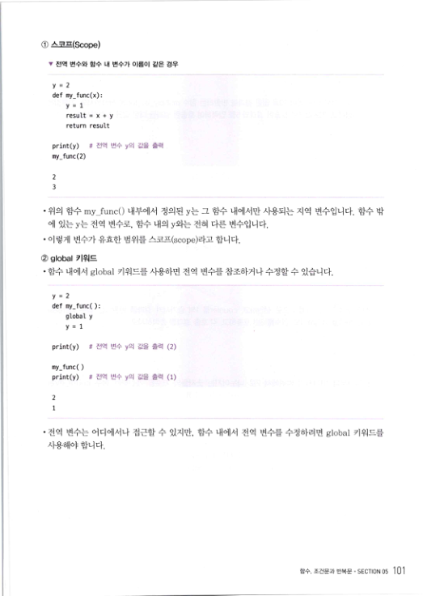
① 스코프（Scope) ▼ 전역 변수와 함수 내 변수가 이름이 같은 경우

```python
y= 2
def my-func(x): 
y= 1 
resul.t = x + y 
return resu't
print(y) 
# 전역 변수 y의 값을 출력
```
my-func(2)

- 위의 함수 my_func() 내부에서 정의된 y는 그 함수 내에서만 사용되는 지역 변수입니다 . 함수 밖
에 있는 y는 전역 변수로 , 함수 내의 y와는 전혀 다른 변수입니다．

- 이렇게 변수가 유효한 범위를 스코프（scope）라고 합니다．
② 이obal 키워드

- 함수 내에서 global 키워드를 사용하면 전역 변수를 참조하거나 수정할 수 있습니다．
```python
y= 2
def my_func( ):
globa' y 
y= 1
print(y) 
# 전역 변수 y의 값을 출력 (2)
my_func( ) 
print(y) 
# 전역 변수 y의 값을 출력 (1)
```
- 전역 변수는 어디에서나 접근할 수 있지만 , 함수 내에서 전역 변수를 수정하려면 global 키워드를
사용해야 합니다． 함수． 조건문과 반복문 · SECTION 05 ㅍn

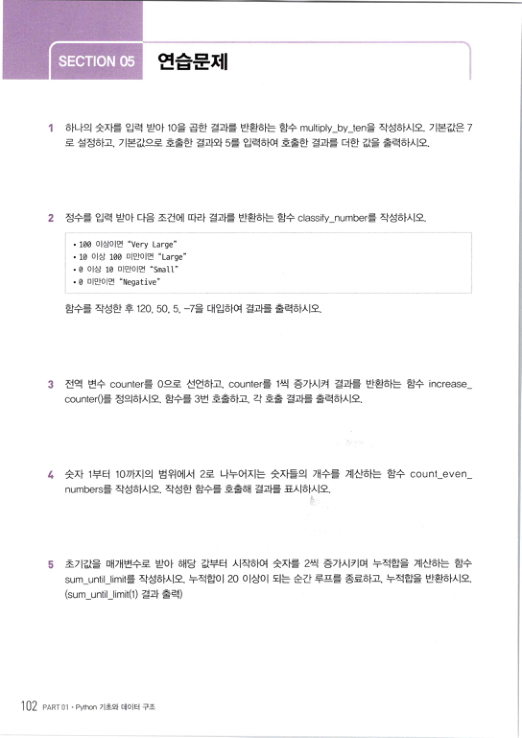
I 하나의 숫자를 입력 받아 10을 곱한 결과를 반환하는 함수 m미꺄)ly_by_ten을 작성하시오 . 기본값은 7 로 설정하고 , 기본값으로 호출한 결과와 5를 입력하여 호출한 결과를 더한 값을 출력하시오． 2 정수를 입력 받아 다음 조건에 따라 결과를 반환하는 함수 classify_number를 작성하시오．

- 100 이상이면 " Very Large"
- 10 이상 100 미만이면 " Large" 
- 0 이상 10 미만이면 "Small"
- 0 미만이면 " Negative"
함수를 작성한 후 120. 50. 5. -7을 대입하여 결과를 출력하시오． 3 전역 변수 counter를 0으로 선언하고 , counter를 1씩 증가시켜 결과를 반환하는 함수 increase_ counter(）를 정의하시오 . 함수를 3번 호출하고 , 각 호출 결과를 출력하시오． 4 숫자 1부터 10까지의 범위에서 2로 나누어지는 숫자들의 개수를 계산하는 함수 cou nt_even_ numbers를 작성하시오 . 작성한 함수를 호출해 결과를 표시하시오． 5 초기값을 매개변수로 받아 해당 값부터 시작하여 숫자를 2씩 증가시키며 누적합을 계산하는 함수 sum_until_limit를 작성하시오 . 누적합이 20 이상이 되는 순간 루프를 종료하고 , 누적합을 반환하시오． (sum_untiljmit(1) 결과 출력） 102 PART01 'Python 기초와 데이터 구조

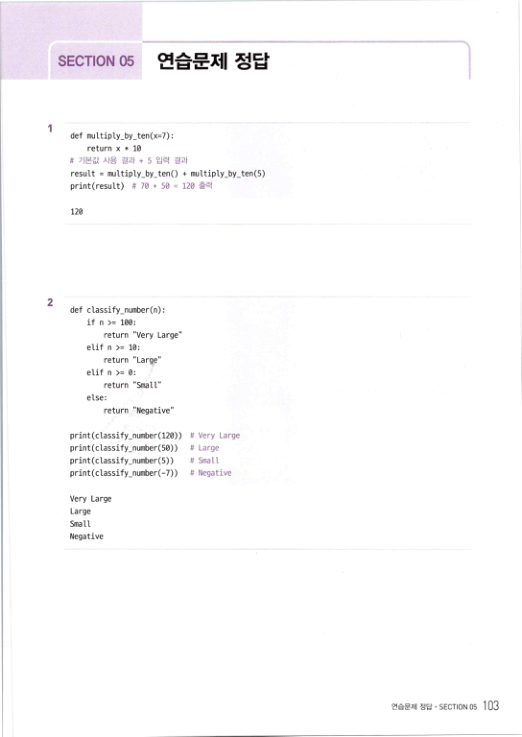
## SECTION 05 
연습문제 정답

```python
def multiply_by_ten(x=7): 
return x * 10
# 기본값 사용 결과 + 5 입력 결과 
result = multiply_by_ten() + multiply_by_ten(s) 
print(result) # 70 + 50 = 120 출력
```
120

```python
def classify_number(n): 
if n >= 100: 
return "Very Large" 
elif n >= 10: 
return "Large" 
elif n >= 0: 
return "Small" 
else: 
return " Negative"
print(classify_number(120)) # Very Large 
print(classify_number(50)) 
# Large 
print(classify_number(5)) 
# Sniafl 
print(classify_number(-7)) 
# Negative
```
Very Large Large Small Negative 연습문제 정답· SECTION 05 103

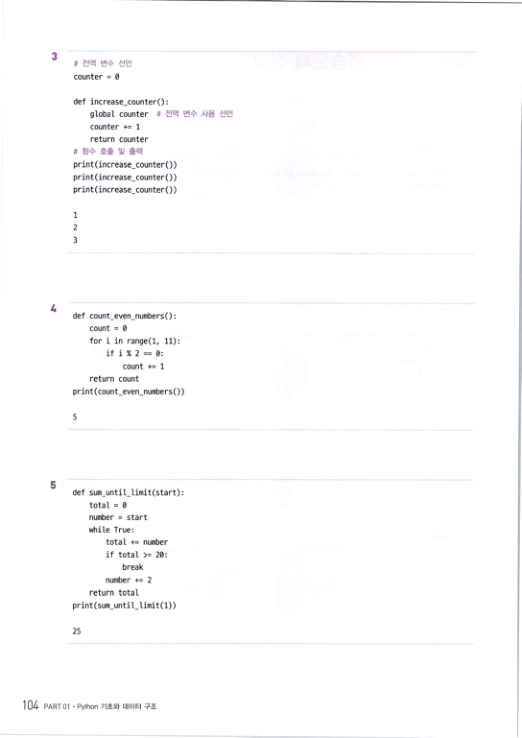
```python
3 
# 전역 변수 선언
counter = 0
def increase_counterO: 
global counter 
# 전역 변수 사용 선언
counter += 1 
return counter 
# 함수 호출 및 출력 
print(increase_counterO) 
print(increase_counterO) 
print(increase_counterQ)
```
1 2 3

```python
def count_even_numbers 0: 
count = 0 
for i in range(1, 11): 
if i % 2 == 0:
count += 1 
return count 
print(count_even_numbers0)
```
5

```python
def sum_until_limit(start): 
total = 0
number = start 
while True: 
total += number 
if total >= 20: 
break
number += 2 
return total 
print(sum_until_limit (1))
```
25 ㅍ）4 PART 01 · Python 기초와 데이터 구조
