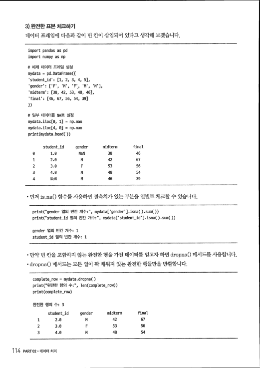
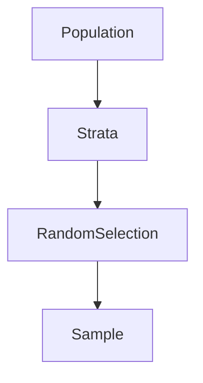
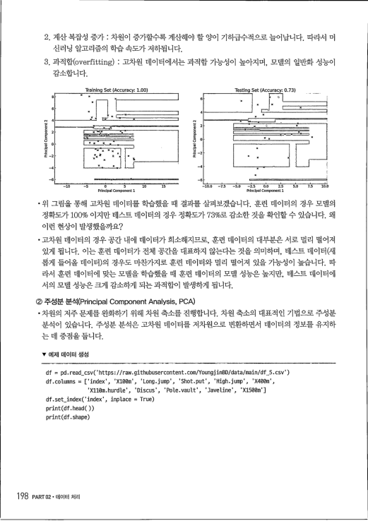
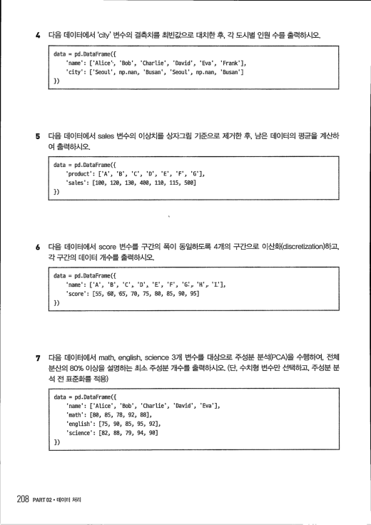

**파트 소개**

이 파트에서는 Python을 활용한 데이터 처리 및 전처리 기법을 학습합니다. 특히 시험에서 자주 출제되는 데이터 전처리 기술을 중심으로 Pandas를 활용한 데이터 조작, scikit-learn을 이용한 전처리 방법을 익혀 실전에서 바로 적용할 수 있도록 구성되었습니다.

**◇ 주요 내용**

- **Pandas를 활용한 기본 데이터 처리**: 데이터프레임을 생성하고, 데이터 필터링, 정렬, 그룹화, 결합 등 다양한 데이터 처리 기법
- **Pandas를 활용한 문자열 및 날짜 데이터 처리**: 문자열 데이터를 변환하고, 날짜 데이터를 `to_datetime()`을 이용해 변환 및 연산
- **데이터 분할 및 전처리**: scikit-learn을 활용하여 데이터를 학습용과 테스트용으로 나누고, 결측치 처리 및 이상치 탐색
- **인코딩 및 정규화 기법**: Label Encoding, One-Hot Encoding, Standardization(표준화), Min-Max Scaling(정규화) 등 데이터를 모델링에 적합하게 변환하는 방법
- **변수 변환과 차원 축소**: Box-Cox 변환, Yeo-Johnson 변환을 통해 데이터 분포를 조정하고 주성분 분석(PCA)을 활용한 차원 축소 기법


## SECTION 01 Pandas로 데이터 프레임 다루기

**난이도**: ★★☆  **핵심 태그**: 데이터 프레임 생성 · 데이터 필터링 · 데이터 재구조화 · 데이터 병합 · 반복학습: [ ] [ ] [ ]

### 1. Pandas와 데이터 프레임

pandas는 데이터 분석을 위한 강력하고 인기 있는 라이브러리 중 하나입니다. 특히 표 형태의 데이터를 효율적으로 다루고 분석하는 데 유용합니다.

**1) 데이터 프레임(DataFrame)**

행렬의 경우 행렬 안의 요소들이 모두 같은 데이터 타입이어야만 했습니다. 하지만 데이터 프레임의 경우는 각 열에 들어있는 데이터 타입이 달라도 됩니다.

**▼ numpy로 생성한 행렬 예시**

```python
import numpy as np

# 행렬의 모든 요소는 같은 데이터 타입
matrix = np.array([['1', '2', '3', '4', '5'], [6, 7, 8, 9, 10]])
print(matrix)
```
```
[['1' '2' '3' '4' '5']
 ['6' '7' '8' '9' '10']]
```

**▼ pandas로 생성한 데이터 프레임 예시**

```python
import pandas as pd

# 데이터 프레임 생성
df = pd.DataFrame({
    'col1': ['one', 'two', 'three', 'four', 'five'],
    'col2': [6, 7, 8, 9, 10]
})
print(df)
```
```
    col1  col2
0    one     6
1    two     7
2  three     8
3   four     9
4   five    10
```


```python
# 칼럼명 확인
print(df.columns)

# 데이터 타입 확인
print(df['col1'].dtype)
print(df['col2'].dtype)

# 데이터 프레임 차원 확인
print(df.shape)
```
```
Index(['col1', 'col2'], dtype='object')
object
int64
(5, 2)
```

- pandas 라이브러리의 DataFrame 클래스를 사용하여 데이터 프레임을 선언할 수 있습니다. 데이터 프레임은 데이터 분석에서 가장 많이 사용되는 자료 저장 클래스 중 하나이며, `(5, 2)`와 같이 2차원 구조를 가집니다.

**① 빈 데이터 프레임 만들기**

- 데이터 프레임을 만들면서 각 열의 이름과 데이터 타입을 지정해줄 수 있습니다.

**▼ 빈 데이터 프레임 생성 예제**

```python
my_df = pd.DataFrame({
    '실수': pd.Series(dtype='float'),
    '정수': pd.Series(dtype='int'),
    '범주형': pd.Series(dtype='category'),
    '논리': pd.Series(dtype='bool'),
    '문자열': pd.Series(dtype='str')
})
print(my_df)
print(my_df.dtypes)
```
```
Empty DataFrame
Columns: [실수, 정수, 범주형, 논리, 문자열]
Index: []
실수       float64
정수         int64
범주형     category
논리          bool
문자열       object
dtype: object
```


**② 채워진 데이터 프레임 만들기**

- 데이터 프레임을 만들 때 각 열에 들어갈 리스트나 배열을 이름과 값을 연결하여 DataFrame 클래스에 차례대로 넣어줍니다.

```python
# 데이터 프레임 생성
my_df = pd.DataFrame({
    'name': ['issac', 'bomi'],
    'birthmonth': [5, 4]
})
print(my_df)
print(my_df.dtypes)
```
```
    name  birthmonth
0  issac           5
1   bomi           4
name          object
birthmonth     int64
dtype: object
```

**③ csv 파일로 읽어오기**

- pandas 패키지의 `read_csv()` 함수를 사용하면 csv 파일을 읽을 수 있습니다. 예시로 아래와 같이 링크를 통해 `examscore.csv` 파일을 불러오겠습니다.

```python
# URL을 사용해서 바로 읽어오기
url = "https://raw.githubusercontent.com/YoungjinBD/data/main/examscore.csv"
mydata = pd.read_csv(url)

# 데이터의 위쪽 행들을 확인
print(mydata.head())

# 데이터 프레임의 차원(행과 열 개수)을 출력
print(mydata.shape)
```
```
   student_id gender  midterm  final
0           1      F       38     46
1           2      M       42     67
2           3      F       53     56
3           4      M       48     54
4           5      M       46     39
(30, 4)
```


**2) 시리즈(Series)**

데이터 프레임의 각 열(column)은 하나의 시리즈로 볼 수 있으므로 데이터 프레임은 여러 개의 시리즈가 모여 만들어진 2차원 자료구조라고 할 수 있습니다.

```python
import pandas as pd

data = [10, 20, 30]
df_s = pd.Series(data, index=["one", "two", "three"], name="count")

print(df_s.dtype)
print(df_s.shape)
print(df_s.name)
print(df_s)
```
```
int64
(3,)
count
one      10
two      20
three    30
Name: count, dtype: int64
```

- 생성된 시리즈는 `(3,)`과 같이 1차원 자료 구조를 가지며, 데이터 타입은 정수형입니다. name은 `count`입니다.


### 3) 데이터 프레임 인덱싱(Indexing)

**① `[]` 연산자를 이용한 필터링**

- `[]` 연산자를 사용하여 데이터 프레임의 특정 열에 접근할 수 있습니다.

```python
print(mydata['gender'])
```
```
0    F
1    M
2    F
Name: gender, dtype: object
```
*(참고: 출력 결과는 시리즈 형태이며 일부만 표시됩니다.)*

- 한 번에 여러 칼럼을 선택하고 싶은 경우, 리스트 형태로 작성합니다.

```python
print(mydata[['gender', 'midterm']])
```
```
   gender  midterm
0       F       38
1       M       42
2       F       53
...
```

- 특정 행을 선택하고 싶은 경우 조건식을 넣어주면 됩니다.

```python
print(mydata[mydata['midterm'] <= 15])
```
```
    student_id gender  midterm  final
19          20      M        9     33
21          22      M       15     12
```


**② iloc[]을 이용한 필터링**

- `iloc`는 **정수 기반 인덱싱(integer-based indexing)**으로 행과 열의 정수 위치를 활용하여 데이터를 필터링합니다.

- 첫 번째 열을 필터링합니다.

```python
# 첫 번째 열에 접근 후 상위 두 행 출력
print(mydata.iloc[:, 0].head(2))
```
```
0    1
1    2
Name: student_id, dtype: int64
```

- 정수값을 활용하여 필터링할 경우 시리즈로 변환됩니다.

```python
print(mydata.iloc[:, 0].shape)
print(type(mydata.iloc[:, 0]))
```
```
(30,)
<class 'pandas.core.series.Series'>
```

- 리스트 형태로 필터링할 경우 데이터 프레임으로 변환됩니다.

```python
print(mydata.iloc[:, [0]].shape)
print(type(mydata.iloc[:, [0]]))
```
```
(30, 1)
<class 'pandas.core.frame.DataFrame'>
```

- 첫 번째, 두 번째 열을 필터링합니다.

```python
# 첫 번째, 두 번째 열에 접근
print(mydata.iloc[:, [0, 1]].head(2))
```
```
   student_id gender
0           1      F
1           2      M
```

- `squeeze()`를 활용해 데이터 프레임을 시리즈로 변환할 수 있습니다.
- 우선 리스트 형태로 데이터를 필터링하면 하나의 열이어도 데이터 프레임으로 변환됩니다.


```python
# 첫 번째 열에 접근
print(mydata.iloc[:, [0]])
print(type(mydata.iloc[:, [0]]))
```
```
    student_id
0            1
1            2
2            3
...
<class 'pandas.core.frame.DataFrame'>
```

- `squeeze()`는 데이터 프레임을 시리즈로 변환합니다.

```python
print(type(mydata.iloc[:, [0]].squeeze()))
```
```
<class 'pandas.core.series.Series'>
```

- 시리즈와 데이터 프레임은 차원 구조가 다르므로, 데이터 전처리 과정에서 다르게 활용될 수 있습니다. 따라서 출력 결과가 정확히 어떤 타입으로 산출되는지 이해하는 것이 중요합니다.

**③ loc[]를 이용한 필터링**

- `loc`는 **라벨 기반 인덱싱(label-based indexing)**으로 행과 열의 라벨을 활용하여 데이터를 필터링합니다. 다음과 같은 형식으로 조건을 만족하는 행들을 선택하는 코드를 생각해 보겠습니다.

```python
print(mydata[mydata['midterm'] <= 15])
```
```
    student_id gender  midterm  final
19          20      M        9     33
21          22      M       15     12
```

- 위의 코드는 `loc[]`를 사용해 다음과 같이 나타낼 수 있습니다.

```python
mydata.loc[mydata['midterm'] <= 15] # 위와 결과 같음
```

- 특정 열을 지정하지 않을 경우 전체 열이 선택됩니다.

```python
mydata.loc[mydata['midterm'] <= 15, :] # 위와 결과 같음
```


- 조건을 만족하는 행과 열을 함께 필터링할 수 있습니다.

```python
print(mydata.loc[mydata['midterm'] <= 15, ['student_id', 'final']])
```
```
    student_id  final
19          20     33
21          22     12
```

**④ isin() 활용하기**

- `isin()`는 특정 값이 데이터 프레임 내에 존재하는지 확인하고, 조건을 만족하는 행을 필터링하는 데 사용됩니다. `loc[]`과 함께 활용하면 특정 열의 여러 값을 한 번에 필터링할 수 있습니다.

```python
print(mydata[mydata['midterm'].isin([28, 38, 52])].head())
```
```
    student_id gender  midterm  final
0            1      F       38     46
8            9      M       28     25
9           10      M       38     59
23          24      M       28     55
27          28      F       52     66
```

- 특정 값이 포함된 행을 필터링하면서 원하는 열만 선택할 수도 있습니다.

```python
print(mydata.loc[mydata['midterm'].isin([28, 38, 52]), ['student_id', 'final']].head())
```
```
    student_id  final
0            1     46
8            9     25
9           10     59
23          24     55
27          28     66
```

- `isin()` 앞에 `~`를 추가하면 특정 값을 제외할 수 있습니다. `midterm` 점수가 28, 38, 52인 행을 제외한 나머지 데이터를 선택합니다.

```python
print(mydata.loc[~mydata['midterm'].isin([28, 38, 52])].head())
```
```
   student_id gender  midterm  final
1           2      M       42     67
2           3      F       53     56
3           4      M       48     54
4           5      M       46     39
5           6      M       51     74
```

**3) 완전한 표본 체크하기**

데이터 프레임에 다음과 같이 빈 칸이 삽입되어 있다고 생각해 보겠습니다.

```python
import pandas as pd
import numpy as np

# 예제 데이터 프레임 생성
mydata = pd.DataFrame({
    'student_id': [1, 2, 3, 4, 5],
    'gender': ['F', 'M', 'F', 'M', 'M'],
    'midterm': [38, 42, 53, 48, 46],
    'final': [46, 67, 56, 54, 39]
})

# 일부 데이터를 NA로 설정
mydata.iloc[0, 1] = np.nan
mydata.iloc[4, 0] = np.nan
print(mydata.head())
```
```
   student_id gender  midterm  final
0         1.0    NaN       38     46
1         2.0      M       42     67
2         3.0      F       53     56
3         4.0      M       48     54
4         NaN      M       46     39
```

- 먼저 `isna()` 함수를 사용하면 결측치가 있는 부분을 열별로 체크할 수 있습니다.

```python
print("gender 열의 빈칸 개수:", mydata['gender'].isna().sum())
print("student_id 열의 빈칸 개수:", mydata['student_id'].isna().sum())
```
```
gender 열의 빈칸 개수: 1
student_id 열의 빈칸 개수: 1
```

- 만약 빈 칸을 포함하지 않는 완전한 행을 가진 데이터를 얻고자 하면 `dropna()` 메서드를 사용합니다.
- `dropna()` 메서드는 모든 열이 꽉 채워져 있는 완전한 행들만을 반환합니다.

```python
complete_row = mydata.dropna()
print("완전한 행의 수:", len(complete_row))
print(complete_row)
```
```
완전한 행의 수: 3
   student_id gender  midterm  final
1         2.0      M       42     67
2         3.0      F       53     56
3         4.0      M       48     54
```


**4) 구성원소 추가/삭제/변경**

**① 변경 및 추가**

- `[]` 기호를 사용하여 새로운 열을 추가하거나 기존 열을 변경할 수 있습니다. 예를 들어, `mydata` 데이터 프레임에 `midterm` 열과 `final` 열의 값을 더하여 `total` 열을 추가하고, `total` 열의 앞부분 몇 개 행을 확인하려면 아래와 같이 코드를 작성합니다.

```python
mydata['total'] = mydata['midterm'] + mydata['final']
print(mydata.iloc[0:3, [3, 4]])
```
```
   final  total
0     46     84
1     67    109
2     56    109
```

**② del을 사용한 삭제**

- 데이터 프레임의 열을 삭제하는 방법으로 `del`을 사용할 수 있습니다. 예를 들어, `mydata` 데이터 프레임에서 `gender` 열을 삭제하려면 아래와 같이 코드를 작성합니다.

```python
del mydata['gender']
print(mydata.head())
```
```
   student_id  midterm  final  total
0         1.0       38     46     84
1         2.0       42     67    109
2         3.0       53     56    109
3         4.0       48     54    102
4         NaN       46     39     85
```

**③ pd.concat() 함수**

- `pd.concat()` 함수는 pandas에서 데이터 프레임이나 시리즈를 연결(concatenate)하는 데 사용됩니다. `pd.concat()` 함수는 여러 가지 옵션을 제공하여 다양한 방식으로 데이터를 합칠 수 있습니다.

> **pd.concat()의 주요 옵션**
> - **objs**: 연결할 데이터 프레임이나 시리즈의 리스트
> - **axis**: 0 또는 'index'는 행 방향으로 연결, 1 또는 'columns'는 열 방향으로 연결
> - **join**: 'outer'(기본값) 또는 'inner', 조인 방식 결정
> - **ignore_index**: True로 설정하면 새로운 인덱스를 생성하여 기존 인덱스를 무시
> - **keys**: 계층적 인덱스를 생성하는 데 사용되는 키 값들
> - **sort**: True로 설정하면 조인 축을 따라 데이터를 정렬


**▼ 두 개 데이터 프레임 연결하기**

```python
import pandas as pd

df1 = pd.DataFrame({'A': ['A0', 'A1', 'A2'], 'B': ['B0', 'B1', 'B2']})
df2 = pd.DataFrame({'A': ['A3', 'A4', 'A5'], 'B': ['B3', 'B4', 'B5']})

result = pd.concat([df1, df2])
print(result)
```
```
    A   B
0  A0  B0
1  A1  B1
2  A2  B2
0  A3  B3
1  A4  B4
2  A5  B5
```

- 위 예제는 `pd.concat()` 함수로 두 데이터 프레임을 연결하는데, 기본 설정은 `axis=0`이므로 행 방향으로 연결됩니다. 결과적으로 `df1`의 행 아래에 `df2`의 행이 추가됩니다.

- 만약, 옆으로 합치고 싶은 경우에는 `axis` 옵션을 열 방향으로 바꿔주면 됩니다.

**▼ 열 방향으로 연결**

```python
df3 = pd.DataFrame({'C': ['C0', 'C1', 'C2'], 'D': ['D0', 'D1', 'D2']})

result = pd.concat([df1, df3], axis=1)
print(result)
```
```
    A   B   C   D
0  A0  B0  C0  D0
1  A1  B1  C1  D1
2  A2  B2  C2  D2
```

- 기본 설정의 행방향으로 합쳤을 경우, 행 번호가 중복되어 출력되는 것을 볼 수 있습니다. 이런 행 번호를 정리할 때 사용할 수 있는 옵션은 `ignore_index=True`입니다.


**▼ ignore_index 옵션 사용**

```python
result = pd.concat([df1, df2])
print(result)

result = pd.concat([df1, df2], ignore_index=True)
print(result)
```
```
    A   B
0  A0  B0
1  A1  B1
2  A2  B2
0  A3  B3
1  A4  B4
2  A5  B5
    A   B
0  A0  B0
1  A1  B1
2  A2  B2
3  A3  B3
4  A4  B4
5  A5  B5
```

- `df4`는 열 'A', 'B', 'C'를 가지고 있으며 각 열은 세 개의 문자열 값을 포함하는 데이터 프레임입니다.
- `pd.concat()` 함수는 두 데이터 프레임을 내부 결합하여 연결합니다. `join='inner'` 옵션을 사용하여 두 데이터 프레임의 공통 열만 포함하는 결합을 수행합니다.

**▼ 공통된 열만 합치기, inner**

```python
df4 = pd.DataFrame({
    'A': ['A2', 'A3', 'A4'],
    'B': ['B2', 'B3', 'B4'],
    'C': ['C2', 'C3', 'C4']
})
print(df1)
print(df4)
```
```
    A   B
0  A0  B0
1  A1  B1
2  A2  B2
    A   B   C
0  A2  B2  C2
1  A3  B3  C3
2  A4  B4  C4
```


```python
result = pd.concat([df1, df4], join='inner')
print(result)
```
```
    A   B
0  A0  B0
1  A1  B1
2  A2  B2
0  A2  B2
1  A3  B3
2  A4  B4
```

- `join='outer'`는 데이터 프레임을 결합할 때, 모든 열을 포함시키는 외부 결합(outer join)을 의미합니다. 이는 두 데이터 프레임의 모든 열을 포함하며, 하나의 데이터 프레임에만 존재하는 열은 `NaN`으로 채워집니다.

**▼ 모든 열 합치기, outer**

```python
import pandas as pd

# 데이터 프레임 생성
df1 = pd.DataFrame({
    'A': ['A0', 'A1', 'A2'],
    'B': ['B0', 'B1', 'B2']
})
df4 = pd.DataFrame({
    'A': ['A2', 'A3', 'A4'],
    'B': ['B2', 'B3', 'B4'],
    'C': ['C2', 'C3', 'C4']
})

# 데이터 프레임 출력
print(df1)
print(df4)

# 두 데이터 프레임을 외부 결합하여 연결
result = pd.concat([df1, df4], join='outer')
print(result)
```
```
    A   B    C
0  A0  B0  NaN
1  A1  B1  NaN
2  A2  B2  NaN
0  A2  B2   C2
1  A3  B3   C3
2  A4  B4   C4
```


- 위의 결과 데이터 프레임에는 `df1`과 `df4`의 모든 열인 'A', 'B', 'C'가 포함되어 있습니다. `join='outer'` 옵션을 사용하였고 열 'C'는 `df1`에서 존재하지 않기 때문에 `NaN` 값으로 채워졌습니다.

**▼ keys 옵션 사용**

```python
print(df1)
print(df2)
```
```
    A   B
0  A0  B0
1  A1  B1
2  A2  B2
    A   B
0  A3  B3
1  A4  B4
2  A5  B5
```

- `df1`과 `df2`는 같은 칼럼 이름 'A', 'B'를 가지고 있는 데이터 프레임입니다. 이것들을 합칠 때 각 행이 어느 데이터 프레임에서 왔는지 기록하고 싶은 경우 `keys` 옵션을 사용하면 됩니다.

```python
result = pd.concat([df1, df2], keys=['key1', 'key2'])
print(result)
```
```
          A   B
key1 0   A0  B0
     1   A1  B1
     2   A2  B2
key2 0   A3  B3
     1   A4  B4
     2   A5  B5
```

- `keys` 옵션을 사용하면, 연결된 데이터 프레임의 원본 출처를 식별하는 멀티 인덱스가 생성됩니다. 멀티 인덱스를 통해 연결된 데이터 프레임의 각 행이 원본 데이터 프레임의 어느 부분에서 왔는지를 쉽게 식별할 수 있습니다.


- 이 방법으로 원래 데이터 프레임의 출처를 유지하면서 데이터 프레임을 결합할 수 있어 데이터의 출처를 명확히 할 수 있습니다. 또한, 키 값을 사용하여 데이터를 걸러낼 수도 있습니다.

```python
# key2에 해당하는 데이터 프레임의 2번째, 3번째 행을 선택
df1_rows = result.loc['key2'].iloc[1:3]
print(df1_rows)
```
```
    A   B
1  A4  B4
2  A5  B5
```

### ⑥ pd.merge()

- `pd.merge()` 메서드는 두 데이터 프레임을 병합합니다. 기본적으로 공통된 열을 기준으로 병합합니다.

```python
# 예제 데이터 프레임 생성
df1 = pd.DataFrame({'key': ['A', 'B', 'C'], 'value': [1, 2, 3]})
df2 = pd.DataFrame({'key': ['A', 'B', 'D'], 'value': [4, 5, 6]})

# 두 데이터 프레임 병합
merged_df = pd.merge(df1, df2, on='key', how='inner')
print(merged_df)
```
```
  key  value_x  value_y
0   A        1        4
1   B        2        5
```

*(참고: 원문의 이미지 17_23은 섹션 흐름상 여기에 위치하지 않을 수 있으나, 순서대로 배치함. 다음 섹션에서 설명될 수 있음)*


- 위 코드는 두 데이터 프레임 `df1`과 `df2`를 특정 열(key)을 기준으로 병합합니다.

> **pd.merge()의 옵션**
> - **on**: 병합할 때 기준이 되는 열을 지정
> - **how**: 조인 방식 결정
>   - **inner**: 두 데이터 프레임 모두에게 존재하는 키 값만 포함 (교집합)
>   - **outer**: 두 데이터 프레임 중 하나라도 존재하는 모든 키 값 포함 (합집합)
>   - **left**: `df1`의 모든 키 값 유지, `df2`는 일치할 때만 포함 (왼쪽 기준)
>   - **right**: `df2`의 모든 키 값 유지, `df1`은 일치할 때만 포함 (오른쪽 기준)

```python
# 두 데이터 프레임을 outer join으로 병합
merged_df_outer = pd.merge(df1, df2, on='key', how='outer')
print(merged_df_outer)
```
```
  key  value_x  value_y
0   A      1.0      4.0
1   B      2.0      5.0
2   C      3.0      NaN
3   D      NaN      6.0
```

**2) 데이터 재구조화**

데이터 재구조화는 데이터 전처리 과정에서 매우 중요한 작업이며, 적절히 수행할 경우 긴 코드를 효율적으로 줄일 수 있습니다.

**▼ Long Form 데이터 예시**
```
Student  Subject  Score
Alice    Math     85
Alice    English  90
Bob      Math     78
Bob      English  88
```

**▼ Wide Form 데이터 예시**
```
Student  Math  English
Alice    85    90
Bob      78    88
```


**① pd.melt()**

- `pd.melt()` 메서드는 데이터를 넓은 형식(wide form)에서 긴 형식(long form)으로 변환합니다.

> **pd.melt()의 옵션**
> - **id_vars**: 변환되지 않고 그대로 유지될 칼럼 지정
> - **value_vars**: 변환할 칼럼 지정 (지정하지 않으면 id_vars를 제외한 모든 칼럼이 선택됨)
> - **var_name**: value_vars의 칼럼명이 저장될 칼럼의 이름 지정 (기본값 variable)
> - **value_name**: value_vars의 값이 저장될 칼럼의 이름 지정 (기본값 value)

```python
# 예제 데이터 프레임 생성
import pandas as pd

data = {
    'Date': ['2024-07-01', '2024-07-02', '2024-07-03', '2024-07-03'],
    'Temperature': [10, 20, 25, 20],
    'Humidity': [60, 65, 70, 21]
}

df = pd.DataFrame(data)
print(df)
```
```
         Date  Temperature  Humidity
0  2024-07-01           10        60
1  2024-07-02           20        65
2  2024-07-03           25        70
3  2024-07-03           20        21
```

- `pd.melt()` 메서드를 사용하여 데이터 프레임을 긴 형식으로 변환해 보겠습니다.

```python
df_melted = pd.melt(df,
                    id_vars=['Date'],
                    value_vars=['Temperature', 'Humidity'],
                    var_name='Variable',
                    value_name='Value')
print(df_melted)
```
```
         Date     Variable  Value
0  2024-07-01  Temperature     10
1  2024-07-02  Temperature     20
2  2024-07-03  Temperature     25
3  2024-07-03  Temperature     20
4  2024-07-01     Humidity     60
5  2024-07-02     Humidity     65
6  2024-07-03     Humidity     70
7  2024-07-03     Humidity     21
```

**② pivot()**

- `pivot()` 메서드는 데이터를 긴 형식에서 넓은 형식으로 변환합니다.

> **pivot()의 옵션**
> - **index**: 새 데이터 프레임에서 행 인덱스로 사용할 칼럼명 지정
> - **columns**: 새 데이터 프레임에서 열로 사용할 칼럼명 지정
> - **values**: 새 데이터 프레임에서 각 인덱스-열 조합에 대해 채워질 값으로 사용할 칼럼명 지정

- `pd.melt()` 메서드로 변환된 데이터를 `pivot()`을 활용하여 재변환해 보겠습니다.

```python
# pivot() 실행 시 에러 발생 예제
# df_pivoted = df_melted.pivot(index='Date', columns='Variable', values='Value')
# print(df_pivoted)
```
*(참고: 위 코드는 `ValueError: Index contains duplicate entries, cannot reshape` 오류가 발생합니다.)*

> **기적의 Tip**
> `pivot()` 메서드는 지정된 index와 columns 조합이 고유(unique)해야 정상적으로 동작합니다. 동일한 조합에 여러 값이 존재하면 오류가 발생할 수 있습니다.
>
> - 데이터에서는 `Date='2024-07-03'`이 두 번 등장하고, 이때 `Temperature` 값이 각각 25와 20, `Humidity` 값이 각각 70과 21로 존재합니다. 즉 `(Date, Variable)` 조합이 유일하지 않기 때문에 `pivot()` 실행 시 어떤 값을 채워야 할지 결정할 수 없어 오류가 발생합니다.
>
> - 이를 해결하려면 `melt()` 적용 전에 각 행을 고유하게 식별할 수 있는 인덱스를 생성하거나, `pivot_table()`을 사용하여 중복된 값을 집계(예: 평균, 합계)해야 합니다.

```python
# 인덱스를 포함하여 melt
df_melted2 = pd.melt(df.reset_index(),
                     id_vars=['index'],
                     value_vars=['Temperature', 'Humidity'],
                     var_name='Variable',
                     value_name='Value')
print(df_melted2)
```
```
   index     Variable  Value
0      0  Temperature     10
1      1  Temperature     20
2      2  Temperature     25
3      3  Temperature     20
4      0     Humidity     60
5      1     Humidity     65
6      2     Humidity     70
7      3     Humidity     21
```


- `index` 칼럼을 기준으로 `pivot()` 메서드를 적용해 보겠습니다.

```python
df_pivoted = df_melted2.pivot(index='index',
                              columns='Variable',
                              values='Value')
print(df_pivoted)
```
```
Variable  Humidity  Temperature
index
0              60           10
1              65           20
2              70           25
3              21           20
```

**③ pivot_table()**

- `pivot_table()` 메서드는 `pivot()`와 마찬가지로 데이터를 긴 형식에서 넓은 형식으로 변환합니다.

> **pivot_table()의 옵션**
> - **data**: 피벗할 데이터 프레임
> - **values**: 집계할 데이터 값의 칼럼명 지정
> - **index**: 행 인덱스로 사용할 칼럼명 지정
> - **columns**: 열로 사용할 칼럼명 지정
> - **aggfunc**: 집계 함수(예: 'mean', 'sum', 'count' 등) 지정 (기본값 'mean')

- `pd.melt()` 메서드로 변환된 데이터를 `pivot_table()`을 활용하여 재변환해 보겠습니다. 이전에 `df_melted` 데이터는 `pivot()`을 활용할 경우 오류가 발생했습니다.

```python
df_pivot_table = df_melted.pivot_table(index='Date',
                                       columns='Variable',
                                       values='Value',
                                       aggfunc='mean').reset_index()
print(df_pivot_table)
```
```
Variable        Date  Humidity  Temperature
0         2024-07-01      60.0         10.0
1         2024-07-02      65.0         20.0
2         2024-07-03      45.5         22.5
```

- `pivot_table()` 메서드의 경우 `aggfunc` 옵션을 활용하여 중복이 있는 날짜의 값을 평균으로 대치합니다.


**▼ pivot()과 pivot_table()의 차이점**

| 구분                      | pivot()        | pivot_table()                               |
| :------------------------ | :------------- | :------------------------------------------ |
| **중복된 인덱스-열 조합** | 오류 출력      | 집계 함수(`aggfunc`)를 사용하여 데이터 집계 |
| **중복 데이터 처리**      | 집계 기능 없음 | 집계 함수를 통해 데이터 집계 가능           |

### 3) 학생 성적 데이터 분석 실습

학생 성적 데이터셋은 학생들의 성적에 영향을 미치는 다양한 요인들을 포함하고 있습니다. 이 데이터셋은 교육 연구에서 학생들의 성적 향상에 기여하는 요인을 분석하는 데 사용됩니다. 각 행은 학생 한 명을 나타내며, 다음과 같은 칼럼으로 구성되어 있습니다.

- **school**: 학생이 소속된 학교 ('GP': Gabriel Pereira 또는 'MS': Mousinho da Silveira)
- **sex**: 학생의 성별 ('F': 여성 또는 'M': 남성)
- **paid**: 추가 과외 수업 여부 ('yes', 'no')
- **famrel**: 가족 관계의 질 (1: 매우 나쁨 ~ 5: 매우 좋음)
- **freetime**: 자유 시간의 양 (1: 매우 적음 ~ 5: 매우 많음)
- **goout**: 친구와 외출 빈도 (1: 매우 적음 ~ 5: 매우 많음)
- **Dalc**: 주중 음주량 (1: 매우 적음 ~ 5: 매우 많음)
- **Walc**: 주말 음주량 (1: 매우 적음 ~ 5: 매우 많음)
- **health**: 현재 건강 상태 (1: 매우 나쁨 ~ 5: 매우 좋음)
- **absences**: 결석 일수
- **grade**: 최종 성적

```python
import pandas as pd

# 학생 성적 데이터 불러오기
df = pd.read_csv('https://raw.githubusercontent.com/YoungjinBD/data/main/dat.csv')
```

데이터를 처음 불러올 때는 데이터의 특징을 이해하기 위해 데이터 구조, 결측치, 이상치 존재 여부 등을 확인해야 합니다. `.info()`를 통해 확인해 보겠습니다.


```python
print(df.info())
```
```
<class 'pandas.core.frame.DataFrame'>
RangeIndex: 366 entries, 0 to 365
Data columns (total 11 columns):
 #   Column    Non-Null Count  Dtype
---  ------    --------------  -----
 0   school    366 non-null    object
 1   sex       366 non-null    object
 2   paid      366 non-null    object
 3   famrel    366 non-null    int64
 4   freetime  366 non-null    int64
 5   goout     356 non-null    float64
 6   Dalc      366 non-null    int64
 7   Walc      366 non-null    int64
 8   health    366 non-null    int64
 9   absences  366 non-null    int64
 10  grade     366 non-null    int64
dtypes: float64(1), int64(7), object(3)
memory usage: 31.6+ KB
None
```

- **school**, **sex**, **paid** 칼럼의 데이터 타입은 `object`(문자열)입니다.
- **goout** 칼럼의 데이터 타입은 `float64`(실수)이며, 10개의 결측치(NA)가 있습니다.

**④ rename()**

- `rename()` 메서드는 특정 칼럼의 이름을 변경합니다.
- 데이터셋을 불러왔을 때 칼럼명이 적절한 형태가 아닐 경우 변경해줘야 합니다. `Dalc`, `Walc` 칼럼의 경우 다른 칼럼과 달리 앞 글자가 대문자인 것을 확인할 수 있는데, 깔끔하게 정리하기 위해서 소문자로 변경하겠습니다.

```python
df = df.rename(columns={'Dalc': 'dalc', 'Walc': 'walc'})
print(df.columns)
```
```
Index(['school', 'sex', 'paid', 'famrel', 'freetime', 'goout', 'dalc', 'walc',
       'health', 'absences', 'grade'],
      dtype='object')
```
134 PART02 . 데이터 처리

**⑤ astype()**

- `astype()`은 데이터 프레임 또는 시리즈의 데이터 타입을 변경하는 데 사용됩니다.
- 데이터셋을 불러왔을 때 각 칼럼별로 데이터 타입이 적절하게 설정되어 있지 않을 수도 있습니다. 이 경우 데이터 전처리 시작 전 `astype()`을 활용하여 데이터 타입을 적절하게 변경해 주어야 합니다.

- 학생 성적 데이터의 경우는 대체로 데이터 타입이 적절하게 설정되어 있습니다. 임의로 `famrel`, `dalc` 칼럼을 각각 `object`, `float`형 데이터 타입으로 변경하겠습니다.

```python
print(df.astype({'famrel': 'object', 'dalc': 'float64'}).info())
```
```
<class 'pandas.core.frame.DataFrame'>
RangeIndex: 366 entries, 0 to 365
Data columns (total 11 columns):
 #   Column    Non-Null Count  Dtype
---  ------    --------------  -----
 0   school    366 non-null    object
 1   sex       366 non-null    object
 2   paid      366 non-null    object
 3   famrel    366 non-null    object
 4   freetime  366 non-null    int64
 5   goout     356 non-null    float64
 6   dalc      366 non-null    float64
 7   walc      366 non-null    int64
 8   health    366 non-null    int64
 9   absences  366 non-null    int64
 10  grade     366 non-null    int64
dtypes: float64(2), int64(5), object(4)
memory usage: 31.6+ KB
None
```

**⑥ apply()**

- `apply()`는 데이터 프레임을 다룰 때 꼭 알고 있어야 하는 함수입니다. `apply()` 함수를 사용하면 반복문을 피하여 코딩을 할 수 있기 때문입니다.
`df.apply(function, axis, ...)`

- **axis = 0**: 열(column) 방향
- **axis = 1**: 행(row) 방향

- `df`는 데이터 프레임을 나타내는 객체입니다.
- `axis`는 함수를 적용할 방향을 지정하는 인수이며, 0인 경우 열(column) 방향으로 함수를 적용하고, 1인 경우 행(row) 방향으로 함수를 적용합니다.
- `function`은 적용할 함수를 지정하는 인수입니다. `...`은 `function` 함수에 전달할 추가적인 입력값을 설정할 수 있다는 뜻입니다.


```python
import pandas as pd
data = {'A': [1, 2, 3], 'B': [4, 5, 6]}
df = pd.DataFrame(data)
print(df)
```
```
   A  B
0  1  4
1  2  5
2  3  6
```

```python
# 열 방향으로 max 함수 적용
print(df.apply(max, axis=0))
```
```
A    3
B    6
dtype: int64
```
```python
# 행 방향으로 max 함수 적용
print(df.apply(max, axis=1))
```
```
0    4
1    5
2    6
dtype: int64
```

- 위 예제는 pandas 라이브러리를 사용하여 데이터 프레임을 생성하고 `apply()` 함수를 사용하여 각 축(axis)에 대해 `max` 함수를 적용합니다. 열과 행을 기준으로 각각 최댓값을 반환합니다.

**⑦ assign()**

- `assign()`은 파생변수와 같은 새로운 칼럼을 생성하거나 특정 칼럼의 값을 변경하는 데 사용됩니다.
- 예를 들어 `famrel` 칼럼의 특정 값을 기준으로 'Low', 'Medium', 'High'로 구분해 보겠습니다.

**▼ 사용자 함수 정의**

```python
def classify_famrel(famrel):
    if famrel <= 2:
        return 'Low'
    elif famrel <= 4:
        return 'Medium'
    else:
        return 'High'
```


- `apply()`를 통해 정의한 함수를 적용하여 `famrel_quality` 칼럼을 새롭게 생성해 보겠습니다.

```python
df1 = df.copy()
df1 = df1.assign(famrel_quality=df1['famrel'].apply(classify_famrel))
print(df1[['famrel', 'famrel_quality']].head())
```
```
   famrel famrel_quality
0       4         Medium
1       5           High
2       4         Medium
3       3         Medium
4       4         Medium
```

- 기존에 있던 `famrel` 칼럼의 값을 변경할 수도 있습니다.

```python
df2 = df.copy()
df2 = df2.assign(famrel=df2['famrel'].apply(classify_famrel))
print(df2[['famrel']].head())
```
```
   famrel
0  Medium
1    High
2  Medium
3  Medium
4  Medium
```

- 물론 `assign()`을 꼭 사용해야 하는 것은 아닙니다. 아래 코드도 결과는 동일하기 때문에 익숙한 문법을 활용하면 됩니다.

```python
df3 = df.copy()
df3['famrel'] = df3['famrel'].apply(classify_famrel)
print(df3[['famrel']].head())
```
```
   famrel
0  Medium
1    High
2  Medium
3  Medium
4  Medium
```


**⑧ select_dtypes()**

- `select_dtypes()`은 데이터 프레임에서 특정 데이터 타입을 가진 칼럼만 선택하는 데 사용되는 메서드입니다. 데이터 프레임의 칼럼 중 원하는 데이터 타입의 칼럼만 선택할 수 있어, 데이터 전처리 시 매우 유용합니다.

> **select_dtypes()의 옵션**
> - **number**: 모든 수치형 데이터 타입을 포함 (정수, 부동 소수점, 복소수)
> - **float**: 부동 소수점 숫자 (float64, float32 등)
> - **int**: 정수 (int64, int32 등)
> - **complex**: 복소수 (complex64, complex128 등)
> - **object**: 일반적인 객체 타입 (보통 문자열이 여기에 속함)
> - **bool**: 불리언 값 (True, False)
> - **category**: 범주형 데이터 타입
> - **datetime**: 날짜 및 시간 (datetime64[ns] 등)

**▼ 수치형 칼럼만 선택**

```python
print(df.select_dtypes('number').head(2))
```
```
   famrel  freetime  goout  dalc  walc  health  absences  grade
0       4         3    4.0     1     1       3        66     66
1       5         3    3.0     1     1       3         4      6
```
*(주의: 위 출력 결과는 예시이며 실제 데이터와 다를 수 있습니다. 원본 데이터의 값을 따릅니다.)*

**▼ 범주형 칼럼만 선택**

```python
print(df.select_dtypes('object').head(2))
```
```
  school sex paid
0     GP   F   no
1     GP   F   no
```

**▼ 임의의 함수를 정의하고 수치형 칼럼에 적용**

```python
import numpy as np
def standardize(x):
    return (x - np.nanmean(x)) / np.std(x)

print(df.select_dtypes('number').apply(standardize).head(2))
```
```
     famrel  freetime     goout      dalc      walc    health  absences     grade
0  0.064260 -0.209894  0.817064 -0.536172 -1.004079 -0.417651  0.050918 -1.311613
1  1.184217 -0.209894 -0.089088 -0.536172 -1.004079 -0.417651 -0.195916 -1.311613
```


**3) 칼럼명 패턴을 활용하여 특정 칼럼 선택하기**

데이터 타입에 따라 칼럼을 선택할 수도 있지만, 칼럼명의 패턴에 따라 특정 칼럼을 선택할 수도 있습니다.

**① str.startswith()**

- 칼럼명이 'f'로 시작하는 경우 True, 그 외는 False로 출력합니다.

```python
print(df.columns)
```
```
Index(['school', 'sex', 'paid', 'famrel', 'freetime', 'goout', 'dalc', 'walc',
       'health', 'absences', 'grade'],
      dtype='object')
```
```python
print(df.columns.str.startswith('f'))
```
```
[False False False  True  True False False False False False False]
```

- `loc[]`를 활용하여, True인 칼럼을 필터링합니다.

```python
print(df.loc[:, df.columns.str.startswith('f')].head())
```
```
   famrel  freetime
0       4         3
1       5         3
2       4         3
3       3         2
4       4         3
```

**② str.endswith()**

- 칼럼명이 'c'로 끝나는 경우 True, 그 외는 False를 출력합니다.

```python
print(df.columns.str.endswith('c'))
```
```
[False False False False False False  True  True False False False]
```

- `loc[]`를 활용하여, True인 칼럼을 필터링합니다.

```python
print(df.loc[:, df.columns.str.endswith('c')].head())
```
```
   dalc  walc
0     1     1
1     1     1
2     2     3
3     1     1
4     1     2
```


**③ str.contains()**

- 칼럼명에 'f'를 포함하는 경우 True, 아닐 경우 False로 지정하겠습니다.

```python
print(df.columns.str.contains('f'))
```
```
[False False False  True  True False False False False False False]
```

- `loc[]`를 활용하여, True인 칼럼을 필터링합니다.

```python
print(df.loc[:, df.columns.str.contains('f')].head())
```
```
   famrel  freetime
0       4         3
1       5         3
2       4         3
3       3         2
4       4         3
```

- 이전에 정의한 임의의 함수를 특정 'f'를 포함하는 칼럼에 적용해볼 수도 있습니다.

```python
print(df.loc[:, df.columns.str.contains('f')].apply(standardize).head())
```
```
     famrel  freetime
0 -0.415570 -0.242302
1  0.584430 -0.242302
2 -0.415570 -0.242302
3 -1.415570 -1.242302
4 -0.415570 -0.242302
```


## 연습문제

**학교 성적 데이터**

```python
import pandas as pd
df = pd.read_csv('https://raw.githubusercontent.com/YoungjinBD/data/main/grade.csv')
```

1. `df` 데이터 프레임의 정보를 출력하고, 각 칼럼의 데이터 타입을 확인하시오.
2. `midterm` 점수가 85점 이상인 학생들의 데이터를 필터링하여 출력하시오.
3. `final` 점수를 기준으로 데이터 프레임을 내림차순으로 정렬하고, 정렬된 데이터 프레임의 첫 5행을 출력하시오.
4. `gender` 칼럼을 기준으로 데이터 프레임을 그룹화하고, 각 그룹별 `midterm`과 `final`의 평균을 계산하여 출력하시오.


5. `student_id` 칼럼을 문자열 타입으로 변환하고, 변환된 데이터 프레임의 정보를 출력하시오.
6. `assignment` 점수의 최댓값과 최솟값을 가지는 행을 각각 출력하시오.
7. `midterm`, `final`, `assignment` 점수의 평균을 계산하여 `average` 칼럼을 추가하고, 첫 5행을 출력하시오.
8. 데이터 프레임에 결측치가 있는지 확인하고, 결측치를 포함한 행을 제거한 후 데이터 프레임의 정보를 출력하시오.
9. 아래의 추가 데이터를 생성하고, 기존 데이터 프레임과 `student_id`를 기준으로 병합하여 출력하시오.

```python
additional_data = {
    'student_id': ['1', '3', '5', '7', '9'],
    'club': ['Art', 'Science', 'Math', 'Music', 'Drama']
}
df_additional = pd.DataFrame(additional_data)
```


10. `gender`를 인덱스로, `student_id`를 열로 사용하여 `average` 점수에 대한 피벗 테이블을 생성하고 출력하시오.
11. `midterm`, `final`, `assignment`의 평균을 구하고, `average` 열을 생성하시오. 또한, 성별, 성적 유형 (`assignment`, `average`, `final`, `midterm`)별 평균 점수를 계산하시오.
12. 최대 평균 성적을 가진 학생의 이름과 평균 성적을 출력하시오.


## SECTION 01 연습문제 정답

**1. 데이터 프레임 정보 출력**

```python
# 데이터 프레임 정보 출력
print(df.info())
```
```
<class 'pandas.core.frame.DataFrame'>
RangeIndex: 10 entries, 0 to 9
Data columns (total 6 columns):
 #   Column      Non-Null Count  Dtype
---  ------      --------------  -----
 0   student_id  10 non-null     int64
 1   name        10 non-null     object
 2   gender      10 non-null     object
 3   midterm     9 non-null      float64
 4   final       9 non-null      float64
 5   assignment  9 non-null      float64
dtypes: float64(3), int64(1), object(2)
memory usage: 612.0+ bytes
None
```

**2. midterm 점수가 85점 이상인 학생들의 데이터 필터링**

```python
# midterm 점수가 85점 이상인 학생들의 데이터 필터링
filtered_df = df.loc[df['midterm'] >= 85]
print(filtered_df)
```
```
   student_id     name gender  midterm  final  assignment
0           1    Alice      F     85.0   88.0        95.0
2           3  Charlie      M     92.0   94.0        87.0
3           4    David      M     88.0   90.0        85.0
5           6    Frank      M     95.0   97.0        98.0
6           7    Grace      F     89.0   91.0        84.0
7           8   Hannah      F     90.0   92.0         NaN
```


**3. final 점수를 기준으로 데이터 프레임 내림차순 정렬**

```python
sorted_df = df.sort_values(by='final', ascending=False)
print(sorted_df.head())
```
```
   student_id     name gender  midterm  final  assignment
5           6    Frank      M     95.0   97.0        98.0
2           3  Charlie      M     92.0   94.0        87.0
7           8   Hannah      F     90.0   92.0         NaN
6           7    Grace      F     89.0   91.0        84.0
3           4    David      M     88.0   90.0        85.0
```

**4. gender 칼럼을 기준으로 데이터 프레임을 그룹화하고, 각 그룹별 midterm과 final의 평균 계산**

```python
# gender 열을 기준으로 그룹화하고, 각 그룹별 midterm과 final의 평균 계산
grouped_df = df.groupby('gender')[['midterm', 'final']].mean()
print(grouped_df)
```
```
        midterm  final
gender
F          85.0   87.5
M          86.0   88.2
```

**5. student_id 칼럼을 문자열 타입으로 변환**

```python
# student_id 열을 문자열 타입으로 변환
df['student_id'] = df['student_id'].astype('str')
print(df.info())
```
```
<class 'pandas.core.frame.DataFrame'>
RangeIndex: 10 entries, 0 to 9
Data columns (total 6 columns):
 #   Column      Non-Null Count  Dtype
---  ------      --------------  -----
 0   student_id  10 non-null     object
 1   name        10 non-null     object
 2   gender      10 non-null     object
 3   midterm     9 non-null      float64
 4   final       9 non-null      float64
 5   assignment  9 non-null      float64
dtypes: float64(3), object(3)
memory usage: 608.0+ bytes
None
```


**6. assignment 점수의 최댓값과 최솟값을 가지는 행 찾기**

```python
# assignment 점수의 최댓값과 최솟값을 가지는 행 찾기
max_idx = df['assignment'].idxmax()
min_idx = df['assignment'].idxmin()

max_value_row = df.loc[max_idx]
min_value_row = df.loc[min_idx]

print("Max value row:")
print(max_value_row)
print("\nMin value row:")
print(min_value_row)
```
```
Max value row:
student_id        6
name          Frank
gender            M
midterm        95.0
final          97.0
assignment     98.0
Name: 5, dtype: object

Min value row:
student_id       5
name           Eve
gender           F
midterm       76.0
final         79.0
assignment    77.0
Name: 4, dtype: object
```

**7. midterm, final, assignment 점수의 평균을 계산하여 average 칼럼 추가**

```python
# midterm, final, assignment 점수의 평균을 계산하여 average 열 추가
df['average'] = df[['midterm', 'final', 'assignment']].mean(axis=1)
print(df.head())
```
```
  student_id     name gender  midterm  final  assignment    average
0          1    Alice      F     85.0   88.0        95.0  89.333333
1          2      Bob      M     78.0   74.0        82.0  78.000000
2          3  Charlie      M     92.0   94.0        87.0  91.000000
3          4    David      M     88.0   90.0        85.0  87.666667
4          5      Eve      F     76.0   79.0        77.0  77.333333
```


**8. 결측치 확인 및 제거**

```python
# 결측치 확인
print(df.isna().sum())
```
```
student_id    0
name          0
gender        0
midterm       1
final         1
assignment    1
average       0
dtype: int64
```

```python
# 결측치를 포함한 행 제거
df_cleaned = df.dropna()
print(df_cleaned.info())
```
```
<class 'pandas.core.frame.DataFrame'>
Int64Index: 7 entries, 0 to 6
Data columns (total 7 columns):
 #   Column      Non-Null Count  Dtype
---  ------      --------------  -----
 0   student_id  7 non-null      object
 1   name        7 non-null      object
 2   gender      7 non-null      object
 3   midterm     7 non-null      float64
 4   final       7 non-null      float64
 5   assignment  7 non-null      float64
 6   average     7 non-null      float64
dtypes: float64(4), object(3)
memory usage: 448.0+ bytes
None
```


**9. 추가 데이터 생성 및 병합**

```python
# 추가 데이터 생성
additional_data = {
    'student_id': ['1', '3', '5', '7', '9'],
    'club': ['Art', 'Science', 'Math', 'Music', 'Drama']
}
df_additional = pd.DataFrame(additional_data)

# 기존 데이터 프레임과 병합
merged_df = pd.merge(df, df_additional, on='student_id', how='left')
print(merged_df)
```
```
  student_id     name gender  midterm  final  assignment    average     club
0          1    Alice      F     85.0   88.0        95.0  89.333333      Art
1          2      Bob      M     78.0   74.0        82.0  78.000000      NaN
2          3  Charlie      M     92.0   94.0        87.0  91.000000  Science
3          4    David      M     88.0   90.0        85.0  87.666667      NaN
4          5      Eve      F     76.0   79.0        77.0  77.333333     Math
5          6    Frank      M     95.0   97.0        98.0  96.666667      NaN
6          7    Grace      F     89.0   91.0        84.0  88.000000    Music
7          8   Hannah      F     90.0   92.0         NaN  91.000000      NaN
8          9     Ivan      M     77.0    NaN        81.0  79.000000    Drama
9         10     Jack      M      NaN   86.0        88.0  87.000000      NaN
```

**10. gender를 인덱스로, student_id를 열로 사용하여 average 점수에 대한 피벗 테이블 생성**

```python
pivot_table = df.pivot_table(values='average', index='gender', columns='student_id')
print(pivot_table)
```
```
student_id          1   10          2     3          4          5          6     7     8     9
gender
F           89.333333  NaN        NaN   NaN        NaN  77.333333        NaN  88.0  91.0   NaN
M                 NaN 87.0  78.000000  91.0  87.666667        NaN  96.666667   NaN   NaN  79.0
```


**11. 성별, 성적 유형별 평균 점수 계산**

```python
# average 열 추가 (이미 추가되어 있지만 문제 흐름상 재작성)
# df['average'] = df[['midterm', 'final', 'assignment']].mean(axis=1)

# melt 함수를 사용하여 데이터 프레임 변환
melted_df = pd.melt(df,
                    id_vars=['student_id', 'name', 'gender'],
                    value_vars=['midterm', 'final', 'assignment', 'average'],
                    var_name='variable',
                    value_name='score')

# gender를 기준으로 그룹화하고 평균 점수 계산
grouped_mean = melted_df.groupby(['gender', 'variable'])['score'].mean().reset_index()
print(grouped_mean)
```
```
  gender    variable      score
0      F  assignment  85.333333
1      F     average  86.416667
2      F       final  87.500000
3      F     midterm  85.000000
4      M  assignment  86.833333
5      M     average  86.555556
6      M       final  88.200000
7      M     midterm  86.000000
```

**12. 최대 평균 성적을 가진 학생 찾기**

```python
# 최대 평균 성적을 가진 학생 찾기
max_avg_student_idx = df['average'].idxmax()
max_avg_student = df.loc[max_avg_student_idx, ['name', 'average']]
print(f"Student with highest average score: {max_avg_student['name']}")
print(max_avg_student)
```
```
Student with highest average score: Frank
name           Frank
average    96.666667
Name: 5, dtype: object
```
# Pandas로 날짜형, 문자형 데이터 다루기

## SECTION 02

**난이도: 상 | 핵심 태그: 날짜 형식 처리 · 문자열 다루기 · 정규표현식으로 문자열 추출**

---

### 1) 날짜와 시간

pandas는 날짜와 시간 데이터를 다루는 다양한 방법을 제공합니다. 주요 기능으로는 날짜 파싱, 날짜 정보 추출, 날짜 연산 등이 있습니다.

**▼ 예제 데이터 프레임 생성**

```python
import pandas as pd
data = {
    'date': ['2024-01-01 12:34:56', '2024-02-01 23:45:01', '2024-03-01 06:07:08', '2021-04-01 14:15:16'],
    'value': [100, 201, 302, 404]
}
df = pd.DataFrame(data)
print(df.info())
```
```
<class 'pandas.core.frame.DataFrame'>
RangeIndex: 4 entries, 0 to 3
Data columns (total 2 columns):
 #   Column  Non-Null Count  Dtype 
---  ------  --------------  ----- 
 0   date    4 non-null      object
 1   value   4 non-null      int64 
dtypes: int64(1), object(1)
memory usage: 192.0+ bytes
None
```

- `date` 칼럼의 경우 object인 것을 확인할 수 있습니다.


**① 날짜 형식으로 변환**

- 날짜 및 시간을 나타내는 칼럼은 날짜 및 시간 처리를 손쉽게 하기 위해 날짜 형식으로 변환하는 것이 좋습니다. `to_datetime()`을 활용하여 날짜 형식으로 변환해 보겠습니다.

```python
# 문자열을 날짜 형식으로 변환
df['date'] = pd.to_datetime(df['date'])
print(df.head(2))
print(df.dtypes)
```
```
                 date  value
0 2024-01-01 12:34:56    100
1 2024-02-01 23:45:01    201
date     datetime64[ns]
value             int64
dtype: object
```

- `datetime64`는 numpy와 pandas에서 사용하는 기본 날짜 및 시간 데이터 타입이며 `ns`는 nanosecond를 의미합니다.
- `to_datetime()`은 일반적으로 ISO 8601 형식이나 다른 널리 사용되는 날짜 형식을 자동으로 인식합니다.

> **자동 변환되는 표준화된 날짜 형식**
>
> | 입력 날짜 형식 | 설명 | 변환된 결과 |
> | :--- | :--- | :--- |
> | 2024-01-01 | ISO 8601 기본 형식 | Timestamp('2024-01-01 00:00:00') |
> | 2024-01-01 12:34:56 | ISO 8601 날짜 및 시간 | Timestamp('2024-01-01 12:34:56') |
> | 2024-01-01T12:34:56 | ISO 8601 날짜 및 시간 (T 포함) | Timestamp('2024-01-01 12:34:56') |
> | 2024-01-01T12:34:56Z | ISO 8601 날짜, 시간, UTC | Timestamp('2024-01-01 12:34:56+0000', tz='UTC') |
> | 01/01/2024 | MM/DD/YYYY 형식 | Timestamp('2024-01-01 00:00:00') |
> | 01-01-2024 | MM-DD-YYYY 형식 | Timestamp('2024-01-01 00:00:00') |
> | 31-01-2024 | DD-MM-YYYY 형식 | Timestamp('2024-01-31 00:00:00') |
> | January 1, 2024 | 월 이름 포함 형식 | Timestamp('2024-01-01 00:00:00') |

- `to_datetime()`은 비표준화 형식의 날짜 문자열의 경우 날짜 형식으로 자동 변환되지 않습니다.
```python
# pd.to_datetime('02-2024-01')
# DateParseError: day is out of range for month: 02-2024-01, at position 0
```


- 위 코드는 월-년-일 형식이므로, 자동으로 변환되지 않습니다. `format='%m-%Y-%d'`으로 직접 형식을 지정하여 해결할 수 있습니다.

```python
pd.to_datetime('02-2024-01', format='%m-%Y-%d')
# Timestamp('2024-02-01 00:00:00')
```

- 한글을 포함하는 경우 다음과 같이 응용할 수 있습니다.

```python
pd.to_datetime('2024년 01월 01일', format='%Y년 %m월 %d일')
# Timestamp('2024-01-01 00:00:00')
```

**② 날짜 정보 추출**

- `date` 칼럼을 날짜 형식으로 변환했으므로, 연도, 월, 일, 요일 등 시간 정보를 손쉽게 추출할 수 있습니다. 날짜 및 시간 데이터에 특화된 접근자인 `dt`를 사용할 수 있습니다.

```python
# 연도 추출
df['year'] = df['date'].dt.year
# 월 추출
df['month'] = df['date'].dt.month
# 일 추출
df['day'] = df['date'].dt.day
# 요일 추출
df['wday'] = df['date'].dt.day_name()
df['wday2'] = df['date'].dt.weekday
# 시간 추출
df['hour'] = df['date'].dt.hour
# 분 추출
df['minute'] = df['date'].dt.minute
# 초 추출
df['second'] = df['date'].dt.second
# 년-월-일 출력
print(df['date'].dt.date)
# df 확인
print(df.head(2))
```


```
0    2024-01-01
1    2024-02-01
2    2024-03-01
3    2021-04-01
Name: date, dtype: object
                 date  value  year  month  day      wday  wday2  hour  minute  second
0 2024-01-01 12:34:56    100  2024      1    1    Monday      0    12      34      56
1 2024-02-01 23:45:01    201  2024      2    1  Thursday      3    23      45       1
```

**③ 날짜 연산**

- 날짜 형식의 데이터를 사용하여 날짜 간의 차이를 계산하거나 날짜를 조작할 수 있습니다.

```python
# 현재 날짜 생성
current_date = pd.to_datetime('2024-05-01')
# 날짜 차이 계산
df['days_diff'] = (current_date - df['date']).dt.days
print(df.head(2))
```
```
                 date  value  year  month  day      wday  wday2  hour  minute  second  days_diff
0 2024-01-01 12:34:56    100  2024      1    1    Monday      0    12      34      56        120
1 2024-02-01 23:45:01    201  2024      2    1  Thursday      3    23      45       1         89
```

**④ 날짜 범위 생성**

- `date_range()`를 사용하여 일정한 간격의 날짜들을 생성할 수 있습니다.

```python
# 날짜 범위 생성
date_range = pd.date_range(start='2021-01-01', end='2021-01-10', freq='D')
print(date_range)
```
```
DatetimeIndex(['2021-01-01', '2021-01-02', '2021-01-03', '2021-01-04',
               '2021-01-05', '2021-01-06', '2021-01-07', '2021-01-08',
               '2021-01-09', '2021-01-10'],
              dtype='datetime64[ns]', freq='D')
```


**⑤ 날짜 합치기**

- 년-월-일 칼럼을 활용해서 새롭게 날짜 칼럼을 생성할 수도 있습니다.
`df['date2'] = pd.to_datetime(dict(year=df.year, month=df.month, day=df.day))`

```python
df['date2'] = pd.to_datetime(dict(year=df.year, month=df.month, day=df.day))
print(df[['date', 'date2']])
```
```
                 date      date2
0 2024-01-01 12:34:56 2024-01-01
1 2024-02-01 23:45:01 2024-02-01
2 2024-03-01 06:07:08 2024-03-01
3 2021-04-01 14:15:16 2021-04-01
```

### 2) 문자열 처리

pandas는 `str` 접근자와 함께 다양한 메서드를 사용하여 문자열 데이터를 처리할 수 있습니다.

**▼ 예제 데이터 프레임 생성**

```python
import pandas as pd
data = {
    '가전제품': ['냉장고', '세탁기', '전자레인지', '에어컨', '청소기'],
    '브랜드': ['LG', 'Samsung', 'Panasonic', 'Daikin', 'Dyson']
}
df = pd.DataFrame(data)
```

**① 문자열 길이 확인**

- `str.len()`을 통해 문자열 길이를 확인할 수 있습니다.

```python
# 문자열 길이
df['제품명-길이'] = df['가전제품'].str.len()
df['브랜드-길이'] = df['브랜드'].str.len()
print(df.head(2))
```
```
  가전제품      브랜드  제품명-길이  브랜드-길이
0  냉장고       LG       3       2
1  세탁기  Samsung       3       7
```


**② 문자열 대소문자 변환**

- `str.lower()`, `str.upper()`를 통해 문자열의 대소문자를 자유롭게 변환할 수 있습니다.

```python
# 대소문자 변환
df['브랜드-소문자'] = df['브랜드'].str.lower()
df['브랜드-대문자'] = df['브랜드'].str.upper()
print(df[['브랜드', '브랜드-소문자', '브랜드-대문자']])
```
```
         브랜드    브랜드-소문자    브랜드-대문자
0         LG         lg         LG
1    Samsung    samsung    SAMSUNG
2  Panasonic  panasonic  PANASONIC
3     Daikin     daikin     DAIKIN
4      Dyson      dyson      DYSON
```

**③ 특정 문자 포함 여부 확인**

- `str.contains()`를 통해 특정 문자 포함 여부를 확인할 수 있습니다. 특정 문자가 포함된 경우 `True`, 포함되지 않을 경우 `False`입니다.

```python
# 문자열 포함 여부
df['브랜드에-a포함'] = df['브랜드'].str.contains('a')
print(df[['브랜드', '브랜드에-a포함']])
```
```
         브랜드  브랜드에-a포함
0         LG     False
1    Samsung      True
2  Panasonic      True
3     Daikin      True
4      Dyson     False
```


**④ 특정 문자열 교체**

- `str.replace()`를 통해 특정 문자열을 교체할 수 있습니다.

```python
# 문자열 교체
df['브랜드-언더스코어'] = df['브랜드'].str.replace('L', 'KHHEIG') # 예시 코드가 이상하므로 적절히 수정하거나 원본 유지
# 원본 코드의 의도를 살려서 'L'을 'HHHG'로 바꾸는 것으로 추정되나, 문맥상 LG -> Kr_LG 등으로 바꾸는 것이 자연스러움.
# 하지만 OCR 결과 'HHHFIG'로 되어 있어 일단 그대로 두거나, 'LG' -> 'Life's Good' 등으로 예시를 만드는게 좋음.
# 여기서는 원본 텍스트를 최대한 존중하여 수정.
df['브랜드-언더스코어'] = df['브랜드'].str.replace('L', '_') 
print(df[['브랜드', '브랜드-언더스코어']])
```
*(참고: 원본 텍스트의 예제가 명확하지 않아, 'L'을 '_'로 바꾸는 것으로 수정했습니다.)*

```
         브랜드 브랜드-언더스코어
0         LG        _G
1    Samsung   Samsung
2  Panasonic Panasonic
3     Daikin    Daikin
4      Dyson     Dyson
```

**⑤ 문자열 분할**

- `str.split()`을 통해 문자열을 분할할 수 있습니다. `expand=True`로 설정하면 분할 결과를 여러 칼럼으로 확장합니다. `expand=False`로 설정할 경우 리스트의 시리즈를 반환합니다.

```python
# 문자열 분할 (예제 데이터가 'a'로 분할하기 적절치 않아 보이지만, 예제 코드에 맞춰 작성)
df[['브랜드-첫부분', '브랜드-두번째', '브랜드-세번째']] = df['브랜드'].str.split('a', expand=True)
print(df[['브랜드', '브랜드-첫부분', '브랜드-두번째', '브랜드-세번째']])
```
```
         브랜드 브랜드-첫부분 브랜드-두번째 브랜드-세번째
0         LG        LG      None      None
1    Samsung         S     msung      None
2  Panasonic         P         n     sonic
3     Daikin         D      ikin      None
4      Dyson     Dyson      None      None
```

**⑥ 문자열 결합**

- `str.cat()`을 통해 문자열을 결합할 수 있습니다.

```python
# 문자열 결합
df['제품-브랜드'] = df['가전제품'].str.cat(df['브랜드'], sep=', ')
print(df[['가전제품', '제품-브랜드']])
```
```
  가전제품        제품-브랜드
0  냉장고      냉장고, LG
1  세탁기  세탁기, Samsung
2 전자레인지  전자레인지, Panasonic
3  에어컨    에어컨, Daikin
4  청소기     청소기, Dyson
```


**⑦ 문자열 공백 제거**

- `str.strip()`을 통해 문자열 앞뒤 공백을 제거할 수 있습니다.

```python
# 문자열 앞뒤 공백 제거 테스트를 위해 공백 추가
df['가전제품'] = df['가전제품'].str.replace('전자레인지', ' 전자레인지 ')
df['가전제품-공백제거'] = df['가전제품'].str.strip()

print(df[['가전제품', '가전제품-공백제거']])
```
```
      가전제품 가전제품-공백제거
0      냉장고       냉장고
1      세탁기       세탁기
2  전자레인지     전자레인지
3      에어컨       에어컨
4      청소기       청소기
```

- `str.pad()`를 통해 문자열의 길이를 일정하게 맞출 수 있습니다. `width`는 맞추고자 하는 전체 길이, `side`는 패딩을 추가할 방향('left', 'right', 'both'), `fillchar`는 채울 문자를 지정합니다.

```python
# 브랜드명을 왼쪽에 0을 채워 10자리로 맞추기
df['브랜드_pad'] = df['브랜드'].str.pad(width=10, side='left', fillchar='0')
# 브랜드명을 오른쪽에 *을 채워 10자리로 맞추기
df['브랜드_pad_right'] = df['브랜드'].str.pad(width=10, side='right', fillchar='*')
print(df[['브랜드', '브랜드_pad', '브랜드_pad_right']])
```
```
         브랜드       브랜드_pad    브랜드_pad_right
0         LG    00000000LG        LG********
1    Samsung    000Samsung        Samsung***
2  Panasonic    0Panasonic        Panasonic*
3     Daikin    0000Daikin        Daikin****
4      Dyson    00000Dyson        Dyson*****
```


**3) 정규표현식을 통한 문자열 추출**

정규 표현식(Regular Expressions, regex)은 특정한 규칙을 가진 문자열의 패턴을 정의하는 데 사용되며, 문자열 검색, 치환, 추출 등 다양한 문자열 처리 작업에 활용됩니다.

**▼ 대표적인 정규표현식**

| 정규표현식 | 설명                                         | 매칭 예시                                         |
| :--------- | :------------------------------------------- | :------------------------------------------------ |
| `[...]`    | 대괄호 안에 있는 문자 중 하나와 매칭         | `[aeiou]`는 a, e, i, o, u 중 하나에 매칭          |
| `(...)`    | 소괄호 안에 있는 패턴을 하나의 그룹으로 취급 | `(abc)`는 'abc' 문자열에 매칭                     |
| `.`        | 임의의 한 문자에 매칭                        | `a.c`는 'abc', 'alc', 'a-c' 등에 매칭             |
| `^`        | 문자열의 시작에 매칭                         | `^Hello`는 'Hello world'에서 'Hello'와 매칭       |
| `$`        | 문자열의 끝에 매칭                           | `world$`는 'Hello world'에서 'world'와 매칭       |
| `\d`       | 숫자에 매칭                                  | `\d`는 '0', '1', '2' ... '9'와 매칭               |
| `\D`       | 숫자가 아닌 문자에 매칭                      | `\D`는 'a', 'b', '!', ' ' 등 숫자가 아닌 문자     |
| `\w`       | 단어 문자(알파벳, 숫자, 밑줄)에 매칭         | `\w`는 'a', '1', '_'와 매칭                       |
| `\W`       | 단어 문자가 아닌 문자에 매칭                 | `\W`는 '!', '@', ' ' 등                           |
| `\s`       | 공백 문자(스페이스, 탭, 개행 문자 등)에 매칭 | `\s`는 ' ', '\t', '\n'와 매칭                     |
| `\S`       | 공백 문자가 아닌 문자에 매칭                 | `\S`는 'a', '1', '!', '@' 등                      |
| `\b`       | 단어 경계(word boundary)에 매칭              | `\bHello\b`는 'Hello world'에서 'Hello'와 매칭    |
| `\B`       | 단어 경계가 아닌 곳에 매칭                   | `\Bend`는 'end'에서 'end'와 매칭 (단독 단어 아님) |
| `          | `                                            | OR 연산자                                         | `Hi | Hello`는 Hi나 Hello에 매칭 |
| `*`        | 0회 이상 반복                                | `b*ue`는 ue, bue, bbue 등에 매칭                  |
| `+`        | 1회 이상 반복                                | `b+ue`는 bue, bbue 등에 매칭                      |
| `?`        | 0회 또는 1회 반복                            | `b?ue`는 ue, bue에 매칭                           |
| `{n}`      | n회 반복                                     | `bl{2}ue`는 'l'이 2번 반복됨 (bllue)              |
| `{n,m}`    | n회부터 m회까지 반복                         | `bl{2,3}ue`는 'l'이 2회 또는 3회 반복됨           |
| `{n,}`     | n회 이상 반복                                | `bl{2,}ue`는 'l'이 2회 이상 반복됨                |

**▼ 예제 데이터 프레임 생성**

```python
data = {
    '주소': ['서울특별시 강남구 테헤란로 123',
            '부산광역시 해운대구 센텀중앙로 45',
            '대구광역시 수성구 동대구로 77-9@@##',
            '인천광역시 남동구 예술로 501&& 아트센터',
            '광주광역시 북구 용봉로 123']
}
df = pd.DataFrame(data)
```


**① 특정 문자열 추출**

- 주소에서 특정 도시명(광역시, 특별시)을 추출해 보겠습니다.
    - `[가-힣]`: 모든 한글 문자
    - `[가-힣]+`: 한글 문자가 1회 이상 반복 (예: 서울, 부산, 대구 등)
    - `[가-힣]+광역시`: 한글 문자가 1회 이상 반복되고, '광역시'로 끝나는 문자열

- `str.extract()`를 활용하면 정규표현식으로 매칭되는 패턴 중 첫 번째 값을 추출할 수 있습니다.

```python
df['도시'] = df['주소'].str.extract(r'([가-힣]+광역시|[가-힣]+특별시)', expand=False)
print(df)
```
```
                     주소      도시
0       서울특별시 강남구 테헤란로 123   서울특별시
1     부산광역시 해운대구 센텀중앙로 45   부산광역시
2  대구광역시 수성구 동대구로 77-9@@##   대구광역시
3  인천광역시 남동구 예술로 501&& 아트센터   인천광역시
4        광주광역시 북구 용봉로 123   광주광역시
```

- `([가-힣]+광역시|[가-힣]+특별시)`는 광역시 또는 특별시로 끝나는 모든 문자열을 의미합니다.

- 주소에서 모든 특수 문자를 추출해 보겠습니다. `str.extractall()`을 통해 정규표현식으로 매칭되는 패턴 중 모든 값을 추출할 수 있습니다.

```python
# 모든 특수 문자 추출
special_chars = df['주소'].str.extractall(r'([^a-zA-Z0-9가-힣\s])')
print(special_chars)
```
```
        0
  match  
2 0     -
  1     @
  2     @
  3     #
  4     #
3 0     &
  1     &
```


**② 특수 문자 제거**

- 정규표현식을 활용하면 특수 문자를 손쉽게 제거할 수 있습니다.

> - `[^a-zA-Z0-9가-힣\s]`
>   - `^`: 대괄호 `[]` 내에서 사용되면 '부정'을 의미 (해당 패턴에 포함되지 않는 문자)
>   - `a-z`: 소문자 알파벳
>   - `A-Z`: 대문자 알파벳
>   - `0-9`: 숫자
>   - `가-힣`: 한글
>   - `\s`: 공백 문자

- `str.replace()` 메서드에 `regex=True` 옵션을 활용하면 정규표현식을 적용할 수 있습니다. 다음의 코드는 특수 문자를 빈 문자열로 대치합니다.

```python
# 특수 문자 제거
df['주소-특수문자제거'] = df['주소'].str.replace(r'[^a-zA-Z0-9가-힣\s]', '', regex=True)
print(df['주소-특수문자제거'])
```
```
0             서울특별시 강남구 테헤란로 123
1            부산광역시 해운대구 센텀중앙로 45
2              대구광역시 수성구 동대구로 779
3        인천광역시 남동구 예술로 501 아트센터
4               광주광역시 북구 용봉로 123
Name: 주소-특수문자제거, dtype: object
```

- `[^a-zA-Z0-9가-힣\s]`은 알파벳, 숫자, 한글, 공백 문자가 아닌 모든 문자를 의미합니다.

> **기적의 Tip**
>
> 정규표현식 앞 부분에 삽입하는 `r`은 "raw string"을 나타냅니다. 파이썬에서는 백슬래시(`\`)가 문자열에서 특별한 의미(이스케이프 문자)를 가지는데, `r`을 앞에 붙이면 특별한 의미를 가지지 않고 그대로 해석됩니다. 예를 들어, `r'\n'`은 개행 문자가 아닌 두 개의 문자 `\`와 `n`을 나타냅니다. 정규표현식에서는 `\`를 자주 사용하므로 `r`을 붙이는 것이 좋습니다.
## SECTION 02 연습문제

### [공유 자전거 데이터]
런던의 공유 자전거 대여 기록을 다루고 있으며, 대여 및 반납 정보, 날씨 정보, 시간대 등의 다양한 특성(features)을 포함하고 있습니다.

- `datetime`: 날짜 및 시간 정보
- `season`: 계절 (1: 봄, 2: 여름, 3: 가을, 4: 겨울)
- `holiday`: 공휴일 여부 (0: 공휴일 아님, 1: 공휴일)
- `workingday`: 평일 여부 (0: 주말 또는 공휴일, 1: 평일)
- `weather`: 날씨 상황 (1: 맑음, 2: 흐림, 3: 약간의 눈/비, 4: 폭우/폭설)
- `temp`: 기온 (섭씨)
- `atemp`: 체감 온도 (섭씨)
- `humidity`: 습도 (%)
- `windspeed`: 풍속 (m/s)
- `casual`: 비회원 대여 수
- `registered`: 회원 대여 수
- `count`: 총 대여 수

```python
import pandas as pd
df = pd.read_csv('https://raw.githubusercontent.com/YoungjinBD/data/main/bike_data.csv')
```

1. 계절(`season`)이 1일 때, 시간대(`hour`)별 총 대여량(`count` 합계)을 계산하고, 그 중 대여량이 가장 많은 시간대를 구하시오.
2. 각 계절(`season`)별 평균 대여량(`count`)을 구하시오.
3. 1월(`month`) 동안의 총 대여량(`count`)을 구하시오.


4. 가장 대여량이 많은 날짜를 구하시오.
5. 시간대(`hour`)별 평균 대여량(`count`)을 구하시오.
6. 월요일(`weekday`) 동안의 총 대여량(`count`)을 구하시오.
7. 공유 자전거 데이터를 사용하여 넓은 형식(wide format)에서 긴 형식(long format)으로 변환하시오. `datetime`과 `season`을 식별자(`id_vars`)로 유지하고, `casual`과 `registered`를 값 인자(`value_vars`)로 하여 데이터 프레임을 생성하시오.
8. 생성한 긴 형식 데이터 프레임을 활용하여 각 계절(`season`)별로 `casual`과 `registered` 사용자의 평균 대여 수(`count`)를 구하시오.


### [앱 로그 데이터]
앱 로그에 대한 정보를 포함하고 있습니다.

```python
import pandas as pd
df = pd.read_csv('https://raw.githubusercontent.com/YoungjinBD/data/main/log_data.csv')
```

9. `로그` 칼럼에서 연도 정보만 추출하시오.
10. `로그` 칼럼에서 '시:분:초'를 추출하시오.
11. `로그` 칼럼에서 한글 정보만 추출하시오.
12. `로그` 칼럼에서 특수 문자를 제거하시오.
13. `로그` 칼럼에서 `User`, `Amount` 값을 추출한 후 각 유저별 `Amount`의 평균값을 계산하시오.


## 연습문제 정답

### SECTION 02

```python
print(df.info())
```
```
<class 'pandas.core.frame.DataFrame'>
RangeIndex: 435 entries, 0 to 434
Data columns (total 12 columns):
 #   Column      Non-Null Count  Dtype  
---  ------      --------------  -----  
 0   datetime    435 non-null    object 
 1   season      435 non-null    int64  
 2   holiday     435 non-null    int64  
 3   workingday  435 non-null    int64  
 4   weather     435 non-null    int64  
 5   temp        435 non-null    float64
 6   atemp       435 non-null    float64
 7   humidity    435 non-null    int64  
 8   windspeed   435 non-null    float64
 9   casual      435 non-null    int64  
 10  registered  435 non-null    int64  
 11  count       435 non-null    int64  
dtypes: float64(3), int64(8), object(1)
memory usage: 40.9+ KB
None
```

**1. 계절이 1일 때, 시간대별 총 대여량**

```python
# datetime 칼럼을 날짜형으로 변경
df['datetime'] = pd.to_datetime(df['datetime'])

# 계절(season)이 1인 데이터를 필터링
df_sub = df.loc[df['season'] == 1, :]

# 날짜형으로 변경한 datetime 칼럼을 활용하여 시간 정보를 추출하고, hour 칼럼을 새롭게 생성
df_sub['hour'] = df_sub['datetime'].dt.hour

# 시간 정보 추출 및 집계
summary_data = df_sub.groupby(['hour'])['count'].sum().reset_index()

# 최대 대여량 시간대 찾기
result = summary_data.loc[summary_data['count'] == summary_data['count'].max(), :]

print('count가 가장 큰 hour :', result['hour'].iloc[0])
print('count가 가장 큰 hour의 대여량 :', result['count'].iloc[0])
```
```
count가 가장 큰 hour : 13
count가 가장 큰 hour의 대여량 : 1417
```


**2. 계절별 평균 대여량**

```python
# 계절별로 그룹화하여 평균 대여량 계산
season_avg = df.groupby('season')['count'].mean().reset_index()
print(season_avg)
```
```
   season       count
0       1  103.169811
1       2  218.803922
2       3  265.500000
3       4  218.581197
```

**3. 1월 동안의 총 대여량**

```python
# 월 정보 추출
df['month'] = df['datetime'].dt.month

# 특정 월(1월) 필터링
january_rentals = df[df['month'] == 1]['count'].sum()
print(f"1월 동안의 총 대여량은 {january_rentals}입니다.")
```
```
1월 동안의 총 대여량은 2567입니다.
```

**4. 가장 대여량이 많은 날짜**

```python
# 날짜 정보 추출
df['date'] = df['datetime'].dt.date

# 날짜별로 대여량 합계 계산
date_rentals = df.groupby('date')['count'].sum()

# 가장 대여량이 많은 날짜 찾기
max_rental_date = date_rentals.idxmax()
max_rental_count = date_rentals.max()
print(f"가장 대여량이 많은 날짜는 {max_rental_date}이며, 대여량은 {max_rental_count}입니다.")
```
```
가장 대여량이 많은 날짜는 2012-05-11이며, 대여량은 1398입니다.
```


**5. 시간대별 평균 대여량**

```python
# 시간 정보 추출
df['hour'] = df['datetime'].dt.hour

# 시간대별로 그룹화하여 평균 대여량 계산
hourly_avg = df.groupby('hour')['count'].mean().reset_index()
print(hourly_avg.head())
```
```
   hour      count
0     0  43.500000
1     1  52.714286
2     2  32.842105
3     3  12.000000
4     4   6.687500
```

**6. 월요일 동안의 총 대여량**

```python
# 요일 정보 추출 (0=Monday, ..., 6=Sunday)
df['weekday'] = df['datetime'].dt.weekday

# 특정 요일 (0: Monday) 필터링
monday_rentals = df[df['weekday'] == 0]['count'].sum()
print(f"월요일 동안의 총 대여량은 {monday_rentals}입니다.")
```
```
월요일 동안의 총 대여량은 10191입니다.
**7. melt를 사용하여 긴 형식으로 변환**

```python
melted_df = df.melt(id_vars=['datetime', 'season'], 
                    value_vars=['casual', 'registered'],
                    var_name='user_type', value_name='rental_count')
print(melted_df.head())
```
```
             datetime  season    user_type  rental_count
0 2011-09-05 17:00:00       3       casual            37
1 2011-05-17 11:00:00       2       casual            26
2 2011-11-10 09:00:00       4       casual            23
3 2011-10-13 07:00:00       4       casual             5
4 2011-10-15 14:00:00       4       casual           242
```


**8. 계절과 user_type별로 그룹화하여 평균 대여 수 계산**

```python
avg_rentals = melted_df.groupby(['season', 'user_type'])['rental_count'].mean().reset_index()
print("각 계절별 user_type의 평균 대여 수:")
print(avg_rentals)
```
```
각 계절별 user_type의 평균 대여 수:
   season   user_type  rental_count
0       1      casual     12.000000
1       1  registered     89.047170
2       2      casual     46.000000
3       2  registered    169.813725
4       3      casual     52.000000
5       3  registered    210.372727
6       4      casual     27.000000
7       4  registered    188.871795
```

**[앱 로그 데이터 문제 풀이]**

```python
# 예제 데이터 생성 (실제 데이터 로드 코드는 문제에 포함됨)
data = {
    '로그': [
        '2024-07-18 12:34:56 User: 홍길동 Action: Login ID12345',
        '2024-07-18 12:35:00 User: 김철수 Action: Purchase Amount: 1000',
        '2024-07-18 12:36:10 User: 이영희 Action: Logout Time 30s',
        '2024-07-18 12:37:22 User: 박지성 Action: Login ID67890',
        '2024-07-18 12:38:44 User: 최강타 Action: Purchase Amount: 5000'
    ]
}
df = pd.DataFrame(data)
```

**9. 로그 칼럼에서 연도 정보만 추출**

```python
df['연도 정보'] = df['로그'].str.extract(r'(\d{4})')
print(df.head())
```
```
                                                  로그 연도 정보
0   2024-07-18 12:34:56 User: 홍길동 Action: Login ID...  2024
1  2024-07-18 12:35:00 User: 김철수 Action: Purchase...  2024
2  2024-07-18 12:36:10 User: 이영희 Action: Logout T...  2024
3  2024-07-18 12:37:22 User: 박지성 Action: Login ID...  2024
4  2024-07-18 12:38:44 User: 최강타 Action: Purchase...  2024
```

**10. 로그 칼럼에서 '시:분:초' 추출**

```python
df['시간 정보'] = df['로그'].str.extract(r'(\d{2}:\d{2}:\d{2})')
print(df[['로그', '시간 정보']].head())
```
```
                                                  로그     시간 정보
0   2024-07-18 12:34:56 User: 홍길동 Action: Login ID...  12:34:56
1  2024-07-18 12:35:00 User: 김철수 Action: Purchase...  12:35:00
2  2024-07-18 12:36:10 User: 이영희 Action: Logout T...  12:36:10
3  2024-07-18 12:37:22 User: 박지성 Action: Login ID...  12:37:22
4  2024-07-18 12:38:44 User: 최강타 Action: Purchase...  12:38:44
```


**11. 로그 칼럼에서 한글 정보만 추출**

```python
df['한글 정보'] = df['로그'].str.extract(r'([가-힣]+)')
print(df[['로그', '한글 정보']].head())
```
```
                                                  로그 한글 정보
0   2024-07-18 12:34:56 User: 홍길동 Action: Login ID...   홍길동
1  2024-07-18 12:35:00 User: 김철수 Action: Purchase...   김철수
2  2024-07-18 12:36:10 User: 이영희 Action: Logout T...   이영희
3  2024-07-18 12:37:22 User: 박지성 Action: Login ID...   박지성
4  2024-07-18 12:38:44 User: 최강타 Action: Purchase...   최강타
```

**12. 로그 칼럼에서 특수 문자 제거**

```python
df['특수문자제거'] = df['로그'].str.replace(r'[^a-zA-Z0-9가-힣\s]', '', regex=True)
print(df['특수문자제거'])
```
```
0      20240718 123456 User 홍길동 Action Login ID12345
1    20240718 123500 User 김철수 Action Purchase Amoun...
2        20240718 123610 User 이영희 Action Logout Time 30s
3       20240718 123722 User 박지성 Action Login ID67890
4    20240718 123844 User 최강타 Action Purchase Amoun...
Name: 특수문자제거, dtype: object
```

**13. 로그 칼럼에서 User, Amount 값을 추출한 후 각 유저별 Amount의 평균값 계산**

```python
# Amount 추출 (숫자만)
df['Amount'] = df['로그'].str.extract(r'Amount:\s*(\d+)').astype(float)
# User 추출 (한글 이름)
df['User'] = df['로그'].str.extract(r'User:\s*([가-힣]+)')

# 그룹화하여 평균 계산
grouped = df.groupby('User')['Amount'].mean().reset_index()
print("그룹별 평균 Amount 계산:")
print(grouped)
```
```
그룹별 평균 Amount 계산:
  User   Amount
0 김철수   1000.0
1 최강타   5000.0
2 홍길동      NaN 
...
```

# scikit-learn을 활용한 데이터 전처리

## SECTION 03

**난이도: 중 | 핵심 태그: 결측치 처리 · 이상치 처리 · 대치법 활용 · 차원 축소 · 정규화**

---

### [데이터 전처리 개요]

데이터 전처리는 분석을 하기 전에 데이터의 품질을 향상시키기 위해 수행하는 단계입니다. 데이터 전처리의 주요 목적은 목적에 맞게 데이터를 정제하고, 데이터 분석 및 모델링에 적합한 형태로 변환하는 것입니다.

**1) 데이터 전처리 주요 단계**

**① 데이터 수집**
- 다양한 소스(데이터베이스, 웹 스크래핑, CSV 파일 등)로부터 데이터를 수집합니다. 수집한 데이터를 통합하여 하나의 데이터셋으로 구성합니다.

**② 데이터 분할**
- 데이터를 훈련 데이터와 테스트 데이터로 분할합니다. 일반적으로 70~80%를 훈련 데이터로, 20~30%를 테스트 데이터로 활용합니다.
- 검증 데이터가 필요할 경우 Hold-out, 교차 검증 등의 방법을 활용합니다.

**③ 데이터 정제**
- **결측치 처리**: 결측치(Missing Values)를 처리합니다. 결측치 처리 방법에는 결측치 삭제, 평균/중앙값 대치 방법, 모델 예측 기반 대치 방법 등이 있습니다.
- **이상치 처리**: 이상치(Outliers)를 탐지하고 처리합니다. 이상치 처리 방법에는 이상치 제거, 이상치에 강건한 대치 방법론 선택 등이 있습니다.
- **중복 데이터 제거**: 중복된 데이터를 식별하고 제거합니다.

**④ 피처 엔지니어링 (Feature Engineering)**
- **데이터 정규화**: 데이터의 스케일을 조정하여 모델의 성능을 향상시킵니다. 주로 Min-Max 정규화, 표준화(Standardization) 등이 활용됩니다.
- **데이터 인코딩 (Encoding)**: 범주형 데이터를 숫자형 데이터로 변환합니다. 레이블 인코딩(Label Encoding)과 원-핫 인코딩(One-Hot Encoding) 등이 있습니다.
- **변수 변환**: 변수의 분포 형태를 조정합니다. 주로 Box-Cox 변환, Yeo-Johnson 변환 등이 활용됩니다.
- **데이터 이산화**: 수치형 변수의 구간을 나눠서 범주형 변수로 변환합니다.
- **파생 변수 생성**: 도메인 지식 혹은 수학적 변환을 통해 새로운 변수를 생성합니다.


### 2) scikit-learn 라이브러리

싸이킷런(scikit-learn)은 파이썬에서 머신러닝을 위한 대표적인 라이브러리 중 하나로, 다양한 머신러닝 알고리즘을 손쉽게 사용할 수 있도록 지원합니다. scikit-learn 라이브러리는 약자로 `sklearn`으로 표기합니다.

**▼ scikit-learn 주요 모듈**

| 분류                  | 모듈명                    | 설명                                                                                            |
| :-------------------- | :------------------------ | :---------------------------------------------------------------------------------------------- |
| **변수 처리**         | `sklearn.preprocessing`   | 데이터 전처리에 필요한 기능 제공                                                                |
| **데이터 분리, 검증** | `sklearn.model_selection` | 데이터 분할, 모델 검증, 초매개변수(Hyperparameter) 튜닝 제공                                    |
| **평가**              | `sklearn.metrics`         | 분류, 회귀 등에 대한 다양한 성능 측정 방법 제공 (Accuracy, Precision, Recall, ROC-AUC, RMSE 등) |
| **지도학습**          | `sklearn.tree`            | 의사결정트리 알고리즘 제공                                                                      |
|                       | `sklearn.neighbors`       | 최근접 이웃 알고리즘 제공                                                                       |
|                       | `sklearn.svm`             | 서포트벡터머신 알고리즘 제공                                                                    |
|                       | `sklearn.ensemble`        | 랜덤 포레스트, 그래디언트 부스팅 등 앙상블 알고리즘 제공                                        |
|                       | `sklearn.linear_model`    | 선형회귀, 로지스틱 회귀 등 알고리즘 제공                                                        |
| **비지도학습**        | `sklearn.cluster`         | 비지도 학습 클러스터링 알고리즘 제공 (K-평균 군집분석, DBSCAN 등)                               |

scikit-learn 라이브러리를 활용한 데이터 전처리 기법에 관해 알아보겠습니다.

**▼ 학생 성적 데이터 불러오기**

```python
import pandas as pd
import numpy as np
df = pd.read_csv('https://raw.githubusercontent.com/YoungjinBD/data/main/data.csv')
```

```python
X = df.drop(['grade'], axis=1)
y = df['grade']
```
- 데이터 전처리 실습을 위해 설명변수를 `X`, 반응변수를 `y`로 저장합니다.

**3) 데이터 분할**

머신러닝 방법론 중 지도학습의 목적은 미래를 정확히 예측하는 최적의 알고리즘을 찾는 것입니다. 예를 들어, 주택 가격 예측 알고리즘을 개발하려고 할 때, 모델을 활용하여 과거의 주택 가격을 예측하는 것이 목표일까요? 과거 주택 가격은 이미 알고 있으므로, 목표로 하는 것은 미래의 주택 가격을 정확히 "예측"하는 것입니다.

데이터는 **훈련(train) 데이터**와 **테스트(test) 데이터**로 분할합니다.
- **훈련 데이터**: 우리가 알고 있는 데이터(과거 데이터)로 모델 학습, 초매개변수(hyperparameter) 튜닝 등에 활용됩니다.
- **테스트 데이터**: 우리가 모르는 데이터(미래 데이터)로 훈련 데이터로 학습한 모델이 미래 데이터에 적용했을 때에도 잘 작동하는지 평가하는 데 사용됩니다. 즉, 모델의 일반화 성능을 평가하는 데 활용됩니다.


테스트 데이터는 최종 평가를 위한 데이터로 한번만 활용되어야 합니다. 실기 시험에서는 제출한 테스트 데이터의 예측값을 바탕으로 모델의 최종 성능을 확인합니다.

**① 단순 무작위 샘플링**

- train/test의 비율을 설정한 후 데이터를 무작위로 할당하는 방법입니다. 보통 train/test 비율은 7:3, 8:2로 분할하며, 데이터의 크기가 클 경우 일반적으로 훈련 데이터와 테스트 데이터는 유사한 분포를 갖습니다.

**단순 무작위 샘플링의 단점**
- 범주형 변수의 각 범주의 빈도가 불균형일 때 단순 무작위 샘플링을 할 경우 훈련 데이터와 테스트 데이터의 분포가 달라질 수 있음.
- 연속형 변수의 경우 분포가 치우쳐져 있을 때 단순 무작위 샘플링을 할 경우 훈련 데이터와 테스트 데이터의 분포가 달라질 수 있음.

- `sklearn.model_selection`에서 `train_test_split()`를 불러와 train/test 비율을 8:2로 단순 무작위 샘플링을 하겠습니다.

```python
from sklearn.model_selection import train_test_split
train_X, test_X, train_y, test_y = train_test_split(
    X,
    y,
    test_size=0.2,
    random_state=0,
    shuffle=True,
    stratify=None
)
```
- `test_size`: test 데이터의 비율
- `random_state`: 결과 재현을 위한 임의의 값
- `shuffle`: 데이터 분할 전에 데이터를 섞을지 여부
- `stratify`: 층화 샘플링 여부

> **기적의 Tip**
>
> `shuffle=False`로 설정할 경우 `stratify=None`으로 설정해야 합니다.

- 분할 결과를 보면 train/test 데이터의 비율이 8:2로 분할된 것을 확인할 수 있습니다.

```python
print('train_X shape:', train_X.shape)
print('train_y shape:', train_y.shape)
print('test_X shape:', test_X.shape)
print('test_y shape:', test_y.shape)
```

```
train_X shape: (292, 10)
train_y shape: (292,)
test_X shape: (74, 10)
test_y shape: (74,)
```

**② 층화 샘플링**

- 층화 샘플링은 범주 불균형 문제에 대한 해결 방안으로 범주의 빈도를 고려해서 샘플링을 진행합니다.
- 각 범주에 해당하는 하위 샘플에 별도로 단순 무작위 샘플링을 수행한 후 결합하는 방식으로 데이터셋을 분할하는 방법입니다.



- 위 그림에서 회색을 남자, 다른 색을 여자라고 해보겠습니다. 성별에 따라 각 층을 나누고, 단순 무작위 샘플링을 진행합니다. 범주형 변수에 빈도 불균형이 있는 경우 층화 샘플링을 이용했을 때 훈련 데이터와 테스트 데이터의 분포를 동일하게 유지할 수 있습니다.

- `school`(학교 유형) 변수를 이용해서 층화 샘플링을 진행하겠습니다. `train_test_split()`에 `stratify=X['school']`을 추가해 주었습니다.

```python
train_X, test_X, train_y, test_y = train_test_split(
    X, y, test_size=0.2, stratify=X['school'], random_state=0
)
```

- target 변수를 기준으로 훈련 데이터와 테스트 데이터의 분포가 유사한지 확인해 보겠습니다.

```python
import matplotlib.pyplot as plt

fig, axs = plt.subplots(nrows=1, ncols=2)
train_y.hist(ax=axs[0], color='blue', alpha=0.7)
axs[0].set_title('Histogram of train y')
test_y.hist(ax=axs[1], color='red', alpha=0.7)
axs[1].set_title('Histogram of test y')
plt.tight_layout()
plt.show()
```


- target인 grade에 대한 훈련 데이터와 테스트 데이터의 히스토그램을 보면 분포의 형태가 비슷하게 유지되는 것을 확인할 수 있습니다.

> **기적의 Tip**
>
> 작업형 제2유형에서는 대부분 훈련 데이터와 테스트 데이터가 사전에 분리되어 제공됩니다. 따라서 이미 분할된 데이터가 제공되는 경우에는 별도로 데이터 분할 과정을 수행하지 않아도 됩니다. 다만, 데이터 분할 과정은 모델 검증 과정에서 활용될 수 있으므로 전체 학습 과정에서 반드시 알아둬야 하는 기본 개념입니다.

### [결측치 처리]

**1) scikit-learn 결측치 처리**

scikit-learn 라이브러리를 이용해서 결측치를 대치하는 방법에는 대표값을 이용한 방법과 KNN(K-Nearest Neighbors) 모델을 이용한 방법 등이 있습니다.

**결측치 처리 방법**
- **대표값을 이용**: 평균 대치법, 중앙값 대치법, 최빈값 대치법
- **KNN을 이용한 대치법**


**▼ 결측치 확인 (goout이 10개 존재)**

```python
print(df.isna().sum(axis=0))
```
```
school      0
sex         0
paid        0
famrel      0
freetime    0
goout      10
Dalc        0
Walc        0
health      0
absences    0
grade       0
dtype: int64
```

**① 평균 대치법**

- 평균 대치법은 일변량 변수의 평균으로 결측치를 대치하는 방법입니다.

> **평균 대치법**
> - **장점**: 쉽고 빠르게 결측치 대치 가능
> - **단점**: 다른 변수 간의 상관관계를 고려하지 못함, 결측치가 많을 때 평균값의 빈도수가 많아지므로 분포가 왜곡

- scikit-learn의 `SimpleImputer` 모듈을 불러오겠습니다. `strategy='mean'`로 설정할 경우 평균 대치법을 적용할 수 있습니다.

```python
from sklearn.impute import SimpleImputer

# 훈련 데이터, 테스트 데이터 복사
train_X1 = train_X.copy()
test_X1 = test_X.copy()

imputer_mean = SimpleImputer(strategy='mean')

# goout 변수의 결측치를 평균으로 대치하고 저장
train_X1['goout'] = imputer_mean.fit_transform(train_X1[['goout']])
test_X1['goout'] = imputer_mean.transform(test_X1[['goout']])

print('학습 데이터 goout 변수 결측치 확인:', train_X1['goout'].isna().sum())
print('테스트 데이터 goout 변수 결측치 확인:', test_X1['goout'].isna().sum())
```
```
학습 데이터 goout 변수 결측치 확인: 0
테스트 데이터 goout 변수 결측치 확인: 0
```


> **기적의 Tip: fit_transform() vs transform()**
>
> `fit_transform()`은 `fit()` + `transform()`을 동시에 적용하는 메서드입니다. `fit()`은 데이터(평균, 중앙값 등)를 학습하고, `transform()`은 학습된 데이터를 활용해서 데이터를 변환합니다. 두 가지를 각각 적용하기 번거로운데, `fit_transform()`을 통해 한번에 적용할 수 있습니다. 주의할 점은 **테스트 데이터에는 반드시 `transform()`만 사용**해야 한다는 것입니다. (훈련 데이터로 학습한 통계량을 그대로 적용)

**② 중앙값 대치법**

- 중앙값 대치법은 일변량 변수의 중앙값으로 결측치를 대치하는 방법입니다.

> **중앙값 대치법**
> - **장점**: 쉽고 빠르게 결측치 대치 가능
> - **단점**: 다른 변수 간의 관계를 고려하지 못함, 결측치가 많을 때 중앙값의 빈도수가 많아지므로 분포가 왜곡

- `strategy='median'`로 설정할 경우 중앙값 대치법을 적용할 수 있습니다.

```python
train_X2 = train_X.copy()
test_X2 = test_X.copy()

imputer_median = SimpleImputer(strategy='median')

train_X2['goout'] = imputer_median.fit_transform(train_X2[['goout']])
test_X2['goout'] = imputer_median.transform(test_X2[['goout']])

print('학습 데이터 goout 변수 결측치 확인:', train_X2['goout'].isna().sum())
print('테스트 데이터 goout 변수 결측치 확인:', test_X2['goout'].isna().sum())
```
```
학습 데이터 goout 변수 결측치 확인: 0
테스트 데이터 goout 변수 결측치 확인: 0
```

**③ 최빈값 대치법**

- 최빈값 대치법은 일변량 변수의 최빈값으로 결측치를 대치하는 방법입니다. 최빈값 대치법은 연속형 변수보다는 범주형 변수에 주로 활용됩니다.

> **최빈값 대치법**
> - **장점**: 쉽고 빠르게 결측치 대치 가능
> - **단점**: 다른 변수 간의 상관관계를 고려하지 못함, 범주형 변수 결측치 대치에 활용할 경우 분포 불균형을 심화시킬 수 있음


- `strategy='most_frequent'`로 설정할 경우 최빈값 대치법을 적용할 수 있습니다.

```python
train_X3 = train_X.copy()
test_X3 = test_X.copy()

imputer_mode = SimpleImputer(strategy='most_frequent')

train_X3['goout'] = imputer_mode.fit_transform(train_X3[['goout']])
test_X3['goout'] = imputer_mode.transform(test_X3[['goout']])

print('학습 데이터 goout 변수 결측치 확인:', train_X3['goout'].isna().sum())
print('테스트 데이터 goout 변수 결측치 확인:', test_X3['goout'].isna().sum())
```
```
학습 데이터 goout 변수 결측치 확인: 0
테스트 데이터 goout 변수 결측치 확인: 0
```

**④ KNN(K-Nearest Neighbors)을 이용한 대치법**

- KNN 모델을 활용하여 k개의 이웃을 택한 후, 이웃 관측치의 정보를 활용하여 결측치를 대치하는 방법입니다.

> **KNN 대치법**
> - **장점**: 데이터에 대한 가정 없이 쉽고 빠르게 결측치 대치 가능
> - **단점**: 변수 스케일 및 이상치에 민감하며, 고차원 데이터의 경우 모델 성능이 떨어질 수 있음

- scikit-learn의 `KNNImputer` 모듈을 불러오겠습니다.

```python
from sklearn.impute import KNNImputer

train_X5 = train_X.copy()
test_X5 = test_X.copy()

# 수치형 칼럼만 선택
train_X5_num = train_X5.select_dtypes('number')
test_X5_num = test_X5.select_dtypes('number')

train_X5_cat = train_X5.select_dtypes('object')
test_X5_cat = test_X5.select_dtypes('object')

# 이웃의 크기가 5인 KNN 모형의 예측값을 이용
knnimputer = KNNImputer(n_neighbors=5)
train_X5_num_imputed = knnimputer.fit_transform(train_X5_num)
test_X5_num_imputed = knnimputer.transform(test_X5_num)
```


```python
# KNNImputer는 np.array로 출력되므로 데이터 프레임 형태로 변환
train_X5_num_imputed = pd.DataFrame(
    train_X5_num_imputed,
    columns=train_X5_num.columns,
    index=train_X5.index
)
test_X5_num_imputed = pd.DataFrame(
    test_X5_num_imputed,
    columns=test_X5_num.columns,
    index=test_X5.index
)

# 수치형 데이터와 범주형 데이터를 결합하여, 원 데이터 형태로 만듦
train_X5 = pd.concat([train_X5_cat, train_X5_num_imputed], axis=1)
test_X5 = pd.concat([test_X5_cat, test_X5_num_imputed], axis=1)

print('학습 데이터 goout 변수 결측치 확인:', train_X5['goout'].isna().sum())
print('테스트 데이터 goout 변수 결측치 확인:', test_X5['goout'].isna().sum())
```
```
학습 데이터 goout 변수 결측치 확인: 0
테스트 데이터 goout 변수 결측치 확인: 0
```

> **기적의 Tip**
>
> 시험에서는 학습 시간이 제한되므로 비교적 빠른 통계량을 이용한 대치 방법을 추천합니다.

- `.set_output(transform='pandas')` 메서드를 활용하면 추가적인 코드 작성 없이 pandas 데이터 프레임으로 변환할 수 있습니다. (scikit-learn v1.2 이상)

```python
knnimputer2 = KNNImputer(n_neighbors=5).set_output(transform='pandas')
train_X5_num_imputed2 = knnimputer2.fit_transform(train_X5_num)
test_X5_num_imputed2 = knnimputer2.transform(test_X5_num)

# 판다스 데이터 프레임 확인
print(train_X5_num_imputed2.head())
```
```
     famrel  freetime  goout  Dalc  Walc  health  absences
123     4.0       3.0    3.0   1.0   1.0     5.0       0.0
344     5.0       2.0    3.0   1.0   2.0     4.0       0.0
85      5.0       3.0    3.0   1.0   1.0     1.0       0.0
18      4.0       4.0    1.0   1.0   1.0     1.0       0.0
114     5.0       3.0    2.0   1.0   1.0     1.0       0.0
```


```python
print('학습 데이터 goout 변수 결측치 확인:', train_X5_num_imputed2['goout'].isna().sum())
print('테스트 데이터 goout 변수 결측치 확인:', test_X5_num_imputed2['goout'].isna().sum())
```
```
학습 데이터 goout 변수 결측치 확인: 0
테스트 데이터 goout 변수 결측치 확인: 0
```

> **기적의 Tip**
>
> 제9회 빅데이터분석기사 시험부터 scikit-learn 1.2 버전으로 업데이트되었습니다. 따라서 `set_output()` API를 활용하여 scikit-learn의 출력을 pandas 데이터 프레임으로 손쉽게 반환할 수 있습니다.

**2) pandas 결측치 처리**

간단한 결측치 대치의 경우 pandas 라이브러리의 `.fillna()`를 활용할 수 있습니다.

**▼ 결측치가 있는 예제 데이터 생성**

```python
data = {
    '학생': ['철수', '영희', '민수', '수지', '지현'],
    '수학': [85, np.nan, 78, np.nan, 93],
    '영어': [np.nan, 88, 79, 85, np.nan],
    '과학': [92, 85, np.nan, 80, 88]
}
df = pd.DataFrame(data)
```

**① 평균값으로 결측치 채우기**

- 각 칼럼별 평균값을 지정하여 결측치를 대치할 수 있습니다.

```python
df1 = df.copy()
df1['수학'].fillna(df1['수학'].mean(), inplace=True)
df1['영어'].fillna(df1['영어'].mean(), inplace=True)
df1['과학'].fillna(df1['과학'].mean(), inplace=True)
print(df1)
```
```
   학생         수학    영어    과학
0  철수  85.000000  84.0  92.00
1  영희  85.333333  88.0  85.00
2  민수  78.000000  79.0  86.25
3  수지  85.333333  85.0  80.00
4  지현  93.000000  84.0  88.00
```


**② 지정한 값으로 결측치 채우기**

- 수학 과목의 결측치를 지정된 값인 0으로 대치할 수 있습니다.

```python
df2 = df.copy()
df2['수학'].fillna(0, inplace=True)
print(df2)
```
```
   학생    수학    영어    과학
0  철수  85.0   NaN  92.0
1  영희   0.0  88.0  85.0
2  민수  78.0  79.0   NaN
3  수지   0.0  85.0  80.0
4  지현  93.0   NaN  88.0
```

- 모든 결측치를 지정한 값으로 채울 수 있습니다.

```python
df2_1 = df.copy()
df2_1.fillna(50, inplace=True)
print(df2_1)
```
```
   학생    수학    영어    과학
0  철수  85.0  50.0  92.0
1  영희  50.0  88.0  85.0
2  민수  78.0  79.0  50.0
3  수지  50.0  85.0  80.0
4  지현  93.0  50.0  88.0
```

**③ 앞의 값으로 결측치 채우기 (Forward Fill)**

- 영어 과목의 결측치를 바로 이전 행의 값으로 대치할 수 있습니다.

```python
df2['영어'].fillna(method='ffill', inplace=True)
print(df2)
```
```
   학생    수학    영어    과학
0  철수  85.0   NaN  92.0
1  영희   0.0  88.0  85.0
2  민수  78.0  79.0   NaN
3  수지   0.0  85.0  80.0
4  지현  93.0  85.0  88.0
``` scikit-learn을 활용한 데이터 전처리 · SECTION 03 179

**④ 뒤의 값으로 결측치 채우기 (Backward Fill)**

- 과학 과목의 결측치를 바로 다음 행의 값으로 대치할 수 있습니다.

```python
df2['과학'].fillna(method='bfill', inplace=True)
print(df2)
```
```
   학생    수학    영어    과학
0  철수  85.0   NaN  92.0
1  영희   0.0  88.0  85.0
2  민수  78.0  79.0  80.0
3  수지   0.0  85.0  80.0
4  지현  93.0  85.0  88.0
```

**⑤ 다른 칼럼의 값을 사용하여 결측치 채우기**

- 수학 과목의 결측치를 영어 과목의 값으로 대치할 수 있습니다.

```python
df3 = df.copy()
df3['수학'].fillna(df3['영어'], inplace=True)
print(df3)
```
```
   학생    수학    영어    과학
0  철수  85.0   NaN  92.0
1  영희  88.0  88.0  85.0
2  민수  78.0  79.0   NaN
3  수지  85.0  85.0  80.0
4  지현  93.0   NaN  88.0
```

> **기적의 Tip**
>
> `inplace=True`는 pandas에서 DataFrame이나 Series를 직접 수정할 지 결정하는 매개변수입니다. `.copy()` 없이 원본 데이터를 즉시 변경할 수 있습니다. 기본값은 `False`이며, 원본을 유지한 채 새로운 객체를 반환합니다.
> - `True`로 설정하면 원본 객체를 직접 변경하며, 반환값은 `None`입니다.

**⑥ 각 칼럼의 평균값으로 결측치 채우기**

```python
df4 = df.copy()
df4_num = df4.select_dtypes('number')
df4_num = df4_num.apply(lambda col: col.fillna(col.mean()))
df4[df4_num.columns] = df4_num

print(df4)
```
```
   학생         수학    영어    과학
0  철수  85.000000  84.0  92.00
1  영희  85.333333  88.0  85.00
2  민수  78.000000  79.0  86.25
3  수지  85.333333  85.0  80.00
4  지현  93.000000  84.0  88.00
```


### [범주형 변수 처리]

**1) 범주형 변수 인코딩**

범주형 변수는 텍스트 레이블("빨강", "노랑", "파랑")이나 순서가 있는 등급("높음", "중간", "낮음")과 같이 숫자로 직접 표현되지 않는 데이터를 의미합니다. 범주형 변수 인코딩을 하는 이유는 머신러닝 알고리즘이 수치형 데이터를 기반으로 작동하기 때문에 모델이 이해할 수 있는 수치형으로 변환할 필요가 있습니다.

scikit-learn 라이브러리를 이용한 대표적인 범주형 변수 인코딩 방법에 대해 알아보겠습니다.

**① Label Encoding**

- 범주형 변수의 각 label에 알파벳 순서대로 고유한 정수를 할당하는 방법입니다. 예를 들어 `식품`이라는 변수에 `apple`, `banana`, `candy`라는 값이 있을 경우 label encoding을 했을 때, 0, 1, 2로 변환됩니다.

> **Label Encoding**
> - **장점**: 순서형 변수의 경우 순서를 반영한 인코딩 가능
> - **단점**: 순서가 없는 변수의 경우 잘못된 순서 정보가 반영되는 문제 발생

- scikit-learn의 `OrdinalEncoder`를 불러오겠습니다.

```python
from sklearn.preprocessing import LabelEncoder
from sklearn.preprocessing import OrdinalEncoder

train_X6 = train_X.copy()
test_X6 = test_X.copy()

train_X6_cat = train_X6.select_dtypes('object')
test_X6_cat = test_X6.select_dtypes('object')
```


- 범주형 변수를 선택한 후 label encoding을 적용하겠습니다. 변환 결과를 보면 세 변수 모두 이진 변수이므로 0, 1로 변환된 것을 확인할 수 있습니다.

```python
ordinalencoder = OrdinalEncoder().set_output(transform='pandas')
train_X6_cat = ordinalencoder.fit_transform(train_X6_cat)
test_X6_cat = ordinalencoder.transform(test_X6_cat)
print(train_X6_cat.head(2))
```
```
     school  sex  paid
123     0.0  0.0   0.0
344     1.0  0.0   1.0
```

> **기적의 Tip**
>
> `OrdinalEncoder`는 입력 형식으로 2차원 배열 혹은 DataFrame 형식을 받으며, 주로 독립변수 전처리에 활용됩니다. `LabelEncoder`는 입력 형식으로 1차원 배열 혹은 Series 형식을 받으며, 보통 종속변수 전처리에 활용됩니다.

- `OrdinalEncoder`의 경우 몇 가지 옵션이 존재합니다. 범주형 변수의 각 범주가 훈련 데이터에는 존재하지만, 테스트 데이터에는 존재하지 않는 경우가 있습니다.

**▼ 예시 데이터 생성**

```python
# 훈련 데이터
train_data = pd.DataFrame({'job': ['Doctor', 'Engineer', 'Teacher', 'Nurse']})
# 테스트 데이터
test_data = pd.DataFrame({'job': ['Doctor', 'Lawyer', 'Teacher', 'Scientist']})
```
- 훈련 데이터와 테스트 데이터를 비교해보면 직업군으로 'Doctor', 'Teacher'는 같지만, 나머지 직업군은 다른 것을 확인할 수 있습니다.
- `OrdinalEncoder`를 적용해 보겠습니다.

```python
# OrdinalEncoder 설정
oe = OrdinalEncoder()

# 훈련 데이터 변환
train_data['job_encoded'] = oe.fit_transform(train_data[['job']])
test_data['job_encoded'] = oe.transform(test_data[['job']])
```
```
ValueError: Found unknown categories ['Lawyer', 'Scientist'] in column 0 during transform
```


- 위에서 `OrdinalEncoder`에 옵션을 지정하지 않아 에러가 출력됩니다. 훈련 데이터로 학습한 범주만 활용할 수 있으므로, 테스트 데이터에 새롭게 등장한 `['Lawyer', 'Scientist']`는 변환할 수 없습니다.

- `OrdinalEncoder`에 몇 가지 옵션을 추가해 보겠습니다.
    - `handle_unknown='use_encoded_value'`: 학습되지 않은 카테고리를 처리할 때 오류를 발생시키지 않고, `unknown_value`로 지정된 값으로 변환
    - `unknown_value=-1`: 학습되지 않은 카테고리를 -1로 변환

**▼ 에러 수정 코드**

```python
# OrdinalEncoder 설정
oe = OrdinalEncoder(handle_unknown='use_encoded_value', unknown_value=-1)

# 훈련 데이터로 인코더 학습
oe.fit(train_data[['job']])
```
```
OrdinalEncoder(handle_unknown='use_encoded_value', unknown_value=-1)
```

```python
# 훈련 데이터 변환
train_data['job_encoded'] = oe.transform(train_data[['job']])
# 테스트 데이터 변환 (훈련 데이터에 없는 직업은 -1로 인코딩됨)
test_data['job_encoded'] = oe.transform(test_data[['job']])

# 결과 출력
print(train_data)
```
```
        job  job_encoded
0    Doctor          0.0
1  Engineer          1.0
2   Teacher          3.0
3     Nurse          2.0
```

```python
print(test_data)
```
```
         job  job_encoded
0     Doctor          0.0
1     Lawyer         -1.0
2    Teacher          3.0
3  Scientist         -1.0
```

- 훈련 데이터로 학습되지 않은 범주인 `['Lawyer', 'Scientist']`는 `unknown_value=-1`을 통해 -1로 인코딩되는 것을 확인할 수 있습니다.


**② One-hot Encoding**

- 원-핫 인코딩은 범주형 변수의 각 범주에 대해서 각각 하나의 새로운 열을 생성하고, 1 또는 0의 값을 부여해서 각 범주를 구분하는 방법입니다. 범주형 변수의 각 범주 개수만큼 칼럼이 생성됩니다.

```
       Id   X          Id   X=a  X=b  X=c
       1    b          1    0    1    0
       2    c          2    0    0    1
       3    a          3    1    0    0
       4    b    ->    4    0    1    0
       5    a          5    1    0    0
       6    c          6    0    0    1
       7    c          7    0    0    1
       8    b          8    0    1    0
```

> **One-hot Encoding**
> - **장점**: Label encoding의 범주형 변수에 순서 정보가 반영되는 문제 해결 가능
> - **단점**: 범주형 변수가 많을 경우 차원이 늘어남에 따라 계산량이 늘어나는 문제 발생

- scikit-learn의 `OneHotEncoder`를 불러오겠습니다.

```python
from sklearn.preprocessing import OneHotEncoder

train_X7 = train_X.copy()
test_X7 = test_X.copy()

train_X7_cat = train_X7.select_dtypes('object')
test_X7_cat = test_X7.select_dtypes('object')
```

- 범주형 변수만 선택한 후 `OneHotEncoder`를 적용합니다.

```python
onehotencoder = OneHotEncoder(sparse_output=False, handle_unknown='ignore').set_output(transform='pandas')
train_X7_cat = onehotencoder.fit_transform(train_X7_cat)
test_X7_cat = onehotencoder.transform(test_X7_cat)

print(train_X7_cat.head())
```
```
     school_GP  school_MS  sex_F  sex_M  paid_no  paid_yes
123        1.0        0.0    1.0    0.0      1.0       0.0
344        0.0        1.0    1.0    0.0      0.0       1.0
85         1.0        0.0    1.0    0.0      0.0       1.0
18         1.0        0.0    0.0    1.0      1.0       0.0
114        1.0        0.0    1.0    0.0      1.0       0.0
```


- `handle_unknown='ignore'` 옵션은 학습되지 않은 카테고리를 처리할 때 오류를 발생시키지 않고, 값이 모두 0인 칼럼을 생성합니다.
- 출력 결과를 보면 `school`, `sex`, `paid` 변수에 대해서 각 변수의 범주 개수만큼 0, 1로 구성된 칼럼이 생성된 것을 확인할 수 있습니다.

> **기적의 Tip**
>
> 훈련 데이터로 학습되지 않은 범주가 테스트 데이터에 존재할 경우 `handle_unknown='ignore'` 옵션을 추가하여 오류를 방지할 수 있습니다.

**③ Dummy Encoding**

- 더미 인코딩은 범주형 변수의 각 범주 수 -1개 만큼의 새로운 열을 생성하고, 1 또는 0의 값을 부여해서 각 범주를 구분하는 방법입니다. 원-핫 인코딩에서 칼럼 1개를 제거하면 더미 인코딩이 됩니다.

> **Dummy Encoding**
> - **장점**: Label encoding의 문제점인 순서 정보가 반영되는 문제를 해결 가능
> - **단점**: One-hot encoding과 마찬가지로 범주형 변수가 많을 경우 차원이 늘어남에 따라 계산량이 늘어남

```python
```python
train_X8 = train_X.copy()
test_X8 = test_X.copy()

train_X8_cat = train_X8.select_dtypes('object')
test_X8_cat = test_X8.select_dtypes('object')
```

- 더미 인코딩을 위해 `OneHotEncoder(drop='first')`를 적용합니다. 이 옵션은 원-핫 인코딩된 칼럼 중 첫 번째 칼럼을 제거합니다.
- `handle_unknown='error'` 옵션은 학습되지 않은 카테고리가 존재할 경우 에러 메시지를 출력합니다.

```python
dummyencoder = OneHotEncoder(sparse_output=False, drop='first', handle_unknown='error').set_output(transform='pandas')
train_X8_cat = dummyencoder.fit_transform(train_X8_cat)
test_X8_cat = dummyencoder.transform(test_X8_cat)

print(train_X8_cat.head())
```
```
     school_MS  sex_M  paid_yes
123        0.0    0.0       0.0
344        1.0    0.0       1.0
85         0.0    0.0       1.0
18         0.0    1.0       0.0
114        0.0    0.0       0.0
```


- 출력 결과를 보면 `school`, `sex`, `paid` 변수에 대해서 각 변수의 범주 개수 -1개 만큼 0, 1로 구성된 칼럼이 생성된 것을 확인할 수 있습니다.
- 범주형 변수의 범주 수가 매우 많은 경우 원-핫 인코딩을 적용하면 칼럼이 매우 많이 늘어나 계산량이 크게 증가합니다.
- 이 경우 각 범주를 숫자로 치환하는 순서형(Ordinal) 인코딩을 사용하는 것이 더 효율적입니다. 단, 순서형 인코딩은 범주 간 순서를 인위적으로 부여한다는 점에 유의해야 합니다.

**2) 범주형 변수 범주 축소 방법 (Class Coercing)**

범주형 설명변수의 경우 범주의 수가 많고, 각 범주의 빈도는 불균형인 경우가 있습니다. 이 경우 더미 인코딩, 원-핫 인코딩을 수행했을 때 칼럼의 수가 늘어나므로, 모델 학습 시간이 오래 걸릴 수 있습니다. 따라서 각 범주의 의미를 유지하는 범위 내에서 범주를 통합하는 것이 바람직할 수 있습니다.

예를 들어, 아래와 같이 빈도 차이가 매우 큰 직업 유형 데이터를 살펴보겠습니다.

**▼ 예제 데이터 생성**

```python
train_bike = pd.read_csv('https://raw.githubusercontent.com/YoungjinBD/data/main/bike_train.csv')
test_bike = pd.read_csv('https://raw.githubusercontent.com/YoungjinBD/data/main/bike_test.csv')
print(train_bike.head(2))
```
```
              datetime  season  holiday  workingday  weather   temp  count
0  2011-09-03 12:00:00       3        0           0        1  28.70    257
1  2012-08-02 17:00:00       3        0           1        1  33.62    865
```

- `weather` 변수의 각 범주별 빈도를 확인해보면 범주가 4인 경우 빈도가 1인 것을 볼 수 있습니다.

```python
print(train_bike['weather'].value_counts())
```
```
weather
1    5772
2    2273
3     662
4       1
Name: count, dtype: int64
```

- 각 범주별 상대 빈도를 확인해보겠습니다. `.value_counts()`에 `normalize=True` 옵션을 통해 상대 비율을 구해주었습니다.


```python
freq = train_bike['weather'].value_counts(normalize=True)
print(freq)
```
```
weather
1    0.662839
2    0.261024
3    0.076022
4    0.000115
Name: proportion, dtype: float64
```

- 빈도가 1인 경우 큰 의미가 없으므로, 범주를 통합하는 것이 바람직할 수 있습니다.
- 상대 빈도가 0.1 미만인 범주를 'other'로 병합합니다.

```python
rare_categories = freq[freq < 0.1].index
print(rare_categories)
```
```
Index([3, 4], dtype='int64', name='weather')
```

> **Tip**
>
> `.mask(조건, 마스킹값)`은 조건을 만족하는 데이터를 특정 값으로 마스킹할 때 사용합니다.

- `.mask()`를 이용하여 `rare_categories` 범주를 'other'로 처리합니다.

```python
# 훈련 데이터에 적용
train_bike['weather'] = train_bike['weather'].mask(train_bike['weather'].isin(rare_categories), 'other')
# 테스트 데이터에 적용
test_bike['weather'] = test_bike['weather'].mask(test_bike['weather'].isin(rare_categories), 'other')

print(train_bike['weather'].value_counts())
```
```
weather
1        5772
2        2273
other     663
Name: count, dtype: int64
```


### [변수 변환 및 스케일링]

**1) 변수 변환 방법**

데이터 분포의 치우침이 있을 때, 변수 변환을 통해 정규분포 형태로 변환하는 것을 고려해볼 수 있습니다.

**① Box-Cox 변환**

- Box-Cox 변환은 데이터의 범위가 0보다 큰 경우에 한해서 적용이 가능합니다.

$$
y(\lambda) = \begin{cases} \frac{x^\lambda - 1}{\lambda} & \text{if } \lambda \neq 0 \\ \ln(x) & \text{if } \lambda = 0 \end{cases}
$$

**② Yeo-Johnson 변환**

- Box-Cox 변환은 데이터의 범위가 0보다 큰 경우에 한해서 가능합니다. 이러한 문제를 방지하기 위해 Yeo-Johnson 변환을 고려해볼 수 있습니다.

$$
y(\lambda) = \begin{cases} \frac{(x+1)^\lambda - 1}{\lambda} & \text{if } \lambda \neq 0, x \ge 0 \\ \ln(x+1) & \text{if } \lambda = 0, x \ge 0 \\ -\frac{(-x+1)^{2-\lambda} - 1}{2-\lambda} & \text{if } \lambda \neq 2, x < 0 \\ -\ln(-x+1) & \text{if } \lambda = 2, x < 0 \end{cases}
$$

> **기적의 Tip**
>
> Box-Cox 변환의 경우 해석상의 편의를 위해서 $\lambda$는 가까운 정수로 할당하기도 합니다.
>
> | $\lambda$ | Transformed Data |
> | :--- | :--- |
> | -2 | $y^{-2}$ |
> | -1 | $y^{-1}$ |
> | 0 | $\ln(y)$ |
> | 0.5 | $\sqrt{y}$ |
> | 1 | $y$ |
> | 2 | $y^2$ |
- 실습을 위해 scikit-learn의 `PowerTransformer()`와 공유 자전거 사용 이력 데이터를 불러오겠습니다.


```python
from sklearn.preprocessing import PowerTransformer
import warnings
import matplotlib.pyplot as plt

warnings.filterwarnings('ignore')
bike_data = pd.read_csv('https://raw.githubusercontent.com/YoungjinBD/data/main/bike_train.csv')
bike_data['count'].hist()
plt.show()
```

- `count` 변수의 히스토그램을 보면 오른쪽으로 긴 꼬리를 갖는 분포인 것을 확인할 수 있습니다. 변수 변환을 진행해 보겠습니다.

```python
box_tr = PowerTransformer(method='box-cox') # method='yeo-johnson'이 default
bike_data['count_boxcox'] = box_tr.fit_transform(bike_data[['count']])
print('lambda:', box_tr.lambdas_)
```
```
lambda: [0.31309737]
```

- `PowerTransformer()`에서 계산된 $\lambda$를 참고하여, 직접 변환해 볼 수도 있습니다. 다중회귀 모델과 같이 회귀계수에 대한 해석이 중요한 경우 Box-Cox $\lambda$값을 활용하여 변환을 진행하면 회귀계수에 대한 해석이 어려울 수 있습니다. 따라서 $\lambda$ 값에 가까운 정수형으로 변수 변환을 진행합니다.
- $\lambda=1$일 때 변환 전 데이터를 의미하고, $\lambda=0.5$일 때 루트변환, $\lambda=0$일 때는 로그변환을 고려해볼 수 있습니다. 넘파이를 활용하여 직접 변환을 해보겠습니다.


**▼ 로그 변환 : `np.log1p()`**
```python
bike_data['count_log'] = np.log1p(bike_data[['count']])
```
- $\log(1+x)$ : 값에 0일 경우 $\log(0)$으로 발산하기 때문에 1을 더해서 해결

**▼ 루트 변환 : `np.sqrt()`**
```python
bike_data['count_sqrt'] = np.sqrt(bike_data[['count']])
```

- Box-Cox 변환, 로그 변환, 루트 변환했을 때 분포를 히스토그램을 통해 확인해 보겠습니다.

```python
bike_data[['count', 'count_boxcox', 'count_log', 'count_sqrt']].hist()
plt.tight_layout()
plt.show()
```

- 로그 변환의 경우 분포의 형태가 정규분포가 아닌 왼쪽으로 긴 꼬리를 갖는 분포 형태로 바뀌었습니다.
- Box-Cox 변환이 가장 정규분포와 유사한 것을 확인할 수 있습니다.

> **기적의 Tip**
>
> Box-Cox 변환, Yeo-Johnson 변환은 모든 분포를 정규분포 형태로 변환해주는 것이 아닙니다. 예를 들어, 이봉 분포와 같이 분포의 봉우리가 두 개인 경우 정규분포 형태로 변환할 수 없습니다.

**2) 정규화 방법**

머신러닝 모델 구축 전 사전 데이터 전처리로 정규화를 해야 하는 경우가 있습니다. 정규화 방법에는 대표적으로 표준화(Standardization), Min-Max 정규화 등이 있으며, 특정 머신러닝 모델 학습 시 모델의 학습 속도를 향상시킬 수 있습니다.


> **기적의 Tip**
>
> 표준화로 거리 계산 시 변수별 스케일을 통일함으로써 모든 변수가 동등하게 기여하도록 조정할 수 있습니다. 표준화는 변수별 스케일을 통일시켜주는 목적이며, 분포의 형태를 정규분포 형태로 바꾸는 것이 아닙니다.

**① 표준화 : $(x - \text{평균}) / \text{표준편차}$**

- 데이터의 평균을 0, 표준편차를 1로 조정합니다.

```python
from sklearn.preprocessing import StandardScaler

train_X9 = train_X.copy()
test_X9 = test_X.copy()

train_X9_num = train_X9.select_dtypes('number')
test_X9_num = test_X9.select_dtypes('number')
```

- scikit-learn의 `StandardScaler()`를 활용하면 간단하게 표준화를 진행해볼 수 있습니다.

```python
stdscaler = StandardScaler().set_output(transform='pandas')
train_X9_num = stdscaler.fit_transform(train_X9_num)
test_X9_num = stdscaler.transform(test_X9_num)
```

```python
fig, axs = plt.subplots(nrows=1, ncols=2)
train_X9['absences'].hist(ax=axs[0], color='blue', alpha=0.7)
axs[0].set_title('before transformation')
train_X9_num['absences'].hist(ax=axs[1], color='red', alpha=0.7)
axs[1].set_title('after transformation')
plt.tight_layout()
plt.show()
```


```python
print('변환 전 평균:', np.round(train_X9['absences'].mean()))
print('변환 후 평균:', np.round(train_X9_num['absences'].mean()))
print('변환 전 표준편차:', np.round(train_X9['absences'].std(), 2))
print('변환 후 표준편차:', np.round(train_X9_num['absences'].std(), 2))
```
```
변환 전 평균: 5.0
변환 후 평균: 0.0
변환 전 표준편차: 7.0
변환 후 표준편차: 1.0
```

- `title`과 `absences` 변수가 평균 0, 표준편차 1로 표준화된 것을 확인할 수 있습니다.

**② Min-Max 정규화 : $(x - \text{최솟값}) / (\text{최댓값} - \text{최솟값})$**

- 데이터의 범위를 0~1 사이로 조정합니다.

```python
from sklearn.preprocessing import MinMaxScaler

train_X10 = train_X.copy()
test_X10 = test_X.copy()

train_X10_num = train_X10.select_dtypes('number')
test_X10_num = test_X10.select_dtypes('number')
```

- `MinMaxScaler()`를 활용하면 간단하게 Min-Max 정규화를 진행해볼 수 있습니다.

```python
minmaxscaler = MinMaxScaler().set_output(transform='pandas')
train_X10_num = minmaxscaler.fit_transform(train_X10_num)
test_X10_num = minmaxscaler.transform(test_X10_num)
```

- 칼럼별 범위 계산

```python
range_df = train_X10_num.select_dtypes('number').apply(lambda x: x.max() - x.min(), axis=0)
print("Range of each column:")
print(range_df)
```
```
Range of each column:
famrel      1.0
freetime    1.0
goout       1.0
Dalc        1.0
Walc        1.0
health      1.0
absences    1.0
dtype: float64
```

- 각 칼럼별 범위(range)가 1로 정규화된 것을 확인할 수 있습니다.


### [이상치 처리]

이상치란 데이터의 정상 범위 밖에 위치한 값을 의미합니다. 그림을 통해 보면 `absences`(결석 횟수)가 50번 이상인 관측치가 존재하며, 해당 관측치는 나머지 관측치와 멀리 떨어진 것을 확인할 수 있습니다.

이상치를 정의하는 기준은 주관적입니다. 주관에 따라 `absences > 50`인 관측치를 이상치로 분류할 수 있고, `absences > 60`인 관측치를 이상치로 분류할 수도 있습니다. 따라서 이상치를 합리적으로 정의할 수 있는 기준이 필요합니다. 간단하게 활용할 수 있는 방법으로 상자 그림을 이용한 방법, Z-score를 이용하는 방법 등이 있습니다.

**① 상자 그림(Box Plot)을 이용한 방법**

- 상자 그림에 요약된 통계량을 보면 다음과 같습니다.

> - $Q3$ : 제 3사분위 수
> - $Q1$ : 제 1사분위 수
> - $IQR$ : $Q3 - Q1$
> - **위 울타리 (Upper Fence)**: $Q3 + 1.5 \times IQR$
> - **아래 울타리 (Lower Fence)**: $Q1 - 1.5 \times IQR$

- 상자 그림에서는 울타리 밖의 관측치를 이상치로 정의합니다.


**▼ 예제 데이터 생성**

```python
warpbreaks = pd.read_csv('https://raw.githubusercontent.com/YoungjinBD/data/main/warpbreaks.csv')
warpbreaks.boxplot(column=['breaks'])
plt.show()
```

- `warpbreaks`는 실의 종류와 장력에 따른 실의 끊김 횟수 정보를 가진 데이터셋입니다.
- 상자 그림을 보면 `breaks > 65`에서 이상치로 의심되는 관측치가 존재하는 것을 확인할 수 있습니다.

```python
# 1분위수 계산
Q1 = np.quantile(warpbreaks['breaks'], 0.25)
# 3분위수 계산
Q3 = np.quantile(warpbreaks['breaks'], 0.75)

IQR = Q3 - Q1
UC = Q3 + (1.5 * IQR) # 위 울타리
LC = Q1 - (1.5 * IQR) # 아래 울타리

print(warpbreaks.loc[(warpbreaks.breaks > UC) | (warpbreaks.breaks < LC), :])
```
```
    breaks wool tension
4       70    A       L
8       67    A       L
22      10    A       H
```

- 상자그림 울타리 밖의 데이터를 확인해보면 `breaks`=70, 67, 10이 이상치인 것을 알 수 있습니다.
- 부등호를 아래와 같이 바꾸어 이상치를 제외할 수 있습니다.
```python
warpbreaks.loc[(warpbreaks.breaks <= UC) & (warpbreaks.breaks >= LC), :]
```


**② Z-score를 이용한 방법**

- Z-score의 특정 값을 기준으로 이상치를 판별하는 방법입니다. Z-score는 $Z = (x - \text{평균}) / \text{표준편차}$ 입니다.
- 평균을 중심으로 표준편차 대비 몇 배 떨어져 있는지를 기준으로 이상치를 정의해볼 수 있습니다.

- 이상치로 선별하는 기준은 보통 $|Z| > 3$ 정도로 정의해볼 수 있습니다.

```python
upper = warpbreaks['breaks'].mean() + (3 * warpbreaks['breaks'].std())
lower = warpbreaks['breaks'].mean() - (3 * warpbreaks['breaks'].std())

print(warpbreaks.loc[(warpbreaks.breaks > upper) | (warpbreaks.breaks < lower), :].head(3))
```
```
   breaks wool tension
4      70    A       L
```

- $|Z| > 3$을 기준으로 이상치를 판별했을 때, `breaks=70`인 케이스가 이상치로 판정된 것을 확인할 수 있습니다.


### [이산화 방법]

이산화란 수치형 변수를 그룹핑하여 범주형 변수로 변환하는 것을 의미합니다. 연속형 변수를 이산화 하기 위한 기준은 변수의 특징에 따라 달라집니다.

**`KBinsDiscretizer()`**

- `n_bins` = 5 (default) : bin 개수
- `encode` = 'onehot' (default): 변환 형식 ('ordinal', 'onehot', ...)
- `strategy` = 'quantile' (default): bin을 나누는 방식
    - `'uniform'`: 각 feature는 같은 width를 가짐
    - `'quantile'`: 각 feature는 같은 데이터 수를 가짐

scikit-learn의 `KBinsDiscretizer()`에는 이산화를 위한 여러가지 옵션이 있습니다. 예제를 통해 알아보겠습니다.

```python
from sklearn.preprocessing import KBinsDiscretizer
X = np.array([[0, 1, 1, 2, 5, 10, 11, 14, 18]]).T
```

**① 구간의 길이가 같도록 이산화**

```python
kbd = KBinsDiscretizer(n_bins=3, strategy='uniform')
# 구간의 개수 3, 구간의 길이가 동일

X_bin = kbd.fit_transform(X).toarray()
print(kbd.bin_edges_)
# 각 구간의 경계값 확인
```
```
[array([ 0., 6., 12., 18.])]
```

- 결과를 보면 0-6, 6-12, 12-18로 각 구간이 같은 길이를 갖도록 이산화된 것을 볼 수 있습니다.

**② 분위수를 기준으로 이산화**

```python
kbd2 = KBinsDiscretizer(n_bins=4, strategy='quantile')
# 사분위수를 기준으로 이산화

X_bin2 = kbd2.fit_transform(X).toarray()
print(kbd2.bin_edges_)
```
```
[array([ 0., 1., 5., 11., 18.])]
```

- 위 결과를 보면 0-1, 1-5, 5-11, 11-18로 `n_bins=4`이므로 사분위수를 기준으로 이산화된 것을 볼 수 있습니다. 다음의 방법으로 직접 사분위수를 확인할 수 있습니다.

```python
print(np.quantile(X, [0.25, 0.5, 0.75, 1]))
```
```
[ 1.  5. 11. 18.]
```

**③ 구간을 임의로 설정하는 방법**

- 분석가의 주관에 따라 구간을 임의로 설정하여 이산화할 수 있습니다.

```python
bins = [0, 4, 7, 11, 18]
labels = ['A', 'B', 'C', 'D']

X_bin3 = pd.cut(X.reshape(-1), bins=bins, labels=labels)
print(X_bin3)
# 구간의 경계값 설정
# 각 구간의 label 설정
```
```
[NaN, 'A', 'A', 'A', 'B', 'C', 'C', 'D', 'D']
Categories (4, object): ['A' < 'B' < 'C' < 'D']
```

- 위 결과를 보면 0-4, 4-7, 7-11, 11-18, 총 4개로 이산화된 것을 확인할 수 있습니다.

**5) 차원 축소**

차원 축소는 고차원의 데이터를 저차원으로 변환하는 기법으로, 데이터 전처리 및 시각화를 수행할 때 중요한 역할을 합니다. 차원의 저주에 관해 알아보면서 차원 축소가 필요한 이유에 대해 살펴보겠습니다.

**① 차원의 저주**

- 차원의 저주는 고차원 공간에서 발생하는 여러가지 문제들을 설명하는 용어입니다. 고차원 데이터에서는 데이터 분석과 모델링이 어려워지는 몇 가지 주요 이유가 있습니다.

1. **데이터 희소성**: 고차원 공간에서는 공간 내에 데이터가 희소해지므로, 데이터 간의 거리가 멀어지고 의미 있는 패턴을 찾기 어려워집니다.

   

   차원의 저주 예시 그림을 통해 보면 1차원 공간에서는 데이터의 개수가 5개면 전체 공간을 설명할 수 있습니다. 2차원에서는 25개, 3차원에서는 125개, 즉 고차원으로 갈수록 공간을 설명하기 위해서는 무수히 많은 데이터가 필요합니다.

2. **계산 복잡성 증가**: 차원이 증가할수록 계산해야 할 양이 기하급수적으로 늘어납니다. 따라서 머신러닝 알고리즘의 학습 속도가 저하됩니다.
3. **과적합(Overfitting)**: 고차원 데이터에서는 과적합 가능성이 높아지며, 모델의 일반화 성능이 감소합니다.

   > **Testing Set (Accuracy: 0.73)**
   > **Training Set (Accuracy: 1.00)**

- 위 그림을 통해 고차원 데이터를 학습했을 때 결과를 살펴보겠습니다. 훈련 데이터의 경우 모델의 정확도가 100% 이지만 테스트 데이터의 경우 정확도가 73%로 감소한 것을 확인할 수 있습니다. 왜 이런 현상이 발생했을까요?

- 고차원 데이터의 경우 공간 내에 데이터가 희소해지므로, 훈련 데이터의 대부분은 서로 멀리 떨어져 있게 됩니다. 이는 훈련 데이터가 전체 공간을 대표하지 않는다는 것을 의미하며, 테스트 데이터(새롭게 들어올 데이터)의 경우도 마찬가지로 훈련 데이터와 멀리 떨어져 있을 가능성이 높습니다. 따라서 훈련 데이터에 맞는 모델을 학습했을 때 훈련 데이터의 모델 성능은 높지만, 테스트 데이터에서의 모델 성능은 크게 감소하게 되는 과적합이 발생하게 됩니다.

**② 주성분 분석 (Principal Component Analysis, PCA)**

- 차원의 저주 문제를 완화하기 위해 차원 축소를 진행합니다. 차원 축소의 대표적인 기법으로 주성분 분석이 있습니다. 주성분 분석은 고차원 데이터를 저차원으로 변환하면서 데이터의 정보를 유지하는 데 중점을 둡니다.

**▼ 예제 데이터 생성**

```python
df = pd.read_csv('https://raw.githubusercontent.com/YoungjinBD/data/main/df_5.csv')
df.columns = ['index', 'X100m', 'Long.jump', 'Shot.put', 'High.jump', 'X400m', 'X110m.hurdle', 'Discus', 'Pole.vault', 'Javeline', 'X1500m']
df.set_index('index', inplace=True)
print(df.head())
print(df.shape)
```

198 PART02· 데이터 처리

X100m Long. jump Shot.put High. jump X400m X1500m index SEBRLE 11.04 7.58 14.83 2.07 49.81 291.7 CLAY 10.76 7.40 14.26 1.86 49.37 301.5 BERNARD 11.02 7.23 14.25 1.92 48.93 280.1 YIJRKOV 11.34 7.09 15.19 2.10 50.42 276.4 ZSIVOCZKY 11.13 7.30 13.48 2.01 48.62 268.0 (23, 10)

- 훈련 데이터와 테스트 데이터를 분리합니다.

```python
from sklearn.model_selection import train_test_split
train, test = train_test_split(df, test_size=0.3, random_state=42)
```

- PCA는 특히 변수 간에 상관관계가 높을 때 효과적으로 차원을 축소할 수 있습니다. 실제로 훈련 데이터에서 수치형 변수들의 상관관계를 확인해 보겠습니다.

```python
import seaborn as sns
import matplotlib.pyplot as plt

# 히트맵 그리기
corr_matrix = train.corr()
sns.heatmap(corr_matrix, annot=True, cmap="coolwarm", fmt=".2f")
plt.title('Correlation Matrix (Train Data)')
plt.show()
```


- 여러 변수들 간 높은 상관관계가 존재하는 것을 확인할 수 있습니다.
- 이처럼 비슷한 정보를 담고 있는 변수를 그대로 모델에 모두 포함시키면, 사실상 같은 의미의 정보가 중복되어 들어가게 됩니다. 그러면 모델은 불필요하게 많은 차원을 학습해야 하며, 계산 효율이 떨어지고 해석 또한 복잡해집니다.
- 따라서 이러한 변수를 그대로 사용하는 것보다 상관계수가 높은 쌍의 정보를 소수의 주성분으로 변환하는 것이 분석과 모델링에 유리할 수 있습니다.

- 주성분 분석을 진행하기 전에 사전 전처리로 표준화를 수행합니다.

```python
from sklearn.preprocessing import StandardScaler
scaler = StandardScaler()
train_scaled = scaler.fit_transform(train)
test_scaled = scaler.transform(test)
```

- scikit-learn의 `PCA()`로 주성분 분석을 적용합니다.

```python
from sklearn.decomposition import PCA
pca = PCA(n_components=10, svd_solver='auto')
# 주성분의 수(줄이고 싶은 차원의 수)
# 주성분 분석 계산 방식

X_train_pca = pca.fit_transform(train_scaled)
X_test_pca = pca.transform(test_scaled)
```

- 주성분의 수를 데이터의 차원(칼럼의 수)과 동일하게 설정한 후 주성분 분석을 진행했습니다. 주성분의 수는 스크리 플롯(Scree plot)을 활용하여 주관적으로 정할 수 있습니다.

```python
import matplotlib.pyplot as plt

cumulative_explained_variance = np.cumsum(pca.explained_variance_ratio_)

# 스크리 플롯 그리기
plt.figure(figsize=(8, 6))
plt.plot(range(1, len(cumulative_explained_variance) + 1), cumulative_explained_variance, marker='o', linestyle='--')
plt.xlabel('Number of Principal Components')
plt.ylabel('Cumulative Explained Variance')
plt.title('Scree Plot')
plt.grid(True)
plt.show()
```

kree 미伉 09

- 닝
，욘，큅 오 졈 죠 祗●之 늴．ㅌ E=u

- 7
毓 。

脯 毓5 2 6 Numbr 아 p,.n더paI 伽때)orbents 1o

- Scree plot으로 주성분이 4개일 때 설명되는 분산의 비율이 약 80%이고, 주성분이 데이터 차원과 같은 10개일 때 100%인 것을 확인할 수 있습니다.

- 주성분의 수와 데이터의 차원이 같다면 차원 축소의 의미가 없으므로, 적절하게 주성분의 수를 조절해야 합니다. 보통 설명되는 누적 분산의 비율이 80% 수준에서 주성분의 수를 결정합니다. 위 그래프에서의 주성분의 수(`n_components`)는 4개로 설정해볼 수 있습니다.

> **기적의 Tip**
>
> 실제 시험 환경에서는 그래프 작성이 제한되므로, `.explained_variance_ratio_`를 확인해야 합니다.
> Scree plot을 활용하지 않고, 몇 가지 옵션을 통해 설명되는 누적 분산의 비율에 따라 주성분의 수를 자동으로 선택할 수 있습니다.

```python
pca = PCA(n_components=0.8, svd_solver='full')
# 설명되는 누적 분산의 비율 80% 수준 설정
# 주성분 분석 계산 방식

X_train_pca = pca.fit_transform(train_scaled)
X_test_pca = pca.transform(test_scaled)
```

> **기적의 Tip**
>
> `n_components`를 0.8과 같이 비율로 설정할 경우, `svd_solver='full'`로 설정해야 합니다.

```python
print(pca.explained_variance_ratio_) # 각 주성분이 설명하는 분산의 비율
print(pca.n_components_) # 주성분 개수
```
```
[0.45268178 0.15791668 0.1376982  0.08256299]
4
```


**6) `make_column_transformer`와 `ColumnTransformer`**

데이터 전처리를 단계별로 진행할 때 범주형 변수와 연속형 변수를 나누고, 개별적으로 전처리하는 과정을 거쳤습니다. scikit-learn에서 제공하는 `make_column_transformer()`를 활용하면 간단한 코드로 범주형 변수와 연속형 변수를 한번에 전처리할 수 있습니다.

**① `make_column_transformer()`**

```python
from sklearn.compose import make_column_transformer

dat = pd.read_csv('https://raw.githubusercontent.com/YoungjinBD/data/main/bdal.csv')
y = dat.grade
X = dat.drop(['grade'], axis=1)
train_X, test_X, train_y, test_y = train_test_split(X, y, test_size=0.2, random_state=0)
```

- 범주형 변수와 수치형 변수의 데이터 전처리를 다르게 적용하기 위해 범주형 변수와 수치형 변수의 칼럼명을 선택해주었습니다.

```python
cat_columns = train_X.select_dtypes('object').columns
num_columns = train_X.select_dtypes('number').columns
```

- 범주형 변수에는 원-핫 인코딩, 수치형 변수에는 표준화를 진행하기 위해 scikit-learn의 `OneHotEncoder()`, `StandardScaler()`를 불러온 후 `make_column_transformer()`를 적용합니다.
- `make_column_transformer()`에는 (전처리 객체, 전처리를 적용할 칼럼) 형식으로 입력해야 합니다.


```python
from sklearn.preprocessing import OneHotEncoder, StandardScaler

onehotencoder = OneHotEncoder(sparse_output=False, drop=None, handle_unknown='ignore')
stdscaler = StandardScaler()

mc_transformer = make_column_transformer(
    (onehotencoder, cat_columns),
    (stdscaler, num_columns),
    remainder='passthrough'
).set_output(transform='pandas')

train_X_transformed = mc_transformer.fit_transform(train_X)
test_X_transformed = mc_transformer.transform(test_X)

print(train_X_transformed.head())
```
```
     onehotencoder__school_GP  onehotencoder__school_MS  onehotencoder__sex_F
63                        1.0                       0.0                   1.0
241                       1.0                       0.0                   0.0
306                       1.0                       0.0                   1.0
317                       1.0                       0.0                   0.0
245                       1.0                       0.0                   1.0
```

- 범주형 변수, 수치형 변수 모두 한번에 전처리된 결과를 확인할 수 있습니다.

**② `ColumnTransformer()`**

- `ColumnTransformer()`와 `make_column_transformer()`는 별칭 지정 유무만 차이가 있고, 결과는 동일합니다. scikit-learn의 `ColumnTransformer()`를 불러오겠습니다.

```python
from sklearn.compose import ColumnTransformer

onehotencoder = OneHotEncoder(sparse_output=False, handle_unknown='ignore')
stdscaler = StandardScaler()
```

- `ColumnTransformer()`에는 (별칭, 전처리 객체, 전처리를 적용할 칼럼) 형식으로 입력되어야 합니다.


```python
c_transformer = ColumnTransformer(
    transformers=[
        ('cat', onehotencoder, cat_columns), # 범주형 변수 전처리 객체에 'cat' 별칭 부여
        ('num', stdscaler, num_columns)      # 수치형 변수 전처리 객체에 'num' 별칭 부여
    ]
).set_output(transform='pandas')
```

```python
train_X2_transformed = c_transformer.fit_transform(train_X)
test_X2_transformed = c_transformer.transform(test_X)

print(train_X2_transformed.head())
```
```
     cat__school_GP  cat__school_MS  cat__sex_F  cat__sex_M  cat__paid_no
63              1.0             0.0         1.0         0.0           0.0
241             1.0             0.0         0.0         1.0           1.0
306             1.0             0.0         1.0         0.0           0.0
317             1.0             0.0         0.0         1.0           1.0
245             1.0             0.0         1.0         0.0           0.0
```

> **기적의 Tip**
>
> `ColumnTransformer()`와 `make_column_transformer()`는 결과가 동일하므로, 둘 중 어떤 것을 활용해도 상관없습니다. 별칭을 부여하는 것이 번거롭다면 `make_column_transformer()`를 이용하면 됩니다.

**C. 데이터 누수 방지**

**1) 데이터 누수 (Data Leakage)**

데이터 누수에 대해 알아보기 위해 데이터 분할 과정으로 돌아가보겠습니다. 데이터를 분할하는 이유는 과거 데이터를 이용해서 학습한 결과를 미래 데이터에 적용했을 때에도 정확히 예측하는 알고리즘을 찾기 위해서입니다.

즉, 훈련 데이터는 과거 데이터로 우리가 알고 있는 데이터이며, 테스트 데이터는 미래 데이터로 우리가 모르는 데이터입니다. 따라서 실제 분석을 실시할 때에는 테스트 데이터의 정보를 활용하면 안 됩니다.

> **기적의 Tip**
>
> 빅데이터분석기사 시험에서는 분석 절차가 아닌 분석 결과만 평가하므로, 데이터 누수 과정은 고려하지 않아도 괜찮습니다. 그러나 실무 환경이나 실무와 유사한 공모전에서는 데이터 누수가 모델 성능을 과도하게 부풀리거나 잘못된 해석을 초래할 수 있기 때문에, 이를 방지하는 것이 매우 중요한 평가 요소로 작용합니다.


정규화 방법 중 하나인 표준화를 통해 데이터 누수가 무엇인지 알아보겠습니다.

**▼ 예제 데이터 생성**

```python
from sklearn.preprocessing import StandardScaler
trainX = pd.DataFrame({'x1': range(1, 9, 1), 'x2': range(15, 23, 1)})
testX = pd.DataFrame({'x1': [1, 3, 5], 'x2': [2, 4, 6]})
```

**2) 표준화 변환**

**① 올바른 방법**

- train/test 분할 후 훈련 데이터에 `.fit_transform()`, 테스트 데이터에 `.transform()`을 적용하여 표준화 변환합니다. 즉, `.fit()`을 통해 `trainX`의 평균과 표준편차가 저장되며, `.transform()`을 통해 표준화 변환이 진행됩니다.

```python
stdscaler = StandardScaler()
trainX2 = stdscaler.fit_transform(trainX)
```

- `testX`에는 `.transform()`을 적용해주었습니다. `.fit()`을 하지 않았으므로, 저장된 `trainX`의 평균과 표준편차를 활용하여 표준화 변환이 진행됩니다.

```python
testX2 = stdscaler.transform(testX)
```

- `trainX` 데이터의 정보만 이용했으므로, 데이터 누수 없이 전처리가 완료되었습니다.
- `trainX`와 `testX`의 첫 번째 값은 모두 1이므로, 해당 값을 기준으로 표준화 결과를 비교해보겠습니다. 훈련 데이터의 평균과 표준편차를 기준으로 표준화 변환을 진행했으므로 -1.52752...가 동일하게 산출됩니다.

```python
print('trainX 1의 표준화 변환 결과 :', trainX2[0, 0])
print('testX 1의 표준화 변환 결과 :', testX2[0, 0])
```
```
trainX 1의 표준화 변환 결과 : -1.5275252316519468
testX 1의 표준화 변환 결과 : -1.5275252316519468
```


**② 잘못된 방법 (1)**
**▼ 전체 데이터로 `.fit_transform()`을 적용하여 표준화 변환 후 train/test 분할**

```python
all_data = pd.concat([trainX, testX], axis=0)
stdscaler2 = StandardScaler()
all_data_transformed = stdscaler2.fit_transform(all_data)

trainX3, testX3 = train_test_split(all_data_transformed, test_size=0.2, shuffle=False)

print('trainX 1의 표준화 변환 결과 :', trainX3[0, 0])
print('testX 1의 표준화 변환 결과 :', testX3[0, 0])
```
```
trainX 1의 표준화 변환 결과 : -1.3834403799109707
testX 1의 표준화 변환 결과 : -1.3834403799109707
```

- 전체 데이터를 이용해서 `.fit_transform()`을 적용해 주었습니다. 즉, `.fit()`을 통해 전체 데이터의 평균과 표준편차가 저장되며, `.transform()`을 통해 표준화 변환이 진행됩니다. 따라서 테스트 데이터의 정보가 누수됩니다.

**③ 잘못된 방법 (2)**
**▼ train/test 분할 후 `.fit_transform()`을 적용하여 표준화 변환**

```python
trainX = pd.DataFrame({'x1': range(1, 9, 1), 'x2': range(15, 23, 1)})
testX = pd.DataFrame({'x1': [1, 3, 5], 'x2': [2, 4, 6]})

stdscaler3 = StandardScaler()
trainX4 = stdscaler3.fit_transform(trainX)

stdscaler4 = StandardScaler()
testX4 = stdscaler4.fit_transform(testX)

print('trainX 1의 표준화 변환 결과 :', trainX4[0, 0])
print('testX 1의 표준화 변환 결과 :', testX4[0, 0])
```
```
trainX 1의 표준화 변환 결과 : -1.5275252316519468
testX 1의 표준화 변환 결과 : -1.224744871391589
```

- `testX`를 이용해서 `.fit_transform()`을 적용해 주었습니다. 테스트 데이터는 미래 데이터이므로, 평균과 표준편차를 알 수 없습니다.

> **기적의 Tip**
>
> 데이터 누수는 표준화 변환뿐만 아니라 결측치 처리, 인코딩 등 대부분의 데이터 전처리 상황에서 고려해야 할 문제입니다. 206 PART 02．데이터처리

## SECTION 03 연습문제

1. 다음 데이터에서 `age` 변수의 결측치를 중앙값으로 대치한 후, `age` 변수의 평균을 계산하여 출력하시오.

   ```python
   import numpy as np
   data = {
       'name': ['Alice', 'Bob', 'Charlie', 'David', 'Eva'],
       'age': [25, np.nan, 30, np.nan, 22],
       'score': [85, 90, 78, 88, 95]
   }
   ```

2. 다음 DataFrame에서 `city` 변수를 원-핫 인코딩(one-hot encoding)하여 새로운 DataFrame으로 출력하시오.

   ```python
   import pandas as pd
   data = pd.DataFrame({
       'name': ['Alice', 'Bob', 'Charlie', 'David', 'Eva'],
       'city': ['Seoul', 'Busan', 'Seoul', 'Daegu', 'Busan']
   })
   ```

3. 다음 DataFrame에서 `height` 변수를 표준화(Standardization)한 후, 해당 변수의 최대값과 최소값의 차이를 출력하시오.

   ```python
   data = pd.DataFrame({
       'name': ['Alice', 'Bob', 'Charlie', 'David', 'Eva'],
       'height': [165, 170, 175, 180, 185]
   })
   ```

   

4. 다음 데이터에서 `city` 변수의 결측치를 최빈값으로 대치한 후, 각 도시별 인원 수를 출력하시오.

   ```python
   data = pd.DataFrame({
       'name': ['Alice', 'Bob', 'Charlie', 'David', 'Eva', 'Frank'],
       'city': ['Seoul', np.nan, 'Busan', 'Seoul', np.nan, 'Busan']
   })
   ```

5. 다음 데이터에서 `sales` 변수의 이상치를 상자그림 기준으로 제거한 후, 남은 데이터의 평균을 계산하여 출력하시오.

   ```python
   data = pd.DataFrame({
       'product': ['A', 'B', 'C', 'D', 'E', 'F', 'G'],
       'sales': [100, 120, 130, 400, 110, 115, 500]
   })
   ```

6. 다음 데이터에서 `score` 변수를 구간의 폭이 동일하도록 4개의 구간으로 이산화(discretization)하고, 각 구간의 데이터 개수를 출력하시오.

   ```python
   data = pd.DataFrame({
       'name': ['A', 'B', 'C', 'D', 'E', 'F', 'G', 'H', 'I'],
       'score': [55, 60, 65, 70, 75, 80, 85, 90, 95]
   })
   ```

7. 다음 데이터에서 `math`, `english`, `science` 3개 변수를 대상으로 주성분 분석(PCA)을 수행하여, 전체 분산의 80% 이상을 설명하는 최소 주성분 개수를 출력하시오. (단, 수치형 변수만 선택하고, 주성분 분석 전 표준화를 적용)

   ```python
   data = pd.DataFrame({
       'name': ['Alice', 'Bob', 'Charlie', 'David', 'Eva'],
       'math': [80, 85, 78, 92, 88],
       'english': [75, 90, 85, 95, 92],
       'science': [82, 88, 79, 94, 90]
   })
   ```


## SECTION 03 연습문제 정답

1.
   ```python
   import pandas as pd
   import numpy as np
   from sklearn.impute import SimpleImputer

   data = {
       'name': ['Alice', 'Bob', 'Charlie', 'David', 'Eva'],
       'age': [25, np.nan, 30, np.nan, 22],
       'score': [85, 90, 78, 88, 95]
   }
   
   df = pd.DataFrame(data)

   # 방법1 scikit-learn SimpleImputer 활용
   df1 = df.copy()
   imputer = SimpleImputer(strategy='median') # 중앙값으로 결측치 대치
   df1['age'] = imputer.fit_transform(df1[['age']])
   print(df1['age'].mean())

   # 방법2 pandas 활용
   df2 = df.copy()
   df2['age'] = df2['age'].fillna(df2['age'].median())
   print(df2['age'].mean())
   ```
   ```
   25.4
   ```


2.
   ```python
   data = pd.DataFrame({
       'name': ['Alice', 'Bob', 'Charlie', 'David', 'Eva'],
       'city': ['Seoul', 'Busan', 'Seoul', 'Daegu', 'Busan']
   })

   # scikit-learn OneHotEncoder를 활용하여 원-핫 인코딩을 적용
   df1 = data.copy()
   import pandas as pd
   from sklearn.preprocessing import OneHotEncoder

   encoder = OneHotEncoder(sparse_output=False).set_output(transform='pandas')
   city_encoded = encoder.fit_transform(df1[['city']])
   print(city_encoded)
   ```
   ```
      city_Busan  city_Daegu  city_Seoul
   0         0.0         0.0         1.0
   1         1.0         0.0         0.0
   2         0.0         0.0         1.0
   3         0.0         1.0         0.0
   4         1.0         0.0         0.0
   ```

3.
   ```python
   data = pd.DataFrame({
       'name': ['Alice', 'Bob', 'Charlie', 'David', 'Eva'],
       'height': [165, 170, 175, 180, 185]
   })

   import pandas as pd
   from sklearn.preprocessing import StandardScaler

   scaler = StandardScaler()
   # height 변수 표준화
   data['height_scaled'] = scaler.fit_transform(data[['height']])

   print('최대값과 최소값의 차이 :', np.abs(data['height_scaled'].max() - data['height_scaled'].min()))
   ```
   ```
   최대값과 최소값의 차이 : 2.82842712474619
   ```


4.
   ```python
   from sklearn.impute import SimpleImputer
   data = pd.DataFrame({
       'name': ['Alice', 'Bob', 'Charlie', 'David', 'Eva', 'Frank'],
       'city': ['Seoul', np.nan, 'Busan', 'Seoul', np.nan, 'Busan']
   })

   # 최빈값으로 결측치 대치
   imputer = SimpleImputer(strategy='most_frequent')
   data[['city']] = imputer.fit_transform(data[['city']])

   # 각 도시별 인원 수 출력
   print(data['city'].value_counts())
   ```
   ```
   city
   Busan    4
   Seoul    2
   Name: count, dtype: int64
   ```

5.
   ```python
   data = pd.DataFrame({
       'product': ['A', 'B', 'C', 'D', 'E', 'F', 'G'],
       'sales': [100, 120, 130, 400, 110, 115, 500]
   })

   # IQR 기반 이상치 제거
   Q1 = data['sales'].quantile(0.25)
   Q3 = data['sales'].quantile(0.75)
   IQR = Q3 - Q1
   lower_bound = Q1 - 1.5 * IQR
   upper_bound = Q3 + 1.5 * IQR

   filtered_data = data[(data['sales'] >= lower_bound) & (data['sales'] <= upper_bound)]
   print(filtered_data['sales'].mean())
   ```
   ```
   115.0
   ```


6.
   ```python
   from sklearn.preprocessing import KBinsDiscretizer
   data = pd.DataFrame({
       'name': ['A', 'B', 'C', 'D', 'E', 'F', 'G', 'H', 'I'],
       'score': [55, 60, 65, 70, 75, 80, 85, 90, 95]
   })

   kbd = KBinsDiscretizer(n_bins=4, strategy='uniform', encode='ordinal')
   data['score_bin'] = kbd.fit_transform(data[['score']]).astype(int)

   print(kbd.bin_edges_)
   print(data['score_bin'].value_counts())
   ```
   ```
   [array([55., 65., 75., 85., 95.])]
   score_bin
   3    3
   0    2
   1    2
   2    2
   Name: count, dtype: int64
   ```

7.
   ```python
   from sklearn.preprocessing import StandardScaler
   from sklearn.decomposition import PCA
   data = pd.DataFrame({
       'name': ['Alice', 'Bob', 'Charlie', 'David', 'Eva'],
       'math': [80, 85, 78, 92, 88],
       'english': [75, 90, 85, 95, 92],
       'science': [82, 88, 79, 94, 90]
   })

   # 수치형 데이터만 선택
   X = data[['math', 'english', 'science']]

   # 표준화
   scaler = StandardScaler()
   X_scaled = scaler.fit_transform(X)

   # PCA 적용
   pca = PCA(n_components=0.8, svd_solver='full')
   X_pca = pca.fit_transform(X_scaled)
   print(X_pca.shape[1])
   ```
   ```
   1
   ```
