# PART 02
# 데이터 처리
파트 소개 이 파트에서는 Python을 활용한 데이터 처리 및 전처리 기법을 학습합니다 . 특히 . 시 험에서 자주 출제도는 데이터 전처리 기술을 중심으로 Pandas를 활용한 데이터 조 작. scikit-learn을 이용한 전처리 방법을 익혀 실전에서 바로 적용할 수 있도록 구성 되었습니다． ◇ 주요 내용

- Pandas를 활용한 기본 데이터 처리 : 데이터프레임을 생성하고 , 데이터 필터링 , 정
렬 , 그룹화 , 결합 등 다양한 데이터 처리 기법

- Pandas를 활용한 문자열 및 날짜 데이터 처리 : 문자열 데이터를 변환하고 , 날짜
데이터를 to_datetime()을 이용해 변환 및 연산

- 데이터 분할 및 전처리 : sdkit- earn을 활용하여 데이터를 학습용과 테스트용으로
나누고， 결측치 처리 및 이상치 탐색

- 인코딩 및 장규화 기법 : Label Encoding, One-Hot Encoding, 얹andardization（표
준화), Min-Max Scaling（장규화） 등 데이터를 모델링에 적합하게 변환하는 빙법

- 변수 변환과 차원 축소 : Box-Cox 변환 , Yeo-Johnson 변환을 통해 데이터 분포
를 조정하괴 주성분 분석伯CA）을 활용한 차원 축소 기법

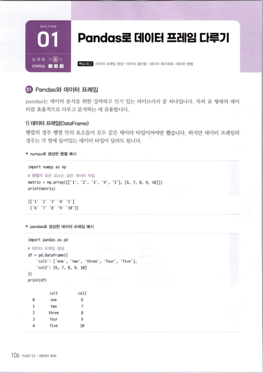
# SECTION 01
# Pandas로 데이터 프레임 다루기
난이 도 （풀) :.

반복학습 l.. ∥． ln 핵심 태그 데이터 프레임 생성 · 데이터 필터링 · 데이터 재구조화 · 데이터 병합 .Pandas와 데이터 프레임 pandas는 데이터 분석을 위한 강력하고 인기 있는 라이브러리 중 하나입니다 . 특히 표 형태의 데이 터를 효율적으로 다루고 분석하는 데 유용합니다． 1) 데이터 프레임（DataFrame) 행렬의 경우 행렬 안의 요소들이 모두 같은 데이터 타입이어야만 했습니다 . 하지만 데이터 프레임의 경우는 각 열에 들어있는 데이터 타입이 달라도 됩니다． V numpy로 생성한 행렬 예시

```python
import numpy as np
# 행렬의 모든 요소는 같은 데이터 타입
matrix = np.array([['l ', '2', '3', '4', '5'] , [6, 7, 8, 9, 10]]) 
print(matrix)
```
[['1 "2 "3 "4 "5 '] [6 7 8 9 10'] ] V pandas로 생성한 데이터 프레임 예시

```python
import pandas as pd
# 데이터 프레임 생성
df = pd.DataFrame({ 
'colj' : ['one', 'two', 'three', 'four ', 'five'] ,
'c012 ' : [6, 7, 8, 9, 10] 
}) 
print(df)
```
coti col.2 0 one 6 1 two 7 2 three 8 3 four 9 4 five 10 ㅍ）8 PART 02 . 데이터 처리

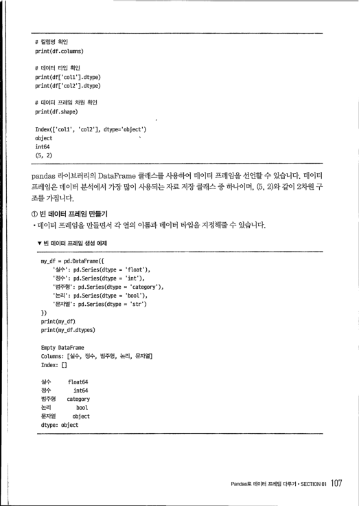
```python
# 칼럼명 확인 
print(df.columns)
# 데이터 타입 확인 
print(df{ ' coU.' I. dtype) 
print(df[ ' co12'] . dtype)
# 데이터 프레임 차원 확인 
print(df.shape)
```
Index(['coll', 'colT], dtype='object') object int64 (5, 2) pandas 라이브러리의 DataFrame 클래스를 사용하여 데이터 프레임을 선언할 수 있습니다 . 데이터 프레임은데이터 분적에서 가장많이 사용되는자료 저장클래스중 하나이며 , (5, 2）와같이 2차원 구 조를 가집니다． ① 빈 데이터 프레임 만들기

- 데이터 프레임을 만들면서 각 열의 이름과 데이터 타입을 지정해줄 수 있습니다．
▼ 빈 데이터 프레임 생성 예제

```python
my_df = pd.'DataFranie({
```
' 실수 ' : pd.Series(dtype = 'float'), ' 정수 ': pd.Series(dtype = 'int'), ' 범주형': pd.Series(dtype = 'category'), 'ME!': pd.Series(dtype = 'booL'), ' 문자열 ' : pd . Series (dtype = 'str' ) }) print (my_df) print(niy_df..dtypes) Empty DataFrame Columns: 〔실수， 정수， 범주형， 논리， 문자열］ Index: l] f1oat64 int64 형 수 수 주 실 정 범 category 논리 bool 문자열 object dtype: object Pandas로데이터프레임다루기．SECTION 01 107

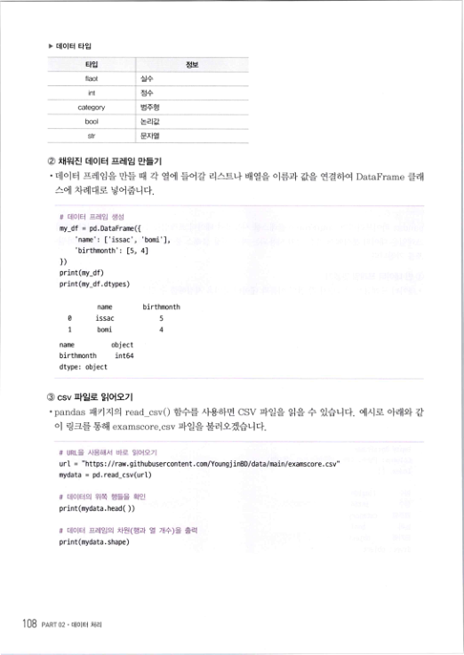
' 데이터 타입 타입 정보 tlaot 살수 ft 장수 category 범주형 bool 논리값 str 문자열 ② 채워진 데이터 프레임 만들기

- 데이터 프레임을 만들 때 각 열에 들어갈 리스트나 배열을 이름과 값을 연결하여 DataFrame 클래
스에 차례대로 넣어줍니다．

```python
# 데이터 프레임 생성
my_df = pd.DataFrame({ 
' name' : ['issac', 'bomi'] , 
'birthmonth ' : [5, 4]
print(my_df) 
print(my_df. dtypes)
```
name birthmonth 0 issac 5 1 bomi 4 name object birthmonth int64 dtype: object ③csv 파일로 읽어오기

- pandas 패키지의 read_csv() 함수를 사용하면 csv 파일을 읽을 수 있습니다 . 예시로 아래와 같
이 링크를 통해 examscore. csv 파일을 불러오겠습니다．

```python
# 〔〕치－을 사용해서 바로 읽어오기 
unl = "https://raw.githubusercontent.com/YoungjinBD/data/main/examscore.csv"
mydata = pd.read_csv(url)
# 데이터의 위쪽 행들을 확인 
print(mydata.head( ))
# 데이터 프레임의 차원（행과 열 개수）을 출력 
print(mydata .shape)
```
108 PART02 . 데이터 처리

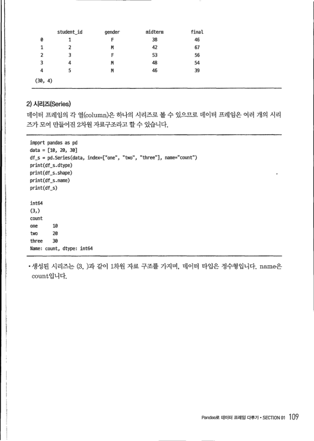
student_id gender midterm final.

0 1 F 38 46 1 2 M 42 67 2 3 F 53 56 3 4 M 48 54 4 5 N 46 39 (30, 4) 2) 시리즈（series) 데이터 프레임의 각 열（column）은 하나의 시리즈로 볼 수 있으므로 데이터 프레임은 여러 개의 시리 즈가 모여 만들어진 2차원 자료구조라고 할 수 있습니다．

```python
import pandas as pd 
data = [10, 20, 30] 
df_s = pd.Series(data, index=["one', "two", "three"], name="count ') 
print(df_s. dtype) 
print(df_s.shape) 
print(df_s.name) 
print(df_s)
```
1nt64 (3,) C이」nt one 10 two 20 three 30 Name: count, dtype: int64

- 생성된 시리즈는 （台 , ）과 같이 1차원 자료 구조를 가지며 , 데이터 타입은 정수형입니다 . name은
count입니다． Pandas로 데이터 프러I임 다루기 .SECTiON 01 ㅠ）9 J

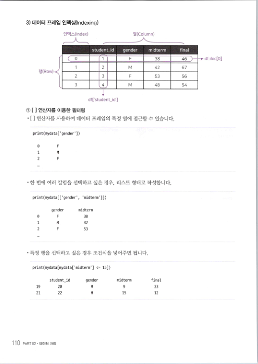
3) 데이터 프레임 인덱싱ㅇndexing)

## 인덱스.ndex) 
,－ㅅ－ 열（C이urn n) midterm fin히 studentjd gender (  0 g, F df.iloc[0] 46 )-38 1 z M 42 67 2 F 53 56 3 ｀스／ M 48 54 df['student_id'] ① [ ] 연산자를 이용한 필터링

- [ ] 연산자를 사용하여 데이터 프레임의 특정 열에 접근할 수 있습니다．
```python
print(mydata[ ' gender' ])
```
0 F 1 M 2 F

- 한 번에 여러 칼럼을 선택하고 싶은 경우 , 리스트 형태로 작성합니다．
```python
print(mydata[[ 'gender ', ' midterm ' 1])
```
gender midterm 0 F 38 1 M 42 2 F 53

- 특정 행을 선택하고 싶은 경우 조건식을 넣어주면 됩니다．
```python
print(mydata[mydata[ ' midterm '] <= 15])
```
student_id gender midterm final 19 20 M 9 33 21 22 M 15 12 110 PART02 . 데이터 처리

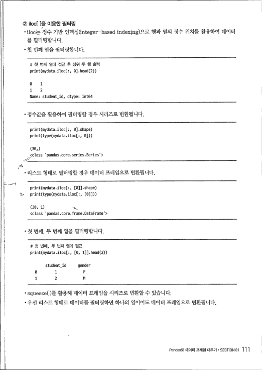
②iloc[ 〕을 이용한 필터링

- iloc는 정수 기반 인덱싱（integer-based indexing）으로 행과 열의 정수 위치를 활용하여 데이터
를 필터링합니다．

- 첫 번째 열을 필터링합니다．
```python
# 첫 번째 열에 접근 후 상위 두 행 출력 
print(mydata.iloc[:, 0] .head(2))
```
0 1 1 2 Name: student_id, dtype: 1nt64

- 정수값을 활용하여 필터링할 경우 시리즈로 변환됩니다．
```python
print(mydata.iLoc[:, 0] .shape) 
print(type(rnydata.iLoc[:, 0]))
```
(30,) , , , 鷺class 'pandas.core.series.Series 5 '．낙논

- 리스트 형태로 필터링할 경우 데이터 프레임으로 변환됩니다．
```python
print(mydata.iLoc[:, [0]] .shape)
驪， 
print(type(mydata.iloc[:, [0]]))
```
(30, 1) ,．」， <class ' pandas. core.frame.DataFrame'>

- 첫 번째 , 두 번째 열을 필터링합니다．
```python
# 첫 번째， 두 번째 열에 접근 
print(mydata.iloc[:, [0, 1]] .head(2))
```
student_id gender 0 1 F 1 2 M

- squeeze( ）를 활용해 데이터 프레임을 시리즈로 변환할 수 있습니다．
- 우선 리스트 형태로 데이터를 필터링하면 하나의 열이어도 데이터 프레임으로 변환됩니다．
Pandas로데이터프레임 다루기 .SECTION이 "

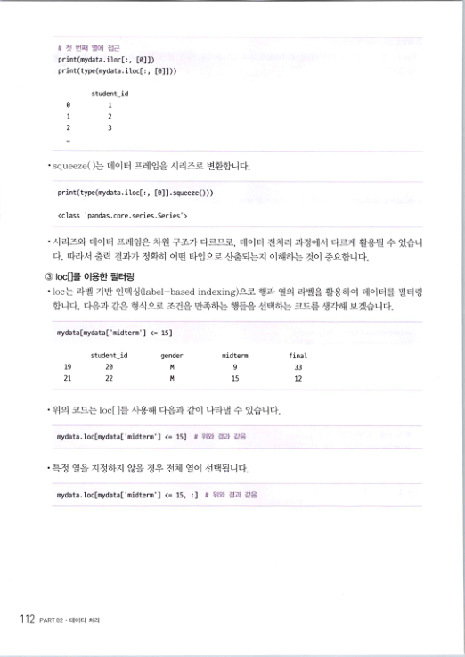
```python
# 첫 번째 열에 접근 
print(mydata.iloc[:, [0]]) 
print(type(mydata.iloc[:, [0]]))
```
student Id 0 1 1 2 2 3

- squeeze( ）는 데이터 프레임을 시리즈로 변환합니다．
```python
print(type(mydata.iloc[:, [@]].squeezeQ))
```
<cl.ass ' pandas. core. series. Series '>

- 시리즈와 데이터 프레임은 차원 구조가 다르므로 , 데이터 전처리 과정에서 다르게 활용될 수 있습니 
다 . 따라서 출력 결과가 정확히 어떤 타입으로 산출되는지 이해하는 것이 중요합니다． @Ioc[］를 이용한 필터링

- bOc는 라벨 기반 인덱싱（label-based indexing）으로 행과 열의 라벨을 활용하여 데이터를 필터링
합니다 . 다음과 같은 형식으로 조건을 만족하는 행들을 선택하는 코드를 생각해 보겠습니다． mydata[mydata[ 'midterm '] <= 15] student_id gender midterm final 19 20 M 9 33 21 22 M 15 12

- 위의 코드는 b0cE ］를 사용해 다음과 같이 나타낼 수 있습니다．
mydata. loc[mydata[ midterm' ] <= 15] # 위와 결과 같음

- 특정 열을 지정하지 않을 경우 전쳬 열이 선택됩니다．
mydata.loc[mydata[ 'midterm' ] <= 15, :] # 위와 결과 같음 112 PART02 . 데이터 처리

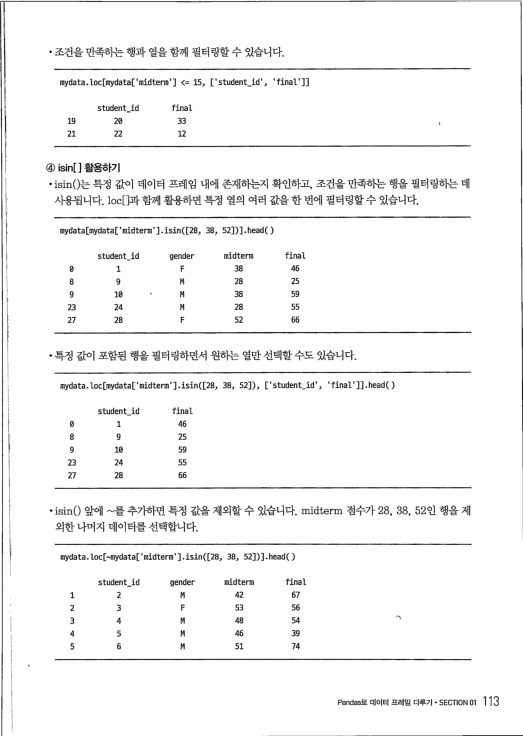
- 조건을 만족하는 행과 열을 함께 필터링할 수 있습니다．
mydata.loc[mydata[ 'midterm'] <= 15, ['student_id', 'final'] ] student id final.

19 20 33 21 22 12 ④ isinf ] 활용하기 'isin(）는 특정 값이 데이터 프레암 내에 존재하는지 확인하고 , 조건을 만족하는 행을 필터링하는 데 사용됩니다 . bOcE〕과 함께 활용하면 특정 열의 여러 값을 한 번에 필터링할 수 있습니다． mydata[mydata[ 'midterm'] .isin([ 28, 38, 52])].head() student_id gender midterm final.

0 1 F 38 46 8 9 M 28 25 9 10 M 38 59 23 24 M 28 55 27 28 F 52 66

- 특정 값이 포함된 행을 필터링하면서 원하는 열만 선택할 수도 있습니다．
mydata.loc[mydata['midterm'] .isin([28, 38, 52]), ['student_id', 'final'] ],head() student id final 0 1 46 8 9 25 9 10 59 23 24 55 27 28 66

- isin() 앞에 ∼를 추가하면 특정 값을 제외할 수 있습니다 . midterm 점수가 28, 38, 52인 행을 제
외한 나머지 데이터를 선택합니다． mydata,Locf-mydata[ 'midterm'] .isin([28, 38, 52])].head() student_id gender midterm final 1 2 M 42 67 2 3 F 53 56 3 4 M 48 54 어 4 5 M 46 39 5 6 M 51 74 Pandas로데이터프레임다루기．SECTION 01 113


3) . 완전한 표본 체크하기 데이터 프레임에 다음과 같이 빈 칸이 삽입되어 있다고 생각해 보겠습니다．

```python
import pandas as pd 
import numpy as np
# 예제 데이터 프레임 생성
mydata = pd.DataFrame({
```
' student_id': [1, 2, 3, 4, 5], ' gender ': ['F', ' M ', ' F', ' M ', 'M'] , 'midterm': [38, 42, 53, 48, 46], 'final': [46, 67, 56, 54, 39] })

```python
# 일부 데이터를 NA로 설정
```
mydata.iloc[0, 1] = np.nan

```python
mydata.iloc[4, 0] = np.nan 
print(mydata .head() )
```
student_id gender midterm final 0 1.0 NaN 38 46 1 2.0 M 42 67 2 3.0 F 53 56 3 4.0 M 48 54 4 NaN M 46 39

- 먼저 is.na() 함수를 사용하면 결측치가 있는 부분을 열별로 쳬크할 수 있습니다．
```python
print("gender 열의 빈칸 개수＝ ", mydata{ 'gender'] .isna( ).sumO) 
print("student_id 열의 빈칸 개수： ", mydata['student_id'] .isna( ).sumO)
```
gender 열의 빈칸 개수： 1 student id 열의 빈칸 개수： 1

- 만약 빈 칸을 포함하지 않는 완전한행을 가진 데이터를 얻고자 하면 dropna() 메서드를 사용합니다．
- dropna() 메서드는 모든 열이 꽉 채워져 있는 완전한 행들만을 반환합니다．
```python
complete_row = mydata.dropna() 
print(" 완전한 행의 수： ", len (complete_row)) 
print(complete_row)
```
완전한 행의 수： 3 student_id gender midterm final 1 2.0 M 42 67 2 3.0 F 53 56 3 4.0 M 48 54 114 PART02 · 데이터 처리

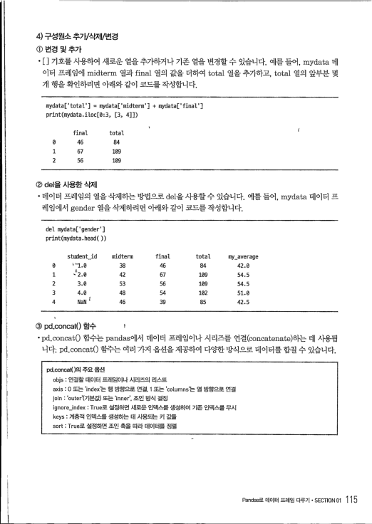
4) 구성원소 추가／삭저vi변경 ① 변경 및 추가

- 〔〕 기호를 사용하여 새로운 열을 추가하거나 기존 열을 변경할 수 있습니다 . 예를 들어 , mydata 데 
이터 프레임에 midterm 열과 final 열의 값을 더하여 total 열을 추가하고 , total 열의 앞부분 몇 개 행을 확인하려면 아래와 같이 코드를 작성합니다．

```python
mydata[ 'tatal '] = mydata[ 'niidterm '] + mydata['final '] 
print(mydata.iloc[0:3, [3, 4]])
```
r final total 0 46 84 1 67 109 2 56 109 ②del을 사용한 삭제

- 데이터 프레임의 열을삭제하는 방법으로 del을 사용할 수 있습니다 . 예를 들어 , mydata 데이터 프
레임에서 gender 열을 삭제하려면 아래와 같이 코드를 작성합니다．

```python
del mydata[ ' gender '] 
print(mydata .head() )
```
student_id midterm final total my_average 0 긷 1.0 38 46 84 42.0 1 구 2.0 42 67 109 54.5 2 3.0 53 56 109 54.5 3 4.0 48 54 102 51.0 4 NaN r 46 39 85 42.5 ③ pd.concat() 함수 }

- pd.concat() 함수는 pandas에서 데이터 프레임이나 시리즈를 연결（concatenate）하는 데 사용됩
니다·. pd.concat() 함수는 여러 가지 옵션을 제공하여 다양한 방식으로 데이터를 합칠 수 있습니다． pd.concat(）의 주요 옵션 objs : 연결할 데이터 프레임이나 시리즈의 리스트 axis : 0 또는 ' index'는 행 방향으로 연결 . 1 또는 ' columns'는 열 방향으로 연결 join : ' outer'（기본값） 또는 ' inner ' , 조인 방식 결정 ignore_index : True로 설정하먼 새로운 인덱스를 생성하여 기존 인덱스를 무시 keys : 계층적 인덱스를 생성하는 데 사용되는 키 값들 sort : True로 설정하면 조인 축을 따라 데이터를 정렬 Pandas로데이터프레임다루기· SECTION 01 115

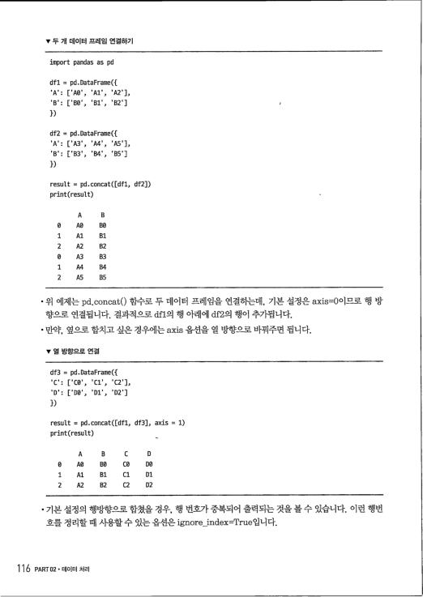
▼ 두 개 데이터 프레임 연결하기

```python
import pandas as pd
```
df 1 = pd.DataFrame({ 'A': ['AO', 'Al', 'A2'J, 'B': ['BO', 'Bl', 'B2'] }) df2 = pd.DataFrame({ 'A': ['A3', 'A4', ' A5'l, 'B': ['B3', 'B4.', 'B5'] })

```python
result = pd.concat([dfl, df2]) 
print(result)
```
A B 0 AO B0 1 Al Bi 2 A2 B2 0 A3 B3 1 A4 04 2 A5 B5

- 위 예제는 pd. concat() 함수로 두 데이터 프레임을 연결하는데 , 기본 설정은 axis=0이므로 행 방
향으로 연결됩니다 . 결과적으로 dfl의 행 아래에 df2의 행이 추가됩니다．

- 만약 , 옆으로 합치고 싶은 경우에는 axis 옵션을 열 방향으로 바꿔주면 됩니다．
▼ 열 방향으로 연결

```python
df3 = pd.DataFrame({
```
'C': ['CO', 'Cl', 'C2'J, 'D': ['DO', 'Dl', 'D2'] })

```python
result = pd.concat([dfl, df3], axis = 1) 
print(result)
```
A B C D 0 AB BO CO D0 1 Al Bl Cl Dl 2 A2 B2 C2 D2

- 기본 설정의 행방향으로 합쳤을 경우 , 행 번호가 중복되어 출력되는 것을 볼 수 있습니다 . 이런 행번
호를 정리할 때 사용할수 있는 옵션은 ignore -index=True입니다． 116 PART02 · 데이터 처리

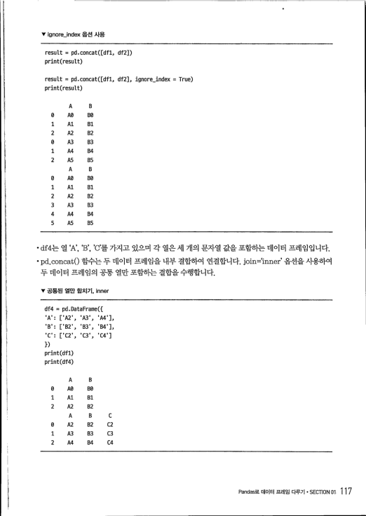
V ignore Jndex 옵션 사용

```python
result = pd.concat([df 1, df2]) 
print(result)
result = pd.concat([df 1, df2], ignore_index = True) 
print(result)
```
A B 0 A0 B0 1 Al Bl 2 A2 B2 0 A3 B3 1 A4 B4 2 AS B5 A B 0 AO B0 1 Al Bi 2 A2 B2 3 A3 B3 4 A4 B4 5 A5 B5

- df4는 열 ' A ' , ' B ' , ' c'를가지고 있으며 각 열은세 개의 문자열 값을포함하는 데이터 프레임입니다．
- pd.concat() 함수는 두 데이터 프레임을 내부 결합하여 연결합니다 . join='inner ' 옵션을 사용하여 
두 데이터 프레임의 공통 열만 포함하는 결합을 수행합니다． ▼ 공통된 열만 합치기 , inner

```python
df4 = pd.DataFrame({
```
'A': ['A2', ' A3', 'A4'1, 'B': ['B2', 'B3', 'B4'J,

```python
'C': f 'C2', ' C3', 'C4'] 
}) 
print(dfl) 
print(df4)
```
A B 0 A0 00 1 Al Bl 2 A2 B2 A B C 0 A2 B2 C2 1 A3 B3 C3 2 A4 B4 C4 Pandas로데이터프레임다루기· SECTION oi 117

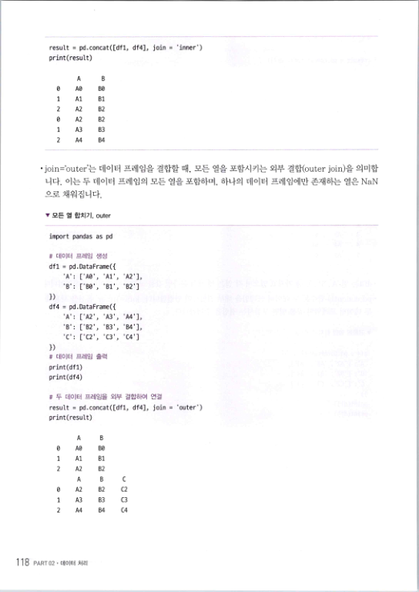
```python
result = pd.concat([dfl, df4], join = ' inner') 
print(result)
```
A B B AB B0 1 Al Bi 2 A2 B2 B A2 B2 1 A3 B3 2 A4 B4

- join='outer'는 데이터 프레임을 결합할 때 , 모든 열을 포함시키는 외부 결합（outer join）을 의미합
니다 . 이는 두 데이터 프레임의 모든 열을 포함하며 , 하나의 데이터 프레임에만 존재하는 열은 NaN 으로 채워집니다． ▼ 모든 열 합치기 , outer

```python
import pandas as pd
# 데이터 프레임 생성 
dfl = pd.DataFrame({
```
'A ' : [ AB , Al , A2 J, 'B': [BB, Bi, B2J }) df4 = pd.DataFrame({ 'A ' : [A2, A3, A4], 'B ' : [B2, B3, B4],

```python
'C ' : [C2, 
C3, C4J 
}) 
# 데이터 프레임 출력 
print(df 1) 
print(df4)
# 두 데이터 프레임을 외부 결합하여 연결
result = pd.concat([dfl, df4], join = 'outer ') 
print(result)
```
A B B AB BB 1 Al Bl 2 A2 B2 A B C B A2 B2 C2 1 A3 B3 C3 2 A4 B4 C4 118 PART02 · 데이터 처리


＊盼 A B C 0 AO B0 NaN 1 Al Bi NaN 2 A2 B2 NaN 0 A2 B2 C2 1 A3 B3 C3 2 A4 B4 C4

- 위의 결과데이터 프레임에는df 1과df4의 모든 열인_ps_, , 'B', 'J'가포함되어 있습니다 . join='outer'
옵션을 사용하였고 열 ' C'는 df 1에서 존재하지 않기 때문에 NaN 값으로 채워졌습니단． V keys 옵션 사용

```python
print(dfl) 
print(df2)
```
A B 0 AB BB 1 Al Bi 軫·驪 ' 欠 2 A2 B2 A B 0 A3 B3 1 A4 B4 2 A5 B5

- df 1과df 2는같은칼럼 이름 'A', 'B'를가지고 있는 데이터 프레임입니다 . 이것들을합칠 때 각행이
어느 데이터 프레임에서 왔는지 기록하고 싶은 경우 keys 옵션을 사용하면 됩니다．

```python
result = pd.concat([dfl, df2], keys = [ 'key1 ', 'key2 '] ) 
print(resul.t)
```
A B keyl 0 A0 B0 1 Al B1 2 A2 B2 key2 0 A3 B3 1 A4 B4 2 A5 B5

- keys 옵션을 사용하면 , 연결된 데이터 프레임의 원본 출처를 식별하는 멀티 인덱스가 생성됩니다．
멀티 인덱스를 통해 연결된 데이터 프레임의 각 행이 원본 데이터 프레임의 어느 부분에서 왔는지를 쉽게 식별할 수 있습니다． Pandas로데이터프레임다루기｀SECTION OT T'T?" "

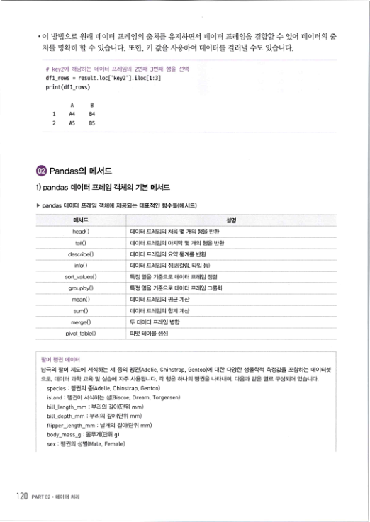
- 이 방법으로 원래 데이터 프레임의 출처를 유지하면서 데이터 프레임을 결합할 수 있어 데이터의 출
처를 명확히 할 수 있습니다 . 또한 , 키 값을 사용하여 데이터를 걸러낼 수도 있습니다．

```python
# key2에 해당하는 데이터 프레임의 2번째 3번째 행을 선택 
dfl_rows = result.thc[ 'key2 '] .iloc[1:3] 
print(dfl_rows)
```
A B 1 A4 B4 2 A5 B5

### e Pandas의 메서드
1) pandas 데이터 프레임 객체의 기본 메서드 》pandas 데이터 프레임 객체에 제공되는 대표적인 함수들（메서드） 메서드 설명 head() 데이터 프레임의 처음 몇 개의 행을 반환 tail() 데이터 프레임의 마지막 몇 개의 행을 반환 describe() 데이터 프레임의 요약 통계를 반환 info() 데이터 프레임의 정보（컬럼 . 타입 등） sort_values() 특정 열을 기준으로 데이터 프레임 정렬 groupby() 특정 열을 기준으로 데이터 프레임 그룹화 mean() 데이터 프레임의 평균 계산 sum() 데이터 프레임의 합계 계산 merge() 두 데이터 프레임 병합 pivot_table() 피벗 테이블 생성 팔머 펭귄 데이터 남극의 팔머 제도에 서식하는 세 종의 펭귄（Adelie. Chinstrap. Gentoo）에 대한 다양한 생물학적 측정값을 포함하는 데이터셋 으로 , 데이터 과학 교육 및 실습에 자주 사용됩니다 . 각 행은 하나의 펭귄을 나타내며 , 다음과 같은 열로 구성되어 있습니다． species : 펭귄의 종《Adelie. Chinstrap. Gentao) island : 펭귄이 서식하는 섬（Biscoe. Dream. Torgersen) bill_Length_mm : 부리의 길이（단위 mm) bill_depth_mm : 부리의 깊이（단위 mm) flipper_length_mm : 날개의 길이（단위 mm) body_mass_g : 몸무게（단위 9) sex : 펭귄의 성별洶ale, Female) 120 PART02. 데이터 처리

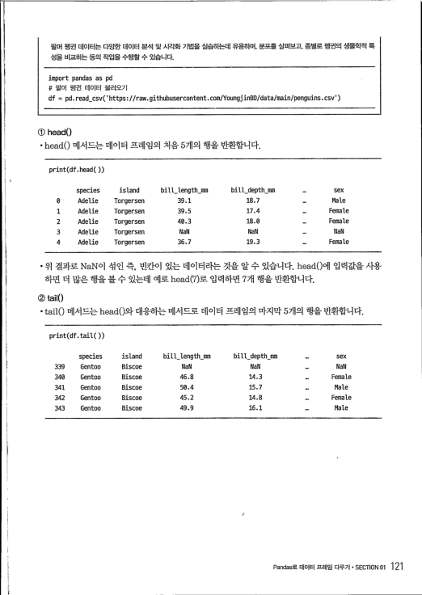
팔머 펭귄 데이터는 다양한 데이터 분석 및 시각화 기법을 실습하는데 듀용하며 . 분포를 살펴보고， 종별로 펭귄의 생물학적 특 성을 비교하는 등의 작업을 수행할 수 있습니다．

```python
import pandas as pd 
# 팔머 펭귄 데이터 불러오기
df = pd. read_csv( ' https: // raw. githubusercontent.com/YoungjinBD/data/main/penguins . csv ')
```
.:head()

- head() 메서드는 데이터 프레임의 처음 5개의 행을 반환합니다．
```python
print(df.head())
```
species island bill_length_mm bill_depth_mm sex 0 Adelie Torgersen 39.1 18.7 Male 1 Adelie Torgersen 39.5 17.4 Female 2 Adelle Torgersen 40.3 18.0 Female 3 Adelie Torgersen NaN NaN ." NaN 4 Adelie Torgersen 36.7 19.3 Female

- 위 결과로 NaN이 섞인 즉 , 빈칸이 있는 데이터라는 것을 알 수 있습니다 . head(）에 입력값을 사용
하면 더 많은 행을 볼 수 있는데 예로 head(7）로 입력하면 7개 행을 반환합니다． ②tail()

- tail() 메서드는 head(）와 대응하는 메서드로 데이터 프레임의 마지막 5개의 행을 반환합니다．
```python
print(df.tailO)
```
species island bill_length_mm bill_depth_mm sex 339 Gentoo Biscoe NaN NaN NaN 340 Gentoo Biscoe 46.8 14.3 Female 341 Gentoo Biscoe 50.4 15.7 Male 342 Gentoo Biscoe 45.2 14.8 Female 343 Gentoo Biscoe 49.9 16.1 Male Pandas로데이터프레임다루기．SECTION이 121

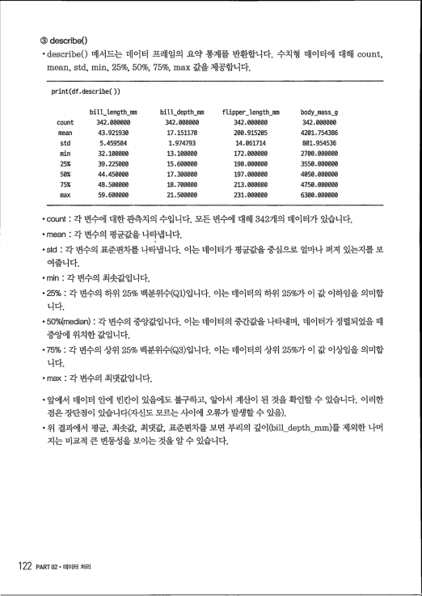
③describe() 'describe() 메서드는 데이터 프레임의 요약 통계를 반환합니다 . 수치형 데이터에 대해 count, mean, std, mmI1, 25%, 50%, 75%, max값을제공합니다．

```python
print(df.describe() )
```
bill_1.ength_mni bill..depthjm flipper_length_nim body_mass_g 342.000000 count 342.000000 43.921930 342 .000000 17.151170 1. 974793 13.100000 15.600000 17.300000 18. 700000 21. 500000 342.000000 mean std

200. 915205 14.061714
4201.754386 5 .459584 801.954536

2700. 000000
mmn 32.100000 39.225000

172. 000000
190. 000000
3550.000000 25% 50% 44.450000 48.500000 59.600000 197.000000 4050.000000 75% 213.000000 4750.000000 max

231. 000000
6300.0000開

- count : 각 변수에 대한 관측치의 수입니다 . 모든 변수에 대해 342개의 데이터가 있습니다．
- mean : 각 변수의 평균값을 나타냅니다．
- std : 각 변수의 표준편차를 나타냅니다 . 이는 데이터가 평균값을 중심으로 얼마나 퍼져 있는지를 보
여줍니다．

- m1n : 각 변수의 최솟값입니다．
- 25% : 각 변수의 하위 25% 백분위수（Q1）입니다 . 이는 데이터의 하위 25％가 이 값 이하임을 의미합
니다．

- 50%(median) : 각 변수의 중앙값입니다 . 이는 데이터의 중간값을 나타내며 , 데이터가 정렬되었을 때
중앙에 위치한 값입니다 .

- 75% : 각 변수의 상위 25% 백분위수（匈3）입니다 . 이는 데이터의 상위 25％가 이 값 이상임을 의미합
니다．

- max : 각 변수의 최댓값입니다．
- 앞에서 데이터 안에 빈칸이 있음에도 불구하고 , 알아서 계산이 된 것을 확인할 수 있습니다 . 이러한
점은 장단점이 있습니다（자신도 모르는 사이에 오류가 발생할 수 있음）.

- 위 결과에서 평균 , 최솟값 , 최댓값 , 표준편차를 보면 부리의 깊이（bill_depth_mm）를 제외한 나머
지는 비교적 큰 변동성을 보이는 것을 알 수 있습니다． 122 PART02. 데이터 처리

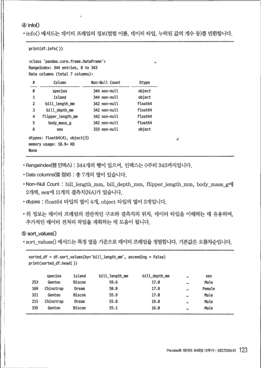
④info()

- info() 메서드는 데이터 프레임의 정보（컬럼 이름 , 데이터 타입 , 누락된 값의 개수 등）를 반환합니다．
```python
print(df.infoO)
```
<class 'pandas. core. frame.DataFrame'> Rangelndex: 344 entries, 0 to 343 Data columns (total 7 columns):

# 
Column Non-Null Count Dtype 0 species 344 non-null object 1 island 344 non-null object 2 bill_length_mm 342 non-null f1oat64 3 bill_depth_rn 342 non-null f1oat64 4 flipper_length_rn 342 non-null f1oat64 5 body_mass_g 342 non-null f1oat64 6 sex 333 non-null object dtypes: f10at64(4), object(3) memory usage: 18.9+ KB None

- Rangeindex（행 인덱스） : 344개의 행이 있으며 , 인덱스는 0부터 343까지입니다．
- Data columns（열 정보） : 총 7개의 열이 있습니다．
- Non-Null Count : bill_length_mm, bill_depth_mm, flipper_length_mm, body_mass_g에
2개씩 , sex에 II개의 결측치（NA）가 있습니다．

- dtypes : float64 타입의 열이 4개 , object 타입의 열이 3개입니다 .
- 위 정보는 데이터 프레임의 전반적인 구조와 결측치의 위치 , 데이터 타입을 이해하는 데 유용하며，
추가적인 데이터 전처리 작업을 계획하는 데 도움이 됩니다． ⑤sorLvalues()

- sort_values() 메서드는특정 열을 기준으로 데이터 프레임을 정렬함니다 . 기본값은오름차순입니다．
```python
sorted_df = df.sort_values(by='bill_length_mm', ascending = False) 
print(sorted_df.head())
```
species island bill_length_mm bill_depth_mm sex 253 Gentoo Biscoe 59.6 17.0 Male 169 Chinstrap Dream 58.0 17.8 Female 321 Gentoo Biscoe 55.9 17.0 ...

Male 215 Chinstrap Dream 55.8 19.8 Male 335 6entoo 'Biscoe 55.1 16.0 Male Pandas로데이터프레임 다루기 'SECTION 01 i '23

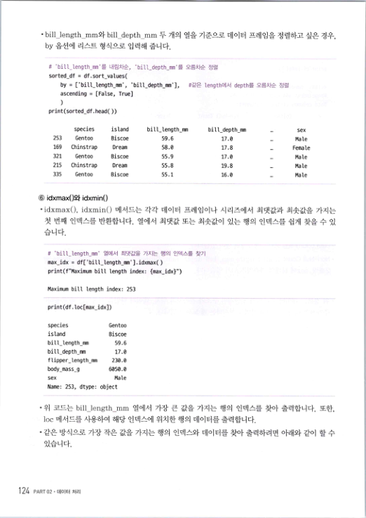
' bill_length_mm와 bill_depth mm 두 개의 열을 기준으로 데이터 프레임을 정렬하고 싶은 경우， by 옵션에 리스트 형식으로 입력해 줍니다．

```python
# ' bill_length_rn ' 를 내림차순， ' biU_depth_mm ' 를 오름차순 정렬 
sorted_df = df.sort_values(
by = [ 'bill_length_rrvn ', ' bill_depth_rn '] , 
ascending = [False, True]
```
＃같은 length에서 depth를 오름차순 정렬

```python
print(sorted_df.head( ))
```
species island bill_length_mm bill_depth_mm sex 253 Gentoo Biscoe 59.6 17.0 Male 169 Chinstrap Dream 58.0 17.8 Female 321 Gentoo Biscoe 55.9 17.0 Male 215 Chinstrap Dream 55.8 19.8 Male 335 Gentoo Biscoe 55.1 16.0 Male ⑥idxmax02F idxminO ' idxmaxO, idxmin() 메서드는 각각 데이터 프레임이나 시리즈에서 최댓값과 최솟값을 가지는 첫 번째 인덱스를 반환합니다 . 열에서 최댓값 또는 최솟값이 있는 행의 인덱스를 쉽게 찾을 수 있 습니다．

```python
# ' bill_length_mm ' 열에서 최댓값을 가지는 행의 인덱스를 찾기
max_idx = df{ 'bill_length_n뀀n'] .idxmax( ) 
print(f "Maximum bill length index: {max_idx}")
```
Maximum bill length index: 253

```python
print(df. loc[max_idx])
```
species Gentoo island Biscoe bill_length_mm 59.6 bill_depth_rn 17.0 flipper_length_mm 230.0 body_rnass_g 6050.0 sex Male Name: 253, dtype: object ' 위 코드는 bill_length mm 열에서 가장 큰 값을 가지는 행의 인덱스를 찾아 출력합니다 . 또한， bOc 메서드를 사용하여 해당 인덱스ㅇㄲ 위치한 행의 데이터를 출력합니다． ' 같은 방식으로 가장 작은 값을 가지는 행의 인덱스와 데이터를 칫아 출력하려면 아래와 같이 할 수 있습니다． 咫4 PART 02 . 데이터 처리

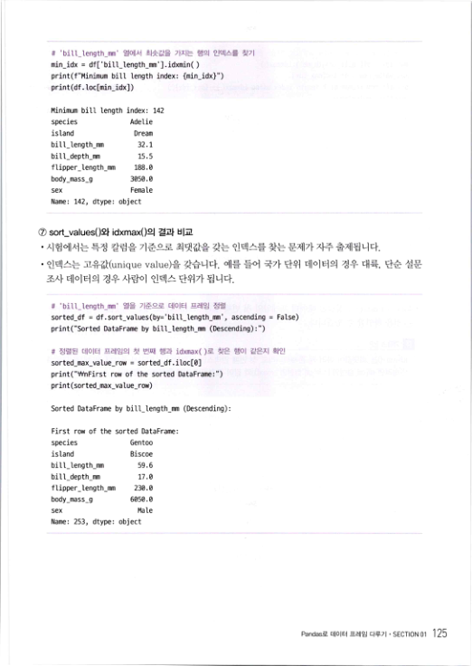
```python
# ' bill_length_mm' 열에서 최솟값을 가지는 행의 인덱스를 찾기
min_idx = df[ 'bill_length_nin'] .idxmin( ) 
print(f "Minimum bill length index: {rnin_idx} ') 
print(df. loc[min_idx])
```
Minimum bill length index: 142 species Adelie island Dream bill_length_rn 32.1 bill_depth_rn 15.5 flipper_length_rn 188.0 body_mass_g 3050 .0 sex Female Name: 142, dtype: object ⑦sort_values(）와 idxmax(）의 결과 비교

- 시험에서는 특정 칼럼을 기준으로 최댓값을 갖는 인덱스를 찾는 문제가 자주 출제됩니다．
- 인덱스는 고유값（unique value）을 갖습니다 . 예를 들어 국가 단위 데이터의 경우 대륙 , 단순 설문
조사 데이터의 경우 사람이 인덱스 단위가 됩니다．

```python
# ' bill_length_rn' 열을 기준으로 데이터 프레임 정렬
sorted_df = df.sort_values(by= 'bill_length_rn ', ascending = False) 
print('Sorted DataFrame by bill_length_mm (Descending): ")
# 정렬된 데이터 프레임의 첫 번째 행과 idxmax( ）로 찾은 행이 같은지 확인
sorted_max_value_row = sorted_df . iloc[0] 
print("WnFirst row of the sorted DataFrame: ") 
print(sorted_max_value_row)
```
Sorted DataFrame by bill_length_rn (Descending):

First row of the sorted DataFrame:

species Gentoo island Biscoe bill_length_rn 59.6 bill_depth_rn 17.0 flipper_length_rn 230.0 body_mass_g 6050.0 sex Male Name: 253, dtype: object Pandas로 데이터 프레임 다루기 · SECTION 01 125

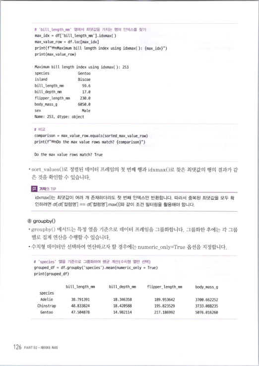
```python
# 'bill_length_mm ' 열에서 최댓값을 가지는 행의 인덱스를 찾기
max_idx = df['bill_length_mrn'] .idxmax( )
max_value_row = dfJoc[max_idx] 
print(f "WnMaximum bill length index using idxmax( ): {max_idx}") 
print(max_value_row)
```
Maximum bill length index using species Gentoo island Biscoe bill_length_mm 59.6 bill_depth_mm 17.0 flipper_length_mm 230.0 idxmax( ): 253 body_mass_g 6050.0 sex Male Name: 253, dtype: object

```python
# 비교
comparison = max_value_row. equals(sorted_max_value_row) 
print(f "WnDo the max value rows match? {comparison} ')
```
Do the max value rows match? True ' sort values(）로 정렬된 데이터 프레임의 첫 번째 행과 idxmax(）로 찾은 최댓값의 행의 결과가 같 은 것을 확인할 수 있습니다． .

기적의 지p idxmax(）는 최댓값이 여러 개 존재하더라도 첫 번째 인덱스만 반환합니다 . 따라서 중복된 최댓값을 모두 확 인하려면 df[df「컬럼명’] == 래［ ' 컬럼명〕 .maxO］와 같이 조건 필터링을 활용해야 합니다． ⑧groupby()

- groupby() 메서드는 특정 열을 기준으로 데이터 프레임을 그룹화합니다 . 그룹화한 후에는 각 그룹
별로 집계 연산을 수행할 수 있습니다．

- 수치형 데이터만 선택하여 연산하고자 할 경우에는 numeric only=True 옵션을 지정합니다．
```python
# 'species ' 열을 기준으로 그룹화하여 평균 계산（수치형 열만 선택）
grouped_df = df.groupby( ' species') .mean(numeric_only = True) 
print(grouped_df)
```
bill_length_mm bill_depth_mm flipper_length_mm body_mass_g species Adelie 38.791391 18.346358 189.953642 3700.662252 Chinstrap 48.833824 18.420588 195.823529 3733.088235 Gentoo 47.504878 14.982114 217.186992 5076.016260 咫6 PART 02 . 데이터 처리

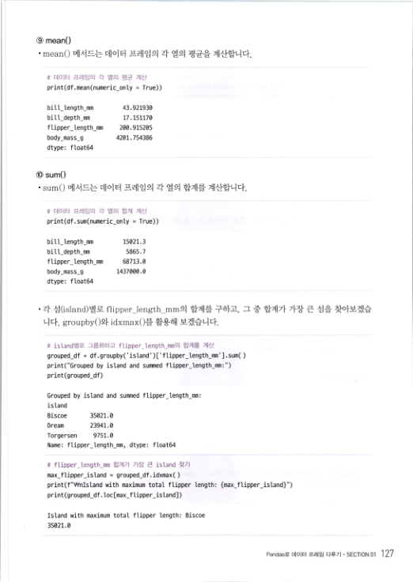
⑨mean()

- mean() 메서드는 데이터 프레임의 각 열의 평균을 계산합니다．
```python
# 데이터 프레임의 각 열의 펑균 계산 
print(df.mean(numeric_only = True))
```
bill_length_mm biU_depth_nmi flipper_length_nm 43.921930 17.151170 200.915205 4201.754386 body_mass_g dtype: f1oat64 ⑩sum()

- sum() 메서드는 데이터 프레임의 각 열의 합계를 계산합니다．
```python
# 데이터 프레임의 각 열의 합계 계산 
print(df.sum(numeric_only = True))
```
billjeng사i_mm bili_depth_mm flipper_length_rn 15021.3 5865.7 68713.0 1437000.0 body_mass_g dtype: f10at64

- 각 섬（island）별로 flipper_length_mm의 합계를 구하고 , 그 중 합계가 가장 큰 섬을 첫가보겠습
니다 . groupby(）와idxmax(）를활용해 보겠습니다．

```python
# island별로 그룹화하고 flipper_length_mm의 합계를 계산
grouped_df = df.groupby( 'island ' )[ 'flipper_length_rn '] .sum( ) 
print("Grouped by island and surned flipper_length_rn: ") 
print(grouped_df)
```
Grouped by island and summed flipper_length_rn:

island Biscoe 35021.0 Dream 23941.0 Torgersen 9751.0 Name: flipper_length_rn, dtype: f1oat64

```python
# flipper_length_mm 합계가 가장 큰 island 찾기
max_flipper_island = grouped_df.idxmax() 
print(f"Wnlsland with maximum total flipper length: {max_flipper_island} ') 
print(grouped_df. loc[max_flipper_island})
```
Island with maximum total flipper length: Biscoe 35021.0 Pandas로 데이터 프레임 다루기 . SECTION 01 127

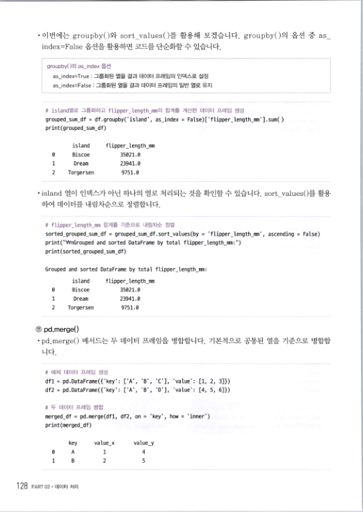
```python
· 이번에는 groupby(）와 sort values(）를 활용해 보겠습니다 . groupby(）의 옵션 중 as 
index=False 옵션을 활용하면 코드를 단순화할 수 있습니다．
```
groupby(）의 as_index 옵션

```python
「 
asjndex=True : 그룹화된 열을 결과 데이터 프레임의 인덱스로 설정
```
as I ndex=FaLse : 그룹화된 열을 결과 데이터 프레임의 일반 열로 유지

```python
# island별로 그룹화하고 fl ipper_length_mm의 합계를 계산한 데이터 프레임 생성
grouped_sum_df = df.groupby( 'island', as_index = False)['flipper_length_rn'] .sum() 
print(grouped_sum_df)
```
island flipper_length_rn 0 Biscoe 35021.0 1 Dream 23941.0 2 Torgersen 9751.0

- island 열이 인덱스가 아닌 하나의 열로 처리되는 것을 확인할 수 있습니다 . sort values(）를 활용
하여 데이터를 내림차순으로 정렬합니다．

```python
# flipper_length_mm 합계를 기준으로 내림차순 정렬
sorted_grouped_sum_df = grouped_sum_df.sort_values(by = ' flipper_length_mm ', ascending = False) 
print("WnGrouped and sorted DataFrame by total flipper_length_rn: ') 
print(sorted_grouped_sum_df)
```
Grouped and sorted DataFrame by total flipper_length_mm:

island flipper_length_rn 0 Biscoe 35021.0 1 Dream 23941.0 2 Torgersen 9751.0 @)pd.merge()

- pd.merge() 메서드는 두 데이터 프레임을 병합합니다 . 기본적으로 공통된 열을 기준으로 병합합
니다．

```python
# 예제 데이터 프레임 생성 
dfl = pd.DataFrame({ 'key ' : ['A', 'B' , 'C'] , ' value' : [1, 2, 3]}) 
df2 = pd.DataFrame({ 'key ' : ['A', 'B', '0'] , 'value' : [4, 5, 6]})
# 두 데이터 프레임 병합
merged_df = pd.merge(dfl, df2, on = 'key', how = 'inner') 
print(merged_df)
```
key value_x value_y 0 A 1 4 1 B 2 5 128 PART02 . 데이터 처리

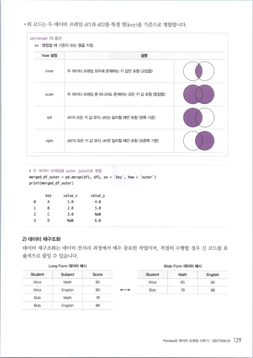
- 위 코드는 두 데이터 프레임 df 1과 df2를 특정 열（key）을 기준으로 병합합니다．
」 pd.merge( ）의 옵션 ; .『， : 병합할 때 기준이 되는 열을 지정 how 설정 설명 inner 두 데이터 프레임 모두《게 존재하는 키 값만 포함 （교집합） outer 두 데이터 프레임 중 하나라도 존재하는 모든 키 값 포함 （합집합） df 1의 모든 키 값 유지 . 뱌2는 일치할 때만 포함 （왼쪽 기준） 래2의 모든 키 값 유지 , df 1은 일치할 때만 포함 （오른쪽 기준）

```python
# 두 데이터 프레임을 outer join으로 병합
merged_df_outer = pd.merge(dfl, df2, on = 'key', how = 'outer') 
print(merged_df_outer)
```
key val.ue_x value_y 0 A 1.0 4.0 1 B 2.0 5.0 2 (= 3.0 NaN 3 D NaN 6.0 2) 데이터 재구조화 데이터 재구조화는 데이터 전처리 과정에서 매우 중요한 작업이며 , 적절히 수행할 경우 긴 코드를 효 율적으로 줄일 수 있습니다． Long Form 데이터 예시 Wide Fortㄲ 데이터 예시 Student Subject Score 毓Udent Math English

## Alice 
P85 90 Alice Ma巾 85 - Alice En뎨i삶1 90 Bob

- 
78 88 l Bob Math 78 Bob English 8B Pandas로 데이터 프레임 다루기 · SECTION 01 129

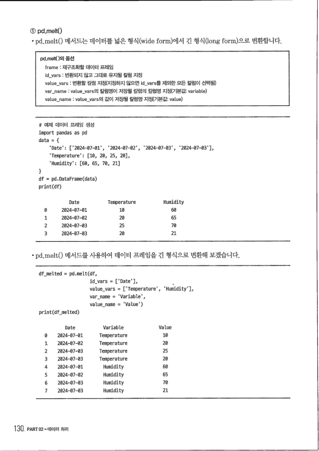
①pd.melt()

- pd.melt() 메서드는 데이터를 넓은 형식（wide form）에서 긴 형식（long form）으로 변환합니다．
pd.melt(）의 옵션 什ame : 재구조화할 데이터 프레임 id_vars : 변환되지 않고 그대로 유지될 칼럼 지정 value_vars : 변환할 칼럼 지정（지정하지 않으면 id_vars를 제외한 모든 칼럼이 선택됨） var_name : value_vars의 칼럼명이 저장될 칼럼의 칼럼명 지정（기본값variable) value_name : value_var＄의 값이 저장될 칼럼명 지정（기본玭 value)

```python
# 예제 데이터 프레임 생성
import pandas as pd 
data = { 
'Date' : ['2024-07-01', '2024-07-02', '2024-07-03', '2024-07-03'] ,
```
' Temperature': [10, 20, 25, 20], 'Humidity': [60, 65, 70, 21]

```python
df = pd.DataFrame(data) 
print(df)
```
Date Temperature Humidity 0 2024-07-01 10 60 1 2024-07-02 20 65 2 2024-07-03 25 70 3 2024-07-03 20 21

- pd.melt() 메서드를 사용하여 데이터 프레임을 긴 형식으로 변환해 보겠습니다．
```python
df_meLted = pd.melt(df, 
id_vars = ['Date'] , 
value_vars = ['Temperature', 'Humidity'] , 
var_name = 'Variable',
value_name = 'Value') 
print(df..melted)
```
Date Variable Value 0 2024-07-01 Temperature 10 1 2024-07-02 Temperature 20 2 2024-07-03 Temperature 25 3 2024-07-03 Temperature 20 4 2024-07-01 Humidity 60 5 2024-07-02 Humidity 65 6 2024-07-03 Humidity 70 7 2024-07-03 Humidity 21

130. PART02∼데이터 처리
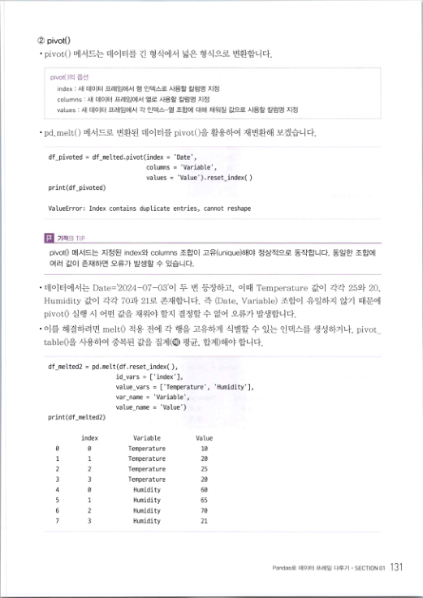
②pivot()

- pivot() 메서드는 데이터를 긴 형식에서 넓은 형식으로 변환합니다．
兩vot( ）의 옵션 index : 새 데이터 프레임에서 행 인덱스로 사용할 칼럼명 지정 columns : 새 데이터 프레임에서 열로 사용할 칼럼명 지정 values : 새 데이터 프레임에서 각 인덱스열 조합에 대해 채워질 값으로 사용할 칼럼명 지정

- pd.melt() 메서드로 변환된 데이터를 pivot(）을 활용하여 재변환해 보겠습니다．
```python
df_pivoted = df_melted.pivot(index = ' Date',
columns = 'Variable', 
values = 'Value').reset-index() 
print(df_pivoted)
```
ValueError: Index contains duplicate entries, cannot reshape

## r잽 기적의 지P
pivot() 메서드는 지정된 index와 columns 조합이 고유（unique）해야 정상적으로 동작합니다 . 동일한 조합에 여러 값이 존재하면 오류가 발생할 수 있습니다，

- 데이터에서는 Date='2024-07-03 ' 이 두 번 등장하고 , 이때 Temperature 값이 각각 25와 20, 
Humidity 값이 각각 70과 21로 존재합니다 . 즉 (Date, Variable) 조합이 유일하지 않기 때문에 pivotO 실행 시 어떤 값을 채워야 할지 결정할 수 없어 오류가 발생합니다．

- 이를 해결하려면 meltO 적용 전에 각 행을 고유하게 식별할 수 있는 인덱스를 생성하거나 , pivot_ 
tableO을 사용하여 중복된 값을 집계（.l 평균 , 합계）해야 합니다 .

```python
df_me1ted2 = pd.melt(df.reset_indexO, 
id_vars = ['index'], 
value_vars = ['Temperature', 
Humidity'], 
var_name = 'Variable ', 
value_name = 'Value') 
print(df_me1ted2)
```
index Variable Va'ue 0 0 Temperature 10 1 1 Temperature 20 2 2 Temperature 25 3 3 Temperature 20 4 0 Humidity 60 5 1 Humidity 65 6 2 Humidity 70 7 3 Humidity 21 Pandas로 데이터 프레임 다루기 . SECTION Dl 131

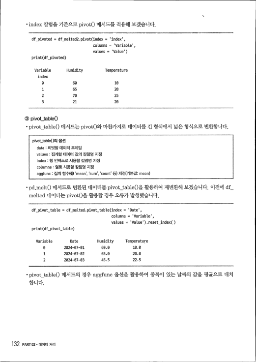
- index 칼럼을 기준으로 pivot() 메서드를 적용해 보겠습니다．
```python
df_pivoted = df_me1ted2.pivot(index = 'index',
columns = 'Variable',
values = 'Value') 
print(df_pivoted)
```
Variable Humidity Temperature index 0 50 10 1 65 20 2 70 25 3 21 20 ③pivot_table()

- pivot_table() 메서드는 pivot(）와 마찬가지로 데이터를 긴 형식에서 넓은 형식으로 변환합니다．
pivot_table(）의 옵션 data : 피벗할 데이터 프레임 values : 집계할데이터 값의 칼럼명 지정 index : 행 인덱스로 사용할 칼럼명 지정 columns : 열로 사용할 칼럼명 지정 aggfunc : 집계 함수（0 'mean'. 'sum'. 'count ' 등）지정（기본玭 mean)

- pd.melt() 메서드로 변환된 데이터를 pivot_table(）을 활용하여 재변환해 보겠습니다 . 이전에 df
melted 데이터는 pivot(）을 활용할 경우 오류가 발생했습니다．

```python
df_pivot_table = dfjnelted.pivot_table(index = 'Date',
columns = 'Variable', 
values = 'Value').reset-index() 
print(df_pivot_table)
```
Variable Date Humidity Temperature 0 2024-07-01 60.0 10.0 1 2024-07-02 65.0 20.0 2 2024-07-03 45.5 22.5

- pivot_table() 메서드의 경우 aggfunc 옵션을 활용하여 중복이 있는 날짜의 값을 평균으로 대치
합니다． 132 PARTD2. 데이터 처리

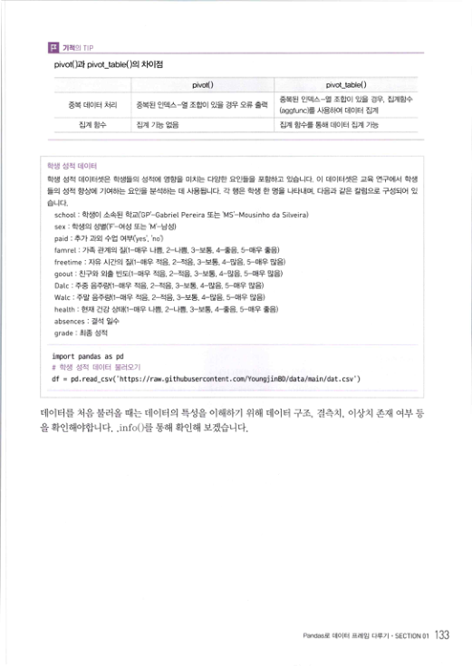
pivot(）과 pivot_table(）의 차이점 pivot_table() pivot() 중복된 인덱스－열 조합이 있을 경우 . 집계함수 중복된 인덱스－열 조합이 있을 경우 오류 출력 중복 데이터 처리 (aggfunc）를 사용하여 데이터 집계 집계 함수 집계 기능 없음 집계 함수를 통해 데이터 집계 가능 학생 성적 데이터 학생 성적 데이터셋은 학생들의 성적에 영향을 미치는 다양한 요인들을 포함하고 있습니다 . 이 데이터셋은 교육 연구에서 학생 들의 성적 향상에 기여하는 요인을 분석하는 데 사용됩니다 . 각 행은 학생 한 명을 나타내며 , 다음과 같은 칼럼으로 구성되어 있 습니다． schoot : 학생이 소속된 학교（'OP~-GabrieL Pereira 또는 ' MS'-Mousinho da Silveira) sex : 학생의 성별（'F'-0썸 또는 ' M－남성） paid : 추가 과외 수업 여부（'yes', ' no') famrel : 가족 관계의 질（1－매우 나쁨 . 2-I나쁨 . 3－보통 , 4－좋음 , 5 매우 좋음） freetime : 차유 시간의 질（1－매우 적음 . 2－적음 . 3－보통 . ㅏ 음 , 5－매우 많음） goout : 친구와 외출 빈도（1－매우 적음 , 2－적음 . 3－보통 , 4－많음， 5－매우 많음） Daic : 주중 음주량（1－매우 적음 , 2－적음 , 3－보통 . 4－많음 , 5－매우 많음） Walc : 주말 음주량《1－매우 적음 . 2－적음 , 3－보통 . 4－많음 . 5－매우 많음） health : 현재 건강 상태《1－매우 나쁨 . 2－나쁨 . 3－보통 . 4-鶴 .5－매우 좋음） absences : 결석 일수 grade : 최종 성적

```python
import pandas as pd
# 학생 성적 데이터 불러오기
df = pd.read_csv( 'https:!/raw.githubusercontent.com/YoungjinBD/data/main/dat.csv ')
```
데이터를 처음불러올 때는 데이터의 특정을 이해하기 위해 데이터 구조 , 결측치 , 이상치 존재 여부 등 을확인해야합니다 . .info(）를통해 확인해 보겠습니다． Pandas로 데이터 프레임 다루기 · SECTION01 133

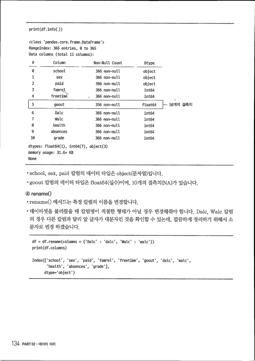
```python
print(df.infoO)
```
<class 'pandas. core. frame.DataFrame 5 Rangelndex: 366 entries, 0 to 365 Data columns (total 11 columns):

# 
Column Non-Null Count Dtype 0 school 366 non-null object 1 sex 366 non-null object

## 2 
paid 366 non-null object 3 famrel.. , 366 non-null int64 4 freetinie ' , 366 non-null int64 5 goout 356 non-null f1oat64 H10개의결측치 6 Daic 366 non-null int64 7 Walc 366 non-null 1nt64 8 health 366 non-null 1nt64 9 absences 366 non-null int64 10 grade 366 non-null 1nt64 dtypes: f10at64(1), 1nt64(7), object(3) memory usage: 31.6+ KB None

- school, sex, paid 칼럼의 데이터 타입은object（문자열）입니다．
- goout 칼럼의 데이터 타입은 f1oat64（실수）이며 , 10개의 결측치（NA）가 있습니다．
④rename()

- rename() 메서드는 특정 칼럼의 이름을 변경합니다．
- 데이터셋을 불러왔을 때 칼럼명이 적절한 형태가 아닐 경우 변경해줘야 합니다 . Daic, Waic 칼럼 
의 경우 다른 칼럼과 달리 앞 글자가 대문자인 것을 확인할 수 있는데 , 깔끔하게 정리하기 위해서 소 문자로 변경 하겠습니다．

```python
df = df.rename(columns = {'Dalc' : 'daic', 'Walc' : ' walc'}) 
print(df.columns)
```
Index([ 'school', 'sex', 'paid', 'famrel', 'freetime', ' goout', 'dalc', 'walc ', 'health', 'absences', 'grade'] ,

```python
dtype=' object')
```
134 PART02 . 데이터 처리

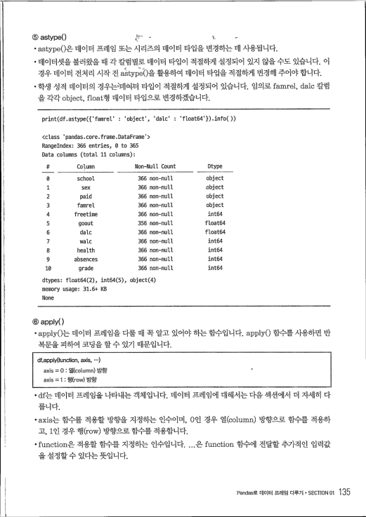
⑤astype() 才，"

- astype(）은 데이터 프레임 또는 시리즈의 데이터 타입을 변경하는 데 사용됩니다．
- 데이터셋을불러왔을 때 각 칼럼별로 데이터 타입이 적절하게 설정되어 있지 않을 수도 있습니다 . 이
경우 데이터 전처리 시작전 a꿩typ닙'(）을활용하여 데이터 타입을 적절하게 변경해 주어야합니다．

- 학생 성적 데이터의 경우는홅쳬찌」터 타입이 적절하게 설정되어 있습니다 . 임의로 famrel, daic 칼럼
을각각object, float형 데이터 타입으로 변경하겠습니다．

```python
print(df.astype({'famrel' : 'object', 'dal.c' : 'f1oat64'}).infoO)
```
<class 'pandas. core. frame. DataFrame'> Rangelndex: 366 entries, 0 to 365 Data columns (total 11 columns):

# 
Column Non-Null Count Dtype 0 school 366 non-null object 1 sex 366 non-null : object 2 paid 366 non-null object 3 famrel 366 non-null object 4 freetinie 366 non-null int64 5 goout 356 non-null fl.oat64 6 dalc 366 non-null f1oat64 7 walc 366 non-null 1nt64 8 health 366 non-null int64 9 absences 366 non-null int64 10 grade 366 non-null int64 object(4) dtypes: f10at64(2), int64(5), memory usage: 31.6+ KB None ⑥apply()

- apply(）는 데이터 프레임을 다룰 때 꼭 알고 있어야 하는 함수입니다 . apply() 함수를 사용하면 반
복문을 피하여 코딩을 할 수 있기 때문입니다． df.apply(function, axis, "·)

```python
axis = 0 : 열（column) 방향
```
axis == 1 : 행（row) 방향

- df는 데이터 프레임을 나타내는 객쳬입니다 . 데이터 프레임에 대해서는 다음 섹션에서 더 자세히 다
룹니다．

- axis는 함수를 적용할 방향을 지정하는 인수이며 , 0인 경우 열（column) 방향으로 함수를 적용하
고 , 1인 경우 행（row) 방향으로 함수를 적용합니다．

- function은 적용할 함수를 지정하는 인수입니다 . . . . 은 function 함수에 전달할 추가적인 입력값 
을 설정할 수 있다는 뜻입니다． Pandas로 데이터 프레임 다루기 . SECTION 01 135

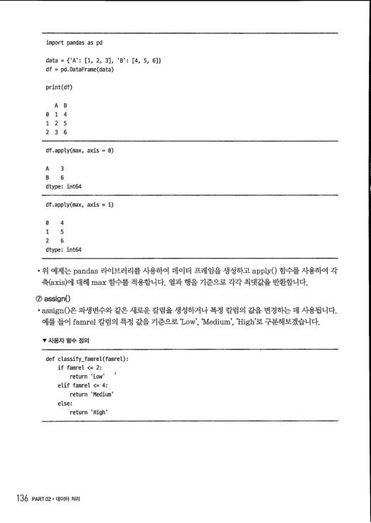
```python
import pandas as pd
data = {'A': [1, 2, 3], 'B': [4, 5, 6J} 
df = pd.DataFrame(data)
print(df)
```
A 괘 ㅗ z 슬 J B 4, ＜걀 .

b 0 괘 ㅗ z df.apply(niax, axis = 0) A 3 B 6 dtype: int64 df.appLy(max, axis = 1) 0 4 1 5 2 6 dtype: int64

- 위 예제는 pandas 라이브러리를 사용하여 데이터 프레임을 생성하고 apply() 함수를 사용하여 각 
축（axis）에 대해 max 함수를 적용합니다 . 열과 행을 기준으로 각각 최댓값을 반환합니다． ⑦assign()

- assign(）은 파생변수와 같은 새로운 칼럼을 생성하거나 특정 칼럼의 값을 변경하는 데 사용됩니다．
예를들어 famrel 칼럼의 특정 값을기준으로 ' Low', 'Medium', 'High'로구분해보겠습니다． ▼ 사용자 함수 정의

```python
def classify_famrel(famrel): 
if famrel <= 2: 
return 'Low'
el.if famrel <= 4: 
return Medium' 
else: 
return 'High'
```
136 PART02．데이터 처리

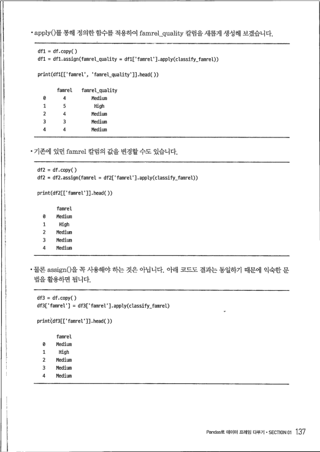
' apply(）를 통해 정의한 함수를 적용하여 famrel_quality 칼럼을 새롭게 생성해 보겠습니다． df]. = df.copy() df 1 = dfl.assign(famrel_quality = dfl[ 'famreL' II .apply(classify_famrel.))

```python
print(dflE[ 'famrel.', ' famre1_qua1ity '] ].head())
```
famrel famrel_quaLity 0 4 Medium 1 5 Hi嫩 2 4 Medium 3 3 Medium 4 4 Medium

- 기존에 있던 famrel 칼럼의 값을 변경할 수도 있습니다．
```python
df2 = df.copy() 
df2 = df2.assign(famrel = df2[ 'famrel 'l. appl.y(classify_famrel))
print(df2[[ 'famrel.'] ].head())
```
famrel 0 Medium 1 Hi嫩 2 Medium 3 Medium 4 Medium

- 물론 assign(）을 꼭 사용해야 하는 것은 아닙니다 . 아래 코드도 결과는 동일하기 때문에 익숙한 문 
법을 활용하면 됩니다．

```python
df3 = df.copy() 
df3[ 'famrel '] = df3['famrel '] .apply(cl.assify_famrel)
print(df3{['famrel '] ] .head() )
```
famrel.

0 Medium 1 High 2 Medium 3 Medium 4 Medium Pandas로데이터프레임다루기· SECTION 01 137

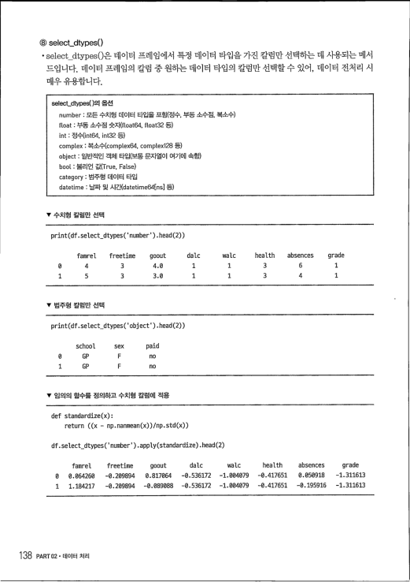
⑧select_dtypes()

- select_dtypes(）은 데이터 프레임에서 특정 데이터 타입을 가진 칼럼만 선택하는 데 사용되는 메서
드입니다 . 데이터 프레임의 칼럼 중 원하는 데이터 타입의 칼럼만 선택할수 있어 , 데이터 전처리 시 매우 유용합니다． select_c勿pes(）의 옵션 number : 모든 수치형 데이터 타입을 포함（정수 , 부동 쑈玲점 , 복소수） float : 부동 소수점 숫자（float64. fLoat32 등） mnt : 정수《1nt64. 1nt32 등） complex : 복소수（comp1ex64. comp1ex128 등） object : 일반적인 객체 타입（보통 문자열이 여기에 속함） bool : 불리언 값《True, False) category : 범주형 데이터 타입 datetime : 날짜 및 시간《datetime64[ns] 등） ▼ 수치형 칼럼만 선택

```python
print(df.select_dtypes('number') .head(2))
```
famreL freetime goout dalc walc health absences grade 0 4 3 4.0 1 1 3 6 1 1 5 3 3.0 1 1 3 4 1 ▼ 범주형 칼럼만 선택

```python
print(df.sel.ect_dtypesC object') .head(2))
```
school sex paid 0 GP F no 1 GP F no ▼ 임의의 함수를 정의하고 수치형 칼럼에 적용

```python
def standardize(x): 
return ((x - np.nanmean(x))/np.std(x))
```
df.select_dtypes( 'number') .apply(standardize) .head(2) famrel.

freetime goout daic wal.c health absences grade 0 0.064260 -0.209894 0.817064 -0.536172 -1.004079 -0.417651 0.050918 -1.311613 1 1.184217 -0.209894 -0.089088 -0.536172 -1.004079 -0.417651 -0.195916 -1.311613 138 PART02· 데이터처리

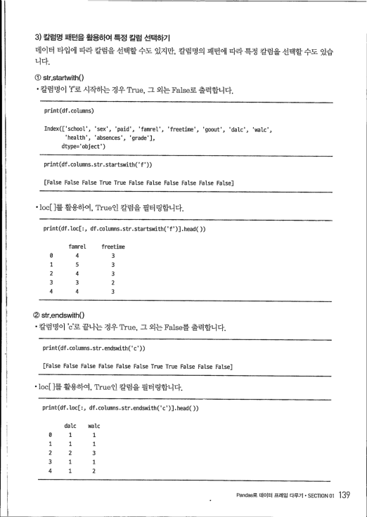
3) 칼럼명 패턴을 활용하여 특정 칼럼 선택하기 데이터 타입에 따라 칼럼을 선택할 수도 있지만 , 칼럼명의 패턴에 따라 특정 칼럼을 선택할 수도 있습 니다． ①str.startwith() ' 칼럼명이 ' f'로시작하는경우True , 그외는False로출력합니다．

```python
print(df.columns)
Index([ 'schooL', 'sex', ' paid', 'famrel', 'freetime', 'goout ', 'dalc', 'wal.c', 
'health', 'absences', 'grade'], 
dtype='object')
print(df.columns.str.startswith( ' f '))
```
[False False False True True False False False False False False] 1oc[］를활용하여 , True인 칼럼을 필터링합니다．

```python
print(df.loc[:, df.columns.str.startswith('f ')J.head( ))
```
famrel freetime 0 4 3 1 5 3 2 4 3 3 3 2 4 4 3 ②str.endswith()

- 칼럼명이 ' C'로 끝나는 경우 True , 그 외는 False를출력합니다．
```python
print(df.columns.str.endswith(' c'))
```
[False False False False False False True True False False False]

- 1oc[］를 활용하여 , True인 칼럼을 필터링합니다．
```python
print(df.loc[:, df.columns.str.endswith('c')].headQ)
```
dalc walc 0 1 1 1 1 1 2 2 3 3 1 1 4 1 2 Pandas로 데이터 프레임 다루기 · SECTION 01 139

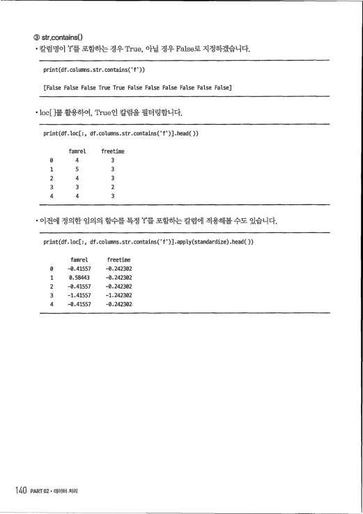
③str.contains()

- 칼럼명이 ' f'를포함하는 경우True , 아닐 경우 False로 지정하겠습니다．
```python
print(df.columns. str. contains( 'f ' ))
```
[False False False True True False False False False False False]

- loc[］를 활용하여 , True인 칼럼을 필터링합니다．
```python
print(df.loc[:, df.colurnns.str.contains('f ')].head())
```
famrel freetime 0 4 3 1 5 3 2 4 3 3 3 2 4 4 3

- 이전에 정의한 임의의 함수를 특정 ' f'를 포함하는 칼럼에 적용해볼 수도 있습니다．
```python
print(df.loc[:, df.columns.str.contains( 'f ')].apply(standardize).head())
```
famrel freetime 0 -0.41557 -0.242302 1 0.58443 -0.242302 2 -0.41557 -0.242302 3 -1.41557 -1.242302 4 -0.41557 -0.242302.

140 PART02．데이터처리

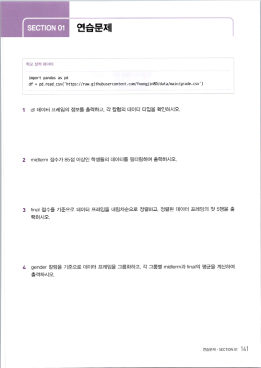
## 연습문제
학교 성적 데이터

```python
import pandas as pd 
df = pd.read_csv( 'https://raw.githubusercontent.com/YoungjinBD/data/main/grade.csv ')
```
I df 데이터 프레임의 정보를 출력하고 , 각 칼럼의 데이터 타입을 확인하시오． 2 midterm 점수가 85점 이상인 학생들의 데이터를 필터링하여 출력하시오． 3 final 점수를 기준으로 데이터 프레임을 내림차순으로 정렬하고 , 정렬된 데이터 프레임의 첫 5행을 출 력하시오． 4 gender 칼럼을 기준으로 데이터 프레임을 그룹화하고 , 각 그룹별 midterm과 final의 평균을 계산하여 출력하시오． 연습문제 . SECTION 01 贓

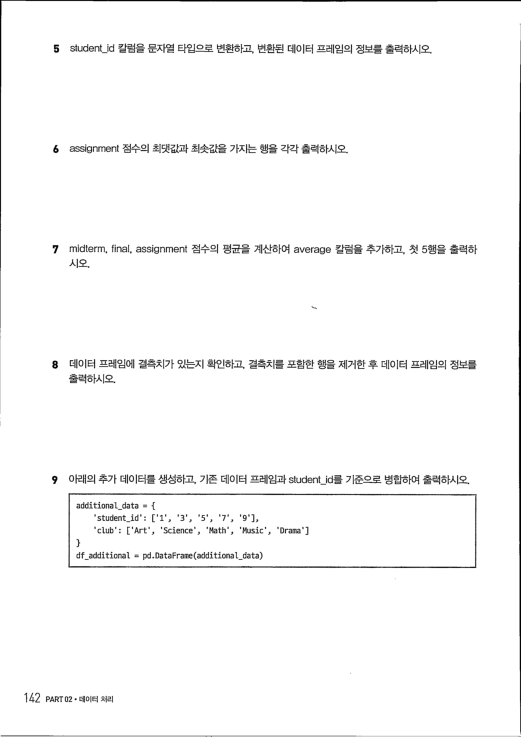
5 student_id 칼럼을 문자열 타입으로 변환하고 , 변환된 데이터 프레임의 정보를 출력하시오． 6 assignment 점수의 최댓값과 최솟값을 가지는 행을 각각 출력하시오． ' 而dterm, final, assignment 점수의 평균을 계산하여 average 칼럼을 추가하고 . 첫 5행을 출력하 시오． `` 8 데이터 프레임에 결측치가 있는지 확인하고 , 결측치를 포함한 행을 제거한 후 데이터 프레임의 정보를 출력하시오． , 아래의 추가 데이터를 생성하고 , 기존 데이터 프레임과 student_id를 기준으로 병합하여 출력하시오．

```python
additional_data = { 
'student_id' : ['1', '3', '5', '7', '9'] , 
'club': f 'Art', 'Science', 'Math', 'Music', 'Drania']
```
df_additional. = pd .DataFrame(additional_data) 142 PART02. 데이터 처리

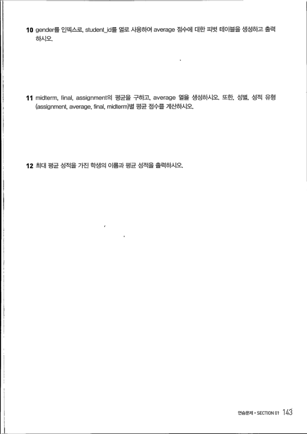
10 gender를 인덱스로 , student Id를 열로 사용하여 average 점수에 대한 피벗 테이블을 생성하고 출력 하시오． 11 而dterm, final, assignment의 평균을 구하고 , average 열을 생성하시오 . 또한 , 성별 , 성적 유형 (assignment, average, final, midterm）별 평균 점수를 계산하시오． 12 최대 평균 성적을 가진 학생의 이름과 평균 성적을 출력하시오． 연습문제．SECTION Dl 143

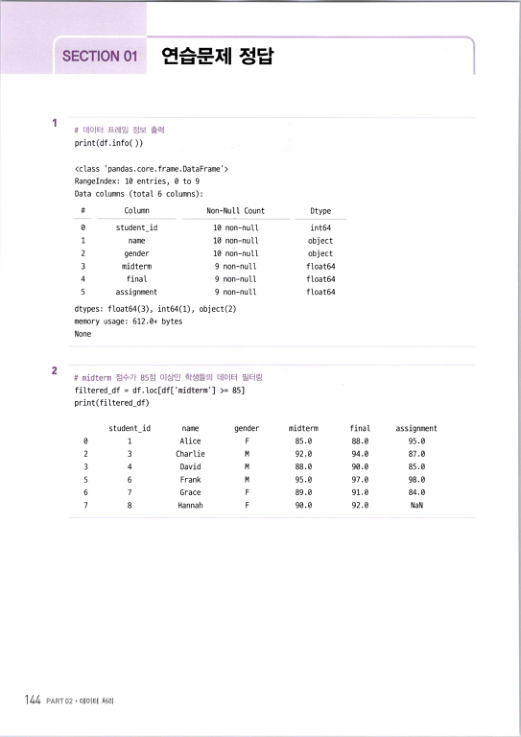
## SECTION 01 
연습문제 정답

```python
# 데이터 프레임 정보 출력 
print(df.info() )
```
<class ' pandas.core.frame.DataFrame' > Rangelndex: 10 entries, 0 to 9 Data columns (total 6 columns):

# 
Column Non-Null Count Dtype 0 student id 10 non-null int64 1 name 10 non-null object 2 gender 10 non-null object 3 midterm 9 non-null f1oat64 4 final 9 non-null f1oat64 5 assignment 9 non-null f1oat64 dtypes: f10at64(3), int64(1), object(2) memory usage: 612.0+ bytes None

```python
# midterm 점수가 85점 이상인 학생들의 데이터 필터링 
filtered_df = df.loc[df[ 'midterm '] >= 85] 
print(filtered_df)
```
student_id name gender midterm final assignment 0 1 Alice F 85.0 88.0 95.0 2 3 Charlie M 92.0 94.0 87.0 3 4 David M 88.0 90.0 85.0 5 6 Frank M 95.0 97.0 98.0 6 7 Grace F 89.0 91.0 84.0 7 8 Hannah F 90.0 92.0 NaN 絳4 PART 02 . 데이터 처리

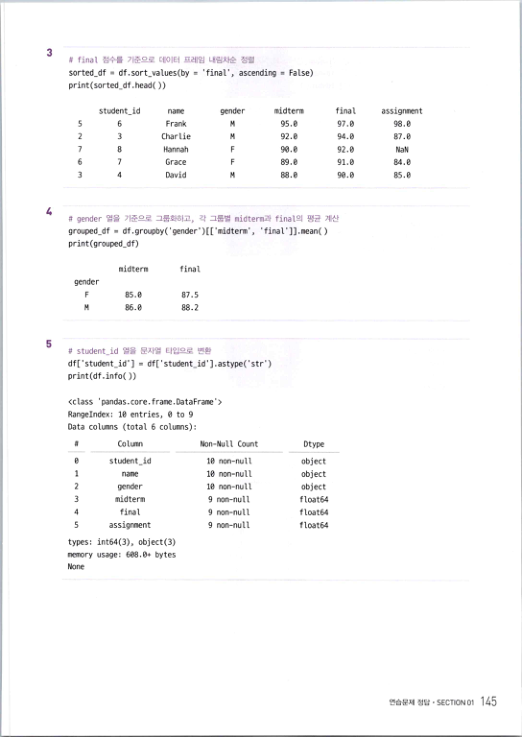
3 4 final 점수를 기준으로 데이터 프레임 내림ㅊ넌뜨 정렬

```python
sorted_df = df.sort_values(by = ' final', ascending = False) 
print(sorted_df.head( ))
```
student_id name gender midterm final assignment 5 6 Frank M 95.0 97.0 98.0 2 3 Charlie M 92.0 94.0 87.0 7 8 Hannah F 90.0 92.0 NaN 6 7 Grace F 89.0 91.0 84.0 3 4 David M 88.0 90.0 85.0

```python
# gender 열을 기준으로 그룹화하고， 각 그룹별 midterm과 final의 평균 계산
grouped_df = df.groupby( 'gender ')[['midterm', ' final'] ].mean( ) 
print(grouped_df)
```
midterm final gender F 85.0 87.5 M 86.0 88.2

```python
4 student Id 열을 문자열 타입으로 변환 
df[ 'student_id'] = df[ 'student_id'] .astype('str') 
print(df.info( ))
```
<class 'pandas.core.frame.DataFrame '> Rangelndex: 10 entries, 0 to 9 Data columns (total 6 columns):

4 Column Non-Null Count Dtype 0 student_id 10 non-null object 1 name 10 non-null object 2 gender 10 non-null object 3 midterm 9 non-null f1oat64 4 final 9 non-null f10at64 5 assignment 9 non-null f1oat64 types: int64(3), object(3) memory usage: 608.0+ bytes None 연습문제 정답 · SECTION 01 145

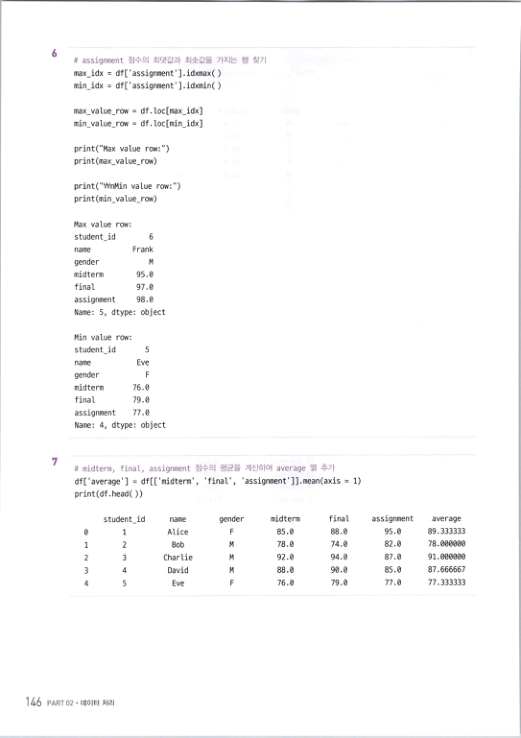
```python
6 
# assignment 점수의 최댓값과 최솟값을 가지는 행 찾기
max_idx = df[ 'assignment '] .idxmax( )
min_idx = df[ 'assignment 'J.idxmin( )
max_value_row = df.loc[max_idx]
mmn_value_row = df.loc{min_idx]
print("Max value row:') 
print(max_value_row)
print("WnMin value row: ') 
print(mmn_
nvalue_row)
```
Max value row:

student id 6 name Frank gender M midterm 95.0 final 97.0 assignment 98.0 Name: 5, dtype: object Mmn value row:

student id 5 name Eve gender F midterm 76.0 final 79.0 assignment 77.0 Name: 4, dtype: object

```python
# midterm, final, assignment 점수의 평균을 계산하여 average 열 추가 
df[ 'average'] = df[[ 'midterm', 'final', 'assignment '] ].mean(axis = 1) 
print(df.head( ))
```
student_id name gender midterm final assignment average 0 1 Alice F 85.0 88.0 95.0 89.333333 1 2 Bob M 78.0 74.0 82.0 78.000000 2 3 Charlie M 92.0 94.0 87.0 91.000000 3 4 David M 88.0 90.0 85.0 87.666667 4 5 Eve F 76.0 79.0 77.0 77.333333 ㅂ6 PART 02 · 데이터 처리

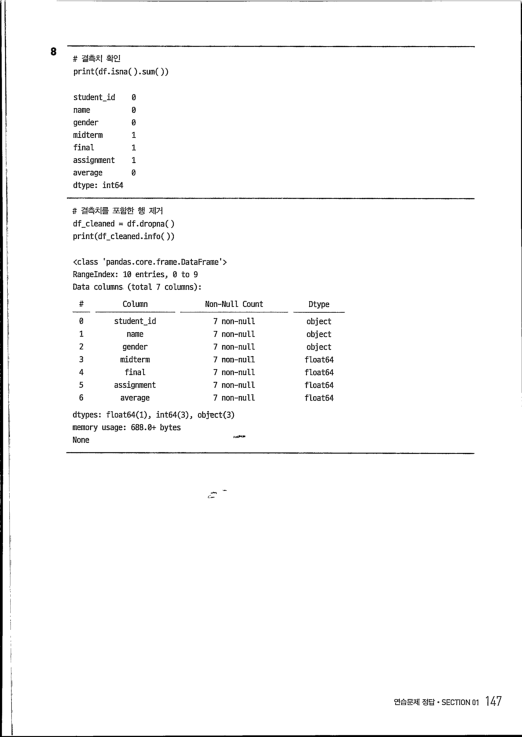
```python
8 
# 결측치 확인 
print(df.isna( ).sumO)
```
student id 0 name 0 gender 0 midterm 1 final 1 assignment 1 average 0 dtype: int64

```python
# 결측치를 포함한 행 제거 
df_cl.eaned = df.dropna() 
print(df_cleaned .info() )
```
<class 'pandas. core. frame. DataFrame'> Range工ndex: 10 entries, 0 to 9 Data columns (total 7 columns):

# 
Column Non-Null Count Dtype 0 student_id 7 non-null object 1 name 7 non-null object 2 gender 7 non-null object 3 midterm 7 non-null f1oat64 4 final 7 non-null f1oat64 5 assignment 7 non-null f10at64 6 average 7 non-null f1oat64 dtypes: f1oat64(1), int64(3), object(3) memory usage: 688.0+ bytes None 讓→， 乙？ 연습문제정답· SECTION 01 147

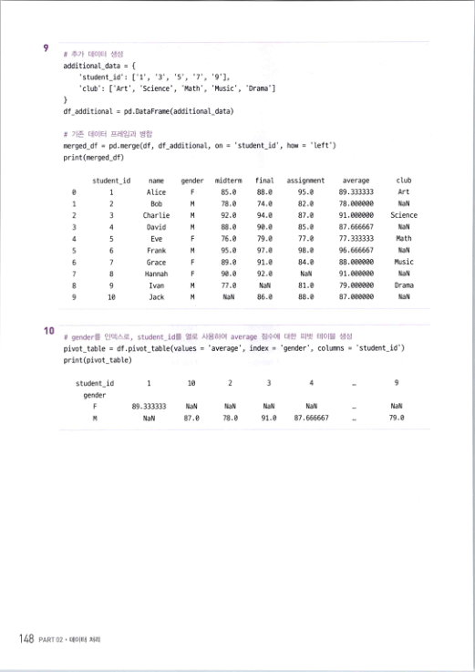
9

# 추가 데이터 생성 
additional._data = { ' student_id ' : ['1', '3', '5', '7', '9'] , 'club' : ['Art ', 'Science', 'Math', 'Music ', 'Drama']

```python
df_additional = pd.DataFrame(additional_data)
# 기존 데이터 프레임과 병합
merged_df = pd.merge(df, df_additional, on = 'student_id', how = 'left ') 
print(merged_df)
```
student_id name gender midterm final assignment average club 0 1 Alice F 85.0 88.0 95.0 89.333333 Art 1 2 Bob M 78.0 74.0 82.0 78.000000 NaN 2 3 Charlie M 92.0 94.0 87.0 91.000000 Science 3 4 David M 88.0 90.0 85.0 87.666667 NaN 4 5 Eve F 76.0 79.0 77.0 77.333333 Math 5 6 Frank M 95.0 93.0 98.0 96.666667 NaN 6 7 Grace F 89.0 91.0 84.0 88.000000 Music 7 8 Hannah F 90.0 92.0 NaN 91.000000 NaN 8 9 Ivan M 77.0 NaN 81.0 79.000000 Drama 9 10 Jack M NaN 86.0 88.0 87.000000 NaN 10 4 gender를 인덱스로， student id를 열로 사용하여 average 점수에 대한 피벗 테이블 생성

```python
pivot_table = df.pivot_table(values = ' average ', index = 'gender ', columns = 'student_id')
print(pivot_table)
```
student id 1 10 2 3 4 9 gender F 89.333333 NaN NaN NaN NaN NaN M NaN 87.0 78.0 91.0 87.666667 79.0 148 PART 02 . 데이터 처리

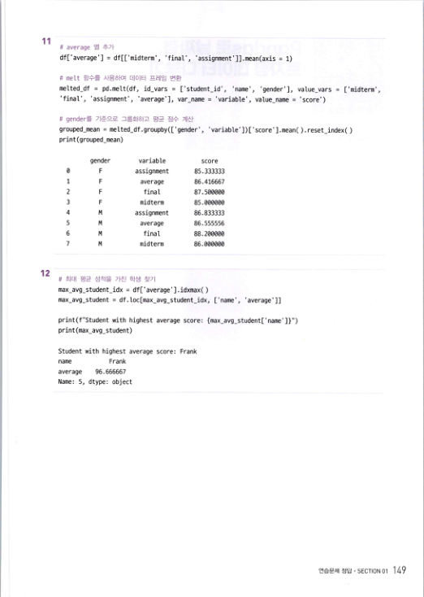
```python
1 I 
# average 열 추가 
df[ 'average'] = df[[ 'midterm ', 'final', 'assignment'] ].mean(axis = 1)
# melt 함수를 사용하여 데이터 프레임 변환
melted_df = pd.melt(df, id_vars = [ 'student_id ', 'name', 'gender'] , value_vars = ['midterm ', 
'final', 'assignment', 'average'], var_name = ' variable', value_name = 'score')
# gender를 기준으로 그룹화하고 평균 점수 계산
grouped_mean = melted_df.groupby([ 'gender', ' variable'] )['score'] .mean( ).reset_index( ) 
print(grouped_mean)
```
gender variable score 0 F assignment 85.333333 1 F average 86.416667 2 F final 87.500000 3 F midterm 85.000000 4 M assignment 86.833333 5 N average 86.555556 6 N final 88.200000 7 M midterm 86.000000

```python
12 
# 최대 평균 성적을 가진 학생 찾기
max_avg_student_idx = df[ 'average' ]. idxmax( )
max_avg_student = df.loc[max_avg_student_idx, ['name', 'average'] ]
print(f"Student with highest average score: {max_avg_student[ 'name'] }") 
print(max_avg_student)
```
Student with highest average score: Frank name Frank average 96.666667 Name: 5, dtype: object 연습문제 정답· SEC지ON 01 絳？

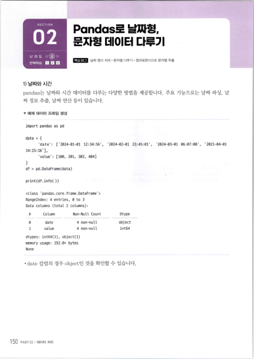
# Pandas로 날짜형． 
문자형 데이터 다루기

# SECTION 02
난이도 상（둘）햐 핵심 태그 날짜 형식 처리 · 문자열 다루기 · 정규표현식으로 운자열 추출 반복학습 驪 ·

- 
1) 날짜와 시간 pandas는 날짜와 시간 데이터를 다루는 다양한 방법을 제공합니다 . 주요 기능으로는 날짜 파싱 , 날 짜 정보 추출 , 날짜 연산 등이 있습니다． ▼ 예제 데이터 프레임 생성

```python
import pandas as pd
data = { 
'date': [ '2024-01-01 12:34:56' , 
'2024-02-01 23:45:01', '2024-03-01 06:07:08' , '2021-04-01
```
14:15:16'] , 'value': [100, 201, 302, 404]

```python
df = pd.DataFrame(data)
print(df.info( ))
```
<class ' pandas.core.franie.DataFrame'> Rangelndex: 4 entries, 0 to 3 Data columns (total 2 columns):

Non-Null Count Dtype

```python
# 
Column
```
4 non-null object 0 date 1 value 4 non-null int64 dtypes: int64(1), object(1) memory usage: 192.0+ bytes None

- date 칼럼의 경우 object인 것을 확인할 수 있습니다．
150 PARTU2 . 데이터 처리

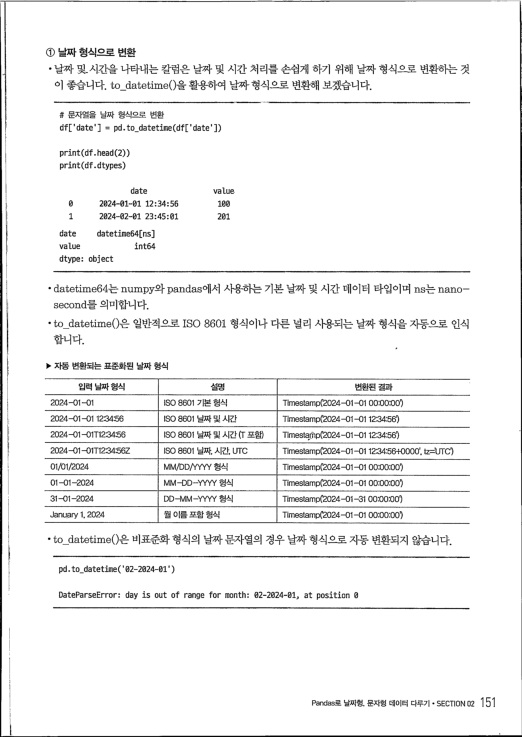
① 날짜 형식으로 변환

- 날짜 및，시간을 나타내는 칼럼은 날짜 및 시간 처리를 손쉽게 하기 위해 날짜 형식으로 변환하는 것
이 좋습니다 . to_datetime(）을 활용하여 날짜형식으로 변환해 보겠습니다．

```python
# 문자열을 날짜 형식으로 변환 
df[ 'date'] = pd.to_datetime(df[ 'date'] )
print(df. head(2)) 
print(df.dtypes)
```
date val.ue.

0 2024-01-01 12:34:56 100 1 2024-02-01 23:45:01 201 date datetime64[ns] value int64 dtype: object

- datetime64는 numpy와 pandas에서 사용하는 기본 날짜 및 시간 데이터 타입이며 ns는 nano-
second를 의미합니다．

- to_datetime(）은 일반적으로 IS0 8601 형식이나 다른 널리 사용되는 날짜 형식을 자동으로 인식
합니다．

> 자동 변환되는 표준화된 날짜 형식
입력 날짜 형식 설명 변환돈l 결과 2024-01-01 IS0 8601 기본 형식 Timestampc2024-01-01 00:00:00) 2024-01-0112:34:56 S0 8601 날짜 및 시간 Timestamp(2024-01-01 1234:56) 2024-01 -01T12:34:56 IS0 8601 날짜 및 시간 (T 포함） TimestarnpC2024-01-01 12:34:56) 2024-01-01T123456Z IS0 8601 날짜, 시간, UTC Timestamp(2024-01-01 1234:56+0000', tz=UTC) 이／01/2024 MM/DDf 'WY 형식 Timestamp(2024-01-01 00:00:00) 이 -01-2024 MM-DD-'yYYY 형식 Timeslamp('2024-01-01 00:00:00) 31-01-2024 DD-MM-Y'Yi 형식 Timestamp('2024-01-31 00:00:00) January 1, 2024 월 이름 포함 형식 Timestampc2024-01-01 00:00:00) ' to_datetime(）은 비표준화 형식의 날짜 문자열의 경우 날짜 형식으로 자동 변환되지 않습니다． pd . to-datetime( '02-2024-01') DateParseError: day is out of range for month: 02-2024-01, at position 0 Pandas로 날짜형 . 문자형 데이터 다루기 · SECTION 02 151

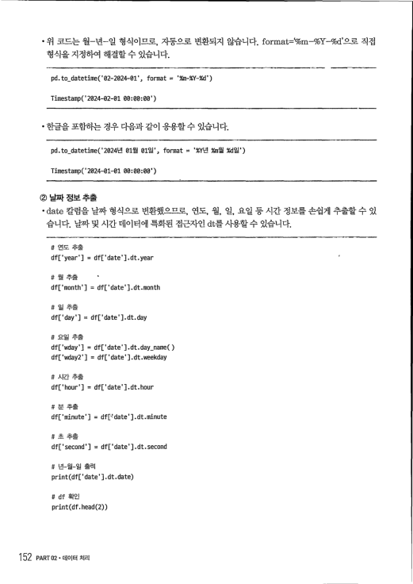
- 위 코드는 월－년－일 형식이므로 , 자동으로 변환되지 않습니다 , format='%m-%Y-%d'으로 직접
형식을 지정하여 해결할 수 있습니다． pd.to_datetime('02-2024-01', format = ' 數끄－%Y－汝｀ ' ) Tiniestanip( '2024-02-01 00:00:00')

- 한글을 포함하는 경우 다음과 같이 응용할 수 있습니다．
pd. to_datetime('2024년 01월 01일 ' , format = ' %Y년 妙ㅐ월 %d일 ' ) Timestamp( '2024-01-01 00:00:00') ② 날짜 정보 추출

- date 칼럼을 날짜 형식으로 변환했으므로 , 연도 , 월 , 일 , 요일 등 시간 정보를 손쉽게 추출할 수 있
습니다 . 날짜 및 시간 데이터에 특화된 접근자인 dt를 사용할수 있습니다．

```python
# 연도 추출 
df['year'J = df[ 'date'] .dt.year
# 월 추출 
' 
df{'month'] = dft'date'] .dt.month
# 일 추출 
dff 'day'] = df['date'].dt.day
# 요일 추출 
df['wday'] = df['date'] .dt.day_name() 
df[ 'wday2'] = df{'date'] .dt.weekday
# 시간 추출 
df[ 'hour'] 볍 df['date'] .dt.hour
# 분 추출 
df[ 'minute'] = df[ date'] .dt.minute
# 초 추출 
df[ 'second '] = df[ 'date'] .dt.second
# 년－월－일 출력 
print(df[ 'date'] . dt .date)
# df 확인 
print(df. head(2))
```
152 PART02．데이터처리

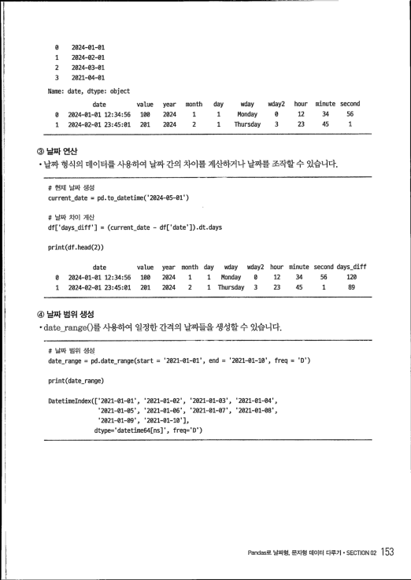
0 2024-01-01 1 2024-02-01 2 2024-03-01 3 2021-04-01 Name: date, dtype: object date value year month day wday wday2 hour minute second 0 2024-01-01 12:34:56 100 2024 1 1 Monday 0 12 34 56 1 2024-02-01 23:45:01 201 2024 2 1 Thursday 3 23 45 1 ③ 날짜 연산

- 날짜 형식의 데이터를 사용하여 날짜 간의 차이를 계산하거나 날짜를 조작할 수 있습니다．
```python
# 현재 날짜 생성 
current_date = pd.to_datetime('2024-05-01')
# 날짜 차이 계산 
df{'days_diff'] = (current_date - df[ 'date'l) .dt.days
print(df. head(2))
```
date year month day wday wday2 hour minute second days_diff value 0 2024-01-01 12:34:56 100 2024 1 1 Monday 0 12 34 56 120 1 2024-02-01 23:45:01 201 2024 2 1 Thursday 3 23 45 1 89 ④ 날짜 범위 생성 『date_range(）를 사용하여 일정한 간격의 날짜들을 생성할 수 있습니다．

```python
# 날짜 범위 생성
date_range = pd.date_range(start = '2021-01-01', end = '2021-01-10', freq = 'D')
print(date_range)
```
Datetimelndex([ '2021-01-01', '2021-01-02', '2021-01-03', '2021-01-04', '2021-01-05', '2021-01-06', '2021-01-07', '2021-01-08', '2021-01-09', '2021-01-10'] ,

```python
dtype=' datetime64[ns]', freq= ' D')
```
Pandas로 날짜형 . 문자형 데이터 다루기 . SECTION 02 巧3

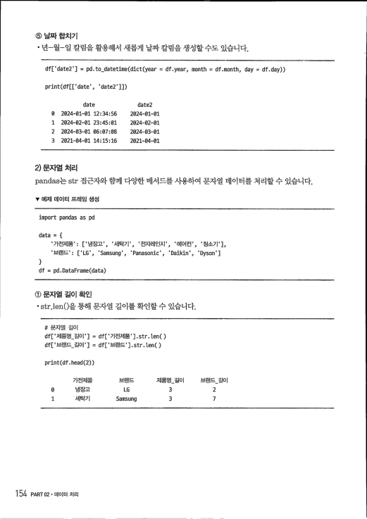
⑤ 날짜 합치기

- 년－월－일 칼럼을 활용해서 새롭게 날짜 칼럼을 생성할 수도 있습니다．
df{'date2'] = pd.to_datetinie(dict(year = df.year, month = df.month, day = df.day))

```python
print(df[[ 'date ', 'date2 '] ])
```
date date2 0 2024-01-01 12:34:56 2024-01-01 1 2024-02-01 23:45:01 2024-02-01 2 2024-03-01 06:07:08 2024-03-01 3 2021-04-01 14:15:16 2021-04-01 2) 문자열 처리 pandas는 str 접근자와 함께 다양한 메서드를 사용하여 문자열 데이터를 처리할 수 있습니다． ▼ 예제 데이터 프레임 생성

```python
import pandas as pd
data = {
```
' 가전제품 ' = [ ' 냉장고 ' , ' 세탁기 ' , ' 전ㅈH인지 ' " 에어컨 ' , ' 청소기 ' 〕， ' 브랜드 ' = ['LG ', 'Samsung', 'Panasonic', 'Daikin', 'Dyson'l

```python
df = pd.DataFrame(data)
```
① 문자열 길이 확인

- str.len()을 통해 문자열 길이를 확인할 수 있습니다．
```python
# 문자열 길이 
df[ ' 제품명－길이 ' ] = df[ ' 가전제품 ' 〕.str. Len( ) 
df[ ' 브랜드－길이 ' ] = df[ ' 브랜드 ' ].str. Len()
print(df head(2))
```
가전제품 브랜드 제품명－길이 브랜드ㄴ길이 0 냉장고 LG 3 2 1 세탁기 Samsung 3 7 154 PARTU2 . 데이터 처리

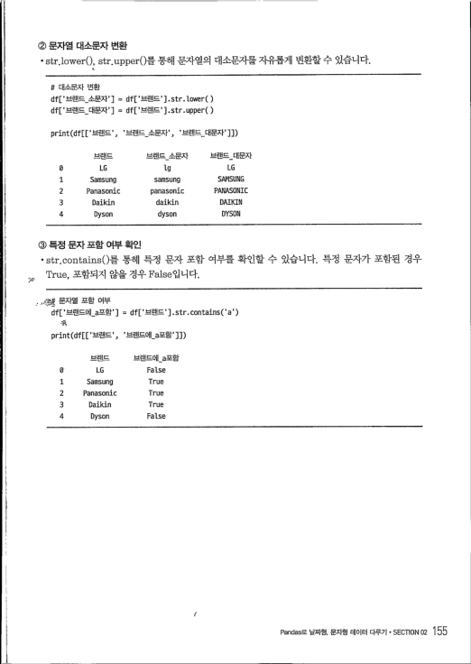
② 문자열 대소문자 변환

- str.lowerO, str.upper(）를 통해 문자열의 대소문자를 자유롭게 변환할 수 있습니다．
```python
# 대소문자 변환 
df[ ' 브랜드－소문자 ' 〕 = df[ ' 브랜드 ' J.str. lower( ) 
df[ ' 브랜드－대문자 ' 그 = df[ ' 브랜드 ' ].str.upper( )
print(df[[ ' 브랜드 ' " 
브랜드－소문자 ' , ' 브랜드－대문자 ' 끄）
```
브랜드 브랜드 소문자 브랜드－대문자 0 LG 1.g LG 1 Samsung sainsung SAMSUNG 2 Panasonic panasonic PANASONIC 3 Daikin daikin DAIKIN 4 Dyson dyson DYSON ③ 특정 문자 포함 여부 확인

- str.contains(）를 통해 특정 문자 포함 여부를 확인할 수 있습니다 . 특정 문자가 포함된 경우
』．路 True tr , 포함되지 않을경우False입니다． .. ,，숀헬騈 문자열 포함 여부 df[ ' 브랜드에－a포함 ' ] = df[ ' 브랜드 ' 〕.str.containsCa ' )

```python
嫩 
print(df[ [ ' 브랜드 ' , ' 브랜드에－a포함 ' 〕〕）
```
브랜드 브랜드에 a포함 0' LG False 1 Sainsung True 2 Panasonic True 3 Da차山1 True 4 Dyson False r Pandas로 날짜형 , 문자형 데이터 다루기 . SECTION 02 155

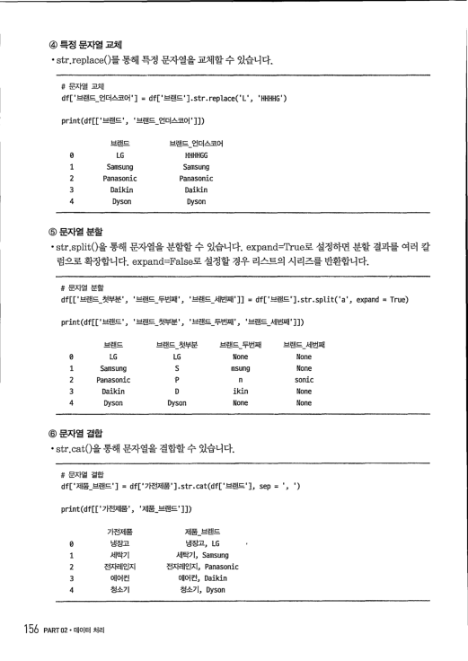
（乙 특정 문자열 교쳬

- str.replace(）를 통해 특정 문자열을 교쳬할수 있습니다．
```python
# 문자열 교체 
df[ ' 브랜드－언더스코어 ' 〕 = df[ ' 브랜드 ' // .str.replace( 'L ' , ' HHHFIG ' )
print(df{[ ' 브랜드 ' , ' 브랜드ㄴ언더스코어 ' 〕］)
```
브랜드 브랜드 언더스코어 0 LG 바∥GG 1 Samsung Samsung 2 Panasonic Panasonic 3 Daikin Daikin 4 Dyson Dyson ⑤ 문자열 분할

- str.split(）을 통해 문자열을 분할할 수 있습니다 . expand=True로 설정하면 분할 결과를 여러 칼
럼으로 확장합니다 . expand=Fa1se로 설정할 경우 리스트의 시리즈를 반환합니다．

```python
# 문자열 분할 
df[[ ' 브랜드－첫부분 ' , ' 브랜드－두번째 ' , ' 브랜드－세번째 ' 〕〕 = df[ ' 브랜드'] .str.split( 'a ' , expand = True)
print(df[{ ' 브랜드 ' , ' 브랜드－첫부분 ' , ' 브랜드－두번째 ' , ' 브랜드－세번째 ' 〕］)
```
브랜드 브랜드－첫부분 브랜드－두번째 브랜드－세번째 0 LG LG None None 1 Sarnsung S msung None 2 Panasonic P n sonic 3 Daikin D ikin None 4 Dyson Dyson None None ⑥ 문자열 결합

- str.cat(）을 통해 문자열을 결합할 수 있습니다．
```python
# 문자열 결합 
df[ ' 제품긺브랜드 ' 〕 = df[ ' 가전제품 ' ].str.cat(df[ ' 브랜드 ' 〕， sep = ' , ' )
print(dff[ ' 가전제품 ' , ' 제품－브랜드 ' 〕〕）
```
가전제품 제품－브랜드 0 냉장고 냉창고， LG 1 세탁기 세탁기， Samsung 2 전자레인지 전자레인지， Panasonic 3 에어컨 에어컨， Daikin 4 청소기 청소기， Dyson 156 PART02. 데이터 처리

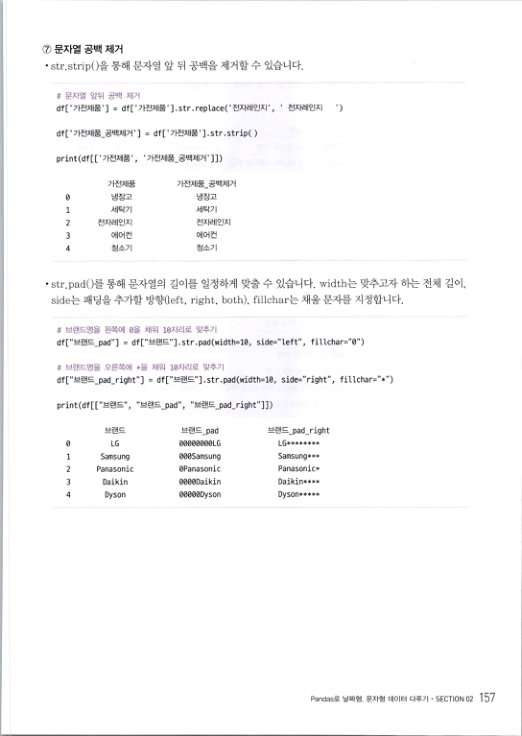
⑦ 문자열 공백 제거

- str.strip(）을 통해 문자열 앞 뒤 공백을 제거할 수 있습니다．
```python
# 문자열 앞뒤 공백 제거 
df[ ' 가전제품 ' ] = df [ ' 가전저曆 ' I .str. reptace( ' 전자레인지'， ' 전자레인지 
' )
```
df[ ' 가전제품－공백제거 ' ] = df [ ' 가전제품’ 그．str.strip( )

```python
print(df[[ ' 가전저푿 ' , ' 가전제품－공백제거 ' ]])
```
가전제품 가전처픔 공백제거 0 냉장고 냉장고 1 세탁기 세탁기 2 전자레인지 전자레인지 3 에어컨 에어컨 4 청소기 청소기

- str.pad(）를 통해 문자열의 길이를 일정하게 맞출 수 있습니다 . width는 맞추고자 하는 전쳬 길이，
side는패딩을추가할방향（left, right, both), filichar는채울문자를지정합니다．

```python
# 브랜드명을 왼쪽에 0을 채워 10자리로 맞추기 
df[' 브 드_pad"] = df[ "브랜드"]. str. pad(width=10, side= "left ", fillchar= 'O")
# 브랜드명을 오른쪽에 ＊을 채워 10자리로 맞추기 
df[" 브랜드_pad_right"] = df[ ' 브랜드'] .str.pad(width=10, side='right', fillchar='* ")
print(df[[ " 브랜드 " , " 브랜드－pad", " 브랜드－pad_right "]])
```
브랜드 브랜드－pad 브랜드－pad_right 0 LG 0000000이．.G LG******** 1 Samsung 000Samsung Samsung*** 2 Panasonic OPanasonic Panasonic* 3 Daikin 0000Daikin Daikin**** 4 Dyson 00000Dyson Dyson***** Pandas로 날짜형 . 문자형 데이터 다루기 . SECTION02 157

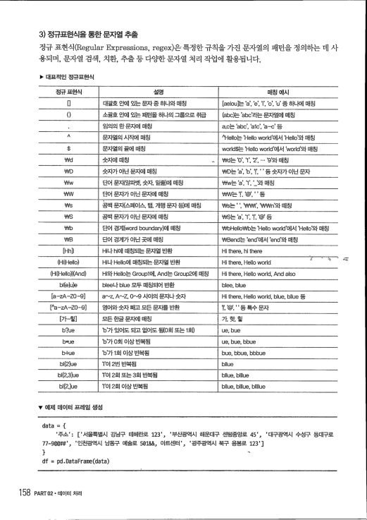
3) 정규표헌식을 통한 문자열 추출 정규 표현식（kegular Expressions, regex）은특정한子칙을 가진 문자열의 패턴을 정의하는 데 사 용되며 , 문자옙검색 , 치환, 추출등다양한문자열 처리 작업에 활용됩니다． 》 대표적인 정규표현식 驪구표현식 설명 매칭 예시 [1 대괄호 안에 있는 문자 중 하나와 매칭 [aeiou盤크 a, e, i, o, u 중하나에 매칭 0 소괄호 안에 있는 패턴을 하나의 그룹으로 취급 (abc）는 ' abc'Ej' 문자열에 매칭 임의의 한 문자에 매칭 a.c는 'abc', 'alc'. 'a-c' 등 A 문자열의 시작에 매칭 ＇뉘ello는 ' Hello world ' 에서 ' Hello ' 와 매칭 $ 문자열의 끝에 매칭 worlds는 'Hello world'O艇 'world ' 와 매칭 Wd 숫자에 매칭 Wd는 ' 0'. '1'. '2'. '" '9'와매칭 WD 숫자가 아닌 문자에 매칭 WD는 a, b. ! ' , " 등숫자가아닌문자 Ww 단어 문자（알파벳 . 숫자, 밑줄）에 매칭 Ww는 ' a', '1', ' ’와매칭 ￦W 단어 문자가 아닌 문자에 매칭 ￦w는 ' ! ' , ' ＠〕콘 , " 등 Ws 공백 문자（스페이측 탭 , 개행 문자등）에 매칭 切治는 " . 'wwf. 'WWn'와매칭 ws 공쌕 문자가 아닌 문자에 매칭 ws는 ' a', '1', ' ! ' , ' @ ' 등 Wb 단어 경계（word boundary）에 매칭 WbHelloWb는 ' Hello world ' 에서 ' Hello ' 와 매칭 단어 경계가 아닌 곳에 매칭 WBend는 ' end ' 에서 ' end'와 매칭 Hi나 hiO체 매칭되는 문자열 반환 Hi there, hi there Hi나 Hello에 매칭되는문자열 반환 Hi there, Hello world Hi와ello는 GrouplOil, And는 Group2에 매칭 Hi there. Hello world, And also 以ee나 *)lue 모두 매칭되어 반환 blee, blue a"z, A-"-'Z, 0"9 사이의 문자나 숫자 Hi there, Hello world, blue, bilue 등 영어와 숫자 빼고 모든 문자를 반환 뺨l`. ' @)i . " 등특수문자 모든 한글 문자에 매칭 가. 핫, 힐 〔가－힐］ 'b ' 가 있어도 되고 없어도 됨（0회 또는 1회） b?ue ue, bue b*ue 'b ' 가 0회 이상 반복됨 ue, bue, bbue b+ue 'b ' 가 1회 이상 반복됨 bue, bbue, bbbue bl[2}ue 'l ' 이 2번 반복됨 bilue '＂기 2회 또는 3회 반복됨 L게ue. t괘ue bl{2,3)ue b!{2jue , ' 이 2회 이상 반복됨 bllue, billue, blillue ▼ 예제 데이터 프레임 생성

```python
data = {
```
' 주소 ' = [. ' 서울특별시 강남구 테헤란로 123', ' 부산광역시 해운대구 센텀중앙로 45', ' 대구광역시 수성구 동대구로 77-9@@##', ' 인천광역시 남동구 예술로 501&&' 아트센터 ' , ' 광주광역시 북구 용봉로 123']

```python
df = pd.DataFranie(data)
```
158 PART02．데이터처리

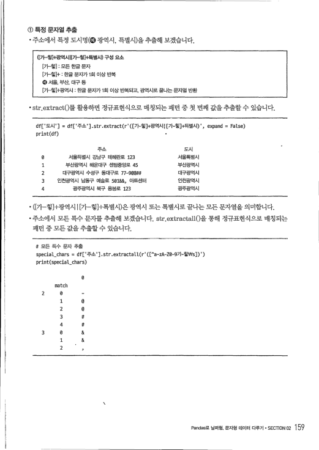
① 특정 문자열 추출

- 주소에서 특정 도시명（ㅇl 광역시 , 특별시）을 추출해 보겠습니다．
(［가－홑l卄광역세［가－힐D특별시） 구성 요소 ［가－힐］ : 모든 한글 문자 ［가－힐什 : 한글 문자가 1회 이상 반복 o 서울 , 부산, 대구 등 〔가－힐］＋광역시 : 한글 문자가 1회 이상 반복되고 , 광역시로 끝나는 문자열 반환

- str. extract(）를 활용하면 蔘予표현식으로 매칭되는 패턴 중 첫 번째 값을 추출할 수 있습니다．
```python
df[ ' 도시 ' 〕 = dfE ' 주소].str.extract(r ' (［가－힐］＋광역시I［가－힐］＋특별시） ' , expand = False) 
print(df)
```
주소 도시 0 서을특별시 강남구 테헤란로 123 서울특별시 1 부산광역시 해운대구 센텀중앙로 45 부산광역시 2 대구광역시 수성구 동대구로 77-9@@## 대구광역시 3 인천광역시 남동구 예술로 501&&, 아트센터 인천광역시 4 광주광역시 북구 용봉로 123 광주광역시

- （〔가－힘］＋광역새 〔가－힝〕＋특별시）은 광역시 또는 특별시로 끝나는 모든 문자열을 의미합니다．
- 주소에서 모든 특수 문자를 추출해 보겠습니다 . str. extractall(）을 통해 정규표현식으로 매칭되는
패턴 중 모든 값을 추출할 수 있습니다．

```python
# 모든 특수 문자 추출
special_chars = df[ ' 주소 '] .str.extractall(r' (["a-zA-Z0-9가- 1Ws]) ' ) 
print(special_chars)
```
0 match 2 0 - 1 @ 2 @ 3 if 4 if 3 0 & 1 & 2 ` Pandas로 날짜형 , 문자형 데이터 다루기 . SECTION 02 159

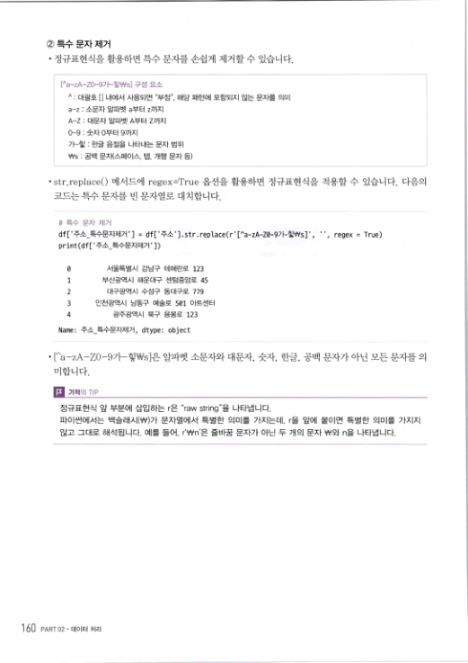
② 특수 문자 제거

- 州干표현식을 활용하면 특수 문자를 손쉽게 제거할 수 있습니다．
[Aa-zA-Z0-9가－힐Wsj 구성 요소 ^ : 대괄호 [] 내에서 사용되면 ' 부정 " . 해당 패턴에 포함되지 않는 문자를 의미 a-z : 소문자 알파벳 a부터 z까지 A-Z ; 대문자 알파벳 A부터 z까지 0 : 숫자0부터 9까지 가－힐 : 한글 음절을 나타내는 문자 범위 ￦5 : 공백 문자（스페이스 . 탭 , 개행 문자 등）

- str.replace() 메서드에 regex=True 옵션을 활용하면 蔘子표현식을 적용할 수 있습니다 . 다음의
코드는 특수 문자를 빈 문자열로 대치합니다．

```python
# 특수 문자 제거 
df[ ' 주소－특수문자제거 ' ] = df[ ' 주소 ' ].str. repthce(r ' ['a-zA-Z0-9가－힐Ws] 닝 ", regex = True) 
print(df[ ' 주소－특수문자제거 ' ])
```
0 서울특별시 강남구 테헤란로 123 1 부산광역시 해운대구 센텀중앙로 45 2 대구광역시 수성구 동대구로 779 3 인천광역시 남동구 예술로 501 아트센터 4 광주광역시 북구 용봉로 123 Name: 주소－특수문자제거’ dtype: object

- ["a-zA-ZO-9가－힝Ws］은 알파벳 소문자와 대문자 , 숫자 , 한글 , 공백 문자가 아닌 모든 문자를 의
미합니다． ㅁ 기적의 ㄲP 정규표현식 앞 부분에 삽입하는 r은 " raw string " 을 나타냅니다． 파애선에서는 백슬래시（￦）가 문자열에서 특별한 의미를 가지는데 . r을 앞에 붙이면 특별한 의미를 가지지 않고 그대로 해석됩니다 . 예를 들어 , r'Wn'은 쥘카꿈 문자가 아닌 두 개의 문자 ￦와 n을 나타냅니다． 160 PART02. 데이터 처리

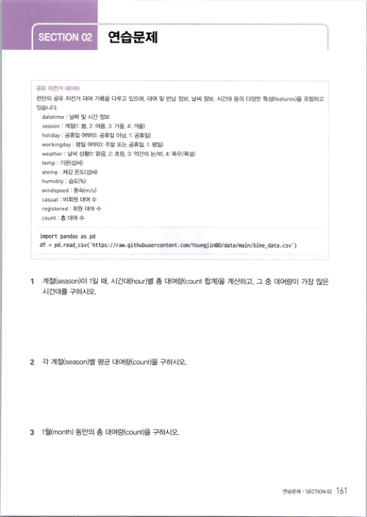
## SECTION 02 
연습문제 공유 자전거 데이터 런던의 공유 자전거 대여 기록을 다루고 있으며 , 대여 및 반납 정보 , 날씨 정보 , 시간대 등의 다양한 특성（features）을 포함하고 있습니다． datetime : 날짜 및 시간 정보 season : 계절（1: 봄 , 2: 여름 . 3: 가을 . 4: 겨울） holiday : 공휴일 여부（0: 공휴일 아님 , 1: 공휴일） workingday : 평일 여부（0: 주말 또는 공휴일 , 1: 펑일） weather : 날씨 상황（1: 맑음 , 2: 흐림 , 3: 약간의 눈／비 , 4: 폭우／폭설） temp : 기온＜섭씨） atemp : 쳬감 온도（섭씨） humid叫 : 습도（%) windspeed : 풍속〈m/s) casuat : 비회원 대여 수 registered : 회원 대여 수 count : 총 대여 수

```python
import pandas as pd 
df = pd. read_csv( ' https://raw.githubusercontent.com/YoungjinBD/data/main/bike-data.csv ')
```
I 계절（season）이 컁일 때 , 시간대出our）별 총 대여량（count 합계）을 계산하고 , 그 중 대여량이 가장 많은 시간대를 구하시오． 2 각 계절（season）별 평균 대여량（count）을 구하시오． 3 1월（month) 동안의 총 대여량（count）을 구하시오． 연습문제 ·SECTION 02 ㄶ

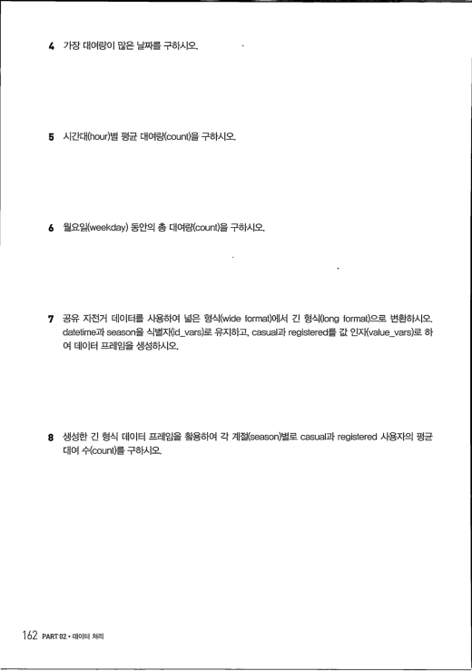
4 가장 대여량이 많은 날짜를 구하시오． 5 시간대（hour）별 평균 대여량（count）을구하시오． 6 뭘요일（weekday) 동안의 총 대여량（count）을 구하시오． 7 공유 자전거 데이터를 사용하여 넓은 형식（wide format）에서 긴 형식(long format)으로 변환하시오． datetime과 season을 식별자ㅇd_vars）로 유지하고 , casual과 registered를 값 인자（value- vars）로 하 여 데이터 프레임을 생성하시오， 8 생성한 긴 형식 데이터 프레임을 활용하여 각 계절（season）별로 casual과 registered 사용자의 평균 대여 수（count）를 구하시오． 162 PART 02. 데이터처리

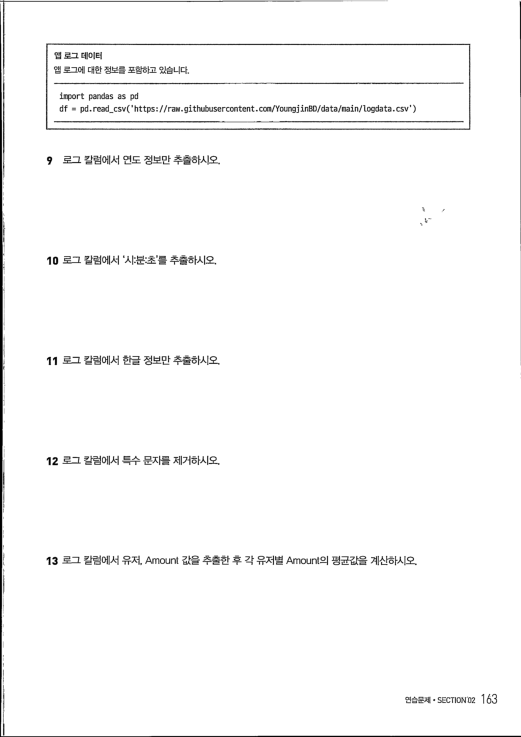
앱 로그 데이터 7 앱 로그에 대한 정보를 포함하고 있습니다．

```python
import pandas as pd 
df = pd.read_csv( 'https://raw.githubusercontent.com/YoungjinBD/data/mainhlogdata.csv')
```
' 로그 칼럼에서 연도 정보만 추출하시오． 蘆 1[, 로그 칼럼에서 ' 시：분：초'를 추출하시오． 11 로그 칼럼에서 한글 정보만 추출하시오． 12 로그 칼럼에서 특수 문자를 제거하시오． 13 로그 칼럼에서 유저 , Amount 값을 추출한 후 각 유저별 Amount의 평균값을 계산하시오． 연습문제· SECTON'02 拓3

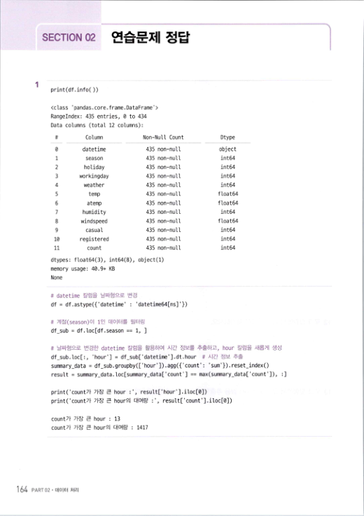
## 연습문제 정답
### SECTION 02
```python
print(df.info( ))
```
<class 'pandas. core. frame. DataFrame'> Rangelndex: 435 entries, 0 to 434 Data columns (total 12 columns):

# 
Column Non-Null Count Dtype 0 datetime 435 non-null object 1 season 435 non-null int64 2 holiday 435 non-null int64 3 workingday 435 non-null int64 4 weather 435 non-null int64 5 temp 435 non-null f1oat64 6 atemp 435 non-null f1oat64 7 humidity 435 non-null int64 8 windspeed 435 non-null f1oat64 9 casual 435 non-null int64 10 registered 435 non-null int64 11 count 435 non-null int64 dtypes: f1oat64(3), int64(8), object(1) memory usage: 40.9+ KB None

```python
# datetime 칼럼을 날짜형으로 변경
df = df.astype({ 'datetime' : 'datetime64[ns] '})
# 계절（season）이 1인 데이터를 필터링 
df_sub = df.loc{df.season == 1, 1
# 날짜형으로 변경한 datetime 칼럼을 활용하여 시간 정보를 추출하고， hour 칼럼을 새롭게 생성
df_sub.loc[:, 'hour'] = df_sub[ 'datetime'] .dt.hour 
# 시간 정보 추출
summary_data = df_sub.groupby([ 'hour ' ]) .agg({ count ' : 'sum'}) .reset_index() 
result = summary_data. loc{summary_data[ 'count' ] == max(sunmiary_data[ 'count '] ), :]
print('count가 가장 큰 hour : ', result[ 'hour'] .iloc[O]) 
print('count가 가장 큰 hour의 대여량 : ', result[ 'count '] .iloc[O])
```
count가 가장 큰 hour : 13 count가 가장 큰 hour의 대여량 : 1417 ㄶ4 PART 02 · 데이터 처리

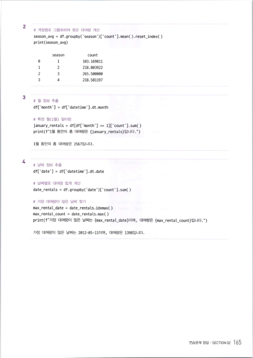
```python
2 
# 계절별로 그룹화하여 평균 대여량 계산
season∼ avg = df.groupby( 'season') [ 'count' ].mean( ) . reset_index( ) 
print(season_avg)
```
season count 0 1 103.169811 1 2 218.803922 2 3 265.500000 3 4 218.581197

```python
# 월 정보 추출 
df[ 'month' ] = dt[ 'datetime' ].dt.month
# 특정 월（1월） 필터링
january_rentals = df[df[ 'month'] == 1][ 'count'] .sum( ) 
print(f "1월 동안의 총 대여량은 {january_rentals｝입니다． " )
```
1월 동안의 총 대여량은 2567입니다．

```python
# 날짜 정보 추술 
df[ 'date '] = df[ 'datetime' ].dt.date
# 날짜별로 대여량 합계 계산
```
date_renta's = df.groupby( 'date')[ 'count '].surn( )

```python
# 가장 대여량이 많은 날짜 찾기
max_rental_date = date_rentals.idxmax()
max_rental_count = date_rentals.max() 
print(f " 가장 대여량이 많은 날짜는 {max_rental_date｝이며』 대여량은 {max_rental_count｝입니다． " )
```
가장 대여량이 많은 날짜는 2012-05-11이며， 대여량은 1398입니다． 연습문제정답· SECTION 02 拓5

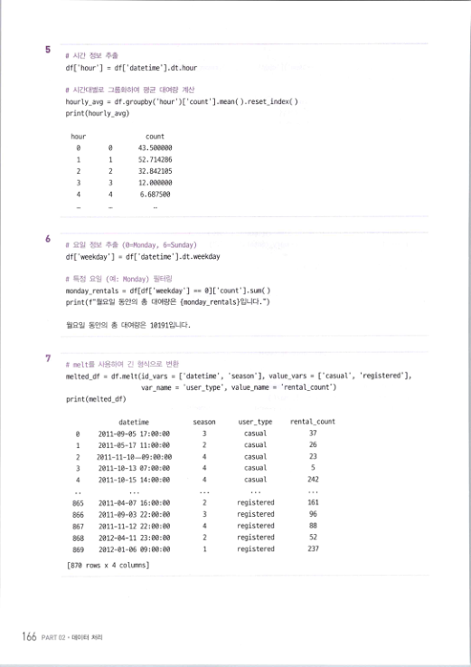
```python
5 
# 시간 정보 추출 
df[ 'hour'] = df[ 'datetime'] .dt.hour
# 시간대별로 그룹화하여 평균 대여량 계산
hourly_avg = df.groupby(' hour ' )['count '] .mean( ) . reset_index( ) 
print(hourly_avg)
```
hour count 0 0 43.500000 1 1 52.714286 2 2 32.842105 3 3 12.000000 4 4 6.687500 6 ＃요일 정보추출 (0=Monday, 6=Sund聊 df[ 'weekday '] = df[ 'datetime'] .dt.weekday

```python
# 특정 요일 (Oil: Monday) 필터링
monday_rentals = df[df[ 'weekday '] == 0]['count' ].suni( ) 
print(f " 월요일 동안의 총 대여량은 {monday_rentals｝입니다． " )
```
월요일 동안의 총 대여량은 10191입니다． 4 melt를 사용하여 긴 형식으로 변환

```python
melted_df = df.melt(id_vars = ['datetime ', 'season'] , value_vars = ['casual', 'registered'] ,
var_name = 'user_type', value_name = 'rental_count ') 
print(melted_df)
```
datetirne season user_type rental_count 0 2011-09-05 17:00:00 3 casual 37 1 2011-05-17 11:00:00 2 casual 26 2 2011-11-10-09:00:00 4 casual 23 3 2011-10-13 07:00:00 4 casual 5 4 2011-10-15 14:00:00 4 casual 242 865 2011-04-07 16:00:00 2 registered 161 866 2011-09-03 22:00:00 3 registered 96 867 2011-11-12 22:00:00 4 registered 88 868 2012-04-11 23:00:00 2 registered 52 869 2012-01-06 09:00:00 1 registered 237 [870 rows x 4 columns] ㄶ6 PART 02 · 데이터 처리

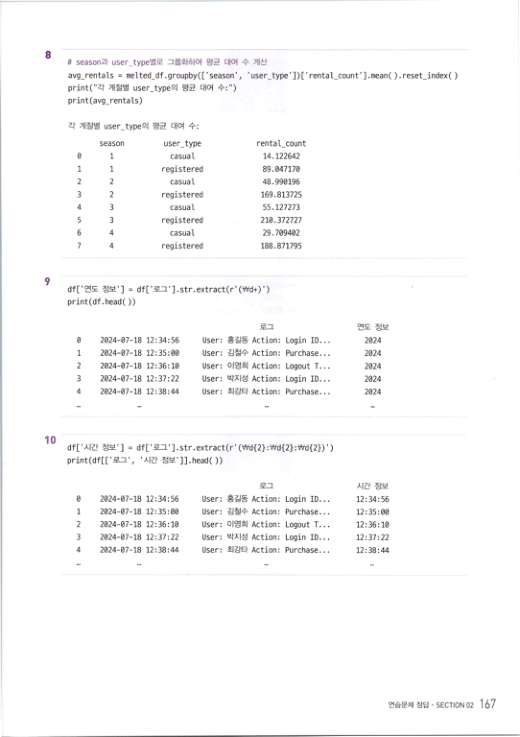
8 It season과 user- type별로 그룹화하여 평균 대여 수 계산

```python
avg_renta's = melted_df.groupby([ 'season' , ' user_type '] )[' rental_count '] .mean( ).reset_index( ) 
print("각 계절별 user_type의 평균 대여 수： " ) 
print(avg_rentals)
```
각 계절별 user_type의 평균 대여 수： season user_type rental_count 1 1 registered 89.047170 3 2 registered 169.813725 5 3 registered 210.37272] 7 4 registered 188.871795

```python
df[ ' 연도 정보 ' ] = df[ ' 로그'I .str.extract(r' (Wd+)') 
print(df.head( ))
```
로그 연도 정보 0 2024-07-18 12:34:56 User: 홍길동 Action: Login ID...

2024 1 2024-07-18 12:35:00 User: 김철수 Action: Purchase...

2024 2 2024-07-18 12:36:10 User: 이영희 Action: Logout 1...

2024 3 2024-07-18 12:37:22 User: 박I성 Action: Login ID...

2024 4 2024-07-18 [2:38:44 User: 최강EF Action: Purchase...

2024 1o df[·AI간정보.] = df[ ·로그·].str.extract(r (Wd{2}:Wd{2}:Wd{2})')

```python
print(df{[ ' 로그 ' , ' 시간 정보 ' ]].head( ))
```
로그 시간 정보 0 2024-07-18 12:34:56 User: 홍길동 Action: Login ID...

12:34:56 1 2024-07-18 12:35:00 User: 김철수 Action: Purchase...

12:35:00 2 2024-07-18 12:36:10 User: 이영희 Action: Logout T...

12:36:10 3 2024-07-18 12:37: 22 User: 박지성 Action: Login ID...

12:37:22 4 2024-07-18 12:38:44 User:

PjEF Action: Purchase...

12:38:44 연습문제 정답．SEC지0N02 167

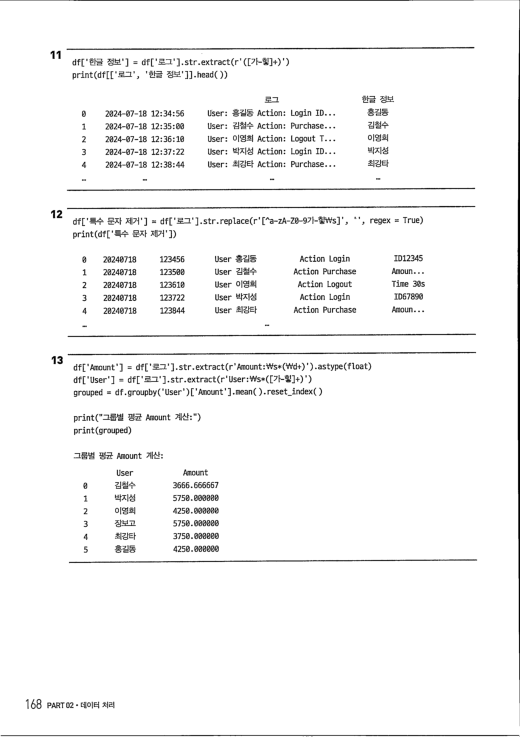
11 df[，힌읕 정보，] = df[．로그：] .str.extract(난（［가－힐］*),)

```python
print(df[ [ ' 로그 ' , ' 힌글 정보 ' ]].head( ))
```
로그 한글 정보 0 2024-07-18 12:34:56 User: 홍길동 Action: Login ID...

홍길동 1 2024-07-18 12:35:00 User: 김철수 Action: Purchase. . .

김철수 2 2024-07-18 12:36:10 User: 이영희 Action: Logout T...

이영희 3 2024-07-18 12:37:22 User= 박지성 Action: Login 工D...

박지성 4 2024-07-18 12:38:44 User: 최강타 Action: Purchase.. .

최강타 12 df[：특수문자제거：] = df[·로그·].str.replace(r· ['a-zA-Z0-9가－힐Ws]', '', regex = True)

```python
print(df I ' 특수 문자 제거 ' 〕）
```
0 20240718 123456 User 흥길동 Action Login ID12345 1 20240718 123500 User 김철수 Action Purchase Amoun...

2 20240718 123610 User 이영희 Action Logout Time 30s 3 20240718 123722 User 박 성 Action Login ID67890 4 20240718 123844 User 강E Action Purchase Amoun...

13 df{ 'Am。unt'] = df{'로그'].str.extract(r'Am。unt:Ws*(Wd*Y).astype(fl。at) df[ 'User '] = df[ ' 로그'] .str.extract(r 'User:Ws*(P'F-힐]+)')

```python
grouped = df.groupby('User') ['Amount' ] .mean( ).resetjndex()
print(" 그룹별 평균 Amount 계산： " ) 
print(grouped)
```
그룹별 평균 Amount 계산： User Amount 0 김철수 3666. 666667 1 박지성 5750. 000000 2 이영희 4250. 000000 3 장보고 5750.000000 4 최강타 3750. 000000 5 홍길동 4250. 000000 拓8 PART02· 데이터처리

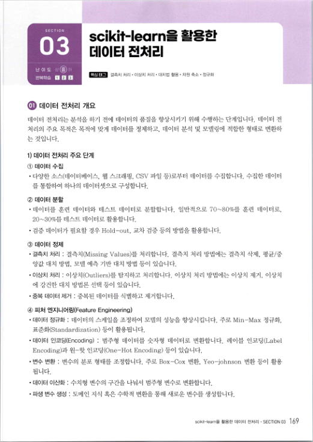
# scikif-lea rn을 활용한 
데이터 전처리 SECTION 난 이 도 嚆＞ 핵심 태그 결측치 처리 · 이상치 처리 · 대치법 활용 · 차원 축소 · 정규화 반복학습 .. 빼 聊 .

데이터 전처리 개요 데이터 전처리는 분석을 하기 전에 데이터의 품질을 향상시키기 위해 수행하는 단계입니다 . 데이터 전 처리의 주요 목적은 목적에 맞게 데이터를 정제하고 , 데이터 분석 및 모델링에 적합한 형태로 변환하 는 것입니다． 1) 데이터 전처리 주요 단계 ① 데이터 수집

- 다양한소스（데이터베이스 , 웹 스크래핑 , csV 파일 등）로부터 데이터를수집합니다 . 수집한 데이터
를 통합하여 하나의 데이터셋으로 구성합니다． ② 데이터 분할

- 데이터를 훈련 데이터와 테스트 데이터로 분할합니다 . 일반적으로 70'--80％를 훈련 데이터로，
20'-30％를 테스트 데이터로 활용합니다．

- 검증 데이터가 필요할 경우 Hold-out , 교차 검증 등의 방법을 활용합니다．
③ 데이터 정제

- 결측치 처리 : 결측치（Missing Values）를 처리합니다 . 결측치 처리 방법에는 결측치 삭제 , 평균／중
앙값 대치 방법 , 모델 예측 기반 대치 방법 등이 있습니다．

- 이상치 처리 : 이상치（Outliers）를 탐지하고 처리합니다 . 이상치 처리 방법에는 이상치 제거 , 이상치
에 강건한 대치 방법론 선택 등이 있습니다．

- 중복 데이터 제거 : 중복된 데이터를 식별하고 제거합니다．
④ 피처 엔지니어링（Feature En聊neering)

- 데이터 장규화 : 데이터의 스케일을 조정하여 모델의 성능을 향장시킵니다 . 주로 Min-Max 蔘子화，
표준화＜Standardization) 등이 활용됩니다．

- 데이터 인코딩（Encoding) : 범주형 데이터를 숫자형 데이터로 변환합니다 . 레이블 인코딩（Label
Encoding）과 원－핫 인코딩（One-Hot Encoding) 등이 있습니다．

- 변수 변환 : 변수의 분포 형태를 조정합니다 . 주로 Box-Cox 변환 , Yeo-johnson 변환 등아 활용
됩니다．

- 데이터 이산화 : 수치형 변수의 구간을 나눠서 범주형 변수로 변환합니다．
- 파생 변수 생성 : 도메인 지식 혹은 수학적 변환을 통해 새로운 변수를 생성합니다 .
scikit-learn을 활용한 데이터 전처리 . SECTION 03 169

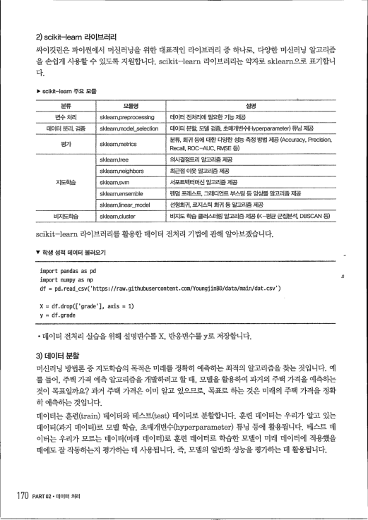
2) scikit-learn 라이브러리 싸이킷런은 파이썬에서 머신러닝을 위한 대표적인 라이브러리 중 하나로， 다양한 머신러닝 알고리즘 을 손쉽게 사용할 수 있도록 지원합니다 . scikit-learn 라이브러리는 약자로 sklearn으로 표기합니 다． J scikit-learn 주요 모듈 분류 모듈명 설명 변수 처리 sklearn.preprocessing 데이터 전처리에 필요한 기능 제공 데이터 분리 , 검증 sklearn.model selection 데이터 분할, 모델 검증 , 초매개변수（Hyperparameter) 튜닝 저居 펑가 sklearn .metrics 분류， 회귀 등에 대한 다양한 성능 측정 방법 제공 (Accuracy, Precision, Recall, ROC-AUC, RMSE 등 ) sklearn.tree 의사결정트리 알고리즘 저긍 sklearn.neighbors 최근접 이웃 알고리즘 저꼼 sklearn .svm 서포트벡터머신 알고리즘 제공 지도학습 sklearn .ensemble 랜덤 포레스틔 그래디언트 부스팅 등 앙상블 알고리즘 제공 sklearniinear model 선형회귀 . 로지스틱 회귀 등 알고리즘 제공 비지도학습 sklearn.cluster 비지도 학습 클러스터링 알고리즘 저꼼 帆굉균 군집분석 . DBSCAN 등） scikit-learn 라이브러리를 활용한 데이터 전처리 기법에 관해 알아보겠습니다． ▼ 학생 성적 데이터 불러오기

```python
import pandas as pd 
import numpy as np 
df = pd.read_csv( 'https://raw.githubusercontent.com/YoungjinBD/data/main/dat.csv')
```
f,

```python
X = df.drop([ 'grade 'J, axis = 1)
y = df.grade
```
- 데이터 전처리 실습을 위해 설명변수를 x , 반응변수를 y로 저장합니다．
3) 데이터 분할 머신러닝 방법론 중 지도학습의 목적은 미래를 정확히 예측하는 최적의 알고리즘을 찾는 것입니다 . 예 를 들어 , 주택 가격 예측 알고리즘을 개발하려고 할 때 , 모델을 활용하여 과거의 주택 가격을 예측하는 것이 목표일까요？ 과거 주택 가격은 이미 알고 요脾므로 , 목표로 하는 것은 미래의 주택 가격을 정확 히 " 예측하는 것입니다． 데이터는 훈련（train) 데이터와 테스트（test) 데이터로 분할합니다 . 훈련 데이터는 우리가 알고 있는 데이터（과거 데이터）로 모델 학습 , 초매개변수（hyperparameter) 튜닝 등에 활용됩니다 . 데스트 데 이터는 우리가 모르는 데이터（미래 데이터）로 훈련 데이터로 학습한 모델이 미래 데이터에 적용했을 때에도 잘 작동하는지 평가하는 데 사용됩니다 . 즉 , 모델의 일반화 성능을 평가하는 데 활용됩니다． 170 PART02．데이터처리

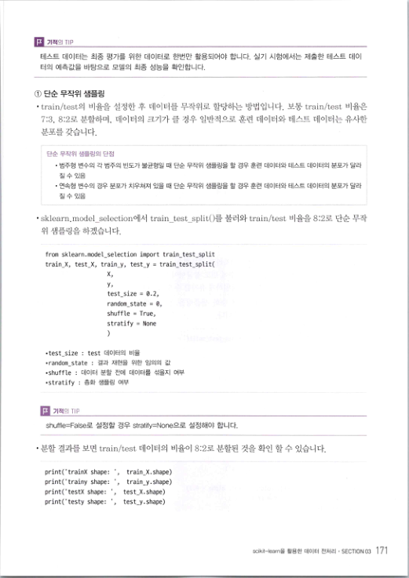
테스트 데이터는 최종 평가를 위한 데이터로 한번만 활용되어야 합니다 . 실기 시험에서는 제출한 테스트 데이 터의 예측값을 바탕으로 모델의 최종 성능을 확인합니다． ① 단순 무작위 샘플링

- train/test의 비율을 설정한 후 데이터를 무작위로 할당하는 방법입니다 . 보통 train/test 비율은 
7:3, 8:2로 분할하며 , 데이터의 크기가 클 경우 일반적으로 훈련 데이터와 테스트 데이터는 유사한 분포를 갖습니다． 단순 무작위 샘플링의 단점

- 범주형 변수의 각 범주의 빈도가 불균형일 【ㅙ 단순 무작위 샘플링을 할 경우 훈련 데이터와 테스트 데이터의 분포가 달라
질 수 있음

- 연속형 변수의 경우 분포가 치우쳐져 있을 때 단순 무작위 샘플링을 할 경우 훈련 데이터와 테스트 데이터의 분포가 달라
질 수 있음

- sklearn.model selection에서 train_test_split(）를 불러와 train/test 비율을 8:2로 단순 무작
위 샘플링을 하겠습니다．

```python
from sklearn.model_selection import train_test_split 
train_X, test_X, train_y, test_y = train_test_split( 
x, 
y, 
test_size = 0.2,
random_state = 0, 
shuffle = True, 
stratify = None 
)
```
- test size : test 데이터의 비율
- random state : 결과 재현을 위한 잉의의 값 
- shuffle = 데이터 분할 전에 데이터를 섞을지 여부 
.stratify : 층화 샘플링 여부 ．헴 기적의 TI P

```python
shutfle=False로 설정할 경우 stratify=None으로 설정해야 합니다．
```
- 분할 결과를 보면 train/test 데이터의 비율이 8:2로 분할된 것을 확인 할 수 있습니다．
```python
print('trainX shape: ', train_X.shape) 
print('trainy shape: ', train_y.shape) 
print('testX shape: ' , 
test_X.shape) 
print(testy shape: ' , 
test_y.shape)
```
scikit-learn을 활용한 데이터 전처리 . SECTION 03 171

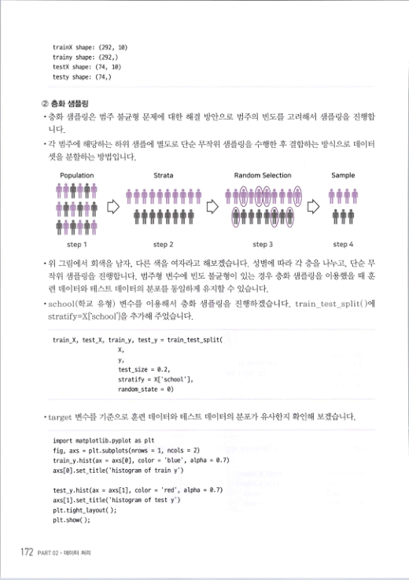
trainX shape: (292, 10) trainy shape: (292,) testX shape: (74, 10) testy shape: (74,) ② 층화 샘플링

- 층화 샘플링은 범주 불균형 문제에 대한 해결 방안으로 범주의 빈도를 고려해서 샘플링을 진행합
니다．

- 각 범주에 해당하는 하위 샘플에 별도로 단순 무작위 샘플링을 수행한 후 결합하는 방식으로 데이터
셋을 분할하는 방법입니다．

# Pooulation 
Strata Random Selection 悛悛 A* ft ft ft * * * I]III] Sample

# 獅岬焌0 
0枓衿⑨째

# 枓＊* 
*** step 2 step 3 step 4 step 1

- 위 그림에서 회색을 남자 , 다른 색을 여자라고 해보겠습니다 . 성별에 따라 각 층을 나누고 , 단순 무
작위 샘플링을 진행합니다 . 범주형 변수에 빈도 불균형이 있는 경우 층화 샘플링을 이용했을 때 훈 련 데이터와 테스트 데이터의 분포를 동일하게 유지할 수 있습니다．

```python
·school（학교 유형） 변수를 이용해서 층화 샘플링을 진행하겠습니다 . train_test_split(）에 
stratify=X['schoo니을 추가해 주었습니다．
```
train_X, test_X, train_y, test_y = train_test_spiit( x, y, test_size 볍 0.2, stratify = XE ' school '],

```python
random_state = 0)
```
- target 변수를 기준으로 훈련 데이터와 테스트 데이터의 분포가 유사한지 확인해 보겠습니다．
```python
import matpiotiib.pyplot as pit 
fig, axs = pit.subpiots(nrows = 1, ncois = 2) 
train_y.hist(ax = axs[0], color = ' blue ', alpha = 0.7)
```
axs[0] .set_titie( 'histogram of train y ') test_y.hist(ax = axs[1], color = 'red', alpha = 0.7) axs[1] .set_titie( 'histogram of test y') pit. tight_layout ( ); pit. showO; 172 PART02 . 데이터 처리

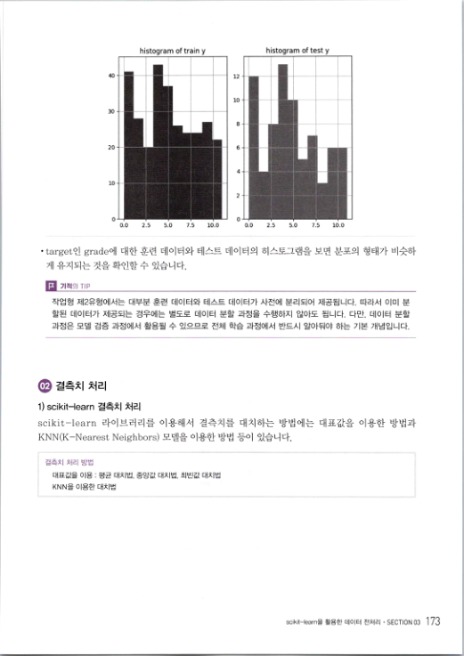
histogram of train y histogram of test y

- ~ 
{ 탕 2.5 5.0 7.5 10.0

- target인 grade에 대한 훈련 데이터와 테스트 데이터의 히스토그램을 보면 분포의 형태가 비슷하
게 유지되는 것을 확인할 수 있습니다．

### r헴 기적의 지P
작업형 제2유형에서는 대부분 훈련 데이터와 테스트 데이터가 사전에 분리되어 제공됩니다 . 따라서 이미 분 할된 데이터가 제공되는 경우에는 별도로 데이터 분할 과정을 수행하지 않아도 됩니다 . 다만 , 데이터 분할 과정은 모델 검증 과정에서 활용될 수 있으므로 전체 학습 과정에서 반드시 알아둬야 하는 기본 개념입니다． .

결측치 처리 1) scikit-learn 결측치 처리 scikit-learn 라이브러리를 이용해서 결측치를 대치하는 방법에는 대표값을 이용한 방법과 KNN(K-Nearest Neighbors) 모델을 이용한 방법 등이 있습니다． 결측치 처리 방법 대표값을 이용 : 평균 대치법 , 중앙값 대치법 , 최빈값 대치법 l KNN을이용한대치법 scikit-learn을 활용한 데이터 전처리 · SECTION 03 173

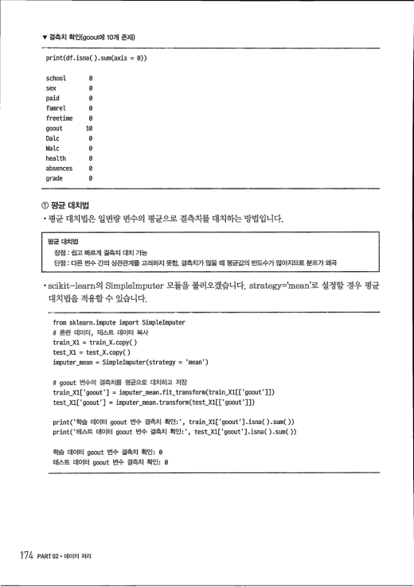
▼ 결측치 확인《gooutOl! 10개 존재）

```python
print(df.isnaQ.sum(axis = 0))
```
S(力ool l〕 sex 0 paid 0 famrel.

0 freetime 0 goout 10 Da1.c 0 wal.c 0 health 0 absences 0 grade 0 ① 평균 대치법

- 평균 대치법은 일변량 변수의 평균으로 결측치를 대치하는 방법입니다．
평균 대치법 장점 : 쉽고 빠르게 결측치 대치 가능 단점 : 다른 변수 간의 상관관계를 고려하지 못함, 결측치가 많을 때 평균값의 빈도수가 많아지므로 분포가 왜곡

- scikit-learn의 Simplelmputer 모듈을 불러오겠습니다 . strategy='mean'로 설정할 경우 평균
대치법을 적용할 수 있습니다．

```python
from sklearn.impute import Simplelmputer
# 훈련 데이터， 테스트 데이터 복사 
train_X1 = train_X.copy() 
test_X1 = test_X.copy() 
imputer_mean = Siniplelmputer(strategy = ' mean')
# goout 변수의 결측치를 평균으로 대치하고 저장 
train_X1[ 'goout'] = imputer_mean.fit_transform(train_X1[[ 'goout' II) 
test_X1{ 'goout '] = imputer_mean.transform(test_X1[Pgoout'] ])
print(' 학습 데이터 goout 변수 결측치 확인： ', train_X1[ 'goout'] .isnaO.sumQ) 
print(' 테스트 데이터 goout 변수 결측치 확인： ' , test_X1[ 'goout'J.isna( ).sumO)
```
학습 데이터 goout 변수 결측치 확인： 0 테스트 데이터 goout 변수 결측치 확인： 0 174 PART 02. 데이터 처리

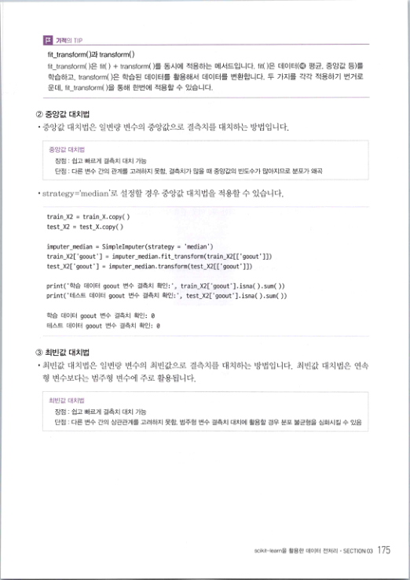
.

기적의 져p fit_transform( )21 transform() fit_transform( ）은 fit() + transform()를 동시에 적용하는 메서드입니다 . fit( ）은 데이터（0 평균 , 중앙값 등）를 학습하고 . transform(）은 학습된 데이터를 활용해서 데이터를 변환합니다 . 두 가지를 각각 적용하기 번거로 운데 , fit_transform( ）을 통해 한번에 적용할 수 있습니다． ② 중앙값 대치법

- 중앙값 대치법은 일변량 변수의 중앙값으로 결측치를 대치하는 방법입니다．
중앙값 대치법 장점 : 쉽고 빠르게 결측치 대치 가능 단점 : 다른 변수 간의 관계를 고려하지 못함 . 결측치가 많을 때 중앙값의 빈도수가 많아지므로 분포가 왜곡

- strategy='median'로 설정할 경우 중앙값 대치법을 적용할 수 있습니다．
```python
train_X2 = train_X.copy() 
test_X2 = test_X.copy()
imputer_median = Simplelmputer(strategy = 'median ') 
train_X2[ ' goout ' J = imputer_median.fit_transform(train_X2[['goout '] ]) 
test_X2[ ' goout'] = imputer_median.transform(test_X2[[ 'goout'] ])
print(' 학습 데이터 goout 변수 결측치 확인＝ ' , train_X2[ 'goout '] .isna( ).sum() ) 
print(' 테스트 데이터 goout 변수 결측치 확인＝ ' , test_X2{ 'goout'] .isna( ).sum( ))
```
학습 데이터 goout 변수 결측치 확인＝ 0 테스트 데이터 goout 변수 결측치 확인＝ 0 ③ 최빈값 대치법

- 최빈값 대치법은 일변량 변수의 최빈값으로 결측치를 대치하는 방법입니다 . 최빈값 대치법은 연속
형 변수보다는 범주형 변수에 주로 활용됩니다． 최빈값 대치법 ' 장점 : 쉽고 빠르게 결측치 대치 가능 단점 : 다른 변수 간의 상관관계를 고려하지 못함 , 범주형 변수 결측치 대치0ㅔ 활용할 경우 분포 불균형을 심화시킬 수 있음 scikit-learn을활용한데이터전처리· SECTION 03 175

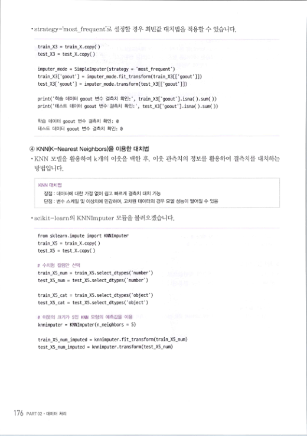
- strategy='most_frequent'로 설정할 경우 최빈값 대치법을 적용할 수 있습니다．
```python
train_X3 = train_X.copy() 
test_X3 = test_X.copy()
```
imputer- mode = Simplelmputer(strategy = ' most_frequent') train_X3[ ' goout'] = imputer_mode.fit_transform(train_X3[['goout'] ]) test_X3[ 'goout'] = imputer_mode.transform(test_X3[{'goout'] ])

```python
print(' 학습 데이터 goout 변수 결측치 확인： ' , train_X3[ 'goout'] .isna( ).sum()) 
print(' 테스트 데이터 goout 변수 결측치 확인： ' , test_X3[ 'goout'] .isna( ).sumO)
```
학습 데이터 goout 변수 결측치 확인： 0 테스트 데이터 goout 변수 결측치 확인＝ 0 ④KNN(K-Nearest Nei아ibors）을 이용한 대치법

- KNN 모델을 활용하여 k개의 이웃을 택한 후 , 이웃 관측치의 정보를 활용하여 결측치를 대치하는
방법입니다． KNN 대치법 장점 : 데이터에 대한 가정 없이 쉽고 빠르게 결측치 대치 가능 단점 : 변수 스케일 및 이상치에 민감하며 . 고차원 데이터의 경우 모델 성능이 떨어질 수 있음

- scikit-learn의 KNNlmputer 모듈을 불러오겠습니다．
```python
from sklearn.impute import KNNlmputer 
train_X5 = train_X.copy() 
test_X5 = test_X.copy()
# 수치형 칼럼만 선택 
train_X5_num = train_X5.setect_dtypes( 'number') 
test_X5_num = test_X5. select_dtypes( 'number')
train_X5_cat = train_X5.select_dtypes( 'object') 
test_X5_cat = test_X5.select_dtypes('object')
# 이웃의 크기가 5인 K附』 모형의 예측값을 이용
knnimputer = KNNlmputer(n_neighbors = 5)
train_X5_num_imputed = knnimputer. fit_transform(train_X5_num) 
test_X5_num_imputed = knnimputer. transform(test_X5_num)
```
176 PART02· 데이터 처리

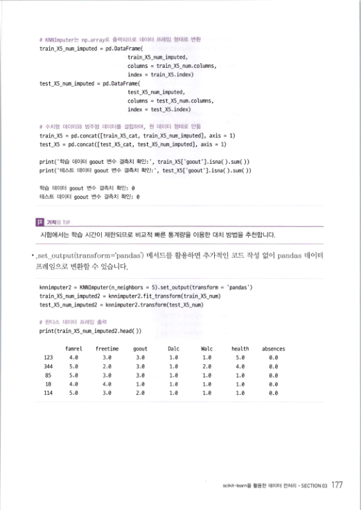
```python
# KNNlmputer는 np.array로 출력되므로 데이터 프레임 형태로 변환
trainX5_num_imputed = pd. DataFrame( 
train_X5_num_imputed,
columns = train_X5_num.columns, 
index = train_X5.index) 
test_X5_num_imputed = pd. DataFrame( 
test_X5_num_imputed,
columns = test. X5_num.columns,
index = test_X5.index)
# 수치형 데이터와 범주형 데이터를 결합하여， 원 데이터 형태로 만듦 
train_X5 = pd.concat([train. X5_cat, train_X5_num_imputed], axis = 1) 
test_X5 = pd.concat([test_X5_cat, test_X5_num_imputed], axis = 1)
print(' 학습 데이터 goout 변수 결측치 확인： ' , train_X5[ 'goout '] .isna( ).sum( )) 
print(' 테스트 데이터 goout 변수 결측치 확인＝ ' , test_X5[ 'goout 'J.isna( ).sumO)
```
학습 데이터 goout 변수 결측치 확인： 0 테스트 데이터 goout 변수 결측치 확인＝ 0 ．헴 기적의 ㄲp 시험에서는 학습 시간이 제한되므로 비교적 빠른 통계량을 이용한 대치 방법을 추천합니다．

- .set_output(transform='pandas') 메서드를 활용하면 추가적인 코드 작성 없이 pandas 데이터
프레임으로 변환할 수 있습니다．

```python
knnimputer2 = KNNlmputer(n_neighbors = 5).set_output(transform = ' pandas' ) 
train_X5_num_imputed2 = knnimputer2. fit_transform(train_X5_num) 
test_X5_num_imputed2 = knnimputer2. transform(test_X5_num)
# 판다스 데이터 프레임 츤갇f 
print(train_XS_num_imputed2.head( ))
```
famrel freetime goout Dalc Walc health absences 123 4.0 3.0 3.0 1.0 1.0 5.0 0.0 344 5.0 2.0 3.0 1.0 2.0 4.0 0.0 85 5.0 3.0 3.0 1.0 1.0 1.0 0.0 18 4.0 4.0 1.0 1.0 1.0 1.0 0.0 114 5.0 3.0 2.0 1.0 1.0 1.0 0.0 scikit-learn을 활용한 데이터 전처리 . SECTION 03 177

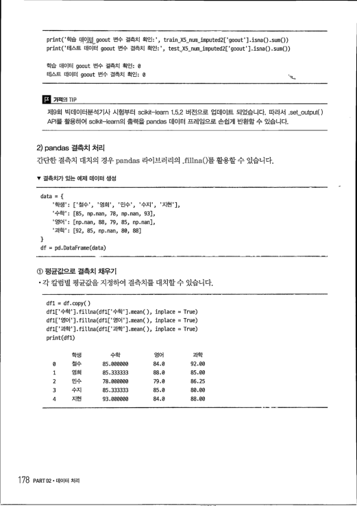
```python
print(' 학습 덴ot텄 , goout 변수 결측치 획21: ', train_X5_nuni_imputed2['goout ' I .isna() .sumQ) 
print(' 테스트 데이터 goout 변수 결측치 확인： ', test_X5_nurn_1mputed2[ ' goout ' ] . isna 0. sumO)
```
학습 데이터 goout 변수 걸측치 확인： 0 테스트 데이터 goout 변수 결측치 확인＝ 0 【헴 기적의 ㄲp 제9회 빅데이터분석기사 시험부터 scikit-learn t5.2 버전으로 업데이트 되었습니다 . 따라서 . set_output() API를 활용하여 scikit-learn의 출력을 pandas 데이터 프레임으로 손쉽게 반환할 수 있습니다， 2) pandas 결측치 처리 간단한 결측치 대치의 경우 pandas 라이브러리의 . flllna(）를 활용할 수 있습니다． ▼ 결측치가 있는 예제 데이터 생성

```python
data = { 
' 학생 ' : [. ' 철수 ' , ' 영희 ' , ' 민수 ' , ' 수지 ' , ' 지현 ' ], 
' 수학 ': [85, np.nan, 78, np.nan, 93],
```
' 영어 ': [np.nan, 88, 79, 85, np.nan], ' Z학 ': [92, 85, np.nan, 80, 88]

```python
df = pd.DataFrame(data)
```
① 평균값으로 결측치 채우기

- 각 칼럼별 평균값을 지정하여 결측치를 대치할 수 있습니다．
```python
dfi = df.copy() 
df if ' 수학 ' 〕．fiiLna(dfi[ ' 수학 ' 그．mean( ), inpiace = True) 
dfi[ ' 영어 '] .fillna(dfi[ ' 영어'] .meanO, inpl.ace = True) 
dfi{'
F학 '] .fiflna{dfi[ ' 과학 '] .meanO, inp.ace = True) 
print(dfi)
```
학생 수학 영어 과학 0 철수 85.000000 84.0 92.00 1 영희 85.333333 88.0 85.00 2 민수 78.000000 79.0 86.25 3 수지 85.333333 85.0 80.00 4 지현 93.000000 84.0 88.00 178 PART02. 데이터 처리

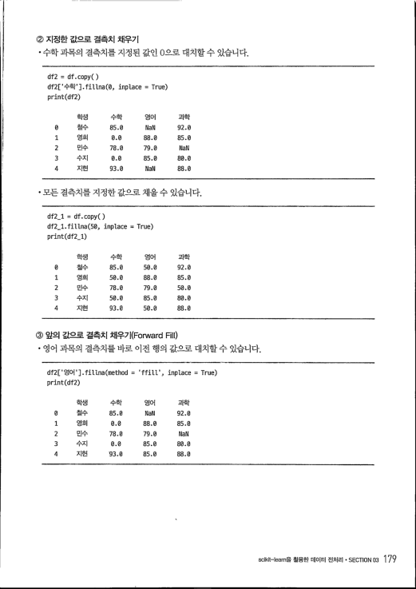
② 지정한 값으로 결측치 채우기

- 수학 과목의 결측치를 지정된 값인 U으로 대치할 수 있습니다．
```python
df2 = df.copy() 
df2[ ' 수학'] .fil1.na(0, inpl.ace = True) 
print(df2)
```
학생 수학 영어 과학 0 철수 85.0 NaN 92.0 1 영희 0.0 88.0 85.0 2 민수 78.0 79.0 NaN 3 수지 0.0 85.0 80.0 4 지현 93.0 NaN 88.0

- 모든 결측치를 지정한 값으로 채울 수 있습니다．
```python
df2_1 = df. copy() 
df2_1.fiflna(50, inpl.ace = True) 
print(df2_1)
```
학생 수학 영어 과학 0 철수 85.0 50.0 92.0 1 영희 50.0 88.0 85.0 2 민수 78.0 79.0 50.0 3 수지 50.0 85.0 80.0 4 지현 93.0 50.0 88.0 ③ 앞의 값으로 결측치 채우기（Forward F뺘

- 영어 과목의 결측치를 바로 이전 행의 값으로 대치할 수 있습니다．
```python
df2[ ' 영어'] .fiU.na(method = 'ff111', inpiace = True) 
print(df2)
```
학생 수학 영어 과학 0 철수 85.0 NaN 92.0 1 영희 0.0 88.0 85.0 2 민수 78.0 79.0 NaN 3 수지 0.0 85.0 80.0 4 지현 '93.0 85.0 88.0 scikit-learn을 활용한 데이터 전처리 · SECTION 03 179

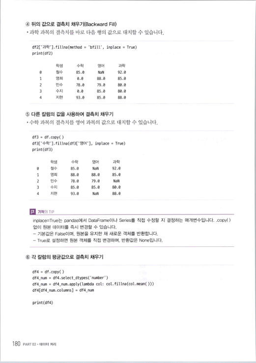
④ 뒤의 값으로 결측치 채우기（Backward F삐

- 과학 과목의 결측치를 바로 다음 행의 값으로 대치할 수 있습니다．
```python
df2[ '2F학' ].fiflna (rnethod = ' bfifl' , inplace = True) 
print(df 2)
```
학생 수학 영어 과학 0 철수 85.0 NaN 92.0 1 영희 0.0 88.0 85.0 2 민수 78.0 79.0 80.0 3 수지 0.0 85.0 80.0 4 지현 93.0 85.0 88.0 ⑤ 다른 칼럼의 값을 사용하여 결측치 채우기

- 수학 과목의 결측치를 영어 과목의 값으로 대치할 수 있습니다．
```python
df3 = df.copy( ) 
df3[ ' 수학' ].fillna (df3[ '영어 '] , inpiace = True) 
print(df3)
```
학생 수학 영어 과학 0 철수 85.0 NaN 92.0 1 영희 88.0 88.0 85.0 2 민수 78.0 79.0 NaN 3 수지 85.0 85.0 80.0 4 지현 93.0 NaN 88.0 .

기적의 지p

```python
In이ace=True는 pandas에서 DataFrame이나 Series를 직접 수정할 지 결정하는 매개변수입니다 . .copy()
```
없이 원본 데이터를 즉시 변경할 수 있습니다． 기본값은 False이며 , 원본을 유지한 채 새로운 객체를 반환합니다．

- True로 설정하면 원본 객체를 직접 변경하며 , 반환값은 None입니다．
⑥ 각 칼럼의 평균값으로 결측치 채우기

```python
df4 = df.copy() 
df4_num = df4.select_dtypes( 'number ')
df4_num = df4_num.apply(lambda col: col.fiflna(coLmean( )))
```
df4[df4_num.columns] = clf4_num

```python
print(df4)
```
180 PART02. 데0圈 처리

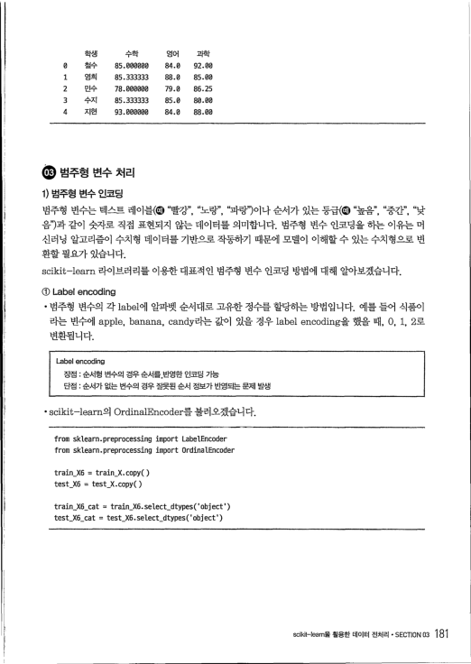
학생 수학 영어 과학 0 철수 85.000000 84.0 92.00 1 영희 85.333333 88.0 85.00 2 J수 78.000000 79.0 86.25 3 수지 85.333333 85.0 80.00 4 지현 93.000000 84.0 88.00 ㅇ 범주형 변수 처리 1) 범주형 변수 인코딩 범주형 변수는 텍스트 레이블（ㅇ " 빨강" , " 노랑， ' , " 파랑”）이나순서가 있는등급（.I " 높음" , " 중간" , " 낮 음"）과 같이 숫자로 직접 표현되지 않는 데이터를 의미합니다 . 범주형 변수 인코딩을 하는 이유는 머 신러닝 알고리즘이 수치형 데이터를 기반으로 작동하기 때문에 모델이 이해할 수 있는 수치형으로 변 환할 필요가 있습니다． scikit-learn 라이브러리를 이용한 대표적인 범주형 변수 인코딩 방법에 대해 알아보겠습니다 .

①Label encoding

- 범주형 변수의 각 label에 알파벳 순서대로 고유한 정수를 할당하는 방법입니다 . 예를 들어 식품이
라는 변수에 apple, banana, candy라는 값이 있을 경우 label encoding을 했을 때 , 0, 1, 2로 변환됩니다． Label encoding 장점 : 순서형 변수의 경우 순서를 . 반영한 인코딩 가능 단점 : 순서가 없는 변수의 경우 잘못된 순서 정보가 반영되는 문제 발생

- scikit-learn의 OrdinalEncoder를 불러오겠습니다．
```python
from sklearn.preprocessing import LabelEncoder 
from skl.earn.preprocessing import Ordinal.Encoder
train_X6 = train_X.copy() 
test_X6 = test_X.copy()
train_X6_cat = train_X6. sel.ect_dtypes( 'object') 
test_X6_cat = test_X6 . select_dtypes( 'object')
```
scikit-leam을활용한데이터전처리· SECTION 03 181

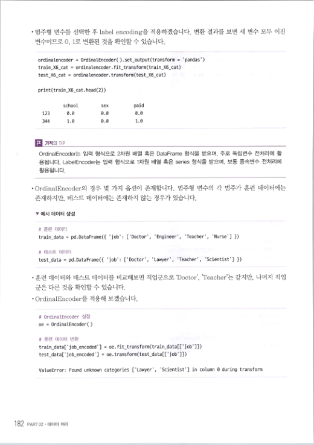
- 범주형 변수를 선택한 후 label encoding을 적용하겠습니다 . 변환 결과를 보면 세 변수 모두 이진
변수이므로 0, 1로 변환된 것을 확인할 수 있습니다．

```python
ordinalencoder = ordinalEncoder( ).set_output(transform = 'pandas ') 
train_X6_cat = ordinalencoder. fit_transform(train_X6_cat) 
test_X6_cat = ordinalencoder. transform(test_X6_cat)
print(train_X6_cat . head(2))
```
school sex paid 123 0.0 0.0 0.0 344 1.0 0.0 1.0 .

기적의 뀌p OrdinalEncoder는 입력 형식으로 2차원 배열 혹은 DataFrame 형식을 받으며 , 주로 독립변수 전처리에 활 용됩니다 . LabelEncoder는 입력 형식으로 1차원 배열 혹은 series 형식을 받으며 , 보통 종속변수 전처리에 활용됩니다．

- OrdinalEncoder의 경우 몇 가지 옵션이 존재합니다 . 범주형 변수의 각 범주가 훈련 데이터에는
존재하지만 , 테스트 데이터에는 존재하지 않는 경우가 있습니다． ▼ 예시 데이터 생성

```python
# 훈련 데이터 
train_data = pd.DataFrame({ job ' : ['Doctor , ' Engineer', 'Teacher , 'Nurse'] })
# 테스트 데이터 
test- data = pd.DataFrame({ 'job' : ['Doctor ', 'Lawyer' , ' Teacher' , ' Scientist'] })
```
- 훈련 데이터와 테스트 데이터를 비교해보면 직업군으로 ' Doctor', 'Teacher'는 같지만 , 나머지 직업
군은 다른 것을 확인할 수 있습니다．

- OrdinalEncoder를 적용해 보겠습니다．
```python
# ordirialEncoder 설정
oe = OrdinalEncoder()
# 훈련 데이터 변환 
train_data{'job_encoded'] = oe.fit_transform(train_data[['job'] ]) 
test_data['job_encoded'] = oe.transform(test_data[[ 'job']])
```
ValueError: Found unknown categories ['Lawyer', 'Scientist'] in column 0 during transform 炤2 PART 02. 데이터 처리

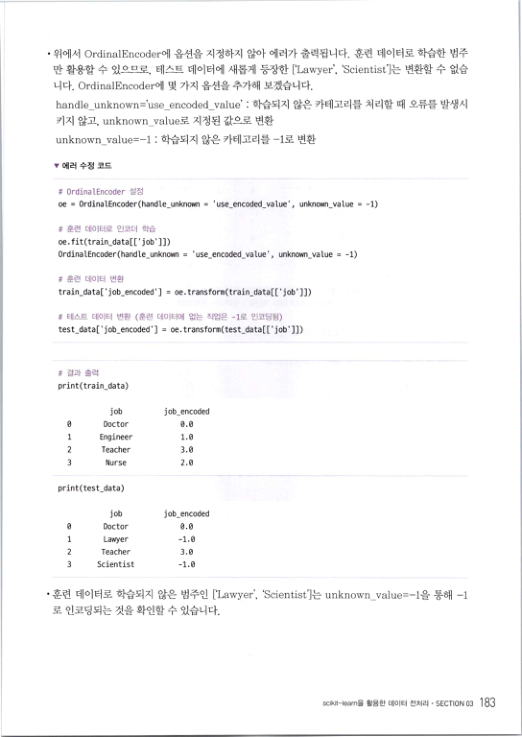
- 위에서 OrdinalEncoder에 옵션을 지정하지 않아 에러가 출력됩니다 . 훈련 데이터로 학습한 범주 
만 활용할 수 있으므로 , 테스트 데이터에 새롭게 등장한 ['Lawyer', 'Scientist〕는 변환할 수 없습 니다 . OrdinalEncoder어I 몇 가지 옵션을 추가해 보겠습니다． handle unknown='use encoded value' : 학습되지 않은 카테고리를 처리할 때 오류를 발생시 키지 않고 , unknown_value로 지정된 값으로 변환

```python
unknown_va1ue=-1 : 학습되지 않은 카테고리를 -1로 변환
```
▼ 에러 수정 코드

```python
# 0rdinalEncoder 설정
oe = OrdinalEncoder(handle_unknown = ' use_encoded_value , unknown∼ value = -1)
# 훈련 데이터로 인코더 학습
```
oe. fit (train_data[[ 'job'))) OrdinalEncoder(handle unknown = ' use_encoded_value', unknown value = -1)

```python
# 훈련 데이터 변횐 
train_data[ 'job_encoded' ] = oe. transform(train_data[['job' ]])
# 테스트 데이터 변환 （훈련 데이터0ㅔ 없는 직업은 -1로 인코딩됨） 
test_data[ job_encoded' ] = oe. transform(test_data{['job' ]])
# 결과 출력 
print(train- data)
```
job job_encoded 0 Doctor 0.0 1 Engineer 1.0 2 Teacher 3.0 3 Nurse 2.0

```python
print(test_data)
```
job job_encoded 0 Doctor 0.0 1 Lawyer -1.0 2 Teacher 3.0 3 Scientist -1.0

- 훈련 데이터로 학습되지 않은 범주인 〔'Lawyer', 'Scientistㄱ는 unknown_value=-1을 통해 -1 
로 인코딩되는 것을 확인할 수 있습니다． scikit-learn을 활용한 데이터 전처리 · SECTION 03 炤3

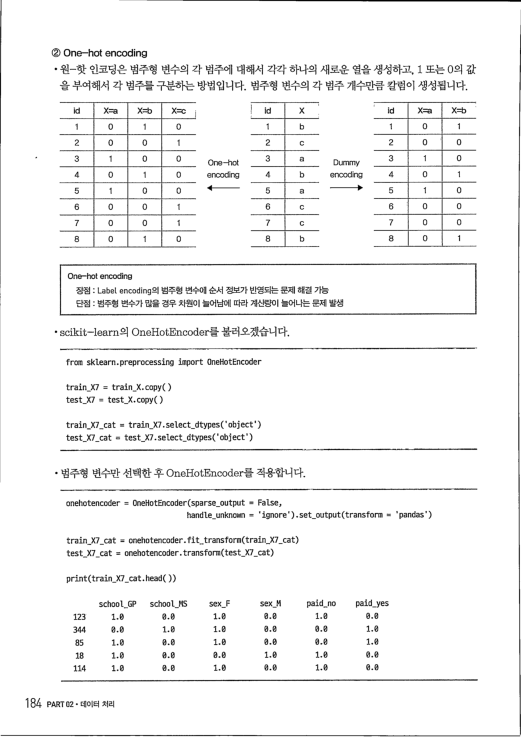
②One-hot encoding

- 원－핫 인코딩은 범주형 변수의 각 범주에 대해서 각각 하나의 새로운 열을 생성하고 , 1 또는 0의 값
을부여해서 각 범주를 구분하는 방법입니다 . 범주형 변수의 각 범주 개수만큼 칼럼이 생성됩니다． ㅣ Id X Id X=a Xb Id

```python
Xa 
Xb 
X=c
```
1 b 1 0 1 1 0 1 0 2 c 2 0 0 2 0 0 1 3 a n. .---－一 3 1 0 L)Ut iiiiy 4 b encoding 1 0 0 3 0ne-hot 4 0 1 4 0 1 0 encoding 콱… → 5 a 5 1 0 5 1 0 0 0 0 6 6 c 6 0 0 1 0 0 7 7 c 7 0 0 1 1 0 8 8 b 0 8 0 1 0ne-hot encoding 장점 : Labet encoding의 범주형 변수에 순서 정보가 반영되는 문제 해결 가능 단점 : 범주형 변수가 많을 경우 차원이 늘어남에 따라 계신턍이 늘어나는 문제 발생

- scikit-learn의 OneHotEncoder를 불러오겠습니다．
```python
from skl.earn.preprocessing import OneHotEncoder
train_X7 = train_X.copy() 
test_X7 = test_X.copy()
train_X7_cat = train_X7 . s&.ect_dtypes(' object') 
test_X7_cat = test_X7. select_dtypes( ' objects)
```
- 범주형 변수만 선택한 후 OneHotEncoder를 적용합니다．
```python
onehotencoder = OneHotEncoder(sparse_output = Fa1.se, 
hand.e_unknown = 'ignore').set_output(transform = 'pandas')
train_X7_cat = onehotencoder. fit_transform(train_X7_cat)
test_X7_cat = onehotencoder. transform(test_X7_cat)
print(train_X7_cat.head() )
```
school_GP school_MS sex_F sex_M paid_no paid_yes 123 1.0 0.0 1.0 0.0 1.0 0.0 344 0.0 1.0 1.0 0.0 0.0 1.0 85 1.0 0.0 1.0 0.0 0.0 1.0 18 1.0 0.0 0.0 1.0 1.0 0.0 114 1.0 0.0 1.0 0.0 1.0 0.0 184 PART02. 데이터 처리

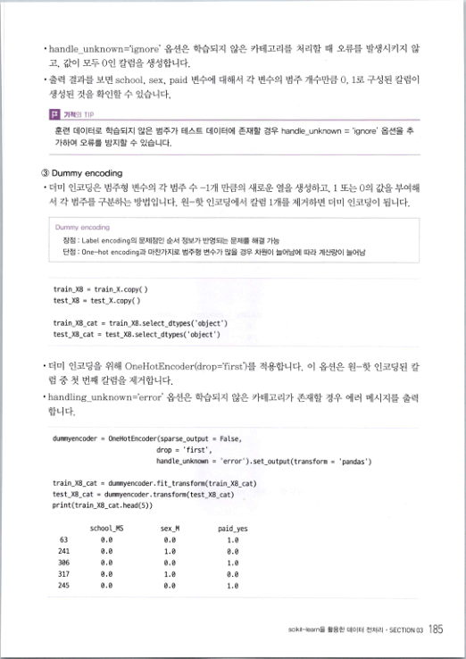
- hand1e_unknown='ignore ' 옵션은 학습되지 않은 카테고리를 처리할 때 오류를 발생시키지 않
고 , 값이 모두 0인 칼럼을 생성합니다．

- 출력 결과를 보면 school, sex, paid 변수에 대해서 각 변수의 범주 개수만큼 0. 1로 구성된 칼럼이
생성된 것을 확인할 수 있습니다． ．헴 기적의 지P 훈련 데이터로 학습되지 않은 범주가 테스트 데이터에 존재할 경우 handle_unknown = 'ignore ' 옵션을 추 가하여 오류를 방지할 수 있습니다． ③Dummy encoding

- 더미 인코딩은 범주형 변수의 각 범주 수 -1개 만큼의 새로운 열을 생성하고 , 1 또는 0의 값을 부여해
서 각 범주를 구분하는 방법입니다 . 원－핫 인코딩에서 칼럼 1개를 제거하면 더미 인코딩이 됩니다． Dummy encoding 장점 : Labe〔 encoding의 문제점인 순서 정보가 빈영되는 문제를 해결 가능 단점 : One-hot encoding과 마찬가지로 범주형 변수가 많을 경우 차원이 늘어남에 따라 계산량이 늘《거남

```python
train_X8 = train_X.copy( ) 
test_X8 = test_X.copy( )
train_X8_cat = train_X8.select_dtypes( 'object' ) 
test_X8_cat = test_X8.select_dtypes( ' object' )
```
- 더미 인코딩을 위해 OneHotEncoder(drop='first'）를 적용합니다 . 이 옵션은 원－핫 인코딩된 칼
럼 중 첫 번째 칼럼을 제거합니다． ' handling_unknown='error ' 옵션은 학습되지 않은 카테고리가 존재할 경우 에러 메시지를 출력 합니다．

```python
dummyencoder = OneHotEncoder(sparse_output = False,
drop = ' first', 
handle_unknown = ' error').set_output(transform = 'pandas')
train_XB_cat = dumoiyencoder. fit_transfom(train_X8_cat) 
test_X8_cat = dunvnyencoder. transforni(test_X8_cat) 
print(train_X8_cat. head(s))
```
schoolJIS sex그래 paid_yes 63 0.0 0.0 1.0 241 0.0 1.0 0.0 306 0.0 0.0 1.0 317 0.0 1.0 0.0 245 0.0 0.0 1.0 scikit-learn을 활용한 데이터 전처리 . SECTION 03 炤5

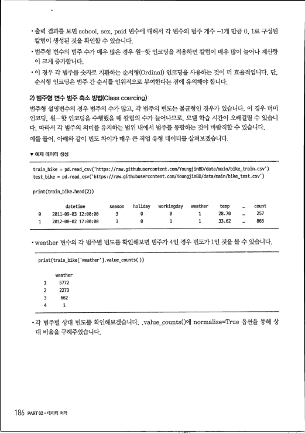
- 출력 결과를 보면 school, sex, paid 변수에 대해서 각 변수의 범주 개수 -1개 만큼 0, 1로 구성된
칼럼이 생성된 것을 확인할 수 있습니다．

- 범주형 변수의 범주 수가 매우 많은 경우 원－핫 인코딩을 적용하면 칼럼이 매우 많이 늘어나 계산량
이 크게 증가합니다．

- 이 경우 각 범주를 숫자로 치환하는 순서형（0rdinal) 인코딩을 사용하는 것이 더 효율적입니다 . 단，
순서형 인코딩은 범주 간 순서를 인위적으로 부여한다는 점에 유의해야 합니다． 2) 범주형 변수 범주 축소 방법（Class coercing):

범주형 설명변수의 경우 범주의 수가 많고 , 각 범주의 빈도는 불균형인 경우가 있습니다 . 이 경우 더미 인코딩 , 원－핫 인코딩을 수행했을 때 칼럼의 수가 늘어나므로 , 모델 학습 시간이 오래걸릴 수 있습니 다 . 따라서 각 범주의 의미를 유지하는 범위 내에서 범주를 통합하는 것이 바람직할 수 있습니다． 예를들어 , 아래와같이 빈도차이가매우큰 직업 유형 데이터를살펴보겠습니다． ▼ 예제 데이터 생성

```python
train_bike = pd.read-csv('https://raw.githubusercontent.com/YoungjinBD/data/main/bike_train.csv')
test_bike = pd . read_csv( 'https: // raw. githubusercontent. com/YoungjinBD/data/main/bike_test. csv')
print(train_bike, head (2))
```
datetime season hol.iday workingday weather temp count 0 2011-09-03 12:00:00 3 0 0 1 28.70 257 1 2012-08-02 17:00:00 3 0 1 1 33.62 865

- weather 변수의 각 범주별 빈도를 확인해보면 범주가 4인 경우 빈도가 1인 것을 볼 수 있습니다．
```python
print(train_bike[ 'weather' // .vathe_countsO)
```
weather 1 5772 2 2273 3 662 4 1

- 각 범주별 상대 빈도를 확인해보겠습니다 . ,value_counts(）에 normalize=True 옵션을 통해 상
대 비율을구해주었습니다． 186 PART02＊데이터처리

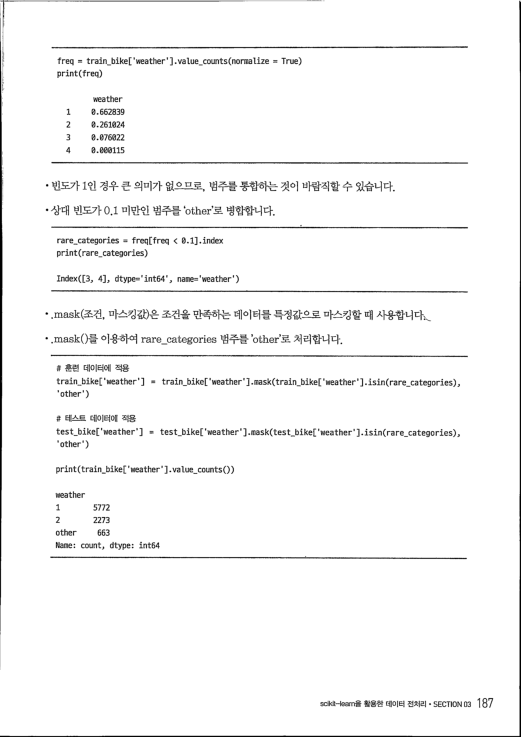
```python
f req = train_bike{ 'weather'] .value_counts(normalize = True) 
print(freq)
```
weather 1 0.662839 2 0.261024 3 0.076022 4 0.000115

- 빈도가 1인 경우 큰 의미가 없으므로 , 범주를 통함하는 것이 바람직할 수 있습니다．
- 상대 빈도가 0.1 미만인 범주를 ' other'로 병합합니다．
```python
rare_categories = freq[freq < 0.1].index 
print(rare_categories)
```
Index([3, 4], dtype='int64', name='weather') ' . mask（초건 , 마스킹값）은조건을만족하는데이터를특정값으로마스킹할때 사용합니다k

- .mask(）를 이용하여 rare_categories 범주를 ' other'로 처리합니다．
```python
# 훈련 데이터에 적용 
train_bike[ 'weather'] = train_bike[ 'weather'] .mask(train_bike[ 'weather'].isin(rare_categories), 
'other')
# 테스트 데이터에 적용 
test_bike{'weather'] = test_bike[ 'weather'] .mask(test_bike[ 'weather'].isin(rare_categories), 
' other')
print(train_bike[ 'weather'] .value_countsQ)
```
weather 1 5772 2 2273 other 663 Name: count, dtype: int64 scikit-learn을활용한데이터전처리· SECTION 03 187

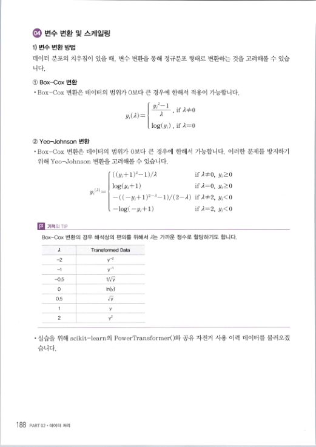
.

변수 변환 및 스케일링 1) 변수 변환 방법 데이터 분포의 지우침이 있을 때 , 변수 변환을 통해 정규분포 형태로 변환하는 것을 고려해볼 수 있습 니다． (j:) Box-Cox 변환

- Box-Cox 변환은 데이터의 범위가 0보다 큰 경우에 한해서 적용이 가능합니다．
I ii거-1 .. , .

I α ' . - ifA구＝O Zh(A) 1 A ' 11og(y) , if A=O ② Yeo-Johnson 변환

- Box-Cox 변환은 데이터의 범위가 0보다 큰 경우에 한해서 가능합니다 . 이러한 문제를 방지하기
위해 Yeo-Johnson 변환을 고려해볼 수 있습니다．

```python
1((y+i) A_1)/A 
if A*O, y彦0
1) 
if A=
```
跳브o .

.

" ' I -( (- y+1)2－』-1)/(2- A) if p1*2, y<O

```python
1) 
if A=
```
y< O ．헴 기적의 ㅐP Box-Cox 변환의 경우 해석상의 편의를 위해서 A는 가까운 정수로 할당하기도 합니다． A Transformed Data -2 y-2 -1 y-l ㅓ． i//i 0 In(y) 0 .5 7v 1 y 2 y2

- 실습을 위해 scikit-learn의 PowerTransformer(）와 공유 자전거 사용 이력 데이터를 불러오겠
습니다． 188 PART02．데이터 처리

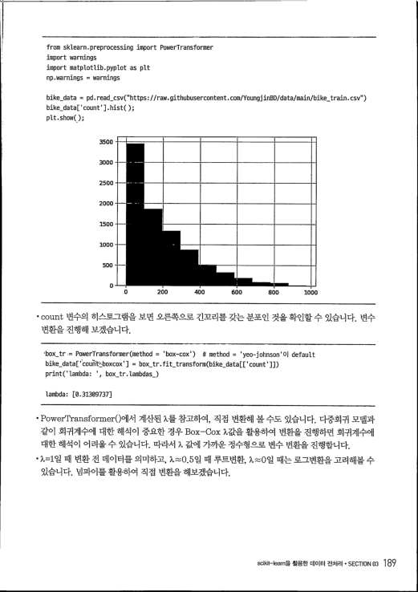
```python
from sklearn.preprocessing import PowerTransforiner 
import warnings 
import niatplotlib.pyplot as pl.t 
np.warn긔1gs = warnings
bike_data = pd.read_csv("https://raw.githubusercontent.com/YoungjinBD/data/niain/bike_train.csv') 
bike_data[ 'count '] .hist(); 
plt.showO;
```
0 200 400 600 800 1000 ' count 변수의 히스토그램을 보면 오른쪽으로 긴꼬리를 갖는 분포인 것을 확인할 수 있습니다 . 변수 변환을 진행해 보겠습니다．

```python
'box_tr.= Powerlransformer(method = ' box-cox') # method = ' yeo-johnson'Oi default 
bike_data[ 'cou?ft_boxcox'] = box_tr.fit_transform(bike_data[['count'] ]) 
print(' lambda: ', box_tr.lambdas_)
```
lambda: [0.31309737] ' PowerTransformer(）에서 계산된 冗를 참고하여 , 직접 변환해 볼 수도 있습니다 . 다중회귀 모델과 같이 회귀계수에 대한 해석이 중요한 경우 Box-Cox ㅈ값을 활용하여 변환을 진행하면 회귀계수에 대한 해석이 어려울 수 있습니다 . 따라서 先 값에 가까운 정수형으로 변수 변환을 진행합니다． ' 入＝1일 때 변환 전 데이터를 의미하고 , 2 0.5일 때 루트변환, 2슷’0일 때는 로그변환을 고려해볼 수 있습니다 . 넘파이를활용하여 직접 변환을 해보겠습니다． scikit-learn을활용한데이터전처리· SECTION 03 189

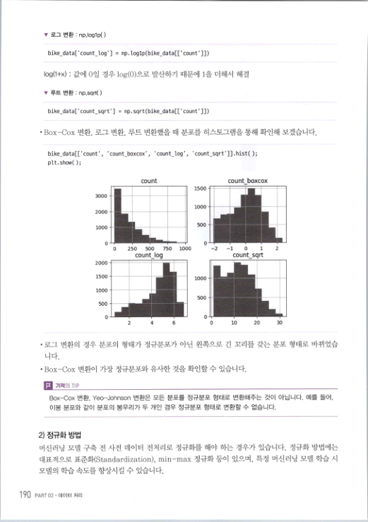
「 로그 변환 : np.Iog1p() bike_data[ 'count_log' ] = np.loglp(bike_data[[ 'count'] ]) Iog(H-x) : 값에 0일 경우 log(0）으로 발산하기 때문에 1을 더해서 해결 ▼ 루트 변환 : np.sqrt() bike_data[ 'count_sqrt '] = np.sqrt(bike_data[['count '] ])

- Box -Cox 변환 , 로그 변환 , 루트 변환했을 때 분포를 히스토그램을 통해 확인해 보겠습니다．
bike_data[[ 'count', ' count_boxcox , ' count_log , ' count- sqrt' ]].hist( ); pit.탉졉ow( ), count boxcox 1500 count 3000 1000 2000 500 - 1000 0 －뺑…－－· 0 250 500 750 1000 count_log 2000 0- -2 -l 0 1 count_sqrt 1500 1(p0 ·

# r~
1000

# ■
＇ 500 - 500 0- 0 4 10 20 韜

- 로그 변환의 경우 분포의 형태가 정규분포가 아닌 왼쪽으로 긴 꼬리를 갖는 분포 형태로 바뀌었습
니다．

- Box-Cox 변환이 가장 정규분포와 유사한 것을 확인할 수 있습니다．
．헴 기적의 지P Box-Cox 변환 , Yeo-Johnson 변환은 모든 분포를 정규분포 형태로 변환해주는 것이 아닙니다 . 예를 들어， 이봉 분포와 같이 분포의 봉우리가 두 개인 경우 정규분포 형태로 변환할 수 없습니다． 2) 정규화 방법 머신러닝 모델 구축 전 사전 데이터 전처리로 정규화를 해야 하는 경우가 있습니다 . 出구화 방법에는 대표적으로 표준화＜Standardization), mmn-max 州子화 등이 있으며 , 특정 머신러닝 모델 학습 시 모델의 학습 속도를 향상시킬 수 있습니다． 190 PART02．데이터 처리

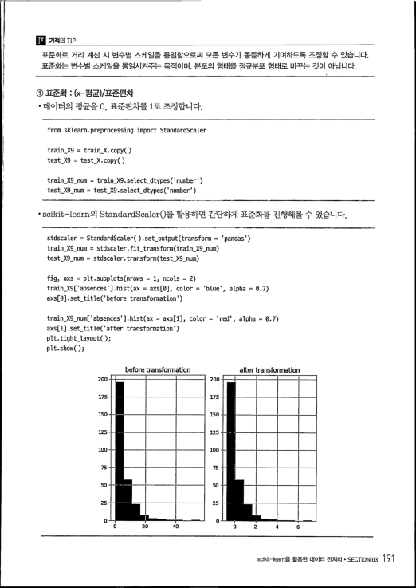
［철 기적의 TIP 표준화로 거리 계산 시 변수별 스케일을 통일함으로써 모든 변수가 동등하게 기여하도록 조정할 수 있습니다． 표준화는 변수별 스케일을 통일시켜주는 목적이며 , 분포의 형태를 정규분포 형태로 바꾸는 것이 아닙니다． ① 표준화 : (x－평균）／표준편차

- 데이터의 평균을0 , 표준편차를1로조정합니다．
```python
from sklearn.preprocessing import StandardScaler
train-X9 = train_X.copy() 
test_X9 = test_X.copy()
train_X9_num = train_X9. select_dtypes ('number') 
test_X9_num = test_X9. select_dtypes(' number')
```
- scikit-learn의 StandardScaler(）를 활용하면 간단하게 표준화를 진행해볼 수 있습니다．
```python
stdscaler = StandardScal.erQ.set_output(transform = 'pandas') 
train_X9_num = stdscaler. fit_transform(train_X9_num) 
test_X9_num = stdscaler.transform(test_X9_num)
```
fig, axs = plt.subplots(nrows = 1, ncoLs = 2) train_X9[ 'absences'] .hist(ax = axs[0], color = 'blue', alpha = 0.7) axs[0] . set_title( 'before transformation') train_X9_num[ 'absences'].hist(ax = axs[1], color = 'red', alpha = 0.7) axs{1] .set_title('after transformation') plt . tight_layout 0; plt.show0; before transfomialion after transformation - r〕 0 20 40 0 2 4 5 scikit-tearn을 활용한 데이터 전처리 · SECTION 03 1 91

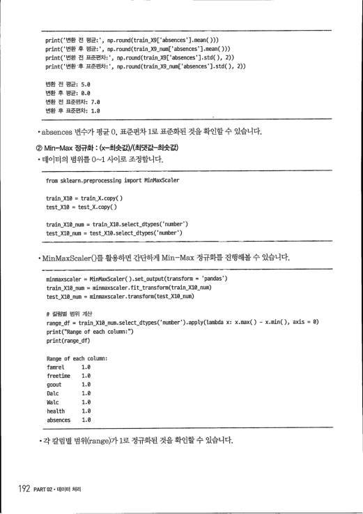
```python
print(' 변환Xj 평균.'
print(' 
F . 
. , np.round(train_X9[ 'absences'i. nieanO)) 
print("환 * 펑균 :', np.round(train_X9_num{' absences'] .mean())) 
print(' 변환 전 표준편차＝ ', np.round(train_X9[ 'absences'] .stdO, 2)) 
print(' 변환 " 후 표준편차＝ ' , np.round(train_X9_num['absences'] .stdQ, 2))
```
변환 전 평균＝ 5.0 변환 후 평균： 0 . 0 변환 전 표준편차： 7.0 변환 후 표준편차： 1.0

- 『absences 변수가 평균 0 , 표준펀차 1로 표준화된 것을 확인할 수 있습니다，
② Min-Max 정규화 : (x－최솟값）/（최댓값－최솟값）

- 데이터의 범위를 0-4 사이로 조정합니다．
```python
from skl.earn.preprocessing import MinMaxScaler
train_X10 = train-X.copy() 
test_X10 = test_X.copy()
```
train-X10_num = train_X10.sel.ect_dtypes( 'number') test_X1@_num = test-XlO.select_dtypes( 'number')

- MinMaxScaler(）를 활용하면 간단하게 Mm끄-Max 정규화를 진행해볼 수 있습니다．
```python
minmaxscaLer = MinMaxScal.erO.set_output(transform = 'pandas') 
train_X10-num = minmaxscaler. fit- transform(train_X10_num) 
test_X10_num = minmaxscaler. transform(test-X10_num)
# 칼럼별 범위 계산
```
x.min(), axis = 0)

```python
range_df = train_X10_num.select.dtypes('number').apply(lambda x: x.max() - 
print("Range of each column:") 
print(range_df)
```
Range of each column:

famrel.

1.0 freetime 1.0 goout 1.0 Dalc 1.0 Walc 1.0 health 1.0 absences 1.0

- 각 칼럼별 범위（range）가 1로 騙子화된 것을 확인할 수 있습니다．
192 PART02· 데이터 처리

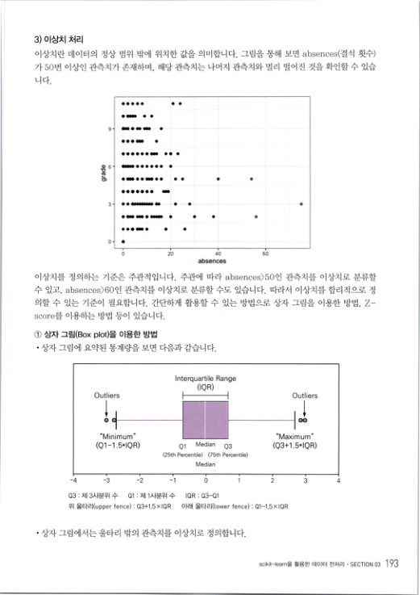
3) 이상치 처리 이상지란 데이터의 정상 범위 밖에 위치한 값을 의미합니다 . 그림을 통해 보면 absences（결석 횟수） 가 50번 이상인 관측치가 존재하며 , 해당 관측치는 나머지 관측치와 멀리 떨어진 것을 확인할 수 있습 니다． S .

'-" .

.

9

- 
』｀ -

- 
솥

- 
`' `..

- 
' L · ● ··· ● I .

L ● ● ● ● ● 흽■· .

이 - 6 - 괌 띠 ㄴ 棚

- ● 
` .

S L ··●. S ··· ● S ' ● 3 L ● -- .

S , .

- ●
L ··· ··· . - `

- 
S ,..

- ·●. 
.

0 ` 20 absences 이상치를 정의하는 기준은 주관적입니다 . 주관에 따라 absences> 50인 관측치를 이상치로 분류할 수 있고 , absences>60인 관측치를 이상치로 분류할 수도 있습니다 . 따라서 이상치를 합리적으로 정 의할 수 있는 기준이 필요합니다 . 간단하게 활용할 수 있는 방법으로 상자 그림을 이용한 방법 , z-score를 이용하는 방법 등이 있습니다． ① 상자 그림（Box 이ot）을 이용한 방법

- 상자 그림에 요약된 통계량을 보면 다음과 같습니다．
# Interquartile Range 
oQR) Outliers Outliers  Ii

### J
- .

―·＊o "Maximum' "Minimum" (Q1-1.5*IQR) 01 Median Q3 (Q3+1 .5IQR) (25th Percentile) (75th Percentile) Median -4 -3 -2 0 1 3 4 Q3 : 제 3사분위 수 Qi : 제 1사분위 수 IQR : 03-Q1 위 울타리（upper fence): Q3+1.5xIQR 아래 울타리（rower fence): 01-1.5＞이0R

- 상자 그림에서는 울타리 밖의 관측치를 이상치로 정의합니다．
scikit-learn을활용한 데이터 전처리 .SECTION 03 珊；3

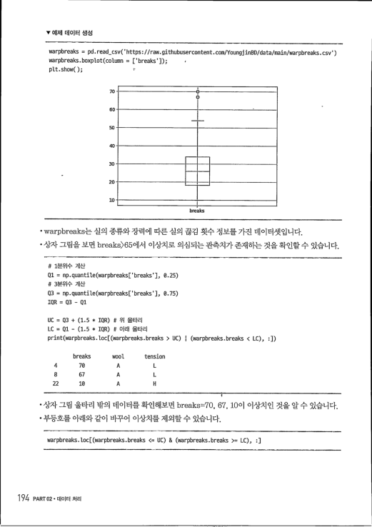
▼ 예제 데이터 생성

```python
warpbreaks = pd. read_csv( 'https://raw.githubusercontent.com/youngjjnBD/data/majn/warpbreaks.csv') 
warpbreaks.boxplot(column = {'breaksi); 
pl.t. showO;
```
。

bre하觸 ' warpbreaks는 실의 종류와 장력에 따른 실의 끊김 횟수 정보를 가진 데이터셋입니다． ' 상자 그림을 보면 breaks>65에서 이상치로 의심되는 관측치가 존재하는 것을 확인할 수 있습니다．

```python
#1분위수 계산
01 = np.quantile(warpbreaks[ 'breaks '] , 0.25) 
#3분위수 계산
```
03 = np.quantile(warpbreaks[ 'breaks 'J, 0.75)

```python
IQR = 03 - Qi
UC = 03 + (1.5 * IQR) # 위 울타리
LC = 01 - (1.5 * IQR) # 아래 울타리 
print(warpbreaks. Loc[(warpbreaks.breaks > tiC) l (warpbreaks.breaks < LC), :])
```
breaks wool tension 4 70 A L 8 67 A L 22 10 A H

- 상자그림 울타리 밖의 데이터를확인해보먼 breaks=70, 67, 10이 이상치인 것을 알수 있습니다．
- 부등호를 아래와 같이 바꾸어 이상치를 제외할 수 있습니다．
warpbreaks.loc[(warpbreaks.breaks <= UC) & (warpbreaks.breaks >= LC), :] 194 PART02．데이테처리

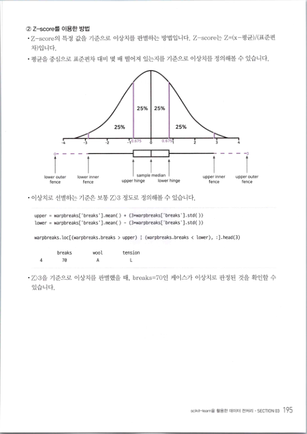
②Z-score를 이용한 방법

- Z- score의 특정 값을 기준으로 이상치를 판별하는 방법입니다 . Z-score는 Z=(x－평균）/（표준편
차）입니다．

- 평균을 중심으로 표준편차 대비 몇 배 떨어져 있는지를 기준으로 이상치를 정의해볼 수 있습니다．
# I
## ㅣ 
ㅣ 0-

# sample median I 
ㅣ upper inner fence upper Outer fence lower outer lower inner fence fence upper hinge lower hinge

- 이상치로 선별하는 기준은 보통 Z>3 정도로 정의해볼 수 있습니다．
```python
upper = warpbreaks[ 'breaks '] .mean( ) + (3*warpbreaks[ 'breaks '] .stdO)
lower = warpbreaks[ 'breaks'] .mean( ) - (3*warpbreaks[ 'breaks '] .stdO)
```
warpbreaks.loc[(warpbreaks.breaks > upper) I (warpbreaks.breaks < lower), :].head(3) breaks wool, tension 4 70 A L

- z>3을 기준으로 이상치를 판별했을 때 , breaks=70인 케이스가 이상치로 판정된 것을 확인할 수
있습니다． scikit-learn을 활용한 데이타 전처리 * SECTION 03 195

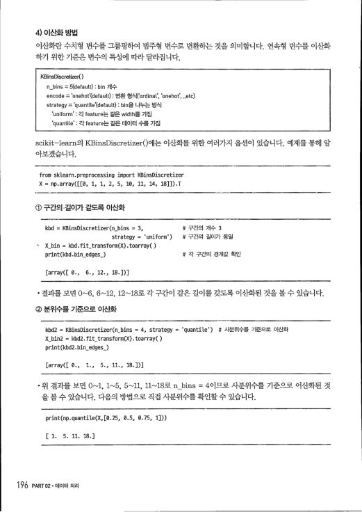
4) 이산화 방법 이산화란 수치형 변수를 그룹핑하여 범주형 변수로 변환하는 것을 의미합니다 . 연속형 변수를 이산화 하기 위한 기준은 변수의 특정에 따라 달라집니다． kBinsDiscretizer()

```python
n_bins = 5(default) : bin 개수
encode = 'onehot'(defautt): 변환형식('ordina1', 'onehot', ..etc)
strategy = 'quantite'(defautt): bin을 나누는 방식
```
' uniform ' : 각feature는 같은 width를 가짐 ' quantile ' : 각 {eature는 같은 데이터 수를 가짐 scikit-learn의 KBinsDiscretizer(）에는 이산화를 위한 여러가지 옵션이 있습니다 . 예제를 통해 알 아보겠습니다．

```python
from skl.earn.preprocessing import KBinsDiscretizer
X = np.array([[0, 1, 1, 2, 5, 10, 11, 14, 18]J).T
```
① 구간의·길이가 같도록 이산화

```python
kbd = KBinsDiscretizer(n- bins = 3, 
# 구간의 개수 3 
strategy = 'uniform') 
# 구간의 길이가 동일
X_bin = kbd.fit_transform(X).toarray() 
print(kbd.bin_edges_) 
# 각 구간의 경계값 확인
```
[array([ 0., 6., 12., 18.])]

- 결과를보면O' '6, 6--'12, 12-48로각구간이 같은길이를갖도록 이산화된 것을볼수 있습니다．
② 분위수를 기준으로 이산화 kbd2 · KBinsDiscretizer(n_bins = 4, strategy = 'quantile') # 사분위수를 기준으로 이산화

```python
X_b1n2 = kbd2.fit_transform(X).toarray() 
print(kbd2.bin_edges_)
```
[array([ 0., 1., 5., 11., 18.])]

- 위 결과를 보면 0-4, 1- 5, 5-41, 11-48로 n_bins = 4이므로 사분위수를 기준으로 이산화된 것
을 볼 수 있습니다 . 다음의 방법으로 직접 사분위수를 확인할 수 있습니다．

```python
print(np.quantile(X,[0.25, 0.5, 0.75, 1]))
```
i: 1. 5. 11. 18.] 196 PART 02. 데이터 처리

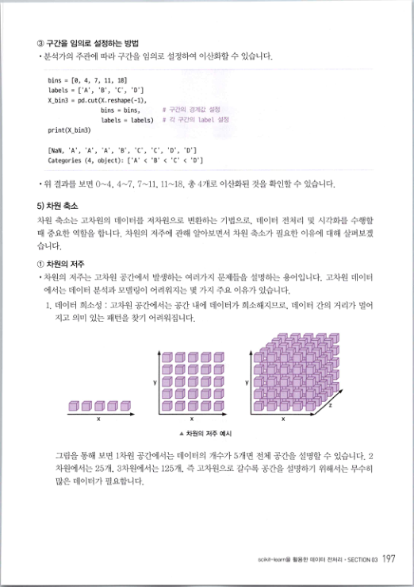
③ 구간을 임의로 설정하는 방법

- 분석가의 주관에 따라 구간을 임의로 설정하여 이산화할 수 있습니다．
```python
bins = [0, 4, 7, 11, 18] 
labels = [ 'A', 'B', 'C', 'D']
X_bin3 = pd.cut(X.reshape(-1), 
bins = bins, 
labels = labels) 
print(X_bin3)
# 구간의 경계값 설정
# 각 구간의 label 설정
```
[NaN, 'A ' , 'A', 'A', 'B', 'C', 'C', 'D', 'Di Categories (4, object): ['A ' < 'B ' < 'C ' < 'D']

- 위 결과를보면 O'-'4, 4'-7, 7- 11, 11'-48 , 총4개로 이산화된 것을확인할수 있습니다．
5) 차원 축소 차원 축소는 고차원의 데이터를 저차원으로 변환하는 기법으로 , 데이터 전처리 및 시각화를 수행할 때 중요한 역할을 합니다 . 차원의 저주에 관해 알아보면서 차원 축소가 필요한 이유에 대해 살펴보겠 습니다． (j:) 차원의 저주

- 차원의 저주는 고차원 공간에서 발생하는 여러가지 문제들을 설명하는 용어입니다 . 고차원 데이터
에서는 데이터 분석과 모델링이 어려워지는 몇 가지 주요 이유가 있습니다． 1 . 데이터 희소성 : 고차원 공간에서는 공간 내에 데이터가 희소해지므로 , 데이터 간의 거리가 멀어 지고 의미 있는 패턴을 찾기 어려워집니다．

### ㅁ
囹 ㅁ 0。

□q 聊 q 囹

### ㅁ
曰 ㅁ D 아

### …
D ㅁ ㅁ 曰 囹

### 겸
즈 ㅋ 귀 샐 7 聊 ㅁ V x ▲ 차원의 저주 예시 그림을 통해 보면 1차원 공간에서는 데이터의 개수가 5개면 전쳬 공간을 설명할 수 있습니다 . 2 차원에서는25개 , 3차원에서는 125개 , 즉고차원으로 갈수록공간을설명하기 위해서는무수히 많은 데이터가 필요합니다． scikit-learn을활용한데이터전처리．SECTION 03 197


2 . 계산복잡성 증가 : 차원이 증가할수록 계산해야 할 양이 기하급수적으로 늘어납니다 . 따라서 머 신러닝 알고리즘의 학습 속도가 저하됩니다． 3 . 과적합（overfitting) : 고차원 데이터에서는 과적합 가능성이 높아지며 , 모델의 일반화 성능이 감소합니다． Testing Set (Accuracy: 0.73) Training Set (Accuracy: 1.00) 5 4 2 o 2 蜜 넓 x 4 2 o 2 엉 ㄷ。

ㄷ＆ㅌ 8 。

횬 u ㄷ＝ㄸ ＂븐 믿 麗 ㅌ。

&＝든 ㄸ 날

### …
驢 -4 .

-10 -5 0 5 1() Principal component i 15 -10.0 -7.5 -5.0 -2.5 0.0 2.5 5.0 7.5 Printip히 Component 1 伽

- 위 그림을 통해 고차원 데이터를 학습했을 때 결과를 살펴보겠습니다 . 훈런 데이터의 경우 모델의
정확도가 100% 이지만 테스트 데이터의 경우 정확도가 73％로 감소한 것을 확인할 수 있습니다 . 왜 이런 현상이 발생했을까요？

- 고차원 데이터의 경우 공간 내에 데이터가 희소해지므로 , 훈련 데이터의 대부분은 서로 멀리 떨어져
있게 됩니다 . 이는 훈런 데이터가 전쳬 공간을 대표하지 않는다는 것을 의미하며 , 테스트 데이터（새 봅게 들어올 데이터）의 경우도 마찬가지로 훈런 데이터와 멀리 떨어져 있을 가능성이 높습니다 . 따 라서 훈련 데이터에 맞는 모델을 학습했을 때 훈련 데이터의 모델 성능은 높지만 , 테스트 데이터에 서의 모델 성능은 크게 감소하게 되는 과적합이 발생하게 됩니다． ② 주성분 분석（PrincipaJ Component Analysis, PCA)

- 차원의 저주 문제를 완화하기 위해 차원 축소를 진행합니다 . 차원 축소의 대표적인 기법으로 주성분
분석이 있습니다 . 주성분 분석은 고차원 데이터를 저차원으로 변환하면서 데이터의 정보를 유지하 는 데 중점을 둡니다． ▼ 예제 데이터 생성

```python
df = pd.read-csv('https://raw.githubusercontent.com/YoungjinBD/data/main/df_5.csv') 
df.columns 볍 ['index', 'Xi00ni', 'Long.jump', 'Shot.put', 'High. jump', 'X400m',
' X110m.hurdl.e', 'Discus', 'Pole.vault', 'javel.ine', 'X1500m'J 
df.set-index('index', inpl.ace = True) 
print(df.head()) 
print(df.shape)
```
198 PART02· 데이터 처리

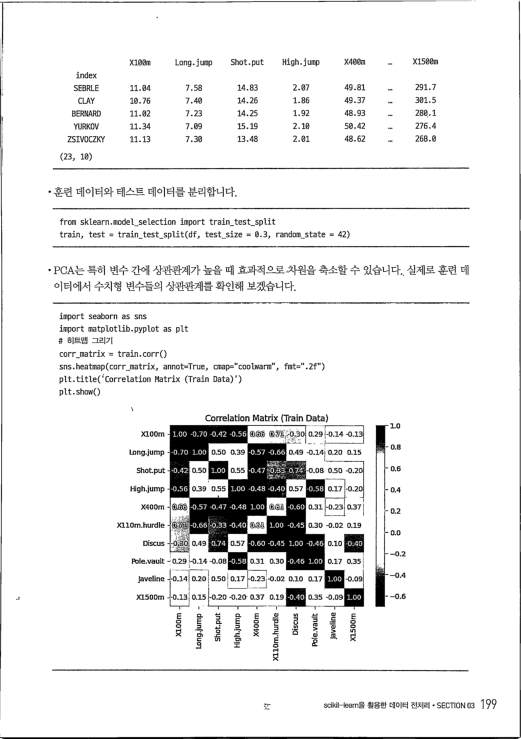
X100m Long. jump Shot.put High. jump X400m X1500m index SEBRLE 11.04 7.58 14.83 2.07 49.81 291.7 CLAY 10.76 7.40 14.26 1.86 49.37 301.5 BERNARD 11.02 7.23 14.25 1.92 48.93 280.1 YIJRKOV 11.34 7.09 15.19 2.10 50.42 276.4 ZSIVOCZKY 11.13 7.30 13.48 2.01 48.62 268.0 (23, 10)

- 훈련 데이터와 테스트 데이터를 분리합니다．
```python
from skiearn . model_selection import train_test_split 
train, test = train_test_split(df, test_size = 0.3, random_state = 42)
```
- PCA는 특히 변수 간에 상관관계가 높을 때 효과적으로차원을 축소할 수 있습니다 . . 실제로 훈런 데
이터에서 수치형 변수들의 상관관계를 확인해 보겠습니다．

```python
import seaborn as sns 
import matplotiib.pyplot as pit 
# 히트맵 그리기
corr_matrix = train.corrQ
```
sns .heatmap(corr_matrix, annot=True, cmap="cooLwarm", fmt=" .2f") plt.title ('Correlation Matrix (Train Data)') plt.showQ ` Corr이ation Matrix (Train Data) 0山恐 璉）571軫｀-0.30 X100m 1.00 -0.70 -0.42 -0.56 0.29l -0.14 -0.13 -0.70 1.00 0.50 0.39 -0.57 -0.66 049 -03.4k 0.20 0.15 uㅈ 'o-o8 0.50 Long.jump 。.6 Shot.put LOO -0.48 -0.40 〔》 . 39 α．55 High.jump 츠콰.'3긱 -0.57 -0.47 -0.48 1.00 X400m J36!-0.33 -0.40 1.00 -GAS X1lOm.hurdle 0.30 -0.02 0.19 9‘ㅋ0 0,49 Discus 0.40 0.10 pole.vault - 0.29 -0.14 -0.08 0.17 0.35.

-0.46 1.00 0.31 0.30 Javeline -0.14 F 0.201. 0.50 0.17 0.23;-0.02 0.10 i l L_

- 
J X1500m - 0.1척스Z인므인뜨37 0.19 I 쵱 →… 1 I

0. 35 -0.09
E = 。

ㄷ 묾＞m 一 섶 댜 성 柄 ㅌ。

。

H× 쁘 ㄲ ㄴ ㅁ＝．ㅌ。

렵× α ㅌ ㅁ∼

- ＝
。

∼＝ ㅌ。

。

＊× 띄 u 띠∼。

성＝。

＞쫠 으 ㄹ ㅌ。

。

蝦 H× .` ㄷ a scikit-learn을활용한데이터전처리．SECTION 03 199

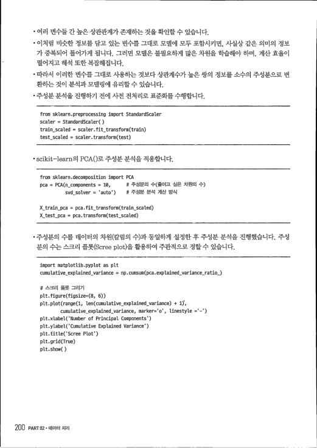
- 여러 변수들 간 높은 상관관계가 존재하는 것을 확인할 수 있습니다．
- 이처럼 비슷한 정보를 담고 있는 변수를 그대로 모델에 모두 포함시키면 , 사실상 같은 의미의 정보 
가 중복되어 들어가게 됩니다 . 그러면 모델은 불필요하게 많은 차원을 학습해야 하며 , 계산 효율이 떨어지고 해석 또한 복잡해집니다．

- 따라서 이러한 변수를 그대로 사용하는 것보다 상관계수가 높은 쌍의 정보를 소수의 주정분으로 변
환하는 것이 분석과 모델링에 유리할 수 있습니다．

- 주성분 분적을 진행하기 전에 사전 전처리로 표준화를 수행합니다．
```python
from sklearn.preprocessing import StandardScaler 
scaler 븝 StandardScaler() 
train_scaled = scaler. fit_transform(train) 
test_scaled = scaler. transform(test)
```
- scikit-learn의 PCA(）로 주정분 분석을 적용합니다．
```python
from sklearn.decomposition import PCA
pca = PCA(n_components = 10, 
# 주성분의 수（줄이고 싶은 차원의 수）
svd_solver = 'auto') 
# 주성분 분석 계산 방식
X_train_pca = pca. fit_transform(train_scaled)
X_test_pca = pca . transform(test_scaled)
```
- 주성분의 수를 데이터의 차원（칼럼의 수）과 동일하게 설정한 후 주성분 분석을 진행했습니다 . 주성
분의 수는 스크리 플롯（Scree plot）을 활용하여 주관적으로 정할 수 있습니다．

```python
import matplotlib.pyplot as plt 
cumulative_explained_variance = np. cumsum(pca.explained_variance_ratio_)
# 스크리 플롯 그리기 
plt. figure(figsize=(8, 6)) 
pit. plot(range(1, len(cumulative_explained_variance) + 1)',
```
cumulative_explained_variance, marker='o', linestyle ='-.') pit.xlabel('Number of Principal Components') plt.ylabel( 'Cumulative Explained Variance') plt.title( 'Scree Plot') plt,grid(True) plt.show() 200 PART 02. 데이터 처리

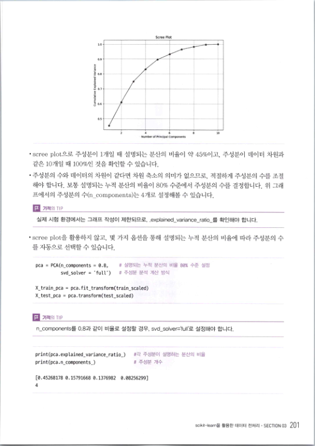
kree 미伉 09

- 닝
，욘，큅 오 졈 죠 祗●之 늴．ㅌ E=u

- 7
毓 。

脯 毓5 2 6 Numbr 아 p,.n더paI 伽때)orbents 1o

- scree plot으로 주성분이 1개일 때 설명되는 분산의 비율이 약 45％이고 , 주정분이 데이터 차원과 
같은 10개일 때 100％인 것을 확인할 수 있습니다．

- 주성분의 수와 데이터의 차원이 같다면 차원 축소의 의미가 없으므로 , 적절하게 주정분의 수를 조절 
해야 합니다 . 보통 설명되는 누적 분산의 비율이 80% 수준에서 주성분의 수를 결정합니다 . 위 그래 프에서의 주정분의 수（n_components）는 4개로 설정해볼 수 있습니다． ．헴 기적의 지p 실제 시험 환경에서는 그래프 작성이 제한되므로 , .explained_vsriance_ratio－를 확인해야 합니다． ' scree plot을 활용하지 않고 , 몇 가지 옵션을 통해 설명되는 누적 분산의 비율에 따라 주정분의 수 를 자동으로 선택할 수 있습니다．

```python
pca = PCA(n_components = 0.8, 
# 설명되는 누적 분산의 비율 80% 수준 설정
svd_solver = ' ful.l ') 
# 주성분 분석 계산 방식
X_train_pca = pca. fit_transform(train_scaled)
X_test_pca = pca . transform(test_scaled)
```
### r졉 기적의 TIP
n_components를 0.8과 같이 비율로 설정할 경우 , svd_solver='f에'로 설정해야 합니다．

```python
print(pca . exptained_variance_ratio_) 
＃각 주성분이 설명하는 분산의 비율 
print(pca . n_components_) 
# 주성분 개수
```
[0.45268178 0.15791668 0.1376982 0.08256299] 4 scikit-learn을 활용한 데이터 전처리 · SECTION 03 201

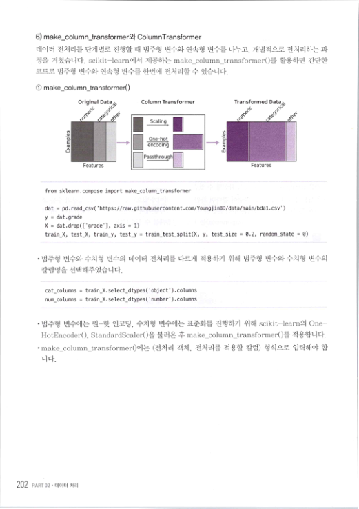
6) make_coIumnJransformer와 ColumnTransformer 데이터 전처리를 단계별로 진행할 때 범주형 변수와 연속형 변수를 나누고 , 개별적으로 전처리하는 과 정을 거쳤습니다 . scikit-learn에서 제공하는 make column transformer(）를 활용하면 간단한 코드로 범주형 변수와 연속형 변수를 한번에 전처리할 수 있습니다． ①make_column_transformer()

# Column Transformer 
Transformed D ·

### Original Data . 
:``/ ／갸쨔縡

## One-hot
enc。ding

- 
E m x w I 腔ㄱ Scaling 띠 으 α ㅌ。

x 띠 Features Passthrough Features

```python
from sklearn.compose import make_column_transformer
dat = pd. read_csv( 'https://raw.githubusercontent.com/YoungjinBD/data/main/bdal.csv ')
y = dat.grade
X = dat.drop([ 'grade '] , axis = 1) 
train_X, test_X, train_y, test_y = train_test_split(X, y, test_size = 0.2, random_state = 0)
```
- 범주형 변수와 수치형 변수의 데이터 전처리를 다르게 적용하기 위해 범주형 변수와 수치형 변수의
칼럼명을 선택해주었습니다．

```python
cat_columns = train_X.select_dtypes( ' object ' ).columns
num_columns = train_X.select_dtypes( ' number ') .columns
```
- 범주형 변수에는 원－핫 인코딩 , 수치형 변수에는 표준화를 진행하기 위해 scikit-learn의 One-
HotEncoderO, StandardScaler(）을불러온후 make_column_transformer(）를 적용합니다．

- make column transformer0에는 （전처리 객쳬 , 전처리를 적용할 칼럼） 형식으로 입력해야 합
니다． 202 PART 02. 데이터 처리

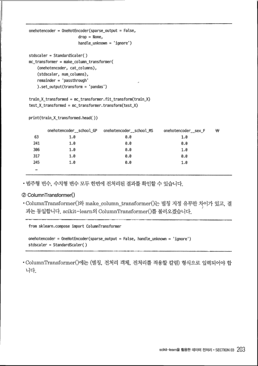
```python
onehotencoder = Onel-iotEncoder(sparse_output = False,
drop = None, 
handle_unknown = 'ignore')
stdscaler = StandardScaler()
mc_transformer = make_colunin_transformer( 
(onehotencoder, cat_columns), 
(stdscaler, num_columns),
remainder = ' passthrough' 
) . set_output(transform = 'pandas')
train_X_transfornied = mc_transformer. fit_transform(train_X) 
test_X_transformed = mc_transformer. transform(test_X)
print(train_X_transfornied .head() )
```
onehotencoder school GP onehotencoder school MS onehotencoder sex F ￦ 63 1.0 0.0 1.0 241 1.0 0.0 0.0 306 1.0 0.0 1.0 317 1.0 0.0 0.0 245 1.0 0.0 1.0

- 범주형 변수 , 수치형 변수 모두 한번에 전처리된 결과를 확인할 수 있습니다．
②Columnlransformer()

- ColumnTransformer(）와 make_column_transformer(）는 별칭 지정 유무만 차이가 있고 , 결
과는동일합니다 . scikit-learn의 ColumnTransformer(）를불러오겠습니다．

```python
from sklearn.compose import ColumnTransformer
onehotencoder = OneHotEncoder(sparse_output = False, handle_unknown = 'ignore') 
stdscaler = StandardScaler()
```
- ColumnTransformer(）에는 （별칭 , 전처리 객쳬 , 전처리를 적용할 칼럼） 형식으로 입력되어야 합
니다． scikit-learn을 활용한 데이터 전처리 · SECTION 03 203

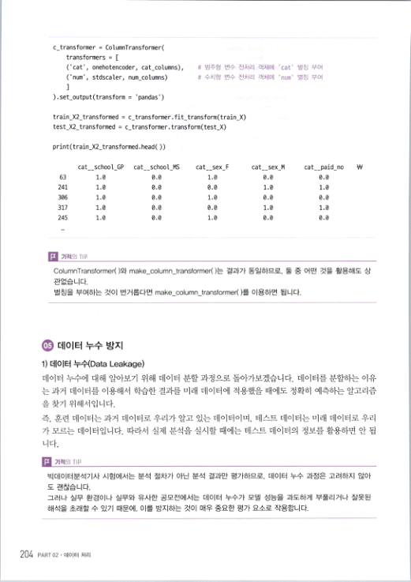
```python
c_transformer = ColumnTransformer( 
transformers = [ 
( 'cat', onehotencoder, cat_columns), 
# 범주형 변수 전처리 객체Ofl ' cat ' 별칭 부여 
( 'nurn', stdscaler, num_columns) 
# 수치형 변수 전처리 객체에 ' num ' 별칭 부여
```
) . set_output (transform = 'pandas')

```python
train_X2_transformed = c_transformer. fit_transform(train_X) 
test_X2_transformed = c_transformer. transform(test_X)
print(train_X2_transformed.head( ))
```
cat- schoolGP cat__school_MS cat__sex_F cat__sex_M cat__paid_no W 63 1.0 0.0 1.0 0.0 0.0 241 1.0 0.0 0.0 1.0 1.0 306 1.0 0.0 1.0 0.0 0.0 317 1.0 0.0 0.0 1.0 1.0 245 1 . 0 0.0 1.0 0.0 0.0 .

기적의 지p ColumnTrarisformer( ）와 make_column_transformer( ）는 결과가 동일하므로 , 둘 중 어떤 것을 활용해도 상 관없습니다． 별칭을 부여하는 것이 번거롭다면 make_columnJransformer( ）를 이용하면 됩니다． c 데이터 누수 방지 1) 데이터 누쉬Data Leakage) 데이터 누수에 대해 알아보기 위해 데이터 분할 과정으로 돌아가보겠습니다 . 데이터를 분할하는 이유 는 과거 데이터를 이용해서 학습한 결과를 미래 데이터에 적용했을 때에도 정확히 예측하는 알고리즘 을찾기 위해서입니다． 즉 , 훈련 데이터는 과거 데이터로 우리가 알고 있는 데이터이며 , 테스트 데이터는 미래 데이터로 우리 가 모르는 데이터입니다 . 따라서 실제 분석을 실시할 때에는 테스트 데이터의 정보를 활용하면 안 됩 니다．

### r헴 기적의 지P
빅데이터분석기사 시험에서는 분석 절차가 아닌 분석 결과만 평가하므로 , 데이터 누수 과정은 고려하지 않아 도 괜찮습니다． 그러나 실무 환경이나 실무와 유사한 공모전에서는 데이터 누수가 모델 성능을 과도하게 부풀리거나 잘못된 해석을 초래할 수 있기 때문에 , 이를 방지하는 것이 매우 중요한 평가 요소로 작용합니다． 204 PART 02* 데이터 처리

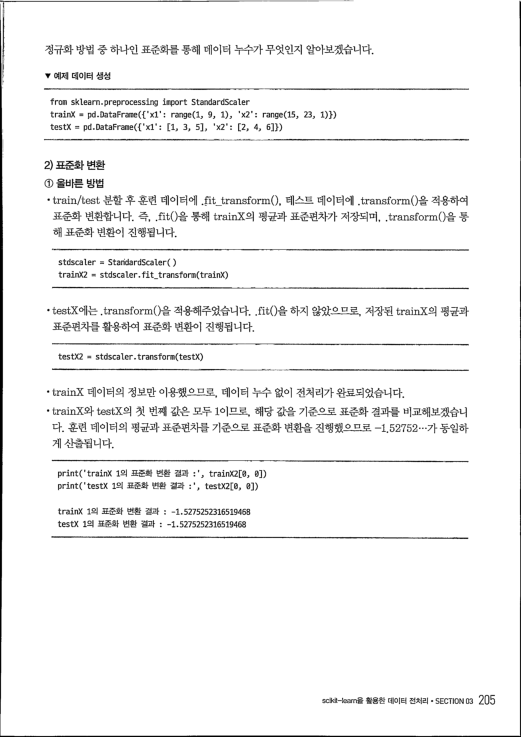
정규화 방법 중 하나인 표준화를 통해 데이터 누수가 무엇인지 알아보겠습니다． ▼ 예제 데이터 생성

```python
from sklearn.preprocessirig import StandardScaler 
trainX = pd.DataFrame({ 'x1' : range(1, 9, 1), ' x2 ': range(15, 23, 1)}) 
testX = pd.DataFrame({'x1 ': [1, 3, 5], ' x2 ': [2, 4, 6]})
```
2) 표준화 변환 ① 올바른 방법

- train/test 분할후 훈런 데이터에 . fit_transform() , 데스트 데이터에 . transform(）을 적용하여
표준화 변환합니다 . 즉 , . fit(）을통해 trainX의 평균과표준편차가 저장되며 , .transform(）을통 하「표준화 변환이 진행됩니다．

```python
stdscaler = StandardScaler() 
trainX2 = stdscaler. fit_transform(trainX)
```
- testX에는 . transform(）을적용해주었습니다 . .fit(）을하지 않았으므로 , 저장된trainX의 평균과
표준편차를 활용하여 표준화 변환이 진행됩니다．

```python
testX2 = stdscaler. transform(testX)
```
' trainX 데이터의 정보만 이용했으므로 , 데이터 누수 없이 전처리가완료되었습니다．

- trainX와 testX의 첫 번째 값은 모두 1이므로 , 해당 값을 기준으로 표준화 결과를 비교해보겠습니 
다 . 훈련 데이터의 평균과 표준편차를 기준으로 표준화 변환을 진행했으므로 -1.52752…가 동일하 게 산출됩니다．

```python
print('trainX 1의 표준화 변환 결과 : ', trainX2[@, 0]) 
print('testX 1의 표준화 변환 결과 : ', testX2[0, 0])
```
trainX 1의 표준화 변환 결과 = -1. 5275252316519468 testX 1의 표준화 변환 결과 = -1.5275252316519468 scikit-learn을활용한데이터전처리＊SECTION 03 205

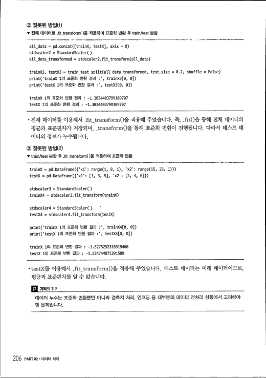
② 잘못된 방법（1) ▼ 전체 데이터로 . fit_transform( ）을 적용하여 표준화 변환 후 train/test 분할

```python
all_data = pd.concat([trainX, testX], axis = 0) 
stdscaler2 = StandardScaler() 
all_data_transformed = stdscal.er2. fit_transform(all_data)
trainX3, testX3 = train_test_spllt(afl_data_transformed, test_size = 0.2, shuffle 볍 False) 
print('trainX 1의 표준화 변환 결과 : ', trainX3[0, Oil) 
print('testX 1의 표준화 변환 결과 = ' , testX3[0, 0])
```
trainX 1의 표준화 변환 결과 = -1.3834403799109707 testX 1의 표준화 변환 결과 : -1.3834403799109707

- 전쳬 데이터를 이용해서 . fit_tra끄sform(）을 적용해 주었습니다 . 즉 , . fit(）을 통해 전쳬 데이터의
평균과 표준편차가 저장되며 , .transform(）을 통해 표준화 변환이 진행됩니다 . 따라서 데스트 데 이터의 정보가누수됩니다． ③ 잘못된 방법（2) V train/test 분할 후 . fit_transform( ）을 적용하여 표준화 변환

```python
trainX = pd.DataFrame({'x1 ': range(1, 9, 1), 'x2' : range(15, 23, 1)})
testX = pd.DataFrame({'xl': [1, 3, 5], 'x2 ' : [2, 4, 6J})
stdscaler3 = StandardScaler() 
trainX4 = stdscaler3.fit_transform(trainX)
stdscaler4 = StandardScaler() 
' 
testX4 = stdscaler4. fit_transform(testX)
print('trainX 1의 표준화 변환 결과 : ' , trainX4[0, 0]) 
print(testX 1의 표준화 변환 결과 = ' , testX4[0, 0])
```
trainX 1의 표준화 변환 결과 : -1.5275252316519468 testX 1의 표준화 변환 결과 : -1.224744871391589

- testX를 이용해서 . fit_transform(）을 적용해 주었습니다 . 데스트 데이터는 미래 데이터이므로，
평균과 표준편차를 알 수 없습니다．

### r헴 기적의 ㄲP
데이터 누수는 표준화 변환뿐만 아니라 결측치 처리 , 인코딩 등 대부분의 데이터 전처리 상황에서 고려해야 할 문제입니다． 206 PART 02．데이터처리

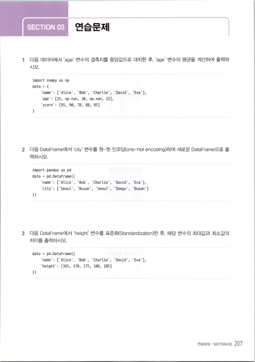
## SECTION 03 
연습문제 I 다음 데이터에서 ' age ' 변수의 결측치를 중앙값으로 대치한 후 , 'age ' 변수의 평균을 계산하여 출력하 시오．

```python
import numpy as np 
data = {
```
' name ' : ['Alice' , 'Bob' , 'Charlie', 'David', 'Eva '] , 'age ' : [25, np.nan, 30, np.nan, 22], 'score ' : [85, 90, 78, 88, 95] 2 다음 DataFrame에서 ' city ' 변수를 원－핫 인코딩（one-hot encoding）하여 새로운 DataFrame으로 출 력하시오．

```python
import pandas as pd 
data = pd.DataFrame({
```
'name ' : ['Alice', 'Bob', 'Charlie', 'David', 'Eva'] , 'city ' : ['Seoul', 'Busan', 'Seoul', 'Daegu', 'Busan'] }) 3 다음 DataFrame에서 ' hel아-it ' 변수를 표준화＜Standardization）한 후 , 해당 변수의 최대값과 최소값의 차이를 출력하시오．

```python
data = pd.DataFrame({
```
'name ' : ['Alice', 'Bob', 'Charlie', 'David', 'Eva'] , 'height ' : [165, 170, 175, 180, 185] }) 연습문처I· SECTION 03 207


4 다음 데이터에서 ' city ' 변수의 결측치를 최빈값으로 대치한후 , 각도시별 인원 수를 출력하시오．

```python
data = pd.DataFrame({
```
'name': ['Alice', 'Bob', 'Charlie', 'David', 'Eva', 'Frank'], 'city' : ['Seoul', np.nan, 'Busan', 'Seoul', np.nan, 'Busan'] }) 5 다음 데이터에서 S히es 변수의 이상치를 상자그림 기준으로 제거한 후 , 남은 데이터의 평균을 계신타 여 출력하시오． data = pd.DataFrame({ 'product': ['A', 'B', 'C', 'D', 'E', 'F', '6'], 'sales': [100, 120, 130, 400, 110, 115, 500] }) 6 다음 데이터에서 score 변수를 구간의 폭이 동일하도록 4개의 구간으로 이산화（discretization）하고， 각 구간의 데이터 개수를 출력하시오．

```python
data = pd.DataFrame({
```
'name': ['A', 'B', 'C',. 'a',, 'E', 'F ', ' G,. 'H',. 'L'], 'score': [55, ' 60', "65〕 " 70, 75, 80, 85, 90, 95] }) ' 다음 데이터에서 math, en이ish, science 3개 변수를 대상으로 주성분 분석（PCA澧 수행하여 , 전체 분산의 80% 이상을 설명하는 최소 주성분 개수를 출력하시오 . （단 , 수치형 변수만 선택하고 , 주성분 분 석 전 표준화를 적용）

```python
data = pd.DataFrame({
```
'name': ['Alice', 'Bob', 'Charlie', 'David', 'Eva'] , 'math' : [80, 85, 78, 92, 88], 'english': [75, 90, 85, 95, 92], ' science': [82, 88, 79, 94, 90] }) 208 PART02· 데이터 처리

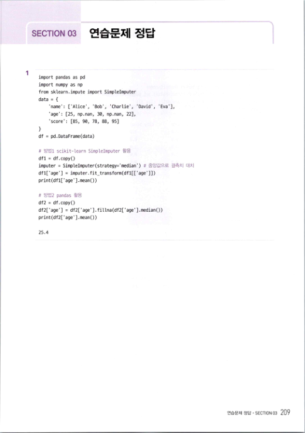
## SECㄲ아』03 
연습문제 정답

```python
import pandas as pd 
import numpy as np 
from sklearn.impute import Simplelmputer 
data = {
```
' name' : ['Alice', ' Bob ', 'Charlie', 'David', 'Eva'] , 'age ' : [25, np.nan, 30, np.nan, 22], 'score' : [85, 90, 78, 88, 95]

```python
df = pd.DataFrame(data)
# 방법1 scikit-learn Simplelinputer 활용 
dfl = df.copy() 
imputer = Simplelmputer(strategy='median') # 중앙값으로 결측치 대치 
dfl[ 'age'] = imputer.fit_transform(dfl[['age'] ]) 
print(dfl[ 'age'] .meanO)
# 방법2 pandas 활용 
df2 = df.copy() 
df2[ 'age'] = df2[ 'age'] .fillna(df2[ 'age '] .medianO) 
print(df2[ 'age'] .meanQ)
```
25.4 연습문제정답．SEC지아』03 209

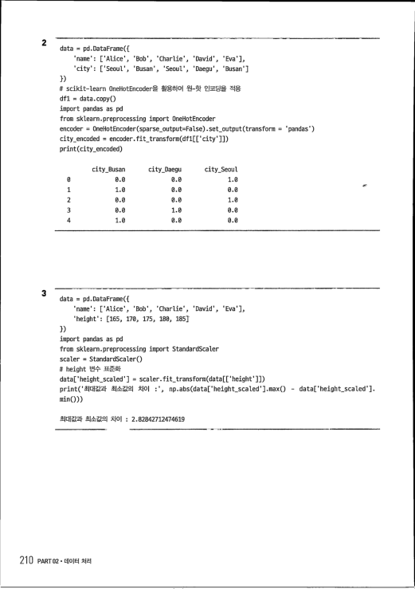
```python
2 
data = pd.DataFrame({
```
'name' : ['Alice', 'Bob', 'Charlie', 'David', 'Eva'] ,

```python
' city' : ['Seoul', 'Busan', 'Seoul', 'Daegu', 'Busan'] 
}) 
# scikit-learn OneHotEncode「을 활용하여 원－핫 인코딩을 적용 
df 1 = data.copy() 
import pandas as pd 
from sklearn.preprocessing import OneHotEncoder
encoder = OneHotEncoder(sparse_output=False) . set_output (transform = 'pandas') 
city_encoded = encoder.fit_transform(dfl[['city'] ]) 
print(city_encoded)
```
city_Busan city_Daegu city_Seoul 0 0 . 0 0 . 0 1 . 0 1 1.0 0.0 0.0 2 0.0 0.0 1.0 3 0.0 1.0 0.0 4 1.0 0.0 0.0

```python
data = pd.DataFrame({
'name': ['Alice', 'Bob', 'Charlie', 'David', 'Eva'] , 
'height' : [165, 170, 175, 180, 185]' 
}) 
import pandas as pd 
from sklearn.preprocessing import StandardScaler 
scaler · StandardScaler()
# height 번수 표준화
data[ 'height_scaled'] = scaler.fit_transform(data[['height'] ]) 
print(' 최대값과 최소값의 차이 
= ', np.abs(data['hei醜t_scaled'] .max()
```
- data['height_scaled'] .
minQ)) 최대값과 최소값의 차이 : 2.82842712474619 210 PART02．데이터처리

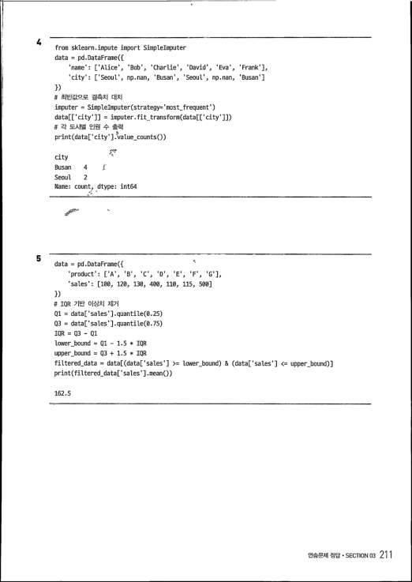
```python
4 
from sklearn.inipute import SimpLelmputer 
data = pd.DataFrame({
```
'name': ['Alice', 'Bob', 'Charlie', 'David', 'Eva', 'Frank'] ,

```python
' city ' : ['Seoul', np.nan, 'Busan', 'Seoul', np.nan, 'Busan'] 
}) 
# 최빈값으로 결측치 대치
imputer = Simplelmputer(strategy='most_frequent') 
data[['city'] ] = imputer.fit_transform(data{['city'] ])
＃『 각 도시별 인원 수 출력 
print(data[ 'city'] !ialue_countsQ)
```
## 'r
city Busan 4 Seoul 2 Name: count, dtype: int64

```python
data = pd.DataFrame({ 
' 
'product': ['A', 'B', 'C', 'D', 'E', 'F', '6'] ,
' sales' : [100, 120, 130, 400, 110, 115, 500〕 
}) 
# I (그R 기반 이상치 제거 
Qi = data[ 'sales'] .quantile(0.25)
Q3 = data[ 'sales'] .quantile(0.75)
IQR = Q3 - Ql 
lower_bound = Q1 - 1.5 * IQR
upper_bound = Q3 + 1.5 * IQR 
filtered_data = data[(data[ 'sal.es'] >= lower_bound) 
print(filtered_data['sales' ].meanQ)
```
& (data[ 'sales'] <= upper_bound)] 162.5 연습문제정답· SECTION 03 211

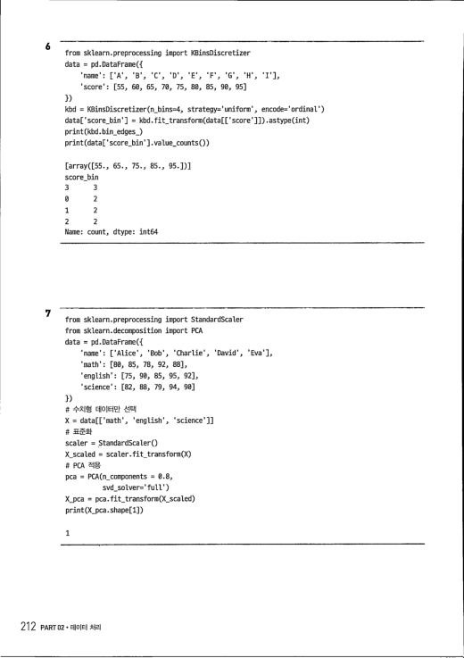
6

```python
from sklearn.preprocessing import KBinsDiscretizer
data = pd.DataFrame({
```
'name': ['A', 'B', 'C', 'D', 'E', 'F', '6', 'H', 'I '] ,

```python
' score': [55, 60, 65, 70, 75, 80, 85, 90, 95] 
}) 
kbd = KBinsDiscretizer(n_bins=4, strategy='uniform', encode='ordinal') 
data[ 'score_bin'] = kbd.fit_transfonn(data[['score'] ]) .astype(int) 
print(kbd. bin_edges_) 
print(data[ 'score_bin'] .vaLue_countsQ)
```
[array([55., 65., 75., 85., 95.])] score bin 3 3 0 2 1 2 2 2 Name: count, dtype: int64 7

```python
from sklearn.preprocessing import StandardScaler
from sklearn.decomposition import PCA
data = pd.DataFrame({
```
'name' : ['Alice', 'Bob', 'Charl.ie', 'David', 'Eva'] , 'math': [80, 85, 78, 92, 88], 'english': [75, 90, 85, 95, 92], 'science': [82, 88, 79, 94, 90] })

# 수치형 데이터만 선택
```python
X = data[{'math', 'english', 'science'] ]
＃표준화 
scaler = . standardScaler()
X_scaled = scaler,fit_transform(X)
# PCA 적용
pca = PCA(n_components = 0.8,
svd_solver=' full')
X_pca = pca . fit_transform(X_scaled) 
print(X_pca .shape[l] )
```
1 212 PARTOZ. 데이터 처리
