# PART 03
# 머신러닝과 모델링
파트 소개 이 파트에서는 scikit-learn을 활용한 머신러닝 모델 구축과 최적화를 다룹니다 . 특히， 시험에서 활용되는 모델을 중심으로 모델 평가 및 하이퍼파라미터 튜닝 , 회귀 및 분류 모델 적합 , 군집 분석에 대해 학습합니다． ◇ 주요 내용 ' 모델 평가 및 튜닝 : ㅍ톼 검증 . 성능 ㅈ＂뙤 하이퍼파라미터 최적화

- 회귀 분석 : KNN , 트리 기반 朝니 . SVR
- 분류 모델 : KNN . 트리 기반 분류 , SVM 
' 군집 분석 가＜－평균 . 계층적 군집 , DBSCAN , 군집 유효성 평가

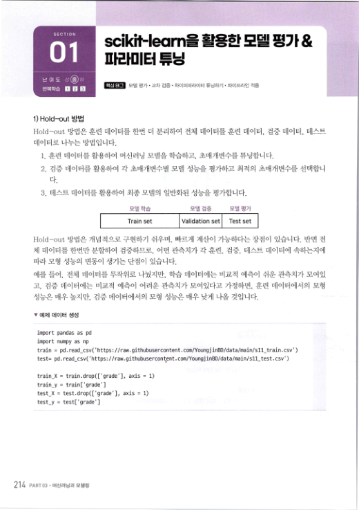
# Sc汝洲earn을 활용한 모델 평가 & 
파라미터 튜닝

# SECTION 01
난 이 도 厓） 핵심 태 그 모델 평가 · 교차 검증 · 하이퍼파라이터 튜닝하기 · 파이프라인 적용 반복학습 .

- .
1꺼old-out 방법 Hold-out 방법은 훈린 데이터를 한번 더 분리하여 전쳬 데이터를 훈련 데이터 , 검증 데이터 , 테스트 데이터로 나누는 방법입니다． 1 . 훈련 데이터를활용하여 머신러닝 모델을 학습하고 , 초매개변수를튜닝합니다． 2 . 검증 데이터를 활용하여 각 초매개변수별 모델 성능을 평가하고 최적의 초매개변수를 선택합니 다． 3 . 테스트 데이터를 활용하여 최종 모델의 일반화된 성능을 평가합니다． 모델 학습 모델 검증 모델 평가 Train set Validation set Test set Hold-out 방법은 개념적으로 구현하기 쉬우며 , 빠르게 계산이 가능하다는 장점이 있습니다 . 반면 전 체 데이터를한번만 분할하여 검증하므로 , 어떤 관측치가 각훈련 , 검증 , 테스트 데이터에 속하는지에 따라 모형 성능의 변동이 생기는 단점이 있습니다． 예를 들어 , 전쳬 데이터를 무작위로 나눴지만 , 학습 데이터에는 비교적 예측이 쉬운 관측치가 모여있 고 , 검증 데이터에는 비교적 예측이 어려운 관측치가 모여있다고 가정하면 , 훈련 데이터에서의 모형 성능은 매우 높지만 , 검증 데이터에서의 모형 성능은 매우 낮게 나올 것입니다． ▼ 예제 데이터 생성

```python
import pandas as pd 
import numpy as np 
train = pd. read- csv( ' https://raw.githubusercontent.com/YoungjinBD/data/main/sll_train.csv') 
test= pd. read_csv('https://raw.githubusercontent.com/YoungjinBD/data/main/sll_test.csv ')
train_X = train.drop([ 'grade'] , axis = 1) 
train_y = train[ 'grade '] 
test_X = test.drop([ 'grade '] , axis = 1) 
test_y = test[ 'grade ']
```
214 PART03．머신러닝과모델링

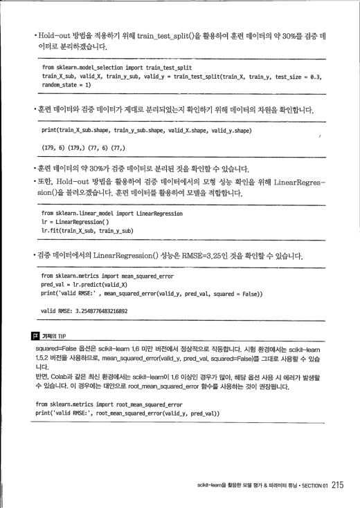
' Hold-out 방법을 적용하기 위해 train_test_split(）을 활용하여 훈런 데이터의 약 30％를 검증 데 이터로 분리하겠습니다．

```python
from skl.earn . model_selection import train_test_split 
train_X_sub, valid_X, train_y_sub, valid_y = train_test_spl.it (train_X, train_y, test_size = 0.3, 
random_state = 1)
```
' 훈런 데이터와 검증 데이터가 제대로 분리돠었는지 확인하기 위해 데이터의 차원을 확인합니다．

```python
print(train_X_sub.shape, train_y_sub.shape, valid_X.shape, valid_y.shape)
```
(179, 6) (179,) (77, 6) (77,) ' 훈련 데이터의 약 30％가 검증 데이터로 분리된 것을 확인할 수 있습니다． ' 또한， Hold-out 방법을 활용하여 검증 데이터에서의 모형 성능 확인을 위해 珏nearRegres- sion(）을불러오겠습니다 . 훈련 데이터를 활용하여 모델을 적합합니다．

```python
from sklearn.linear_model. import LinearRegression 
ir = LinearRegression() 
ir. fit (train_X_sub, train_y_sub)
```
' 검증 데이터에서의 LinearRegression() 성능은 RMSE=3.25인 것을 확인할 수 있습니다．

```python
from sklearn.metrics import mean_squared_error 
pred_val = lr. predict(valid_X) 
print('va1.id RMSE: ' , mean_squared_error(valid_y, pred_val., squared = False))
```
valid RMSE: 3.2548776483216892 r헴 기적의 지p

```python
squared=False 옵션은 scikit-learn 1.6 미만 버전에서 정상적으로 작동합니다 . 시험 환경에서는 scikit-learn 
1.5.2 버전을 사용하므로， mean_.squared_error(valid_y, pred_val, squared=False）를 그대로 사용할 수 있습 
니다．
```
반면， Colab과 같은 최신 환경에서는 scikit-learn이 1.6 이상인 경우가 많아 , 해당 옵션 사용 시 에러가 발생할 수 있습니다． 이 경우에는 대안으로 root_mean_squared_error 함수를 사용하는 것이 권장됩니다．

```python
from sklearn.metrics import root_mean_squared_error 
print('valid RMSE: ', root_mean_squared_error(valid_y, pred_val))
```
scikit-learn을 활용한 모델 평가 & 파라미터 튜닝 · SECTION 01 2巧

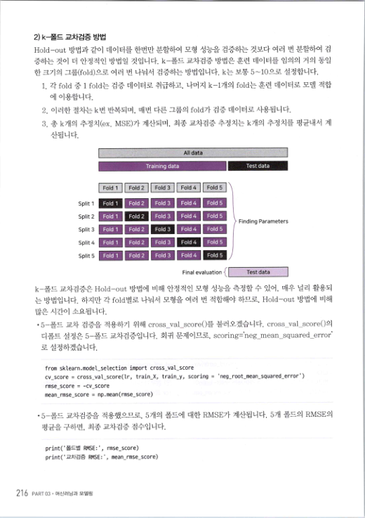
2) k－폴드 교차검증 방법 Hold-out 방법과 같이 데이터를 한번만 분할하여 모형 성능을 검증하는 것보다 여러 번 분할하여 검 증하는 것이 더 안정적인 방법일 것입니다 . k－폴드 교차검증 방법은 훈련 데이터를 임의의 거의 동일 한 크기의 그룹（fold）으로 여러 번 나눠서 검증하는 방법입니다 . k는 보통 5---i0으로 설정합니다． 1 . 각 fold 중 1 fold는 검증 데이터로 취급하고 , 나머지 k-i개의 fold는 훈련 데이터로 모델 적합 어I 이용합니다． 2 . 이러한 절차는 k번 반복되며 , 매번 다른 그룹의 fold가 검증 데이터로 사용됩니다． 3 . 총 k개의 추정치（ex. MSE）가 계산되며 , 최종 교차검증 추정치는 k개의 추정치를 평균내서 계 산됩니다 .

All data Test data Training data F이d4 F이d5 F이d3 Fold 2 Fold 1 F이d3 Fold 4 F이d5 Fold 1 Fold 2 S이it 1 Fold 4 Fold 5 F이d3 F이dl Fold 2 햐ilit 2 Finding Parameters F이d4 n기d3 R1d 5 F이d2 Fold 1 Split 3 Fold 5 Fold 3 Fold 4 F이dl Fold 2 S이it 4 F이d 4 Fold 5 F이d2 Fold 3 F이dl Split 5

## Final evaluation {
Test data k－폴드 교차검증은 {old-out 방법에 비해 안정적인 모형 성능을 측정할 수 있어 , 매우 널리 활용되 는 방법입니다 . 하지만 각 fold별로 나눠서 모형을 여러 번 적합해야 하므로 , Hold-out 방법에 비해 많은 시간이 소요됩니다． .5－폴드 교차 검증을 적용하기 위해 cross_va1_score(）를 불러오겠습니다 . cross_val-score(）의 디폴트 설정은 5－폴드 교차검증입니다 . 회귀 문제이므로 , scoring='neg_mean_squared_error' 로 설정하겠습니다 .

```python
from sk1earn .model_selection import cross_val_score
cv_score = cross_val_score(lr, train_X, train_y, scoring = ' neg_root_mean_squared_error' )
```
rinse score = -cv score

```python
mean_rinse_score = np.mean(rmse_score)
```
.5－폴드 교차검증을 적용했으므로 , 5개의 폴드에 대한 RMSE가 계산됩니다 . 5개 폴드의 RMSE의 평균을구하면 , 최종교차검증 점수입니다．

```python
print(' 폴드별 刪SE: ' , rmse_score) 
print(' 교차검증 刪SE: ' , mean_rinse_score)
```
216 PART03· 머신러닝과모델링

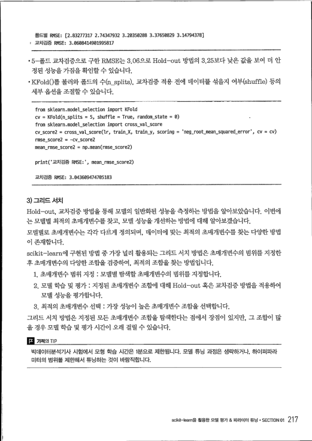
폴드별 RMSE: [2.83277317 2.74347932 3.20350288 3.37650829 3.14794378] ' 교차검증 刪SE: 3.0608414901995817 .5－폴드 교차검증으로 구한 RMSE는 3.06으로 Hold-out 방법의 3.25보다 낮은 값을 보여 더 안 정된 성능을 가짐을 확인할 수 있습니다．

- KFo1d(）를 불러와 폴드의 수（n_splits) , 교차검증 적용 전에 데이터를 섞을지 여부（shuffle) 등의
세부 옵션을 조절할 수 있습니다．

```python
from skLearn.model_sel.ection import KFo1.d
cv = KFold(n_splits = 5, shuffle = True, random-state = 0)
from skLearn.model_selection import cross_val_score
cv_score2 = cross_val._score(lr, train_X, train_y, scoring = ' neg_root_mean_squared_error', cv = cv)
```
rmse score2 = -cv score2

```python
mean_rmse_score2 = np.mean(rmse_score2)
print(' 교차검증 RuSE: ' , mean_rmse_score2)
```
교차검증 刪SE: 3.043609474705183 3) 그리드 서치 Hold-out , 교차검증 방법을 통해 모델의 일반화된 성능을 측정하는 방법을 알아보았습니다 . 이번에 는 모델별 최적의 초매개변수를 찾고 , 모델 성능을 개선하는 방법에 대해 알아보겠습니다． 모델별로 초매개변수는 각각 다르게 정의되며 , 데이터에 맞는 최적의 초매개변수를 찾는 다양한 방법 이 존재합니다． scikit-learn에 구현된 방법 중 가장 널리 활용되는 그리드 서치 방법은 초매개변수의 범위를 지정한 후초매개변수의 다양한조합을 검증하여 , 최적의 조합을 찾는 방법입니다 .

1 . 초매개변수 범위 지정 : 모델별 탐색할 초매개변수의 범위를 지정합니다． 2 . 모델 학습 및 평가 : 지정된 초매개변수 조합에 대해 Hold-out 혹은 교차검증 방법을 적용하여 모델 성능을 평가합니다． 3 . 최적의 초매개변수 선택 : 가장 성능이 높은 초매개변수 조합을 선택합니다． 그리드 서치 방법은 지정된 모든 초매개변수 조합을 탐색한다는 점에서 장점이 있지만 , 그 조합이 많 을 경우 모델 학습 및 평가 시간이 오래 걸릴 수 있습니다．

### r헴 기적의 ㄲp
빅데이터분석기사 시험에서 모형 학습 시간은 1분으로 제한됩니다 . 모델 튜닝 과정은 생략하거나 , 하이퍼파라 미터의 범위를 제한해서 튜닝하는 것이 바람직합니다． scikit-learri을활용한모델평가＆파라미터튜닝．SECTION 01 217

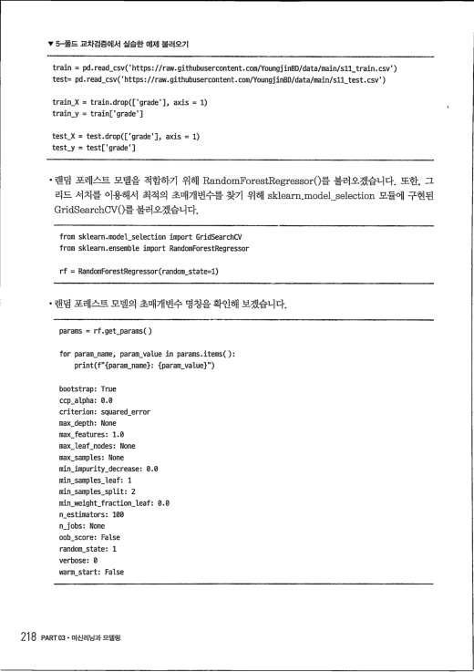
v5－폴드 교차검증에서 실습한 예제 불러오기

```python
train = pd.read_csv( 'https://raw.githubusercontent.com/youngjinBD/data/niain/s11_trajn.csv') 
test= pd.read_csv('https://raw.githubusercontent.com/YoungjinBD/data/main/sll-test.csv ')
train_X = train.drop(['grade'], axis = 1) 
train_y = train[ 'grade'J
test_X = test.drop([ 'grade'], axis. = 1) 
test_y = test[ 'grade ']
```
- 랜덤 포레스트 모델을 적함하기 위해 RandomForestRegressorㅇ를 불러오겠습니다 . 또한 , 그
리드 서치를 이용해서 최적의 초매개변수를 찾기 위해 sklearn.model selection 모듈에 구현된 GridSearchCV(）를 불러오겠습니다．

```python
from sklearn. modeL_selection import GridSearchCV 
from sklearn.ensembl.e import RandomForestRegressor
rf = RandomForestRegressor(random_state=1)
```
- 랜덤 포레스트 모델의 초매개변수 명칭을 확인해 보겠습니다．
```python
params = rf.get_params()
for param_narne, pararn_value in params.items( ): 
print(f"{param_name}: {param_value}")
```
bootstrap: True ccp_alpha: 0.0 criterion: squared_error max_depth: None max features: 1.0 max leaf nodes: None max_samples: None mmn_impurity_decrease: 0.0 min_saniples_leaf: 1 mmn_samples_split: 2 mmn_weight_fraction_leaf: 0.0 n estimators: 100 n_jobs: None oob score: False random state: 1 verbose: 0 warm start: False 218 PART03＊머신러닝과모델링

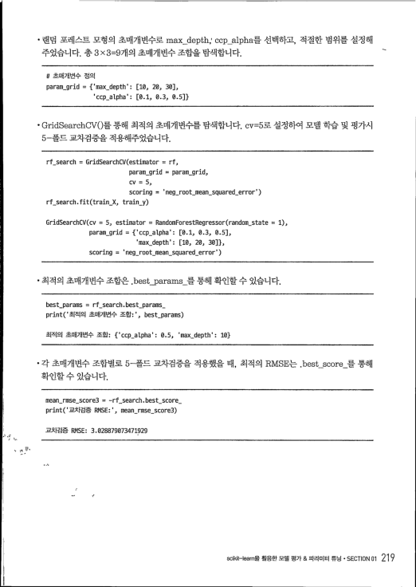
- 랜덤 포레스트 모형의 초매개변수로 max_depth, . ccp_alpha를 선택하고 , 적절한 범위를 설정해
주었습니다 . 총 3x3=9개의 초매개변수 조합을 탐색합니다．

```python
# 초매개변수 정의
param_grid = {'max_depth' : [10, 20, 30],
```
'ccp_alpha' : [0.1, 0.3, 0.5]}

- GridSearchCV(）를 통해 최적의 초매개변수를 탐색합니다 . cv=5로 설정하여 모델 학습 및 평가시
5－폴드 교차검증을 적용해주었습니다．

```python
rf_search = GridSearchCV(estimator = rf,
param_grid = pararn_grid, 
cv = 5, 
scoring = 'neg_root_mean_squared_error') 
rf_search . fit (train_X, train_y)
```
GridSearchCV(cv = 5, estimator = RandomForestRegressor(random_state = 1),

```python
param_grid = {'ccp_alpha' : [0.1, 0.3, 0.5],
'max_depth' : [10, 20, 30]}, 
scoring = 'neg_root_mean_squared_error')
```
- 최적의 초매개변수 조합은 . best_params－를 통해 확인할 수 있습니다．
```python
best_params = rf_search. best_params_ 
print(' 최적의 초매개변수 조합： ', best_params)
```
최적의 초매개변수 조합： {'ccp_al.pha' : 0.5, 'max_depth': 1아

- 각 초매개변수 조합별로 5－폴드 교차검증을 적용했을 때 , 최적의 RMSE는 . best_score－를 통해
확인할 수 있습니다．

```python
mean rmse score3 = -rf search.best score 
print(' 교차검증 刪SE: ' , mean_rmse_score3)
```
교차검증 「1MSE: 3.028879073471929 scikit-Iearri을활용한모델펑가＆파라미터튜닝．SECTION 01 219

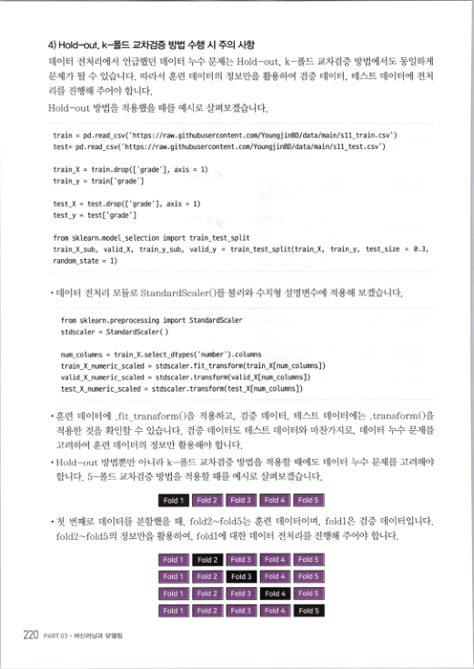
4) Hold-out. k폴드 교차검증 방법 수행 시 주의 사항 데이터 전처리에서 언급했던 데이터 누수 문제는 boid-out, k－폴드 교차검증 방법에서도 동일하게 문제가 될 수 있습니다 . 따라서 훈련 데이터의 정보만을 활용하여 검증 데이터 , 테스트 데이터에 전처 리를 진행해 주어야 합니다． Hold-out 방법을 적용했을 때를 예시로 살펴보겠습니다．

```python
train = pd. read_csv( 'https://raw.githubusercontent.com/YoungjinBD/data/main/sll_train.csv') 
test= pd. read_csv('https://raw.githubusercontent.com/YoungjinBD/data/main/sll_test.csv')
train_X = train.drop([ ' grade'] , axis = 1) 
train_y = train[ 'grade']
test-X = test.drop([ 'grade'] , axis = 1) 
test_y = testf 'grade ']
from sklearn.model_selection import train_test_split 
train_X_sub, valid_X, train_y_sub, valid_y = train_test_split(train_X, train_y, test_size = 0.3,
random_state = 1)
```
- 데이터 전처리 모듈로 StandardScaler(）를 불러와 수치형 설명변수에 적용해 보겠습니다．
```python
from sklearn.preprocessing import StandardScaler 
stdscaler = StandardScaler()
num_col.umns = train_X.select_dtypes( 'number') .columns 
train_X_numeric_scaled = stdscaler. fit_transform(train_X[num_columns]) 
valid_X_numeric_scaled = stdscaler. transform(valid_X[num_columns]) 
test_X_numeric_scaled = stdscaler. transform(test_X[num_columns])
```
- 훈련 데이터에 . fit transform(）을 적용하고 , 검증 데이터 , 테스트 데이터에는 . transform(）을
적용한 것을 확인할 수 있습니다 . 검증 데이터도 테스트 데이터와 마찬가지로 , 데이터 누수 문제를 고려하여 훈련 데이터의 정보만 활용해야 합니다．

- Hold-out 방법뿐만 아니라 k－폴드 교차검증 방법을 적용할 때에도 데이터 누수 문제를 고려해야
합니다 . 5－폴드 교차검증 방법을 적용할 때를 예시로 살펴보겠습니다． F이dl Fold Fold 3 Fold의

- 첫 번째로 데이터를 분할했을 때 , fo1d2'-'-fold5는 훈린 데이터이며 , foldi은 검증 데이터입니다．
fold2-=Iold5의 정보만을 활용하여 , foldi에 대한 데이터 전처리를 진행해 주어야 합니다． Fold 3 - Fold 4 F이d5 Fold 2 Fold 1 - Fold 5 - Fold4 Fold 2 - Fold 3 Fold 1 - Fold 1 - E（쁘시 Fold 3 ㅣ F이d4 Fold 5 Fold 1 - Fold 2 - Fold 3 Fold 4 - Fold 5 220 PART03．머신러닝과모델링

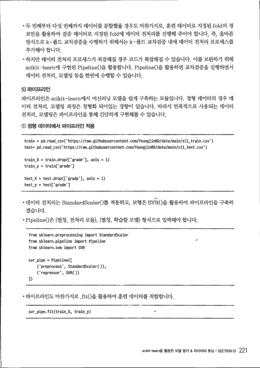
- 두 번째부터 다섯 번깨까지 데이터를 분할했을 경우도 마찬가지로 , 훈런 데이터로 지정된 fold의 정
보만을 활용하여 검증 데이터로 지정된 fold에 데이터 전처리를 진행해 주어야 합니다 . 즉 , 올바른 방식으로 k－폴드 교차검증을 수행하기 위해서는 k－폴드 교차검증 내에 데이터 전처리 프로세스를 추가해야 합니다．

- 하지만 데이터 전처리 프로세스가 복잡해질 경우 코드가 복잡해질 수 있습니다 . 이를 보완하기 위해 
scikit-learn에 구현된 Pipeline(）을 활용합니다 . Pipeline(）을 활용하면 교차검증을 진행하면서 데이터 전처리 , 모델링 등을 한번에 수행할수 있습니다． 5) 파이프라인 파이프라인은 scikit-learn에서 머신러닝 모델을쉽게 구축하는 모듈입니다 . 정형 데이터의 경우 데 이터 전처리 , 모델링 과정은 정형화 되어있는 경향이 있습니다 . 따라서 반복적으로 사용되는 데이터 전처리 , 모델링은 파이프라인을 통해 간단하게 구현해볼 수 있습니다． ① 정형 데이터에서 파이프라인 적용

```python
train = pd.read_csv('https://raw.githubusercontent.com/YoungjinBD/data/niain/sll_train.csv') 
test= pd.read_csv('https://raw.githubusercontent.com/YoungjinBD/data/main/s11_test.csv ')
train_X = train.drop([ 'grade'J, axis = 1) 
train_y = train[ 'grade']
test_X = test.drop([ 'grade'] , axis = 1) 
test_y = test[ 'grade']
```
- 데이터 전처리는 StandardScaler(）를 적용하고 , 모형은BvI귐（）을활용하여 파이프라인을 구축하
겠습니다．

- Pipeline(）은 （별칭 , 전처리 모듈） , （별칭 , 학습할모델） 형식으로 입력해야합니다．
```python
from sklearn.preprocessing import StandardScaler
from sklearn.pipeline import Pipeline 
from sklearn.svm import SVR
```
svr_pipe = Pipeline([ ( 'preprocess', StandardScalerO), ('regressor', SVR() ) ])

- 파이프라인도 마찬가지로 . fit(）을 활용하여 훈련 데이터를 적합합니다．
svr_pipe. fit (train_X, train_y) scikit-Ieam을활용한모델평가＆파라미터튜닝· SECTION 01 221

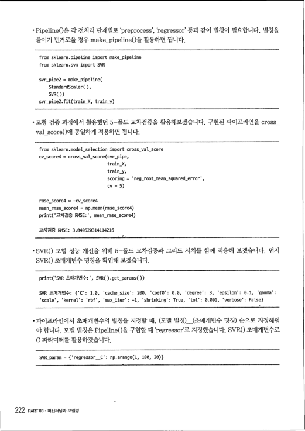
- Pipeline(）은각전처리 단계별로 ' preprocess', 'regressor ' 등과같이 별칭이 필요합니다 . 별칭을
붙이기 번거로울 경우 make_pipeline(）을 활용하면 됩니다．

```python
from sklearn.pipel.ine import make_pipeline
from sklearn.svm import SVR
svr_pipe2 = make_pipeline( 
StandardScaLerQ,
```
SVRO) svr_pipe2. fit (train_X, train_y)

- 모형 검증 과정에서 활용했던 5－폴드 교차검증을 활용해보겠습니다 . 구현된 파이프라인을 cross-
val_score(）에 동일하게 적용하면 됩니다．

```python
from sklearn.model_selection import cross_val_score
cv_score4 = cross_va 1_score (svr_pipe, 
train_X, 
train_y, 
scoring = 'neg_root_mean_squared_error',
cv = 5)
```
rmse score4 = -cv score4

```python
mean_rmse_score4 = np.mean(nnse_score4) 
print(' 교차검증 RNSE: ' , mean_rmse_score4)
```
교차검증 RMSE: 3.040520314114216

- svR() 모형 성능 개선을 위해 5－폴드 교차검증과 그리드 서치를 함께 적용해 보겠습니다 . 먼저 
svR() 초매개변수 명칭을 확인해 보겠습니다．

```python
print('SVR 초매개변수： ' , SVR( ).get_params ( ))
```
SVR 초매7ll변수: {'C' : 1.0, 'cache_size' : 200, 'coefO' : 0.0, 'degree': 3, 'epsilon' : 0.1, 'gama':

' scale', 'kernel': 'rbf', 'max_iter': - 1, 'shrinking' : True, 'tol': 0.001, 'verbose': False}

- 파이프라인에서 초매개변수의 별칭을 지정할 때 , （모델 별칭）--（초매개변수 명칭） 순으로 지정해줘
야합니다 . 모델 별칭은Pipeli끄e(）을구현할 때 ' regressor'로 지정했습니다 . svR() 초매개변수로 C 파라미터를 활용하겠습니다．

```python
SVR_param = {'regressor__C': np.arange(1, 100, 20)}
```
222 PART 03· 머신러닝과모델링

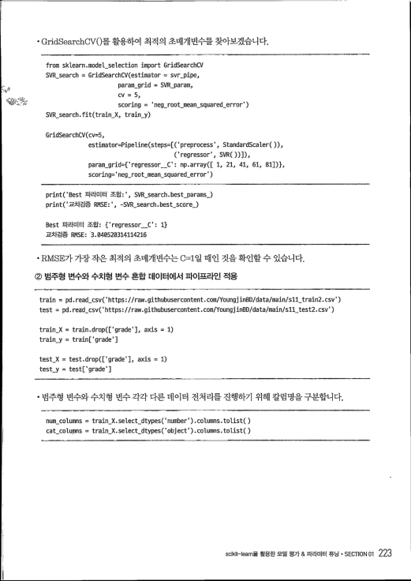
- GridSearchCV(）를 활용하여 최적의 초매개변수를 찾아보겠습니다．
```python
from sklearn.niodel._selection import GridSearchCV
SVR_search = GridSearchCV(estimator = svr_pipe,
param_grid = SVR_param,
cv = 5, 
scoring = ' neg_rootjuean_squared_error ')
```
SVR_search. fit (train_X, train_y)

```python
GridSearchCV(cv=5, 
estimator=Pipe1ine(steps=[ 'preprocess ', StandardScal.erQ), 
( 'regressor', SVRO)]),
param_grid={'regressor__C ' : np.array([ 1, 21, 41, 61, 81])},
scoring= ' neg_root_mean_squared_error ')
print(' Best 파라미터 조합＝ ' , SVR_search.best_params_) 
print(' 교F검증 RMSE:', -SVR_search.best_score_)
```
Best 파라미터 조합＝ { 'regressor__C' : 1} 교차검증 刪SE: ' 3. @40520314114216

- RMSE가 가장 작은 최적의 초매개변수는 0=1일 때인 것을 확인할 수 있습니다．
② 범주형 변수와 수치형 변수 혼합 데이터에서 파이프라인 적용

```python
train = pd.read_csv('https://raw.githubusercontent.com/YoungjinBD/data/main/sll_train2.csv') 
test = pd.read_csv('https://raw.githubusercontent.com/YoungjinBD/data/main/sll_test2.csv ')
train_X = train.drop([ 'grade 'J, axis = 1) 
train_y = train[ 'grade']
test_X = test.drop({ 'grade '] , axis = 1) 
test_y = test[ 'grade']
```
- 범주형 변수와수치형 변수 각각 다른 데이터 전처리를 진행하기 위해 칼럼명을 구분합니다．
```python
num_colunins = train_X.select_dtypes( 'number ') .columns.tolist() 
cat_columns = train_X.select_dtypes( 'objecV).coluinns.tol.ist()
```
scikit-learn을활용한모델 평가＆파라미터 튜닝 .SECTION 01 223

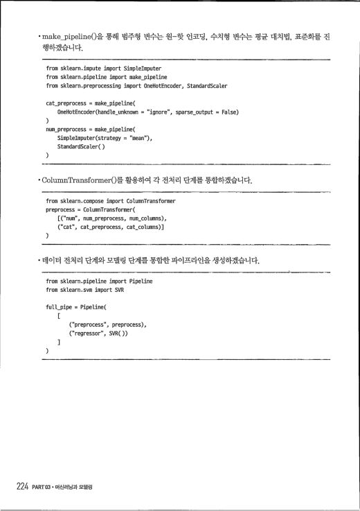
- makepipeline(）을 통해 범주형 변수는 원－핫 인코딩 , 수치형 변수는 평균 대치법 , 표준화를 진
행하겠습니다．

```python
from sklearn.impute import Simplelmputer 
from sklearn.pipeline import make_pipeline 
from sklearn.preprocessing import OneHotEncoder, StandardScaler
cat_preprocess = make_pipeline(
```
OneHotEncoder(handle_unknown = "ignore', sparse_output = False)

```python
num_preprocess = make_pipeline(
```
Simp.lelmputer(strategy = "mean"), StandardScaler()

- ColumnTransformer(）를 활용하여 각 전처리 단계를 통합하겠습니다．
```python
from sklearn.compose import ColuninTransformer 
preprocess = Columnlransformer( 
f( "num", num_preprocess, num_columns), 
("cat', cat_preprocess, cat_columns)J 
)
```
- 데이터 전처리 단계와 모델링 단계를 통합한 파이프라인을 생성하겠습니다．
```python
from sklearn.pipeline import Pipeline 
from sklearn.svm import SVR
```
full_pipe = Pipeline( [ ("preprocess", preprocess), ("regressor", SVRO) 11 224 PART 03．머신라닝과모델링

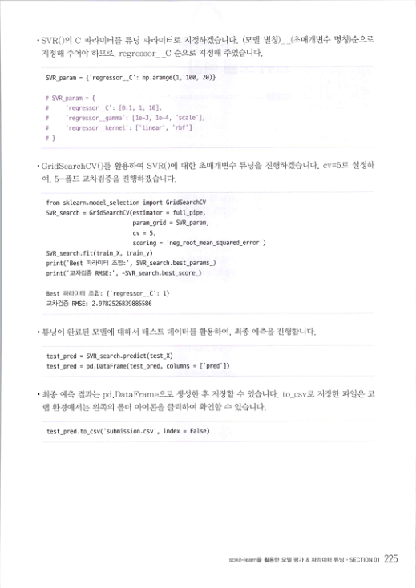
- SVR(）의 C 파라미터를 튜닝 파라미터로 지정하겠습니다 . （모델 별칭）-（초매개변수 명칭）순으로
지정해 주어야 하므로 , regressor_ _C 순으로 지정해 주었습니다．

```python
SVR_param = { 'regressor__C ' : np.arange(1, 100, 20)}
# SVR_param = {
# 
' regressor__C' : [0.1, 1, 10],
# 
' regressor__gamma ' : [le-3, le-4, ' scale' ],
# 
' regressor- kernel' : ['linear' , ' rbf' ]
# }
```
- GridSearchCV(）를 활용하여 SVR(）에 대한 초매개변수 튜닝을 진행하겠습니다 . cv=5로 설정하
여 , 5－폴드 교차검증을 진행하겠습니다．

```python
from skl.earn.model_selection import GridSearchCV
SVR_search = GridSearchCV(estimator = full_pipe,
param_grid = SVR_param,
cv = 5, 
scoring = ' neg_root_mean_squared_error ' )
SVR_search . fit (train_X, train_y) 
print(' Best 파라미터 조합： ' , SVR_search . best_params_) 
print(' 교F검증 RMSE: ', -SVR_search.best_score_)
```
Best 파라미터 조합： { ' regressor__C ' : 1} 교차검증 「楓SE: 2.9782526839885586

- 튜닝이 완료된 모델에 대해서 테스트 데이터를 활용하여 , 최종 예측을 진행합니다．
```python
test_pred = SVR_search . predict(test_X) 
test_pred = pd.DataFrame(test_pred, columns = ['pred])
```
- 최종 예측 결과는 pd.DataFrame으로 생성한 후 저장할 수 있습니다 . to_csv로 저장한 파일은 코
랩 환경에서는 왼쪽의 폴더 아이콘을 클릭하여 확인할 수 있습니다． test_pred.to_csv( ' submission.csv , index = False) scikit-learn을활용한모델 평가＆ 파라미터 튜닝 .SECTION 01 225

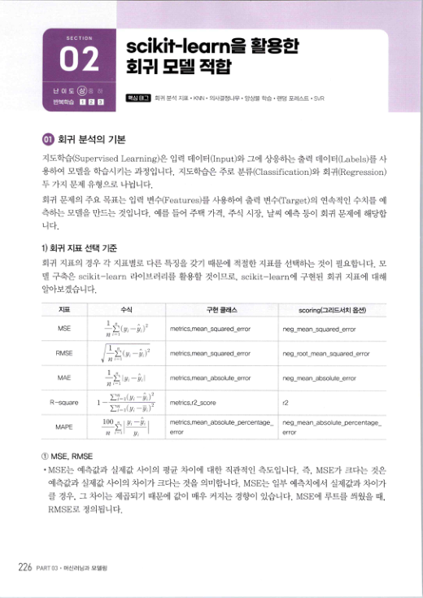
# Sc汝it-learn을 활용한 
회귀 모델 적합

# SECTION 02
난 이 도 텡I 핵심 태그 회귀 분석 지표 · KNN · 의사결정나무 · 앙상블 학습 · 랜덤 포레스트 · S\爪 반복학습 聊． a " .

회귀 분석의 기본 지도학습（Supervised Learning）은 입력 데이터（Input）와 그에 상응하는 출력 데이터（Labels）를 사 용하여 모델을 학습시키는 과정입니다 . 지도학습은 주로 분류（Classification）와 회귀（Regression) 두 가지 문제 유형으로 나뉩니다． 회귀 문제의 주요 목표는 입력 변수（Features）를 사용하여 출력 변수（Target）의 연속적인 수치를 예 측하는 모델을 만드는 것입니다 . 예를 들어 주택 가격 , 주식 시장 , 날씨 예측 등이 회귀 문제에 해당합 니다． 1) 회귀 지표 선택 기준 회귀 지표의 경우 각 지표별로 다른 특징을 갖기 때문에 적절한 지표를 선택하는 것이 필요합니다 . 모 델 구축은 scikit-learn 라이브러리를 활용할 것이므로 , scikit-learn에 구현된 회귀 지표에 대해 알아보겠습니다． 지표 수식 구현 클래l스 scoring（그리드서치 옵션） MSE 1_i! .

. .,

- 
-＞」（跳－跳》"

- 
nt컨 metrics.mean_squared_error neg_mean_squared_error

# RMSE 댜in- (yi
n 2=1－如" metrics.mean_squared_error neg_root_mean_squared_error E A M 1 구， · 』 · --z」 IYi -YiI j'1 z=1 metrics.mean absolute error neg_mean_absolute_error 2 ㅡㅡ ylyi n* R-square 2= nㅎ 2= I metrics.r2 score r2 2 跳＾ yi metrics.mean_absolute_perceritage_ error neg_meanabsoIute_percentage error MAPE ^yl yi =iE꾜 1 刪n 跳- ①MSE. RMSE

- MSE는 예측값과 실제값 사이의 평균 차이에 대한 직관적인 측도입니다 . 즉 , MSE가 크다는 것은
예측값과 실제값 사이의 차이가 크다는 것을 의미합니다 . MSE는 일부 예측치에서 실제값과 차이가 클 경우 , 그 차이는 제곱되기 때문에 값이 매우 커지는 경향이 있습니다 . MSE에 루트를 씌웠을 때， RMSE로 정의됩니다． 226 PART03．머신러닝과모델링

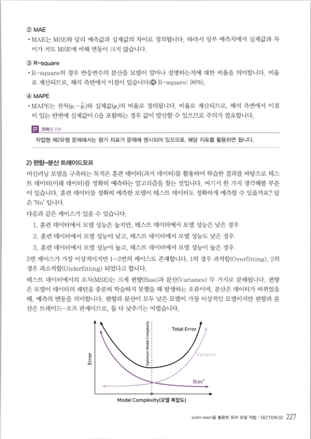
②MAE

- MAE는 MSE와 달리 예측값과 실제값의 차이로 정의됩니다 . 따라서 일부 예측치에서 실제값과 차
이가 커도 MSE에 비해 변동이 크지 않습니다． ③R-square

- R-square의 경우 반응변수의 분산을 모델이 얼마나 설명하는지에 대한 비율을 의미합니다 . 비율
로 계산되므로 , 해석 측면에서 이점이 있습니다（.IR-square: 96%).

④MAPE

- MAPE는 잔차（yi-夕f）와 실제값（￡／,）의 비율로 정의됩니다 . 비율로 계산되므로 , 해석 측면에서 이점
이 있는 반면에 실제값이 0을 포함하는 경우 값이 발산할 수 있으므로 주의가 필요합니다．

### r헴 기적의 지P
작업형 제2유형 문제에서는 평가 지표가 문제에 명시되어 있으므로 , 해당 지표를 활용하면 됩니다． 2) 편향분산 트레이드오프 머신러닝 모델을 구축하는 목적은 훈련 데이터（과거 데이터）를 활용하여 학습한 결과를 바탕으로 테스 트 데이터（미래 데이터）를 정확히 예측하는 알고리즘을 찾는 것입니다 . 여기서 한 가지 생각해볼 부분 이 있습니다 . 훈련 데이터를 정확히 예측한 모델이 테스트 데이터도 정확하게 예측할 수 있을까요？ 답 은 ' No ' 입니다． 다음과 같은 케이스가 있을 수 있습니다． 1 . 훈련 데이터에서 모델 성능은 높지만 , 테스트 데이터에서 모델 성능은 낮은 경우 2 . 훈련 데이터에서 모델 성능이 낮고 , 테스트 데이터에서 모델 성능도 낮은 경우 3 . 훈련 데이터에서 모델 성능이 높고 , 테스트 데이터에서 모델 성능이 높은 경우 3번 케이스가 가장 이상적이지만 1'--2번의 케이스도 존재합니다 . 1의 경우 과적합（0verfitting), 2의 경우 과소적합（Underfitting) 되었다고 합니다． 테스트 데이터에서의 오차（MSE）는 크게 편향（Bias）과 분산（Variance) 두 가지로 분해됩니다 . 편향 은 모델이 데이터의 패턴을 충분히 학습하지 못했을 때 발생하는 오류이며 , 분산은 데이터가 바뀌었을 때 , 예측의 변동을 의미합니다 . 편향과 분산이 모두 낮은 모델이 가장 이상적인 모델이지만 편향과 분 산은 트레이드－오프 관계이므로 , 둘 다 낮추기는 어렵습니다．

# Total Error 
寧 ＼성 ㄴ ㅇ ㄴ ㄴ 山 Model Complexity（모델 복잡도） scikit-learn을 활용한 회귀 모델 적합 . SECTION 02 227

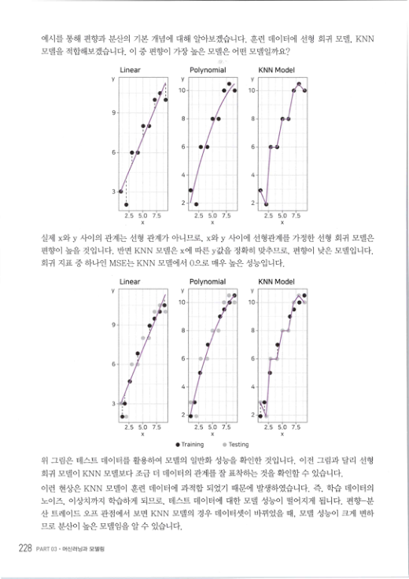
예시를 통해 편향과 분산의 기본 개념에 대해 알아보겠습니다 . 훈련 데이터에 선형 회귀 모델 , KNN 모델을 적합해보겠습니다 . 이 중 편향이 가장 높은 모델은 어떤 모델일까요？ Linear Polynomial KNN Model V

- V
10 ● .

10 1 】 ` 7 ' 2.5 5.0 7.5 2.5 5.0 7.5 x x .

】 2.5 5.0 7.5 x 실제 x와 y 사이의 관계는 선형 관계가 아니므로 , x와 y 사이에 선형관계를 가정한 선형 회귀 모델은 편향이 높을 것입니다 . 반면 KNN 모델은 x에 따른 y값을 정확히 맞추므로 , 편향이 낮은 모델입니다． 회귀 지표 중 하나인 MSE는 KNN 모델에서 0으로 매우 높은 성능입니다． Linear P0 ynomial KNN Model V V Y 10 10 9- 6- 3 25 50 75 2.5 5.0 7.5 x x 2.5 5.0 7.5 x ●Training 씽 Testing 위 그림은 테스트 데이터를 활용하여 모델의 일반화 성능을 확인한 것입니다 . 이전 그림과 달리 선형 회귀 모델이 KNN 모델보다 조금 더 데이터의 관계를 잘 표착하는 것을 확인할 수 있습니다． 이런 현상은 KNN 모델이 훈련 데이터에 과적합 되었기 때문에 발생하였습니다 . 즉 , 학습 데이터의 노이즈 , 이상치까지 학습하게 되므로 , 테스트 데이터에 대한 모델 성능이 떨어지게 됩니다 . 편향－분 산 트레이드 오프 관점에서 보면 KNN 모델의 경우 데이터셋이 바뀌었을 때 , 모델 성능이 크게 변하 므로 분잔이 높은 모델임을 알 수 있습니다 .

228 PART03．머신러닝과모델링

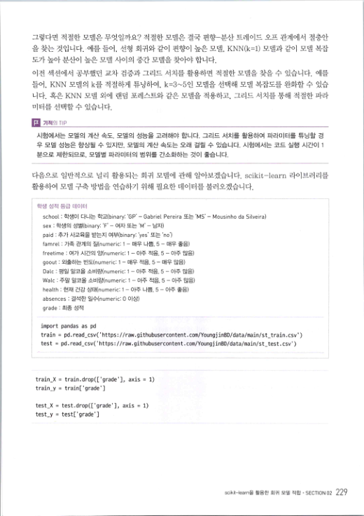
그렇다면 적절한 모델은 무엇일까요？ 적절한 모델은 결국 편향－분산 트레이드 오프 관계에서 절충안 을 찾는 것입나다 . 」예를들어 , 선형 회귀와 같이 편향이 높은 모델 , KNN(k=1) 모델과 같이 모델 복잡 도가 높파 분산이 높은 모델 사이의 중간 모델을 찾아야 합니다． 이전 섹션에서 공부했던 교차 검증과 그리드 서차를 활용하면 적절한 모델을 찾을 수 있습니다 . 예를 들어 , KNN 모델의 k를 적절하게 튜닝하여 , k=3'--5인 모델을 선택해 모델 복잡도를 완화할 수 있습 니다 . 혹은 KNN 모델 외에 랜덤 포레스트와 같은 모델을 적용하고 , 그리드 서치를 통해 적절한 파라 미터를 선택할 수 있습니다．

### r헴 기적의 ㄲp
시험에서는 모델의 계산 속도 , 모델의 성능을 고려해야 합니다 . 그리드 서치를 활용하여 파라미터를 튜닝할 경 우 모델 성능은 향상될 수 있지만 . 모델의 계산 속도는 오래 걸릴 수 있습니다 . 시험에서는 코드 실행 시간이 1 분으로 제한되므로 , 모델별 파라미터의 범위를 간소화하는 것이 좋습니다． 다음으로 일반적으로 널리 활용되는 회귀 모델에 관해 알아보겠습니다 . scikit-learn 라이브러리를 활용하여 모델 구축 방법을 연습하기 위해 필요한 데이터를 불러오겠습니다． 학생 성적 등급 데이터 r 8 성 驪 굿 2 school : 학생이 다니는 학교（binary: ' GP' - Gabriel Pereira 또는 ' MS' - Mousinho da Silveira) sex : 학생의 성별（binary: ' F' - 여자 또는 ' M' - 남자） paid : 추가 사교육을 받는지 여부（binary: ' yes ' 또는 ' n이 fa m rel : 가족 관계의 질（numeric: 1 - 매우 나쁨 , 5 - 매우 좋음） freetime : 여가 시간의 양（numeric: 1 - 아주 적음 , 5 - 아주 많음） goout : 외출하는 빈도（numeric: 1 - 매우 적음 , 5 - 매우 많음） 0ak ; 펑일 알코올 소비량（numeric: 1 - 아주 적음 . 5 - 아주 많음） Walc ; 주말 알코올 소비량（numeric: 1 - 아주 적음 , 5 - 아주 많음） health : 현재 건강 상태（numeric: 1 - 아주 나쁨 , 5 - 아주 좋음） absences : 결석한 일수《numeric: 0 이상） grade : 최종 성적

```python
import pandas as pd 
train = pd.read. csv('https://raw.githubusercontent.com/Youngjin8D/data/main/st_train.csv ') 
test = pd.read_csv( 'https://raw.githubusercontent.com/YoungjinBD/data/main/st_test.csv ')
train_X = train.drop([ 'grade '], axis = 1) 
train_y = train[ 'grade']
test_X = test.drop([ 'grade'], axis = 1) 
test_y = test[ 'grade 'J
```
scikit-learn을 활용한 회귀 모델 적합 · SECTION 02 229

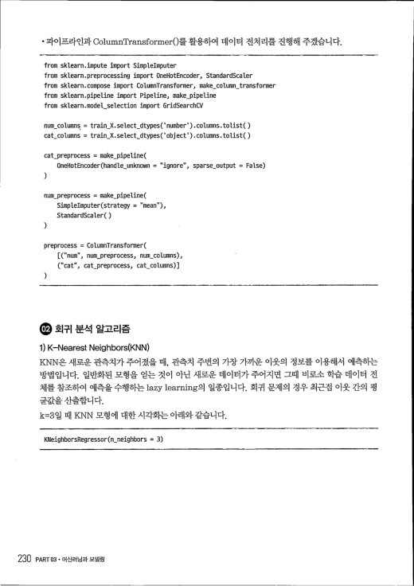
- 파이프라인과 ColumnTransformer(）를 활용하여 데이터 전처리를 진행해 주겠습니다．
```python
from skl.earn.impute import Siniplelmputer 
from skl.earn.preprocessing import OneHotEncoder, StandardScal.er 
from skl.earn. compose import Columnlransformer, make_column_transformer 
from sklearn.pipeline import Pipeline, make_pipeline 
from sklearn.model_selection import GridSearchCV
num_columns = train_X.select_dtypes( 'number ').columns.tolist() 
cat_columns = train_X.select_dtypes( 'object ') .columns.tolist()
cat_preprocess = make_pipeline( 
oneHotEncoder(handle_unknown . "ignore", sparse_output = False)
num_preprocess = make_pipeline( 
Simplelmputer(strategy = "mean"), 
StandardScaler()
preprocess = Columnlransformer( 
[("num", num_preprocess, num_columns), 
("cat", cat_preprocess, cat_columns)]
```
.

회귀 분석 알고리즘 1) K-Nearest Neighbors(KNN) KNN은 섀로운 관측치가 주어졌을 때 , 관측치 주변의 가장 가까운 이웃의 정보를 이용해서 예측하는 방법입니다 . 일반화된 모형을 얻는 것이 아닌 새로운 데이터가 주어지면 그때 비로소 학습 데이터 전 쳬를 참조하여 예측을 수행하는 lazy learning의 일종입니다 . 회귀 문제의 경우 최근접 이웃 간의 평 균값을 산출합니다．

```python
k=3일 때 KNN 모형에 대한 시각화는 아래와같습니다 .
```
KNeighborsRegressor(n_neighbors = 3) 230 PART 03．머신러닝과모델링

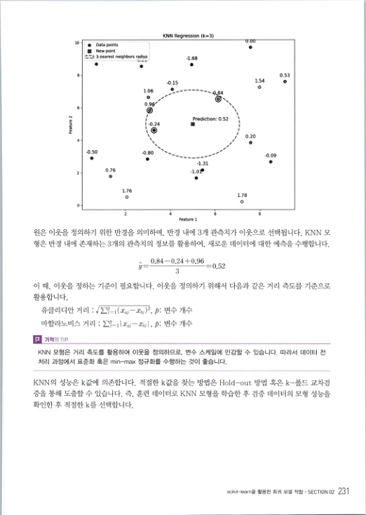
KNN Regression 盼=3) 00 。

● tata points 삿 New point ==I 3 nearest neighbors radius 0 .

쯩8 8 - 0.53 1.54 0 0 0.15 1.06 , _ --------- -.

군 - 0 0.gγ 넬 , , ` S S PredictIon: 0.52 , .

i ' I / / / 군 7 5

## ' 
' l -0.24 1큉 o S 히 따 ㄴ 8 凸 긴 20 I , -0.80 `,`.

팝0 뿡9 ，∼ →걋／ S → - - - - -1.31 76 。

1.0?

.

2

### 닝‘
닙8 0- 4 「뇬ature 1 6 원은 이웃을 정의하기 위한 반경을 의미하며 , 반경 내에 3개 관측치가 이웃으로 선택됩니다 . KNN 모 형은 반경 내에 존재하는 3개의 관측치의 정보를 활용하여 , 새로운 데이터에 대한 예측을 수행합니다． .

0.84_0.24+0.96  =0.52 츠／= 5궉 이 때 , 이웃을 정하는 기준이 필요합니다 . 이웃을 정의하기 위해서 다음과 같은 거리 측도를 기준으로 활용합니다． 유클리디안 거리 J퍄= i ( Xaj- XbJ)2, 夕： 변수 개수 마할라노비스 거리 : 퍄＝ rlIXaj-X히 , 夕： 변수 개수 기적의 ㄲp KNN 모형은 거리 측도를 활용하여 이웃을 정의하므로 , 변수 스케일에 민감할 수 있습니다 . 따라서 데이터 전 처리 과정에서 표준화 혹은 mmn-max 정규화를 수행하는 것이 좋습니다． KNN의 성능은 k값에 의존합니다 . 적절한 k값을 찾는 방법은 Hold-out 방법 혹은 k－폴드 교차검 증을 통해 도출할수 있습니다 . 즉 , 훈련 데이터로 KNN 모형을 학습한 후 검증 데이터의 모형 성능을 확인한 후 적절한 k를 선택합니다． scikit-learn을 활용한 회귀 모델 적합 . SECTION 02 231

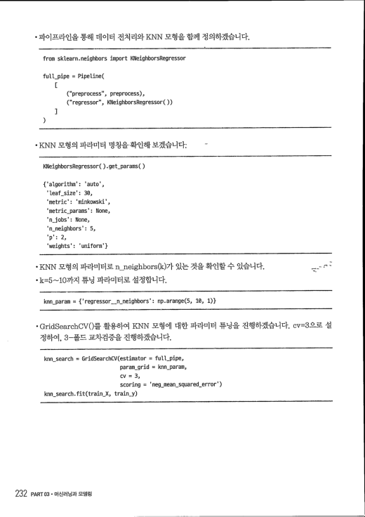
- 파이프라인을 통해 데이터 전처리와 KNN 모형을 함께 정의하겠습니다．
```python
from sklearn.neighbors import KNeighborsRegressor
full_pipe = Pipeline(
```
("preprocess", preprocess), ("regressor", KNeighborsRegressor()) :i

- KNN 모형의 파라미터 명칭을．확인해： 보겠습나다，.
kNeighborsRegressor( ) .get_params() {'algorithm': 'auto', 'leaf_size': 30, 'metric' : 'minkowski', 'metric_params' : None, 'n_jobs': None, 'n_neighbors' : 5, 'p' : 2, 'weights': 'uniform'}

- KNN 모형의 파라미터로 n_neighbors(k）가 있는 것을 확인할 수 있습니다．
- 
Pt

- －」 .`
하솔

- k=5-'-'10까지 튜닝 파라미터로 설정합니다．
knn_param 볍 {'regressor__n_neighbors': np.arange(5, 10, 1)}

- GridSearchCV(）를 활용하여 KNN 모형에 대한 파라미터 튜닝을 진행하겠습니다 . cv=3으로 설
정하여 , 3－폴드교차검증을진행하겠습니다．

```python
knn_search = GridSearchCV(estimator = full_pipe,
param_grid = knn_param,
cv = 3, 
scoring = 'neg_mean_squared_error')
```
knn_search.fit (train_X, train_y) 232 PART 03· 머신러닝과모델링

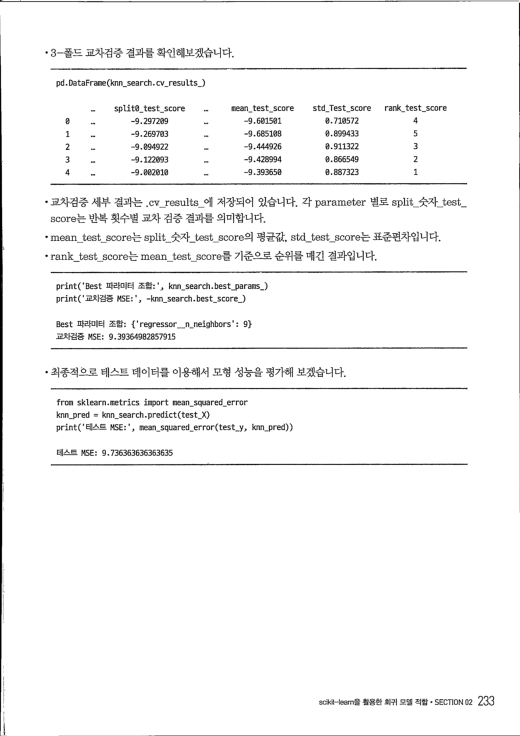
.3－폴드 교차검증 결과를 확인해보겠습니다． pd.DataFrame(knn_search. cv_resuUs_) split0_test_score mean_test_score std_Test_score rank_test_score 0 -9.297209 -9.601501 0.710572 4 1 -9.269703 -9.685108 0.899433 5 2 -9.094922 ...

-9.444926 0.911322 3 3 -9.122093 -9.428994 0.866549 2 4 -9.002010 " .

-9.393650 0.887323 1

- 교차검증 세부 결과는 . cv_results_쎄 저장되어 있습니다 . 각 parameter 별로 split－숫자ㄴtest-
score는 반복 횟수별 교차 검증 결과를 의미합니다．

- mean_test_score는 split－슷자－test score의 평균값 , std_test_score는 표준편차입니다．
- rank_test_score는 mean_test_score를 기준으로 순위를 매긴 결과입니다．
```python
print('Best 파라미터 조합： ' , knn_search . best_paranis...) 
print(' 교 검증 MSE:', -knn_search.best_score_)
```
Best 파라미터 조합： {' regressor__n_neighbors': 9} 교차검증 "SE: 9.39364982857915

- 최종적으로 테스트 데이터를 이용해서 모형 성능을 평가해 보겠습니다．
```python
from sklearn.metrics import mean_squared_error
knn_pred = knn_search .predict(test_X) 
print(' 테스트 MSE: ', mean_squared_error(test_y, knn_pred))
```
테스트 MSE: 9.736363636363635 scikit-tearn을활용한회귀모델적합．SECTION 02 233

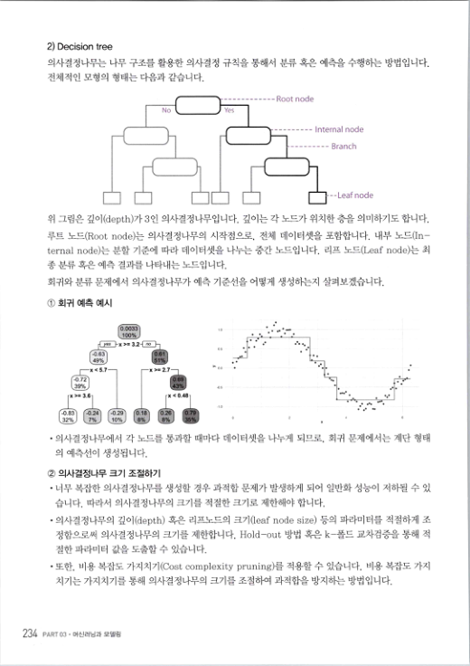
2) Decision tree 의사결정나무는 나무 구조를 활용한 의사결정 규칙을 통해서 분류 혹은 예측을 수행하는 방법입니다． 전쳬적인 모형의 형태는 다음과 같습니다．

# N。 (
Root node

# 눼 
)- { , Internal node Branch

# } 
nfl

# 占
--Leaf node 위 그림은 깊이（depth）가 3인 의사결정나무입니다 . 깊이는 각 노드가 위치한 층을 의미하기도 합니다． 루트 노드（Root node）는 의사결小무의 시작점으로 , 전쳬 데이터셋을 포함합니다 . 내부 노드（In- ternal node）는 분할 기준에 따라 데이터셋을 나누는 중간 노드입니다 . 리프 노드（Leaf node）는 최 종 분류 혹은 예측 결과를 나타내는 노드입니다． 회귀와 분류 문제에서 의사결정나무가 예측 기준선을 어떻게 생성하는지 살펴보겠습니다． ① 회귀 예측 예시 '. ."- .'.

.

".

'.,

- ·
.·· .

낟 ， -l 尨 … … .

`

- 의사결정나무에서 각 노드를 통과할 때마다 데이터셋을 나누게 되므로 , 회귀 문제에서는 계단 형태
의 예측선이 생성됩니다． ② 의사결정나무 크기 조절하기

- 너무 복잡한 의사결정나무를 생성할 경우 과적합 문제가 발생하게 되어 일반화 성능이 저하될 수 있
습니다 . 따라서 의사결정나무의 크기를 적절한 크기로 제한해야 합니다．

- 의사결정나무의 깊이（depth) 혹은 리프노드의 크기（leaf node size) 등의 파라미터를 적절하게 조
정함으로쩌 의사결정나무의 크기를 제한합니다 . Hold-out 방법 혹은 k－폴드 교차검증을 통해 적 절한 파라미터 값을 도출할 수 있습니다．

- 또한 , 비용 복잡도 가지치기（Cost complexity pruning）를 적용할 수 있습니다 . 비용 복잡도 가지
치기는 가지치기를 통해 의사결정나무의 크기를 조절하여 과적합을 방지하는 방법입니다． 234 PART 03．머신러닝과모델링

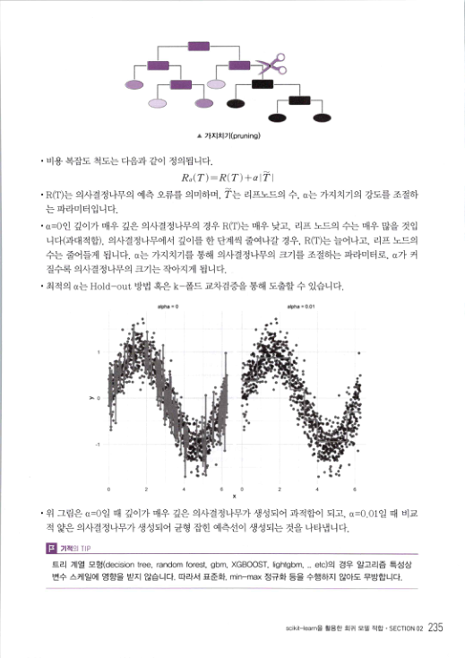
▲ 가지치기（pruning)

- 비용 복잡도 척도는 다음과 같이 정의됩니다．
Ra(T) =／근(TH ‘기 뙤

- R(T）는 의사결정나무의 예측 오류를 의미하며 , T는 리ㅍ누ㄷ의 수 , α는 가지치기의 강도를 조절하 
는 파라미터 입니다．

- α＝0인 깊이가 매우 깊은 의사결정나무의 경우 R(T）는 매우 낮고 , 리프 노드의 수는 매우 많을 것입
니다（과대적합） . 의사결정나무에서 깊이를한단계씩 줄여나갈 경우 , R(T）는늘어나고 , 리프노드의 수는 줄어들게 됩니다 . α는 가지치기를 통해 의사결정나무의 크기를 조절하는 파라미터로 , α가 커 질수록 의사결정나무의 크기는 작아지게 됩니다．

- 최적의 α는 Hold-out 방법 혹은 k－폴드 교차검증을
통해 도출할 수 있습니다．

- 짇
1 o

>.
2 8 0 x 2 6 4

- 위 그림은 α=0일 때 깊이가 매우 깊은 의사결정나무가 생성되어 과적합이 되고 , a=0,01일 때 비교
적 얇은 의사결정나무가 생성되어 균형 잡힌 예측선이 생성되는 것을 나타냅니다． .

기적의 뀌P 트리 계열 모형（decision tree, random forest, gbm. XGBOOST, Ii삶igbm, .. etc）의 경우 알고리즘 특성상 변수 스케일에 영향을 받지 않습니다 . 따라서 표준화 , mmn-max 정규화 등을 수행하지 않아도 무방합니다． scikit-learn을활용한회귀모델적합．SECTION 02 235

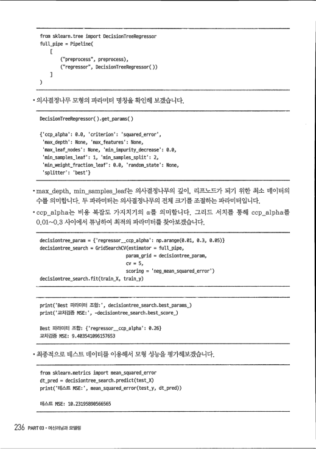
```python
from sklearn.tree import DecisionTreeRegressor 
full_pipe = Pipeline( 
[ 
("preprocess", preprocess), 
("regressor", DecisionlreeRegressorO) 
I
```
- 의사결정나무 모형의 파라미터 명칭을 확인해 보겠습니다．
DecisionTreeRegressor( ) .get_params() {'ccp_alpha': 0.0, 'criterion': 'squared_error', ' max_depth' : None, 'max_features': None, ' max_1.eaf_nodes': None, 'mmn_impurity_decrease': 0.0, 'mmn_samples_leaf ': 1, 'mmn_samples_spilt': 2, 'min_weight_fraction_l.eaf' : 0.0, 'random_state': None, 'splitter': 'best'}

- max_depth, mml_samples_leaf는 의사결정나무의 갚이 , 리ㅍ11ㄷ가 되기 위한 최소 데이터의
수를 의미합니다 . 두 파라미터는 의사결정나무의 전쳬 크기를 조절하는 파라미터 입니다．

- ccp_alpha는 비용 복잡도 가지치기의 α를 의미합니다 . 그리드 서치를 통해 ccp_alpha를
O.01'-'O.3 사이에서 튜닝하여 최적의 파라미터를 찾아보겠습니다．

```python
decisiontree_param = {'regressor__ccp_al.pha': np.arange(0.01, 0.3, 0.05)} 
decisiontree_search = GridSearchCV(estimator = full_pipe,
param_grid = decisiontree_param, 
cv = 5, 
scoring = 'neg_mean_squared_error') 
decisiontree_search. fit (train_X, train_y)
print('Best 파라미터 조합： ', decisiontree_search.best_params_)
```
prmnt(' 교E검증 MSE: ', -decisiontree_search.best_score_) Best 파라미터 조합＝ {'regressor__ccp_alpha': 0.26} 교차검증 MSE: 9.403541096157653

- 최종적으로 데스트 데이터를 이용해서 모형 성능을 평가해보겠습니다．
```python
from sklearn.metrics import mean_squared_error 
dt_pred = decisiontree_search . predict(test_X)
```
prmnt(' 테스트 MSE: ', mean_squared_error(test_y, dt_pred)) 테스트 "SE: 10.23195090566565 236 PART 03．머신러닝과모델링

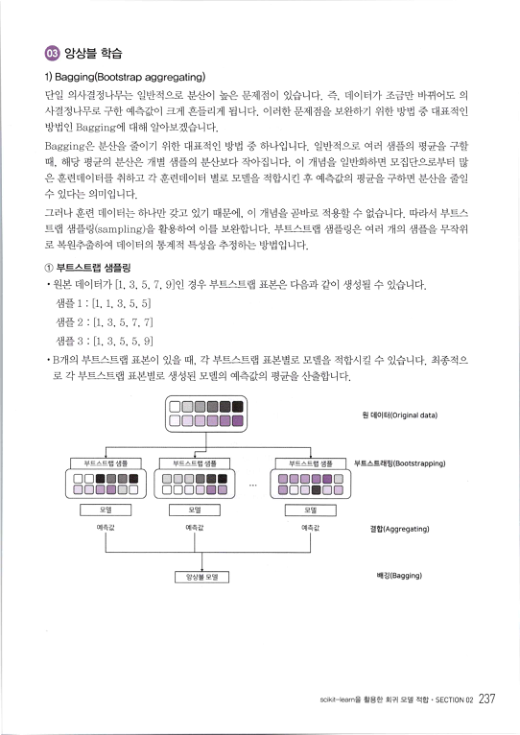
앙상블 학습 1) Bagging(Bootstrap aggregating) 단일 의사결정나무는 일반적으로 분산이 높은 문제점이 있습니다 . 즉 , 데이터가 조금만 바뀌어도 의 사결정나무로 구한 예측값이 크게 흔들리게 됩니다 . 이러한 문제점을 보완하기 위한 방법 중 대표적인 방법인 Bagging에 대해 알아보겠습니다． Bagging은 분산을 줄이기 위한 대표적인 방법 중 하나입니다 . 일반적으로 여러 샘플의 평균을 구할 때 , 해당 평균의 분산은 개별 샘플의 분산보다 작아집니다 . 이 개념을 일반화하면 모집단으로부터 많 은 훈련데이터를 취하고 각 훈련데이터 별로 모델을 적합시킨 후 예측값의 평균을 구하면 분산을 줄일 수 있다는 의미입니다． 그러나 훈련 데이터는 하나만 갖고 있기 때문에 , 이 개념을 곧바로 적용할 수 없습니다 . 따라서 부트스 트랩 샘플링（sampling）을 활용하여 이를 보완합니다 . 부ㅌㅅㅌ랩 샘플링은 여러 개의 샘플을 무작위 로 복원추출하여 데이터의 통계적 특정을 추정하는 방법입니다 .

① 부트스트랩 샘플링

- 원본 데이터가 〔1, 3, 5, 7, 9］인 경우부ㅌㅅㅌ랩 표본은 다음과 같이 생성될 수 있습니다．
샘플 1 : [1, 1, 3, 5, 5] 샘플2 : [1, 3, 5, 7. 7] 샘플3 : [1, 3, 5, 5, 9]

# · B개의 부ㅌㅅㅌ랩 표본이 있을 때 , 각부ㅌㅅㅌ랩 표본별로 모델을 적합시킬 수 있습니다 . 최종적으 
로 각 부ㅌㅅㅌ랩 표본별로 생상된 모델의 예측값의 평균을 산출합니다． rniu■u Llm■■s 원 데이터（Original data)

# l
부트스트랩 샘플 L1LJ□〔〕·LI1 rn isrn 7/

# - 
1- 부트스트랩 샘플 부트스트랩 샘폴 L1□S. U■ LJLIJLJUUU rnmrn □ rn□驪o 부트스트래핑（Bootstrapping) I 모델 모델 모델 예측값 결합（Aggregating) 배깅（Bagging) 앙상블 모델 scikit-learn을활용한회귀모델적합．SECTION 02 237

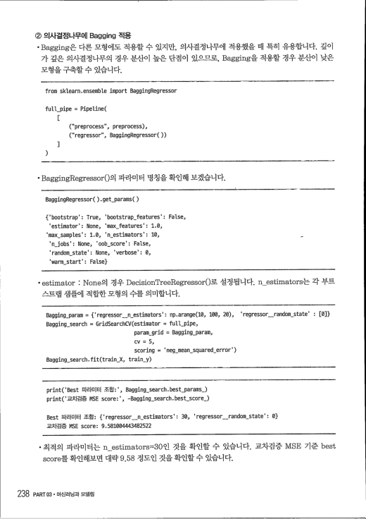
② 의사결정나무에 Bagging 적용

- Bagging은 다른 모형에도 적용할 수 있지만 , 의사결정나무에 적용했을 때 특히 유용합니다 . 깊이
가 깊은 의사결정나무의 경우 분산이 높은 단점이 있으므로 , Bagging을 적용할 경우 분산이 낮은 모형을 구축할 수 있습니다．

```python
from sklearn.ensembLe import BaggingRegressor
```
full_pipe = Pipeline( [ ("preprocess ', preprocess), ("regressor", BaggingRegressorO) 〕

- BaggingRegressor(）의 파라미터 명칭을 확인해 보겠습니다．
BaggingRegressor( ).get_params() {'bootstrap': True, 'bootstrap_features' : False, 'estimator': None, 'max_features': 1.0, 'max_samples': 1.0, 'n_estimators' : 10, 'n_jobs' : None, 'cob_score' : False, 'random_state' : None, 'verbose' : 0, 'warm_start': False}

- estimator : None의 경우 DecisionTreeRegressor(）로 설정됩니다 . n_estimators는 각 부트
스트랩 샘플에 적합한 모형의 수를 의미합니다．

```python
Bagging_param = {'regressor__n_estiniators': np.arange(10, 100, 20), 
'regressor__random_state' : [0]}
```
Bagging_search 별 GridSearchCV(estimator = full_pipe,

```python
param_grid = Bagging_param,
cv = 5, 
scoring = 'neg_mean_squared_error')
```
Bagging_search. fit (train_X, train_y)

```python
print('Best 파라미터 조합＝ ', Bagging_search. best_params_) 
print(' 교차검증 MSE score:', -Bagging_search.best_score_)
```
Best UF라DIEI 조 J: { ' regressor__n_estimators' : 30, 'regressor__random_state': 0} 교차검증 "SE score: 9.581004443482522

- 최적의 파라미터는 n_estimators=30인 것을 확인할 수 있습니다 . 교차검증 MSE 기준 best
score를 확인해보면 대략 9.58 정도인 것을 확인할 수 있습니다． 238 PART03· 머신러닝과모델링

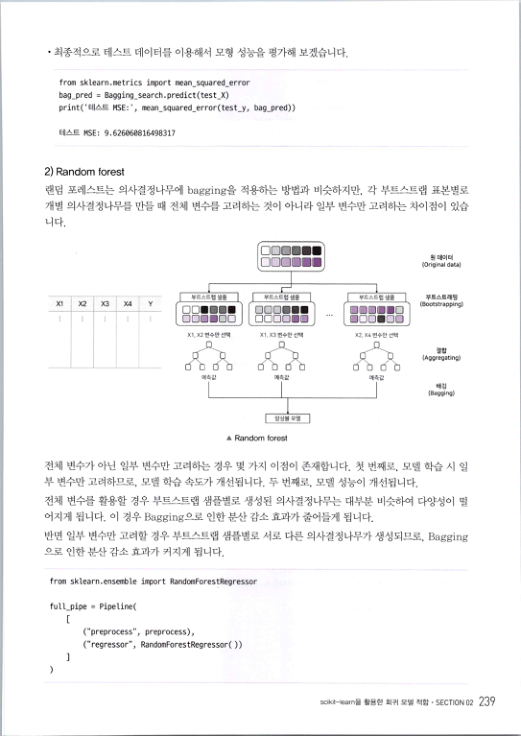
- 최종적으로 테스트 데이터를 이용해서 모형 성능을 평가해 보겠습니다．
```python
from sklearn.metrics import mean_squared_error
bag_pred = Bagging_search. predict(test_X) 
print(' 테스트 MSE: ', mean_squared_error(test_y, bag_pred))
```
테스트 "SE: 9.626060816498317 2) Random forest 랜덤 포레스트는 의사결정나무에 bagging을 적용하는 방법과 비슷하지만 , 각 부ㅌㅅㅌ랩 표본별로 개별 의사결정나무를 만들 때 전체 변수를 고려하는 것이 아니라 일부 변수만 고려하는 차이점이 있습 니다．

### 원 뎨이터 
(Original data) mu LILIJ·U `,

## l
工 부트스트래핑 (Bootstrapping) 부트스드랩 샘푤 부트스트랩 샘푤 ·l囑Ll· G IDDNOLJ irnu· a rnrn뒈■i

## 부트스트랩 샘풀
rnu.".

uo■srn xl X2 X3 Y X1 'X2 변수안 선택 X2. X4변 ，만선택 결합 (Aggregating) 예축값 예축값 배깅 (Bagging) 앙상불 모엘 A Random forest 전쳬 변수가 아닌 일부 변수만 고려하는 경우 몇 가지 이점이 존재합니다 . 첫 번째로 , 모델 학습 시 일 부 변수만 고려하므로 , 모델 학습 속도가 개선됩니다 . 두 번째로 , 모델 성능이 개선됩니다． 전쳬 변수를 활용할 경우 부ㅌㅅㅌ랩 샘플별로 생성된 의사결정나무는 대부분 비슷하여 다양성이 떨 어지게 됩니다 . 이 경우 Bagging으로 인한 분산 감소 효과가 줄어들게 됩니다． 반면 일부 변수만 고려할 경우 부ㅌㅅㅌ랩 샘플별로 서로 다른 의사결정나무가 생성되므로 , Bagging 으로 인한 분산 감소 효과가 커지게 됩니다．

```python
from sktearn.ensembte import RandomForestRegressor
```
full_pipe = Pipeline( [ ("preprocess', preprocess), ("regressor ", RandoniForestRegressor( )) scikit-learn을활용한회귀모델적합· SECTION 02 239

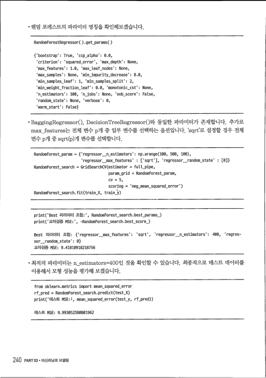
- 랜덤 포레스트의 파라미터 명칭을 확인해보겠습니다．
RandomForestRegressor( ) .get_params.() {'bootstrap': True, 'ccp_alpha' : 0.0, ' 』 criterion': 'squared_error', 'max_depth': None, ' max_features': 1.0, 'maxjeaf_nodes': None, 'max_samples' : None, 'mmn_impurity_decrease': 0.0, ' mmn_samples_leaf ' : 1, 'mmn_samples_split' : 2, 'mmn_weight_fraction_leaf': 0.0, 'monotonic_cst': None, 'n_estimators': 100, 'n-jobs': None, 'oob_score': False, 'random_state': None, 'verbose': 0, 'warm_start' : Fa1.se}

- BaggingRegressorO, DecisionTreeRegressor(）와 동일한 파라미터가 존재합니다 . 추가로
max features는 전쳬 변수 p개 중 일부 변수를 선택하는 옵션입니다 . 'sqrt'로 설정할 경우 전쳬 변수 p개 중 sqrt(p）개 변수를 선택합니다．

```python
RandomForest_param = {'regressor__n_estimators': np.arange(100, 500, 100), 
'regressor__max_features' : ['sqrt'] , 'regressor__random_state' : [0]}
RandomForest_search = GridSearchCV(estimator = full_pipe,
param_grid = RandomForest_pararn,
cv = 5, 
scoring = 'neg_rnean_squared_error ' )
```
RandomForest_search. fit (train_X, train_y)

```python
print('Best 파라미터 조합＝ ', RandomForest_search.best_params_) 
print(' 교차검증 MSE:', -RandomForest_search.best_score_)
```
Best 파EFOIEI 조합: {'regressor__max_features': 'sqrt', 'regressor__n_estimators': 400, 'regres- sor__random_state': 0} 교차검증 'ISE: 9.41810918218756

- 최적의 파라미터는 n-estimators=400인 것을 확인할 수 있습니다 . 최종적으로 테스트 데이터를
이용해서 모형 성능을 평가해 보겠습니다．

```python
from sklearn.metrics import mean_squared_error 
rf_pred = RandomForest_search.predict(test_X) 
print(' 테스트 MSE: , mean_squared_error(test_y, rf_pred))
```
테스트 "SE: 9.993052580801962 240 PART 03.머신러닝과모델링

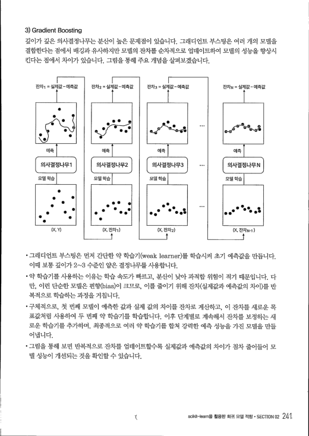
3) Gradient Boosting 깊이가 깊은 의사결정나무는 분산이 높은 문제점이 있습니다 . 그래디언트 부스팅은 여러 개의 모델을 결합한다는 점에서 배깅과 유사하지만 모델의 잔차를 순차적으로 입데이트하여 모델의 성능을 향상시 킨다는 점에서 차이가 있습니다 . 그림을 통해 주요 개념을 살펴보겠습니다．

# r 
잔차3 = 실제값－예측값 t

# - 
잔차1 = 실제값－ 예측값 t

# - 
잔차2 = 실제값－ 예측값 t

# 잔차N . 실제값－ 예측값 
I 송 예측 예측 예측 예측 의사결정나무'1 의사결정나무2 의사결정나무3 모델학습 모델학습 모델학습 S CX . 잔차1) 수

### CX , 잔차2) 
t （× . 잔차N-i ) t

- 그래디언트 부스팅은 먼저 간단한 약 학습기（weak learner）를 학습시켜 초기 예측값을 만듭니다． 
이때 보통 깊이가 2'-'3 수준인 얕은 결정나무를 사용합니다．

- 약 학습기를 사용하는 이유는 학습 속도가 빠르고 , 분산이 낮아 과적합 위험이 적기 때문입니다 . 다 
만 , 이런 단순한 모델은 펀향（bias）이 크므로 , 이를 줄이기 위해 잔차（실제값과 예측값의 차이）를 반 복적으로 학습하는 과정을 거칩니다． '구쳬적으로 , 첫 번째 모델이 예측한 값과 실제 값의 차이를 잔차로 계산하고 , 이 잔차를 섀로운 목 표값처럼 사용하여 두 번째 약 학습기를 학습합니다 . 이후 단계별로 계속해서 잔차를 보정하는 새 로운 학습기를 추가하며 , 최종적으로 아러 약 학습기를 합쳐 강력한 예측 성능을 가진 모델을 만들 어냅니다 .

'그림을 통해 보면 반복적으로 잔차를 업데이트할수록 실제값과 예측값의 차이가 점차 줄어들어 모 델 성능이 개선되는 것을 확인할 수 있습니다． scikit-learn을활용한회귀모델적합· SECTION 02 24T.

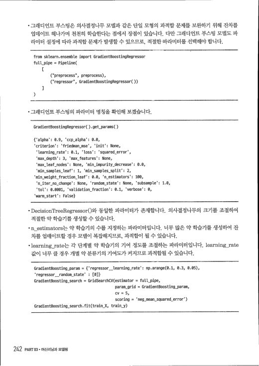
- 그래디언트 부스팅은 의사결정나무 모델과 같은 단일 모형의 과적합 문제를 보완하기 위해 잔차를
업데이트 해나가며 천천히 학습한다는 점에서 장점이 있습니다 . 다만 그래디언트 부스팅 모델도 파 라미터 설정에 따라과적합문제가 발생할수 있으므로 , 적절한，파라미터를 선택해야합니다．

```python
from sklearn. ensemble import GradientBoostingRegressor 
ful.l_pipe = Pipeline( 
[ 
("preprocess', preprocess), 
("regressor", GradientBoostingRegressorO)
```
II

- 그래디 언트 부스팅의 파라미터 명칭을 확인해 보겠습니다．
GradientBoostingRegressor( ) .get_params() {'alpha': 8.9, 'ccp_alpha': 0.0, 'criterion': 'friedman.-mse', 'mnit': None, 'l.earning_rate' : 0.1, 'loss' : 'squared_error', 'max_depth': 3, 'max_features': None, 'max_leaf_nodes' : None, 'mmn_impurity_decrease': 0.0, win_samples_leaf ' : 1, 'min_sampl.es_split': 2, 'win_weight_fraction_leaf ' : 0.0, 'n_estimators': 100, 'n_iter_no_change' : None, 'random_state': None, 'subsample': 1.0, 'tol' : 0.8001, 'validation_fraction' : 0.1, 'verbose': 0, 'warm_start' : False}

- DecisionTreeRegressor(）와 동일한 파라미터가 존재합니다 . 의사결정나무의 크기를 조절하여
적절한 약 학습기를 생성할 수 있습니다．

- nestimators는 약 학습기의 수를 지정하는 파라미터입니다 . 너무 많은 약 학습기를 생성하여 잔
차를 업데이트할 경우 모델이 복잡해지므로 , 과적합이 될 수 있습니다．

- learning_rate는 각 단계별 약 학습기의 기여 정도를 조절하는 파라미터입니다 . learning_rate
값이 너무 클 경우 개별 약 분류기의 기여도가 커지므로 과적합될 수 있습니다 .

```python
GradientBoosting_pararn = {'regressor__learning_rate': np,arange(0.1, 0.3, 0.05),
```
'regressor__random_state' : [0]}

```python
GradientBoosting_search = GridSearchCV(estimator = full_pipe,
param_grid = GradientBoosting_param,
cv = 5, 
scoring = 'neg_mean_squared_error')
```
GradientBoosting_search. fit (train_X, train_y) 242 PART 03．머신러닝과모델링

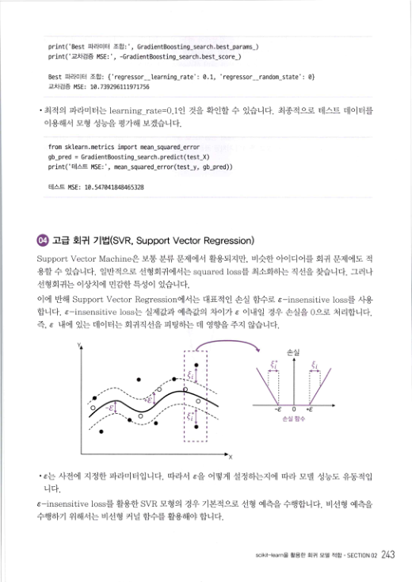
```python
print(' Best 파라미터 조합： ' , GradientBoosting_search.best_params_) 
print(' 교차검증 MSE: , -GradientBoosting_search.best_score_)
```
Best 파aFOI터 조합： { 'regressor__learning_rate ' : 0.1, ' regressor__random_state' : 0} 교차검증 "SE: 10.739296111971756

- 최적의 파라미터는 learning_rate=0. 1인 것을 확인할 수 있습니다 . 최종적으로 테스트 데이터를
이용해서 모형 성능을 평가해 보겠습니다．

```python
from sklearn.metrics import mean_squared_error
gb_pred = GradientBoosting_search . predict (test_X) 
print(' 테스트 MSE: ', mean_squared_error(test_y, gb_pred))
```
테스트 MSE: 10.547041848465328 .

고급 회귀 기법（SVR, Support Vector Regression) Support Vector Machine은 보통 분류 문제에서 활용되지만 , 비슷한 아이디어를 회귀 문졔에도 적 용할 수 있습니다 . 일반적으로 선형회귀에서는 squared loss를 최소화하는 직선을 찾습니다 . 그러나 선형회귀는 이상치에 민감한 특정이 있습니다． 이에 반해 Support Vector Regression에서는 대표적인 손실 함수로 e-insensitive loss를 사용 합니다 . e-insensitive loss는 실제값과 예측값의 차이가 E 이내일 경우 손실을 0으로 처리합니다． 즉 , c 내에 있는 데이터는 회귀직선을 피팅하는 데 영향을 주지 않습니다 .

## . --zr군
●

### 요
0

# · 군 
` , .

겯긱 " ' 큅"; " ,, ' U 수 0 함 ￡ ￡ 실 손 .E는 사전에 지정한 파라미터입니다 . 따라서 c을 어떻게 설정하는지에 따라 모델 성능도 유동적입 니다． E-insensitive loss를 활용한 SVR 모형의 경우 기본적으로 선형 예측을 수행합니다 . 비선형 예측을 수행하기 위해서는 비선형 커널 함수를 활용해야 합니다． scikit-learn을 활용한 회귀 모델 적합 . SECTION 02 243

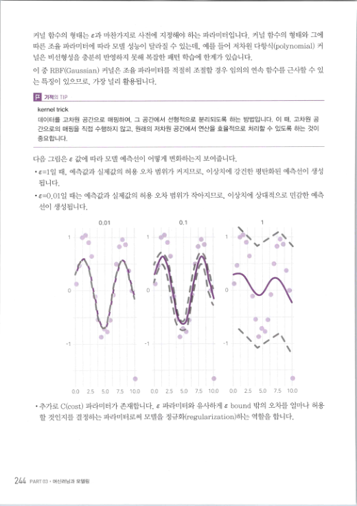
커널 함수의 형태는 ‘과 마찬가지로 사전에 지정해야 하는 파라미터입니다 . 커널 함수의 형태와 그에 따른 조율 파라미터에 따라 모델 성능이 달라질 수 있는데 , 예를 들어 저차원 다항식（polynomial) 커 널은 비선형성을 충분히 반영하지 못해 복잡한 패턴 학습에 한계가 있습니다． 이 중 RBF(Gaussia① 커널은 조율 파라미터를 적절히 조절할 경우 임의의 연속 함수를 근사할 수 있 는 특징이 있으므로 , 가장 널리 활용됩니다． .

기적의 지P kernel trick 데이터를 고차원 공간으로 매핑하여 , 그 공간에서 선형적으로 분리되도록 하는 방법입니다 . 이 때 , 고차원 공 간으로의 매핑을 직접 수행하지 않고 , 원래의 저차원 공간에서 연산을 효율적으로 처리할 수 있도록 하는 것이 중요합니다 .

다음 그림은 c 값에 따라 모델 예측선이 어떻게 변화하는지 보여줍니다．

- ㅌ＝1일 때 , 예측값과 실제값의 허용 오차 범위가 커지므로 , 이상치에 강건한 평탄화된 예측선이 생성
됩니다．

- E=0.01일 때는 예측값과 실제값의 허용 오차 범위가 작아지므로 , 이상치에 상대적으로 민감한 예측
선이 생성됩니다． 0.01 0.1 1 1 ' \

# 入／\
0 1 00 25 50 75 10.0 00 25 50 75 1 .0 00 25 50 75 1 .0

- 추가로 C (cost) 파라미터가 존재합니다 . ㅌ 파라미터와 유사하게 ' bound 밖의 오차를 얼마나 허용
할 것인지를 결정하는 파라미터로써 모델을 棚구화〈regularization）하는 역할을 합니다． 244 PART03 튕 머신러닝과 모델링

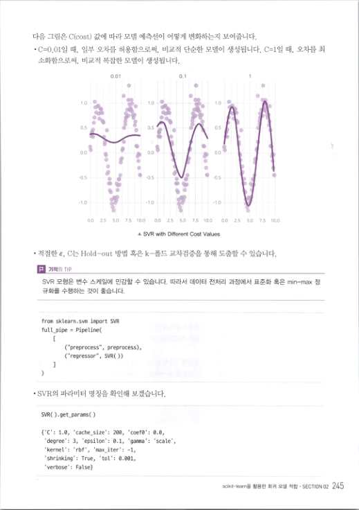
다음 그림은 C (cost) 값에 따라 모델 예측선이 어떻게 변화하는지 보여줍니다．

- C=O.01일 때 , 일부 오차를 허용함으로써 , 비교적 단순한 모델이 생성됩니다 . C=1일 때 , 오차를 최
소화함으로써 , 비교적 복잡한모델이 생성됩니다． 0.01 1 .0 0 튜 0.0 -0.5 -1.0 00 2.5 50 75 10.0 00 2 5 5.0 7 5 10.0 00 2 5 5.0 7 5 10.0 A SVR with Different Cost Values

- 적절한 e, C는 Hold-out 방법 혹은 k－폴드 교차검증을 통해 도출할 수 있습니다．
### r잽 기적의 지P
SVR 모형은 변수 스케일에 민감할 수 있습니다 . 따라서 데이터 전처리 과정에서 표준화 혹은 mmn-max 정 규화를 수행하는 것이 좋습니다．

```python
from skl.earn.svm import SVR 
full_pipe = Pipel.ine(
```
( 'preprocess ', preprocess), ("regressor", SVR( )) 〕 )

- SVR의 파라미터 명칭을 확인해 보겠습니다．
SVR( ) .get_params( ) {'C ' : 1.0, 'cache_size' : 200, 'coefO' : 0.0, 'degree' : 3, 'epsilon' : 0.1, 'gama ' : 'scale', 'kernel' : 'rbf ', 'max_iter ' : -1, 'shrinking' : True, ' tol ' : 0.001, 'verbose ' : False} scikit-learn을 활용한 회귀 모델 적합 · SECTION 02 245

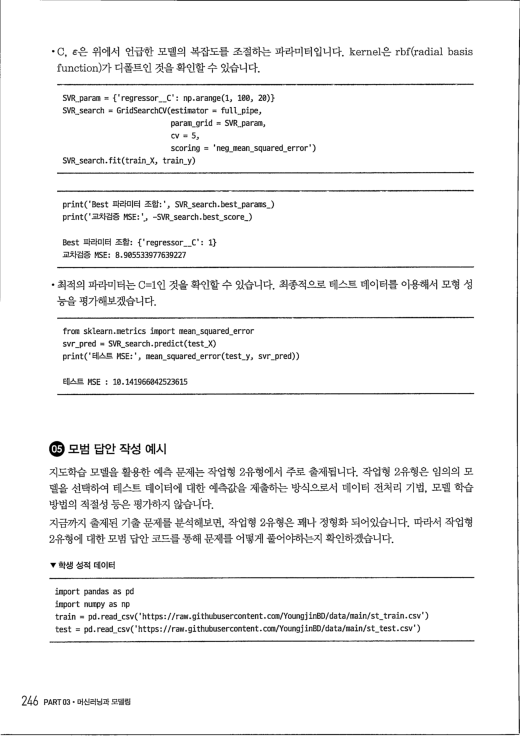
.c, 6은 위에서 언급한 모델의 복잡도를 조절하는 파라미터입니다 . kerne'은 rbf(radial basis function）가 디폴트인 것을 확인할 수 있습니다． SVR-param = { 'regressor__C' : np.arange(1, 100, 20)} SVR- search = GridSearchCV(estimator = full_pipe,

```python
param_grid = SVR_param, 
cv = 5, 
scoring = 'neg_mean_squared_error')
```
SVR_search . fit (train_X, train_y)

```python
print(' Best 파라미터 조합： " SVR_search.best_params_) 
print(' 교F검증 MSE:' ., -SVR_search.best_score_)
```
Best 파라미터 조합＝ {'regressor__C' : 1} 교차검증 "SE: 8.905533977639227

- 최적의 파라미터는 C=1인 것을 확인할 수 있습니다 . 최종적으로 테스트 데이터를 이용해서 모형 성
능을 평가해보겠습니다．

```python
from skLearn.metrics import mean_squared_error 
svr_pred = SVR_search . predict(test_X) 
print(' 테스트 MSE:', mean_squared_error(test_y, svr_pred))
```
테스트 "SE = 10.141966042523615 .

모범 답안 작성 예시 지도학습 모델을 활용한 예측 문제는 작업형 2유형에서 주로 출제됩니다 . 작업형 2유형은 임의의 모 델을 선택하여 테스트 데이터에 대한 예측값을 제출하는 방식으로서 데이터 전처리 기법 , 모델 학습 방법의 적절성 등은 평가하지 않습니다． 지금까지 출제된 기출 문제를 분석해보면 , 작업형 2유형은 꽤나 정형화 되어있습니다 . 따라서 작업형 2유형에 대한 모범 답안 코드를 통해 문제를 어떻게 풀어야하는지 확인하겠습니다． ▼ 학생 성적 데이터

```python
import pandas as pd 
import numpy as np 
train = pd.read_csv('https://raw.githubusercontent.com/YoungiinBD/data/main/st_train.csV') 
test = pd.read_csv('https://raw.githubusercontent.com/YoungjinBD/data/nlain/st_test.csv')
```
246 PART 03．머신러닝과모델링

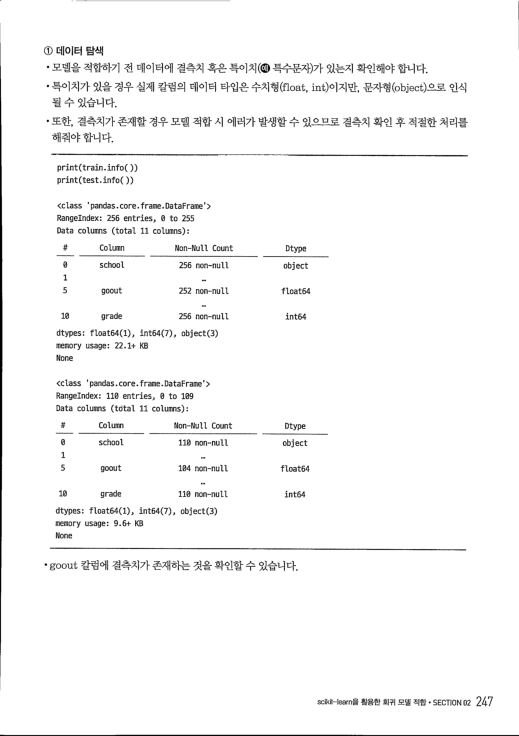
① 데이터 탐색

- 모델을 적합하기 전 데이터에 결측치 혹은 특이치（.l 특수문자）가 있는지 확인해야 합니다．
- 특이치가 있을 경우 실제 칼럼의 데이터 타입은 수치형（float, m끄t）이지만 , 문자형（object）으로 인식 
될 수 있습니다． ' 또한 , 결측치가 존재할 경우 모델 적합 시 에러가 발생할 수 있으므로 결측치 확인 후 적절한 처리를 해줘야합니다．

```python
print(train.infoO) 
print(test.infoO)
```
<class 'pandas. core. frame. DataFrame'> Rangelndex: 256 entries, 0 to 255 Data columns (total 11 columns):

# 
Column Non-Null Count Dtype 0 school 256 non-null object 1 5 goout 252 non-null f1oat64 10 grade 256 non-null 1nt64 dtypes: f10at64(1), 1nt64(7), object(3) memory usage: 22.1+ KB 「』이1e <class 'pandas. core. frame. DataFrame 5 Rangelndex: 110 entries, 0 to 109 Data columns (total 11 columns):

# 
Column Non-Null Count Dtype 0 school 110 non-null object 1 .

5 goout 104 non-null f1oat64 10 grade 110 non-null int64 dtypes: f1oat64(1), int64(7), object(3) memory usage: 9.6+ KB None

- goout 칼럼에 결측치가 존재하는 것을 확인할 수 있습니다．
scikit-learn을활용한회귀모델적합· SECTION 02 247

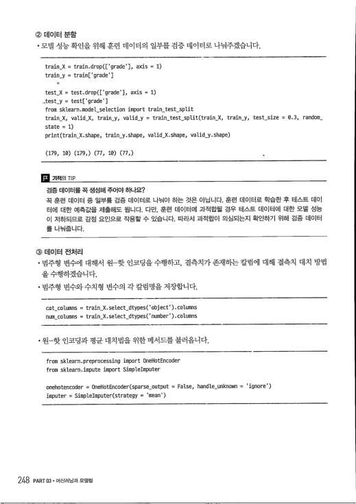
② 데이터 분할

- 모델 성능 확인을 위해 훈련 데이터의 일부를 검증 데이터로 나눠주겠습니다．
```python
train_X = train.drop([ 'grade '] , axis = 1) 
train_y = train[ 'grade ']
test_X = test.drop([ 'grade'] , axis = 1) 
4est_y = test[ 'grade'] 
from sklearn.model_selection import train_test_split 
train_X, valid_X, train_y, valid_y = train_test_spl.it (train_X, train_y, test_size = 0.3, random_
state = 1) 
print(train_X.shape, train_y.shape, valid_X.shape, valid_y.shape)
```
(179, 10) (179,) (77, 10) (77,) r헴 기적의 ㄲP 검증 데이터를 꼭 생성해 주어야 하나요？ 꼭 훈련 데이터 중 일부를 검증 데이터로 나눠야 하는 것은 아닙니다 . 훈련 데이터로 학습한 후 테스트 데이 터에 대한 예측값을 제출해도 됩니다 . 다만 , 훈련 데이터에 과적합될 경우 테스트 데이터에 대한 모델 성능 이 저하되므로 감점 요인으로 작용할 수 있습니다 , 따라서 과적합이 의심되는지 확인하기 위해 검증 데이터 를 나눠줍니다． ③ 데이터 전처리

- 범주형 변수에 대해서 원－핫 인코딩을 수행하고 , 결측치가 존재하는칼럼에 대해 결측치 대치 방법
을 수행하겠습니다．

- 범주형 변수와 수치형 변수의 각 칼럼명을 저장합니다．
```python
cat_columns = train_X.select_dtypes( 'object') .columns
num_columns = train_X. select_dtypes(' number ' ) .columns
```
- 원－핫 인코딩과 평균 대치법을 위한 메서드를 불러옵니다．
```python
from sklearn.preprocessing import OneHotEncoder
from sklearn.impute import Simplelmputer
onehotencoder = OneHotEncoder(sparse_output = False, handle_unknown = ' ignor&)
imputer = Simplelmputer(strategy = ' mean ')
```
248 PART 03 ‘머신러닝과모델링

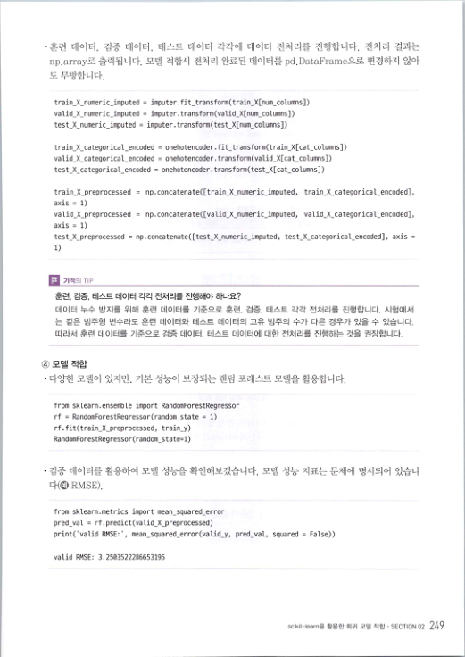
- 훈런 데이터 , 검증 데이터 , 테스트 데이터 각각에 데이터 전처리를 진행합니다 . 전처리 결과는
np. array로 출력됩니다 . 모델 적합시 전처리 완료된 데이터를 pd. DataFrame으로 변경하지 않아 도 무방합니다．

```python
train_X_numeric_imputed = imputer. fit_transform(train_X[num_columns]) 
valid_X_numeric_imputed = imputer. transform(valid_X[num_col.umns]) 
test_X_numeric_imputed = imputer. transform(test_X[num_cothmns])
train_X_categorical_encoded = onehotencoder. fit_transform(train_X[cat_columns]) 
valid_X_categorical_encoded = onehotencoder. transform(valid_X[cat_columns]) 
test_X_categorical_encoded = onehotencoder. transform(test_X[cat_columns])
train_X_preprocessed = np.concatenate([train_X_numeric_imputed, train_X_categorical_encoded], 
axis = 1) 
valid_X_preprocessed = np.concatenate([vaUd_X_numeric_imputed, valid_X_categorical_encoded], 
axis = 1) 
test_X_preprocessed = np.concatenate([test_X_numeric_imputed, test_X_categorical_encoded], axis = 
1)
```
기적의 지p 훈련 , 검증 , 테스트 데이터 각각 전처리를 진행해야 하나요？ 데이터 누수 방지를 위해 훈련 데이터를 기준으로 훈련 , 검증 , 테스트 각각 전처리를 진행합니다 . 시험에서 는 같은 범주형 변수라도 훈련 데이터와 테스트 데이터의 고유 범주의 수가 다른 경우가 있을 수 있습니다． 따라서 훈련 데이터를 기준으로 검증 데이터 , 테스트 데이터에 대한 전처리를 진행하는 것을 권장합니다． （乙 모델 적합

- 다양한 모델이 있지만 , 기본 성능이 보장되는 랜덤 포레스트 모델을 활용합니다．
```python
from skl.earn.ensembl.e import RandomForestRegressor 
rf = RandomForestRegressor(random_state = 1) 
rf. fit (train_X_preprocessed, train_y)
```
RandomForestRegressor(random_state=1)

- 검증 데이터를 활용하여 모델 성능을 확인해보겠습니다 . 모델 성능 지표는 문제에 명시되어 있습니 
다（.IRMSE).

```python
from sklearn.metrics import mean_squared_error
pred_val = rf. predict (valid_X_preprocessed) 
print('valid RMSE: ', mean_squared_error(valid_y, pred_va1, squared = False))
```
vaUd RMSE: 3.2503522286653195 scikit-learn을 활용한 회귀 모델 적합 * SECTION 02 249

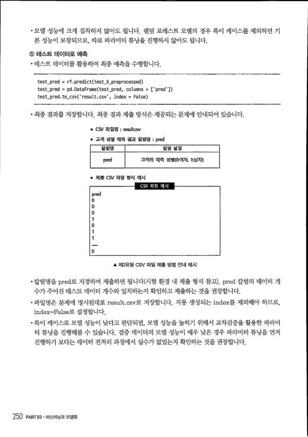
- 모델 성능에 크게 집착하지 않아도 됩니다 . 랜덤 포레스트 모델의 경우 특이 케이스를 제외하면 기 
본 성능이 보장되므로 , 따로 파라미터 튜닝을 진행하지 않아도 됩니다． ⑤ 테스트 데이터로 예측

- 테스트 데이터를 활용하여 최종 예측을 수행합니다．
```python
test_pred = rf.predict(test_X_preprocessed) 
test_pred = pd.DataFrame(test_pred, columns = ['pred'] ) 
test_pred.to_csv('result.csv', index = False)
```
- 최종 결과를 저장합니다 . 최종 결과 제출 방식은 제공되는 문제에 안내되어 있습니다．
. csv 파일영 : resultcsv

- 고객 성벌 《계즉 결과 긷렁명 = p1떱d
칼럼병 칼럼 설명 pl℃d 고객의 예측 상별（仕여자， 1：남자）

- 제줄 (:w 파일 형식 예시
csv 파일 예시 紀 D, o o o `, o 1 1 o ▲ 제2유형 csv 파일 제출 방법 안내 예시

- 칼럼명을 pred로 지정하여 제출하면 됩니다（시험 환경 내 제출 형식 참고） . pred 칼럼의 데이터 개
수가 주어진 테스트 데이터 개수와 일치하는지 확인하고 제출하는 것을 권장합니다．

```python
· 파일명은 문제에 명시된대로 result. csv로 저장합니다 . 자동 생성되는 index를 제외해야 하므로， 
index=Fa1se로 설정합니다．
```
- 특이 케이스로 모델 성능이 낮다고 판단되면 , 모델 성능을 높히기 위해서 교차검증을 활용한 파라미
터 튜닝을 진행해볼 수 있습니다 . 검증 데이터의 모델 성능이 매우 낮은 경우 파라미터 튜닝을 먼저 진행하기 보다는 데이터 전처리 과정에서 실수가 없었는지 확인하는 것을 권장합니다． 250 PART03· 머신러닝과모델링

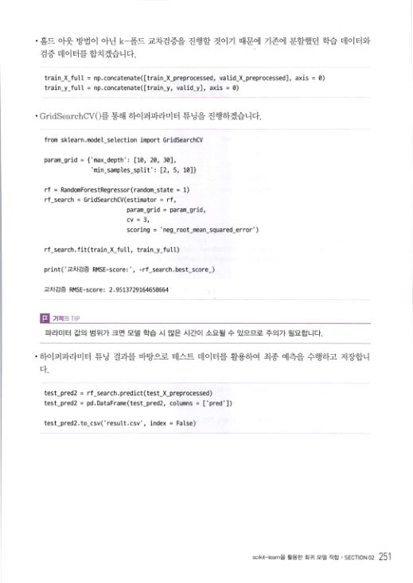
- 홀드 아웃 방법이 아닌 k－폴드 교차검증을 진행할 것이기 때문에 기존에 분할했던 학습 데이터와
검증 데이터를 합치겠습니다．

```python
train_X_fufl = np.concatenate([train_X_preprocessed, valid_X_preprocessed], axis = 0) 
train_y_full = np.concatenate([train_y, valid_y], axis = 0)
```
- GridSearchCV(）를 통해 하이퍼파라미터 튜닝을 진행하겠습니다．
```python
from sktearn.modet_selection import GridSearchCV
param_grid = {'max_depth' : [10, 20, 30], 
' mmn_
nsamples_split ' : [2, 5, 10]}
rf = RandomForestRegressor(random_state = 1) 
rf_search = GridSearchCV(estimator = rf,
param_grid = param_grid,
cv = 3, 
scoring = ' neg_root_mean_squared_error')
```
rf_search.fit (train_X_fuU, train_y_full)

```python
print(' 교차검증 RMSE-score: ', -rf_search.best_score_)
```
교차검증 「MSE-score: 2.9513729164658664 ．헴 기적의 지P 파라미터 값의 범위가 크면 모델 학습 시 많은 시간이 소요될 수 있으므로 주의가 필요합니다．

- 하이퍼파라미터 튜닝 결과를 바탕으로 테스트 데이터를 활용하여 최종 예측을 수행하고 저장합니
다．

```python
test_pred2 = rf_search . predict (test_X_preprocessed) 
test_pred2 = pd.DataFrame(test_pred2, columns = ['pred'] )
```
test_pred2.to_csv( 'result.csv', index = False) scikil-learn을 활용한 회귀 모델 적합 · SECTION02 251

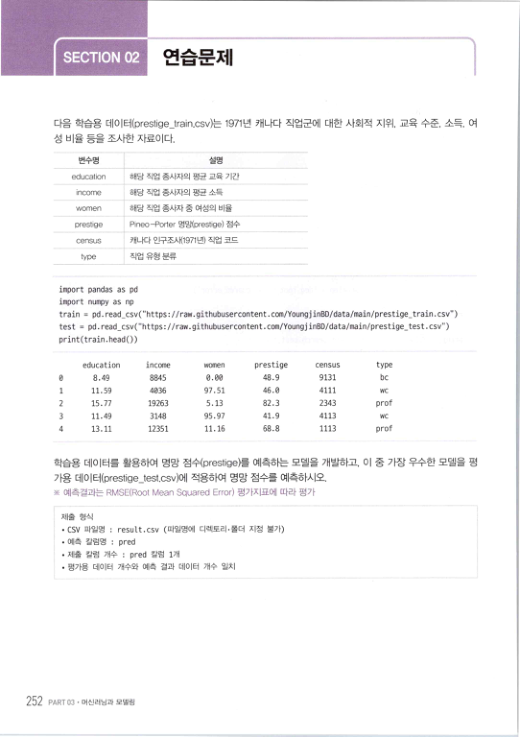
## SECTION 02 
연습문제 다음 학습용 데이터（pres꺄〕e_train.csv）는 19귀년 캐나다 직업군에 대한 사회적 지위 , 교육 수준 , 소득 , 여 성 비율 등을 조사한 자료이다． 변수명 설명 education 해당 직업 종사자의 평균 교육 기간 income 해당 직업 종사자의 평균 소득 women 해당 직업 종사자 중 여성의 비율 prestige Pineo -Porter 명망（prestige) 점수 census 캐나다 인구조사（1971 년） 직업 코드 type 직업 유형 분류

```python
import pandas as pd 
import numpy as np 
train = pd.read_csv("https://raw.githubusercontent.com/YoungjinBo/data/main/prestige_train.csv") 
test = pd.read_csv(https://raw.githubusercontent.com/YoungjinBD/data/main/prestige_test.csv") 
print(train .head())
```
education income women prestige census type 0 8.49 8845 0.00 48.9 9131 bc 1 11.59 4036 97.51 46.0 4111 wc 2 15.77 19263 5.13 82.3 2343 prof 3 11.49 3148 95.97 41.9 4113 wc 4 13.11 12351 11.16 68.8 1113 prof 학습용 데이터를 활용하여 명망 점수（prestige）를 예측하는 모델을 개발하고 , 이 중 가장 우수한 모델을 평 가용 데이터（prestige_test.csv）에 적용하여 명망 점수를 예측하시오． ※ 예측결과는 RMSE(Root Mean Squared Error) 평가지표에 따라 평가 제츨 형식

- csv 파일명 : result. csv （파일명에 디렉토리·폴더 지정 불가）
- 예측 칼럼명 : pred
- 제출 칼럼 개수 : pred 칼럼 1개
- 평가용 데이터 개수와 예측 결과 데이터 개수 일치
252 PART03．머신러닝과모델링

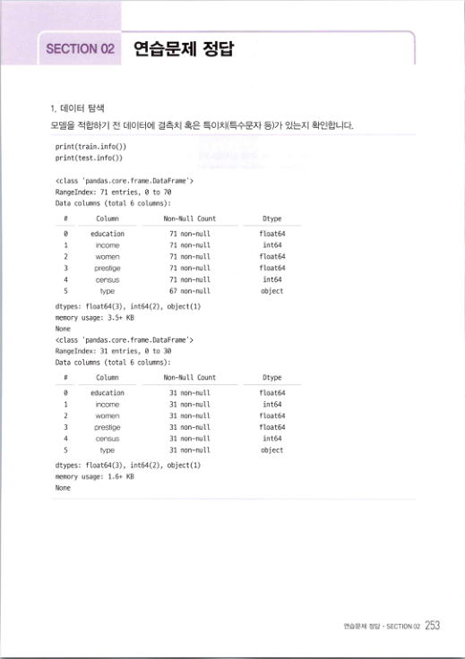
## SECTION 02 
연습문제 정답 1 . 데이터 탕색 모델을 적합하기 전 데이터에 결측치 혹은 특이치（특수문자 등）가 있는지 확인합니다．

```python
print(train.infoQ) 
print(test .infoQ)
```
<class 'pandas.core. frame.DataFrame' > Rangelndex: 71 entries, 0 to 70 Data columns (total 6 columns):

```python
# 
Column
```
Non-Null Count Dtype 0 education 1 income 71 non-null f1oat64 int64 71 non-null 2 women 71 non-null f1oat64 71 non-null f1oat64 int64 3 prestige 4 71 non-null census 5 type 67 non-null object dtypes: f10at64(3), int64(2), object(1) memory usage: 3.5+ KB None <class ' pandas.core.frame.DataFrame'> Rangelndex: 31 entries, 0 to 30 Data columns (total 6 columns):

```python
# 
Column
```
Non-Null Count Dtype 0 education 1 income 31 non-null f1oat64 int64 31 non-null 2 women 31 non-null f1oat64 non-null 31 f1oat64 int64 object 3 prestige non-null 4 31 census 31 non-null 5 type dtypes: f1oat64(3), int64(2), object(1) memory usage: 1.6+ KB None 연습문제 정답흩SECTION 02 253

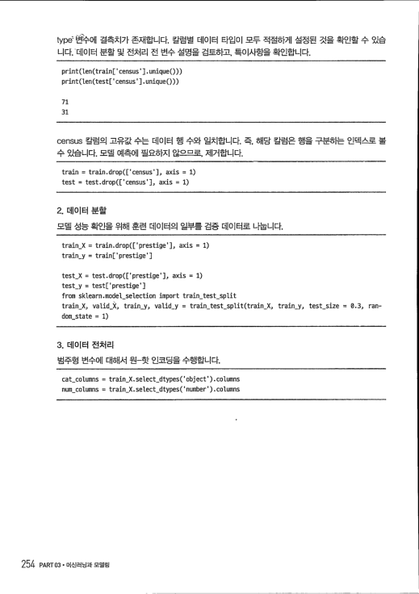
type ' 변주에 결측치가 존재합니다 . 칼럼별 데이터 타입이 모두 적절하게 설정된 것을 확인할 수 있습 니다 . " 데이터 분할 및 전처리 전 변수 설명을 검토하고 , 특이사항을 확인합니다．

```python
print(len(train[ 'census'] .uniqueQ)) 
print(len(test[' census '] .uniqueQ))
```
71 31 census 칼럼의 고유값 수는 데이터 행 수와 일치합니다 , 즉 , 해당 칼럼은 행을 구분하는 인덱스로 볼 수 있습니다 . 모델 예측에 필요하지 않OD쿠  , 제거합니다．

```python
train = train.drop([ 'census'] , axis = 1) 
test = test.drop([ 'census']. axis = 1)
```
2 . 데이터 분할 모델 성능 확인을 위해 훈련 데이터의 일부를 검증 데이터로 나눕니다．

```python
train-X = train.drop(['prestige'], axis = 1) 
train_y = train['prestige']
test_X = test.drop(['prestige'], axis = 1) 
test_y = test['prestige'] 
from sklearn. model._sel.ection import train_test_split 
train_X, valid-X, train_y, valid_y = train_test_split(train_X, train_y, test_size = 0.3, ran-
dom_state = 1)
```
3 . 데이터 전처리 범주형 변수에 대해서 원－핫 인코딩을 수행합니다．

```python
cat_columns = train_X.select_dtypes('object').columns
num_columns = train_X.select_dtypes('number').cotumns
```
254 PART 03．머신러닝과모델링

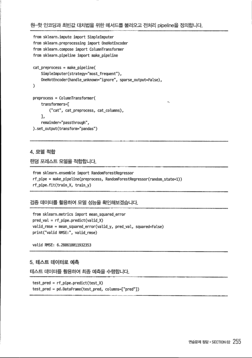
원－핫 인코딩과 최빈값 대치법을 위한 메서드를 불러오고 전처리 兩peilne을 정의합니다．

```python
from sklearn.inipute import Simplelmputer 
from sklearn.preprocessing import OneHotEncoder 
from sklearn.compose import Columnlransformer 
from sklearn.pipeline import make_pipeline
```
cat- preprocess = make_pipeline( Simplelmputer(strategy="most_frequent"), OneHotEncoder(handle_unknown="ignore", sparse- output=False),

```python
preprocess = Columnlransformer( 
transformers=[ 
("cat ", cat_preprocess, cat_columns),
```
`

```python
remainder="passthrough ', 
) .set_output(transform="pandas")
```
4 . 모델 적합 랜덤 포레스트 모델을 적합합니다．

```python
from sklearn.ensemble import RandomForestRegressor 
rf_pipe = make_pipeline(preprocess, RandomForestRegressor(random_state=l) ) 
rf_pipe. fit (train_X, train_y)
```
검증 데이터를 활용하여 모델 성능을 확인해보겠습니다，

```python
from sklearri.rnetrics import mean_squared_error 
pred_val = rf_pipe. predict (valid_X) 
valid_rmse = mean_squared_error(valid_y, pred_val, squared=False) 
print("valid RMSE:", valid_rmse)
```
valid R?'ISE: 6.288618@11932353 5 . 테스트 데이터로 예측 테스트 데이터를 활용하여 최종 예측을 수행합니다．

```python
test_pred = rf_pipe. predict (test_X) 
test_pred = pd. DataFrame(test_pred, columns={'pred"])
```
연즙문제정답· SECTION 02 255

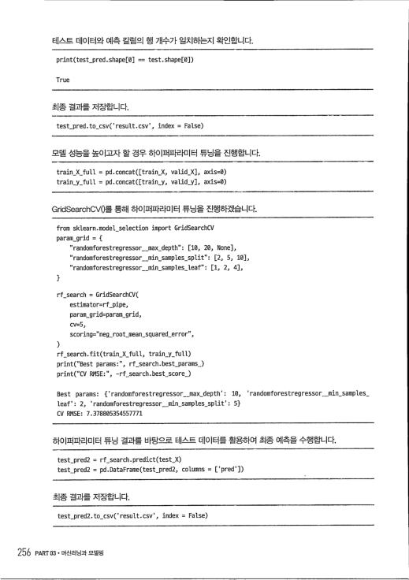
테스트 데이터와 예측 칼럼의 행 개수가 일치하는지 확인합니다．

```python
print(test_pred ..shape[0] == test.shape[0])
```
True 최종 결과를 저장합니다． test..pred.to_csv(' result.csv', index = False) 모델 성능을 높이고자 할 경우 하이퍼파라미터 튜닝을 진행합니다． train_X_ful.l = pd.concat([train_X, valid_X], axis=0) train_y_full. = pd.concat([train_y, val.id_y], axis=0) GridSearchCV(）를 통해 하이퍼파라미터 튜닝을 진행하겠습니다．

```python
from sklearn.model_selection import GridSearchCV
```
param_grid = { "randomforestregressor__niax_depth": [10, 20, None], "randomforestregressor__min_sampLes_split": [2, 5, 10], "randomforestregressor__min_sampLes_1.eaf": [1, 2, 4],

```python
rf_search = GridSearchCV( 
estimator=rf_pipe,
param_grid=param_grid, 
cv=5,,
scoring="neg_root_mean_squared_error",
rf_search. fit (train_X_full., train_y_full) 
print("Best params:", rf_search. best_params_) 
print("CV RtISE:", -rf_search.best_score_)
```
Best params: {' randomforestregressor__max_depth': 10, 'randomforestregressor__min_samples_ leaf' : 2, 'randomforestregressor__min_samples_split' : 5} CV RMSE: 7.378805354557771 하이퍼파라미터 튜닝 결과를 바탕으로 테스트 데이터를 활용하여 최종 예측을 수행합니다．

```python
test_pred2 = rf_search . predict (test_X) 
test_pred2 = pd.DataFrame(test_pred2, columns = ['pred'])
```
최종 결과를 저장합니다． test_pred2.to_csv('resuLt.csv', index = False) 256 PART03· 머신러닝과모델링

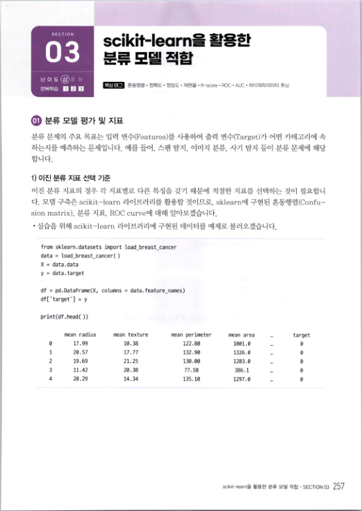
# scikit-lea rn을 활용한 
분류 모델 적합

# SECTION 03
난 0 도 （탸 히 핵심 태그 혼동행렬 · 정확도 · 정일도 · 재현을 · fl-score · ROC · AUC · 하이퍼파라미터 튜닝 반복학습 .

綴 緻 .

분류 모델 평가 및 지표 분류 문제의 주요 목표는 입력 변수（Features）를 사용하여 출력 변수（Target）가 어떤 카테고리에 속 하는지를 예측하는문제입니다 . 예를 들어 , 스팸 탐지 , 이미지 분류 , 사기 탐지 등이 분류 문제에 해당 합니다． 1) 이진 분류 지표 선택 기준 이진 분류 지표의 경우 각 지표별로 다른 특징을 갖기 때문에 적절한 지표를 선택하는 것이 필요합니 다 . 모델 구축은 scikit-learn 라이브러리를 활용할 것이므로 , sklearn에 구현된 혼동행렬（Confu- sion matrix) , 분류 지표 , ROC curve에 대해 알아보겠습니다．

- 실습을 위해 scikit-learn 라이브러리에 구현된 데이터를 예제로 불러오겠습니다．
```python
from sklearn.datasets import load_breast_cancer 
data = load_breast_cancer( )
X = data.data
y = data.target
df = pd.DataFrame(X, columns = data.feature_names) 
df[ 'target '] = y
print(df.head( ))
```
mean radius mean texture mean perimeter mean area target 0 17.99 10.38 122.80 1001.0 0 1 20.57 1].]] 132.90 1326.0 0 2 19.69 21.25 130.00 1203.0 0 3 11.42 20.38 77.58 386.1 0 4 20.29 14.34 135.10 1297.0 0 scikit-learn을 활용한 분류 모델 적합 · SECTION 03 257

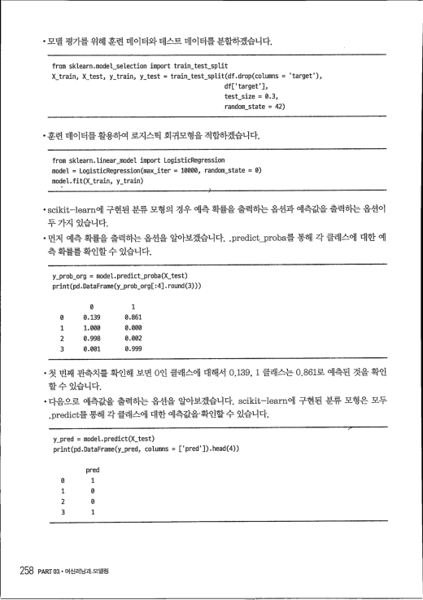
- 모델 평가를 위해 훈런 데이터와 테스트 데이터를 분할하겠습니다．
```python
from sklearri . model- selection import train_test_split
X_test, y_train, y_test 볍 train_test_split(df.drop(columris = 'target'), 
df[ 'target'], 
test_size = 0.3,
```
X_train,

```python
random_state = 42)
```
- 훈런 데이터를 활용하여 로지스틱 회귀모형을 적합하겠습니다．
```python
from sklearn. linear_model import LogisticRegression
model = LogisticRegression(max_iter = 10000, random_state = 0)
```
model. fit (X- train, y_train)

- scikit-learn에 구현된 분류 모형의 경우 예측 확률을 출력하는 옵션과 예측값을 출력하는 옵션이
두 가지 있습니다．

- 먼저 예측 확률을 출력하는 옵션을 알아보겠습니다 . .predict_proba를 통해 각 클래스에 대한 예
측 확률를 확인할 수 있습니다．

```python
y_prob_org = model. predict_proba (X_test) 
print(pd.DataFrame(y_prob_org[:4] .round(3)))
```
0 1 0 0.139 0.861 1 1.000 0.000 2 0.998 0.002 3 0.001 0.999

- 첫 번째 관측치를 확인해 보면 0인 클래스에 대해서 0.139, 1 클래스는 0.861로 예측된 것을 확인
할 수 있습니다．

- 다음으로 예측값을 출력하는 옵션을 알아보겠습니다 . scikit-learn에 구현된 분류 모형은 모두
.predict를 통해 각 클래스에 대한 예측값을 " 확인할 수 있습니다． /

```python
y_pred = model.predict(X_test) 
print(pd.DataFrame(y_pred, columns = ['pred'] ).head(4))
```
pred 0 1 1 0 2 0 3 1 258 PART03.·머신러닝과；‘모델링

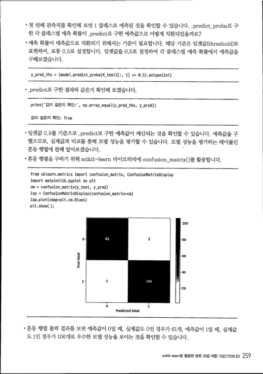
' 첫 번째 관측치를 확인해 보면 1 클래스로 예측된 것을 확인할 수 있습니다 . .predict_proba로 구 한 각 클래스별 예측 확률이 . predict로 구한 예측값으로 어떻게 치환되었을까요？ ' 예측 확률이 예측값으로 치환되기 위해서는 기준이 필요합니다 . 해당 기준은 임곗값（threshold）로 표현하며 , 보통 0.5로 설정합니다． 임곗값을 0.5로 설정하여 각 클래스별 예측 확률에서 예측값을 구해보겠습니다．

```python
y_pred_ths = (modeL.predict_proba(X_test)[:, 1] >= 0 .5).astype(int)
```
' . predict로 구한 결과와 같은지 확인해 보겠습니다．

```python
print(' 값이 같은지 확인＝ ' , np.array_equal(y_pred_ths, y_pred))
```
값이 같은지 확인＝ True ' 임곗값 0.5를 기준으로 . predict로 구한 예측값이 페산되는 것을 확인할 수 있습니다. 예측값을 구 했으므로， 실제값과 비교를 통하「모델 성능을 평가할 수 있습니다 . 모델 성능을 평가하는 테이블인 혼동 행렬에 관해 알아보겠습니다． ' 혼동 행렬을 구하기 위해 scikit-learn 라이브러리에 confusion- matrix(）를 활용합니다．

```python
from skLearn.metrics import confusion_matrix, ConfusionMatrixDisp1ay 
import matpthtUb.pyplot as p.t
cm = confusion_matrix(y_test, y_pred) 
isp = ConfusionMatrixDisplay(confusion_matrix=cm) 
isp. plot (cmap=pLt. cm. B1.ues) 
plt.show( ),
```
ioo 80 r)

- ｀
쓰 횡 ＝ H 1, r》 Predicted label 1 ' 혼동 행렬 출력 결과를 보면 예측값이 0일 때， 실제값도 0인 경우가 61개 , 예측값이 1일 패 , 실제값 도 1인 경우가 106개로 위수한모델 성능을 보이는 것블 확인할수 있습니다． scikit-learn을활용한분류보델；적합·！SECTI0N"03 259

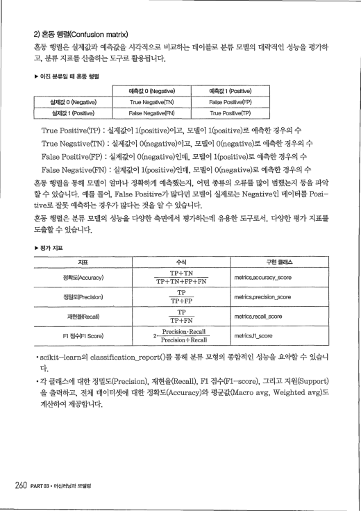
2) 혼동 행렬（Confusion matrix) 혼동 행렬은 실제값과 예측값을 시각적으로 비교하는 데이블로 분류 모델의 대략적인 성능을평가하 고 , 분류 지표를 산출하는 도구로 활용됩니다．

> 이진 분류일 때 혼동 행렬
예측값 0 (Negative) 예측값1 (Positive) 실제값 0 (Negative) True Negative(TN) False Positive(FP) 실제값 1 (Positive) False Negative(FN) True Positive(TP) True Positive(中P) : 실제값이 1(positive）이고 , 모델이 1(positive）로 예측한 경우의 수 True Negative(TN) : 실제값이 O(negative）이고 , 모델이 O(negative）로 예측한 경우의 수 False Positive(FP) : 실제값이 0 (negative）인데 , 모델이 1(positive）로 예측한 경우의 수 False Negative(FN) : 실제값이 l (positive）인데 , 모델이 0(negative）로 예측한 경우의 수 혼동 행렬을 통해 모델이 얼마나 정확하게 예측했는지 , 어떤 종류의 오류를 많이 범했는지 등을 파악 할수 있습니다 . 예를들어 , False Positive가많다면 모델이 실제로는 Negative인 데이터를 Posi- tive로 잘못 예측하는 경우가 많다는 것을 알 수 있습니다． 혼동 행렬은 분류 모델의 성능을 다양한 측면에서 평가하는데 유용한 도구로서 , 다양한 평가 지표를 도출할 수 있습니다．

> 평가 지표
지표 수식 구현 클래스 정확도仍ccuracy) TP + TN TP + TN +FP + FN metrics.accuracy_score 정밀도（Precision) TP TP+FP metrics.precision_score 재현율《Recall) TP TP+FN metrics.recall score Fl 점수（Fl Score) Precision· Recall 2 Precisi。n +Recall metrics.f 1 score

- scikit-learn의 classification_report(）를 통해 분류 모형의 종합적인 성능을 요약할 수 있습니
다．

- 각클쾌스에 대한정밀도（Precision) , 재현율（Recall), Ft 점수（Fl-score) , 그리고 지원（Support)
을 출력하고 , 전쳬 데이터셋에 대한 정확도（Accuracy）와 평균값（Macro avg, Weighted avg）도 계산하여 제공합니다． 260 PART03．머신러닝과모델링

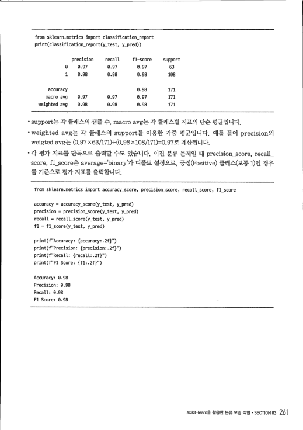
```python
from sklearn.nietrics import classification_report 
print(cLassification_report(y_test, y_pred))
```
precision recall fl- score support 0 0.97 0.97 0.97 63 1 0.98 0.98 0.98 108 0.98 171 0.97 0.97 0.97 171 0.98 0.98 0.98 171 accuracy macro avg weighted avg

- support는 각 클래스의 샘플 수 , macro avg는 각 클래스별 지표의 단순 평균입니다．
'weighted avg는 각 클래스의 support를 이용한 가중 평균입니다 . 예를 들어 precision의 weigted avg는 (0.97 x 63/171)+(0.98 x 108/171)=0.97로 계산됩니다． ' 각 평가 지표를 단독으로 출력할 수도 있습니다 . 이진 분류 문제일 때 precision_score, recall_ score, fl_score은 average='binary'가 디폴트 설정으로 , 긍정（Positive) 클래스（보통 1）인 경우 를 기준으로 평가 지표를 출력합니다 .

```python
from sklearn.metrics import accuracy_score, precision_score, recall_score, fl_score
accuracy = accuracy_score(y_test, y_pred) 
precision = precision_score(y_test, y_pred) 
recall = recall_score(y_test, y_pred) 
fl = fl_score(y_test, y_pred)
print(f"Accuracy: {accuracy: .2f}") 
print(f "Precision: {precision: .2f}") 
print(f 'Recall: {recall: .2f} ') 
print(f"F1 Score: {fl: .2f} ')
```
Accuracy: 0.98 Precision: 0.98 Recall: 0.98 Fl Score: 0.98 scikit-learn을활용한분류모델적합· SECTION 03 261

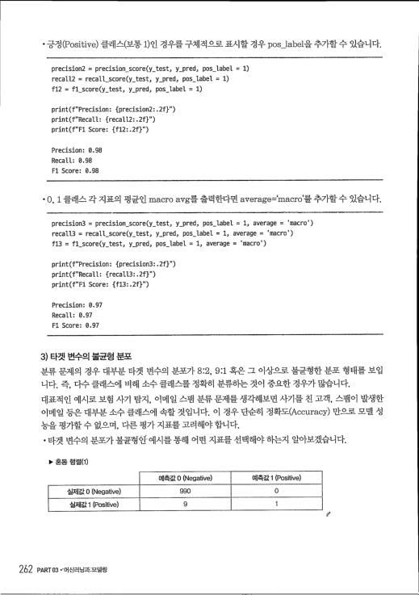
- 긍정（Positive) 클래스（보통 1）인 경우를 구쳬적으로 표시할 경우 pos_label을 추가할 수 있습니다．
```python
precision2 = precision_score(y_test, y_pred, pos_label. = 1)
```
reca112 .= recall._score(y._test, y_pred, pos_label. = 1) f 12 = fl_score(y_test, y_pred, pos_label. = 1)

```python
print(f "Precision: {precision2: .2f}') 
print(f"Recall: {recall2: .2f}") 
print(f"Fl Score: {f12:.2f}")
```
Precision: 0.98 Recall: 0.98 Fl Score: 0.98

- 0,1 클래스 각 지표의 평균인 macro avg를 출력한다면 average ='macro ' 를 추가할 수있습니다．
```python
precision3 = precision_score(y_test, y_pred, pos_label. = 1, average = 'macro ')
```
recal.13 = recall_score(y_test, y-pred, pos_Label = 1, average = 'macro') f 13 = fl_score(y_test, y_pred, pos_label = 1, average = 'macro')

```python
print(f"Precision: {precision3: .2f}') 
print(f"Recall: {reca113: .2f}") 
print(f"Fl Score: {f13:.2f}")
```
Precision: 0.97 Recall: 0.97 Fl Score: 0.97 3) 타겟 변수의 불균형 분포 분류 문제의 경우 대부분 타겟 변수의 분포가 8:2, 9:1 흑은 그 이상으로 불균형한 분포 형태를 보입 니다 . 즉 , 다수 클래스에 비해 소수 클래스를 정확히 분류하는 것이 중요한 경우가 많습니다． 대표적인 예시로 보험 사기 탐지 , 이메일 스팸 분류 문제를 생각해보면 사기를 친 고객， 스팸이 발생한 이메일 등은 대부분 소수 클래스에 속할 것입니다 . 이 경우 단순히 정확도（Accuracy) 만으로 모델 성 능을 평가할수 없으며 , 다른 평가 지표를 고려해야합니다．

- 타겟 변수의 분포가 불균형한예시를 통해 어떤 지표를 선택해야 하는지 알아보겠습니다．
卜 혼동 행렬（1) 예측값 0 (Negative) 예측값 1 (Positive) 실제값 0 (Negative) 990 0 실제값 1 (Positive) 9 1 262 PART03··머신러닝과， ．모델링

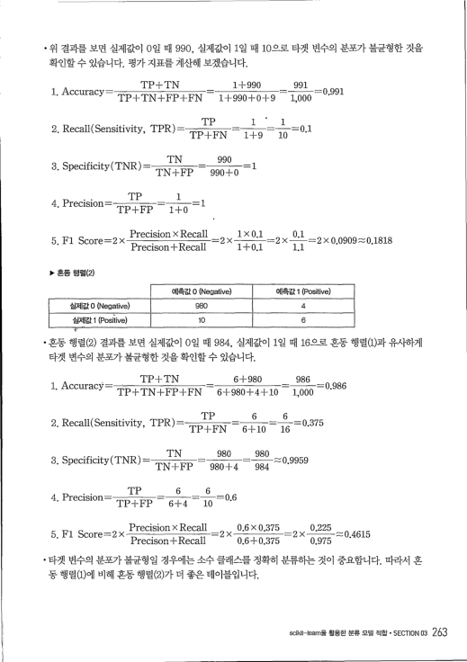
- 위 결과를 보면 실제값이 0일 때 990 , 실제값이 1일 때 10으로 타곗 변수의 분포가 불균형한 것을
확인할수 있습니다 . 평가 지표를 쳬산해 보겠습니다． .

TP+TN 1+990 991

1. Accuracy= 
=f Q01 TP+TN+FP+FN 1+990+0+9 1,000 '

# 2. Recali(Sensitivity, TPR)= -J윕 . , = . 눴  = , 1. = 0.1 
1r- 1-r1N L-I- J LU ∼ . - . . . --- －∼ .

TN 990 ;3. ipeciticity('1'f'.J1<) = = =1 TN+FP 990+0 ’∼ . .

TP 1 4.

TP+FP TP+FP 1+0 1+ 0 1

5. F1Sc。
re 2X F1 ScOre=2× x ==2× 1 11 = 2x 0909媤0.1818 r-recison-t-xc.ecau 1-I-U.1 1.1

> 혼동 행렬（2)
예측값 0 (Negative) 예측값 1 (Positive) 실제값 0 (Negative) 980 4 실제값 1 (Positive) 10 6

- 혼동 행렬（2) 결과를 보면 실제값이 0일 때 984 , 실제값이 1일 때 16으로 혼동 행렬（1）과 유사하게
타겟 변수의 분포가 불균형한 것을 확인할 수 있습니다． .

TP+TN 6+980 986

1. Accuracy= ∼ 
==n Q요R TP+TN+FP+FN 6+980+4+10 1,000 '

2. Recall(Sensitivity, TPR) = 
TP 6 6 TP+FN = 6+10 = - -=0.375 TTN 980, 980 9959

3. Specificity
S>0.ifi.i『7 TN+FP 98。+4 984 6 4.

6, 6 TP+FP 6+4 1。

「.0i5i..= TTPP

- 
--- - 6 X 2/ 375 一 0 225

5. Fl Score=
x 2X 0.46l5 Precis。n+ Recall l F1 S에「.

2x 。.375 。.975

- 타겟 변수의 분포가 불균형일 경우에는 소수 클래스를 정확히 분류하는 것이 중요합니다 . 따라서 혼 
동 행렬（1）에 비해 혼동 행렬（2）가 더 좋은 테이블입니다． scikit-learn을활용한분류모델적합＊SECTION 03 263

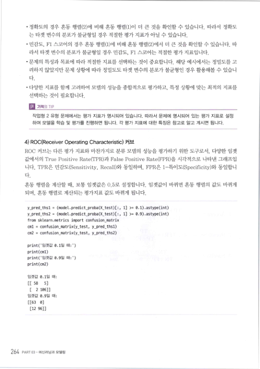
- 정확도의 경우 혼동 행렬（2）에 비해 혼동 행렬（1）이 더 큰 것을 확인할 수 있습니다 . 따라서 정확도 
는 타겟 변수의 분포가 불균형일 경우 적절한 평가 지표가 아닐 수 있습니다．

- 민감도 , Fl 스코어의 경우 혼동 행렬（1）에 비해 혼동 행렬（2）에서 더 큰 것을 확인할 수 있습니다 . 따
라서 타겟 변수의 분포가 불균형일 경우 민감도 , Fl 스코어는 적절한 평가 지표입니다．

- 문제의 특정과 목표에 따라 적절한 지표를 선택하는 것이 중요합니다 . 해당 예시에서는 정밀도를 고
려하지 않았지만 문제 상황에 따라 정밀도도 타겟 변수의 분포가 불균형 인 경우 활용해볼 수 있습니 다．

- 다양한 지표를 함께 고려하여 모델의 성능을 종합적으로 평가하고 , 특정 상황에 맞는 최적의 지표를
선택하는 것이 필요합니다． ．헴 기적의 ㄲp 작업형 2 유형 문제에서는 평가 지표가 명시되어 있습니다 . 따라서 문제에 명시되어 있는 평가 지표로 설정 하여 모델을 학습 및 펑가를 진행하면 됩니다 . 각 평가 지표에 대한 특징은 참고로 알고 계시면 됩니다． 4) ROC(Receiver Operating Characteristic) 커브 ROC 커브는 다른 평가 지표와 마찬가지로 분류 모델의 성능을 평가하기 위한 도구로서 , 다양한 임곗 값에서의 True Positive Rate(TPR）과 False Positive Rate(FPR）을 시각적으로 나타낸 그래프입 니다 . TPR은 민감도（Sensitivity, Recall）와 동일하며 , FPR은 1－특이도（Specificity）와 동일합니 다． 혼동 행렬을 계산할 때 , 보통 임곗값은 0.5로 설정합니다 . 임곗값이 바뀌면 혼동 행렬의 값도 바뀌게 되며 , 혼동 행렬로 계산되는 평가지표 값도 바게 됩니다．

```python
y_pred_thsl = (model.predict_proba(X_test)[:, 1] >= 0.1).astype(int)
y_pred_ths2 = (modeLpredict_proba(X_test)[:, 1] >= 0.9).astype(int)
from sklearn.metrics import confusion_matrix
cml = confusion_matrix(y_test, y_pred_thsl)
cm2 = confusion_matrix(y_test, y_pred_ths2)
print(' 임곗값 0.1일 때： ' ) 
print(cml) 
print(' 임곗값 0.9일 때： ' ) 
print(cm2)
```
임곗값 0.1일 때： [[58 5] [ 2 106]] 임곗값 . .9일 때： [[63 0] [12 96]] 264 PART 03◆머신러닝과모델링

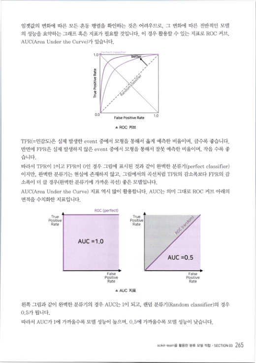
임곗값의 변화에 따른 모든 혼동 행렬을 확인하는 것은 어려우므로 , 그 변화에 따른 전반적인 모델 의 성능을 요약하는 그래프 혹은 지표가 필요할 것입니다 . 이 경우 활용할 수 있는 지표로 RO(〕 커브， AUC(Area Under the Curve）가 있습니다． erfect classifier 。

섦 ㄸ 。

＞ ∼ 싣 一 띠 。

江 이 그 ㄴ H 1.0 False Positive Rate ▲ ROC 커브 TPR(＝민감도）은 실제 발생한 event 중에서 모형을 통해서 옳게 예측한 비율이며 , 클수록 좋습니다． 반면에 FPR은 실제 발생하지 않은 event 중에서 모형을 통해서 잘못 예측한 비율이며 , 작을 수록 좋 습니다． 따라서 TPR이 1이고 FPR이 0인 경우 그림어］ 표시된 것과 같이 완벽한 분류기（perfect classifier) 이지만 , 완벽한 분류기는 현실에 존재하지 않고 , 그림에서의 곡선처럼 TPR의 감소폭보다 FPR의 감 소폭이 더 클 경우（완벽한 분류기에 가까운 곡선） 좋은 모델입니다 .

AUC(Area Under the Curve) 지표 역시 많이 활용합니다 . AUC는 의미 그대로 RO(〕 커브 아래의 면적을 수치화한 지표입니다． ▲ ROC (perfect A A True True Positive Positive Rate Rate

```python
AUC =1.0 
興／
AUC =0.5
```
> 
False False Positive Positive Rate Rate ▲ A(.JC 지표 왼쪽 그림과 같이 완벽한 분류기의 경우 AUC는 1이 되고 , 랜덤 분류기（Random classifier）의 경우 0.5가 됩니다． 따라서 AUC가 1에 가까울수록 모델 성능이 높으며 , 0.5에 가까울수록 모델 성능이 낮습니다． scikit-learn을 활용한 분류 모델 적합 . SECTION 03 265

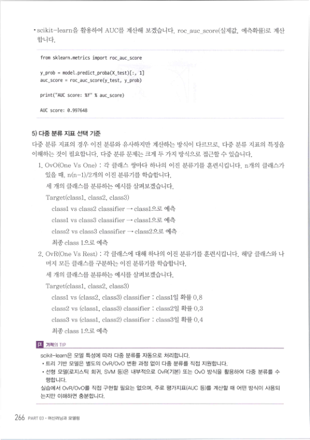
' scikit-learn을 활용하여 AUC를 계산해 보겠습니다 . roc_auc_score（실제값 , 예측확률）로 계산 합니다．

```python
from sklearn.metrics import roc_auc_score
y_prob = model.predict_proba(X_test)[:, 11 
auc_score = roc_auc_score(y_test, y_prob)
print('AIJC score: %f " % auc_score)
```
AUC score: 0.997648 5) 다중 분류 지표 선택 기준 다중 분류 지표의 경우 이진 분류와 유사하지만 계산하는 방식이 다르므로 , 다중 분류 지표의 특징을 이해하는 것이 필요합니다 . 다중 분류 문제는 크게 두 가지 방식으로 접근할 수 있습니다．

1. OvO(One Vs One) : 각 클래스 쌍마다 하나의 이진 분류기를 훈련시킵니다 . II개의 클래스가
있을 때 , n(n-1)/2개의 이진 분류기를 학습합니다． 세 개의 클래스를 분류하는 예시를 살펴보겠습니다． Target(classl, c1ass2, c1ass3) classi vs c1ass2 classifier - classl으로 예측 classi vs class3 classifier -p classi으로 예측 c1ass2 vs class3 classifier - c1ass2으로 예측 최종 class 1으로 예측

2. OvR(One Vs Rest) : 각 클래스에 대해 하나의 이진 분류기를 훈련시킵니다 . 해당 클래스와 나
머지 모든 클래스를 구분하는 이진 분류기를 학습합니다 .

세 개의 클래스를 분류하는 예시를 살펴보겠습니다． Target(classl, class2, c1ass3) classl vs (c1ass2, class3) classifier : c1ass1일 확률 0.8 class2 vs (classi, c1ass3) classifier : c1ass2일 률 0.3 class3 vs (classi, class2) classifier : c1ass3일 확률 0.4 최종 class 1으로 예측 ．헴 기적의 TIP scikit-learn은 모델 특성에 따라 다중 분류를 자동으로 처리합니다．

- 트리 기반 모델은 별도의 OvR/OvO 변환 과정 없이 다중 분류를 직접 지원합니다 . 
- 선형 모델（로지스틱 회귀 . SVM 등）은 내부적으로 OvR（기본） 또는 OvO 방식을 활용하여 다중 분류를 수
행합니다． 실습에서 OvR/OvO를 직접 구현할 필요는 없으며 , 주로 평가지표（AUC 등）를 계산할 때 어떤 방식이 사용되 는지만 이해하면 충분합니다． 266 PART03．머신러닝과모델링

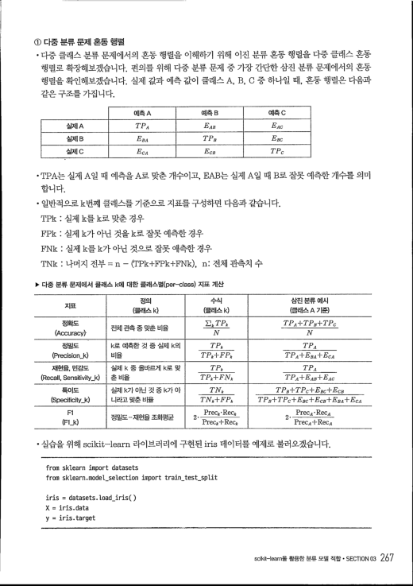
① 다중 분류 문제 혼동 행렬

- 다중 클래스 분류 문제에서의 혼동 행렬을 이해하기 위해 이진 분류 혼동 행렬을 다중 클래스 혼동
행렬로 확장해보겠습니다 . 펀의를 위해 다중 분류 문제 중 가장 간단한 삼진 분류 문제에서의 혼동 행렬을확인해보겠습니다 . 실제 값과 예측 값이 클래스A, B, C 중 하나일 때 , 혼동 행렬은 다음과 같은 구조를 가집니다． 예측 A 예측 B 예측 C 실제 A TPA EA8 EAc 실제 B EBA 7,／누 E〃c 실제 C I:pcA Ec／〕 T／긺

- TPA는 실제 A일 때 예측을 A로 맞춘 개수이고 , EAB는 실제 A일 때 B로 잘못 예측한 개수를 의미
합니다．

- 일반적으로 k번째 클래스를 기준으로 지표를 구성하면 다음과 같습니다．
TPk : 실제 k를 k로 맞춘 경우 FPk : 실제 k가 아닌 것을 k로 잘못 예측한 경우 FNk : 실제 k를 k가 아닌 것으로 잘못 예측한 경우 TNk : 나머지 전부 = n - (TPk+FPk+FNk), n: 전쳬 관측치 수 》 다중 분류 문제에서 클래스 k에 대한 클래스별（per-class) 지표 계산 OlAI 류 A 분 ㅅ 삼 扈 （클래스 〔） 수식 지표 정의 （클래스 k) 정확도 (Accuracy).

전체 관측 중 맞춘 비율 쫴T／긺 7V T/＝》끄＋TP"7` ／긺 2V 정밀도 k로 예측한 것 중 실제 k의 비율 TPk T／〕汁FP,.

TPA T／긱t+EBA+ECA (Precision_k) 재현을 , 민감도 실제 k 중 올바르게 k로 맞 춘 비율 T／깅 T／〕β FN,.

TPA T／긱t+EA" EAC (Recall, Sensitivity_k) 특이도 니라고 맞춘 비율 TN,.

ㄲv汁FP,.

T／긺＋7￥）c+Ez궂c+EcB TPB+7`／깃汁Ez'（∥万pcz汁万7끄ㅆ EcA 실제 k가 아닌 것 중 k가 아 (Specificity_k) 2 PrecJ·꾜ec갸 텨 Fl k 정밀도－재현을 조화펑균 2 PrPre·c,.'R PrecA＋꾜ec4 PrPrecb+R

- 실습을 위해 scikit-learn 라이브러리에 구현된 iris 데이터를 예제로 불러오겠습니다．
```python
from sklearn import datasets
from skLearn.model- selection import train_test_split
iris = datasets. Load_iris ()
```
X, = iris. data

```python
y = iris. target
```
scikit-learn을활용한분류모델적합．SECTION 03 267

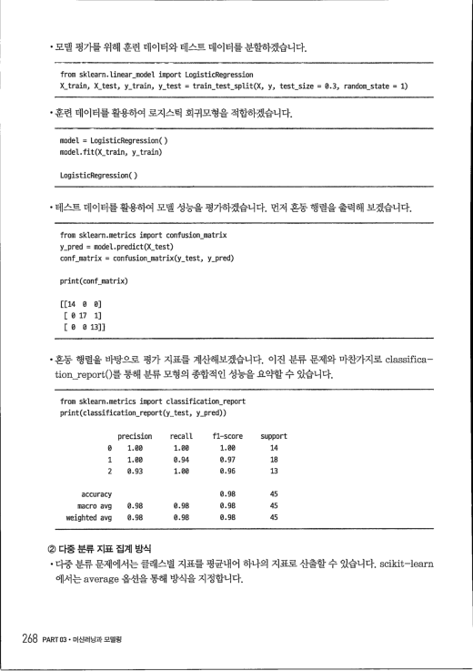
- 모델 평가를 위해 훈런 데이터와 데스트 데이터를 분할하겠습니다．
```python
from sklearn. linear_model import LogisticRegression
```
X_train, X_test, y_train, y_test = train_test_split(X, y, test_size = 0.3, random_state = 1)

- 훈린 데이터를 활용하여 로지스틱 회귀모형을 적합하겠습니다．
```python
model = LogisticRegression()
```
model.fit (X_train, y_train) LogisticRegression()

- 테스트 데이터를 활용하여 모델 성능을 평가하겠습니다 . 먼저 혼동 행렬을 출력해 보겠습니다．
```python
from sklearn.metrics import confusion_matrix
y_pred = model.predict(X_test) 
conf_matrix = confusion_matrix(y_test, y_pred)
print(conf_matrix)
```
[[14 0 0] [ 0 17 1] [ 0 0 13]]

- 혼동 행렬을 바탕으로 평가 지표를 계산해보겠습니다 . 이진 분류 문제와 마찬가지로 classifica-
tion_report(）를 통해 분류 모형의 종합적인 성능을 요약할 수 있습니다．

```python
from sklearn.metrics import classification_report 
print(classificationjeport(y. test, y_pred))
```
precision recall fl- score support 0 1.00 1.00 1.00 14 1 1.00 0.94 0.97 18 2 0.93 1.00 0.96 13 accuracy 0.98 45 macro avg 0.98 0.98 0.98 45 weighted avg 0.98 0.98 0.98 45 (2) 다중 분류 지표 집계 방식

- 다중 분류 문제에서는 클래스별 지표를 평균내어 하나의 지표로 산출할 수 있습니다 . scikit-learn
에서는 average 옵션을 통해 방식을 지정합니다． 268 PART03＊머신러닝과모델링

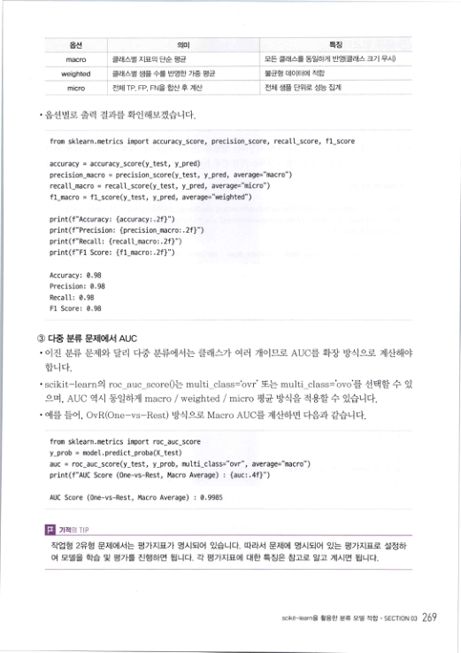
옵션 의미 특징 macro 클래스별 지표의 단순 평균 모든 클래스를 동일하게 빈뼝（클래스 크기 무시） weighted 클래스별 샘플 수를 반영한 가중 평균 불균형 데이터에 적합 n기cro 전체 TP, FP, FN을 합산 후 계산 전체 샘플 단위로 성능 집계

- 옵션별로 출력 결과를 확인해보겠습니다．
```python
from sklearn.metrics import accuracy_score, precision_score, recall_score, fl_score
accuracy = accuracy_score(y_test, y_pred) 
precision_macro = precision_score(y_test, y_pred, average="macro") 
recall_macro = recall_score(y_test, y_pred, average= "micro') 
fl_macro = fl_score(y_test, y_pred, average=' 'weighted ')
print(f"Accuracy: {accuracy: .2f}") 
print(f "Precision: {precision_macro: .2f} ') 
print(f 'RecalJ: {recall_macro: .2f}") 
print(f"Fl Score: {fl_macro: .2f}')
```
Accuracy: 0.98 Precision: 0.98 Recall: 0.98 Fl Score: 0.98 ③ 다중 분류 문제에서 AUC

- 이진 분류 문제와 달리 다중 분류에서는 클래스가 여러 개이므로 AUC를 확장 방식으로 계산해야
합니다．

- scikit-learn의 roc auc score(）는 multi class='ovr ' 또는 multi class='ovo"를 선택할 수 있
으며 , AU(〕 역시 동일하게 macro / weighted / micro 평균 방식을 적용할 수 있습니다．

- 예를 들어 , OvR(One-vs-Rest) 방식으로 Macro AUC를 계산하면 다음과 같습니다 .
```python
from sklearn.metrics import roc_auc_score
y_prob = model.predict_proba(X_test)
auc = roc_auc_score(y_test, y_prob, mul.ti_class="ovr' , average="macro") 
print(f "AUC Score (One-vs-Rest, Macro Average) : {auc:.4f} ")
```
AUC Score (One-vs-Rest, Macro Average) : 0.9985

### r잽 기적의 지p
작업형 2유형 문제에서는 펑가지표가 명시되어 있습니다 . 따라서 문제에 명시되어 있는 평가지표로 설정하 여 모델을 학습 및 평가를 진행하면 됩니다 . 각 평가지표에 대한 특징은 참고로 알고 계시면 됩니다． scikit-learn을 활용한 분류 모델 적합 · SECTION 03 269

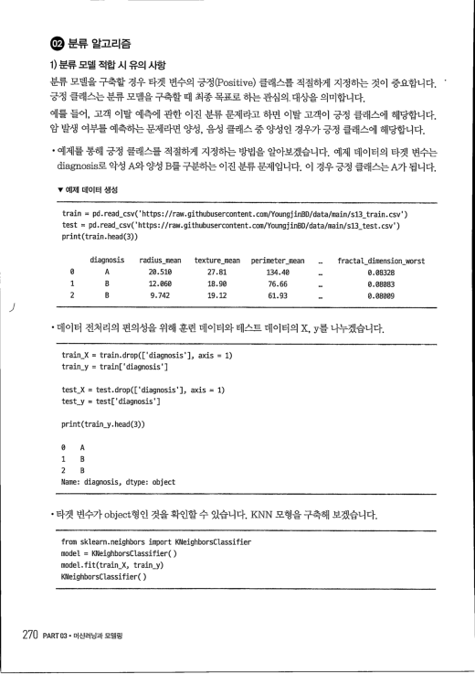
.

분류 알고리즘 1) 분류 모델 적합 시 유의 사항 분류 모델을 구축할 경우 타겟 변수의 긍정（Positive) 클래스를 적절하게 지정하는 것이 중요합니다．' 긍정 클래스는 분류 모델을 구축할 때 최종 목표로 하는 관심의 . 대상을 의미합니다． 예를 들어， 고객 이탈 예측에 관한 이진 분류 문제라고 하먼 이탈 고객이 긍정 클래스에 해당합니다． 암 발생 여부를 예측하는 문제라먼 양성 , 음성 클래스 중 양성인 경우가 긍정 클래스에 해당합니다． ' 예제를 통해 긍정 클래스를 적절하게 지정하는 방법을 알아보겠습니다 . 예제 데이터의 타곗 변수는 diagnosis로 악성 A와 양성 B를구분하는 이진 분류문제입니다 . 이 경우 긍정 클쾌스는A가 됩니다． ▼ 예제 데이터 생성

```python
train = pd.read_csv( 'https://raw.githubusercontent.com/youngjjnBD/data/majnlsl3-train.csv') 
test = pd.read_csv('https://raw.githubusercontent.com/youngjinBD/data/rnajn/sl3-test.csv') 
print(train, head (3))
```
diagnosis radius_mean texture_mean perimeter_mean ...

fractal_dimension_worst 0 A 20.510 27.81 134.40 0.08328 1 B 12.060 18.90 76.66 0.08083 2 B 9.742 19.12 61.93 0.08009 ' 데이터 전처리의 편의성을 위해 훈련 데이터와 테스트 데이터의 x, y를 나누겠습니다．

```python
train_X = train.drop([ 'diagnosis '] , axis = 1) 
train_y = train[ 'diagnosis ']
test_X = test.drop([ 'diagnosis '] , axis = 1) 
test_y = test[ 'diagnosis ']
print(train_y. head (3))
```
0 A 1 B 2 B Name: diagnosis, dtype: object

- 타겟 변수가 object형인 것을 확인할 수 있습니다 . KNN 모형을 구축해 보겠습니다．
```python
from sklearn.neighbors import KNeighborsClassifier
model = KNeighborsClassifier() 
model. fit (train_X, train_y) 
KNeighborsClassifier()
```
270 PART盼． 머신러닝과모델링

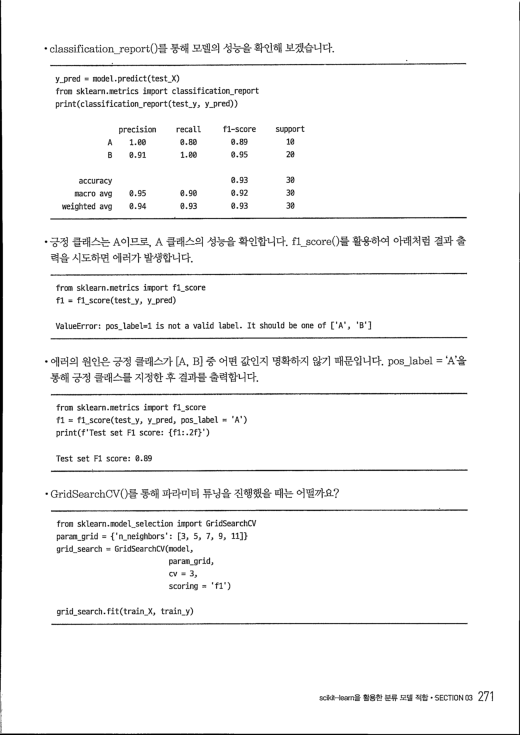
- classification_report(）를 통해 모델의 성능을 확인해 보겠습니다．
```python
y_pred = model.predict(test_X)
from sklearn.metrics import classification_report 
print(classification_report(test_y, y_pred))
```
precision recall fl- score support A 1.00 0.80 0.89 10 B 0.91 1.00 0.95 20 accuracy 0.93 30 macro avg 0.95 0.90 0.92 30 weighted avg 0.94 0.93 0.93 30

- 긍정 클쾌스는A이므로 , A 클래스의 성능을 확인합니다 . fl_score(）를 활용하여 아래처럼 결과 출
력을 시도하면 에러가 발생합니다．

```python
from sklearn.metrics import fl_score 
fl = fl_score(test_y, y_pred)
```
ValueError: pos_label=l is not a valid label. It should be one of [ 'A ', ' B ']

- 에러의 원인은 긍정 클래스가 [A , B] 중 어떤 값인지 명확하지 않기 때문입니다 . pos_label = 'A'을
통해 긍정 클래스를 지정한 후 결과를 출력합니다．

```python
from sklearn.metrics import fl_score 
fl 볍 fl_score(test_y, y_pred, pos_label. = ' A') 
print(f 'Test set Fl score: {fl: .2f} ')
```
Test set Fl score: 0.89

- GridSearchCV()를 통해 파라미터 튜닝을 진행했을 때는 어떨까요？
```python
from sklearn.niodeL_selection import GridSearchCV
param_grid = { 'n_neighbors ': E3, 5, 7, 9, 11]} 
grid_search = GridSearchCV(model,
param_grid, 
cv = 3, 
scoring = ' fl ')
```
grid_search. fit (train_X, train_y) scikit-learn을활용한분류모델적합「SECTION 03 271

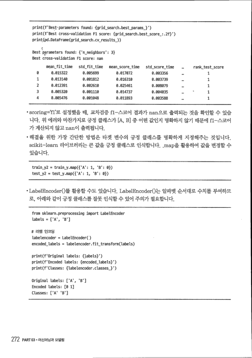
```python
print(f 'Best' parameters found.: {grid_search.best_params_} ') 
print(f 'Best cross-validation Fl score: {grid_search.best_score_: .2f}') 
print(pd, DataFrame(grid_search.cv_results_))
```
Best pa.rameters found: {'n_ne.ighbors ' : 3} Best cross-validation Fl score: nan mean_fit_time std_fit_time mean_score_time std_score_time rank_test_score 0 q .0l5322 0.005699 0.017072 0.003356 1 1 0.013140 0.001812 0.016310 0.003739 ...

1 2 0.012391 0.002610 0.025461 0.008079 1 3 0.005320 0.001110 0.014737 0.004035 1 4 0.005476 0.001048 0.011893 0.003588 1 ' scoring='fl'로 설정했을 때 , 교차검증 ft－스코어 결과가 nan으로 출력되는 것을 확인할 수 있습 니다 . 위 에러와 마찬가지로 긍정 클래스가 [A , B] 중 어떤 값인지 명확하지 않기 때문에 fi－스코어 가 계산되지 않고 nan이 출력됩니다．

- 해결을 위한 가장 간단한 방법은 타겟 변수의 긍정 클래스를 명확하게 지정해주는 것입니다． 
scikit-learn 라이브러리는 큰 값을 긍정 클쾌스로 인식합니다 . .map을 활용하여 값을 변경할 수 있습니다．

```python
train_y2 = train_y.map({'A': 1, 'Br: 0}) 
test_y2 = test_y.map({'A ' : 1, ' B ' : 0})
```
- LabelEncoder(）를 활용할 수도 있습니다 . LabelEncoder(）는 알파벳 순서대로 수치를 부여하므 
로 , 아래와 같이 긍정 클래스를 잘못 인식할 수 있어 주의가 필요합니다．

```python
from sklearn.preprocessing import LabelEncoder 
labels = [ 'A ', 'B 'J
# 라벨 인코딩 
labelencoder = LabelEncoder()
encoded_labels = labelencoder. fit_transform(labels)
print(f 'Original, labels: {labels}') 
print(f ' Encoded labels: {encoded_labels}') 
print(f 'Classes: {labelencoder.classes_}')
```
Original labels: ['A', 'B'] Encoded labels: [0 1] Classes: ['A' 'B'] 272 PART 03．머신러닝과모델링

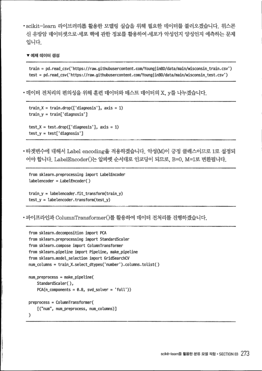
- scikit-learn 라이브러리를 활용한 모델링 실습을 위해 필요한 데이터를 불러오겠습니다 . 위스콘
신 유방암 데이터셋으로"．세포 핵에 관한 정보．를 활용하여 】세포가．악성인지 양성인지 예측하는 문제 입니다． ▼ 예제 데이터 생성

```python
train = pd. read- csv( ' https.: // raw.. githubusercontent.com/YoungjinBD/data/niain/wisconsin_train. csv ') 
test = pd.read_csv('https://raw.githubusercontent.com/YoungjinBDldata/main/wisconsin_test.csv ')
```
- 데이터 전처리의 펀의성을위해 훈린 데이터와 테스트 데이터의 x, y를 나누겠습니다．
```python
train_X = train'drop(['diagnosis '], axis = 1) 
train_y = train[ 'diagnosis'i
test_X = test.drop({'diagnosis'] , axis = 1) 
test_y = test[ 'diagnosis ']
```
- 타겟변수에 대해서 Label encoding을 적용하겠습니다 . 악성（M）이 긍정 클래스이므로 1로 설정되
어야합니다 . LabelEncoder(）는 알파벳 순서대로 인코딩이 되므로 , B=O, M=1로 변환됩니다．

```python
from sklearn.preprocessing import Lab&.Encoder 
Labelencoder = ,LabeLEncoder()
train-y = labelencoder. fit_transforrn(train_y) 
test_y = LabeLencoder.transform(test_y)
```
- 파이프라인과 ColumnTransformer(）를 활용하여 데이터 전처리를 진행하겠습니다．
```python
from sklearn.decomposition import PCA 
from sklearn.preprocessing import StandardScaler 
from sklearn.compose import Co1.umnTransformer 
from sklearn.pipeline import Pipeline, make_pipeline 
from skLearn.. model_selection import GridSearchCV
num_columns = train_X.select_dtypes( 'number').columns.tolist()
num_preprocess = make_pipeline( 
StandardScalerO,
```
PCA(n_components = 0.8, svd_solver = 'full '))

```python
preprocess = ColumnTransformer( 
[("num", num_preprocess, num_columns)] 
)
```
scikit-learn을활용한분류모델적합· SECTION 03 273

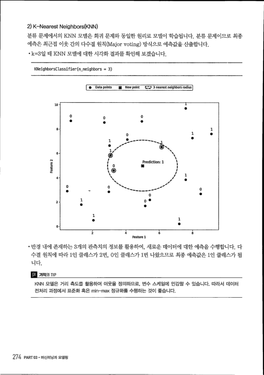
2) K-Nearest Neighbors(KNN) 분류 문제에서의 KNN 모델은 회귀 문제와 동일한 원리로 모델이 학습됩니다 . 분류 문제이므로 최종 예측은 최근접 이웃 간의 다수결 원칙（Major voting) 방식으로 예측값을 산출합니다．

- k=3일 때 KNN 모델에 대한 시각화 결과를 확인해 보겠습니다．
KNeighborsClassifier(n- neighbors = 3) .

Data points

* 
New point 킵：=, 3 nearest neighbors radius ● 0 0 0 ● S S 1 8- S 1 S 0

- 〃
,

### 1
· 1→ o ' ' 暢 ， , o ● 걋 , 군 , ` / , ' , / ,

## 省
/ 卜 ， / ㅏ ㅓ " 면 크 ． 。

ㄴ 비 .

o P * - 크 / 歡 一 n / ㅁ 尸 ， 一 o ● 1 S 4 b / ` , , 0 S 0 .

` , S

1. 
S 0 2 뻑 。

그． S :1.S 0- 2 4 Featum 1 6 8

- 반경 내에 존재하는 3개의 관측치의 정보를 활용하여 , 섀로운 데이터에 대한 예측을 수행합니다 . 다 
수결 원칙에 따라 1인 클래스가 2번 , 0인 클래스가 1번 나왔으므로 최종 예측값은 1인 클래스가 됩 니다． .

기적의 지p KNN 모델은 거리 측도를 활용하여 이웃을 정의하므로 , 변수 스케일0ㅔ 민감할 수 있습니다 . 따라서 데이터 전처리 과정에서 표준화 혹은 繭ri-max 정규화를 수행하는 것이 좋습니다． 274 PART 03．머신러닝과모델링

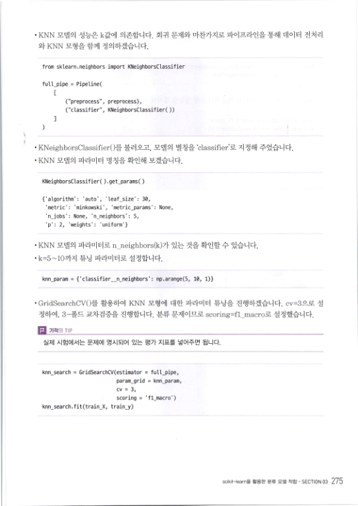
- KNN 모델의 성능은 k값에 의존합니다 . 회귀 문제와 마찬가지로 파이프라인을 통해 데이터 전처리
와 KNN 모형을 함께 정의하겠습니다．

```python
from sklearn.neighbors import KNeighborsCl.assifier
```
full_pipe = Pipeline( [ ("preprocess", preprocess), ("classifier", KNeighborsClassifierO) ]

- KNeighborsClassifier(）를 불러오고 , 모델의 별칭을 ' classifier'로 지정해 주었습니다．
"KNN 모델의 파라미터 명칭을 확인해 보겠습니다． KNeighborsClassifier( ) .get_params() {'algorithm' : 'auto', 'Leaf_size' : 30, ' metric ' : 'minkowski', 'metric_params': None, 'n_jobs ' : None, 'n_neighbors' : 5, 'p' : 2, 'weights' : 'uniform'}

- KNN 모델의 파라미터로 n_neighbors(k）가 있는 것을 확인할 수 있습니다．
- k=5'--10까지 튜닝 파라미터로 설정합니다．
```python
knn_param = {'cl.assifier__n_neighbors' : np.arange(5, 10, 1)}
```
- GridSearchCV(）를 활용하여 KNN 모형에 대한 파라미터 튜닝을 진행하겠습니다 . cv=3으로 설
정하여 , 3－폴드교차검증을진행합니다 . 분류문제이므로scoring=f 1_macro로설정했습니다． .

기적의 뀌p 실제 시험에서는 문제에 명시되어 있는 평가 지표를 넣어주면 됩니다．

```python
knn_search = GridSearchCV(estimator = full_pipe,
param_grid = knn_param, 
cv = 3, 
scoring = 'fl_macro')
```
knn_search. fit (train_X, train_y) scikit-learn을 활용한 분류 모델 적합 ' SECTION 03 275

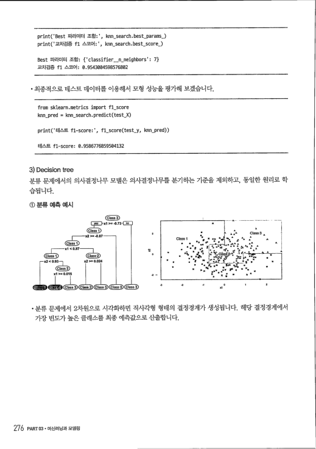
```python
print(' Best 파라미터 조합＝ " knn_sear햐｀.best_paranis_) 
print(' 교차검증 fi 스코어＝ ' , knn_searc力．best_s cc re_)
```
Best 파라미터 조합＝ { 'classifier__n_nei助bors': 7} 교차검증 fi 스코어＝ 0.9543004598576802

- 최종적으로 데스트 데이터를 이용해서 모형 성능을 평가해 보겠습니다．
```python
from sklearn.metrics import fl_score
knn_pred = knn_search. predict (test_X)
print(' 테스트 fl- score:', fl_score(test_y, knn_pred))
```
테스트 fl- score: 0.9586776859504132 3) Decision tree 분류 문제에서의 의사결정나무 모델은 의사결정나무를 분기하는 기준을 제외하고， 동일한 원리로 학 습됩니다． ① 분류 예측 예시 xl >. -0.73

### ㅡ
． 슬 乙 渗

### ㅡ
一… 〃 ∼ 씨

## c
^ , 겯 ㅗ ＾ , ,^ 蠱 r 欌 ∼ 鱗 - 想 ∼ 輾 。

u ^ ㅃ ㅗ ， ㅈ2 >= .0.87 ㅗ ＇ 남 〃 塘 씹 xl <0.87 쉿 , x2 >· 0.024

- - ■
' , 랗

## 棚
.2 국 *, ｀귿 2

- 분류 문제에서 2차원으로 시각화하면 직사각형 형태의 결정경계가 생성됩니다 . 해당 결정경계에서
가장 빈도가 높은 클래스를 최종 예측값으로 산출합니다． 276 PART03· 머신러닝과모델링

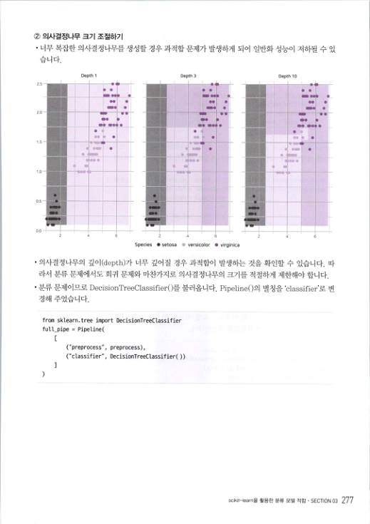
② 의사결정나무 크기 조절하기

- 너무 복잡한 의사결정나무를 생성할 경우 과적합 문제가 발생하게 되어 일반화 성능이 저하될 수 있
습니다． Depth 1 Dep앉臼 Dep앉110 0 D5 ● 0

- . 
.－●

- ·
..

Q0 4 （〕 Species S setosa S versicolor S virginica ' 의사결정나무의 깊이（depth）가 너무 깊어질 경우 과적합이 발생하는 것을 확인할 수 있습니다 . 따 라서 분류 문제에서도 회귀 문제와 마찬가지로 의사결정나무의 크기를 적절하게 제한해야 합니다． ' 분류 문제이므로 DecisionTreeClassifier(）를 불러옵니다 . Pipeline(）의 별칭을 ' classifier'로 변 경해 주었습니다．

```python
from sklearn.tree import DecisionTreeCthssifier 
full_pipe = Pipeline( 
[ 
( "preprocess ", preprocess), 
( "classifier ", DecisionTreeClassifierO) 
]
```
scikit-learn을활용한분류모델적합· SECTION 03 277

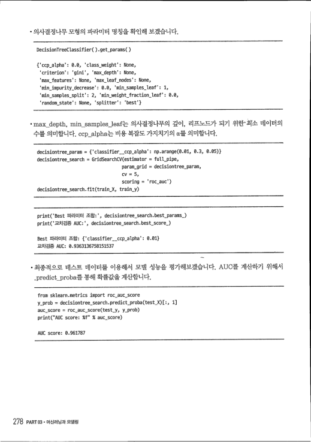
- 의사결정나무 모형의 파라미터 명칭을 확인해 보겠습니다．
DecisionTreeCLassifier( ) .get_params() {'ccp_alpha': 0.0, 'class_weight': None, ' criterion': 'gini ', 'max_depth': None, 'max_features' : None, 'max_leaf_nodes': None, 'mmn_impurity_decrease': 0.0, 'mmn_samples_leaf': 1, 'min_samples_spl.it ': 2, 'min_weight_fraction_l.eaf': 0.0, 'random_state': None, 'splitter': 'best'}

- max_depth, mm_samplesJeat'는 의사걸정나무의 깊이 , 라ㅍ누ㄷ가 되기 위한 ' 최소 데이터의
수를 의미합니다 . ccp_alpha는 비용복잡도 가지치기의 α를 의미합니다．

```python
decisiontree_param = {'classifier__ccp_alpha': np.arange(0.01, 0.3, O.05)}
decisiontree_search = GridSearchCV(estimator = full_pipe,
param_grid = decisiontree_param,
cv = 5, 
scoring = 'roc_auc') 
decisiontree_search . fit (train_X, train_y)
print('Best 파라미터 조합＝ ', decisiontree_sear햐｀·best_pa rams_) 
print(' 교F검증 AUC:', decisiontree_search.best_score_)
```
Best 파라미터 조합＝ {'classifier__ccp_alpha' : 0.01} 교차검증 AUC: 0.9363136758151537

- 최종적으로 테스트 데이터를 이용해서 모델 성능을 평가해보겠습니다 . AUC를 계산하기 위해서
.predict_proba를 통해 확률값을 계산합니다．

```python
from sklearn.metrics import roc_auc_score
y_prob = decisiontree_search,predict_proba(test_X)f:, 1]
auc_score = roc_auc_score(test_y, y_prob) 
print("AUC score: %f" % auc_score)
```
AUC score: 0.961787 278 PART 03· 머신러닝과모델링

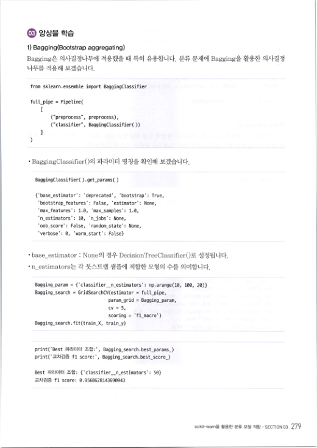
ㅇ 앙상블 학습 1) Bagging(Bootstrap aggregating) Bagging은 의사결정나무에 적용했을 때 특히 유용합니다 . 분류 문제에 Bagging을 활용한 의사결정 나무를 적용해 보겠습니다．

```python
from sklearn.ensemble import BaggingClassifier
```
full_pipe = Pipeline( [ ("preprocess", preprocess), ("classifier", BaggingClassifier( ))

- BaggingClassifier(）의 파라미터 명칭을 확인해 보겠습니다．
BaggingClassifier( ) .get_params( ) {'base_estimator ' : 'deprecated', ' bootstrap ' : True, 'bootstrap_features ' : False, ' estimator ' : None, 'max_features' : 1.0, max_samples ' : 1.0, 'n_estimators ' : 10, 'n_jobs ': None, 'oob_score ' : False, 'random_state': None, 'verbose ' : 0, 'warm_start ' : False}

- base estimator : None의 경우 DecisionTreeClassifier(）로 설정됩니다． 
- n estimators는 각 붓스트랩 샘플에 적합한 모형의 수를 의미합니다．
```python
Bagging_param = {'classifier__n_estimators': np.arange(10, 100, 20)}
Bagging_search = GridSearchCV(estimator = full_pipe,
param_grid = Bagging_param,
cv = 5, 
scoring = 'fl_macro')
```
Bagging_search. fit (train_X, train_y)

```python
print('Best 파라미터 조합： ', Bagging_sea rch.bestJ)arams_) 
print(' 교F검증 fi score: ', Bagging_search.best_score_)
```
Best 파라미터 조합： { 'classifier__n_estimators ' : 5아 교차검증 fi score: 0.9568628143690943 scikit-learn율 활용한 분류 모델 적합 · SECTION 03 279

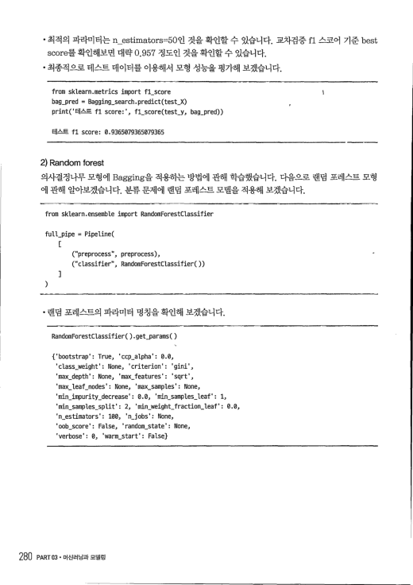
- 최적의 파라미터는 n-estimators=50인 것을 확인할 수 있습니다 . 교차검증 fi 스코어 기준 best 
score를 확인해보면 대략 0.957 정도인 것을 확인할 수 있습니다．

- 최종적으로 테스트 데이터를 이용해서 모형 성능을 평가해 보겠습니다．
```python
from skl.earn.metrics import fl_score
```
,

```python
bag_pred = Bagging_search.predict(test_X) 
print(' 테스트 fi score:', fl_score(test_y, bag_pred))
```
테스트 fi score: 0.9365079365079365 2) Random forest 의사결정나무 모형에 Bagging을 적용하는 방법에 관해 학습했습니다 . 다음으로 랜덤 포레스트 모형 에 관해 알아보겠습니다 . 분류 문제에 랜덤 포레스트 모델을 적용해 보겠습니다．

```python
from sklearn . ensemble import RandomForestClassifier
full_pipe = Pipeline(
```
[ ("preprocess", preprocess), ("classifier", RandomForestCLassifierO) 〕

- 랜덤 포레스트의 파라미터 명칭을 확인해 보겠습니다．
RandomForestClassifier( ) .get_params() {'bootstrap': True, 'ccp_aLpha': 0.0, 'class_weight': None, 'criterion' : 'gini', 'max_depth' : None, 'max_features': 'sqrt', 'max_leaf_nodes': None, 'max_samples' : None, 'mmn_impurity_decrease': 0.0, 'mmn_samples_leaf': 1, 'min_samples_spl.it ': 2, 'mmn_weight_fraction_leaf' : 0.0, 'n_estimators': 100, 'n_jobs': None, 'oob_score': False, 'random_state' : None, 'verbose': 0, 'warm_start' : False} 280 PART03．머신러닝과모델링

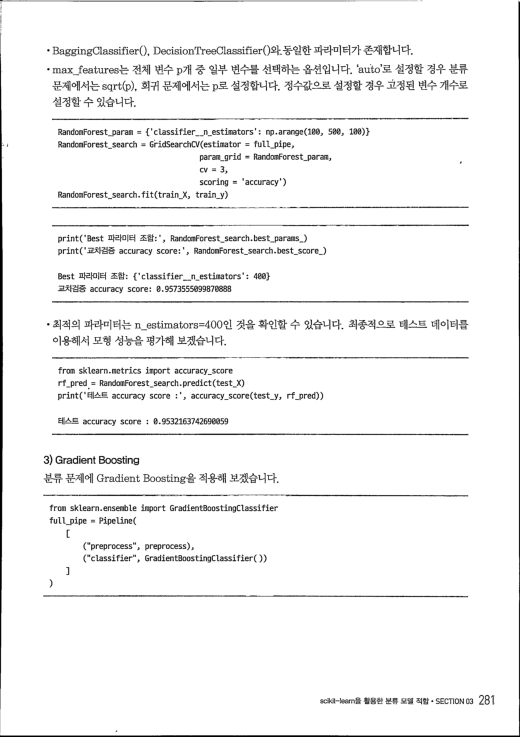
- BaggingClassifierO, DecisionTreeClassifier(）와＝동일한파라미터가존재합니다．
- max_features는 전쳬 변수 p개 중 일부 변수를 선택하는 옵션입니다 . 'auto ' 로 설정할 경우 분류
문제에서는sqrt(p) , 화귀 문제에서는p로 설정합니다 . 정수값으로 설정할 경우코정된 변수 개수로 설정할 수 있습니다．

```python
RandomForest_param = {'classifier__n_estimators': np.arange(100, 500, 100)}
RandomForest_search = GridSearchCV(estimator = fufl_pipe,
param_grid = RandomForest_param,
cv = 3, 
scoring = 'accuracy')
```
RandornForest_search. fit (train_X, train_y)

```python
print('Best 파라미터 조합＝ ', RandomForest_search.best_params_) 
print(' 교차검증 accuracy score:', RandomForest_search.best_score_)
```
Best 파라미터 조합＝ {' classifier__n_estimators': 400} 교차검증 accuracy score: 0.9573555099870888

- 최적의 파라미터는 n_estimators=400인 것을 확인할 수 있습니다 . 최종적으로 데스트 데이터를
이용해서 모형 성능을 평가해 보겠습니다．

```python
from sklearn.metrics import accuracy_score 
rf_pred = RandomForest_sea.rch . predict(test_X) 
print(' 테스트 accuracy score :', accuracy_score(test_y, rf_pred))
```
테스트 accuracy score : 0.9532163742690059 3) Gradient Boosting 분류 문제에 Gradient Boosting을 적용해 보겠습니다．

```python
from sklearn.ensemble import GradientBoostingCtassifier 
full_pipe = Pipeline( 
[ 
("preprocess", preprocess), 
("classifier", GradientBoostingClassifierQ)
```
scikit-learn을활용한분류모델적합．SECTION 03 281

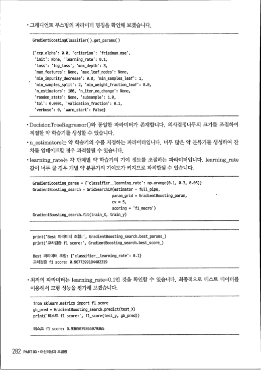
- 그래디언트 부스팅의 파라미터 명칭을 확인해 보겠습니다．
GradientBoostingCl.assifier( ) .get_paranis() {'ccp_alpha': 0.0, 'criterion': 'friedman_mse', 'mnit': None, 'Learning_rate': 0.1, 'l.oss' : 'log_loss', 'max_depth' : 3, 'max_features': None, 'max_leaf_nodes' : None, 'min_impurity_decrease': 0.0, 'min_sampl.es_leaf': 1, 'min_samples_spUt' : 2, 'min_weight_fraction_l.eaf' : 0.0, 'n_estimators' : 100, 'n_iter_no_change': None, 'random_state': None, 'subsample': 1.0, 'tol': 0.0001, 'validation_fraction' : 0.1, 'verbose': 0, 'warm_start': False}

- DecisionTreeRegressor(）와 동일한 파라미터가 존재합니다 . 의사결정나무의 크기를 조절하여
적절한 약 학습기를 생성할 수 있습니다．

- n_estimators는 약 학습기의 수를 지정하는 파라미터입니다 . 너무 많은 약 분류기를 생성하여 잔
차를 업데이트할 경우 과적합될 수 있습니다．

- learning_rate는 각 단계별 약 학습기의 기여 정도를 조절하는 파라미터입니다 . learning_rate
값이 너무 클 경우 개별 약 분류기의 기여도가 커지므로 과적합될 수 있습니다．

```python
GradientBoosting_param = {'classifier__learning_rate': np.arange(0.1, 0.3, 0.05)}
GradientBoosting_search = GridSearchCV(estimator = full_pipe,
param_grid = GradientBoosting_param, 
cv = 5, 
scoring = 'fl_macro') 
GradientBoosting_search . fit (train_X, train_y)
print(' Best 파라미터 조합： ', GradientBoosting_search. best_params_) 
print(' 교차검증 fl score: ', GradientBoosting_search.best_score_)
```
Best 파라미터 조합： {'classifier__learning_rate': 0.I} 교차검증 fl score: 0.9677399184402319

- 최적의 파라미터는 learning_rate=0. 1인 것을 확인할 수 있습니다 . 최종적으로 테스트 데이터를
이용해서 모형 성능을 평가해 보겠습니다．

```python
from sklearn.metrics import fl_score
gb_pred = GradientBoosting_search . predict(test_X) 
print(' 테스트 fi score:', fl_score(test_y, gb_pred))
```
테스트 fl score: 0.9365079365079365 282 PART 03｀머신러닝과모델링

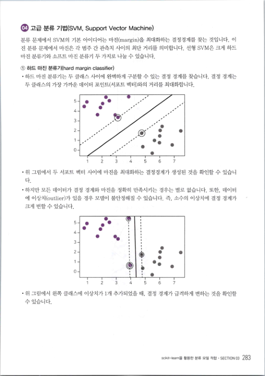
.고급 분류 기법（SVM, Support Vector Machine) 분류 문제에서 SVM의 기본 아이디어는 마진（margin）을 최대화하는 결정경계를 찾는 것입니다 . 이 진 분류 문제에서 마진은 각 범주 간 관측치 사이의 최단 거리를 의미합니다 . 선형 SVM은 크게 하드 마진 분류기와 소프트 마진 분류기 두 가지로 나눌 수 있습니다． ① 하드 마진 분류기이ard margin classifier)

- 하드 마진 분류기는 두 클래스 사이에 완벽하게 구분할 수 있는 결정 경계를 찾습니다 . 결정 경계는 
두 클래스의 가장 가까운 데이터 포인트（서포트 벡터）와의 거리를 최대화합니다． 4 5 6 7

- 위 그림에서 두 서포트 벡터 사이에 마진을 최대화하는 결정경계가 생성된 것을 확인할 수 있습니
다．

- 하지만 모든 데이터가 결정 경계와 마진을 정확히 만족시키는 경우는 별로 없습니다 . 또한 , 데이터
에 이상치（outlier）가 있을 경우 모델이 불안정해질 수 있습니다 . 즉 , 소수의 이상치에 결정 경계가 크게 변할 수 있습니다．

# ' 
S .

5 4 3 .

;2 ● ● ● ● 參 ； 놉 ： , 1

## 0
● 0 1 2 3 4 5 6 7

- 위 그림에서 왼쪽 클래스에 이상치가 1개 추가되었을 때 , 결정 경계가 급격하게 변하는 것을 확인할 
수 있습니다． scikit-learn을활용한분류모델적합＊SECTION 03 283

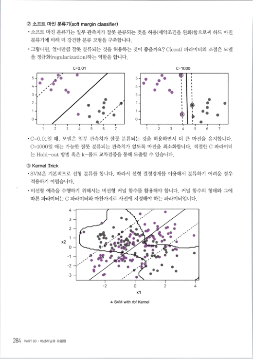
② 소프트 마진 분류기（soft margin classifier)

- 소프트 마진 분류기는 일부 관측치가 잘못 분류되는 것을 허용（제약조건을 완화）함으로써 하드 마진
분류기에 비해 더 강건한 분류 모형을 구축합니다．

- 그렇다면 , 얼마만큼 잘못 분류되는 것을 허용하는 것이 좋을까요？ C (cost) 파라미터의 조절은 모델 
을 騙予화＜regularization）하는 역할을 합니다．

```python
c=o.01
c=1000
```
q) 5 蠟 춈 S.

- ＊
- 
4 3 .S 2 S ㅓ 仕》 S ● ● ● 0 겸 I I I I I I 1 2 3 4 5 6 7 l I I I I I I 1 2 3 4 5 6 7

```python
·C=O .01일 때 , 모델은 일부 관측치가 잘못 분류되는 것을 허용하면서 더 큰 마진을 유지합니다． 
C=1000일 때는 가능한 잘못 분류되는 관측치가 없도록 마진을 최소화합니다 . 적절한 C 파라미터 
는 Hold-out 방법 혹은 k－폴드 교차검증을 통해 도출할 수 있습니다．
```
③ Kernel Trick

- SVM은 기본적으로 선형 분류를 합니다 . 따라서 선형 결정경계를 이용해서 분류하기 어려운 경우
적용하기 어렵습니다． '

- 비선형 예측을 수행하기 위해서는 비선형 커널 함수를 활용해야 합니다 . 커널 함수의 형태와 그에
따른 파라미터는 C 파라미터와 마찬가지로 사전에 지정해야 하는 파라미터 입니다． ●

### r
너

- 
2 -2 。

xl 4 A SVM with rbf Kernel 284 PART 03．머신러닝과모델링

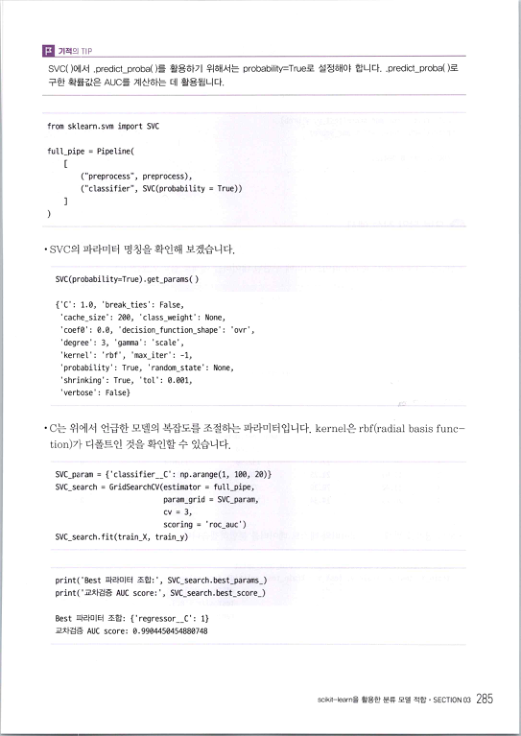
기적의 지p Svc( ）에서 . predict_proba( ）를 활용하기 위해서는 probability=True로 설정해야 합니다 . .predict_proba( ）로 구한 확률값은 AUC를 계산하는 데 활용됩니다．

```python
from sklearn.svm import SVC
```
full_pipe = Pipeline( [ ('preprocess", preprocess), ("classifier", SVC(probability = True)) .sv(의 파라미터 명칭을 확인해 보겠습니다． SVC(probability=True) .get_params( ) {'C' : 1.0, ' break_ties ' : False, 'cache_size' : 200, 'class_weight ' : None, 'coefO ' : 0.0, 'decision_function_shape' : 'ovr', 'degree' : 3, 'gamma ' : 'scale', 'kernel' : ' rbf ', 'max_iter ' : -1, 'probability ' : True, 'random_state ' : None, 'shrinking ' : True, 'tol' : 0.001, 'verbose' : False}

- c는 위에서 언급한 모델의 복잡도를 조절하는 파라미터 입니다 . kernel은 rbf (radial basis func-
tion）가 디폴트인 것을 확인할 수 있습니다．

```python
SVC_param = {'classifier__C' : np.arange(1, 100, 20)}
SVC_search = GridSearchCV(estimator = full_pipe,
param_grid = SVC_param,
cv = 3, 
scoring = 'roc_auc')
```
SVC_search. fit (train_X, train_y)

```python
print('Best 파라미터 조합： ', Svqsearch. best_params_) 
print(' 교차검증 AUC score: ', SVC_search.best_score_)
```
Best 파라미터 조합： { ' regressor__C' : 1} 교차검증 AUC score: 0.9904450454880748 scikit-learn을 활용한 분류 모델 적합 · SEC지0N03 285

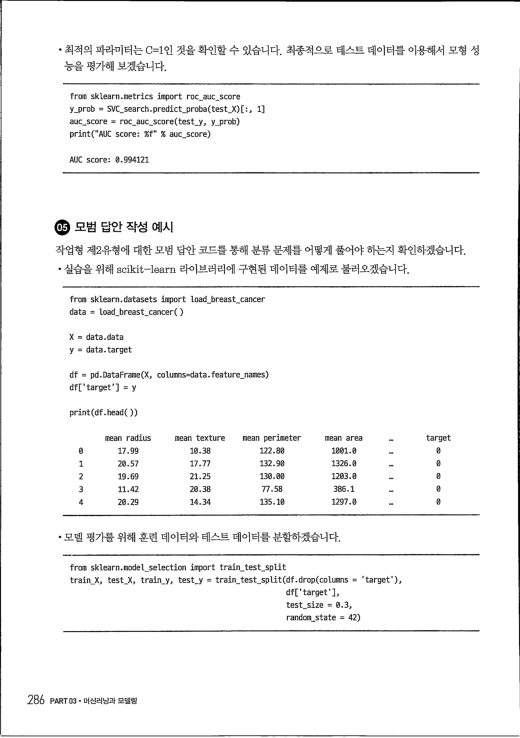
- 최적의 파라미터는 0=1인 것을 확인할 수 있습니다 . 최종적으로 데스트 데이터를 이용해서 모형 성
능을 평가해 보겠습니다．

```python
from sklearn.metrics import roc_auc_score
y_prob = SVC_search.predict_proba(test_X)[:, 1] 
auc_score = roc_auc_score(test_y, y_prob) 
print('AIJC score: %f" % auc_score)
```
AIJC score: 0.994121 .

모범 답안 작성 예시 작업형 제2유형에 대한 모범 답안 코드를 통해 분류 문제를 어떻게 풀어야 하는지 확인하겠습니다．

- 실습을 위해 scikit-learn 라이브러리에 구현된 데이터를 예제로 불러오겠습니다．
```python
from skl.earn.datasets import load_breast_cancer
data = 1.oad_breast_cancer()
X = data.data
y = data.target
df = pd.DataFrame(X, col.umns=data.feature_names) 
df['target'] = y
print(df.head())
```
mean radius mean texture mean perimeter mean area target 0 17.99 10.38 122.80 1001.0 0 1 20.57 17.77 132.90 1326.0 0 2 19.69 21.25 130.00 1203.0 0 3 11.42 20.38 77.58 386.1 0 4 20.29 14.34 135.10 1297.0 0

- 모델 평가를 위해 훈련 데이터와 테스트 데이터를 분할하겠습니다．
```python
from sklearn.model_selection import train_test_split 
train_X, test_X, train_y, test_y = train_test_split(df.drop(columns = ' target'), 
df['target '] , 
test_size = 0.3,
random_state = 42)
```
286 PART 03．머신러닝과모델링

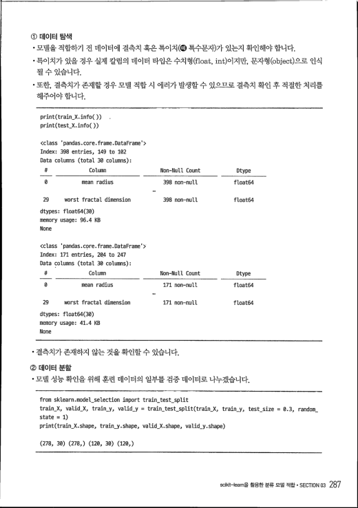
① 데이터 탐색

- 모델을 적합하기 전 데이터에 결측치 혹은 특이치（.I 특수문자）가 있는지 확인해야 합니다．
- 특이치가 있을 경우 실제 칼럼의 데이터 타입은수치형（float, lIlt）이지만 , 문자형（object）으로 인식
될 수 있습니다．

- 또한 , 결측치가 존재할 경우 모델 적합 시 에러가 발생할 수 있으므로 결측치 확인 후 적절한 처리를
해주어야합니다．

```python
print(train_X.infoO) 
. 
print(test_X.info() )
```
<class 'pandas. core. frame. DataFrame 5 Index: 398 entries, 149 to 102 Data columns (total 30 columns):

# 
Column Non-Null Count Dtype 0 mean radius 398 non-null f1oat64 29 worst fractal dimension 398 non-null f1oat64 dtypes: f10at64(30) memory usage: 96.4 KB None <class 'pandas.core. frame.DataFrame'> Index: 171 entries, 20.4 to 247 Data columns (total 30 columns):

# 
Column Non-Null Count Dtype 0 mean radius 171 non-null f1oat64 29 worst fractal dimension 171 non-null f10at64 dtypes: f1oat64(30) memory usage: 41.4 KB 予柏ne

- 결측치가 존재하지 않는 것을 확인할 수 있습니다．
② 데이터 분할

- 모델 성능 확인을 위해 훈린 데이터의 일부를 검증 데이터로 나누겠습니다．
```python
from sklearn .model_selection import train_test_split 
train_X, valid_X, train_y, valid_y = train_test_split(train_X, train_y, test_size = 0.3, random_ 
state = 1) 
print(train_X.shape, train_y.shape, valid_X.shape, valid_y.shape)
```
(278, 30) (278,) (120, 30) (120,) scikit-learn을활용한분류모델적합· SECTION 33 287

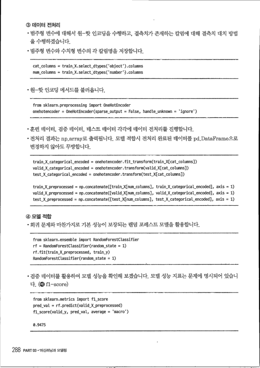
③ 데이터 전처리

- 범주형 변수에 대해서 ' 원－핫 인코딩을 수행하고 , 결측치가 존재하는 칼럼에 대해 결측치 대치 방법 
을 수행하겠습니다．

- 범주형 변수와수치형 변수의 각 칼럼명을 저장합니다．
```python
cat_columns = train_X.select_dtypes('object') ..columns
num_columns = train_X. select- dtypes( 'number ') .columns
```
- 원－핫 인코딩 메서드를 불러옵니다．
```python
from sklearn. preprocessing import OneHotEncoder
onehotencoder = OneHotEncoder(sparse_output = False, handle_unknown = 'ignore')
```
- 훈런 데이터 , 검증데이터 , 테스트데이터 각각에 데이터 전처리를진행합니다．
- 전처리 결과는 np.array로 출력됩니다 . 모델 적합시 전처리 완료된 데이터를 pd. DataFrame으로
변경하지 않아도 무방합니다．

```python
train_X_categorical_encoded = onehotencader. fit_transform(train_XEcat_columnsl) 
valid_X_categorical_encoded = onehotencoder.transform(valid_X[cat_columns]) 
test_X_categorical_encoded = onehotencoder. transform(test_X[cat_columns])
train_X_preprocessed = np . concatenate([train_X[num_columns], train_X_categorical_encodedj, axis = 1) 
valid_X_preprocessed = np . concatenate([valid_X[nurn_columns], valid_X_categorical_encodedl, axis = 1) 
test_X_preprocessed = np.concatenate(ftest_X[num_columns], test_X_categorical_encoded], axis = 1)
```
④ 모델 적합

- 회귀 문제와 마찬가지로 기본 성능이 보장되는 랜덤 포레스트 모델을 활용합니다．
```python
from sklearn.ensemble import RandomForestClassifier 
rf = RandomForestClassifier(random_state = 1) 
rf. fit (train_X_preprocessed, train_y) 
RandomForestClassifier(random_state = 1)
```
- 검증 데이터를 활용하여 모델 성능을 확인해 보겠습니다 . 모델 성능 지표는 문제에 명시되어 있습니
다 . ( fl- score)

```python
from sklearn.metrics import fl_score
pred_val = rf . predict (valid_X_preprocessed) 
fl_score(valid_y, pred_val, average = 'macro')
```
0.9475 288 PART03 '，머신러닝과모델링

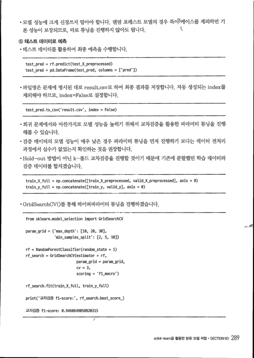
- 모델 성능에 크게 신경쓰지 말아야 합니다 . 랜덤 포레스트 모델의 경우특ㅇ죤케이스를 제외하면 기
본성능이 보장되므로 , 따로튜닝을진행하지，않아도됩니다 .

` ⑤ 테스트 데이터로 예측

- 테스트 데이터를 활용하여 최종 예측을 수행합니다．
```python
test_pred = rf. predict(test_X_preprocessed) 
test_pred = pd.DataFrame(test_pred, columns = ['pred'] )
```
- 파일명은 문제에 명시된 대로 result: csv로 하여 최종 결과를 저장합니다 . 자동 생성되는 index를
제외해야하므로 , index=Faise로설정합니다． test_pred.to_csv('result.csv', index = False)

- 회귀 문제에서와 마찬가지로 모델 성능을 높히기 위해서 교차검증을 활용한 파라미터 튜닝을 진행，
해볼 수 있습니다．

- 검증 데이터의 모델 성능이 매우 낮은 경우 파라미터 튜닝을 먼저 진행하기 보다는 데이터 전처리
과정에서 실수가 없었는지 확인하는 것을 권장합니다．

- Hold-out 방법이 아닌 k－폴드 교차검증을 진행할 것이기 때문에 기존에 분할했던 학습 데이터와
검증 데이터를 합치겠습니다．

```python
train_X-full. = np.concatenate([train_X_preprocessed, val.id_X_preprocessed], axis = 0) 
train_y_fuU = np.concatenate([ train_y, valid_y], axis = 0)
```
- GridSearchCV(）를 통해 하이퍼파라미터 튜닝을 진행하겠습니다．
```python
from skl.earn.model_selection import GridSearchCV
```
．볍二 . 옆Il孝． para.rn_grid = {'max_depth': 110, 20, 30], 'mmn_samples_split': [2, 5, 10]}

```python
rf = RandomForestClassifier(random_state = 1) 
rf_search = GridSearchCV(estimator = rf,
param_grid = param_grid, 
cv = 3, 
scoring = 'fl_macro')
```
rf_search . fit (train_X_ful.l, train_y_full)

```python
print('EF검증 fl- score:', rf_search.best_score_)
```
교차검증 fl- score: 0.9460649058820315 scikit-learn을활용한분류모델적합· SECTION 03 289

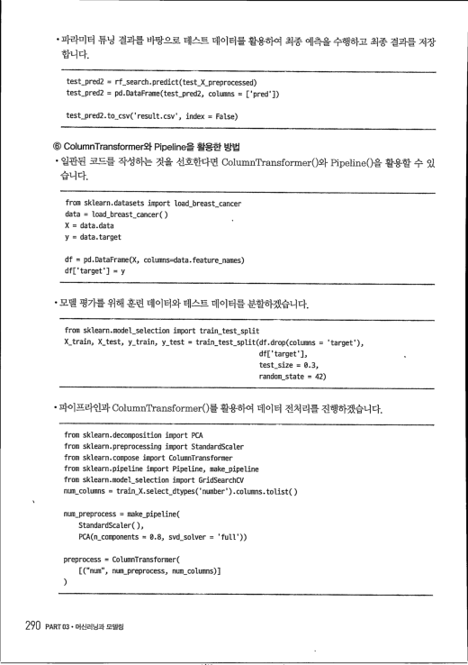
' 파라미터 튜닝 결과를 바탕으로 테스트 데이터를 활용하여 최종 예측을 수행하고 최종 결과를 저장 합니다．

```python
test_pred2 = rf_search.predict(test_X_preprocessed) 
test_pred2 = pd.DataFrame(test_pred2, columns · ['pred 'J)
```
test_pred2.to-csv(' result.csv ', index = False) ⑥ColumnTransformer와 Pipeline을 활용한 방법 ' 일관된 코드를 작성하는 것을 선호한다면 ColumnTransformer(）와 Pipeline(）을 활용할 수 있 습니다．

```python
from sklearn.datasets import load_breast_cancer 
data = load_breast_cancer()
X = data.data
y = data.target
df = pd.DataFrame(X, columns=data.feature_names) 
df[ 'target '] = y
```
' 모델 평가를 위해 훈련 데이터와 데스트 데이터를 분할하겠습니다．

```python
from sklearn.model_selection import train_test_split
X_train, X_test, y_train, y_test = train_test_spLit(df.drop(columns = 'targets), 
df{'target'] , 
test_size = 0.3,
random_state = 42)
```
' 파이프라인과 ColumnTransformer(）를 활용하여 데이터 전처리를 진행하겠습니다．

```python
from skLearn.decomposition import PCA 
from sklearn.preprocessing import StandardScaler 
from sklearn.compose import ColumnTransformer 
from sklearn.pipeline import Pipeline, make_pipeline 
from skl.earn.model_selection import GridSearchCV
num_columns = train_X.sel.ect_dtypes( 'number') .columns.tolist()
nurn_preprocess = niake_pipeline( 
StandardScaler() ,
```
PCA(n_components = 0.8, svd_solver = 'full '))

```python
preprocess = Columnlransformer( 
[( "num", num_preprocess, num_columns)J 
)
```
290 PART 03．머신러닝과모델링

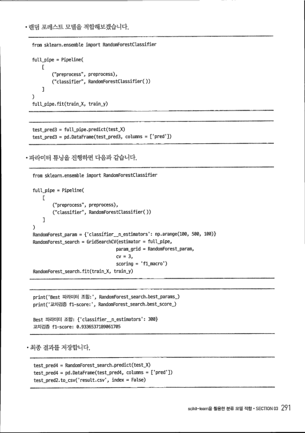
- 랜덤 포레스트 모델을 적합해보겠습니다．
```python
from sklearn. ensemble import RandomForestClassifier
```
full_pipe = Pipellne( [ ("preprocess", preprocess), ("classifier", RandomForestClassifierO) full_pipe. fit (train_X, train_y)

```python
test_pred3 = full_pipe.predict(test_X) 
test_pred3 = pd.DataFrame(test_pred3, columns = ['pred'])
```
- 파라미터 튜닝을 진행하면 다음과 같습니다．
```python
from sklearn. ensemble import RandomForestClassifier
```
full_pipe = Pipeline( [ ("preprocess", preprocess), ("classifier", RandomForestClassifierO) ]

```python
RandomForest_param = {'classifier__n_estimators': np.arange(l@B, 500, 100)}
RandomForest_search = GridSearchCV(estimator = full_pipe,
```
param_grid 볍 RandomForest_param,

```python
cv = 3, 
scoring = 'fl_macro')
```
RandomForest_search. fit (train_X, train_y)

```python
print('Best 파라미터 조합： ', RandomForest_search.best_params_) 
print(' 교F검증 f1-score:', RandomForest_search.best_score_)
```
Best 파라미터 조합＝ {'classifier__n_estimators': 300} 교차검증 f1-score: 0.9336537189061705

- 최종 결과를 저장합니다．
```python
test_pred4 = RandomForest_search. predict (test_X) 
test_pred4 = pd.DataFrame(test_pred4, columns = ['pred']) 
test_pred2.to_csv('resul.t.csv', index = False)
```
scikit-learn을활용한분류모델적합．SECTION 03 291

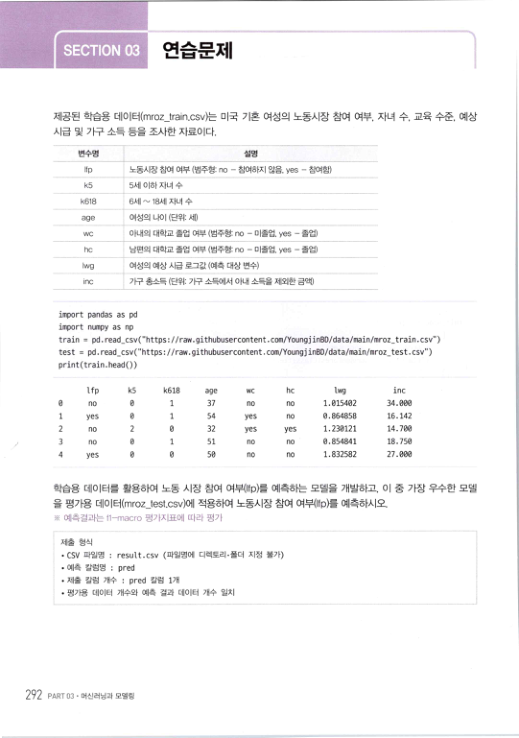
## 연습문제
제공된 학습용 데이터（mroz_train.csv）는 미국 기혼 여성의 노동시장 참여 여부 , 자녀 수 , 교육 수준 , 예상 시급 및 가구 소득 등을 조사한 자료이다． 변수명 설명 If p 노동시장 참여 여부 （범주형： no 참여하지 않음 , yes - 참여함） k5 5세 이하 자녀 수 k618 6세 ∼ 18세 재ㅢ 수 age 여성의 나이 （단위： 세） wc 아내의 대학교 졸업 여부 （범주형： no 미졸업 , yes - 졸업） hc 남편의 대학교 졸업 여부 （범주형： no 미졸업 . yes - 졸업） Iwg 여성의 예상 시급 로그값 （예측 대상 변수） mC 가구 총소득 （단위： 가구 소득에서 아내 소득을 제외한 금액）

```python
import pandas as pd 
import numpy as np 
train = pd. read_csv("https://raw.githubusercontent.com/YoungjinBD/data/main/mroz_train.csv ') 
test = pd.read_csv( 'https://raw.githubusercontent.com/YoungjinBD/data/main/mroz_test.csv ") 
print(train.head())
```
lfp k5 k618 age wc hc lwg inc 0 no 0 1 37 no no 1.015402 34.000 1 yes 0 1 54 yes no 0.864858 16.142 2 no 2 0 32 yes yes 1.230121 14.700 3 no 0 1 51 no no 0.854841 18.750 4 yes 0 0 50 no no 1.832582 27.000 학습용 데이터를 활용하여 노동 시장 참여 여부盼〕 ）를 예측하는 모델을 개발하고 , 이 중 가장 우수한 모델 을 평가용 데이터（mroz_test.csv）에 적용하여 노동시장 참여 여부ㅇfp）를 예측하시오． ※ 예측결과는 fl-macro 평가지표에 따라 평가 제출 형식

- csv 파일명 : result. csv （파일명에 디렉토리·폴더 지정 불가）
- 예측 칼럼명 : pred 
- 제출 칼럼 개수 : pred 칼럼 1개
- 평가용 데이터 개수와 예측 결과 데이터 개수 일치
292 PART03 . 머신러닝과 모델링

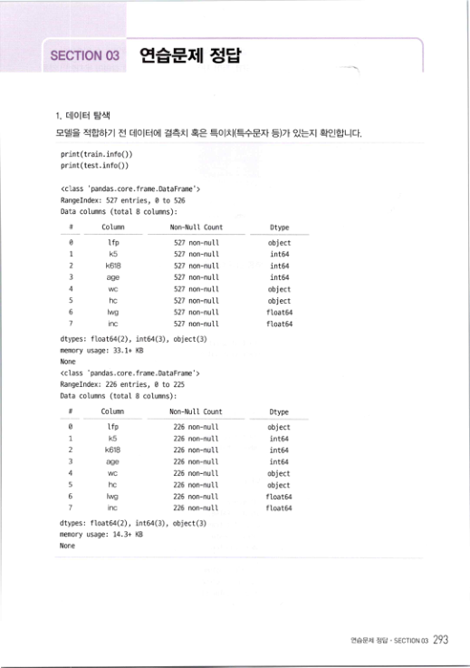
## SECTION 03 
연습문제 정답 1 . 데이터 탐색 모델을 적합하기 전 데이터에 결측치 혹은 특이치（특수문자 등）가 있는지 확인합니다．

```python
print(train.infoQ) 
print(test .infoO)
```
<cLass ' pandas. core.frame.DataFrame' > Rangelndex: 527 entries, 0 to 526 Data columns (total 8 columns):

# 
Column Non-Null Count Dtype 3 lfp 527 non-null object 1 k5 527 non-null int64 2 k618 527 non-null int64 :3 age 527 non-null int64 4 wc 527 non-null object 5 hc 527 non-null object 6 lwg 527 non-null float64 7 inc 527 non-null f1oat64 dtypes: f10at64(2), int64(3), object(3) memory usage: 33.1+ KB None <class ' pandas.core.frame.DataFrame' > Rangelndex: 226 entries, 0 to 225 Data columns (total 8 columns):

# 
Column Non-Null Count Dtype 0 lfp 226 non-null object :1 k5 226 non-null 1nt64 2 k618 226 non-null int64 3 age 226 non-null int64 4 wc 226 non-null object 5 hc 226 non-null object 6 Iwg 226 non-null float64 7 inc 226 non-null float64 dtypes: f1oat64(2), int64(3), object(3) memory usage: 14.3+ KB None 연습문제 정답 · SECTION 03 293

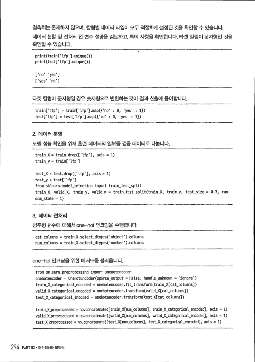
결측치는 존재하지 않으며 , 칼럼별 데이터 타입이 모두 적절하게 설정된 것을 확인할 수 있습니다． 데이터 분할 및 전처리 전 변수 설명을 검토하고 , 특이 사항을 확인합니다 . 타겟 칼럼이 문자형인 것을 확인할 수 있습니다，

```python
print(train[' l.fp ' ] .uniqueQ) 
print(test{ ' 1.fp ' I. uniqueQ.)
```
E'no' 'yes '] ['yes " no '] 타겟 칼럼이 문자형일 경우 숫자형으로 변환하는 것이 결과 산출에 용이합니다． train['Lfp'] = train[ 'lfp'] ,map({'no ' : 0, ' yes ' = 1}) test{'l.fp '] = test['lfp '] .map({ 'no ' : 0, ' yes' : i] ) 2 . 데이터 분할 모델 성능 확인을 위해 훈련 데이터의 일부를 검증 데이터로 나눕니다．

```python
train_X = train.drop(['l.fp'], axis = 1) 
train_y = train['lfp 'j
test_X 볍 test.drop([ '1.fp '], axis = 1) 
test_y = test[ 'lfp'I 
from sklearn.model._selection import train_test_split 
train_X, valid_X, train_y, vaUd_y = train_test_split(train_X,
dom_state = 1) 
train_y, test_size = 0.3, ran-
```
3 . 데이터 전처리 범주형 변수에 대해서 one낙lot 인코딩을 수행합니다．

```python
cat_columns = train-X.select_dtypes('object').columns
num_columns = train_X. select_dtypes( ' number ' ) .columns
```
one-hot 인코딩을 위한 메서드를 불러옵니다．

```python
from sklearn.preprocessing import OneHotEncoder
onehotencoder = OneHotEncoder(sparse.output = False, handle_unknown = 'ignore ') 
train_X_categorical_encoded = onehotencoder. fit. transform(train_X[cat_columnsj) 
valid_X_categorical._encoded = onehotencoder. transform(val.id_X{cat_col.umns]) 
test_X_categorical_encoded = onehotencoder . transforin(test_X[cat_col.umns])
train_X_preprocessed = np.concatenate([train_X[num_col.umns], train_X_categorical_encoded], axis = 1)
valid_X_preprocessed = np.concatenate([valid_Xfnum_columnsl, vatid_X_categorical_encoded], axis = 1) 
test_X_preprocessed = np.concatenate({test_X[num_columnsj, test_X_categorical._encoded], axis = 1)
```
294 PART 03．머신러닝과모델링

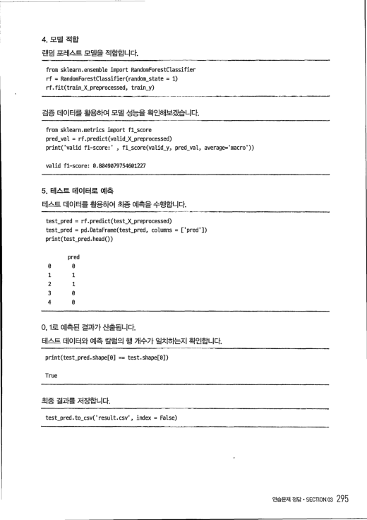
4 . 모델 적합 랜덤 포레스트 모델을 적합합니다．

```python
from sklearn.ensemble import RandomForestCLassifier 
rf = RandomForestClassifier(random_state = 1) 
rf. fit (train_X_preprocessed, train_y)
```
검증 데이터를 활용하여 모델 성능을 확인해보겠습니다．

```python
from sklearn.metrics import fl_score 
pred_val. = rf . predict(valid_X_preprocessed) 
print('valid fl- score: ' , fl_score(valid_y, pred_val, average='niacro'))
```
valid fl-score: 0.8049079754601227 5 . 테스트 데이터로 예측 테스트 데이터를 활용하여 최종 예측을 수행합니다．

```python
test_pred = rf. predict (test_X_preprocessed) 
test_pred = pd.DataFrame(test_pred, columns = ['pred'J) 
print(test_pred . head 0)
```
pred 0 0 1 1 2 1 3 0 4 0

0. 1로 예측된 결과가 산출됩니다．
테스트 데이터와 예측 칼럼의 행 개수가 일치하는지 확인합니다．

```python
print(test_pred.shape{OJ == test.shape[0])
```
True 최종 결과를 저창합니다． test_pred.to_csv('result.csv', index = False) 연습문제정답．SECTIQ('L03 295

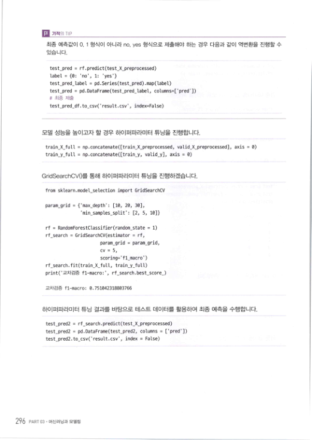
【헴 기적의 뀌P 최종 예측값이 0. 1 형식이 아니라 no, yes 형식으로 제출해야 하는 경우 다음과 같이 역변환을 진행할 수 있습니다．

```python
test_pred = rf.predict(test_X_preprocessed) 
labe' = {0: ' no' , 1: 'yes'} 
test_pred_label = pd.Series(test_pred) .map(1.abel) 
test_pred = pd.DataFrame(test_predjabel., columns=[ 'pred 1) 
# 최종 제출 
test_pred_df.to_csv(' result.csv', index=False)
```
모델 성능을 높이고자 할 경우 하이퍼파라미터 튜닝을 진행합니다． train_X_full. = np.concatenate([train_X_preprocessed, valid_X_preprocessed], axis = 0) train_y_full. = np.concatenate([train_y, valid_y], axis = 0) GridSearchCV(）를 통해 하이퍼파라미터 튜닝을 진행하겠습니다．

```python
from sklearn.model_selection import GridSearchCV
param_grid = {'max_depth' : [10, 20, 30],
```
'mmn_ nsamples_split' : [2, 5, 10]}

```python
rf = RandomForestclassifier(random_state = 1) 
rf_search = GridSearchCV(estimator = rf,
param_grid = param_grid,
cv = 5, 
scoring='fl_macro') 
rf_search. fit (train_X_fuU, train_y_full) 
print('교F검증 fl- macro: ', rf_search.best_score_)
```
교차검증 fl-macro: 0.751042318803766 하이퍼파라미터 튜닝 결과를 바탕으로 테스트 데이터를 활용하여 최종 예측을 수행합니다．

```python
test_pred2 = rf_search.predict(test-X-preprocessed) 
test_pred2 = pd.DataFrame(test_pred2, columns = ['pred'] ) 
test_pred2.to-csv('result.csv' , index = False)
```
296 PART 03 · 머신러닝과 모델링


# sci kit-learn을 활용한 
군집분석 수행 SECTION 난 이 핵심 태그 k－평균 군집분석 · 계충적 군집분석 · 군집 유효성 지표 · 실루엣 계수 · 팔꿈치 방법 반복학 r잽 기적의 지P 군집분석은 아직 시험에 출제된 적은 없습니다 . 공부 시간이 부족한 경우 섹션을 건너뛰어도 괜찮습니다． 군집분석（Clustering）은 비지도학습（Unsupervised Learning）의 대표적인 기법으로 , 타깃이 주어 지지 않은 데이터를 유사한 특정을 가진 집단으로 묶는 방법입니다 . 목적은 데이터 속에 숨어 있는 구 조나 패턴을 발견하는 데 있습니다． 군집분석을 활용하면 복잡한 데이터를 단순화해 이해하기 쉽게 만들 수 있으며 , 집단 단위의 분석 결 과를 기반으로 효율적인 의사결정을 지원할 수 있습니다 . 이러한 특성 덕분에 군집분석은 마케팅 , 고 객 세분화 , 이상치 탐지 등 다양한 분야에서 널리 사용됩니다． 예를 들어 , 백화점 고객 데이터를 군집분적하면 소비 성향에 따라 서로 다른 집단을 구분할 수 있습니 다 . 어떤 고객은 의류 매장을 주로 이용하고 , 다른 고객은 생활용품 매장에서 많이 구매할 수 있습니 다 . 이렇게 구분된 결과를 바탕으로 , 의류 고객에게는 계절별 패션 쿠폰 , 생활용품 고객에게는 대형 세일 소식을 제공하는 식의 맞춤형 마케팅 전략을 세울 수 있습니다 .

결국 , 군집분석은 데이터에 숨어 있는 패턴을 찾아내어 실제 비즈니스 현장에서 활용 가능한 인사이트 를 제공하는 중요한 기법입니다． .

귀입분석 준비 군집분석을 수행하기 전에 데이터 전처리를 적절히 해주는 것이 중요합니다 . 특히 변수의 스케일 차이 와 이상치（outlier）는 군집 알고리즘의 결과에 큰 영향을 줄 수 있기 때문에 , 이를 먼저 처리하는 과정 이 필요합니다． ① 표준화（Standardization)

- 군집분석은 주로 거리 기반 알고리즘을 활용하기 때문에 , 변수의 스케일（범위）에 민감하게 반응합니 
다 . 예를 들어 , 변수 A의 값 범위가 10이고 변수 B의 값 범위가 110,000이라면 , 두 변수를 동시에 사용했을 때 거리 계산에서 변수 B가 지나치게 큰 영향을 주게 됩니다．

- 이러한문제를 해결하기 위해 데이터를 표준화하여 평균을 0 , 표준편차를 1로 맞추는 과정을 거칩니 
다 . 이를 통해 각 변수가 균형 있게 거리 계산에 반영될 수 있습니다． scikit-learn을 활용한 군집분석 수행 ◆ SECTION 04 297

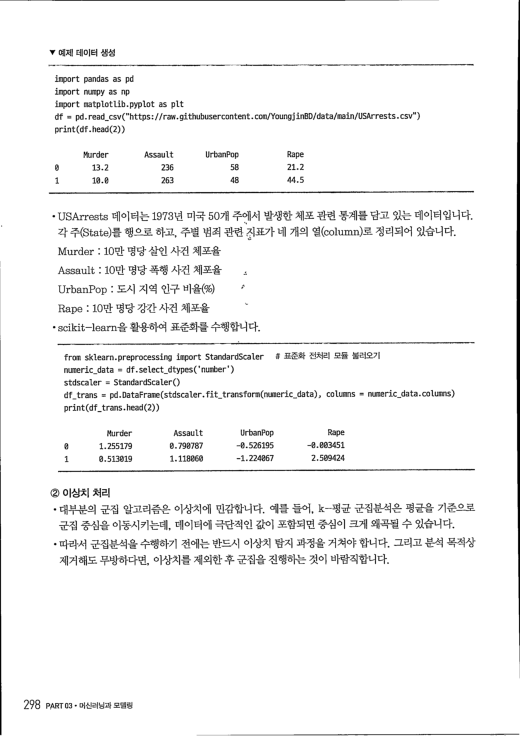
▼ 예제 데이터 생성

```python
import pandas as pd 
import numpy as np 
import matplotlib.pypl.ot as pl.t 
df = pd.read_csv("https://raw.githubusercontent.com/YoungjinBD/data/main/USArre5t5.C5V") 
print(df . head(2))
```
Murder Assau1t UrbanPop Rape 0 13.2 236 58 21.2 1 10.0 263 48 44.5

- USArrests 데이터는 1973년 미국 50개 주에서 발생한 체포 관련 통계를 담고 있는 데이터입니다．
각주（State）를 행으로 하고 , 주별 범죄 관런 친표가 네 개의 열（column）로 정리되어 있습니다． Murder : 10만 명당 살인 사건 쳬포율 Assault :10만 명당 폭행 사건 쳬포율 ． UrbanPop : 도시 지역 인구 비율（勸 " Rape : 10만 명당 강간 사건 쳬포율 '

- scikit-learn을 활용하여 표준화를수행합니다．
```python
from sklearn.preprocessing import StandardScal.er 
# 표준화 전처리 모듈 불러오기
numeric_data = df.se1.ect_dtypes('number ') 
stdscaLer = StandardScaler() 
df_trans = pd. DataFrame(stdscaler. fit_transforrn(numeric_data), cothmns = numeric_data.columns)
print(df_trans . head(2))
```
Murder Assault UrbanPop Rape 0 1.255179 0.790787 -0.526195 -0.003451 1 0.513019 1.118060 -1.224067 2.509424 ② 이상치 처리

- 대부분의 군집 알고리즘은 이상치에 민감합니다 . 예를 들어 , k－평균 군집분석은 평균을 기준으로
군집 중심을 이동시키는데 , 데이터에 극단적인 값이 포함되면 중심이 크게 왜곡될 수 있습니다．

- 따라서 군집분석을 수행하기 전에는 반드시 이상치 탐지 과정을 거쳐야 합니다 . 그리고 분석 목적상
제거해도무방하다면 , 이상치를제외한후군집을진행하는것이 바람직합니다． 298 PART 03· 머신러닝과모델링

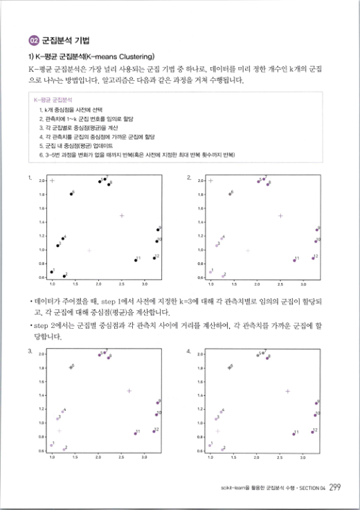
군집분석 기법 1) K－평균 군집분석(K-means Clustering) K－평균 군집분석은 가장 널리 사용되는 군집 기법 중 하나로 , 데이터를 미리 정한 개수인 k개의 군집 으로 나누는 방법입니다 . 알고리즘은 다음과 같은 과정을 거쳐 수행됩니다． K－평균 군집분석

1. k개 중심점을 사전에 선택
2 . 관측치에 1쫘（ 군집 번호를 임의로 할당 3 . 각 군집별로 중심점（평균）을 계산 4 . 각 관측치를 군집의 중심점에 가까운 군집에 할당 5 . 군집 내 중심점（평균） 업데이트

6. 3-5w 과정을 변화가 없을 때까지 반복〈혹은 사전에 지정한 최대 반복 횟수까지 반복）
- 5 ' 7
.8 J》 .

●勺 .6 1 B - 1.6 ㅝ + + 1 2 ..

d0 .3 1.0 '2 냥1 12 0 8 뻐 0.8- 1 ' ●2 0 ` 뻐 06 - ' .

.

1.5 2.0 2.5 1 쟈 1.5 2.0 z5 3.0 '1.0 3.0

- 데이터가 주어졌을 때 , step 1에서 사전에 지정한 k=3에 대해 각 관측치별로 임의의 군집이 할당되 
고 , 각군집에 대해 중심점（평균）을 계산합니다．

- step 2에서는 군집별 중심점과 각 관측치 사이에 거리를 계산하여 , 각 관측치를 가까운 군집에 할
당합니다．

### 3· 2.。- 
r'．욘 4.

.5 乫 1 6 ' 1 6 - .

' 2 一 죠 1 2 .

" dO 4 〕 〕 1.0- 1_0-

- 4 
J2 α8 · 0코 닐 2 1.5 2刀 2.5 3 0 1.0 1.5 z끄 2.5 。

scikit-learn을활용한군집분석수행．SECTION 04 299

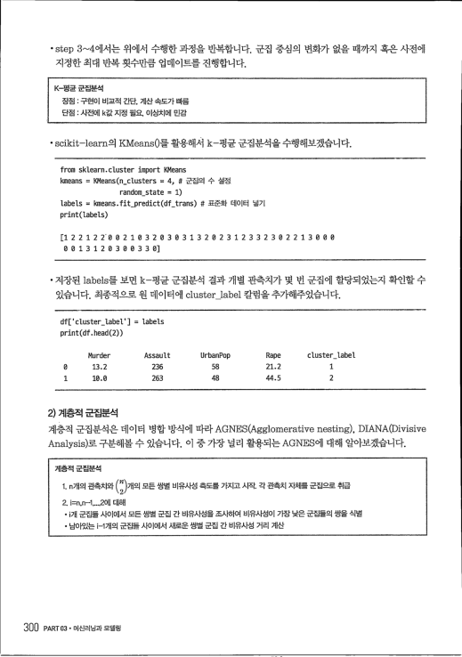
- step 3--4에서는 위에서 수행한 과정을 반복합니다 . 군집 중심의 변화가 없을 때까지 혹은 사전에 
지정한 최대 반복 횟수만큼 업데이트를 진행합니다． K－평균 군집분석 장점 : 구현이 비교적 간단 , 계산 속도가 빠름 단점 : 사전에 k값 지정 필요 이상치에 민감

- scikit-learn의 KMeansO를 활용해서 k－평균 군집분석을 수행해보겠습니다．
```python
from sklearn.cluster import KMeans
knieans = KMeans(n_clusters = 4, # 군집의 수 설정
random_state = 1) 
labels = <means. fit_predict (df_trans) # 표준화 데이터 넣기 
print(labels)
```
[1 2 2 1 2 2 "0 0 2 1 0 32 0 3 0 3 1 3 2 0 2 3 1 2 3 3 2 3 0 2 2 1 3 0 0 0 0 0 1 3 1 2 0 3 0 0 3 3 01

- 저장된 labels를 보면 k－평균 군집분석 결과 개별 관측치가 몇 번 군집에 할당되었는지 확인할 수
있습니다 . 최종적으로 원 데이터에 cluster_label 칼럼을 추가해주었습니다．

```python
df['cluster_l.abel'J = labels 
print(df. head(2))
```
Murder Assault UrbanPop Rape cluster_label 0 13.2 236 58 21.2 1 1 10.0 263 48 44.5 2 2) 계층적 군집분석 계층적 군집분석은 데이터 병합 방식에 따라 AGNES(Agglomerative nesting), DIANA(Divisive Analysis）로 구분해볼 수 있습니다 . 이 중 가장 널리 활용되는 AGNES에 대해 알아보겠습니다． 계층적 군집분석

1. n개의 관측치와 凹개의 모든쌍별 비유사성 측도를가지고시작. 각관측치 자체를군집으로취급 
'2' a i=n.n-1 2에 대해

- i개 군집들 사이에서 모든 쌍별 군집 간 비유사성을 조사하여 비유사성이 가장 낮은 군집들의 쌍을 식별
- 남아있는 i-i개의 군집들 사이에서 새로운 쌍별 군집 간 비유사성 거리 계산
300 PART03솥머신러닝과모델링

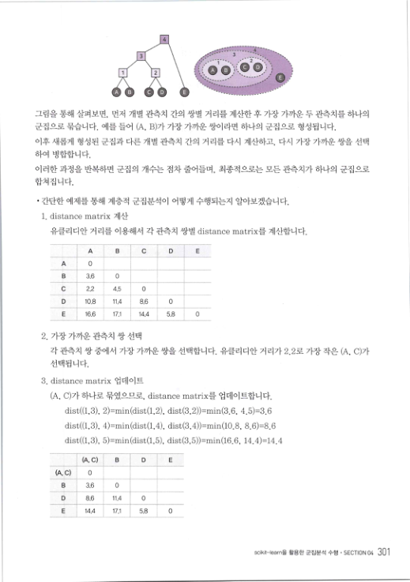
그림을 통해 살펴보면 , 먼저 개별 관측치 간의 쌍별 거리를 계산한 후 가장 가까운 두 관측치를 하나의 군집으로 묶습니다 . 예를 들어 (A, B）가 가장 가까운 쌍이라면 하나의 군집으로 형성됩니다． 이후 새롭게 형성된 군집과 다른 개별 관측치 간의 거리를 다시 계산하고 , 다시 가장 가까운 쌍을 선택 하여 병합합니다． 이러한 과정을 반복하면 군집의 개수는 점차 줄어들며 , 최종적으로는 모든 관측치가 하나의 군집으로 합쳐집니다．

- 간단한 예제를 통해 계층적 군집분적이 어떻게 수행되는지 알아보겠습니다．
1. distance matrix 계산
유클리디안 거리를 이용해서 각 관측치 쌍별 distance matrix를 계산합니다． A I B C D E 0 A B C D E 0 6 2 B ￡ & z 刃 稻 4.5 0 L 수 0 11.4 8.6 17.1 14.4 5.8 0 컨 2 . 가장 가까운 관측치 쌍 선택 각관측치 쌍중에서 가장 가까운 쌍을 선택합니다 . 유클리디안 거리가 2.2로 가장 작은 (A, C）가 선택됩니다．

3. distance matrix 업데이트
(A, c）가 하나로 묶였으므로 , distance matrix를 업데이트합니다． dist((1, 3), 2)=m1n(dist(1, 2), dist(3, 2))=min(3. 6, 4. 5)=3. 6 dist((1, 3), 4)=min(dist(1,4), dist(3,4))=min(10. 8, 8.6)=8. 6 dist((1, 3), 5)=min(dist(1, 5), dist(3, 5))=min(16. 6, 14. 4)=14. 4 (A. C) B D E (A ,C) 0 B 3.6 0 D 8.6 11.4 0 E 14.4 17.1 5.8 0 scik枕-Iearn을활용한군집분석수행 ·SECTION 04 301

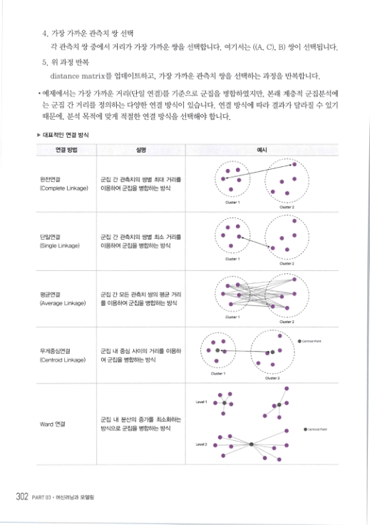
4 . 가장 가까운 관측치 쌍 선택 각관측치 쌍중에서 거리가 가장 가까운쌍을 선택합니다 . 여기서는 ((A, C), B) 찡삐 선택됩니다． 5 . 위 과정 반복 distance matrix를 업데이트하고 , 가장 가까운 관측치 쌍을 선택하는 과정을 반복합니다．

- 예제에서는 가장 가까운 거리（단일 연결）를 기준으로 군집을 병합하였지만 , 본래 계층적 군집분적에 
는 군집 간 거리를 정의하는 다양한 연결 방식이 있습니다 . 연결 방식에 따라 결과가 달라질 수 있기 때문에 , 분적 목적에 맞게 적절한 연결 방식을 선택해야 합니다． 卜 대표적인 연결 방식 연결 방법 설명 예시 ``,,``` 군집 간 관측치의 쌍별 최대 거라를 완전연결 (Complete Linkage) 이용하여 군쥠읕 병합하는 방식 .

∼S.- …·S ist.

2/.

# 이용하여 군즌을 병합하는 방식 
，닝-'S , .S\ /'/－∼’"\

### :. . · 
·익，\ l.

· · . i "S 단일연결 군집 간 관측치의 쌍별 최소 거리를 (Single Linkage) ● ． 5 ' .

.

.

,, 디네iter 1 " " 디utter 2

# 군집 간 모든 관측치 쌍의 팡균 거리 
를 이용하여 군집을 병합하는 방식 !,-- --S耉 "5 / __ '5S, 艇연결 (Average Linkage) Cluster 1

- - ------ -
Cluster 2 繃 S /7 ,' 'S 군집 내 중심 사이의 거리를 이용하 무거厓심연결 S ``*CI, ' ' 여 군집을 병합하는 방식 (Centroid Linkage) ／〃／盧 .SS …Jste S,`L ∼ 一 .一 m `Cl ●●〃 ri `｀●● /2

# S 
一令二 汁 Wan」 연결 군집 내 분산의 증가를 최소화하는 방식으로 군집을 병합하는 방식

# Level 
2씁〉犧＝ ' "- 302 PART 03．머신러닝과모델링

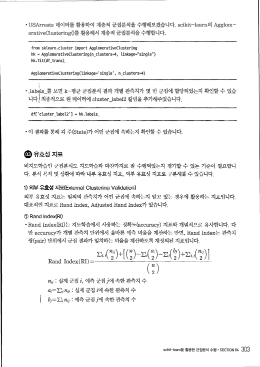
- llSAirrests 데이터를 활용하여 계층적 군집분석을 수행해보겠습니다 . scikit'-learn의 Agglom-
erativeClusteringO를 활용해서 계층적 군집분석을 수행합니다．

```python
from sklearn. cluster import AgglomerativeClustering 
hk = Aggl.omerativeClustering(n_cl.usters-_4, 1.inkage="single") 
hk. fit (df_trans)
```
AgglomerativeClustering(1.inkage= ' single', n_clusters-4) ' .labels를보면k－ 평균군집분석 결과개별관측치가몇 번군집에할당되었는지 확인할수있습 니다긔 최종적으로 원 데이터에 cluster_i샀)e12 칼럼을 추가해주었습니다． df['cluster_1.abe12'] = hk.llabels_

- 이 결과를 통해 각 주（State）가 어떤 군집에 속하는지 확인할 수 있습니다．
.

유효성 지표 비지도학습인 군집분석도 지도학습과 마찬가지로 잘 수행되었는지 평가할 수 있는 기준이 필요합니 다 . 분석 목적 및 상황에 따라 내부 유효성 지표 , 외부 유효셩 지표로 구분해볼 수 있습니다． 1) 외부 유효성 지표（External Clustering Validation) 외부 유효성 지표는 임의의 관측치가 어떤 군집에 속하는지 알고 있는 경우에 활용하는 지표입니다． 대표적인 지표로 Rand Index, Adjusted Rand Index가 있습니다． (j:)Rand Index(Rl)

- Rand Index(RI）는 지도학습에서 사용하는 정확도（accuracy) 지표와 개념적으로 유사합니다 . 다 
만 accuracy가 개별 관측치 단위에서 올바른 예측 비율을 계산하는 반면 , Rand Index는 관측치 쌍（pair) 단위에서 군집 결과가 일치하는 비율을 계산하도록 재정의된 지표입니다．

# Rand Index(RI)= 자，,（깝")+[(醬)-＞꽈(얍 )-刀( )+·자，,( ')]
nil : 실제 군집 2 , 예측 군집 ／에 속한 관측치 수 미＝＞콰nil : 실제 군집 f에 속한 관측치 수 하= >: nil : 예측 군집 ／에 속한 관측치 수 scikit-learn을활용한군집분석수행· SECTION 04 303

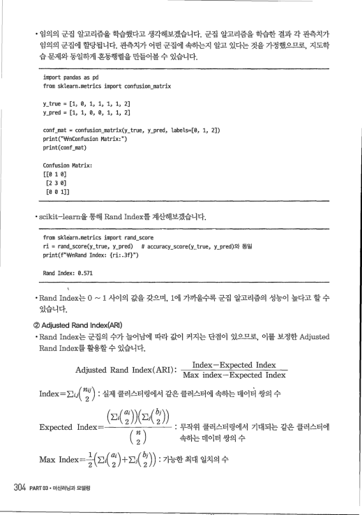
- 임의의 군집 알고리즘을 학습했다고 생각해보겠습니다 . 군집 알고리즘을 학습한 결과 각 관측치가
임의의 군집에 할당됩니다 . 관측치가 아떤 군집에 속하는지 알고 있다는 것을 가정했으므로 , 지도학 습문제와 동일하게 혼동행렬을 만들어볼 수 있습니다．

```python
import pandas as pd 
from sklearn.nietrics import confusion_matrix
y_true = [1, 0, 1, 1, '1, 1, 2]
y_pred = [1, 1, 0, 0, 1, 1, 2]
conf_mat = confusion_matrix(y_true, y_pred, labels=[0, 1, 2]) 
print('WnConfusion Matrix:") 
print(conf_mat)
```
Confusion Matrix:

[I0 1 0] [2 3 0] [0 0 1]]

- scikit-learn을 통해 Rand Index를 계산해보겠습니다．
```python
from sklearn.metrics import rand_score 
ri = rand_score(y_true, y_pred) 
# accuracy_score(y_true, y_pred)2F 
print(f"WnRand Index: {ri: .3f}")
```
Rand Index: 0.571

- Rand Index는 O ∼ 1 사이의 값을 갖으며 , 1에 가까울수록 군집 알고리즘의 성능이 높다고 할 수
있습니다． ②Adjusted Rand Index(ARI)

- Rand Index는 군집의 수가 늘어남에 따라 값이 커지는 단점이 있으므로 , 이를 보정한 Adjusted
Rand Index를 활용할 수 있습니다． Adjusted Rand Index(ARI):

Index-Expected Index Max index-Expected Index

```python
Index =刀7J（첩") ：실제클러스터링에서같은클러스터에속0隱데이텨쌍의수
```
# , , , , , , , , , , , , , = (끄7 ( a'))(「）(얍 ))
Expected Index= :팜 I， 《，,,, , ,，』 , ：《，,,,:：《，,,.』

# ) 
속하는 데이터 쌍의 수

# Max Index=즙（刀7（얍)+끄＇
(瞥)):7f*한최대 일치의수 304 PART 03．머신러닝과모델링

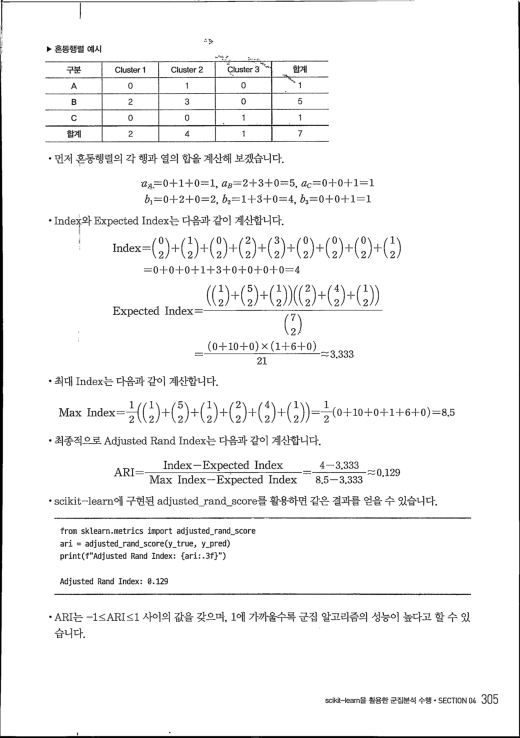
> 혼동행렬 예시
구분 Cluster 1 Cluster 2 Cluster 3 " ’啣’ 訓 ∼ A 0 1 0 녹 ， B 2 3 0 5 C 0 0 1 1 합계 2 4 1 7

- 먼저 혼동행렬의 각 행과 열의 합을 계산해 보겠습니다．
```python
czA=O+l+ O=l, aB=2+3+O=S, ac=O+0+l= l
b1=0+2+0=2, b2=1+3+0=4, b3=0+0+1=1
```
## ·Index와 Expected Index는 다음과 같이 계산합니다． 
l

# (: )
# (; )
# (: )
# ( :)
# ( :)
# (: )
# (: )
# (: )
# (; )
=0+0+0+1+3+0+0+0+0=4

# Expected Index= ((;)+( :)+(;))((:)+(; )+(; ))
(o+10+o) x (1+6+o) === 一－ = 3. 333 z1

- 최대 Index는 다음과 같이 계산합니다．
' 'l\

- 최종적으로 Adjusted Rand Index는 다음과 같이 계산합니다．
```python
ARI= M乫芬，Expected
c-Expect놓dex , , 
 4
, , 갸： -3.333糟0.129
Index = 8.5-3.333
```
- scikit-learn에 구현된 adjusted_ran이_score를 활용하면 같은 결과를 얻을 수 있습니다．
```python
from sklearn.metrics import adjusted_rand..score 
ani = adjusted_rand_score(y_true, y_pred) 
print(f"Adjusted Rand Index: {ari:.3f} ')
```
Adjusted Rand Index: 0.129

- ARI는 -1二ARI二 1 사이의 값을 갖으며 , 1.에 가까울수록 군집 알고리즘의 성능이 높다고 할 수 있
습니다． scikit-learn을활용한군집분석수행．SECTION 04 305

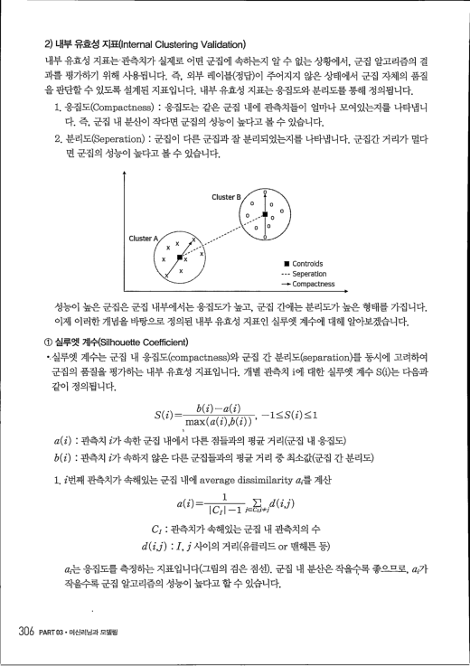
2) 내부 유효성 지표(Internal Clustering Validation) 내부 유효성 지표는 " 관측치가 실제로 어떤 군집에 속하는지 알 수 없는 상황에서 , 군집 알고리즘의 결 과를 평가하기 위해 사용됩니다 . 즉 , 외부 레이블（정답）이 주어지지 않은 상태에서 군집 자쳬의 품질 을 판단할 수 있도록 설계된 지표입니다 . 내부 유효성 지표는 응집도와 분리도를 통해 정의됩니다． 1 . 응집도（Compactness) : 응집도는 같은 군집 내에 관측치들이 얼마나 모여있는지를 나타냅니 다 . 즉 , 군집 내 분산이 작다면 군집의 성능이 높다고 볼 수 있습니다． 2 . 분리도（Seperation) : 군집이 다른 군집과 잘 분리되었는지를 나타냅니다 . 군집간 거리가 멀다 면 군집의 성능이 높다고 볼 수 있습니다．

- Controids 
- -- Seperation 
→Compactness 》 성능이 높은 군집은 군집 내부에서는 응집도가 높고 , 군집 간에는 분리도가 높은 형태를 가집니다． 이제 이러한 개념을 바탕으로 정의된 내부 유효성 지표인 실루엣 계수에 대해 알아보겠습니다． ① 실루엣 계수《Silhouette Coefficient)

- ．실루엣 계수는 군집 내 응집도（compactness）와 군집 간 분리도（separation）를 동시에 고려하여
군집의 품질을 평가하는 내부 유효성 지표입니다 . 개별 관측치 1에4 대한 실루엣 계수 S(i）는 다음과 같이 정의됩니다．

### ))
1」S 1 max ) a(i) : 관측치 z가 속한 군집 내에서 다른 점들과의 평균 거리（군집 내 응집도） b(i) : 관측치 i가 속하지 않은 다른 군집들과의 평균 거리 중 최소값（군집 간 분리도）

1. i번째 관측치가 속해있는 군집 내에 average dissimilarity a‘를 계산
## 祗）기c,1
a(i)= -:, , . d(i,j) ICiI -1 jCt,zI=j cf : 관측치가 속해있는 군집 내 관측치의 수 d(i,j) : I, γ 사이의 거리（유클리드 or 맨해튼등） a』는응집도를측정하는 지표입니다（그림의 검은 점선） . 군집 내 분산은작을수록좋으므로 , α까 작을수록 군집 알고리즘의 성능이 높다고 할 수 있습니다． 306 PART 03．머신러닝과모델링

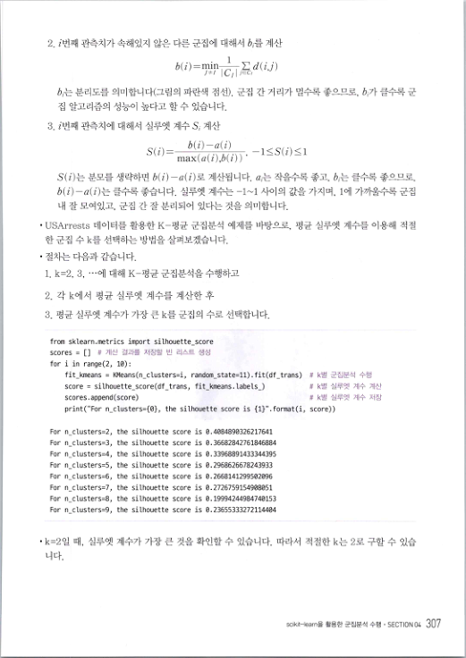
2. i번째 관측치가 속해있지 않은 다른 군집어I 대해서 하를 계산
# b(i)=minJ*
I귿-1-.J,d(i,j) b,는 분리도를 의미합니다（그림의 파란색 점선） . 군집 간 거리가 멀수록 좋으므로 , 히가 클수록 군 집 알고리즘의 성능이 높다고 할 수 있습니다．

3. f번째 관측치에 대해서 실루엣 계수 Si 계산
### ))
() \1 max 1<S S ) S(i）는 분모를 생략하면 b(i) -a(i）로 계산됩니다 . α：는 작을수록 좋고 , 허는 클수록 좋으므로， 昉)-a (i）는 클수록 좋습니다 . 실루엣 계수는 -1--1 사이의 값을 가지며 , 1에 가까울수록 군집 내 잘모여있고 , 군집 간잘분리되어 있다는 것을 의미합니다．

- USArrests 데이터를 활용한 K－평균 군집분석 예제를 바탕으로 , 평균 실루엣 계수를 이용해 적절 
한 군집 수 k를 선택하는 방법을 살펴보겠습니다．

- 절차는 다음과 같습니다．
1. k=2. 3. …에 대해 K－평균군집분석을수행하고
2 . 각 k에서 평균 실루엣 계수를 계산한 후 3 . 평균 실루엣 계수가 가장 큰 k를 군집의 수로 선택합니다．

```python
from sklearn.metrics import silhouette_score 
scores = [] # 계산 결과를 저장할 빈 리스트 생성 
for i in range(2, 10): 
fit_kmeans = KMeans(n_clusters=i, random_state=11) . fit (df_trans) 
score = silhouette_score(df_trans, fit kmeans. labels_)
# k별 군집분석 수행
# k별 실루엣 계수 계산
# 抉별 실루엣 계수 저장
scores .append(score) 
print('For n_clusters={0}, the silhouette score is {1} " . format(i,
```
score)) For n_clusters=2, the silhouette score is 0.4084890326217641 For n_clusters=3, the silhouette score is 0.36682842761846884 For n_clusters=4, the silhouette score is 0.33968891433344395 For n_clusters=5, the silhouette score is 0.2968626678243933 For n_clusters=6, the silhouette score is 0.2668141299502096 For n_clusters=7, the silhouette score is 0.2726759154908051 For n_clusters=8, the silhouette score is 0.19994244984740153 For n_clusters=9, the silhouette score is 0.23655333272114404

- k=2일 때 , 실루엣 계수가 가장 큰 것을 확인할 수 있습니다 . 따라서 적절한 k는 2로 구할 수 있습
니다． scikft-Iearn을활용한군집분석수행 ·SECTION 04 307

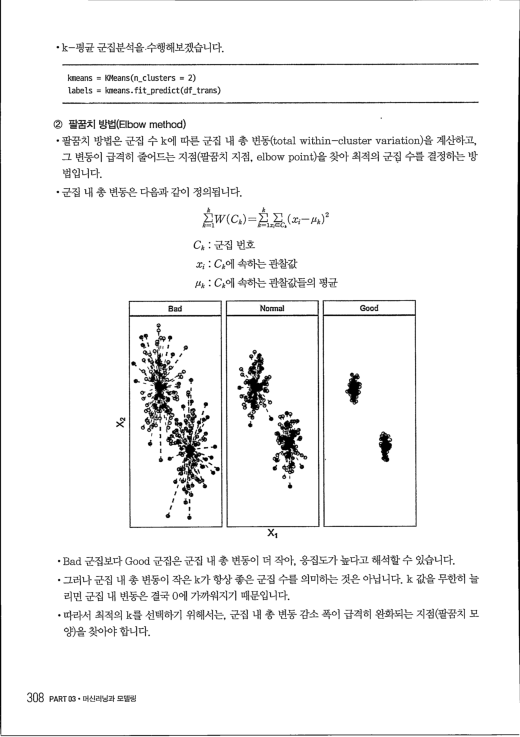
- k－평균 군집분석을．수행해보겠습니다．
```python
kmeans = KMeans(n_clusters = 2) 
labe's = knieans. fit_predict(df_trans)
```
② 팔꿈치 방법（티bow method)

- 팔꿈치 방법은 군집 수 k에 따른 군집 내 총 변동（total within-cluster variation）을 계산하고，
그 변동이 급격히 줄어드는 지점（팔꿈치 지점 , elbow point）을 찾아 최적의 군집 수를 결정하는 방 법입니다．

- 군집 내 총 변동은 다음과 같이 정의됩니다．
```python
k끼／(c*)= k，珊，(x-p,,)2
k=1xiEC
```
C,, : 군집 번호 瀞￡ : C,,에 속하는 관찰값 /z力 : C,,에 속하는 관찰값들의 평균 Bad Good N얘11a1

# I
珊 盼 ' 砲

# 耆
蠟 → ｀ 俎 뺑 … 鱗 剝 큐 ， * .

， 구 了 히 ， , Xl

- Bad 군집보다 Good 군집은 군집 내 총 변동이 더 작아 , 응집도가 높다고 해석할 수 있습니다．
- 그러나 군집 내 총 변동이 작은 k가 항상 좋은 군집 수를 의미하는 것은 아닙니다 . k 값을 무한히 늘
리면 군집 내 변동은 결국 0에 가까워지기 때문입니다．

- 따라서 최적의 k를 선택하기 위해서는 , 군집 내 총 변동 감소 폭이 급격히 완화되는 지점（팔꿈치 모
양）을찾아야합니다． 308 PART 03．머신러닝과모델링

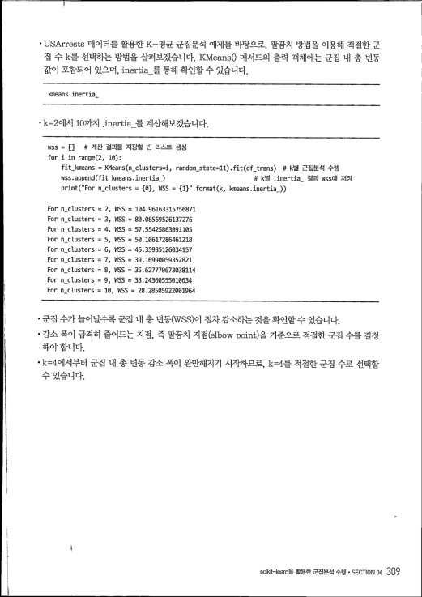
' USArrests 데이터를 활용한 K－평균 군집분석 예제를 바탕으로 , 팔꿈치 방법을 이용해 적절한 군 집 수 k를 선택하는 방법을 살펴보겠습니다 . KMea끄s0 메서드의 출력 객쳬에는 군집 내 총 변동 값이 포함되어 있으며 , 1끄ertia－를 통해 확인할 수 있습니다． kmeans.inertia

- k=2에서 10까지 . inertia를 계산해보겠습니다．
```python
wss = [] 
# 계산 결과를 저장할 빈 리스트 생성 
for i in range(2, 10): 
fit_krneans = KMeans(n_clusters=i, random_state=11).fit (df_trans) # k별 군집분석 수행
wss . append (fitJ (nieans.inertia-) 
# k별 .inertia- 결과 wss에 저장 
print("For n_clusters = {0}, WSS = {1}" .forniat(k, knieans.inertia_))
```
For nㅗclusters = 2, WSS = 104.96163315756871 For n_clusters = 3, WSS = 80.08569526137276 For n_clusters = 4, WSS = 57.55425863091105 For n_clusters = 5, WSS = 50.10617286461218 For n_clusters = 6, WSS = 45.35935126034157 For n_clusters = 7, WSS = 39.16990059352821 For n_clusters = 8, WSS 볍 35.627770673038114 For n_clusters = 9, WSS = 33.24360555010634 For n_clusters = 10, WSS = 28.28505922001964 ' 군집 수가 늘어날수록 군집 내 총 변동（wSS）이 점차 감소하는 것을 확인할 수 있습니다． ' 감소 폭이 급격히 줄어드는 지점 , 즉 팔꿈치 지점（elbow point）을 기준으로 적절한 군집 수를 결정 해야합니다． ' k=4에서부터 군집 내 총 변동 감소 폭이 완만해지기 시작하므로 , k=4를 적절한 군집 수로 선택할 수 있습니다． l scikit-learn을활용한군집분석수행· SECTION 04 309
