# PART 0zl
# 통계와 확률
파트 소개 이 파트에서는 확률 및 통계의 핵심 개념과 다양한 확률분포의 활용을 다룹니다． 특 히 , 통계학에서 중요한 개념을 중심으로 확률 계산 , 확률변수의 분포 , 그리고 Python 을 활용한 확률분포 시뮬레이션을 학습합니다 . 통계학을 공부했다면 이 파트는 가볍 게 읽으며 넘어가도 좋습니다． ◇ 주요 내용

- 기초 확률 및 통계 개념 : 모집단과 표본 , 표본추출 방법 . 확률의 기본 성질
- 확률변수와 확률분포 : 이산형 및 연속형 확률변수 . 확률질링함수＜PMF) , 확률밀도함
쉬PDF) , 누적분포함수〈CDF)

- 이산 확률분포 : 베르누이 , 이항 , 포아송 분포 및 Python을 활용한 확률 계산
- 연속 확률분포 : 정규 , 카이저굡 , t , F 분포의 개념과 활용
- Python을 활용한 확률분포 시뮬레이션 : SciPy를 이용한 확률 계산 및 샘플링
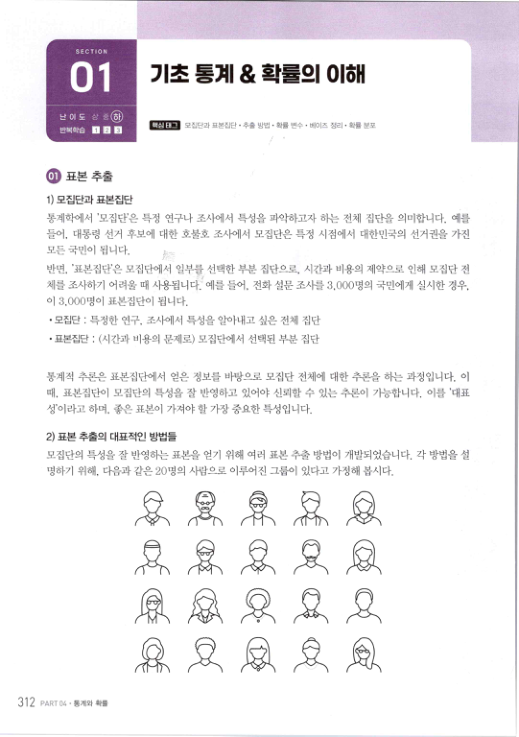
SECTION

# 기초 통계 & 확률의 이해
난 이 도 상 蠟 （軫 핵심 태그 오집단과 표본집단 · 추출 방법 · 확률 변수 · 베이즈 정리 · 확률 분포 반복학습 ·

- .
.l 표본 추출 1) 모집단과 표본집단 통계학에서 ' 모집단'은 특정 연구나 조사에서 특정을 파악하고자 하는 전쳬 집단을 의미합니다 . 예를 들어 , 대통령 선거 후보에 대한 호불호 조사에서 모집단은 특정 시점에서 대한민국의 선거권을 가진 모든 국민이 됩니다． .

반면 , ’표본집단’은모집단에서 일부를선택한부분집단으로 , 시간과비용의 제약으로 인해 모집단전 쳬를 조사하기 어려울 때 사용됩니다 . 예를 들어 , 전화 설문 조사를 3.000명의 국민에게 실시한 경우 , 이 3,000명이 표본집단이 됩니다．

- 모집단 : 특정한 연구 , 조사에서 특정을 알아내고 싶은 전쳬 집단
- 표본집단 : （시간과 비용의 문제로） 모집단에서 선택된 부분 집단
통계적 추론은 표본집단에서 얻은 정보를 바탕으로 모집단 전쳬에 대한 추론을 하는 과정입니다 . 이 때 , 표본집단이 모집단의 특정을 잘 반영하고 있어야 신뢰할 수 있는 추론이 가능합니다 . 이를 ' 대표 성 ' 이라고 하며 , 좋은 표본이 가져야 할 가장 중요한 특성입니다． 2) 표본 추출의 대표적인 방법들 모집단의 특정을 잘 반영하는 표본을 얻기 위해 여러 표본 추출 방법이 개발되었습니다 . 각 방법을 설 명하기 위해 , 다음과 같은 20명의 사람으로 이루어진 그룹이 있다고 가정해 봅시다．

# 鳳
蕪 蹴 요

# ㅉ
風 佩 寐

# ㅉ
風 ㅉ 熾

# 泉
ㅉ ㅉ 嶽

# 霖
ㅈ ㅉ ㅉ 312 PART04．통계와확률

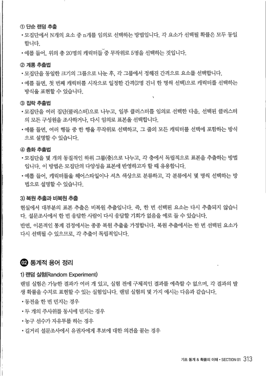
① 단순 랜덤 추출

- 모집단에서 N개의 . 요소 중 II개를 임의로 선택하는 방법입니다 . 각 요소가 선택될 확률은 모두 동일
합니다．

- 예를 들어 , 위의 총 20명의 캐릭터들 중 무작위로 5명을 선택하는 것입니다．
② 계통 추출법

- 모집단을 동일한 크기의 그룹으로 나눈 후 , 각 그룹에서 정해진 간격으로 요소를 선택합니다．
- 예를 들면 , 첫 번째 캐릭터를 시작으로 일정한 간격（2명 건너 한 명씩 선택）으로 캐릭터를 선택하는
방식을 표현할 수 있습니다． , ③ 집락 추출법

- 모집단을 여러 집단（클러스터）으로 나누고 , 일부 클러스터를 임의로 선택한 다음 , 선택된 클러스터
의 모든구성원을 조사하거나 , 다시 임의로 표본을 선택합니다．

- 예를 들면 , 여러 행들 중 한 행을 무작위로 선택하고 , 그 줄의 모든 캐릭터를 선택에 포함하는 방식
으로 설명할 수 있습니다． ④ 층화 추출법

- 모집단을 몇 개의 동질적인 하위 그룹（층）으로 나누고 , 각 층에서 독립적으로 표본을 추출하는 방법
입니다 . 이 방법은 모집단의 다양성을 표본에 반영하고자 할 때 유용합니다．

- 예를 들어 , 캐릭터들을 헤어스타일이나 셔츠 색상으로 분류하고 , 각 분류에서 몇 명씩 선택하는 방
법으로 설명할 수 있습니다． 3) 복원 추출과 비복원 추출 현실에서 대부분의 표본 추출은 비복원 추출입니다 . 즉 , 한 번 선택된 요소는 다시 추출되지 않습니 다 . 설문조사에서 한 번 응답한 사람이 다시 응답할 기회가 없음을 예로 들 수 있습니다． 반면 , 이론적인 통계 검정에서는 종종 복원 추출을 가정합니다 . 복원 추출에서는 한 번 선택된 요소가 다시 선택될 수 있으므로 , 각추출이 독립적입니다． .

통계적 용어 정리 1) 랜덤 실험（Random Experiment) 랜덤 실험은 가능한 결과가 여러 개 있고 , 실험 전에 구쳬적인 결과를 예측할 수 없으며 , 각 결과의 발 생 확률을 수치로 표현할수 있는 실험입니다 . 랜덤 실험의 몇 가지 예시는 다음과 같습니다．

- 동전을 한 번 던지는 경우
- 두 개의 주사위를 동시에 던지는 경우
- 농구 선수가 자유투를 하는 경우
- 길거리 설문조사에서 유권자에게 후보에 대한 의견을 묻는 경우
기초통계＆확률의이해· SECTION 01 ;3炤

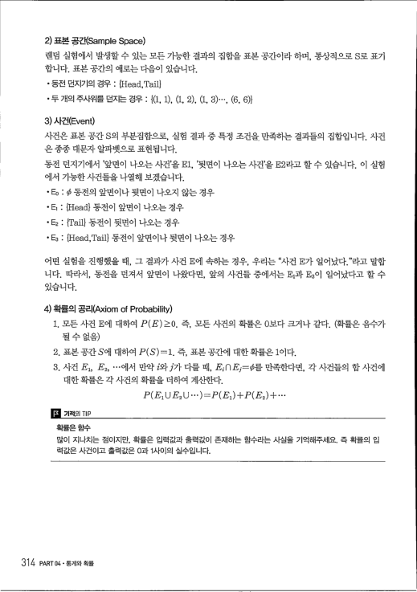
2) 표본 공긴ISampIe Space) 랜덤 실험에서 발생할 수 있는 모든 가능한 결과의 집합을 표본 공간이라 하며 , 통상적으로 S로 표기 합니다 . 표본 공간의 예로는 다음이 있습니다．

- 동전 던지기의 경우 : {Head,Tai파
- 두개의주사위를던지는경우 : {(l, 1), (1, 2), (1, 3)…, (6, 6가
3) 사건（Event) 사건은 표본 공간 S의 부분집합으로 , 실험 결과 중 특정 조건을. 만족하는 결과들의 집합입니다 . 사건 은 종종 대문자 알파벳으로 표현됩니다． 동전 던지기에서 ' 앞면이 나오는 사건'을 El, ' 뒷면이 나오는 사건'을 E2라고 할 수 있습니다 . 이 실험 에서 가능한 사건들을 나열해 보겠습니다．

- E0 : 熒 동전의 앞면이나 뒷면이 나오지 않는 경우
- E1 : 遼ead} 동전이 앞면이 나오는 경우
- E2 : 佇a파 동전이 뒷면이 나오는 경우
- E3: 博ead,Tail} 동전이 앞면이나 뒷면이 나오는 경우
어떤 실험을 진행했을 때 , 그 결과가 사건 E에 속하는 경우 , 우리는 " 사건 E가 일어났다 . " 라고 말합 니다 . 따라서 , 동전을 던져서 앞면이 나왔다면 , 앞의 사건들 중에서는 E1과 E3이 일어났다고 할 수 있습니다． 4) 확률의 공리（Axiom of Probability) 1 . 모든 사건 E에 대하여 P(E) 스0 . 즉 , 모든 사건의 확률은 U보다 크거나 같다 . （확률은 음수가 될 수 없음） 2 . 표본공간S에 대하여 P(S)=1 . 즉 , 표본공간에 대한확률은1이다． 3 . 사건 E1, E2, ' · ' 에서 만약2와y가다를때 , 凡n凡=熒를만족한다면 , 각사건들의 합사건에 대한 확률은 각 사건의 확률을 더하여 계산한다． P(凡U E2 U … ) =P(f71HP(E2) + … 확률은 함수 많이 지나치는 점이지만 , 확률은 입력값과 출력값이 존재하는 함수라는 사실을 기억해주세요 . 즉 확률의 입 력값은 사건이고 출력값은 0과 1사이의 실수입니다． 314 PART04솥통계와확률 ({$ } ) ({s } )

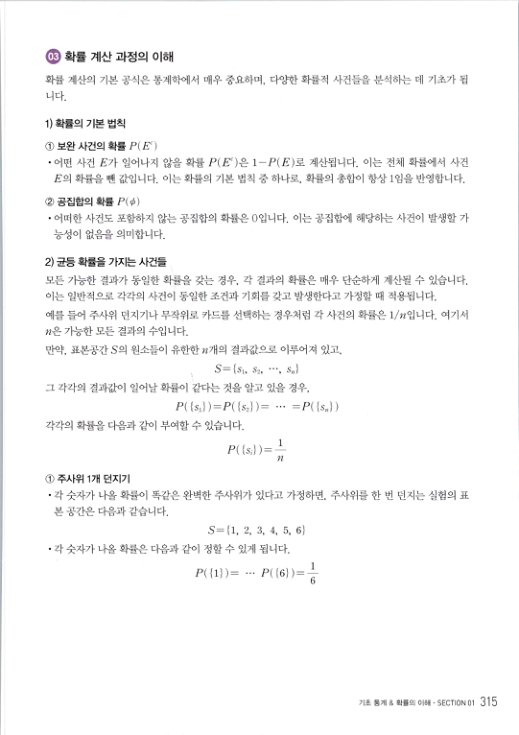
.

확률 계산 과정의 이해 확률 계산의 기본 공식은 통계학에서 매우 중요하며 , 다양한 확률적 사건들을 분석하는 데 기초가 됩 니다． 1) 확률의 기본 법칙 ① 보완 사건의 확률 ／〕（E " )

- 어떤 사건 E가 일어나지 않을 확률 P(EC）은 1-P(E）로 계산됩니다 . 이는 전쳬 확률에서 사건
E의 확률을 뺀 값입니다 . 이는 확률의 기본 법칙 중 하나로 , 확률의 총합이 항상 1임을 반영합니다． ② 공집합의 확률 P(q)

- 어떠한 사건도 포함하지 않는 공집합의 확률은 0입니다 . 이는 공집합에 해당하는 사건이 발생할 가
능성이 없음을 의미합니다． 2) 균등 확률을 가지는 사건들 모든 가능한 결과가 동일한 확률을 갖는 경우 , 각 결과의 확률은 매우 단순하게 계산될 수 있습니다． 이는 일반적으로 각각의 사건이 동일한 조건과 기회를 갖고 발생한다고 가정할 때 적용됩니다． 예를 들어 주사위 던지기나 무작위로 카드를 선택하는 경우처럼 각 사건의 확률은 1/n입니다 . 여기서 n은 가능한 모든 결과의 수입니다． 만약 , 표본공간 S의 원소들이 유한한 n개의 결과값으로 이루어져 있고，

```python
. 
S= {s1, s2, ", s}
```
그 각각의 결괴．값이 일어날 획률이 같다는 것을 알고 있을 경우， P( {s ,}) =P( {s2} )= … =P( {s ,}) 각각의 확률을 다음과 같이 부여할 수 있습니다 .

① 주사위 1개 던지기

- 각 숫자가 나올 확률이 똑같은 완벽한 주사위가 있다고 가정하면 , 주사위를 한 번 던지는 실험의 표 
본 공간은 다음과 같습니다．

```python
S={i, 2, 3, 4, 5, 6)
```
- 각 숫자가 나올 확률은 다음과 같이 정할 수 있게 됩니다．
### ({
### )= · · ·
### ({
### )=- 
- 기초통계 & 확률의 이해 ◆ SECTION 01 3巧

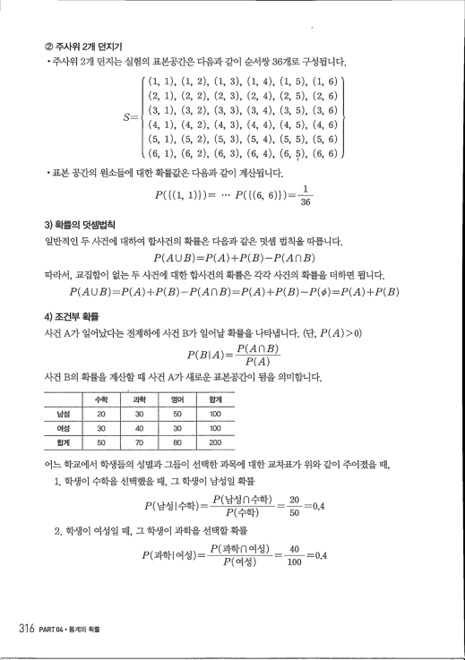
② 주사위 2개 던지기

- 주사위 2개 던지는 실험의 표본공간은 다음과 같이 순서쌍 36개로 구성됩니다．
' (i, i) , (1, 2), (1, 3), (i, 4), (1, 5), (i, 6) , (2, i) , (2, 2), (2, 3), (2, 4), (2, 5), (2, 6) (3, i) , (3, 2), (3, 3), (3, 4), (3, 5), (3, 6) (4, 1), (4, 2), (4, 3), (4, 4), (4, 5), (4, 6) (s, i) , (5, 2), (5, 3), (5, 4), (5, 5), (5, 6) S= (6, 1), (6, 2), (6, 3), (6, 4), (6, 5), (6, 6) 』

- 표본 공간의 원소들에 대한 확률값은 다음과 같이 계산됩니다．
### })= 1
P({(i,

### P({(1,
### })= …
### })=
### ({(6,
### ({(6,
})=-36 3) 확률의 덧셈법칙 일반적인 두 사건에 대하여 합사건의 확률은 다음과 같은 덧셈 법칙을 따릅니다． P(A U B)=P(A)+P(B)-P (AflB) 따라서 , 교집합이 없는 두 사건에 대한 합사건의 확률은 각각 사건의 확률을 더하면 됩니다． P(AUB)=P(A)+P(B)-P (AflB)==P(A)+P(B)-P (k)=P(A)+P(B) 4) 조건부 확률 사건 A가 일어났다는 전제하에 사건 B가 일어날확률을 나타냅니다 . （단 , P(A)>o) P 사건 B의 확률을 계산할 때 사건 A가 새로운 표본공간이 됨을 의미합니다． 수학 괴학 영어 합계 남성 20 30 50 100 여성 30 40 30 100 합계 50 70 80 200 어느 학교에서 학생들의 성별과 그들이 선택한 과목에 대한 교차표가 위와 같이 주어졌을 때， :1 . 학생이 수학을 선택했을 때 , 그학생이 남성일 확률

## P（남세수학）
= P(嘴pn (4 芩학） ＝릍는0.4 2 . 학생이 여성일 때 , 그학생이 과학을 선택할확률 P（과해여성）

## (4ffl
4 1。。

- 316 PART04．통계와확률

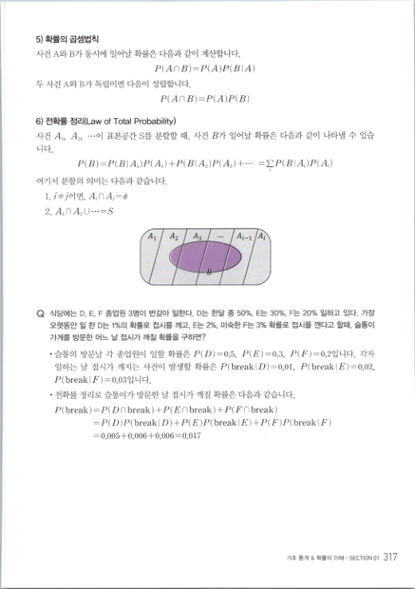
5) 확률의 곱셈법칙 사건 A와 B가 동시에 일어날 확률은 다음과 같이 계산합니다． P(AflB)=P(A)P(BIA) 두 사건 A와 B가 독립이면 다음이 성립합니다． P(Afl B)=P(A)P(B) 6) 전확률 정리（Law of Total Probability) 사건 A1, 4.2, …이 표본공간 S를 분할할 때 , 사건 β가 일어날 확률은 다음과 같이 나타낼 수 있습 니다． P(B)=P(BA1)P(A1)+P(BIA2)P(A2)+… =>=P(BJA')P(A1) 여기서 분할의 의미는 다음과 같습니다．

1. j숟／이면 , AfflA1=qS
2. A1flA2U ···=S
Q 식당에는 D. E. F 종업원 3명이 번갈아 일한다 . 0는 한달 중 50%, E는 30%, F는 20% 일하고 있다 . 가장 오랫동안 일 한 D는 1％의 확률로 접ㅅ屠 깨고， E는 2%,O陸한 F는 3% 확률로 접ㅅ喝 깬다고 할때， 슬통이 가게를 방문한 어느 날 접시가 깨질 확률을 구하면？

- 슬통의 방문날 각 종업원이 일할 확률은 P(D)=o.5, P(E)=o.3, P(F)=o.2입니다 . 각자
일하는 날 접시가 깨지는 사건이 발생할 확률은 P다）rea시D)=0.01, P(brea시E)=0.02, P(breal이 F) =0.03입니다．

- 전확률 정리로 슬통이가 방문한 날 접시가 깨질 확률은 다음과 같습니다．
P(break)=P(Dflbreak)+P(Eflbreak)+P(F flbreak) =P(D)P(breakID)+P(E)P(breakE)+P(F)P(breakF) = 0.005 + 0.006 + 0.006 = 0.017 기초통계 & 확률의 이해 .SEC지ON01 317

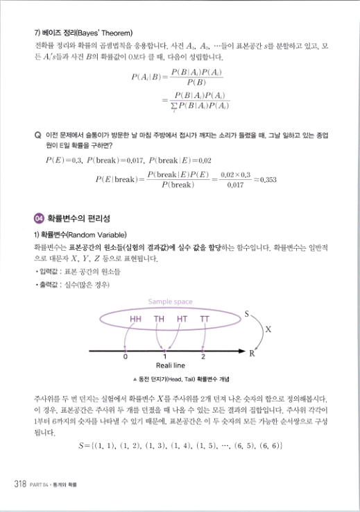
7) 베이즈 정리（Bayes' Theorem) 전확률 정리와확률의 곱셈법칙을응용합니다 . 사건 A1, A2, …들이 표본공간S를분할하고 있고 , 모 든 A1's들과 사건 β의 확률값이 0보다 클 때 , 다음이 성립합니다． /(A」 P(게 A1)P(A) ＞그P(BIA1)P(A，·) Q 이전 문제에서 슬통이가 방문한 날 마침 주방에서 접시가 깨지는 소리가 들렸을 때 , 그날 일하고 있는 종업 원이 ㅌ일 확률을 구하면？ P(E) =0.3, P(break) =0.017, P(break E) =0.02 02x0.3 P 「03k) P 353 P .

확률변수의 편리성 1) 확률변수《Random Variable) 확률변수는 표본공간의 원소들（실험의 결과값）에 실수 값을 할당하는 함수입니다 . 확률변수는 일반적 으로 대문자x ,Y, z 등으로표현됩니다．

- 입력값 : 표본 공간의 원소들
- 출력값 : 실수（많은 경우）
Sample space 0 1 Reali line 2 ▲ 동전 던지기（Head. Tail) 확률변수 개념 주사위를 두 번 던지는 실험에서 확률변수 兀를 주사위를 2개 던져 나온 숫자의 합으로 정의해봅시다． 이 경우 , 표본공간은 주사위 두 개를 던졌을 때 나올 수 있는 모든 결과의 집합입니다 . 주사위 각각이 1부터 6까지의 숫자를 나타낼 수 있기 때문에 , 표본공간은 이 두 숫자의 모든 가능한 순서쌍으로 구성 됩니다．

```python
S= {(i, 1), (1, 2), (1, 3), (1, 4), (1, 5), … , (6, 5), (6, 6) }
```
318 PART04．통:7ㅖ와확률

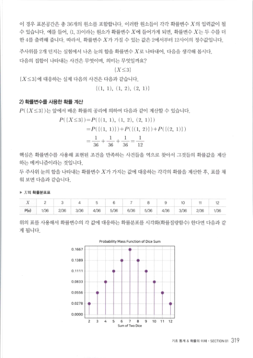
이 경우 표본공간은 총 36개의 원소를 포함합니다 . 이러한 원소들이 각각 확률변수 x의 입력값이 될 수 있습니다 . 예를들어 , (1, 3）이라는 원소가확률변수 x에 들어가게 되면 , 확률변수兀는두수를 더 한4를 출력해 줍니다 . 따라서 , 확률변수 x가 가질 수 있는 값은 2에서부터 12사이의 정수값입니다． 주사위를 2개 던지는 실험에서 나온 눈의 합을 확률변수 x로 나타내어 , 다음을 생각해 봅시다． 다음의 집합이 나타내는사건은무엇이며 , 의미는무엇일까요？ ｛兀二3} {X二3} 에 대응하는 실제 다음의 사건은 다음과 같습니다． ((1, 1), (1, 2), (2, 1)) 2) 확률변수를 사용한 확률 계산 P({X二3} ）는 앞에서 배운 확률의 공리에 의하여 다음과 같이 계산할 수 있습니다． P({X<3} )=P({(1, 1), (1, 2), (2, i) }) =P({(i, 1)})+P({(i, 2)})+P({(2, i) }) 1 1 1 1 = -fl- - + _::_ + -- = =- 36 36 36 12 핵심은 확률변수를 사용해 표현된 조건을 만족하는 사건들을 역으로 짖마서 그것들의 확률값을 계산 하는 메커니즘이라는 것입니다． 두 주사위 눈의 합을 나타내는 확률변수 x가 가지는 값에 대응하는 각각의 확률을 계산한 후 , 표를 채 워 보면 다음과 같습니다． 》 兀의 확률분포표 8 X 2 3 4 12 ＾ 닝 瑯 ^ h 6 咫 ^ b 7 8 ^ b 刃 滔 Q J ㄲ 汨 ― ㅗ b 硼 P(x) 1/36 2/36 3/36 1/36 只 U ㄷ J 위의 표를 사용해서 확률변수의 각 값에 대응하는 확률분포를 시각화＜확률질량함수） 한다면 다음과 같 게 됩니다． Probabili y Mass Function of Dice Sum 2 3 4 5 6 7 9 10 11 12 Sum of Two Dice 기초 통계 & 확률의 이해 · SECTION 01 319

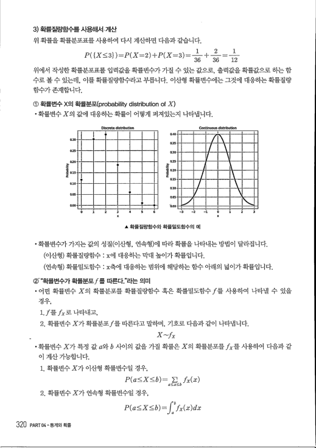
3) 확률질량함수를 사용해서·계산 우I확률을 확률분포표를 사용하여 다시 계산하면 다음과 같습니다． P({X三3fl') =P(X=2)+P(X=3'＝스＋으一스 " " " " 36 36 12 위에서 작성한 확률분포표를 입력값을 확률변수가 가질 수 있는 값으로，. 출력값을 확률값으로 하는 함 수로 볼 수 있는데 , 이를 확률질량함수라고 부릅니다 . 이산형 확률변수에는 그것에 대응하는 확률질량 항수가존재합니다． ① 확률변수 x의 확률분포（probability distribution of Z) ' 확률변수 Z의 값에 대응하는 확률이 어떻게 퍼져있는지 나타냅니다． continuous distribution Discrete distribution

- 
.35 0.:

∥ 觸 一

- · 
。

5 醜 醜 媤 눼 .

竗 ㄹ ， 료 ￡ 汁 도 섬 습 로 l 0.10

## 떽 鱗 
- 
, ., 0.05 "6.oo α뱁 .

.

그 L = 큔 ~.I 」 떻 = i ` -3 -2 -1 0x 3 ▲ 확률질량함수와 확률밀도함수의 예

- 확률변수가 가지는 값의 성질（이산형 , 연속형）에 따라 확률을 나타내는 방법이 달라집니다．
（이산형） 확률질량함수 : x에 대응하는 막대 높이가 확률입니다． （연속형） 확률밀도함수 : x축에 대응하는 범위에 해당하는 함수 아래의 넓이가 확률입니다． （豕 " 확률변수가확률분포／를 따른다 , " 라는 의미

- 어떤 확률변수 Z의 확률분포를 확률질량함수 혹은 확률밀도함수 ／를 사용하여 나타낼 수 있을
경우，

1. ／를／x로 나타내고，
### 2 . 확률변수x가확률분포／를따른다고말하며 , 기호로다음과같이 나타냅니다． 
x∼／兀

- 확률변수 x가 특정 값 α와 b 사이의 값을 가질 확률은 x의 확률분포를 /x를 사용하여 다음과 같
이 계산 가능합니다． 1 . 확률변수 Z가 이산형 확률변수일 경우， P(a二x二心）= , 轍fx ( axb 끼 2 . 확률변수 x가 연속형 확률변수일 경우，

# P(a三Z三b) =ffx(x)dx
320 PART04 통계와확률

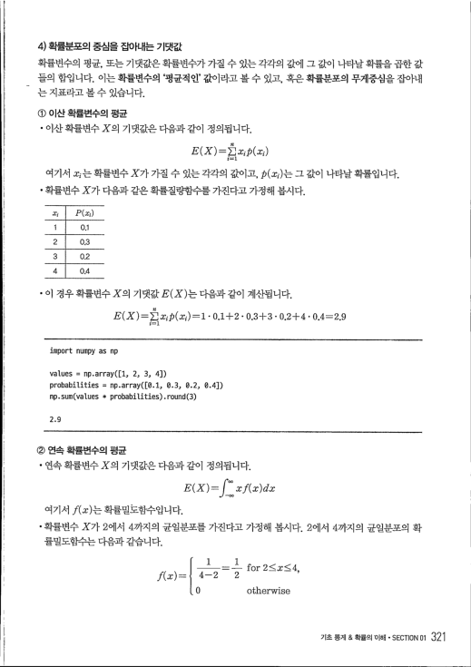
4) 확률분포의 중심을 잡아내는 기댓값 확률변수의 평균 , 또는 기댓값은 확률변수가 가질 수 있는 각각의 값에 그 값이 나타날 확률을 곱한 값 들의 합입니다 . 이는 확률변수의 ' 평균적인 ' 값이라고 볼 수 있고 , 혹은 확률분포의 무게중심을 잡아내 는 지표라고 볼 수 있습니다． ① 이산 확률변수의 평균

- 이산 확률변수 x의 기댓값은 다음과 같이 정의됩니다．
E (Z)= i 1xip졔 여기서 xi는 확률변수 Z가 가질 수 있는 각각의 값이고 , p (xf）는 그 값이 나타날 확률입니다．

- 확률변수 x가 다음과 같은 확률질량함수를 가진다고 가정해 봅시다．
xi P(x1) 1 0.1 0.3 02 0.4

- 이 경우 확률변수 x의 기댓값 E (x）는 다음과 같이 계산됩니다．
```python
E(X)=ㅆxp(xf)=i ' 0.1+2 ' 0.3+3 ' 0.2+4 ' 0.4=2.9
i=1
```
iniport nunipy as np

```python
values = np.array([l, 2, 3, 4]) 
probabilities = np.array([O.1, 0.3, 0.2, 0.4]) 
np.surn(values * probabilities) .round(3)
```
2.9 ② 연속 확률변수의 평균

- 연속 확률변수 x의 기댓값은 다음과 같이 정의됩니다．
# E(X) =f xf(x)dx
여기서 /(x）는확률밀토함수입니다． ' 확률변수 Z가 2에서 4까지의 균일분포를 가진다고 가정해 봅시다 . 2에서 4까지의 균일분포의 확 률밀도함수는 다음과 같습니다．

# /（폐412 =1for2 x4
f(x)= 4-2 2 `' u oinerwise 기초통계＆확률의．이해· SECTION 01 321

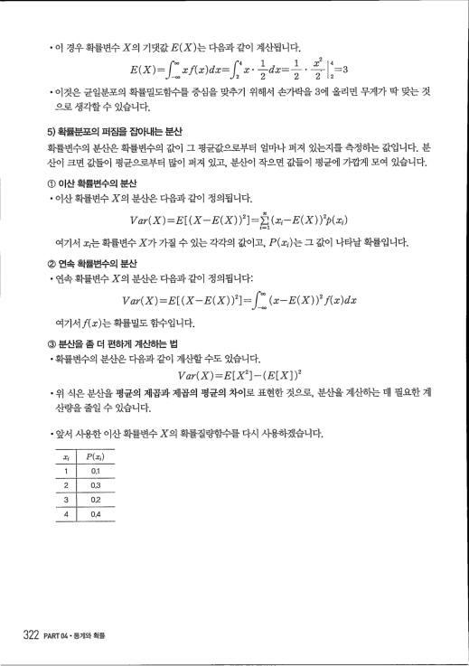
- 이 경우 확률변수 x의 기댓값 E(x）는 다음과 같이 계산됩니다．
## E(x)＝工ㅍxf(x)dx=f4 x·-1-dx금 뽕 4=3
2

- 이것은 균일분포의 확률밀도함수를 중심을 맞추기 위해서 손가락을 3에 올리면 무게가 딱 맞는 것
으로 생각할 수 있습니다． 5) 확률분포의 퍼짐을 잡아내는 분산 확률변수의 분산은 확률변수의 값이 그 평균값으로부터 얼마나 퍼져 있는지를 측정하는 값입니다 . 분 산이 크면 값들이 평균으로부터 많이 퍼져 있고 , 분산이 작으면 값들이 평균에 가깝게 모여 있습니다． （心 이산 확률변수의 분산

- 이산 확률변수 x의 분산은 다음과 같이 정의됩니다．
Var(X) =E[ (X- E (X) )2J =기 (x1-E (X) )2p(x) 여기서 xi는 확률변수 Z가 가질 수 있는 각각의 값이고 , P ( xf）는 그 값이 나타날 확률입니다． ② 연속 확률변수의 분산

- 연속 확률변수 ／의 분산은 다음과 같이 정의됩니다：
Var(X)=E[(X- E(X))2]= ( (x- E (X))2f(x)dx

- 7－閃
여기서 /(x）는확률밀도 함수입니다． ③ 분산을 좀 더 편하게 계산하는 법

- 확률변수의 분산은 다음과 같이 계산할 수도 있습니다．
Var(X)=E[X2]-(E[ XJ)2

- 위 식은 분산을 펑균의 제곱과 제곱의 펑균의 차이로 표현한 것으로 , 분산을 계산하는 데 필요한 계
산량을 줄일 수 있습니다．

- 앞서 사용한 이산 확률변수 x의 확률질량함수를 다시 사용하겠습니다．
P(x) 0 .1 03 02 0.4 322 PART 04·통계와확률

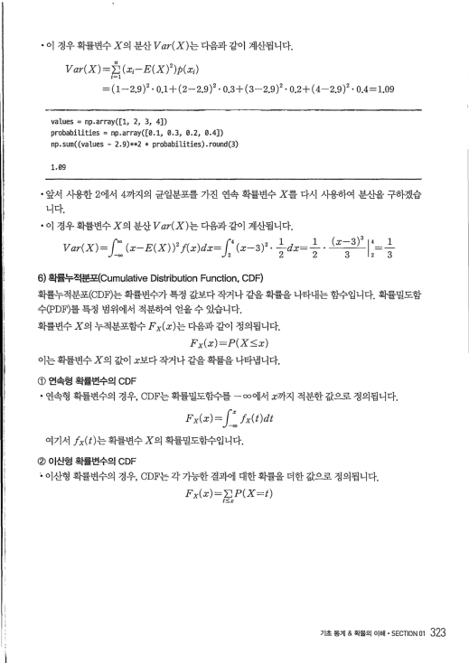
- 이 경우 확률변수 Z의 분산 γαγ（兀）는 다음과 같이 계산됩니다．
Var(Z)=憂길(xf-E (x) " ）夕(xe) =(1_2.9)2. 0.1+(2_2.9)2. 0.3+(3_2.9)2. 0.2+(4_2.9)2. 0.4=1.09

```python
values = np.array([1, 2, 3, 4]) 
probabilities = np.array({0.1, 0.3, 0.2, 0.4]) 
np.sum((values - 2.9)**2 * probabilities).round(3)
```
1 .09

- 앞서 사용한 2에서 4까지의 균일분포를 가진 연속 확률변수 x를 다시 사용하여 분산을 구하겠습
니다．

### · 이 경우 확률변수 x의 분산 γar(X）는 다음과 같이 계산됩니다． 
. .

r閃 .

-- . -, . . ,"  . . .

(A .

. ," 1 .

1 楡－3낟 " -i Var(X)=J-: (x-E(X))2f(x)dx=J (x-3)2 --c1x=-- " -3 '"

- 
2 2 2 3 2 3 6) 확률누적분포（Cumulative Distribution Function, CDF) 확률누적분포（CDF）는 확률변수가 특정 값보다 작거나 같을 확률을 나타내는 함수입니다 . 확률밀도함 쉬PDF）를 특정 범위에서 적분하여 얻을 수 있습니다． 확률변수 x의 누적분포함수 ／구x(x）는 다음과 같이 정의됩니다． ／구z(x) =/)(x三지 이는 확률변수 x의 값이 x보다 작거나 같을 확률을 나타냅니다． ① 연속형 확률변수의 CDF

- 연속형 확률변수의 경우 , CDF는 확률밀도함수를 －α〕에서 x까지 적분한 값으로 정의됩니다．
# Fx(x)=f fx(t)dt
여기서 八(t）는 확률변수 兀의 확률밀도함수입니다． ② 이산형 확률변수의 CDF ' 이산형 확률변수의 경우 , CDF는 각 가능한 결과에 대한 확률을 더한 값으로 정의됩니다． ／구x(x) =E ／〕（Z=t) t드x 기초통겨l & 확률으＇ 이해 · SECTION 01 323

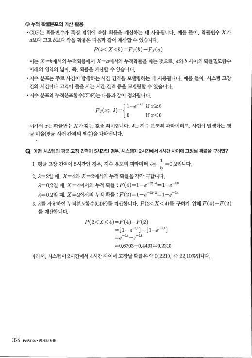
③ 누적 확률분포의 계산 활용

- CDF는 확률변수가 특정 범위에 속할 확률을 계산하는 데 사용됩니다 . 예를 들어 , 확률변수 X가
α보다 크고 b보다 작을 확률은 다음과 같이 계산할 수 있습니다． P(a<X< b)=F (b) - Fx(a) 이는 x= b에서의 누적확률에서 x＝α에서의 누적확률을 빼는 것으로 , α와 b 사이의 확률밀도함수 아래의 영역의 넓이 , 즉 , 확률을 계산할수 있습니다．

- 지수 분포는 주로 사건이 발생하는 시간 간격을 모델링하는 데 사용됩니다 . 예를 들어 , 시스템 고장
간의 시간이나 고객이 줄을 서는 시간 간격 등을 모델링할 수 있습니다．

- 지수 분포의 누적분포함수（CDF）는 다음과 같이 정의됩니다．
11-e－枇 if x쑈O F,(x: ,fl= 〔0 if x< O 여기서 x는확률변수 Z가 갖는 값을 의미합니다 . ㅅ는 지수분포의 파라미터로 , 사건이 발생하는 평 균 비율（평균 사건 간격의 역수）을 나타냅니다． q 어떤 시스템의 평균 고장 간격이 5시간인 경우 , 시스템이 2시간에서 4시간 사이에 고장날 확률을 구하면？

## 1. 평균고장간격이 5시간인경우， 
지수분포의피콰미터 ㅅ는숭=0.2입니다．

2. A=2일 때 , X=4와X=2에서의 누적 확률을각각구합니다．
```python
A=0.2일 때 , X=4에서의 누적 확률 : F (4) =1- e-o2 "4=1- e-0'8
```
ㅅ＝O . 2일 때 , X=2에서의 누적 확률 : F (2)=1－召－o"2 " 2=1－召ㅔ

3. ㅅ를 사용하여 누적분포함수（CDF）를 계산합니다 . P(2<X< 4）를 구하기 위해 F (4)-F (2) 
를 계산합니다． P(2<X< 4)=F(4)-F (2) = [1- e-o'8] -[1- e-o"4J =e-0"4-e-0"8 = 0.6703 - 0.4493:= 0.2210 따라서 , 시스템이 2시간에서 4시간사이에 고장날확률은 약 0.2210 , 즉 22.10％입니다． 324 PART04．통계와확률

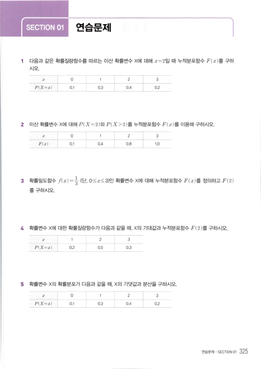
# SECTION 01 
연습문제 ㅣ 다음과 같은 확률질량함수를 따르는 이산 확률변수 ×에 대해 x=2일 ［대 누적분포함수 ／긱 . 끼를 구하 시오． ,z· 0 1 2 3 P(X=x) 0.1 0.3 0.4 0.2 2 이산 확률변수 ×에 대해 P(x= 2）와 'D(X) .2）를 누적분포함수 } ' ( . 끼를 이용해 구하시오． 0 1 2 3 0.1 0.4 0.8 1.0 3 확률밀도함수／(x) =읗（단，O二x三3）인확률변수×에대해누적분포함수F(x）를정의하고F(2) 를 구하시오． 4 확률변수 ×0ㅔ 대한 확률질량함수가 다음과 같을 때 , ×의 기대값과 누적분포함수 F (2）를 구하시오． 劣 －…f…－---1…－∼…－-- 2- - 3 P(X= I 02 0.

3 5 확률변수 ×의 확률분포가 다음과 같을 때 , ×의 기댓값과 분산을 구하시오．

# x 
0 P(X=x) t  。.1 3 0.2 연습문제．SECTION 01 325

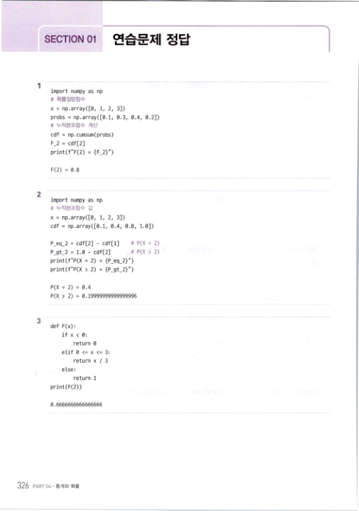
## SECTION 01 
연습문제 정답

```python
import numpy as np 
# 확률질량함수
x = np.array([0, 1, 2, 3])
probs = np.array([0.1, 0.3, 0.4, 0.2]) 
# 누적분포함수 계산
cdf = np.cumsum(probs)
F_2 = cdf[2] 
print(f "F(2) = {F_2}")
```
F(2) = 0.8

```python
import numpy as np 
# 누적분포함수 값
x = np.array([0, 1, 2, 3])
cdf = np.array([0.1, 0.4, 0.8, 1.0])
P_eq_2 = cdf[2] - cdf[1] 
if P(X = 2)
P_gt_2 = 1.0 - cdf[2] 
if P(X > 2) 
print(f "P(X = 2) = {P_eq_2}") 
print(f "P(X > 2) = {P_gt_2}")
```
P(X = 2) = 0.4 P(X > 2) = 0.19999999999999996

```python
def F(x): 
if x < 0: 
return 0 
elif 0 <= x <= 3: 
return x / 3 
else: 
return 1 
print(F(2))
```
0. 6666666666666666
326 PART 04．통계와확률

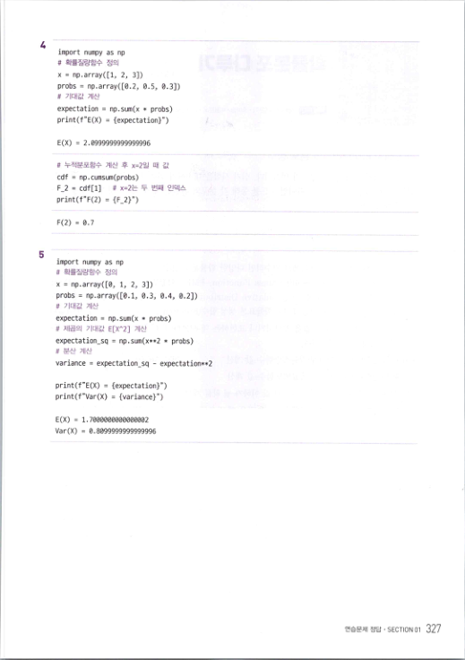
```python
4 
import numpy as np 
# 확률질량함수 정의
x = np.array([1, 2, 31) 
probs = np.array([0.2, 0.5, 0.3]) 
# 기대값 계산
expectation = np.sum(x * probs) 
print(f"E(X) = {expectation}")
```
E(X) = 2.0999999999999996

```python
# 누적분포함수 계산 후 x=2일 때 값 
cdf = np.cumsuni(probs)
F_2 = cdf[刀 
# x=2는 두 번째 인덱스 
print(f "F(2) = {F_2}")
```
F(2) = 0.7

```python
import numpy as np 
# 확률질량함수 정의
x = np.array([0, 1, 2, 3]) 
probs = np.array([0.1, 0.3, 0.4, 0.2]) 
# 기대값 계산
expectation = np.sum(x * probs) 
# 제곱의 기대값 타X^2〕 계산
expectation_sq = np.sum(x**2 * probs) 
# 분산 계산
variance = expectation_sq - expectation**2
print(f"E(X) = {expectation}") 
print(f "Var(X) = {variance}")
```
E(X) = 1.7000000000000002 Var(X) = 0.8099999999999996 연습문제정답· SECTION 01 327


# SECTION 02
# 확률분포 다루기
난 이 도 @) 핵심 태그 SCIPY · 베르누이 · 포아송 · 이항분포 · 장규분포 · 카이제곱 · ／분포 · F」 포 반복학습 " .

.

.SciPy 라이브러리와 분포 함수 통계에는 여러 유명한 확률분포가 있습니다 . 실기 시험을 대비하기 위해서 그 중 가장 기본이 되는 확 률분포들에 대하여 알아보고 , 파이썬 코드를 통해 각 분포와 관련된 계산들을 어떻게 수행할 수 있는 지 공부해 봅시다． 이 섹션에서 여러분이 특히 주의해서 길러야 할 능력이 있습니다 . 바로 각 분포별 확률계산들에 대하 여 , 파이썬 SciPy 라이브러리에서 제공하는 함수들 중 알맞은 함수를 사용하여 계산할 수 있는 능력 입니다． SciPy 라이브러리는 통계 분적에서 필수적인 다양한 확률분포 함수를 제공합니다 . 이에 속하는 주요 함수들은 확률질량함수（Probability Mass Function, PMF) , 확률밀도함수（Probability Density Function, PDF) , 누적분포함수（Cumulative Distribution Function, CDF) , 분위수 함수（Per- cent Point Function, PPF) , 그리고확률표본 생성 함수（Random Variates, RVS) 등이 있습니다 .

각 함수는 확률 분포의 특정 값을 계산하거나 표현하는 데 사용되며 , 이를 통해 시험에서 사용되는 여 러 계산을 쉽게 할 수 있습니다．

- 확률질링=수〈PMF) : 이산형 확률질량함수 값 계산
- 확률밀도함수〈PDF) : 연속형 확률밀도함수 값 계산
- 누적분포함쉬CDF) : 분포에서 주어진 값 이하가 될 확률 계산
- 생존함수〈SF) : 1에서 누적분포함수（CDF) 값을 뺀 값으로 , 분포에서 주어진 값 이상이 될 확률 계산
- 분위수 함쉬PPF) : 누적분포함수＜CDF）의 역함수로 , 주어진 확률에 해당하는 분포의 값（분위수） 계산
- 확률표본함수〈RVS) : 지정된 분포에서 표본 발생
SciPy 라이브러리는 각 분포별로 위의 함수들을 포함하고 있으므로 위 함수들을 자유롭게 사용하는 방법을 알고 있는 것이 좋습니다． 328 PART04．통계와확률

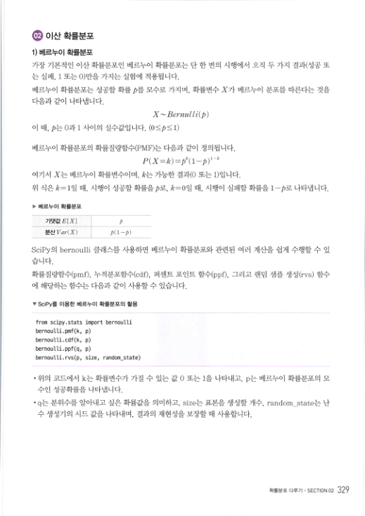
.

이산 확률분포 1) 베르누이 확률분포 가장 기본적인 이산 확률분포인 베르누이 확률분포는 단 한 번의 시행에서 오직 두 가지 결과（성공 또 는 실패 , 1 또는 0）만을 가지는 실험에 적용됩니다． 베르누이 확률분포는 성공할 확률 /）를 모수로 가지며 , 확률변수 x가 베르누이 분포를 따른다는 것을 다음과 같이 나타냅니다． x- Bernullf(/D 이 때 , 夕는 0과 1 사이의 실수값입니다 . (o二p二1) 베르누이 확률분포의 확률질량함수（PMF）는 다음과 같이 정의됩니다． P(X=k)=?(1－夕) 1-k 여기서 x는 베르누이 확률변수이며 , 力는 가능한 결과＜0 또는 1）입니다． 위 식은k= 1일 때 , 시행이 성공할확률을／）로 ,k=0일 때 , 시행이 실패할확률을 1-夕로 나타냅니다． 》 베르누이 확률분포 기댓값 E[ 兀］ 분산γαγ（/ ) SciPy의 bernoulli 클래스를 사용하면 베르누이 확률분포와 관련된 여러 계산을 쉽게 수행할 수 있 습니다． 확률질량함수（pmf) , 누적분포함수（cdf) , 퍼센트 포인트 함수（ppf) , 그리고 랜덤 샘플 생성（rvs) 함수 에 해당하는 함수는 다음과 같이 사용할 수 있습니다． V SciPy를 이용한 베르누이 확률분포의 활용

```python
from scipy.stats import bernoulli 
bernoulli.pmf(k, p) 
bernoulli.cdf(k, p) 
bernoulli.ppf (q, p) 
bernoulli.rvs(p, size, random_state)
```
- 위의 코드에서 k는 확률변수가 가질 수 있는 값 0 또는 1을 나타내고 , p는 베르누이 확률분포의 모
수인 성공확률을 나타냅니다．

- q는 분위수를 알아내고 싶은 확률값을 의미하고 , size는 표본을 생성할 개수 , random_state는 난 
수 생성기의 시드 값을 나타내며 , 결과의 재현성을 보장할 때 사용합니다． 확률분포 다루기 · SECTION 02 329

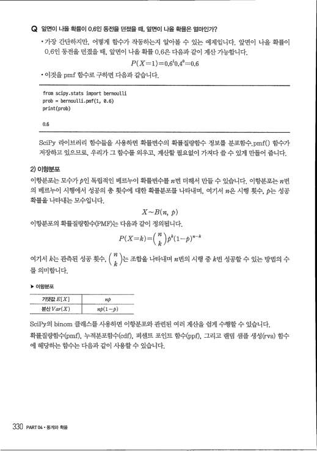
Q 앞면이 나올 확률이 0.6인 동전을 던졌을 때 , 앞면이 나올 확률은 얼마인가？ ' 가장 간단하지만 , 어떻게 함수가 작동하는지 알아볼 수 있는 예제입니다 . 앞면이 나올 확률이 0.6인 동전을 던졌을 때 , 앞면이 나올 확률 0.6은 다음과 같이 계산 가능합니다． P(X=1)=o.6'o.4.=o.6

- 이것을 pmf 함수로 구하민다음과 같습니다．
```python
from scipy.stats import bernoulli 
prob = bernoulli.pmf(1, 0.6) 
print(p rob)
```
0.6 SciPy 라이브러리 함수들을 사용하면 확률변수의 확률질량함수 정보를 분포함수 . pmf() 함수가 저장하고 있ㅇ ㅁ 무 , 우리가 그 함수를 외우고 , 계산할 필요없이 가져다 쓸 수 있게 만들어 줍니다． 2) 이항분포 이항분포는 모수가 o1 J- t- 독립적인 베르누이 확률변수를 n번 더해서 만들 수 있습니다 . 이항분포는 n번 의 베르누이 시행에서 성공의 총 횟수에 대한 확률분포를 나타내며 , 여기서 n은 시행 횟수 , 少는 성공 확률을 나타내는 모수입니다． X- B(n, p) 이항분포의 확률질량함수（PMF）는 다음과 같이 정의됩니다．

### P('Z＝冷）'＝센 沙（'1－少r2．冷 
" \ 芹 /f " 여기'서 k는관측된 성공횟'수 ,' 센 ）는조합을나타내'며 fl번의' 시'행 중k번 성공할수 있'는방법의' 수 ' - ' - '

- '- ' - 
-' → / " ,' \ k I -  -

- 
- - 
' " " -

- 
- - 
' " " .- I I I_I I_I - I_ I_I I_I C I ∼ ' I__ I_I I_.I P 를 의미합니다．

> 이항분포
기댓값E［兀］ n夕 분스nTar(X) np(1 -p) SciPy의 binom 클래스를 사용하면 이항분포와 관런된 여러 계산을 쉽게 수행할 수 있습니다． 확률질량함수（pmf) , 누적분포함수（cdf) , 퍼센트 포인트 함수（ppf) , 그리고 랜덤 샘플 생성（rvs) 함수 에 해당하는 함수는 다음과 같이 사용할 수 있습니다． 330 PART 04．통계와확률

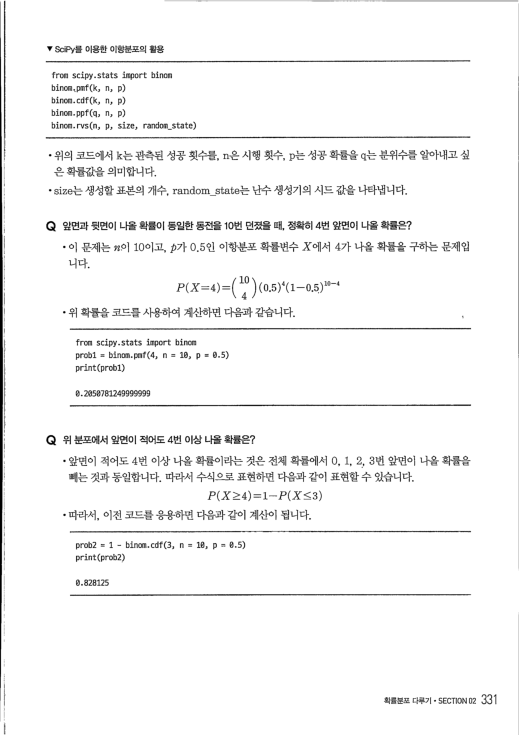
V SciPy를 이용한 이항분포의 활용

```python
from scipy.stats import binom
```
binom`pmf(k, n, p) binorn.cdf(k, n, p) binoni.ppf(q, n, p) binom.rvs(n, p, size, random_state)

- 위의 코드에서 k는 관측된 성공 횟수를 , II은 시행 횟수 , p는 성공 확률을 q는 분위수를 알아내고 싶
은 확률값을 의미합니다．

- size는 생성할 표본의 개수 , random_state는 난수 생성기의 시드 값을 나타냅니다．
Q 앞면과 뒷면이 나올 확률이 동일한 동전을 10번 던쳤을 때， 정확히 4번 앞면이 나올 확률은？

- 이 문제는 n이 10이고 , 夕가 0.5인 이항분포 확률변수 x에서 4가 나올 확률을 구하는 문제입
니다．

# P(Z=4)=（鬱 ) (O.5) "(1-O.5)' " '"
- 위 확률을 코드를 사용하여 계산하면 다음과 같습니다．
```python
from scipy.stats import binom 
probi = binom.pmf(4, n = 10, p = 0.5) 
print(probi)
```
0.2050781249999999 《고 위 분포에서 앞면이 적어도 4번 이상 나올 확률은？

- 앞면이 적어도 4번 이상 나올 확률이라는 것은 전쳬 확률에서 0, 1, 2, 3번 앞면이 나올 확률을
빼는 것과 동일합니다 . 따라서 수식으로 표현하면 다음과 같이 표현할 수 있습니다． P(X스4)=1-P(X二3)

- 따라서 , 이전 코드를 응용하면 다음과 같이 계산이 됩니다．
```python
prob2 = 1 - binom.cdf(3, n = 10, p = 0.5) 
print(prob2)
```
0. 828125
확률분포다루기．SECTION 02 331

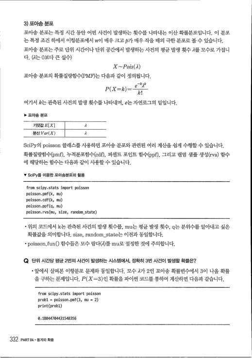
3) 포0陪 분포 포아송 분포는 특정 시간 동안 어떤 사건이 발생하는 횟수를 나타내는 이산 확률분포입니다 . 이 분포 는 특정 조건 하에서 이항분포에서 n이 매우 크고少가 매우 작을 때의 극한 분포로 볼 수 있습니다． 포아송 분포는 주로 단위 시간이나 단위 공간에서 발생하는 사건의 평균 발생 횟수 ㅅ를 모수로 가집니 다 . (A는0보다큰실수） X- Pois(A) 포아송 분포의 확률질량함수（PMF）는 다음과 같이 정의됩니다．

## P(X=k)= 눗！ ’
- 
.

-, .

.

여기서 k는 관측된 사건의 발생 횟수를 나타내며 , 召는 자연로그의 밑입니다．

* 포아송 분포
기댓값E[x〕 분산γαγ（兀） 穴 SciPy의 Poisson 클래스를 사용하면 포아송 분포와 관련된 여러 계산을 쉽게 수행할 수 있습니다． 확률질량함수(pmf) , 누적분포향논(cdf) , 퍼센트 포인트 함수（ppf) , 그리고 랜덤 샘플 생성（rvs) 함수 에 해당하는 함수는 다음과 같이 사용할 수 있습니다． 'V SciPy를 이용한 포아송분포의 활용

```python
from scipy.stats import poisson 
poisson. pmf(k, mu) 
poisson. cdf(k, mu) 
poisson. ppf(q, mu) 
Poisson. rvs (mu, size, random_state)
```
- 위의 코드에서 k는 관측된 사건의 발생 횟수를 , mu는 평균 발생 횟수 , q는 분위수를 알아내고 싶은
확률값을의미합니다 . size, random_state는이전과동일합니다．

- poisson.fun() 함수들은 모수 람다（A）를 mu로 설정한 것에 주의합니다．
Q 단위 시간당 평균 2번의 사건이 발생하는 시스템에서 , 정확히 3번 사건이 발생할 확률은？

- 앞에서 살펴본 이항분포 문제와 동일합니다 . 모수 ㅅ가 2인 포아송 확률변수에서 3이 나올 확률 
을 구하는 문제입니다 . P(X=3) 인 확률을 파이썬 코드를 통하여 계산하면 다음과 같습니다．

```python
from scipy.stats import poisson 
prob]. = poisson.pmf(3, mu = 2) 
print(probl)
```
0.18044704431548356 332 PART 04．통계와확률

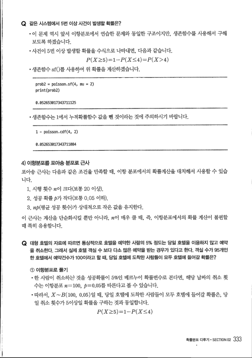
Q 같은 시스템에서 5번 이상 사건이 발생할 확률은？

- 이 문제 역시 앞서 이항분포에서 연습한 문제와 동일한 구조이지만 , 생존함수를 사용해서 구해
보도록 하겠습니다．

- 사건이 5번 이상 발생할 확률을 수식으로 나타내면 , 다음과 같습니다．
P(X브5)=1-P(X二4)=P(X>4)

- 생존함수 sf(）를 사용하여 위 확률을 계산하겠습니다．
```python
prob2 = poisson.sf(4, mu = 2) 
print(prob2)
```
0.052653017343711125

- 생존함수는 1에서 누적확률함수 값을 뺀 것이라는 것에 주의하시기 바랍니다．
1 - poisson.cdf(4, 2) 0.052653017343711084 4) 이항분포를 포0陪 분포로 근사 포아송 근사는 다음과 같은 조건을 만족할 때 , 이항 분포에서의 확률계산을 대치해서 사용할 수 있습 니다． 1 . 시행 횟수 n이 크다（보통 20 이상）.

2 . 성공확률力가작다（보통0.05 이하）.

3. nj（평균성공횟수）가상대적으로작은값을유지한다．
이 근사는 계산을 단순화시킬 뿐만 아니라 , 凡이 매우 클 때 , 즉 , 이항분포에서의 확률 계산이 불편할 때 특히 유용합니다． Q 대형 호텔의 자료에 따르면 통상적으로 호텔을 예약한 사람의 5% 정도는 당일 호텔을 이용하지 않고 예약 을 취소한다 , 그래서 실제 호텔 객실 수 보다 다소 많은 예약을 받는 경우가 있다고 한다 , 객실 수가 95개인 한 호텔에서 예약건수가 100이라고 할 때 , 당일 호텔에 도착한 사람들이 모두 호텔에 들어갈 확률은？ ① 이항분포로 풀기

- 한 사람이 취소하믄 것을 성공확률이 5％인 베르누이 확률변수로 본다면 , 해당 날짜의 취소 횟
수는 이항분포 n= 100, 少=0.05를 따른다고 볼 수 있습니다．

- 따라서 , x- -B(100, 0.05）일 때 , 당일 호텔에 도착한사람들이 모두 호텔에 들어갈확률은 , 당
일 취소 횟수가 5이상일 확률을 구하는 것과 동일합니다． P(X브5)=1-P(X二4) 확률분포다루기．SECTION 02 333

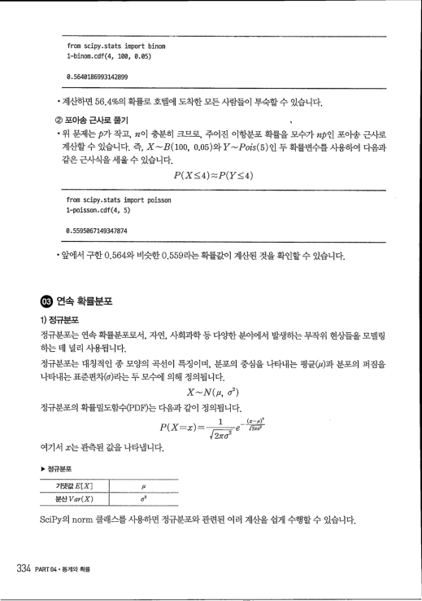
```python
from scipy.stats import binom 
1-binom.cdf(4, 100, 0.05)
```
0.5640186993142899

- 계산하면 56.4％의 확률로 호텔에 도착한 모든 사람들이 투숙할 수 있습니다．
② 포아송 근사로 풀기 ' 위 문제는 夕가 작고 , 'z이 충분히 크므로 , 주어진 이항분포 확률을 모수가 np인 포아송 근사로 계산할수 있습니다 . 즉 , X---B(lOo, 0.05）와Y-Pois( 5）인 두확률변수를사용하여 다음과 같은 근사식을 세울 수 있습니다． P（兀三4) ==P(Y三4)

```python
from scipy.stats import Poisson 
1-poisson. cdf(4, 5)
```
0.5595067149347874

- 앞에서 구한 0.564와 비슷한 0.559라는 확률값이 계산된 것을 확인할 수 있습니다．
ㅇ 연속 확률분포 1) 정규분포 出구분포는 연속확률분포로서 , 자연 , 사회과학등 다양한분야에서 발생하는무작위 현상들을모델링 하는 데 널리 사용됩니다． 정규분포는 대칭적인 종 모양의 곡선이 특징이며 , 분포의 중심을 나타내는 평균（β）과 분포의 퍼짐을 나타내는 표준편차（(1）라는 두 모수에 의해 정의됩니다． Z- N (p, 2) 정규분포의 확률밀도함수（PDF）는 다음과 같이 정의됩니다．

- . - 
.

1 ／久A＝꺼＝ ' , e 7 27ro" (x- p)2 ／騙긍7 여기서 x는 관측된 값을 나타냅니다． 》정규분포 기댓값￡［x〕 p 분산γαγ（지 ￡72 SciPy의 norm 클래스를 사용하면 정규분포와 관련된 여러 계산을 쉽게 수행할 수 있습니다． 334 PART 04．통계와확률

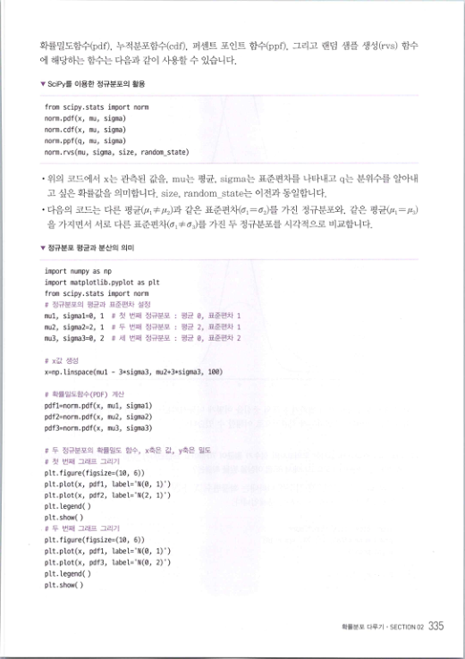
확률밀도함수(pdf) , 누적분포함수（cdf) , 퍼센트 포인트 함수（ppf) , 그리고 랜덤 샘플 생성（rvs) 함수 에 해당하는 함수는 다음과 같이 사용할 수 있습니다． V SciPy를 이용한 정규분포의 활용

```python
from scipy.stats import norm
```
norm.pdf(x, mu, sigma) norm.cdf(x, mu, sigma) norm.ppf(q, mu, sigma) norm.rvs(mu, sigma, size, random_state)

- 위의 코드에서 x는 관측된 값을 , mu는 평균 , sigma는 표준편차를 나타내고 q는 분위수를 알아내
고 싶은 확률값을 의미합니다 . size, random_state는 이전과 동일합니다．

- 다음의 코드는 다른 평균（p1쑤P2）과 같은 표준편차（戚1＝아）를 가진 정규분포와 , 같은 평균（pl= /13)
을 가지면서 서로 다른 표준편차（C.1쑤C.3）를 가진 두 州子분포를 시각적으로 비교합니다． ▼ 정규분포 평균과 분산의 의미

```python
import numpy as np 
import matpiotiib.pypiot as pit
from scipy.stats import norm
# 정규분포의 평균과 표준편차 설정
mul, sigmal=O, 1 
# 첫 번째 정규분포 : 펑균 0, 표준편차 1
mu2, sigma2=2, 1 
# 두 번째 정규분포 : 평균 2, 표준편차 1
mu3, s1gma3=0, 2 
# 세 번째 정규분포 : 평균 0, 표준편차 2
# x값 생성
x=np.iinspace(mul - 3*sigma3, mu2+3*s1gma3, 100)
# 확률밀도함수（PDF) 계산 
pdfl=norm.pdf(x, mul, sigmal)
pdf2=norm.pdf(x, mu2, sigma2)
pdf3=norm.pdf(x, mu3, sigma3)
# 두 정규분포의 확률밀도 함수， x축은 값， y축은 밀도
```
# 첫 번째 그래프 그리기 
pit.figure(figsize=(10, 6)) pit.piot(x, pdfl, iabei= 'N(0, 1) ') plt.piot(x, pdf2, labei= 'N(2, 1) ') pit.iegend( ) pit. show( )

# 두 번째 그래프 그리기 
pit. figure(figsize=(10, 6)) pit.piot(x, pdfl, iabei= 'N(0, 1) ') pit.piot(x, pdf3, iabei='N(O, 2) ') pit .iegend( ) pit. show( ) 확률분포 다루기 . SECTION 02 335

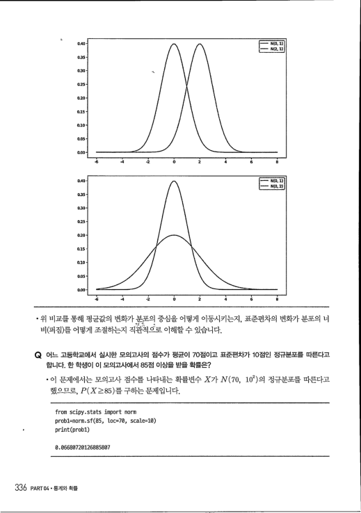
' 』2 0 6 8 2 ' 0 4 8

- 위 飾고를 통해 평균값의 변화가 분포의 중심을 어떻게 이동시키는지 , 표준편차의 변화가 분포의 너
비（퍼짐）를 어떻게 조절하는지 직관척흐로이해할수 있습니다．.

Q 어느 고등학교에서 실시한 모의고차의 점수가 평균이 70점이고 표준편차가 10점인 정규분포를 따른다고 합니다 . 한 학생이 이 모의고차에서 85점 이상을 받을 확률은？

- 이 문제에서는 모의고사 점수를 나타내는 확률변수 兀가 N (70, 102）의 정규분포를 따른다고
했으므로 , P (x스85）를구하는문제입니다．

```python
from scipy.stats import norm 
probl=norm. sf(85, loc=70, scaie=10) 
print(probl)
```
0. 06680720126885807
336 PART 04．통계와확률

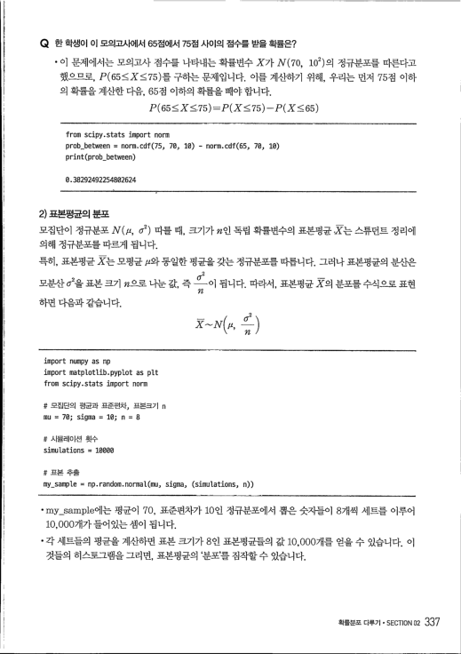
Q 한 학생이 이 모의고사에서 65점에서 75점 사이의 점수를 받을 확률은？

- 이 문제에서는 모의고사 점수를 나타내는확률변수 Z가 N (70, 102）의 정규분포를 따른다고
했으므로 , P(65三Z三75）를 구하는 문제입니다 . 이를 계산하기 위해 , 우리는 먼저 75점 이하 의 확률을 계산한 다음 , 65점 이하의 확률을 빼야 합니다． P(65三X.75)=P(X三75)-P (X二65)

```python
from scipy.stats import norm 
prob- between = norm.cdf(75, 70, 10) - norm.cdf(65, 70, 10) 
print(prob_between)
```
0.38292492254802624 2) 표본평균의 분포 모집단이 정규분포N(p, c2) 따를 때 , 크기가n인 독립 확률변수의 표본평균x는스튜던트 정리에 의해 정규분포를 따르게 됩니다． 특히 , 표본평균Z는모평균／z와동일한평균을갖는정규분포를따릅니다 . 그러나표본평균의 분산은

### 모분산α2을표본크기 n으로나눈값 , 즉쓰미 됩니다 . 따라서 , 표본평균x의 분포를수식으로표현 
1z 하면 다음과 같습니다． Z∼까〃 , 으스놈 \ ' 少z / 하면 다음과 같습니다．

```python
import numpy as np 
import matplotiib.pyplot as pit 
from scipy.stats import norm
# 모집단의 평균과 표준편차， 표본크기 n
mu = 70; sigma = 10; n = 8
# 시뮬레이션 횟수 
simulations = 10000
# 표본 추출
my_sample = np.random.normal(mu, sigma, (simulations, n))
```
' my_sample에는 평균이 70 , 표준편차가 10인 정규분포에서 뽑은 숫자들이 8개씩 세트를 이루어 10,000개가들어있는 셈이 됩니다． ' 각 세트들의 평균을 계산하면 표본 크기가 8인 표본평균들의 값 10,000개를 얻을 수 있습니다 . 이 것들의 히스토그램을 그리면 , 표본평균의 ' 분포’를 짐작할 수 있습니다． 확률분포다루기 .SECTION 02 337

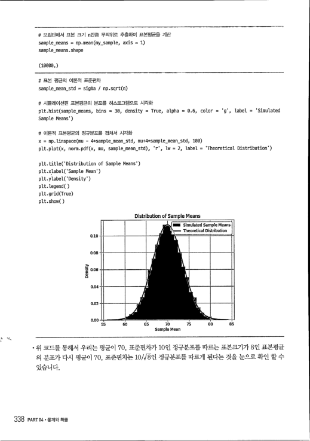
```python
# 모집단에서 표본 크기 n만큼 무작위로 추출하여 표본펑균을 계산
sample_means = np.mean(my-saniple, axis = 1)
```
sample_means.shape (10000,)

```python
# 표본 평균의 이론적 표준편차
sample_mean_std = sigiia I np.sqrt(n)
# 시뮬레이션된 표본펑균의 분포를 히스토그램으로 시각화 
plt.hist(sample_means, bins = 30, density = True, alpha = 0.6, color = 'g', label = 'Simulated
```
Sample Means')

```python
# 이론적 표본펑균의 정규분포를 겹쳐서 시각화
x = np.linspace(mu - 4*sarnple_niean_std, niu+4*sample_mean_std, 100) 
plt.plot(x, norm.pdf(x, mu, sample_mean_std), 'r ', 1w = 2, label = 'Theoretical Distribution')
```
plt.title ('Distribution of Sample Means') plt.xlabel.('Sample Mean') plt . y1abel('Density') plt.legend() plt.grid(True) plt.show()

# Distribution of Sample Means 
. 써.

unu ate' Sanip e Means / :，탤．- 轍eoretical Distribution U■·■

# U.", I ■ 
uJ』.

# n 
갈｀ . I ■ F ' ■ ■

# 一 
。.。

醜 0-a I ' ！뱀

# "` 
■ ■ I 빼 ∥■ 蠶 ∼ 씸 심 55

5. 
65 70 75 Sample Mean 80 85

- 위 코드를 통해서 우리는 평균이 70 , 표준편차가 10인 정규분포를 따르는 표본크기가 8인 표본평균
의 분포가 다시 평균이 70 , 표준펀차는 10/7啄인 蔘子분포를 따르게 된다는 것을 눈으로 확인 할 수 있습니다． 338 PART 04·통계와확률

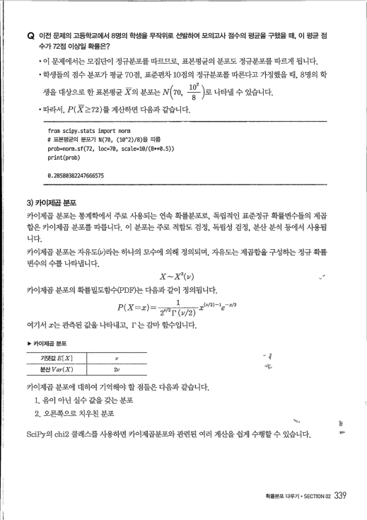
Q 이전 문제의 고등학교에서 8명의 학생을 무작위로 선발하여 모의고사 점수의 평균을 구했을 때 , 이 평균 점 수가 72점 이상일 확률은？

- 이 문제에서는 모집단이 정규분포를 따르므로 , 표본평균의 분포도 정규분포를 따르게 됩니다．
- 학생들의 점수 분포가 평균 70점 , 표준편차 10점의 정규분포를 따른다고 가정했을 때 , 8명의 학
# 생을대상으로한표본평균Z의분포는N
(70, 干）로나타낼수있습니다．

- 따라서 , P(X쑈72）를계산하면 다음과같습니다．
```python
from scipy.stats import norm 
# 표본평균의 분포가 N(7아 (10"2) /8）을 따름
prob=norm. sf(72, loc=70, scal.e=10/(8**0.5)) 
print(prob)
```
0.28580382247666575 3) 카이제곱 분포 카이제곱 분포는 통계학에서 주로 사용되는 연속 확률분포로 , 독립적인 표준出予 확률변수들의 제곱 합은 카이제곱 분포를 따릅니다 . 이 분포는 주로 적함도 검정 , 독립성 검정 , 분산 분석 등에서 사용됩 니다． 카이제곱 분포는 자유도（〃）라는 하나의 모수에 의해 정의되며 , 자유도는 제곱합을 구성하는 棚干 확률 변수의 수를 나타냅니다． X- X2(z) 카이제곱 분포의 확률밀도함수（PDF）는 다음과 같이 정의됩니다． x ' "/ 1e_ P 1, 여기서 x는관측된 값을나타내고 , F는감마힘수입니다．

> 카이제곱 분포
기댓값E［γ〕 z/ 분산γαγ（兀） 2v 카이제곱 분포에 대하여 기억해야 할 점들은 다음과 같습니다． 1 . 음이 아닌 실수 값을 갖는 분포 2 . 오른쪽으로 치우친 분포 ｀ㄴ SciPy의 ch12 클래스를 사용하면 카이제곱분포와 관련된 여러 계산을 쉽게 수행할 수 있습니다． 확률분포다루기. SECTION 02 339

### i
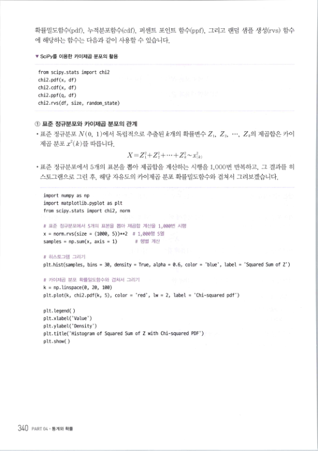
확률밀도함수（pdf) , 누적분포함수（cdf) , 퍼센트 포인트 함수(ppf) , 그리고 랜덤 샘플 생성（rvs) 함수 에 해당하는 함수는 다음과 같이 사용할 수 있습니다． V SciPy를 이용한 카이제곱 분포의 활용

```python
from scipy.stats import chi2 
chi2.pdf(x, df)
```
ch12.cdf(x, df) chi2.ppf(q, df) chi2.rvs(df, size, random_state) (I:) 표준 정규분포와 카이제곱 분포의 관계

- 표준 騙千분포 N (O, 1）에서 독립적으로 추출된 k개의 확률변수 幻 , 22, ' , 기의 제곱합은 카이
```python
제곱 분포 z 
x2(k）를 따릅니다． 
x=z;+z;+…+Z鷺-X]k)
```
- 표준 정규분포에서 5개의 표본을 뽑아 제곱합을 계산하는 시행을 1,000번 반복하고 , 그 결과를 히
스토그램으로 그린 후 , 해당 자유도의 카이제곱 분포 확률밀도함수와 겹쳐서 그려보겠습니다．

```python
import numpy as np 
import matpiotiib.pypiot as pit 
from scipy.stats import chi2, norm
# 표준 騈구분포에서 5개의 표본을 뽑아 제곱합 계산을 1,000번 시행
x = norm.rvs(size = (1000, 5))**2 # 1,000행 5열
samples = np.sum(x, axis = 1) 
# 행별 계산
# 히스토그램 그리기 
plt.hist(samples, bins = 30, density = True, alpha = 0.6, color = 'blue', label = 'Squared Sum of Z' )
# 카이제곱 분포 확률밀도함수와 겹쳐서 그리기
k = np.iinspace(0, 20, 100) 
pit.piot(k, chi2.pdf(k, 5), color = 'red', 1w = 2, label = ' Chi-squared pdf ')
```
pit. iegend( ) pit.xiabei( 'Value') pit. yiabei( 'Density') pit.title( 'Histogram of Squared Sum of Z with Chi-squared PDF') pit.show( ) 340 PART 04．통계와확률

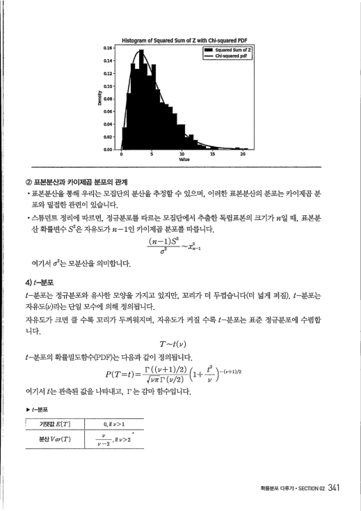
테stogram of Squared Sum of Z with Chi-squared PDF

0. 16
■■ Squared Sum of Z -- 댜il-squared pdf 0.14 . . 12 《걍．1.

台 0.08 0.06 0.04 0.02 0.00 20 ② 표본분산과 카이제곱 분포의 관계

- 표본분산을 통해 우리는 모집단의 분산을 추정할 수 있으며 , 이러한 표본분산의 분포는 카이제곱 분
포와 밀접한 관련이 있습니다．

- 스튜던트 정리에 따르면 , 蔘子분포를 따르는 모집단에서 추출한 독립표본의 크기가 n일 때 , 표본분
산 확률변수 S2은 자유도가 n- i인 카이제곱 분포를 따릅니다． /-1 \S2 i.n- ijS 戚2 蝦-1 여기서 α2는 모분산을 의미합니다． 4) t－분포 r－분포는 騙子분포와 유사한 모양을 가지고 있지만 , 꼬리가 더 두껍습니다（더 넓게 퍼짐） -t－분포는 자유도（〃）라는 단일 모수에 의해 정의됩니다． 자유도가 크면 클 수록 꼬리가 두꺼워지며 , 자유도가 커질 수록 t－분포는 표준 정규분포에 수렴합 니다． T-.-t(ii)

# t－분포의 확률밀도함수（PDF）는 다음과 같이 정의됩니다． 
∼∼ , ∼ P ((v+fl / 2놈'  ( . , t2 , -(+1)/2 - P(T=t)= ' fi F"(p/2) 난卞I'"" "' 여기서 t는관측된 값을나타내고 , 1'는감마함수입니다． 卜 t－분포 l 기댓값E〔T〕 O. if i'> l * 분산γαγ（T> V if if> 2 v- 2 ' " " 확률분포다루기 ·SECTION 02 341

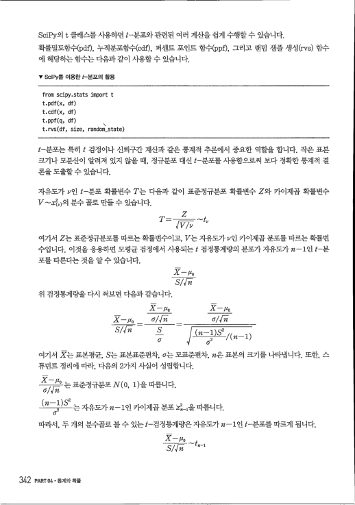
SciPy의 t 클래스를 사용하면 t－분포와 관런된 여러 계산을 쉽게 수행할 수 있습니다． 확률밀도함수（pdf) , 누적분포함수（cdf) , 퍼센트 포인트 함수(:ppf) , 그리고 랜덤 샘플 생성（rvs) 함수 에 해당하는 함수는 다음과 같이 사용할 수 있습니다． Y SciPy를 이용한 /－분포의 활용

```python
from scipy.stats import t 
t.pdf(x, df) 
t.cdf(x, df) 
t.ppf(q, df) 
t.rvs(df, size, random_state)
```
t－분포는 특히 t 검정이나 신뢰구간 계산과 같은 통계적 추론에서 중요한 역할을 합니다 . 작은 표본 크기나 모분산이 알려져 있지 않을 때 , 정규분포 대신 t－분포를 사용함으로써 보다 정확한 통계적 결 론을 도출할 수 있습니다．

## 자유도가 2)인 t－분포 확률변수 T는 다음과 같이 표준정규분포 확률변수 z와 카이제곱 확률변수 
γ∼璥）의 분수 꼴로 만들수 있습니다．

- 
z T= 淪ㅉ ∼漱" 여기서 z는표준蔘子분포를 따르는확률변수이고 , γ는 자유도가z／인 카이제곱분포를 따르는확률변 수입니다 . 이것을 응용하면 모평균 검정에서 사용되는 t 검정통계량의 분포가 자유도가 n- i인 t－분 포를 따른다는 것을 알 수 있습니다． Z- I.Lo S/J7 위 검정통계량을 다시 써보면 다음과 같습니다．

### Z- /zo 
Z- p0 Z－〃o 戚／石7 α／／石7

## (1 
I  (

## S
/ 2 ' /(n- 싱 α 여기서 X는 표본평균 , S는 표본표준편차 , α는 모표준편차 , 凡은 표본의 크기를 나타냅니다 . 또한 , 스 튜던트 정리에 따라 , 다음의 2가지 사실이 성립합니다． Z갯. 는표준정규분포N(O, 1）을띠릅니다． o/γ n 跡- i) S ' 는자유도가n-i인카이제곱분포沈2,.：을띠，릅니다． 따라서 , 두 개의 분수꼴로 볼 수 있는 t－검정통계량은 자유도가 n- i인 t－분포를 따르게 됩니다．

### X- p。 ．
S／心7 ∼r " "' 342 PART04．통계와확률

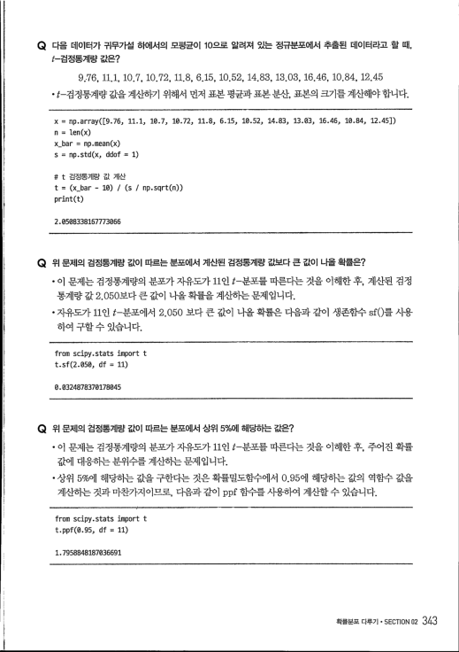
Q 다음 데이터가 귀무가설 하에서의 모평균이 10으로 알려져 있는 驪구분포에서 추출된 데이터라고 할 때， r－검정통계량 값은？ 9.76, 11.1, 10.7, 10.72, 11.8, 6.15, 10.52, 14.83, 13.03, 16.46, 10.84, 12.45 .t－검정통계량 값을 계산하기 위해서 먼저 표본 평균과 표본분산, 표본의 크기를 계산해야 합니다．

```python
x = np.array([9.76, 11.1, 10.7, 10.72, 11.8, 6.15, 10.52, 14.83, 13.03, 16.46, 10.84, 12.45])
n = len(x)
x_bar = np.mean(x)
S = np.std(x, ddof = 1)
# t 검정통계량 값 계산 
t 볍 (x_bar - 10) / (s / np.sqrt(n)) 
print(t)
```
2. 0508338167773066
Q 위 문제의 검정통계량 값이 따르는 분포에서 계산된 검정통계량 값보다 큰 값이 나올 확률은？

- 이 문제는 검정통계량의 분포가 자유도가 11인 t－분포를 따른다는 것을 이해한 후 , 계산된 검정
통계량 값 2.050보다 큰 값이 나올 확률을 계산하는 문제입니다．

- 자유도가 11인 t－분포에서 2.050 보다 큰 값이 나올 확률은 다음과 같이 생존함수 sf(）를 사용
하여 구할 수 있습니다．

```python
from scipy.stats import t 
t. sf(2.050, df = 11)
```
0.0324878370178045 Q 위 문제의 검정통계량 값이 따르는 분포에서 상위 5％에 해당하는 값은？

- 이 문제는 검정통계량의 분포가 자유도가 11인 t－분포를 따른다는 것을 이해한 후 , 주어진 확률
값에 대응하는 분위수를 계산하는 문제입니다．

- 상위 5％에 해당하는 값을 구한다는 것은 확률밀도함수에서 0.95에 해당하는 값의 역함수 값을
계산하는 것과 마찬가지이므로 , 다음과 같이 ppf 함수를 사용하여 계산할 수 있습니다．

```python
from scipy.stats import t 
t.ppf(0.95, df = 11)
```
1. 7958848187036691
확률분포다루기 ·SECTION 02 343

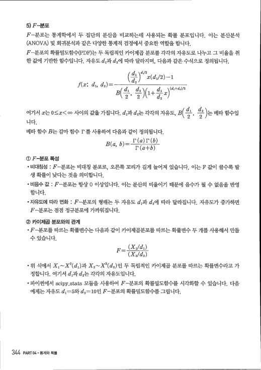
5) ／구분포 F－분포는 통계학에서 두 집단의 분산을 비교하는데 사용되는 확률 분포입니다 . 이는 분산분석 (ANOVA) 및 회귀분석과 같은 다양한 통계적 검정에서 중요한 역할을 합니다． ／구－분포의 확률밀도함수（PDF）는 두 독립적인 카이제곱 분포를 각각의 자유도로 나누고 그 비율을 취 한값에 기반한함수입니다 . 자유도 d1과‘12에 따라달라지며 , 다음과같은수식으로 정의됩니다． / (/ , ，띠／2 . -

## ｀索，7
x(d1/2)-1

# (1+ d1 \(d1+d2)/2
f (x; d1, d2)= ', I

## 여기서x는O三－사이의값을가집니다．
따과d2는각각의자유도， β（증， 층）는베타항수입 니다． 베타 함수 β는 감마 함수 1'를 사용하여 다음과 같이 정의됩니다． B b) ① F－분포 특성

- 비대칭성 : F－분포는 비대칭 분포로 , 오른쪽 꼬리가 길게 늘어져 있습니다 . 이는 F 값이 클수록 발 
생 확률이 낮다는 것을 의미합니다．

- 비음수 값 : ／구－분포는 항상 0 이상입니다 . 이는 분산의 비율이기 때문에 음수가 될 수 없음을 반영
합니다．

- 자유도에 따라 변화 : F－분포의 형태는 두 자유도 '/1과 d2에 따라 달라집니다 . 자유도가 증가하면
／구－분포는 점점 정규분포에 가까워집니다． ② 카이제곱 분포와의 관계

- ／구－분포를 따르는 확률변수는 다음과 같이 카이제곱분포를 따르는 확률변수 두 개를 사용해서 만들 
수 있습니다． , , (X,/d1) ／구＝ `．긴긴 " . 닐긴 ' /.

(X2/d2)

- 위 식에서 지∼Z2(띠）과 Z2∼Z2(外）인 두 독립적인 카이제곱 분포를 따르는 확률변수라고 가
정합니다 . 여기서 따과（12는 각각의 자유도입니다．

- 파이썬에서 scipy. stats 모듈을 사용하여 F－분포의 확률밀도함수를 시각화할 수 있습니다 . 다음
예제는 자유도 따=5와 따= 10인 ／구－분포의 확률밀도함수를 그립니다． 344 PART04．통계와확률

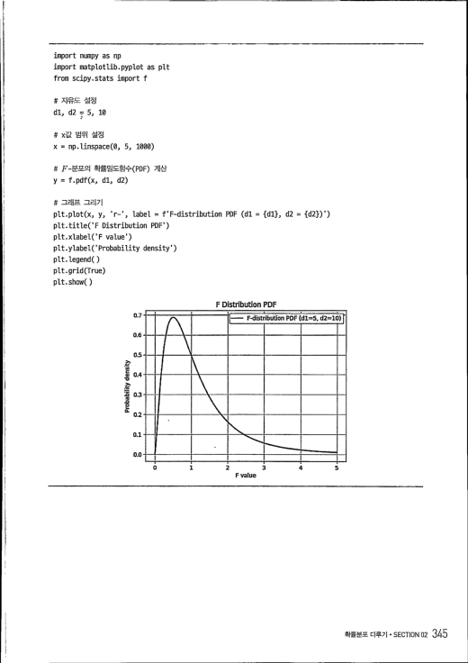
```python
import numpy as np 
import matplotl.ib.pyplot as plt 
from scipy.stats import f
# 자유도 설정 
dl, d2 = 5, 10
# X값 범위 설정
x = np.linspace(0, 5, 1000)
# /7－분포의 확률밀도함수（PDF) 계산
y = f.pdf(x, dl, d2)
```
# 그래프 그리기 
plt.pl.ot(x, y, 'r- ', label = f 'F-distribution PDF (dl = {dl}, d2 = {d2})') plt.titleCF Distribution PDF') plt.xlabel('F value') plt.ylabel( 'Probability density') plt.legend() plt.grid(True) pl.t. show() F Distiibution PDF -- F-distribution PD「 (dl=5, dZ=功》 0.7 0.6 5 4 쟈 ． 핍 룔 , 。

o 。

醱 夕 ＂ ㄷ 씜 鞭 ㅁ ∼ 싫 졍 枕 叭

# ∼
0.0 0 1 2 3 F value 4 5 확률분포다루기 .SECTION 02 345

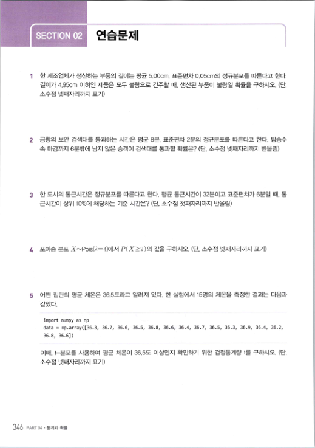
## 연습문제
I 한 제조업체가 생산하는 부품의 길이는 평균 5.00cm , 표준편차 0.05cm의 정규분포를 따른다고 한다． 길이가 4.95crr, 이하인 제품은 모두 불량으로 간주할 때 , 생산된 부품이 불량일 확률을 구하시오 . （단， 소수점 넷째자리까지 표기） 2 공항의 보안 검색대를 통과하는 시간은 평균 8분 , 표준편차 2분의 정규분포를 따른다고 한다 . 탑승수 속 마감까지 6분밖에 남지 않은 승객이 검색대를 통과할 확률은？ （단 , 소수점 넷째자리까지 반올림） 3 한 도시의 통근시간은 정규분포를 따른다고 한다 . 평균 통근시간이 32분이고 표준편차가 6분일 때 , 통 근시간이 상위 10％에 해당하는 기준 시간은？ （단 , 소수점 첫째자리까지 반올림） 4 포아송 분포 x∼Pois(A= 4）에서 P(x브2）의 값을 구하시오 . （단 , 소수점 넷째자리까지 표기） 5 어떤 집단의 평균 체온은 36.5도라고 알려져 있다 . 한 실험에서 15명의 체온을 측정한 결과는 다음과 같았다．

```python
import numpy as np 
data = np.array([36.3, 36.7, 36.6, 36.5, 36.8, 36.6, 36.4, 36.7, 36.5, 36.3, 36.9, 36.4, 36.2,
```
36.8, 36.6]) 이때 , t－분포를 사용하여 평균 체온이 36.5도 이상인지 확인하기 위한 검정통계량 t를 구하시오 . （단， 소수점 넷째자리까지 표기） 346 PARTOL.

통계와확률

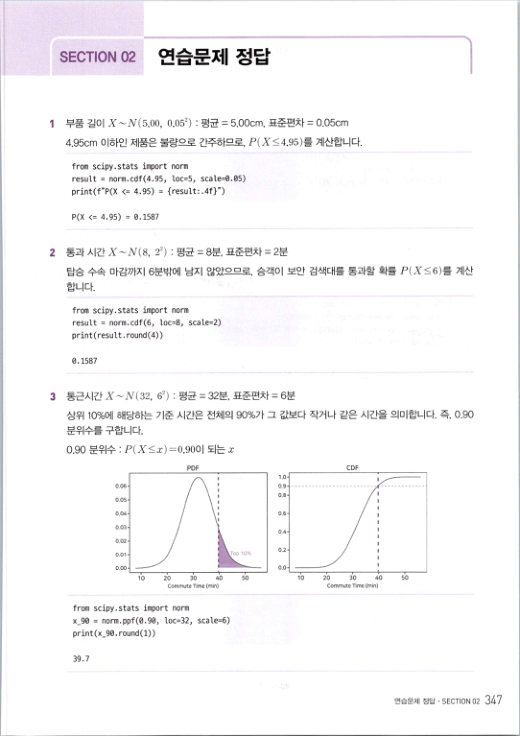
## SECTION 02 
연습문제 정답 I 부품 길이 x- --N(5.00, 0.052) : 평균 = 5.00cm , 표준편차 = 0.05cm 4.95cm 이하인 제품은 불량으로 간주하므로 , P( 兀 二 4.95）를 계산합니다．

```python
from scipy.stats import norm 
result = norm.cdf(4.95, loc=5, scale=0.05) 
print(f "P(X <= 4.95) = {result:.4f}")
```
P(X <= 4.95) = 0.1587 2 통과 시간 x∼ZV(8 , 才） : 평균 = 8분 , 표준편차 = 2분 탑승 수속 마감까지 6분밖에 남지 않았으므로 , 승객이 보안 검색대를 통과할 확률 P(x三6）를 계산 합니다．

```python
from scipy.stats import norm 
result = norm.cdf(6, loc=8, scale=2) 
print(result. round(4))
```
0. 1587
3 통근시간 兀-=-N(32, 62) : 평균 = 32분 , 표준편차 = 6분 상위 10％에 해당하는 기준 시간은 전체의 90％가 그 값보다 작거나 같은 시간을 의미합니다 . 즉 , 0.90 분위수를 구합니다． 0.90 분위수 : P(X三x) == 0.90이 되는 x CDF POF 0.06- 0.05뻐 o.04 - 0.03- 0.02- （〕끄 1 * 0.00- 20 30 40 50 10 20 30 40 Commute Time (mit) 50 10 Commute Time (mit)

```python
from scipy.stats import norm
x_90 = norm.ppf(0.90, loc=32, scale=6) 
print(x_90. round(1))
```
39.7 연습문제 정답． SECTION 02 347

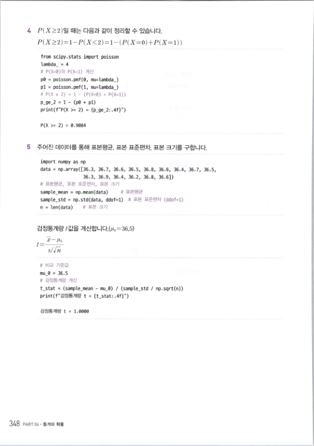
4 P(X스2）일 때는 다음과 같이 정리할 수 있습니다． P(X브2)=1- P(X<2)=1- (P(X=o)+P(X=1) )

```python
from scipy.stats import poisson
lambda = 4
# P(X=0）와 P(X=1) 계산
p0 = poisson.pmf(0, mu=lambda_)
p1 = poisson.pmf(1, mu=lambda_)
# P(X 쑈 2) = 1 - (P(X=0) + P(X=1))
p_ge_2 = 1 - (p0 + p1) 
print(f 'P(X >= 2) = {p_ge_2:.4f} ")
```
P(X >= 2) = 0.9084 5 주어진 데이터를 통해 표본평균 , 표본 표준편차 , 표본 크기를 구합니다．

```python
import numpy as np 
data = np.array({36.3, 36.7, 36.6, 36.5, 36.8, 36.6, 36.4, 36.7, 36.5, 
36.3, 36.9, 36.4, 36.2, 36.8, 36.6]) 
# 표본평균， 표본 표준편차， 표본 크기
sample_mean = np.mean(data) 
# 표본평균
sample_std = np.std(data, ddof=1) # 표본 표준편차 (ddof=1)
n = len(data) 
# 표본 크기
```
검정통계량 t값을 계산합니다 . (/z。 = 36.5)

```python
r= x - p0
```
s/石ㅌ

```python
# 비교 기준값
mu 0 = 36.5 
# 검정통계량 계산 
t_stat = (sample_mean - mu_0) / (sample_std / np.sqrt(n)) 
print(f " 검정통계량 t = {t_stat: .4f}")
```
검정통계량 t = 1.0000 348 PART 04．통계와확률
