# PART 05
# 통계적 추정과 검정
파트 소개 이 파트에서는 Python을 활용한 통계적 추정과 가설 검정을 학습합니다 . 데이터를 분 석할 때 평균 및 분산의 차이를 검정하는 다양한 방법을 배우며 . 장규성 검정 및 분산 분석（ANOVA）과 같은 고급 기법도 함께 다룹니다 . 또한, 분포 가정을 만족하지 않는 경우를 위한 비모수 검정 방법도 학습합니다． ◆ 주요 내용

- 통계적 추정과 가설 검정의 기본 개념 : 점추정 . 구간추정 , p^／테ue 해석 및 가설
검정 원리 .t－검정 : 1표본 , 독립 2 표본 . 대응표본 t－검정 및 Python을 활용한 실습

- 데이터 분포 확인과 장규성 검정 : 다섯 숫자 요약. 0-0 Plot , 샤피로－윌크 검정 및
카이제곱 적합도 검정

- 분산분석（ANOVA) : 그룹 간 평균 차이 검정 , F 검정 및 Tukey의 HSD 사후 검정
- 비모수 검정（Non-Parametric Test) : 윌콕슨 순위합 검정 . 맨－휘트니 U 검정 , 부호
검정 및 Levene 검정을 통한 등분산 검정

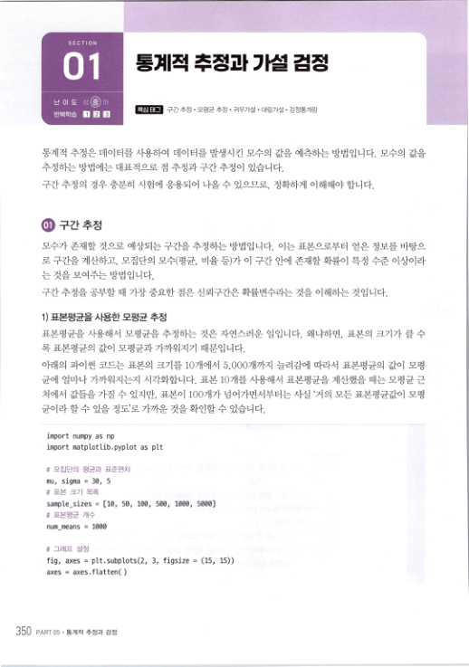
# SECTFON 
01

# 통계적 추정과 가설 검정
난 0 도 (．줄 트斗심 태그 구간 추정 · 모평균 추정 · 귀무가설 · 대립가설 · 검정통계량 반복학습 口 口 口 통계적 추정은 데이터를 사용하여 데이터를 발생시킨 모수의 값을 예측하는 방법입니다 . 모수의 값을 추정하는 방법에는 대표적으로 점 추정과 구간 추정이 있습니다． 구간추정의 경우 충분히 시험에 응용되어 나올 수 있으므로 , 정확하게 이해해야 함니다． .l 구간 추정 모수가 존재할 것으로 예상되는 구간을 추정하는 방법입니다 . 이는 표본으로부터 얻은 정보를 바탕으 로 구간을 계산하고 , 모집단의 모수（평균 , 비율 등）가 이 구간 안에 존재할 확률이 특정 수준 이상이라 는 것을 보여주는 방법입니다． 구간 추정을 공부할 때 가장 중요한 점은 신뢰구간은 확률변수라는 것을 이해하는 것입니다． 1) 표본평균을 사용한 모평균 추정 표본평균을 사용해서 모평균을 추정하는 것은 자연스러운 일입니다 . 왜냐하면 , 표본의 크기가 클 수 록 표본평균의 값이 모평균과 가까워지기 때문입니다． 아래의 파이썬 코드는 표본의 크기를 10개에서 5,000개까지 늘려감에 따라서 표본평균의 값이 모평 균에 얼마나 가까워지는지 시각화합니다 . 표본 10개를 사용해서 표본평균을 계산했을 때는 모평균 근 처에서 값들을 가질 수 있지만 , 표본이 100개가 넘어가면서부터는 사실 ' 거의 모든 표본평균값이 모평 균이라 할 수 있을 정도'로 가까운 것을 확인할 수 있습니다．

```python
import numpy as np 
import matpiottib.pypiot as pit
# 모집단의 평균과 표준 젼차
```
flu, sigma = 30, 5

```python
# 표본 크기 목록
sample_sizes = 〔10, 50, 100, 500, 1000, 5000]
# 표본평균 개수
```
num means = 1000

```python
# 그래프 설정 
fig, axes = plt.subpl.ots(2, 3, figsize = (15, 15))
axes = axes.flatten( )
```
350 PART 05．통계적추정과검정

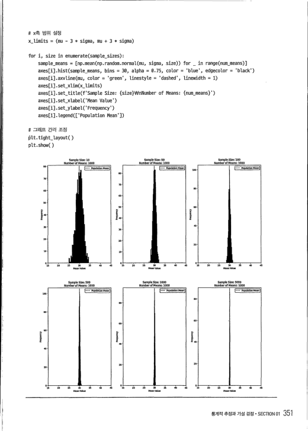
```python
# X축 범위 설정
x_limits = (mu - 3 * sigma, mu + 3 * sigma)
for 1., size in enumerate(sampl.e_sizes):
sample_means = [np.mean(np.random.normaL(mu, sigma, size)) for - in range(num_means)]
```
' black') axes[i] .hist(sample- means, bins = 30, alpha = 0.75, color = 'blue', edgecolor = axes{i] .axvline(mu, color = 'green', linestyle = 'dashed', linewidth = 1) axes[i] . set_xlim(x_limits) {num_means}') axes[i] .set_title (f 'Sample Size: {size}WnNumber of Means:

axes{i] .set_xlabel('Mean Value') axes[i] . set_ylabel('Frequency') axes[i] . legend([ 'Population Mean'] )

```python
# 그래프 간격 조정
```
r)lt. tight_layout() plt.show() SampleSize:100 ＇』umbcr 아 Means: `0沁〔》 Sam이eSize: 50 Number of Means: 1000 Sam비e Size: 10 Number ol Means: 1000 寥 g .

* 
■ 2, 1` `5 써 Mean vaNe 45 2s 知 Mean Value 25 찌 뜨 Mean VaNe 45 2.

ㅕ Sample Size: 1卯.

＇抽nber of Means: 11m.

Sample SIze: 5000 Number 이 Means: 1이沁 5ample 5吹쵸 5卯 "umb·『 .f ＂·an닭 1태）《） l- -Papd.0on Mean 卜－ opulu500 Neon 논－ PnpoNtloeMouoj 80 " 섧

# I
沙 ．

- - 松
욈 ∼ 纛 됴 ． .

． 出 2.

### 4 
z5 ㄻ 邵 " "n鞠묘u.

4. 
`5 0 】5

2. 
25 졉 조 ，勿』 ｀｀胞，u· m 45 래s 44 2` 찌 크驪 ㅐoS" 胞뇨＂ 2.

2.

통계적추정과가설검정．SECTICNOI 351

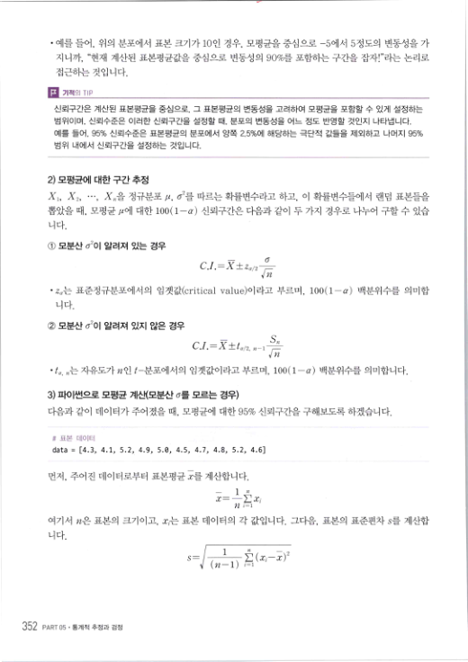
- 예를 들어 , 위의 분포에서 표본 크기가 10인 경우 , 모평균을 중심으로 -5에서 5정도의 변동성을 가
지니까, " 현재 계산된 표본평균값을 중심으로 변동성의 90％를 포함하는 구간을 잡ㅈㅐ " 라는 논리로 접근하는 것입니다． 신뢰구간은 계산된 표본평균을 중심으로 , 그 표본평균의 변동성을 고려하여 모평균을 포함할 수 있게 설정하는 범위이며 , 신뢰수준은 이러한 신뢰구간을 설정할 때 , 분포의 변동성울 어느 정도 반영할 것인지 나타냅니다． 예를 들어 , 95% 신뢰수준은 표본평균의 분포에서 양쪽 2.5％에 해당하는 극단적 값들을 제외하고 나머지 95% 범위 내에서 신뢰구간을 설정하는 것입니다． 2) 모평균에 대한 구간 추정 xl , x2, … , Z , 을 蔘予분포 β , a2를 따르는 확률변수라고 하고 , 이 확률변수들에서 랜덤 표본들을 뽑았을 때 , 모평균 /／에 대한 100(1-a) 신뢰구간은 다음과 같이 두 가지 경우로 나누어 구할 수 있습 니다． ① 모분산 m끼 알려져 있는 경우

## c·／·＝Z『：./2侖 
.z는 표준정규분포에서의 임곗값（critical value）이라고 부르며 , 100(1- a) 백분위수를 의미합 니다． ② 모분산 a2이 알려져 있지 않은 경우 Sn

### ( . I = Y ／∼／. - , 
' -- -- uli, ,i-L 石7

- ta, ”는 자유도가 ?2인 /－분포에서의 임곗값이라고 부르며 , 100(1- a) 백분위수를 의미합니다．
3) 파이썬으로 모평균 계산（모분소跡를 모르는 경우） 다음과 같이 데이터가 주어졌을 때 , 모평균에 대한 95% 신뢰구간을 구해보도록 하겠습니다．

```python
# 표본 데이터
data = [4.3, 4.1, 5.2, 4.9, 5.0, 4.5, 4.7, 4.8, 5.2, 4.6]
```
먼저 , 주어진 데이터로부터 표본평균z를 계산합니다． 도＝-1-,xi 1j j=1 여기서 n은 표본의 크기이고 , 씨는 표본 데이터의 각 값입니다 . 그다음 , 표본의 표준편차 S를 계산합 니다． `n / - -, /

- 
- 
- 
- z」 ｀따－ x7 i= 1 l l ㅡ S 雜 352 PART05．통계적추정과검정

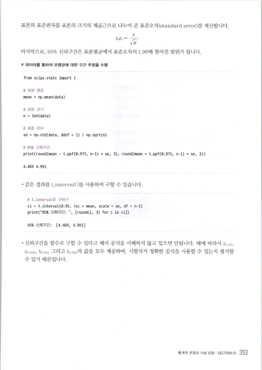
표본의 표준편차를 표본의 크기의 제곱근으로 나누어 준 표준오차＜standard error）를 계산합니다．

## S 
s.e.=7ㅠ 마지막으로 , 95% 신뢰구간은 표본평균에서 표준오차의 1.96배 떨어진 범위가 됩니다． ▼ 데이터를 통하여 모평균에 대한 구간 추정을 수행

```python
from scipy.stats import t
# 표본 평균
mean = np.mean(data)
# 표본 크기
n = len(data)
# 표준 오차
Se = np.std(data, ddof = 1) / np.sqrt(n)
# 95% 신뢰구간 
print(round(mean - t.ppf (O.975, n-i) * Se, 3), round(mean + t.ppf (O.9]5, n-i) * Se, 3))
```
4.469 4.99i

- 같은 결과를 t. interval(）를 사용하여 구할 수 있습니다．
```python
# t.interval.로 구하기 
ci = t.interval(0.95, boc = mean, scabe = Se, df = n-i) 
print("95% 신뢰구간： " , [round(i, 3) for i in ci])
```
95% 신뢰구간： [4.469, 4.991]

- 신뢰구간을 함수로 구할 수 있다고 해서 공식을 이해하지 않고 있으면 안됩니다 . 때에 따라서 zo.05,
Z0.025, tO.05 , 그리고 to.025의 값을 모두 제공하여 , 시험자가 정확한 공식을 사용할 수 있는지 평가할 수 있기 때문입니다． 통계적추정과가설검정‘SECTION 01 353

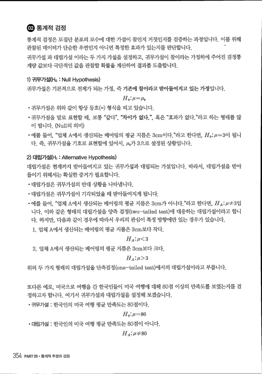
.

통계적 검정 통계적 검정은모집단분포의 모수에 대한 가설이 참인지 거짓인지를 검증하는과정입니다 . 이를 위해 관찰된 데이터가 단순한 우연인지 아니면 특정한 효과가 있는지를 판단합니다． 귀무가설 과 대립가설 이라는 두 가지 가설을 설정하고 , 귀무가설이 참이라는 가정하에 주어진 검정통 계량 값보다 극단적인 값을 관찰할 확률을 계산하여 결과를 도출합니다． 1) 귀무가설꺼0 : N메 Hypothesis) 귀무가설은 기본적으로 전제가 되는 가정 , 즉 기존에 참이라고 받아들여지고 있는 가정입니다． H。:/z = 11。

- 귀무가설은 위와 같，이 항상 등호（=) 형식을 띠고 있습니다．
- 귀무가설을 말로 표현할 때 , 보통 " 같다" , " 차이가 없다. " , 혹은 " 효과가 없다 . ' " 라고 하는 형태를 많
이 띱니다 . (Null의 의미）

- 예를 들어 , " 업쳬 A에서 생산되는 베어링의 평균 지름은 3cm이다 . " 라고한다면 , H。 
: p = 3이 됩니 다 . 즉, 귀무가설을기호로표현함에 있어서 , 110가3으로설정된상황입니다 .

2) 대립가설（H1 : Alternative Hypothesis) 대립가설은 현재까지 받아들여지고 있는 귀무가설과 대립되는 가설입니다 . 따라서 , 대립가설을 받마 들이기 위해서는 확실한 증거가 필요합니다．

- 대립가설은 귀무가설의 반대 상황을 나타냅니다．
- 대립가설은 귀무가설이 기각되었을 때 받아들여지게 됩니다．
- 예를들어 , " 업쳬 A에서 생산되는 베어링의 평균 지름은 3cm가 아니다 . " 라고 한다면 , HA:p* 3입
니다 . 이와 같은 형태의 대립가설을 양측 검정（two-tailed test）에 대응하는 대립가설이라고 합니 다 . 하지만 , 다음과 같이 경우에 따라서 우리의 관심이 특정 방향에만 있는 경우가 있습니다． 1 . 업쳬 A에서 생산되는 베어링의 평균 지름은 3cm보다 작다． HA :p<3 2 . 업쳬 A에서 생산되는 베어링의 평균 지름은 3cm보다 크다 .

HA:11>3 위의 두 가지 형태의 대립가설을 단측검정（one-tailed test）에서의 대립가설이라고 부릅니다． 또다른 예로 , 미국으로 여행을 간 한국인들이 미국 여행에 대해 80점 이상의 만족도를 보였는지를 검 정하고자합니다 . 여기서 귀무가설과대립가설을 설정해 보겠습니다．

- 귀무가설 : 한국인의 미국 여행 평균 만족도는 80점이다．
H。:p=80

- 대립가설 : 한국인의 미국 여행 평균 만족도는 80점이 아니다．
HA:p* 80 354 PART 05．통계적추정과겊정．

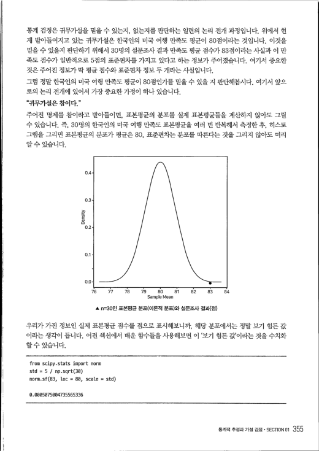
통계 검정은 귀무가설을 믿을 수 있는지 , 없는지를 판단하는 일런의 논리 전개 과정입니다 . 위에서 현 재 받아들여지고 있는 귀무가설은 한국인의 미국 여행 만족도 평균이 80점이라는 것입니다 . 이것을 믿을 수 있을지 판단하기 위해서 30명의 설문조사 결과 만족도 평균 점수가 83점이라는 사실과 이 만 족도 점수가 일반적으로 5점의 표준편차를 가지고 있다고 하는 정보가 주어졌습니다 . 여기서 중요한 것은 주어진 정보가 딱 평균 점수와 표준편차 정보 두 개라는 사실입니다． 그럼 정말 한국인의 미국 여행 만족도 평균이 80점인가를 믿을 수 있을 지 판단해봅시다 . 여기서 앞으 로의 논리 전개에 있어서 가장 중요한 가정이 하나 있습니다． “귀무가설은 참이다 . " 주어진 명제를 참이라고 받아들이면 , 표본평균의 분포를 실제 표본평균들을 계산하지 않아도 그릴 수 있습니다 . 즉 , 30명의 한국인의 미국 여행 만족도 표본평균을 여러 번 반복해서 측정한 후 , 히스토 그램을 그리변 표본평균의 분포가 평균은 80 , 표준편차는 분포를 따른다는 것을 그리지 않아도 미리 알 수 있습니다． 0 亨 ㄷ 。

。

0 76 77 78 79 80 81 Sample Mean 82 83 84 A n=30인 표본평균 분포（이론적 분포）와 설문조사 결과（점） 우리가 가진 정보인 실제 표본평균 점수를 점으로 표시해보니까, 해당 분포에서는 정말 보기 힘든 값 이라는 생각이 듭니다 . 이전 섹션에서 배운 함수들을 사용해보면 이 ' 보기 힘든 <f이라는 것을 수치화 할 수 있습니다．

```python
from scipy.stats import norm 
std = 5 / np.sqrt(30) 
norm.sf(83, loc = 80, scale 볍 std)
```
0. 0005075004735565336
통계적추정과가설검정＊SECTION 01 355

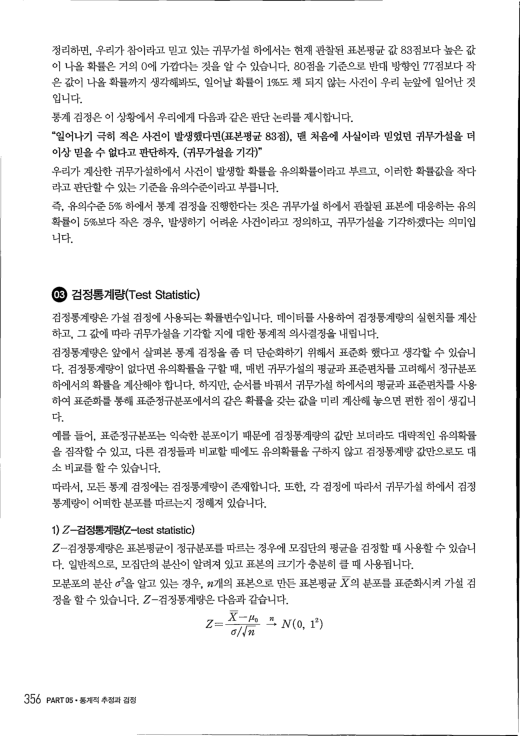
정리하면 , 우리가 참이라고 믿고 있는 귀무가설 하에서는 현재 관찰된 표본평균 값 83점보다 높은 값 이 나올 확률은 거의 0에 가깝다는 것을 알 수 있습니다 . 80점을 기준으로 반대 방향인 77점보다 작 은 값이 나올 확률까지 생각해봐도 , 일어날 확률이 1％도 채 되지 않는 사건이 우리 눈앞에 일어난 것 입니다． 통계 검정은 이 상황에서 우리에게 다음과 같은 판단 논리를 제시합니다． "일어나기 극히 적은 사건이 발생했다면（쵸본평균 83점） , 맨 처음에 사실이라 믿었던 귀무가설을 더 이상믿을수 없다고판단하자 . （귀무가설을기긱〕" 우리가 계산힌r 귀무가설하에서 사건이 발생할 확률을 유의확률이라고 부르고 , 이러한 확률값을 작다 라고 판단할 수 있는 기준을 유의수준이라고 부릅니다． 즉 , 유의수준 5% 하에서 통계 검정을 진행한다는 것은 귀무가설 하에서 관찰된 표본에 대응하는 유의 확률이 5％보다 작은 경우 , 발생하기 어려운 사건이라고 정의하고 , 귀무가설을 기각하겠다는 의미입 니다 .

ㅇ 검정통계량（Test Statistic) 검정통계량은 가설 검정에 사용되는 확률변수입니다 . 데이터를 사용하여 검정통계량의 실현치를 계산 하고 , 그 값에 따라 귀무가설을 기각할 지에 대한 통계적 의사결정을 내립니다． 검정통계량은 앞에서 살펴본 통계 검정을 좀 더 단순화하기 위해서 표준화 했다고 생각할 수 있습니 다 . 검정통계량이 없다면 유의확률을구할때 , 매번 귀무가설의 평균과표준편차를고려해서 정규분포 하에서의 확률을 계산해야 합니다 . 하지만 , 순서를 바꿔서 귀무가설 하에서의 평균과 표준펀차를 사용 하여 표준화를 통해 표준정규분포에서의 같은 확률을 갖는 값을 미리 계산해 놓으면 편한 점이 생깁니 다 .

예를 들어 , 표준정규분포는 익숙한 분포이기 때문에 검정통계량의 값만 보더라도 대략적인 유의확률 을 짐작할 수 있고 , 다른 검정들과 비교할 때에도 유의확률을 구하지 않고 검정통계량 값만으로도 대 소 비교를 할 수 있습니다． 따라서 , 모든 통계 검정에는 검정통계량이 존재합니다 . 또한 , 각 검정에 따라서 귀무가설 하에서 검정 통계량이 어떠한분포를 따르는지 정해져 있습니다． 1) Z－검정통계량（Z-test statistic) z－검정통계량은 표본평균이 蔘予분포를 따르는 경우에 모집단의 평균을 검정할 때 사용할 수 있습니 다 . 일반적으로 , 모집단의 분산이 알려져 있고 표본의 크기가충분히 클 때 사용됩니다． 모분포의 분산 戚2을 알고 있는 경우 ,n개의 표본으로 만든 표본평균 x의 분포를 표준화시켜 가설 검 정을할수 있습니다 . z－검정통계량은 다음과같습니다． 一 x - /zc , . .

z== 一 . ／뜨「 ==> Z'J( 0. r).

(1／간 356 PART 05．통계적추정과검정

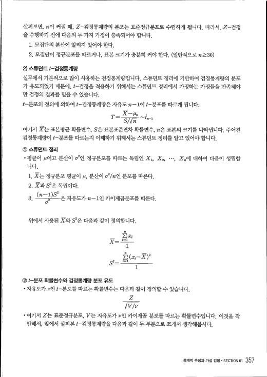
살펴보면， n이 커질 때 , z－검정통계량의 분포는 표준정규분포로 수렴하게 됩니다 . 따라서 , z－검정 을 수행하기 전에 다음의 두 가지 가정이 충족되어야 합니다． 1 . 모집단의 분산이 알려져 있어야琿1다． 2 . 모집단이 牛予분포를따르거나 , 표본크기가충분히 커야한다 . （일반적으로n브30) 2) 스튜던트 t－검장통계량 실무에서 기본적으로 많이 사용하는 검정통계량입니다 . 스튜던트 정리에 기반하여 검정통계량의 분포 가 유도되었기 때문에 , r－검정을 적용하기 위해서는 스튜던트 정리에서 가정하는 가정들을 만족해야 만 검정의 결과를 믿을 수 있습니다． t－분포의 정의에 의하여 t－검정통계량은 자유도 n- i이 t－분포를 따르게 됩니다．

# T- S/i증∼궁8,1
여기서 x는표본평균확률변수 , S은표본표준편차확률변수 , 凡은표본의 크기를 나타냅니다 . 주어진 검정통계량이 t－분포를 따르는지 이해하기 위해서는 스튜던트 정리를 알고 있어야 합니다． ① 스튜던트 정리

- 평균이 〃이고 분산이 戚2인 정규분포를 따르는 독립인 x1, 兀2, ", x , 에 대하여 다음이 성립합
니다．

1. x는 정규분포 평균이 〃 , 분산이  02/n인 분포를 따른다．
2. Z과S2은독립이다．
3. ( " 클
，)S ' 은자유도가n-i인카이제곱분포를띠－른다． 위에서 사용된 Z와 S2은 다음과 같이 정의합니다． Exi 兀＝= ' －ㅗ 1

```python
尤（T/-Z)" 
S2= 1 1
1
```
(2) r－분포 확률변수와 검정통계량 분포 유도

### · 자유도가 昑l r－분포를 따르는 확률변수는 다음과 같이 정의할 수 있습니다． 
z 涵7ㅉ ' 여기서 z는 표준정규분포 , γ는 자유도가 〃인 카이제곱 분포를 따르는 확률변수입니다 . 이것을 착 안해서 , 앞에서 살펴본t－검정통계량을 다음과같이 두부분으로 쪼개서 생각해봅시다． 통계적 추정과 가설 검정 · SECTION 01 357

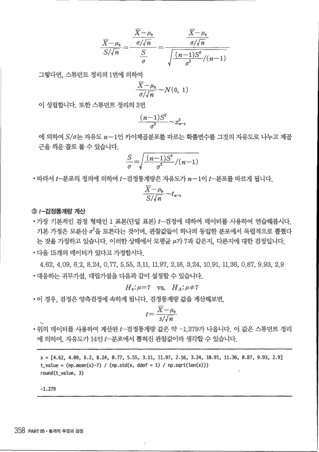
### Z- /z0 
X- p。

Z-／홰 α／757 戚／7ㅠ

# S/刀" - 읗 - I (n-1)S
41 .2 ' /(n-i)

## 그렇다면 , 스튜던트 정리의 1번에 의하여 
x- p0 꽁／γ굻「 ∼ N(0, 1) 이 성립합니다 . 또한스튜던트 정리의 3번 (n- i) S2 , ∼珊z-1 에 의하여 S/(T는 자유도 n- i인 카이제곱분포를 따르는 확률변수를 그것의 자유도로 나누고 제곱

# 근을 씌운 꼴로 볼 수 있습니다． 
솽 (n-1)S2 /(n-i)

### · 따라서 t－분포의 정의에 의하여 t－검정통계량은 자유도가 n- i이 t－분포를 따르게 됩니다． 
Z- ／拓 ． s/f7 ∼r " " ③ r－검정통계량 계산

- 가장 기본적인 검정 형태인 1 표본（단일 표본） t－검정에 대하여 데이터를 사용하여 연습해봅시다．
기본 가정은 모분산 戚2을 모른다는 것이며 , 관찰값들이 하나의 동일한 분포에서 독립적으로 뽑혔다 는 것을 가정하고 있습니다 . 이러한상태에서 모평균 /I가 7과 같은지 , 다른지에 대한 검정입니다．

- 다음 15개의 데이터가 있다고 가정합시다．
4.62, 4.09, 6.2, 8.24, 0.77, 5.55, 3.11, 11.97, 2.16, 3.24, 10.91, 11.36, 0.87, 9.93, 2.9

- 대응하는 귀무가설 , 대립가설을 다음과 같이 설정할 수 있습니다．
H。:p=7 vs. HA:pI=7

# · 이 경우 , 검정은 양측검정에 속하게 됩니다 . 검정통계량 값을 계산해보면， 
t꽉7슴 "

- 위의 데이터를 사용하여 계산된 t－검정통계량 값은 약 -1.279가 나옵니다 . 이 값은 스튜던트 정리
에 의하여 , 자유도가 14인 t－분포에서 뽑혀진 관찰값이라 생각할수 있습니다．

```python
x = [4.62, 4.09, 6.2, 8.24, 0.77, 5.55, 3.11, 11.97, 2.16, 3.24, 10.91, 11.36, 0.87, 9.93, 2.9J 
t_value = (np.mean(x)-7) / (np.std(x, ddof = 1) ! np.sqrt(len(x))) 
rourid(t_val,ue, 3)
```
-1.279 358 PART 05．통계적추정과검정

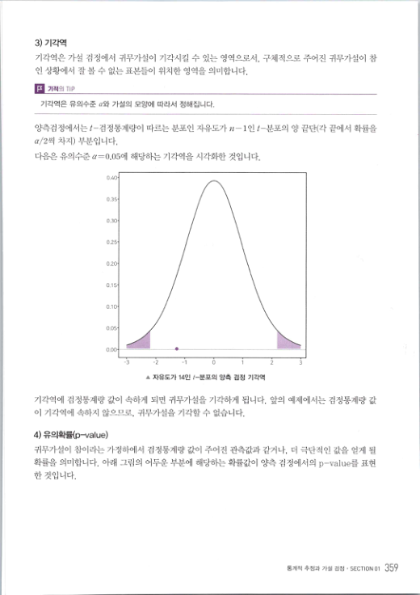
3）기각역 기각역은 가설 검정에서 귀무가설이 기각시킬 수 있는 영역으로서 , 구쳬적으로 주어진 귀무가설이 참 인 상황에서 잘 볼 수 없는 표본들이 위치한 영역을 의미합니다． ｀잽 기적의 지p 기각역은 유의수준 α와 가설의 모양에 따라서 정해집니다． 양측검정에서는 t－검정통계량이 따르는 분포인 자유도가 n- i인 t－분포의 양 끝단（각 끝에서 확률을 a'/2씩 차지） 부분입니다． 다음은 유의수준 α=0.05에 해당하는 기각역을 시각화한 것입니다． 1 C ㅣ 2 3 A 자유도가 14인 /－분포의 양측 검정 기각역 기각역에 검정통계량 값이 속하게 되면 귀무가설을 기각하게 됩니다 . 앞의 예제에서는 검정통계량 값 이 기각역에 속하지 않으므로 , 귀무가설을 기각할 수 없습니다． 4) 유의확률(p-value) 귀무가설이 참이라는 가정하에사검정통계량 값이 주어진 관측값과 같거나 , 더 극단적인 값을 얻게 될 확률을 의미합니다 . 아래 그림의 어두운 부분에 해당하는 확률값이 양측 검정에서의 p-value를 표현 한 것입니다． 통계적 추정과 가설 검정 · SEC지아』oi 35오

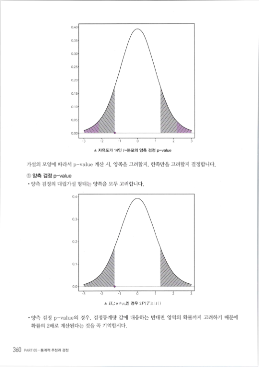
o.10' 0.05- 0.00 2 2 3 ▲ 자유도가 14인 /－분포의 양측 검정 p-v Iue 가설의 모양에 따라서 p-value 계산시 , 양쪽을고려할지 , 한쪽만을고려할지 결정합니다． (j:) 양측 검정 p-value

- 양측 검정의 대립가설 형태는 양쪽을 모두 고려합니다．
▲ H。:ii쑤／z擢 경우 2P(T리치 )

- 양측 검정 p-value의 경우 , 검정통계량 값에 대응하는 반대편 영역의 확률까지 고려하기 때문에
확률의 2배로 계산된다는 것을 꼭 기억합시다． 360 PART 05＊통계적추정과검정

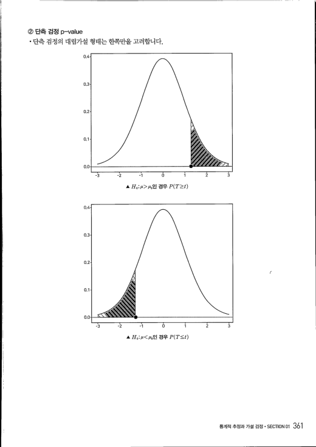
② 단측 검정 p-value

- 단측 검정의 대립가설 형태는 한쪽만을 고려합니다．
0.4 0.3 0.2 0.1 0.0 -3 -2 -1 0 1 2 3 ▲ H。: p> p擢 경우 ／〕（T논D 0.4 0.3 0.2 r 0.1 0.0 -3 -2 -1 0 1 2 3 A H。:p<p。인 경우 P(T二D 통계적추정과가설검정．SECTION 01 361

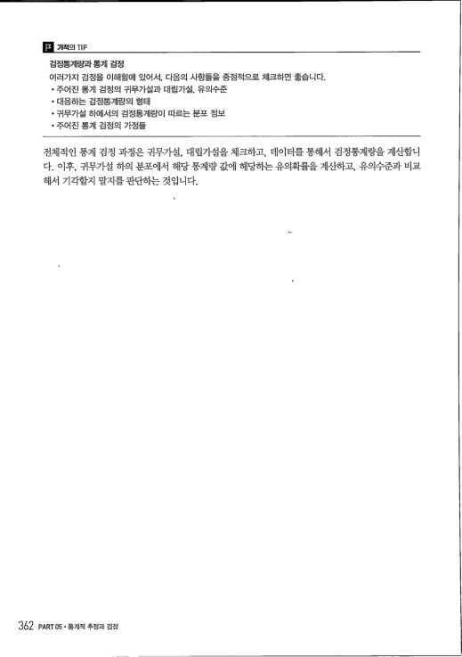
검정통계량과 통계 검정 여러가지 검정을 이해함에 있어서 , 다음의 사항들을 중점적으로 체크하면 좋습니다．

- 주어진 통계 검정의 귀무가설과 대립가설 , 유의수준
- 대응하는 검정통계량의 형태
- 귀무가설 하에서의 검정통계량이 따르는 분포 정보
- 주어진 통계 검정의 가정들
전쳬적인 통계 검정 과정은 귀무가설 , 대립가설을 쳬크하고 , 데이터를 통해서 검정통계량을 계산합니 다 . 이후 , 귀무가설 하의 분포에서 해당 통계량 값에 해당하는 유의확률을 계산하고 , 유의수준과 비교 해서 기각할지 말지를 판단하는 것입니다． 362 PART05．통계적추정과검정

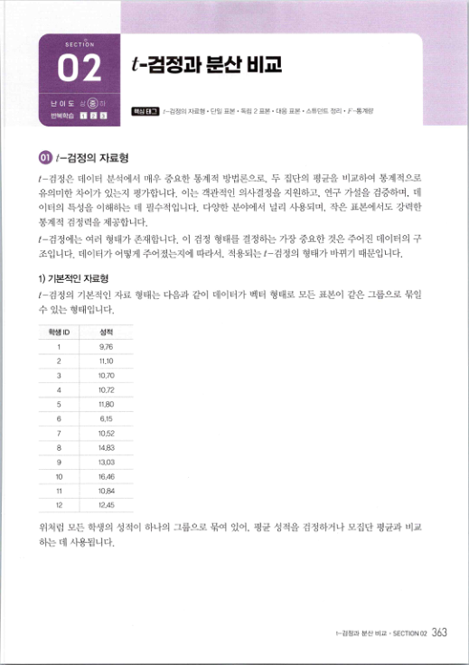
# SECTION 02
# t-검정과 분산 비교
난 01 도 廛） 핵심 태1 r－검정의 자료형 · 딘삘 표본 · 독립 2 표본 · 대응 표본 . 스튜던트 정리 · F퉁계량 반복학습 【． .

兩 .I /－검정의 자료형 t－검정은 데이터 분적에서 매우 중요한 통계적 방법론으로 , 두 집단의 평균을 비교하여 통계적으로 유의미한 차이가 있는지 평가합니다 . 이는 객관적인 의사결정을 지원하고 , 연구 가설을 검증하며 , 데 이터의 특정을 이해하는 데 필수적입니다 . 다양한 분야에서 널리 사용되며 , 작은 표본에서도 강력한 통계적 검정력을 제공합니다． t－검정에는 여러 형태가 존재합니다 . 이 검정 형태를 결정하는 가장 중요한 것은 주어진 데이터의 구 조입니다 . 데이터가 어떻게 주어졌는지에 따라서 , 적용되는t－검정의 형태가바뀌기 때문입니다． 1) 기본적인 자료형 t－검정의 기본적인 자료 형태는 다음과 같이 데이터가 벡터 형태로 모든 표본이 같은 그룹으로 묶일 수 있는 형태입니다． 학생 D 성적 1 9.76 2 11.10 3 10.70 스－.－註－'－一쁘Z르 5 11.80 6 6.15 7 10.52 8 14.83 9 13 .03 10 16.46 11 10.84 12 12.45 위처럼 모든 학생의 성적이 하나의 그룹으로 묶여 있어 , 평균 성적을 검정하거나 모집단 평균과 비교 하는 데 사용됩니다． t－검정과분산비교．SECTION 02 363

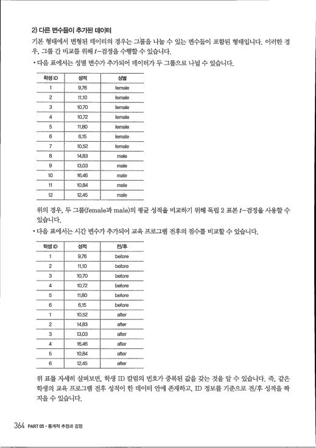
2) 다른 변수들이 추가된 데이터 기본 형태에서 변형된 데이터의 경우는 그붑을 나눌 수 있는 변수들이 포함된 형태입니다 . 이러한 경 우 , 그룹 간 비교를 위해 t－검정을 수행할 수 있습니다．

- 다음 표에서는 성별 변수가 추가되어 데이터가 두 그룹으로 나뉠 수 있습니다．
학생 D 성적 성별 1 9 .76 female 2 11.10 female 3 10.70 fem톄e 4 10.72 fem테e 5 11.80 fem히e 6 6.15 female 7 10.52 fem히e 8 14.83 m히e 9 13.03 male 10 16.46 male 11 10.84 male 12 12.45 male 위의 경우 , 두 그룹（female과 male）의 평균 성적을 비교하기 위해 독립 2 표본 t－검정을 사용할 수 있습니다．

- 다음 표에서는 시간 변수가 추가되어 교육 프로그램 전후의 점수를 비교할 수 있습니다．
습騁뙤D 성적 전／후 1 9.76 before 2 11.10 before 3 10.70 before 4 10.72 before 5 11.80 before 6 6.15 before 1 10 .52 after 2 14.83 after 3 13.03 after 4 16.46 after 5 10.84 after 6 12.45 after 위 표를 자세히 살펴보먼 , 학생 ID 칼럼의 번호가 중복된 값을 갖는 것을 알 수 있습니다 . 즉 , 같은 학생의 교육 프로그램 전후 성적이 한 데이터 안에 존재하고 , ID 정보를 기준으로 전／후 성적을 짝 지을 수 있습니다． ;364 PART 05솥통계적추정과검정

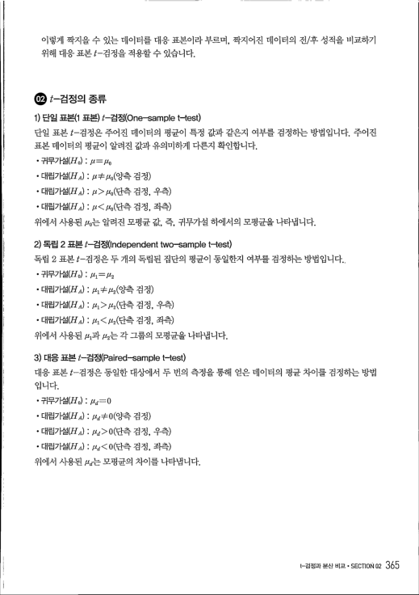
이렇게 짝지을 수 있는 데이터를 대응 표본이라 부르며 , 짝지어진 데이터의 전／후 성적을 비교하기 위해 대응 표본 t－검정을 적용할 수 있습니다． .

r－검정의 종류 1) 단일 표본《1 표본） t－검정（One-sam이e t-test) 단일 표본 t－검정은 주어진 데이터의 평균이 특정 값과 같은지 여부를 검정하는 방법입니다 . 주어진 표본 데이터의 평균이 알려진 값과 유의미하게 다른지 확인합니다．

- 귀무가설（H。) : p = [L0
- 대립가설（HA) : /z쑤／z0（양측 검정）
- 대립가설（HA) : β〉／￡0（단측 검정 , 우측）
- 대립가설（HA) : /z＜〔／z0（단측 검정 , 좌측）
위에서 사용된 〃0는 알려진 모평균 값 , 즉 , 귀무가설 하에서의 모평균을 나타냅니다． 2) 독립 2 표본 it－검정ondependent two-sam이e t-test) 독립 2 표본 r－검정은 두 개의 독립된 집단의 평균이 동일한지 여부를 검정하는 방법입니다．.

- 귀무가설（H。) : 111= P2
- 대립가설（HA) : /z1쑤P2（양측 검정）
- 대립가설（HA) : /z1〕＞/z2（단측 검정 , 우측）
- 대립가설（/7A) : P1<P2（단측 검정 , 좌측）
위에서 사용된 /1과 ／￡2는 각 그룹의 모평균을 나타냅니다． 3) 대응 표본 t－검정（Paired-sample t-test) 대응 표본 t－검정은 동일한 대상에서 두 번의 측정을 통해 얻은 데이터의 평균 차이를 검정하는 방법 입니다．

- 귀무가설（H。) : Pd- 0
- 대립가설（HA) : Pd*O（양측 검정）
- 대립가설（HA) : Pd> O（단측 검정 , 우측）
- 대립가설（HA) : /zα〈o（단측 검정 , 좌측）
위에서 사용된 /Id는 모평균의 차이를 나타냅니다． t－검정과분산비교．SECTIOFJ 02 365

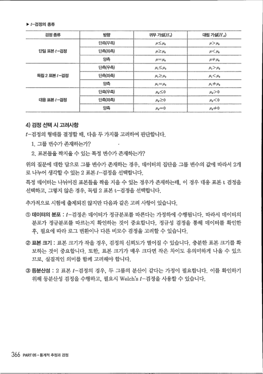
> /－검정의 종류
검정종류 방향 귀무 가설（H櫓 대립 가설（HA) 단측＜우측） 〃二PC P> Po 단일 표본 t－검정 단측《좌측） 〃논P0 /1< P。

```python
양측 
P=Po 
P#=P0
```
단측《우측） PI二P2 Pi>Pz 독립 2 표본 t－검정 단측《좌측） 巧三p2 P1<Pz 양측 Pi==P2 PI￥＝P2 단측＜우측） Pa二 0 Pa> 0 대응표본t－검정 단측（좌측） Pa브0 Iid<刀

```python
양측 
Pa= 0 
Pa#=0
```
4) 검정 선택 시 고려사항 t－검정의 형태를 결정할때 , 다음두가지를고려하여 판단합니다． 1 . 그룹변수가존재하는가？ 2 . 표본들을짝지을 수 있는특정 변수가 존재하는가？ 위의 질문에 대한 답으로 그룹 변수가 존재하는 경우 , 데이터의 집단을 그룹 변수의 값에 따라서 2개 로 나누어 생각할 수 있는 2 표본 t－검정을 선택합니다． 특정 데이터는 나뉘어진 표본들을 짝을 지을 수 있는 경우가 존재하는데 , 이 경우 대응 표본 t 검정을 선택하고 , 그렇지 않은 경우 , 독립 2 표본 t－검정을 선택합니다 .

추가적으로 시험에 출제되진 않지만 다음과 같은 고려 사항이 있습니다． ① 데이터의 분포 : t－검정은 데이터가 정규분포를 따른다는 가정하에 수행됩니다 . 따라서 데이터의 분포가 騙于분포를 따르는지 확인하는 것이 중요합니다．. 정규성 검정을 통해 데이터를 확인한 후 , 필요에 따라 로그 변환이나 다른 비모수 검정을 고려할 수 있습니다． ② 표본 크기 : 표본 크기가 작을 경우 , 검정의 신뢰도가 떨어질 수 있습니다 . 충분한 표본 크기를 확 보하는 것이 중요합니다 . 또한 , 표본 크기가 매우 크다면 작은 차이도 유의미하게 나올 수 있으 므로 , 실질적인 의미를 함께 고려해야 합니다 .

③ 등분산성 : 2 표본 t－검정의 경우 , 두 그룹의 분산이 같다는 가정이 필요합니다 . 이를 확인하기 위해 등분산성 검정을 수행하고 , 필요시 ㄳlelch's t－검정을 사용할 수 있습니다 .

366 PART 05．통계적추정과검정

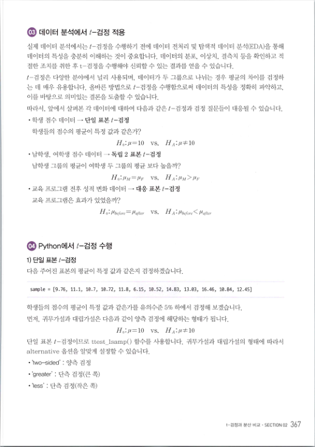
.

데이터 분석에서 t－검정 적용 실제 데이터 분석에서는 t－검정을 수행하기 전에 데이터 전처리 및 탐색적 데이터 분석（EDA）을 통해 데이터의 특정을 충분히 이해하는 것이 중요합니다 . 데이터의 분포 , 이상치 , 결측치 등을 확인하고 적 절한 조치를 취한 후 t－검정을 수행해야 신뢰할 수 있는 결과를 얻을 수 있습니다． /－검정은 다양한 분야에서 널리 사용되며 , 데이터가 두 그룹으로 나뉘는 경우 평균의 차이를 검정하 는 데 매우 유용합니다 . 올바른 방법으로 r－검정을 수행함으로써 데이터의 특성을 정확히 파악하고， 이를 바탕으로 의미있는 결론을 도출할 수 있습니다． 따라서 , 앞에서 살펴본 각 데이터에 대하여 다음과 같은 t－검정과 검정 질문들이 대응될 수 있습니다．

- 학생 점수 데이터 → 단일 표본 r－검정
학생들의 점수의 평균이 특정 값과 같은가？ H。:p=10 vs. HA:p* 10

- 남학생 , 여학생 점수 데이터 → 독립 2 표본 t－검정
남학생 그룹의 평균이 여학생 두 그룹의 평균 보다 높을까？ HQ:pM=PF vs. HA:PM>PF

- 교육 프로그램 전후 성적 변화 데이터 → 대응 표본 t－검정
교육 프로그램은 효과가 있었을까？ H。: Pbef。re = I-rafter vs. HA: Pbef。re < Pafter .Python에서 /－검정 수행 1) 단일 표본 t－검정 다음 주어진 표본의 평균이 특정 값과 같은지 검정하겠습니다．

```python
sample = [9.76, 11.1, 10.7, 10.72, 11.8, 6.15, 10.52, 14.83, 13.03, 16.46, 10.84, 12.45]
```
학생들의 점수의 평균이 특정 값과 같은가를 유의수준 5% 하에서 검정해 보겠습니다． 먼저 , 귀무가설과 대립가설은 다음과 같이 양측 검정에 해당하는 형태가 됩니다． H。:p=10 vs. HA:/i* 1o 단일 표본 卜검정이므로 ttest_lsamp() 함수를 사용합니다 . 귀무가설과 대립가설의 형태에 따라서 alternative 옵션을 알맞게 설정할 수 있습니다．

- 'two-sided' : 양측 검정
- 'greater' : 단측 검정（큰 쪽）
- 'less' : 단측 검정（작은 쪽）
卜검정과분산비교· SECTION 02 367

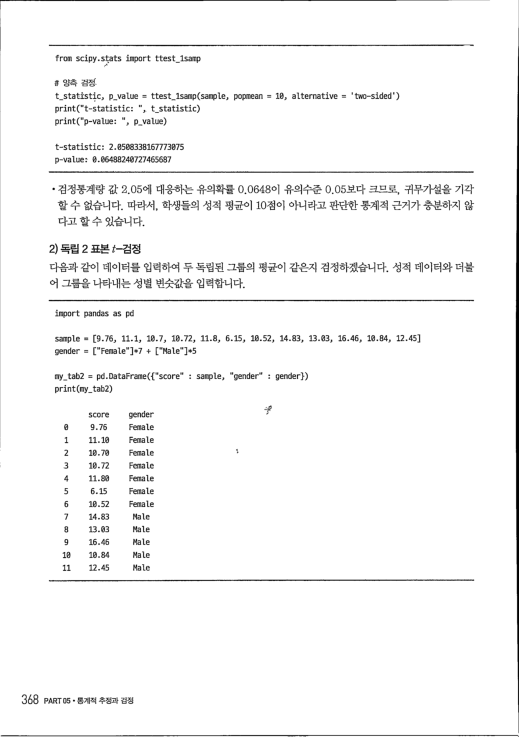
```python
from scipy.stats import ttest_lsamp
# 양측 검정긴 
t_statistic, p_value = ttest_lsamp(sample, 
print("t-statistic: ',, t_statistic) 
print("p-value: ", p_value)
popmean = 10, alternative = 'two-sided ')
```
t-statistic: 2.0508338167773075 p-value: 0.06488240727465687

- 검정통계량 값 2.05에 대응하는 유의확률 0.0648이 유의수준 0.05보다 크므로 , 귀무가설을 기각 
할 수 없습니다 . 따라서 , 학생들의 성적 평균이 10점이 아니라고 판단한 통계적 근거가 충분하지 않 다고 할 수 있습니다． 2) 독립 2 표본 t－검정 다음과 같이 데이터를 입력하여 두 독립된 그룹의 평균이 같은지 검정하겠습니다 . 성적 데이터와 더불 어 그룹을 나타내는 성별 변숫값을 입력합니다．

```python
import pandas as pd
sample = [9.76, 11.1, 10.7, 10.72, 11.8, 6.15, 10.52, 14.83, 13.03, 16.46, 10.84, 12.4511
gender = ["Female"]*7 + [ "Male ']*5
my_tab2 = pd.DataFrame({ 'score ' : sample, 'gender" : gender}) 
print(my_tab2)
```
score gender 0 9.76 Female 1 11.10 Female 2 10.70 Female 딩 3 10.72 Female 4 11.80 Female 5 6.15 Female 6 10.52 Female 7 14.83 Male 8 13.03 Male 9 16.46 Male 10 10.84 Male 11 12.45 Male 368 PART 05·통계적추정과검정

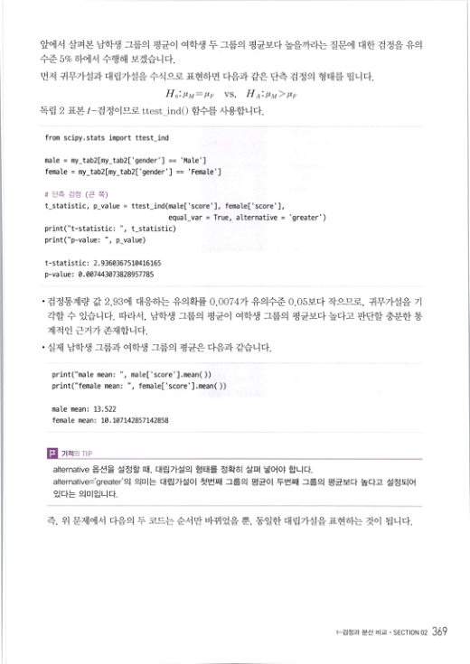
앞에서 살펴본 남학생 그룹의 평균이 여학생 두 그룹의 평균보다 높을까라는 질문에 대한 검정을 유의 수준 5% 하에서 수행해 보겠습니다． 먼저 귀무가설과 대립가설을 수식으로 표현하면 다음과 같은 단측 검정의 형태를 띱니다． HO:PM=PF vs. HA:PM>PF 독립 2 표본 t－검정이므로 ttest_ind() 함수를 사용합니다．

```python
from scipy.stats import ttest_ind
male = my_tab2[my_tab2[ 'gender' ] == ' Male' ]
female = rny_tab2[my_tab2[ 'gender' ] == ' Female' ]
# 단측 검정 （큰 쪽） 
t_statistic, p_value = ttest_ind(male[ 'score' ], feniale[ 'score'] ,
equal_var = True, alternative = ' greater' ) 
print("t-statistic: " , t_statistic) 
print('p-value: ', p_value)
```
t-statistic: 2.9360367510416165 p-value: 0.007443073828957785

- 검정통계량 값 2.93에 대응하는 유의확률 0.0074가 유의수준 0.05보다 작으므로 , 귀무가설을 기
각할 수 있습니다 . 따라서 , 남학생 그룹의 평균이 여학생 그룹의 평균보다 높다고 판단할 충분한 통 계적인 근거가 존재합니다．

- 실제 남학생 그룹과 여학생 그룹의 평균은 다음과 같습니다．
```python
print("male mean: " , male[ 'score '] .meanO) 
print("female mean: ", feniale[ 'score 'l. meanO)
```
male mean: 13.522 female mean: 10.107142857142858 alternative 옵션을 설정할 【【ㅐ , 대립가설의 형태를 정확히 살펴 넣어야 합니다．

```python
alternative='greater ' 으』 의미는 대립가설이 첫번째 그룹의 평균이 두번째 그룹의 평균보다 높다고 설정되어
```
있다는 의미입니다． 즉 , 위 문제에서 다음의 두 코드는 순서만 바뀌었을 뿐 , 동일한 대립가설을 표현하는 것이 됩니다． t－검정과분산비교· SECTION 02 3盤

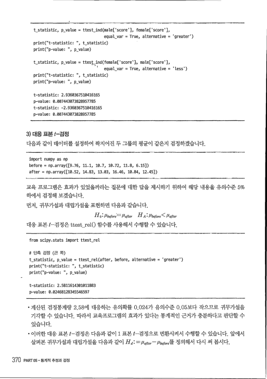
t_statistic, p_val.ue = ttest_ind(mal.e['score'] , female['score'],

```python
equal._var = True, alternative = 'greater') 
print("t-statistic: ", t_statistic) 
print("p-value: ", p_value)
```
t statistic. o value = ttest ind(femalei'score'l. malel'score'l,

```python
equaL_var = true, aiternative = Less) 
print("t-statistic: ", t_statistic) 
print("p-value: ", p_value)
```
t-statistic: 2.9360367510416165 p-value: 0.007443073828957785 t-statistic: -2.9360367510416165 p-value: 0.007443073828957785 3) 대응 표본 t－검정 다음과 같이 데이터를 설정하여 짝지어진 두 그룹의 평균이 같은지 검정하겠습니다．

```python
import numpy as np 
before = np.array([9.76, 11.1, 10.7, 10.72, 11.8, 6.15]) 
after = np.array([10.52, 14.83, 13.03, 16.46, 10.84, 12.45])
```
교육 프로그램은 효과가 있었을까라는 질문에 대한 답을 제시하기 위하여 해당 내용을 유의수준 5% 하에서 검정해 보겠습니다． 먼저 , 귀무가설과대립가설을표현하면 다음과같습니다． H。: Pbef。re= Pafter 〃A:Pbef。re< Iafter 대응 표본 t－검정은 ttest_rel() 함수를 사용해서 수행할 수 있습니다．

```python
from scipy.stats import ttest_rel
# 단측 검정 （큰 쪽） 
t_statistic, p_value = ttest_rel(after, before, alternative = 'greater') 
print("t-statistic: ", t_statistic) 
print("p-value: " , p.yalue)
```
t-statistic: 2.5811614301011883 p-value: 0.02468128345546597

- 계산된 검정통계량 2.58에 대응하는 유의확률 0.024가 유의수준 0.05보다 작으므로 귀무가설을
기각할 수 있습니다 . 따라서 교육프로그램의 효과가 있다는 통계적인 근거가 충분하다고 판단할 수 있습니다．

- 이러한 대응 표본 t－검정은 다음과 같이 1 표본 t－검정으로 변환시켜서 수행할 수 있습니다 . 앞에서
살펴본 귀무가설과 대립가설을 다음과 같이 Hd: = Pafter Pbef。r.를 정의해서 다시 쩌 봅시다． 370 PART 05．통계적추정과검정

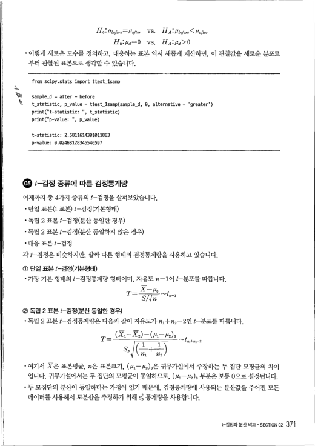
H0: Pbef。re=Pafter vs. HA: Pbef。re< Pafter HO:pd=O vs. //A:/z'/>0

- 이렇게 새로운 모수를 정의하고 , 대응하는 표본 역시 섀롭게 계산하면 , 이 관찰값을 새로운 분포로
부터 관찰된 표본으로 생각할 수 있습니다．

```python
from scipy.stats import ttest_lsamp
sample_d = after - before 
t_statistic, p_value = ttest_lsamp(sampLe_d, 0, alternative = ' greater') 
print("t-statistic: ', t_statistic) 
print('p-value: ', p_value)
```
t-statistic: 2.5811614301011883 p-value: 0.02468128345546597 .

r－검정 종류에 따른 검정통계량 이제까지 총 4가지 종류의 t－검정을 살펴보았습니다．

- 단일 표본（1 표본） t－검정（기본형태）
- 독립 2 표본 t－검정（분산 동일한 경우）
- 독립 2 표본 t－검정（분산 동일하지 않은 경우）
- 대응 표본 /－검정
각－검정은 비슷하지만 , 살짝 다른 형태의 검정통계량을 사용하고 있습니다． ① 단일 표본 t－검정（기본형태）

- 가장 기본 형태의 t－검정통계량 형태이며 , 자유도 n- i이 t－분포를 따릅니다．
# T＝ 츳- 110∼tn_i
/ ② 독립 2 표본 /－검정（분산 동일한 경우）

- 독립 2 표본 t－검정통계량은 다음과 같이 자유도가 n汁n2 -2인 t－분포를 따릅니다．
'r- (X1-X2)-(p1--p2)0 ∼．, ㅗ -- ∼ II 1 1 , 놉’力 - ㅣ ----- ' v \ nl ni /

- 여기서 兀은 표본평균 , 忽은 표본크기 , (iz1- Pi )o은 귀무가설에서 주장하는 두 집단 모평균의 차이
입니다 . 귀무가설에서는두 집단의 모평균이 동일하므로 , (Pi - Pi ) 。 부분은보통 0으로 설정됩니다．

- 두 모집단의 분산이 동일하다는 가정이 있기 때문에 , 검정통계량에 사용되는 분산값을 주어진 모든
데이터를 사용해서 모분산을 추정하기 위해 pS2 통계량을사용합니다． t－검정과분산비교· SECTION 02 371

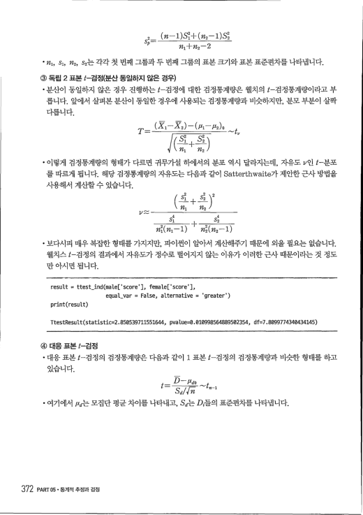
### 小＝  跡∼1)사＋(n2 -l) s零 
nl 극－多2^ ∼ 9 ' 蚣1, S1, 蚣2, S2는 각각 첫 번째 그룹과 두 번째 그룹의 표본 크기와 표본 표준편차를 나타냅니다． ③ 독립 2 표본 t－검정（분산 동일하지 않은 경우）

- 분산이 동일하지 않은 경우 진행하는 /－검정에 대한 검정통계량은 웰치의 t－검정통계량이라고 부
릅니다 . 앞에서 살펴본 분산이 동일한 경우에 사용되는 검정통계량과 비슷하지만 , 분모 부분이 살짝 다릅니다． // S琴 8종 , ㅣ - ＝쑈→ ＝스－ - v \ nl 鈴 2 /

- 이렇게 검정통계량의 형태가 다르면 귀무가설 하에서의 분포 역시 달라지는데 , 자유도 11인 /－분포 
를 따르게 됩니다. 해당 검정통계량의 자유도는 다음과 같이 Satterthwaite가 제안한 근사 방법을 사용해서 계산할 수 있습니다． 2 拓 嶼 + 뾰 笏 ` .

S4, －ㄴ

- 
n盤(n1-i) ' 忽沁z2-1)

- 보다시피 매우 복잡한 형태를 가지지만, 파이썬이 알아서 계산해주기 때문에 외울 필요는 없습니다．
웰치Z封－검정의 결과에서 자유도가 정수로 떨어지지 않는 이유가 이러한 근사 때문이라는 것 정도 만 아시면 됩니다．

```python
result = ttest_ind(male[ 'score '] , female[ 'score '] ,
equal_var = False, alternative = ' greater') 
print(result)
```
ltestResult (statistic=2. 850539711551644, pvalue=0 .010998564889502354, df=7. 8099774340434145) ④ 대응 표본 /－검정

- 대응 표본 t－검정의 검정통계량은 다음과 같이 1 표본 t－검정의 검정통계량과 비슷한 형태를 하고
있습니다．

## D -
pdQ r＝륭，/7굻 tn-i

- 여기에서 Pd는 모집단 평균 차이를 나타내고 , Sd는 z기들의 표준펀차를 나타냅니다．
372 PART 05．통계적추정과검정

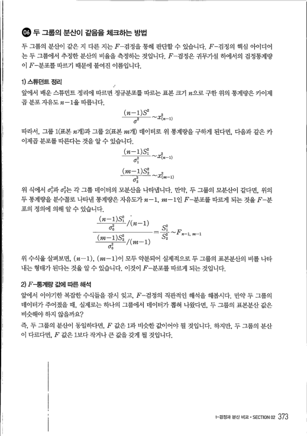
.

두 그룹의 분산이 같음을 체크하는 방법 두 그룹의 분산이 같은 지 다른 지는 ／구－검정을 통해 판단할 수 있습니다 . F－검정의 핵심 아이디어 는 두 그룹에서 추정한 분산의 비율을 측정하는 것입니다 . ／구－검정은 귀무가설 하에서의 검정통계량 이 F－분포를 따르기 때문에 붙여진 이름입니다． 1) 스튜던트 정리 ， 앞에서 배운 스튜던트 정리에 따르면 정규분포를 따르는 표본 크기 n으로 구한 위의 통계량은 카이제 곱 분포 자유도 n- i을 따릅니다． I -,\c, 2 `,n- 17`a 2 2 →7錨（,z-l) (T 따라서 , 그룹 1（쵸본 'z개）과 그룹 2(쵸본 'n개） 데이터로 위 통계량을 구하게 된다면 , 다음과 같은 카 이제곱 분포를 따른다는 것을 알 수 있습니다． n -1 ) S2 2 , ∼ X (n_1) 驪 X2(:

위 식에서 매과 α蔞는 각 그룹 데이터의 모분산을 나타냅니다 . 만약 , 두 그룹의 모분산이 같다면 , 위의 두 통계량을 분수꼴로 나타낸 통계량은 자유도가 n- i, rn- i인 ／구－분포를 따르게 되는 것을 ／구－분 , n-

## : /(n-
### s 
一 --=- →7 . .

1 . . .

→ rm-1)S , . .

.

s쵸 " " "" /(rn- i) (1石 2 위 수직을살펴보면 , 跡-i) , (rn-i）이 모두 약분되어 실제적으로 두 그룹의 표본분산의 비를 나타 내는 형태가 된다는 것을 알 수 있습니다 . 이것이 ／구－분포를 따르게 되는 것입니다． 2)F통계량 값에 따른 해석 앞에서 이야기한 복잡한 수식들을 잠시 잊고 , F－검정의 직관적인 해석을 해봅시다 . 만약 두 그룹의 데이터가 주어졌을 때 , 실제로는 하나의 그룹에서 데이터가 뽑혀 나왔다면 , 두 그룹의 표본분산 값은 비슷해야 하지 않을까요？ 즉 , 두 그룹의 분산이 동일하다면 , ／구 값은 1과 비슷한 값이어야 될 것입니다 . 하지만 , 두 그룹의 분산 이 다르다면 , F 값은 1보다 작거나 큰 값을 갖게 될 것입니다． t－검정과분산비교· SECTION 02 373

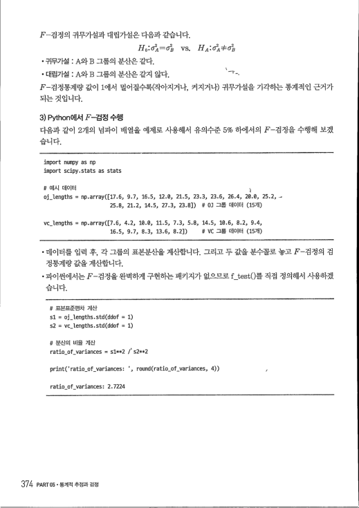
F－검정의 귀무가설과 대립가설은 다음과 같습니다． H。:心=t1} VS. HA:C竇* YB

- 귀무가설 : A와 B 그룹의 분산은 같다．
- 대립가설 : A와B 그룹의 분산은같지 않다 . 
-'-- ／구－검정통계량 값이 1에서 멀어질수록（작아지거나 , 커지거나） 귀무가설을 기각하는 통계적인 근거가 되는 것입니다． 3) Python에서 ／고－검정 수행 다음과 같이 2개의 넘파이 배열을 예제로 사용해서 유의수준 5% 하에서의 ／구－검정을 수행해 보겠 습니다．

```python
import numpy as np 
import scipy.stats as stats
# 예시 데이터 
`' 
oj_Lengths = np.array([17.6, 9.7, 16.5, 12.0, 21.5, 23.3, 23.6, 26.4, 20.0, 25.2, →
```
25.8, 21.2, 14.5, 27.3, 23.8]) # 0」 그룹 데이터 (15개）

```python
vc_lengths = np.array([7.6, 4.2, 10.0, 11.5, 7.3, 5.8, 14.5, 10.6, 8.2, 9.4,
16.5, 9.7, 8.3, 13.6, 8.2]) 
# VC 그룹 데이터 (15개）
```
- 데이터를 입력 후 , 각 그룹의 표본분산을 계산합니다 . 그리고 두 값을 분수꼴로 놓고 ／구－검정의 검
정통계량 값을 계산합니다．

- 파이썬에서는 ／구－검정을 완벽하게 구현하는 패키지가 없으므로 f_test(）를 직접 정의해서 사용하겠
습니다．

```python
# 표본표준편차 계산 
sl = oj_lengths.std(ddof = 1)
s2 = vc_lengths.std(ddof = 1)
# 분산의 비율 계산 
ratio of variances = sl**2 I 52**2
print(ratio_of_variances: ' , round(ratio_of_variances, 4))
```
ratio of variances: 2.7224 374 PART 05 ‘통계적추정과검정

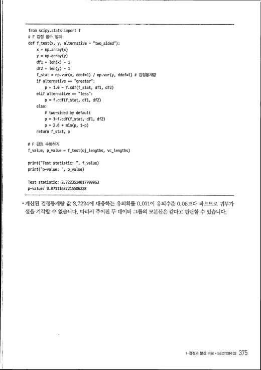
```python
from scipy.stats import f 
# F 검정 함수 정의 
def f_test(x, y, alternative = "two_sided"): 
x = np.array(x)
y = np.array(y) 
dfl = len(x) - 1 
df2 = 1.en(y) - 1 
f_stat = np.var(x, ddof=1) / np.var(y, ddof=1) 
if alternative == "greater":
# 검정통계량
p = 1.0 - f.cdf(f_stat, df1, df2) 
elif alternative == "less":
p = f.cdf(f_stat, df1, df2) 
else:
# two-sided by default
p = 1-f.cdf(f_stat, dfl, df2)
p = 2.0 * min(p, 1-p) 
return f_stat, p
# F 검정 수행하기 
f_value, p_value = f_test(oj_lengths, vcjengths)
print("Test statistic: ", f_value) 
print("p-value: ", p_value)
```
Test statistic: 2.7223514017700063 p-value: 0.07111637215506228

- 계산된 검정통계량 값 2.7224에 대응하는 유의확률 0.071이 유의수준 0.05보다 작ㅇ E1  귀무가 
설을 기각할 수 없습니다 . 따라서 주어진 두 데이터 그룹의 모분산은 같다고 판단할 수 있습니다． t－검정과분산비교· SECTION 02 375

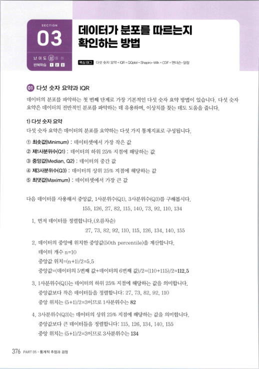
# 데이터가 분포를 따르는지 
확인하는 방법 SECTION 난 이 도 ㅒ． 핵심 태그 다섯 숫자 요약 · QR ·QQI겨ot · 앉laplro-WIIk · CDF · 앤더슨달링 반복학습 ｀뻐 톄 때 .I 다섯 숫자 요약괘OR 데이터의 분포를 파악하는 첫 번째 단계로 가장 기본적인 다섯 숫자 요약 방법이 있습니다 . 다섯 숫자 요약은 데이터의 전반적인 분포를 파악하는 데 유용하며 , 이상치를 찾는 데도 도움을 줍니다． 1) 다섯 슷자 요약 다섯 숫자 요약은 데이터의 분포를 요약하는 다섯 가지 통계지표로 구성됩니다． ① 최솟값（Minimum) : 데이터셋에서 가장 작은 값 ② 제1사분위수（01) : 데이터의 하위 25% 지점에 해당하는 값 ③ 중앙값（Median, 02) : 데이터의 중간 값 @) 제3사분위수（03) : 데이터의 상위 25% 지점에 해당하는 값 ⑤ 최댓값（Maximum) : 데이터셋에서 가장 큰 값 다음데이터를사용해서 중앙값 , 1사분위수（Q1), 3사분위수（ 《q3）를구해봅시다． 155, 126, 27, 82, 115, 140, 73, 92, 110, 134 1 . 먼저 데이터를 정렬합니다 . （오름차순） 27, 73, 82, 92, 110, 115, 126, 134, 140, 155 2 . 데이터의 중앙에 위치한중앙값（50th percentile）을 계산합니다． 데이터 개수 n=10 중앙값 위치＝(n+1)/2=5.5 중앙값＝（데이터의 5번째 값＋데이터의 6번째 값）/2 =(110+115)/2 =112.5

3. 1사분위수（Q1）는 데이터의 하위 25% 지점에 해당하는 값을 의미합니다．
중앙값보다작은데이터들을정렬합니다： 27, 73, 82, 92, 110 중앙 위치는 (5+1)/2=3이므로 1사분위수는 82

4. 3사분위수（Q3）는 데이터의 상위 25% 지점에 해당하는 값을 의미합니다．
중앙값보다큰데이터들을정렬합니다： 115, 126, 134, 140, 155 중앙 위치는 (5+1)/2=3이므로 3사분위수는 134 376 PART 05．통계적추정과검정

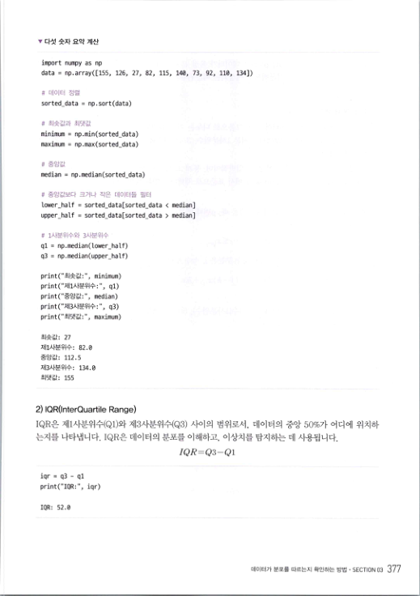
다섯 숫자 요약 계산

```python
import numpy as np 
data = np.array([155, 126, 27, 82, 115, 140, 73, 92, 110, 134])
# 데기터 정렬 
sorted_data = np.sort(data)
# 최솟값과 최댓값
minimum = np.min(sorted_data)
maximum = np.max(sorted_data)
```
＃중앙값

```python
median = np.median(sorted_data)
# 중앙값보다 크거나 작은 데이터들 필터 
thwer_half = sorted_data[sorted_data < median]
upper_half = sorted_data[sorted_data > median]
# 1사분위수와 3사분위수 
qi = np.median(lower_half)
q3 = np.median(upper_half)
print(" 최솟값＝ " , minimum) 
print(" 제1사분위수： " , qi) 
print(" 중앙값： " , median) 
print(" 제3사분위수： " , q3) 
print(" 최댓값： " , maximum)
```
최솟값＝ 27 제1사분위수＝ 82.0 중앙값： 112.5 제3사분위수： 134.0 최댓값： 155 2) IQR(InterQuartiIe Range)

```python
IQR은 제1사분위수（Q1）와 제3사분위수（Q3) 사이의 범위로서 , 데이터의 중앙 50％가 어디에 위치하 
는지를 나타냅니다 . IQR은 데이터의 분포를 이해하고 , 이상치를 탐지하는 데 사용됩니다． 
IQR=Q3-Q1
iqr = q3 - ql 
print('IQR: ", iqr)
```
IQR: 52.0 데이터가 분포를 따르는지 확인하는 방법 . SECTION 03 377

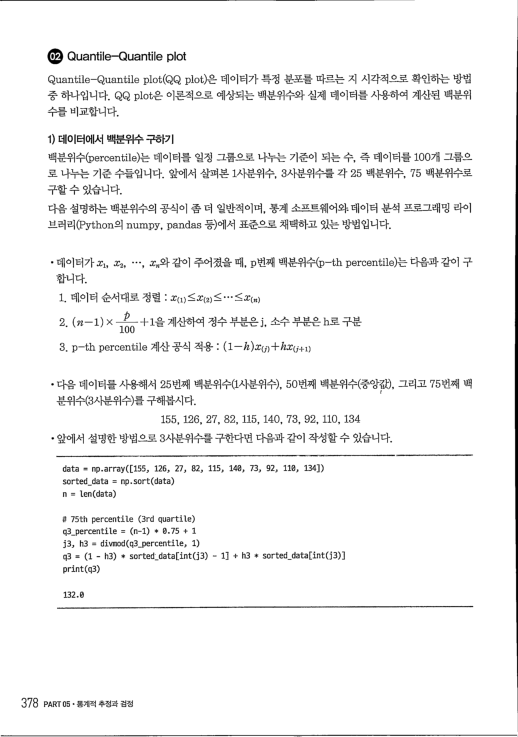
G Quantile-Quantile plot Quantile-Quantile plot(QQ plot）은 데이터가 특정 분포를 따르는 지 시각적으로 확인하는 방법 중 하나입니다 . QQ plot은 이론적으로 예상되는 백분위수와 실제 데이터를 사용하여 계산된 백분위 수를 비교합니다． 1) 데이터에서 백분위수 구하기 백분위수（percentile）는 데이터를 일정 그룹으로 나누는 기준이 되는 수 , 즉 데이터를 100개 그룹으 로 나누는 기준 수들입니다 . 앞에서 살펴본 1사분위수 , 3사분위수를 각 25 백분위수 , 75 백분위수로 구할 수 있습니다． 다음 설명하는 백분위수의 공식이 좀 더 일반적이며 , 통계 소프트웨어와 데이터 분적 프로그래밍 라이 브러리（Python의 numpy, pandas 등）에서 표준으로 채택하고 있는 방법입니다．

- 데이터가x1, x2, … , x,：와같이 주어졌을때 , p번째 백분위수（p-th percentile）는다음과같이 구
합니다． 1 . 데이터 순서대로 정렬 : X(l)二X(2)三'" 二X(n) . . . p , , r, .,11 ,1늬셔 뺐ㅅ， ㅂ ㅂ . , ㅊ 7, 2 .' (- ib< -른-+1을계산하여 정수부분은i ,' 소수 .' ' '

- - 100 
- c 
p - ' P 'J l I - J.,' - " 부분은 h로 구분

3. p-th percentile 계산공식 적용 : (1-h )x(/) + hX(/+l)
- 다음 데이터를 사용해서 25번째 백분위수（1사분위수） , 50번째 백분위수（충앙값） , 그리고 75번깨 백
분위수（3사분위수）를 구해봅시다． 155, 126, 27, 82, 115, 140, 73, 92, 110, 134

- 앞에서 설명한 방법으로 3사분위수를 구한다면 다음과 같이 작성할 수 있습니다．
```python
data = np.array([155, 126, 27, 82, 115, 140, 73, 92, 110, 134])
sorted_data = np.sort(data)
n = len(data)
# 75th percentile (3rd quartile)
q3_percentile = (n-i) * 0.75 + 1 
j3, h3 = divmod(q3_percentiLe, 1)
q3 = (1 - h3) * sorted-data[int(j3) - 1] + h3 * sorted_data[int(j3)] 
print(q3)
```
132.0 378 PART 05·통계적추정과검정

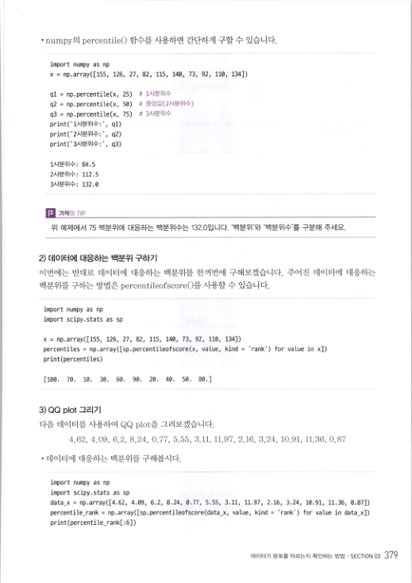
- numpy의 percentile() 함수를 사용하면 간단하게 구할 수 있습니다．
```python
import numpy as np
x = np.array([155, 126, 27, 82, 115, 140, 73, 92, 110, 134])
# 1사분위수
qi = np.percentile(x, 25)
# 중앙값（2사분위수）
q2 = np.percentile(x, 50)
# 3사분위수
q3 = np.percentile(x, 75) 
print(' 1사분위수： ' , qi) 
print(' 2사분위수： ' , q2) 
print(' 3사분위수： ' , q3)
```
1사분위수： 84.5 2사분위수： 112.5 3사분위수： 132.0 더 기적의 TIP 위 예제에서 75 백분위에 대응하는 백분위수는 132.0입니다 . ' 백분위 ' 와 ' 백분위수'를 구분해 주세요． 2) 데이터에 대응하는 백분위 구하기 이번에는 반대로 데이터에 대응하는 백분위를 한꺼번에 구해보겠습니다 . 주어진 데이터에 대응하는 백분위를 구하는 방법은 percentileofscore(）를 사용할 수 있습니다．

```python
import numpy as np 
import scipy.stats as sp
x = np.array([155, [26, 2], 82, 115, 140, 73, 92, 110, 134]) 
percentiles = np.array([sp.percentileofscore(x, value, kind = 'rank') for value in xl) 
print(percentiles)
```
[100. 70. 10. 30. 60. 90.

20. 40. 50. 80.]
3) 00 plot 그리기 다음 데이터를 사용하여 QQ plot을 그려보겠습니다． 4.62, 4.09, 6.2, 8.24, 0.77, 5.55, 3.11, 11.97, 2.16, 3.24, 10.91, 11.36, 0.87

- 데이터에 대응하는 백분위를 구해봅시다．
```python
import numpy as np 
import scipy.stats as sp 
data_x = np.array([4.62, 4.09, 6.2, 8.24, 0.77, 5.55, 3.11, 11.97, 2.16, 3.24, 10.91, 11.36, 0.87]) 
percentile_rank = np.array([sp.percentileofscore(data_x, value, kind = 'rank') for value in data_x]) 
print(percentile_rank[ :6])
```
데이터가 분포를 따르는지 확인하는 방법 . SECTION 03 379

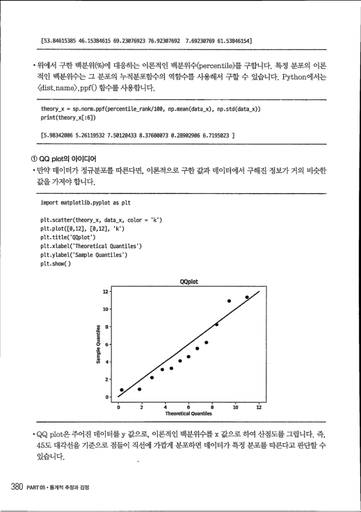
[53.84615385 46.15384615 69.23076923 76.92307692 7.69230769 61.53846154]

- 위에서 구한 백분위（%）에 대응하는 이론적인 백분위수（percentile）를 구합니다 . 특정 분포의 이론 
적인 백분위수는 그 분포의 누적분포함수의 역함수를 사용해서 구할 수 있습니다 . Python에서는 <dist. name>. ppf() 함수를 사용합니다．

```python
theory_x = sp.norm.ppf(percentile_rank/100, np.mean(data_x), np.std(data_x)) 
print(theory_x[ : 6])
```
[5.98342006 5.26119532 7.50120433 8.37600073 0.28902906 6.7195023 ] ①QQ plot의 아이디어

- 만약 데이터가 정규분포를 따른다면 , 이론적으로 구한 값과 데이터에서 구해진 정보가 거의 비슷한
값을 가져야 합니다．

```python
import matpiotlib.pypl.ot as pit
```
plt.scatter(theory_x, data_x, color = ' k') pit.piot([0,12], [0,12], 'k ') plt.title('QQplot') plt.xiabel('lheoretical. Quantiles ' ) plt.yl.abel('Sample Quantiles') pit. show( ) QQplot 8 5 4 玳 淫 ㅁ ＝ 。

。

。

낑 “ ㅌ 拐 ' l 0 2 필 ` .

4 6 8 Theoretical Quantiles

- QQ plot은 주어진 데이터를 y 값으로 , 이론적인 백분위수를 x 값으로 하여 산점도를 그립니다 . 즉，
45도 대각선을 기준으로 점들이 직선에 가깝게 분포하면 데이터가 특정 분포를 따른다고 판단할 수 있습니다． 380 PARI05．통계적추정과검정

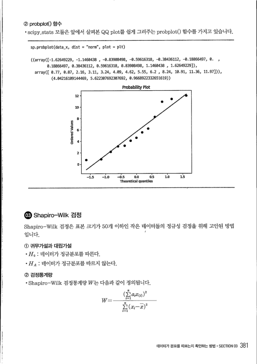
② probplot() 함수

- scipy. stats 모듈은 앞에서 살펴본 QQ plot를 쉽게 그려주는 probplot() 함수를 가지고 있습니다．
sp.probplot(data_x, dist = Thorm', plot = plt) ((array({-1.62649229, -1.1460438 , -0.83908498, -0.59616318, -0.38436112, -0.18866497, 0.

0.18866497, 0.38436112, 0.59616318, 0.83908498, 1.1460438 , 1.6264922gB, array({ 0.77, 0.87, 2.16, 3.11, 3.24, 4.09, 4.62, 5.55, 6.2 , 8.24, 10.91, 11.36, 11.97])), (4.04216109144469, 5.622307692307692, 0.9668922332651619)) Probability P紬t 12 8 6 4 미 。

＝ - 뀝 므

- 끈
。

- 2 ' 쵭 I I i i i ` -1.0 -0.5 0.0 0.5 10 15 Theoretical quantiles -i.5 .

Shapiro-Wilk 검정 Shapiro-Wilk 검정은 표본 크기가 50개 이하인 작은 데이터들의 蔘千성 검정을 위해 고안된 방법 입니다． ' ① 귀무가설과 대립가설

- H。 
: 데이터가 拓子분포를 따른다．

- HA : 데이터가 정규분포를 따르지 않는다．
② 검정통계량

- Shapiro-Wilk 검정통계량 'V는 다음과 같이 정의됩니다．
fl a1x(1)

### '==1 
狐z= f〕(xf_도)2 i= 1 데이터가분포를따르는지확인하는방법．SECTION 03 ;3이

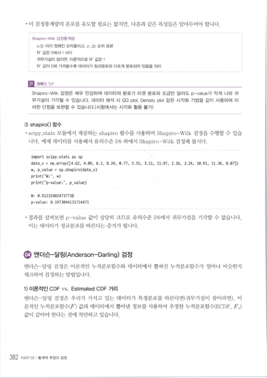
- 이 검정통계량의 분포를 유도할 필요는 없지만 , 다음과 같은 특정들은 알아두어야 합니다．
ShapIro-Wilk 검정통계량 a,는 미리 정해진 숫자들이고， r (f）는 순위 표본 w 값은 0에서 1 사이 귀무가설이 참이면 . 이론적으로 Ir 값은 1 "/ 값이 00섧 가까울수록 데이터가 정규분포와 다르게 분포되어 있음을 의미 ．헴 기적의 지p 앉，apiro-Wilk 검정은 매우 민감하여 데이터의 분포가 타겟 분포와 조금만 달라도 p-value가 작게 나와 귀 무가설이 기각될 수 있습니다 . 데이터 해석 시 00 plot. Density plot 같은 시각화 기법을 같이 사용하여 이 러한 단점을 보완할 수 있습니다 . （시험에서는 시각화 활용 불가） ③ shapiro() 함수

- scipy. stats 모듈에서 제공하는 shapiro 함수를 사용하여 Shapiro-Wilk 검정을 수행할 수 있습
니다 . 예제 데이터를 사용해서 유의수준 5% 하에서 Shapiro-Wilk 검정해 봅시다．

```python
import scipy.stats as sp 
data_x = np.array([4.62, 4.09, 6.2, 8.24, 0.77, 5.55, 3.11, 11.97, 2.16, 3.24, 10.91, 11.36, 0.87])
w, p_value = sp.shapiro(data_x) 
print("W: ", w) 
print("p-value:", p_value)
```
W: 0.912324024737738 p-value: 0.1973044131714471

- 결과를 살펴보면 p-value 값이 상당히 크므로 유의수준 5％에서 귀무가설을 기각할 수 없습니다．
이는 데이터가 棚구분포를 따른다는 증거가 됩니다． .

앤더슨－달링（Anderson-Darling) 검정 앤더슨－달링 검정은 이론적인 누적분포함수와 데이터에서 뽑혀진 누적분포함수가 얼마나 비슷한지 체크하여 검정하는 방법입니다． 1) 이론적인 CDF vs. Estimated CDF 거리 앤더슨－달링 검정은 우리가 가지고 있는 데이터가 특정분포를 따른다면（귀무가설이 참이라면） , 이 론적인 누적분포함수（F) 값과 데이터에서 뽑아낸 정보를 사용하여 추정한 누적분포함수（ECDF, F) 값이 같아야 한다는 것에 착안하고 있습니다． 382 PART05．통계적추정과검정

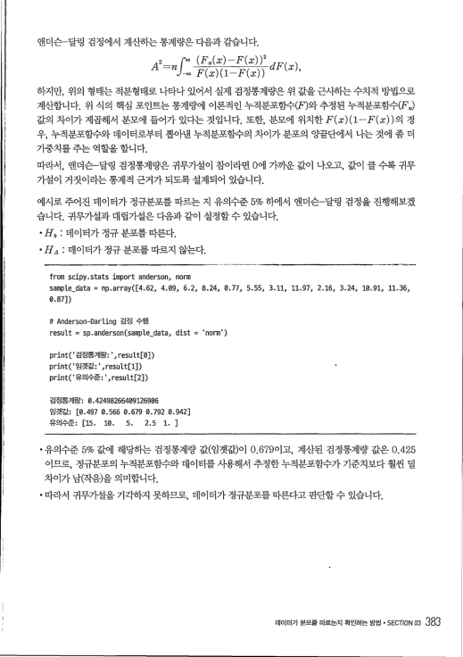
앤더슨－달링 검정에서 계산하는 통계량은 다음과 같습니다．

## 一工： (F ( x) - F ( x)
F(x) (1-F(x) ):dF ( x), 하지만, 위의 형태는 적분형태로 나타나 있어서 실제 검정통계량은 위 값을 근사하는 수치적 방법으로 계산합니다 . 위 식의 핵심 포인트는 통계량에 이론적인 누적분포함수（／구）와 추정된 누적분포함수（F'z) 값의 차이가 제곱해서 분모에 들어가 있다는 것입니다 . 또한 , 분모에 위치한 /'(x) (1-F (x)）의 경 우 , 누적분포함수와 데이터로부터 뽑아낸 누적분포함수의 차이가 분포의 양끝단에서 나는 것에 좀 더 가중치를 주는 역할을 합니다． 따라서 , 앤더슨－달링 검정통계량은 귀무가설이 참이라면 0에 가까운 값이 나오고 , 값이 클 수록 귀무 가설이 거짓이라는 통계적 근거가 되도록 설계되어 있습니다． 예시로 주어진 데이터가 蔘구분포를 따르는 지 유의수준 5% 하에서 앤더슨－달링 검정을 진행해보겠 습니다 . 귀무가설과 대립가설은 다음과 같이 설정할 수 있습니다．

- H。 : 데이터가 정규 분포를 따른다．
- HA : 데이터가 정규 분포를 따르지 않는다．
```python
from scipy.stats import anderson, norm
sample_data = np.array([4.62, 4.09, 6.2, 8.24, 0.77, 5.55, 3.11, 11.97, 2.16, 3.24, 10.91, 11.36, 
0.87])
#Anderson-Darling 검정 수행 
result = sp.anderson(sample- data, dist = ' norm')
print(' 검정통계량＝ "result[0]) 
print(' 임곗값： ' ,result[1]) 
print(' 유의수준： ' , result [2] )
```
검정통계량： 0.42498266409126906 임곗값: [0.497 0.566 0.679 0.792 0.942] 유의수준＝ [15. 10.

5. 
2.5 1. 〕

- 유의수준 5% 값에 해당하는 검정통계량 값（임곗값）이 0.679이고 , 계산된 검정통계량 값은 0.425
이므로 , 蔘子분포의 누적분포함수와 데이터를 사용해서 추정한 누적분포함수가 기준치보다 훨씬 덜 차이가 남（작음）을 의미합니다．

- 따라서 귀무가설을 기각하지 못하므로 , 데이터가 정규분포를 따른다고 판단할 수 있습니다．
데이터가분포를따르는지확인하는방법 .SECTION 03 383

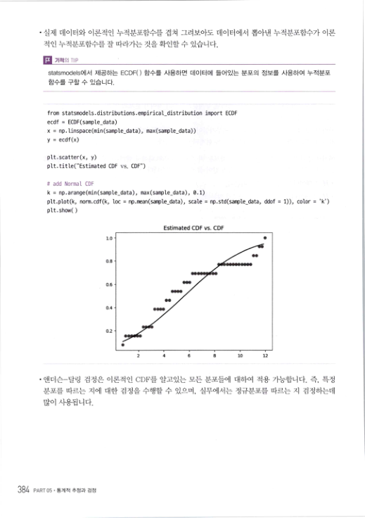
- 실제 데이터와 이론적인 누적분포함수를 겹쳐 그려보아도 데이터에서 뽑아낸 누적분포함수가 이론
적인 누적분포함수를 잘 따라가는 것을 확인할 수 있습니다．

### r잽 기적의 지P
statsmodels에서 제공하는 ECDF( ) 함수를 사용하면 데이터에 들어있는 분포의 정보를 사용하여 누적분포 함수를 구할 수 있습니다．

```python
from statsmodels. distributions, empirical_distribution import ECDF 
ecdf = ECDF(sample_data)
x = np. linspace(min(sample_data), max(sample_data))
y = ecdf(x)
```
plt.scatter(x, y) plt.title("Estimated CDF vs. CDF ")

```python
# add Normal CDF
k = np.arange(min(sariiple_data), max(sample_data), 0.1) 
plt.plot(k, norm.cdf(k, b0c = np.mean(sar：>le_data), scale = np.std(sanple_data, ddof = 1)), color = k') 
pit. show( )
```
Estimated CDF vs. CDF

- 앤더슨－달링 검정은 이론적인 CDF를 알고있는 모든 분포들어］ 대하여 적용 가능합니다 . 즉 , 특정
분포를 따르는 지에 대한 검정을 수행할 수 있으며 , 실무에서는 정규분포를 따르는 지 검정하는데 많이 사용됩니다． 384 PART 05．통계적추정과검정

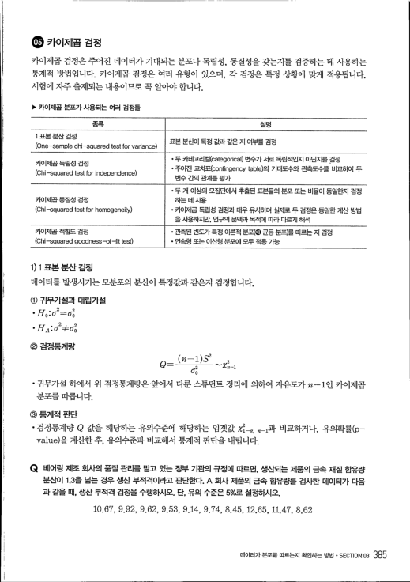
.

카이제곱 검정 카이제곱 검정은 주어진 데이터가 기대되는 분포나 독립성 , 동질성을 갖는지틀 검증하는 데 사용하는 통계적 방법입니다 . 카이제곱 검정은 아러 유형이 있으며 , 각 검정은 특정 상황에 맞게 적용됩니다． 시험에 자주 출제되는 내용이므로 꼭 알아야 합니다．

> 카이제곱 분포가 사용되는 여러 검정들
종류 설명 1 표본 분산 검정 (One-sample chi-squared test for variance) 표본 분산이 특정 값과 같은 지 여부를 검정

- 두 카테고리컬（categorical) 변수가 서로 독립적인지 아닌지를 검정 
- 주어진 교차표（contingency table）의 기대도수와 관측도수를 비교하여 두 
변수 간의 관계를 평가 카이제곱 독립성 검정 (Chi-squarecl test for independence)

- 두 개 이상의 모집단에서 추출된 표본들의 분포 또는 비율이 동일한지 검정 
해크데시용

- 카이제곱 독립성 검정과 매우 유사하며 실저扈 두 검정은 동일한 계산 방법 
을 사용하지만, 연구의 문맥과 목적에 따라 다르게 해석 카이제곱 동질성 검정 (Chi -squared test for homogeneity) 카이저居 적합도 검정 (Chi-squared goodness-of-fit test)

- 관측돈l 빈도가특정 이론적 분포（.) 균등 분포》를 따르는 지 검정 
- 연속형 또는 이산형 분포에 모두 즈洛 가능
1)1 표본 분산 검정 데이터를 발생시키는 모분포의 분산이 특정값과 같은지 검정합니다． ① 귀무가설과 대립가설

- /'o：α2＝α 2
H。:cr =c

- HA：戚2쑤α 2
ci ② 검정통계량 ,, I∼1 \S 2 I - Q= " ' αi  ' " ∼z汕 ' 귀무가설 하에서 위 검정통계량은 ' 앞에서 다룬 스튜던트 정리에 의하여 자유도가 n- i인 카이제곱 분포를 따릅니다． ③ 통계적 판단 ' 검정통계량 《？ 값을 해당하는 유의수준에 해당하는 임곗값 z X2i-a , n-i과 비교하거나 , 유의확률（p- value）을 계산한후 , 유의수준과 비교해서 통계적 판단을 내립니다． Q 베어링 제조 회사의 품질 관리를 맡고 있는 정부 기관의 구정에 따르면 , 생산되는 제품의 금속 재질 함유량 분산이 1.3을 넘는 경우 생산 부적격이라고 판단한다 , A 회사 제품의 금속 함유량를 검사한 데이터가 다음 과 같을 때 , 생산 부적격 검정을 수행하시오 . 단 , 유의 수준은 5％로 설정하시오． 10.67, 9.92, 9.62, 9.53, 9.14, 9.74, 8.45, 12.65, 11.47, 8.62 데이터가분포를따르는지확인ㅎ階방법· SECTION 03 385

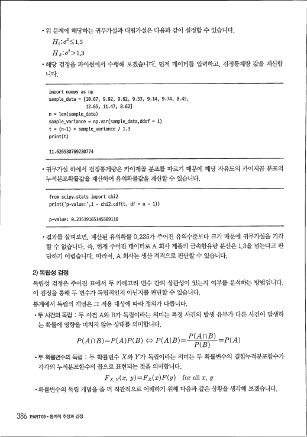
- 위 문제에 해당하는 귀무가설과 대립가설은 다음과 같이 설정할 수 있습니다．
H。:c2二1.3 HA:r> 1.3

- 해당 검정을 파이썬에서 수행해 보겠습나다r. 먼저 데이터를 입력하고 , 검정통계량 값을 계산합
니다．

```python
import numpy as np 
sample_data = [18.67, 9.92, 9.62, 9.53, 9.14, 9.74, 8.45,
```
12.65, 11.47, 8.62] n 별 len(sampl.e_data)

```python
sample_variance = np.var(sampie_data,ddof = 1)
t = (n-i) * sample_variance / 1.3 
print(t)
```
11.626530769230774

- 귀무가설 하에서 검정통계량은 카이제곱 분포를 따르기 때문에 해당 자유도의 카이제곱 분포의
누적분포확률값을 계산하여 유의확률값을 계산할 수 있습니다．

```python
from scipy.stats import ch12 
print('p-value:', l - chi2.cdf(t, df = n - 1))
```
p-value: 0.23519165145589116

- 결과를 살펴보먼 , 계산된 유의확률 0.235가 주어진 유의수준보다 크기 때문에 귀무가설을 기각
할 수 없습니다 . 즉 , 현재 주어진 데이터로 A 회사 제품의 금속함유량 분산은 1 . 3을 넘는다고 판 단하기 어렵습니다 . 따라서 , A 회사는 생산 적격으로 판단할 수 있습니다． 2) 독립성 검정 독립성 검정은 주어진 표에서 두 카테고리 변수 간의 상관성이 있는지 여부를 분석하는 방법입니다． 이 검정을 통해 두 변수가 독립적인지 아닌지를 판단할 수 있습니다． 통계에서 독립의 개넘은 그 적용 대상에 따라 정의가 다릅니다．

- 두 사건의 독립 : 두 사건 A와 B가 독립이라는 의미는 특정 사건의 발생 유무가 다른 사건이 발생하
는 확률에 영향을 미치지 않는 상태를 의미합니다．

# P(AnB)=P(A)P(B) 仲 P(AIB)=譽묘奔） =P(A)
- 두 확률변수의 독립 : 두 확률변수 Z와 Y가 독립이라는 의미는 두 확률변수의 결합누적분포함수가
각각의 누적분포함수의 곱으로 표현되는 것을 의미합니다． ／輸 , γ（了 , y)=Fx(x)F (y) for alix, y

- 확률변수의 독립 개념을 좀 더 직관적으로 이해하기 위해 다음과 같은 상황을 생각해 보겠습니다．
386 PARI05·통계적추정과검정

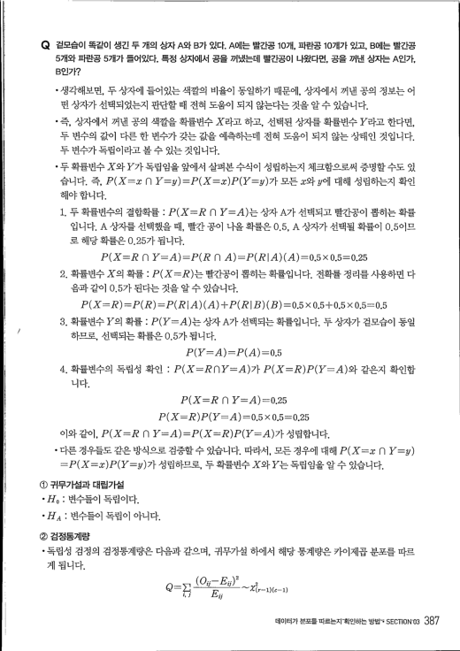
Q 겉모습이 똑같이 생긴 두 개의 상자A와 B가 있다 . A에는 빨간공 10개 , 파란공 10개가 있고 , B에는 빨간공 5개와 파란공 5개가 들어있다 . 특정 상자에서 공을 꺼냈는데 빨간공이 나왔다면 , 공을 꺼낸 상자는 A인가， B인가？

- 생각해보면 , 두 상자에 들어있는 색깔의 비율이 동일하기 때문에 , 상자에서 꺼낸 공의 정보는 어 
떤 상자가 선택되었는지 판단할 때 전혀 도움이 되지 않는다는 것을 알수 있습니다． '즉 , 상자에서 꺼낸 공의 색깔을 확률변수 x라고 하고 , 선택된 상자를 확률변수 Y라고 한다면， 두 변수의 값이 다른 한 변수가 갖는 값을 예측하는데 전혀 도움이 되지 않는 상태인 것입니다． 두 변수가 독립이라고 볼 수 있는 것입니다．

- 두 확률변수 x와 Y가 독립임을 앞에서 살펴본 수식이 성립하는지 쳬크함으로써 증명할 수도 있
습니다 . 즉 , P(X=x fl Y=y)=P(X=x)P(Y=y）가 모든 縕와Z／에 대해 성립하는지 확인 해야 합니다． :1 . 두 확률변수의 결합확률 : P（兀=RflY= A）는 상자 A가 선택되고 빨간공이 뽑히는 확률 입니다 . A 상자를 선택했을 때 , 빨간 공이 나올 확률은 0.5, A 상자가 선택될 확률이 0.5이므 로 해당 확률은 0.25가 됩니다． P(X=R fl Y=A)=P(R n A)=P(RIA)(A)=o.5x0.s=o.25 2 . 확률변수 Z의 확률 : P(X=R）는 빨간공이 뽑히는 확률입니다 . 전확률 정리를 사용하면 다 음과 같이 0.5가 된다는 것을 알 수 있습니다． P(X=R)=P(R)=P(RA)(A)+P(RlB)(B)=o.s>( 0.5+0.5 X 0.5=0.5 3 . 확률변수 y의 확률 : P(Y=A）는상자A가 선택되는 확률입니다 . 두 상자가 같모습이 동일 하므로 , 선택되는확률은 0.5가됩니다． P(Y=A)=P(A)=o.5 4 . 확률변수의 독립성 확인 : P(X=RnY=A）가 P(X=R)P(Y=A）와 같은지 확인합 니다． P(X=R fl Y=A)=o.25 P(X=R)P(Y=A)=o.s x 0.5=0.25 이와같이 , P(X=R n Y=A)=P(X=R)P(Y=A）가성립합니다．

- 다른 경우들도 같은 방식으로 검증할수 있습니다 . 따라서 , 모든 경우에 대해 ／〕(X=x fl Y=y) 
=P(X=x)P(Y=y）가성립하므로 , 두확률변수兀와Y는독립임을 알수 있습니다． ① 귀무가설과 대립가설

- 工／0 : 변수들이 독립이다．
- HA : 변수들이 독립이 아니다．
② 검정통계량

- 독립성 검정의 검정통계량은 다음과 같으며 , 귀무가설 하에서 해당 통계량은 카이제곱 분포를 따르 
게 됩니다．

### Q＝퓨 (r "표 L'「'\2
ri__ k"-'ij -'ij) / 2

- 
Z(r-i)(c-i) 1,1 jj 데이터가분포를파르는지'확인하는방법｀SECTION.03 387

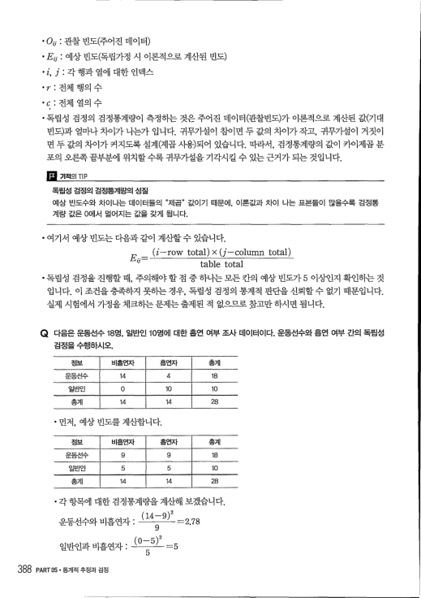
- 이／ : 관찰 빈도（추어진 데이터）
- E{/ : 예상 빈도（톡립가정 시 이론적으로 계산된 빈도）
- i, I : 각 행과 열에 대한 인덱스
- :r : 전쳬 행의 수
- c : 전쳬 열의 수
- 독립성 검정의 검정통계량이 측정하는 것은 주어진 데이터（관찰빈도）가 이론적으로 계산된 값（기대
빈도）과 얼마나 차이가 나는가 입니다. 귀무가설이 참이면 두 값의 차이가 작고 , 귀무가설이 거짓이 면 두 값의 차이가 커지도록 설계（제곱 사용）되어 있습니다 . 따라서 , 검정통계량의 값이 카이제곱 분 포의 오른쪽 끝부분에 위치할 수록 귀무가설을 기각시킬 수 있는 근거가 되는 것입니다 .

독립성 검정의 검정통계량의 성질 예상 빈도수와 차이나는 데이터들의 " 제곱 " 값이기 때문에 , 이론값과 차이 나는 표본들이 많을수록 검정통 계량 값은 0에서 멀어지는 값을 갖게 됩니다．

- 여기서 예상 빈도는 다음과 같이 계산할 수 있습니다．
，→ (i- row total) x (i- column total)

- 
tame totai

- 독립성 검정을 진행할 때 , 주의해야 할 점 중 하나는 모든 칸의 예상 빈도가 5 이상인지 확인하는 것
입니다 . 이 조건을충족하지 못하는 경우 , 독립성 검정의 통계적 판단을 신뢰할수 없기 때문입니다． 실제 시험에서 가정을 쳬크하는 문제는 출제된 적 없으므로 참고만 하시면 됩니다． Q 다음은 운동선수 18명 , 일반인 10명에 대한 흡연 여부 조사 데이터이다 , 운동선수와 흡연 여부 간의 독립성 검정을 수행하시오， 정보 비흡연자 흡연자 총계 운동선수 14 4 18 일반인 0 10 10 총계 14 14 28

- 먼저 , 예상 빈도를 계산합니다．
정보 비흡연자 흡연자 총겨I 운동선수 9 9 18 일빈빈 5 5 10 총계 14 14 28

- 각 항목에 대한 검정통계량을 계산해 보겠습니다． 
-- ' . . . . . 느 . .

(14_9)2 운농선수왁비읍띤자： ' 9 " =2·'／匕 일반인과비흡연자： (O_5)2 5 388 PART 05．통계적추정과검정

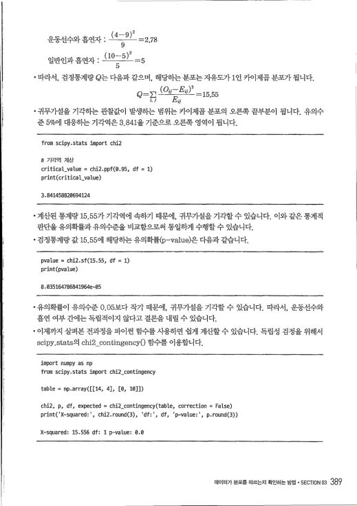
운동선수와흡연자： ( " -, " ) ' =2.78 일반인과흡연자： ( ' " -, " )'= 5

- 따라서 , 검정통계량Q는다음과같으며 , 해당하는분포는자유도가1인카이제곱분포가됩니다．
# Q＝뀨 ( 0 닙， E") "2
" ") " ' =15.55 i, .i

- 귀무가설을 기각하는 관찰값이 발생하는 범위는 카이제곱 분포의 오른쪽 끝부분이 됩니다 . 유의수 
준 5％에 대응하는 기각역은 3.841을 기준으로 오른쪽 영역이 됩니다．

```python
from scipy.stats import chi2
# 기각역 계산 
critical_value = chi2.ppf(0.95, df = 1) 
print(critical_value)
```
3.841458820694124

- 계산된 통계량 15.55가 기각역에 속하기 때문에 , 귀무가설을 기각할 수 있습니다 . 이와 같은 통계적 
판단을 유의확률과 유의수준을 비교함으로써 동일하게 수행할 수 있습니다．

- 검정통계량 값 15.55에 해당하는 유의확률（p-value）은 다음과 같습니다．
```python
pvalue = chi2.sf(15.55, df = 1) 
print(pvalue)
```
8. 035164786841964e-05
- 유의확률이 유의수준 0.05보다 작기 ' 때문에 , 귀무가설을 기각할 수 있습니다 . 따라서 , 운동선수와 
흡연 여부 간에는 독립적이지 않다고 결론을 내릴 수 있습니다．

- 이제까지 살펴본 전과정을 파이썬 함수를 사용하면 쉽게 계산할 수 있습니다 . 독립성 검정을 위해서 
scipy. stats의 chi2_contingency() 함수를 이용합니다．

```python
import numpy as np 
from scipy.stats import chi2_contingency
table = np.array([[14, 4], [0, 10]])
chi2, p, df, expected = chi2_contingency(table, correction = False) 
print('X-squared: ', chi2.round(3), ' df:', df, 'p-value:', p.round(3))
```
X-squared: 15.556 df: 1 p-value: 0.0 데이터가분포를따르는지확인하는방법 ·SECTION 03 389

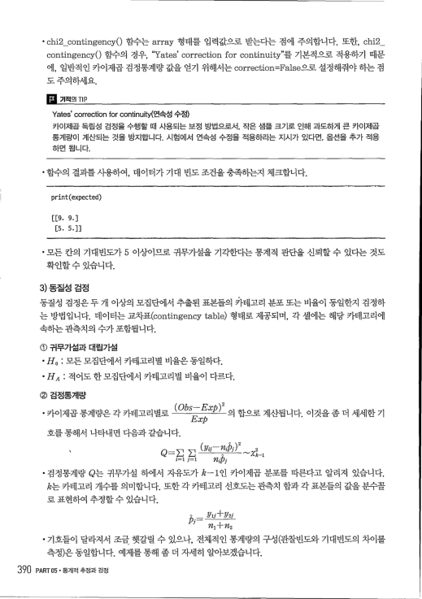
- ch12_contingency() 함수는 array 형태를 입력값으로 받는다는 점에 주의합니다 . 또한 , chi2-
contingency() 함수의 경우 , "Yates' correction for continuity " 를 기본적으로 적용하기 때문 에 , 일반적인 카이제곱 검정통계량 값을 얻기 위해서는 correction=False으로 설정해줘야 하는 점 도 주의하세요． Yates' correction for continuity（연속성 수정） 카이제곱 독립성 검정을 수행할 때 사용되는 보정 방법으로서 작은 샘플 크기로 인해 과도하게 큰 카이제곱 통계량이 계산되는 것을 방지합니다 . 시험에서 연속성 수정을 적용하라는 지시가 있다면 , 옵션을 추가 적용 하면 됩니다．

- 함수의 결과를사용하여 , 데이터가 기대 빈도 조건을 충족하는지 쳬크합니다．
```python
print(expected)
```
[[9. 9.] [5. 5.]]

- 모든 칸의 기대빈도가 5 이상이므로 귀무가설을 기각한다는 통계적 판단을 신뢰할 수 있다는 것도
확인할 수 있습니다． 3) 동질성 검정 동질성 검정은 두 개 이상의 모집단에서 추출된 표본들의 카테고리 분포 또는 비율이 동일한지 검정하 는 방법입니다 . 데이터는 교차표（contingency table) 형태로 제공되며 , 각 셀에는 해당 카테고리에 속하는 관측치의 수가 포함됩니다． ① 귀무가설과 대립가설

- H。 
: 모든 모집단에서 카데고리별 비율은 동일하다．

- HA : 적어도 한 모집단에서 카테고리별 비율이 다르다．
② 검정통계량 → , ^ , 쎄 , , =, 一 , , 비．^ →, 뺙 , 一 , , - , 벼＝  (Obs- Exp ) 2  ^1 줏 , - ^1 줏 , 一 떽 , , , , ．ㄷ】 . 1∼ , ^1一 ㅈ 一】 , , , , , 1숫1 ”,

- 카이，계，곱통계，량은 긱'「 카홰，고리，'별로 ∼∼一 ∼∼川 의' 합으로 계，산됩리'다 .' 이'거"을좀 더 섹，찌한 기， 
' ' ' ' - 니 ' ' 닐 ∼ ' ' ' ' ' - Exp 호를 통해서 나타내면 다음과 같습니다． ,, , -, '-,  (yjj-nJj)2 Q=＞그 E ' J'/ 깃．“'r7 ' ∼zt"-1 ￡ㅌ -1 J프1 flp1 "

- 검정통계량 Q는 귀무가설 하에서 자유도가 k- i인 카이제곱 분포를 따른다고 알려져 있습니다．
k는 카데고리 개수를 의미합니다 . 또한 각 카테고리 선호도는 관측치 합과 각 표본들의 값을 분수꼴 로 표현하여 추정할 수 있습니다． .

Yli+Y2i nl낙- n2

- 기호들이 달라져서 조금. 헷갈릴 수 있으나 , 전제적인 통계량의 구성（관찰빈도와 기대빈도의 차이를
측정）은동일합니다 . 예제를통해 좀 더 자세히 알아보겠습니다． 390 PART05．통계적추정과검정

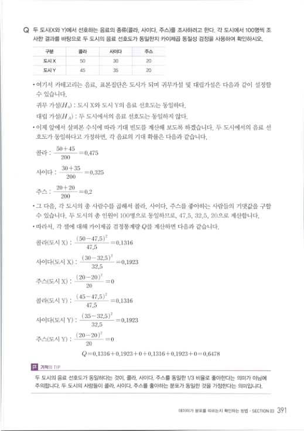
Q 두 도시（×와 Y）에서 선호하는 음료의 종류（콜라 , 사이다 , 주스）를 조사하려고 한다 . 각 도시에서 100영씩 조 사한 결과를 바탕으로 두 도시의 음료 선호도가 동일한지 카이제곱 동질성 검정을 사용하여 확인하시오． 구분 콜라 사이다 주스 도시 × 50 30 20 도시 Y 45 35 20

- 여기서 카테고리는 음료 , 표본집단은 도시가 되며 귀무가설 및 대립가설은 다음과 같이 설정할 
수 있습니다． 귀무 가설（H。) : 도시 x와 도시 Y의 음료 선호도는 동일하다． 대립 가설（HA) : 두 도시에서의 음료 선호도는 동일하지 않다．

- 이제 앞에서 살펴본 수식에 따라 기대 빈도를 계산해 보도록 하겠습니다 . 두 도시에서의 음료 선
호도가 동일하다고 가정하면 , 각 음료의 기대 확률은 다음과 같습니다．

## 콜라： 「윌襤 
「 =0.475 30 + 35 325 2。。

## 주스： “윌欌0 레.2
- 그 다음 , 각 도시의 총 사람수를 곱해서 콜라 , 사이다 , 주스를 좋아하는 사람들의 기댓값을 구할 
수 있습니다 . 두 도시의 총 인원이 100명으로 동일하므로 , 47.5, 32.5, 20으로 계산합니다．

- 따라서 , 각 셀에 대해 카이제곱 검정통계량 Q를 계산하면 다음과 같습니다．
# ［二
콜래도시x) " " 1316 （도시x) " " 눼1923 23 주스（도시x) : ( ' " -,20 ) " =0 콜래도시Y) : (45긴47·5 \2 ' ' ' =。.1316 4 r . t〕 새이다（도시Y) " " ' =0.

1923 2.5

```python
주스（도시？): ( ' " 了 " ) ' =. 
Q=0.1316+0.1923+0+0.1316+0.1923+0= 0.6478
```
．헴 기적의 지p 두 도시의 음료 선호도가 동일하다는 것이 , 콜라 , 사이다 , 주스를 동일한 1/3 비율로 좋아한다는 의미가 아님에 주의합니다 . 두 도시의 사람들이 콜라 , 사이다 , 주스를 좋아하는 분포가 동일한 것을 가정한다는 의미입니다． 데이터가분포를따르는지확인ㅎ階방법· SECTION 03 391

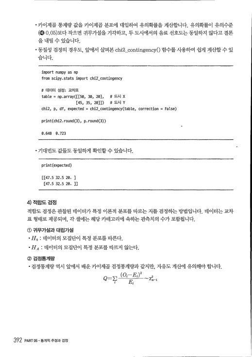
- 카이제곱 통계량 값을 카이제곱 분포에 대입하여 유의확률을 계산합니다 . 유의확률이 유의수준 
幟 0.05）보다 작으면 귀무가설을 기각하고 , 두 도시에서의 음료 선호도는 동일하지 않다고 결론 을 내릴 수 있습니다．

- 동질성 검정의 경우도 , 잎페서 살펴본 chi2_contingency() 함수를 사용하여 쉽게 계산할수 있
습니다．

```python
import numpy as np 
from scipy.stats import ch12_contingency
# 데이터 설정＝ 교차표
table = np.array([[50, 30, 20], 
if 도시 X 
[45, 35, 20]]) 
# 도시 Y 
chi2, p, df, expected = ch12_contingency(tabl.e, correction = False)
print(chi2. round(3), p. round(3))
```
0.648 0.723

- 기대빈도 값들도 동일하게 확인할 수 있습니다．
```python
print(expected)
```
[[47.5 32.5 20. ] [47.5 32.5 20. ]] 4) 적합도 검정 적합도 검정은 관찰된 데이터가 특정 이론적 분포를 따르는 지를 검정하는 방법입니다 . 데이터는 교차 표 형태로 제공되며 , 각셀에는 해당 카테고리에 속하는 관측치의 수가 포함됩니다． ① 귀무가설과 대립가설

- H。 
: 데이터의 모집단이 특정 분포를 따른다．

- HA : 데이터의 모집단이 특정 분포를 따르지 않는다．
② 검정통계량

- 검정통계량 역시 앞에서 배운 카이제곱 검정통게량과 같지만 , 자유도 계산에 유의해야 합니다．
# Q＝￥ (Q갰')2 ∼縕，,
;3貶 PART 05·통계적‘추정과검정 Ota t a p

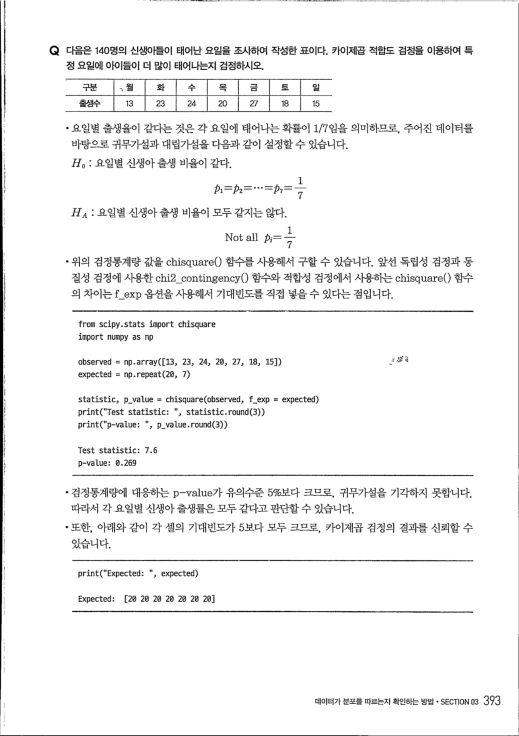
Q 다음은 140명의 신생아들이 태어난 요일을 조사하여 작성한 표이다 , 카이제곱 적합도 검정을 이용하여 특 정 요일에 아이들이 더 많이 태어나는지 검정하시오， 구분 궉 월 화 수 목 금 토 일 출생l수 13 23 24 20 27 18 15

- 요일별 출생율이 같다는 것은 각 요일에 태어나는 확률이 1/7임을 의미하므로 , 주어진 데이터를
바탕으로 귀무가설과 대립가설을 다음과 같이 설정할 수 있습니다． H。 : 요일별 신생아 출생 비율이 같다．

```python
1 
p1=p2= ... =p7= - 7 
HA : 요일별 신생아 출생 비율이 모두 같지는 않다．
```
7

- 위의 검정통계량 값을 chisquare() 함수를 사용해서 구할 수 있습니다 . 앞선 독립성 검정과 동
질성 검정에 사용한 ch12_contingency() 함수와 적합성 검정에서 사용하는 chisquare() 함수 의 차이는 幻－exp 옵션을 사용해서 기대빈도를 직접 넣을 수 있다는 점입니다．

```python
from scipy.stats import chisquare 
import numpy as np
```
＝ㅉ 죠

```python
observed = np.array(f13, 23, 24, 20, 27, 18, 15])
expected = np.repeat(20, 7)
statistic, p- value = chisquare(observed, f-exp = expected) 
print(Test statistic: " , statistic.round(3)) 
print("p-value: ", p_value. round(3))
```
Test statistic: 7.6 p-value: 0.269

- 검정통계량에 대응하는 p-value가 유의수준 5％보다 크므로 , 귀무가설을 기각하지 못합니다．
따라서 각 요일별 신생아 출생률은 모두 같다고 판단할 수 있습니다．

- 또한 , 아래와 같이 각 셀의 기대빈도가 5보다 모두 크므로 , 카이제곱 검정의 결과를 신뢰할 수
있습니다．

```python
print("Expected: ", expected)
```
Expected:

[20 20 20 20 20 20 20] 데이터가분포를 따르는지 확인하는 방법 · SECTION 03 393

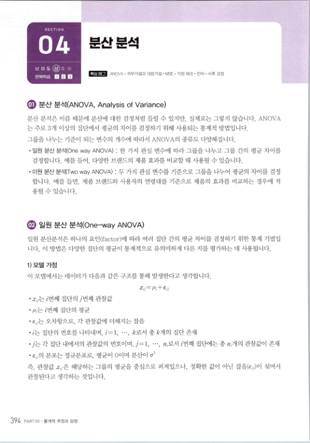
# 분산 분석
핵심 태그 ANOVA · 귀무가설과 대립가설 · MSE · 가정 체크 · 잔차 · 사후 검정 .

분산 분석（ANOVA, Analysis of Variance) 분산 분석은 이름 때문에 분산에 대한 검정처럼 들릴 수 있지만 , 실제로는 그렇지 않습니다 . ANOVA 는 주로 3개 이상의 집단에서 평균의 차이를 검정하기 위해 사용되는 통계적 방법입니다． 그룹을 나누는 기준이 되는 변수의 개수에 따라서 ANOVA의 종류도 다양해집니다．

- 일원 분산 분석（One way ANOVA) : 한 가지 관심 변수에 따라 그룹을 나누고 그룹 간의 평균 차이를
검정합니다 . 예를 들어 , 다양한 브랜드의 제품 효과를 비교할 때 사용될 수 있습니다． 이원 분산 분석（Two way ANOVA) : 두 가지 관심 변수를 기준으로 그룹을 나누어 평균의 차이를 검정 합니다 . 예를 들면 , 제품 브랜드와 사용자의 연령대를 기준으로 제품의 효과를 비교하는 경우에 적 용될 수 있습니다． .

일원 분산 분석（One-way ANOVA) 일원 분산분석은 하나의 요인（factor）에 따라 여러 집단 간의 평균 차이를 검정하기 위한 통계 기법입 니다 . 이 방법은 다양한 집단의 평균이 통계적으로 유의미하게 다른 지를 평가하는 데 사용됩니다． 1) 모델 가정 이 모델에서는 데이터가 다음과 같은 구조를 통해 발생한다고 생각합니다．

```python
xii= p汁eli
```
xii는 2번째 집단의 ／번째 관찰값 角는 2번째 집단의 평균

- c《’는 오차항으로 , 각 관찰값에 더해지는 잡음
2는 집단의 번호를나타내며 , i= 1, … , k로서 총k개의 집단존재

- ／는각집단내에서의 관찰값의 번호이며 , j= 1, .., n로서 2번째 집단에는총n：개의 관찰값이 존재
- 611의 분포는 棚予분포로 , 평균이 0이며 분산이 r
즉 , 관찰값 xii：은 해당하는 그룹의 평균을 중심으로 퍼져있으나 , 정확한 값이 아닌 잡음（611）이 섞여서 관찰된다고 생각하는 것입니다． 394 PART 05．통계적추정과검정

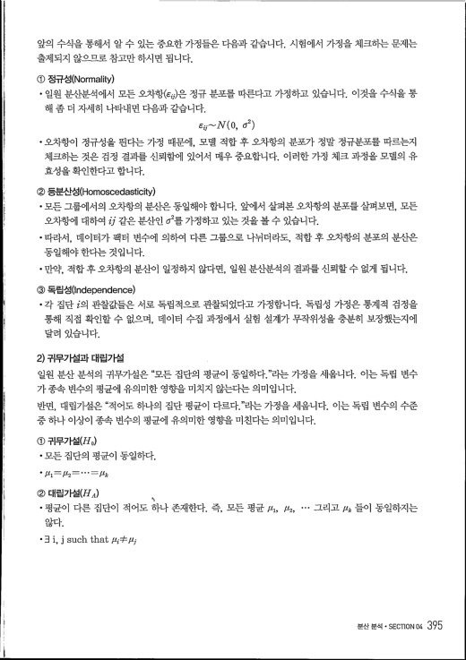
앞의 수식을 통해서 알 수 있는 중요한 가정들은 다음과 같습니다 . 시험에서 가정을 쳬크하는 문제는 출제되지 않으므로 참고만 하시면 됩니다． ① 정규성（Normality)

- 일원 분산분석에서 모든 오차항（6ij）은 騙干 분포를 따른다고 가정하고 있습니다 . 이것을 수직을 통
해 좀 더 자세히 나타내면 다음과 같습니다． 1-N (O, 戚 2)

- 오차항이 정규성을 띈다는 가정 때문에 , 모델 적합 후 오차항의 분포가 정말 蔘子분포를 따르는지
쳬크하는 것은 검정 결과를 신뢰함에 있어서 매우 충요합니다 . 이러한 가정 쳬크 과정을 모델의 유 효성을 확인한다고 합니다． ② 등분산성어omoscedasticity)

- 모든 그룹에서의 오차항의 분산은 동일해야 합니다 . 앞에서 살펴본 오차항의 분포를 살펴보면 , 모든
오차항에 대하여 1/ 같은분산인 α2를 가정하고 있는 것을볼 수 있습니다．

- 따라서 , 데이터가 팩터 변수에 의하여 다른 그룹으로 나뉘더라도 , 적합 후 오차항의 분포의 분산은
동일해야 한다는 것입니다．

- 만약 , 적합 후 오차항의 분산이 일정하지 않다면 , 일원 분산분석의 결과를 신뢰할 수 없게 됩니다．
③ 독립성0ndependence)

- 각 집단 1의 관찰값들은 서로 독립적으로 관찰되었다고 가정합니다 . 독립성 가정은 통계적 검정을
통해 직접 확인할 수 없으며 , 데이터 수집 과정에서 실험 설계가 무작위성을 충분히 보장했는지에 달려 있습니다． 2) 귀무가설과 대립가설 일원 분산 분적의 귀무가설은 " 모든 집단의 평균이 동일하다 . " 라는 가정을 세웁니다 . 이는 독립 변수 가 종속 변수의 평균에 유의미한 영향을 미치지 않는다는 의미입니다． 반면 , 대립가설은 " 적어도 하나의 집단 평균이 다르다 . " 라는 가정을 세웁니다 . 이는 독립 변수의 수준 중 하나 이상이 종속 변수의 평균에 유의미한 영향을 미친다는 의미입니다． ① 귀무가설（H。)

- 모든 집단의 평균이 동일하다．
' P1- P2- " '- /tk ② 대립가설（HA)

- 평균이 다른 집단이 적어도 하나 존재한다 . 즉 , 모든 평균 /z1, P2, … 그리고 /z冷 들이 동일하지는
않다． ' 크 i, j such that p* p1 분산분석· SECTION 04 395

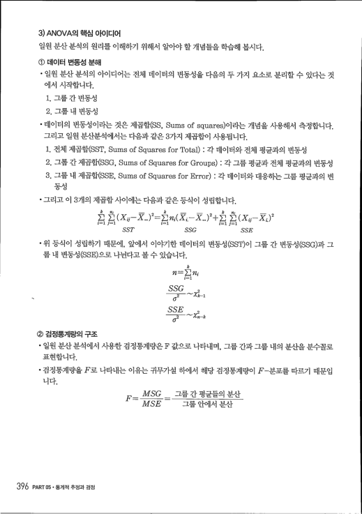
3) ANOVA의 핵심 아이디어 일원 분산 분석의 원리를 이해하기 위해서 알아야 할 개넘들을 학습해 봅시다． ① 데이터 변동성 분해 ' 일원 분산 분석의 아이디어는 전쳬 데이터의 변동성을 다음의 두 가지 요소로 분리할 수 있다는 것 에서 시작합니다． 1 . 그룹 간 변동성 2 . 그룹 내 변동성 ' 데이터의 변동성이라는 것은 제곱합（SS, Sums of squares）이라는 개념을 사용해서 측정합니다． 그리고 일원 분산분석에서는 다음과 같은 3가지 제곱합이 사용됩니다． 1 . 전쳬 제곱합（SST, Sums of Squares for Total) : 각 데이터와 전쳬 평균과의 변동성 2 . 그룹 간 제곱합（SSG, Sums of Squares for Groups) : 각 그룹 평균과 전쳬 평균과의 변동성 3 . 그룹 내 제곱합（SSE, Sums of Squares for Error) : 각 데이터와 대응하는 그룹 평균과의 변 동성 ' 그리고 이 3개의 제곱합 사이에는 다음과 같은 등식이 성립합니다．

# k n1(x〃－ 
-0) ' = k叫（ - (X15-X..)2 ->..n1(X.- z1 j 1 i=1 Z..) ' ＋鞭(X,-X1.)2 SST sSG SSE ' 위 등식이 성립하기 때문에 , 앞에서 이야기한 데이터의 변동성（SST）이 그룹 간 변동성（SSG）과 그 룹 내 변동성（SSE）으로 나뉜다고 볼 수 있습니다 .

```python
k 
1z=＝刀ni 
i= 1
```
SSG α2 羈1 S8E α2 ∼z긺－无 ② 검정통계량의 구조 ' 일원 분산 분석에서 사용한 검정통계량은 F 값으로 나타내며 , 그룹 간과 그룹 내의 분산을 분수꼴로 표현합니다． ' 검정통계량을 ／구로 나타내는 이유는 귀무가설 하에서 해당 검정통계량이 F－분포를 따르기 때문입 니다． ＇ㄱ MSG 그룹간평균들의 분산 r - ∼ - ∼ －∼ =

- 
.

M S1!' 그둡 안에서 분산 396 PART 05．통계적추정과검정

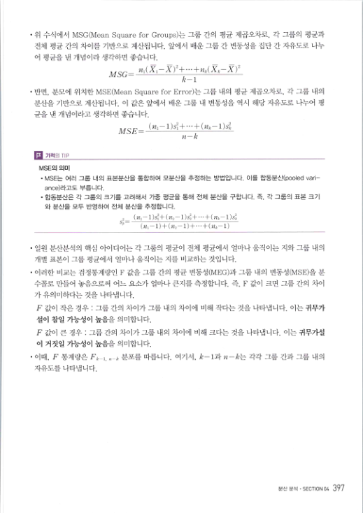
- 위 수식에서 MSG(Mean Square for Groups）는 그룹 간의 평균 제곱오차로 , 각 그룹의 평균과
전쳬 평균 간의 차이를 기반으로 계산됩니다 . 앞에서 배운 그룹 간 변동성을 집단 간 자유도로 나누

### 어 평균을 낸 개념이라 생각하면 좋습니다． 
n1(X1-Z）꽈…+nk(夙－Z)2 k- i

- 반면 , 분모에 위치한 MSE(Mean Square for Error）는 그룹 내의 평균 제곱오차로 , 각 그룹 내의
분산을 기반으로 계산됩니다 . 이 값은 앞에서 배운 그룹 내 변동성을 역시 해당 자유도로 나누어 평 균을 낸 개념이라고 생각하면 좋습니다．

```python
MSE=  (n1-1)s:+...+(nk__1)s 
n- k
```
### r헴 기적의 지P
MSE의 의미

- MSㅌ는 여러 그룹 내의 표본분산을 통합하여 모분산을 추정하는 방법입니다 . 이를 합동분산（pooled van-
ance）라고도 부릅니다．

- 합동분산은 각 그룹의 크기를 고려해서 가중 펑균을 통해 전체 분산을 구합니다 . 즉 . 각 그룹의 표본 크기
와 분산을 모두 반영하여 전체 분산을 추정합니다． , (n,-1) s坪(n, -1) s朴··나(nb-1)s鷺 s뒤= .

.

.

- .

.

.

' 니z1-17 낙- `, 'z2- ') 낙－ " ' 十 너錢-17

- 일원 분산분석의 핵심 아이디어는 각 그룹의 평균이 전쳬 평균에서 얼마나 움직이는 지와 그룹 내의
개별 표본이 그룹 평균에서 얼마나 움직이는 지를 비교하는 것입니다．

- 이러한 비교는 검정통계량인 F 값을 그룹 간의 평균 변동성（MEG）과 그룹 내의 변동성（MSE）을 분
수꼴로 만들어 놓음으로써 어느 요소가 얼마나 큰지를 측정합니다 . 즉 , F 값이 크면 그룹 간의 차이 가 유의미하다는 것을 나타냅니다． ／구 값이 작은 경우 : 그룹 간의 차이가 그룹 내의 차이에 비해 작다는 것을 나타냅니다 . 이는 귀무가 설이 참일 가능성이 높음을 의미합니다 .

F 값이 큰 경우 : 그룹 간의 차이가 그룹 내의 차이에 비해 크다는 것을 나타냅니다 . 이는 귀무가설 이 거짓일 가능성이 높음을 의미합니다 .

- 이때 , F 통계량은 ／구力크 , ㅏ 분포를 따릅니다 . 여기서 , k- i과 n- k는 각각 그룹 간과 그룹 내의
자유도를 나타냅니다 .

분산분석 . SECTION 04 397

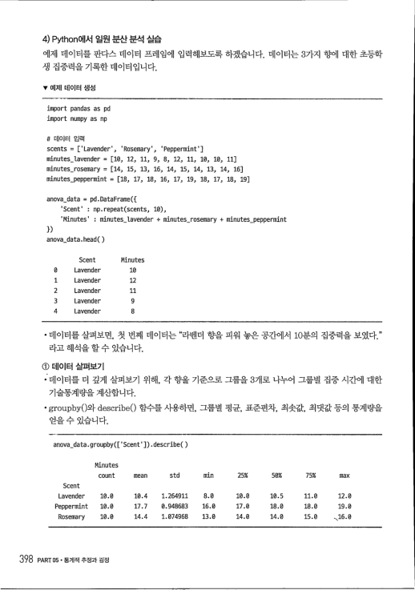
4) Python에서 일원 분산 분석 실습 예제 데이터를 판다스 데이터 프레임에 입력해보도록 하겠습니다 . 데이터는 3가지 향에 대한 초등학 생 집중력을 기록한 데이터 입니다． ▼ 예제 데이터 생성

```python
import pandas as pd 
import numpy as np
# 데이터 입력 
scents = ['Lavender', 'Rosemary', 'Peppermint'] 
minutes_lavender = [10, 12, 11, 9, 8, 12, 11, 10, 10, 11] 
minutes_rosemary = [14, 15, 13, 16, 14, 15, 14, 13, 14, 16] 
minutes_peppermint = [18, 17, 18, 16, 17, 19, 18, 17, 18, 19]
anova_data = pd.DataFrame({
```
' Scent' = np.repeat(scents, 10), ' Minutes' : minutes_lavender + minutes_rosemary + minutes_peppermint }) anova_data head() Scent Minutes 0 Lavender 1 Lavender 10 12 11 2 Lavender 3 Lavender 9 4 Lavender 8

- 데이터를 살펴보면 , 첫 번째 데이터는 " 라벤더 향을 피워 놓은 공간에서 10분의 집중력을 보였다．" 
라고 해석을 할 수 있습니다． ① 데이터 살펴보기

- 데이터를 더 깊게 살펴보기 위해 , 각 향을 기준으로
그룹을 3개로 나누어 그룹별 집중 시간에 대한 기술통계량을 계산합니다．

- groupby(）와 describe() 함수를 사용하면 , 그룹별
평균 , 표준편차 , 최솟값 , 최댓값등의 통계량을 얻을 수 있습니다． anova_data.groupby([ 'Scent'] ) .describe() Minutes count mean std mmn 25% 50% 75% max Scent Lavender 10.0 10.4 1.264911 8.0 10.0 10.5 11.0 12.0 Peppermint 10.0 17.7 0.948683 16.0 17.0 18.0 18.0 19.0 Rosemary 10.0 14.4 1.074968 13.0 14.0 14.0 15.0 \ 16.0 398 PART05．통계적추정과검정

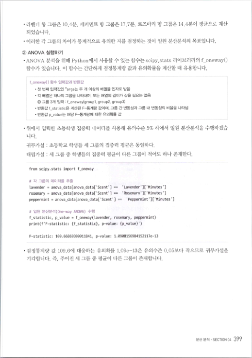
- 라벤더 향 그룹은 10.4분 , 페퍼민트 향 그룹은 17.7분 , 로즈마리 향 그룹은 14.4분이 평균으로 계산
되었습니다．

- 이러한 각 그룹의 차이가 통계적으로 유의한 지를 검정하는 것이 일원 분산분석의 목표입니다．
② ANOVA 실행하기

- ANOVA 분석을 위해 Python에서 사용할 수 있는 함수는 scipy. stats 라이브러리의 〔oneway()
함수가 있습니다 . 이 함수는 간단하게 검정통계량 값과 유의확률을 계산할 때 유용합니다． f_oneway( ) 함수 입력값과 반환값

- 첫 번째 입력값인 *a rgs는 두 개 이상의 배열을 인자로 받음
- 각 배열은 하나의 그룹을 나타내며 , 모든 배열의 길이가 같을 필요는 없음
o 그룹 3개 입력 : f_oneway(groupl. group2. group3)

- 반환값 f statistic은 계산된 F통계량 값이며 , 그룹 간 변동성과 그룹 내 변동성의 비율을 나타냄
- 반환값 p_va tue는 해당 F총계량에 대한 유의확률 값
- 위에서 입력한 초등학생 집중력 데이터를 사용해 유의수준 5% 하에서 일원 분산분석을 수행하겠습
니다． 귀무가설 : 초등학교 학생들 세 그룹의 집중력 평균은 동일하다． 대립가설 : 세 그룹 중 학생들의 집중력 평균이 다른 그룹이 적어도 하나 존재한다．

```python
from scipy.stats import f_oneway
# 각 그룹의 데이터를 추출
lavender = anova_data[anova_data[ 'Scent '] == 
'Lavender'] ['Minutes']
rosemary = anova_data[anova_data[ 'Scent '] == 
'Rosemary'] [' Minutes']
peppermint = anova_data[anova_data[ 'Scent '] == 
'Peppermint '] ['Minutes ' ]
# 일원 분산분석（One-way ANOVA) 수행 
f-statistic, p_value = f_oneway(lavender, rosemary, peppermint) 
print(f ' F-statistic: {f-statistic}, p-value: {p-value}')
```
F-statistic: 109. 66869300911841, p-value: 1.0908156984152117e-13

- 검정통계량 값 109.6에 대응하는 유의확률 1. 09e-13은 유의수준 0.05보다 작으므로 귀무가설을
기각합니다 . 즉 , 주어진 세 그룹 중 평균이 다른 그룹이 존재합니다． 분산분석．SECTION 04 399

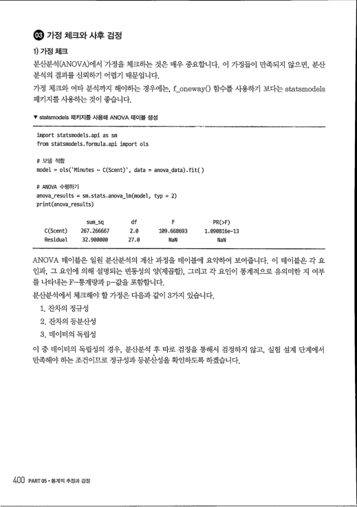
.

가정 체크와 사후 검청 1) 가정 체크 분산분석（ANOVA）에서 ' 가정을 쳬크하는 것은 매우 중요합니다 . 이 가정들이 만족되지 않으면 , 분산 분석의 결과를 신뢰하기 어렵기 때문입니다． 가정 쳬크와 여타 분석까지 해야하는 경우에는 , f_oneway() 함수를 사용하기 보다는 statsmodels 패키지를 사용하는 것이 좋습니다． V statsmodels 패키지를 사용해 ^NOVA 테이블 생성

```python
import statsmodels.api as sm 
from statsmodels.formula.api import ols
# 모델 적합
```
model. = ol.s('Minutes " C(Scent)', data = anova_data).fit ()

```python
# ANOVA 수행하기
anova_results = sm.stats.anova_lm(model, typ = 2) 
print(anova_results)
```
sum_sq df F PR(>F) C(Scent) 267.266667 2.0 109.668693 1.090816e-13 Residual.

32.900000 27.0 NaN NaN ANOVA 테이블은 일원 분산분석의 계산 과정을 테이블에 요약하여 보여줍니다 . 이 테이블은 각 요 인과 , 그 요인에 의해 설명되는 변동성의 양（제곱합） , 그리고 각 요인이 통계적으로 유의미한 지 여부 를 나타내는 F－통계량과 p－값을 포함합니다． 분산분석에서 쳬크해야 할 가정은 다음과 같이 3가지 있습니다． 1 . 잔차의 정규성 2 . 잔차의 등분산성 3 . 데이터의 독립성 이 중 데이터의 독립성의 경우 , 분산분석 후 따로 검정을 통해서 검정하지 않고 , 실험 설계 단계에서 만족해야 하는 조건이므로 蔘予성과 등분산성을 확인하도록 하겠습니다． 400 PART 05·통계적추정과검정

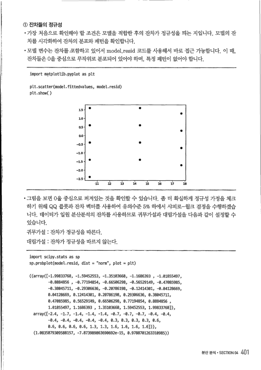
① 잔차들의 珹구성

- 가장 처음으로 확인해야 할 조건은 모델을 적합한 후의 잔차가 정규성을 띄는 지입니다 . 모델의 잔
차를 시각화하여 잔차의 분포와 패턴을 확인합니다．

- 모델 변수는 잔차를포함하고 있어서 modeLresid 코드를 사용해서 바로 ，접근 가능합니다 . 이 때， 
잔차들은 0을중심으로무작위로 분포되어 있어야 하며 , 특정 패턴이 없어야합니다．

```python
import matpiotl.ib.pyplot as pit
```
pl.t. scatter(model.fittedvalues, model. resid) pl.t. show()

## - 
ㅣ ; ● S 工．5 · S 1.o* S S 05 .

S 0.0- .

S －以5 ' S -1.0 .

.

.

-15 털 S -2.0- S ' .

i ' ' ` 1 .

21 그2 13 14 15 16 17 18

- 그림을 보면 0을 중심으로 퍼져있는 것을 확인할 수 있습니다 . 좀 더 확실하게 정규성 가정을 쳬크
하기 위해 QQ 플롯과 잔차 벡터를 사용하여 유의수준 5% 하에서 샤피로－윌크 검정을 수행하겠습 니다 . 데이터가 일원 분산분석의 잔차를 사용하므로 귀무가설과 대립가설을 다음과 같이 설정할 수 있습니다． 귀무가설 : 잔차가 정규성을 따른다． 대립가설 : 잔차가 정규성을 따르지 않는다．

```python
import scipy.stats . as sp 
sp.probpiot(model.resid, dist = "norm', plot = plt)
```
( (array(E-1.99833768, -1.59452553, -1.35103668, -1.1686393 , -1.01855497, -0.8884856 , -0.77194854, -0.66506298, -0.56529149, -0.47085985, -0.38045711, -0.29306636,, -0.20786198, -0.12414301, -0.04128669, 0.04128669, 0.12414301, 0.20786198, 0.29306636, 0.38045711, 0.47085985, 0.56529149,, 0.66506298, 0.77194854, 0.8884856 , 1.01855497, 1.1686393 , 1.35103668, 1.59452553, 1.99833768]), array([-2.4, -1.7, -1.4, -1.4, -1.4, -0.7, -0.7, -0.7, -0.4, -0.4, -0.4, -0.4, -0.4, -0.4, -0.4, 0.3, 0.3, 0.3, 0.3, 0.6, 0.6, 0.6, 0.6, 0.6, 1.3, 1.3, 1.6, 1.6, 1.6, 1.6])), (1.0835879309588157, -7. 873989863690692e-15, 0.9788701263310985)) 분산분석＊SECTION 04 401

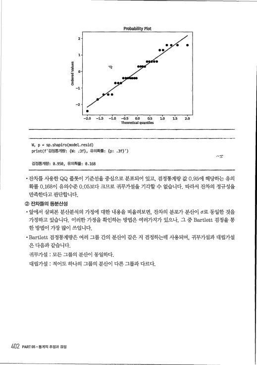
Probability Plot 써 。

＝ 泌 ＞ ” 므 。

ㄲ 匕 o 1 ' .

i 」 .

i

- ' 
' -2.0 -1.5 -1.0 -0.5 0.0 0.5 1.0 1.5 2.0 Theorebcal quan비es

```python
W, p = sp.shapiro(niodeLresid) 
print(f ' 검정통계량： {W: .3f}, 유의확률＝ {p: .3f} ' )
```
검정통계량： 0.950, 유의확률＝ 0.168

- 잔차를 사용한 QQ 플롯이 기준선을 중심으로 분포되어 있고 , 검정통계량 값 0.95에 해당하는 유의
확률 0.168이 유의수준 0.05보다 크므로 귀무가설을 기각할 수 없습니다 . 따라서 잔차의 정규성을 만족한다고 판단합니다． ② 잔차들의 등분산성

- 앞에서 살펴본 분산분석의 가정에 대한 내용을 떠올려보면 , 잔차의 분포가 분산이 (1로 동일한 것을
가정하고 있습니다 . 이러한 가정을 확인하는 방법은 여러가지가 있으나 , 효 중 Bartlett 검정을 통 한 방법이 가장 많이 쓰입니다．

- Bartlett 검정통계량은 여러 그룹 간의 분산이 같은 지 검정하는데 사용되며 , 귀무가설과 대립가설 
은 다음과 같습니다． 귀무가설 : 모든 그룹의 분산이 동일하다 .

대립가설 : 적어도 하나의 그룹의 분산이 다른 그룹과 다르다． 402 PART 05．통계적추정과검정

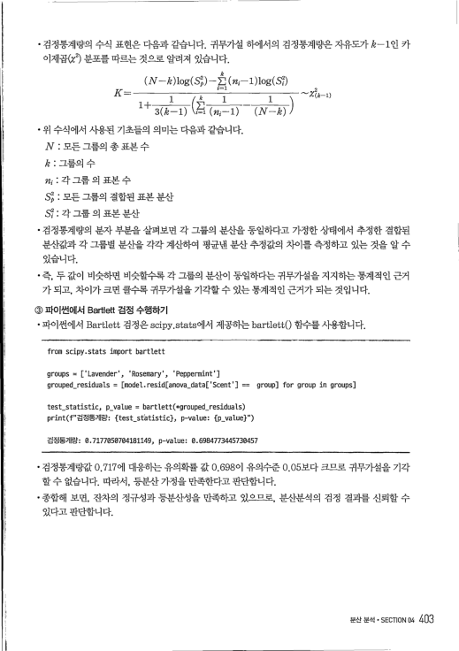
- 검정통계량의 수식 표현은 다음과 같습니다 . 귀무가설 하에서의 검정통계량은 자유도가 k- i인 카
이제곱（/2) 분포를 따르는 것으로 알려져 있습니다． k .

.

(N- k)log(S) -프(n1-i)log(S) K= .

1 (스 1 1 '\ 1 3(k- 1) （읕i (ne-i) 阿- k) 7 ∼z2*-1)

- 위 수식에서 사용된 기초들의 의미는 다음과 같습니다．
N : 모든 그룹의 총 표본 수 l k : 그룹의 수 ni : 각 그룹 의 표본 수 Jp : 모든 그룹의 결합된 표본 분산 s : 각 그룹 의 표본 분산

- 검정통계량의 분자 부분을 살펴보면 각 그룹의 분산을 동일하다고 가정한 상태에서 추정한 결합된
분산값과 각 그룹별 분산을 각각 계산하여 평균낸 분산 추정값의 차이를 측정하고 있는 것을 알 수 있습니다．

- 즉 , 두 값이 비슷하면 비슷할수록 각 그룹의 분산이 동알하다는 귀무가설을 지지하는 통계적인 근거 
가 되고 , 차이가 크면 클수록 귀무가설을 기각할 수 있는 통계적인 근거가 되는 것입니다． ③ 파애섶에서 Bartlett 검정 수행하기

- 파이썬에서 Bartlett 검정은 scipy. stats에서 제공하는 bartlett() 함수를 사용합니다．
```python
from scipy.stats import bartlett
groups = [ 'Lavender', ' Rosemary ', 'Peppermints]
grouped_residuals = 1model.resid[anova_data{'Scent '] == group] for group in groups]
test_statistic, p_value = bartlett(*grouped_residuals) 
print(f " 검정통계량： {test_statistic}, p-value: {p_value} ")
```
검정통계량: 0.7177050704181149, p-value: 0.6984773445730457

- 검정통계량값 0.717에 대응하는 유의확률 값 0.698이 유의수준 0.05보다 크므로 귀무가설을 기각 
할수 없습니다 . 따라서 , 등분산가정을만족한다고판단합니다．

- 종합해 보면 , 잔차의 정규성과 등분산성을 만족하고 있으므로 , 분산분석의 검정 결과를 신뢰할 수
있다고 판단합니다． 분산분석 .SECTION 04 403

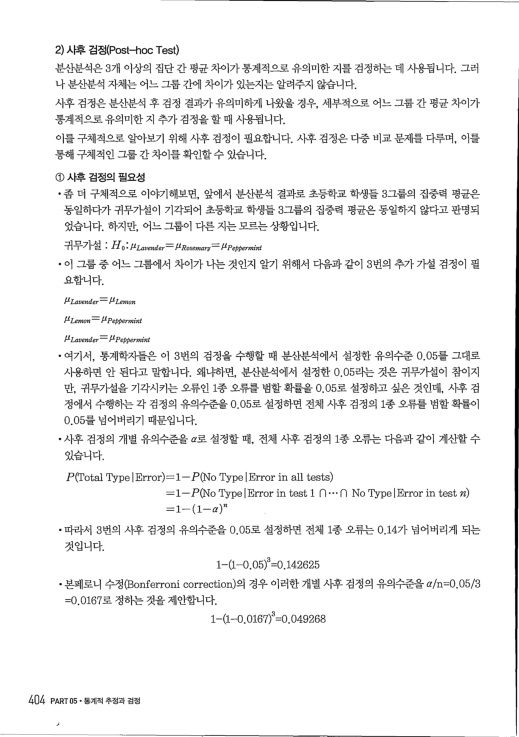
2) 사후 검정（Post-hoc Test) 분산분석은 3개 이상의 집단 간 평균 차이가 통계적으로 유의미한 지를 검정하는 데 사용됩니다. 그러 나 분산분석 자쳬는 어느 그룹 간에 차이가 있는지는 알려주지 않습니다． 사후 검정은 분산분석 후 검정 결과가 유의미하게 나왔을 경우 , 세부적으로 어느 그룹 간 평균 차이가 통계적으로 유의미한 지 추가 검정을 할 때 사용됩니다． 이를 구쳬적으로 알아보기 위해 사후 검정이 필요합니다 . 사후 검정은 다중 비교 문제를 다루며 , 이를 통해 구쳬적인 그룹 간 차이를 확인할 수 있습니다． ① 사후 검정의 필요성

- 좀 더 구쳬적으로 이야기해보면 , 앞에서 분산분석 결과로 초등학교 학생들 3그룹의 집중력 평균은
동일하다가 귀무가설이 기각되어 초등학교 학생들 3그룹의 집중력 평균은 동일하지 않다고 판명되 었습니다 . 하지만, 어느그룹이 다른지는모르는상황입니다． 귀무가설 : if o: PLavender= PR。semary = PPeppermint

- 이 그룹 중 어느 그룹에서 차이가 나는 것인지 알기 위해서 다음과 같이 3번의 추가 가설 검정이 필
요합니다． ／仕avender= βLemon ／仕emon＝杓5eppermjnt ／仕avender = PPeppermint

- 여기서 , 통계학자들은 이 3번의 검정을 수행할 때 분산분석에서 설정한 유의수준 0.05를 그대로
사용하면 안 된다고 말합니다 . 왜냐하면 , 분산분석에서 설정한 0.05라는 것은 귀무가설이 참이지 만, 귀무가설을 기각시키는 오류인 1종 오류를 범할 확률을 0.05로 설정하고 싶은 것인데 , 사후 검 정에서 수행하는 각 검정의 유의수준을 ft05로 설정하면 전쳬 사후 검정의 1종 오류를 범할 확률이 0.05를 넘어버리기 때문입니다．

- 사후 검정의 개별 유의수준을 α로 설정할 때 , 전쳬 사후 검정의 1종 오류는 다음과 같이 계산할 수
있습니다． P(Total Type I Error) = 1- P(No Type I Error in all tests) =1-P(No Type Error in test 1 fl ··· fl No Type Error in test n) =1- (i- a)n

- 따라서 3번의 사후 검정의 유의수준을 0.05로 설정하면 전쳬 1종 오류는 0.14가 넘어버리게 되는
것입니다． 1-(1-0.05)3=0.142625

- 본페로니 수정（Bonferroni correction）의 경우 이러한 개별 사후 검정의 유의수준을 α/n=0.05/3 
=0.0167로 정하는 것을 제안합니다． 1-(1-0.0167)3=0. 049268 404 PART05·통계적추정과검정

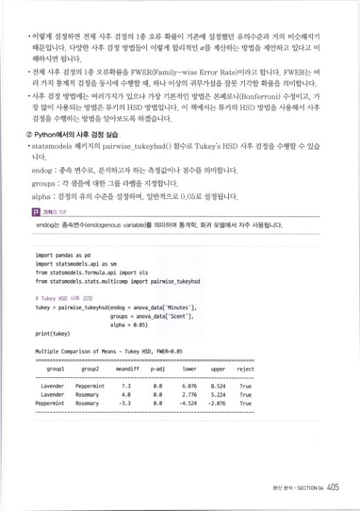
- 이렇게 설정하면 전쳬 사후 검정의 1종 오류 확률이 기존에 설정했던 유의수준과 거의 비슷해지기
때문입니다 . 다양한 사후 검정 방법들이 이렇게 합리적인 α를 계산하는 방법을 제안하고 있다고 이 해하시면 됩니다．

- 전쳬 사후 검정의 1종 오류확률을 FWER(Family-wise Error Rate）이라고 합니다 . FWER는 여
러 가지 통계적 검정을 동시에 수행할 때 , 하나 이상의 귀무가설을 잘못 기각할 확률을 의미합니다．

- 사후 검정 방법에는 여러가지가 있으나 가장 기본적인 방법은 본페로니（Bonferroni) 수정이고 , 가 
장 많이 사용되는 방법은 튜키의 HSD 방법입니다 . 이 책에서는 튜키의 HSD 방법을 사용해서 사후 검정을 수행하는 방법을 알아보도록 하겠습니다． ②Python에서의 사후 검정 실습

- statsmodels 패키지의 pairwise_tukeyhsd() 함수로 Tukey's HSD 사후 검정을 수행할 수 있습
니다． endog : 종속 변수로 , 분적하고자 하는 측정값이나 점수를 의미합니다． groups : 각 샘플에 대한 그룹 라벨을 지정합니다． alpha : 검정의 유의 수준을 설정하며 , 일반적으로 0.05로 설정됩니다． .

기적의 胛 endog는 종속변수（endogenous variable）를 의미하며 통계학 , 회귀 모델에서 자주 사용됩니다．

```python
import pandas as pd 
import statsmodets.api as sm
from statsmodels. formuth.api import o1s
from statsmode1s. stats.mutticomp import pairwisetukeyhsd
# Tukey HS[) 사후 검정
tukey = pairwise_tukeyhsd(endog = anova_data[ 'Minutes' ],
groups = anova_data[ 'Scent' ],
a'pha = 0.05) 
print(tukey)
```
Multiple Comparison of Means - Tukey HSD, FWER=O.05 groupi group2 meandiff p-adj lower upper reject Lavender Peppermint 7.3 0.0 6.076 8.524 True Lavender Rosemary 4.0 0.0 2.776 5.224 True Peppermint Rosemary -3.3 0.0 -4.524 -2.076 True 분산 분석 · SECTION 04 405

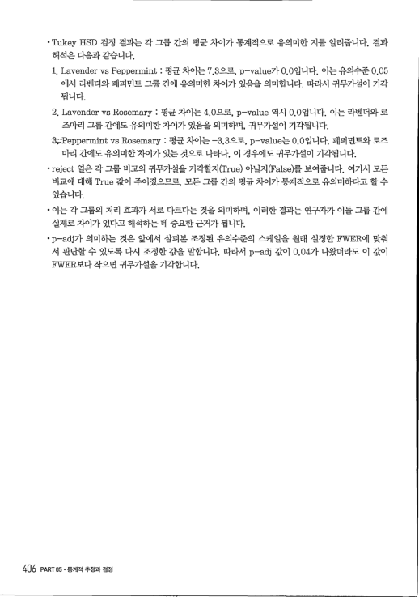
- Tukey HSD 검정 결과는 각 그룹 간의 평균 차이가 통계적으로 유의미한 지를 알려줍니다 . 결과
해석은 다음과 같습니다．

1. Lavender vs Peppermint : 평균 차이는 7.3으로 , p-value가 0.0입니다 . 이는 유의수준 0.05
에서 라벤더와 페퍼민트 그룹 간에 유의미한 차이가 있음을 의미합니다 . 따라서 귀무가설이 기각 됩니다．

2. Lavender vs Rosemary : 평균차이는 4.0으로 , p-value 역시 0.0입니다 . 이는 라벤더와로
즈마리 그룹 간에도 유의미한 차이가 있음을 의미하며 , 귀무가설이 기각됩니다 .

「3?eppermint vs Rosemary : 평균 차이는 -3.3으로 , p-value는 0.0입니다 . 페퍼민트와 로즈 마리 간에도 유의미한차이가 있는 것으로 나타나 , 이 경우에도 귀무가설이 기각됩니다．

- reject 열은 각 그룹 비교의 귀무가설을 기각할지（True) 아닐지（False）를 보여줍니다 . 여기서 모든
비교에 대해 True 값이 주어졌으므로 , 모든 그룹 간의 평균 차이가 통계적으로 유의미하다고 할 수 있습니다．

- 이는 각 그룹의 처리 효과가 서로 다르다는 것을 의미하며 , 이러한 결과는 연구자가 이들 그룹 간에
실제로 차이가 있다고 해석하는 데 중요한 근거가 됩니다.

- p-adj가 의미하는 것은 앞에서 살펴본 조정된 유의수준의 스케일을 원래 설정한 FWER에 맞춰
서 판단할 수 있도록 다시 조정한 값을 말합니다 . 따라서 p-adj 값이 0.04가 나왔더라도 이 값이 FWER보다 작으면 귀무가설을 기각합니다． 406 PART 05．통계적추정과검정

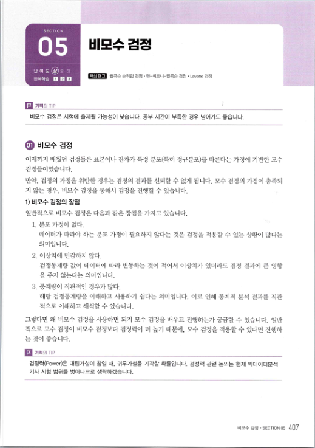
# SECTION 05
# 비모수 검정
난 이 도

### 반복학습 non
핵심 태그 윌콕슨 순위합 검정 · 맨－휘트니－윌콕슨 검정 · Levene 검정 .

기적의 지P 비모수 검정은 시험에 출제될 가능성이 낮습니다 . 공부 시간이 부족한 경우 넘어가도 좋습니다． .

비모수 검정 이제까지 배웠던 검정들은 표본이나 잔차가 특정 분포（특히 정규분포）를 따른다는 가정에 기반한 모수 검정들이었습니다． 만약 , 검정의 가정을 위반한 경우는 검정의 결과를 신뢰할 수 없게 됩니다 . 모수 검정의 가정이 충족되 지 않는 경우 , 비모수 검정을 통해서 검정을 진행할 수 있습니다． 1) 비모수 검정의 장점 일반적으로 비모수 검정은 다음과 같은 장점을 가지고 있습니다． 1 . 분포 가정이 없다． 데이터가 따라야 하는 분포 가정이 필요하지 않다는 것은 검정을 적용할 수 있는 상황이 많다는 의미입니다． 2 . 이상치에 민감하지 않다． 검정통계량 값이 데이터에 따라 변동하는 것이 적어서 이상치가 있더라도 검정 결과에 큰 영향 을 주지 않는다는 의미입니다． 3 . 통계량이 직관적인 경우가 많다 .

해당 검정통계량을 이해하고 사용하기 쉽다는 의미입니다 . 이로 인해 통계적 분적 결과를 직관 적으로 이해하고 해석할 수 있습니다． 그렇다면 왜 비모수 검정을 사용하면 되지 모수 검정을 배우고 진행하는가 궁금할 수 있습니다 . 일반 적으로 모수 검정이 비모수 검정보다 검정력이 더 높기 때문에 , 모수 검정을 적용할 수 있다면 진행하 는 것이 좋습니다． ．잽 기적의 ㅐP 검정력（Power）은 대립가설이 참일 【대 , 귀무가설을 기각할 확률입니다 . 검정력 관련 논의는 현재 빅데이터분석 기사 시험 범위를 벗어나므로 생략하겠습니다． 비모수 검정 . SECTION 05 407

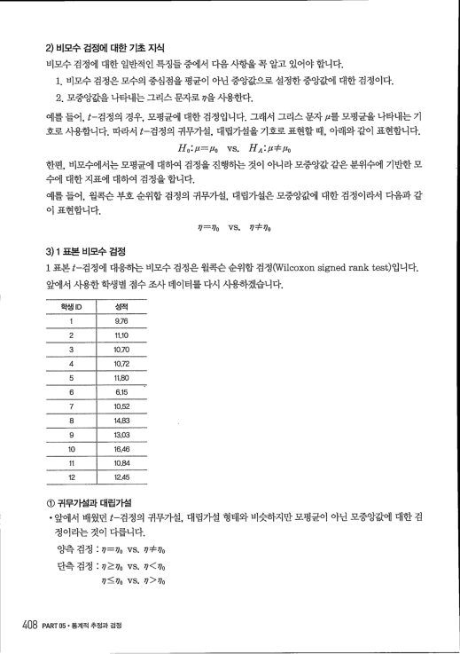
2) 비모수 검정에 대한 기초 지식 비모수 검정에 대한 일반적인 특징들 중에서 다음 사항을 꼭 알고 있어야 합니다． 1 . 비모수 검정은 모수의 중심점을 평균이 아닌 중앙값으로 설정한 중앙값에 대한 검정이다． 2 . 모중앙값을나타내는그리스문자로〃을사용한다． 예를들어 , 寸－검정의 경우 , 모평균에 대한 검정입니다 . 그래서 그리스문자 /I를 모평균을 나타내는 기 호로 사용합니다 . 따라서 r－검정의 귀무가설 , 대립가설을 기호로 표현할 때 , 아래와 같이 표현합니다． H。:it=p。 vs. HA:p#=p。

한편 , 비모수에서는 모평균에 대하여 검정을 진행하는 것이 아니라 모중앙값 같은 분위수에 기반한 모 수에 대한 지표에 대하여 검정을합니다 .

예를 들어 , 윌콕슨 부호 순위합 검정의 귀무가설 , 대립가설은 모중앙값에 대한 검정이라서 다음과 같 이 표현합니다． 7)=7/s VS.

7/*〃。

3)1 표본 비모수 검정 1 표본 t－검정에 대응하는 비모수 검정은 윌콕슨 순위합 검정（wilcoxon signed rank test）입니다． 앞에서 사용한 학생별 점수 조사 데이터를 다시 사용하겠습니다． 학생 D 성적 1 9J6 2 11.10 ;3 10.70 4 10.72 5 11.80 6 6.15 7 10.52 8 14.83 9 13.03 10 16.46 11 10.84 12 12.45 ① 귀무가설과 대립가설

- 앞에서 배웠던 t－검정의 귀무가설 , 대립가설 형태와 비슷하지만 모평균이 아닌 모중앙값에 대한 검
정이라는 것이 다릅니다． 양측검정 : '1= ?。 VS. 71*71。

단측검정 : ?스71。 VS. 71< 71o i 1。 VS. 7>7io 408 PART 05·통계적추정과검정

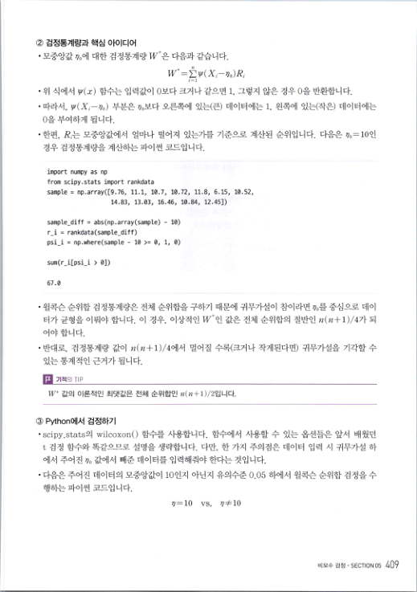
②） 검정통계량과 핵심 아이디어

- 모중앙값 〃0에 대한 검정통계량 w ' 은 다음과 같습니다．
## W '=尤 W(X1-'7。)Ri
- 위 식에서 y(r) 함수는 입력값이 0보다 크거나 같으면 1 , 그렇지 않은 경우 0을 반환합니다．
- 따라서 , v(x1－〃o) 부분은 〃0보다 오른쪽에 있는（큰） 데이터에는 1 , 왼쪽에 있는（작은） 데이터에는
0을 부여하게 됩니다．

- 한편 , 지는 모중앙값에서 얼마나 떨어져 있는가를 기준으로 계산된 순위입니다 . 다음은 7i=10인
경우 검정통계량을 계산하는 파이썬 코드입니다．

```python
import numpy as op
from scipy.stats import rankdata
```
samp'e = np.array([9.76, 11.1, 10.7, 10.72, 11.8, 6.15, 10.52, 14.83, 13.03, 16.46, 10.84, 12.45])

```python
samp1e_diff = abs(np.array(sample) - 10) 
r_i = rankdata(sample_diff) 
psi_i = np.where(sample - 10 >= 0, 1, 0)
```
sum(r_i[ psi_i > 0]) 67.0

- 윌콕슨 순위합 검정통계량은 전쳬 순위합을 구하기 때문에 귀무가설이 참이라면 〃0를 중심으로 데이
터가 균형을 이뤄야 합니다 . 이 경우 , 이상적인 "/ ' 인 값은 전체 순위합의 절반인 'z(n + 1) /4가 되 어야 합니다．

- 반대로 , 검정통계량 값이 fl ( n + 1)/4에서 멀어질 수록（크거나 작게된다면） 귀무가설을 기각할 수
있는 통계적인 근거가 됩니다． ．헴 기적의 ㄲp w+ 값의 이론적인 최댓값은 전체 순위합인 n(n+1)/2입니다 .

③ P艸)Ofl에서 검정하기

- scipy. stats의 wiicoxon() 함수를 사용함니다 . 함수에서 사용할 수 있는 옵션들은 앞서 배웠던 
t 검정 함수와 똑같으므로 설명을 생략합니다 . 다만 , 한 가지 주의점은 데이터 입력 시 귀무가설 하 에서 주어진 〃0 값에서 빼준 데이터를 입력해줘야 한다는 것입니다．

- 다음은 주어진 뎨이터의 모중앙값이 10언지 아닌지 유의수준 0.05 하에서 윌콕슨 순위합 검정을 수
행하는 파이썬 코드입니다． 71=10 vs. 71*10 비모수검정· SECTION 05 409

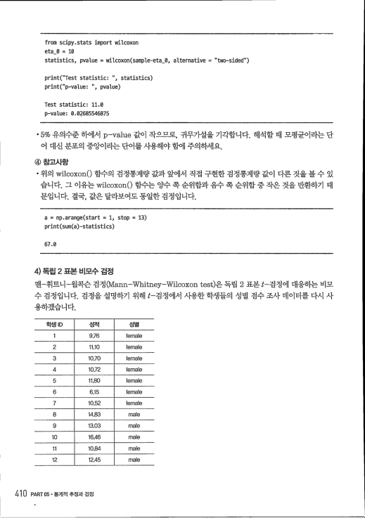
```python
from scipy.stats import wilcoxori 
eta 0 = 10 
statistics, pval.ue = wilcoxon(sample-eta_0, alternative = "two-sided")
print("Test statistic: ', statistics) 
print("p-val.ue: ", pvalue)
```
Test statistic: 11.0 p-value: 0.02685546875 .5% 유의수준 하에서 p-value 값이 작으므로 , 귀무가설을 기각합니다 . 해석할 때 모평균이라는 단 어 대신 분포의 중앙이라는 단어를 사용해야 함에 주의하세요． ④ 참고차항

- 위의 wilcoxon() 함수의 검정통계량 값과 앞에서 직접 구현한 검정통계량 값이 다른 것을 볼 수 있 
습니다 . 그 이유는 wilcoxon() 함수는 양수 쪽 순위합과 음수 쪽 순위합 중 작은 것을 반환하기 때 문입니다 . 결국 , 값은달라보여도동일한검정입니다．

```python
a · np.arange(start = 1, stop = 13) 
print(sum(a)-statistics)
```
67.0 4) 독립 2 표본 비모수 검정 맨－휘트니－윌콕슨 검정（Mann-Whitney-Wilcoxon test）은 독립 2 표본 t－검정에 대응하는 비모 수 검정입니다 . 검정을 설명하기 위해 t－검정에서 사용한 학생들의 성별 점수 조사 데이터를 다시 사 용하겠습니다． ㅎ 쬐D 성적 성별 1 9.76 female 2 11.10 fem히e 3 10.70 female 4 10.72 female 5 11.80 fem쉐e 6 6.15 fem테e 7 10.52 fem레e 8 14.83 m히e 9 13.03 male 10 16.46 m테e 11 10.84 male 12 12.45 male 시0 PARTOS．통계적추정과검정

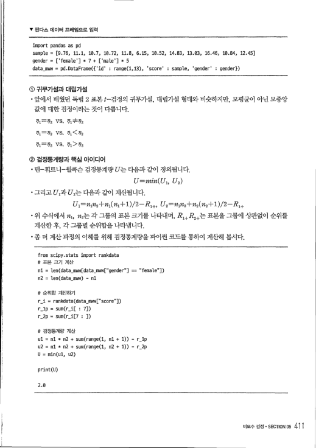
▼ 판다스 데이터 프레임으로 입력

```python
import pandas as pd
sample = [9.76, 11.1, 10.7, 10.72, 11.8, 6.15, 10.52, 14.83, 13.03, 16.46, 10.84, 12.45]
gender = ['female'] * 7 + ['male'] * 5
data_mww = pd.DataFrame({'id' : range(1,13), 'score' : sample, 'gender' : gender})
```
① 귀무가설과 대립가설

- 앞에서 배웠던 독립 2 표본 t－검정의 귀무가설 , 대립가설 형태와 비슷하지만 , 모평균이 아닌 모중앙
값에 대한 검정이라는 것이 다릅니다． ii- 22 VS. 〃 i* 〃2 ?1- /2 VS. 7)1<〃2 )1= )2 VS. 〃 1>h12 ② 검정통계량과 핵심 아이디어

```python
· 맨－휘트니－윌콕슨 검정통계량 〔／는 다음과 같이 정의됩니다． 
U=min(U1, 아）
· 그리고 【J'과【'2는 다음과 같이 계산됩니다． 
Ui=n1n2+ni(nj+1)/2-Ri+, U2=n1n2+n2(n2+1)/2- R1+
```
' 위 수식에서 nl, 銓 2는 각 그룹의 표본 크기를 나타내며， 꾜1+l?2＋는 표본을 그룹에 상관없이 순위를 계산한후 , 각그룹별 순위합을 나타냅니다．

- 좀 더 계산 과정의 이해를 위해 검정통계량을 파이썬 코드를 통하여 계산해 봅시다．
```python
from scipy.stats import rankdata 
# 표본 크기 계산 
ni = len(data_mww[data_mww["gender"] == "female"])
n2 = len(data_mww) - ni
# 순위합 계산하기 
r_i = rankdata(data_mww["score"]) 
r_lp = sum(r_i[ : 7]) 
r_2p = sum(r_i[ 7 : 〕）
# 검정통계량 계산 
Ui = ni * n2 + sum(range(i, ni +
```
1)) - r_lp 1)) - r_2p

```python
u2 = ni * n2 + sum(range(1, n2 +
U = min(ul, u2)
print(U)
```
2.0 비모수검정＊SECTION 05 시1

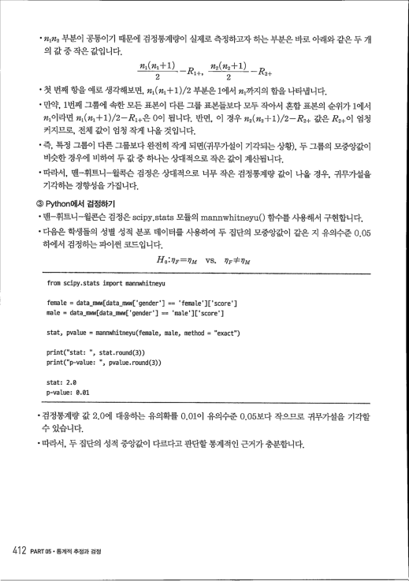
fin2 부분이 공통이기 때문에 검정통계량이 실제로 측정하고자 하는 부분은 바로 아래와 같은 두 개 의 값 중 작은 값입니다． 1+ 1 2+ 1 n 1 D , , .' n 2 , 2 -, , .' 2 ,, ' 첫 번째 항을 예로 생각해보먼 , n1(n汁1)/2 부분은 1에서 ni까지의 합을 나타냅니다． '만약 , 1번째 그룹에 속한 모든 표본이 다른 그룹 표본들보다 모두 작아서 혼합 표본의 순위가 1에서 ni이라면 n1(n1+1)/2- R1＋은 0이 됩니다 . 반면 , 이 경우 n2(n2+1)/2- R2+ 값은 ／근2＋이 엄청 커지므로 , 전쳬 값이 엄청 작게 나올 것입니다． '즉， 특정 그룹이 다른 그룹보다 완전히 작게 되면（귀무가설이 기각되는 상황） , 두 그룹의 모중앙값이 비슷한 경우에 비하여 두 값 중 하나는 상대적으로 작은 값이 계산됩니다． '따라서， 맨－휘트니－윌콕슨 검정은 상대적으로 너무 작은 검정통계량 값이 나올 경우 , 귀무가설을 기각하는 경향성을 가집니다． ③Python에서 검정하기 ' 맨－휘트니 윌콘슨 검정은 scipy.stats 모듈의 mannwhitneyu() 함수를 사용해서 구현합니다． ' 다음은 학생들의 성별 성적 분포 데이터를 사용하여 두 집단의 모중앙값이 같은 지 유의수준 0.05 하에서 검정하는 파이썬 코드입니다． ／키：碌＝)M VS.

7)F쑤71M

```python
from scipy.stats import mannwhitneyu
female = datajnww[data_mww[ 'gender'] == 'female '] {'score '] 
male = datajaww[data_mww{ 'gender '] == 'male'] [ 'score 'J
```
stat, pvalue = mannwhitneyu(female, male, method = "exact ')

```python
print('stat: ", stat.round(3)) 
print("p-val.ue: ", pvalue. round(3))
```
stat: 2.0 p-value: 0.01 ' 검정통계량 값 2.0에 대응하는 유의확률 0.01이 유의수준 0.05보다 작으므로 귀무가설을 기각할 수 있습니다．

- 따라서 , 두 집단의 성적 중앙값이 다르다고 판단할 통계적인 근거가 충분합니다．
412 PART05．통계적추정과검정

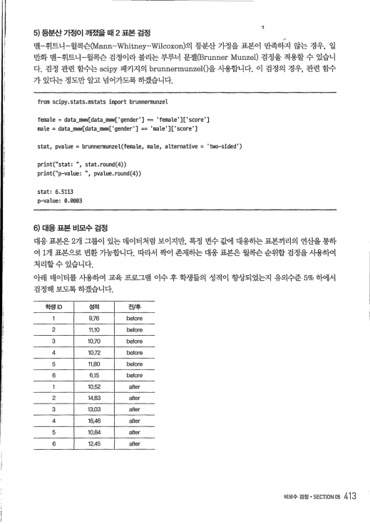
5) 등분산 가정이 깨졌을 때 2 표본 검정 맨－휘트니－윌콕슨（Mann-Whitney--Wilcoxon）의 등분산 가정을 표본이 만족하지 않는 경우 , 일 반화 맨－휘트니－윌콕슨 검정이라 불리는 부루너 문곌（Brunner Munzel) 검정을 적용할 수 있습니 다 . 검정 관런 함수는 scipy 패키지의 brunnermunzel(）을 사용합니다 . 이 검정의 경우 , 관련 함수 가 있다는 정도만 알고 넘어가도록 하겠습니다．

```python
from scipy. stats. mstats import brunnermunzel
female = data_niww[data_mww[ 'gender'] == ' fema1.e 'Jrscore'] 
male = data_mww[data_mww[ 'gender ' 〕 == ' male '1[ 'score 'J
```
stat, pvalue = brunnermunzel(femal.e, male, alternative = ' two-sided ')

```python
print("stat: ", stat.round(4)) 
print(p-value: " , pvalue.round(4))
```
stat: 6.5113 p-value: 0.0003 6) 대응 표본 비모수 검정 대응 표본은 2개 그룹이 있는 데이터처럼 보이지만 , 특정 변수 값에 대응하는 표본끼리의 연산을 통하 여 1개 표본으로 변환 가능합니다 . 따라서 짝이 존재하는 대응 표본은 윌콕슨 순위합 검정을 사용하여 처리할 수 있습니다． 아래 데이터를 사용하여 교육 프로그램 이수 후 학생들의 성적이 향상되었는지 유의수준 5% 하에서 검정해 보도록 하겠습니다． 학생 [0 성적 전／후 1 9.76 before 2 11.10 before 3 10.70 before 4 10.72 before 5 11.80 before 6 6.15 before 1 10.52 after 2 14.83 after 3 13.03 after 4 16.46 after 5 10.84 after 6 12.45 of헌er 비모수검정．SECTION 05 시3

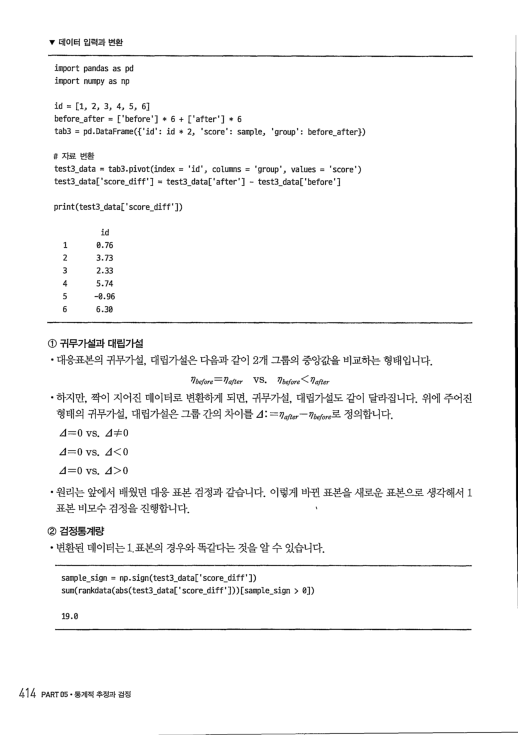
▼ 데이터 입력과 변환

```python
import pandas as pd 
import numpy as np
Id . [1, 2, 3, 4, 5, 6] 
before_after = ['before'] * 6 + ['after'] * 6 
tab3 = pd.DataFrame({'id': Id * 2, 'score': sample, 'group' : before_after})
# 자료 변환 
test3_data = tab3.pivot(index = 'Id', columns = 'group', values = 'score') 
test3_data{ 'score_diff '] = test3_data['after'] - test3_data[ 'before']
print(test3_data[ 'score_diff '])
```
id 1 0.76 2 3.73 3 2.33 4 5.74 5 -0.96 6 6.30 ① 귀무가설과 대립가설

- 대응표본의 귀무가설 , 대립가설은 다음과 같이 2개 그룹의 중앙값을 비교하는 형태입니다．
?lbef。re__驪ter VS.

?lbef。re< 7)after

- 하지만 , 짝이 지어진 데이터로 변환하게 되면 , 귀무가설 , 대립가설도 같이 달라집니다 . 위에 주어진
형태의 귀무가설 , 대립가설은그룹간의 차이를 」： =7)／瀚：- ?lbef。r.로 정의합니다． 4=0 vs. 440 4=0vs. 4<0 4==0vs. 4>0

- 원리는 앞에서 배웠던 대응 표본 검정과 같습니다 . 이렇게 바뀐 표본을 새로운 표본으로 생각해서 1 
표본 비모수 검정을 진행합니다． ② 검정통계량

- 변환된 데이터는 1 . 표본의 경우와 똑같다는 것을 알 수 있습니다．
```python
sample_sign = np.sign(test3_data[ 'score_diff'] )
```
sum(rankdata(abs(test3_data[ 'score_diff '] ))[sample_sign > 0]) 19.0 414 PART05．통계적추정과검정

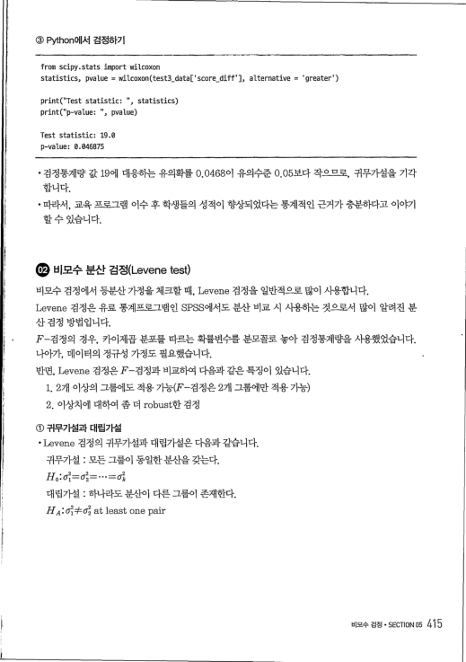
③Python에서 검정하기

```python
from scipy.stats import wilcoxon 
statistics, pvalue = wilcoxon(test3_data{ 'score_diff '1, alternative = ' greater ')
print("Test statistic: ", statistics) 
print('p-value: " , pval.ue)
```
Test statistic: 19.0 p-value: 0.046875

- 검정통계량 값 19에 대응하는 유의확률 0.0468이 유의수준 0.05보다 작으므로 , 귀무가설을 기각
합니다．

- 따라서 , 교육 프로그램 이수 후 학생들의 성적이 향상되었다는 통계적인 근거가 충분하다고 이야기 
할 수 있습니다． .

비모수 분산 검정（Levene test) 비모수 검정에서 등분산 가정을 쳬크할 때 , Levene 검정을 일반적으로 많이 사용합니다． Levene 검정은 유료 통계프로그램인 sPss에서도 분산 비교 시 사용하는 것으로서 많이 알려진 분 산 검정 방법입니다． F－검정의 경우 , 카이제곱 분포를 따르는 확률변수를 분모꼴로 놓아 검정통계량을 사용했었습니다． 나아가 , 데이터의 정규성 가정도 필요했습니다． 반면 , Levene 검정은 ／구－검정과 비교하여 다음과 같은 특징이 있습니다．

1. 2개 이상의 그룹에도 적용 가능（F－검정은 2개 그룹에만 적용 가능）
2 . 이상치에 대하여 좀 더 robust한 검정 ① 귀무가설과 대립가설

- Levene 검정의 귀무가설과 대립가설은 다음과 같습니다．
귀무가설 : 모든 그룹이 동일한 분산을 갖는다． 〃o：매＝'T囊＝…＝峠 대립가설 : 하나라도 분산이 다른 그룹이 존재한다． HA: c: * c; at least one pair 비모수검정．SECTION 05 415

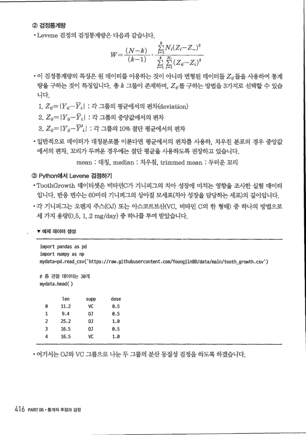
② 검정통계량

- Levene 검정의 검정통계량은 다음과 같습니다．
W= Ii- .- -i\ k N1

```python
z=1 j=
```
'이 검정통계량의 특징은 원 데이터를 이용하는 것이 아니라 변형된 데이터들 zi)들을 사용하여 통계 량을 구하는 것이 특징입니다 . 총 k 그룹이 존재하며 ,zij를 구하는 방법을 3가지로 선택할 수 있습 니다．

1. 자ㅢ】따－yㅢ : 각그룹의 평균에서의 편차（deviation)
2. Z5=IY〃-Y시 : 각그룹의 중앙값에서의 편차
3. 자늬y(/-y '시 : 각그룹의 10% 절단 평균에서의 편차
- 일반적으로 데이터가 대칭분포를 이룬다면 평균에서의 펀차를 사용하 , 치우친 분포의 경우 중앙값
에서의 편차 , 꼬리가 두꺼운 경우에는 절단 평균을 사용하도록 권장하고 있습니다． mean : 대칭 , median : 치우침 , trimmed mean : 두터운 꼬리 ③ Python에서 Levene 검정하기

- ToothGrowth 데이터셋은 비타민C가 기나피그의 치아 성장에 미치는 영향을 조사한 실험 데이터
입니다 . 반응 변수는 60마리 기니피그의 상아질 모세포（치아 성장을 담당하는 세포）의 길이입니다．

- 각 기니피그는 오렌지 주스（oJ) 또는 아ㅅ구ㄹ ㅂ산（vC , 비타민 C의 한 형태） 중 하나의 방법으로
세 가지 용량（0.5, 1, .2 mg/day) 중 하나를 투여 받았습니다． ▼ 예제 데이터 생성

```python
import pandas as pd 
import numpy as np 
mydata=pd.read_csv('https://raw.githubusercontent.com/YoungjinBD/data/main/tooth_growth.csv')
# 총 관찰 데이터는 30개 
mydata.head()
```
len supp dose 0 11.2 VC 0.5 1 9.4 03 0.5 2 25.2 03 1.0 3 16.5 03 0.5 4 16.5 VC 1.0

- 여기서는 oJ와vC 그룹으로 나눈 두 그룹의 분산 동질성 검정을 하도록 하겠습니다．
4l6 PART 05．통계적추정과검정

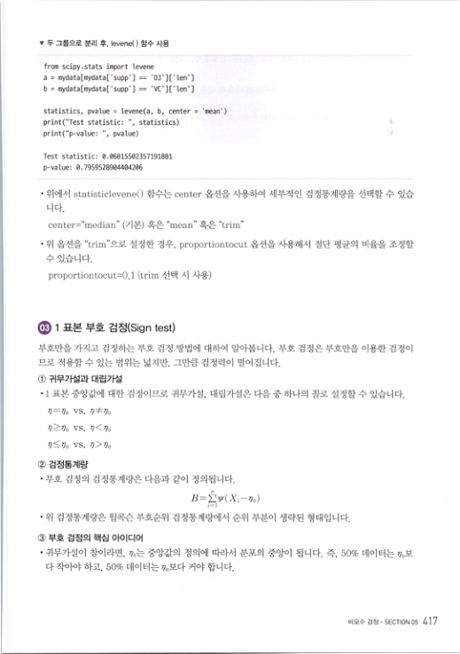
▼ 두 그룹으로 분리 후 , 陪vene( ) 함수 사용

```python
from scipy.stats import t evene
a = mydata[mydata[ 'supp' ] == ' OJ' ]['len' ]
b = mydata[mydata[ 'supp' ] == 'VC' ]['len' ]
statistics, pval.ue = levene(a, b, center = ' mean) 
print("Test statistic: " , statistics) 
print("p-value: ', pvalue)
```
Test statistic: 0.06815502357191881 p-value: 0.7959528904404206

- 위에서 statisticlevene() 함수는 center 옵션을 사용하여 세부적인 검정통계량을 선택할 수 있습
니다．

```python
center="median" （기본） 혹은 " mean " 혹은 " trim"
```
- 위 옵션을 " trim " 으로 설정한 경우 , proportiontocut 옵션을 사용해서 절단 평균의 비율을 조정할 
수 있습니다．

```python
proportiontocut=O. 1 (trim 선택 시 사용）
```
.1 표본 부호 검정（Sign test) 부호만을 가지고 검정하는 부호 검정 방법에 대하여 알아봅니다 . 부호 검정은 부호만을 이용한 검정이 므로 적용할 수 있는 범위는 넓지만 , 그만큼 검정력이 떨어집니다． ① 귀무가설과 대립가설

- 1 표본 중앙값에 대한 검정이므로 귀무가설 , 대립가설은 다음 중 하나의 꼴로 설정할 수 있습니다．
71=71。 VS. 〃￥＝ 7) ?上7)o VS. 7)<7) 71二7)。 VS. 71> 7) ② 검정통계량

- 부호 검정의 검정통계량은 다음과 같이 정의됩니다．
```python
B=ZW(X1-71。) 
i= 1 
· 위 검정통계량은 윌콕슨 부호순위 검정통계량에서 순위 부분이 생략된 형태입니다．
```
③ 부호 검정의 핵심 아이디어

- 귀무가설이 참이라면 , 〃o는 중앙값의 정의에 따라서 분포의 중앙이 됩니다 . 즉 , 50% 데이터는 〃0보 
다 작아야 하고 , 50% 데이터는 〃0보다 커야 합니다． 비모수검정· SECTION 05 417

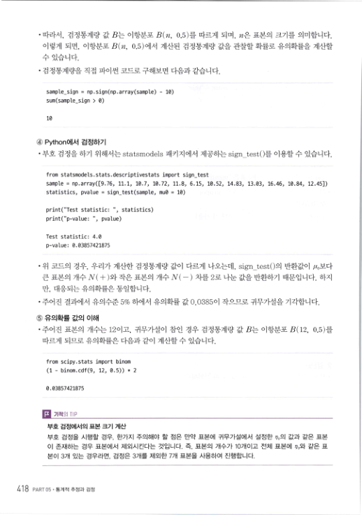
- 따라서 , 검정통계량 값 β는 이항분포 β(n, 0.5）를 따르게 되며 , 忽은 표본의 크기를 의미합니다．
이렇게 되면 , 이항분포 β(n, 0.5）에서 계산된 검정통계량 값을 관찰할 확률로 유의확률을 계산할 수 있습니다．

- 검정통계량을 직접 파이썬 코드로 구해보면 다음과 같습니다．
```python
sample_sign = np.sign(np.array(sample) - 10)
```
sum(sample_sign > 0) 10 ④Python에서 검정하기

- 부호 검정을 하기 위해서는 statsmodels 패키지에서 제공하는 sign_test(）를 이용할 수 있습니다．
```python
from statsrnodels . stats. descriptivestats import sign_test
sample = np.array([9.76, 11.1, 10.7, 10.72, 11.8, 6.15, 10.52, 14.83, 13.03, 16.46, 10.84, 12.45]) 
statistics, pvalue = sign_test(sample, mu0 = 10)
print('Test statistic: ", statistics) 
print("p-value: ', pvalue)
```
Test statistic: 4.0 p-value: 0.03857421875

- 위 코드의 경우 , 우리가 계산한 검정통계량 값이 다르게 나오는데 , sign_test(）의 반환값이 〃0보다 
큰 표본의 개수 N (+ ）와 작은 표본의 개수 N ( ) 차를 2로 나눈 값을 반환하기 때문입니다 . 하지 만 , 대응되는유의확률은동일합니다．

- 주어진 결과에서 유의수준 5% 하에서 유의확률 값 0.0385이 작으므로 귀무가설을 기각합니다．
（⑤ 유의확률 값의 이해

- 주어진 표본의 개수는 12이고 , 귀무가설이 참인 경우 검정통계량 값 B는 이항분포 B(12, 0.5）를
따르게 되므로 유의확률은 다음과 같이 계산할 수 있습니다．

```python
from scipy.stats import binom 
(1 - binom.cdf(9, 12, 0.5)) * 2
```
0.03857421875 기적의 ㄲ P 부호 검정에서의 표본 크기 계산 부호 검정을 시행할 경우 , 한가지 주의해야 할 점은 만약 표본에 귀무가설에서 설정한 騙의 값과 같은 표본 이 존재하는 경우 표본에서 제외시킨다는 것입니다 . 즉 . 표본의 개수가 10개이고 전체 표본에 〃o와 같은 표 본이 3개 있는 경우라면 , 검정은 3개를 제외한 7개 표본을 사용하여 진행합니다． 시8 PART 05．통계적추정과검정
