# PART
# 선형 모형
파트 소개 이 파트에서는 Python을 활용한 통계모형을 다룹니다 . 선형 회귀 분석（Linear Regression）과 로지스틱 회귀 분석（Logistic Regression）을 통해 연속형 및 범주형 데이터를 모델링하는 방법을 학습합니다． ◇ 주요 내屠

- 선형 회귀 분석 : 회귀모델 적합 , 계수 해석 , 다중공선성 문제（VIF) , 모델 평가（R2,
F－검정）

- 邸 스틱 회귀 분석 : 오즈비（Odds Ratio), 계수 해석 , 모델 유의성 검정(Deviance
검정）

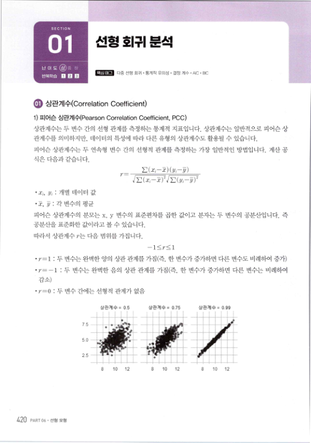
# SECT l ON 
01

# 선형 회귀 분석
난 0 도 텡I 아 핵심 태그 다중 선형 회귀 · 통계적 유의성 · 결정 계수 · /JC · BIC 반복학습 · .

" .f 상관계수（Correlation Coefficient) 1) 피어슨 상관계수《Pearson Correlation Coefficient, PCC) 상관계수는 두 변수 간의 선형 관계를 측정하는 통계적 지표입니다 . 상관계수는 일반적으로 피어슨 상 관계수를 의미하지만 , 데이터의 특정에 따라 다른 유형의 상관계수도 활용될 수 있습니다．

### 피어슨 상관계수는 두 연속형 변수 간의 선형적 관계를 측정하는 가장 일반적인 방법입니다 . 계산 공 
식은 다음과 같습니다． γ＝  Z(x, -궁）（跳－D ' 柱＝（驪／--)2 (xe- x) 7E (yt-j7)2

- xi, 跳 : 개별 데이터 값 
- x, y : 각 변수의 평균
피어슨 상관계수의 분모는 x, y 변수의 표준편차를 곱한 값이고 분자는 두 변수의 공분산입니다 . 즉 공분산을 표준화한 값이라고 볼 수 있습니다． 따라서 상관계수 ／는 다음 범위를 가집니다． -1< v< 1

- r= 1 : 두 변수는 완벽한 양의 상관 관계를 가짐（즉 , 한 변수가 증가하면 다른 변수도 비례하여 증가） 
- r= -1 : 두 변수는 완벽한 음의 상관 관계를 가짐（즉 , 한 변수가 증가하면 다른 변수는 비례하여
감소）

- r= 0 : 두 변수 간에는 선형적 관계가 없음
## 상관계수 = . . 5 
상관계수＝ 0.75 상관계수＝ . . 9승 ■iRtU iur수씻：잿겨 떼＇ ' ,` 零r:

, ？위널 L수슥‘．■ ·ii.

iu

### "Ru, 
mu" :* iF' ，1」 .1 ' ㄴdi r，차＊ilI ■．■■■■ 7万

## ■
■ ＇ r 겸 ■ ■ ■ ■ ■ ■ r ·

## ＇
심 ∥ ∥ ∥ ∥ 5.0 2.5 8

1. 
12 8 10 12 8 10 12 420 PART 06· 선형모형 0

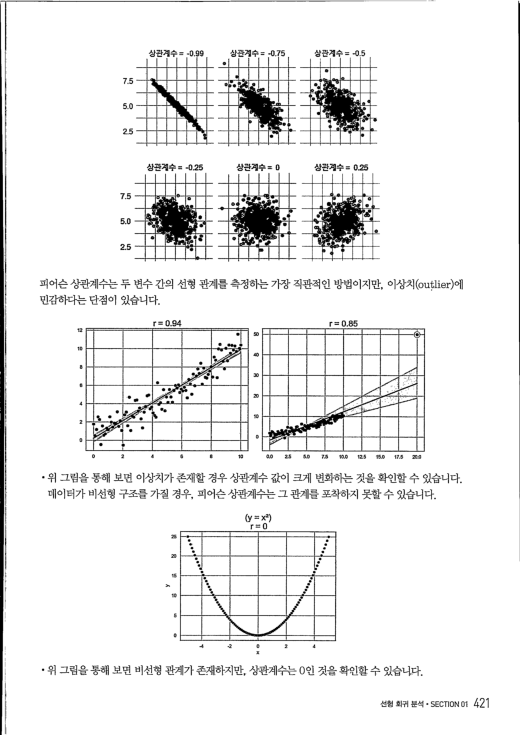
상관계수 : 0 상관夕1수 = 0.25 상관계수 = -025 5.0 2.5 피어슨상관계수는 두 빈숴 간의 선형 관계를측정하는 가장 직관적인 방법이지만 , 이상치（outlier）에 민감하다는 단점이 있습니다．

```python
r = 0.94
r=0.85
```
,2 S

# S 
. 9/ S 솥·.· ?

10 “ 8

### S 
- 》苕
## S。 
- ㅆ콘' r 。
· 6

## · 
솥→ .5 辦鍵？ c'· 脯 SS 4 2 S .

0 1 퇀 2 4 8 1.

弘《》 z5 5.r》 7,5 1...

1z5 15．《） 17.5 鍈》．《｀

- 위 그림을 통해 보면 이상치가 존재할 경우 상관계수 값이 크게 변화하는 것을 확인할 수 있습니다．
데이터가 비선형 구조를 가질 경우 , 피어슨 상관계수는 그 관계를 포착하지 못할 수 있습니다．

```python
(y = x2) 
r= 0 
X
```
# //
- 
- 
- 
*

# * 
X`

- 
.

.

- - · 
' / .4 -2 4

- 위 그림을 통해 보면 비선형 관계가 존재하지만， 상관계수는 0인 것을 확인할 수 있습니다．
선형 회귀 분석 · SECTION 01 421

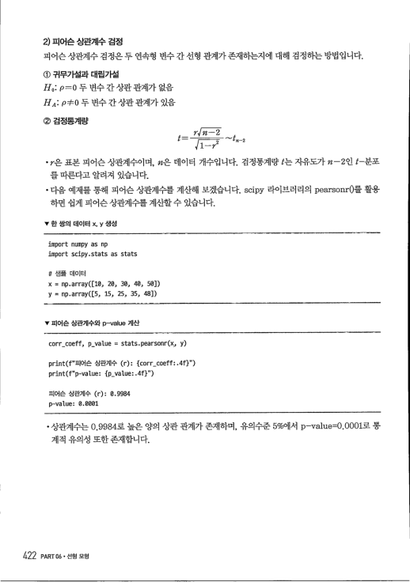
2) 피어슨 상관계수 검정 피어슨 상관계수 검정은 두 연속형 변수 간 선형 관계가 존재하는지에 대해 검정하는 방법입니다． ① 귀무가설과 대립가설 H。: p=O 두 변수 간 상관관계가 없음 HA: p* O 두 변수 간 상관관계가 있음 ② 검정통계량 , ‘, ./ 1- r '

- γ은 표본 피어슨 상관계수이며 , 雜은 데이터 개수입니다 . 검정통계량 t는 자유도가 n- 2인 t－분포
를 따른다고 알려져 있습니다．

- 다음 예제를 통해 피어슨 상관계수를 계산해 보겠습니다 . scipy 라이브러리의 pearsonrO를 활용
하면 쉽게 피어슨 상관계수를 계산할 수 있습니다． ▼ 한 쌍의 데이터 )cy 생성

```python
import riumpy as np 
import scipy.stats as stats
# 샘플 데이터
x = np.array([10, 20, 30, 40, 50J)
y = np.array([5, 15, 25, 35, 481)
```
▼ 피어슨 상관계수와 p-value 계산 corr_coeff, p_value = stats.pearsonr(x, y)

```python
print(f " 피어슨 상관계수 (r): {corr_coeff: .4f}") 
print(f"p-value: {p_value: .4f} ")
```
피어슨 상관계수 (r): 0.9984 p-value: 0.0001

- 상관계수는 0.9984로 높은 양의 상관 관계가 존재하며 , 유의수준 5％에서 p-value=O.0001로 통
계적 유의성 또한존재합니다． 422 PART 06＇선형모형

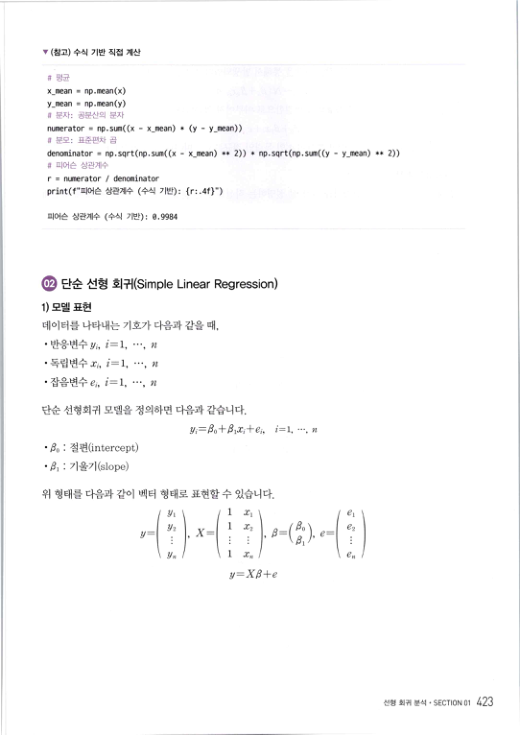
▼ （참고） 수식 기반 직접 계산

```python
# 펑균
x_mean = np.mean(x)
y_rnean = np.mean(y) 
# 분자： 공분산의 분자
numerator = np.sum((x - x_mean) * (y - y_mean)) 
# 분모： 표준편차 곱
denominator = np.sqrt(np.sum((x - x_niean) ** 2))
```
* np.sqrt(np. sum((y - y_mean)
```python
# 피어슨 상관계수 
r = numerator I denominator 
print(f " 피어슨 상관계수 （수식 기반）: {r:.4f} ')
```
피어슨 상관계수 （수식 기반）: 0.9984 .

단순 선형 회귀（Simple Linear Regression) 1) 모델 표현 데이터를 나탁내는 기호가 다음과 같을 때．

- 반응변수y, i= 1, … , 1z
- 독립변수x1, i= 1, … , n
- 잡음변수ef, i= 1, … , n
단순 선형회귀 모델을 정의하면 다음과 같습니다． 跳＝β什$1x汁e￡，

```python
i= 1,
```
- βo : 절편（intercept)
- 19 : 기울기（slope)
# [
위 형태를 다음과 같이 벡터 형태로 표현할 수 있습니다．

# Yi \ 
i i X1 \ 더 ! X2 ), i9=( ), \ 1 x' I 軌 측

- 츨
아 , I - 召 , n ,

```python
y=Xi9+e
```
선형 회귀 분석 . SECTION이 423

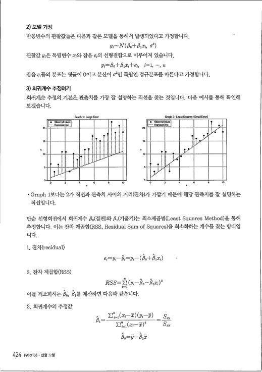
2) 모델 가정 반응변수의 관찰값들은 다음과 같은 모델을 통해서 발생되었다고 가정합니다． y1- --N ( i90 +thx, 군） 관찰값 〃「은 독립변수 xi와 잡음 e셰 선형결합으로 이루어져 있습니다．

```python
y=j9。+fl1x1+e1, i=1, … , n
```
잡음 햐들의 분포는 평균이 0이고 분산이 군인 독．립인 拓子분포를 따른다고 가정합니다． 3) 회귀계수 추정하기 화귀겨k즛 추정와 . 7煜：은괸층치를 가장 잘 설명하는 직선을 찾는 것입니다 . 다음 예시를 통해 확인해 보겠습니다． G'a샅a2: LeastSquar (Sn出 Euor) Gra삽｀1 = La』ㅁ· 탸r《〕r

## S Ob· v 
oUc --.

R』딥7볍驪h `＊껍 - S.**., ● 《x．·，ㅂva놀緇 -- ' R`.기｀蠟차답볍 ",, ' S` , 〃 S*7 군 솥 I~ ,_s_ i 以 汕 I * S S**= r S··： ` ' 솔 S~ 1드 15 , , I S … …∼ ．균》군 ' 1。

'1。

' S/ . . . 걋 '".

．큔＇- 뺨 ' ', ' ' J S

* 
' J ' , 괍 T ?

S , 걀 ' 5 5 구

## ..L,,"" 
〃‘ '- " 5 , a 0 0 4 6 x 8 10 2 4 x 10

- Graph 1보다는 2가 직선과 관측치 사이의 거리（잔차）가 가깝기 때문에 해당 관측치를 잘 설명하는
직선입니다． 단순 선형회귀에서 회귀계수 氏（절편）와 β1（기울기）는 최소제곱법（Least Squares Method）을 통해 추정합니다 . 이는잔차 제곱함（RSS, Residual Sum of Squares）을 최소화하는 계수를찾는 방식입 니다． 1 . 잔차（residual)

```python
e1=y- .=y1- ( 。+台1x1)
```
2 . 잔차제곱합（RSS)

```python
RSS=>J (y1_力。_靑1 驪／)2
```
이를최소화하는β0, 川를계산하면다음과같습니다． 3 . 회귀계수의 추정값

# 靑1= " '：섶亡F;, (yi-')＝흡흐，
β0==y－β1无 424 PART飇＊선형모형

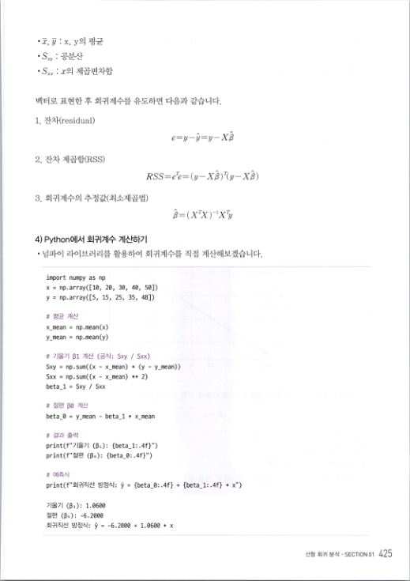
- J, ), : x, y의 평균
- 8뻐〃 : 공분산
- S(f : x의 제곱편차합
벡터로 표현한 후 회귀계수를 유도하면 다음과 같습니다． 1 . 잔차（residual)

```python
e=y 盤〃 x倉
```
2 . 잔차 제곱합（RSS)

```python
RSS=eTe=(y-Xi9)T(y-x써
```
3 . 회귀계수의 추정값（최소제곱법） '9 (x沈） 1xJ 4) Python에서 회귀계수 계산하기

- 넘파이 라이브러리를 활용하여 회귀계수를 직접 계산해보겠습니다．
```python
import numpy as np
x = np.array([10, 20, 30, 40, 50])
y = np.array([5, 15, 25, 35, 48])
# 평균 계산
x_mean = np.mean(x)
y_mean = np.mean(y)
# 기울기 β1 계산 （공식： Sxy / Sxx)
Sxy = np.sum((x - x_mean) * (y - y_mean))
Sxx = np.sum((x - x_mean) ** 2)
beta_i = Sxy I Sxx
# 절편 β0 계산
beta_0 = y_mean - beta_i * x_mean
# 결과 출력 
print(f " 기울기 （盼）: {beta_1: .4f}") 
print(f ' 절편 (I3e): {beta-O:.4f}")
# 예측식 
print(f "회귀직선 방정식： 오 = {beta_0:.4f} + {beta_i: .4f} * x")
```
기울기 帆) : 1.0600 절편 邙0): -6.2000 회귀직선 방정식： 夕 = -6.2000 + i. 0600 * x 선형 회귀 분석 * SECTION 01 425

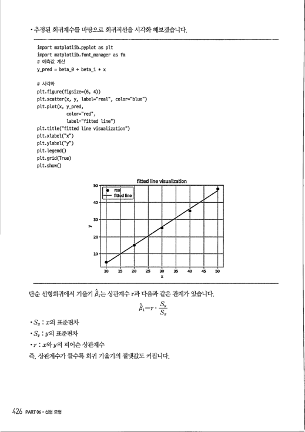
- 추정된 회귀계수를 바탕으로 회귀직선을 시각화 해보겠습니다．
```python
import matpiotiib.pypiot as pit 
import matpiotiib.font_manager as fm 
# 예측값 계산
y_pred = beta_O + beta_i * x
```
# 시각화 
pit. figure(figsize=(6, 4)) pit.scatter(x, y, 1.abel.="reai", coior= 'biue') pit.pl.ot(x, y_pred, color="red', iabei="fitted 1ine ") pit. titie("fitted ilne visuaiization") pit .xiabeiC'x") pit. yiabei("y ") pit. iegend() pit.grid(True) pit. showO fitted line visualization .

콘 병，..

- 
uueu uine

1. 
15

2. 
25 30 x 크5 40 45 盼 단순 선형회귀에서 기울기 川는 상관계수 r과 다음과 같은 관계가 있습니다． 九 一 Sy Pi- ?" ＝ㅋ－ 澈驪

- Sz : x의 표준편차
- S〃 : 〃의 표준편차
- r :x와〃의 피어슨상관계수
즉 , 상관계수가 클수록 회귀 기울기의 절댓값도 커집니다． 426 PART 06．선형모형

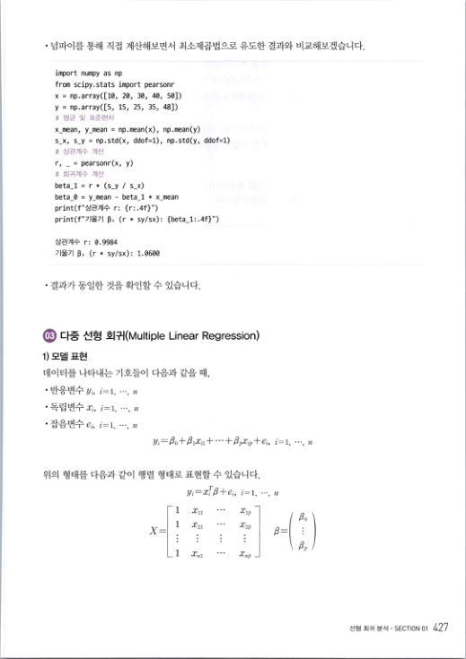
- 넘파이를 통해 직접 계산해보면서 최소제곱법으로 유도한 결과와 비교해보겠습니다．
```python
import numpy as np 
from scipy.stats import pearsonr
x = np.array([10, 20, 30, 40, 50])
y = np.array([5, 15, 25, 35, 48])
# 평균 및 표준편차
```
x_mean, y_mean = np.mean(x), np.mean(y) s_x, s_y = np.std(x, ddof=1), np.std(y, ddof=1)

```python
# 상관계수 계산 
r, - = pearsonr(x, y) 
# 회귀계수 계산
beta_i = r * (s_y / s_x) 
beta_0 = y_mean - beta_i * x_mean 
print(f " 상관계수 r: {r:.4f} ') 
print(f ' 기울기 I3i (r * sy/sx): {beta_i: .4f} ')
```
상관계수 r: 0.9984 기울기 βi (r * sy/sx): 1.0600

- 결과가 동일한 것을 확인할 수 있습니다．
.

ㄷ隱 선형 회귀（Multiple Linear Regression) 1》 모델 표현 데이터를 나타내는 기호들이 다음과 같을 때，

- 반응변수Yi, i=1, … , n
- 독립변수Xi, i=1, ··· , '2
- 잡음변수e, i=1, … , n
跳＝β0＋βlr::1+ ' " ＋β禪》＋하，i= 1, … , 'z

```python
위의 형태를 다음과 같이 행렬 형태로 표현할 수 있습니다． 
yi=rrj9+e1, i=1, … , n
```
1 Xip Xli 1

## x=
x2夕 그'21 1 x''1 了畛 - 선형 회귀 분석 . SECTION 01 427

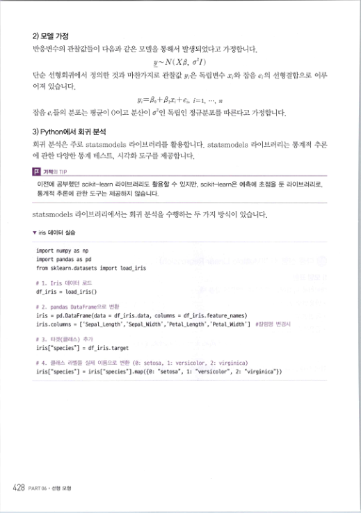
2) 모델 가정 반응변수의 관찰값들이 다음과 같은 모델을 통해서 발생되었다고 가정합니다． y- N (X$, c21) 단순 선형회귀에서 정의한 것과 마찬가지로 관찰값 yi은 독립변수 xi와 잡음 e·의 선형결합으로 이루 어져 있습니다．

```python
y=i9。+fl1x+e1, i=1, ··· , n
```
잡음 e,·들의 분포는 평균이 0이고 분산이 r인 독립인 棚구분포를 따른다고 가장합니다． 3) Python에서 회귀 분석 회귀 분석은 주로 statsmodels 라이브러리를 활용합니다 . statsmodels 라이브러리는 통계적 추론 에 관한 다양한 통계 테스트 , 시각화 도구를 제공합니다． ．헴 기적의 ㄲP 이전에 공부했던 scikit-learn 라이브러리도 활용할 수 있지만 , scikit-learn은 예측에 초점을 둔 라이브러리로， 통계적 추론에 관한 도구는 제공하지 않습니다． statsmodels 라이브러리에서는 회귀 분석을 수행하는 두 가지 방식이 있습니다． V iris 데이터 실습

```python
import numpy as np 
import pandas as pd 
from sklearn.datasets import load_iris
# 1. Ini$ 데이터 로드
df_iris = load_iris ()
if 2. pandas DataFrame으로 변환 
iris = pd.DataFrame(data = df_iris. data, colwmns = df_iris. feature_names) 
iris.columns = [ 'Sepal._Length', 'Sepal_Width', 'Petal Length', 'Petal_Width'] ＃칼럼명 변경AI
# 3. 타겟（클래스） 추가 
iris[ "species"] = df_iris. target
#4. 클래스 라벨을 실제 이름으로 변환 (0: setosa, 1: versicolor, 2: virginica) 
inis["species"] = iris[ "species"] .map({0: "setosa", 1: "versicolor", 2: "virginica"})
```
428 PART 06．선형모형

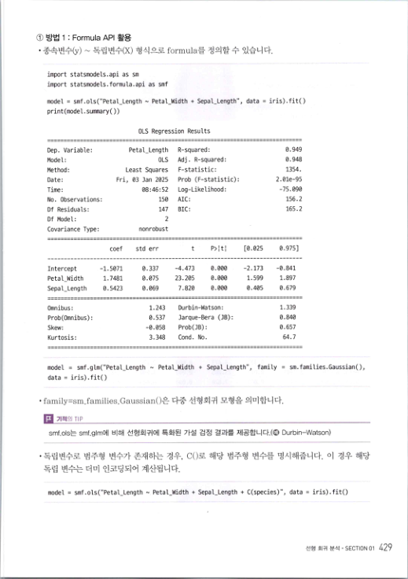
① 방법 1 : Form미a API 활용

- 종속변수（y) ∼ 독립변수（x) 형식으로 formula를 정의할 수 있습니다．
```python
import statsmodels.api as sm 
import statsmodels.formula.api as smf
model = smf.ols( "Petal_Length ` Petal_Width + Sepal_Length", data = iris).fit () 
print(model.summaryO)
```
OLS Regression Results Dep. Variable:

Petal_Length R-squared:

0.949 Model:

OLS Adj. R-squared:

0.948 Method:

Least Squares F-statistic:

1354.

Date:

Fri, 03 Jan 2025 Prob (F-statistic):

2.01e-95 Time:

08:46:52 Log-Likelihood:

-75.090 No. Observations:

150 AIC:

156.2 Df Residuals:

147 BIC:

165.2 Df Model:

2 Covariance Type:

nonrobust coef std err t P>ltl [0.025 0.975] Intercept -1.5071 0.337 -4.473 0.000 -2.173 -0.841 Petal Width 1.7481 0.075 23.205 0.000 1.599 1.897 Sepal_Length 0.5423 0.069 7.820 0.000 0.405 0.679 0mnibus:

1.243 Durbin-Watson:

1.339 Prob(Omnibus):

0.537 Jarque-Bera (JB):

0.840 Skew:

-0.058 Prob(JB):

0.657 Kurtosis:

3.348 Cond. No.

64.7

```python
model = smf.glm("Petal_Length " Petal_Width + Sepal- Length' , family = sm. families.GaussianO,
data = iris).fit ()
```
- family=sm. families. Gaussian(）은 다중 선형회귀 모형을 의미합니다．
.

기적의 TIP smf.ols는 smf. 이m에 비해 선형회귀에 특화된 가설 검정 결과를 제공합니다 . (o Durbin-Watson)

- 독립변수로 범주형 변수가 존재하는 경우 , c(）로 해당 범주형 변수를 명시해줍니다 . 이 경우 해당
독립 변수는 더미 인코딩되어 계산됩니다．

```python
model = smf.ols("Petal_Length ` Petal_Width + Sepal_Length + C(species)", data = iris).fit ()
```
선형 회귀 분석 . SECTION 01 429

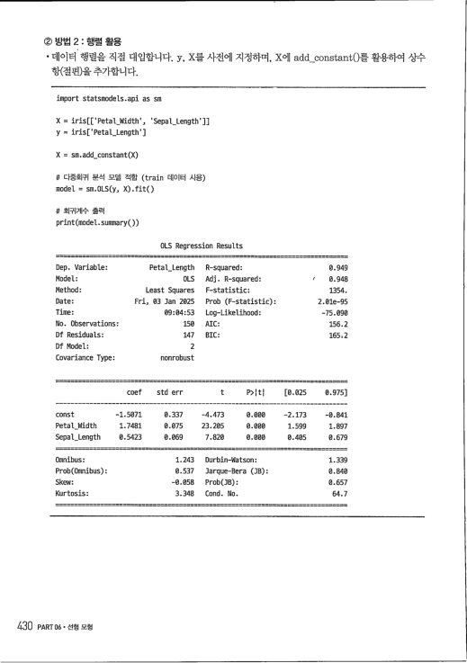
(2) 방법 2 : 행렬 활용 ' 데이터 행렬을 직접 대입합니다 . y, X를 사전에 지정하며 , x에 ad비_constant(）를 활용하여 상수 항（절편）을 추가합니다．

```python
import statsmodel.s.api as sin
X = iris[ ['Petal_Width', ' Sepal..Length '] ] 
y = irisf 'Petal_Length']
X = sm.add-constant(X)
# 다중회귀 분석 모델 적합 (train 데이터 사용）
model = sni.OLS(y, X).fit ()
# 회귀계수 출력 
print(model.. summaryQ)
```
OLS Regression Results Dep. Variable:

Petal_Length R-squa red:

Adj. R-squared:

F-statistic:

Prob (F-statistic):

Log-Likelihood:

AIC:

BIC:

0.949 r 0.948

1354. 
2.01e-95 -75.090 156.2 165.2 Model:

이．.$ Least Squares Fri, 03 Jan 2025 09:04:53 Method:

Date:

Time:

No. Observations:

150 Of Residuals:

147 Df Model:

2 nonrobust Covariance Type:

coef std err t P>1tI [0.025 0.975] C미1st Petal Width -1.507.1 1.7481 0.5423 0.337 0.075 -4.473 23.205 7.820 -2.173 1.599 0.405 -0.841 1.897 0.679 Sepal_Length 0 . 069 Omnibus:

Durbin-Watson:

Jarque-Bera (JB):

1.243 0.537 -0.058 3.348 1.339 0.840 0.657 64.7 Prob(Omnibus):

Skew:

Kurtosis:

Prob(JB):

Cond. No.

430 PART 06．선형모형

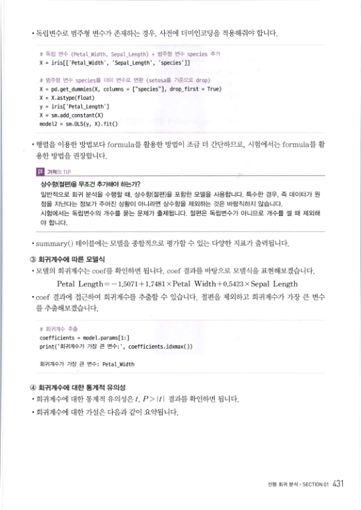
- 독립변수로 범주형 변수가 존재하는 경우 , 사전에 더미인코딩을 적용해줘야 합니다．
```python
# 독립 변수 (Petal_Width, Sepal_LengtFo + 범주형 변수 $pecie$ 추가
X = iris[ ['Petal_Width', 'Sepal_Length ', 'species '] ]
# 범주형 변수 species를 더미 변수로 변환 (setosa를 기준으로 drop)
X = pd.get_dumies(X, columns = ['species "], drop_first = True)
X = X.astype(float)
y = iris[ 'Petal_Length']
X = sm.add_constant(X)
```
rnodel.2 = sm.OLS(y, X).fit ()

- 행렬을 이용한 방법보다 formula를 활용한 방법이 조금 더 간단하므로 , 시험에서는 formula를 활
용한 방법을 권장합니다． .

기적의 지P 상수항（절편）을 무조건 추가해야 하는가？ 일반적으로 회귀 분석을 수행할 때 , 상수항（절편）을 포함한 모델을 사용합니다 . 특수한 경우 , 즉 데이터가 원 점을 지난다는 정보가 주어진 상황이 아니라면 상수항을 제외하는 것은 바람직하지 않습니다． 시험에서는 독립변수의 개수를 묻는 문제가 출제됩니다 . 절편은 독립변수가 아니므로 개수를 셀 때 제외해 야 햅ㅢ다 .

- summary() 테이블에는 모델을 종합적으로 평가할 수 있는 다양한 지표가 출력됩니다．
⑨. 회귀계수에 따른 모델식

- 모델의 회귀계수는 coef를 확인하면 됩니다 . coef 결과를 바탕으로 모델식을 표현해보겠습니다．
Petal Length= -1.5071+1.7481 x Petal Width+0.5423 x Sepal Length

- coef 결과에 접근하여 회귀계수를 추출할 수 있습니다 . 절편을 제외하고 회귀계수가 가장 큰 변수 
를 추출해보겠습니다．

```python
# 회귀계수 추출 
coefficients = model.params[1:] 
print(' 회귀계수가 가장 큰 변수＝ ', coefficients.idxmaxO)
```
회귀계수가 가장 큰 변수： Petal Width ④ 회귀계수에 대한 통계적 유의성

- 회귀계수에 대한 통계적 유의성은 궁 , P〕
＞ 凶 결과를 확인하면 됩니다．

- 회귀계수에 대한 가설은 다음과 같이 요약됩니다．
선형회귀분석．SECTION 01 431

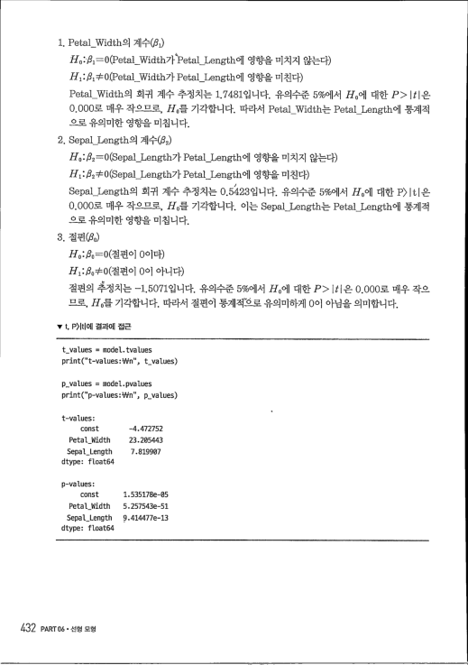
1. Petal_Width의 계수（91)
汀0:,fl1= O(Petal_Width가'Petal치ength에 영향을 미치지 않는다） ／키：/3, * O.(Petal Width가 Petal_Length에 영향을 미친다） Petal_Width의 회귀 계수 추정치는 1.7481입니다 . 유의수준 5％에서 /'。

에 대한 P> m은 0 .000로 매우 작으므로 , ／키를 기각합니다 . 따라서 PetaLWidth는 Petal_Length에 통계적 으로 유의미한 영향을 미칩니다．

2. Sepal_Length의 계수（i92)
H。: .82 =O (Sepal_Length가 Petal_Length에 영향을 미치지 않는다） ／키：β播0 (Sepal_Length가 Petal_Length에 영향을 미친다） Sepal_Length의 회귀 계수 추정치는 0.5423입니다 . 유의수준 5％에서 /El , 에 대한 P지끼은 0.000로 매우 작으므로 , ／쫴를 기각합니다 . 이는 Sepal_Length는 Petal_Length에 통계적 으로 유의미한 영향을 미칩니다． 3 . 절편（80) H。:βo = 0（절편이 0이다） H1: flo쑤 0（절편이 0이 아니다） 절펀의 추정치는 -1.5071입니다 . 유의수준 5％에서 ／키에 대한 f껑＞ 凶은 0.000로 매우 작으 므로 , ／쫴를 기각합니다 . 따라서 절편ㅇ〕 통계적브로 유의미하게 0이 아님을 의미합니다 .

'Vt. P기기0ㅔ 결과에 접근

```python
t values = model.. tvalues 
print("t-values:Wn', t_values)
p_values = model.pvalues 
print("p-values:Wn", p_values)
```
t-values:

const -4.472752 Petal Width 23.205443 Sepal_Length 7.819907 dtype: f1oat64 p-values:

const 1.535178e-05 Petal Width 5.257543e-51 Sepal_Length 9 .414477e-13 dtype: f1oat64 432 PART 06．선형모형

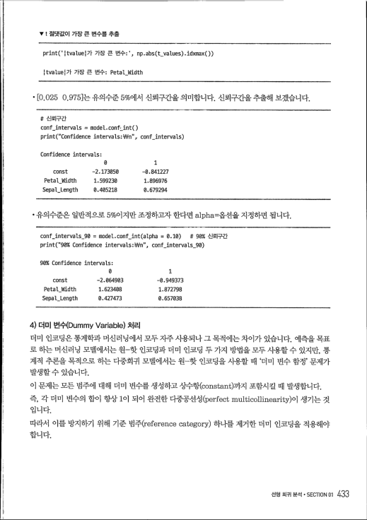
Vt 절댓값이 가장 큰 변수를 추출

```python
print(' 1tvalueI가 가장 큰 변수＝ ' , np.abs(t-values).idxniaxO)
```
ltvaluef가 가장 큰 변수： Petal_Width

- [0.025 0.975〕는유의수준 5％에서 신뢰구간을의미합니다 . 신뢰구간을 추출해 보겠습니다．
＃신뢰구간

```python
conf_intervals = model.conf:.int() 
print(Confidence intervals:Wn", conf_intervals)
```
Confidence intervals:

0 1 const -2.173050 -0.841227 Petal Width 1.599230 1.896976 Sepal- Length 0.405218 0.679294

- 유의수준은 일반적으로 5％이지만 조정하고자 한다면 alpha＝옵션을 지정하면 됩니다．
```python
conf_intervals_90 = modeL conf_int(alpha = 0.10) 
# 90% 신 구간 
print('gO% Confidence intervals:Wn", conf_intervals_90)
```
90% Confidence intervals:

0 1 const -2.064903 -0.949373 Petal Width 1.623408 1.872798 Sepal_Length 0.427473 0.657038 4) 더미 변수《Dummy Variable) 처리 더미 인코딩은 통계학과 머신러닝에서 모두 자주 사용되나 그 목적에는 차이가 있습니다 . 예측을 목표 로 하는 머신러닝 모델에서는 원－핫 인코딩과 더미 인코딩 두 가지 방법을 모두 사용할 수 있지만 , 통 계적 추론을 목적으로 하는 다중회귀 모델에서는 원－핫 인코딩을 사용할 때 ' 더미 변수 함정 ' 문제가 발생할 수 있습니다． 이 문제는 모든 범주에 대해 더미 변수를 생성하고 상수항（constant）까지 포함시킬 때 발생합니다． 즉 , 각 더미 변수의 합이 항상 1이 되어 완전한 다중공선성（perfect multicollinearity）이 생기는 것 입니다 .

따라서 이를 방지하기 위해 기준 범주（reference category) 하나를 제거한 더미 인코딩을 적용해야 합니다． 선형회귀분석．SECTION 01 433

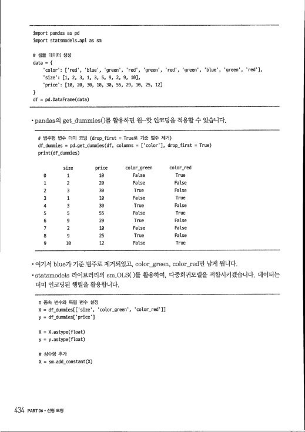
```python
import pandas as pd 
import statsmodels.api as sin
# 샘플 데이터 생성
data = {
```
' color' : ['red', 'blue', 'green', 'red', 'green', 'red', 'green', 'blue', 'green', 'red '] , 'size': [1, 2, 3, 1, 3, 5, 9, 2, 9, 10], 'price' : [10, 20, 30, 10, 30, 55, 29, 10, 25, 12]

```python
df = pd.DataFrarne(data)
```
- pandas의 get_dummies(）를 활용하면 원－핫 인코딩을 적용할 수 있습니다．
```python
# 범주형 변수 더미 코딩 (drop_first = True로 기준 범주 제거）
df_dumies = pd,get_dumies(df, columns = ['color'] , drop_first = True) 
print(df_dumies)
```
size price co Lor_green co ior_reu 0 1 10 False True 1 2 20 False False 2 3 30 True False 3 1 10 False True 4 3 30 True False 5 5 55 False True 6 9 29 True False 7 2 10 False False 8 9 25 True False 9 10 12 False True

- 여기서 blue가 기준 범주로 제거되었고 , color_green, color_red만 남게 됩니다．
- statsmodels 라이브러리의 sm.OLS( ）를 활용하여 , 다중회귀모델을 적합시키겠습니다 . 데이터는
더미 인코딩된 행렬을 활용합니다．

```python
# 종속 변수와 독립 변수 설정
X = df_dumniies[['size', 'color_green', 'color_red'] ]
y = df_dumies['price'J
X = X.astype(float)
y = y.astype(float)
# 상수항 추가
X = sin.add_constant(X)
```
434 PART 06．선형모형

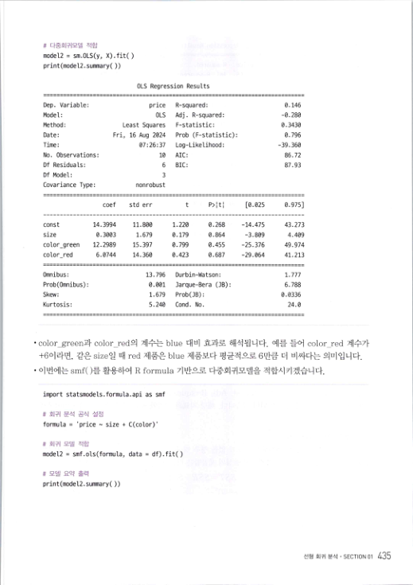
```python
# 다중회 잭모델 적합
model2 = sm.OLS(y, X).fit () 
print(model2. summary( ))
```
OLS Regression Results price Dep. Variable:

R-squared:

Adj. R-squared:

F-statistic:

0.146 -0.280

0. 3430 
0.796 -39.360 Model:

이－5 Method:

Least Squares Fri, 16 Aug 2024 Date:

Prob (F-statistic):

Time:

07:26:37 Log-Likelihood:

No. Observations:

AIC:

1O 86.72 Df Residuals:

BIC:

87.93 6 Df Model:

3 Covariance Type:

nonrobust coef std err t P>Iti [0.025 0.975] const size color_green color red 14.3994

0. 3003 
12.2989 6.0744 0.268 0.864 0.455 0.687 11.800 1.679 15.397 1.220 0.179 -14.475 -3.809 -25.376 -29.064

43. 273 
4.409 0.799 0.423 49.974 14.360

41. 2 13
Omnibus:

13.796 Durbin-Watson:

1.777 6.788 0.0336 Prob(Omnibus):

Jarque-Bera (JB):

0 . 001 1.679 5.240 Skew:

Kurtosis:

Prob(JB):

Cond. No.

24.0

- coloi긴green과 color red의 계수는 blue 대비 효과로 해석됩니다 . 예를 들어 color red 계수가
+6이라면 , 같은 size일 때 red 제품은 〕lue 제품보다 평균적으로 6만큼 더 비싸다는 의미입니다．

- 이번에는 smf( ）를 활용하여 R formula 기반으로 다중회귀모델을 적합시 키겠습니다．
```python
import statsmodels. formula.api as smf
# 회귀 분석 공식 설정
formula = 'price ` size + C(color) '
# 회 체 모델 적합
mode12 = smf.ols(formula, data = df).fit ()
# 모델 요약 출력 
print(m0de12.summary( ))
```
선형 회귀 분석 * SECTION 01 435

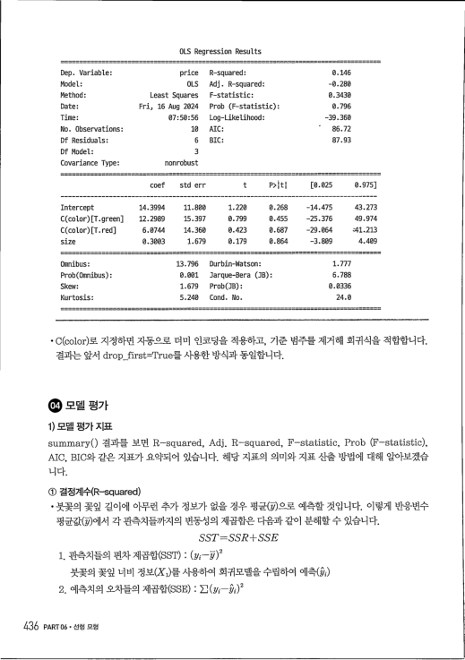
OLS Regression Resul.ts price Dep. Variable:

R-squa red:

Adj. R-squared:

F-statistic:

0.146 -0.280 0.3430 0.796 -39.360 ' 86.72 87.93 Model.:

이－$ Least Squares Fri, 16 Aug 2024 07:50:56 Method:

Date:

Prob (F-statistic):

Log-Likelihood:

Time:

No. Observations:

10 AIC:

BIC:

6 Df Residuals:

Df Model:

3 nonrobust Covariance Type:

[0.025 0.975] coef std err t 贓 -14.475 -25.376 -29.064 -3.809 1.220 0.268 0.799 0.455 0.423 0.687 0.179 8.864 43.273 49.974 41.213 4.409

14. 3994 
12.2989 6.0744 0.3003 11 .800 15.397 Intercept C(color) [T.green]

14. 360 
1.679 C(color) [T. red] size 1.777 6.788 13.796 Durbin-Watson:

3arque-Bera (3B):

Omnibus:

0 . 001 1.679 5.240 Prob(Omnibus):

0 . 0336 Prob(3B):

Skew:

Kurtosis:

Cond. No.

24.0

- C(color）로 지정하먼 자동으로 더미 인코딩을 적용하고 , 기준 범주를 제거해 회귀식을 적합합니다．
결과는 앞서 drop_first=True를 사용한 방식과 동일합니다． .모델평가 1) 모델 평가 지표 summary() 결과를 보면 B-squared, Adj. B-squared, F-statistic, Prob (F-statistic), AIC, BI(〕와 같은 지표가 요약되어 있습니다 . 해당 지표의 의미와 지표 산출 방법에 대해 알아보겠습 니다． ① 결정계수（R-squared)

- 붓꽃의 꽃잎 길이에 아무런 추가 정보가 없을 경우 평균（y）으로 예측할 것입니다 . 이렇게 반응변수
평균값（y）에서 각 관측치들까지의 변동성의 제곱합은 다음과 같이 분해할 수 있습니다． SST==SS／려 SSE 1 . 관측치들의 편차제곱합（SST) : (y- v)2 붓꽃의 꽃잎 너비 정보（x1）를 사용하여 회귀모델을 수립하여 예측（如 2 . 예측치의 오차들의 제곱합（SSE) : E (yi-yi)2 436 PART06．선형모형

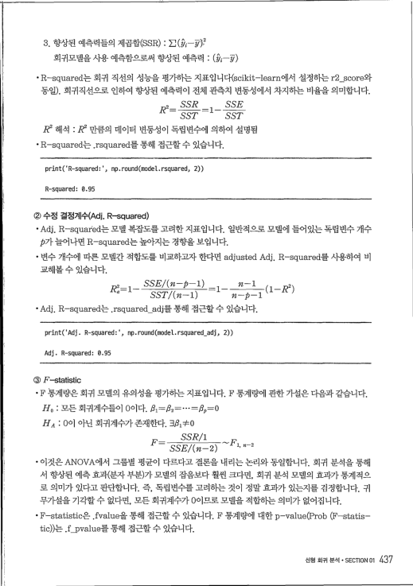
3 . 향상된 예측력들의 제곱합（8SR) : E （夕／－刃2 회귀모델을 사용 예측함으로써 향상된 예측력 : (八-까

- R-squared는 회귀 직선의 성능을 평가하는 지표입니다（scikit-learn에서 설정하는 r2-score와
동일） . 회귀직선으로 인하여 향상된 예측력이 전쳬 관측치 변동성에서 차지하는 비율을 의미합니다．

```python
R2= 督蠶＝1 SSESST
```
R2 해석 : R2 만큼의 데이터 변동성이 독립변수에 의하여 설명됨

- R-squared는 . rsquared를 통해 접근할수 있습니다．
```python
print(R-squared: ' , np.raund(model..rsquared, 2))
```
R-squared: 0.95 ② 수정 결정계수（Adj. R-squared)

- Adj. R-squaied는모델복잡도를고려한지표입니다 . 일반적으로모델에 들어있는독립변수개수
夕가 늘어나면 R-squared는 높아지는 경향을 보입니다．

- 변수 개수에 따른 모델간 적합도를 비교하고자 한다먼 adjusted Adj. R-squared를 사용하여 비
```python
교해볼 수 있습니다． 
R=1- 浬/(n-
T/( n勻') =1- , 쯔긷：(i-R)
```
- Adj. R-squared는 . rsquared_adj를통해 접근할수 있습니다．
```python
print('Adj. R-squared: ' , np.round(modeL rsquared_adj, 2))
```
Adj. R-squared: 0.95 ③F-statistic

- F 봉계량은 회귀 모델의 유의성을 평가하는 지표입니다 . F 통계량에 관한 가설은 다음과 같습니다．
／키 : 모든 회귀계수들이 0이다 . β1＝β2＝···＝β夕＝0 HA : 0이 아닌 회귀계수가존재한다 . 크β1쑤0 一 SSR/i ，ㄱ f = SSE/(n- 2) ∼ i ' 갇7-"

- 이것은ANOVA에서 그룹별 평균이 다르다고 갈론을 내리는 논리와 동일합니다 . 회귀 분석을 통해 
서 향상된 예측 효과（분자 부분）가 모델의 잡음보다 훨씬 크다면 , 회귀 분적 모델의 효과가 통계적으 로 의미가 있다고 판단합니다 . 즉 , 독립변수를 고리하는 것이 정말 효과가 있는지를 검정합니다 . 귀 무가설을 기각할수 없다먼 , 모든 회귀계수가 0이므로 모델을 적합하는 의미가 없어집니다．

- F-statistic은 . fvalue을 통해 접근할 수 있습니다 . F 통계량에 대한 p-value(Prob (F-statis-
tic)）는 . fpvalue를통해 접근할수 있습니다． 선형 회귀 분석 · SECTION 01 437

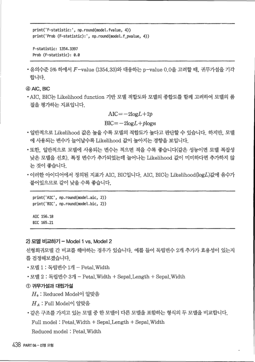
```python
print('F-statistic:', np. round(model.fvalue, 4)) 
print(' Prob (F-statistic):', np.round(model..f_pvalue, 4))
```
F-statistic: 1354.3397 Prob (F-statistic): 0.0

- 유의수준 5% 하에서 /'- value (1354.33）와 대응하는 p-value 0.0을 고려할 때 , 귀무가설을 기각
합니다． ④AIC, BIC

- ATC, BI(〕는 Likelihood function 기반 모델 적합도와 모델의 종합도를 함께 고려하여 모델의 품
질을 평가하는 지표입니다．

```python
AIC = - 2logL + 2)
BIC= -2logL+plogn
```
- 일반적으로 Likelihood 값은 높을 수록 모델의 적합도가 높다고 판단할 수 있습니다 . 하지만 , 모델
에 사용되는 변수가 늘어날수록 Likelihood 값이 높아지는 경향을 보입니다．

- 또한 , 일반적으로 모델에 사용되는 변수는 적으면 적을 수록 좋습니다（같은 성능이면 모델 복잡성
낮은 모델을 선호） . 특정 변수가 추가되었는데 늘어나는 Likelihood 값이 미미하다면 추가하지 않 는 것이 좋습니다．

- 이러한 아이디어에서 정의된 지표가AIC, BIC입니다 . AIC, BIC는 Likelihood(logL）값에 음수가
붙어있으므로 같이 낮을 수록 좋습니다 .

```python
print('AIC', np.round(niodeL.aic, 2)) 
print('BIC ', np.round(modeLbic, 2))
```
AIC 156.18 BIC 165.21 2) 모델 비교하기 - Model 1 vs. Model 2 선형회귀모델 간 비교를 해야하는 경우가 있습니다 . 예를 들어 독립변수 2개 추가가 효용정이 있는지 를 검정해보겠습니다．

- 모델 1 : 독립변수 1개 - Petal.Width
- 모델 2 : 독립변수 3개 - PetaL Width + Sepal.Length + Sepal.Width
① 귀무가설과 대립가설 ／쫴 : Reduced Model이 알맞음 HA : Full Model이 알맞음

- 같은 구조를 가지고 있는 모델 중 한 모델이 다른 모델을 포함하는 형식의 두 모델을 비교합니다．
Full model : Petal.Width + SepaLLength + Sepal.Width Reduced model : PetaL Width 438 PART 06．선형모형

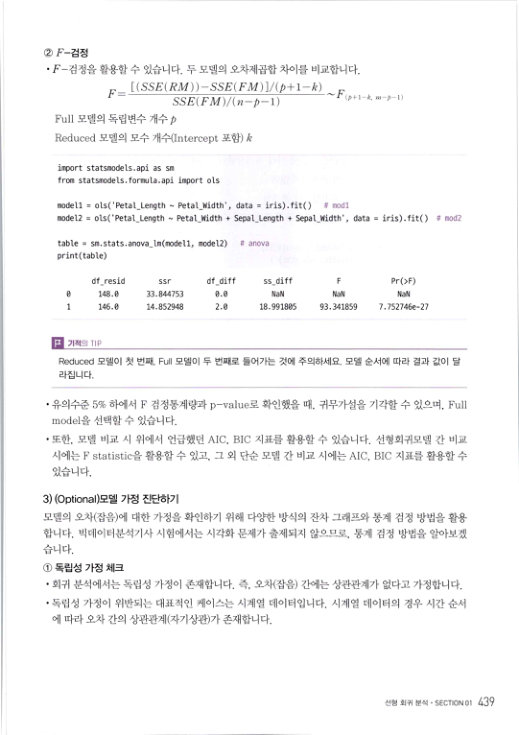
② F－검정

- ／구－검정을 활용할 수 있습니다 . 두 모델의 오차제곱합 차이를 비교합니다．
,7 1('.c.c (pAfl)-.c.cE( PM'1/(i)"-l--1 -k '1' ，' F= " ' -- ' SSE i_ , rn

## /(n-
" " ' ∼ Full 모델의 독립변수 개수夕 Reduced 모델의 모수 개수（Intercept 포함） k

```python
import statsmodels.api as sm 
from statsmodels.formula.api import ols
modell = ols( 'Petal_Length ` Petal_Width', data = iris).fit () 
# modl
mode12 = ols( 'Petal_Length ` Petal_Width + Sepal_Length + Sepal_Width ', data = iris).fit ()
table = sm.stats.anova_lm(modell, model2) 
# anova 
print(table)
```
df_resid ssr df_diff ss_diff F Pr(>F) 0 148.0 33.844753 0.0 NaN NaN NaN 1 146.0 14.852948 2.0 18.991805 93.341859 7.752746e-2]

## r헴 기적의 뀌P
Reduced 모델이 첫 번째 , F에 모델이 두 번째로 들어가는 것에 주의하세요 . 모델 순서에 따라 결과 값이 달 라집니다．

- 유의수준 5% 하에서 F 검정통계량과 p-value로 확인했을 때 , 귀무가설을 기각할 수 있으며 , Full 
model을 선택할 수 있습니다．

- 또한 , 모델 비교 시 위에서 언급했던 AIC, BI(〕 지표를 활용할 수 있습니다 . 선형회귀모델 간 비교
시에는 F statistic을 활용할 수 있고 , 그 외 단순 모델 간 비교 시에는 AIC, BI(〕 지표를 활용할 수 있습니다． 3) (Optional）모델 가정 진단하기 모델의 오차（잡음）에 대한 가정을 확인하기 위해 다양한 방식의 잔차 그래프와 통계 검정 방법을 활용 합니다 . 빅데이터분석기사 시험에서는 시각화 문제가 출제되지 않으므로 , 통계 검정 방법을 알아보겠 습니다． (j:) 독립성 가정 체크

- 회귀 분적에서는 독립성 가정이 존재합니다 . 즉 , 오차＜잡음） 간에는 상관관계가 없다고 가정합니다．
- 독립성 가정이 위반되는 대표적인 케이스는 시계열 데이터입니다 . 시계열 데이터의 경우 시간 순서
에 따라 오차 간의 상관관계（자기상관）가 존재합니다． 선형회귀분석· SECTION이 439

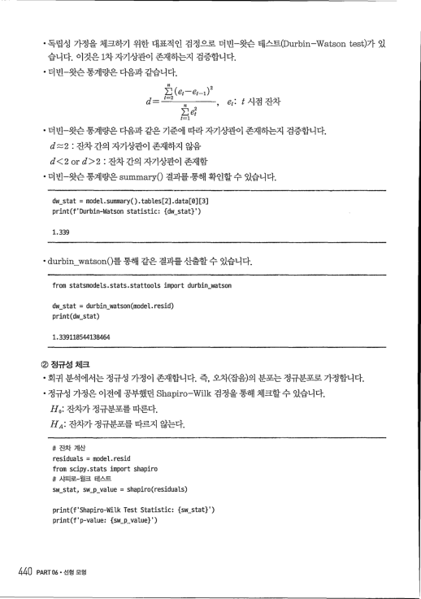
- 독립성 가정을 쳬크하기 위한 대표적인 검정으로 더빈－왓슨 테스트（Durbin-Watson test）가 있
습니다 . 이것은 1차 자기상관이 존재하는지 검증합니다．

- 더빈－왓슨 통계량은 다음과 같습니다．
### 尤(et-et_i)2
## 磅＝ ' 
『 ' 尤，r , " ' 「 tA'g잔1"

```python
· 더빈－왓슨 통계량은 다음과 같은 기준에 따라 자기상관이 존재하는지 검증합니다． 
d=2 : 잔차 간의 자기상관이 존재하지 않음 
d<2 or d>2 : 잔차 간의 자기상관이 존재함
```
- 더빈－왓슨 통계량은 summary() 결과를통해 확인할 수 있습니다．
```python
dw_stat = model.suniniary() .tabl,es[2J.data[0]E3] 
print(f ' Durbin-Watson statistic: {dw_stat}')
```
1.339

- durbin_watson(）를 통해 같은 결과를 산출할 수 있습니다．
```python
from statsmodeLs . stats. stattools import durbin-watson
dw_stat = durbin_watson(modeL resid) 
print(dw_stat)
```
1.339118544138464 ② 정 구성 체크

- 회귀 분적에서는 蔘干성 가정이 존재합니다 . 즉 , 오차（잡음）의 분포는 정규분포로 가정합니다．
- 정규성 가정은 이전에 공부했던 Shapiro-Wilk 검정을 통해 쳬크할 수 있습니다．
H。

： 잔차가 棚予분포를 따른다． 〃A: 잔차가 정규분포를 따르지 않는다．

```python
# 진차 계산 
residuals = model.resid
from scipy.stats import shapiro 
# 샤피로－윌크 테스트
```
sw_stat, sw_p_value = shapiro(residuals)

```python
print(f 'Shapiro-Wilk Test Statistic: {sw_statF) 
print(f 'p-value: {sw_p_vaLue} ')
```
440 PART 06．선형모형

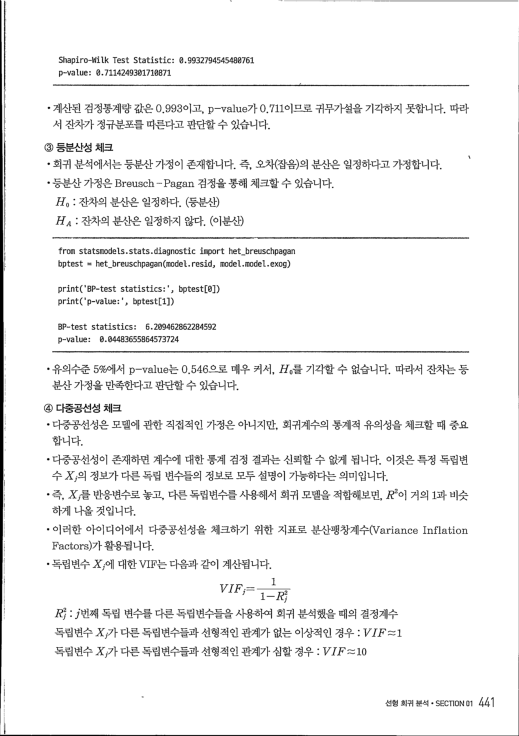
Shapiro-Wilk Test Statistic: 0.9932794545480761 p-value: 0.7114249301710871

- 계산된 검정통계량 값은 0.993이고 , p-value가 0.711이므로 귀무가설을 기각하지 못합니다 . 따라
서 잔차가 정규분포를 따른다고 판단할 수 있습니다． ③ 등분산성 체크 ,

- 회귀 분석에서는 등분산 가정이 존재합니다 . 즉 , 오차（잡음）의 분산은 일정하다고 가정합니다．
- 등분산 가정은 Breusch - Pagan 검정을 통해 쳬크할 수 있습니다．
H。 : 잔차의 분산은 일정하다 . （릉분산） 〃A : 잔차의 분산은 일정하지 않다 . （이분산）

```python
from statsniodels . stats. diagnostic import het_breuschpagan 
bptest = het_breuschpagan(model. resid, model.model.exog)
print(BP-test statistics: , bptest{0]) 
print('p-value:', bptest[1])
```
BP-test statistics: 6.209462862284592 p-value: 0.04483655864573724

- 유의수준 5％에서 p-value는 0.546으로 매우 커서 , H。를 기각할 수 없습니다 . 따라서 잔차는 등 
분산 가정을 만족한다고 판단할 수 있습니다． ④ 다중공선성 체크

- 다중공선성은 모델에 관한 직접적인 가정은 아니지만 , 회귀계수의 통계적 유의성을 쳬크할 때 중요
합니다．

- 다중공선성이 존재하면 계수에 대한 통계 검정 결과는 신뢰할 수 없케 됩니다 . 이것은 특정 독립변 
수 지의 정보가 다른 독립 변수들의 정보로 모두 설명이 가능하다는 의미입니다．

- 즉 , 치를 반응변수로 놓고 , 다른독립변수를사용해서 회귀 모델을 적합해보면 , 꾜2이 거의 1과 비슷
하게 나올 것입니다．

- 이러한 아이디어에서 다중공선성을 쳬크하기 위한 지표로 분산팽창계수（Variance Inflation
Factors）가 활용됩니다．

- 독립변수 차에 대한VIF는 다음과 같이 계산됩니다． 
----- 1 v1J-l.j= i- R, R: ／번째 독립 변수를 다른 독립변수들을 사용하여 회귀 분적했을 때의 결정계수 독립변수 차가 다른 독립변수들과 선형적인 관계가 없는 이상적인 경우 : VIF＝乙1 독립변수 지가 다른 독립변수들과 선형적인 관계가 심할 경우 : VIF=10 선형회귀분석· SECTION 01 441

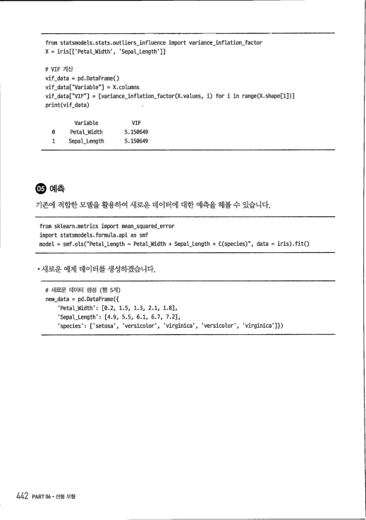
```python
from statsmodels .stats.outliers_influence import variance_inflation_ factor
X = iris[ {'Petal_Width', 'Sepal_Length'] ]
# V工F 계산 
vif_data = pd.DataFranie() 
vif_data["Variable"] = X.columns 
vif_data{"VIF"] = [variance_inflation_factor(X.values, i) for i in range(X.shape{1])1 
print(vif_data)
```
Variable VIF 0 Petal Width 5.150649 1 Sepal_Length 5.150649 .

예측 기존에 적합한 모델을 활용하여 새로운 데이터에 대한 예측을 해볼 수 있습니다．

```python
from sklearn .metrics import mean_squared_error 
import statsmodels.formula.api as smf
model = smf.ols("Petal- Length - Petal_Width + Sepal_Length + C(species)", data = iris).fitQ
```
- 새로운 예제 데이터를 생성하겠습니다．
```python
# 새로운 데이터 생성 （행 5개）
new_data = pd.DataFranie({ 
'Petal_Width': [0.2, 1.5, 1.3, 2.1, 1.8],
```
'Sepal_Length' : [4.9, 5.5, 6.1, 6.7, 7.2], 'species' : ['setosa', 'versicolor', 'virginica', 'versicolor', 'virginica'] }) 442 PART 06．선형모형

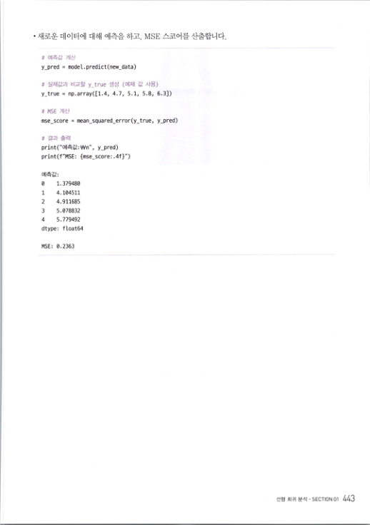
- 새로운 데이터에 대해 예측을 하고 , MSE 스코어를 산출합니다．
```python
# 예측값 계산
y_pred = niodel.predict(new_data)
# 실제값과 비교할 y_t rue 생성 （예제 값 사용）
y_true = np.array([1.4, 4.7, 5.1, 5.8, 6.3])
# MSE 계산
mse_score = mean_squared_error(y_true, y_pred)
# 결과 출력 
print(" 예측값：Wn ', y_pred) 
print(f"MSE: {mse_score: .4f} ')
```
예측값： 0 1.379480 1 4.104511 2 4.911685 3 5.078832 4 5.779492 dtype: fl.oat64 MSE: 0.2363 선형 회귀 분석 . SECTION 01 443

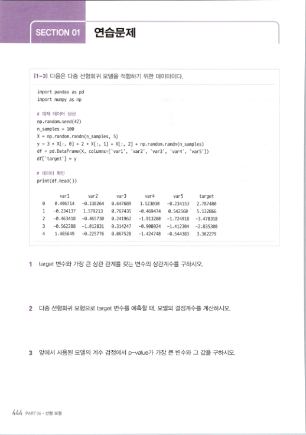
## 연습문제
(1-.긔 다음은 다중 선형회귀 모델을 적합하기 위한 데이터이다．

```python
import pandas as pd 
import numpy as np
# 예제 데이터 생성
```
np. random. seed (42)

```python
n_samples = 100
X = np.random.randn(n- samples, 5)
y = 3 * XE:, 0] + 2 * XE:, 1] + XE:, 2] + np.random. randn(n_samples) 
df = pd.DataFrame(X, columns=['varl ', ' var2', ' var3' , ' var4, ' var5' ])
```
dfE 'target '] = y

```python
# 데이터 확인 
print(df.head())
```
van1 var2 var3 var4 var5 target 0 0.496714 -0.138264 0.647689 1.523030 -0.234153 2.787480 1 -0.234137 1.579213 0.767435 -0.469474 0.542560 5.132866 2 -0.463418 -0.465730 0.241962 -1.913280 -1.724918 -3.478318 3 -0.562288 -1.012831 0.314247 -0.908024 -1.412304 -2.835308 4 1.465649 -0.225776 0.067528 -1.424748 -0.544383 3.362279 I target 변수와 가장 큰 상관 관계를 갖는 변수의 상관계수를 구하시오． 2 다중 선형회귀 모형으로 target 변수를 예측할 때 , 모델의 결정계수를 계산하시오． 3 앞에서 사용된 모델의 계수 검정에서 p-value가 가장 큰 변수와 그 값을 구하시오． 444 PART 06．선형모형

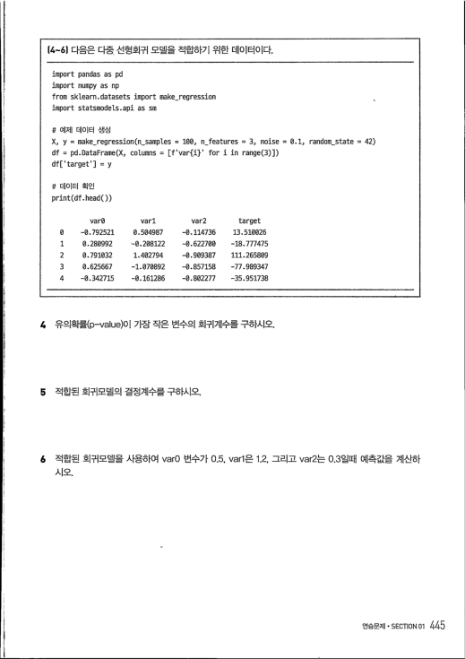
14-6] 다뿟 다중 선형회귀 모델을 적합하기 위한 데이터이다．

```python
import pandas as pd 
import numpy as np 
from skLearn.datasets import make_regression 
import statsmodeLs.api as sm
# 예제 데이터 생성
X, y = make_regression(n_sampl.es = 100, n_features = 3, noise == 0.1, random_state = 42) 
df = pd.DataFrame(X, cothmns = [ f 'var{i} ' for i in range(3)]) 
df[ 'targeV] = y
# 데이터 확인 
print(df.head())
```
var0 van1 var2 target 0 -0.792521 0.504987 -0.114736 13.510026 1 0.280992

- -0.208122 
-0.622700 -18.777475 2 0.791032 1.402794 -0.909387 111.265809 3 0.625667 -1.070892 -0.857158 -77.989347 4 -0.342715 -0.161286 -0.802277 -35.951738 4 유의확률（p-value）이 가장 작은 변수의 회귀계수를 구하시오． 5 적합된 회귀모델의 결정계수를 구하시오． 6 적합된 회귀모델을 사용하여 var0 변수가 0.5. van1은 1.2 , 그리고 var2는 0.3일때 예측값을 계산하 시오． 연습문제· SECT!아』01 445

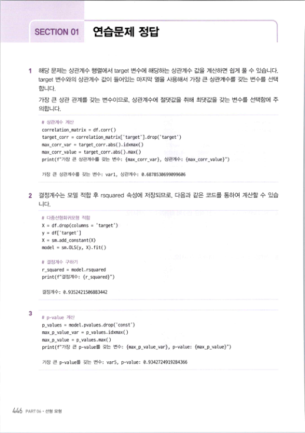
## SECTION 01 
연습문제 정답 I 해당 문제는 상관계수 행렬에서 target 변수에 해당하는 상관계수 값을 계산하면 쉽게 풀 수 있습니다． target 변수와의 상관계수 값이 들어있는 마지막 열을 사용해서 가장 큰 상관계수를 갖는 변수를 선택 합니다． 가장 큰 상관 관계를 갖는 변수이므로 , 상관계수에 절댓값을 취해 최댓값을 갖는 변수를 선택함에 주 의합니다．

```python
# 상관계수 계산 
correlation_matrix = df.corr() 
target_corr = correlation_matrix[ 'target '] .drop( 'target ')
max_corr_var = target_corr . abs( ) . idxmax()
max_corr_value = target_corr.absQ.max() 
print(f " 가장 큰 상관계수를 갖는 변수： {max_corr_var}, 상관계수： {max_corr_value}")
```
가장 큰 상관계수를 갖는 변수： va ri, 상관계수： 0.6878530699099606 2 결정계수는 모델 적합 후 rsquared 속성에 저장되므로 , 다음과 같은 코드를 통하여 계산할 수 있습 니다．

```python
# 다중선형회귀모형 적합
X = df.drop(columns = 'target ')
y = df[ 'target ']
X = sm.add_constant(X)
model = sm.OLS(y, X).fit ()
# 결정계수 구하기 
r_squared = model.rsquared 
print(f "결정계수： {r_squared} ')
```
결정계수＝ 0.9352421506883442

```python
# p-value 계산
p_values = modeLpvalues.dropCconst ')
max_p_value_var = p_values. idxmax()
max_p_value = p_values.max() 
print(f "가장 큰 p-value를 갖는 변수： {max_p_value_var}, p-value: {max_p_value} ")
```
가장 큰 p-value를 갖는 변수： var5, p-value: 0.9342724919284366 446 PART 06．선형모형

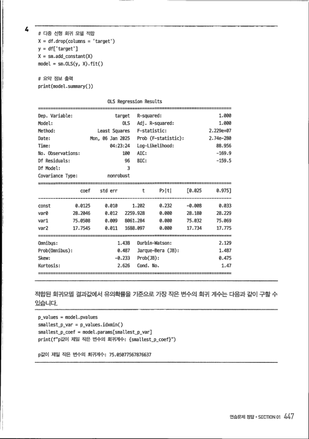
```python
4 
# 다중 선형 홰시 모델 적합
X = df.drop(col.umns = ' target ')
y = df[ 'target'] ,
X = sm.add_constant(X)
model = sm.OLS(y, X).fit ()
# 요약 정보 출력 
print(model. sumaryQ)
```
OLS Regression Results 1 . 000 1.000 2.229e+07

2. 74e-280 
88. 956 
-169.9 -159.5 Dep. Variable:

R-squa red:

Adj. R-squared:

F-statistic:

target 이－5 Model:

Method:

Date:

Least Squares Mon, 06 Jan 2025 Prob (F-statistic):

Log-Likelihood:

Time:

04:23:24 No. Observations:

100 AIC:

BIC:

Of Residuals:

96 Of Model:

3 nonrobust Covariance Type:

coef std err t P>It!

[0.025 0.975]

0. 0125 
28.2046 75.0508 17.7545 const var0 van1 var2 0.010 0.012 1.202 0.232 -0 . 008 28.180 75.032 17.734 0 . 033 28.229 75.069 17.775

2259. 928
0 . 000

8061. 284
0 .000 0 . 009 0 . 000 0 . 011 1688.097 Durbin-Watson:

2.129 1.487 0.475 1.47 0mnibus:

1.438 0.487 -0.233 2.626 3arque-Bera (JB):

Prob(Omnibus):

Prob(JB):

Skew:

Kurtosis:

Cond. No.

적합된 회귀모델 결과값에서 유의확률을 기준으로 가장 작은 변수의 회귀 계수는 다음과 같이 구할 수 있습니다．

```python
p_values = model.pvalues 
smallest_p_var = p_values.idxmin() 
smallest_p_coef = model. params[smallest_p_var] 
pnint(f "p값이 제일 작은 변수의 회귀계수： {smallest_p_coef}")
```
p값이 제일 작은 변수의 회귀계수＝ 75.05077567876637 연습문제정답．SECTION 01 447

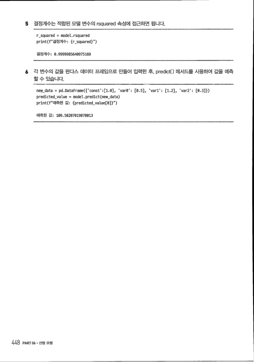
5 결정계수는 적합된 모델 변수의 rsquared 속성에 접근하면 됩니다．

```python
r_squared = modeL rsquared 
print(f " 결정계수： {r=squared} ")
```
결정계수： 0.9999985640975169 6 각 변수의 값을 판다스 데이터 프레임으로 만들어 입력한 후 , predict() 메서드를 사용하여 값을 예측 할 수 있습니다．

```python
nei_data = pd.DataFrame({'const': [1.0J, ' var0': [0.5], ' var1 ': [1.2], ' var2 ': [0.3]}) 
prediCted_value = model. predict(new_data) 
print(f " 예측된 값： {predicted_value[0J}")
```
예측된 값： 109.50207019078013 448 PART 06．선형모형

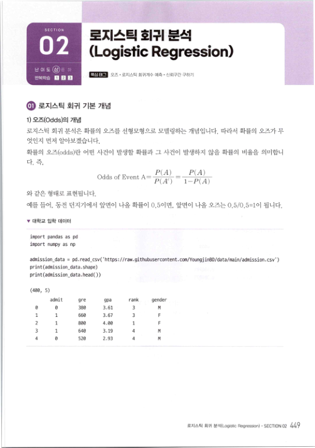
# 로지스틱 회귀 분석 
(Logistic Regression) SECTION 난 이 도 텅iI 중 하 핵심 태그 오즈 · 로지스틱 회귀계수 예측 · 신뢰구간 구하기 반복학습 .

a .

.I 로지스틱 회귀 기본 개념 1) 오즈（Odds）의 개념 로지스틱 회귀 분석은 확률의 오즈를 선형모형으로 모델링하는 개념입니다 . 따라서 확률의 오즈가 무 엇인지 먼저 알아보겠습니다． 확률의 오즈（odds）란 어떤 사건이 발생할 확률과 그 사건이 발생하지 않을 확률의 비율을 의미합니 다 . 즉， 一 . , . 一 .

P(,4) P(A) uaas 01 iwent A= P(At) 1- P(A) 와 같은 형태로 표현됩니다． 예를 들어 , 동전 던지기에서 앞면이 나올 확률이 0.5이면 , 앞면이 나올 오즈는 0.5/0.5=1이 됩니다． ▼ 대학교 입학 데이터

```python
import pandas as pd 
import numpy as np
admission_data = pd. read_csv( ' https://raw.githubusercontent.com/YoungjinBD/data/main/admission.csv') 
print(admission_data .shape) 
print(admission_data.headQ)
```
(400, 5) admit gre gpa rank gender 0 0 380 3.61 3 M 1 1 660 3.67 3 F 2 1 800 4.00 1 F 3 1 640 3.19 4 M 4 0 520 2.93 4 M 로지스틱 회귀 분석（Logistic R egression) . SECTI아새2 449

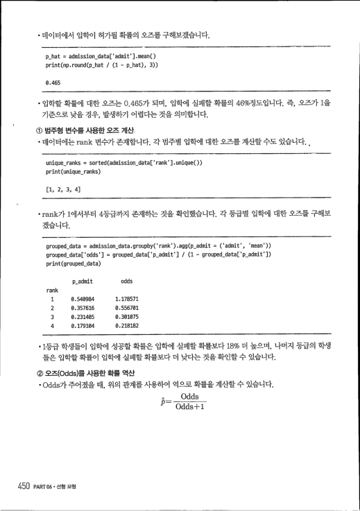
- 데이터에서 입학이 허가될 확률의 오즈를 구해보겠습니다．
```python
p_hat = admission_datat 'admit'] .mean() 
print(np.round(p_hat / (1 - p_hat), 3))
```
0.465

- 입학할 확률에 대한 오즈는 0.465가 되며 , 입학에 실패할 확률의 46％정도입니다 . 즉 , 오즈가 1을
기준으로 낮을 경우 , 발생하기 어렵다는 것을 의미합니다． ① 범주형 변수를 사용한 오즈 계산．

- 데이터에는 rank 변수가 존재합니다 . 각 범주별 입학에 대한 오즈를 계산할 수도 있습니다．.
```python
unique_ranks = sorted(admission_data[' rank'] .uniqueO) 
print(unique_ranks)
```
[1, 2, 3, 4]

- rank가 1에서부터 4등급까지 존재하는 것을 확인했습니다 . 각 등급별 입학에 대한 오즈를 구해보
겠습니다．

```python
grouped_data = admission_data.groupby(' rank') .agg(p_admit = ('admit', 'mean'))
grouped..data[ 'odds'] = grouped_data[ 'p_admit'] / (1 - grouped_data['p-admit'] ) 
print(grouped_data)
```
p_admit odds rank 1 0.540984 1.178571 2 0.357616 0.556701 3 0.231405 0.301075 4 0.179104 0.218182

- 1등급 학생들이 입학에 성공할 확률은 입학에 실패할 확률보다 18% 더 높으며 , 나머지 등급의 학생
들은 입학할 확률이 입학에 실패할 확률보다 더 낮다는 것을 확인할 수 있습니다． ② 오즈（0dds）를 사용한 확률 역산

- Odds가주어겼을 때 , 위의 관계를사용하여 역으로 확률을 계산할수 있습니다．
Odds 女＝ /, 1 1 , .

r Odds+1 450 PART 06·선형모형

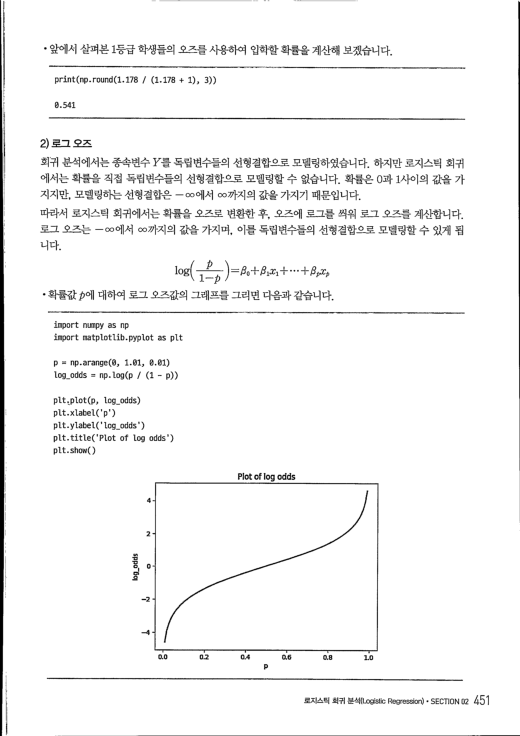
' 앞에서 살펴본 1등급 학생들의 오즈를 사용하여 입학할 확률을 계산해 보겠습니다．

```python
print(np.round(1.178 I (1.178 + 1), 3))
```
0.541 2) 로그 오즈 회귀 분석에서는종속변수 Y를 독립변수들의 선형결합으로 모델링하였습니다 . 하지만 로지스틱 회귀 에서는 확률을 직접 독립변수들의 선형결합으로 모델링할 수 없습니다 . 확률은 0과 1사이의 값을 가 지지만 , 모델링하는 선형결합은 -Cㅇ에서 00까지의 값을 가지기 때문입니다． 따라서 로지스틱 회귀에서는 확률을 오즈로 변환한 후 , 오즈에 로그를 씌워 로그 오즈를 계산합니다． 로그 오즈는 -00에서 αㅇ까지의 값을 가지며 , 이를 독립변수들의 선형결합으로 모델링할 수 있게 됩 니다 .

s1x1+ ..

. +sx

- 확률값少에 대하여 로그 오즈값의 그래프를 그리면 다음과 같습니다．
```python
import nunipy as np 
import niatplotiib.pyplot as pit
p = np.arange(O, 1.01, 0.01) 
log_odds = np.log(p / (1 - p))
```
plt`piot(p, log_odds) plt.xiabel('p') pit. yiabel('log_odds') plt.title('PI.ot of log odds') plt.showQ Plot of log odds 4- 2- ＂ ㄲ 졍 기 。

。

0- -2 - -4 쵭 I 귐 .

* 
I ' 0.0 0.2 0.4 0.6 0.8 1.0 p 로지스틱회귀분석（Logistic Regression) , SECTION 02 4引

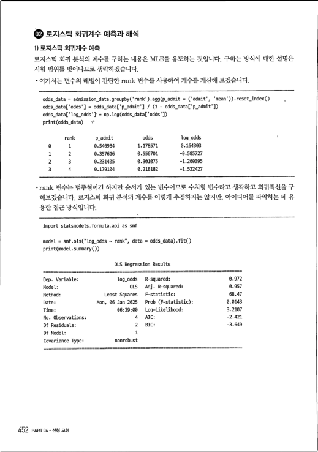
.

로지스틱 회귀계수 예측과 해석 1) 로지스틱 회귀계수 예측 로지스틱 회귀 분석의 계수를 구하는 내용은 MLE를 유도하는 것입니다 . 구하는 방식에 대한 설명은 시험 범위를 벗어나므로 생략하겠습니다．

- 여기서는 변수의 레벨이 간단한 rank 변수를 사용하여 계수를 계산해 보겠습니다．
```python
odds_data = admission_data.groupby('rank') .agg(p_admit = ('admit', 'mean')) .reset_index()
```
odds_data[ 'odds' l = odds_data[ 'p_admit'l I (1 - odds_data[ 'p_admit'] )

```python
odds_data[' log_odds']' = np.1.og(odds_data[ 'odds'J) 
print(odds_data) 
?'
```
p_admit odds 1.178571 0.556701

0. 301075 
0. 218182
log_odds

0. 164303 
-0. 585727 -1.200395 -1.522427 rank 0.540984 0.357616 0.231405 0.179104 1 0 2 1 2 3 3 4

- rank 변수는 범주형이긴 하지만 순서가 있는 변수이므로 수치형 변수라고 생각하고 회귀직선을 구
해보겠습니다 . 로지즈틱 회귀 분적의 계수를 이렇게 추정하지는 않지만 , 아이디어를 파악하는 데 유 용한 접근 방식입니다．

```python
import statsmodels.formula.api as smf
model = smf.ols("log-odds - rank", data = odds_data).fit () 
print(modeLsumaryO)
```
OLS Regression Results 0.972 0.957 68.47 0.0143 3.2107 -2.421 -3.649 R-squared:

Adj. R-squared:

F-statistic:

log_odds Dep. Variable:

이．.5 Model:

Least Squares Method:

Date:

Prob (F-statistic):

Mon, 06 Jan 2025 06:29:00 4 Log-Likelihood:

Time:

No. Observations:

AIC:

BIC:

2 1 nonrobust Of Residuals:

Of Model:

Covariance Type:

452 PART 06· 선형모헝

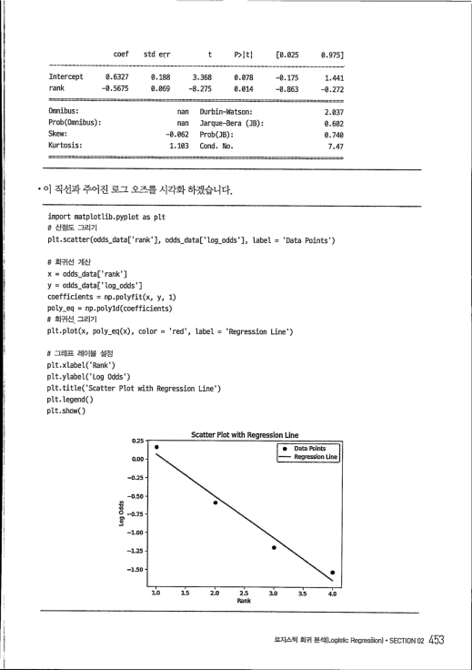
coef std err t P>It1 [0.025 0.975] Intercept 0.6327 0.188 3.368 0.078 -0.175 1.441 rank -0.5675 0.069 -8.275 0.014 -0.863 -0.272 --.---.---- ===------------------.----------- --------- -------------.--------- 0mnibus:

nan Durbin-Watson:

2.037 Prob(Omnibus):

nan .Jarque-Bera (JB):

0.602 Skew:

-0.062 Prob(JB):

0.740 Kurtosis:

1.103 Cond. No.

7.47

- 이 직선과 주어진 로그 오즈를 시각화 하겠습니다．
```python
import matplotl.ib.pyplot as pit 
# 산점도 그리기 
plt.scatter(odds. data[ 'rank'] , adds-data['log_odds'] , label = 'Data Points')
# 회귀선 계산
x = odds..data[ 'rank']
y = odds-data['iog._odds'] 
coefficients = np.polyfit(x, y, 1) 
poiy_eq = np.polyld(coefficients) 
# 회귀선 그리기 
pLt.plot(x, poly_eq(x), color = 'red', label = 'Regression Line')
```
# 그래프 레이블 설정 
plt.xlabel( 'Rank') plt.ylabel(' Log Odds') plt.title('Scatter Plot with Regression Line') pit. legend() plt.show() Scatter Plot with Regression Line 〔》．25 0.00 - -(L25 .

－窈50 떽 섬 끙 긍 ㅢ 沾 .

1 i 4 10 1.5 2.0 2.5 Rank 3.0 3.5 4.0 로지스틱 회귀 분석（Logistic Regresion) . SECTION 02 453

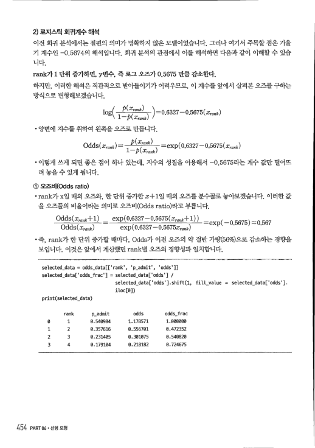
2) 로지스틱 회귀계수 해석 이전 회귀 분석에서는 절펀의 의미가 명확하지 않은 모델이었습니다 . 그러나 여기서 주목할 점은 기울 기 계수인 -0.5674의 해석입니다 . 회귀 분석의 관점에서 이를 해석하면 다음과 같이 이해할 수 있습 니다． rank가 1 단위 증가하면 , y변수 , 즉 로그 오즈가 0.5675 만큼 감소한다． 하지만 , 이러한해석은 직관적으로 받아들이기가 어려우므로 , 이 계수를 앞에서 살펴본 오즈를구하는 방식으로 변형해보겠습니다．

# log( : P('『n익 ) = 0.6327- 0.5675(Xrank)
1P(Xrank)

- 양변에 지수를 취하여 왼쪽을 오즈로 만듭니다．
P (Xrank OddS Odd5 6327 」8* exp n

- 5675
- 이렇게 쓰게 되면 좋은 점이 하나 있는데 , 지수의 성질을 이용해서 -0.5675라는 계수 값만 떨어뜨
려 놓을 수 있게 됩니다． ① 오즈비（0dds ratio)

- rank가 x일 때의 오즈와 , 한 단위 증가한 x+1일 때의 오즈를 분수꼴로 놓아보겠습니다 . 이러한 값 
을 오즈들의 비율이라는 의미로 오즈비（0dds ratio）라고 부릅니다．

### rank+1))
6327- OddS 5675 exp uclasIxrank) exp U.biZ1 - U.bb'r bXrank)

- 즉 , rank가 한 단위 증가할 때마다 , Odds가 이전 오즈의 약 절반 가량（56%）으로 감소하는 경향을
보입니다 . 이것은 앞에서 계산했던 rank별 오즈의 경향성과 일치합니다 .

```python
selected_data = odds_data[['rank', ' p_admit', ' odds 'l] 
selected_data['odds_frac 'l = selected_data[ 'odds 'J / 
selected_data[ 'odds'] .shift(1, fill_ value = sel.ected_data['odds'] . 
iloc[OJ) 
print(selected- data)
```
rank p_admit odds odds_f rac 0 1 0.540984 1.178571 1.000000 1 2 0.357616 0.556701 0.472352 2 3 0.231405 0.301075 0.540820 3 4 0.179104 0.218182 0.724675 454 PART 06．선형모형

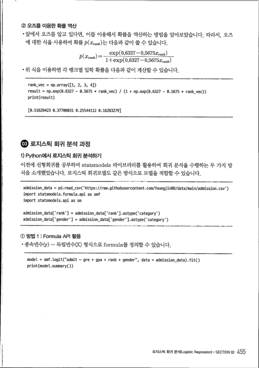
② 오즈를 이용한 확률 역산 ' 앞에서 오즈를 알고 있다면 , 이를 이용해서 확률을 역산하는 방법을 알아보았습니다. 따라서 , 오즈 에 대한 식을 사용하여 확률)5 (Xrank）는 다음과 같이 쓸 수 있습니다． 6327 5675Xrank exp 夕 1+ exp 5675Xrank) ' 위 식을 이용하면 각 랭크별 입학 확률을 다음과 같이 계산할 수 있습니다．

```python
rank_vec = np.array([1, 2, 3, 4]) 
result = np.exp(0.6327 - 0.5675 * rank_vec) / (1 + np.exp(0.6327 - 0.5675 * rank_vec)) 
print(result)
```
[0.51629423 0.37700031 0.25544112 0.16283279] .

로지스탁 회귀 분석 과정 1) Python에서 로지스틱 회귀 분석하기 이전에 선형회귀를 공부하며 statsmodels 라이브러리를 활용하여 회귀 분적을 수행하는 두 가지 방 식을 소개했었습니다 . 로지스틱 회귀모델도 같은 방식으로 모델을 적합할 수 있습니다．

```python
admission_data = pd.read_csv('https://raw.githubusercontent.com/YoungjinBD/data/niain/admissjon.csv ') 
import statsmodels.formula.api as smf 
import statsmodels.api as sm
```
admission_data[' rank '] = admission_data[ 'rank '] .astype( ' category') adniission_data['gender'] = admission_data[ 'gender'] .astype('category') ① 방법 1 : Form미a API 활용 ' 종속변수（r) ∼ 독립변수（지 형식으로 formula를 정의할 수 있습니다．

```python
model = smf.logit("admit ∼ gre + gpa + rank + gender", data = adniission_data).fitQ 
print(model.summaryQ)
```
로지스틱 회귀 분석（Logistic Regression) . SECTION 02 455

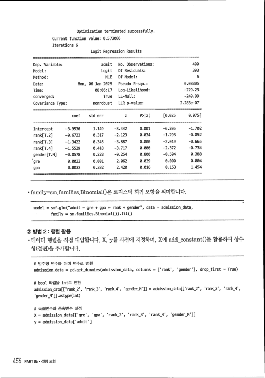
Optimization terminated successfull.y.

Current function value: 0.573066 Iterations 6 Logit Regression Results Dep. Variable:

admit No. Observations:

400 Model:

Logit Df Residuals:

393 Method:

MLE Df Model:

6 Date:

Mon, 06 Jan 2025 Pseudo R-squ.:

0.08305 Time:

08:06:17 Log-Likelihood:

-229.23 converged:

True LL-Null:

-249.99 Covariance Type:

nonrobust LLR p-value:

2.283e-07 coef std err z P>IzI [0.025 0.975] Intercept -3.9536 1.149 -3.442 0.001 -6.205 -1.702 rank[T.2] -0.6723 0.317 -2.123 0.034 -1.293 -0.052 ranktT.3] -1.3422 0.345 -3.887 0.000 -2.019 -0.665 rank[T.4] -1.5529 0.418 -3.717 0.000 -2.372 -0.734 gender[T.M] -0.0578 0.228 -0.254 0.800 -0.504 0.388 'gre 0.0023 0.001 2.062 0.039 0.000 0.004 gpa 0.8032 0.332 2.420 0.016 0.153 1.454

- family=sm.families.Binomial(）은 로지스틱 회귀 모형을 의미합니다．
```python
model = snif.glm("admit ` gre + gpa + rank + gender", data = admission_data,
family = sm.families.BinomialQ) .fitQ
```
② 방법 2 : 행렬 활용

- 데이터 행렬을 직접 대입합니다 . x, y를 사전에 지정하며 , x에 add_constant(）를 활용하여 상수
항（절펀）을 추가합니다．

```python
# 범주형 변수를 더미 변수로 변환
admission_data = pd.get_dummies(admission_data, columns = [ 'rank', 'gender '] , drop_first = True)
# bool 타입을 mnt로 변환
```
admission_data[[' rank_2 ', ' rank_3', 'rank_4', ' gender_M ' 끄 = admission_data[[ ' rank_2 ' 』 'rank_3 ', ' rank_4', ' gender_M ' ]].astype(int)

```python
# 독립변수와 종속변수 설정
X = admission_data[[ 'gre', 'gpa ', ' rank_2 ', ' rank_3 ', ' rank_4 ', 'gender_M '] ]
y = admission_data[ 'adrnit']
```
456 PART 06·선형모형

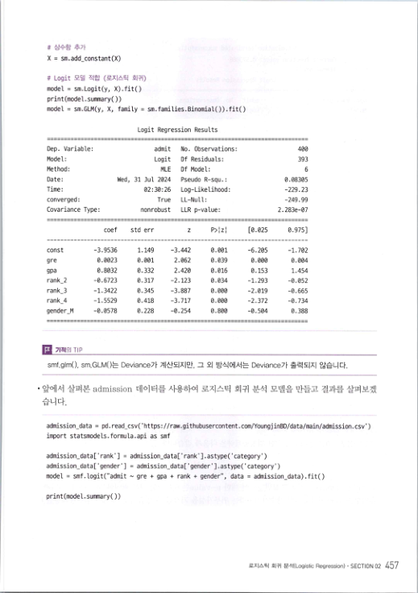
```python
# 상수항 추가
X = sm.add_constant(X)
# Logit 모델 적합 （로지스틱 회귀）
model = sm.Logit(y, X).fit () 
print(model. summary())
model = sm.GLM(y, X, family = sm. families.BinomialQ).fit ()
```
Logit Regression Results Dep. Variable:

admit No. Observations:

400 Model:

Logit Df Residuals:

393 Method:

MLE Of Model:

6 Date:

Wed, 31 Jul 2024 Pseudo R-squ. :

0.08305 Time:

02:30:26 Log-Likelihood:

-229. 23 converged:

True LL-Null:

-249.99 Covariance Type:

nonrobust LLR p-value:

2.283e-07 coef std err z P> lz) [0.025 0.975] const -3.9536 1.149 -3.442 0.001 -6.205 -1.702 gre 0.0023 0.001 2.062 0.039 0.000 0.004 gpa 0.8032 0.332 2.420 0.016 0.153 1.454 rank 2 -0.6723 0.317 -2.123 0.034 -1.293 -0.052 rank 3 -1.3422 0.345 -3.887 0.000 -2.019 -0.665 rank 4 -1.5529 0.418 -3.717 0.000 -2.372 -0.734 gender_M -0.0578 0.228 -0.254 0.800 -0.504 0.388 .

기적의 TIP smt. 이mO, sm.GLM(）는 Deviance가 계산되지만 . 그 외 방식에서는 Deviance가 출력되지 않습니다．

- 앞에서 살펴본 admission 데이터를 4용하여 로지스틱 회귀 분석 모델을 만들고 결과를 살펴보겠
습니다．

```python
admission_data = pd.read_csv( 'https://raw.githubusercontent.com/YoungjinBD/data/main/admission.csv' ) 
import statsmodels. formula.api as smf
admission_data[ ' rank'] = admission_data[ ' rank'] .astype( 'category' ) 
admission_data[ 'gender'] = admission_data[ 'gender'] .astype( 'category') 
model = smf.logit( 'admit ` gre + gpa + rank + gender", data = admission_data).fit ()
print(model.summaryO)
```
로지스틱 회귀 분석（Logistic Regression) . SEC지0N02 457

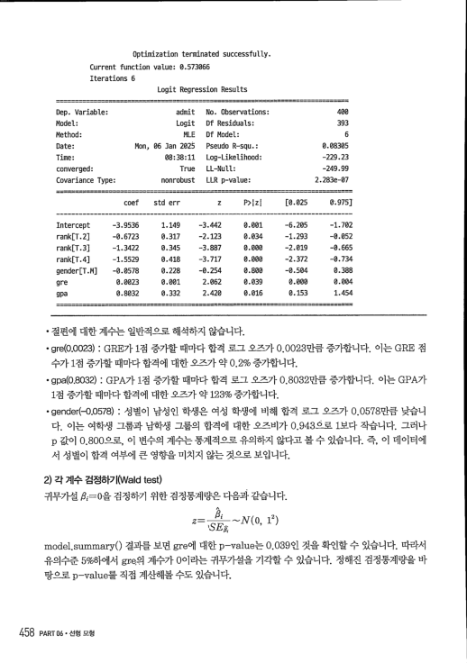
Optimization terminated successfully.

Current function value: 0.573066 Iterations 6 Logit Regression Results Dep. Variable:

admit No. Observations:

400 0f Residuals:

393 Model:

Logit Method:

MLE Date:

Mon, 06 3an 2025 Df Model:

6 Pseudo R-squ.:

0.08305 Log-Likelihood:

-229.23 LL-Null:

-249.99 Time:

08:38:11 converged:

True LLR p-value:

2.283e-07 Covariance Type:

nonrobust coef std err z P>1zI [0.025 0'.975]' Intercept -3.9536 1.149 -3.442 0.001 -6.205 -1.702 rankEl.2] -0.6723 0.317 -2.123 0.034 -1.293 -0.052 rank[T.3] -1.3422 0.345 -3.887 0.000 -2.019 -0.665 rank{T.4] -1.5529 0.418 -3.717 0.000 -2.372 -0.734 gender[T.M] -0.0578 0.228 -0.254 0.800 -0.504 0.388 gre 0.0023 0.001 2.062 0.039 0.000 0.004 gpa 0.8032 0.332 2.420 0.016 0.153 1.454

- 절편에 대한 계수는 일반적으로 해석하지 않습니다．
- gre(0.0023) : GRE가 1점 증가할 때마다 합격 로그 오즈가 0.0023만큼 증가합니다 . 이는 GRE 점
수가 1점 증가할 때마다 합격에 대한 오즈가 약 0.2% 증가합니다．

- gpa(O.8032) : GPA가 1점 증가할 때마다 합격 로그 오즈가 0.8032만큼 증가합니다 . 이는 GPA가
1점 증가할 때마다 합격에 대한 오즈가 약 123% 증가합니다．

- gender(-O.0578) : 성별이 남성인 학생은 여성 학생에 비해 합격 로그 오즈가 0.0578만큼 낮습니
다 . 이는 여학생 그룹과 남학생 그룹의 합격에 대한 오즈비가 0.943브로 1보다 작습니다 . 그러나 p 값이 0.800으로 , 이 변수의 계수는통계적으로 유의하지 않다고 볼 수 있습니다 . 즉 , 이 데이터에 서 성별이 합격 여부에 큰 영향을 미치지 않는 것으로 보입니다． 2) 각 계수 검정하기（Wald test) 귀무가설 βi= 0을 검정하기 위한 검정통계량은 다음과 같습니다．

## βf  
, ' 뒤8꽈 -N(0, 1 ') model. summary() 결과를 보면 gre에 대한 p-value는 0.039인 것을 확인할 수 있습니다 . 따라서 유의수준 5％하에서 gre．의 계수가 0이라는 귀무가설을 기각할 수 있습니다 . 정해진 검정통계량을 바 탕으로 p-value를 직접 계산해볼 수도 있습니다． 458 PART06＊선형모형

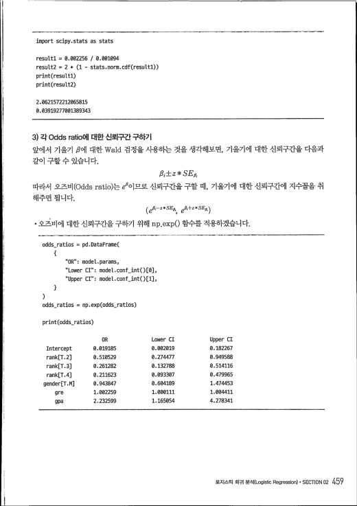
```python
import scipy.stats as stats
resul.tl = 0.002256 / 0.001094 
resul.t2 = 2 * (1 - stats.norm.cdf(resultl)) 
print(resultl) 
print(re5u1t2)
```
2.0621572212065815 0.03919277001389343 3) 각 0dds ratio에 대한 신뢰구간 구하기 앞에서 기울기 β에 대한￦aid 검정을 사용하는 것을 생각해보면 , 기울기에 대한 신뢰구간을 다음과 같이 구할 수 있습니다． f3土z* SEβ룔 따라서 오즈비（0dds ratio）는 eβ이므로 신뢰구간을 구할 때 , 기울기에 대한 신뢰구간에 지수꼴을 취 해주면 됩니다．

* SEfi, , eβ' 
* SEβ
- 오즈비에 대한 신뢰구간을 구하기 위해 up. exp() 함수를 적용하겠습니다．
```python
odds_ratios = pd.DataFrame( 
{
```
"OR": model..params, "Lower CI' : model.conf_intQ[0J, "Upper CI": model.conf_intQ[1], }

```python
odds_ratios = np.exp(odds_ratios)
print(odds_ratios)
```
OR Lower CI Upper CI Intercept 0.019185 0.002019 0.182267 rank{T.2] 0.510529 0.274477 0.949588 rank[T.3J 0.261282 0.132788 0.514116 rank[T.4] 0.211623 0.093307 0.479965 genderEl.M] 0.943847 0.604189 1.474453 gre 1.002259 1.000111 1.004411 gpa 2.232599 1.165054 4.278341 로지스틱 회귀 분석（Logistic Regression) . SECTION 02 459

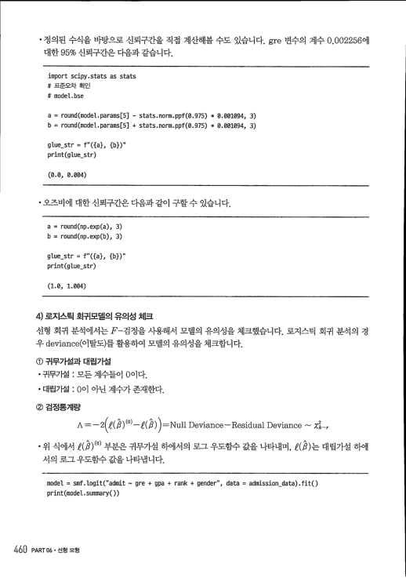
- 정의된 수식을 바탕으로 신뢰구간을 직접 계산해볼 수도 있습니다 . gre 변수의 계수 0.002256에 
대한 95% 신뢰구간은 다음과 같습니다．

```python
import scipy.stats as stats 
# 표준오차 확인
# model.bse
a = round(model.params[5] - stats.norm.ppf(0.975) * 0.001094, 3) 
b = round(model.params[5] + stats.norm.ppf(0.975) * 0.001094, 3)
gLue_str = f '({a}, {b})' 
print(gl.ue_str)
```
(0.0, 0.004)

- 오즈비에 대한 신뢰구간은 다음과 같이 구할 수 있습니다．
```python
a = round(np.exp(a), 3) 
b = round(np.exp(b), 3)
glue_str = f '({a}, {b})" 
print(glue_str)
```
(1.0, 1.004) 4) 로지스틱 회귀모델의 유의성 체크 선형 회귀 분적에서는 ／구－검정을 사용해서 모델의 유의성을 쳬크했습니다 . 로지스틱 회귀 분석의 경 우 deviance（이탈도）를 활용하여 모델의 유의성을 체크합니다． ① 귀무가설과 대립가설

- 귀무가설 : 모든 계수들이 0이다．
- 대립가설 : 0이 아닌 계수가 존재한다．
② 검정통계량

```python
A = - 2( ( ) ( ") -2(力)) = Null Deviance-Residual Deviance∼／L,
```
- 위 식에서 .e(力)(o) 부분은 귀무가설 하에서의 로그우도함수 값을 나타내며 , 祚）는 대립가설 하에
서의 로그 우도함수 값을 나타냅니다．

```python
model = smf.1.ogit( "admit " gre + gpa + rank + gender", data = admission_data).fit () 
print(model.summaryQ)
```
460 PART 06.선형모형

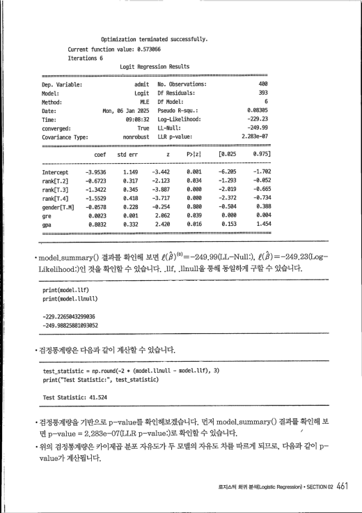
Optimization terminated successfully.

Current function value: 0.573066 Iterations 6 Logit Regression Results Dep. Variable:

admit No. Observations:

400 Model:

Logit Df Residuals:

393 Method:

MLE Of Model:

6 Date:

Mon, 06 Jan 2025 Pseudo R-squ.:

0.08305 Time:

09:08:32 Log-Likelihood:

-229.23 converged:

True LL-Nu1.l:

-249.99 Covariance Type:

nonrobust LLR p-value:

2.283e-07 coef std err z P>1zI [0.025 0.975] Intercept -3.9536 1.149 -3.442 0.001 -6.205 -1.702 rank[T.2] -0.6723 0.317 -2.123 0.034 -1.293 -0.052 rank[T.3] -1.3422 0.345 -3.887 0.000 -2.019 -0.665 rank[T.4] -1.5529 0.418 -3.717 0.000 -2.372 -0.734 gender[T.MJ -0.0578 0.228 -0.254 0.800 -0.504 0.388 gre 0.0023 0.001 2.062 0.039 0.000 0.004 gpa 0.8032 0.332 2.420 0.016 0.153 1.454

- model. summary() 결과를 확인해 보면 ￡（力)(o)= -249.99(LL-Null:), 祚) =-249.23(Log-
Likelihood:）인 것을확인할수 있습니다 . .llf, .llnull을통해 동일하게 구할수 있습니다．

```python
print(model. llf) 
print(model. lthull)
```
-229.2265043299036 -249.98825881093052

- 검정통계량은 다음과 같이 계산할 수 있습니다．
```python
test_statistic = np.round(-2 * (model.llnull - niodel.Llf), 3) 
print("Test Statistic: " , test_statistic)
```
Test Statistic: 41.524

- 검정통계량을 기반으로 p-value를 확인해보겠습니다 . 먼저 model. summary() 결과를 확인해 보
면 p-value = 2.283e-07(LLR p-value:）로 확인할 수 있습니다． /

- 위의 검정통계량은 카이제곱 분포 자유도가 두 모델의 자유도 차를 따르게 되므로 , 다음과 같이 p-
value가 계산됩니다． 로지스틱 회귀 분석（Logistic Regression) . SECTION 02 4시

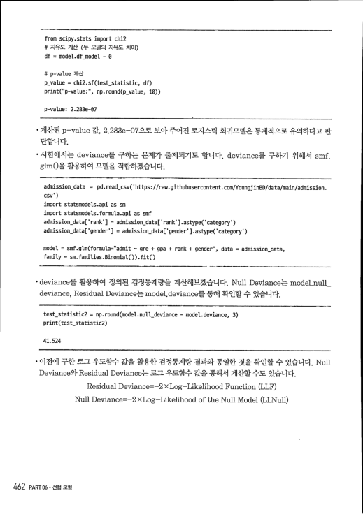
```python
from scipy.stats import ch12 
# 자유도 계산 （두 모델의 자유도 차이） 
df = model.df model - 0
# p-value 계산
p_value = chi2.sf(test_statistic, df) 
print("p-value:", np.round(p-value, 10))
```
p-value: 2. 283e-07 ' 계산된 p-value 값 , 2,283e-07으로 보아 주어진 로지스틱 회귀모델은 통계적으로 유의하다고 판 단합니다． ' 시험에서는 deviance를 구하는 문제가 출제되기도 합니다 . deviance를 구하기 위해서 smf.

glm(）을 활용하여 모델을 적함하겠습니다．

```python
admission_data = pd. read-csv('https://raw.githubusercontent.com/youngjjnBD/data/majn/admission. 
csv') 
import statsmodels.api as sm 
import statsmodels.formula.api as smf 
admission- data[' rank'] = admission-data[ 'rank'] .astype('category') 
admission_data[ 'gender'] = admission- data[ 'gender'] .astype('category')
model = smf.glm(formul.a="admit - gre + gpa + rank + gender', data = admission_data, 
family = sm.families.Binomial.Q) .fit ()
```
- deviance를 활용하여 정의된 검정통계량을 계산해보겠습니다 . Null Deviance는 model, null 
deviance, Residual Deviance는 model, deviance를 통해 확인할 수 있습니다．

```python
test-statistic2 = np.round(model..nul.l- deviance - model..deviance, 3) 
print(test_statistic2)
```
41.524 ' 이전에 구한 로그 우도함수 값을 활용한 검정통계량 결과와 동일한 것을 확인할 수 있습니다 . Null Deviance와 Residual Deviance는 로그 우도함수 값을 통해서 계산할 수도 있습니다． Residual Deviance=-2 X Log-Likelihood Function (LLF) Null Deviance=-2 xLog-Likelihood of the Null Model (LLNull) 462 PART 06．선형모형

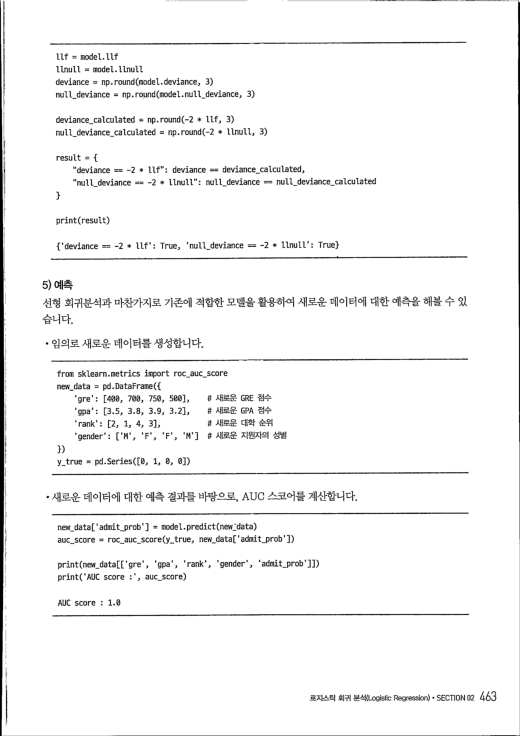
```python
Uf = model.llf
```
11.nul.l = niodel.llnuU

```python
deviance = np.round(model.deviance, 3) 
null- deviance = np.round(niodel.null_deviance, 3)
deviance_calculated = np.round(-2 * Uf, 3) 
null_deviance_calculated = np.round(-2 * llnull, 3)
result = { 
" deviance == -2 * 11f ': deviance == deviance_calculated, 
"null_deviance == -2 * Unull": null_deviance == null_deviance_calculated
print(result)
```
{'deviance == -2 * 11f ': True, ' nu11_deviance == -2 * llnull ' : True} 5）예측 선형 회귀분적과 마찬가지로 기존에 적합한 모델을 활용하여 새로운 데이터에 대한 예측을 해볼 수 있 습니다．

- 임의로 새로운 데이터를 생성합니다．
```python
from sklearn.metrics import roc_auc_score
new_data = pd.DataFrame({
' gre ' : [400, 700, 750, 500], 
# 새로운 GRE 점수
' gpa ' : [3.5, 3.8, 3.9, 3.2], 
# 새로운 GPA 점수
' ra마C: [2, 1, 4, 3], 
# 새로운 대학 순위
```
' gender ': ['M', ' F', ' F ', 'M']

# 새로운 지원자의 성별 
}) y_true 볍 pd.Series([0, 1, 0, 0])

- 새로운 데이터에 대한 예측 결과를 바탕으로 , AUC 스코어를 계산합니다．
new_data[ ' admit_prab ' ] = model. predict (newdata)

```python
auc_score = roc_auc_score(y_true, new_data[ 'admit_prob'] )
print(new_data[['gre ', ' gpa ', prank ', 'gender', 'admit_prob'] ])
print(AUC score :', auc_score)
```
AUC score : 1.0 로지스틱 회귀 분석（Logistic Regression) . SECTION 02 463

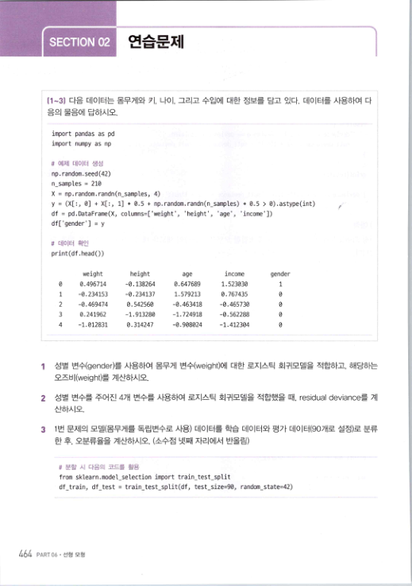
(1-3) 다음 데이터는 몸무게와 키 , 나이 , 그리고 수입에 대한 정보를 담고 있다 . 데이터를 사용하여 다 음의 물음에 답하시오．

```python
import pandas as pd 
import numpy as np
# 예제 데이터 생성 
np. random.seed(42)
n_samples = 210
X = np.random. randn(n_samples, 4)
y = (XE:, 0] + XE:, 1] * 0.5 + np.random.randn(n_samples) * 0.5 > 0).astype(int) 
df = pd.DataFrame(X, columns=['weight ', 'height' , ' age' , 'income'] ) 
df[ 'gender '] = y
# 데이터 확인 
print(df.headQ)
```
weight height age income gender 0 0.496714 -0.138264 0.647689 1.523030 1 1 -0.234153 -0.234137 1.579213 0.767435 0 2 -0.469474 0.542560 -0.463418 -0.465730 0 3 0.241962 -1.913280 -1.724918 -0.562288 0 4 -1.012831 0.31424] -0.908024 -1.412304 0 I 성별 변수（gender）를 사용하여 몸무게 변수（wet아it）에 대한 로지스틱 회귀모델을 적합하고 , 해당하는 오즈비（wet아it）를 계산하시오． 2 성별 변수를 주어진 4개 변수를 사용하여 로지스틱 회귀모델을 적합했을 때 , residual deviance를 계 산하시오． 3 1번 문제의 모델（몸무게를 독립변수로 사용） 데이터를 학습 데이터와 평가 데이터（90개로 설정）로 분류 한 후 , 오분류율을 계산하시오 . （소수점 넷째 자리에서 반올림）

```python
# 분할 시 다음의 코드를 활용
from sklearn.model_selection import train_test_split 
df_train, df_test = train_test_split(df, test_size=90, random_state=42)
```
464 PART 06 . 선형 모형

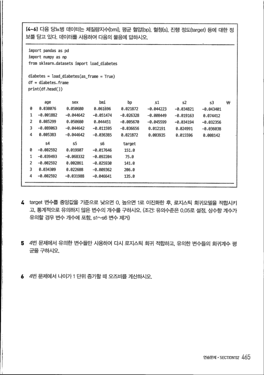
(4-6] 다음 당뇨병 데이터는 체질량지수（bmi) , 평균 혈압（bp) , 혈청（s) , 진행 정도（target) 등에 대한 정 보를 담고 있다 . 데이터를 사용하여 다음의 물음에 답하시오．

```python
import pandas as pd 
import numpy as np 
from sklearn.datasets import load_diabetes
diabetes = load_diabetes(asjranie = True) 
df = diabetes.frame 
print(df.headQ)
```
age sex bmi bp , si s2 s3 W 0 0.038076 0.050680 0.061696 0.021872 -0.044223 -0.034821 -0.043401 1 -0.001882 -0.044642 -0.051474 -0.026328 -0.008449 -0.019163 0.074412 2 0.085299 0.050680 0.044451 -0.005670 -0.045599 -0.034194 -0.032356 3 -0.089063 -0.044642 -0.011595 -0.036656 0.012191 0.024991 -0.036038 4 0.005383 -0.044642 -0.036385 0.021872 0.003935 0.015596 0.008142 s4 s5 s6 target 0 -0.002592 0.019907 -0.017646 151.0 1 -0.039493 -0.068332 -0.092204 75.0 2 -0.002592 0.002861 -0.025930 141.0 3 0.034309 0.022688 -0.009362 206.0 4 -0.002592 -0.031988 -0.046641 135.0 4 target 변수를 중앙값을 기준으로 낮으면 0 , 높으면 1로 이진화한 후 , 로지스틱 회귀모델을 적합시키 고 , 통계적으로 유의하지 않은 변수의 개수를 구하시오 . （조건： 유의수준은 0 .05로 설정 , 상수항 계수가 유의할 경우 변수 개수에 포함 , s1"-'s6 변수 제거） 5 4번 문제에서 유의한 변수들만 사용하여 다시 로지스틱 회귀 적합하고 , 유의한 변수들의 회귀계수 평 균을 구하시오． 6 4번 문제에서 나이가 1 단위 증가할 때 오즈비를 계산하시오． 연습푼저I ,SECTIDN"02』 昉5

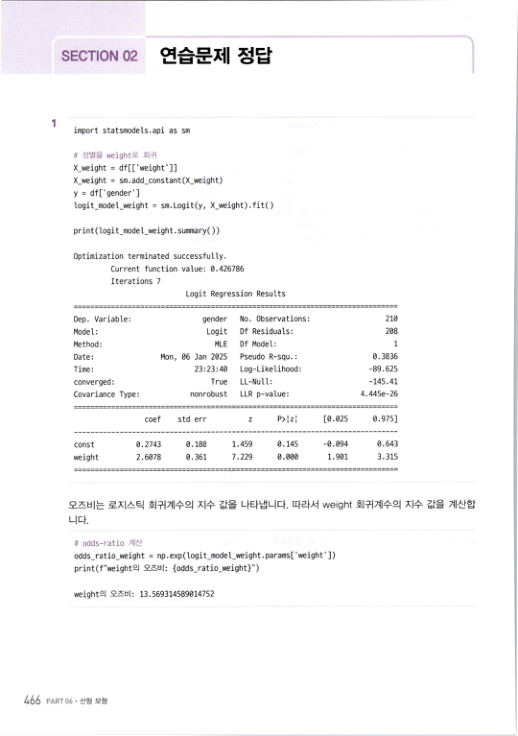
## SECTION 02 
연습문제 정답

```python
import statsmodels.api as sm
# 성별을 weight로 회귀
X_weight = df[[ 'weight '] ]
X_weight = sm.add_constant(X_weight)
y = df[ 'gender'] 
logit_model_weight = sm.Logit(y, X_weight).fit ()
print(logit_model_weight.summaryO)
```
Optimization terminated successfully.

Current function value: 0.426786 Iterations 7 Logit Regression Results Dep. Variable:

gender No. Observations:

210 Model:

Logit Df Residuals:

208 Method:

MLE Df Model:

1 Date:

Mon, 06 Jan 2025 Pseudo R-squ.:

0.3836 Time:

23:23:40 Log-Likelihood:

-89.625 converged:

True LL-Null:

-145.41 Covariance Type:

nonrobust LLR p-value:

4.445e-26 coef std err z P>lzI [0.025 0.975] const 0.2743 0.188 1.459 0.145 -0.094 0.643 weight 2.6078 0.361 7.229 0.000 1.901 3.315 오즈비는 로지스틱 회귀계수의 지수 값을 나타냅니다 . 따라서 weight 회귀계수의 지수 값을 계산합 니다．

```python
# odds-ratio 계산
odds_ratio_weight = np.exp(logit_model_weight.params[ 'weight '] ) 
print(f " weight의 오즈비： {odds_ratio_weight} ")
```
wei卯t의 오즈비： 13.569314589014752 466 PART 06，선형모형

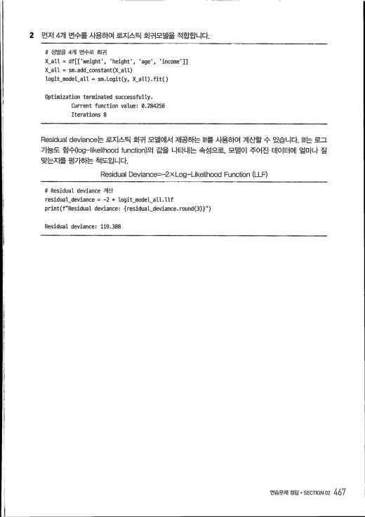
2 먼저 4개 변수를 사용하여 로지스틱 회귀모델을 적합합니다．

```python
# 성별을 4개 변수로 회귀
X_all = df{['weight', 'height', 'age', 'income'] ]
```
X_aU. = sm.add_constant(X_all.) logit_model._aU. = sm.Logit(y, X_afl).fit () Optimization terminated successfully.

Current function value: 0.284256 Iterations 8 Residual deviance는 로지스틱 회귀 모델에서 제공하는 ∥f를 사용하여 계산할 수 있습니다 . hf는 로그 가능도 함수(log-likelihood function）의 값을 나타내는 속성으로 , 모델이 주어진 데이터에 얼마나 잘 맞는지를 펑가하는 척도입니다． Residual Deviance=-2 x Log-Likelihood Function (LLF)

```python
# Residual deviance 계산 
residual_deviance = -2 * logit_model_afl.llf 
print(f"Residual deviance: {residual_deviance.round(3)}")
```
Residual deviance: 119.388 연습문제정답· SECTION 02 467

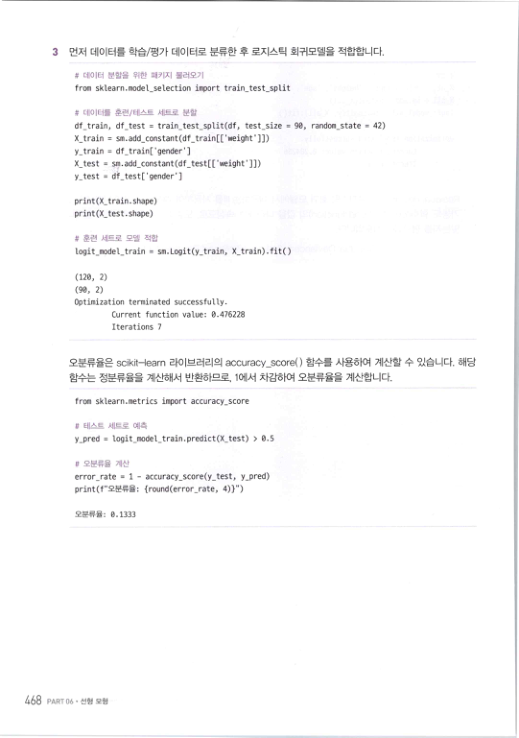
3 먼저 데이터를 학습／평가 데이터로 분류한 후 로지스틱 회귀모델을 적합합니다．

```python
# 데이터 분할을 위한 패키지 불러오기
from sklearn .model_selection import train_test_split
# 데이터를 훈련／테스트 세트로 분할
```
df_train, df_test = train_test_split(df, test_size = 90, random_state = 42)

```python
X_train = sm.add_constant(df_train[[' weight '] ])
y_train = df_train[ 'gender ']
X_test = sm.add_constant(df_test[[ 'weight' ]])
y_test = df_test[ 'gender ']
print(X_train.shape) 
print(X_test.shape)
# 훈련 세트로 모델 적합 
logit_model_train = sm.Logit(y_train, X_train) .fit ()
```
(120, 2) (90, 2) Optimization terminated successfully.

Current function value: 0.476228 Iterations 7 오분류율은 scikit-learn 라이브러리의 accuracy_score( ) 함수를 사용하여 계산할 수 있습니다 . 해당 함수는 정분류율을 계신해서 반환하므로 1에서 차감하여 오분류율을 계산합니다．

```python
from sklearn.metrics import accuracy_score
# 테스트 세트로 예측
y_pred = logit_model_train.predict(X_test) > 0.5
# 오분류율 계산 
error_rate = 1 - accuracy_score(y_test, y_pred) 
print(f " 오분류율： {round(error_rate, 4)}')
```
오분류율： 0. 1333 468 PART 06．선형모형

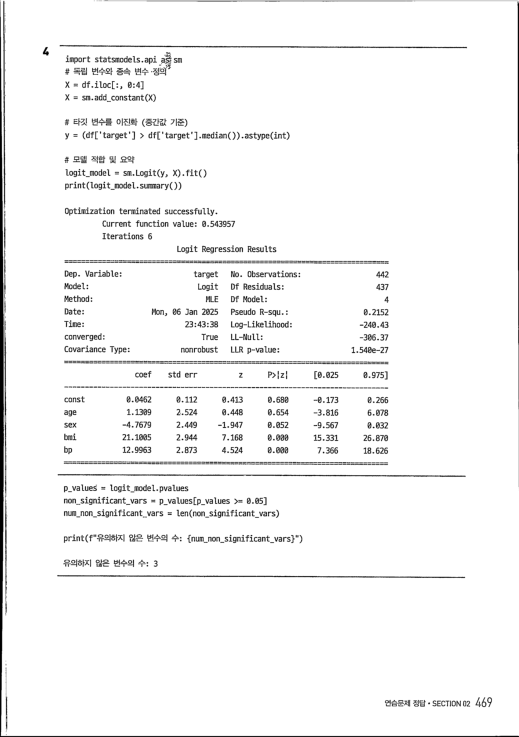
4 imp。rt statsm。dels.aDi a轝sm ∼→ 뱁 . , . 」 ∼· -- .

. . . .

- . 긴｀．擢
'

# 독립 변수와 종속 변．수 ·정．의．'
```python
X = df.iloc[:, 0:4]
X = sm.add-constant(X)
# 타깃 변수를 이진화 （중간값 기준）
y = (dfI'target'] > df[ 'target '] .medianQ).astype(int)
# 모델 적합 및 요약 
logit_niodel = sm.Logit(y, X).fit () 
print(logit_model . surnmaryQ)
```
Optimization terminated successfully.

Current function value: 0.543957 Iterations 6 Logit Regression Results Dep. Variable:

target No. Observations:

442 Model:

Logit Df Residuals:

437 Method:

MLE Of Model:

4 Date:

Non, 06 Jan 2025 Pseudo R-squ.:

0.2152 Time:

23:43:38 Log-Likelihood:

-240.43 converged:

True LL-Null:

-306.37 Covariance Type:

nonrobust LLR p-value:

1.540e-27 coef std err z P>Iz1 [0.025 0.975] const 0.0462 0.112 0.413 0.680 -0.173 0.266 age 1.1309 2.524 0.448 0.654 -3.816 6.078 sex -4.7679 2.449 -1.947 0.052 -9.567 0.032 bmi 21.1005 2.944 7.168 0.000 15.331 26.870 bp 12.9963 2.873 4.524 0.000 7.366 18.626

```python
P_values = logitjnodel..pvalues
non_significant_vars = p-values[p-values >= 0.05]
```
num.non_significant-vars = len(non_significant_vars)

```python
print(f " 유의하지 않은 변수의 수： {nurn_non_significant_va rs} ')
```
유의하지 않은 변수의 수： 3 연습문제정답· SECTION 02 469

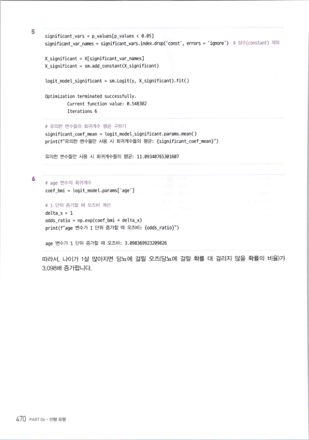
```python
5 
significant_vars = p_values[p_values < 0.05] 
significant_var_names = significant_vars.index.drop('const , errors = ' ignore ') # 상수(constant) 제외
X_significant = X[significant_var_names]
X_significant = sm. add_constant(X_significant)
logit_model_significant = sm.Logit(y, X_significant) . fit ()
```
Optimization terminated successfully.

Current function value: 0.548382 Iterations 6

```python
# 유의한 변수들의 회귀계수 평균 구하기 
significant_coef_mean = logit_model_significant.params.mean() 
print(f " 유의한 변수들만 사용 시 회귀계수들의 평균： {significant_coef_mean} ")
```
유의한 변수들만 사용 시 회귀계수들의 평균： 11.09340765301607

```python
# age 변수의 회귀계수
coef_bmi = logit_mode1 . pa rams [ ' age' ]
#1 단위 증가할 때 오즈비 계산
```
delta x = 1

```python
odds_ratio = np.exp(coef_bmi * delta_x) 
print(f 'age 변수가 1 단위 증가할 때 오즈비： {odds_ratio}')
```
age 변수가 1 단위 증가할 때 오즈비： 3. 098369923209826 따라서 , 나이가 1살 많아지면 당뇨에 걸릴 오즈（당뇨에 걸릴 확률 대 걸리지 않을 확률의 비율）가 3.098배 증가합니다． 470 PART06룔선형모형
