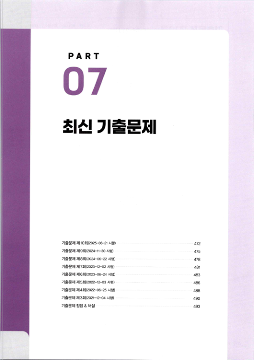
# PART 07
# 최신 기출문제
기출문제 제10회（2025-06-21 시행） 472 기출문제 제9회（2024-11-30 시행） 475 기출문제 제8회（2024-06-22 시행） 478 기출문제 제7회（2023-12-02 시행） 481 기출문제 제6회（2023-06-24 시행） 483 기출문제 제5회（2022-12-03 시행） 486 기출문제 제4회（2022-06-25 시행） 488 기출문제 제3회《2021-12-04 시행） 490 기출문제 정답 & 해설 493

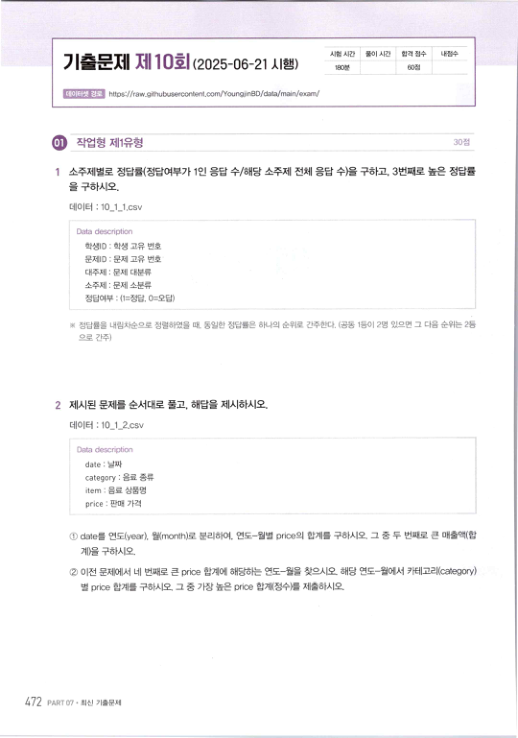
시험 시간 풀이 시간 합격 점수 내점수

## 기출문제 제10회(2025-06-21 시햄）
180 60점 ` " 1섧 j https://raw.githubusercontent.com/YoungjinBD/data/main/exam/ .I 작업형제1유형 1 소주제별로 정답률＜정답여부가 1인 응답 수／해당 소주제 전체 응답 수）을 구하고 , 3번째로 높은 정답률 을 구하시오． 데이터 : 10_1_tcsv Data description 학셍［〕 : 학생 고유 번호 문제［〕 '. 문제 고유 번호 대주제 : 문제 대분류 소주제 : 문제 소분류 정답여부 ; (1＝정답 , 0＝오답） ※ 정답률을 내림차순으로 정렬하였을 【내 . 동일한 정답률은 하나의 순위로 간주한다 . （공동 1등이 2명 있으면 그 다음 순위는 2등 으로 간주） 2 제시된 문제를 순서대로 풀고 , 해답을 제시하시오． 데이터 : 10_1_2.csv Data description date : 날짜 category : 음료 종류 item : 음료 상품명 price : 판매 가격 ①date를 연도（year) , 월（month）로 분리하여 . 연도월별 price의 합계를 구하시오 . 그 중 두 번째로 큰 매출액（합 계）을 구하시오． ② 이전 문제에서 네 번째로 큰 price 합계에 해당하는 연도－월을 찾으시오 . 해당 연도－월에서 카테고리（category) 별 price 합계를 구하시오 . 그 중 가장 높은 price 합계（정수）를 제출하시오． 472 PART 07 ' 최신 기출문저

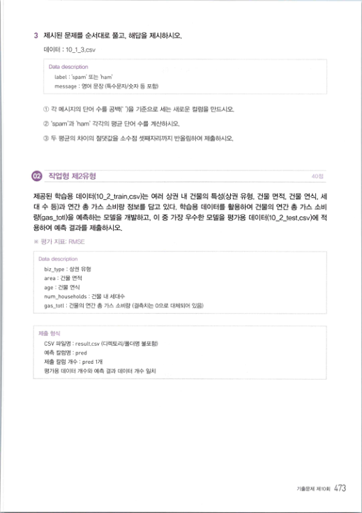
3 제시된 문제를 순서대로 풀고 , 해답을 제시하시오． 데이터 : 10_1_3.csv Data description labeL : spam' 또는 ,am message : 영어 문장 （특수문자／숫자 등 포함） (j:) 각 메시지의 단어 수를 공백（ " ）을 기준으로 세는 새로운 컬럼을 만드시오． (2) 'spam ' 과 ' ham ' 각각의 펑균 단어 수를 계산하시오． ③ 두 평균의 차이의 절댓값을 소수점 셋째자리까지 반올림하여 제출하시오． .

작업형제2유형 40첨 제공된 학습용 데이터（10_2_train.csv）는 여러 상권 내 건물의 특성（상권 유형 , 건물 면적 , 건물 연식 , 세 대 수 등）과 연간 총 가스 소비량 정보를 담고 있다 . 학습용 데이터를 활용하여 건물의 연간 총 가스 소비 량（gas- toti）을 예측하는 모델을 개발하고 , 이 중 가장 우수한 모델을 평가용 데이터（10_2_test.csv）에 적 용하여 예측 결과를 제출하시오． ※ 평가 지표： RMSE Data description biz_type : 상권 유형 area : 건물 면적 age : 건물 연식 num households : 건물 내 세대수 gas_totl : 건물의 연간 총 가스 소비량 （결측치는 0으로 대체되어 있음） 제출 형식 csv 파일명 : result.csv （디렉토리／폴더명 불포함） 예측 칼럼명 : preci 제출 칼럼 개수 : pred 1개 평가용 데이터 개수와 예측 결과 데이터 개수 일치 기출문제 제10회 473

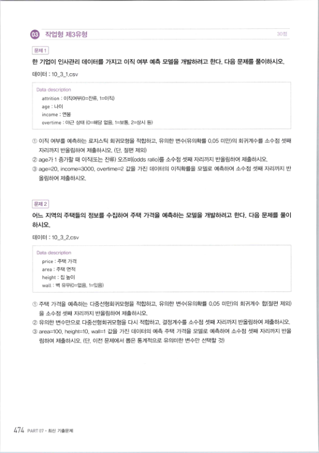
.

작업형제3유형 30점 문제 1 한 기업이 인사관리 데이터를 가지고 이직 여부 예측 모델을 개발하려고 한다 . 다음 문제를 풀이하시오． 데이터 : 10 3 1.csv Data description attrition : 이직여부《0＝잔류 , 1＝이직） age : 나이 income : 연봉 overtime ; 야근 상태 (0＝해당 없음 , 1＝보통 . 2＝상시 등＞ ① 이직 여부를 예측하는 로지스틱 회귀모형을 적합하고 , 유의한 변수《유의확률 0.05 미만）의 회귀계수를 소수점 셋째 자리까지 반올림하여 제출하시오 . （단 , 절편 제외） ②age가 1 증가할 때 이직（또는 잔류） 오즈비（odds ratio）를 소수점 셋째 자리까지 반올림하여 제출하시오． ③age=20, income=3000. overtime=2 값을 가진 데이터의 이직확률을 모델로 예측하여 소수점 셋째 자리까지 반 올림하여 제출하시오． 문제 2 어느 지역의 주택들의 정보를 수집하여 주택 가격을 예측하는 모델을 개발하려고 한다 . 다음 문제를 풀이 하시오． 데이터 : 10 3 2 .csv Data description price : 주택 가격 area : 주택 면적 height : 집 높이 waR : 벽 유무（0＝없음 , 1＝있음） ① 주택 가격을 예측하는 다중선형회귀모형을 적합하고 , 유의한 변쉬유의확률 0 .05 미만）의 회귀계수 합（절편 제외） 을 소수점 셋째 자리까지 반올림하여 제출하시오． ② 유의한 변수만으로 다중선형회귀모형을 다시 적합하고， 결정계수를 소수점 셋째 자리까지 반올림하여 제출하시오 ③area=100, height=10. wall=l 값을 가진 데이터의 예측 주택 가격을 모델로 예측하여 소수점 셋째 자리까지 반올 림하여 제출하시오 . （단 , 이전 문제에서 뽑은 통계적으로 유의미한 변수만 선택할 것） 474 PART 07 . 최신 기출문제

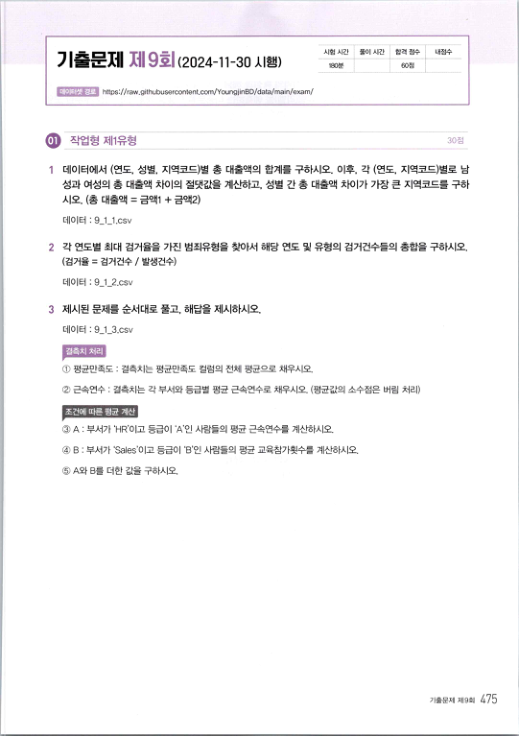
시험 시간 풀이 시간 합격 점수 내점수 h 18(》분 60점

## 기출문제 제9회（2024-11-30 시햄）
https://raw.githubusercontent.com/YoungjinBD/data/main/exam/ .

작업형제1유형 J팝 1 데이터에서 （연도 , 성별 , 지역코드）별 총 대출액의 합계를 구하시오 . 이후 , 각 （연도 , 지역코드）별로 남 성과 여성의 총 대출액 차이의 절댓값을 계산하고 , 성별 간 총 대출액 차이가 가장 큰 지역코드를 구하 시오 . （총 대출액 = 금액1 + 금액2) 데이터 : 9-1_1.csv 2 각 연도별 최대 검거율을 가진 범죄유형을 짖아서 해당 연도 및 유형의 검거건수들의 총합을 구하시오． （검거율 = 검거건수 / 발생건수） 데이터 : 9 1 2 .csv 3 제시된 문제를 순서대로 풀고 , 해답을 제시하시오． 데이터 : 9_1_3.csv 결측치 처리 ① 평균만족도 : 결측치는 평균만족도 컬럼의 전체 펑균으로 채우시오． ② 근속연수 : 결측치는 각 부서와 등급별 펑균 근속연수로 채우시오 . （평균값의 소수점은 버림 처리） 조건에 따른 평균 계산 ③ A : 부서가 ' HR ' 이고 등급이 ' A’인 사람들의 펑균 근속연수를 계산하시오． ④ B : 부서가 ' Sales ' 이고 등급이 ' B ' 인 사람들의 평균 교육참가횟수를 계산하시오． ⑤ A와 B를 더한 값을 구하시오． 기출문제제9회 475

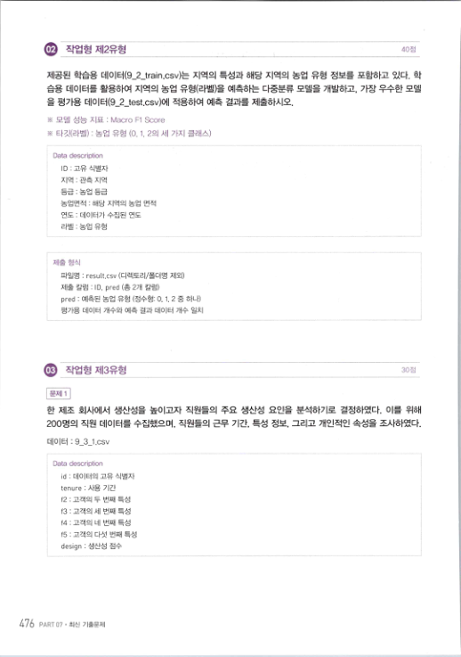
40점 제공된 학습용 데이터（9_2_train.csv）는 지역의 특성과 해당 지역의 농업 유형 정보를 포함하고 있다 . 학 습용 데이터를 활용하여 지역의 농업 유형（라벨）을 예측하는 다髓류 모델을 개발하고 , 가장 우수한 모델 을 평가용 데이터（9_2_test.csv）에 적용하여 예측 결과를 제출하시오． ※ 모델 성능 지표 : Macro Fl Score ※ 타깃（라벨） : 농업 유형 (0. 1. 2의 세 가지 클래스） Data description ㄸ〕 : 고유 식별자 지역 : 관측 지역 등급 : 농업 등급 농업면적 : 해당 지역의 농업 면적 연도 ; 데이터가 수집된 연도 라벨 : 농업 유형 제출 형식 파일명 : resutt.csv （디렉토리／폴더명 제외） 제출 칼럼 : ID, pred （총 2개 칼럼） pred : 예측된 농업 유형 （정수형； 0, 1, 2 중 하나） 평가용 데이터 개수와 예측 결과 데이터 개수 일치 .

작업형제3유형 30점 문제 1 한 제조 회사에서 생산성을 높이고자 직원들의 주요 생산성 요인을 분석하기로 결정하였다 . 이를 위해 200명의 직원 데이터를 수집했으며 , 직원들의 근무 기간 , 특성 정보 , 그리고 개인적인 속성을 조사하였다． 데이터 : 9 :11.csv Data description id : 데이터의 고유 식별자 tenure : 사용 기간 f2 : 고객의 두 번째 특성 f3 : 고객의 세 번째 특성 f4 : 고객의 네 번째 특성 f5 : 고객의 다섯 번째 특성 design : 생산성 점수 476 PART 07 , 최신 기출문제

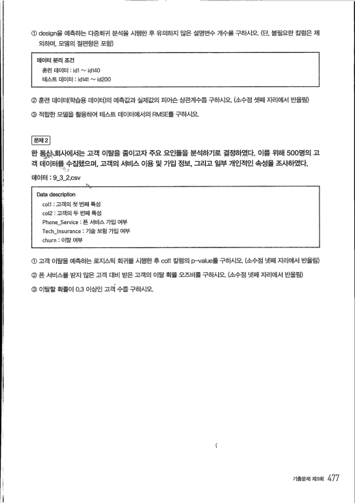
@ design을 예측하는 다중회귀 분석을 시행한 후 유의하지 않은 설명변수 개수를 구하시오 . （단 , 불필요한 칼럼은 제 외하며 . 모델의 절편항은 포함） 데이터 분리 조건 훈련 데이터 : idi '-' 1d140 테스트 데이터 : 1d141 "-' id200 ② 훈련 데이터（학습용 데이터）의 예측값과 실제값의 피어슨 상관계수를 구하시오 . （소수점 셋째 자리에서 반올림） ③ 적합한 모델을 활용하여 테스트 데이터에서의 RMSE를 구하시오． 문제 2 한 봤》져사에서는 고객 이탈을 줄이고자 주요 요인들을 분석하기로 결정하였다． 이를 위해 500명의 고 객 데이터를，수집했으며， 고객의 서비스 이용 및 가입 정보， 그리고 일부 개인적인 속성을조사하였다． 데이터 : 9- 3- 2.csv 驪‘삼 Data description coil : 고객의 첫 번째 특성 cot2 : 고객의 두 번째 특성 Phone-Service : 폰 서비스 가입 여부 TecUnsurance : 기술 보험 가입 여부 churn : 이탈 여부 ① 고객 이탈을 예측하는 로지스틱 회귀를 시행한 후 C히1 칼럼의 p-value를 구하시오 . （소수점 넷째 자리에서 반올림） ② 폰 서비스를 받지 않은 고객 대비 받은 고객의 이탈 확률 오즈비를 구하시오 . （소수점 넷째 자리에서 반올림） ③ 이탈할 확률이 0.3 이상인 고객 수를 구하시오． ( 기출문제제9회 477

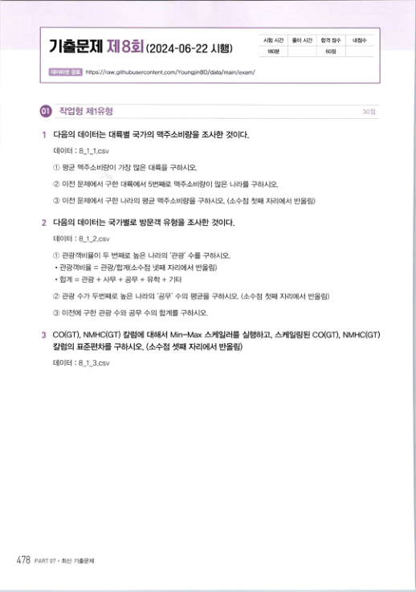
시험 시간 풀이 시간 합격 점수 내점수

## 기츨문제 제8회 (2024-06-22 시햄）
b8c분 60점 https://raw.githubusercontent .com/YoungjinBD/data/main/exam/ .l 작업형제1유형 30점 다음의 데이터는 대륙별 국가의 맥주소비량을 좌 한 것이다． 데이터 : 8 1 tcsv ① 펑균 맥주소비량이 가장 많은 대륙을 구하시오． ② 이전 문제에서 구한 대륙에서 5번째로 맥주소비량이 많은 나라를 구하시오． ③ 이전 문제에서 구한 나라의 펑균 맥주소비량을 구하시오 . （소수점 첫째 자리에서 반올림） 2 다음의 데이터는 국가별로 방문객 유형을 조사한 것이다． 데이터 : 8-- 1- 2.csv ① 관광객비율이 두 번째로 높은 나라의 ' 관광 ' 수를 구하시오．

- 관광객비율 = 관광／합계（소수점 넷째 자리에서 반올림）
- 합계 = 관광 + 사무 + 공무 + 유학 + 기타
② 관광 수가 두번째로 높은 나라의 ' 공무 ' 수의 평균을 구하시오 . （소수점 첫째 자리에서 반올림） ③ 이전에 구한 관광 수와 공무 수의 합계를 구하시오． 3 co(GT), NMHC(GT) 칼럼에 대해서 ^A in-Max 스케일러를 실행하고 , 스케일링된 co(GT), NMHC(GT) 칼럼의 표준편차를 구하시오 . （소수점 셋째 자리에서 반올림） 데이터 : 8_1_3.csv 478 PART 07 . 최신 기출문제

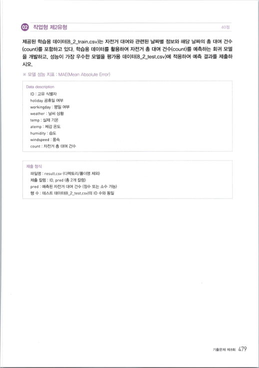
.

작업형제2유형 제공된 학습용 데이터（8_2_train .csv）는 자전거 대여와 관련된 날짜별 정보와 해당 날짜의 총 대여 건수 (count）를 포함하고 있다 . 학습용 데이터를 활용하여 자전거 총 대여 건수（count）를 예측하는 회귀 모델 을 개발하고 , 성능이 가장 우수한 모델을 평가용 데이터（8_2_test.csv）에 적용하여 예측 결과를 제출하 시오， ※ 모델 성능 지표 : MAE(Mean Absolute Error) Data description D : 고유 식별자 hoLiday 공휴일 여부 workingday : 평일 여부 weather : 날씨 상황 temp ; 실제 기온 atemp : 체감 온도 humidity : 습도 windspeed : 풍속 count : 자전거 총 대여 건수 제출 형식 파일명 : resutt.csv （디렉토리／폴더명 제외） 제출 칼럼 : 0. pred （총 2개 칼럼） pred : 예측된 자전거 대여 건수 （정수 또는 소수 가능） 행 수 : 테스트 데이터（8_2_test.csv）의 円 수와 동일 기출문제 제B회 479

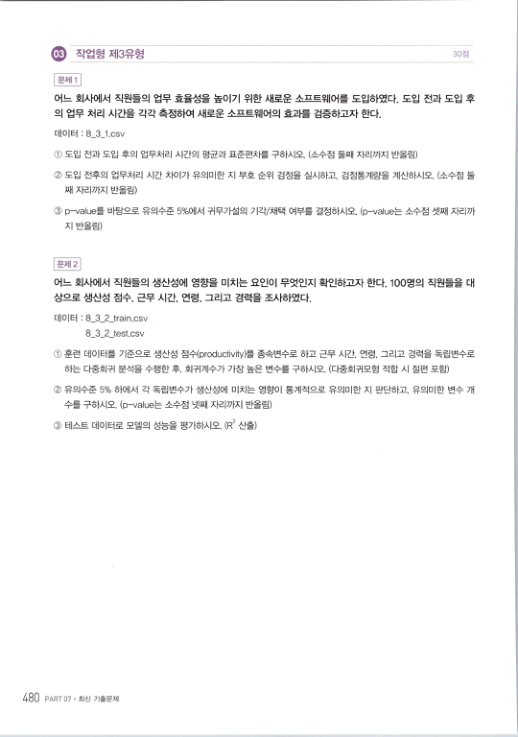
30점 문제 1 어느 회사에서 직원들의 업무 효율성을 높이기 위한 새로운 소프트웨어를 도입하였다 . 도입 전과 도입 후 의 업무 처리 시간을 각각 측정하여 새로운 소프트웨어의 효과를 검증하고자 한다． 데이터 : 8_3_1.csv ① 도입 전과 도입 후의 업무처리 시간의 펑균과 표준편차를 구하시오 . （소수점 둘째 자리까지 반올림） ② 도입 전후의 업무처리 시간 차이가 유의미한 지 부호 순위 검정을 실시하고 , 검정통계량을 계산하시오 . （소수점 둘 째 자리까지 반올림） ③p-value를 바탕으로 유의수준 5％에서 귀무가설의 기각／채택 여부를 결정하시오 . (p-value는 소수점 셋째 자리까 지 반올림） 문제 2 어느 회사에서 직원들의 생산성에 영향을 미치는 요인이 무엇인지 확인하고자 한다 . 100명의 직원들을 대 상으로 생산성 점수 , 근무 시간 , 연령 , 그리고 경력을 조사하였다． 데이터 : 8_3_2_train,csv 8 3 2 test.csv ① 훈련 데이터를 기준으로 생산성 점수（productivity）를 종속변수로 하고 근무 시간 , 연령 , 그리고 경력을 독립변수로 하는 다중회귀 분석을 수행한 후 , 회귀계수가 가장 높은 변수를 구하시오 . （다중회귀모형 적합 시 절편 포함） ② 유의수준 5% 하에서 각 독립변수가 생산성에 미치는 영향이 통계적으로 유의미한 지 판단하고 , 유의미한 변수 개 수를 구하시오 . (p-value는 소수점 넷째 자리까지 반올림） ③ 테스트 데이터로 모델의 성능을 펑가하시오 . (R2 산출） 480 PART 07 . 최신 기출문저

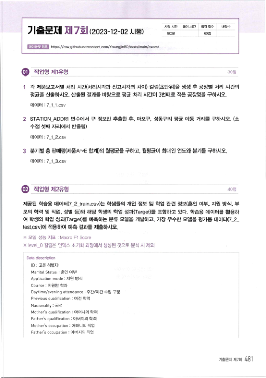
시험 시간 풀이 시간 합격 점수 내점수

## 기춥문제 제 7회 (2023-12-02 시햄）
18C분 60점 데이터셋 경로 https://raw.githubusercontent.com/YoungjinBo/data/main/exam/ .

작업형제1유형 1 각 제품보고서별 처리 시간（처리시각과 신고시각의 차이） 칼럼（초단위）을 생성 후 공장별 처리 시간의 평균을 산출하시오 . 산출된 결과를 바탕으로 평균 처리 시간이 3번째로 적은 공장명을 구하시오． 데이터 : 7- 1- 1.csv 2 STATION_ADDR1 변수에서 구 정보만 추출한 후 , 마포구 , 성동구의 평균 이동 거리를 구하시오 . （소 수점 셋째 자리에서 반올림） 데이터 : 7- 1- 2.csv 3 분기별 총 판매량（제품A∼E 합계）의 월평균을 구하고 , 월평균이 최대인 연도와 분기를 구하시오． 데이터 : 7 1 3.csv .

직쩝형제2유형 40점 제공된 학습용 데이터（7_2_train.csv）는 학생들의 개인 정보 및 학업 관련 정보（혼인 여부 , 지원 방식 , 부 모의 학력 및 직업 , 성별 등）와 해당 학생의 학업 성과（Target）를 포함하고 있다 . 학습용 데이터를 활용하 여 학생의 학업 성과（Target）를 예측하는 분류 모델을 개발하고 , 가장 우수한 모델을 평가용 데이터（7-2- test.csv）에 적용하여 예측 결과를 제출하시오． ※ 모델 성능 지표 : Macro Fl Score < IeveI_0 칼럼은 인덱스 초기화 과정에서 생성된 것으로 분석 시 제외 Data description 口 : 고유 식별자 Marital Status '. 혼인 여부 Application mode : 지원 방식 Course : 지원한 학과 Daytime/evening attendance : 주간／야간 수업 구분 Previous qualification : 이전 학력 Nacionality : 국적 Mother's qualification : 어머니의 학력 Father's qualification : 아버지의 학력 Mother's occupation ; 어머니의 직업 Father's occupation : 아버지의 직업 기출문제제7회 4이

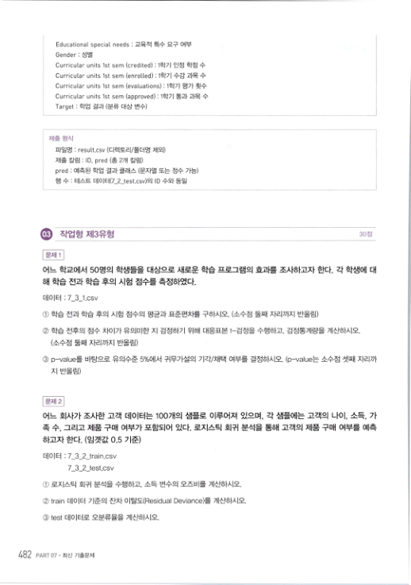
Educational special needs : 교육적 특수 요구 여부 Gender : 성별 Curricular units 1st sem (credited) : 1학기 인정 학점 수 Curricular units 1st sem (enrolled) :1학기 수강 과목 수 Curricular units 1st sem (evaluations) :1학기 펑가 횟수 Curricular units 1st sem (approved) : 1학기 통과 과목 수 Target : 학업 결과 （분류 대상 변수） 제출 형식 파일명 : result.csv （디렉토리／폴더명 제외） 제출 칼럼 ; ID, pred （총 2개 칼럼） pred : 예측된 학업 결과 클래스 （문자열 또는 정수 가능） 행 수 ' 테스트 데이터（7 2 test.csv）의 D 수와 동일 ㅇ 작업형제3유형 30섬 문제 1 어느 학교에서 50명의 학생들을 대상으로 새로운 학습 프로그램의 효과를 조사하고자 한다 . 각 학생에 대 해 학습 전과 학습 후의 시험 점수를 측정하였다． 데이터 : 7- 3- 1.csv ① 학습 전과 학습 후의 시험 점수의 평균과 표준편차를 구하시오 . （소수점 둘째 자리까지 반올림） ② 학습 전후의 점수 차이가 유의미한 지 검정하기 위해 대응표본 t－검정을 수행하고 , 검정통계량을 계산하시오． （소수점 둘째 자리까지 반올림） ③p-value를 바탕으로 유의수준 5％에서 귀무가설의 기각／채택 여부를 결정하시오 . (p-v테ue는 소수점 셋째 자리까 지 반올림） 문제 2 어느 회사가 좌 한 고객 데이터는 100개의 샘플로 이루어져 있으며 , 각 샘플에는 고객의 나이 , 소득 , 가 족 수 , 그리고 제품 구매 여부가 포함되어 있다 . 로지스틱 회귀 분석을 통해 고객의 제품 구매 여부를 예측 하고자 한다 . （임곗값 0.5 기준） 데이터 : 7_3_2_train.csv 7 3 2 test.csv ① 로지스틱 회귀 분석을 수행하고 , 소득 변수의 오즈비를 계산하시오． ②train 데이터 기준의 잔차 이탈도（Residual Deviance）를 계산하시오． ③test 데이터로 오분류율을 계산하시오． 482 PART 07 . 최신 기출문제

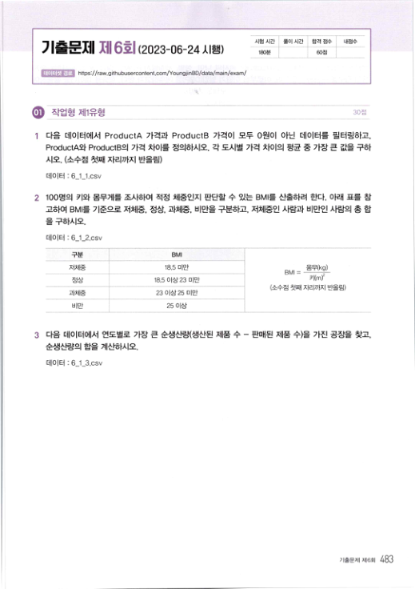
시험 시간 풀이 시간 합격 점수 내점수

## 기출문제 제 6회 (2023-06-24 시햄）
18C분 60점 데이터셋 경로 https://raw.githubusercontent.com/YoungjinBD/data/main/exam/ .l  작업형제1유형 다음 데이터에서 ProductA 가격과 ProductB 가격이 모두 0원이 아닌 데이터를 필터링하고， ProductA와 ProductB의 가격 차이를 정의하시오 . 각 도시별 가격 차이의 평균 중 가장 큰 값을 구하 시오 . （소수점 첫째 자리까지 반올림） 데이터 : 6- 1- 1.csv 2 100명의 키와 몸무게를 좌 하여 적정 체중인지 판단할 수 있는 BMI를 산출하려 한다 . 아래 표를 참 고하여 BMI를 기준으로 저체중 , 정상 , 과체중 , 비만을 구분하고 , 저체중인 사람과 비만인 사람의 총 합 을 구하시오． 데이터 : 6 1 2.csv 구분 BMI

```python
BMI=  몸무〈 kg,)
```
저체중 18.5 미만 키（m) 정상 18.5 이상23 미만 （소수점 첫째 자리까지 반올림） 과체중 23 이상 25 미만 비만 25 이상 3 다음 데이터에서 연도별로 가장 큰 순생산량（생산된 제품 수 - 판매된 제품 수）을 가진 공장을 찾고， 순생산량의 합을 계산하시오． 데이터 : 6_t3.csv 기출문제 제6회 483

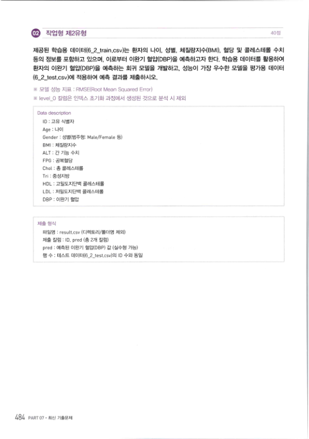
.

작업형제2유형 제공된 학습용 데이터（6_2_train.csv）는 환자의 나이 , 성별 , 체질량지수（B빼 , 혈당 및 콜레스테롤 수치 등의 정보를 포함하고 있으며 , 이로부터 이완기 혈압（DBP）을 예측하고자 한다 . 학습용 데이터를 활용하여 환자의 이완기 혈압（DBP）을 예측하는 회귀 모델을 개발하고 , 성능이 가장 우수한 모델을 평가용 데이터 (6_2_test.csv）에 적용하여 예측 결과를 제출하시오． ※ 모델 성능 지표 : RMSE(Root Mean Squared Error) < level 0 칼럼은 인덱스 초기화 과정에서 생성된 것으로 분석 시 제외 Data description 口 : 고유 식별자 Age : 나이 Gender : 성별（범주형： Mate/FemaLe 등） 마네 : 체질량지수 ALT : 간 기능 수치 FPG : 공복혈당 Chot : 총 콜레스테롤 Tn : 중성지방 HDL : 고밀도지단백 콜레스테롤 LD L : 저밀도지단백 콜레스테롤 DBP : 이완기 혈압 제출 형식 파일명 ; resuLt.csv （디렉토리／폴더명 제외） 제출 칼럼 : ID, pred （총 2개 칼럼） pred : 예측된 이완기 혈압（DBP) 값 （실수형 가능） 행 수 : 테스트 데이터（6 2 test.csv）의 D 수와 동일 484 PART 07 . 최신 기출문제

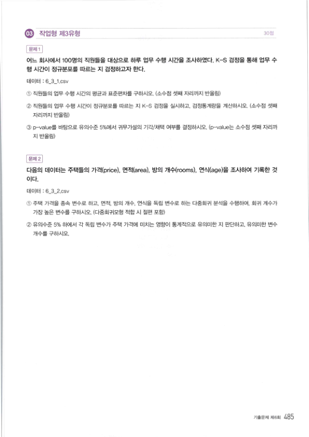
ㅇ 작업형제3유형 30점 문제1 어느 회사에서 100멍의 직원들을 대상으로 하루 업무 수행 시간을 죄 하였다 . K-S 검정을 통해 업무 수 행 시간이 정규분포를 따르는 지 검정하고자 한다． 데이터 : 6- 3- 1.csv ① 직원들의 업무 수행 시간의 펑균과 표준편차를 구하시오 . （소수점 셋째 자리까지 반올림） ② 직원들의 업무 수행 시간이 정규분포를 따르는 지 K-S 검정을 실시하고 , 검정통계량을 계산하시오 . （소수점 셋째 자리까지 반올림） ③p-value를 바탕으로 유의수준 5％에서 귀무가설의 기각／채택 여부를 결정하시오 . (p-v테ue는 소수점 셋째 자리까 지 반올림） 운제 2 다음의 데이터는 주택들의 가격（price) , 면적（area) , 방의 개수（rooms) , 연식（age）을 조사하여 기록한 것 따.

데이터 : 6-3_2.csv (j) 주택 가격을 종속 변수로 하고 , 면적 , 방의 개수 , 연식을 독립 변수로 하는 다중회귀 분석을 수행하여 , 회귀 계수가 가장 높은 변수를 구하시오 . （다중회귀모형 적합 시 절편 포함） （② 유의수준 5% 하에서 각 독립 변수가 주택 가격에 미치는 영향이 통계적으로 유의미한 지 판단하고 , 유의미한 변수 개수를 구하시오． 기출문제 제6회 485

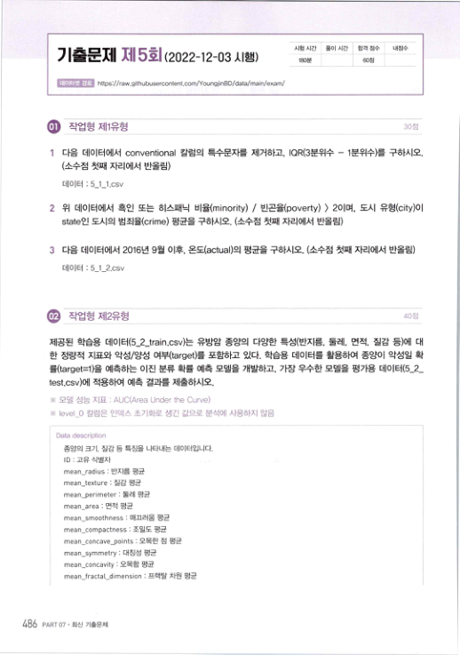
시험 시간 풀이 시간 합격 점수 내점수

## 기출문제 제5회(2022-12-03 시햄）
18C분 60점 데이터셋 경로 https://raw.githubusercontent.com/YoungjinBD/data/main/exam/ .

직업형제1유형 30점 1 다음 데이터에서 conventional 칼럼의 특수문자를 제거하고 , IQR(3분위수 - 1분위수）를 구하시오． （소수점 첫째 자리에서 반올림） 데이터 : 5- 1- 1.csv 2 위 데이터에서 흑인 또는 히스패닉 비율（minority) / 빈곤율（poverty) ) 2이며 , 도시 유형（city）이 state인 도시의 범죄율《crime) 평균을 구하시오 . （소수점 첫째 자리에서 반올림） 3 다음 데이터에서 2이6년 9월 이후 , 온도（actu히）의 평균을 구하시오 . （소수점 첫째 자리에서 반올림） 데이터 : 5- 1- 2.csv 40점 제공된 학습용 데이터（5_2_train .csv）는 유방암 종양의 다양한 특성（반지름 , 둘레 , 면적 , 질감 등）에 대 한 정량적 지표와 악성／양성 여부（target）를 포함하고 있다 . 학습용 데이터를 활용하여 종양이 악성일 확 률（target=l）을 예측하는 이진 분류 확률 예측 모델을 개발하고 , 가장 우수한 모델을 평가용 데이터（5-2- test.csv）에 적용하여 예측 결과를 제출하시오． ※ 모델 성능 지표 : AUC(Area Under the Curve) ※level_U 칼럼은 인덱스 초기화로 생긴 값으로 분석에 사용하지 않음 Data descripton 종양의 크기 . 질감 등 특징을 나타내는 데이터입니다． ＂〕 : 고유 식별자 mean_radius : 반지름 평균 mean_texture : 질감 평균 mean_perimeter : 둘레 평균 mean area : 면적 평균 mean smoo다mess : 매끄러움 펑균 mean_compactness : 조밀도 평균 mean_concave_p이nts : 오목한 점 평균 mean_symmetry : 대칭성 평균 mean_concavity : 오목함 평균 mean fractal dimension '. 프랙탈 차원 평균 486 PART 07．최신 기출문제

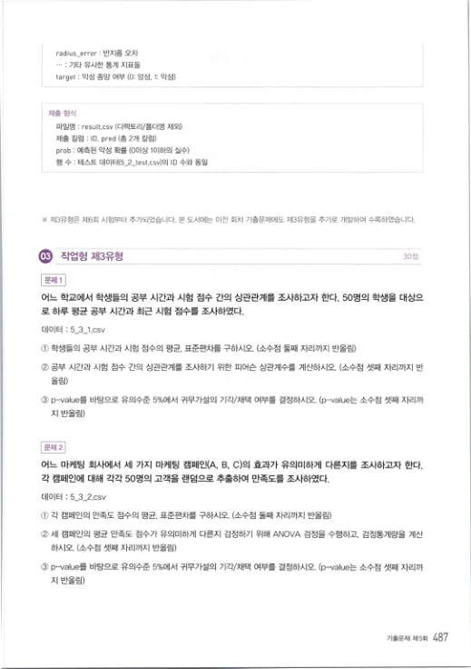
radius error : 반지름 오차

- ·· : 기타 유사한 통계 지표들
target : 악성 종양 여부 (0: 양성 . 1: 악성） 제출 형식 파일명 : result.csv （디렉토리／폴더명 제외） 제출 칼럼 : ID. pred （총 2개 칼럼） prob ; 예측된 악성 확률 (0이상 1이하의 실수） 행 수 : 테스트 데이터（5 2 test.csv）의 m 수와 동일 ※ 저3유형은 저6회 시험부터 추가되었습니다． 본 도서에는 이전 회차 7 I문저∥게도 저3유형을 추가로 개발하여 수록하였습니다． .

작업형제3유형 문제 1 어느 학교에서 학생들의 공부 시간과 시험 점수 간의 상관관계를 조사하고자 한다 . 50명의 학생을 대상으 로 하루 평균 공부 시간과 최근 시험 점수를 조사하였다． 데이터 : 5_3_1.csv ① 학생들의 공부 시간과 시험 점수의 평균 , 표준편차를 구하시오 . （소수점 둘째 자리까지 반올림） ② 공부 시간과 시험 점수 간의 상관관계를 조사하기 위한 피어슨 상관계수를 계산하시오 . （소수점 셋째 자리까지 반 올림） ③p-value를 바탕으로 유의수준 5％에서 귀무가설의 기각／채택 여부를 결정하시오 . (p-value는 소수점 셋째 자리까 지 반올림） 문제 2 어느 마케팅 회사에서 세 가지 마케팅 캠페인（A, B, C）의 효과가 유의미하게 다른지를 좌 하고자 한다． 각 캠페인에 대해 각각 50명의 고객을 랜덤으로 추출하여 만족도를 조사하였다． 데이터 : 5_3_2.csv ① 각 캠페인의 만족도 점수의 평균 , 표준편차를 구하시오 . （소수점 둘째 자리까지 반올림） ② 세 캠페인의 평균 만족도 점수가 유의미하게 다른지 검정하기 위해 /\NOVA 검정을 수행하고 . 검정통계량을 계산 하시오 . （소수점 셋째 자리까지 반올림） ③p-value를 바탕으로 유의수준 5％에서 귀무가설의 기각／채택 여부를 결정하시오 . (p-value는 소수점 셋째 자리까 지 반올림） 기출문제제5회 487

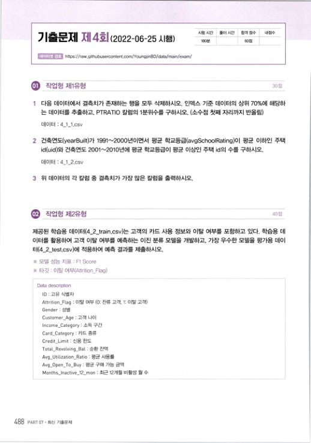
시험 시간 풀이시간 합격 잠수 내점수

## 기출문제 제4회 (2022-06-25 시햄）
1얹）분 出점 데이터셋 경로 https://raw.githubusercontent.com/YoungjinBD/data/main/exam/ .

직쩝형제1유형 30점 1 다음 데이터에서 결측치가 존재하는 행을 모두 삭제하시오 . 인덱스 기준 데이터의 상위 70％에 해당하 는 데이터를 추출하고 , PTRAT!0 칼럼의 1분위수를 구하시오 . （소수점 첫째 자리까지 반올림） 데이터 : 4 1 1.csv 2 건축연도（yearBuilt）가 1991-'-'2000년이면서 평균 학교등급（avgScho히Rating）이 평균 이하인 주택 id(uid）와 건축연도 2001 -'-'2010년에 평균 학교등급이 평균 이상인 주택 id의 수를 구하시오． 데이터 : 4 1 2.csv 3 위 데이터의 각 칼럼 중 결측치가 가장 많은 칼럼을 출력하시오． .

직쩝형제2유형 제공된 학습용 데이터（4_2_train.csv）는 고객의 카드 사용 정보와 이탈 여부를 포함하고 있다 . 학습용 데 이터를 활용하여 고객 이탈 여부를 예측하는 이진 분류 모델을 개발하고 , 가장 우수한 모델을 평가용 데이 터（4_2_test.csv）에 적용하여 예측 결과를 제출하시오． ※ 모델 성능 지표 : Fl Score ※ 타깃 : 이탈 여부＜Attrition_Flag) Data description ㄸ〕 : 고유 식별자 Attrition_Flag : 이탈 여부 (0: 잔류 고객 , 1: 이탈 고객） Gender : 성별 Customer_Age : 고객 나이 Income_Category : 소득 구간 Card_Category : 카드 종류 Credit_Limit : 신용 한도 Total_Revolving_Bat : 순환 잔액 Avg_Utilization_Ratio : 평균 사용률 Avg_Open_To_Buy : 평균 구매 가능 금액 Months_lnactive_12_mon : 최근 12개월 비활성 월 수 488 PART 07 . 최신 기출문제

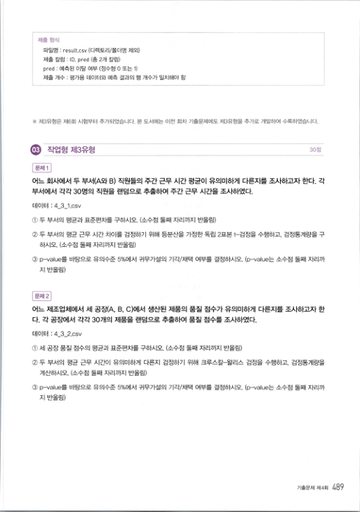
제출 힝식 파일명 : resuLt.csv （디렉토리／폴더명 제외） 제출 칼럼 : ID. pred （총 2개 칼럼） pred : 예측된 이탈 여부 （정수형 0 또는 1) 제출 개수 : 평가용 데이터와 예측 결과의 행 개수가 일치해야 함 ※ 저B유형은 저6회 시험부터 추가되었습니다． 본 도서에는 이전 호I F 문저∥게도 제3유형을 추가로 개발하여 수록하였습니다． 3Q7 .

작업형제3유형 문제 1 어느 회사에서 두 부서（A와 B) 직원들의 주간 근무 시간 평균이 유의미하게 다른지를 조사하고자 한다 , 각 부서에서 각각 30명의 직원을 랜덤으로 추출하여 주간 근무 시간을 조사하였다． 데이터 : 4_3_1.csv ① 두 부서의 평균과 표준편차를 구하시오 . （소수점 둘째 자리까지 반올림） (D 두 부서의 펑균 근무 시간 차이를 검정하기 위해 등분산을 가정한 독립 2표본 t－검정을 수행하고 , 검정통계량을 구 하시오 . （소수점 둘째 자리까지 반올림） ③p-value를 바탕으로 유의수준 5％에서 귀무가설의 기각／채택 여부를 결정하시오 . (p-value는 소수점 둘째 자리까 지 반올림） 문제 2 어느 제조업체에서 세 공장（A, B. C）에서 생산된 제품의 품질 점수가 유의미하게 다른지를 조사하고자 한 다 . 각 공장에서 각각 30개의 제품을 랜덤으로 추출하여 품질 점수를 좌 하였다． 데이터 : 4_3_2.csv ① 세 공장 품질 점수의 평균과 표준편차를 구하시오 . （소수점 둘째 자리까지 반올림） ② 두 부서의 펑균 근무 시간이 유의미하게 다른지 검정하기 위해 크루스칼－왈리스 검정을 수행하고． 검정통계량을 계산하시오 . （소수점 둘째 자리까지 반올림） ③p-value를 바탕으로 유의수준 5％에서 귀무가설의 기각／채택 여부를 결정하시오 . (p-value는 소수점 둘째 자리까 지 반올림） 기출문제제4회 489

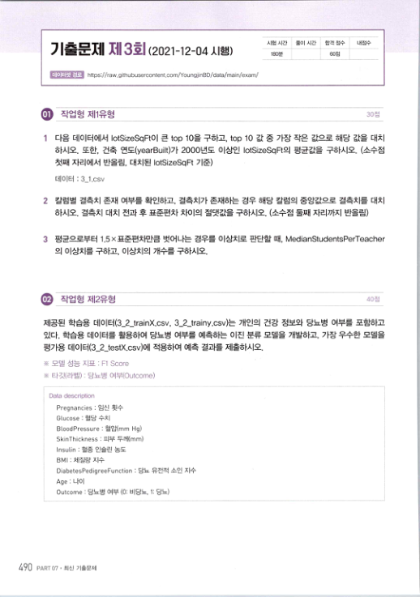
시험 시간 풀이 시간 합격 점수 내점수

## 기출문제 제3회 (2021-12-04시햄）
18α분 60점 데이터셋 경로 https://raw.githubusercontent.com/YoungjinBo/data/main/exam/ 다음 데이터에서 IotSizeSqFt이 큰 top 10을 구하고 , top 10 값 중 가장 작은 값으로 해당 값을 대치 하시오 . 또한 , 건축 연도（yea rBu ut）가 2000년도 이상인 IotSizeSqFt의 평균값을 구하시오 . （소수점 첫째 자리에서 반올림 , 대치된 lotSizeS이＝t 기준） 데이터 : 3_i .csv 2 칼럼별 결측치 존재 여부를 확인하고 , 결측치가 존재하는 경우 해당 칼럼의 중앙값으로 결측치를 대치 하시오 . 결측치 대치 전과 후 표준편차 차이의 절댓값을 구하시오 . （소수점 둘째 자리까지 반올림） 3 평균으로부터 1.5×표준편차만큼 벗어나는 경우를 이상치로 판단할 때 , MedianStudentsPerTeacher 의 이상치를 구하고 , 이상치의 개수를 구하시오． 40점 제공된 학습용 데이터（3_2_trainX.csv, 3_2_trainy.csv）는 개인의 건강 정보와 당뇨병 여부를 포함하고 있다 . 학습용 데이터를 활용하여 당뇨병 여부를 예측하는 이진 분류 모델을 개발하고 , 가장 우수한 모델을 평가용 데이터（3_2_testX.csv）에 적용하여 예측 결과를 제출하시오． ※ 모델 성능 지표 : Fl Score ※ 타깃（라벨） : 당뇨병 여부（Outcome) Data description Pregnancies : 임신 횟수 GLucose : 혈당 수치 BtoodPressure : 혈압(mm Hg) SkinThickness : 피부 두께（mm) Insulin : 혈중 인슐린 농도 BMI : 체질량 지수 DiabetesPedigreeFunction ; 당뇨 유전적 소인 지수 Age : 나이 Outcome : 당뇨병 여부 (0: 비당뇨 , 1: 당뇨） 490 PART 07. 최신 기출문제

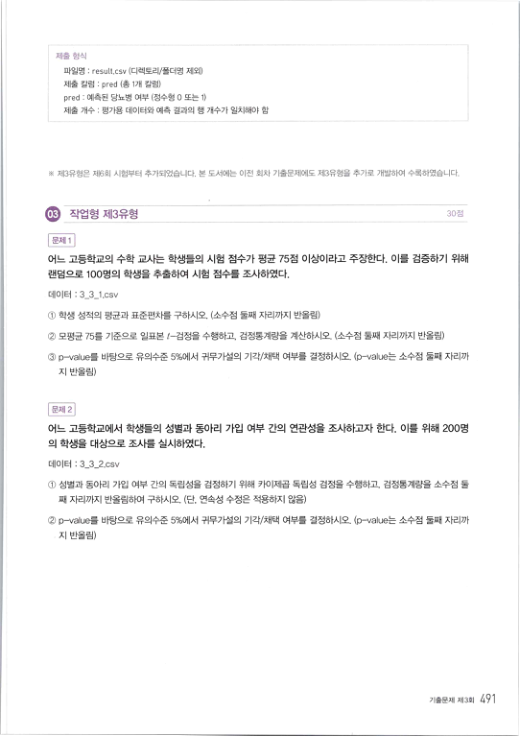
제출 형식 파일명 : result.csv （디렉토리／폴더명 제외） 제출 칼럼 : pred （총 1개 칼럼） pied : 예측된 당뇨병 여부 （정수형 0 또는 1) 제출 개수 : 평가용 데이터와 예측 결과의 행 개수가 일치해야 함 ※ 제3유형은 제6회 시험부터 추가되었습니다 . 본 도서에는 이전 회차 기출문제에도 제3유형을 추가로 개발하여 수록하였습니다． 30점 문제 1 어느 고등학교의 수학 ㅍ똬는 학생들의 시험 점수가 평균 75점 이상이라고 주장한다 . 이를 검증하기 위해 랜덤으로 100명의 학생을 추출하여 시험 점수를 죄 하였다． 데이터 : 3 3 1.csv （〕 ：) 학생 성적의 평균과 표준편차를 구하시오 . （소수점 둘째 자리까지 반올림） ② 모평균 75를 기준으로 일표본 〃검정을 수행하고 , 검정통계량을 계산하시오 . （소수점 둘째 자리까지 반올림） ③p-value를 바탕으로 유의수준 5％에서 귀무가설의 기각／채택 여부를 결정하시오 . (p-value는 소수점 둘째 자리까 지 반올림） 문제 2 어느 고등학교에서 학생들의 성별과 동아리 가입 여부 간의 연관성을 조사하고자 한다 . 이를 위해 200명 의 학생을 대상으로 조사를 실시하였다． 데이터 : 3_3_2.csv ① 성별과 동아리 가입 여부 간의 독립성을 검정하기 위해 카이제곱 독립성 검정을 수행하고 , 검정통계량을 소수점 둘 】재 자리까지 반올림하여 구하시오 . （단 , 연속성 수정은 적용하지 않음） ②p-v히ue를 바탕으로 유의수준 5％에서 귀무가설의 기각／채택 여부를 결정하시오 . (p-v테ue는 소수점 둘째 자리까 지 반올림） 기출문제 제3회 4이
