# 최신 기출문제 
정답 & 해설

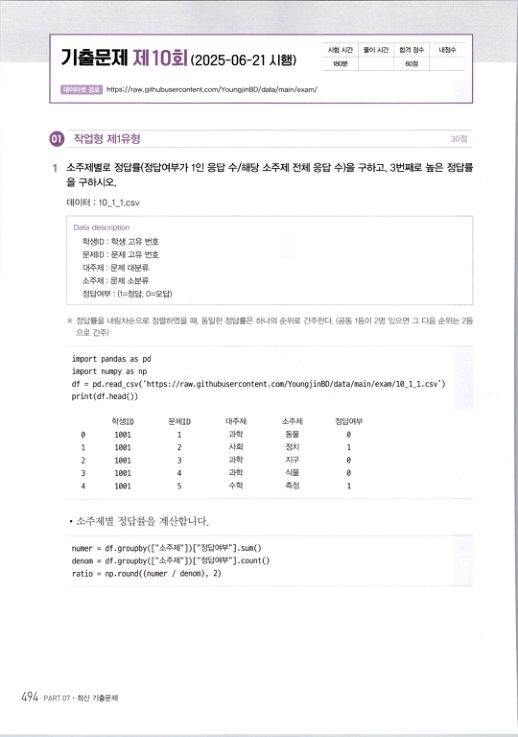
시험 시간 풀이 시간 합격 점쒸 내점수

## 기출문제 제 10회 (2025-06-21 시햄）
180 60점 https://raw.githubusercontent.com/YoungjinBD/data/main/exam/ .l  작업형제1유형 30점 1 소주제별로 정답률（정답여부가 1인 응답 수／해당 소주제 전체 응답 수）을 구하고 , 3번째로 높은 정답률 을 구하시오． 데이터 : 10_i_i .csv Data description 학수ID: 학생 고유 번호 문제 ［〕 : 문제 고유 번호 대주제 : 문제 대분류 소주제 ; 문제 소분류 정답여부 : 여＝정답 . 0＝오답） ※ 정답률을 내림차순으로 정렬하였을 ［대， 동일한 정답률은 해낙의 순위로 간주한다． （공동 1등이 2명 있으면 그 다음 순위는 2동 으로 간주）

```python
import pandas as pd
import numpy as np 
df = pd.read_csv('https://raw.githubusercontent.com/YoungjinBD/data/main/exam/10_1_1.csv') 
print(df.head())
```
학생ID 문제ID 대주제 소주제 정답여부 0 1001 1 과학 동물 0 1 1001 2 사회 정치 1 2 1001 3 과학 지구 0 3 1001 4 과학 식물 0 4 1001 5 수학 측정 1

- 소주제별 정답률을 계산합니다．
```python
numer = df.groupby([ " 소주제 " ])[. " 정답여부"] .sum()
denom = df.groupby([ " 소주제 " ]）「 ' 정답여부"] .count() 
ratio = np.round((numer I denom), 2)
```
4?4 PART 07 . 최신 기출문저

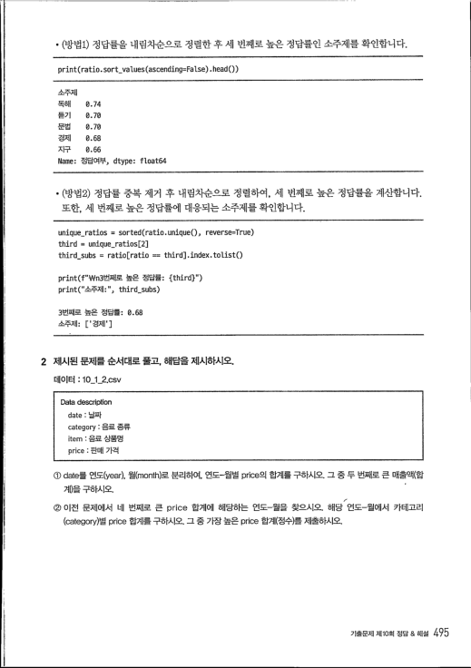
- （방법1) 정답률을 내림차순으로 정렬한 후 세 번째로 높은 정답률인 소주제를 확인합니다．
pririt(ratio. sort_val.ues(ascending=False) .head()) 소주제 독해 0.74 듣기 0 .70 문법 0 .70 경제 0 .68 지구 0 .66

```python
Name= 정답여부， dtype: fl oat64
```
- （방법2) 정답률 중복 제거 후 내림차순으로 정렬하여 , 세 번째로 높은 정답률을 계산합니다．
또한 , 세 번째로 높은 정답률에 대응되는 소주제를 확인합니다．

```python
unique_ratios = sorted(ratio . uniqueO, reverse=True) 
third = unique_ratios[21 
third_subs = ratio[ratio == thirdl.index.toUst()
print(f 'Wn3번째로 높은 정답률： {third}") 
print(" 소주제： " , third_subs)
```
3번째로 높은 정답률： 0.68 소주제＝ [ ' 경제 ' 〕 2 제시된 문제를 순서대로 풀고 , 해답을 제시하시오． 데이터 : 10- 1_2.csv Data description date : 날짜 category : 음료 종류 item : 음료 상품명 price : 판매 가격 ①date를 연도（year) . 월（month）로 분리하여 . 연도－월별 price의 합계를 구하시오 . 그 중 두 번째로 큰 매출액（합 계）을 구하시오． ② 이전 문제에서 네 번째로 큰 price 합계에 해당하는 연도－월을 찾으시오 . 해당 연도－월에서 카테고리 (category）별 price 합계를 구하시오 . 그 중 가장 높은 price 합계（정수）를 제출하시오． 기출문제제10회정답＆해설 495

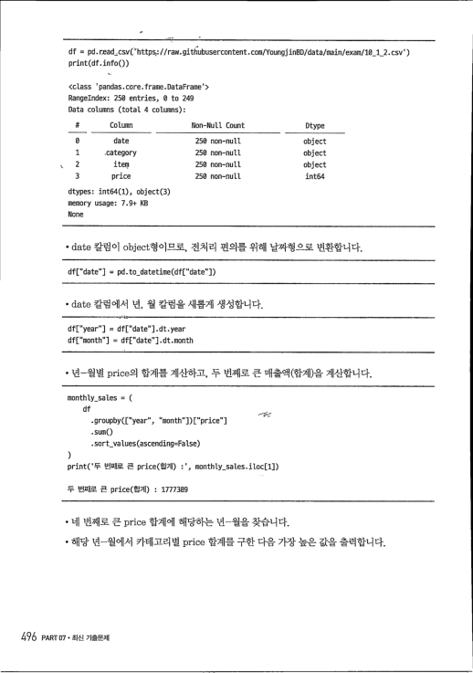
```python
df = pd . read' csv.(:'https,:.//raw.githubusercontent. com/YoungjinBD/data/main/exam/10_1,,2. csv') 
print(df.infoQ)
```
<class 'pandas. core.frame.DataFrame5 Rangelndex: 250 entries, 0 to 249 Data columns (total. 4 columns):

if Col,umn Non-Nul.l Count Dtype 0 date 250 non-null object 1 .category 250 non-null.

object 2 iteip 250 non-null, object 3 price 250 non-null, 1nt64 dtypes: int64(1), object(3) memory usage: 7.9+ KB None .date 칼럼이 object형이므로 , 전처리 편의를 위해 날짜형으로 변환합니다． df["date"] = pd.to_datetime(df["date"])

- date 칼럼에서 넌 , 월 칼럼을 새롭게 생성합니다．
df["year"] = df{"date"].dt.year df["month"] = df["date'] . dt .month

- 년－월별 price의 합계를 계산하고 , 두 번깨로 큰 매출액（합계）을 계산합니다．
```python
monthly_sales = ( 
df
```
. groupby(["year", "month"]) ["price"] .sumQ . sort_values(ascending=False)

```python
print(' 두 번째로 큰 price（합계） : " monthly_sales.il,oc[1])
```
두 벤재로 큰 price（합계） : 1777389

- 네 번째로 큰 price 합계에 해당하는 넌－월을 찾습니다．
- 해당 년－월에서 카데고리별 price 합계를 구한 다음 가장 높은 값을 출력합니다．
4?5 PART 07．최신기출문제

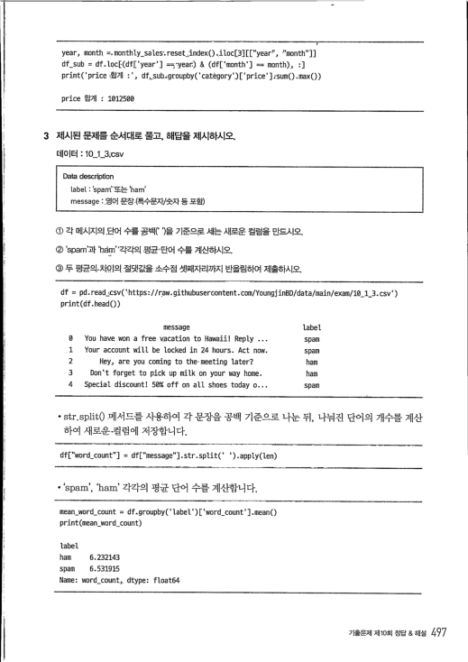
```python
year, month =, monthly_sales'. reset .indexO Jloc[3] [["yearn, "month'] J 
df_sub = df.,loc[(df[ 'year'] .=一 'year) & (df{ 'month'] = month), :] 
print('price：합 1I :', df..sub」
，groupby('cat色gory',){'price'] .rsumO.maxQ)
```
price 합계 = 1012500 3 제시된 문제를순서대로풀고 , 해답을제시하시오， 데이터 : 10_1_3ㅗcsv Data description label : ' spa" ' 또는 ' ham' message : . 영어 문장 （특수문차／숫자등포함） ① 각 메시지의 단어 수를 공백（ " ）을 기준으루 세는 새로운 컬럼을 만드시오． ②'spam'과 ' ham " 각각의 평균，단어 수를 계산하시오． ③ 두 펑균의，차이의 절댓값을 소수점 셋째자리까지 반올림하여 제출하시오．

```python
df = pd.read,'csv(' 」https://raw.githubusercontent.com/YoungjinBD/data/main/exam/10-1-3.csv') 
print(df.head())
```
message label 0 You hav.eHwon a free vacation to Hawaii! Reply ...

spam 1 Your account will be locked in 24 hours. Act now.

spam 2 Hey, are you coming to the' meeting later?

ham 3 Don't forget to pick up milk on your way home.

ham 4 Special discount! 50% off on all shoes today a...

spam

- str. split 0 ，메서드를 사용하여 각 문장을 공백 기준으로 나눈 뒤 , 나눠진 단어의 개수를 계산 
하여 새로운4컬럼에 저장합니다． df['word_count"J = df["message"].str.split(' ').apply(len)

- 'spam', 'ham ' 각각의 평균단어 수를계산합니다．
```python
mean_word_count = df,..groupby(' label')['word_count'] .mean() 
print(mean_word_count)
```
label ham 6.232143 spas 6.531915 Name: word_count,, dtype: f1oat64 기출문저「제10회정답＆해설 497

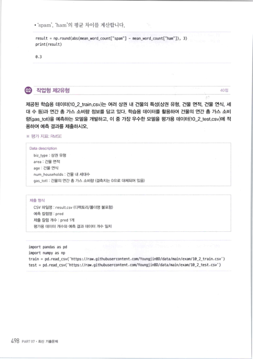
- 'spam', 'ham'의 평균 자이를 계산합니다．
```python
resu't = np.round(abs(rnean_word_count["spam"] - mean_word_count["ham"]), 3) 
print(result)
```
0.3 .

작업형제2유형 40점 제공된 학습용 데이터（10_2_train.csv）는 여러 상권 내 건물의 특성（상권 유형 , 건물 면적 , 건물 연식 , 세 대 수 등）과 연간 총 가스 소비량 정보를 담고 있다 , 학습용 데이터를 활용하여 건물의 연간 총 가스 소비 량（gas- toti）을 예측하는 모델을 개발하고 , 이 중 가장 우수한 모델을 평가용 데이터（10_2_test.csv）에 적 용하여 예측 결과를 제출하시오． ※ 펑가 지표： RMSE Data description biz_type : 상권 유형 area '. 건물 면적 age : 건물 연식 num households : 건물 내 세대수 gas_toti : 건물의 연간 총 가스 소비량 （결측치는 0으로 대체되어 있음） 제출 형식 csv 파일명 : resutt.csv （디렉토리／폴더명 불포함） 예측 칼럼명 : pred 제출 칼럼 개수 : pred 1개 평가용 데이터 개수와 예측 결과 데이터 개수 일치

```python
import pandas as pd 
import numpy as np 
train = pd.read_csv('https://raw.githubusercontent.com/YoungjinBD/data/main/exam/10_2_train.csv' ) 
test = pd.read_csv( 'https://raw.githubusercontent.com/YoungjinBD/data/main/exam/10_2_test.csv' )
```
498 PART 07. 최신 기출문제

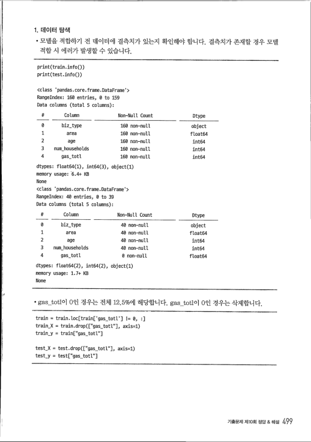
1 . 데이터 탐색

- 모델을 적합하기 전 데이터에 결측치가 있는지 확인해야 합니다 . 결측치가 존재할 경우 모델 
적합 시 에러가 발생할 수 있습니다．

```python
print(train.infoQ) 
print(test.infoQ)
```
<class 'pandas. core. frame. DataFrame'> Rangelndex: 160 entries, 0 to 159 Data columns (total. 5 columns):

It Column Non-Null Count Dtype 0 biz_type 1 area 160 non-null object f1oat64 int64 1nt64 160 non-null 2 age 3 num households 4 gas_totl 160 non-null.

160 non-null 160 non-null.

최it64 dtypes: f10at64(1), int64(3), object(1) memory usage: 6.4+ KB None <class 'pandas. core'. frame. DataFrame'> Rangelndex: 40 entries, 0 to 39 Data columns (total 5 columns):

```python
# 
Column 
Non-Null Count
```
Dtype 0 biz_type 1 area 40 n이i-null object f1oat64 int64 int64 40 non-null 2 age 40 non-null 3 num households 40 non-null 4 gas_totl 0 non-null f1oat64 dtypes: fl.0at64(2), int64(2), obj ect (1) memory usage: 1.7+ KB None ' gas_toti이 0인 경우는 전쳬 12.5％에 해당합니다 . gas_toti이 0인 경우는 삭제합니다．

```python
train = train.loc{train[ 'gas-totl'] 1= 0, :3 
train_X = train, drop (f"gas. totl"], axis=1) 
train_y = train[ "gas_totl"]
test-X = test.drop({"gas_totl"], axis=1) 
test_y = test["gas_totl"J
```
기출문제제10회정답＆해설 4??

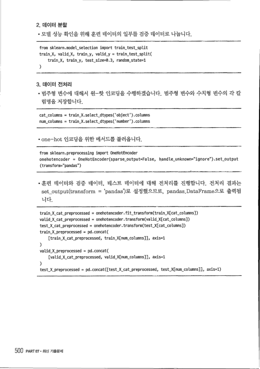
2 . 데이터 분할

- 모델 성능 확인을 위해 훈련 데이터의 일부를 검증 데이터로 나눕니다．
```python
from sklearn .model_sel.ection import train_test_split 
train_X, valid_X, train-y, val.id_y = train_test_split( 
train_X, train_y, test_size=0.3, random_state=l 
)
```
3 . 데이터 전처리

- 범주형 변수에 대해서 원－핫 인코딩을 수행하겠습니다 . 범주형 변수와 수치형 변수의 각 칼
럼명을 저장합니다．

```python
cat_columns = train_X.select_dtypes('object').columns
num_columns = train_X.select_dtypes('number').col.umns
```
- one-hot 인코딩을 위한 메서드를 불러옵니다．
```python
from sklearn.preprocessing import oneHotEncoder 
onehotencoder = OneHotEncoder(sparse_output=False, handl.e_unknown="ignore") .set_output
```
(transform="pandas")

- 훈련 데이터와 검증 데이터 , 데스트 데이터에 대해 전처리를 진행합니다 . 전처리 결과는
set_output(transform = 'pandas'）로 설정했으므로 , pandas.DataFrame으로 출력됩 니다．

```python
train_X_cat_preprocessed = onehotencoder. fit_transform(train_X[cat_columns])
val.id_X_cat_preprocessed = onehotencoder. transform(valid_X[cat_columns]) 
test_X_cat_preprocessed = onehotencoder.transform(test_X[cat_columns]) 
train_X_preprocessed = pd.concat( 
[train_X_cat_preprocessed, train_X{num_columns]], axis=1
```
val.id_X_preprocessed = pd.concat( [valid_X_cat_preprocessed, valid_X{num_columns]1, axis=l

```python
test_X_preprocessed = pd. concat([test_X_cat_preprocessed, test_X[num_columnsj], axis=l)
```
500 PART07．최산기출문제

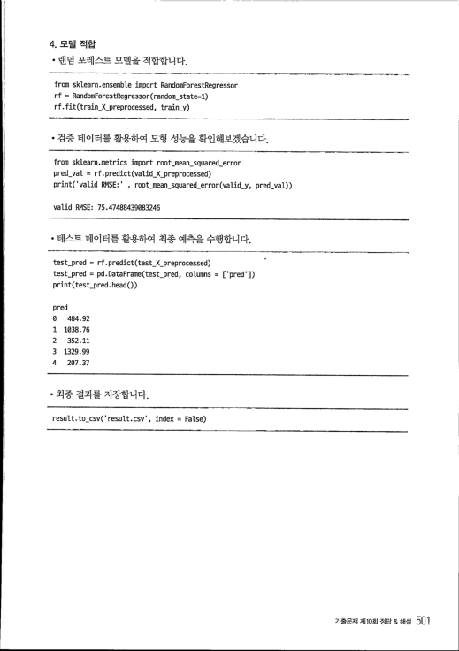
4 . 모델 적합

- 랜덤 포레스트 모델을 적합합니다．
```python
from skLearn.ensemble import RandomForestRegressor 
rf = RandomForestRegressor(random_state=1) 
rf. fit (train_X_preprocessed, train_y)
```
- 검증 데이터를 활용하여 모형 성능을 확인해보겠습니다．
```python
from sklearn . metrics import root-mean_squared_error 
pred_val = rf.predict(valid_X_preprocessed) 
print('valid RMSE: ' , root_mean_squared_error(valid_y, pred_val))
```
valid RuSE: 75.47488439083246

- 테스트데이터를 활용하여 최종 예측을 수행합니다．
```python
test_pred = rf.predict(test_X_preprocessed) 
test_pred = pd.DataFrame(test_pred, columns = {'pred 'J) 
print(test_pred .head())
```
pred 0 484.92 1 1038.76 2 352.11 3 1329.99 4 207.37

- 최종 결과를 저장합니다．
result.to_csv('result.csv ', index = False) 기출문제제10회정답＆해설 501

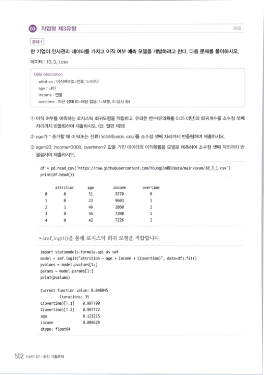
ㅇ 작업형 제3유형 문제디 한 기업이 인사관리 데이터를 가지고 이직 여부 예측 모델을 개발하려고 한다 . 다음 문제를 풀이하시오． 데이터 : 10_3_1.csv Data description attrition : 이직여부＜0＝잔류 , 1＝이직） age : 나이 income : 연봉 overtime : 야근 상태 (0＝해당 없음 . 1＝보통 . 2＝상시 등） ① 이직 여부를 예측하는 로지스틱 회귀모형을 적합하고 , 유의한 변수〈유의확률 0.05 미만）의 회귀계수를 소수점 셋째 자리까지 반올림하여 제출하시오 . （단 . 절편 제외） ②age가 1 증가할 때 이직（또는 잔류） 오즈비（odds ratio）를 소수점 셋째 자리까지 반올림하여 제출하시오． ③age=20, income=3000, overtime=2 값을 가진 데이터의 이직확률을 모델로 예측하여 소수점 셋째 자리까지 반 올림하여 제출하시오．

```python
df = pd.read_csv( 'https://raw.githubusercontent.com/YoungjinBD/data/main/exam/10_3_1.csv ') 
print(df.head())
```
attrition age income overtime 0 0 51 9270 0 1 0 23 9603 1 2 1 49 2860 2 3 0 56 7390 1 4 0 42 7226 2

- smf.logit(）을 통해 로지스틱 회귀 모형을 적합합니다．
```python
import statsmodels. formula.api as smf
model = smfjogit("attrition ` age + income + C(overtime)", data=df).fit ()
pvalues = model.pval.ues[1:]
params = modeLparams[1:] 
print(pvalues)
```
Current function value: 0.048045 Iterations: 35 C(overtime)[T. 1] 0.997790 C(overtime)[T.2] 0.997772 age 0.121215 income 0.009629 dtype: fl.oat64 502 PART 07 ' 최신 기출문제

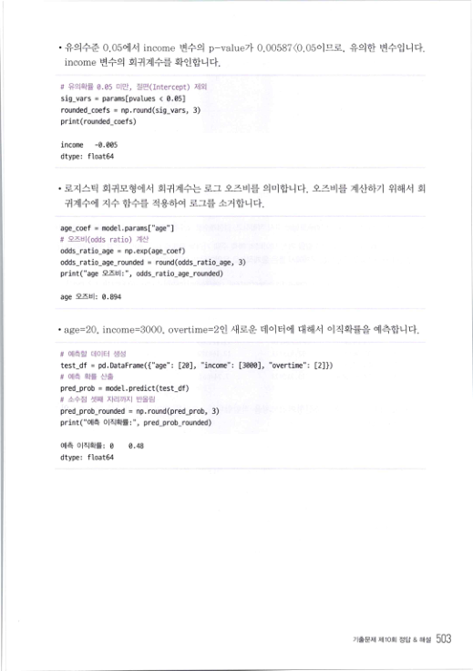
- 유의수준 0.05에서 income 변수의 p-value가 0.00587<0.05이므로 , 유의한 변수입니다． 
income 변수의 회귀계수를 확인합니다．

```python
# 유의확률 0.05 미만＇ 절편（Intercept) 제외 
sig_vars = params[pvathes < 0.05]
rounded_coefs = np.round(sig_vars, 3) 
print(rounded_coefs)
```
income -0.005 dtype: f1oat64

- 로지스틱 회귀모형에서 회귀계수는 로그 오즈비를 의미합니다 . 오즈비를 계산하기 위해서 회
귀계수에 지수 함수를 적용하여 로그를 소거합니다．

```python
age_coef = model.params[ "age "] 
# 오즈비（odds ratio) 계산
odds_ratio_age = np.exp(age_coef) 
odds_ratio_age_rounded = round(odds_ratio_age, 3) 
print('age 오즈bI: ", odds_ratio_age_rounded)
```
age 오즈비： 0.894

- age=20, income=3000, overtime=2인 새로운 데이터에 대해서 이직확률을 예측합니다．
```python
# 예측할 데이터 생성 
test_df = pd.DataFrame({"age": [20],
```
"income": [3000], " overtime": [2]})

```python
# 예측 확률 산출
pred_prob = model. predict (test_df)
# 소수점 셋째 자리까지 반올림
pred_prob_rounded = np.round(pred_prob, 3) 
print(" 예측 이직확률：", pred_prob_rounded)
```
예측 이직확률＝ 0 dtype: float64 0.48 기출문제 제10회 정답 & 해설 503

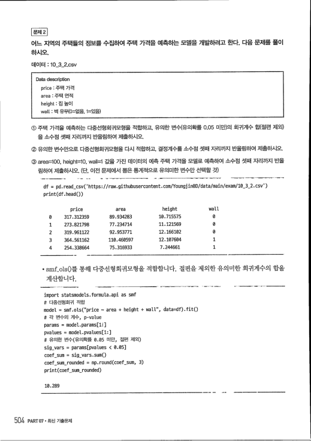
문제 2 어느 지역의 주택들의 정보를 수집하여 주택 가격을 예측하는 모델을 개발하려고 한다 . 다음 문제를 풀이 하시오． 데이터 : 10_3_2.csv Data description 陋ce : 주택 가격 area : 주택 면적 hek갼，t : 집 높이 waR : 벽 유무〈0＝없음 , 1＝있음） ① 주택 가격을 예측하는 다중선형회귀모형을 적합하고 , 유의한 변쉬유의확률 0.05 미만）의 회귀계수 합（절편 제외） 을 소수점 셋째 자리까지 반올림하여 제출하시오． ② 유의한 변수만으로 다중선형회귀모형을 다시 적합하고 , 결정계수를 소수점 셋째 자리까지 반올림하여 제출하시오． ③area=100, height=10, wall=1 값을 가진 데이터의 예측 주택 가격을 모델로 예측하여 소수점 셋째 자리까지 반올 림하여 제출하시오 . （단 . 이전 문제에서 뽑은 통계적으로 유의미한 변수만 선택할 것）

```python
df = pd.read_csv('https://raw.githubusercontent.com/YoungiinBD/data/fllaifl/eXam/10_3_2.CSV') 
print(df.head())
```
price area height wal.l 0 317.312359 89.934283 10.715575 0

1. 
273.821798 77.234714 11.121569 0 2 319.961122 92.953771 12.166102 0 3 364.561162 110.460597 12.107604 1 4 254.338664 75.316933 7.244661 1

- smf.olsO를 통해 다중선형회귀모형을 적합합니다 . 절펀을 제외한 유의미한 회귀계수의 합을
계산합니다．

```python
import statsmodels.formula.api as smf
# 다중선형회귀 적합
```
model. = smf.ol.sCprice - area + height + wa11 ", data=df).fitO

```python
# 각 변수의 계수， p-value
params = mode1.params[1:]
pvalues = modeLpvalues[1:]
# 유의한 변수（유의확률 0.05 미만， 절편 제외）
```
sig.yars = params[pvalues < 0.051

```python
coef_sum = sig_vars.sum()
coef_surn_rounded = np.round(coef_sum, 3) 
print(coef_sum_rounded)
```
10.289 504 PART 07· 최신 기출문제

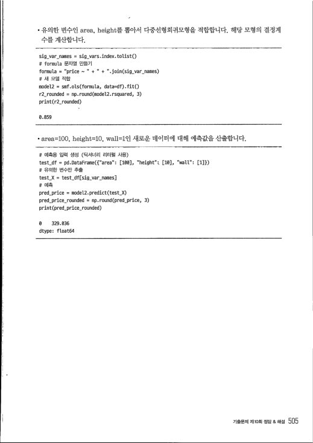
- 유의한 변수인 area, height를 뽑아서 다중선형회귀모형을 적합합니다 . 해당 모형의 결정계
수를 계산합니다．

```python
sig_var_names = sig_vars . index. tollst()
# formula 문자열 만들기
formula = 'price " " + " + ".join(sig_var_names) 
# 새 모델 적합
mode12 = smf.ol.s(formula, data=df).fitQ 
r2_rounded = np.round(mode12.rsquared, 3) 
print(r2_rounded)
```
0.859

- area=100, height=lO, wall=i인 새로운 데이터에 대해 예측값을 산출합니다．
```python
# 예측용 입력 생성 （딕셔너리 리터럴 사용） 
test_df = pd.DataFrame({"area": [1001, "height":. [10J, "waU.' : [1]}) 
# 유의한 변수만 추출 
test_X = test_df[sig_var_namesj 
# 예측
pred_price = model2. predict (test_X)
```
3)

```python
pred_price_rounded = np. round (pred_price, 
print(pred_price_rounded)
```
0 329.036 dtype: f1oat64 기출문처I 제10회 정답 & 해설 505

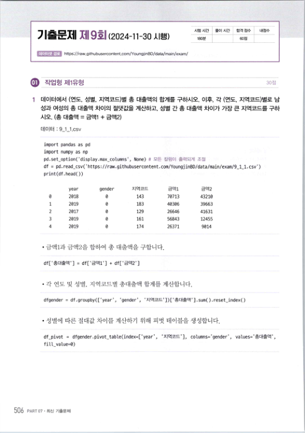
시험 시간 풀이 시z' 합격 점수 내점수

## 기출문제 제 9회 (2024-11-30 시햄）
데이터셋 경로 https://raw.githubusercontent.com/YoungjinBD/data/main/exam/ .

작업형제1유형 1 데이터에서 （연도 , 성별 , 지역코드）별 총 대출액의 합계를 구하시오 . 이후 , 각 （연도 , 지역코드）별로 남 성과 여성의 총 대출액 차이의 절댓값을 계산하고 , 성별 간 총 대출액 차이가 가장 큰 지역코드를 구하 시오 . （총 대출액 = 금액1 + 금액2) 데이터 : 9-- 1-- 1.csv

```python
import pandas as pd 
import numpy as np 
pd.set_option(' dispthy.max_columns ', None) # 모든 칼럼이 출력되게 조절 
df = pd. read_csv( https://raw.githubusercontent.com/YoungjinBD/data/main/exam/9_1_1.csv') 
print(df.headQ)
```
year gende「 지역코드 금액1 금액2 0 2018 0 143 70713 43210 1 2019 0 183 40306 39663 2 2017 0 129 26646 41631 3 2019 0 161 56843 12455 4 2019 0 174 26371 9014

- 금액1과 금액2을 합하여 총 대출액을 구합니다．
df[ ’총대출액 ' ] = df[ ' 금액1' ] + df「금액2 ' ]

- 각 연도 및 성별 , 지역코드별 총대출액 합계를 계산합니다．
```python
dfgender = df.groupby([ ' year ' , 'gender ' , ' 지역코드 ' ])[. ' 총대출액 ' ].sum() .reset_index()
```
- 성별에 따른 절대값 자이를 계산하기 위해 피벗 테이블을 생성합니다．
```python
df_pivot = dfgender.pivot_table(index=['year', 'XI역 드'] , columns='gender', values=' 총L출액', 
fili_ val.ue=0)
```
506 PART 07 . 최신 기출문제

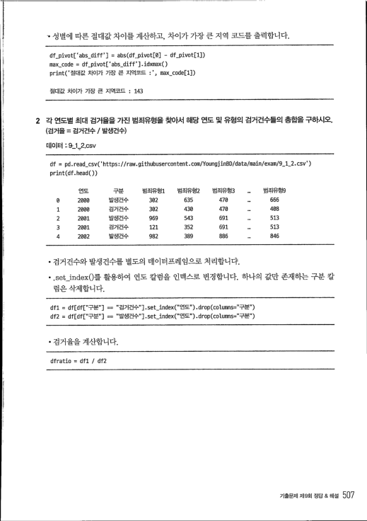
"· 셩별에 따른 절대값 차이를 계산하고 , 차이가 가장 큰 지역 코드를 출력합니다． df_pivot['abs_diff'] = abs(df_pivot[0] - df_pivot[1])

```python
max_code = df_pivot[ ' abs_diff '] . idxmax() 
print(' 절대값 차이가 가장 큰 지역코드 = '., max_code[1])
```
절대값 차이가 가장 큰 지역코드 : 143 2 각 연도별 최대 검거율을 가진 범죄유형을 찾아서 해당 연도 및 유형의 검거건수들의 총합을 구하시오， （검거율 = 검거건수 / 발생건수） 데아터 =91- 2.csv

```python
df = pd.read_csv('https://raw.githubusercontent.com/YoungjinBD/data/main/exam/9_1_2.csv') 
print(df.headQ)
```
연도 구분 범죄유형1 범죄유형2 범죄유형3 범죄유형9 0 2000 발생건수 302 635 470 666 1 2000 검거건수 302 430 470 408 2 2001 발생건수 969 543 691 , . .

513 3 2001 검거건수 121 352 691 513 4 2002 발생건수 982 389 886 846

- 검거건수와 발생건수를 별도의 데이터프레임으로 차리합니다．
- .set_index(）를 활용하여 연도 칼럼을 인덱스로 변경합니다 . 하나의 값만 존재하는 구분 칼
럼은 삭제합니다．

```python
df 1 = df[df[ " 구분 " 〕 == " 검거건수 " ] .set_index( " 연도 " ).drop (columns= " 구분 " ) 
df2 = df[df[ " 구분 " 〕 == " 발생건수 " 〕．set_index( " 연도 " ).drop (col,umns= " 구분 " )
```
- 검거율을 계산합니다．
df ratio = df 1 / df2 l 기출문제제9회정답＆해설 507

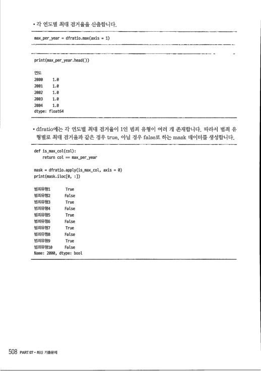
- 각 연도별 최대 검거율을 산출합니다．
```python
max_per_year = dfratio.max(axis = 1)
print(max_per_year.headQ)
```
연도 2000

1. 0
2001 1.0 2002 1.0 2003 1.0 2004 1.0 dtype: f1oat64

- dfratio에는 각 연도별 최대 검거율이 1인 범죄 유형이 여러 개 존재합니다 . 따라서 범죄 유 
형별로 최대 검거율과 같은 경우 true , 아닐 경우 false로 하는 mask 데이터를 생성합니다．

```python
def is_max_col(col): 
return col == max_per_year
mask = dfratio.appl.y(is_max_col, axis = 0) 
print(mask.il.ocfO, :])
```
범죄유형1 True 범죄유형2 False 범죄유형3 True 범죄유형4 False 범죄유형5 True 범죄유형6 False 범죄유형7 True 범죄유형8 False 범죄유형9 True 범죄유형10 False Name: 2000, dtype: bool.

508 PART07．최신기출문제

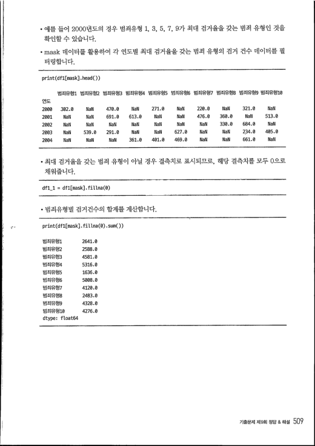
- 예를 들어 2000년도의 경우 범죄유형 1, 3, 5, 7, 9가 최대 검거율을 갖는 범죄 유형인 것을
확인할 수 있습니다．

- mask 데이터를 활용하여 각 연도별 최대 검거율을 갖는 범죄 유형의 검거 건수 데이터를 필
터링합니다．

```python
print(dfltmask] .headQ)
```
범죄유형1 범죄유형2 범죄유형3 범죄유형4 범죄유형5 범죄유형6 범죄유형7 범죄유형8 범죄유형9 범죄유형10 연도 2000 302.0 NaN 470.0 NaN 271.0 NaN 220.0 ＂柳l 321.0 NaN 200].

NaN NaN 691.0 613.0 NaN NaN 476.0 360.0 NaN 513.0 2002 NaN NaN NaN NaN NaN NaN NaN 330.0 684.0 NaN 2003 NaN 539.0 291.0 NaN NaN 627.0 NaN NaN 234.0 405.0 2004 NaN NaN NaN 361.0 401.0 469.0 NaN NaN 661.0 NaN

- 최대 검거율을 갖는 범죄 유형이 아닐 경우 결측치로 표시되므로 , 해당 결측치를 모두 0으로
채워줍니다．

```python
dfl_1 = dfl[niaskj.fillna(0)
```
- 범죄유형별 검거건수의 합계를 계산합니다．
```python
print(dfl[niask] . fi].Lna (0). sumO)
```
범죄유형1 2641.0 범죄유형2 2588.0 범죄유형3 4581.0 범죄유형4 5316.0 범죄유형5 1636.0 범죄유형6 5008.0 범죄유헝7 4120.0 범죄유형8 2483.0 범죄유형9 4328.0 범죄유형10 4276.0 dtype: f1oat64 기출문제제9회정답＆해설 509

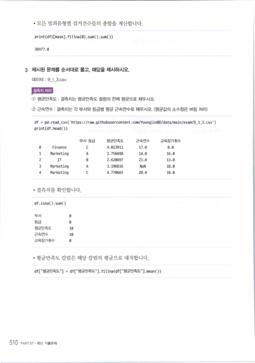
- 모든 범죄유형별 검거건수들의 총합을 계산합니다．
```python
print(dfl[niask] .fillna(0) .sum() .sumQ)
```
36977.0 3 제시된 문제를 순서대로 풀고 , 해답을 제시하시오． 데이터 : 9_1_3.csv 결측치 처리 ① 평균만족도 : 결측치는 펑균만족도 컬럼의 전체 펑균으로 채우시오． ② 근속연수 : 결측치는 각 부서와 등급별 평균 근속연수로 채우시오 . （평균값의 소수점은 버림 처리）

```python
df = pd.read_csv( https://raw.githubusercontent.com/YoungjinBD/data/main/exam/9_1_3.csv ') 
print(df.head())
```
부서 등급 평균만족도 근속연수 교육참가횟수 0 Finance C 4.023911 17.0 8.0 1 Marketing A 3.756698 14.0 16.0 2 IT B 2.628697 21.0 13.0 3 Marketing A 3.196616 NaN 18.0 4 Marketing C 4.770665 28.0 10.0

- 결측치를 확인합니다．
df.isna( ) .sum() 부서 0 등급 0 펑균만족도 10 근속연수 10 교육참가횟수 0

- 평균만족도 칼럼은 해당 칼럼의 평균으로 대치합니다．
df[ " 평균만족도 " ] = df[ "평균만족도"].fillna(df[ "평균만족도 " 〕．mean()) 510 PART07 . 최신 기출문저

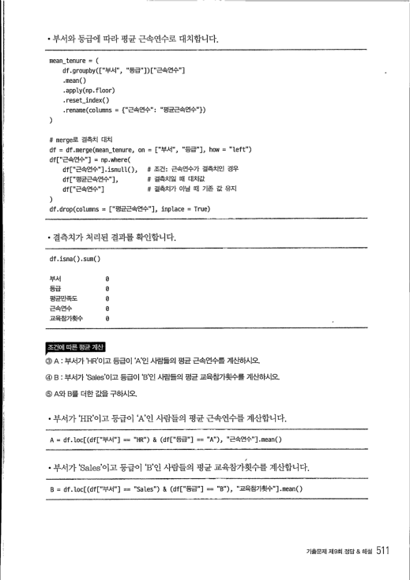
- 부서와 등급에 따라 평균 근속연수로 대치합니다．
```python
mean_tenure = ( 
df.groupby({ " 부서 " , " 등급 " ])[. " 근속연수 " 〕
```
.mean() .apply(np.fLoor) . reset_index() . renanie(columns = { " 근속연수 " . " 평균근속연수 " })

```python
# merge로 결측치 대치
```
= [ " 부서 " , " 등급 " 〕’ how = "left ') df = df.merge(mean..tenure, on df[ " 근속연수 " ] = np.where( df[ " 근속연수 " ].isnuflO, df{ " 평균근속연수 " 〕， dff " 근속연수 " 〕

```python
# 조건＝ 근속연수가 결측치인 경우
# 결측치일 때 대치값
# 결측치가 아닐 때 기존 값 유지
```
df. drop(colunins = [ " 평균근속연수 " 〕， iriplace = True)

- 결측치가 처리된 결과를 확인합니다．
df.isnaQ.sumO 부서 0 등급 0 평균만족도 0 근속연수 0 교육참가횟수 0 조건에 따른 평균 계산 ③ A : 부서가 ' HR ' 이고 등급이 ' A ' 인 사람들의 평균 근속연수를 계산하시오． ④ B : 부서가 ' Sales ' 이고 등급이 ' B ' 인 ㅅ남들의 펑균 교육참가횟수를 계산하시오．

# ;
⑤ A와 B를 더한 값을 구하시오．

- 부서가 ' HR ' 이고 등급이 ' A ' 인 사람들의 평균 근속연수를 계산합니다．
```python
A = df. 1.oc[(df[ " 부서 " ] - 
"HR") & (df[ " 등급 " 〕 == "A"), " 근속연수 " ].mean()
```
- 부서가 ' Sales ' 이고 등급이 ' B ' 인 사람들의 평균 교육참가횟수를 계산합니다．
B ㅁ df. 1.oc[(df[ " 부서 " ] == "Sales") & (df[ " 등급 " 〕 - "B"), " 교육참가횟수 " ].mean() 기출문제제9회；정답＆해설 511

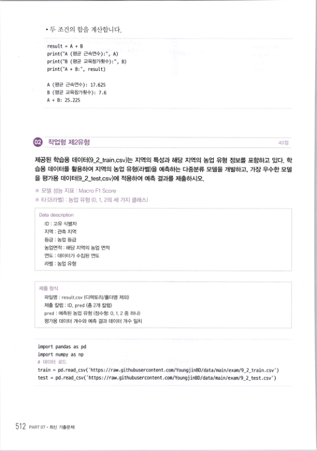
- 두 조건의 합을 계산합니다．
```python
resul.t = A + B 
print("A （평균 근속연수）:", A) 
print("B （평균 교육참가횟수）:", B) 
print('A + B:", resu't)
```
A （평균 근속연수）: 17.625 B （평균 교육참가횟수）: 7.6 A + B: 25. 225 .

작업형제2유형 40점 제공된 학습용 데이터（9_2_train.csv）는 지역의 특성과 해당 지역의 농업 유형 정보를 포함하고 있다 . 학 습용 데이터를 활용하여 지역의 농업 유형（라벨）을 예측하는 다韆류 모델을 개발하고 , 가장 우수한 모델 을 평가용 데이터（9_2_test.csv）에 적용하여 예측 결과를 제출하시오． ※ 모델 성능 지표 : Macro Fl Score ※ 타깃（라벨） : 농업 유형 (0, 1, 2의 세 가지 클래스） Data description ㄸ〕 : 고유 식별자 지역 : 관측 지역 등급 : 농업 등급 농업면적 ; 해당 지역의 농업 면적 연도 : 데이터가 수집된 연도 라벨 : 농업 유형 l제출형식 파일명 : resu[t.csv （디렉토리／폴더명 제외） 제출 칼럼 : ID, pred （총 2개 칼럼） pred ; 예측된 농업 유형 （정수형： 0. 1. 2 중 하나） 펑가용 데이터 개수와 예측 결과 데이터 개수 일치

```python
import pandas as pd 
import numpy as np
# 데이터 로드 
train = pd.read_csv( https://raw.githubusercontent.com/YoungjinBD/data/main/exam/9_2tra1n.csv') 
test = pd.read_csv(' https://raw.githubusercontent.com/YoungjinBD/data/main/exam/9_2_test.csv')
```
引2 PART 07. 최신 기출문제

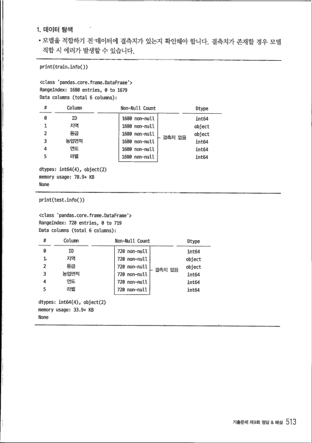
1 , 데이터 탐색 " ' 모델을 적합하기 잔'데」이터얘결측치가 있는지 확인해야 합니다 . 결측치가 존재할 경우 모델 적합 시 에러가 발생할 수 있습니다．

```python
print(』train.infoQ)
```
<class 'pandas. core. frame.. DataFranie'> Rangelndex: 1680 entries, 」 0 to 1679 Data columns (total. 6 columns):

```python
# 
Column 
Non-Null Count
```
Dtype 0 工D 1680 non-null 긔it64 object object int64 int64 int64 1 지역 1680 non-null 2 등급 1680 non-null

- 결측치 없음
3 농업면적 1680 non-null 4 연도 1680 non-null 5 라벨 1680 non-null dtypes: int64(4), object(2) memory usage: 78.9+ KB None

```python
print(test.infoQ)
```
<class ' pandas. core. frame. DataFrame ' > Range工ndex: 720 entries, 0 to 719 Data columns (total 6 columns):

```python
# 
Column
```
Non-Null Count Dtype 0 工D 720 non-null int64 object object int64 1, 지역 720 non-null 2 등급 720 non-null

- 결측치 없음
3 농업면적 720 non-null 4 연도 720 non-null 최it64 int64 5 라벨 720 non-null dtypes: int64(4), object(2) memory usage: 33.9-i- KB N이1e 기출문저！제9회정답＆해설 513

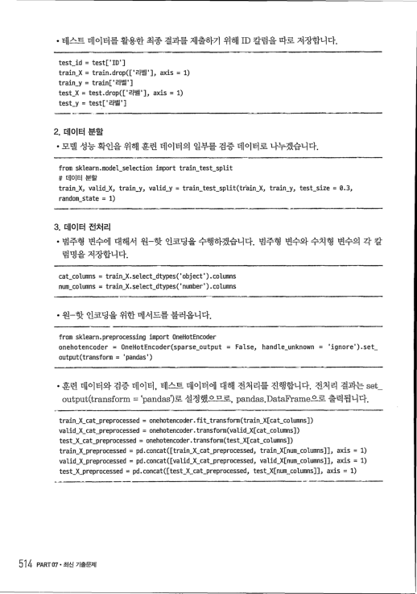
- 테스트 데이터를 활용한 최종 결과를 제출하기 위해 II) 칼럼을 따로 저장합니다．
```python
test-id = test['ID'] 
train_X = train.drop({ 'aF벨'] , axis 
train_y = train[ ' 라벨 ' ] 
te$t-x 흡 te$t. dn〕p([; ' 라벨' '1
test_X = test.drop([ 
j, axis 
test_y = test[ ' 라벨 ' 그
```
= 1) = 1) 2 . 데이터 분할

- 모델 성능 확인을 위해 훈런 데이터의 일부를 검증 데이터로 나누겠습니다．
```python
from sklearn.model_selection import train_test_split 
# 데이터 분할 
train_X, vaLid_X, train-y, valid_y = train_test_split(train_X, train_y, test_size = 0.3,
random_state = 1)
```
3 , 데이터 전처리

- 범주형 변수에 대해서 원－핫 인코딩을 수행하겠습니다 . 범주형 변수와 수치형 변수의 각 칼
럼명을 저장합니다．

```python
cat_columns = train_X.select_dtypes('object').columns
num_colurnns = train_X.select_dtypes('number').columns
```
- 원－핫 인코딩을 위한 메서드를 불러옵니다．
```python
from sklearn.preprocessing import OneHotEncoder 
onehotencoder = oneHotEncoder(sparse_output = False, handle_unknown = 'ignore').set_
```
output(transform = ' pandas')

- 훈런 데이터와 검증 데이터 , 테스트 데이터에 대해 전처리를 진행합니다 . 전처리 결과는 set-
output(transform = 'pandas'）로 설정했으므로 , pandas. DataFrame으로 출력됩니다．

```python
train_X_cat_preprocessed = onehotencoder. fit_transform(train_X[cat_columns]) 
valid_X_cat_preprocessed = onehotencoder. transform(valid_X{cat_columns]) 
test_X_cat_preprocessed = onehotencoder. transform(test_X[cat_columnsj) 
train_X_preprocessed = pd.concat({train_X_cat_preprocessed, train_X[num_colunins]], axis = 1)
valid_X_preprocessed = pd.concat([valid_X_cat_preprocessed, valid_X[nuni_columnsj], axis = 1)
test_X_preprocessed = pd.concat([test_X_cat_preprocessed, test_X[num_columns]], axis = 1)
```
514 PART07．초I신 기출문제

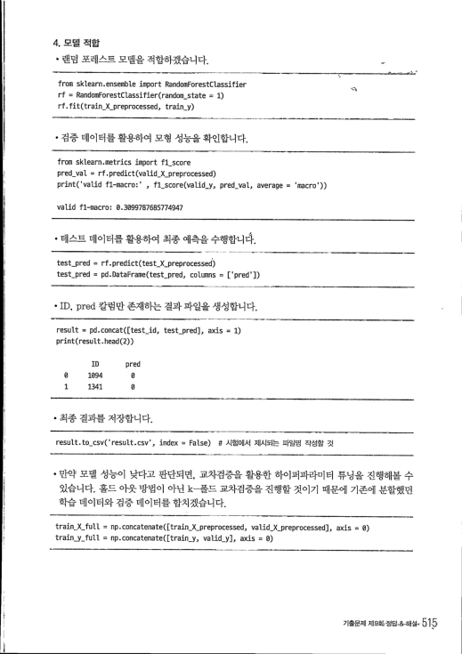
4 . 모델 적합

- 랜덤 포레스트 모델을 적합하겠습니다．
```python
from sklearn.ensembl.e import RandomForestClassifier 
rf = RandomForestClassifier(random_state = 1) 
rf. fit (train_X_preprocessed, train_y)
```
- 검증 데이터를 활용하여 모형 성능을 확인합니다．
```python
from sklearn.metrics import fl_score 
pred_val = rf.predict(valid_X_preprocessed) 
print('val.id fl-macro:' , fl_score(valid_y, pred_val, average = 'macro'))
```
valid fl-macro: 0.3099787685774947

- 테스트 데이터를 활용하여 최종 예측을 수행합니타．
```python
test_pred = rf.predict(test_X-preprocessed) 
test_pred = pd.DataFrame(test_pred, columns = ['pred'])
```
- ID, pred 칼럼만 존재하는 결과 파일을 생성합니다．
```python
result = pd.concat([test_id, test_pred], axis = 1) 
print(resul.t . head(2))
```
ID pred 0 1094 0 1 1341 0

- 최종 결과를 저장합니다．
result.to_csv('resul.t.csv " index = False) # 시험에서 제시되는 파일명 작성할 것

- 만약 모델 성능이 낮다고 판단되면 , 교차검증을 활용한 하이퍼파라미터 튜닝을 진행해볼 수 
있습니다 . 흘드 아웃 방법이 아닌 k－폴드 교차검증을 진행할 것이기 때문에 기존에 분할했던 학습 데이터와 검증 데이터를 합치겠습니다．

```python
train_X_full. = np.concatenate([train_X_preprocessed, valid_X_preprocessed], axis = 0) 
train_y_full = np.concatenate([train_y, valid_y], axis = 0)
```
기출문제 1I9회） ．정답《＆.，해설‘，剔454

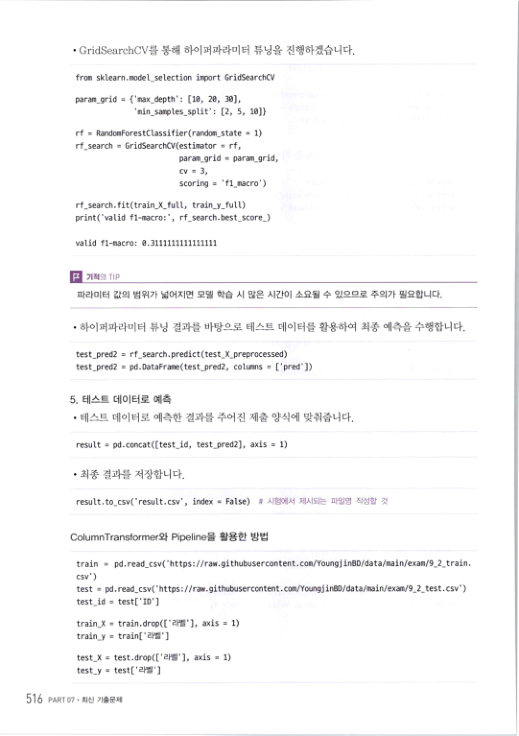
- GridSearchCV를 통해 하이퍼파라미터 튜닝을 진행하겠습니다．
```python
from sklearn.model_selection import GridSearchCV
param_grid = { 'max_depth ' : [10, 20, 30], 
' min_samples_spUt ' : [2, 5, 10]}
rf = RandomForestClassifier(random_state = 1) 
rf_search = GridSearchCV(estimator = rf,
param_grid = param_grid,
cv = 3, 
scoring = ' fl_macro' )
rf_search.fit (train_X_fufl, train_y_fufl) 
print('valid fl-macro: ', rf_search.best_score_)
```
valid fl-macro: 0.3111111111111111 .

기적의 뀌P 파라미터 값의 범위가 넓어지면 모델 학습 시 많은 시간이 소요될 수 있으므로 주의가 필요합니다．

- 하이퍼파라미터 튜닝 결과를 바탕으로 테스트 데이터를 활용하여 최종 예측을 수행합니다．
```python
test_pred2 = rf_search.predict(test_X_preprocessed) 
test_pred2 = pd.DataFrame(test_pred2, columns = ['pred '] )
```
5 . 테스트 데이터로 예측

- 테스트 데이터로 예측한 결과를 주어진 제출 양식에 맞춰줍니다．
```python
result = pd.concat([test_id, test_pred2], axis = 1)
```
- 최종 결과를 저장합니다．
```python
result.to-csv( ' result.csv', index = False) 
# 시험에서 제시되는 파일명 작성할 것
```
ColumnTransformer와 Pipeline을 활용한 방법

```python
train = pd.read_csv( 'https://raw.githubusercontent.com/YoungjinBD/data/main/exam/9-2_train.
```
csv

```python
test = pd.read_csv(https://raw.githubusercontent.com/YoungjinBD/data/main/exam/9_2_test.csv ') 
test_id = test[ 'ID ']
train_X = train.drop([ 'aF벨 '] , axis = 1) 
train_y = train[ '라벨 ' ]
test_X = test. dr이〕（[ ' 라벨 ' ], axis = 
test_y = test[ '라벨' ] 
1)
```
引 6 PART 07 . 최신 기출문저

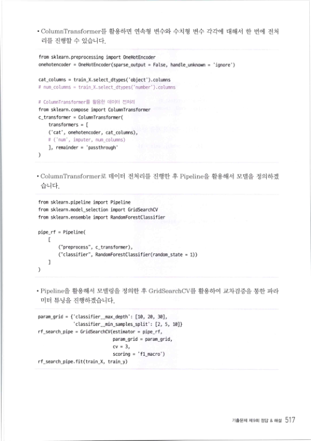
- ColumnTransformer를 활용하면 연속형 변수와 수치형 변수 각각에 대해서 한 번에 전처
리를 진행할 수 있습니다．

```python
from sklearn.preprocessing import OneHotEncoder 
onehotencoder = OneHotEncoder(sparse_output = False, handle_unknown = ' ignore ')
cat_columns = train_X.select_dtypes( 'object ') .columns 
# num_columns = train_X.select_dtypes( 'number') .cothmns
# ColumnTransformer를 활용한 데이터 전처리
from sklearn.compose import Columnlransformer
c_transformer = Columnlransformer( 
transformers = [ 
( 'cat', onehotencoder, cat_columns),
# ( 'num, imputer, num_cotunins) 
], remainder = ' passthrough
```
- ColumnTransformer로 데이터 전처리를 진행한 후 Pipeline을 활용해서 모델을 정의하겠
습니다．

```python
from sklearn.pipeline import Pipeline 
from sklearn.model_selection import GridSearchCV 
from sklearn.ensemble import RandomForestClassifier
```
pipe_rf = Pipeline( 〔 ("preprocess", c_transformer), ("classifier", RandomForestClassifier(random_state = 1)) ]

- Pipeline을 활용해서 모델링을 정의한 후 GridSearchC\／를 활용하여 교차검증을 통한 파라
미터 튜닝을 진행하겠습니다．

```python
param_grid = {'classifier__max_depth' : [10, 20, 30], 
'classifier__min_samples_spUt ' : [2, 5, lOfl 
rf_search_pipe = GridSearchCV(estimator = pipe_rf,
param_grid = param_grid, 
cv = 3, 
scoring = 'fl_macro') 
rf_search_pipe.fit (train_X, train_y)
```
기출문제 저9회 정답 & 해설 引 7

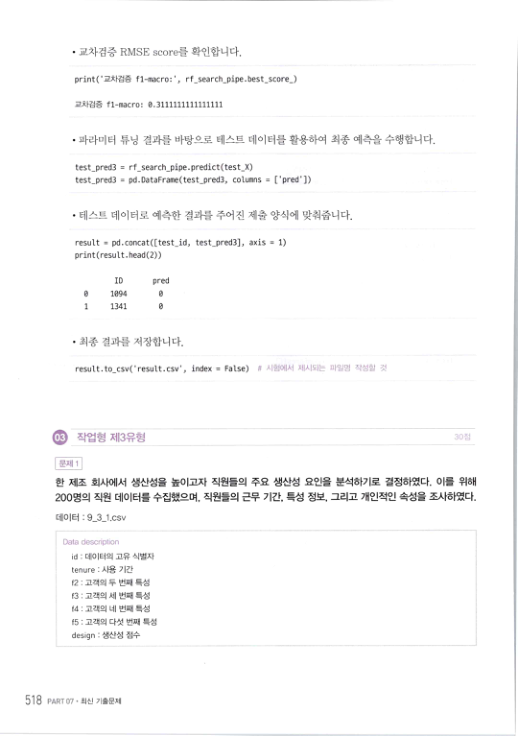
- 교차검증 RMSE score를 확인합니다．
```python
print(' 교차검증 fl-macro: ', rf_search_pipe.best_score_)
```
교차검증 fl- macro: 0.3111111111111111

- 파라미터 튜닝 결과를 바탕으로 테스트 데이터를 활용하여 최종 예측을 수행합니다．
```python
test-pred3 = rf_search_pipe.predict(test_X) 
test_pred3 = pd.DataFrame(test-pred3, columns = [ 'pred' ])
```
- 테스트 데이터로 예측한 결과를 주어진 제출 양식에 맞춰줍니다．
```python
result = pd.concat([testjd, test_pred3], axis = 1) 
print(result . head(2))
```
ID pred 0 1094 0 1 1341 0

- 최종 결과를 저장합니다．
```python
result.to-csv( 'result.csv' , index = False) 
# 시험에서 제시되는 파일명 작성할 것
```
ㅇ 작업형제3유형 3o심 문제 1 한 제조 회사에서 생산성을 높이고자 직원들의 주요 생산성 요인을 분석하기로 결정하였다 . 이를 위해 200명의 직원 데이터를 수집했으며 , 직원들의 근무 기간 , 특성 정보 , 그리고 개인적인 속성을 조사하였다． 데이터 : 9- 3- 1 .csv id : 데이터의 고유 식별자 tenure : 사용 기간 f2 : 고객의 두 번째 특성 f3 : 고객의 세 번째 특성 f4 : 고객의 네 번째 특성 f5 : 고객의 다섯 번째 특성 design : 생산성 점수 518 PART07 · 최신 기출문저

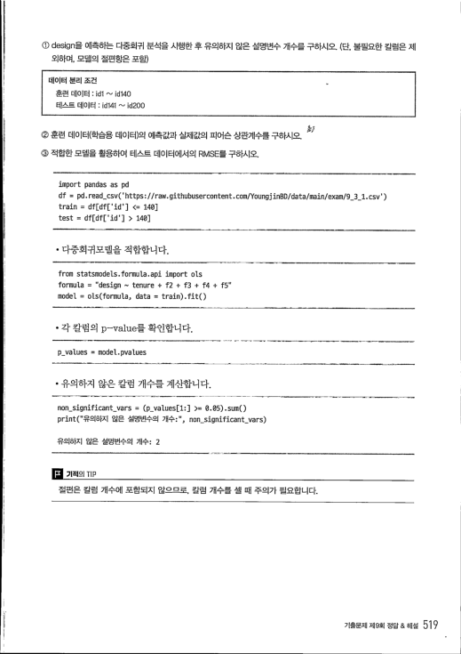
①design을 예측하는 다중회귀 분석을 시행한 후 유의하지 않은 설명변수 개수를 구하시오 . （단 , 불필요한 칼럼은 제 외하며 , 모델의 절펀항은 포함） 데이터 분리 조건 훈련 데이터 : i dl " ' 1d140 테스트 데이터 : 1d141 ∼ 1d200 ② 훈련 데이터（학습용 데이터）의 예측값과 실제값의 피어슨 상관계수를 구하시오． ③ 적합한 모델을 활용하여 테스트 데이터에서의 RMSE를 구하시오．

```python
import pandas as pd 
df = pd. read_csv('https://raw.githubusercontent.com/YoungjinBD/data/main/exam/g-3-1.csv ') 
train = df[df['id'] <= 140] 
test = df[df[ 'id'] > 140]
```
- 다중회귀모델을 적합합니다．
```python
from statsmodels.formula.api import ols 
formula = "design ` tenure + f2 + f3 + f4 + f5" 
model = ols(formula, data = train).fitQ
```
- 각 칼럼의 p-value를 확인합니다．
```python
p_values = model.pvalues
```
- 유의하지 않은 칼럼 개수를 계산합니다．
```python
non_significant_vars = (p_values[1:] >= 0.05).sumQ 
print(" 유의하지 않은 설명변수의 개수： ", non_significant_vars)
```
유의하지 않은 설명변수의 개수＝ 2 r헴 기적의 ㄲp 절편은 칼럼 개수에 포함되지 않으므로 칼럼 개수를 셀 때 주의가 필요합니다． 기출문제제9회정답＆해설 519

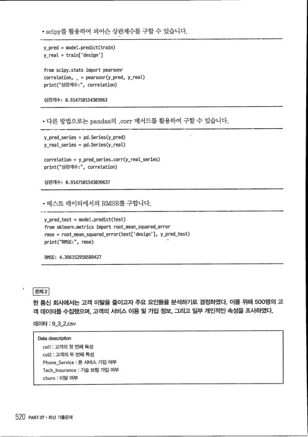
- scipy를 활용하여 피어슨 상관계수를 구할 수 있습니다．
```python
y_pred = niodel.predict(train)
y_real = train['design']
from scipy.stats import pearsonr 
correlation, - = pearsonr(y_pred, y_real) 
print(" 상관계수： " ' correlation)
```
상관계수： 0.914750154303963

- 다른 방법으로는 pandas의 . corr 메서드를 활용하여 구할 수 있습니다．
```python
y_pred_series = pd.Series(y_pred)
y_real_series = pd.Series(y_real)
correlation = y_pred_series. corr(y_real_series) 
print(" 상관계수＝ " ' correlation)
```
상관계수： 0.9147501543039637

- 테스트 데이터에서의 RMSE를 구합니다．
```python
y_pred_test = model.predict(test)
from sklearn.metrics import root_mean_squared_error
rmse = root_mean_squared_error(test[ 'design'], y_pred_test) 
print("RMSE:", rmse)
```
RuSE: 4.396152958589427 문제 2 한 통신 회사에서는 고객 이탈을 줄이고자 주요 요인들을 분석하기로 결정하였다 . 이를 위해 500명의 고 객 데이터를 수집했으며 , 고객의 서비스 이용 및 가입 정보 , 그리고 일부 개인적인 속성을 조사하였다． 데이터 : 9- 3- 2.csv Data description coti : 고객의 첫 번째 특성 coL2 : 고객의 두 번째 특성 Phone_Service : 폰 서비스 가입 여부 TecUnsurance : 기술 보험 가입 여부 churn : 이탈 여부 520 PART 07·최신기출문제

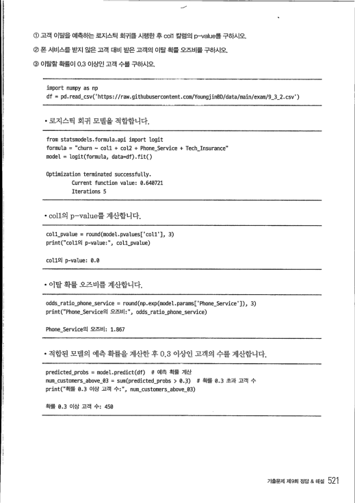
① 고객 이탈을 예측하는 로지스틱 회귀를 시행한 후 coil 칼럼의 p-v톄ue를 구하시오． ② 폰 서비스를 받지 않은 고객 대비 받은 고객의 이탈 확률 오즈비를 구하시오． ③ 이탈할 확률이 0.3 이상인 고객 수를 구하시오．

```python
import numpy as np 
df = pd.read_csv( 'https://raw.githubusercontent.com/YoungjinBD/data/main/exam/9_3_2.csv')
```
- 로지스틱 회귀 모델을 적합합니다．
```python
from statsmodel.s.formula.api import logit 
formula = "churn ` coil + c012 + Phone Service + Tech Insurance"
model = logit(formula, data=df).fitQ
```
Optimization terminated successfully.

Current function value: 0.640721 Iterations 5

- coil의 p-value를 계산합니다．
```python
coll_pvalue = round(model.pva1uesE 'c011'] , 3) 
print("co1121 p-value:", coll-pvalue)
```
coll2l p-value: 0.0

- 이탈 확률 오즈비를 계산합니다．
```python
odds_ratio_phone_service = round(np.exp(model.params[ 'Phone_Service'] ), 3) 
print("Phone_Service의 오즈Ui:", odds_ratio_phone_service)
```
Phone Service의 오즈비： 1.867

- 적합된 모델의 예측 확률을 계산한 후 0.3 이상인 고객의 수를 계산합니다．
```python
predicted_probs = model. predict (df) # 예측 확률 계산
num_customers_above_03 = sum(predicted_probs > 0.크） # 확률 0.3 초과 고객 수 
print(" 확률 0.3 이상 고객 수： " , num_customers_above_03)
```
확률 0.3 이상 고객 수： 450 기출문제제9회정답＆해설 521

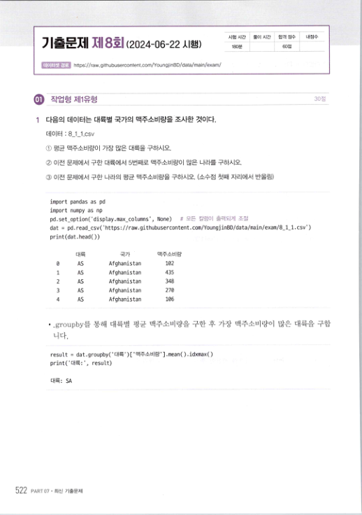
시험 시간 풀이 시간 합격 점수 내점수

## 기출문제 제8회 (2024-06-22 시햄）
180 60점 https://raw.githubusercontent.com/YoungjinBD/data/main/exam/ 30졈 .

작업형제1유형 1 다음의 데이터는 대륙별 국가의 맥주소비량을 좌 한 것이다． 데이터 : 8- 1- 1.csv ① 평균 맥주소비량이 가장 많은 대륙을 구하시오． ② 이전 문제에서 구한 대륙에서 5번째로 맥주소비량이 많은 나라를 구하시오． ③ 이전 문제에서 구한 나라의 평균 맥주소비량을 구하시오 . （소수점 첫째 자리에서 반올림）

```python
import pandas as pd 
import numpy as np
pd . set_option (' display. max_columns' , None) 
# 모든 칼럼이 출력되게 조절
dat = pd.read_csv( ' https://raw.githubusercontent.com/YoungjinBD/data/main/exam/8_1_1.csv' ) 
print(dat.head())
```
대륙 국가 맥주소비량 0 AS Afghanistan 102 1 AS Afghanistan 435 2 AS Afghanistan 348 3 AS Afghanistan 270 4 AS Afghanistan 106

- .groupby를 통해 대륙별 평균 맥주소비량을 구한 후 가장 맥주소비량이 많은 대륙을 구합
니다．

```python
result = dat. groupby('대륙 ' )[ ' 맥주소비량 ' ].meanO.idxmax() 
print(' 대륙： ' , result)
```
대륙＝ SA 522 PART 07 . 최신 기출문제

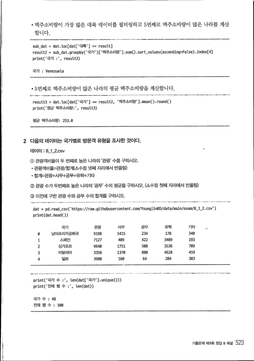
- 맥주소비량이 가장 많은 대륙 데이터를 필터링하고 5번째로 맥주소비량이 많은 나라를 계산
합니다．

```python
sub_dat = dat.1.oc[dat[ 'E륙'] == result]
resu1t2 = sub_dat.groupby( ' 국가 ')[' 맥주소비량 '] .suin() .sort_values(ascending=False) .index[4] 
print(' 국가 : ' 』 resul.t2)
```
국가 = Venezuela .5번깨로 맥주소비량이 많은 나라의 평균 맥주소비량을 계산합니다．

```python
resu1t3 = dat. loc[dat[ ' 국가 ' ] - 
resu1t2" 
액주소비량 ' ].meanQ.round() 
print(' 평균 맥주소비량： ', resu1t3)
```
평균 맥주소비량： 253.0 2 다음의 데이터는 국가별로 방문객 유형을 조사한 것이다． 데이터 : 8- 1- 2.csv ① 관광객비율이 두 번째로 높은 나라의 ' 관광 ' 수를 구하시오．

- 관광객비율＝관광／합계（소수점 넷째 자리에서 반올림）
- 합계＝관광＋사뮈공뮈 유학＋기타
② 관광 수가 두번째로 높은 나라의 ' 공무 ' 수의 평균을 구하시오 . （소수점 첫째 자리에서 반올림） ③ 이전에 구한 관광 수와 공무 수의 합계를 구하시오，

```python
dat = pd.read_csv('https://raw.githubusercontent.com/YoUngiiflBD/data/fllaifl/eXam/8_1_2.CSV ')
print(dat.headQ)
```
국가 관광 사무 공무 유학 기타 0 남아프리카공화국 9198 1415 234 178 340 1 스 flhl인 7127 409 422 3489 193 2 싱가皿 9640 1751 508 3536 709 3 이탈리아 3358 1370 880 4620 459 4 일본 3980 160 64 204 303

```python
print(' 국가 수 = ' , len(dat[ ' 국가 ' ] .uniqueO)) 
print(' 전체 행 수 = ' , len(dat))
```
국가 수 = 48 전체 행 수 : 100 기출문제 제8회 정답 & 해설 523

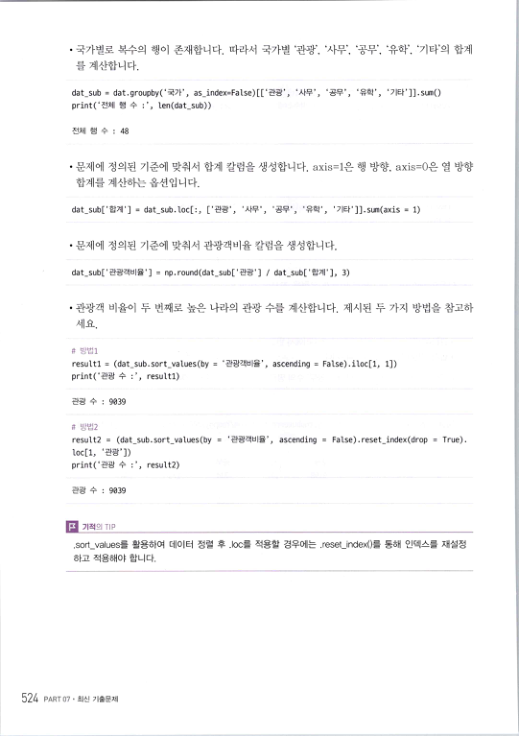
- 국가별로 복수의 행이 존재합니다 . 따라서 국가별 ' 관광 ' , ' 사무 ' , ' 공무 ' , ' 유학’ , ' 기타'의 합계 
를 계산합니다．

```python
dat_sub = dat.groupby( ' 국가 ' , as_index=Fa1se) [[ ' 관광 ' , ' 사무 ' , ' 공무 ' , ' 유학 ' , ' 기타 ' ]].sum() 
print(' 전체 행 수 = ', len(dat_sub))
```
전체 행 수 : 48

- 문제에 정의된 기준에 맞춰서 합계 칼럼을 생성합니다 . axis=l은 행 방향 , axis=O은 열 방향
합계를 계산하는 옵션입니다． dat_s미〕［. ' 합계 ' ] = dat_sub. toc[:, [. ' 관광 ' , ' 사무 ' , ' 공무 ' , 유학닙 ’기타’ ]].surn(axis = 1)

- 문제에 정의된 기준에 맞춰서 관광객비율 칼럼을 생성합니다．
dat_sub[ ' 관광객비율 ' ] = np. round(dat_sub[ ' 관광 ' ] / dat_sub[ ' 합계 ' ], 3)

- 관광객 비율이 두 번째로 높은 나라의 관광 수를 계산합니다 . 제시된 두 가지 방법을 참고하
세요．

```python
# 방법1 
resultl = (dat_sub.sort_values(by = ' 관광객bI율', ascending = False).iloc[1, 1]) 
print(' 관광 수 = ', resulti)
```
관광 수 : 9039

```python
# 방법2
resu1t2 = (dat_sub.sortvalues(by = ' 관광객비뮬 ' , ascending = False).reset_index(drop = True). 
loc[1., ' 관광 ' ]) 
print(' 관광 수 : ', resu1t2)
```
관광 수 : 9039 .

기적의 지P .sorLvalues를 활용하여 데이터 정렬 후 . b )c를 적용할 경우에는 . reseUndex(）를 통해 인덱스를 재설정 하고 적용해야 합니다． 524 PART 07 * 최신 기출문제

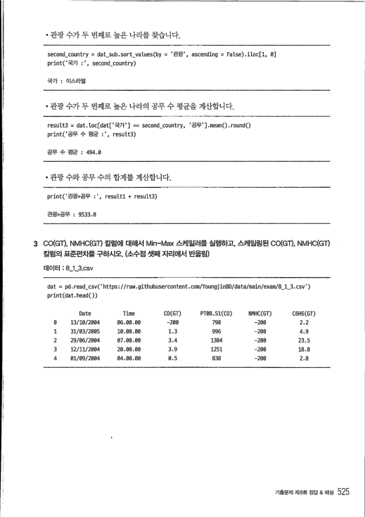
- 관광 수가 두 번째로 높은 나라를 찾습니다．
```python
second_country = dat_sub.sort_values(by = ' 관광 ' , ascending = False).il.oc[1, 0] 
print(' 국가 :', second_country)
```
국가 = 이스라엘

- 관쾅 수가 두 번째로 높은 나라의 공무 수 평균을 계산합니다．
```python
resu1t3 = datdoc[dat[' 국가'] == second_country, ' 공무'] .mean() .roundO 
print(' 공무 수 펑균 : ', resu1t3)
```
공무 수 평균 = 494.0

- 관광 수와 공무 수의 합계를 계산합니다．
```python
print(' 관광＋공무 : " resul.tl + resuLt3)
```
관광＋공무 = 9533.0 3 CO(GT), NMHC(GT) 칼럼에 대해서 贓n-Max 스케일러를 실행하고 , 스케일링된 co(GT), NMHC(GT) 칼럼의 표준편차를 구하시오 . （소수점 셋째 ㅈH에서 반올림） 데이터 : 8- 1- 3.csv

```python
dat = pd.read_csv( 'https://raw.githubusercontent.com/YoungjinBD/data/main/exam/8_1_3.csv') 
print(dat.headQ)
```
Date Time CO(GT) PT08.S1(CO) NMHC(GT) C61-I6(GT) 0 13/10/2004 06.00.00 -200 798 -200 2.2 1 31/03/2005 10.00.00 1.3 996 -200 4.9 2 29/06/2004 07.00.00 3.4 1384 -200 23.5 3 12/11/2004 20.00.00 3.9 1251 -200 18.8 4 01/09/2004 04.00.00 0.5 838 -200 2.8 기출문제제8회정답＆해설 525

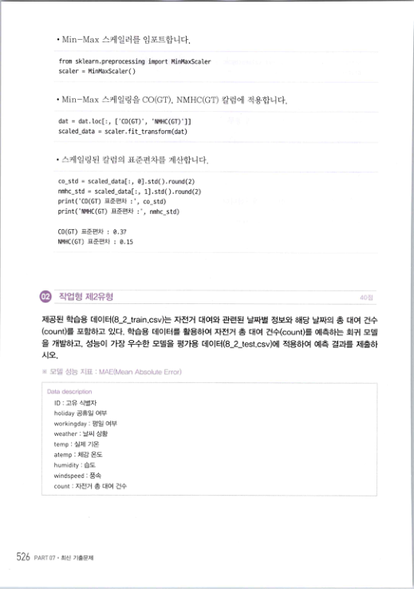
- Min-Max 스케일러를 임포트합니다．
```python
from sklearn.preprocessing import MinMaxScaler 
scaler = MinMaxScaler()
```
- Min-Max 스케일링을 CO(GT), NMHC(GT) 칼럼에 적용합니다．
```python
dat = dat.loc[:, [CO(GT) ' , ' NMHC(GT) '] ] 
scaled_data = scaler.fit_transform(dat)
```
- 스케일링된 칼럼의 표준편차를 계산합니다．
```python
co_std = scaled_data[:, 0].stdO.round(2)
nmhc_std = scaled_data[:, 1] .std( ) . round(2) 
print(' CO(GT) 표준편차 : " co_std) 
print(' NMHC(GT) 표준편차 : ' , nmhc_std)
```
CO((지 표준편차 : 0.37 NMHC(GT) 표준편차 : 0.15 제공된 학습용 데이터（8-2-train.csv）는 자전거 대여와 관련된 날짜별 정보와 해당 날짜의 총 대여 건수 (count）를 포함하고 있다 . 학습용 데이터를 활용하여 자전거 총 대여 건수（count）를 예측하는 회귀 모델 을 개발하고 , 성능이 가장 우수한 모델을 평가용 데이터（8_2_test.csv）에 적용하여 예측 결과를 제출하 시오． ※ 모델 성능 지표 ; MAE曲ean Absolute Error) Data description ＂〕 : 고유 식별자 holiday 공휴일 여부 workingday : 펑일 여부 weather : 날씨 상황 ten가〕 : 실제 기온 atemp : 체감 온도 hun기dity : 습도 windapeed : 풍속 count : 자전거 총 대여 건수 526 PART07．최신 기출문제

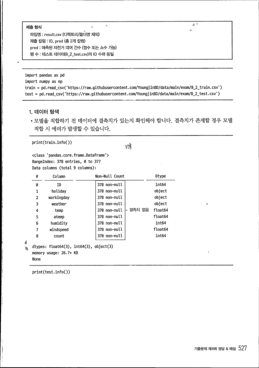
제출 형식 " 파일명F result.csv（디렉토리／폴더명“제외） 제출 칼럼 : ID, pred （총 2개 칼럼） pred : 예측된 자전거 대여 긴수 （정수 또는 소수 가능） 행 수 : 테스트 데이터（8-2싣test.csv）의 ＂〕 수와 동일

```python
import pandas as pd 
import numpy as np 
train = pd.read_csv( 'https://raw.githubusercontent.com/YoungjinBD/data/main/exam/8_2._train.csv') 
test = pd.read_csv('https://raw.githubusercontent.com/YoungjinBD/data/main/exam/8-2. test.csv')
```
1 , 데이터 탐색

- 모델을 적합하기 전 데이터에 결측치가 있는지 확인해야 합니다 . 결측치가＂존재할 경우 모델
적합 시 에러가 발생할 수 있습니다．

```python
逵 
print(train.infoQ)
```
<class 'pandas.core.frame.DataFrame'> Rangelndex: 378 entries, 0 to 377 Data columns (total 9 columns):

Dtype Non-Null Count

# 
Column 0 끄：) 378 non-null int64 object object object

- 결측치 없음 
f1oat64 f1oat64 int64 f1oat64 int64 378 non-null 1 holiday 2 workingday 378 non-null 378 non-null 3 weather 4 temp I 378 non-null 378 non-null 5 atemp 378 non-null 6 humidity 378 non-null 7 windspeed 378 non-null 8 count dtypes: f10at64(3), int64(3), object(3) ㅗ ∼ 流 ㄴ memory usage: 26.7+ KB None

```python
print(test.infoQ)
```
기출문제 제8회 정답 & 해설 527

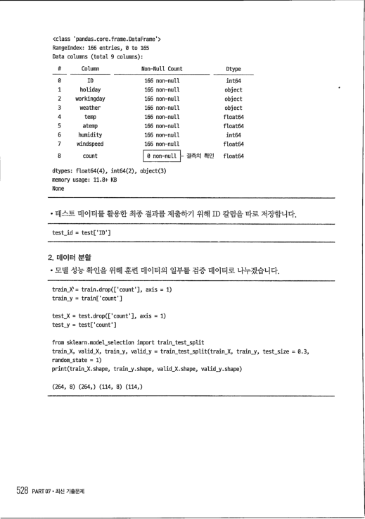
<class 'pandas.core.frame.DataFrame'> Range工ndex: 166 entries, 0 to 165 Data columns (total 9 columns):

# 
Column Non-Null Count Dtype 0 지：) 166 non-null int64 object object object 1 holiday 166 non-null 2 workingday 166 non-null 3 weather 166 non-null 4 temp 166 non-null f1oat64 5 atemp 166 non-null f1oat64 int64 f1oat64 6 humidity 7 windspeed 166 non-null 166 non-null 8 count

- 결측치 확인 
f1oat64 0 non-null dtypes: f10at64(4), 1nt64(2), object(3) memory usage: 11.8+ KB None

- 테스트 데이터를 활용한 최종 결과를 제출하기 위해 ID 칼럼을 따로 저장합니다．
```python
test_id = test[ 'ID ']
```
2 , 데이터 분할

- 모델 성능 확인을 위해 훈런 데이터의 일부를 검증 데이터로 나누겠습니다．
```python
train_X'= train.drop([ 'count '] , axis = 1) 
train_y = trainE 'count ']
test_X = test.drop([ 'count '] , axis = 1) 
test_y = test[ 'count ']
from sklearn . model_selection import train_test_split 
train_X, valid_X, train_y, valid_y = train_test_split(train_X, train_y, test_size = 0.3,
random_state = 1) 
print(train_X.shape, train_y.shape, valid_X.shape, valid_y.shape)
```
(264, 8) (264,) (114, 8) (114,) 528 PARTD7．최신기출문제

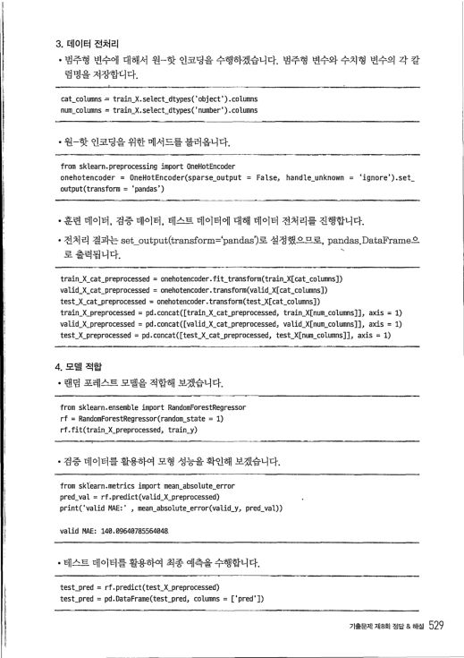
3 . 데이터 전처리

- 범주형 변수에 대해서 원－핫 인코딩을 수행하겠습니다 . 범주형 변수와 수치형 변수의 각 칼
럼명을 저장합니다． cat_columns 겹 train_X.select_dtypes('object').colunins num_columns == train_X.select_dtypes('number').columns

- 원－핫 인코딩을 위한 메서드를 불러옵니다．
```python
from sklearn.preprocessing import Onet-lotEncoder 
onehotencoder = OneHotEncoder(sparse_output = False, handle_unknown = 'ignore').set_ 
output(transform = 'pandas')
```
- 훈련 데이터 , 검증 데이터 , 데스트 데이터에 대해 데이터 전처리를 진행합니다．
- 전처리 결과는 set_output(transform='pandas'）로 설정했으므로 , pandas.DataFrame으
, 로 출력됩니다．

```python
train_X_cat_preprocessed = onehotencoder.fit_transform(train_X[cat_columns]) 
valid_X_cat_preprocessed = onehotencoder. transform(valid_X{cat_coLumns]) 
test_X_cat_preprocessed = onehotencoder.transfonn(test_Xf cat_columns]) 
train_X_preprocessed = pd.concat([train_X_cat_preprocessed, train_X[num_columns]], axis = 1) 
valid_X_preprocessed = pd.concat([valid_X_cat_preprocessed, valid_X[num_columns]], axis = 1) 
test_X_preprocessed = pd.concat(ftest_X_cat_preprocessed, test_X[num_columns]], axis = 1)
```
4 . 모델 적합

- 랜덤 포레스트 모델을 적합해 보겠습니다．
```python
from sklearn.ensemble import RandornForestRegressor 
rf = RandomForestRegressor(random_state = 1) 
rf. fit (train_X_preprocessed, train_y)
```
- 검증 데이터를 활용하여 모형 성능을 확인해 보겠습니다．
```python
from skLearn.metrics import mean_absolute_error 
pred_val = rf. predict(valid_X_preprocessed) 
print('valid MAE: ' , mean_absolute_error(valid_y, pred_val))
```
valid MAE: 140.09640785564048.

- 테스트 데이터를 활용하여 최종 예측을 수행합니다．
```python
test_pred = rf.predict(test_X_preprocessed) 
test_pred = pd.DataFrame(test_pred, columns = ['pred'])
```
기출문제제8회정답＆해설 529

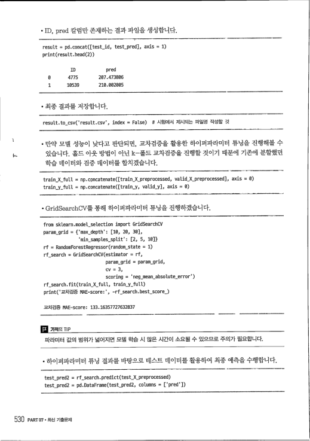
- ID, pred칼럼만존재하는결과파일을생성합니．다．
```python
result = pd.concat([test_id, test_pred], axis = 1) 
print(resul.t. head(2))
```
ID pred 0 4775 207.473806 1 10539 210.002005

- 최종 결과를 저장합니다．
result.to_csv('result.csv ', index = False) # 시험에서 제시되는 파일명 작성할 것

- 만약 모델 성능이 낮다고 판단되면 , 교차검증을 활용한 하이퍼파라미터 튜닝을 진행해볼 수
있습니다 . 흘드 아웃 방법이 아．닌 k－폴드 교차검증을 진행할 것이기 때문에 기존에 분할했던 학습 데이터와 검증 데이터를 합치겠습니다． train_X_full. = np.cancatenate([train_X_preprocessed, valid_X_preprocessed], axis = 0) train_y_fuU. = np.concatenate([train_y, valld_y], axis = 0) `GridSearchCV를 통해 하이퍼파라미터 튜닝을 진행하겠습니다．

```python
from skLearn.modeL_selection import GridSearchCV
param_grid = {'max_depth': [10, 20, 30],
'min_sampl.es_spl.it ': [2, 5, 10]} 
rf = RandomForestRegressor(random_state = 1) 
rf_search = 6ridSearchCV(estiniator = rf,
param_grid = param_grid,
cv = 3, 
scoring = 'neg_mean_absolute_error') 
rf_search. fit (train_X_fuU, train_y_fuLl) 
print(' 교F검증 MAE-score:', -rf_search . best_score_)
```
교차검증 "AE-score: 133.16357727632837 더 기적의 ㄲp 파라미터 값의 범위가 넓어지면 모델 학습 시 많은 시간이 소요될 수 있으므로 주의가 필요합니다．

- 하이퍼파라미터 튜닝 결과를 바탕으로 테스트 데이터를 활용하여 최종 예측을 수행합니다．
```python
test_pred2 = rf_search. predict (test_X_preprocessed)
test_pred2 = pd.DataFrame(test_pred2, columns = ['pred'] )
```
530 PART07· 최신기출문제

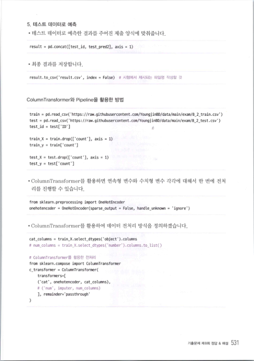
5 . 테스트 데이터로 예측

- 테스트 데이터로 예측한 결과를 주어진 제출 양식에 맞춰줍니다．
```python
result = pd.concat([test_id, test_pred2], axis = 1)
```
- 최종 결과를 저장합니다．
result.to_csv(' result.csv', index = False) # 시험에서 제시되는 파일명 작성할 것 ColumnTransformer오F Pipeline을 활용한 방법

```python
train = pd.read_csv( https://raw.githubusercontent.com/YoungjinBD/data/main/exam/8_2_train.csv' ) 
test = pd.read_csv( https://raw.githubusercontent.com/YoungjinBD/data/main/exam/8_2_test.csv ') 
test_id = test[ 'ID ']
train_X = train.drop([ 'count '] , axis = 1) 
train_y = train[ 'count' ]
test_X = test.drop([ 'count '] , axis = 1) 
test_y = test[ 'count' ]
```
- ColumnTransformer를 활용하면 연속형 변수와 수치형 변수 각각에 대해서 한 번에 전처
리를 진행할 수 있습니다．

```python
from sklearn.preprocessing import OneHotEncoder 
onehotencoder = OneHotEncoder(sparse_output = False, handle_unknown = ' ignore ')
```
- ColumnTransformer를 활용하여 데이터 전처리 방식을 정의하겠습니다．
```python
cat_columns = train_X.select_dtypes(' object ').columns
# num_colunins = train_X.select_dtypes( ' number' ) .columns.to_list ()
# ColumnTransformer를 활용한 전처리
from sklearn.compose import Columnlransformer
c_transformer = ColumnTransformer( 
transformers=[ 
(' cat ', onehotencoder, cat_columns),
# ( 'nurn' , imputer, num_columns) 
], remainder= ' passthrough'
```
기출문제 제8회 정답 & 해설 531

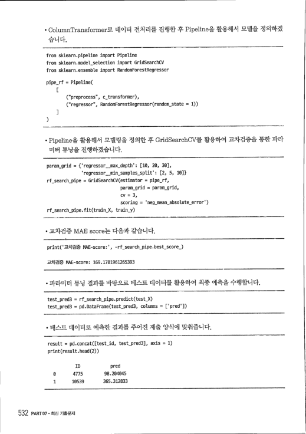
- ColumnTransformer로 데이터 전처리를 진행한 후 Pipeline을 활용해서 모델을 정의하겠
습니다．

```python
from sklearn.pipeline import Pipeline
from sklearn.modeL_selection import GridSearchCV
from sklearn.ensemble import RandomForestRegressor
pipe_rf = Pipeline(
```
("preprocess", c_transformer), ("regressor", RandomForestRegressor(random_state = 1)) ] )

- Pipeline을 활용해서 모델링을 정의한 후 GridSearchCV를 활용하여 교차검증을 통한 파라
미터 튜닝을 진행하겠습니다．

```python
param_grid = {'regressor__max_depth': [10, 20, 30], 
'regressor__mmn_samples_split': [2, 5, 10]} 
rf_search_pipe = GridSearchCV(estimator = pipe_rf,
param_grid = param_grid,
cv = 3, 
scoring = 'neg_mean_absolute_error') 
rf_search_pipe . fit (train_X, train_y)
```
- 교차검증 MAE score는 다음과 같습니다．
```python
print(' 교차검증 MAE-score:', -rf_search_pipe.best_score_)
```
교차검증 MAE-score: 169 .1781961265393

- 파라미터 튜닝 결과를 바탕으로 데스트 데이터를 활용하여 최종 예측을 수행합니다．
```python
test_pred3 = rf_search_pipe. predict(test_X) 
test_pred3 = pd.IJataFrame(test_pred3, columns = ['pred'])
```
- 테스트 데이터로 예측한 결과를 주어진 제출 양식에 맞춰줍니다．
```python
result = pd.concat([test_id, test_pred3], axis = 1) 
print(resul.t. head(2))
```
ID pred 0 4775 98.204045 1 10539 365.312833 532 PART07· 최신기출문제

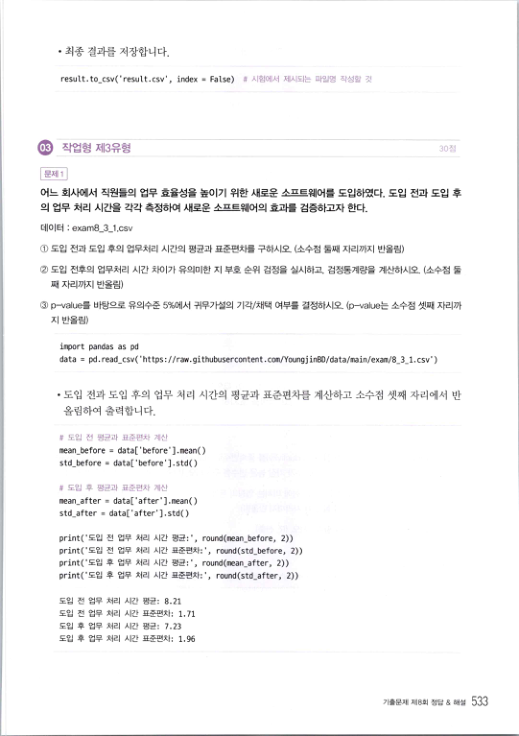
- 최종 결과를 저장합니다．
```python
result.to_csv(' result.csv ', index = False) 
# 시험에서 제시되는 파일명 작성할 것
```
.

작업형제3유형 30'; 문제 1 어느 회사에서 직원들의 업무 효율성을 높이기 위한 새로운 소프트웨어를 도입하였다 . 도입 전과 도입 후 의 업무 처리 시간을 각각 측정하여 새로운 소프트웨어의 효과를 검증하고자 한다． 데이터 : exam8 3 1.csv ① 도입 전과 도입 후의 업무처리 시간의 평균과 표준편차를 구하시오 . （소수점 둘째 자리까지 반올림） ② 도입 전후의 업무처리 시간 차이가 유의미한 지 부호 순위 검정을 실시하고 , 검정통계량을 계산하시오 . （소수점 둘 째 자리까지 반올림） ③p-value를 바탕으로 유의수준 5％에서 귀무가설의 기각／채택 여부를 결정하시오 . (p-value는 소수점 셋째 자리까 지 반올림）

```python
import pandas as pd 
data = pd. read_csv( 'https://raw.githubusercontent.com/YoungjinBD/data/main/exam/8-3-l. csv')
```
- 도입 전과 도입 후의 업무 처리 시간의 평균과 표준편차를 계산하고 소수점 셋째 자리에서 반
올림하여 출력합니다．

```python
# 도입 전 평균과 표준편차 계산
mean_before = data[ 'before '] .mean() 
std_before = data[ 'before '] .std()
# 도입 후 평균과 표준편차 계산
mean_after = data[ 'after' ].mean() 
std_after = data[ 'after '] .std()
print('도입 전 업무 처리 시간 평균： ' , round(mean_before, 2)) 
print(' 도입 전 업무 처리 시간 표준편차： ' , round(std_before, 2)) 
print(' 도입 후 업무 처리 시간 평균： ' , round(mean_after, 2)) 
print(' 도입 후 업무 처리 시간 표준편차： ' , round(std_after, 2))
```
도입 전 업무 처리 시간 평균： 8.21 도입 전 업무 처리 시간 표준편차： 1.71 도입 후 업무 처리 시간 평균： 7.23 도입 후 업무 처리 시간 표준편차： 1.96 기출문제 제8회 정답 & 해설 533

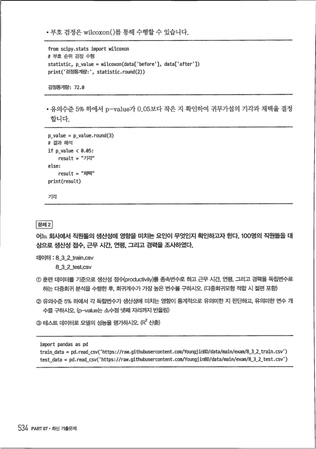
- 부호 검정은 wilcoxon(）를 통해 수행할 수 있습니다．
```python
froni scipy.stats import wilcoxon 
# 부호 순위 검정 수행 
statistic, p_value = wilcoxon(data[ 'befor&], data['after']) 
print(' 검정통계량： ' , statistic. round(2))
```
검정통계량： 72.0

- 유의수준 5% 하에서 p-value가 0.05보다 작은 지 확인하여 귀무가설의 기각과 채택을 결정
합니다．

```python
p_value = p_value.round(3) 
# 결과 해석 
if p_value < 0.05: 
result = " 기각" 
else: 
result = " 채택" 
print(result)
```
기각 문제 2 어느 회사에서 직원들의 생산성에 영향을 미치는 요인이 무엇인지 확인하고자 한다 . 100명의 직원들을 대 상으로 생산성 점수 , 근무 시간 , 연령 , 그리고 경력을 조사하였다． 데이터 : 8_3_2_train.csv 8 3 2 test.csv ① 훈련 데이터를 기준으로 생산성 점수（productivity)를 종속변수로 하고 근무 시간 , 연령 . 그리고 경력을 독립변수로 하는 다중회귀 분석을 수행한 후 , 회귀계수가 가장 높은 변수를 구하시오 . （다중회귀모형 적합 시 절펀 포함） ② 유의수준 5% 하에서 각 독립변수가 생산성에 미치는 영향이 통계적으로 유의미한 지 판단하고 , 유의미한 변수 개 수를 구하시오 . (p-value는 소수점 넷째 자리까지 반올림） ③ 테스트 데이터로 모델의 성능을 평가하시오 . (R2 산출）

```python
import pandas as pd 
train_data = pd. read_csv( 'https://raw. githubusercontent. com/YoungjinBD/data/main/exam/8_3_2_train. csv')
test_data = pd. read_csv( ' https: //raw.githubusercontent.com/YoungjinBD/data/main/exam/8_3_2_test. csv')
```
534 PART07．최신 기출문제

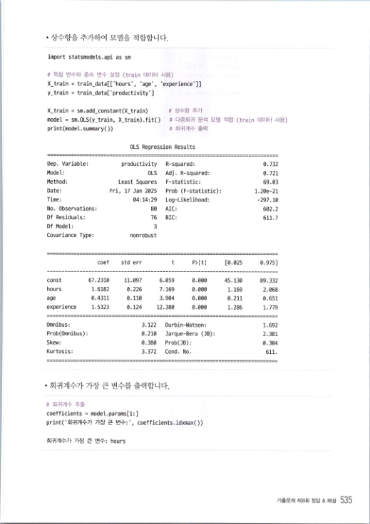
- 상수항을 추가하여 모델을 적합합니다．
```python
import statsmodels.api as sm
# 독립 변수와 종속 변수 설정 (train 데이터 사용）
X_train = train_data[[ 'hours' , ' age' , ' experience' ]]
y_train = train_data[ ' productivity ']
X-train = sm.add_constant(X_train) 
# 상수항 추가
model = sm.OLS(y_train, X_train).fit () 
# 다중회귀 분석 모델 적합 (train 데이터 사용） 
print(model. summaryO) 
# 회귀계수 출력
```
OLS Regression Results Dep. Variable:

R-squared:

Adj. R-squared:

F-statistic:

productivity 0.732 0.721 Model:

이－5 Method:

Least Squares Eni, 17 Jan 2025 69.03 1.20e-21 Date:

Prob (F-statistic):

I公Be:

04:14:29 Log-Likelihood:

-297.10 No. Observations:

Df Residuals:

80 AIC:

BIC:

602.2 76 611.7 Df Model:

3 Covariance Type:

nonrobust coef std err t P>ltI [ 0.025 0.975] const 67.2310

1. 6182 
0.4311 1.5323 11.097 6.059 0.000 45.130 89.332 0.226 7.169 0.000 1.169 2.068 0.110 3.904 0.000 0.211 0.651 0.124 12.380 0.000 1.286 1.779 hours age experience 3.122 0.210 0.380 3.372 Omnibus:

Durbin-Watson:

1.692 Prob(Omnibus) :

Jarque-Bera (JB):

2.381 0.304 딧《ew:

Kurtosis:

Prob(JB):

Cond. No.

611.

- 회귀계수가 가장 큰 변수를 출력합니다．
```python
# 회귀계수 추출 
coefficients = model.params{1:] 
print(' 회귀계수가 가장 큰 변수： ' , coefficients. idxmax() )
```
회귀계수가 가장 큰 변수： hours 기출문제 제8회 정답 & 해설 535

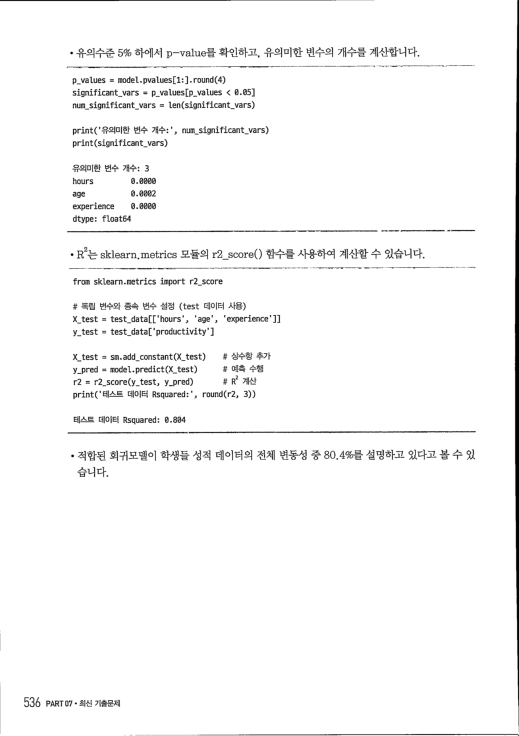
- 유의수준 5% 하에서 p-value를 확인하고 , 유의미한 변수의 개수를 계산합니다．
```python
p_val.ues = niodel.pvalues[1:].round(4) 
significant_vars = p_val.ues[p_vathes < 0.05]
num_significant_vars = 1.en(significant_vars)
print(' 유의미한 변수 개수： ' , nurn_significant_vars) 
print(significant_vars)
```
유의미한 변수 개수＝ 3 hours 0.0000 age 0.0002 experience 0.0000 dtype: f1oat64

- R2는 sklearn. metrics 모듈의 r2_score() 함수를 사용하여 계산할 수 있습니다．
```python
from skiearn.metrics import r2_score
# 독립 변수와 종속 변수 설정 (test 데이터 사용）
X_test = test_data[['hours ', sage ', ' experience 'J]
y_test = test_dataC ' productivity ']
X_test = sm.add_constant(X_test) 
# 상수항 추가
y_pred = modeL.predict(X_test) 
# 예측 수행
r2 = r2_score(y_test, y_pred) 
# R2 계산 
print(' 테스트 데이터 Rsquared:', round(r2, 3))
```
테스트 데이터 Rsquared: 0.8啣

- 적합된 회귀모델이 학생들 성적 데이터의 전쳬 변동성 중 80.4％를 설명하고 있다고 볼 수 있
습니다． 536 PART 07· 최신기출문제

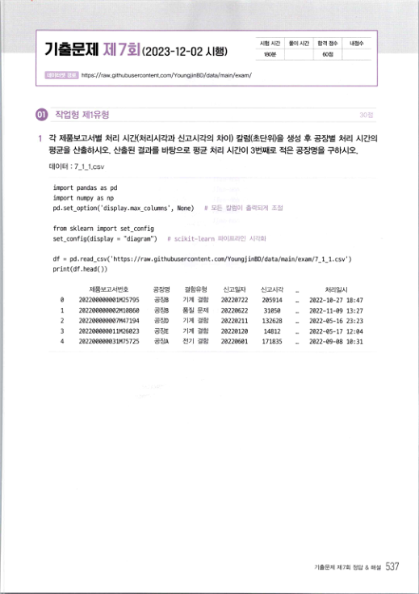
시험 시zr 풀이 시간 합격 접수 내점수

## 기츰문제 제 7회 (2023-12-02 시햄）
180분 60점 https://raw.githubusercontent .com/YoungjinBD/data/main/exam/ .l 작업형 제1유형 灌 각 제품보고서별 처리 시간（처리시각과 신고시각의 차이） 칼럼（초단위）을 생성 후 공장별 처리 시간의 평균을 산출하시오 . 산출된 결과를 바탕으로 평균 처리 시간이 3번째로 적은 공장멍을 구하시오． 데이터 : 7j_ 1.csv

```python
import pandas as pd 
import numpy as np 
pd.set_option(' display.max_columns', None) 
# 모든 칼럼이 출력되게 조절
from sklearn import set_config 
set_config(display = " diagram") 
# scikit-learn 파이프라인 시각화
df = pd. read_csv('https://raw.githubusercontent.com/YoungjinBD/data/main/exam/711. csv' ) 
print(df.head())
```
제품보고서번호 공장명 결함유형 신고일자 신고시각 처리일시 0 202200000001M25795 공장B 기계 결함 20220722 205914 2022-10-27 18:47 1 202200000002M10860 공장B 풍질 문제 20220622 31050 2022-11-09 13:27 2 202200000007M47194 공징沿 기계 결함 20220211 132628 2022-05-16 23:23 3 202200000011M26023 공장E 기계 결함 20220120 14812 2022-05-17 12:04 4 202200000031M75725 공장A 전기 결함 20220601 171835 2022-09-08 10:31 기출문제 제7회 정답 & 해설 537

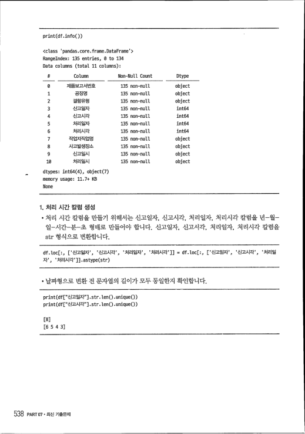
```python
print(df.infoO)
```
<class 'pandas. core.frame.DataFrame'> Rangelndex: 135 entries, 0 to 134 Data columns (total 11 columns):

It Column Non-Null Count Dtype 0 제품보고서번호 135 non-null object 1 공장명 135 non-null object 2 결함유형 135 non-null object 3 신고일자 135 non-null int64 4 신고시각 135 non-null int64 5 처리일자 135 non-null int64 6 처리시각 135 non-null 1nt64 7 작업자직업명 135 non-null object 8 사고발생장소 135 non-null object 9 신고일시 135 non-null object 10 처리일시 135 non-null object dtypes: int64(4), object(7) memory usage: 11.7+ KB None 1 . 처리 시간 칼럼 생성

- 처리 시간 칼럼을 만들기 위해서는 신고일자 , 신고시각 , 처리일자 , 처리시각 칼럼을 년－월－
일－시간－분－초 형태로 만들어야 합니다 . 신고일자 , 신고시각 , 처리일자 , 처리시각 칼럼을 str 형식으로 변환합니다． df.loc[:, [. ' 신고일자 ' 』 ' 신고시각 ' , ' 처리일자 ' , ' 처리시각 ' 〕〕 . df.loct:, [ ' 신고일자 ' , ' 신고시각 ' 』 ' 처리일 자 ' , ' 처리시각 ' ]). astype(str)

- 날짜형으로 변환 전 문자열의 길이가 모두 동일한지 확인합니다．
```python
print(df[ " 신고일자 " ].str. lenU .uniqueQ) 
print(df[ " 신고시각 " ].str.len() .uniqueO)
```
[8] [6 5 4 3] 538 PART 07. 최신기출문제

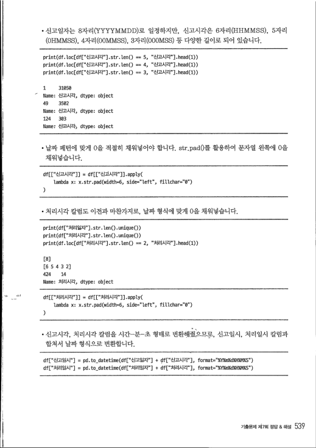
- 신고일자는 8자리（YYYYMMDD）로 일정하지만 , 신고시각은 6자리（HHMMSS), 5자리
(OHMMSS), 4자리（00MMSS), 3자리（000MSS) 등 다양한 길이로 되어 있습니다．

```python
print(df. loc[df[ " 신고시각 " ].str.len() == 5, " 신고시각 " J.head(1)) 
print(df.loc[df[ " 신고시각 " ].str. 1.en() =. 4, " 신고시각 " 〕． head (1) ) 
print(df.loc[df[ " 신고시각 " ].str. len() == 3, " 신고시각 " ].head(l))
```
1 31050 Name: 신고시각， dtype: object 49 3502

```python
Name= 신고시각， dtype: object 
124 
303
```
Namer 신iFA각》 dtype-: object

- 날짜 패턴에 맞게 0을 적절히 채워넣어야 합니다 . str.pad0를 활용하여 문자열 왼쪽에 0을
채워넣습니다． df[[ " 신고시각 " J] = df[[ " 신고시각 " ]].apply( lambda x: x. str. pad(width=6, side="left", fillchar="O")

- 처리시각 칼럼도 이전과 마찬자지로 , 날짜 형식에 맞게 0을 채워넣습니다．
```python
print(df[ " 처리일자 " 〕.str. Len() .uniqueQ) 
print(df[ " 처리시각 " 〕.str.len() .uniqueO) 
print(df. loc[df[ " 처리시각 " ].str. 1.en() - 
2, " 처리시각 " // .head(1))
```
[8] [6 5 4 3 2] 424 14

```python
Name= 처리시각， dtype: object
```
df[ [ " 처리시각 " 〕〕 = df[ [ " 처리시각 " ]].apply( lambda x: x.str.pad(width=6, side="left", fiflchar="0") )

- 신고시각 , 처리시각 칼럼을 시간－분－초 형태로 변환해줬．ㅇ 므귿， 신고일시， 처리일시 칼럼과
합쳐서 날짜 형식으로 변환합니다． df[ " 신고일시 " 〕 = pd. to_datetime(df[ " 신고일자 " 〕 + df[ " 신고시각 " 〕， format="%Y i%d%H%M%S") df[ " 처리일시 " 〕 ㄷ pd. to_datetime(df[ " 처리일자 " 〕 + df[ " 처리시각 " 〕， format="%Y i%d%H%M%S") 기출문제 처17회 정답 & 해설 539

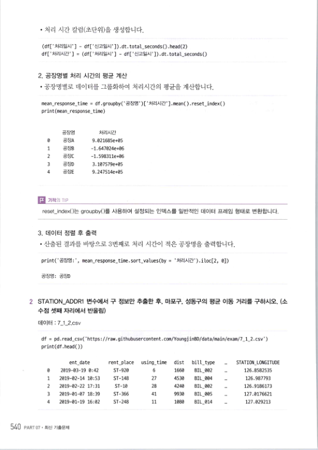
- 처리 시간 칼럼（초단위）을 생성합니다．
(df[ ' 처리일시’ ] - df[ ’신고일시 ' ]) . dt. tota'_seconds 0. head (2) df[ ’처리시간 ' ] = (df[ ' 처리일시 ' 〕 - df[ ' 신고일시 ' 1). dt. total_seconds() 2 , 공장명별 처리 시간의 평균 계산

- 공장명별로 데이터를 그룹화하여 처리시간의 평균을 계산합니다．
```python
mean_response_time = df . groupby( ' 공장명 ' )[ ' 처리시간' ].mean () .reset_index() 
print(mean_response_time)
```
공장명 처리시간 0 공장A 9.021685e+05 1 공장B -1.647024e+06 2 공장〔 -1. 598311e+06 3 공장U 3.107579e+05 4 공장E 9.247514e+05 .

기적의 뀌P reset_index(）는 groupby(）를 사용하여 설정되는 인덱스를 일반적인 데이터 프레임 형태로 변환합니다． 3 . 데이터 정렬 후 출력

- 산출된 결과를 바탕으로 3번째로 처리 시간이 적은 공장명을 출력합니다．
```python
print(' 공장명＝ ' , mean_response_time. sort_va thes(by = ' 처리시간 ' ).ithc[기 0])
```
공장명： 공장D 2 STATION_ADDR1 변수에서 구 정보만 추출한 후 , 마포구 , 성동구의 평균 이동 거리를 구하시오 . （소 수점 셋째 자리에서 반올림） 데이터 : 7- 1-- 2.csv

```python
df = pd.read_csv( https://raw.githubusercontent.com/YoungjinBD/data/main/exam/7_1_2.csv ') 
print(df.head())
```
ent_date rent_p'ace using_time dist bill_type STATION_LONGITUDE 0 2019-03-19 0:42 51-920 6 1660 BIL 002 126.8582535 1 2019-02-14 10:53 ST-148 27 4530 BIL 004 126.987793 2 2019-02-22 17:31 ST-lB 28 4240 BIL 002 126.9186173 3 2019-01-07 18:39 ST-366 41 9930 BIL 005 127.0176621 4 2019-01-19 16:02 ST-248 11 1080 BIL 014 127.029213 5LO PART 07 . 최신 기출문제

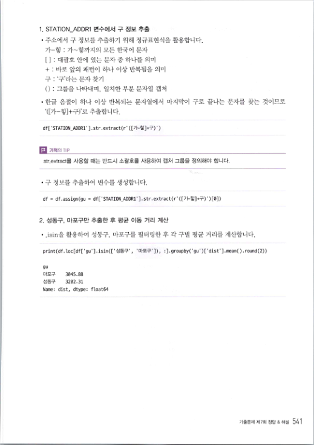
1. STATION_ADDR1 변수에서 구 청보 추출
- 주소에서 구 정보를 추출하기 위해 정규표현식을 활용합니다．
가－힝 : 가∼힝까지의 모든 한국어 문자 [ ] : 대괄호 안에 있는 문자 중 하나를 의미

+ : 바로 앞의 패턴이 하나 이상 반복됨을 의미
구 : ' 구'라는 문자 찾기 () : 그룹을 나타내며 , 일치한 부분 문자열 캡처

- 한글 음절이 하나 이상 반복되는 문자열에서 마지막이 구로 끝나는 문자를 찾는 것이므로
df[ 'STATION_ADDR1 '].str. extract(r '([ 가-찧]+l) ') 기적의 지P str.extract를 사용할 때는 반드시 소괄호를 사용하여 캡처 그룹을 정의해야 합니다．

- 구 정보를 추출하여 변수를 생성합니다．
```python
df = df.assign(gu = df[ 'STATION_ADDR1' ].str. extract(r ' ([가-힐]+구) ') [0])
```
2 . 성동구 , 마포구만 추출한 후 평균 이동 거리 계산

- .isin을 활용하여 성동구 , 마포구를 필터링한 후 각 구별 평균 거리를 계산합니다．
```python
print(df.loc[df[ 'gu '].isin([ ' 성동구 ', 'OF구 ']), :].groupby( 'gu')['dist'] .meanQ.round(2))
```
gu 마포구 3045.88 성동구 3202.31 Name: dist, dtype: float64 기출문제 제7회 정답＆ 해설 5시

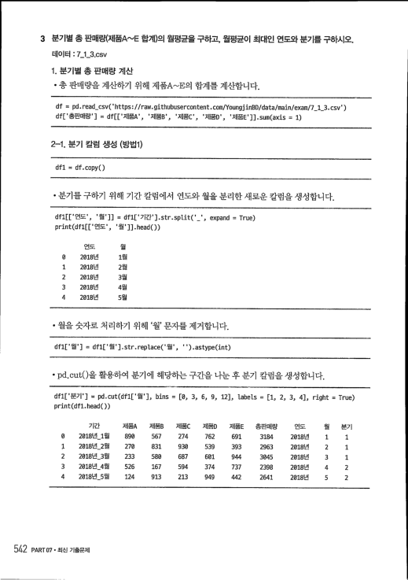
3 분기별 총 판매량（제품A"-'ㅌ 합계）의 월평균을 구하고 , 뭘평균이 최대인 연도와 분기를 구하시오． 데이터 : 7 1- 3.csv 1 . 분기별 총 판매량 계산

- 총 판매량을 계산하기 위해 졔품A-E의 합계를 계산합니다．
df · pd.read_csv('https://raw.githubusercontent.com/youngjinoD/data/main/exam/7-1-3.csv ') df[ ' 총판매량 ' 〕 = df[[ ' 제품A ' , ' 제품B , ' 제품C , ' 제품0 , ' 제품E ' 〕〕．sum(axis = 1) 2-1 , 분기 칼럼 생성 （방법1)

```python
dfl = df.capyQ
```
- 분기를 구하기 위해 기간 칼럼에서 연도와 월을 분리한 새로운 칼럼을 생성합니다．
```python
df1[f ' 연도', ' 월 '] ] = df1[ ' 기간 '] .str.split('_ ', expand = True) 
print(df1{[ ' 연도 ', ' 월'] ].headQ)
```
연도 월 0 2018년 1월 1 2018년 2월 2 2018년 3월 3 2018년 4월 4 2018년 5월

- 월을 숫자로 처리하기 위해 ' 월 ' 문자를 제거합니다．
df1{ ' 월 '] = df1[ ' 월 '] .str.replace( ' 월 ', ') .astype(int)

- pd.cut(）을 활용하여 분기에 해당하는 구간을 나눈 후 분기 칼럼을 생성합니다．
```python
df1[ ' 분기 '] = pd.cut(df1{ ' 월 '] , bins = fO, 3, 6, 9, 12], labels = [1, 2, 3, 4], right = True) 
print(dfl.headQ)
```
기간 제품A 제품B 제품〔 제품0 제품E 총판매량 연도 월 분기 2018년_1월 890 567 274 762 691 3184 2018년 1 1 2018년_2월 270 831 930 539 393 2963 2018w 2 1 2018년_3월 233 580 687 601 944 3045 2018년 3 1 2018년_4월 526 167 594 374 737 2398 2018년 4 2 2018년_5월 124 913 213 949 442 2641 2018년 5 2 0 1 ㅗ ， z ∼ 군 J 4 ` 542 PART 07．최신기출문제

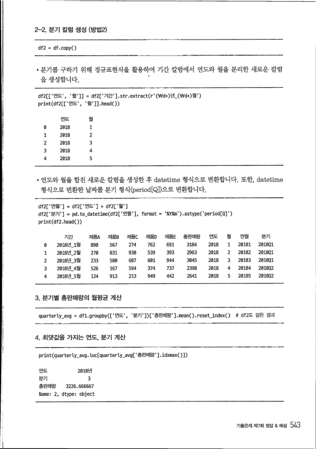
2-2 . 분기 칼럼 생성 （방법2)

```python
df2 = df.copyO
```
- 분기를 구하기 위해 정규표현식을 활용하여 기간 칼럼에서 연도와 월을 분리한 새로운 칼럼
을 생성합니다． '

```python
df2[I ' 연도 ' , ' 월 ' 끄 = df2[ ' 기간 ' ].str.extract(r' (Wd+）년－(Wd+）월 ' ) 
print(df2[[ ' 연도 ' , ' 월 ' ]J.headQ)
```
연도 월 0 2018 1 1 2018 2 2 2018 3 3 2018 4 4 2018 5

- 연도와 월을 합친 새로운 칼럼을 생성한 후 datetime 형식으로 변환합니다 . 또한 , datetime
형식으로 변환한 날짜를 분기 형식（periodliQ〕 ）으로 변환합니다．

```python
df2[ ' 연월 ' 〕 = df2[ ' 연도 ' 〕 + df2[ ' 월 ' 〕 
df2f ' 분기'] = pd.to_datetime(df2[ ' 연월'] , format = ' %Y數a') .astype('period[Q1 ') 
print(df2.head())
```
기간 제품A 제품B 제품（= 제품D 제품ㅌ 총판매량 연도 월 연월 분기 0 2018년 1월 890 567 274 762 691 3184 2018 1 20181 201801 1 2018년 2월 270 831 930 539 393 2963 2018 2 20182 201801 2 2018년 3월 233 580 687 601 944 3045 2018 3 20183 2018Q1 3 2018년 4월 526 167 594 374 737 2398 2018 4 20184 201802 4 2018년 5월 124 913 213 949 442 2641 2018 5 20185 2018Q2 3 . 분기별 총판매량의 월평균 계산

```python
quarterly_avg = dfl.groupby([ ' 연도 ' , ' 분기 ' ])[ ' 총판매량 ' J.nieanQ.reset_index() if df2도 같은 결과
```
4 . 최댓값을 가지는 연도 , 분기 계산

```python
print(quarter1.y_avg.loc{quarter1.y_avg[ ' 총판0hl량 '] .idxmaxQj)
```
연도 2018년 분기 3 총판매량 3226.666667 Name: 2, dtype: object 기출문제 제7회 정답 & 해설 543

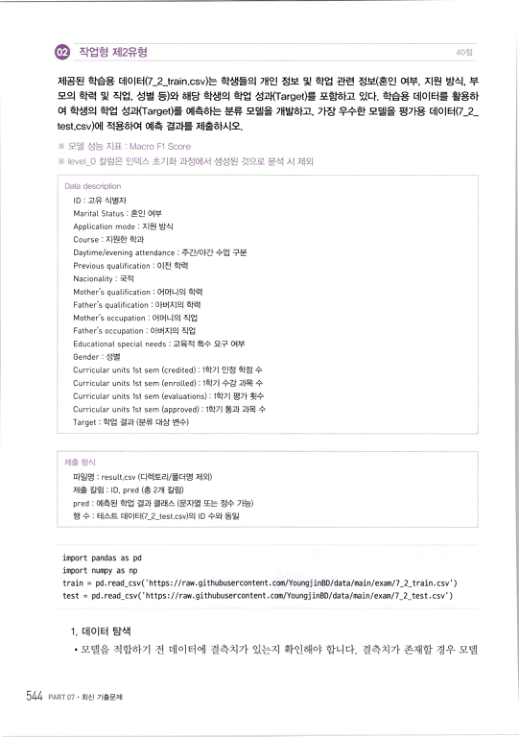
.

즈榴형제2유형 40점 제공된 학습용 데이터（7_2_train.csv）는 학생들의 개인 정보 및 학업 관련 정보（혼인 여부 , 지원 방식 , 부 모의 학력 및 직업 , 성별 등）와 해당 학생의 학업 성과（Target）를 포함하고 있다 . 학습용 데이터를 활용하 여 학생의 학업 성과（Target）를 예측하는 분류 모델을 개발하고 , 가장 우수한 모델을 평가용 데이터（7-2- test.csv）에 적용하여 예측 결과를 제출하시오． ※ 모델 성능 지표 : Macro Fl Score < IeveI_0 칼럼은 인덱스 초기화 과정에서 생성된 것으로 분석 시 제외 Data description ㄸ〕 : 고유 식별자 Marital Status : 혼인 여부 AppLication mode : 지원 방식 Course : 지원한 학과 Daytime/evening attendance : 주간／야간 수업 구분 Previous qualification : 이전 학력 NacionaLity : 국적 Mother's qualification : 어머니의 학력 Father's qualification : 아버지의 학력 Mother's occupation : 어머니의 직업 Father's occupation : 아버지의 직업 Educational special needs : 교육적 특수 요구 여부 Gender : 성별 Curricular units 1st sem (credited) :1학기 인정 학점 수 Curricular units 1st sem 櫛rotted) : 1학기 수강 과목 수 Curricular units 1st sem (evaluations) :1학기 펑가 횟수 Curricular units 1st sem (approved) : 1학기 통과 과목 수 Target : 학업 결과 （분류 대상 변수） 제출 형식 파일명 : resutt.csv （디렉토리／폴더영 제외） 제출 칼럼 : ID, pred （총 2개 칼럼） pred : 예측된 학업 결과 클래스 （문자열 또는 정수 가능） 행 수 : 테스트 데이터〈z_2_test.csv）의 ㄸ〕 수와 동일

```python
import pandas as pd
import numpy as np 
train = pd.read_csv('https://raw.githubusercontent.com/YoungjinBD/data/main/exam/7_2_train.csv' ) 
test = pd.read_csv('https://raw.githubusercontent.com/Youngjin8D/data/main/exam/7_2_test.csv')
```
1 . 데이터 탐색

- 모델을 적합하기 전 데이터에 결측치가 있는지 확인해야 합니다 . 결측치가 존재할 경우 모델
544 PART 07 . 최신 기출문제

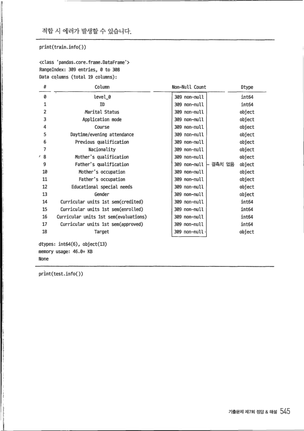
적합 시 에러가 발생할 수 있습니다．

```python
print(train.info(.))
```
<class 'pandas. core. frame. DataFrame'> Rangelndex: 309 entries, 0 to 308 Data co.lumns (total 19 columns):

```python
# 
Column
```
Non-Null Count Dtype 0 level 0 309 non-null 1nt64 1 ID 309 non-null 1nt64 object object object object object object object

- 결측치 없음 object 
object object object object int64 1nt64 int64 1nt64 object 2 Marital Status 309 non-null 309 non-null .3 Application moae 4 Course 309 non-null 5 Daytime/evening attendance 309 non-null ID I-'revious qualincation / 'daclonaLity ' 8 Mother's qualification 309 non-null 309 non-null 309 non-null 늬 I-atfler' s qualil-ication 309 non-null 10 Mother's occupation 11 Father's occupation 309 non-null 309 non-null 12 Educational special needs 309 non-null 13 Gender 309 non-null 14 Curricular units 1st sem(credited) 309 non-null 15 Curricular units 1st sem(enrol.led) 309 non-null 16 Curricular units 1st sem(evaluations) 309 non-null 17 Curricular units 1st sem(approved) 309 non-null 18 Target 309 non-null · dtypes: int64(6), object(13) memory usage: 46.0+ KB None

```python
print(test.infoQ)
```
기출문제제7회정답& 해설 545

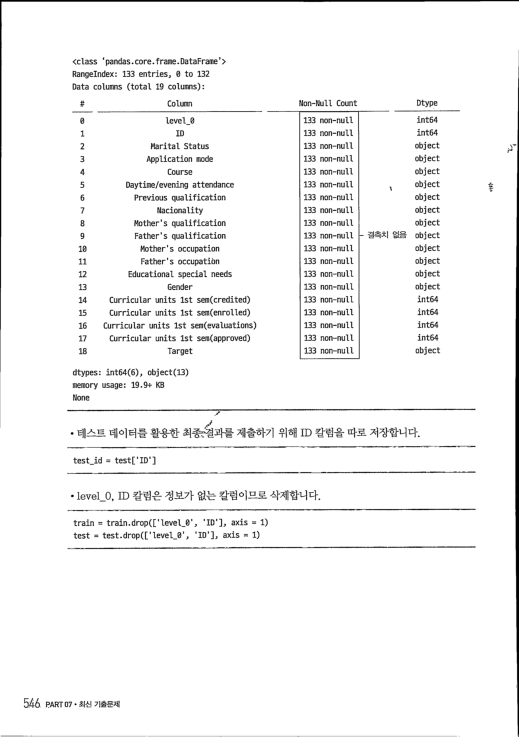
<class 'pandas. core.frame.DataFrame'> Rangelndex: 133 entries, 0 to 132 Data columns (total 19 columns):

Non-Null Count

```python
# 
Column
```
Dtype int64 int64 object object object 133 non-nUll 0 level 0 133 non-nuLl 1 ID 手r 133 non-null 2 Marital Status 3 iDoiication moae 133 non-null 133 non-nulL 4 Course object object object object

- 결측치 없음 .bject 
object object object object int64 int64 int64 int64 object 133 non-nuLl 5 Daytime/evening attendance , 133 non-null 6 Previous qualification 133 non-nUll 7 Nacionality 133 non-nUll 8 Mother's ciualification 133 non-null 9 Father's qualification 133 non 出 Il 10 Mother's occuoation 11 Father's occupation 133 non-null iii non-null 12 Educational special needs 133 non-null 13 Gender 133 non-null 14 Curricular units 1st sem(credited) 15 Curricular units 1st sem(enrolled) 133 non-null 133 flO경-nULl 16 Curricular units 1st sem(evaluations) 133 non-null 17 Curricular units 1st sem(approved) 133 non-null 18 Target dtypes: int64(6), object(13) memory usage: 19.9+ KB None /

- 테스트 데이터를 활용한 촤종룐결과를 제출하기 위해 ID 칼럼을 따로 저장합니다．
```python
test_id = test{'ID']
```
- lev&p ,ID 칼럼은 정보가 없는 칼럼이므로 삭제합니다．
```python
train = train.drop(['level_0', 'ID'] , axis = 1) 
test = test.drop({'level_0', 'ID'] , axis = 1)
```
546 PART 07 · 최신 기출문제

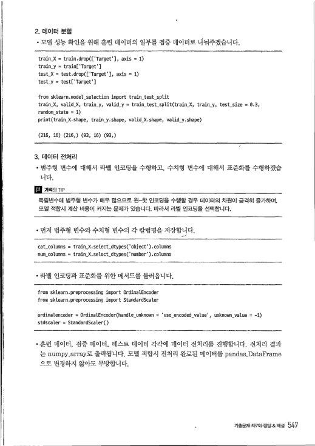
2 . 데이터 분할

- 모델 성능 확인을 위해 훈런 데이터의 일부를 검증 데이터로 나눠주겠습니다．
```python
train_X = train.drop(['Target '] , axis = 1) 
train_y = train[ 'Target'] 
test_X = test.drop([ 'Target '], axis = 1) 
test_y = test[ 'Target'J
from sklearn.model_selection import train_test_split 
train_X, valid_X, train_y, valid_y = train_test_split(train_X, train-y, test_size = 0.3,
random_state = 1) 
print(train_X.shape, train_y.shape, val.id_X.shape, valid_y.shape)
```
(216, 16) (216,) (93, 16) (93,) 3 , 데이터 전처리

- 범주형 변수에 대해서 라벨 인코딩을 수행하고 , 수치형 변수에 대해서 표준화를 수행하겠습
니다． ．헴 기적의 ㄲP 독립변수에 범주형 변수가 매우 많으므로 원－핫 인코딩을 수행할 경우 데이터의 차원이 급격히 증가하여， 모델 적합시 계산 비용이 커지는 문제가 있습니다 . 따라서 라벨 인코딩을 선택합니다．

- 먼저 범주형 변수와 수치형 변수의 각 칼럼명을 저장합니다．
```python
cat_columns = train_X.select_dtypes( 'object ').columns
num_columns = train_X.select_dtypes('number').columns
```
- 라벨 인코딩과 표준화를 위한 메서드를 불러옵니다．
```python
from sklearn.preprocessing import OrdinalEncoder 
from sklearn.preprocessing import StandardScaler
ordinalencoder = OrdinalEncoder(handle_unknown = ' u5e_encoded_value ', unknown_value = -1) 
stdscaler = StandardScaler()
```
- 훈련 데이터 , 검증 데이터 , 테스트 데이터 각각에 데이터 전처리를 진행합니다 . 전처리 결과 
는 numpy. array로 출력됩니다 . 모델 적합시 전처리 완료된 데이터를 pandas.DataFrame 으로 변경하지 않아도 무방합니다． 기출문제·제'7회‘7정답．:&/．해설， 547

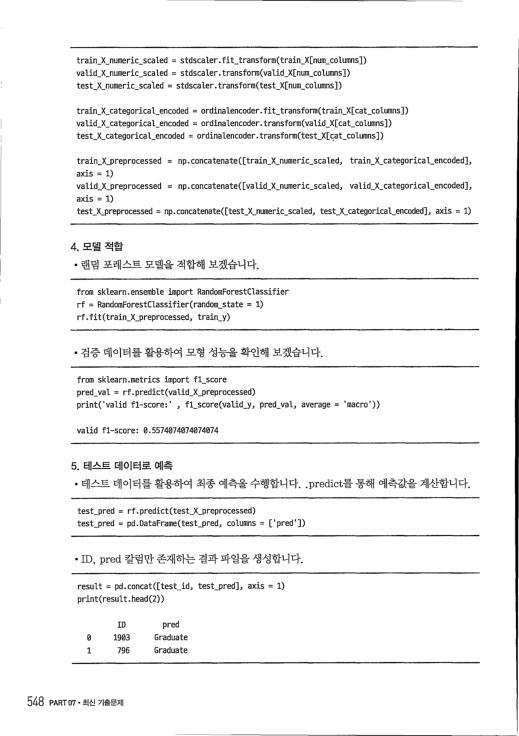
```python
train_X_numeric_scaled = stdscaler.fit_transform(train_X[num_columns]) 
valid_X_numeric_scaled = stdscaler. transform(valid_X[num_col,umns]) 
test_X_numeric_scaled = stdscaler. transform(test_X[num_col.umnsj)
```
train_X. categorical_encoded = ordinalencoder.fit_transform(train_X[cat_columnsl) val.id_X_categorical._encoded = ordinalencoder. transform(valid_Xfcat_columnsll) test_X_categorical._encoded = ordinalencoder.transforin(test_X[qat_columns]) = np. concatenate (Etrain_X_numeric_scal.ed, train_X_categorical_encoded],

```python
train..X_preprocessed 
axis = 1) 
valid_X_preprocessed = np. concatenate([valid_X_numeric_scaLed, valid_X_categorical_encoded], 
axis = 1) 
test_X_preprocessed = np.concatenate([test_X_numeric_scaled, testy_categorical_encoded], axis = 1)
```
4 . 모델 적합

- 랜덤 포레스트 모델을 적합해 보겠습니다．
```python
from sklearn. ensemble import RandomForestCLassifier 
rf = RandomForestClassifier(random_state = 1) 
rf.fit (train_X_preprocessed, train_y)
```
- 검증 데이터를 활용하여 모형 성능을 확인해 보겠습니다．
```python
from skl.earn.metrics import fl_score
pred_val = rf. predict(valid_X_preprocessed) 
print('valid fl- score: ' , fl_score(val.id_y, pred_val, average = ' macro '))
```
valid fl-score: 0.5574074074074074 5 . 테스트 데이터로 예측

- 테스트 데이터를 활용하여 최종 예측을 수행합니다 . . predict를 통해 예측값을 계산합니다．
```python
test_pred = rf. predict(test_X_preprocessed) 
test_pred = pd.DataFrame(test_pred, columns = ['pred'] )
```
- ID, pred 칼럼만 존재하는 결과 파일을 생성합니다．
```python
result = pd.concat([test_id, test_pred], axis = 1) 
print(result .head(2))
```
ID pred 0 1903 Graduate 1 796 Graduate 548 PART 07．최신기출문제

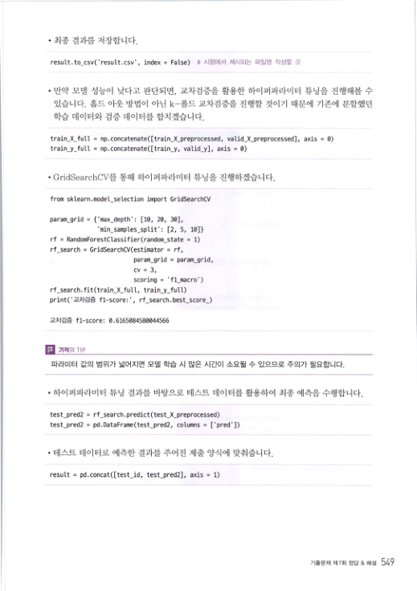
- 최종 결과를 저장합니다．
```python
result.tocsv( ' result.csv' , index = False) 
# 시험에서 제시되는 파일명 작성할 것
```
- 만약 모델 성능이 낮다고 판단되면 , 교차검증을 활용한 하이퍼파라미터 튜닝을 진행해볼 수
있습니다 . 홀드 아웃 방법이 아닌 k－폴드 교차검증을 진행할 것이기 때문에 기존에 분할했던 학습 데이터와 검증 데이터를 합치겠습니다．

```python
train_X_full. = np.concatenate([train_X_preprocessed, valjd_X_preprocessed], axis = 0) 
train_y_full = np.concatenate([train_y, valid_y], axis = 0)
```
- GridSearchCV를 통해 하이퍼파라미터 튜닝을 진행하겠습니다．
```python
from sklearn.model_selection import GridSearchCV
param_grid = { 'max_depth ' : [10, 20, 30],
' mmn_samples_split' : [2, 5, 10]} 
rf = RandoniForestClassifier(random_state = 1) 
rf_search = GridSearchCV(estimator = rf,
param_grid = param_grid, 
cv = 3, 
scoring = ' fl_macro ') 
rf_search. fit (train_X_full, train_y_full) 
print(' 교차검중 fl- score: ', rf_search.best_score_)
```
iiLiF검중 fl-score: 0.6165084580044566 .

기적의 ㅐP 파라미터 값의 범위가 넓어지면 모델 학습 시 많은 시간이 소요될 수 있으므로 주의가 필요합니다．

- 하이퍼파라미터 튜닝 결과를 바탕으로 테스트 데이터를 활용하여 최종 예측을 수행합니다．
```python
test_pred2 = rf_search. predict(test_X_preprocessed) 
test_pred2 = pd.DataFrame(test_pred2, columns = ['pred'])
```
- 테스트 데이터로 예측한 결과를 주어진 제출 양식에 맞춰줍니다．
```python
result = pd.concat([test_id, test_pred2], axis = 1)
```
기출문제제7회정답＆해설 549

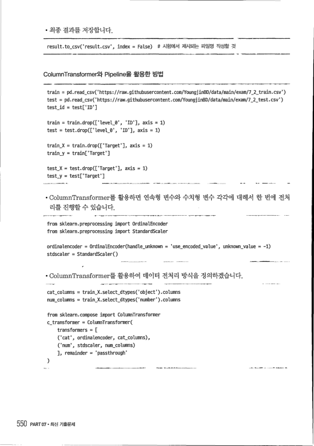
- 최종 결과를 저장합니다．
result.to_csv('result.csv ', index = Fa1.se) # 시험에서 제시되는 파일명 작성할 것 ColumnTransformer와 Pipeline을 활용한 방법

```python
train = pd.read_csv('https://raw.githubusercontent.com/YoungjinBD/data/main/exam/7_2_train.csv ') 
test = pd. read_csv('https://raw.githubusercontent.com/YoungjinBD/data/main/exam/7_2_test.csv') 
test_id = test[ 'ID']
train = train.drop([ 'level_O ', 'ID 'l, axis = 1) 
test = test.drop([ 'Level_O ', ' 1D '] , axis = 1)
train_X = train.drop([ 'Target '] , axis = 1) 
train_y = train[ 'Target']
test_X = test.drop([ 'Target 'J, axis = 1) 
test_y = test[ 'Target ']
```
- ColumnTransformer를 활용하면 연속형 변수와 수치형 변수 각각에 대해서 한 번에 전처
리를 진행할 수 있습니다．

```python
from sklearn.preprocessing import OrdinalEncoder
from sklearn.preprocessing import StandardScaler
ordinalencoder = Ordinal.Encoder(handle_unknown = ' use_encoded_va1ue ' , unknown_value = -1) 
stdscal.er = StandardScalerQ
```
- ColumnTransformer를 활용하여 데이터 전처리 방식을 정의하겠습니다．
```python
cat_columns = train_X.select_dtypes('object ').columns
num_columns = train_X.select_dtypes('number') .coLumns
from sklearn.compose import Columnlransformer
c_transformer = ColumnTransform巳r( 
transformers = [ 
('cat', ordinalencoder, cat_columns), 
('num', stdscaler, num_columns) 
1, remainder = 'passthrough' 
)
```
550 PART 07．최신기출문제

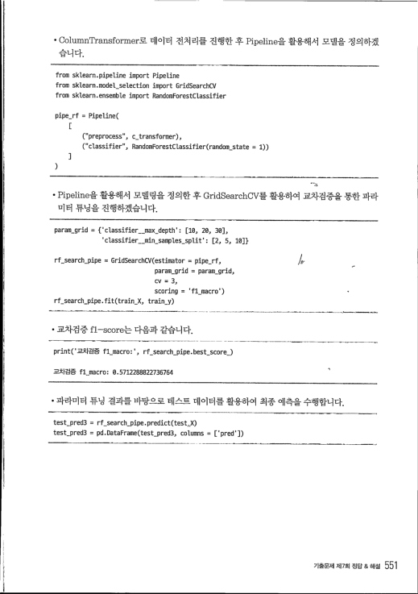
' ColumnTransformer로 데이터 전처리를 진행한 후 Pipeline을 활용해서 모델을 정의하겠 습니다．

```python
from sklearn.pipeline import Pipeline 
from sklearn.model._selection import GridSearchCV 
from skl.earn. ensemble import RandomForestClassifier
pipe_rf = Pipeline(
```
[ ("preprocess", c_transformer), ("classifier", RandomForestCl.assifier(random_state = 1)) ] 뻐’쟈ㅗ ' Pipeline을 활용해서 모델링을 정의한 후 GridSearchCV를 활용하여 교차검증을 통한 파라 미터 튜닝을 진행하겠습니다．

```python
param_grid = {'classifier__max_depth' : [10, 20, 30J, 
'classifier__mmn_samples_split': [2, 5, 10]}
```
### ㅅ
```python
rf_search_pipe = GridSearchCV(estimator = pipe_rf,
param_grid = param_grid, 
cv = 3, 
scoring = 'fl_macro') 
rf_search_pipe. fit (train_X, train_y)
```
- 교차검증 fl- score는 다음과 같습니다．
```python
print(' 교F검증 fl_macro: ', rf_search_pipe.best_score_)
```
교차검증 fl_macro: 0.5712288822736764

- 파라미터 튜닝 결과를 바탕으로 데스트 데이터를 활용하여 최종 예측을 수행합니다．
```python
test_pred3 = rf_search_pipe. predict(test.-X) 
test_pred3 = pd.DataFrame(test_pred3, columns = ['pred'] )
```
기출문제 제7회 정답 & 해설 551

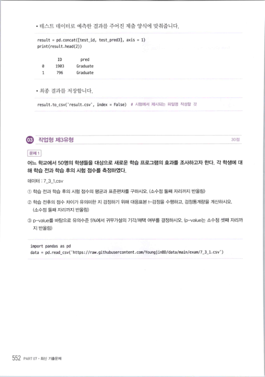
- 테스트 데이터로 예측한 결과를 주어진 제출 양식에 맞춰줍니다．
```python
result = pd.concat([test_id, test_pred3], axis = 1) 
print(result head(2))
```
ID pred 0 1903 Graduate 1 796 Graduate

- 최종 결과를 저장합니다．
```python
result.to_csv( 'result.csv ', index = False) 
# 시험에서 제시되는 파일명 작성할 것
```
.

작업형제3유형 30점 문제 1 어느 학교에서 50명의 학생들을 대상으로 새로운 학습 프로그램의 효과를 좌 하고자 한다 . 각 학생에 대 해 학습 전과 학습 후의 시험 점수를 측정하였다． 데이터 : 7_3_1.csv ① 학습 전과 학습 후의 시험 점수의 평균과 표준편차를 구하시오 . （소수점 둘째 자리까지 반올림） ② 학습 전후의 점수 차이가 유의미한 지 검정하기 위해 대응표본 t－검정을 수행하고 , 검정통계량을 계산하시오． （소수점 둘째 자리까지 반올림） ③p-value를 바탕으로 유의수준 5％에서 귀무가설의 기각／채택 여부를 결정하시오 . (p-v히ue는 소수점 셋째 자리까 지 반올림）

```python
import pandas as pd
data = pd.read_csv( 'https://raw.githubusercontent.com/youngiinBD/data/maifl/exaflh/7_3_1.CsV' )
```
552 PART 07 · 최신 기출문저

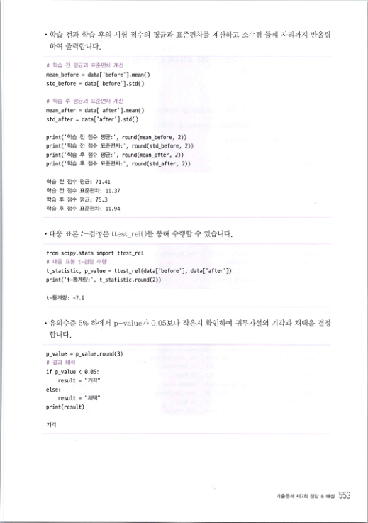
- 학습 전과 학습 후의 시험 점수의 평균과 표준편차를 계산하고 소수점 둘째 자리까지 반올림
하여 출력합니다．

```python
# 학습 전 평균과 표준편차 계산
mean before = data[ 'before '] .mean() 
std_before = data[ 'before '] .std()
# 학습 후 평균과 표준편차 계산
mean_after = data[ 'after'] .mean() 
std_after = data[ 'after'] .std()
print(' 학습 전 점수 평균： ', round(mean_before, 2)) 
print(' 학습 전 점수 표준편차： ' , round(std_before, 2)) 
print(' 학습 후 점수 평균： ', round(mean_after, 2)) 
print(' 학습 후 점수 표준편차： ', round(std_after, 2))
```
학습 전 점수 평균： 71.41 학습 전 점수 표준편차： 11.37 학습 후 점수 평균： 76.3 학습 후 점수 표준편차： 11.94

- 대응 표본 t－검정은 ttestrel(）를 통해 수행할 수 있습니다．
```python
from scipy.stats import ttest_rel 
# 대응 표본 t－검정 수행 
t_statistic, p_value = ttest_rel(data[ 'before'], data[ 'after'] ) 
print('t_통계량: ', t_statistic.round(2))
```
t－통계량： -7 .9

- 유의수준 5% 하에서 p-value가 0.05보다 작은지 확인하여 귀무가설의 기각과 채택을 결정
합니다．

```python
p_value = p_value.round(3)
# 결과 해석 
if p_value < 0.05: 
result = " 기각" 
else: 
result = " 채택" 
print(result)
```
기각 기출문제제7회정답＆해설 553

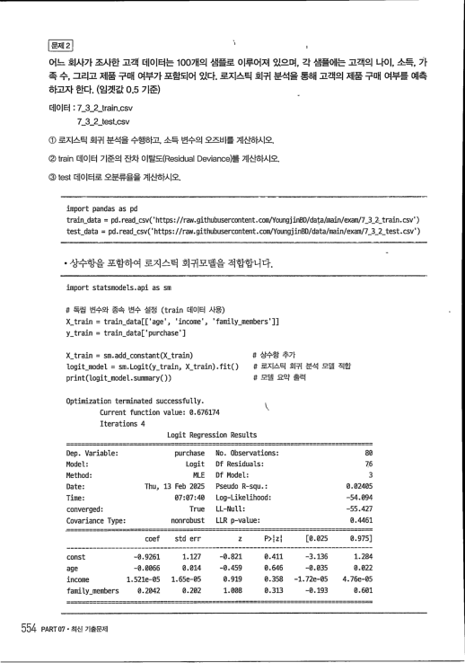
문제 2 어느 회사가 조사한 고객 데이터는 100개의 샘플로 이루어져 있으며 , 각 샘플에는 고객의 나이 , 소득 , 가 족 수 , 그리고 제품 구매 여부가 포함되어 있다 . 로지스틱 회귀 분석을 통해 고객의 제품 구매 여부를 예측 하고자 한다 . （임곗값 0.5 기준） 데이터 : 7 3- 2- train.csv 7 3 2 test.csv ① 로지스틱 회귀 분석을 수행하고 , 소득 변수의 오즈비를 계산하시오． ②train 데이터 기준의 잔차 이탈도（Residual Deviance》를 계산하시오． ③test 데이터로 오분류율을 계산하시오．

```python
import pandas as pd 
train_data = pd.read_csv('https://raw.githubusercontent.com/YoungjinBD/data/main/exam/7_3_2_train.csv ') 
test_data = pd. read_csv( ' https: //raw.githubusercontent.com/YoungjinBD/data/main/exam/7_3_2_test.csv')
```
- 상수항을 포함하여 로지스틱 회귀모델을 적합합니다．
```python
import statsmodels.api as sm
# 독립 변수와 종속 변수 설정 (train 데이터 사용）
X_train = train_datat[ 'age', ' incom& , 'family_members '] ]
y_train = train_data[ 'purchase 'J
# 상수항 추가 
# 로지스틱 회귀 분석 모델 적합 
# 모델 요약 출력
X_train = sm.add_constant(X_train) 
Logit_niodel. = sin.Logit(y_train, X_train).fit () 
print(logit_modeLsumniaryQ)
```
Optimization terminated successfully.

Current function value: 0.676174 꽈erations 4 Logit Regression Results Dep. Variable:

purchase No. Observations:

Model:

Logit Df Residuals:

明 花

- 3
Method:

MLE Of Model:

Date:

Thu, 13 Feb 2025 Pseudo R-squ.:

0.02405 Time:

07:07:40 Log-Likelihood:

-54.094 converged:

True LL-NuU:

-55.427 Covariance Type:

nonrobust LLR p-value:

0.4461 coef std err z P>IzI [0.025 0.975] const -0.9261 1.127 -0.821 0.411 -3.136 1.284 age -0.0066 0.014 -0.459 0.646 -0.035 0.022 income 1.521e-05 1.65e-05 0.919 0.358 -1.72e-05 4.76e-05 family_members 0.2042 0.202 1.008 0.313 -0.193 0.601 554 PART 07· 최신 기출문제

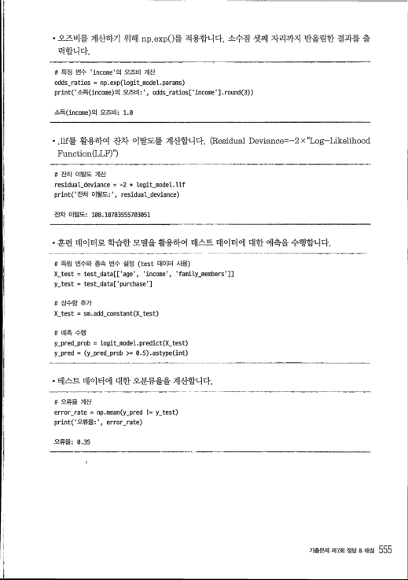
- 오즈비를 계산하기 위해 np.exp(）를 적용합니다 . 소수점 셋째 자리까지 반올림한 결과를 출
력합니다．

```python
# 특정 변수 ' income ' 의 오즈비 계산
odds_ratios = np.exp(logit_modeL params) 
print(' 소득（income）의 오즈비： ', odds_ratios[ 'income'] .round(3))
```
소득（income）의 오즈비： 1.0

- .llf를 활용하여 잔차 이탈도를 계산합니다 . (Residual Deviance=-2 x "Log-Likelihood 
Function(LLF)")

```python
# 잔차 이탈도 계산
residual_deviance = -2 * logit_model.Uf 
print(' 잔차 이탈도： ' , residual_deviance)
```
잔차 이탈도： 108.18783555703051

- 훈런 데이터로 학습한 모델을 활용하여 데스트 데이터에 대한 예측을 수행합니다．
```python
# 독립 변수와 종속 변수 설정 (test 데이터 사용）
X_test = test_data[['age', 'income', 'family_members'] ]
y_test = test_data[ 'purchase']
# 상수항 추가
X_test = sm.add_constant(X_test)
# 예측 수행
y_pred_prob = 1.ogit_model. . predict (X_test)
y_pred = (y_pred_prob >= 0.5).astype(int)
```
- 데스트 데이터에 대한 오분류율을 계산합니다．
```python
# 오류율 계산 
error_rate = np.mean(y_pred != y_test) 
print(' 오류율： ' 』 error_rate)
```
오류율＝ 0.35 기출문제제7회정답& 해셜 555

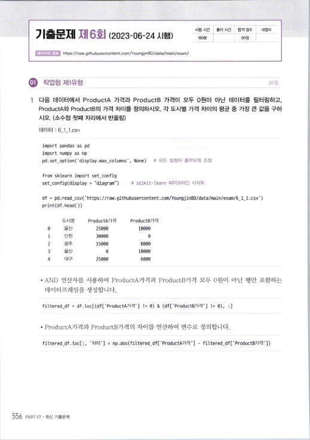
시험시간 풀이시간 합격점수 내점수

## 기출문제 제6회 (2023-06-24시햄）
180분 ,ttII https://raw.githubusercontent.com/YoungjinBD/data/main/exam/ .l 작업형제1유형 30점 다음 데이터에서 ProductA 가격과 ProductB 가격이 모두 0원이 아닌 데이터를 필터링하고， ProductA와 Prod uctB의 가격 차이를 정의하시오 . 각 도시별 가격 차이의 평균 중 가장 큰 값을 구하 시오 . （소수점 첫째 자리에서 반올림） 데이터 : 6_i_i .csv

```python
import pandas as pd 
import numpy as np 
pd.set_아)tion( 'display.max_columns', None) 
# 모든 칼럼이 출력되게 조절
from sklearn import set_config 
set_config(display = "diagram ') 
# scikit-learn 파（기프라인 시각화
df = pd.read_csv( 'https://raw.githubusercontent.com/YoungjinBD/data/main/exam/6_1_1.csv') 
print(df.headQ)
```
도시명 ProductA가격 ProductB가격 0 울산 25000 10000 1 인천 30000 0 2 광주 15000 8000 3 울산 0 10000 4 대구 25000 6000

- AND 연산자를 사용하여 ProductA가격과 ProductB가격 모두 0원이 아닌 행만 포함하는
데이터프레임을 생성합니다．

```python
filtered_df = df.loc[(df[ 'ProductA7격'] != 0) & (df[ 'ProductB가격 '] != 0), :]
```
- ProductA가격과 ProductB가격의 차이를 연산하여 변수로 정의합니다．
filtered_df.loc[:, ' 차이 '] = np.abs(filtered_df[ 'ProductA가격’ ] - flltered_df[ 'ProductB가격'] ) 556 PART 07 * 최신 기출문제

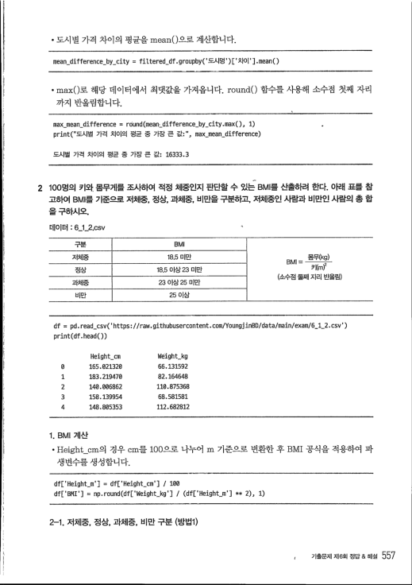
- 도시별 가격 차이의 평균을 mean(）으로 계산합니다．
```python
mean_difference_by_city = fi1.tered_df.groupby('E-&I명 ')[ ' 차OI '] .rnean()
```
- inax(）로 해당 데이터에서 최댓값을 가져옵니다 . round() 함수를 사용해 소수점 첫째 자리
까지 반올림합니다．

```python
max_mean_difference 볍 rciund(mean_difference_by_city.maxQ, 1) 
print(" 도시별 가격 차이의 펑균 중 가장 큰 값： " , max_mean_difference)
```
도시별 가격 차이의 평균 중 가장 큰 값： 16333.3 2 100명의 키와. 몸무게를 조사하여 적정 체중인지 판단할 수 있는 BMI를 산출하려 한다 . 아래 표를 참 고하여 BMI를 기준으로 저체중 , 정상 , 과체중 , 비만을 구분하고 , 저체중인 사람과 비만인 사람의 총 합 을 =i그ㄴ하시오． 데이터 : 6- 1- 2.csv BMI 구분 저처隱 18.5 미만

- . . . 
몸무仇g) ．』 ^ " ~ -- 정상 18.5이상23미만 니 " " - 키（m) （소수점 둘째 자리 반올림） 23 이상 25 미만 과체중 25이상 비만

```python
df = pd.read_csv('https://raw.githubusercontent.com/YoungiinBD/data/main/exam/6_1_2.csv') 
print(df.head())
```
Height_cm Weight_kg 0 165.021320 66.131592 1 183.219470 82.164648 2 140.006862 110.875368 3 158.139954 68.581581 4 148.805353 112.682812

1. BMI 계산
- Height_cm의 경우 cm를 100으로 나누어 m 기준으로 변환한 후 BMI 공식을 적용하여 파
생변수를 생성합니다． df[ 'Height_m '] = df[ 'Height_cm'] I 100 df{ 'BMI'] = np.round(df[ 'Weight_kg '] I (df[ 'Height_m '1 ** 2), 1) 2-1 . 저체중 , 정상 , 과체중 , 비만 구분 （방법1) 기출문제 제6회 정답 & 해설 557

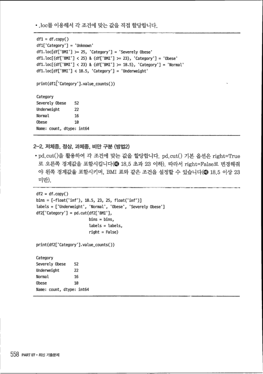
- ,loc를 이용해서 각 조건에 맞는 값을 직접 할당합니다．
dfl = df.copy() df1[ 'Category'] = 'Unknown' dfl.loc[df[ 'BMI'] >= 25, 'Category'] = 'Severely Obese' dfl.loc[(df[ 'BMI'] < 25) & (df[ 'BMI'] >= 23), 'Category'] = 'Obese' dfl.loc[(df[ 'BMI'] < 23) & (df['BMI'] >= 18,5), 'Category'] = 'Normal' dfl.loc{df[ 'BMI'] < 18.5, 'Category'] = 'Underweight '

```python
print(dfl[ 'Category'] .value_countsQ)
```
Category Severely Obese 52 Underweight 22 Normal 16 0bese 10 Name: count, dtype: 1nt64 2-2 . 저체중 , 정상 , 과체중 , 비만 구분 （방법2)

- pd,cut(）을 활용하여 각 조건에 맞는 값을 할당합니다 . pd. cut() 기본 옵션은 right=True 
로 오른쪽 경계값을 포함시킵니다（ㅇl18.5 초과 23 이하） . 따라서 right=False로 변경해줘 야 왼쪽 경계값을 포함시키며 , BMI 표와 같은 조건을 설정할 수 있습니다（.「18,5 이상 23 미만）.

```python
df2 = df.copy() 
bins = [-float('inf '), 18.5, 23, 25, float('inf ')] 
labels = {'llnderweight', 'Normal', 'Obese', 'Severely Obese'] 
df2[ 'Category'] = pd.cut(df2[ 'BMI'] , 
bins = bins, 
labels = labels, 
right = False)
print(df2{ 'Category'] .value_countsQ)
```
Category Severely Obese 52 Underweight 22 Normal 16 0bese 10 Name: count, dtype: int64 558 PART 07. 최신 기출문제

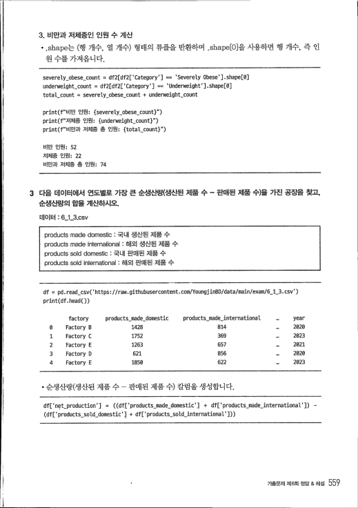
3 . 비만과 저체중인 인원 수 계산

- .shape는 （행 개수 , 열 개수） 형태의 튜플을 반환하며 .shape[O］을 사용하면 행 개수 , 즉 인
원 수를 가져옵니다．

```python
severely_obese_count = df2[df2[ 'Category '] == ' Severe1.y Obese'] .shape[O]
underweight_count = df2{df2[ 'Category '] == ' Underweight'] .shape[O] 
total._count = severely_obese_count + underweight_count
print(f " 비만 인원＝ 什everel.y_obese_count}") 
print(f " 저체중 인원＝ {underweight_count}") 
print(f " 비만과 저체중 총 인원＝ {total_count}")
```
비만 인원＝ 52 저체중 인원＝ 22 비만과 저쳬중 총 인원＝ 74 3 다음 데이터에서 연도별로 가장 큰 순생산량（생산된 제품 수 - 판매된 제품 수）을 가진 공장을 찾고， 순생산량의 합을 계산하시오． 데이터 : 6_1_3.csv products made domestic : 국Lㅐ 생산된 제품 수 products made international : 해외 생산된 제품 수 products sold domestic : 국내 판매된 제품 수 products sold international : 해외 판매된 제품 수

```python
df = pd.read_csv('https://raw.githubusercontent.com/YoungjinBD/data/main/exam/6_1_3.csv ') 
print(df.head())
```
factory products_made_domestic products_made_international ...

year 0 Factory B 1428 814 2020 1 Factory C 1752 369 2023 2 Factory E 1263 657 2021 3 Factory D 621 856 2020 4 Factory E 1850 622 2023

- 순생산량（생산된 제품 수 - 판매된 제품 수） 칼럼을 생성합니다．
df[ 'net_production'] = ((df[ 'products_made_domestic 'll + df[ 'products_made_international'] ) - (df[ 'products_sold_domestic'] + df['products_sold_international '] )) 기출문제 제6회 정답 & 해설 559

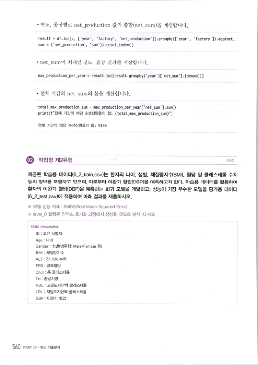
- 연도 , 공장별로 net_production 값의 총합（net sum）을 계산합니다．
```python
result = df.loc[:, ['year', 'factory', 'net_production'] ].groupby([ 'year', 'factory' ]).agg(net
sum = ( 'net_production', 'sum')).reset_index()
```
- net sum이 최대인 연도 , 공장 결과를 저장합니다．
```python
max_production_per_year = result.loc[result.groupby( 'year')['netsum'] .idxmaxQ]
```
- 전쳬 기간의 net sum의 합을 계산합니다．
```python
total_max_production_sum = max_production_per_year[ ' net_sum'] . sum() 
print(f " 전체 기간의 해당 순생산량들의 합： {total_max_productionsum}")
```
전체 기간의 해당 순생산량들의 합： 9130 .

작업형제2유형 제공된 학습용 데이터（6_2_train.csv）는 환자의 나이 , 성별 , 체질량지수（BMI) , 혈당 및 콜레스테롤 수치 등의 정보를 포함하고 있으며 , 이로부터 이완기 혈압（DBP）을 예측하고자 한다 . 학습용 데이터를 활용하여 환자의 이완기 혈압（DBP）을 예측하는 회귀 모델을 개발하고 , 성능이 가장 우수한 모델을 평가용 데이터 (6_2_test.csv）에 적용하여 예측 결과를 제출하시오， ※ 모델 성능 지표 : RMSE(Root Mean Squared Error) ※leveL0 칼럼은 인덱스 초기화 과정에서 생성된 것으로 분석 시 제외 Data description ㄸ〕 : 고유 식별자 Age : 나이 Gender : 성별（범주형： Male/FemaLe 등） BMI ; 체질량지수 ALT : 간 기능 수치 FPG ; 공복혈당 ChoL '. 총 콜레스테롤 Tn : 중성지방 HOL: 고밀도지단백 콜레스테롤 LD L : 저밀도지단백 콜레스테롤 DBP : 이완기 혈압 560 PART 07 . 최신 기출문저

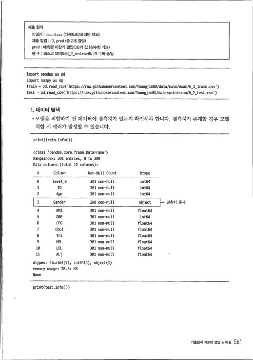
제출 형식 파일명 : resutt.csv （디렉토리／폴더명 제외） 제출 칼럼 : ID. pred （총 2개 칼럼） pred : 예측된 이완기 혈압（DBP) 값 （실수형 가능） 행 수 : 테스트 데이터（6_2_test.csv）의 ＂〕 수와 동일

```python
import pandas as pd 
import numpy as np 
train = pd.read_csv('https://raw.githubusercontent.com/YoungjinBD/data/main/exam/6_2_trajn.csv ') 
test = pd.read_csv( 'https://raw.githubusercontent.com/YoungjinBD/data/main/exam/6_2_test.csv')
```
1 . 데이터 탐색

- 모델을 적합하기 전 데이타에 결측치가 있는지 확인해야 합니다 . 결측치가 존재할 경우 모델 
적합 시 에러가 발생할 수 있습니다．

```python
print(train.info 0)
```
<class 'pandas. core. frame. DataFrame 5 Rangelndex: 301 entries, 0 to 300 Data columns (total 12 columns):

# 
Column Non-Null Count Dtype 0 level 0 301 non-null int64 1 ID 301 non-null int64

## 2 
Age 301 non-null int64 3 Gender 290 non-null object H결측치존재 4 BMI 301 non-null f1oat64 5 DBP 301 non-null int64 6 FPG 301 non-null f1oat64 7 Chol 301 non-null f1oat64 8 Tn 301 non-null f1oat64 9 HDL 301 non-null f1oat64 10 LDL 301 non-null f1oat64 11 ALT 301 non-null f1oat64 dtypes: f10at64(7), int64(4), object(1) memory usage: 28.3+ KB pnint(test.infoQ) 기출문제 저］6회 정답 & 해설 561

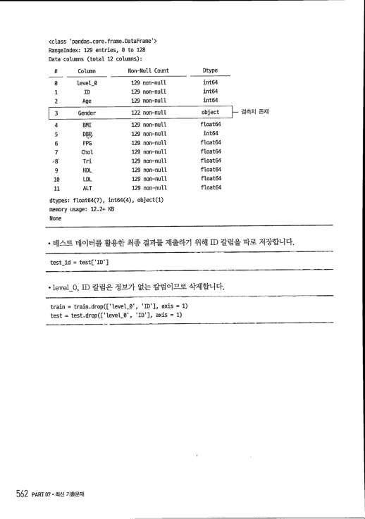
<class 'pandas. core. frame. DataFrame '> Rangelndex: 129 entries, 0 to 128 Data columns (total 12 columns):

# 
Column Non-Null Count Dtype 0 level_0 129 non-null int64 1 ID 129 non-null int64 2 Age 129 non-null int64

## 3 
Gender 122 non-null object H결측치존재 4 BMI 129 non-null fl.0at64 5 DBPC 129 non-null int64 6 FPG 129 non-null f1oat64 7 Chol 129 non-null f1oat64 ,:8" Tni 129 non-null f1oat64 9 HDL 129 non-null f1oat64 10 LDL 129 non-null f1oat64 11 ALT 129 non-null f1oat64 dtypes: f1oat64(7), 1nt64(4), object(1) memory usage: 12.2+ KB None

- 테스트 데이터를 활용한 최종 결과를 제출하기 위해 II) 칼럼을 따로 저장합니다．
```python
test_id = test[ 'ID ']
```
- level 0, ID 칼럼은 정보가 없는 칼럼이므로 삭제합니다．
```python
train = train.drop(['level_O', 'ID '] , axis = 1)
test = test.drop(['level_0', 'ID'] , axis = 1)
```
562 PART 07· 최신기출문제

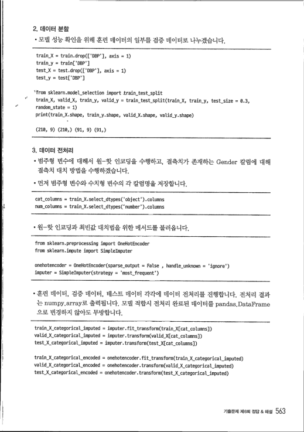
2 . 데이터 분할 ' 모델 성능 확인을 위해 훈런 데이터의 일부를 검증 데이터로 나누겠습니다．

```python
train-X = train.drop([ 'DBP'] , axis = 1) 
train_y = train[ 'DBP'] 
test_X = test.drop([ 'DBP'], axis = 1) 
test-y = test[ 'DBP']
```
9rom sklearn.model_sel.ection import train_test_spi.it " train_X, valid_X, train_y, valid_y = train_test_spl.it (train_X, train_y, test_size = 0.3,

```python
긋' 
random_state = 1) 
print(train_X.shape, train_y.shape, valid_X.shape, valid_y.shape)
```
(210, 9) (210,) (91, 9) (91,) 3 . 데이터 전처리

- 범주형 변수에 대해서 원－핫 인코딩을 수행하고 , 결측치가 존재하는 Gender 칼럼에 대해 
결측치 대치 방법을 수행하겠습니다．

- 먼저 범주형 변수와 수치형 변수의 각 칼럼명을 저장합니다．
```python
cat_columns = train_X.select_dtypes('object').columns 
num_columns = train_X.select_dtypes('number').col.umns
```
- 원－핫 인코딩과 최빈값 대치법을 위한 메서드를 불러옵니다．
```python
from sklearn.preprocessing import OneHotEncoder 
from sklearn.impute import Simplelmputer
onehotencoder = OneHotEncoder(sparse_output = False , handle_unknown = 'ignore') 
imputer = Simple工mputer(strategy = 'most_frequent')
```
' 훈런 데이터， 검증 데이터 , 데스트 데이터 각각에 데이터 전처리를 진행합니다 . 전처리 결과 는 numpy. array로 출력됩니다 . 모델 적합시 전처리 완료된 데이터를 pandas. DataFrame 으로 변경하지 않아도 무방합니다．

```python
train_X_categorical_imputed = imputer. fit_transform(train_X[cat_columns]) 
valid_X_categorical_imputed = imputer.transform(val.id_X[cat_colunins]) 
test_X_categorical_imputed 볍 imputer. transform(test_X[cat_columns])
train_X_categoricaL_encoded = onehotencoder. fit_transform(train_x_categorical_imputed) 
valid_X_categorical._encoded = onehotencoder. transform(valid_X_categorical_imputed) 
test_X_categoricaL_encoded = onehotencoder. transforin(test_X_categorical_imputed)
```
기출문제제6회정답＆해설 563

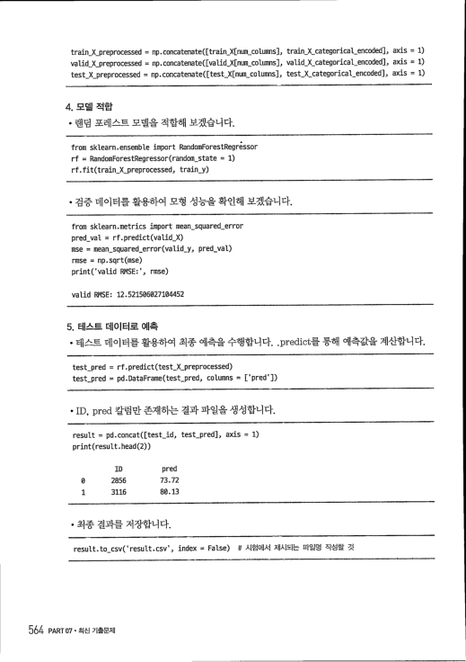
```python
train_X_preprocessed = up . concatenate([train_X[num_col.umns], train_X_categorical_encoded], axis =
```
D D D

```python
valid_X_preprocessed = np. concatenate([valid_X{num_colurnns], vaLid_X_categorical_encoded], axis =
test_X_preprocessed = np. concatenate({test_X[num_columns], test_X_categorical_ericoded], axis =
```
4 . 모델 적합

- 랜덤 포레스트 모델을 적합해 보겠습니다．
```python
from skLearn.ensembLe import RandomForestRegressor 
rf = RandomForestRegressor(random_state = 1) 
rf. fit (train_X_preprocessed, train_y)
```
- 검증 데이터를 활용하여 모형 성능을 확인해 보겠습니다．
```python
from skLearn.metrics import mean_squared_error
pred_vaL = rf.predict(vaUd_X)
mse = mean_squared_error(valid_y, pred_val)
rmse = np.sqrt(mse) 
print('valid RMSE:', rmse)
```
valid RMSE: 12.521506027104452 5 . 테스트 데이터로 예측

- 테스트 데이터를 활용하여 최종 예측을 수행합니다 . . predict를 통해 예측값을 계산합니다．
```python
test_pred = rf. predict (test_X_p rep rocessed) 
test_pred = pd.DataFrame(test_pred, columns = {'pred '])
```
- ID, pred칼럼만존재하는결과파일을생성합니다．
```python
result = pd.concat([test_id, test_pred], axis = 1) 
print(result . head (2))
```
ID pred 0 2856 73.72 1 3116 80.13

- 촤종 결과를 저장합니다．
result.to_csv( 'resuLt.csv', index = False) # 시험에서 제시되는 파일명 작성할 것 564 PART 07· 최신 기출문제

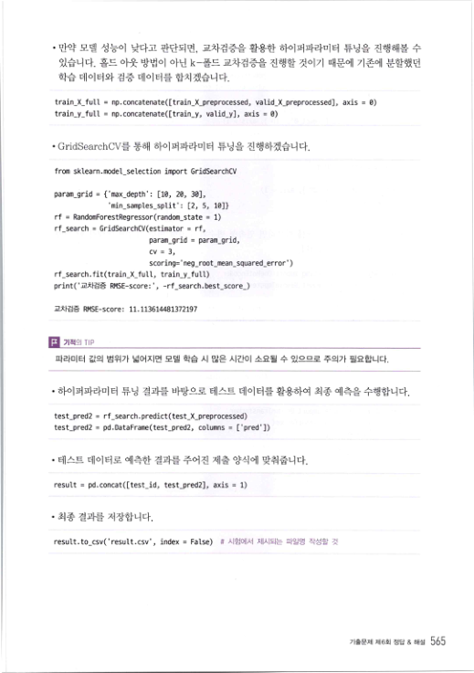
- 만약 모델 성능이 낮다고 판단되면 , 교차검증을 활용한 하이퍼파라미터 튜닝을 진행해볼 수
있습니다 . 홀드 아웃 방법이 아닌 k－폴드 교차검증을 진행할 것이기 때문에 기존에 분할했던 학습 데이터와 검증 데이터를 합치겠습니다．

```python
train_X_fufl = np.concatenate([train_X_preprocessed, valid_X_preprocessed], axis = 0) 
train_y_fu]i. = np.concatenate([train_y, valid_y], axis = 0)
```
- GridSearchCV를 통해 하이퍼파라미터 튜닝을 진행하겠습니다．
```python
from sklearn.model_selection import GridSearchCV
param_grid = { 'max_depth ' : [10, 20, 30], 
' min_samples_spl.it ' : [2, 5, 10]} 
rf = RandomForestRegressor(random_state = 1) 
rf_search = GridSearchCV(estimator = rf,
param_grid = param_grid,
cv = 3,
scoring= ' neg_root_mean_squared_error ' ) 
rf_search.fit (train_X_full, train_y_ful.l) 
print('교F검증 RMSE-score: ' , -rf_search.best_score_)
```
교차검증 RMSE-score: 11.113614481372197 ［헴 기적의 지P 파라미터 값의 범위가 넓어지면 모델 학습 시 많은 시간이 소요될 수 있으므로 주의가 필요합니다．

- 하이퍼파라미터 튜닝 결과를 바탕으로 테스트 데이터를 활용하여 최종 예측을 수행합니다．
```python
test_pred2 = rf_search. predict(test_X_preprocessed) 
test_pred2 = pd.DataFrame(test_pred2, columns = [ 'pred '] )
```
- 테스트 데이터로 예측한 결과를 주어진 제출 양식에 맞춰줍니다．
```python
result = pd.concat([test_id, test_pred2], axis = 1)
```
- 최종 결과를 저장합니다．
```python
result.to_csv( ' result.csv ', index = False) 
# 시험에서 제시되는 파일명 작성할 것
```
기출문제 제6회 정답 & 해설 565

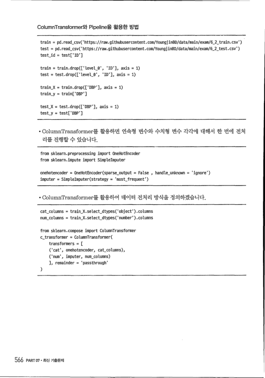
ColumriTransformer와 PipeHne을 활용한 방법

```python
train = pd. read_csv( 'https: //raw.githubusercontent. com/YoungjinBD/data/main/exam/6_2_train. csv') 
test = pd.read_csv('https://raw.githubusercontent.com/YoungjinBD/data/main/exam/6_2_test.csv') 
test- Id = test['ID'l
train = train.drop([ ' l evel_O', 'ID'], axis = 1) 
test = test.drop(['level_0', 'ID'], axis = 1)
train_X = train.drop([ 'DBP'], axis = 1) 
train_y = train[ 'DBP']
test_X = test.drop(['DBP'], axis = 1) 
test_y = test[ 'DBP']
```
- ColumnTransformer를 활용하면 연속형 변수와 수치형 변수 각각에 대해서 한 번에 전처
리를 진행할 수 있습니다．

```python
from sklearn.preprocessing import OneHotEncoder 
from sklearn.impute import Simplelmputer
onehotencoder = OneHotEncoder(sparse_output == False , handle_unknown = 'ignore') 
imputer = Simple工mputer(strategy = 'most_frequent')
```
- ColumnTransformer를 활용하여 데이터 전처리 방식을 정의하겠습니다．
```python
cat_columns = train_X.select_dtypes('object').col.umns
num_columns = train_X.select_dtypes('number').columns
from sklearn.compose import ColumnTransformer
c_transformer = Columnlransformer( 
transformers = 〔 
('cat', onehotencoder, cat_columns), 
('num', imputer, num_columns) 
], remainder = 'passthrough' 
)
```
566 PART 07· 최신 기출문제

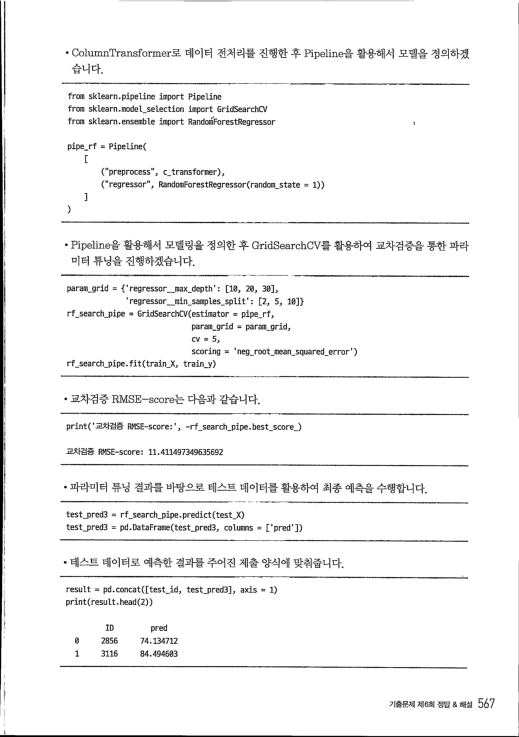
- ColumnTransformer로 데이터 전처리를 진행한 후 Pipeline을 활용해서 모델을 정의하겠
습니다．

```python
from sklearn.pipeline import Pipeline 
from skl.earn.model._sel.ection import GridSearchCV 
from sklearn.ensemble import RandoiiiForestRegressor
pipe_rf = Pipeline(
```
("preprocess", c_transformer), ("regressor", RandomForestRegressor(random_state = 1)) II )

- Pipeline을 활용해서 모델링을 정의한 후 GridSearchCV를 활용하여 교차검증을 통한 파라 
미터 튜닝을 진행하겠습니다．

```python
param_grid = {'regressor__max_depth': [10, 20, 30J, 
'regressor__niin_samples_spl.it ': [2, 5, 10]} 
rf_search_pipe = GridSearchCV(estimator = pipe_rf,
param_grid = param_grid, 
cv = 5, 
scoring = 'neg_root_mean_squared_error') 
rf_search_pipe. fit (train_X, train_y)
```
- 교차검증 RMSE-score는 다음과 같습니다．
```python
print(' 교F검증 RI'ISE-score:', -rf_search_pipe. best_score_)
```
교차검증 刪SE-score: 11.411497349635692

- 파라미터 튜닝 결과를 바탕으로 테스트 데이터를 활용하여 최종 예측을 수행합니다．
```python
test_pred3 = rf_search_pipe.predict (test_X) 
test_pred3 = pd.DataFrame(test_pred3, columns = ['pred'])
```
- 테스트 데이터로 예측한 결과를 주어진 제출 양식에 맞춰줍니다．
```python
result = pd.concat([test_id, test_pred3], axis = 1) 
print(result. head(2))
```
ID pred 0 2856

74. 134712 
1 3116 84.494603 기출문제제6회정답＆해설 567

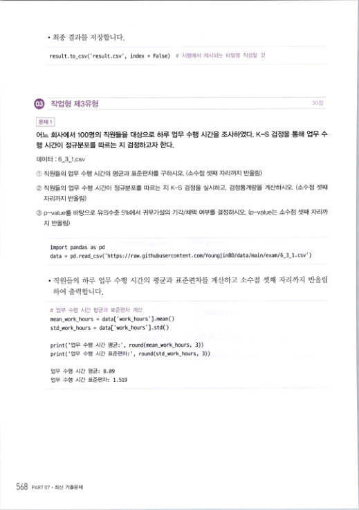
- 최종 결과를 저장합니다．
result.to_csv(' result.csv', index = False) # 시험에서 제시되는 파일명 작성할 것 ㅇ 작업형제3유형 30접 문제 1 어느 회사에서 100명의 직원들을 대상으로 하루 업무 수행 시긴믈 조사하였다 . K-S 검정을 통해 업무 수 행 시간이 정규분포를 따르는 지 검정하고자 한다， 데이터 : 6_3_1.csv ① 직원들의 업무 수행 시간의 평균과 표준편차를 구하시오 . （소수점 셋째 자리까지 반올림） ② 직원들의 업무 수행 시간이 정규분포를 따르는 지 K-S 검정을 실시하고 , 검정통계량을 계산하시오 . （소수점 셋째 자리까지 반올림） ③p-value를 바탕으로 유의수준 5％에서 귀무가설의 기각／채택 여부를 결정하시오 . (p-value는 소수점 셋째 자리까 지 반올림）

```python
import pandas as pd
data = pd. read_csv( https://raw.githubusercontent.com/YoungjinBD/data/main/exam/6_3_1.CSV ')
```
- 직원들의 하루 업무 수행 시간의 평균과 표준편차를 계산하고 소수점 셋째 자리까지 반올림
하여 출력합니다．

```python
# 업무 수행 시간 평균과 표준편차 계산
mean_work_hours = data[ 'work_hours'] .mean()
std_work_hours = data[ ' work_hours'] .std()
print(' 업무 수행 시간 평균： ' , round(mean_wor나1ours, 3)) 
print(' 업무 수행 시간 표준편차： ' , round(std_wo탸나1ours, 3))
```
업무 수행 시간 평균： 8.09 업무 수행 시간 표준편차： 1.519 568 PART 07 . 최신 기출문제

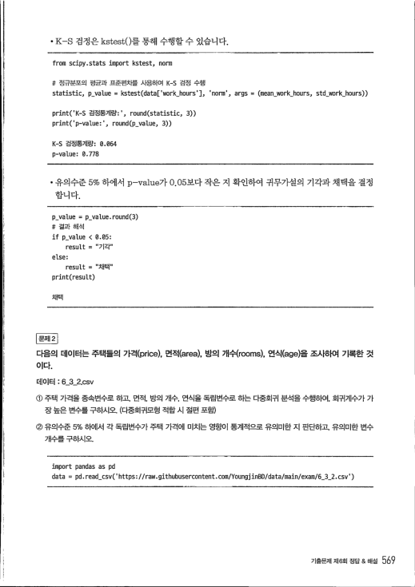
- K- S 검정은 kstest(）를 통해 수행할 수 있습니다．
```python
from scipy.stats import kstest, norm
# 정규분포의 펑균과 표준편차를 사용하여 K-S 검정 수행 
statistic, p_val.ue = kstest(data{ 'work_hours '], ' norms, args = (mean_work_hours, std_work_hours))
print(' K-$ 검정통계량＝ ' , round(statistic, 3)) 
print(' p-value: ', round(p_val.ue, 3))
```
K-S 검정통계량： 0.064 p-value: 0.778

- 유의수준 5% 하에서 p-value가 0.05보다 작은 지 확인하여 귀무가설의 기각과 채택을 결정
합니다．

```python
p_value = p_value.round(3) 
# 결과 해석 
if p_value < 0.05: 
result = " 기각" 
else: 
result = " 채택" 
print(result)
```
채택 문제 2 다음의 데이터는 주택들의 가격巾rice) , 면적（area) , 방의 개수（rooms) , 연식（age）을 조사하여 기록한 것 이다． 데이터 : 6- 3- 2.csv ① 주택 가격을 종속변수로 하고 , 면적 , 방의 개수 , 연식을 독립변수로 하는 다중회귀 분석을 수행하여 . 회귀계수가 가 장 높은 변수를 구하시오 . （다중회귀모형 적합 시 절편 포함） ② 유의수준 5% 하에서 각 독립변수가 주택 가격에 미치는 영향이 통계적으로 유의미한 지 판단하ㅍ 유의미한 변수 개수를 구하시오．

```python
import pandas as pd 
data = pd.read_csv('https://raw.githubusercontent.com/YoungjinBD/data/main/exam/6_3_2.csv ')
```
기출문제제6회정답＆해설 569

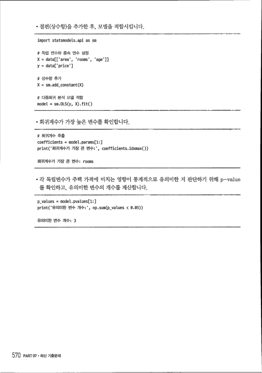
- 절편（상수항）을추가한후 , 모델을 적합시킵니다．
```python
import statsmodels.api as sm
# 독립 변수와 종속 변수 설정
X = data[['area ', 'rooms ', sage'] ]
y = data['pric& ]
# 상수항 추가
X = sm.add_constant(X)
# 다중회귀 분석 모델 적합
model = sm.OLS(y, X).fit ()
```
- 회귀계수가 가장 높은 변수를 확인합니다．
```python
# 회귀계수 추출 
coefficients = model.params[l: ] 
print(' 회귀계수가 가장 큰 변수： ', coefficients. idxmaxQ)
```
회귀계수가 가장 큰 변수： rooms

- 각 독립변수가 주택 가격에 미치는 영향이 통계적으로 유의미한 지 판단하기 위해 p-value 
를 확인하고 , 유의미한 변수의 개수를 계산합니다．

```python
p_values = model.pvalues[1:] 
print(' 유의미한 변수 개수＝ ' , np.sum(p_values < 0.05))
```
유의미한 변수 개수： 3 570 PART07＊최신기출문제

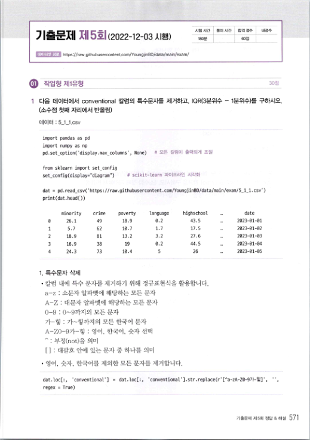
시험 시간 풀이 시간 합격 점뛰 내점수

## 기출문제 제5회(2022-12-03시햄）
180분 l 60점 더I이터셋경토一 https://raw.githubusercontent.com/YoungjinBD/data/main/exam/ .

작업형제1유형 30점 1 다음 데이터에서 convention히 칼럼의 특수문자를 제거하고 , IQR(3분위수 - 1분위수）를 구하시오． （소수점 첫째 자리에서 반올림） 데이터 : 5- 1- 1.csv

```python
import pandas as pd 
import numpy as np 
pd.set_option( ' display.max_columns ', None)
# 모든 칼럼이 출력되게 조절
from sklearn import set_config 
set_config(display= "diagram ')
# scikit-learn 파이프라인 시각화
dat = pd. read_csv( 'https://raw.githubusercontent.com/YoungjinBD/data/main/exam/5j_1.csv') 
print(dat.head())
```
minority crime poverty language highschool.

date 0 26.1 49 18.9 0.2 43.5 2023-01-01 1 5.7 62 10.7 1.7 17.5 , . .

2023-01-02 2 18.9 81 13.2 3.2 27.6 2023-01-03 3 16.9 38 19 0.2 44.5 2023-01-04 4 24.3 73 10.4 5 26 2023-01-05 1 . 특수문자 삭제

- 칼럼 내에 특수 문자를 제거하기 위해 騙 표현식을 활용합니다．
ㅑ : 소문자 알파벳에 해당하는 모든 문자 A-Z : 대문자 알파벳에 해당하는 모든 문자 0-9 : 0∼9까지의 모든 문자 가힝 : 가∼힝까지의 모든 한국어 문자 A-ZO-9가 힝 : 영어 , 한국어 , 숫자 선택 ^ : 부정＜not）을 의미 [ ] : 대괄호 안에 있는 문자 중 하나를 의미

- 영어 , 숫자 , 한국어를 제외한 모든 문자를 제거합니다．
dat.loc[:, ' conventional' ] = dat.loc[:, conventional '] .str.replace(r '['a-zA-Z0-9가-힐] ',

```python
regex = True)
```
기출운제 저5회 정답 & 해설 571

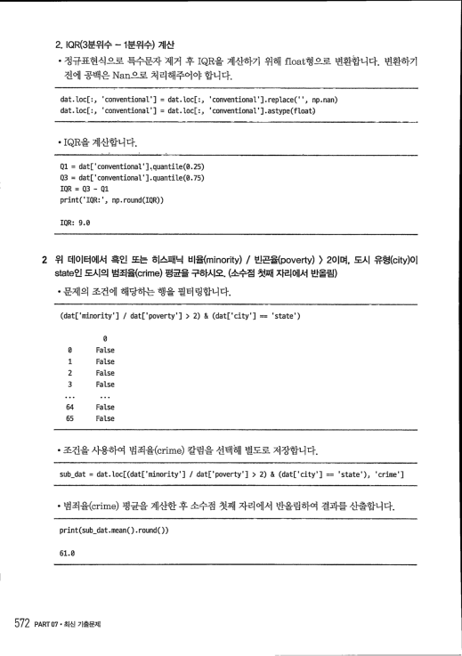
2. IQR(3분위수 - 1분위수） 계산
- 棚干표현식으로 특수문자 제거 후 IQR을 계산하기 위해 float형으로 변환합니다 . 변환하기
전에 공백은 Nan으로 처리해주어야 합니다． dat.loc[:, 'conventional'] = dat.1.oc[:, 'conventional'] .replace(' ', np.nan) dat.locE:, 'conventional'] = dat.loc[:, 'conventional'] .astype(fl.oat)

- IQR을 계산합니다．
```python
Qi = datE 'conventional'] .quantile(O.25)
Q3 = dat[ 'conventional'] .quantile(0.75)
IQR = Q3 - Q1 
print('IQR:', np.round(IQR))
```
IQR: 9.0 2 위 데이터에서 흑인 또는 히스패닉 비율《minority) / 빈곤율（poverty) > 2이며 , 도시 유형（city）이 state인 도시의 범죄율《《劾me) 평균을 구하시오 , （소수점 첫째 자리에서 반올림）

- 문제의 조건에 해당하는 행을 필터링합니다．
(dat['minority'] I datf 'poverty'] > 2) & (datf 'city'] == 'state') 0 0 False 1 False 2 False 3 False 64 False 65 False

- 조건을 사용하여 범죄율（crime) 칼럼을 선택해 별도로 저장합니다．
```python
sub_dat = dat.loc[(datf 'minority'] / datE'poverty'] > 2) & (dat['city'] = 'state'), 'crime']
```
- 범죄율（crime) 평균을 계산한 후 소수점 첫째 자리에서 반올림하여 결과를 산출합니다．
```python
print(sub_dat .mean() . roundO)
```
61.0 572 PART 07．최신기출문제

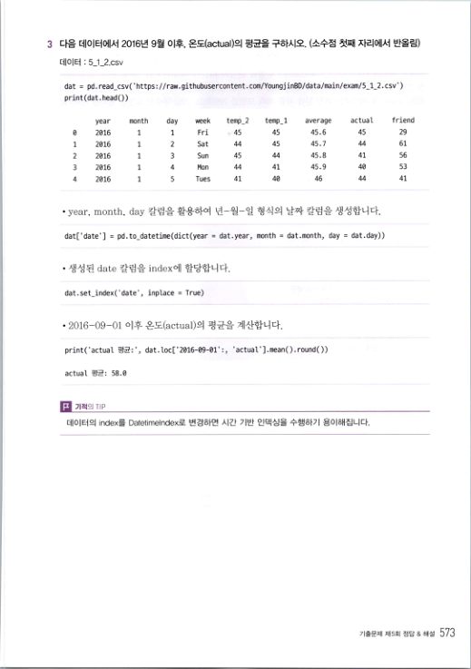
3 다음 데이터에서 2016년 9뭘 이후 , 온도（actu테）의 평균을 구하시오 . （소수점 첫째 자리에서 반올림） 데이터 : 5- 1- 2.csv

```python
dat = pd. read_csv( 'https://raw.githubusercontent.com/YoungjinBD/data/main/exam/5_1_2.cSv' ) 
print(dat. head 0)
```
year month day week temp_2 temp_i average actual.

friend 0 2016 1 1 Fri 45 45 45.6 45 29 1 2016 1 2 Sat 44 45 45.7 44 61 2 2016 1 3 Sun 45 44 45.8 41 56 3 2016 1 4 Mon 44 41 45.9 40 53 4 2016 1 5 Tues 41 40 46 44 41

- year, month, day 칼럼을 활용하여 년－월 일 형식의 날짜 칼럼을 생성합니다．
dat[ 'date '] = pd.to_datetime(dict(year = dat.year, month = dat.month, day = dat.day))

- 생성된 date 칼럼을 index에 할당합니다．
dat.set_index( 'date', inpiace = True)

- 2016-09-01 이후 온도（actual）의 평균을 계산합니다．
```python
print('actual 평균: ', dat.loc[ '2016-09-01 ' :, ' actual' ].meanO.roundO)
```
act uat 평균： 58.0

### r잽 기적의 뀌P
데이터의 index를 Datetimeinde×로 변경하면 시간 기반 인덱싱을 수행하기 용이해집니다． 기출문제 저5회 정답 & 해설 573

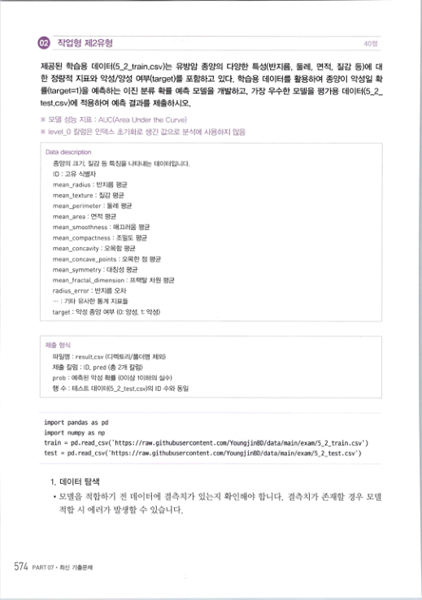
.

작업형제2유형 제공된 학습용 데이터（5_2_train.csv）는 유방암 종양의 다잉隱＇ 특성（반지름 , 둘레 , 면적 , 질감 등）에 대 한 정량적 지표와 악성／양성 여부（target）를 포함하고 있다 . 학습용 데이터를 활용하여 종양이 악성일 확 률〈target=1）을 예측하는 이진 분류 확률 예측 모델을 개발하고 , 가장 우수한 모델을 평가용 데이터（5-2- test.csv）에 적용하여 예측 결과를 제출하시오． ※ 모델 성능 지표 : AUC(Area Under the Curve) < Ievel_O 칼럼은 인덱스 초기화로 생긴 값으로 분석에 사용하지 않음 Data description 종양의 크기 , 질감 등 특징을 나타내는 데이터입니다． ㄸ〕 : 고유 식별자 mean radius : 반지름 평균 mean texture : 질감 평균 mean_perimeter : 둘레 평균 mean area ; 면적 평균 mean_smoothness : 매끄러움 평균 mean_compactness : 조밀도 펑균 mean_concavity : 오목함 평균 mean_concave_points : 오목한 점 평균 mean_symmetry : 대칭성 평균 mean_f ra cta L_d i men si on : 프랙탈 차원 평균 radius_error ; 반지름 오차 … : 기타 유사한 통계 지표들 target : 악성 종양 여부 (0: 양성 . 1: 악성） 제출 형식 파일명 : resutt.csv （디렉토리／폴더명 제외） 제출 칼럼 : D. pred （총 2개 칼럼） prob : 예측된 악성 확률 (0이상 1이하의 실수） 행 수 " 테스트 데이터（5 2 test.csv）의 D 수와 동일

```python
import pandas as pd 
import numpy as np 
train = pd.read_csv( 'https://raw.githubusercontent.com/YoungjinBD/data/main/exam/5_2_train.csv' ) 
test = pd.read_csv( https://raw.githubusercontent.com/YoungjinBD/data/niain/exam/5_2_test.csv' )
```
1 . 데이터 탐색

- 모델을 적합하기 전 데이터에 결측치가 있는지 확인해야 합니다 . 결측치가 존개할 경우 모델
적합 시 에러가 발생할 수 있습니다． 574 PART 07 . 최신 기출문제

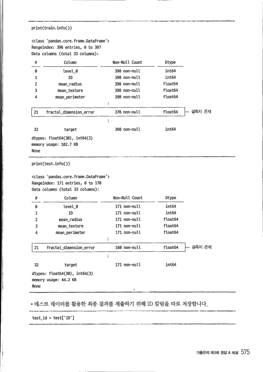
```python
print(train.infoO)
```
<class ' pandas. core. frame. DataFrame 5 Rangelndex: 398 entries, 0 to 397 Data columns (total 33 columns):

# 
Column Non-Null Count Dtype 0 level 0 398 non-null 1nt64 1 ID 398 non-null int64 2 mean radius 398 non-null f10at64 3 mean texture 398 non-null f10at64 4 mean_perimeter 398 non-null f1oat64

## 21 
fractal dimension error 378 non-null f1oat64 H결측치존재 32 target 398 non-null int64 dtypes: f10at64(30), int64(3) memory usage: 182.7 KB None

```python
print(test.infoQ)
```
<class ' pandas. core. frame. DataFrame S Range工ndex: 171 entries, 0 to 170 Data columns (total 33 columns):

# 
Column Non-Null Count Dtype 0 level 0 171 non-null 1nt64 1 ID 171 non-null int64 2 mean radius 171 non-null f1oat64 3 mean texture 171 non-null f1oat64 4 mean_perimeter 171 non-null f1oat64

## 21 
fractal dimension error 160 non-null f10at64 H결측치존재 32 target 171 non-null 1nt64 dtypes: f10at64(30), 1nt64(3) memory usage: 44.2 KB None

- 테스트 데이터를 활용한 최종 결과를 제출하기 위해 ID 칼럼을 따로 저장합니다．
```python
test_id = test{ '1D ']
```
기출문제저l5회정답＆해설 575

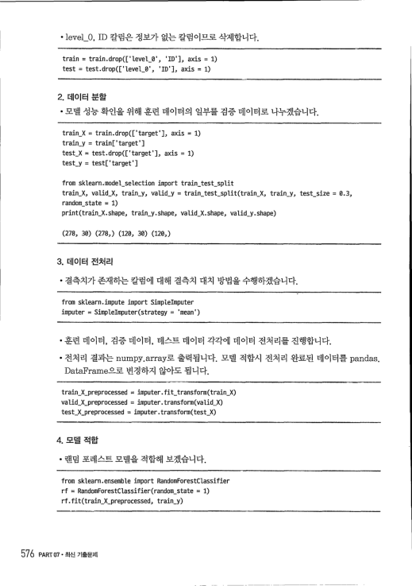
- level_O, ID 칼럼은 정보가 없는 칼럼이므로 삭제합니다．
```python
train = train.drop(['l.evel-O', 'IDe], axis = 1) 
test = test.drop(['level_O', 'IDi, axis = 1)
```
2 . 데이터 분할

- 모델 성능 확인을 위해 훈련 데이터의 일부를 검증 데이터로 나누겠습니다．
```python
train_X = train.drop(f 'target '], axis = 1) 
train_y = trainf 'target'] 
test_X = test.drop([ 'target'], axis = 1) 
test_y = test[ 'target 'J
from skLearn.model_selection import train_test_split 
train_X, valid_X, train_y, valid_y = train_test_split(train_X, train_y, test_size = 0.3,
random_state = 1) 
print(train_X.shape, train_y.shape, val.id_X.shape, val.id_y.shape)
```
(278, 30) (278,) (120, 30) (120,) 3 . 데이터 전처리

- 결측치가 존재하는 칼럼에 대해 결측치 대치 방법을 수행하겠습니다．
```python
from skl.earn.impute import Simptelmputer 
imputer = SimpLelmputer(strategy = ' mean')
```
- 훈련 데이터 , 검증 데이터 , 테스트 데이터 각각에 데이터 전처리를 진행합니다．
- 전처리 결과는 numpy. array로 출력됩니다 . 모델 적합시 전처리 완료된 데이터를 pandas. 
DataFrame으로 변경하지 않아도 됩니다．

```python
train_X_preprocessed = imputer.fit_transform(train_X) 
valid_X_preprocessed = imputer. transforin(valid_X) 
test_X_preprocessed = imputer.transform(test_X)
```
4 . 모델 적합

- 랜덤 포레스트 모델을 적합해 보겠습니다．
```python
from sklearn.ensemble import RandomForestClassifier 
rf = RandomForestClassifier(random_state = 1) 
rf.fit (train_X_preprocessed, train_y)
```
576 PART 07．최신기출문제

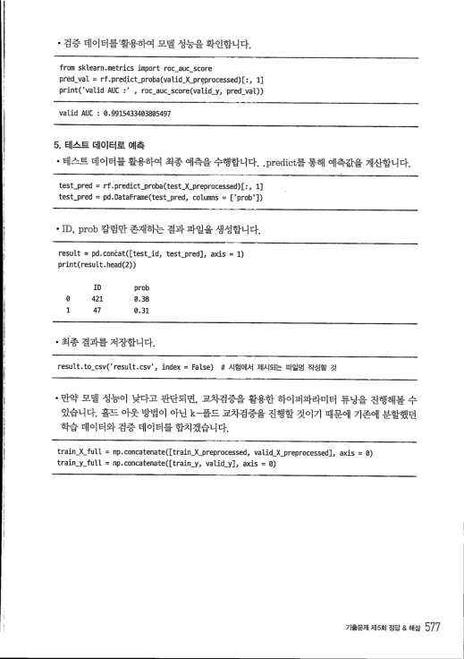
- 검증 데이터를 ' 활용하여 모델 성능을 확인합니다．
```python
from sklearn.metrics import roc_auc_score 
pred_val = rf .predict_proba (valid_X_pr르processed) II:, 1] 
print('vaLid AUC :' , roc_auc_score(valid_y, pred_val))
```
valid AUC = 0.9915433403805497 5 . 테스트 데이터로 예측

- 데스트 데이터를 활용하여 최종 예측을 수행합니다 . . predict를 통해 예측값을 계산합니다．
```python
test_pred = rf.predict_proba(test_X_preprocessed)[:, 1] 
test_pred = pd.DataFrame(test_pred, columns = [ 'prob 'J)
```
- ID, prob 칼림만 존재하는 결과 파일을 생성합니다．
```python
result = pd.con七at([test-id, test_pred], axis = 1) 
print(result . head(2))
```
ID prob 0 421 0.38 1 47 0.31

- 최종 결과를 저장합니다．
result.to_csv( 'resu1t.csv, index = False) # 시험에서 제시되는 파일명 작성할 것 ' 만약 모델 성능이 낮다고 판단되면 , 교차검증을 활용한 하이퍼파라미터 튜닝을 진행해볼 수 있습니다 . 홀드 아웃 방법이 아난 k－폴드 교차검증을 진행할 것이기 때문에 기존에 분할했던 학습 데이터와 검증 데이터를 합치겠습니다．

```python
train_X_full = np.concatenate([train_X_preprocessed, valid_X_preprocessed], axis = 0) 
train_y_full = np.concatenate([train-y, valid_y], axis = 0)
```
기출문제제5회 정답＆ 해설 577

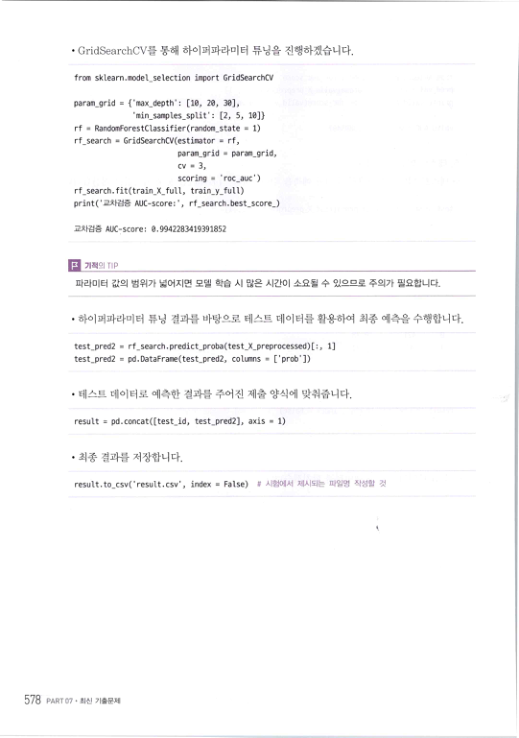
- GridSearchCV를 통해 하이퍼파라미터 튜닝을 진행하겠습니다．
```python
from sktearn.model_selection import GridSearchCV
param_grid = {'max_depth' : [10, 20, 30],
' min_sampl.es_spl.it ' : [2, 5, 10]} 
rf = RandomForestClassifier(random_state = 1) 
rf_search = GridSearchCV(estimator = rf,
param_grid = param_grid,
cv = 3, 
scoring = ' roc_auc ') 
rf_search. fit (train_X_full., train_y_fuU) 
print(' 교차검증 AUC-score:', rf_search.best_score_)
```
교차검증 AUC-score: 0.9942283419391852 .

기적의 지p 파라미터 값의 범위가 넓어지면 모델 학습 시 많은 시간이 소요될 수 있으므로 주의가 필요합니다．

- 하이퍼파라미터 튜닝 결과를 바탕으로 테스트 데이터를 활용하여 최종 예측을 수행합니다．
```python
test_pred2 = rf_search . predict_proba(test_X_preprocessed) [:, 1] 
test_pred2 = pd.DataFrame(test_pred2, columns = [ 'prob '])
```
- 테스트 데이터로 예측한 결과를 주어진 제출 양식에 맞춰줍니다．
resu't = pd.concat([test_id, test_pred2], axis = 1)

- 최종 결과를 저장합니다．
```python
resutt.to_csv(' result.csv닝 index = False) 
# 시험에서 제시되는 파일명 작성할 것
```
룃 578 PART 07 . 최신 기출문제

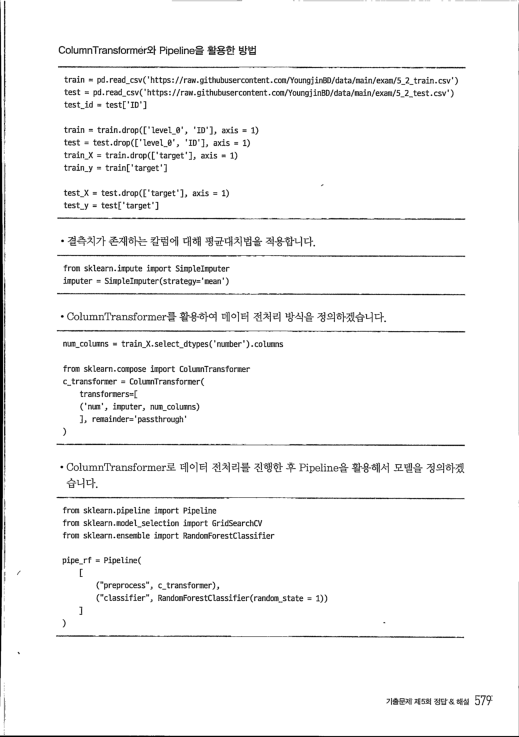
ColumnTransformer오F Pipeline을 활용한 방법

```python
train = pd.read_csv('https://raw.githubusercontent.com/youngjinBD/data/main/exam/5-2-train,csv') 
test = pd.read_csv('https://raw.githubusercontent.com/YoungjinBD/data/main/exam/5_2_test,csv') 
test_id = testr 'ID']
train = train.drop(['level_0', 'ID '], axis = 1) 
test = test.drop(['level_0', 'ID'], axis = 1) 
train_X = train.drop(['target'], axis = 1) 
train_y = train['target']
test_X = test.drop(['target'] , axis = 1) 
test_y = test{'target']
```
- 결측치가 존재하는 칼럼에 대해 평균대치법을 적용합니다．
```python
from sklearn.impute import Simpl.elmputer 
imputer = Siniplelmputer(strategy= 'mean')
```
- ColumnTransformer를 활용하여 데이터 전처리 방식을 정의하겠습니다．
```python
num_columns = train_X.select_dtypes('number').columns
from skLearn.compose import ColumnTransformer 
c_transformer = ColumnTransformer( 
transformers=[ 
('num', imputer, num_columns) 
], remainder=' passthrough'
```
- ColumnTransformer로 데이터 전처리를 진행한 후 Pipeline을 활용해서 모델을 정의하겠
습니다．

```python
from sklearn.pipeline import Pipeline 
from sklearn.model_selection import GridSearchCV 
from sklearn.ensemble import RandomForestClassifier
```
pipe_rf = Pipeline( [ ('preprocess", c_transformer), ("classifier", RandomForestClassifier(random_state = 1)) 〕 ) 기출문저「제5회정답，＆해설 579￡

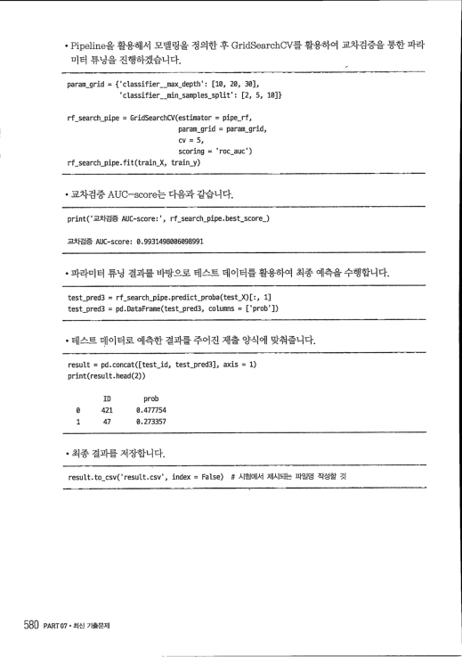
- Pipeline을 활용해서 모델링을 정의한 후 GridSearchCV를 활용하여 교차검증을 통한 파라
미터 튜닝을 진행하겠습니다．

```python
param_grid = { 'classifier__niax_depth ' : [10, 20, 30], 
'classifier__min_samples_split ': [2, 5, 10]}
rf_search_pipe = GridSearchCV(estimator = pipe_rf,
param_grid = param_grid, 
cv = 5, 
scoring = 'roc_auc ') 
rf_search_pipe. fit (train_X, train_y)
```
- 교차검증 AUC -score는 다음과 같습니다．
```python
print(' 교F검증 AUC-score: ', rf_search_pipe.best_score_)
```
교차검증 ALJC-score: 0.9931498006098991

- 파라미터 튜닝 결과를 바탕으로 테스트 데이터를 활용하여 최종 예측을 수행합니다．
```python
test_pred3 = rf_search_pipe. predict_proba (test_X) [:, 1] 
test_pred3 = pd.DataFrame(test_pred3, col.unins = ['prob'] )
```
- 테스트 데이터로 예측한 결과를 주어진 제출 양식에 맞춰줍나다．
```python
result = pd.concat([test_id, test_pred3], axis = 1) 
print(result. head(2))
```
ID prob 0 421 0.477754 1 47 0.273357

- 최종 결과를 저장합니다．
result.to_csv( 'resuLt.csv', index = False) # 시험에서 제시되는 파일명 작성할 것 580 PART 07．최신기출문제

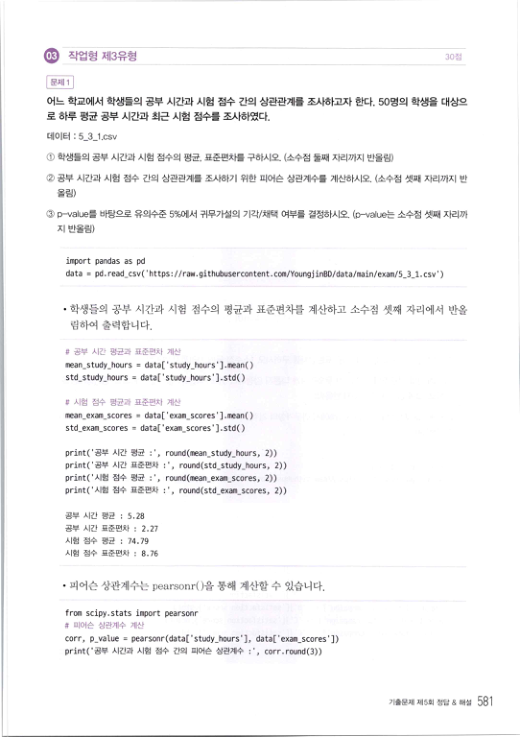
.

작업형제3유형 30찹 문제 1 어느 학교에서 학생들의 공부 시간과 시험 점수 간의 상관관계를 죄 하고자 한다 . 50명의 학생을 대상으 로 하루 평균 공부 시간과 최근 시험 점수를 좌 하였다． 데이터 : 5 3 1.csv ① 학생들의 공부 시간과 시험 점수의 평균 , 표준편차를 구하시오 . （소수점 둘째 자리까지 반올림） ② 공부 시간과 시험 점수 간의 상관관계를 조사하기 위한 피어슨 상관계수를 계산하시오 . （소수점 셋째 자리까지 반 올림） ③p-value를 바탕으로 유의수준 5％에서 귀무가설의 기각／채택 여부를 결정하시오 . (p-value는 소수점 셋째 자리까 지 반올림）

```python
import pandas as pd 
data = pd.read_csv( https://raw.githubusercontent.com/YoungjinBD/data/main/exam/531. csv' )
```
- 학생들의 공부 시간과 시험 점수의 평균과 표준편차를 계산하고 소수점 셋째 자리에서 반올
림하여 출력합니다．

```python
# 공부 시간 평균과 표준편차 계산
mean_study_hours = data[ 'study_hours '] .mean() 
std_study_hours = data[ 'study_hours' ] .std()
# 시험 점수 평균과 표준편차 계산
mean_exam_scores = data[ 'exam_scores'] .mean() 
std_exam_scores = data[ ' exam_scores ' ] . std()
print(' 공부 시간 평균 : ' , round(mean_study上ours, 2)) 
print(' 공부 시간 표준편차 : ' , round(std_studyJmurs, 2)) 
print(' 시험 점수 평균 : ' , round(mean_exam_scores, 2)) 
print(' 시험 점수 표준편차 : ', round(std_exam_scores, 2))
```
공부 시간 평균 : 5.28 공부 시간 표준편차 : 2.27 시험 점수 평균 : 74.79 시험 점수 표준편차 : 8.76

- 피어슨 상관계수는 pearsonr(）을 통해 계산할 수 있습니다．
```python
from scipy.stats import pearsonr
# 피어슨 상관계수 계산 
corr, p_value = pearsonr(data[ 'study_hours'] , data[ 'exam_scores '] ) 
print(' 공부 시간과 시험 점수 간의 피어슨 상관계수 : ', corr.round(3))
```
기출문제 제5회 정답 & 해설 581

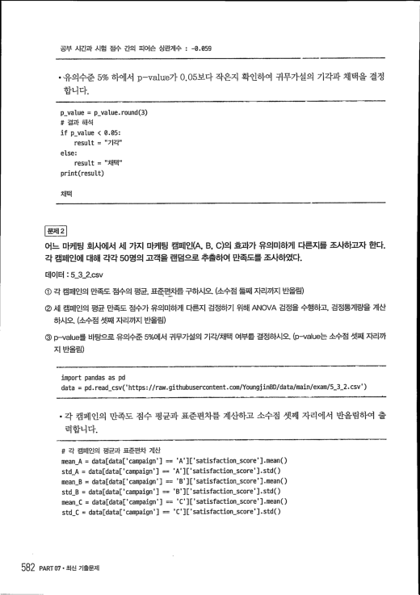
공부 시간과 시험 점수 간의 피어슨 상관계수 : -0.059

- 유의수준 5% 하에서 p- value가 0.05보다 작은지 확인하여 귀무가설의 기각과 채택을 결정
합니다．

```python
p_value = p_value.round(3)
# 결과 해석 
if p_value < 0.05: 
result = " 기각" 
else: 
result == " 채택" 
print(resul.t)
```
채택 문제 2 어느 마케팅 회사에서 세 가지 마케팅 캠페인（A. B, C）의 효과가 유의미하게 다른지를 좌 하고자 한다． 각 캠페인에 대해 각각 50명의 고객을 랜덤으로 추출하여 만족도를 조사하였다． 데이터 : 5- 3- 2.csv ① 각 캠페인의 만족도 점수의 평균 , 표준편차를 구하시오． （소수점 둘째 자리까지 반올림） ② 세 캠페인의 평균 만족도 점수가 유의미하게 다른지 검정하기 위해 ANOVA 검정을 수행하고 , 검정통계량을 계산 하시5긱 （소수점 셋째 자리까지 반올림） ③p-value를 바탕으로 유의수준 5％에서 귀무가설의 기각／채택 여부를 결정하시오． (p-v테ue는 소수점 셋째 자리까 지 반올림）

```python
import pandas as pd
data = pd.read_csv('https://raw.githubusercontent.corI1/YOungiiflBD/data/maifl/eXaflh/5_3_2.CsV ')
```
- 각 캠페언의 만족도 점수 평균과 표준편차를 계산하고 소수점 셋째 자리에서 반올림하여 출
력합니다．

```python
# 각 캠페인의 평균과 표준펀차 계산
```
'A '] ['satisfaction_score '] .mean()

```python
mean_A = data[data['campaign'J == 
std_A = data[data[ 'campaign'] ==
```
A ' ] [ ' satisfaction_score ' J . std() 'B'] ['satisfaction_scor& ].mean()

```python
mean_B = data{data{ 'campaign '] == 
std_B = data{data[ 'canipaign '] -
```
'B' ][ 'satisfaction_score'] .std() 'C'] ['satisfaction_score'] .niean()

```python
mean_C = data[data['campaign 'J == 
std_C = data[data[ 'campaign'J ==
```
' C'] ['satisfaction_score'] .std() 582 PART07＊최신기출문제

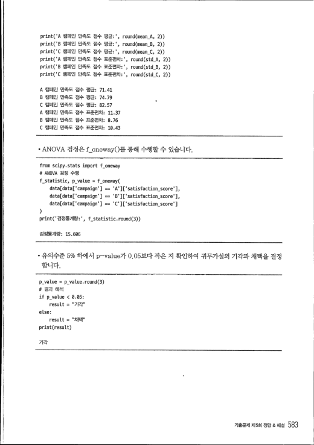
```python
print('A 캠페인 만족도 점수 펑균： ' , rourid(mean_A, 2)) 
print('B 캠페인 만족도 점수 평균： ', round(mean_B, 2)) 
print('(= 캠페인 만족도 점수 평균＝ ' , round(mean_C, 2)) 
print('A 캠페인 만족도 점수 표준편차： ', round(std_A, 2)) 
print('B 캠페인 만족도 점수 표준편차： ', round(std_B, 2)) 
print('C 캠페인 만족도 점수 표준펀차： ', round(std_C, 2))
```
A 캠페인 만족도 점수 펑균： 71.41 B 캠페인 만족도 점수 펑균： 74.79 C 캠페인 만족도 점수 평균： 82.57 A 캠페인 만족도 점수 표준편차： 11.37 B 캠페인 만족도 점수 표준편차： 8.76 (= 캠페인 만족도 점수 표준편차＝ 10.43

- ANOVA 검정은 f_oneway(）를 통해 수행할 수 있습니다．
```python
from scipy.stats import f_oneway 
# ANOVA 검정 수행 
f_statistic, 4 p_value = f_oneway( 
data[data{ 'campaign'] == 'A'] [ 'satisfaction-scor& ], 
data[data[ 'campaign'] == 'B'] t 'satisfaction_score'J, 
data[data[ 'campaign '3 == 'C'J[ 'satisfaction_score ']
print(' 검정통계량： ' , f_statistic. round(3))
```
검정통계량： 15.606

- 유의수준 5% 하에서 p-value가 0.05보다 작은 지 확인하여 귀무가설의 기각과 채택을 결정
합니다．

```python
p_value = p_value.round(3)
# 결과 해석 
if p_value < 0.05: 
result = " 기각" 
else: 
result = " 채택" 
print(result)
```
기각 기출문제제5회정답＆해설 583

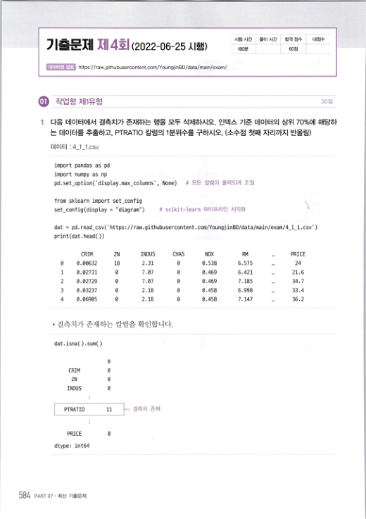
시험 시간 풀이 시간 합격 점수 내점수

## 기출문제 제4회 (2022-06-25 시햄）
180분 60점 https://raw.githubusercontent.com/voungjinoD/data/main/exam/ .

직 04형제1유형 30점 1 다음 데이터에서 결측치가 존재하는 행을 모두 삭제하시오 . 인덱스 기준 데이터의 상위 70％에 해당하 는 데이터를 추출하고 , PTRATI0 칼럼의 1분위수를 구하시오 . （소수점 첫째 자리까지 반올림） 데이터 : 4 1 1.csv

```python
import pandas as pd 
import numpy as np
pd.set_option(' display.max_columns', None) 
# 모든 칼럼이 출력되게 조절
from sklearn import set_config
set_config(dispthy = "diagram") 
# scikit-learn 파이프라인 시각화
dat = pd.read_csv( 'https://raw.githubusercontent.com/YoungjinBD/data/main/exam/4_1_1.csv') 
print(dat.head())
```
CRIM ZN INDUS CHAS NOX RM PRICE 0 0.00632 18 2.31 0 0.538 6.575 24 1 0.02731 0 7.07 0 0.469 6.421 21.6 2 0.02729 0 7.07 0 0.469 7.185 34.7 3 0.0323] 0 2.18 0 0.458 6.998 33.4 4 0.06905 0 2.18 0 0.458 7.147 36.2

- 결측치가 존재하는 칼럼을 확인합니다．
dat.isna() .sum() e CRIM 0 과』 0 INDUS 0 결측치 존재 PTRATI0 11 PRICE 0 dtype: int64 584 PART07 . 최신 기출문제

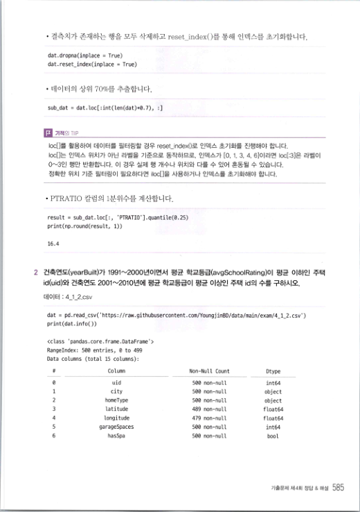
- 결측치가 존재하는 행을 모두 삭제하고 reset jndex(）를 통해 인덱스를 초기화합니다．
dat.dropna(inplace = True) dat.reset_index(inplace = True)

- 데이터의 상위 70％를 추출합니다．
```python
sub_dat = datJoc[:int(len(dat)*0.7), :]
```
【졉 기적의 ㅐp Ioc[］를 활용하여 데이터를 필터링할 경우 reset_index(）로 인덱스 초기화를 진행해야 합니다． Ioc[］는 인덱스 위치가 아닌 라벨을 기준으로 동작하므로 , 인덱스가 [0. 1. 3. 4, 6］이라면 Ioc[:3］은 라벨이 o'-'-,3인 행만 반환합니다 . 이 경우 실제 행 개수나 위치와 다를 수 있어 혼동될 수 있습니다． 정확한 위치 기준 필터링이 필요하다면 "oc[］을 사용하거나 인덱스를 초기화해야 합니다．

- PTRATI0 칼럼의 1분위수를 계산합니다．
```python
result = sub_datJoc[:, 'PTRATIO'] .quantile(0.25) 
print(np.round(result, 1))
```
16.4 2 건축연도（yearBuilt）가 1991 '-' '2000년이면서 평균 학교등급（avgSchoolRating）이 평균 이하인 주택 id(uid）와 건축연도 2001'- '2010년에 평균 학교등급이 평균 이상인 주택 id의 수를 구하시오． 데이터 : 4- 1- 2,csv

```python
dat = pd.read_csv( 'https://raw.githubusercontent.com/YoungjinBD/data/main/exam/412.csv' ) 
print(dat.infoO)
```
<class ' pandas.core. frame.DataFrame "> Rangelndex: 500 entries, 0 to 499 Data columns (total 15 columns):

# 
Column Non-Null Count Dtype 0 uid 500 non-null int64 1 city 500 non-null object 2 homeType 500 non-null object 3 latitude 489 non-null f1oat64 4 longitude 479 non-null f1oat64 5 garageSpaces 500 non-null int64 6 hasSpa 500 non-null bool 기출문제 제4회 정답 & 해설 585

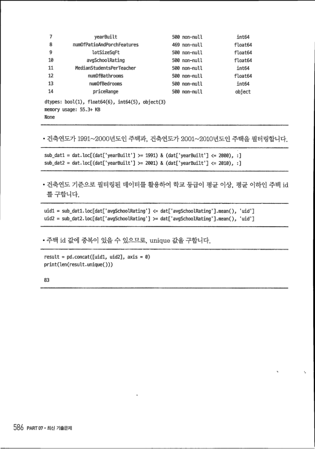
7 yearBuilt 500 non-null 1nt64 8 numOfPatioAndPorchFeatures 469 non-null f1oat64 9 lotSizesqFt 500 non-null f1oat64 10 avgSchoolRating 500 non-null f1oat64 11 MedianStudentsperleacher 500 non-null 1nt64 12 nuniOfBathrooms 500 non-null f1oat64 13 numOfBedrooms 500 non-null 1nt64 14 priceRange 500 non-null object dtypes: bool(l), f10at64(6), 1nt64(5), obj ect(3) memory usage: 55.3+ KB None

- 건축연도가 1991' '2000년도인 주택과 , 건축연도가 2001 '2010년도인 주택을 필터링합니다．
```python
sub-datl = dat.loc[(dat[ 'yearBuilt'] >= 1991) & (dat[ 'yearBuilt '] <= 2000), :] 
sub_dat2 = dat.loc[(dat[ 'year8ui1t'] >= 2001) & . (dat['yearBuilt'] <= 2010), :]
```
- 건축연도 기준으로 필터링된 데이터를 활용하여 학교 등급이 평균 이상 , 평균 이하인 주택 id 
를 구합니다．

```python
uidl = sub- dat1.loc{dat[ 'avgSchoolRating'] <= dat[ 'avgSchoolRating ' I .nieanQ, 'uid'] 
u1d2 = sub_dat2.loc[dat[ 'avgSchoolRating' J >= dat[ 'avgSchooiRating'] .nieanQ, 'uid']
```
- 주택 id 값에 중복이 있을 수 있으므로 , unique 값을 구합니다．
```python
result = pd.concat([uidl, uid2l, axis = 0) 
print(len(result. uniqueQ))
```
83 586 PART07．최신기출문제

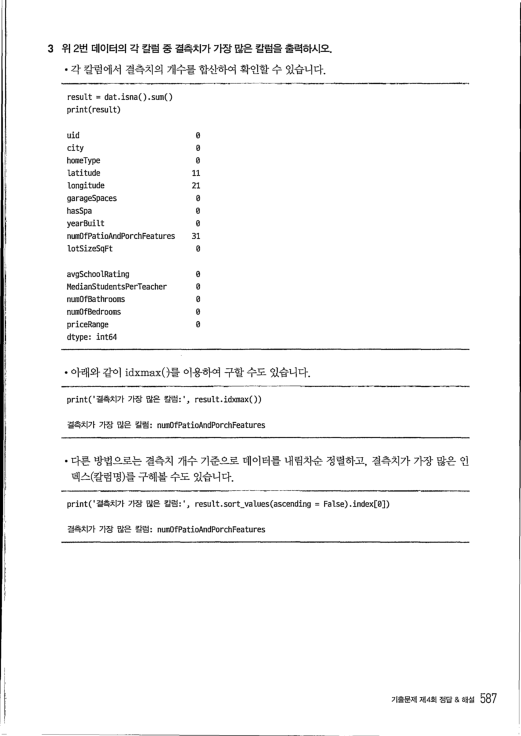
3 위 2번 데이터의 각 칼럼 중 결측치가 가장 많은 칼럼을 출력하시오．

- 각 칼럼에서 결측치의 개수를 합산하여 확인할 수 있습니다．
```python
result = dat.isnaQ.suni() 
print(result)
```
uid 0 city 0 homelype 0 latitude 11 longitude 21 garageSpaces 0 hasSpa 0 yea rBuilt 0 numOfPatioAndPorchFeatures 31 lotSizeSqFt 0 avgSchoolRating 0 MedianStudentsPerTeacher 0 numOfBa챠iroonis 0 numOf Bedrooms 0 priceRange 0 dtype: int64

- 아래와 같이 idxrnax()를 이용하여 구할 수도 있습니다．
```python
print(' 결측치가 가장 많은 칼럼＝ ' , result.idxmaxQ)
```
결측치가 가장 많은 칼럼： numOfPatioAndPorchFeatures

- 다른 방법으로는 결측치 개수 기준으로 데이터를 내림차순 정렬하고 , 결측치가 가장 많은 인
덱스（칼럼명）를 구해볼 수도 있습니다．

```python
print(' 결측치가 가장 많은 칼럼＝ ' , result.sort_values(ascending = False).index[0])
```
결측치가 가장 많은 칼럼： numofPatioAndPorchFeatures 기출문제제4회정답＆해설 587

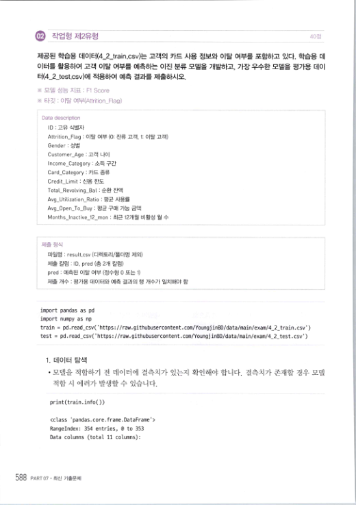
.

작업형제2유형 40점 제공된 학습용 데이터（4_2_train.csv）는 고객의 카드 사용 정보와 이탈 여부를 포함하고 있다 . 학습용 데 이터를 활용하여 고객 이탈 여부를 예측하는 이진 분류 모델을 개발하고 , 가장 우수한 모델을 평가용 데이 터（4_2jest.csv）에 적용하여 예측 결과를 제출하시오． ※ 모델 성능 지표 : Fl Score ※ 타깃 : 이탈 여부（Attrition_Flag) Data description 口 : 고유 식별자 Attrition_Flag ; 이탈 여부 (0: 잔류 고객 , 1: 이탈 고객） Gender : 성별 Customer_Age : 고객 나이 ncome_Category : 소득 구간 card_category : 카드 종류 Credit_Limit : 신용 한도 TotalJ굿evoLving_Bal : 순환 진빽 Avg_UtilizationJ굿atio : 평균 사용률 Avg_Open_To_Buy : 평균 구매 가능 금액 Months_lnactive_12_mon : 최근 12개월 비활성 월 수 제출 형식 파일명 : result.csv （디렉토리／폴더명 제외） 제출 칼럼 : ID, pred （총 2개 칼럼） pred : 예측된 이탈 여부 （정수형 0 또는 1) 제출 개수 : 평가용 데이터와 예측 결과의 행 개수가 일치해야 함

```python
import pandas as pd 
import numpy as np 
train = pd.read_csv( 'https://raw.githubusercontent.com/YoungjinBD/data/main/exam/4_2_train.csv' ) 
test = pd. read_csv( 'https://raw.githubusercontent.com/YoungjinBD/data/main/exam/4_2_test.csv')
```
1 . 데이터 탐색

- 모델을 적합하기 전 데이터에 결측치가 있는지 확인해야 합니다 . 결측지가 존재할 경우 모델
적합 시 에러가 발생할 수 있습니다．

```python
print(train.infoQ)
```
<class 'pandas.core. frame.DataFrame' > Rangelndex: 354 entries, B to 353 Data columns (total 11 columns):

588 PART 07 . 최신 기출문제

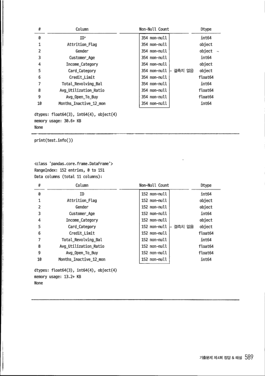
Col.umn Non-Null. Count Dtype 0 ID.

354 non-null int64 1 Attrition_Flag 354 non-null object 2 Gender 354 non-null object 3 Customer_Age 354 non-null 1nt64 4 Income_Category 354 non-null object 5 Card_Category 354 non-null. - 결측치 없음 object 6 Credit Limit 354 non-null f1oat64 7 Total-Revolving..Bal 354 non-null int64 8 Avg_Utilization_Ratio 354 non-null f1oat64 9 Avg_Open_To_Buy 354 non-null f1oat64 10 Months Inactive 12 mon 354 non-null int64 dtypes: f10at64(3), int64(4), object(4) memory usage: 30.6+ KB None

```python
print(test .infoQ)
```
<class ' pandas. core. frame. DataFrame 5 RangeIndex』: 152 entries, 0 to 151 Data columns (total 11 columns):

Non-Null Count

```python
# 
Column
```
Dtype 0 ID 1 Attrition_Flag int64 object object int64 object 152 non-null 2 Gender 152 non-null 3 Customer_Age 4 Income_Category 152 non-null 5 Card_Category 152 non-null

- 결측치 없음 
object 152 non-null 6 Credit Limit f1oat64 int64 f1oat64 f1oat64 int64 7 Total-Revolving_Bal 152 non-null 8 Avg_Utilization_Ratio 152 non-null 152 non-null 9 Avg_Open_To_Buy 10 Months Inactive 12 mon 152 non-null dtypes: f10at64(3), int64(4), object(4) memory usage: 13.2+ KB None 기출문제제4회정답＆해설 589

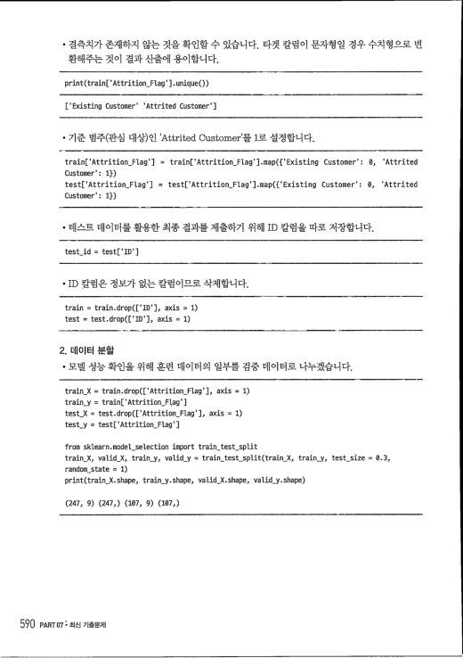
- 결측치가 존재하지 않는 것을 확인할 수 있습니다 . 타겟 칼럼이 문자형일 경우 수치형으로 변
환해주는 것이 결과 산출에 용이합니다．

```python
print(train{ 'Attrition_Flag'] . uniqueO)
```
['Existing Customer' 'Attrited Customer']

- 기준 범주（관심 대상）인 ' Attrited Customer'를 1로 설정합니다．
train['Attrition_Flag'] = train['Attrition_Fl.ag'] .map({'Existing Customer' : 0, 'Attrited Customer': 1}) test['Attrition_Fl.ag'] = test['Attrition_FLag'] .map({'Existing Customer' : 0, 'Attrited Customer': 1})

- 테스트 데이터를 활용한 최종 결과를 제출하기 위해 ID 칼럼을 따로 저장합니다．
```python
test_id = test['ID']
```
. II) 칼럼은 정보가 없는 칼럼이므로 삭제합니다．

```python
train = train.drop(['ID'], axis = 1) 
test = test.drop(['ID'], axis = 1)
```
2 , 데이터 분할

- 모델 성능 확인을 위해 훈런 데이터의 일부를 검증 데이터로 나누겠습니다．
```python
train_X = train.drop(['Attrition_FI.ag'], axis = 1) 
train_y = train['Attrition_FLag'] 
test_X = test.drop(['Attrition_Flag'], axis = 1) 
test_y = test['Attrition_Flag']
from skLearn.model_selection import train_test_split 
train_X, valid_X, train_y, valid_y = train_test_split(train_X, train_y, test_size = 0.3,
random_state = 1) 
print(train_X.shape, train_y.shape, valid_X.shape, vaLid_y.shape)
```
(247, 9) (247,) (107, 9) (107,) 590 PART07길최신기출문제

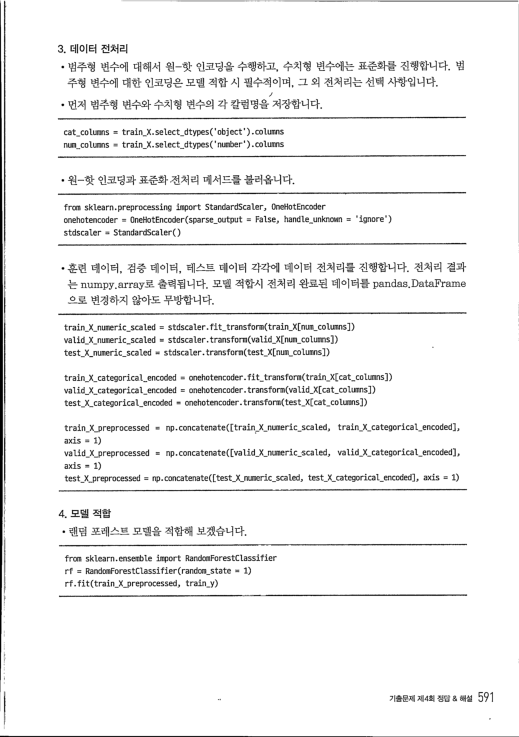
3 . 데이터 전처리

- 범주형 변수에 대해서 원－핫 인코딩을 수행하고 , 수치형 변수에는 표준화를 진행합니다 . 범
주형 변수에 대한 인코딩은 모델 적합 시 필수적이며 , 그 외 전처리는 선택 사항입니다．

- 먼저 범추형 변수와 수치형 변수의 각 칼럼명을 저장합니다．
```python
cat_columns = train_X.select_dtypes('object ') .columns
num_columns = train_X.select_dtypes('number ').columns
```
- 원－핫 인코딩과 표준화전처리 메서드를 불러옵니다．
```python
from sklearn.preprocessing import StandardScaler, OnellotEncoder
onehotencoder = OneHotEncoder(sparse_output = False, handle_unknown = ' ignore ') 
stdscaler = StandardScaler()
```
- 훈련 데이터 , 검증 데이터 , 테스트 데이터 각각에 데이터 전처리를 진행합니다 . 전처리 결과
는 numpy. array로 출력됩니다 . 모델 적합시 전처리 완료된 데이터를 pandas. DataFrarne 으로 변경하지 않아도 무방합니다．

```python
train_X_numeric_scaled = stdscaler.fit_transform(train_X[num_columns]) 
valid_X_numeric_scaled = stdscaler. transform(valid_X[num_columns]) 
test_X_numeric_scaled = stdscaler. transform(test_X[num_columns])
train_X_categorical_encoded = onehotencoder. fit_transform(train_X[cat_columns]) 
valid_X_categorical_encoded = onehotencoder. transform(valid_X[cat_columns]) 
test_X_categorical_encoded = onehotencoder. transform(test_X[cat_columns])
train_X_preprocessed = np. concatenate({train_X_numeric_scaled, train_X_categorical_encoded],
axis = 1) 
valid_X_preprocessed = np. concatenate([valid_X_numeric」scaled, valid_X_categorical_encoded],
axis == 1) 
test_X_preprocessed = np. concatenate([test_X_numeric_scaled, test_X_categorical_encoded], axis = 1)
```
4 , 모델 적합

- 랜덤 포레스트 모델을 적합해 보겠습니다．
```python
from sklearn . ensemble import RandomForestClassifier 
rf = RandomForestClassifier(random_state = 1) 
rf . fit (train_X_preprocessed, train_y)
```
기출문제제4회정답＆해설 591

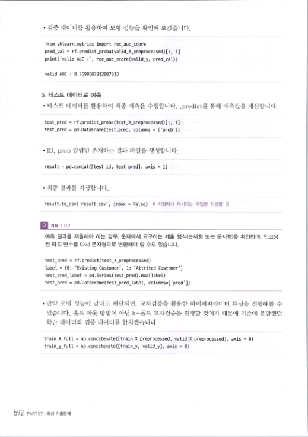
- 검증 데이터를 활용하여 모형 성능을 확인해 보겠습니다．
```python
from sklearn.metrics import roc_auc_score 
pred_val = rf.predict_proba(valid_X_preprocessed)[:, 1] 
print('vaUd AUC : ', roc_auc_score(valid_y, pred_val))
```
valid AUC : 0.7599587912087913 5 . 테스트 데이터로 예측

- 테스트 데이터를 활용하여 최종 예측을 수행합니다 . . predict를 통해 예측값을 계산합니다．
```python
test_pred = rf. predict_proba(test_X_preprocessed) [:, 1] 
testpred = pd.DataFrame(test_pred, columns = ['prob '] )
```
- ID, prol) 칼럼만 존재하는 결과 파일을 생성합니다．
```python
result = pd.concat([test_id, test_pred], axis = 1)
```
- 최종 결과를 저장합니다．
resu1t.to_csv( 'resu1t.csv' , index = Fa1se) # 시험에서 제시되는 파일명 작성할 것 ．헴 기적의 ㄲp 예측 결과를 제출해야 하는 경우 , 문제에서 요구하는 제출 형식（숫차형 또는 문자형）을 확인하여 , 인코딩 된 타깃 변수를 다시 문자형으로 변환해야 할 수도 있습니다．

```python
test_pred = rf . predict(test_X_preprocessed) 
label = {0: 'Existing Customer', 1: 'Attrited Customer'} 
test_pred_label = pd.Series(test_pred) .map(label) 
test_pred = pd.DataFrame(test_pred_label, columns=['pred'] )
```
- 만약 모델 성능이 낮다고 판단되면 , 교차검증을 활용한 하이퍼파라미터 튜닝을 진행해볼 수 
있습니다 . 홀드 아웃 방법이 아닌 k－폴드 교차검증을 진행할 것이기 때문에 기존에 분할했던 학습 데이터와 검증 데이터를 합치겠습니다．

```python
train_X_ful.l = np.concatenate([train_X_preprocessed, valid_X_preprocessed], axis = 0) 
train_y_full = np.concatenate([train_y, valid_y], axis = 0)
```
592 PARTD7 . 최신 기출문제

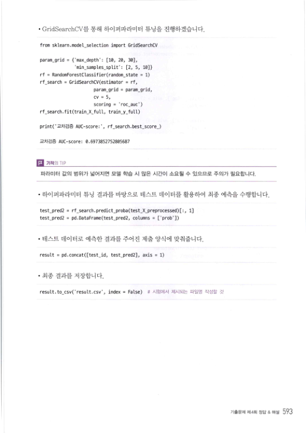
- GridSearchCV를 통해 하이퍼파라미터 튜닝을 진행하겠습니다．
```python
from sklearn.model_selection import GridSearchCV
param_grid = {'max_depth' : [10, 20, 30],
' mmn_
nsamples_split' : [2, 5, 10]} 
rf = RandomForestClassifier(random_state = 1) 
rf_search = GridSearchCV(estimator = rf,
param_grid = param_grid,
cv = 5, 
scoring = 'roc_auc' ) 
rf_search.fit (train_X_full, train_y_full)
print('교차검증 AUC-score: ' , rf_search.best_score_)
```
교차검증 AUC-score: 0.697385275280568]

## r헴 기적의 지P
파라미터 값의 범위가 넓어지면 모델 학습 시 많은 시간이 소요될 수 있으므로 주의가 필요합니다．

- 하이퍼파라미터 튜닝 결과를 바탕으로 테스트 데이터를 활용하여 최종 예측을 수행합니다．
```python
test_pred2 = rf_search . predict_proba(test_X_preprocessed) [:, 1] 
test_pred2 = pd.DataFrame(test_pred2, columns = ['prob'] )
```
- 테스트 데이터로 예측한 결과를 주어진 제출 양식에 맞춰줍니다．
```python
result = pd.concat([test_id, test_pred2], axis = 1)
```
- 최종 결과를 저장합니다．
```python
result.to_csv( 'result.csv' , index = False) 
# 시험에서 제시되는 파일명 작성할 것
```
기출문제 제4회 정답 & 해설 593

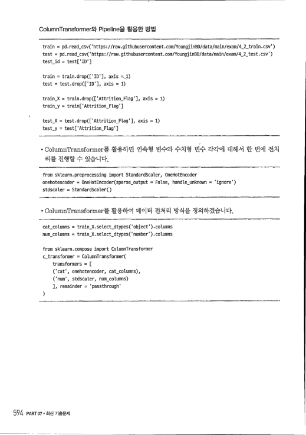
ColumnTransformer와 「ipeIine을 활용한 ．방법

```python
train = pd.read_csv( 'https://raw.githubusercontent.com/YoungjinBD/data/main/exam/4_2_train.csv') 
test = pd.read_csv( 'https://raw.githubusercontent.com/YoungjinBD/data/main/exam/4_2_test.csv') 
test_id = test[ ' 工D']
train = train.drop([ 'ID '1, axis =,1) 
test = test.drop([ 'ID '], axis = 1)
train_X = train.drop(['Attrition_Flag '], axis = 1) 
train_y = train['Attrition_Flag' I
test_X = test.drop([ 'Attrition_Flag '], axis = 1) 
test_y = test[ 'Attrition_Flag ']
```
- ColumnTransformer를 활용하면 연속형 변수와 수치형 변수 각각에 대해서 한 번에 전처
리를 진행할 수 있습니다．

```python
from skLearn.preprocessing import StandardScaler, OneHotEncoder
onehotencoder = OneHotEncoder(sparse_output = False, handle_unknown = ' ignore') 
stdscaler = StandardScaler()
```
- ColumnTransformer를 활용하여 데이터 전처리 방식을 정의하겠습니다．
```python
cat_columns = train_X.select_dtypes('object ').columns
num_columns = train_X.select_dtypes( 'number ').columns
from sklearn.compose import ColumnTransforrner
c_transformer = ColumnTransformer( 
transformers = [ 
( ' cat', onehotencoder, cat_columns), 
('num', stdscaler, nurn_columns) 
], remainder = 'passthrough 
)
```
594 PART07. 최신 기출문제

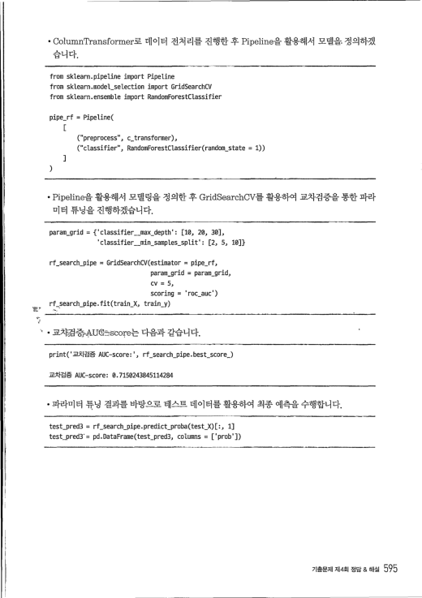
- ColumnTransformer로 데이터 전처리를 진행한 후 Pipeli끄e을 활용해서 모델을 정의하겠
습니다．

```python
from sklearn.pipeline import Pipeline 
from sklearn.model_selection import GridSearchCV 
from sklearn.ensemble import RandomForestClassifier
```
pipe_rf = Pipeline( [ ("preprocess', c_transformer), ( 'classifier", RandomForestClassifier(random_state = 1)) ]

- Pipeline을 활용해서 모델링을 정의한 후 GridSearchOV를 활용하여 교차검증을 통한 파라
미터 튜닝을 진행하겠습니다．

```python
param_grid = { 'classifier__max_depth': [10, 20, 30], 
'classifier__mmn_samples_split': [2, 5, 10]]-
rf_search_pipe = GridSearchCV(estimator = pipe_rf,
param_grid = param_grid, 
cv = 5, 
scoring = 'roc_auc') 
rf search oioe.fit (train X, train v) 
'緇뻐 
, 
"
```
．ㅍ， 교ㅊ陂l증戮AU（少－s℃ore는 다음과 같습니다．

```python
print(' 교F검증 ALJC-score:', rf_search_pipe.best_score_)
```
교차검증 ALJC-score: 0.7150243845114284

- 파라미터 튜닝 결과를 바탕으로 테스트 데이터를 활용하여 최종 예측을 수행합니다．
```python
test_pred3 = rf_search_pipe.predict_proba(test_X)[:, 11 
test. pred3 "= pd.DataFrame(test_pred3, columns = ['prob'] )
```
기출문제 제4회 정답 & 해설 595

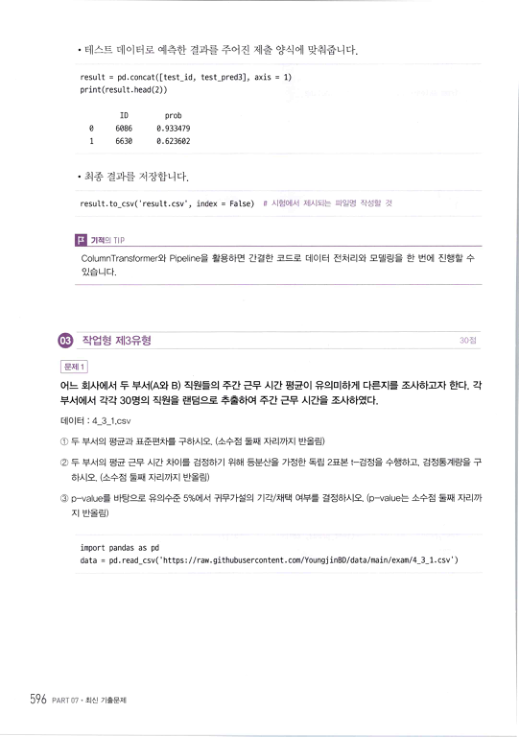
- 테스트 데이터로 예측한 결과를 주어진 제출 양식에 맞춰줍니다．
```python
resu't = pd.concat([test_id, test_pred3], axis = 1) 
print(result . head(2))
```
ID prob 0 6086 0.933479 1 6630 0.623602

- 최종 결과를 저장합니다．
result.to_csv(' result.csv ', index = Fa'se) # 시험에서 제시되는 파일명 작성할 것 기적의 TIP ColumnTransformer와 Pipeline을 활용하면 간결한 코드로 데이터 전처리와 모델링을 한 번에 진행할 수 있습니다． ㅇ 작업형 제3유형 문제 1 어느 회사에서 두 부서（A와 B) 직원들의 주간 근무 시간 펑균이 유의미하게 다른지를 조사하고자 한다 . 각 부서에서 각각 30명의 직원을 랜덤으로 추출하여 주간 근무 시간을 조사하였다． 데이터 : 4- 3- 1.csv ① 두 부서의 평균과 표준편차를 구하시오 . （소수점 둘째 자리까지 반올림） ② 두 부서의 평균 근무 시간 차이를 검정하기 위해 등분산을 가정한 독립 2표본 t－검정을 수행하고 , 검정통계량을 구 하시오 . （소수점 둘째 자리까지 반올림） ③p-value를 바탕으로 유의수준 5％에서 귀무가설의 기각／채택 여부를 결정하시오 . (p-value는 소수점 둘째 자리까 지 반올림）

```python
import pandas as pd 
data = pd.read_csv( https://raw.githubusercontent.com/YoungjinBD/data/main/exam/4_3_1.csv' )
```
596 PART 07 . 최신 기출문제

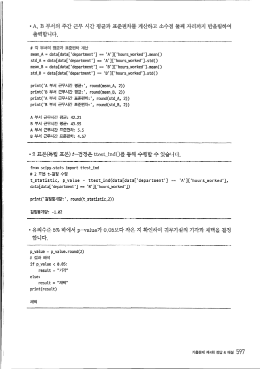
- A, B 부서의 주간 근무 시간 평균과 표준편차를 계산하고 소수점 둘째 자리까지 반올림하여
출력합니다．

```python
# 각 부서의 펑균과 표줬녠차 계산
mean_A = data[data[ 'department 'J == 
std_A = dataEdata{ 'department'J ==
```
'A' IL ' hours_worked '] .mean() 'A' IL ' hours_worked ' 〕 . std( )

```python
mean_B = data{dataE'department'] == 
std_B = data[data['departnient'] ==
```
' B' ][ ' hours_worked ' J .mean( ) 'B'] ['hours_worked'] .std()

```python
print(A 부서 근무시간 평균＝ ', round(mean_A, 2)) 
print('B 부서 근무시간 평균： ', round(niean_B, 2)) 
print('A 부서 근무시간 표준편차： ', round(std_A, 2)) 
print('B 부서 근무시간 표준편차： ', round(std_B, 2))
```
A 부서 근무시간 평균＝ 42.21 B 부서 근무시간 평균： 43.55 A 부서 근무시간 표췐차＝ 5.5 B 부서 근무시간 표준편차： 4.57

- 2 표본（톡립 표본） t－검정은 ttest_ind(）를 통해 수행할 수 있습니다．
```python
from scipy.stats import ttest_ind 
#2 표본 t－검정 수행 
t_statistic, 
p_value = ttest_ind(data[data[ 'department '] 
data[data[ 'departnient'] == 'B'I[ 'hours_worked'])
```
'A'J[ 'hours_worked'] ,

```python
print(' 검정통계량＝ ' ' round(t_statistic,2))
```
검정통계량： -1.02

- 유의수준 5% 하에서 p-value가 0.05보다 작은 지 확인하여 귀무가설의 기각과 채택을 결정
합니다．

```python
p_value = p_value.round(2)
# 결과 해석 
if p_value < 0.05: 
result = " 기각" 
else: 
result = · ' 채택" 
print(result)
```
채택 기출문제제4회정답＆해설 597

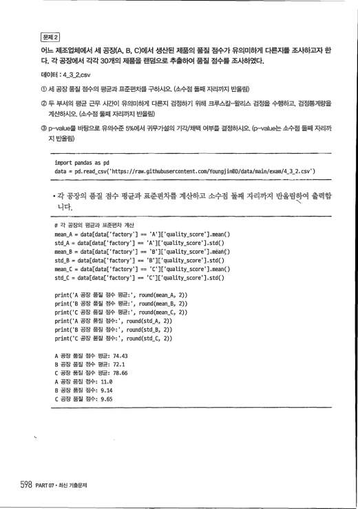
문제 2 어느 제조업체에서 세 공장（A, B, C）에서겯쑈＇된 제품의 품질 점수가 유의미하게 다른지를 조사하고자 한 다 . 각 공장에서 각각 30개의 제품을 랜덤으로 추출하여 품질 점수를 조사하였다． 데이터 : 4 3 2.csv ① 세 공장 품칠 점수의 평균과 표준편차를 구하시오． （소수점 둘째 자리까지 반올림） ② 두 부서의 평균 근무 시간이 유의미하게 다른지 검정하기 위해 크루스칼솰리스 검정을 수행하고 , 검정통계량을 계산하시오 . （소수점 둘째 자리까지 반올림） ③p-value를 바탕으로 유의수준 5％에서 귀무가설의 기각／채택 여부를 결정하시오 . (p-value는 소수점 둘째 자리까 지 반올림）

```python
import pandas as pd 
data = pd. read_csv('https://raw.githubusercontent. com/voungjinBo/data/main/exam/4_3_2,csv')
```
- 각 공장의 품질 점수 평균과 표준편차를 계산하고 소수점 둘째 자리까지 반올림하여 출력합 
`\ 니다．

```python
# 각 공장의 평균과 표준편차 계산
mean_A = data[data['factory'] == 
std_A = data[data['factory'] ==
```
' A'] ['quality_score'] .mean() 'A' J[ 'quality_score'] ,std()

```python
mean_B = data{data['factory'] == 
std_B = data[dataf 'factory'] ==
```
'B'] ['quaUty_score'] .mea () 'B' ][ 'quality_score'] .std()

```python
mean_C = data[data['factory'] == 
std_C = data[data['factory'] ==
```
'C' ][ 'quality_score'] .meanQ 'C' ][ 'quality_score'] .std()

```python
print('A 공장 품질 점수 평균： ', round(mean_A, 2)) 
print('B 공장 품질 점수 펑균： ', round(mean_B, 2)) 
print('C 공장 품질 점수 평균＝ ', round(mean_C, 2)) 
print('A 공장 품질 점수： ', round(std_A, 2)) 
print('B 공장 품질 점수： ', round(std_B, 2)) 
print(' (ㅍ 공장 품질 점수＝ ', round(std_C, 2))
```
A 공장 품질 점수 펑균： 74.43 B 공장 품질 점수 평균＝ 72.1 C 공장 품질 점수 평균： 78.66 A 공장 품질 점수＝ 11.0 B 공장 품질 점수： 9.14 C 공장 품질 점수： 9.65 598 PART07＊최신기출문제

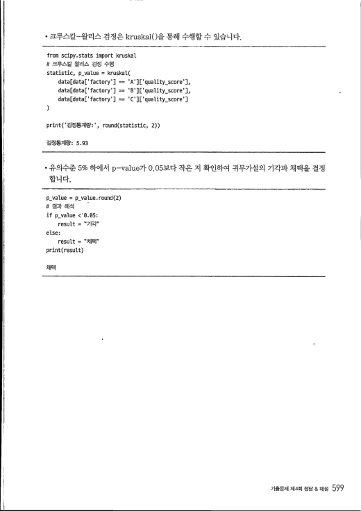
- 크루스칼－왈리스 검정은 kruskal(）을 통해 수행할 수 있습니다．
```python
from scipy.stats import kruskal 
# 크루스칼 왈리스 검정 수행 
statistic, p_value = kruskal.( 
data[data{'factory'] == 'A'] ['quaUty- score'] , 
data[data['factory'J == 'B'] [ 'quality_score'] , 
data[data['factory'] == 'C'] {'quality_score']
print(' 검정통계량： ' , round(statistic, 2))
```
검정통계량＝ 5.93

- 유의수준 5% 하에서 p-value가 0.05보다 작은 지 확인하여 귀무가설의 기각과 채택을 결정
합니다．

```python
p_value = p_value.round(2)
# 결과 해석 
if p_value < '0.05: 
result = " 기각" 
else: 
result ㄷ " 채택" 
print(result)
```
채택 기출문제제4회정답＆해설 599

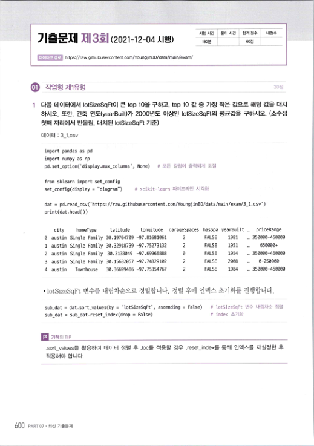
이 시간 합격 점수 내점수

## 기출문제 제3회 (2021-12-04시햄）
https://raw.githubusercontent.com/YoungjinBD/data/main/exam/ .

FOl -,형제1유형 30첨 다음 데이터에서 IotSizeSqFt《기 큰 top 10을 구하고 , top 10 값 중 가장 작은 값으로 해당 값을 대치 하시오 . 또한 , 건축 연도（yearBuilt）가 2000년도 이상인 IotSizeSqFt의 평균값을 구하시오 . （소수점 첫째 자리에서 반올림 , 대치된 IotSizeSqFt 기준） 데이터 : 3 Lcsv

```python
import pandas as pd
import numpy as np 
pd.set_option( 'display.max_columns' , None) 
# 모든 칼럼이 출력되게 조절
from sklearn import set_config
set_config(display = "diagram ") 
# scikit-learn 파이프라인 시각화
dat = pd.read_csv( 'https://raw.githubusercontent.com/YoungjinBD/data/main/exam/3_1.csv ') 
print(dat.head() )
```
city homeType latitude longitude garageSpaces hasSpa yearBuilt ...

priceRange 0 austin Single Family 30.19764709 -97.81681061 2 FALSE 1981 ... 350000-450000 1 austin Single Family 30.32918739 -97.75273132 2 FALSE 1951 ...

650000+ 2 austin Single Family 30.3133049 -97.69966888 0 FALSE 1954 ... 350000-450000 3 austin Single Family 30.15632057 -97.74829102 2 FALSE 2008 ,..

0-250000 4 austin Townhouse 30.36699486 -97.75354767 2 FALSE 1984 . . . 350000-450000

- lotSizeSqFt 변수를 내림차순으로 정렬합니다 . 정렬 후에 인덱스 초기화를 진행합니다．
```python
sub_dat = dat.sort_values(by = ' lotSizeSqFt ', ascending = False) 
# lotSizeSqFt 변수 내림차순 정렬
# inde× 초기화
sub_dat = sub_dat.reset_index(drop = False)
```
기적의 TIP .sort values를 활용하여 데이터 정렬 후 . b c를 적용할 경우 . reset_i nde×를 통해 인덱스를 재설정한 후 적용해야 합니다． 600 PART07 . 최신 기출문저

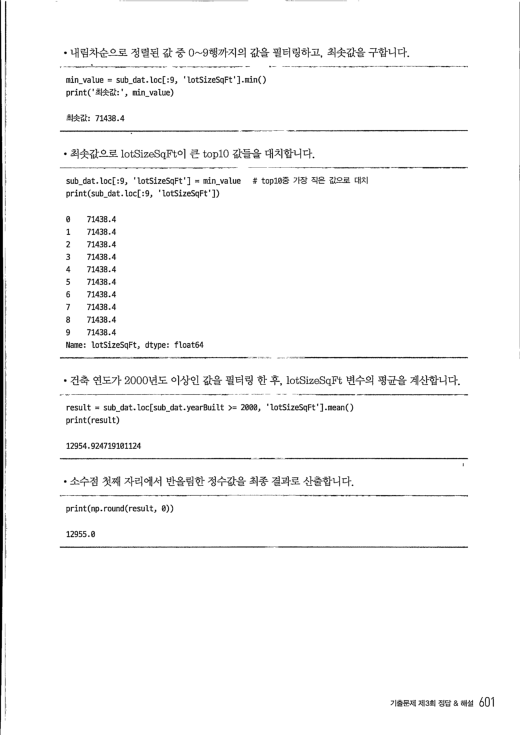
- 내림차순으로 정렬된 값 중 O∼9행까지의 값을 필터링하고 , 최솟값을 구합니다．
，→＇ 루

- →－ 
－∼ ∼－∼∼∼－ -.--V쌤∼一一∼－

```python
mmn_value = sub_dat.1.oc[:9, ' lotSizeSqFt ' J.min() 
print(' 최솟값： ' , min_val.ue)
```
최솟값： 71438.4

- 최솟값으로 lotSizeSqFt이 큰 toplO 값들을 대치합니다．
```python
sub_dat.loc[:9, 'lotSizeSqFt '] = mmn_value 
# toplO중 가장 작은 값으로 대치 
print(sub_dat. loc{ :9, 'l.otSizeSqFt'] )
```
0 71438.4 1 71438.4 2 71438.4 3 71438.4 4 71438.4 5 71438.4 6 71438.4 7 71438.4 8 71438.4 9 71438.4 Name: iotsizesat-t. atvoe: T10atb4

- 건축 연도가 2000년도 이상인 값을 필터링 한 후 , lotSizeSqFt 변수의 평균을 계산합니다．
```python
result = sub_dat샅.loc{sub_dat.yearBuilt >= 2000, ' lotSizeSqFt '1.mean() 
print(result)
```
12954.924719101124

- 소수점 첫째 자리에서 반올림한 정수값을 최종 결과로 산출합니다．
```python
print(np. round(result, 0))
```
12955.0 기출문제제3회정답＆해설 601

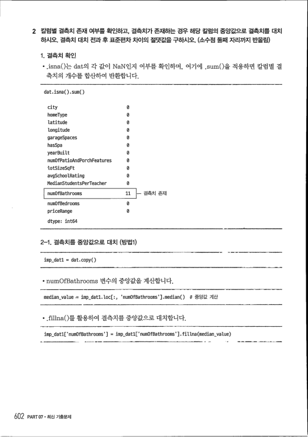
2 칼럼별 결측치 존재 여부를 확인하고 , 결측치가 존재하는 경우 해당 칼럼의 중앙값으로 결측치를 대치 하시오 , 결측치 대치 전과 후 표준편차 차이의 절댓값을 구하시오 . （소수점 둘째 자리까지 반올림） 1 . 결측치 확인

- .isna(）는 dat의 각 값이 NaN인지 여부를 확인하며 , 여기에 . sum(）을 적용하면 칼럼별 결
측치의 개수를 합산하여 반환합니다． dat.isnaQ.sum() city 0 honielype 0 1.atitude 0 1.ongitude 0 garageSpaces 0 hasSpa 0 yearBuilt 0 nuni0fPatioAndPorchFeatures 0 lotSizeSqFt 0 avgSchoo.Rating 0

# MedianStudentsPerleacher 
0 num0fBathrooms ii H결측치존재 nuniOfBedrooms 0 0 priceRange dtype: int64 2-1 . 결측치를 중앙값으로 대치 （방법1)

```python
imp_dati = dat.copy()
```
- numOfBathrooms 변수의 중앙값을 계산합니다．
median_value ,= imp_datl.1.oc[:, ' num0fBathrooms'J.median() # 중앙값 계산

- .fillna(）를 활용하여 결측치를 중앙값으로 대치합니다．
imp_datl[ 'num0fBathrooms '] = imp_dat1[ 'num0fBathrooms '] .fillna(median_value) 602 PART 07．최신기출문제

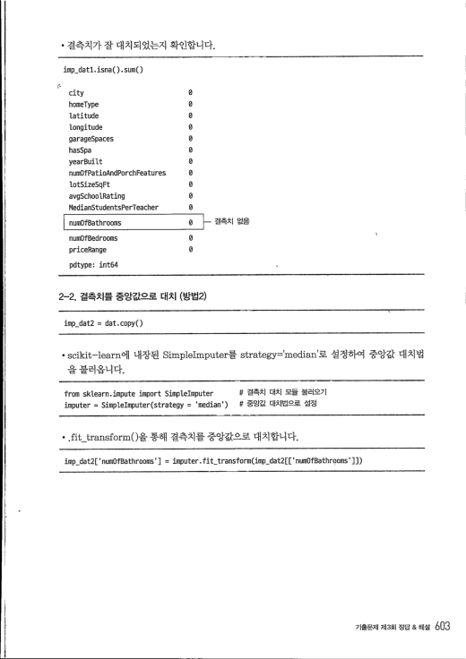
- 결측치가 잘 대치되 었는지 확인합니다．
inip_dati. isna() . sum() city 0 homeType 0 latitude 0 longitude 0 garageSpaces 0 hasSpa 0 yearBuilt 0 nuniofpatioAndPorchFeatures 0 lotSizeSqFt 0 avgSchoolRating 0

## MedianStudentsPerleacher 
0 numOfBathroonis 0 H결측치없음 numOf Bedrooms 0 priceRange 0 pdtype: int64 2-2 . 결측치를 중앙값으로 대치 （방법2)

```python
irnp_dat2 = dat.copy()
```
- scikit-learn에 내장된 Simplelmputer를 strategy='median'로 설정하여 중앙값 대치법
을 불러옵니다．

```python
from sklearn.impute import Simple工mputer 
# 결측치 대치 모듈 불러오기
imputer = Simplelmputer(strategy = ' median ') 
# 중앙값 대치법으로 설정
```
- .fit_transform(）을 통해 결측치를 중앙값으로 대치합니다．
imp_dat2[ 'numOfBathrooms '] = imputer.fit_transform(imp_dat2{[ 'numOfBathrooms '] ]) 기출문제제3회정답＆해설 603

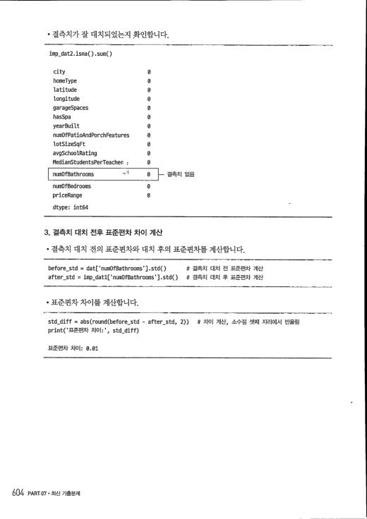
- 결측치가 잘 대치되었는지 확인합니다．
inip_dat2. isna() .sum() city 0 homeType 0 latitude 0 longitude 0 garageSpaces 0 hasSpa 0 yearBuilt 0 nurnOfPatioAndPorchFeatures 0 lotSizeSqFt 0

## avgSchoolRating 
0 MedianStudentsPerleacher 구 0 numOfBathroonis " " " 0 H결측치없음 nuniOfBedrooms 0 priceRange 0 dtype: int64 3 . 결측치 대치 전후 표준편차 차이 계산

- 결측치 대치 전의 표준편차와 대치 후의 표준편차를 계산합니다．
```python
before_std = datf 'numofBathroorns'] .std() 
# 결측치 대치 전 표준펀차 계산 
after_std = imp_datl[' numOfBathroonis' II. std() 
# 결측치 대치 후 표준편차 계산
```
- 표준편차 차이를 계산합니다．
```python
std_diff = abs(round(before- std - after_std, 2)). 
# 차이 계산， 소수점 셋째 자리0惻 반올림 
print(' 표준편차 차이： ' , std_diff)
```
표췐차 차이： 0.01 604 PART.07. 최신 기출문제

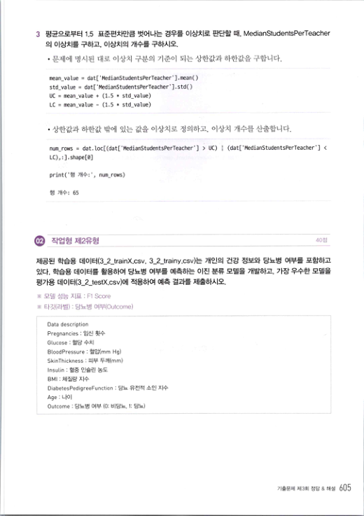
3 평균으로부터 1.5 표준편차만큼 벗어나는 경우를 이상치로 판단할 때 , MedianStudentsPerTeacher 의 이상치를 구하고 , 이상치의 개수를 구하시오．

- 문제에 명시된 대로 이상치 구분의 기준이 되는 상한값과 하한값을 구합니다．
mean- value = dat[ 'MedianStudentsPerTeacher' ].mean()

```python
std_value = datE ' MedianStudentsPerTeacher' I .std()
tic = mean_value + (1.5 * std_value)
LC = mean_value - (1.5 * std_value)
```
- 상한값과 하한값 밖에 있는 값을 이상치로 정의하고 , 이상치 개수를 산출합니다．
```python
num_rows = dat.loc[(dat[ MedianStudentsPerTeacher' ] > tiC) I (dat[ 'MedianStudentsPerleacher '] <
```
LC), :].shape[OI

```python
print('행 개수： ' , num_rows)
```
행 개수： 65 제공된 학습용 데이터（3_2_trainX.csv, 3_2_trainy.csv）는 개인의 건강 정보와 당뇨병 여부를 포함하고 있다 . 학습용 데이터를 활용하여 당뇨병 여부를 예측하는 이진 분류 모델을 개발하고 , 가장 우수한 모델을 평가용 데이터（3_2_testX.csv）에 적용하여 예측 결과를 제출하시오． ※ 모델 성능 지표 : Fl Score ※ 타깃（라벨） : 당뇨병 여부（Outcome) Data description Pregnancies : 임신 횟수 Glucose : 혈당 수치 BLoodPressure : 혈 J (mm Hg) SkinThickness : 피부 두께（mm) 山sul甬 '. 혈중 인슐린 농도 BMI : 쳬질량 지수 DiabetesPedigreeFunction : 당뇨 유전적 소인 지수 Age : 나이 Outcome : 당뇨병 여부 (0; 비당뇨 , 1: 당뇨） 기출문제 저3회 정답 & 해설 605

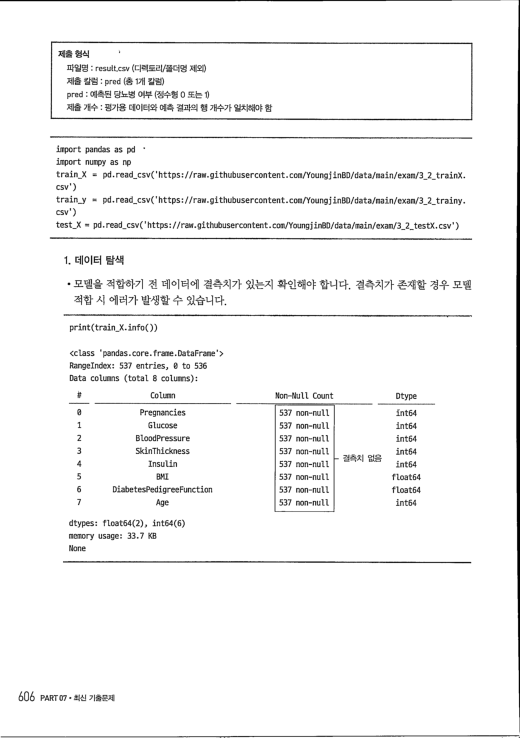
제출 형식 ' 파일명 : resutt.csv （디렉토리／폴더명 제외） 제출 칼럼 : pred （총 1개 칼럼） pred : 예측된 당뇨병 여부 （정수형 0 또는 1) 제출 개수 : 평가용 데이터와 예측 결과의 행 개수가 일치해야 함

```python
import pandas as pd ' 
import numpy as np 
train X
```
= pd.read_csv( 'https://raw.githubusercontent.com/youngjinBD/data/main/exam/3-2-trainx.

csv ' ) train_y = pd.read_csv('https://raw.githubusercontent.com/youngjinBD/clata/mainfexam/3-2-trainy.

csv ') test_X 볍 pd.read_csv('https://raw.githubusercontent.com/youngjinBD/data/main/exam/3_2_testx.csv ') 1 . 데이터 탐색

- 모델을 적합하기 전 데이터에 결측치가 있는지 확인해야 합니다 . 결측치가 존재할 경우 모델 
적합 시 에러가 발생할 수 있습니다．

```python
print(train_X.infoQ)
```
<class ' pandas. core. franie.DataFranie'> Rangelndex: 537 entries, 0 to 536 Data columns (total 8 columns):

```python
# 
Column
```
Non-Null Count Dtype 0 Pregnancies 1 Glucose 537 non-null 1nt64 int64 int64 int64 int64 f1oat64 537 non-null 2 B1.oodPressure 537 non-null 3 ，山1Thickness 4 Insulin 537 non-null

- 결측치 없음
537 non-null 5 BMI 537 non-null 6 DiabetesPedigreeFunction 537 non-null f1oat64 int64 7 Age 537 non-null dtypes: f10at64(2), int64(6) memory usage: 33.7 KB Mme 606 PART07．최신기출문제

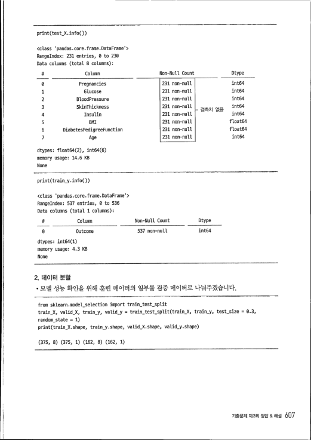
```python
print(test_X.infoQ)
```
<class ' pandas. core. frame. DataFrame'> Rangelndex: 231 entries, 0 to 230 Data columns (total 8 columns):

Non-Null. Count Dtype

```python
# 
Column
```
int64 int64 231 non-null 0 Pregnancies 231 n이ㅂiull.

1 Glucose 1nt64 int64 int64 f1oat64 231 non-null 2 BloodPressure 231 non-null 3 Skin자iickness

- 결측치 없음
231 non-null 4 Insulin 231 n이ㅂiull 5 바枉 f1oat64 int64 231 non-null 6 DiabetesPedigreeFunction 231 non-null 7 Age dtypes: f1oat64(2), int64(6) memory usage: 14.6 KB M)ne

```python
print(train_y.infoQ)
```
<class 'pandas.core.frame.DataFrame'> Range工ndex: 537 entries, 0 to 536 Data columns (total 1 columns):

# 
Column Non-Null Count Dtype 0 0utcome 537 non-null int64 dtypes: int64(1) memory usage: 4.3 KB None 2 , 데이터 분할

- 모델 성능 확인을 위해 훈린 데이터의 일부를 검증 데이터로 나눠주겠습니다．
```python
from sklearn.niodel_selectiori import train_test_split 
train_X, valid_X, train_y, valid_y = train_test_split(train_X, train_y, test_size = 0.3,
random_state = 1) 
print(train_X.shape, train_y.shape, valid_X.shape, valid_y.shape)
```
(375, 8) (375, 1) (162, 8) (162, 1) 기출문제제3회정답＆해설 607

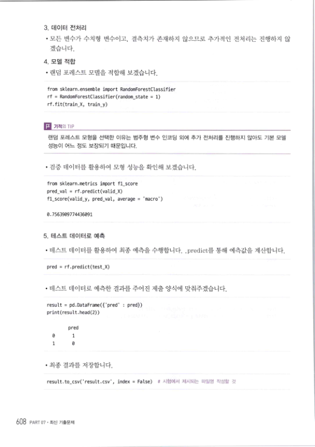
3 . 데이터 전처리

- 모든 변수가 수치형 변수이고 , 결측치가 존재하지 않으므로 추가적인 전처리는 진행하지 않
겠습니다． 4 . 모델 적합

- 랜덤 포레스트 모델을 적합해 보겠습니다．
```python
from sklearn.ensemble import RandomForestClassifier 
rf = RandomForestClassifier(random_state = 1) 
rf. fit (train_X, train_y)
```
### ㅁ 기적의 뀌P
랜덤 포레스트 모형을 선택한 이유는 범주형 변수 인코딩 외에 추가 전처리를 진행하지 않아도 기본 모델 성능이 어느 정도 보장되기 때문입니다．

- 검증 데이터를 활용하여 모형 성능을 확인해 보겠습니다．
```python
from sklearn.metrics import fl_score 
pred_val. = rf.predict(valid_X) 
fl_score(valid_y, pred_val, average = ' macro')
```
0.7563909774436091 5 . 테스트 데이터로 예측

- 테스트 데이터를 활용하여 최종 예측을 수행합니다 . . predict를 통해 예측값을 계산합니다．
```python
pred = rf.predict(test_X)
```
- 테스트 데이터로 예측한 결과를 주어진 제출 양식에 맞춰주겠습니다．
```python
result = pd.DataFrame({ 'pred' : pred}) 
print(result .head(2))
```
pred 0 1 1 0

- 최종 결과를 저장합니다．
```python
result.to_csv(' result.csv' , index = fa1se) 
# 시험에서 제시되는 파일명 작성할 것
```
608 PART 07 . 최신 기출문제

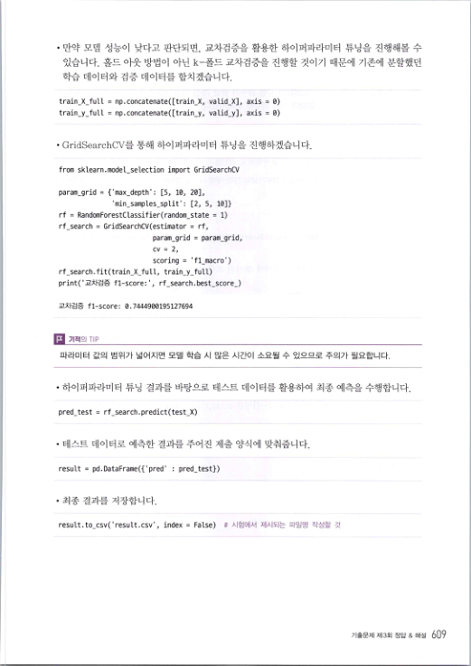
- 만약 모델 성능이 낮다고 판단되면 , 교차검증을 활용한 하이퍼파라미터 튜닝을 진행해볼 수
있습니다 . 홀드 아웃 방법이 아닌 「폴드 교차검증을 진행할 것이기 때문에 기존에 분할했던 학습 데이터와 검증 데이터를 합치겠습니다． train_X_fufl. = np.concatenate([train_X, valid_X], axis = 0) train_y_full. = np.concatenate([train_y, valid_y], axis = 0)

- GridSearchCV를 통해 하이퍼파라미터 튜닝을 진행하겠습니다．
```python
from sklearn.model._selection import GridSearchCV
param_grid = {'max_depth' : [5, 10, 20],
' mmn_
nsamples_split' : [2, 5, 10]} 
rf = RandomForestClassifier(random_state = 1) 
rf_search = GridSearchCV(estimator = rf,
param_grid = param_grid,
cv = 2, 
scoring = 'fl_macro') 
rf_search.fit (train-X_full, train_yjul.l) 
print('교 검증 fl- score: ', rf_searth.best_score_)
```
교차검증 fl- score: 0.7444900195127694 .

기적의 TIP 파라미터 값의 범위가 넓어지면 모델 학습 시 많은 시간이 소요될 수 있으므로 주의가 필요합니다．

- 하이퍼파라미터 튜닝 결과를 바탕으로 테스트 데이터를 활용하여 최종 예측을 수행합니다．
```python
pred_test = rf_search.predict(test_X)
```
- 테스트 데이터로 예측한 결과를 주어진 제출 양식에 맞춰줍니다．
```python
result = pd.DataFrame({'pred' : pred_test})
```
- 최종 결과를 저장합니다．
```python
result.to_csv( 'result.csv', index = False) 
# 시험에서 제시되는 파일명 작성할 것
```
기출문제 제3회 정답 & 해설 609

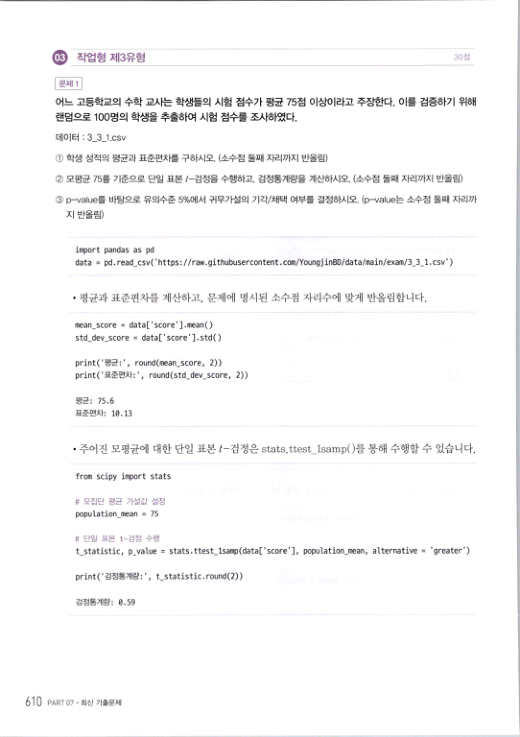
ㅇ 작업형제3유형 문제 1 어느 고등학교의 수학 교사는 학생들의 시험 점수가 평균 75점 이상이라고 주장한다 . 이를 검증하기 위해 랜덤으로 100명의 학생을 추출하여 시험 점수를 조사하였다． 데이터 : 3- 3- 1.csv ① 학생 성적의 평균과 표준편차를 구하시오 . （소수점 둘째 자리까지 반올림） ② 모평균 75를 기준으로 단일 표본 /－검정을 수행하고 , 검정통계량을 계산하시오 . （소수점 둘째 자리까지 반올림） ③p-value를 바탕으로 유의수준 5％에서 귀무가설의 기각／채택 여부를 결정하시오 . (p-value는 소수점 둘째 자리까 지 반올림）

```python
import pandas as pd 
data = pd. read_csv( 'https://raw.githubusercontent.com/YoungjinBD/data/main/exam/3_3_1.csv')
```
- 평균과 표준편차를 계산하고 , 문제에 명시된 소수점 자리수에 맞게 반올림합니다．
```python
mean_score = data[ 'score '] .mean() 
std_dev_score = data[ 'score '] .std()
print(' 평균: ' , round(mean_score, 2)) 
print(' 표준편차： ' , round(std_dev_score, 2))
```
평균： 75.6 표준편차： 10.13

- 주어진 모평균에 대한 단일 표본 t－검정은 stats. ttestlsamp(）를 통해 수행할 수 있습니다．
```python
from scipy import stats
# 모집단 평균 가설값 설정 
population_mean = 75
# 단일 표본 t－검정 수행 
t_statistic, p_value = stats.ttest_lsamp(data[ 'score '] , population_mean, alternative = ' greater')
print(' 검정통계량： ' , t_statistic. round(2))
```
검정통계량＝ 0.59 시0 PART 07 . 최신 기출문제

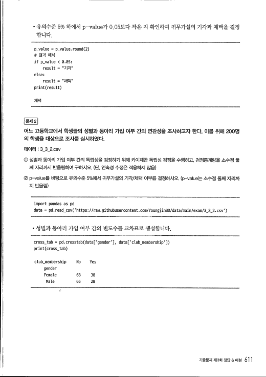
- 유의수준 5% 하에서 p-value가 0.05보다 작은 지 확인하여 귀무가설의 기각과 채택을 ，결정
합니다．

```python
p_value = p_value.round(2) 
# 결과 해석 
if p_value < 0.05: 
result = " 기각" 
else: 
result == " 채택" 
print(result)
```
채택 문제 2 어느 고등학교에서 학생들의 성별과 동아리 가입 여부 간의 연관성을 조사하고자 한다 , 이를 위해 200명 의 학생을 대상으로 조사를 실시하였다． 데이터 : 3- 3- 2.csv ① 성별과 동아리 가입 여부 간의 독립성을 검정하기 위해 카이제곱 독립성 검정을 수행하고 , 검정통계량을 소수점 둘 째 자리까지 반올림하여 구하시오 . （단 , 연속성 수정은 적용하지 않음） ②p-value를 바탕으로 유의수준 5％에서 귀무가설의 기각／채택 여부를 결정하시오 . (p-v톄ue는 소수점 둘째 자리까 지 반올림）

```python
import pandas as pd 
data = pd.read_csv('https://raw.githubusercontent.corn/YoungjinBD/data/main/exani/3_3_2.csv')
```
- 성별과 동아리 가입 여부 간의 빈도수를 교차표로 생성합니다．
```python
cross_tab = pd.crosstab(data[ 'gender '1, data{ 'club_niembership'] ) 
print(cross_tab)
```
club_membership No Yes gender Female 68 38 Male 66 28 r 기출문제제3회정답＆해설 6"

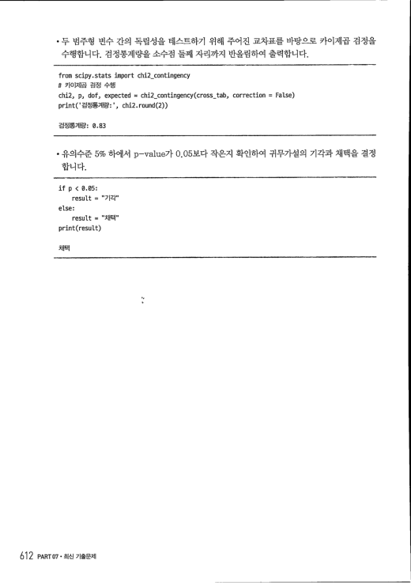
- 두 범주형 변수 간의 독립성을 테스트하기 위해 주어진 교차표를 바탕으로 카이제곱 검정을
수행합니다 . 검정통계량을 소수점 둘째 자리까지 반올림하여 출력합니다．

```python
from scipy.stats import ch12_contingency 
# 카이제곱 검정 수행 
chi2, p, dof, expected = chi2_contingency(cross_tab, correction = False) 
print(' 검정통계량＝ ' , chi2. round(2))
```
검정통계량＝ 0.83

- 유의수준 5% 하에서 p-value가 0.05보다 작은지 확인하여 귀무가설의 기각과 채택을 결정
합니다．

```python
if p < 0.05: 
result = " 기각" 
else: 
result = " 채택" 
print(result)
```
채택 612 PART07· 최신기출문제
