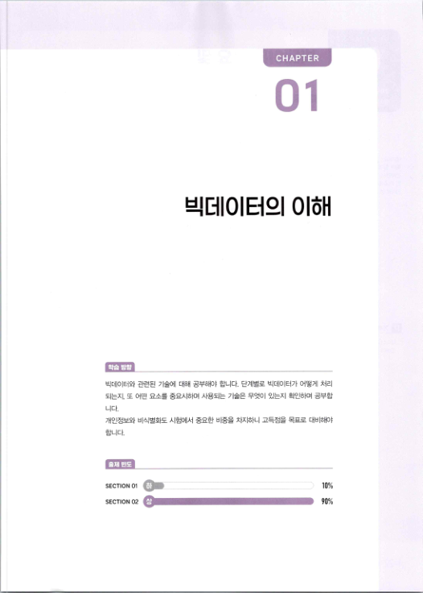
# CHAPTER 
01

# 빅데이터의 이해
학습 밤향 빅데이터와 관련된 기술에 대해 공부해야 합니다 . 단계별로 빅데이터가 어떻게 처리 되는지 , 또 어떤 요소를 중요시하며 사용되는 기술은 무엇이 있는지 확인하며 공부합 니다． 개인정보와 비식별화도 시험에서 중요한 비중을 차지하니 고득점을 목표로 대비해야 합니다． 출제 빈도 SECTION 01 하 10% SECTION 02

> 90%
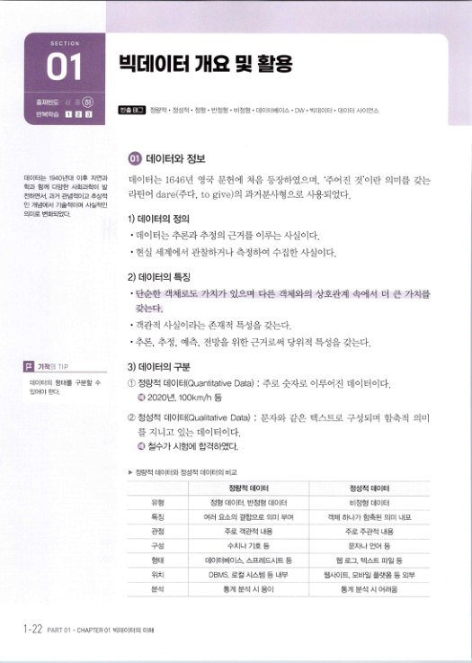
# SECTION 01
출제빈도 （彭 빈출 태그 정량적 . 정성적 · 정형 · 반정형 · 비정형 · 데이터베이스 · DW · 빅데이터 · 데이터 사이언스 반복학습 .

.

.

#### .l 
데이터와 정보 데이터는 1646년 영국 문헌에 처음 등장하였으며 , ' 주어진 것 ' 이란 의미를 갖는 데이터는 1940년대 이후 자연과 학과 함께 다양한 사회과학이 발 전하면서 . 과거 관념적이고 추상적 인 개념에서 기술적이며 사실적인 의미로 변화되었다．

#### 라틴어 dare（추다 , to give）의 과거분사형으로 사용되었다．
1) 데이터의 정의

- 데이터는 추론과 추정의 근거를 이루는 사실이다．
- 현실 세계에서 관찰하거나 측정하여 수집한 사실이다．
2) 데이터의 특징 난순깐 객제보노 가지가 있으며 다든 객제와의 상포관계 속에서 더 큰 가지틀 갖는다．

- 객관적 사실이라는 존재적 특성을 갖는다．
#### · 추론 , 추정 , 예측 , 전망을 위한근거로써 당위적 특정을 갖는다．
## r잽 기적의 지P
3) 데이터의 구분 데이터의 형태를 구분할 수 ① 정량적 데이터（Quantitative Data) ; 주로 숫자로 이루어진 데이터이다． clI2020년 , 10아qㄲ乃 등 있어야 한다．

#### ② 정성적 데이터（Qualitative Data) : 문자와 같은 텍스트로 구성되며 함축적 의미 
를 지니고 있는 데이터이다． .l 철수가 시험에 합격하였다．

> 정량적 데이터와 정성적 데이터의 비교
정량적 데이터 정성적 데이터 유형 정형 데이터 . 반정형 데이터 비정형 데이터 특징 여러 요소의 결합으로 의미 부여 객체 하나가 함축된 의미 내포 관점 주로 객관적 내용 주로주관적 내용 구성 수치나 기호 등 문자나 언어 등 형태 데이터베이스 , 스프레드시트 등 웹 로그 , 텍스트 파일 등 위치 DBMS , 로컬 시스템 등 내부 웹새기트 . 모바일 플랫폼 등 외부 분석 통계 분석 시 용이 통계 분석 시 어려움 ㅑ 2 PART01 . CHAPTER01 빅데이터의이해

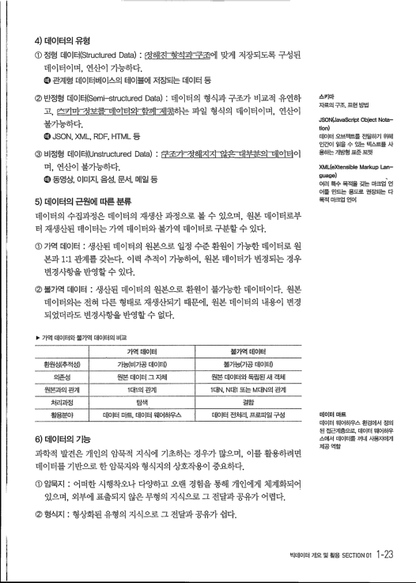
4) 데이터의 유형 ① 정형 데이터（Structured Data) : 평且［진E9뻑과넌쿠조에 맞게 저장되도록 구성된

#### 데이터이며 , 연산이 가능하다． 
0 관계형 데이터베이스의 테이블에 저장되는 데이터 등

#### ② 반정형 데이터（Semi-structured Data) : 데이터의 형식과 구조가 비교적 유연하
#### 고 , 흐최．의E겅보를「데"이더와樟才꺼t긔큼하는 파일 형식의 데이터이며 , 연산이
불가능하다． clf JSON. XML. RDF. HTML등

#### ③ 비정형 데이터（Unstructured Data) : 汪莖Zn‘해치치－않흔：－대부부의겨의璥이
#### 며 , 연산이 불가능하다． 
o동영상, 이미지 , 음성 , 문서 , 메일등 5) 데이터의 근원에 따른 분류

#### 데이터의 수집과정은 데이터의 재생산 과정으로 볼 수 있으며 , 원본 데이터로부
터 재생산된 데이터는 가역 데이터와 불가역 데이터로 구분할 수 있다．

#### ① 가역 데이터 : 생산된 데이터의 원본으로 일정 수준 환원이 가능한 데이터로 원
#### 본과 1:1 관계를 갖는다 . 이력 추적이 가능하여 , 원본 데이터가 변경되는 경우
변경사항을 반영할 수 있다．

#### ②불가역 데이터 : 생산된 데이터의 원본으로 환원이 불가능한 데이터이다 . 원본
#### 데이터와는 전혀 다른 형태로 재생산되기 때문에 , 원본 데이터의 내용이 변경
되었더라도 변경사항을 반영할 수 없다．

> 가역 데이터와불가역 데이터의 비교
가역 데이터 불가역 데이터 환원성（추적성） 가능〈비가공 데이터） 불가눼7陪 데이터） 의존성 원본 데이터 그 차체 원본 데이터와 독립된재 객체 원본과의 관계 1대1의 관계 1[ N. N대1 또는 M에새의 관계 처리과정 탐색 결합 활용분야 데이터 마트， 데이터 웨어하우스 데이터 전처리 . 鑒흰파일 구셩 6) 데이터의 기능 과학적 발견은 개인의 암묵적 지식에 기초하는 경우가 많으며 , 이를 활용하려면 데이터를 기반으로 한 암묵지와 형식지의 상호작용이 중요하다．

#### ① 암묵지 : 어떠한 시행착오나 다양하고 오랜 경험을 통해 개인에게 쳬계화되어
있으며 , 외부에 표출되지 않은 무형의 지식으로 그 전달과 공유가 어렵다．

#### ② 형식지 : 형상화된 유형의 지식으로 그 전달과 공유가 쉽다．
> 스키마
> 차료의 구조， 표현 방법
> JSON(JavaScript Object Nota-
> tion)
> 데이터 오브젝트를 전달하기 위해
> 인간이 읽을 수 있는 텍스트를 사
> 용ㅎ階 개방형 표준 포맷
> XML(eXtensib!e Markup Lan-
> guage) 
.

> 여러 특수 목적을 갖는 마크업 언 
어를 만드는 용도로 권장되는 다 목적 마크업 언어

> 데이터 마트
> 데이터 웨어하우스 환경에서 정의 
된 접근계층으로， 데이터 웨어하우 스에서 데이터를 꺼내 사용자에게 제공 역할

> 빅데이터개요및활용SECTION 01 1-23
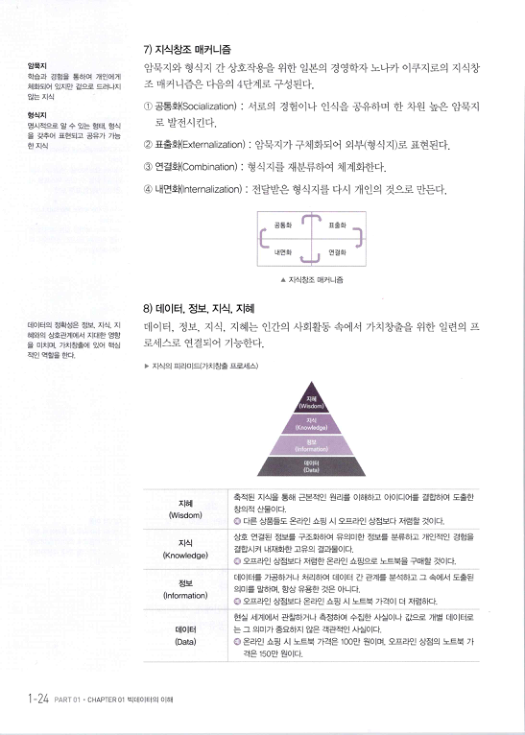
7) 지식창조 매커니즘 암묵지 학습과 경험을 통하여 개인에게 체화되어 있지만 겉으로 드러나지 않는 지식 암묵지와 형식지 간 상호작용을 위한 일본의 경영학자 노나카 이쿠지로의 지식창 조 매커니즘은 다음의 4단계로 구성된다．

#### ① 공통호KSocialization) : 서로의 경험이나 인식을 공유하며 한 차원 높은 암묵지 
로 발전시킨다． 형식지 명시적으로 알 수 있는 형태 . 형식 을 갖추어 표현되고 공유가 가능 한 지식

#### ② 표출화(Externalization) : 암묵지가 구쳬화되어 외부（형식지）로 표현된다．
#### ③ 연결화(Combination) : 형식지를 재분류하여 쳬계화한다．
#### ④ 내면화ㅇnternalization) : 전달받은 형식지를 다시 개인의 것으로 만든다．
화 줄 표 -

### 35》 「 
ㄱ

#### ㄴ 
화 면 내 L J 화 결 연 J ▲ 지식창조 매커니즘 8) 데이터 , 정보 , 지식 , 지혜 데이터의 정확성은 정보， 지식 , 지 혜와의 상호관계에서 지대한 영향 을 미치며 , 가치창출에 있어 핵심 적인 역할을 한다． 데이터 , 정보 , 지식 , 지혜는 인간의 사회활동 속에서 가치창출을 위한 일련의 프 로세스로 연결되어 기능한다． ' 지식의 피라미드（가치창출 프롸ㅔ스） 축적된 지식을 통해 근본적인 원리를 이해하고 아이디어를 결합하여 도출한 지혜 창의적 산물이다． (Wisdom) cIl 다른 상품들도 온라인 쇼핑 시 오프라인 상점보다 저렴할 것이다． 상호 연결된 정보를 구조화하여 유의미한 정보를 분류하고 개인적인 경험을 지식 결합시켜 내재화한 고유의 결과물이다． .l 오프라인 상점보다 저렴한 온라인 쇼핑으로 노트북을 구매할 것이다． (Knowledge) 데이터를 가공하거나 처리하여 데이터 간 관계를 분석하고 그 속에서 도출된 정보 의미를 말하며， 항상유용한 것은 아니다． (Information) cIl오프라인 상정보다 온라인 쇼핑 시 노트북 가격이 더 저렴하다． 현실 세계에서 관찰하거나 측정하여 수집한 사실이나 값으로 개별 데이터로 는 그 의미가 중요하지 않은 객관적인 사실이다． .l 온라인 쇼핑 시 노트북 가격은 100만 원이며 , 오프라인 상점의 노트북 가 데이터 (Data) 격은 150만 원이다． 1-24 PART 01 . CHAPTER 01 빅데이터의 이해

# l
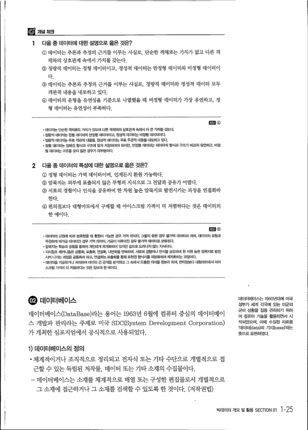
1 다음중 데이터에 대한설명으로옳은것은？ ① 데이터는 추론과 추정의 근거를 이루는 사실로 , 단순한 객쳬로는 가치가 없고 다른 객 쳬와의 상호관계 속에서 가치를 갖는다． ② 정량적 데이터는 정형 데이터이고 , 정성적 데이터는 반정형 데이터와 비정형 데이터이 다． ③ 더］이터는 추론과 추정의 근거를 이루는 사실로 , 정량적 데이터와 정성적 데이터 모두 객관적 내용을 내포하고 있다． ④ 데이터의 유형을 유연성을 기준으로 나열했을 때 비정형 데이터가 가장 유연하고 , 정 형 데이터는 유연성이 부족하다．

- 데이터는 단순한 z騎ㅔ로도 가치가 있으며 다른 객체와의 상호관계 속에서 더 큰 가치를 갖는다．
- 정량적 데이터는 정형 데이터와 반정형 데이터이고， 정성적 데이터는 비정형 데이터이다．
- 정량적 데이터는 주로 객관적 내용을. 정성적 데이터는 주로 주관적 내용을 내포하고 있다．
- 정형 데이터는 정해진 형식과 구조에 맞게 처장하여야 하지만 . 반정형 데이터는 데이터의 형식과 =i=L조가 비교적 유연하고， 비정
형 데이터는 구조를 갖지 않은 경우가 대부분이다． 2 다음 중 데이터의 특성에 대한 설명으로 옳은 것은？ ① 정형 데이터는 가역 데이터이며 , 언제든지 환원 가능하다． ② 암묵지는 외부에 표출되지 않은 무형의 지식으로 그 전달과 공유가 어렵다． ③ 서로의 경험이나 인식을 공유하며 한 차원 높은 암묵지로 발전시키는 과정을 연결화라 한다． ④ 펀의점보다 대형마트에서 구매할 때 아이스크림 가격이 더 저렴하다는 것은 데이터의 한 예이다．

- 데이터의 근원에 따라 분류했을 【대 환원이 가능한 경우 가역 데이터 . 그렇지 못한 경우 불가역 데이터라 하여 . 데이터의 유형과
무관하게 비가공 데이터인 경우 가역 데이터 . 가공이 이루어친 경우 불가역 데이터로분류된다．

- 암묵ㅈ伶굿 학습과 경헝을통하여 개인에게 쳬계화되어 있지안 겉으로 드러나지 않는 자식이다．
- 지식칭조 메커니즘은 공통화, 표출화. 연결화. 내면화를 반복하며 , 서로의 경험이나 인삭을 珊쿠하r폐 한 차원 높은 암묵지로 발전
시켜 나가는 과장을 공통화라 하ㅍ긱 연결화는표출화를 통해 표현된 형식ㅈ隱 자隧뀀류하여 쳬계화하는 과정이다．

- 데이터를 가공하거나 처리하여 데이터 간관겨隧 분석하고그 속에서 도출된 의미를 정보라 하며 . 편의점보다 대형마트에서 아이
스크림 가격이 더 저령a曆는 것은 정보의 한 예이다． .

데이터베이스 데이터베이스（DataBase）라는 용어는 1963년 6월에 컴퓨터 중심의 데이터베이 스 개발과 관리라는 주제로 미국 SDC(System Development Corporation) 가 개최한 심포지엄에서 공식적으로 사용되었다． 1) 데이터베이스의 정의

- 쳬계적이거나 조직적으로 정리되고 전자식 또는 기타 수단으로 개별적으로 접
근할수 있는 독립된 저작물 , 데이터 또는 기타 소재의 수집물이다．

- 데이터베이스는 소재를 쳬계적으로 배열 또는 구성한 편집물로서 개별적으로
#### 그 소재에 접근하거나 그 소재를 검색할 수 있도록 한 것이다 . （저작권법）
> Q④
> 묘蝕 ②
> 데이터베이스는 1950년대에 미국
> 정부가 세계 각국에 있는 미군의
> 군비 상황을 집중 관리하기 위하
> 여 컴퓨터 기술을 활용하면서 시
> 작되었으며 . 이때 수집된 자료를
> ‘데이터（data）의 기지（base)'라는
> 뜻으로 표현하였다．
> 빅데이터개요및활용SECTION 01 ㅑ 5
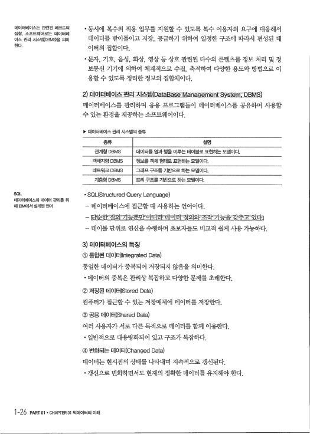
데이터베이스는 관련된 레코드의 집합 , 소프트웨어로는 데이터베 이스 관리 시스템(DBMS) 의미

- 동시에 복수의 적용 업무를 지원할 수 있도록 복수 이용자의 요구에 대응해서
데이터를 받아들이고 저장 , 공급하기 위하여 일정한 구조에 따라서 편성된 데 한다． 이터의 집합이다．

- 문자 , 기호 , 음정 , 화상 , 영상 등 상호 관런된 다수의 콘텐츠를 정보 처리 및 정
보통신 기기에 의하여 쳬계적으로 수집 , 축적하여 다양한 용도와 방법으로 이 용할 수 있도록 정리한 정보의 집합쳬이다． 2) 데［（才t터베이츠꼰I.리치츠템（D祗亘B版驪rM毓u萌顚頂b炙￡v蠟畺m＝ㅁBM8) 데이터베이스를 관리하며 응용 프로그램들이 데이터베이스를 공유하며 사용할 수 있는 환경을 제공하는 소프트웨어이다．

> 데이터베이스 관리 시스템의 종류
종류 설명 관계형 DBMS 데이터를 열과 행을 이루는 테이블로 표현하는 모델이다． 객체지향 DBMS 정보를 객체 형태로 표현하는 모델이다． 네트워크 DBMS 그래프 구조를 기반으로 ㅎ隱 모델이다． 계층형 DBMS 트리 구조를 기반．으로 히는 모델이다．

- SQL(Structured Query Language)
SQL 데이터베이스의 데이터 관리를 위 해 IBM에서 설계된 언어

- 데이터베이스에 접근할 때 사용하는 언어이다．
- 다순한－점의－기능뿌뱐아디’라’데’이더－정의와＝조각끼뉴숄 갖추고-Oi듸그
- 테이블 단위로 연산을 수행하며 초보자들도 비교적 쉽게 사용 가능하다．
3) 데이터베이스의 특징 ① 통합된 데이터.nteg rated Data) 동일한 데이터가 중복되어 저장되지 않음을 의미한다．

- 데이터의 중복은 관리상 복잡하고 다양한 문제를 초래한다．
② 저장된 데이터（Stored Data) 컴퓨터가 접근할 수 있는 저장매쳬에 데이터를 저장한다． ③ 공용 데이터（Shared Data) 여러 사용자가 서로 다른 목적으로 데이터를 함께 이용한다．

- 일반적으로 대용링화되어 있고 구조가 복잡하다．
④ 변화되는 데이터（Changed Data) 데이터는 현시점의 상태를 나타내며 지속적으로 갱신된다．

- 갱신으로 변화하면서도 현재의 정확한 데이터를 유지해야 한다 .
ㅏ 6 PART 01 . CHAPTER 01 빅데이터의 이해

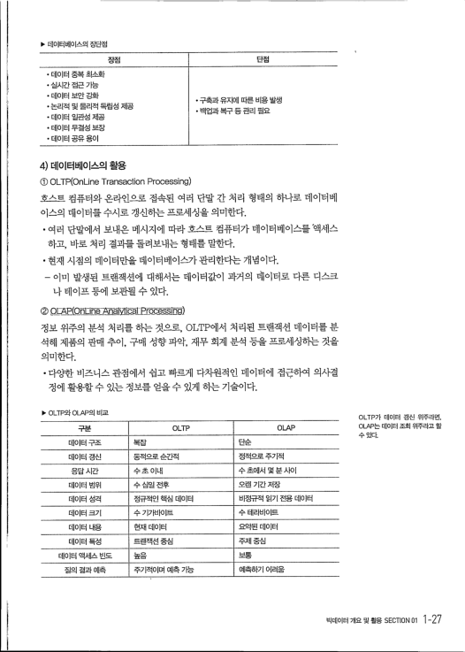
* 데이터베이스의 장단점
장점 단점

- 데이터 줌복 최소화
- 실시간 접근 가능 
- 데이터 보안 강화
- 구축과 유지에 따른 비용 발생
- 논리적 및 물리적 독립성 제공
- 백업과 복구 등 관리 필요
- 데이터 일관성 저꼼
- 데이터 무결성 보장
- 데이터 공유 용이
4) 데이터베이스의 활용 ①0LTP(OnLine Transaction Processing)

#### ㅎㅅ트 컴퓨터와 온라인으로 접속된 여러 단말 간 처리 형태의 하나로 데이터베
이스의 데이터를 수시로 갱신하는 프로세싱을 의미한다．

#### · 여러 단말에서 보내온 메시지에 따라 ㅎㅅ트 컴퓨터가 데이터베이스를 ‘액세스
하고 , 바로 처리 결과를 돌려보내는 형태를 말한다．

- 현재 시점의 데이터만을 데이터베이스가 관리한다는 개념이다．
- 이미 발생된 트랜잭션에 대해서는 데이터값이 과거의 뎨이터로 다른 디스크
나 테이프 등에 보관될 수 있다．

#### ② QL씽P(QLine AiW砥IE顚顚L)
#### 정보 위주의 분석 처리를 하는 것으로 , OLTP에서 처리된 트랜잭션 데이터를 분
#### 석해 제품의 판매 추이 , 구매 성향 파악 , 재무 회계 분석 등을 프로세싱하는 것을
의미한다．

- 다양한 비즈니스 관점에서 쉽고 빠르게 다차원적인 데이터에 접근하여 의사결
#### 정에 활용할 수 있는 정보를 얻을 수 있게 하는 기술이다 .
>OLTP와 OLAP의 비교
구분 《lJP 이·AP 데이터 구조 복잡 단순 데이터 갱신 동적으로순간적 정적으로주기적 응답 시간 수초 이내 수 초에서 몇 분 사이 데이터 범위 수 십일 전후 오랜 기간 저장 데이터 성격 정규적인 핵심 데이터 비장규적 읽기 전용 데이터 데이터 크기 수 기가바이트 수 테라바이트 데이터 내용 현재 데이터 요약된 데이터 데이터 특성 트랜잭션 중심 주제 중심 데이터 액세스 빈도 높믐 보통 질의 결과 예측 주기적이며 예측 가능 예측하기 어려움

> OLTP가 데이터 갱신 위주라면． 
O냐，F는 데이터 조회 위주라고 할 수 있다．

> 빅데이터．개요및활용SECTION 01 1 -27
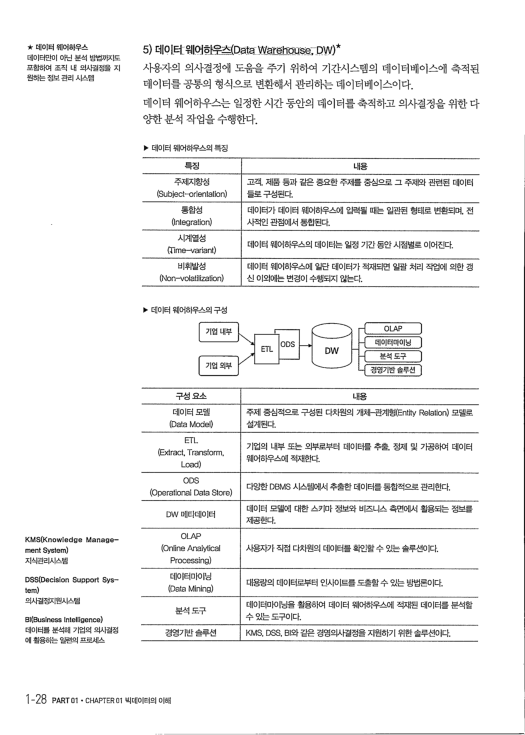
★ 데이터 뭬어하우스

#### 5) 데아타웨어하우스伯蕣t i,(v晙1p1.'se,pW）★
데이터만이 아닌 분석 방법까지도 포함하여 조직 내 의사결정을 지 원하는 정보 관리 시스템 사용자의 의사결정에 도움을 주기 위하여 기간시스템의 데이터베이스에 축적된 데이터를 공통의 형식으로 변환해서 관리하는 데이터베이스이다． 데이터 웨어하우스는 일정한 시간 동안의 데이터를 축적하고 의사결정을 위한 다 양한 분석 작업을 수행한다．

> 데이터 웨어하우스의 특징
특징 내용 고객 , 제품 등과 같은 중요한 주제를 중심으로 그 주제와 관련된 데이터 들로 구성된다． 주제지향성 (Subject-orientation) 통합성 데이터가 데이터 웨어하우스에 입력될 때는 일관된 형태로 변환되며 , 전 (Integration) 사적인 관점에서 통합된다． 시계열셩 (Time-variant) 데이터 웨어하우스의 데이터는 일정 기간 동안 시점별로 이어진다． 비휘발성 (Non-volatilization) 데이터 웨어하우스에 일단 데이터가 적재되면 일괄 처리 작업에 의한 갱 신 이외에는 변경이 수행되지 않는다．

> 데이터 웨어하우스의 구성
ㅣ , 닛

### 夕
ETL ODS 구성 요소 내용 데이터 모델 주제 중심적으로 구성된 다차원의 개체－관계형（Entity Relation) 모델로 (Data Model) 설계된다． ETL 기업의 내부 또는 외부로부터 데이터를 추출 , 정제 및 가공하여 데이터 (Extract, Transform, 웨어하우스에 적재한다． Load) ODS (Operational Data Store) 다양한 DBMS 시스템에서 추출한 데이터를 통합적으로 관리한다． DW 메타데이터 데이터 모델에 대한 스키마 정보와 비즈니스 측면에서 흴용되는 정보를 저居한다． OLAP KMS(Know!edge Manage- ment System) 지식관리사스템 (Online Analytical 사용자가 직첩 다차원의 데이터를 확인할 수 있는 솔루션이다． Processing) 데이터마이닝 DSS(Decision Support Sys- tern) 의사결정지원시스템 (Data Mining) 대罌l의 데이터로부터 인사이트를 도출할 수 있는 방법론이다． 분석 도구 데이터마이닝을 흴용하여 데이터 웨어하우스에 적재된 데이터를 분석할 수 있는 도구이다． Bl(Business Intelligence) 데이터를 분석해 기업의 의사결정 에 흴용하는 일련의 뜨느세스 경영기반솔루션 KMS. DSS. BI와같은 경영의사결정을지원하기 위한솔루션이다． 1-28 PART01 . CHAPTER01 빅데이터의 이해

> OLAP
> '．
→ ： ㅢ 겡 ＇ ㅓ ㅓ

> 데이터마이닝
> 분석 도구
> 경영기반 솔루션
# !
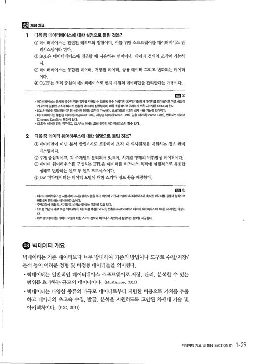
1 다음중 데이터베이스에 대한설명으로틀린 것은？ ① 데이터베이스는 관련된 레코드의 집합이며 , 이를 위한 소프트웨어를 데이터베이스 관 리시스템이라한다． ② sQL은 데이터베이스에 접근할 때 사용하는 언어이며 , 데이터 정의와 조작이 가능하 다． ③ 데이터베이스는 통합된 데이터 , 저장된 데이터 , 공용 데이터 그리고 변화되는 데이터 이다． ④ OLTP는 조회 중심의 데이터베이스로 현재 시점의 데이터만을 관리한다는 개념이다．

- 데이터베이스는동시에 복수의 적용 업무를 지원할 수 있도록 복수 이용자의 요구에 대응해서 데이터를 받아들이고 저장. 공급하
기 위하여 일정한구조에 따라서 편성된 데이터의 집합쳬이며， 이를 효율적으로 관리하기 위한 사스템을 DBMS라 한다．

- SQL은 단순한 질의뿐만 아니라 데이터 정의와 조작이 가능하며 . 초보차들도 비교적 쉽게 사용 가능한 언에기다．
- 데이터베이스는 통합된 데이터.ntegrated Data) . 저장된 데이터（Stored Data) . 공용 데이터（Shared Data) . 변화되는 데이터
(Changed Data）라는 특징이 있다．

- OLTP논 데이터 갱신 위주아고 . OLAP는 데이터 苡｀ 雜주의 데이터베아스라 할수 있다．
2 다음 중 데이터 웨어하우스에 대한 설명으로 틀린 것은？ ① 데이터만이 아닌 분석 방법까지도 포함하여 조직 내 의사결정을 지원하는 정보 관리 시스템이다． ②주제 중심적이고 , 각주제별로분리되어 있으며 , 시계열 형태의 비휘발성 데이터이다． ③ 데이터 웨어하우스를 구성하는 ETL은 데이터를 비즈니스 목적에 실질적으로 유용한 상태로 변환하는 엔드 투 엔드 프로세스이다． ④ DW 메타데이터는 데이터 모델에 대한 스키마 정보 등을 제공한다．

- 데이터 웨어하우스는 사용차의 의사결정에 도움을 주기 위하여 기관사스템의 데이터베이스에 축적된 데이터를 공통의 형식으로
변환해서 관리하는 데이터베oI스이다．

- 주제지항성 , 통합성． 시계열성 . 비휘발성이라는 특징을 갖고 있다． 
- EtL은 기업의 내부 또는 와부로부터 데이터를 추출《Extract) . 변환（Trans柚＂ㄲ）하여 데이터 웨어하우스에 적재（Load）하는 과정Ol
다．

- DW 메타데이터는 데이터 모델에 대한스키마 정보와 비즈니스 측연에서 활용되는 정보를 저隧즛한다 .
.

빅데이터 개요 빅데이터는 기존 데이터보다 너무 방대하여 기존의 방법이나 도구로 수집／저장／ 분적 등이 어려운 정형 및 비정형 데이터들을 의미한다．

- 빅데이터는 일반적인 데이터베이스 소프트웨어로 저장 , 관리 , 분석할 수 있는
#### 범위를초과하는 予모의 데이터이다 . (MCKinsey, 2011)
- 빅데이터는 다양한 종류의 騙구모 데이터로부터 저렴한 비용으로 가치를 추출
하고 데이터의 초고속 수집 , 발굴 , 분적을 지원하도록 고안된 차세대 기술 및 아키텍처이다 . (IDO, 2011)

> E ④
> 愍좨②
> 빅데이터개요및활용SECTION 01 1-29
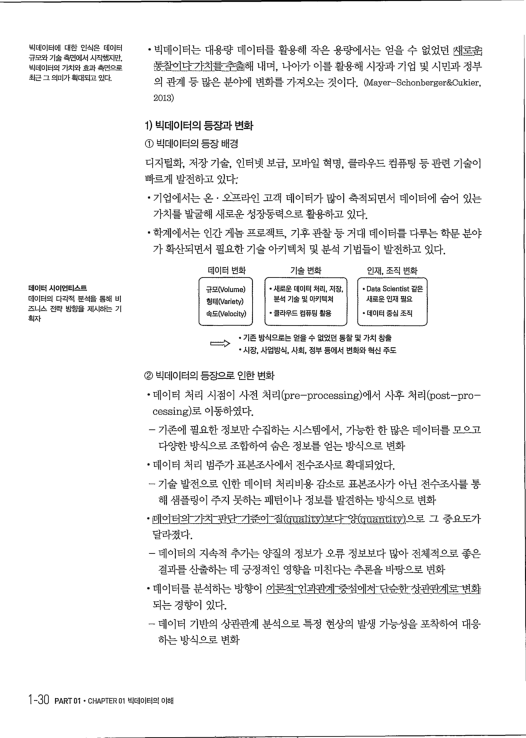
- 빅데이터는 대용량 데이터를 활용해 작은 용량에서는 얻을 수 없었던 r?1lj瑩i
빅데이터에 대한 인식은 데이터 규모와 기술 측면에서 시작했지만． 빅데이터의 가치와 효과 측면으로 최근 그 의미가확대되고 있다． 톺찰의且：꽈치름牟축해 내며 , 나아가 이를 활용해 시장과 기업 및 시민과 정부 의 관계 등 많은 분야에 변화를 가져오는 것이다 . (Mayer'-Schonberger&Cukier, 2013) 1) 빅데이터의 등장과 변화 ① 빅데이터의 등장 배경 디지털화, 저장기술 , 인터넷 보급 , 모바일 혁명 , 클라우드 컴퓨팅 등관련 기술이 빠르게 발전하고 있다．‘

#### · 기업에서는 온 · 오；프라인 고객 데이터가 많이 축적되면서 데이터에 숨어 있는
가치를 발굴해 새로운 성장동력으로 활용하고 있다．

- 학계에서는 인간 게놈 프로젝트 , 기후 관찰 등 거대 데이터를 다루는 학문 분야 
가 확산되면서 필요한 기술 아키텍처 및 분석 기법들이 발전하고 있다． 데이터 변화 기술 변화 인재 , 조직 변화 데이터 사이언티스트

- 새로운 데이터 처리 , 저장， 
분석 기술 및 아키텍처 규보CV이내ㄲe) 데이터의 다각적 분석을 통해 비 즈니스 전략 방향을 제시하는 기 획자 형태（Variety)

- 클라우드 컴퓨팅 활용
속도（Velocity) ㅁ수 ' 기존방식으로는얻을수없었던통찰및가치창출 ' 시장 , 사업방식 . 사회 첫브드에A4 벼ㅎLOL C4&I ㅈ＂ ② 빅데이터의 등장으로 인한 변화

- 데이터 처리 시점이 사전 처리（pre-processing）에서 사후 처리（post-pro-
cessing）로 이동하였다．

- 기존에 필요한 정보만 수집하는 시스템에서 , 가능한 한 많은 데이터를 ▽ Oj7
다양한 방식으로 조합하여 숨은 정보를 얻는 방식으로 변화

- 데이터 처리 범주가 표본조사에서 전수조사로 확대되었다．
- 기술 발전으로 인한 데이터 처리비용 감소로 표본조사가 아닌 전수조사를 통
해 샘폴링이 주지 못하는 패턴이나 정보를 발견하는 방식으로 변화

- 뎨’ㅇ1"터쌩－가치－파단－기주이∼칩"（百｀Iㅍli憲劾보다－얏（h[I枉Ttit 으로 그 중요도가
달라졌다 .

- 데이터의 지속적 추가는 양질의 정보가 오류 정보보다 많아 전쳬적으로 좋은
결과를 산출하는 데 긍정적인 영향을 미친다는 추론을 바탕으로 변화

- 데이터를 분적하는 방향이 화론적－0꾀굇폐＝중점왜최즈단순：힌：ㅍ싱：괸꽜계르변회수
#### 되는 경향이 있다 .
- 데이터 기반의 상관관계 분석으로 특정 현상의 발생 가능성을 포착하여 대응
하는 방식으로 변화 1-30 PART01 . CHAPTER01 빅데이터의 이해

> - Data Scientist 같은
> 새로운 인재 필요
> - 데이터 중심 조직
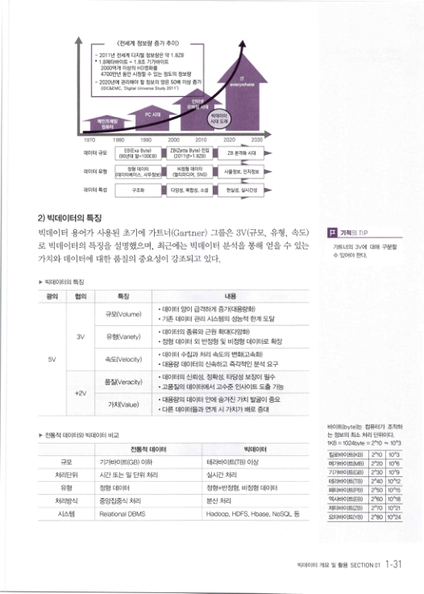
-- ＜전세계 정보량증가추이＞ -2011 년 전세계 디지털 정보량은 약 1.8ZB 를 1.8제타바이트 = 1.8조 기가바이트 2000억개 이상의 HD영화룔 4700만년 동안 시청할 수 있는 정도의 정보량 -2020년에 관리해야 할 정보의 양은 50배 이상 증가 (IDC&EMC, ' Digital Universe Study 2011 ') 2020 2。 3。卜 1990 1970 1980 2000 2010 EB(Exa Byte) (9(）년대 말．100EB) Z8《Zetta Byte) 진입 (2011년 1.8ZB) 데이터 규모 ZB 본격화 시대 비정형 데이터 （멀티미디어 . SNS) 정형 데이터 데이터베이스 , 사무정보） 사뮬정보 . 인지정보 데이터 유형 데이터 특성 다양성 , 복합성． 소셜 구조화 현실성， 실시간섬 2) 빅데이터의 특징

#### 빅데이터 용어가 사용된 초기에 가트너（Gartner) 그룹은 3VG구모 , 유형 , 속도）
#### 로 빅데이터의 특징을 설명했으며 , 최근에는 빅데이터 분석을 통해 얻을 수 있는
가치와 데이터에 대한 품질의 중요성이 강조되고 있다．

* 백게이터의 특징
광의 협의 ㅣ 특징

- 
내용 데이터양이급격하게증가（대용량화） 규모（Volume)

- ' 기존데이터관리시스템의성능적한계도달
유형＜Variety)

- ·데이터의종류와근원확대（다양화）
3V

- 정형 데이터 외 반정형 및 비정형 데이터로 확장
- 데이터 수집과 처리 속도의 변화（고속화）
속도（Velocity) -

- 대용량 데이터의 신속하고 즉각적인 분석 요구
품질（Veracity)

- 데이터의 신뢰성 , 정확성 . 타당성 보장이 필수
- 고품질의 데이터에서 고수준 인사이트 도출 가능
+2V 가치（Value)

- 대용량의 데이터 안에 숨겨진 가치 발굴이 중요
- 다른 데이터들과 연계 시 가치가 배로 증대
卜 전통적 데이터와 빅더 이터 비교 전통적 데이터 빅데이터 규모 기가바이트（GB) 이하 테라바이트（TB) 이상 처리단위 시간 또는 일 단위 처리 실시간 처리 유형 정형 데이터 정형H반정형 , 비정형 데이터 처리방식 중앙집중직 처리 분산 처리 시스템 Relational DBMS Hadoop. HDFS. Hbase, NoSQL 등

#### ．철 기적의 지p
> 가트너의 3V에 대해 구분할 
수 있어야 한다．

> 바이트（byte冶 컴퓨터가 조작하 
는 정보의 최소 처리 단위이다． 1KB = 1024byte = 2"lO = 1o^3

> 킬로바이트(KB)
> 2"l0 
2^20

> 메가바이트（MB)
> 기가바이트（GB)
> 2A30 
2"40

> 테래배이트（ㅜB)
> 페타바이트(PB)
> 2A50 
2吟

> 엑사바이트《EB)
> 제타배머틔ZB)
> 2A70 
280

> 요타바이트(YB)
> 빅데이터 개요 및 활용 SECTION 이 ㅌ죄
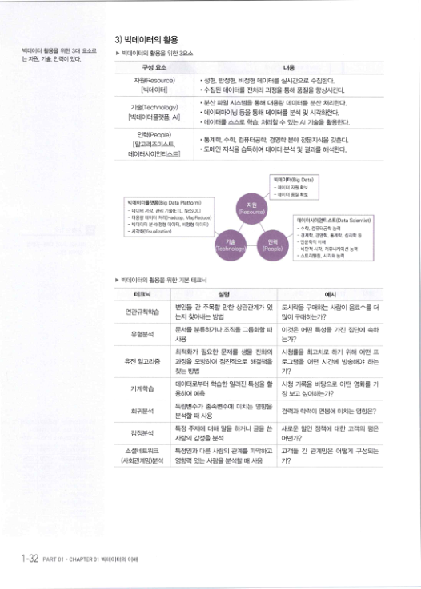
3) 빅데이터의 활용 빅데이터 활용을 위한 3대 요소로 는 자원 . 기술 , 인력이 있다． 卜 빅데이터의 활용을 위한 3요소 구성 요소 내용 자원（Resource)

- 정형 , 반정형． 비정형 데이터를 실시간으로 수집한다．
［빅데이터］

- 수집된 데이터를 전처리 과정을 통해 품질을 향상시킨다．
- 분산 파일 시스템을 통해 대용량 데이터를 분산 처리한다．
기술《Technology)

- 데이터마이닝 등을 통해 데이터를 분석 및 시각화한다．
［빅데이터플랫폼 , 씨］

- 데이터를 스스로 학습 , 처리할 수 있는 ／치 기술을 활용한다．
인력（People)

- 통계학 , 수학. 컴퓨터공학 , 경영학 분야 전문지식을 갖춘다． 
- 도메인 지식을 予하여 데이터 분석 및 결과를 해석한다．
［알고리즈미스트 데이터사이언티스트］ 빅데이터《Big Data)

- 데이터 자원 확보 
- 데이터 품질 확보
빅데이터퓰랫폼（Big Data Platform) 자원 (Resource)

- 데이터 저장， 관리 기술(ETL. NoSQL) 
- 대용량 데이터 처리어adoop, MapReduce) 
- 빅데이터 분석《정형 데이터 , 비정형 데이터） 
- 시각화(Visualization)
# ,，블』
，, (Technology) (People) 卜 빅데이터의 활용을 위한 기본 테크닉 테크닉 설명 예시 연관규칙학습 변인들 간 주목할 만한 상관관계가 있 는지 짖아내는 방법 유형분석 문서를 분류하거나 조직을 그룹화할 때 사용 최적화가 필요한 문제를 생물 진화의 유전 알고리즘 과정을 모방하여 점진적으로 해결책을 찾는 방법 기계학습 데이터로부터 학습한 알려진 특성을 활 용하여 예측

- 장보고싶어하는가？
회귀분석 독립변수가 종속변수에 미치는 영향을 분석할 때 사용 경력과 학력이 연봉에 미치는 영향은？ 감정분석 특정 주제에 대해 말을 하거나 글을 쓴 사람의 감장을 분석 특정인과 다른ㅅ빰의 관계를파익同고ㄱ 영향력있는ㅅ탐을분석할때ㅅ 소셜네트워크

## 」
（사회관계망》분석 ㅏ 2 PART 01 . CHAPTER 01 빅데이터의 이해

> 데이터사이언티스트（Data Scientist)
> - 수학 , 컴퓨터공학 능력 
- 경제학． 경영학 . 통계학， 심리학 등 
- 인문학적 이해 
- 비판적 시각 , 커뮤니게이션 눙력 
- 스토리혤링， 시각화 눙력
> 돠 락을 구매하는 사람이 음료수를 더
> 많이 구매하는가？
> 이것은 어떤 특성을 가진 집단에 속하
> 는가？
> 시청률을 최고치로 하기 위해 어떤 프
> 로그램을 어떤 시간에 방송해야 하는
> 가？
> 시청 기록을 바탕으로 어떤 영화를 가
> 새로운 할인 정책에 대한 고객의 평은
> 어떤가？
> 고객들 간 관계망은 어떻게 구성되는
> 가？
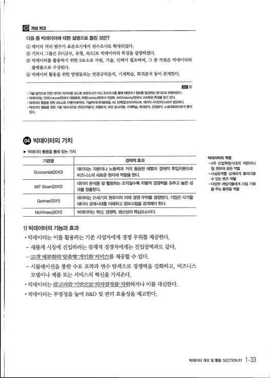
다음 중 빅데이터에 대한 설명으로 틀린 것은？ ① 데이터 처리 범주가 표본조사에서 전수조사로 확대되었다． ② 가트너 그룹은 3V（규모 , 유형 , 속도）로 빅데이터의 특징을 설명하였다． ③ 빅데이터를활용하기 위한 3요소로 자원 , 기술 , 인력이 필요하며 , 그 중 자원은 빅데이터와 플랫폼으로 구성된다． ④ 빅데이터 활용을 위한 방법들로는 연관규칙분적 , 기계학습 , 회귀분석 등이 존재한다．

- 기술 발전으로 인한 데이터 처리비용 감소로 표본조사가 아닌 잔수조사를 통해 패텐기나정보를 발견하는 방식으로 변화되었다．
- 빅데이터는 규모（Volume）연에서 대용량화, 유형（Variety）면에서 다양화， 속도《Vetocity）연에서 고속화된 특징읕 갖고 있다．
- 빅데이터 활용율 위한 3요소로 자원（빅데이터） , 기술I빅데이터플랫폼. 쌔 . 인력（알고리즈미스트，데이터 사이언티스트）이 필요ㅎ口．
- 빅데이터 활용을 위한 기본 테크닉으로 연관규칙분석． 유형분석 , 유전 알고리즘 , 기계학습． 회구徨석． 감정분석． 소셜네트워크분석 등이
있다． .

빅데이터의 가치 卜 빅데이터 횔용을 통해 얻는 가치 기관명 경제적 효과 Economist(2010) 데이터는 차본이나 노동력과 거의 동등한 레벨의 경제적 투입차본으로 비즈니스의 새로운 원자재 역할을 한다． MIT Sloan(2010) 데이터 분석을 잘 횔용하는 조직일수록 차별적 경쟁력을 갖추고 높은 성 고喝 창출힌다． Gartner(2011) 데이터는 21세기의 원유이며 미래 경쟁 우위를 결정힌다 . 기업은 다가올 데이터 경제시대를 이해하고 정보고립을 경계해야 한다． McKirisey(2011) 빅데이터는 혁신 , 경쟁력 , 생산성의 핵심요소이다． 1) 빅데이터의 기능과 卽

- 빅데이터는 이를 활용하는 기존 사업자에게 경챙 우위를 제공한다．
- 새롭게 시장에 진입하려는 잠재적 경챙자에게는 진입장벽과도 같다．
- 呈；갱긔분회公型춤生［Zㅐ있회즈Z크뵈스를 제공할 수 있다．
#### - 시뮬레이션을 통한 수요 포착과 변수 탐색으로 경쟁력을 강화하고 , 비즈니스
모델이나 제품 또는 서비스의 혁신을 가져온다．

- 빅데이터는 ［갈프；뢰씀희반：으＝르의츠爐크점盧＝최塋l하거나 이를 대신한다．
#### · 빅데이터는 투명정을 높여 R&I) 및 관리 효율성을 제고한다 .
> 명國③
> 빅데이터의 역할
> .4차 산업혁명시대의 석탄이나
> 철 . 원유와 같은 역할
> - 사실관계를 상세하게 들여다볼
> 수 있는 렌즈 역할
> - 다앙한 개발지들에게 사업 기회 
를 주는 플랫폼 역할

> 빅데이터개요및활용SECTION 01 1-33
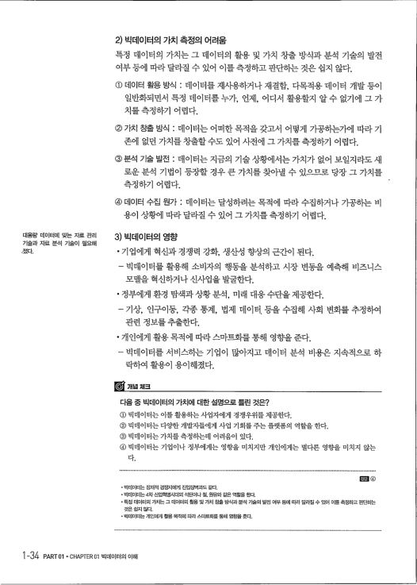
2) 빅데이터의 가치 측정의 어려움 특정 데이터의 가치는 그 데이터의 활용 및 가치 창출 방식과 분석 기술의 발전 여부 등에 따라 달라질 수 있어 이를 측정하고 판단하는 것은 쉽지 않다．

#### ① 데이터 활용 방식 : 데이터를 재사용하거나 재결합 , 다목적용 데이터 개발 등이 
일반화되면서 특정 데이터를 누가 , 언제 , 어디서 활용할지 알 수 없기에 그 가 치를측정하기 어렵다．

#### ② 가치 창출 방식 : 데이터는 어떠한 목적을 갖고서 어떻게 가공하는가에 따라 기 
존에 없던 가치를 창출할수도 있어 사전에 그 가치를 측정하기 어렵다． ③ 분석 기술 발전 : 데이터는 지금의 기술 상황에서는 가치가 없어 보일지라도 새 로운 분적 기법이 등장할 경우 큰 가치를 찾아낼 수 있으므로 당장 그 가치를 측정하기 어렵다．

#### ④ 데이터 수집 원가 : 데이터는 달성하려는 목적에 따라 수집하거나 가공하는 비 
용이 상황에 따라 달라질 수 있어 그 가치를 측정하기 어렵다． 3) 빅데이터의 영향 대용량 데이터에 맞는 자료 관리 기술과 자료 분석 기술이 필요해

#### · 기업에게 혁신과 경챙력 강화, 생산성 향상의 근간이 된다．
졌다．

- 빅데이터를 활용해 소비자의 행동을 분석하고 시장 변동을 예측해 비즈니스 
모델을 혁신하거나 신사업을 발굴한다．

- 정부에게 환경 탐색과상황분석 , 미래 대응수단을제공한다．
#### - 기상 , 인구이동 , 각종 통계 , 법제 데이터 , 등을 수집해 사회 변화를 추정하여 
관런 정보를 추출한다．

- 개인에게 활용 목적에 따라 스마트화를 통해 영향을 준다．
- 빅데이터를 서비스하는 기업이 많아지고 데이터 분석 비용은 지속적으로 하
락하여 활용이 용이해졌다． 다음 중 빅데이터의 가치에 대한 설명으로 틀린 것은？ ① 빅데이터는 이를 활용하는 사업자에게 경챙우위를 제공한다． ② 빅데이터는 다양한 개발자들에게 사업 기회를 주는 플랫폼의 역할을 한다． ③ 빅데이터는 가치를 측정하는데 어려움이 있다． ④ 빅데이터는 기업이나 정부에게는 영향을 미치지만 개인에게는 별다른 영향을 미치지 않는 다．

- 빅데이터는 잠재적 경쟁자에게 진입장벽과도 같다．
- 빅데이터는4차신업혁명시대의 석탄이나 철 , 원유와 같은 역할을 한다．
- 특정 데이터의 가치는 그 데이터의 활용 및 가치 창출 방식과분석 기술의 발전 여부 둥계 따라 달라질 수 있어 이틀 축정하고 뀐竇크하는 
것은 쉽지 않다．

- 빅데이터는 개인에게 횔용목적에 따라 스마트회를 통해 영향을 준다．
1 -34 PART 01 . CHAPTER 01 빅데이터의 이해

> 덛레④
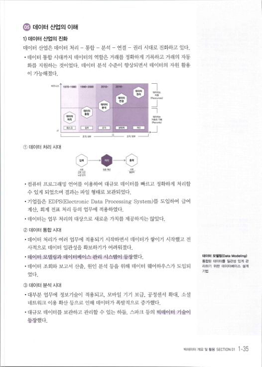
데이터 산업의 이해 1) 데이터 산업의 진화 데이터 산업은 데이터 처리 - 통합 - 분석 - 연결 - 권리 시대로 진화하고 있다．

- 데이터 통합 시대까지 데이터의 역할은 거래를 정확하게 기록하고 거래의 자동
화를 지원하는 것이었다 . 데이터 분적 수준이 향상되면서 데이터의 자원 활용 이 가능해졌다． 1970-1980 1990-2000 20 10-

### 빪
- 一
태스크 IT ㅐ－-- 조직뫼부 -－」 조직 내부 ① 데이터 처리 시대

# 근무 시긴 
노힐 딘가 〔D

# ㅌ〕 *
사번 임굼 계산

- 컴퓨터 프로그래밍 언어를 이용하여 대규모 데이터를 빠르고 정확하게 처리할
수 있게 되었으며 결과는 파일 형태로 보관되었다．

- 기업들은 EDPS(Electronic Data Processing System）를 도입하여 급여
계산 , 회계 전표 처리 등의 업무에 적용하였다．

- 데이터는 업무 처리의 대상으로 새로운 가치를 제공하지는 않았다．
② 데이터 통합 시대

- 데이터 처리가 여러 업무에 적용되기 시작하면서 데이터가 쌓이기 시작했고 전
사적으로 데이터 일관성을 확보하기가 어려워졌다．

- 데이터 모델링과 데이터베이스 관리 시스템이 등장했다．
- 데이터 조회와 보고서 산출 , 원인 분석 등을 위해 데이터 웨어하우스가 도입되
었다． ③ 데이터 분석 시대

- 대부분 업무에 정보기술이 적용되고 , 모바일 기기 보급 , 공정센서 확대 , 소셜
네트워크 이용 확산 등으로 인해 데이터가 폭발적으로 증가했다．

- 대규모 데이터를 보관하고 관리할 수 있는 하둡 , 스파크 등의 빅데이터 기술이
등장했다．

> 데이터 모델링《Data Modeling)
> 통합된 데이터를 일관성 있게 관 
리하기 위한 데이터베이스 설계

> 기법
> 빅데이터개요및활용 SECTION 01 1 -35
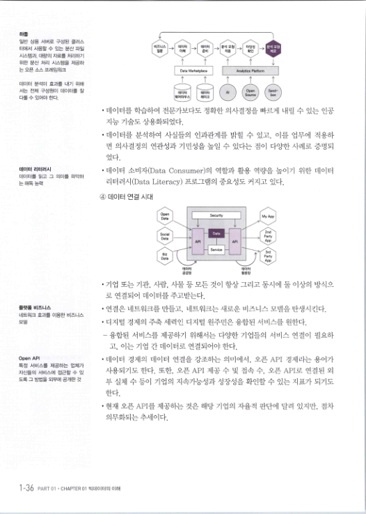
하둡 일반 상용 서버로 구성된 클러스 터에서 사용할 수 있는 분산 파일 시스템과 , 대량의 자료를 처리하기 위한 분산 처리 시스템을 제공하 는 오픈 소스 프레임워크 데이터 분석이 효과를 내기 위해 서는 전체 구성원이 데이터를 잘 다룰 수 있어야 한다．

- 데이터를 학습하여 전문가보다도 정확한 의사결정을 빠르게 내릴 수 있는 인공
지능 기술도 상용화되었다．

- 데이터를 분적하여 사실들의 인과관계를 밝힐 수 있고 , 이를 업무에 적용하
면 의사결정의 연관성과 기민성을 높일 수 있다는 점이 다양한 사례로 증명되 었다．

- 데이터 소비자（Data Consumer）의 역할과 활용 역량을 높이기 위한 데이터
데이터 리터러시 데이터를 읽고 그 의미를 파악하 는 해독 능력 리터러시（Data Literacy) 프로그램의 중요성도 커지고 있다． ④ 데이터 연결 시대 뎨이터 데어터 공급망 활용망

- 기업 또는 기관 , 사람 , 사물 등 모든 것이 항상 그리고 동시에 둘 이상의 방식으
로 연결되어 데이터를 주고받는다．

- 연결은 네트워크를 만들고 , 네트워크는 새로운 비즈니스 모델을 탄생시킨다．
풀햇폼 비즈니스 네트워크 효과를 이용한 비즈니스 모델

- 디지털 경제의 주축 세력인 디지털 원주민은융합된 서비스를 원한다．
- 융합된 서비스를 제공하기 위해서는 다양한 기업들의 서비스 연결이 필요하
고 , 이는 기업 간 데이터로 연결되어야 한다．

- 데이터 경제의 데이터 연결을 강조하는 의미에서 , 오픈 API 경제라는 용어가
Open API 특정 서비스를 제공하는 업체가 사용되기도 한다 . 또한 , 오픈 API 제공 수 및 접속 수 , 오픈 API로 연결된 외 자신들의 서비스에 접근할 수 있 도록 그 방법을 외부에 공개한 것 부 실체 수 등이 기업의 지속가능성과 성장성을 확인할 수 있는 지표가 되기도 한다．

- 현재 오픈 API를 제공하는 것은 해당 기업의 자율적 판단에 달려 있지만 , 점차
의무화되는 추세이다． 1-36 PART01 . CHAPTER 01 빅데이터의 이해

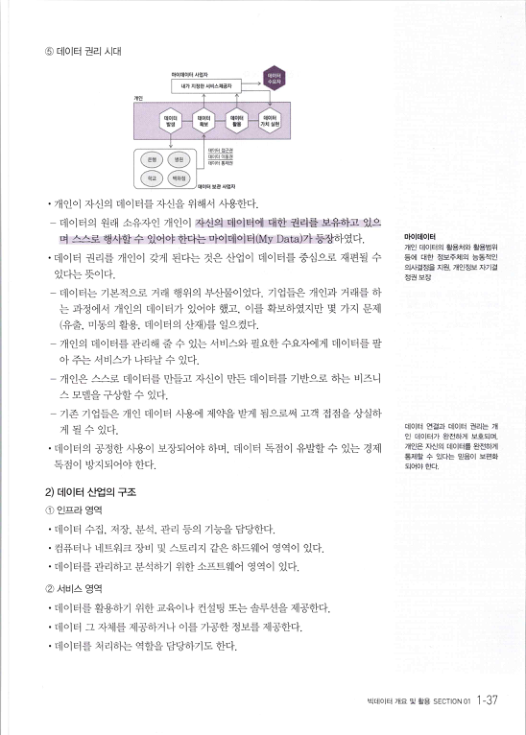
⑤ 데이터 권리 시대 犁잎髥 마이데이터 사업자 내가 지정한 서비스제공자 큔｀ 개인 -

#### ∼ 
데이터 데이터 걘르／ II翼 데이터 데이터 발생 확보 ＼∼／ \,// 데이터 접근권 데이터 이동권 데미터 통저l권 / 데이터 보관 사업자

- 개인이 자신의 데이터를 자신을 위해서 사용한다．
- 데이터의 원래 소유자인 개인이 자신의 데이터에 대한 권리를 보유하고 있으
며 스스로 행사할 수 있어야 한다는 마이데이터（My Data）가 등장하였다．

- 데이터 권리를 개인이 갖게 된다는 것은 산업이 데이터를 중심으로 재편될 수
있다는 뜻이다．

- 데이터는 기본적으로 거래 행위의 부산물이었다 . 기업들은 개인과 거래를 하
#### 는 과정에서 개인의 데이터가 있어야 했고 , 이를 확보하였지만 몇 가지 문제
#### （유출 , 미동의 활용 , 데이터의 산재）를 일으켰다．
- 개인의 데이터를 관리해 줄 수 있는 서비스와 필요한 수요자에게 데이터를 팔
아 주는 서비스가 나타날 수 있다．

- 개인은 스스로 데이터를 만들고 자신이 만든 데이터를 기반으로 하는 비즈니
스 모델을 구상할 수 있다．

- 기존 기업들은 개인 데이터 사용에 제약을 받게 됨으로써 고객 접점을 상실하
게 될 수 있다 .

- 데이터의 공정한 사용이 보장되어야 하며 , 데이터 독점이 유발할 수 있는 경제
독점이 방지되어야 한다． 2) 데이터 산업의 구조 ① 인프라 영역

#### · 데이터 수집 , 저장 , 분석 , 관리 등의 기능을담당한다．
- 컴퓨터나 네트워크 장비 및 스토리지 같은 하드웨어 영역이 있다．
- 데이터를 관리하고 분석하기 위한 소프트웨어 영역이 있다．
② 서비스 영역

- 데이터를 활용하기 위한 교육이나 컨설팅 또는 솔루션을 제공한다．
- 데이터 그 자쳬를 제공하거나 이를 가공한 정보를 제공한다．
- 데이터를 처리하는 역할을 담당하기도 한다．
> 마이데이터
> 개인 데이터의 활용처와 활용범위 
등에 대한 정보주체의 능동적인

> 의사결정을 지원 . 개인정보 자기결
> 정권 보장
> 데이터 연결과 데이터 권리는 개 
인 데이터가 완전하게 보호되며，

> 개인은 자신의 데이터를 완전하게 
통제할 수 있다는 믿음이 보편화

> 되어야 한다．
> 빅데이터 개요및 활용 SECTION 01 1 -37
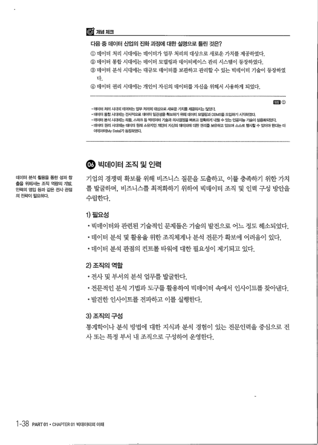
다음 중 데이터 산업의 진화 과정에 대한 설명으로 틀린 것은？ ① 데이터 처리 시대에는 데이터가 업무 처리의 대상으로 새로운 가치를 제공하였다． ② 데이터 통합 시대에는 데이터 모델링과 데이터베이스 관리 시스템이 등장하였다． ③ 데이터 분석 시대에는 대규모 데이터를 보관하고 관리할 수 있는 빅데이터 기술이 등장하였 다． ④ 데이터 권리 시대에는 개인이 자신의 데이터를 자신을 위해서 사용하게 되었다．

- 데이터 처리 시대의 데이터는 업무 처리의 대싱으로 사煌운 가치틀 저居하지는 않았다． 
. 데이터 통합 시대에는 전사적으로 데이터 일관성율확보하기 위해 데이터 모델링과 DBMS틀도입하기 시작하였다．

- 데이터 분석 시대에는 하듭. 스파크 등 빅데이터 기술과 의사결觸 빠트1 정확하거l 내릴 수 있논인공지능 기술이 상용화되었다． 
- 데이터 권리 시대에는 데이터 원래 소유자인 개인이 자신의 데이터에 대한 권리를 보유하고 있으며 스스로 행사할 수 있어야 흰ㅐ가는 마
이데이터（My Dala）가 등창하였다． .

빅데이터 조직 및 인력 기업의 경챙력 확보를 위해 비즈니스 질문을 도출하고 , 이를 충족하기 위한 가치 를 발굴하며 , 비즈니스를 최적화하기 위하여 빅데이터 조직 및 인력 구성 방안을 데이터 분석 활용을 통한 성과 창 출을 위해서는 조직 역량의 개발． 인력의 영입 등과 같은 전사 관점 으I 전략이 필요하다． 수립한다． 1）필요성

- 빅데이터와 관런된 기술적인 문제들은 기술의 발전으로 어느 정도 해소되었다．
- 데이터 분석 및 활용을 위한 조직쳬계나 분석 전문가 확보에 어려움이 있다．
- 데이터 분석 관점의 컨트롤 타워에 대한 필요성이 제기되고 있다．
2) 조직의 역할

- 전사 및 부서의 분석 업무를 발굴한다．
- 전문적인 분석 기법과 도구를 활용하여 빅데이터 속에서 인사이트를 찾아낸다．
- 발견한 인사이트를 전파하고 이를 실행한다．
3) 조직의 구성 통계학이나 분석 방법에 대한 지식과 분석 경험이 있는 전문인력을 중심으로 전 사 또는 특정 부서 내 조직으로 구성하여 운영한다． 1-38 PART01 . CHAPTER01 빅데이터의 이해

> ．레 ①
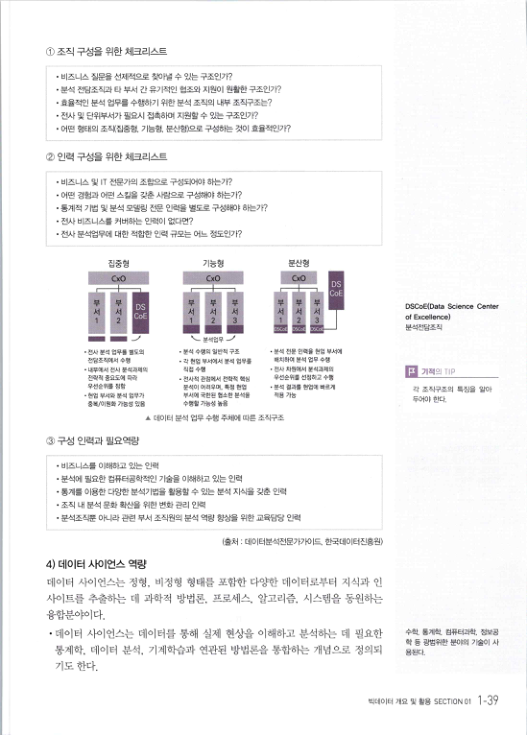
① 조직 구성을 위한 체크리스트

- 비즈니스 질문을 선제적으로 짖아낼 수 있는 구조인가？
- 분석 전담조직과 타 부서 간 유기적인 협쪼 지원이 원활한 구조인가？
- 효율적인 분석 업무를 수행하기 위한 분석 조직의 내부 조작구조는？
- 전사 및 단위부서가 필됴씨 접촉하며 지원할 수 있는 구조인가？
- 어떤 형태의 조직（집중형 , 기능형 , 분산형）으로 구성하는 것이 효율적인가？
② 인력 구성을 위한 체크리스트

- 비즈니스 및 ㅁ 전문가의 조합으로 구성되어야 하는가？
- 어떤 경험과 어떤 스킬을 갖춘 사람으로 구성해야 하는가？
- 통계적 기법 및 분석 모델링 전문 인력을 별도로 구성해야 하는가？
- 전사 비즈니스를 커버하는 인력이 없다면？
- 전사 분석업무에 대한 적합한 인력 규모는 어느 정도인가？
분산형 집중형

- 
- 
_J `- 분석업무 -/

* 분석 수행의 일반적 구조
- 분석 전문 인력을 현업 부서에 
배치하여 분석 업무 수행

- 전사 분석 업무를 별도의 
전담조직에서 수행

- 각 현업 부서에서 분석 업무를 
직접 수행 . 전사 차원에서 분석과제의 우선순위를 선정하고 수행

- 내부에서 전사 분석과제의 
전략적 중요도에 따라 우선순위를 정함

- 전사적 관점에서 전략적 핵심 
분석이 어려우며 , 특정 현업 부서에 국한된 협소한 분석올 수행할 가능성 높음

* 분석 결과를 현업에 빠르게 
적용 가능

- 현업 부서와 분석 업무가
중복／이원화 가능성 있음 ▲ 데이터 분석 업무 수행 주체에 따른 조직구조 ③ 구성 인력과 필요역량

- 비즈니스를 이해하고 있는 인력
- 분석0ㅔ 필요한 컴퓨터공학적인 기술을 이해하고 있는 인력
- 통계를 이용한 다양한 분석기법을 횔용할 수 있는 분석 지식을 갖춘 인력
- 조직 내 분석 문화 확산을 위한 변화 관리 인력
- 분석조직뿐 애ㅢ라 관련 부서 조직원의 분석 역량 향상을 위한 교육담당 인력
（출처 : 데이터분쵸拓문가가이드， 한국데이터진흥원） 4) 데이터 사이언스 역량 데이터 사이언스는 정형 , 비정형 형태를 포함한 다양한 데이터로부터 지식과 인 사이트를 추출하는 데 과학적 방법론 , 프로세스 , 알고리즘 , 시스템을 동원하는 융합분야이다．

- 데이터 사이언스는 데이터를 통해 실제 현상을 이해하고 분석하는 데 필요한
통계학 , 데이터 분석 , 기계학습과 연관된 방법론을 통합하는 개념으로 정의되 기도 한다．

> DSCoE(Data Science Center 
of Excellence) 분석전담조직

> 기적의 TIP
> 각 조직구조의 특징을 알아
> 두어야 한다．
> 수학 , 통계학 , 컴퓨터과학. 정보공 
학 등 광범위한 분야의 기술이 사

> 용된다．
> 빅데이터개요및활용 SECTION 01 ㅏ 
9

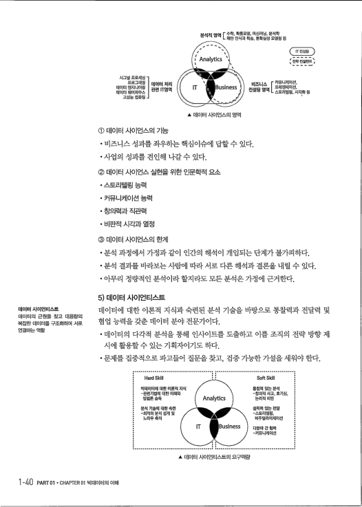
#### 분석적염역 〔纛騎驪뱁 
등 시그널 프로세싱' 프로그래밍 데이터 엔지니어링 데이터 웨어하우스 고성능 컴퓨팅 - ▲ 데이터 사이언스의 영역 ① 데이터 사이언스의 기능

- 비즈니스 성과를 좌우하는 핵심이슈에 답할 수 있다．
- 사업의 성과를 견인해 나갈 수 있다．
② 데이터 사이언스 실현을 위한 인문학적 요소

- 스토리텔링 능력
- 커뮤니케이션 능력
- 창의력과 직관력
- 비판적 시각과 열정
③ 데이터 사이언스의 한계

- 분석 과정에서 가정과 같이 인간의 해석이 개입되는 단계가 불가피하다．
- 분석 결과를 바라보는 사람에 따라 서로 다른 해석과 결론을 내릴 수 있다．
- 아무리 정량적인 분석이라할지라도 모든 분적은 가정에 근거한다．
5) 데이터 사이언티스트 데이터에 대한 이론적 지식과 숙런된 분석 기술을 바탕으로 통찰력과 전달력 및 데［터 사이언티스트 데이터의 근원을 찾고 대용량의 협업 능력을 갖춘 데이터 분야 전문가이다． 복잡한 데이터를 구조화하며 서로 연결하는 역할

- 데이터의 다각적 분석을 통해 인사이트를 도출하고 이를 조직의 전략 방향 제
시에 활용할 수 있는 기획자이기도 하다．

- 문제를 집중적으로파고들어 질문을찾고 , 검증 가능한 가설을세워야한다．
Hard 하州 빅데이터에 대한 이론적 지식 －관련기법에 대한 이해와 밤법론 습득 분석 기술에 대한 숙련 －최적의 분석 설계 및 노하우축적 ▲ 데이터 사이언티스트의 요구역량 1 -40 PART 01 'CHAPTER 01 빅데이터의 이해

> '．전락컨설턴트겋
# uI qA［鑿O
- - I jjEflOj,
L AI ,j , *

> Soft Skill
> 통찰력 있는 분석 
－창의적사고 , 호기심， 논리적 비판

> 설득력 있는 전달 
－스토리텔링， 비주얼라이제이션

> 다분야 간 협력 
－커뮤니케이션 I

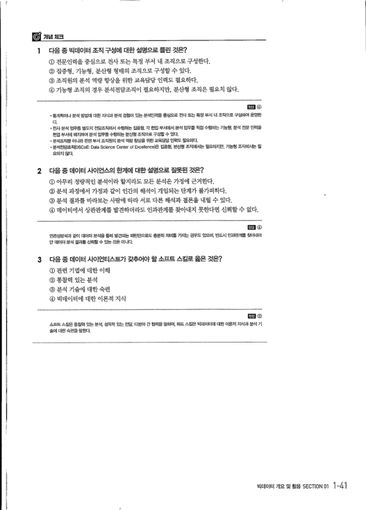
1 다음 중 빅데이터 조직 구성에 대한 설명으로 틀린 것은？ ① 전문인력을 중심으로 전사 또는 특정 부서 내 조직으로 구성한다． ② 집중형 , 기능형 , 분산형 형태의 조직으로 구성할수 있다． ③ 조직원의 분석 역량 향상을 위한 교육담당 인력도 필요하다． ④ 기능형 조직의 경우 분석전담조직이 필요하지만 , 분산형 조직은 필요치 않다．

- 통계학이나 분석 방법에 대한 지식과 분석 경험이 있는 분석인력을 중심으로 전사 또는 특정 부서 내 조직으로 구성하여 운영한
다．

- 전사 분석 업무틉 별도의 전담조직에서 수행하는 집중형 . 각 현업 부서에서 분석 업무를 직접 수행하는 기능형． 분석 전문 인력을
현업 부서에 배치하여 분석 업무름 수행하는 분산형 조직으로구성할 수 있다．

- 분석조직뿐 아니라 관련 부서 조직원의 분석 역랑 향상을 위한 교육담당 인력도 필요하다，
- 분석전담조직（DSCoE: Deta Science Center of Excellence）은 髓형 . 분산형 조직에서는 필요하지만， 기능형 조직에서는 필
요하지않다.

2 다음 중 데이터 사이언스의 한계에 대한설명으로 잘못된 것은？ ① 아무리 정량적인 분석이라 할지라도 모든 분석은 가정에 근거한다． ② 분석 과정에서 가정과 같이 인간의 해석이 개입되는 단계가 불가피하다． ③ 분석 결과를 바라보는 사람에 따라 서로 다른 해석과 결론을 내릴 수 있다． ④ 데이터에서 상관관계를 발견하더라도 인과관계를 찾아내지 못한다면 신뢰할 수 없다． 연관성분석과 같oj 데이터 분석을 통해 발견되는 패턴만으로도 충분히 의미를 가지는 경우도 있으며， 반드시 인과관계를 찾아내야 안 데이터 분석 결과를 신뢰할 수 있는 것은 아니다． 3 다음중 데이터 사이언티스트가갖추어야 할소프트스킬로옳은 것은？ ① 관련 기법에 대한 이해 ② 통찰력 있는 분석 ③ 분석 기술에 대한 숙련 ④ 빅데이터에 대한 이론적 지식 소프트스킬은 통찰력 있는 분석． 설득력 있는 전달 . 다분야 간 협력을 알하며 . 하드 스킬은 빅데이터에 대한 이론적 지식과 분석 기 술ioll 대한 숙련을 말힌빠．

> j ④
> El ④
> ㅁ ②
> 빅데이터개요및활용SECTION 01 1-41
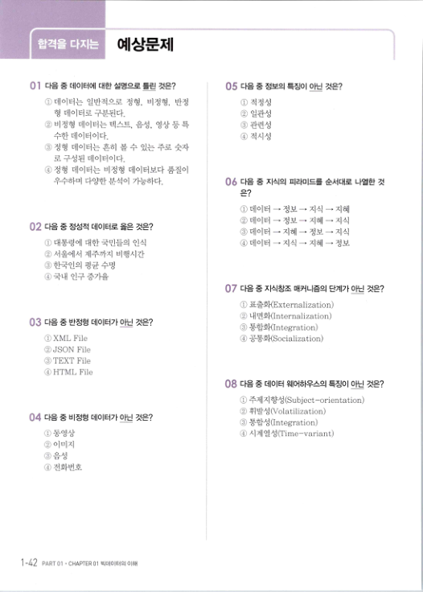
## 예상문제
01 다음 중 데이터에 대한 설명으로 틀린 것은？ 05 다음 중 정보의 특징이 아닌 것은？ ①데이터는 일반적으로 정형， 비정형， 반정 형 데이터로 구분된다． ②비정형 데이터는 텍스트 , 음성 , 영상등특 수한 데이터이다． ③ 정형 데이터는 흔히 볼 수 있는 주로 숫자 로 구성된 데이터이다． ④정형 데이터는 비정형 데이터보다 품질이 우수하며 다양한 분적이 가능하다． ① 적정성 ② 일관성 ③ 관련성 ④ 적시성 06 다음 중 지식의 피라미드를 순서대로 나열한 것 은？

#### ① 데이터 → 정보 → 지식 → 지혜 
② 데이터 → 정보 → 지혜 → 지식 ③ 데이터 －→ 지혜 → 정보 → 지식 ④ 데이터 → 지식 → 지혜 → 정보 02 다음 중 정성적 데이터로 옳은 것은？ ① 대통령에 대한 국민들의 인식 ② 서울쩨서 제주까지 비행시간 ③ 한국인의 평균 수명 ④국내 인구증가율 07 다음 중 지식창조 매커니즘의 단계가 아닌 것은？ ① 표출화〈Externalization) ② 내면화＜Internalization) ③ 통합화＜Integration) ④ 공통화＜Socializatio미 03 다음 중 반정형 데이터가 아닌 것은？ ①XML File ②JSON File ③TEXT File ④HTML File 08 다음 중 데이터 웨어하우스의 특징이 아닌 것은？ ① 주제지향성（Subject-orientation) ② 휘발성（Volatilization) ③ 통합성（Integration) ④ 시계열성（Time-variant) 04 다음 중 비정형 데이터가 아닌 것은？ ①동영상 ② 이미지 ③음성 ④ 전화번호 1-42 PART01 . CHAPTERQ1 빅데이터의 이해

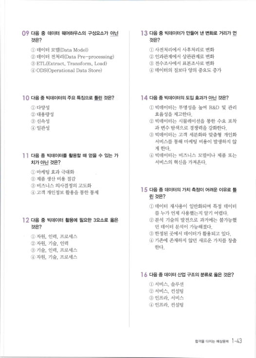
다음 중 빅데이터가 만들어 낸 변화로 거리가 먼 다음 중 데이터 웨어하우스의 구성요소가 아닌 것은？ 것은？ ① 사전처리에서 사후처리로 변화 ② 인과관계에서 상관관계로 변화 ③ 전수조사에서 표본조사로 변화 ④ 데이터의 질보다 양의 중요도 증가 ① 데이터 모델①ata Model) ② 데이터 전처리（Data Pre-processing) ③ETL(Extract, Transform, Load) ④ODS(Operational Data Store) 10 다음 중 빅데이터의 주요 특징으로 틀린 것은？ . 4 다음 중 빅데이터의 도입 효과가 아닌 것은？ ① 빅데이터는 투명성을 높여 R&1〕 및 관리 효율성을 제고한다． ② 빅데이터는 시뮬레‘뗘쵸을 통한 수요 포착 과 변수 탐색으로 경쟁력을 강화한다． ③ 빅데이터는 고객 세분화와 맞춤형 개인화 서비스를 통해 마케팅 비용이 발생하지 않 게한다． ④ 빅데이터는 비즈니스 모델이나 제픔 또는 ① 다양성 ② 대용량성 ③ 신속성 ④ 일관성 다음 중 빅데이터를 활용할 때 얻을 수 있는 가 치가 아닌 것은？ 서비스의 혁신을 가져온다． ① 마케팅 효과 극대화 ． ② 제품 생산 비용 절감 ③ 비즈니스 의사결정의 고도화 ④ 고객 개인정보 활용을 통한 통제 1 5 다음 중 데이터의 가치 측정이 어려운 이유로 틀 린 것은？ ①데이터 재사용이 일반화되며 특정 데이터 를 누가 언제 사용했는지 알기 어렵다． ②분적 기술의 발전으로 과거에는 불가능했 던 데이터 분석이 가능해졌다． ③ 한정된 곳에서 데이터가 활용되고 있다． ④ 기존에 존재하지 않던 새로운 가치를 창출 I 2 다음 중 빅데이터 활용에 필요한 3요소로 옳은 것은？ ①자원 , 인력 , 프로세스 ②자원 , 기술 , 인력 ③기술 , 인력 , 프로세스 한다． ④자원 , 기술 , 프로세스 16 다음 중 데이터 스l업 구조의 분류로 옳은 것은？ ①서비스 , 솔루션 ②서비스 , 컨설팅 ③ 인프라 , 小스 ④인프라 , 컨설팅

> 합격을 다지는 예상문제 ㄴ43
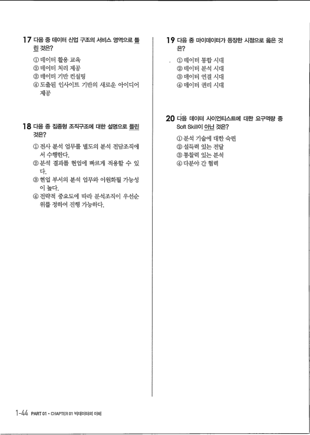
#### 17 다음 중 데이터 스l덥 구조의 서비스 영역으로 틀 
린 것은？ 1 ' 다음 중 마이데이터가 등장한 시점으로 옳은 것 은？ ① 데이터 활용 교육 ②데이터 처리 제공 ③ 데이터 기반 컨설팅 ④도출된 인사이트 기반의 새로운 아이디어 제공 ① 데이터 통합 시대 ② 데이터 분석 시대 ③ 데이터 연결 시대 ④데이터 권리 시대 20 다음 데이터 사이언티스트에 대한 요구역량 중 Soft Ski!I(기 아닌 것은？ 18 다음 중 집중형 조직구조에 대한 설명으로 틀린 것은？ ①분적 기술에 대한숙련 ②설득력 있는 전달 ③ 통찰력 있는 분석 ④ 다분야 간 협력 ① 전사 분석 업무를 별도의 분석 전담조직에 서 수행한다． ②분석 결과를 현업에 빠르게 적용할 수 있 다． ③ 현업 부서의 분석 업무와 이원화될 가능성 이높다． ④ 전략적 중요도에 따라 분석조직이 우선순 위를 정하여 진행 가능하다． 1-44 PART01 . CHAPTER01 빅데이터의 이해

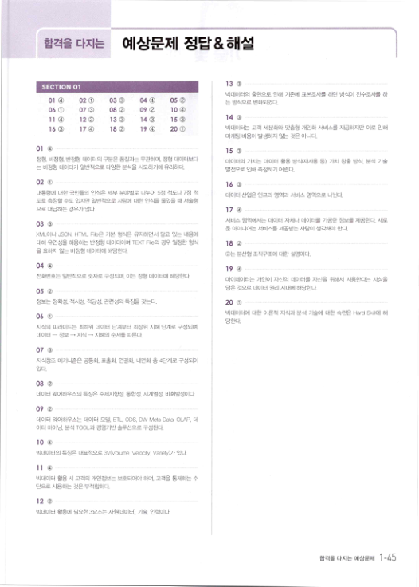
## 예상문제 정답＆해설
#### 합격을 다지는
13 （軫 ……∼ … …一………………………… 빅데이터의 출현으로 인해 기죈게 표본조사를 하던 방식이 전수조사를 하 는 방식으로 변화되었다． 05 ② 04 ④ 03 ③ 01 ④ 02D 07 ③ 06 D 08 ② 09 (2;I 10 ④ 14 曰） 1 3 ③：) 14 （쵸；} 1 5 （軫 11 ④ 12 ② 빅데이터는 고객 세분화와 맞춤형 개인화 서비스를 제공하지만 이로 인해 19 ④ 16 ③ 17 ④ 18 ② 20 ① 마케팅 비용이 발생하지 않는 것은 아니다． 01 ④ 15 （軫 … …∼…… … ∼… ……………∼…… 정형． 비정형 . 반정형 데이터의 구분은 품질과는 무관하며 . 정형 데이터보다 는 비정형 데이터가 일반적으로 다양한 분석을 시도하기에 유리하다． 데이터의 가치는 데이티 활용 방식（재l사용 등） . 가치 창출 방식 . 분석 기술 발전으로 인해 측정하기 어렵다． 02 <D ……… …… .

… … …… … 16 c) 대통령에 대한 국민들의 인삭은 세부 분야별로 나누어 5점 척도나 7점 척 도로 측정할 수도 있지만 일반적으로 사람에 대한 인삭을 물었을 때 서술형 으로 대답하는 경우가 많다． 데이터 산업은 인프라 영역과 서비스 영역으로 나뉜다， 17 ④ 서비스 영역에서는 데이터 자체나 데이터를 가공한 정보를 제공한다． 새로 운 아이디어는 세키스를 저꼼받는 사람이 생각해야 한다． 03 ③ …－… ∼ ……→ XML이나 JSON. HTML File은 기본 형식은 유지하면서 담고 있는 내剔 대해 유연성을 하용하는 반정형 데이터이며 TEXL File의 경우 일정한 형식 을 요하지 않는 비정형 데이터에 해당한다， 18 ② ②는 분산형 조작구조에 대한 설명이다． 04 ④ …∼ … …… … 19 ④ 전화번호는 일반적으로 숫자로 구성되며 . 이는 정형 데이터에 해당한다． 마이데이터는 개인이 자신의 데이터를 자신을 위해서 사용한다는 사상을 담은 것으로 데이터 권리 시대에 해당한다． 05 ② … … …………… ……… 정보는 정확성． 적시성 . 적당성 . 관련성의 특징을 갖는다． 20 < D ... . ...... ............................... ..... .. .. .. . . .. . . ……… …………………… 빅데이터에 대한 이론적 지식과 분석 기술에 대한 숙련은 Hard Ski∥에 해 06 ① …… …………… … ………∼ … …… 당한다． 지식의 피라미드는 최하위 데이터 단켸부터 최상위 지혜 단계로 구성되며． 데이터 → 정보 → 지식 → 지혜의 순서를 따른다． 07 α） … … 지식창조 애커니즘은 공통화． 표출화， 연결화， 내면화 총 4단계로 구성되어 있다． 08 ② 데이터 웨어하우스의 특징은 주제지향성． 통합성 , 시계열성 , 비휘발성이다． 09 ②  .

②.

②....... ........... . . ..... ....... ....... . ...... . . ....... . .

.

.. .. ...... ... ... . . ..... ........... .

데이터 웨어하우스는 데이터 모델 . ET니 ODS. DW Meta Data OLAP . 데 이터 매기닝． 분석 TOOL과 경영기반 솔루션으로 구성된다， 10 ④ 빅데이터의 특징은 대표적으로 3V(Volume, Velocity, Variety）가 있다， 11 빅데이터 활용 시 고객의 개인정보는 보호되어야 하며 , 고객을 퉁제하는 수 단으로 사용하는 것은 부적합하다』 12 ② 빅데이터 활용에 필요한 3요소는 자원（데이터） . 기술． 인력이다．

> 합격을다지는예상문제 ㄴ45
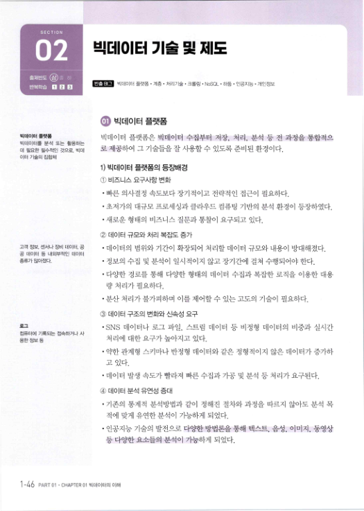
# SECTION 02
# 빅데이터 기술 및 제도
출저빈도 ㅐ 빈술 태 그 빅데이터 플랫폼 · 계층 · 처리기술 · 크롤링 · NOSQL · 하둡 · 인공지능 · 개인정보 반복학습 · u .

#### `, 빅데이터 플랫폼
빅데이터 플랫폼은 빅데이터 수집부터 저장 , 처리 , 분석 등 전 과정을 통합적으 빅데이터 플랫폼 빅데이터를 분석 또는 활용하는 로 제공하여 그 기 술 들 흘 잘 사용할 수 있도록 준비된 환경이다． 데 필요한 필수적인 것으로， 빅데 이터 기술의 집합체 1) 빅데이터 플랫폼의 등장배경 <j.) 비즈니스 요구사항 변화

- 빠른 의사결정 속도보다 장기적이고 전략적인 접근이 필요하다．
- 초저가의 대규모 프로세싱과 클라우드 컴퓨팅 기반의 분석 환경이 등장하였다．
- 새로운 형태의 비즈니스 질문과 통찰이 요구되고 있다．
② 데이터 규모와 처리 복잡도 증가

- 데이터의 범위와 기간이 확장되어 처리할 데이터 규모와 내용이 방대해졌다．
고객 정보， 센서나 장비 데이터 , 공 공 데이터 둥 내외부적인 데이터

- 정보의 수집 및 분석이 일시적이지 않고 장기간에 걸쳐 수행되어야 한다．
종류가 않마졌다．

- 다양한 경로를 통해 다양한 형태의 데이터 수집과 복잡한 로직을 이용한 대용
량 처리가 필요하다 .

- 분산 처리가 불가피하며 이를 제어할 수 있는 고도의 기술이 필요하다 .
③ 데이터 구조의 변화와 신속성 요구

- SNS 데이터나 로그 파일 , 스트림 데이터 등 비정형 데이터의 비중과 실시간
로그 컴퓨터에 기록되는 잡속하거나 사 용한 정보 등 처리에 대한 요구가 높아지고 있다．

- 약한 관계형 스키마나 반정형 데이터와 같은 정형적이지 않은 데이터가 증가하 
고 있다．

#### · 데이터 발생 속도가 빨라져 빠른 수집과 가공 및 분석 등 처리가 요구된다 .
④ 데이터 분석 유연성 증대

- 기존의 통계적 분적방법과 같이 정해진 절차와 과정을 따르지 않아도 분적 목
적에 맞게 유연한 분석이 가능하게 되었다．

- 인공지능 기술의 발전으로 다양한 방법론을통해 텍스트 , 음성 , 이미지 , 동영상 
등 다양한 요소들의 분석이 가능하게 되었다 .

ㅏ 6 PART 01 . CHAPTER 01 빅데이터의 이해

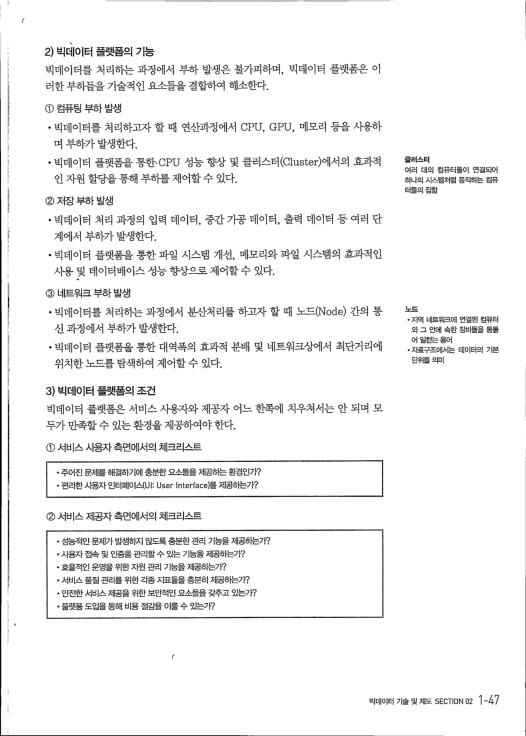
I 2) 빅데이터 플랫폼의 기능

#### 빅데이터를 처리하는 과정에서 부하 발생은 불가피하며 , 빅데이터 플랫폼은 이
러한 부하들을 기술적인 요소들을 결합하여 해소한다． ① 컴퓨팅 부하 발생

#### · 빅데이터를 처리하고자 할 때 연산과정에서 CPU, GPU , 메모리 등을 사용하
며 부하가 발생한다．

- 빅데이터 플랫폼을 통한．CPU 성능 향상 및 클러스터（Cluster）에서의 효과적
인 자원 할당을 통해 부하를 제어할 수 있다． ② 저장 부하 발생

#### · 빅데이터 처리 과정의 입력 데이터 , 중간 가공 데이터 , 출력 데이터 등 여러 단
계에서 부하가 발생한다．

- 빅데이터 플랫폼을 통한 파일 시스템 개선 , 메모리와 파일 시스템의 효과적인
사용 및 데이터베이스 성능 향상으로 제어할 수 있다． ③ 네트워크 부하 발생

- 빅데이터를 처리하는 과정에서 분산처리를 하고자 할 때 노드（Node) 간의 통
신 과정에서 부하가 발생한다．

- 빅데이터 플랫폼을 통한 대역폭의 효과적 분배 및 네트워크상에서 최단거리에
위치한 노드를 탐색하여 제어할 수 있다． 3) 빅데이터 플랫폼의 조건 빅데이터 플랫폼은 서비스 사용자와 제공자 어느 한쪽에 치우쳐서는 안 되며 모 두가 만족할 수 있는 환경을 제공하여야 한다． ① 서비스 사용자 측면에서의 체크리스트

- 주어진 문제를 해결하기에 충분한 요소들을 제공하는 환경인가？
- 편리한 사용자 인터페이스（I-기： User htenf ace）를 저隧f하는가？
②서비스 제공자 측면에서의 체크리스트

- 성능적인 문제가 발생하지 않도록 충분한 관리 기능을 제공하는가？
- 사용자 접속 및 인증을 관리할 수 있는 기능을 제공하는가？
- 효율적인 운영을 위한 자원 관리 기능을 제공하는가？
- 서비스 품질 관리를 위한 각종 지표들을 豁t히 저꼼하는가？
- 안전한 서비스 제공을 위한 보안적인 요소들을 갖추고 있는가？
- 플랫폼 도입을 통해 비용 절감을 이룰 수 있는가？
r

> 클러스터
> 여러 대의 컴퓨터들이 연결되어 
하나의 시스템처럼 쭈t하는 컴퓨 터들의 집합

> L'-F 
- 지역 네트워크에 연결된 컴퓨터 
와 그 안에 속한 장비들을 통틀 어 일컫는 용어

- 자료구조에서는 데이터의 기본 
단위를 의미

> 빅데이터 기술및제도 SECTION 02 1 -47
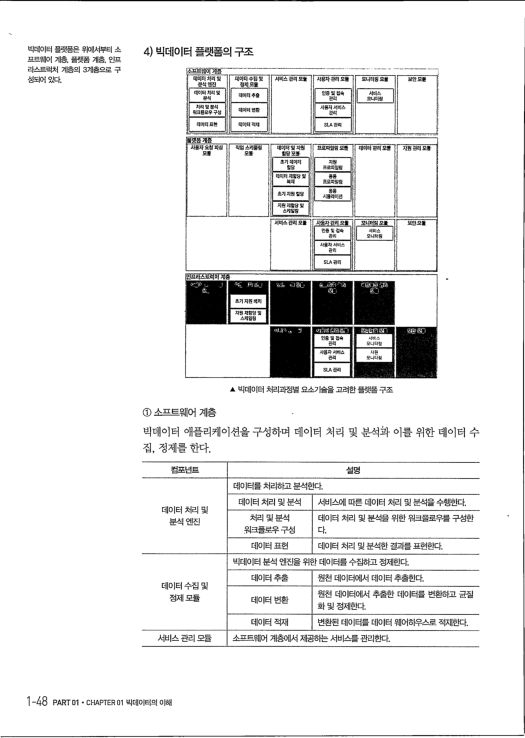
빅데이터 플랫폼은 위에서부터 소 프트웨어 계층, 플랫폼 계층. 인프 라스트럭처 계층의 3계층으로 구 성되어 있다． 4) 빅데이터 플랫폼의 구조

#### 뻘턺盡I및  죤 ' ""스관리모톄 ' 빠'관리모히 모니터링모뮬
데이터 처리 및 분석 엔전 데이터 처리 및 분석 데이터 추츌 처리 몇 분석 워크퓽로우 구성 사용지서비스 관리 데이터 표현 랫퐁계층 '隱XJJDJ 직엉壹孝출링 삡탭끓원 , 訂겯三파힙舊驪 데이터 재힐당 및 복제 차원 재힐당 및 스케일링 인죵 S( 접슥 관리 사용자서비스 관리 ▲ 빅데이터 처리과정별 요소기술을 고려한플랫폼 구조 ① 소프트웨어 계층 빅데이터 애플리케이션을 구성하며 데이터 처리 및 분석콰 이를 위한 데이터 수 집 , 정제를한다． 컴포넌트 설명 데이터를 처리하고 분석한다． 데이터 처리 및 분석 서비스에 따른 데이터 처리 및 분석을 수행힌F.

데이터 처리 및 처리 및 분석 데이터 처리 및 분석을 위한 워크플로우를 구성한 분석 엔진 워크플로우구성 다． 데이터 표헌 데이터 처리 및 분석한 결과를 표현한다． 빅데이터 분석 엔진을 위한 데이터를 수집하고 정제한다． 데이터 추출 원천 데이터에서 데이터 추출한다． 데이터 수집 및 데이터 변환 원천 데이터에서 추출한 데이터를 변환하고 균질 화 및 정제한다． 정제 모듈 데이터 적재 변환된 데이터를 데이터 웨어하우스로 적재한다． 서비스 관리 모듈 소프트뭬어 계층에서 저居하는 서비스를 관리한다． 1-48 PART01 . CHAPTER01 빅데이터의 이해

> 보안모묠
> 錯矗
> 이터관라모쨩 
자웡광리모돌

> A1UI
2I-41

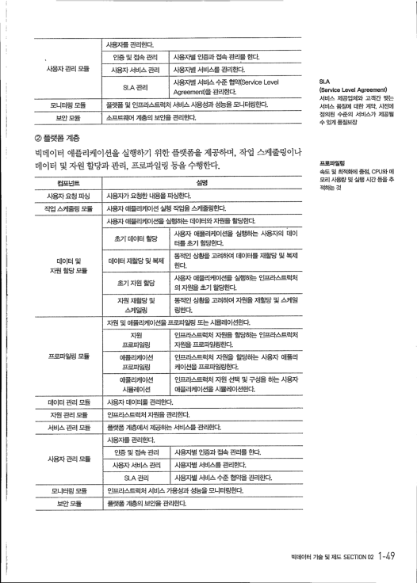
사용자를 관리한다． 인증 및 접속 관리 사용자별 인증과 접속 관리를 힌다.

사용자 관리 모듈 사용자 서비스 관리 사용자별 서비스를 관리한다． sr-I｀관리 사용자별 서비스 수준 협약（Service Level Agreement）을 관리한다． 모니터링 모듈 플랫폼 및 인프라스트럭처 서비스 사용셩과 성능을 모니터링한다． 보안모듈 소프트웨어 계층의 보안을 관리한다． ② 플랫폼 계층

#### 빅데이터 애플리케이션을 실행하기 위한플랫폼을 제공하며 , 작업 스케줄링이나
#### 데이터 및 자원 할당과 관리 , 프로파일링 등을 수행한다．
컴포넌트 설명 사용자요청 파싱 사용자가 요청한 내용을 파싱한다． 작업 스케줄링 모듈 사용자 애플리케이션 실행 작업을스케줄링힌다． 사용자 애플리케이션을 실행하는 데이터와 자원을 할당한다． 초기 데이터 할당 사용자 애플리케이션을 실행하는 사용자의 데이 터를 초기 할당한다． 데이터 재할당 및 복제 동적인 상황을 고려하여 데이터를 재할당 및 복제 데이터 및 한다． 자원 할당 모듈 초기 자원 할당 사용자 애플리케이션을 실행하는 인프라스트럭처 의 자원을 초기 힐淫l한다． 동적인 상황을 고려하여 자원을 재할당 및 스케일 자원 재할당 및 링한다． 스케일링 자원 및 애플리케이션을 프로파일링 또는 시뮬레이션한다． 인프라스트럭처 자원을 힐당하는 인프라스트럭처 자원 자원을覡느파일링힌다． 프로파일링 프로파일링 모듈 인프라스트럭처 자원을 할당하는 사용자 애플리 애플리케이션 케이션을 프로파일링한다． 프로파일링 인프라스트럭처 자원 선택 및 구성을 하는 사용자 애플리케이션 애플리케이션을 시뮬레이션한다． 시뮬레이션 데이터 관리 모듈 사용자 데이터를 관리한다． 자원 관리 모듈 인프라스트럭처 자원을 관리한다． 서비스 관리 모듈 플랫폼 계층게서 제공하는 서비스를 관리한다． 사용자를관리한다． 인증 및 접속 관리 사용자별 인증과 접속 관리를 힌다． 사용자 관리 모듈 사용자 서비스 관리 사용자별 서비스를 관리한다． SLI＼관리 사용자별 서비스 수준 협약을 관리한다． 모니터링 모듈 인프라스트럭처 서비스 가용성과 성능을 모니터링한다． 보안모듈 플랫폼 계층의 보안을 관리한다．

> StA 
(Service Level Agreement) 세ㅖ스 제공업체와 고객간 맺는 서비스 품질에 대한 계약. 사전에 정의된 수준의 서비스가 제공될 수 있게 품질보장

> 프로파일링 
속도 및 최적화에 중점 , cPu와 메 모리 사袈密 및 실행 시간 등을 추 적하는 것

> 빅데이터기술및제도SECTION 02 1-4?
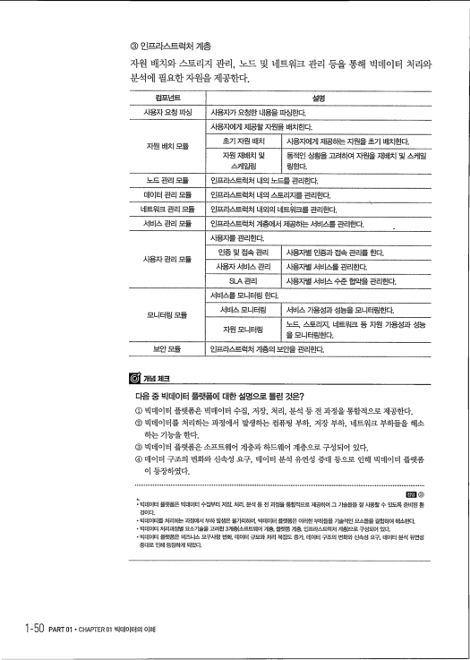
③ 인프라스트럭처 계층 자원 배치와 스토리지 관리 , 노드 및 네트워크 관리 등을 통해 빅데이터 처리와 분석에 필요한 자원을 제공한다． 컴포넌트 설명 사용자 요청 파싱 사용자가 요청한 내용을 파싱한다． 사용자에게 제공할 자원을 배치한다． 초기 자원 배치 사용자에게 제공하는 자원을 초기 배치힌다． 자원 배치 모듈 자원 재배치 및 동적인 상황을 고려하여 자원을 재배치 및 스케일 스케일링 링한다． 노드 관리 모듈 인프라스트럭처 내의 노드를 관리한다． 데이터 관리 모듈 인프라스트럭처 내의 스토리지를 관리한다． 네트워크 관리 모듈 인프라스트럭처 내외의 네트워크를 관리한다． 서비스 관리 모듈 인프라스트럭처 계층에서 제공하는 서비스를 관리한다． 사용자를관리한다． 인증 및 접속 관리 사용자별 인증과 접속 관리를 한다． 사용자 관리 모듈 사용자 서비스 관리 사용자별 서비스를 관리한다． sL^ 관리 사용자별 서비스 수준 협약을 관리한다． 서비스를 모니터링 한다． 서비스모니터링 서비스 가용성과 성능을 모니터링한다． 모니터링 모듈 자원 모니터링 노드， 스토리지 , 네트워크 등 자원 가용성과 성능 을모니터링한다． 보안모듈 인프라즈트럭처 계층의 보안을 관리한다． 다음 중 빅데이터 플랫폼에 대한 설명으로 틀린 것은？ ① 빅데이터 플랫폼은 빅데이터 수집 , 저장 , 처리 , 분석 등 전 과정을통합적으로 제공한다． ② 빅데이터를 처리하는 과정에서 발생하는 컴퓨팅 부하 , 저장 부하 , 네트워크 부하들을 해소 하는 기능을 한다． ③ 빅데이터 플랫폼은 소프트웨어 계층과 하드웨어 계층으로 구성되어 있다． ④ 데이터 구조의 변화와 신속정 요구 , 데이터 분석 유연성 증대 등으로 인해 빅데이터 플랫폼 이 등장하였다．

- 빅데이터 플랫폼은 빅데이터 수집부터 저장. 처리 . 분석 등 전 과정을 통합적으로 저旺釜하여 그 기쓺을 잘 사용할수 있도록 준비된 환
경이다．

- 빅데이터를 처리하는 과정에서 부하 발생은 불가피하며． 빅데이터 플랫폼은 이러한부하뚫 기술적인 요소돌을 결합하여 해소한다． 
- 빅데이터 처리과정별 요소기술을 고려한 3겨隱《소프트웨어 겨隱 . 플랫폼 겨隱. 인프라스트럭처 계충）으로 구성되어 있다． 
- 빅데이터 플랫퐁은 비즈니스 요＝i:z사항 변화. 데이터 구모와 처리 복찹도 증가. 데이터 구조의 변화와 신속성 요구. 데이터 분석 유연성
증다l로 인해 瘢上하게 되었다.

1-50 PARTU1 .CHAPTER01 빅데이터의 이해

#### El
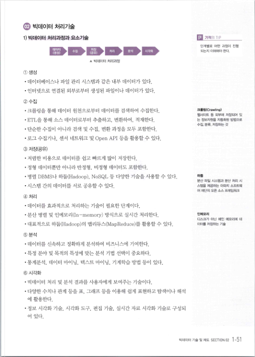
### c》 빅데이터 처리기술
1) 빅데이터 처리과정과 요소기술 ( ) ( lj ( ) ▲ 빅데이터 처리과정 ① 생성

- 데이터베이스나 파일 관리 시스템과 같은 내부 데이터가 있다．
- 인터넷으로 연결된 외부로부터 생성된 파일이나 데이터가 있다．
② 수집

- 크롤링을 통해 데이터 원천으로부터 데이터를 검색하여 수집한다．
- ETL을통해 소스 데이터로부터 추출하고 , 변환하여 , 적재한다．
- 단순한 수집이 아니라 검색 및 수집 , 변환 과정을 모두 포함한다．
- 로그 수집기나 , 센서 네트워크 및 Open API 등을 활용할 수 있다．
③ 저장（공유）

- 저렴한 비용으로 데이터를 쉽고 빠르게 많이 저장한다．
- 정형 데이터뿐만아니라반정형 , 비정형 데이터도포함한다．
- 병렬 DBMS나 하둡（Hadoop), NoSQL 등 다양한 기술을 사용할 수 있다．
- 시스템 간의 데이터를 서로 공유할 수 있다．
④ 처리

- 데이터를 효과적으로 처리하는 기술이 필요한 단계이다．
- 분산 병렬 및 인메모리（In -memory) 방식으로 실시간 처리한다．
- 대표적으로 하둡（Hadoop）의 맵리듀스（MapReduce）를 활용할 수 있다．
⑤ 분석

- 데이터를 신속하고 정확하게 분적하여 비즈니스에 기여한다．
- 특정 분야 및 목적의 특정에 맞는 분적 기법 선택이 중요하다．
- 통계분적 , 데이터 마이닝 , 텍스트마이닝 , 기계학습방법 등이 있다．
⑥ 시각화

- 빅데이터 처리 및 분적 결과를 사용자에게 보여주는 기술이다．
- 다양한 수치나 관계 등을 표 , 그래프 등을 이용해 쉽게 표현하고 탐색이나 해석
에 활용한다．

- 정보 시각화 기술 , 시각화 도구 , 편집 기술 , 실시간 자료 시각화 기술로 구성되
어 있다．

> . 
기적의 TIP

> 단계별로 어떤 과정이 진행
> 되는지 이해해야 한다．
> 크를링（Crawling)
> 웹사이트 등 외부에 저장되어 있 
는 정토따원을 자동화된 방법으로

> 수집 , 분류 . 저장하는 것
> 하둡
> 분산 파일 시스템과 분산 처리 시
> 스텡을 저隧各하는 아파치 소프트웨
> 어 재단의 오픈 소스 프레임워크
> 인메모리
> 디스크가 아닌 메인 메모리에 데
> 이터를 저장하는 기술
> 빅데이터 기술 및 제도 SECTION 02 1 -51
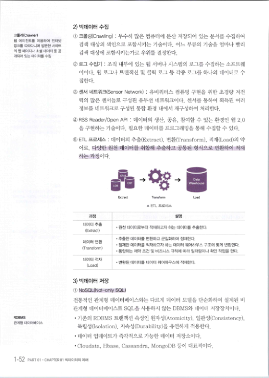
2) 빅데이터 수집

#### ① 크롤링（Crawling) : 무수히 많은 컴퓨터에 분산 저장되어 있는 문서를 수집하여
크롤러（Crawler) 웹 에이전트를 이용하여 인터넷 링크를 따라다니며 방문한 사이트 의 웹 페이지나 소셜 데이터 등 공 개되어 있는 데이터를 수집 검색 대상의 색인으로 포함시키는 기술이다 . 어느 부류의 기술을 얼마나 빨리 검색 대상에 포함시키는가로 우위를 결정한다．

#### ② 로그 수집기 : 조직 내부에 있는 웹 서버나 시스템의 로그를 수집하는 소프트웨
어이다 . 웹 로그나 트랜잭션 및 클릭 로그 등 각종 로그를 하나의 데이터로 수 집한다．

#### ③ 센서 네트워크（Sensor Network) : 유비쿼터스 컴퓨팅 구현을 위한 초경량 저전
력의 많은 센서들로 구성된 유무선 네트워크이다 . 센서를 통하여 획득된 여러 정보를 네트워크로 구성된 통합 환경 내에서 재구성하여 처리한다．

#### ④RSS Reader!야）en API : 데이터의 생산 , 공유 , 참여할 수 있는 환경인 웹 2.0 
을 구현하는 기술이다 . 필요한 데이터를 프로그래밍을 통해 수집할 수 있다．

#### ⑤ETL 프퇘스 : 데이터의 추출（Extract) , 변환（Transform) , 적재（Load）의 약
어로， 다양한 원천 데이터를 취합해 주줄하고 공통된 형식으로 변환하여 적재 하는 과정이다．

# Extract ，항）
# 締
Imnsform ▲ ㅌㅜㄴ 프로서l스 과정 설명 데이터 추출 (Extract)

- 원천 데이터로부터 적재하고자 하는 데이터를 추출한다．
I I 추출한데0I터를변환하고균질화하며 정제힌빠． 데이터변환 (Transform) I ' 정제한데이터를적재하고자하는데이터웨어하우스구조에맞게변환한다．

- 
' 통합하는제약조건및비즈니스규칙에따라필터링이나확인즈쩝믈한다． 데이터 적재 변환된데이터를데이터웨어하우스에적재힌峰． (Load) 3) 빅데이터 저장 0 NoSQL(Not-only SQL) 전통적인 관계형 데이터베이스와는 다르게 데이터 모델을 단순화하여 설계된 비 관계형 데이터베이스로 SQL을 사용하지 않는 DBMS와 데이터 저장장치이다．

- 기존의 RDBMS 트랜잭션 속성인 원자성（Atomicity) , 일관성（Consistency),
RDBMS 관계형 데이터베이스 독립성（Isolation) , 지속성（Durability）을유연하게 적용한다．

- 데이터 업데이트가 즉각적으로 가능한 데이터 저장소이다．
- Cloudata, Hbase, Cassandra, MongoDB 등이 대표적이다 .
ㅏ 2 PART01 . CHAPTER01 빅데이터의이해

> Load
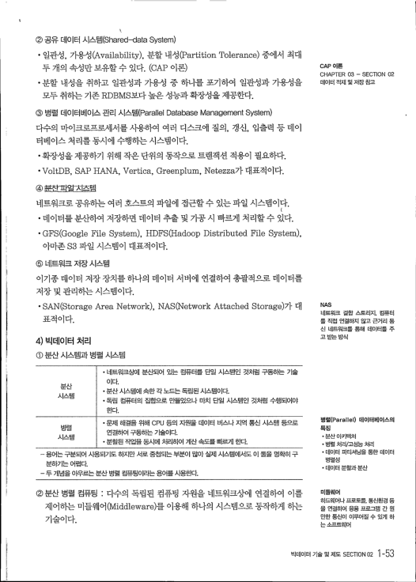
② 공유 데이터 시스템（Shared-data System)

- 일관성 , 가용성（Availability) , 분할 내성（Partition Tolerance) 중에서 최대
#### 두 개의 속성만 보유할 수 있다 . (CAP 이론）
- 분할 내성을 취하고 일관성과 가용성 중 하나를 포기하여 일관성과 가용성을
모두 취하는 기존 RDBMS보다 높은 성능과 확장성을 제공한다． ③ 병렬 데이터베이스 관리 시스템（Parallel Database Management System) 다수의 마이ㅋ로ㅍ푸세서를사용하여 여러 디스크에 질의 , 갱신 , 입출력 등 데이 터베이스 처리를 동시에 수행하는 시스템이다． 히확장성을 제공하기 위해 작은 단위의 동작으로 트랜잭션 적용이 필요하다．

- VoltDB, SAP }{ANA, Vertica, Greenpium, Netezza가대표적이다．
④분찼끄쎌즈隣El' "ㄲ트워크로공유하 "는여러 ㅎㅅ트의 파일에 접근할수 있는파일 시스템 ' 瞬．

- 데이터를 분산하여 저장하면 데이터 추출 및 가공 시 빠르게 처리할 수 있다．
- GFS(Google File System), HDFS(I-ladoop Distributed File System),
아마존 S3 파일 시스템이 대표적이다． ⑤ 네트워크 저장 시스템 이기종 데이터 저장 장치를 하나의 데이터 서버에 연결하여 총괄적으로 데이터를 저장 및 관리하는 시스템이다．

- SAN(Storage Area Network), NAS(Network Attached Storage)7f 대
표적이다． 4) 빅데이터 처리 ① 분산 시스템과 병렬 시스템

- 네트워크상에 분산되어 있는 컴퓨터를 단일 시스템인 것처럼 구동하는 기술
이다． 분산

- 분산 시스템에 속한 각 노드는 독립된 시스템이다．
시스템

- 독립 컴퓨터의 집합으로 만들었으나 마치 단일 시스템인 것처럼 수행되어야
한다．

- 문제 해결을 위해 CPU 등의 자원을 데이터 버스나 지역 통신 시스템 등으로
병렬 연결하여 구동하는 기술이다． 시스템

- 분할된 작업을 동시에 처리하여 계산 속도를 빠르게 한다．
- 용어는 구분되어 사용되기도 하지만 서로 중첩되는 부분이 많아 실제 시스템에서도 이 둘을 명확히 구
분하기는 어렵다．

- 두 개념을 아우르는 분산 병렬 컴퓨팅이라는 용어를 사용힌降．
#### ② 분산 병렬 컴퓨팅 : 다수의 독립된 컴퓨팅 자원을 네트워크상에 연결하여 이를
졔어하는 미들웨어（Middleware）를 이용해 하나의 시스템으로 동작하게 하는 기술이다．

> CAP 0［론
> CHAPTER 03 - SECTION 02
> 데이터 적재 및 저장 참고
> NAS 
네트워크 결합 스토리지 . 컴퓨터 를 직접 연결하지 않고 근거리 통 신 네트워크를 통해 데이터를 주 고 받는 방식

> 병렬（Parallel) 데이터베이스의
> 특징 
. 분산 아키텍처

- 병렬 처리／고상능 처리 
- 데이터 파티셔닝을 통한 데이터
> 병렬성 
. 데이터 분할과 분산

> 미들웨어
> 하드뭬에ㅙ프로토콜 , 통신환경 등 
을 연결하여 응용 프로그램 간 원

> 만한 통신이 이루어질 수 있게 하 
는소프트웨어

> 빅데이터기술및제도SECTION 02 1 -53
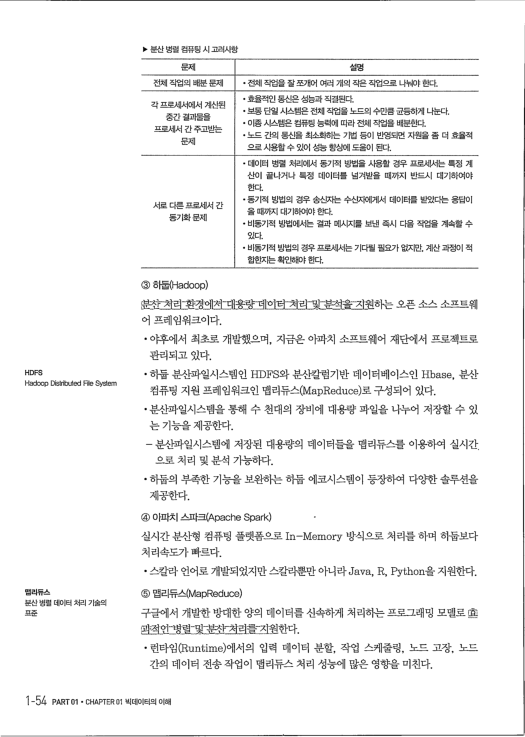
》 분산 병렬 컴퓨팅 시 고려사항 문제 설명 전체 작업의 배분 문제

- 전체 작업을 잘 쪼개어 여러 개의 작은 작업으로 나눠야 힌다．
- 효율적인 통신은 성능과 직결된다． 
- 보통 단일 시스템은 전체 작업을 노드의 수만큼 磎릊하게 나눈다． 
- 이종 시스템은 컴퓨팅 능력에 따라 전체 작업을 배분한다． 
- 노드 간의 통신을 최소화하는 기법 등이 반영되면 자원을 좀 더 효율적
각 프로세서에서 계산된 중간 결과물을 프로제서 간 주고받는 문제 으로 사용할 수 있어 성능 향상에 도움이 된다．

- 데이터 병렬 처리에서 동기적 방법을 사용할 경우 璽세서는 특정 계
산이 끝나거나 특정 데이터를 넘겨받을 때까지 반드시 대기하여야 힌다．

- 동기적 방법의 경우 。크자는 수신자에게서 데이터를 받았다는 응답이 
올 때까지 대기하여야 한다．

- 비동기적 방법에서는 결과 메시지를 보낸 즉시 다음 작업을 계속할 수
서로 다른 盤l세서 간 동기화문제 있다．

- 비동기적 방법의 경우 뜨툐：제서는 기다릴 필요가 0-w［지만 , 계산 과정이 적
합한지는 확인해야 한다． ③ 하둡여adoop) 纏왓처“리－환켱，엣서ㅍ대[E용三링＝데"이터꺼’리－멓耉백을 지워하는 오픈 소스 소프트웨 어 프레임워크이다．

- 야후에서 최초로 개발했으며 , 지금은 아파치 소프트웨어 재단에서 프로젝트로
관리되고 있다． HDFS Hadoop Distributed File System

- 하둡 분산파일시스템인 HDFS와 분산칼럼기반 데이터베이스인 Hbase, 분산
컴퓨팅 지원 프레임워크인 맵리듀스（MapReduce）로 구성되어 있다．

- 분산파일시스템을 통해 수 천대의 장비에 대용량 파일을 나누어 저장할 수 있 
는 기능을 제공한다．

- 분산파일시스템에 저장된 대용량의 데이터들을 맵리듀스를 이용하여 실시간．
으로 처리 및 분석 가능하다．

- 하둡의 부족한 기능을 보완하는 하둡 에코시스템이 등장하여 다양한 솔루션을
제공한다 .

④ 아파치 스파크（Apache Spark)

#### 실시간 분산형 컴퓨팅 플랫폼：2 In-Memory 방식으로 처리를 하며 하둡보다
처리속도가빠르다．

- 스칼라언어로개발되었지만스칼라뿐만아니라Java, R, Python을지원한다．
맵리듀스 ⑤ 맵리듀스（M미〕Reduce) 분산 병렬 데이터 처리 기술의 표준 구글에서 개발한 방대한 양의 데이터를 신속하게 처리하는 프로그래밍 모델로 夔

#### 와펴읜：」豊：및瓷 〔긔괴를：최원한다 .
- 런타임（Runtime）에서의 입력 데이터 분할 , 작업 스케줄링 , 노드 고장 , 노드
간의 데이터 전송 작업이 맵리듀스 처리 성능에 많은 영향을 미친다． 1-54 PART01 'CI-IAPTER01 빅데이터의 이해

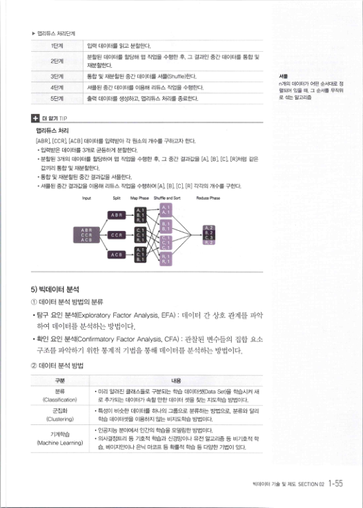
듄 맵리듀스 처리단계 1단계 입력 데이터를 읽고 분할한다． 2단계 분할된 데이터를 할당해 맵 작업을 수행한 후 . 그 결과인 중간 데이터를 통합 및 재분할한다． 3단계 통합 및 재분할된 중간 데이터를 셔플〈Shuffle）한다： 4단계 셔플된 중간 데이터를 이용해 리듀스 작업을 수행한다． 5단계 출력 데이터를 생성하고． 맵리듀스 처리를 종료한다． ri 얇：7[ 〕 P 맵리듀스 처리 [ABR] , [CCR] , [ACB] 데이터를 입력벋肄가 각 원소의 개수를 구하고자 한다．

- 입력받은 데이터를 3개로 磎옰하게 분할한다．
- 분할된 3개의 데이터를 할당하여 맵 작업을 수행한 후 , 그 중간 결과값을 [Al [Bi [Cl 腕］처럼 같은
값끼리 통합 및 재분할한다．

- 통합 및 자븐할된 중간 결과값을 셔플한다．
- 셔플된 중간 결과값을 이용해 리듀스 작업을 수행하여 [Al [Bl [C], [R] 각각의 개수를 구한다．
hput Split M뱌Phase Shuffbend Sort Reduce 마ese 5) 빅데이터 분석 ① 데이터 분석 방법의 분류

- 탐구 요인 분석（Exploratory Factor Analysis, EFA) : 데이터 간 상호 관계를 파악
하여 데이터를 분적하는 방법이다．

- 확인 요인 분석（Confirmatory Factor Analysis, CFA) : 관찰된 변수들의 집합 요소
구조를 파악하기 위한 통계적 기법을 통해 데이터를 분적하는 방법이다． ② 데이터 분석 방법 구분 내용

- 미리 알려진 클래스들로 구분되는 학습 데이터셋（Data Set）을 학습시켜 새 
로 추가되는 데이터가 속할 만한 데이터 셋을 찾는 지도학습 방법이다． 분류 (Classification) 군집화

- 특성이 비슷한 데이터를 하나의 그룹으로 분류하는 방법으로 , 분류와 달리
학습 데이터셋을 이용하지 않는 비지도학습 방법이다． (Clustering)

- 인공지능분야에서 인간의 학습을모델링한 방법이다．
기계학습

- 의사결정트리 등 기호적 학습과 신경망이나 유전 알고리즘 등 비기호적 학 
습 . 베이지안이나 은닉 마코프 등 확률적 학습 등 다양한 기법이 있다． (Machine Learning)

> 셔플
> n개의 데이터가 어떤 순서대로 정
> 렬되어 있을 때 , 그 순서를 무작위
> 로 즉牡 알고리즘
> 빅데이터 기술 및 제도 SECTION 02 1 -55
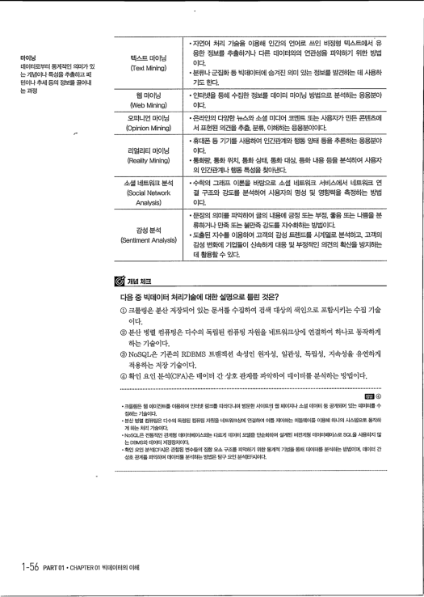
- 자연어 처리 기술을 이용해 인간의 언어로 쓰인 비정형 텍스트에서 유
용한 俄를 추출하거나 다른 데이터와의 연관성을 파악하기 위한 방법 마［닝 데이터로부터 통계적인 의미가 있 는 개념이나특성을 추출하고 패 턴이나 추세 등의 정보를 끌어내 는 과정 텍스트 마이닝 이다．

- 분류나 군집화 등 빅데이터에 숨겨진 의미 있는 정보를 발견하는 데 사용하
(Text Mining) 기도 힌다．

- 인터넷을 통해 수집한 정보를 데이터 마이닝 방법으로 분석하는 응용보야
웹 마이닝 이다． (Web Mining)

- 온라인의 다양한 뉴스와 소셜 미디어 코멘트 또는 사용자가 만든 콘텐츠에
오피니언 마이닝 서 표헌된 의견을 추출, 분류 , 이해하는 응용분야이다． (Opinion Mining) ／뻑

- 휴대폰 등 기기를 사용하여 인간관계와 행동 양태 등을 추론하는 응용분야
이다．

- 통화량, 통화 위치 . 통화 상태 , 통화 대상, 통화 내용 등을 분석하여 사용자
리얼리티 마이닝 (Reality Mining) 의 인간관계나 행동 특성을 찾아낸다．

- 수학의 그래프 이론을 바탕으로 소셜 네트워크 서비스에서 네트워크 연
소셜 네트워크 분석 결 구조와 강도를 분석하여 사용자의 명성 및 영향력을 측정하는 방법 (Social Network 이다． Analysis)

- 문장의 의미를 파악하여 글의 내용에 긍정 또는 부정 , 좋음 또는 나쁨을 분
류하거나 만족 또는 불만족 강도를 지수화하는 방법이다． 감성 분석

- 도출된 지수를 이용하여 고객의 감성 트렌드를 시계열로 분석하고， 고객의
(Sentiment Analysis) 감성 변화에 기업들이 신속하게 대응 및［ 부정적인 의견의 확산을 방지하는 데 활용할 수 있다． 다음 중 빅데이터 처리기술에 대한 설명으로 틀린 것은？ ① 크를링은 분산 저장되어 있는 문서를 수집하여 검잭 대상의 색인으로 포함시키는 수집 기술 이다． ② 분산 병렬 컴퓨팅은 다수의 독립된 컴퓨팅 자원을 네트워크상에 연결하여 하나로 동작하게 하는 기술이다． ③NoSQL은 기존의 RDBMS 트랜잭션 속성인 원자성 , 일관성 , 독립성 , 지속성을 유연하게 적용하는 저장 기술이다． ④ 확인 요인 분적（OFA）은 데이터 간 상호 관계를 파악하여 데이터를분석하는 방법이다 .

- 크롤링은 웹 에이전트를 이용하여 인터넷 링크를 따ㄹFt각니며 방문한 사이트의 웹 페이지나 소셜 데이터 등 공개되어 있는 데이터를 수
집하는 기술이다．

- 분산 병렬 컴퓨팅은 다수의 독립된 컴퓨팅 자원을 네트워크상에 연결하여 o隱 제어하는 미들뭬어틀 이용해 하나의 시스템으로 우降
게 하는 처리 기술이다．

- NOSOL은 전통적인 관계형 데이터베이스와는 다르거l 데이터 모델을 단순화하여 설계된 비관계형 데이터베이스로 SQL을 사용하지 않
는 DBMS와 데이터 저창장치이다．

- 확인 요인 분석(CFA尸 관찰된 변수들의 집합 요소 구조를 파악하기 위한 통계적 기법을 통해 데이터를 분석하논 방법이며． 데이터 간
상호 관계를 파악하여 데이터를 분석ㅎl굿 방법은 탐구요인 분석(EFA）이다.

1-56 PART01 * CHAPTER01 빅데이터의 이해

> D @
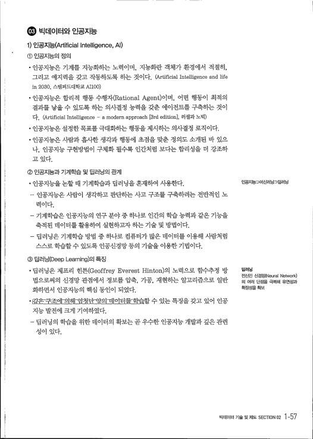
.

빅데이터와 인공지능 1) 인공지능（Artificial Intelligence, Al) ① 인공지능의 정의

- 인공지능은 기계를 지능화하는 노력이며 , 지능화란 객쳬가 환경에서 적절히，
그리고 예지력을 갖고 작동하도록 하는 것이다 . (Artificial Intelligence and life in 2030 , 스탠퍼드대학교A1100)

- 인공지능은 합리적 행동 수행자（Rational Agent）이며 , 어떤 행동이 최적의
결과를 낳을 수 있도록 하는 의사결정 능력을 갖춘 에이전트를 구축하는 것이 다 . (Artificial Inte끄igence - a modern approach [3rd edition], 러셀과 노빅）

- 인공지능은 설정한 목표를 극대화하는 행동을 제시하는 의사결정 로직이다 .
- 인공지능은 사람과 흡사한 생각과 행동에 초점을 맞춘 정의도 소개된 바 있으
나 , 인공지능 구현방법이 구쳬화 될수록 인간처럼 보다는 합리성을 더 강조하 고 있다． ② 인공지능과 기계학습 및 딥러닝의 관계

- 인공지능을 논할 때 기계학습과 딥러닝을 혼재하여 사용한다．
- 인공지능은 사람이 생각하고 판단하는 사고 구조를 구축하려는 전반적인 노
력이다．

- 기계학습은 인공지능의 연구 분야 중 하나로 인간의 학습 능력과 같은 기능을
축적된 데이터를 활용하여 실현하고자 하는 기술 및 방법이다．

- 딥러닝은 기계학습 방법 중 하나로 컴퓨터가 많은 데이터를 이용해 사람처럼
스스로 학습할 수 있도록 인공신경망 등의 기술을 이용한 기법이다． ③ 딥러닝（Deep Learning）의 특징

- 딥러닝은 제프리 힌튼（Geoffrey Everest Hinton）의 노력으로 함수추정 방
법으로써의 신경망 관점에서 정보를 압축 , 가공 , 재현하는 알고리즘으로 일반 화하면서 인공지능의 핵심 동인이 되었다 .

- 櫻寧r구조에：잽흐ㅐ－엄첫냔컨얏의켸’이’터름＝희尸습할 수 있는 특징을 갖고 있어 인공
#### 지능 발전에 크게 기여하였다 .
- 딥러닝의 학습을 위한 데이터의 확보는 곧 우수한 인공지능 개발과 갚은 관런
성이 있다．

> 인공지능：3머신러닝＝〕딥러닝
> 딥러닝
> 전신인 신경망（Neural Network)
> 으I 여러 단점을 극복해 유연성과 
확장성을 확보

> 빅더l이터 기술및제도 SECTION 02 1 -57
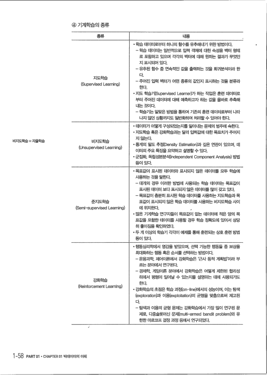
④ 기계학습의 종류 종류 내용

- 학습 데이터로부터 하나의 함수를 듀추해내기 위한 방법이다． 
- 학습 데이터는 일반적으로 입력 객체에 대한 속성을 벡터 형태 
로 포함하고 있으며 각각의 벡터에 대해 원하는 결과가 무엇인 지 표시되어 있다． －유추된 함수 중 연속적인 값을 출력하는 것을 회귀분석이라 한 다．

- 주어진 입력 벡터가 어떤 종류의 값인지 끄치하는 것을 분류라
지도학습 (Supervised Learning) 힌다．

- 지도 학습기（Supervised Learner）가 하는 작업은 훈련 데이터로
부터 주어진 데이터에 대해 예측하고자 하는 값을 올바로 추측해 내는 것이다．

- 학습기는 알맞은 방법을 통하여 기존의 훈련 데이터로부터 나타
나지 않던 상황까지도 일반화하여 처리할 수 있어야 한다.

- 데이터가 어떻게 구셩되었는지를 알아내는 문제의 범주에 속한다． 
- 지도학습 혹은 강화학습과는 달리 입력값에 대한 목표치가 주어지 
지 않는다．

- 통계의 밀도 추정（Density Estimation）과 깊은 연관이 있으며 , 데
비지도학습 = 자율학습 비지도학습 (Unsupervised Learning) 이터의 주요 특징을 요약하고 설명할 수 있다．

- 군집화. 독립셩분분석.ndependent Component Analysis) 방법
등이 있다．

- 목표값이 끄치된 데이터와 표시되지 않은 데이터를 모두 학습에
사용하는것을말한다．

- 대개의 경우 이러한 방법에 사용되는 학습 데이터는 목표값이 
以 된 데이터 보다 표시되지 않은 데이터를 많이 갖고 있다．

- 목표값이 戟븐히 끄치된 학습 데이터를 사용하는 지도학습과 목
준지도학습 표값이 ㅄ 되지 않은 학습 데이터를 사용하는 비지도학습 사이 (Semi-supervised Learning) 에 위치한다． .

- 많은 기계학습 연구자들이 목표값이 없는 데이터에 적은 양의 목
표값을 포함한 데이터를 사용할 경우 학습 정확도에 있어서 상당 히 좋아짐을 확인하였다.

- 두 개 이상의 학습기 각각이 예제를 통해 훈련되는 상호 훈련 방법
등이 있다．

- 흗婚심리학에서 영감을 받았으며 . 선택 가능한 행동들 중 보상을
최대화하는 함隱 혹은 순서를 선택하는 방법이다．

- 운용과학. 제어이론에서 강화학습은 ' 근사 동적 계획법 ' 이라 부 
르는 분야에서 연구된다．

- 경제학. 게임이론 분야에서 강화학습은 어떻게 제한된 합리성
하에서 평형이 일어날 수 있는지를 설명하는 데에 사용되기도 강화학습 한다．

- 강화학습의 초점은 학습 과정（on-line）에서의 성능이며 , 이는 탐색
(Reinforcement Learning) (exploration）과 이용〈exptoitation）의 균형을 맞춤으로써 제고된 다．

- 탐색과 이용의 균형 문제는 강화학습에서 가장 많이 연구된 문
제로， 다중슬롯머신 문제（multi-armed bandit problem）와 유 한한 마르코프 결정 과정 뒹게서 연구되었다 .

1-58 PART01 .CHAPTER01 빅데이터의 이해

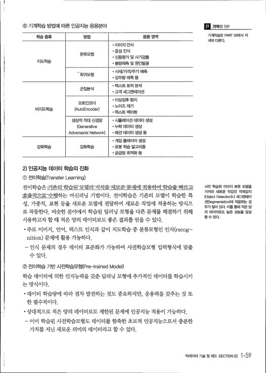
⑤ 기계학습 방법에 따른 인공지능 응용보야 힉階 종류 방법 응용 영역

- 이미지 인식 
- 음성 인식 
- 신용평가 및 사기검출 
- 불량예측 및 원인발굴
분류모형 지도학습 "희귀모형

- 시세／가2흽／주가 예측 
- 강우량 예측 등
군집분석

- 텍스트 토픽 분석
- 고객 서L그멘테이션
- 이상징후 탐지 
- 노이즈 제거
오토인코더 비지도학습 (AutoEncoder)

- 텍스트 벡터화
생성적 적대 신경망

- 시뮬레이션 데이터 생성
(Generative Adversarial Network)

- 누락 데이터 생성
- 패션 데이터 생성 등
- 게임 플레이어 생성
강화학습 강화학습

- 로봇 학습 알고리즘
- 공급망 최적화 등
2) 인공지능 데이터 학습의 진화 ① 전이학습〈Transfer Learning) 전이학습은 의존의ㅍ희釜珏1땔뎀의－지칙舍댕ㅐ로F우＝耉스제에적욧하여－학슥송ㅃ隧箋긱 효율점으로＝수행하는 머신러닝 기법이다 . 전이학습은 기존의 모델이 학습한 특 성 , 가중치 , 표현 등을 새로운 모델에 전달하여 새로운 작업에 적용하는 방식으 로 작동한다 . 비슷한 분야에서 학습된 딥러닝 모형을 다른 문제를 해결하기 위해 사용하고자 할 때 적은 양의 데이터로도 좋은 결과를 얻을 수 있다．

- 주로 이미지 , 언어 , 텍스트 인식과 같이 지도학습 중분류모형인 인식（recog-
nition) 문제에 활용 가능하다．

- 인식 문제의 경우 데이터 표준화가 가능하여 사전학습모형 입력형식에 맞출 
수 있다 .

② 전이학습 기반 사전학습모형（Pre-trained Model) 학습 데이터에 의한 인지능력을 갖춘 딥러닝 모형에 추가적인 데이터를 학습시키 는 방식이다 .

#### · 데이터 학습량에 따라 점차 발전하는 것도 중요하지만 , 응용력을 갖추는 것 또 
한 필수적이다 .

- 상대적으로 적은 양의 데이터로도 제한된 문제에 인공지능 적용이 가능하다．
- 이미 학습된 사전학습모형도 데이터를 함축한 초보적 인공지능으로서 충분한
가치를 지닌 새로운 의미의 데이터라고 할 수 있다．

> 기계학습은 RARI Q3에서 자
> 세히다룬다．
> 사전 학습된 이미지 분류 모델을 
가져와 새로운 작업인 객체감지 (obJect Detection）나 세그멘테이 션（Segmentation）에 적용하는 경 우가 많이 있다 . 이를 통해 적은 양 의 데이터로도 높은 성능을 달성 할 수 있다．

> 빅데이터 기술및 제도 SECTION 02 1 -59
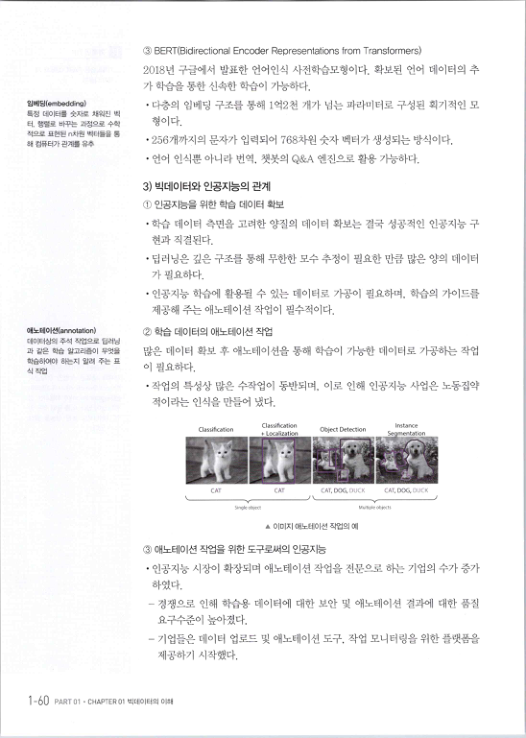
③BERT(Bidirectional Encoder Representations from Transformers) 2018년 구글에서 발표한 언어인식 사전학습모형이다 . 확보된 언어 데이터의 추 가 학습을 통한 신속한 학습이 가능하다．

- 다층의 임베딩 구조를 통해 1억2천 개가 넘는 파라미터로 구성된 획기적인 모
임베딩（embedding) 특정 데이터를 숫자로 채워진 벡 형이다． 터． 행렬로 바 그는 과정으로 수학 적으로 표현된 n차원 벡터들을 통 해 컴퓨터가 관계를 유추

- 256개까지의 문자가 입력되어 768차원 숫자 벡터가 생성되는 방식이다．
- 언어 인식뿐 아니라 번역 , 챗봇의 Q椒 엔진으로 활용 가능하다．
3) 빅데이터와 인공지능의 관계 ① 인공지능을 위한 학습 데이터 확보

- 학습 데이터 측면을 고려한 양질의 데이터 확보는 결국 성공적인 인공지능 구
현과 직결된다．

- 딥러닝은 깊은 구조를 통해 무한한 모수 추정이 필요한 만큼 많은 양의 데이터
가 필요하다．

- 인공지능 학습에 활용될 수 있는 데이터로 가공이 필요하며 , 학습의 가이드를
제공해 주는 애노테이션 작업이 필수적이다． ② 학습 데이터의 애노테이션 작업 애노테이션（annotation) 데이터상의 주석 직업으로 딥러닝 과 같은 학습 알고리즘이 무엇을 많은 데이터 확보 후 애노테이션을 통해 학습이 가능한 데이터로 가공하는 작업 학습하여야 하는지 알려 주는 표 식 작업 이 필요하다．

- 작업의 특정상 많은 수작업이 동반되며 , 이로 인해 인공지능 사업은 노동집약
적이라는 인식을 만들어 냈다． Object Detection Instance Segmentation 디assification

+ Localization
디assification CAT CAT, DOG, DUCK CAT, DOG, DUCK 7 ` 7 Y M미tipie objects CAT ` 착β Single 아,jet ▲ 이미지 애노테이션 작업의 예 ③ 애노테이션 작업을 위한 도구로써의 인공지능

- 인공지능 시장이 확장되며 애노테이션 작업을 전문으로 하는 기업의 수가 증가
하였다．

- 경쟁으로 인해 학습용 데이터에 대한 보안 및 애노테이션 결과에 대한 품질
요구수준이 높아졌다．

- 기업들은 데이터 업로드 및 애노테이션 도구 , 작업 모니터링을 위한 플랫폼을
제공하기 시작했다． 1- 60 PART01 . CHAPTER01 빅데이터의 이해

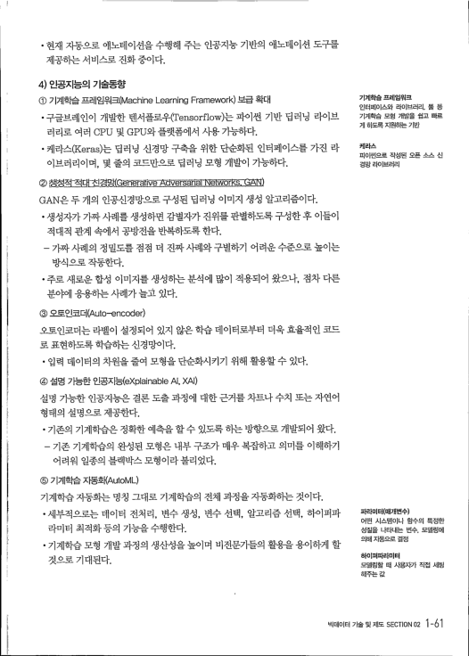
- 현재 자동으로 애노테이션을 수행해 주는 인공지능 기반의 애노데이션 도구를
제공하는 서비스로 진화 중이다． 4) 인공지능의 기술동향 ① 기계학습 프레임워크（Machine Learning Framework) 보급 확대

- 구글브레인이 개발한 텐서플로우（山ensorflow）는 파이썬 기반 딥러닝 라이브
러리로 여러 CPU 및 GPU와 플랫폼에서 사용 가능하다．

- 케라스（Keras）는 딥러닝 신경망 구축을 위한 단순화된 인터페이스를 가진 라
이브러리이며 , 몇 줄의 코드만으로 딥러닝 모형 개발이 가능하다． ② 緻성떰．최대與경망(G경眄eTa

- Adc否rai1rNetworks. GAN)
#### GAN은 두 개의 인공신경망으로 구성된 딥러닝 이미지 생성 알고리즘이다 .
- 생성자가 가짜 사례를 생성하면 감별자가 진위를 판별하도록 구성한 후 이들이
적대적 관계 속에서 공방전을 반복하도록 한다．

- 가짜 사례의 정밀도를 점점 더 진짜 사례와 구별하기 어려운 수준으로 높이는
방식으로 작동한다．

- 주로 새로운 합성 이미지를 생성하는 분석에 많이 적용되어 왔으나 , 점차 다른
분야에 음용하는 사례가 늘고 있다． ③ 오토인코더（Auto-encoder) 오토인코더는 라벨이 설정되어 있지 않은 학습 데이터로부터 더욱 효율적인 코드

#### 로 표현하도록 학습하는 신경망이다 .
- 입력 데이터의 차원을 줄여 모형을 단순화시키기 위해 활용할 수 있다．
④ 설명 가능한 인공지눼e×이ainable Al, xAI) 설명 가능한 인공지능은 결론 도출 과정에 대한 근거를 차트나 수치 또는 자연어 형태의 설명으로 제공한다．

- 기존의 기계학습은 정확한 예측을 할수 있도록 하는 방향으로 개발돠어 왔다．
- 기존 기계학습의 완성된 모형은 내부 구조가 매우 복잡하고 의미를 이해하기
어려워 일종의 블랙박스 모형이라 불리었다． ⑤ 기계학습 자동화(AutoML) 기계학습 자동화는 명칭 그대로 기계학습의 전쳬 과정을 자동화하는 것이다 .

- 세부적으로는 데이터 전처리 , 변수 생성 , 변수 선택 , 알고리즘 선택 , 하이퍼파
라미터 최적화등의 기능을수행한다．

- 기계학습 모형 개발 과정의 생산성을 높이며 비전문가들의 활용을 용이하게 할
것으로 기대된다．

> 기계학습 프레임워크
> 인터페이스와 라이브러리 . 툴 등
> 기계학습 모형 개발을 쉽고 빠르
> 게 하도록 지원하는 기반
> 케라스
> 파이썬으로 작성된 오픈 소스 신
> 경망 라이브러리
> 파라미터（매개변수）
> 어떤 시스템이나 함수의 특정한
> 성질을 나타내는 변수 . 모델링에
> 의해 자동으로 결정
> 하이퍼파라미터
> 모델링할 때 사용자가 직접 세팅 
해주는 값

> 빅데이터 기술 및 제도 SECTION 02 1 －시
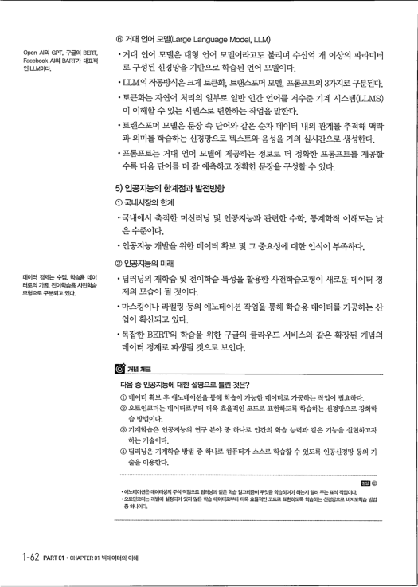
⑥ 거대 언어 모델（Large Language Model, LLM) ' 거대 언어 모델은 대형 언어 모델이라고도 불리며 수집억 개 이상의 파라미터 로 구성된 신경망을 기반으로 학습된 언어 모델이다． Open 씨의 GPT , 구글의 BERT.

Facebook Al으』 BART가 대표적 인LLM이다．

- LLM의 작동방식은크게 토큰화, 트랜스포머 모델 , 프롬프트의 3가지로구분된다．
' 토큰화는 자연어 처리의 일부로 일반 인간 언어를 저수준 기계 시스템（LLMS) 이 이해할 수 있는 시퀀스로 변환하는 작업을 말한다．

- 트랜스포머 모델은 문장 속 단어와 같은 순차 데이터 내의 관계를 추적해 맥락 
과 의미를 학습하는 신경망으로 텍스트와 음성을 거의 실시간으로 생성한다 .

- 프롬프트는 거대 언어 모델에 제공하는 정보로 더 정확한 프롬프트를 제공할 
수록 다음 단어를 더 잘 예측하고 정확한 문장을 구성할 수 있다． 5) 인공지능의 한계점과 발전방향 ① 국내시장의 한계 【국내에서 축적한 머신러닝 및 인공지능과 관런한 수학 , 통계학적 이해도는 낮 은 수준이다．

- 인공지능 개발을 위한 데이터 확보 및 그 중요성에 대한 인식이 부족하다．
② 인공지능의 미래

- 딥러닝의 재학습 및 전이학습 특정을 활용한 사전학습모형이 새로운 데이터 경
데이터 경제는 수집 . 학습용 데이 터로의 가공, 전이학습용 사전학습 모형으로 구분되고 있다． 제의 모습이 될 것이다．

- 마스킹이나 라벨링 등의 애노테이션 작업블 통해 학습용 데이터를 가공하는 산
업이 확산되고 있다．

- 복잡한 BERT의 학습을 위한 구글의 클라우드 서비스와 같은 확장된 개념의
데이터 경제로 파생될 것으로 보인다． 다음 중 인공지능에 대한 설명으로 틀린 것은？ ① 데이터 확보 후 애노테이션을 통해 학습이 가능한 데이터로 가공하는 작업이 필요하다． ② 오토인코더는 데이터로부터 더욱 효율적인 코드로 표현하도록 학습하는 신경망으로 강화학 습 방법이다． ③ 기계학습은 인공지능의 연구 분야 중 하나로 인간의 학습 능력과 같은 기능을 실현하고자 하는 기술이다． ④ 딥러닝은 기계학습 방법 중 하나로 컴퓨터가 스스로 학습할 수 있도록 인공신경망 등의 기 술을 이용한다．

- 애노테이션은 데이터상의 주석 작업으로 딥러닝과 같은 학습 일고리즘이 무엇을 학습하여야 하는지 알려 주는 표식 작업이다． 
- 오토인코더는 라벨이 설정되어 있지 않은 학습 데이터로부터 더욱 효율적인 코드로 표현하도록 학슴하는 신경망으로 비자도학습 방법
중해극이다． 1-62 PART01 . Cl-IAPTER01 빅데이터의 이해

> El
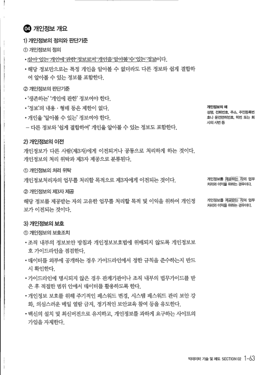
.

개인정보 개요 1) 개인정보의 정의와 판단기준 ① 개인정보의 정의

- 찰中있튼가언'에‘꽈히＝컷보로저－개휘警압아볼ㅌ수＝0Th는〕보이다．
- 해당 정보만으로는 특정 개인을 알아볼 수 없더라도 다른 정보와 쉽게 결합하
여 알아볼 수 있는 정보를 포함한다． ② 개인정보의 판단기준

- ' 생존하는" 개인에 관한’ 정보여야 한다．
#### · ' 정보'의 내용 · 형태 등은 제한이 없다．
- 개인을 ' 알아볼 수 있는’ 정보여야 한다．
- 다른 정보와 ' 쉽게 결합하여 ' 개인을 알아볼 수 있는 정보도 포함한다．
2) 개인정보의 이전 개인정보가 다른 사람（제3자）에게 이전되거나 공동으로 처리하게 하는 것이다． 개인정보의 처리 위탁과 제3자 제공으로 분류된다． ① 개인정보의 처리 위탁 개인정보처리자의 업무를 처리할목적으로 제3자에게 이전되는 것이다． ② 개인정보의 제3자 제공 해당 정보를 제공받는 자의 고유한 업무를 처리할 목적 및 이익을 위하여 개인정 보가 이전되는 것이다． 3) 개인정보의 보호 ① 개인정보의 뿌ㅎ조치

- 조직 내부의 정보보안 방침과 개인정보보호법에 위배되지 않도록 개인정보보
호 가이드라인을 점검한다．

- 데이터를 외부에 공개하는 경우 가이드라인에서 정한 규칙을 준수하는지 반드
시 확인한다．

- 가이드라인에 명시되지 않은 경우 관계기관이나 조직 내부의 법무가이드를 받
은 후 적절한 범위 안에서 데이터를 활용하도록 한다．

- 개인정보 보호를 위해 주기적인 패스워드 변경 , 시스템 패스워드 관리 보안 강
화, 의심스러운메일 열람금지 , 정기적인 보안교육참여 등을유도한다．

- 백신의 설치 및 최신버전으로 유지하고 , 개인정보를 과하게 요구하는 사이트의
l 가입을 자제한다．

> 개인정보의 예
> 성명 , 전화번호． 주소， 주민등록번 
호나 운전면허번호． 학번 또는 회 사의 시번 등

> 개인정보를 却콜하둣．차으l 업무 
처리와 이익을 위하는 경우이다．

> 개인정보를 체콜받E잿．（의 업무 
처리와 이익을 위하는 경우이다．

> 빅데이터 기술 및 제도 SECTION 02 1 -63
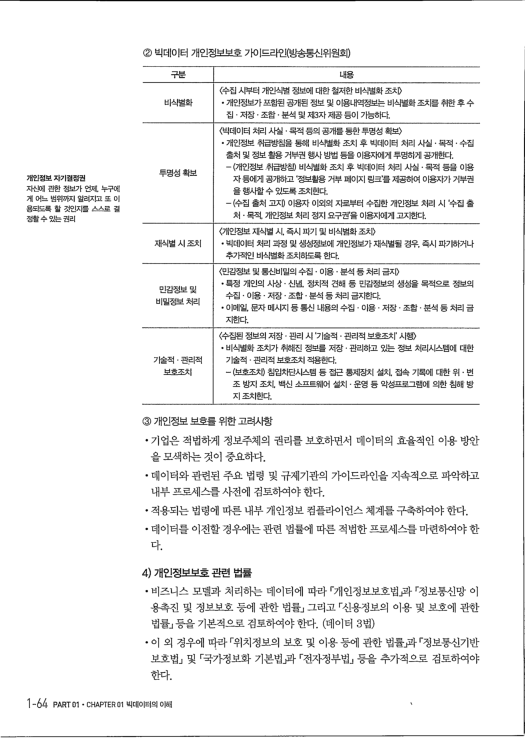
② 빅데이터 개인정보보호 가이드라인（방송통신위원회） 구분 내용 ＜수집 시부터 개인식별 정［보에 대한 철저한 비식별화 조치＞

- 개인정보가 포함된 공개된 정보 및 이용내역정보는 비식별화 조치를 취한 후 수 
집 · 저장 · 조합 · 분석 및 제3자 제공 등이 가능하다． 비식별화 〈빅데이터 처리 사실 · 목적 등의 공개를 통한 투명성 확보〉

- 개인정보 취급방침을 통해 비식별화 조치 후 빅데이터 처리 사실 · 목적 · 수집 
출처 및 정보 활용 거부권 행사 방법 등을 이용자에게 투명하게 공개힌다．

- （개인鰕 취급방침） 비식별화 조치 후 빅데이터 처리 사실 · 목적 등을 이용 
자 등에게 공개하고 ' 정보활용 거부 페이지 링크'를 저居하여 이용자가 거부권 을 행사할 수 있도록 조치한다．

- （수집 출처 고지） 이용자 이외의 차로부터 수집한 개인礖 처리 시 ' 수집 출 
처 · 목적 , 개인정보 처리 정지 요구권'을 이용자에게 고지힌다． 투명성 확보 개인정보 자기결정권 자신에 관한 정보가 언제 . 누구에 게 어느 범위까지 알려지고 또 이 용되도록 할 것인지를 스스로 결 정할수 있는 권리 ＜개인정보 재식별 시 , 즉시 파기 및 비식별화 조치〉

- 빅데이터 처리 과정 및 생성정툐l；에 개인정보가 재식별될 경우. 즉시 파기하거나
재식별 시 조치 추가적인 비식별화 조치하도록 한다． 〈민감정보 및 통신비밀의 수집 · 이용 · 분석 등 처리 금지〉

- 특정 개인의 사상 · 신념 , 정치적 견해 등 민감정보의 생성을 목적으로 정보의
민감정보 및 수집 · 이용 · 저장 · 조합 · 분석 등 처리 금지한다．

- 이메일 , 문자 메시지 등 통신 내용의 수집 · 이용 · 저장 · 조합 · 분석 등 처리 금
비밀정보 처리 지한다． ＜수집된 정보의 저장 · 관리 시 ' 기술적 · 관리적 보호조치 ' 시행＞

- 비식별화 조치가 취해진 정보를 저장 · 관리하고 있는 정보 처리시스템에 대한
기술적 · 관리적 보호조치 적용한다．

- (L  f
치） 침입차단시스템 등 접근 통제장치 설치 , 접속 기록에 대한 위 · 변 조 방지 조치 . 백신 소프트웨어 설치 · 운영 등 악성프로그램에 의한 침해 방 기술적 · 관리적 ㅂㅎ조치 지조치한다． ③ 개인정보 보호를 위한 고려사항

- 기업은 적법하게 정보주쳬의 권리를 보호하면서 데이터의 효율적인 이용 방안 
을 모색하는 것이 중요하다．

- 데이터와 관런된 주요 법령 및 규제기관의 가이드라인을 지속적으로 파악하고
내부 프로세스를 사전에 검토하여야 한다．

- 적용되는 법령에 따른 내부 개인정보 컴플라이언스 쳬계를 구축하여야 한다．
- 데이터를 이전할．경우에는 관련 법률에 따른 적법한 프로세스를 마련하여야 한
다． 4) 개인정보보호 관련 법률

- 비즈니스 모델과 처리하는 데이터에 따라 「개인정보보호법과 「정보통신망 이
용촉진 및 정보보호 등에 관한 법률」 그리고 「신용정보의 이용 및 보호에 관한 법률」등을 기본적으로 검토하여야한다 . （데이터 3법）

- 이 외 경우에 따라 「위치정보의 보호 및 이용 등에 관한 법률」과 「정보통신기반
보호법」 및 「국가정보화 기본법」과 「전자정부법」 등을 추가적으로 검토하여야 한다． 1 -64 PART01 . CHAPTER01 빅데이터의 이해

### i
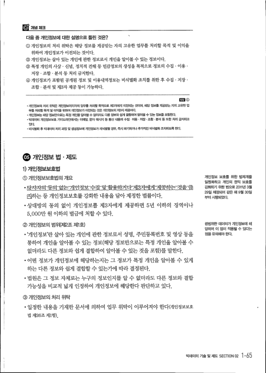
다음 중 개인정보에 대한 설명으로 틀린 것은？ ① 개인정보의 처리 위탁은 해당 정보를 제공받는 자의 고유한 업무를 처리할 목적 및 이익을 위하여 개인정보가 이전되는 것이다． ② 개인정보는 살아 있는 개인에 관한 정보로서 개인을 알아볼 수 있는 정보이다． ③ 특정 개인의 사상 · 신넘 , 정치적 견해 등 민감정보의 생성을목적으로정보의 수집 " 이용" 저장 · 조합 . 분식등 처리 금지한다． ④ 개인정보가 포함된 공개된 정보 및 이용내역정보는 비식별화 조치를 취한 후 수집 · 저장 · 조합 · 분석 및 제3자 제공 등이 가능하다．

- 개인정보의 처리 위탁은 개인정보처리차의 업무를 처리할 목적으로 제3자에게 이전되는 것이며 . 해당 정보를 저居받는 자의 고유한업
무를 처리할목적 및 이익을 위하여 개인정陛가 이전되는 것은 개인젱뵤으跡｛攀〕자처巳이다．

- 개인정보는 해당 정보만으로는특정 개인을 알아볼 수 없더라도 다른 정보와 쉽게 결합하여 알아볼 수 있는 정보를 포함한다．
- 빅데이터 개인정보보호 가（)］드라인에서는 이메일 . 문자 메시지 등 통신 내용의 수집 4 이용 · 저장· 조합 · 분석 등 또한 처리 금지하고
있다．

- 비식별화후 빅데이터 처리 과정 및 생성정보에 개인정보가 재식별될 경우 . 즉시 파기하거나추가적인 비식별화 조치히도록 한다．
.

개인정보 법 · 제도 '1) 개인정보보호법 ① 개인정보보호법의 개요

- 당사자의舍의－없令＝쾌의’첫토F수켰ㅍ및- 용하커다쩨3차메게긔 하튼꼇竇-
慟하는 등 개인정보보호를 강화한 내용을 담아 제정한 법률이다．

- 상대방의 동의 없이 개인정보를 제3자에게 제공하면 5년 이하의 징역이나
5,000만 원 이하의 벌금에 처할 수 있다． ② 개인정보의 범위（제2조 제1호）

#### · ' 개인정보’란 살아 있는 개인에 관한 정보로서 성명 , 주민등록번호 및 영상 등을
통하여 개인을 알아볼 수 있는 정보（해당 정보만으로는 특정 개인을 알아볼 수 없더라도 다른 정보와 쉽게 결합하여 알아볼 수 있는 것을 포함）를 말한다．

- 어떤 정보가 개인정보에 해당하는지논그 정보가 특정 개인을 알아볼 수 있게
하는 다른 정보와 쉽게 결합할 수 있는가에 따라 결정된다．

- 법원은 그 정보 자쳬로는 누구의 정보인지를 알 수 없더라도 다른 정보와 결합
가능성을 비교적 넓게 인정하여 개인정보에 해당한다 판단하고 있다． ③ 개인정보의 처리 위탁

- 일정한 내용을 기재한 문서에 의하여 업무 위탁이 이루어져야 한다（개인정보보호
법 제26조 제1항）.

> ㅁ레①
> 개인정보 보호를 위한 법체계를
> 일원화하고 개인의 권익 보호를
> 강화하기 위한 법으로 2011년 3월
> 29일 제정되어 같은 해 9월 30일
> 부터 시행되었다．
> 광범위한 데이터가 개인정보에 해
> 당하여 이 법이 적용될 수 있다는
> 점을유의해먀한다．
> 빅데이터기술및제도SECTION 02 1 -65
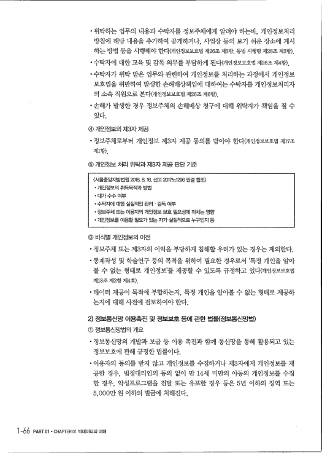
- 위탁하는 업무의 내용과 수탁자를 정보주쳬에게 알려야 하는바 , 개인정보처리
방침에 해당 내용을 추가하여 공개하거나 , 사업장 등의 보기 쉬운 장소에 게시 하는 방법 등을 시행해야 한다（개인정보보호법 제26조제3항, 동법 시행령 제28조제3항）.

- 수탁자에 대한 교육 및 감독 의무를 부담하게 된다（개인정보보호법 제26조 제4힝〕
．

- 수탁자가 위탁 받은 업무와 관런하여 개인정보를 처리하는 과정에서 개인정보
보호법을 위반하여 발생한 손해배상책임에 대하여는 수탁자를 개인정보처리자 의 소속 직원으로 본다（개인정보보호법 제26조 제6힝〕 .

- 손해가 발생한 경우 정보주쳬의 손해배상 청구에 대해 위탁자가 책임을 질 수
있다． ④ 개인정보의 제3자 제공

- 정보주쳬로부터 개인정보 제3자 제공 동의를 받아야 한다（개인정보보호법 제17조
제1항）.

⑤ 개인정보 처리 위탁과 제3자 제공 판단 기준 〈서울중앙지방법원 20氾.8.16 . 선고 2017 .1296 판결 참조＞

- 개인정보의 취득목적과 방법
- 대가 수수 여부
- 수탁자에 대한 실질적인 관리 · 감독 여부
- 정보주체 또는 이용자의 개인정보 보호 필요성에 미치는 영향
- 개인정보를 이용할 필요가 있는 자가 실질적으로 누구인지 등
⑥ 비식별 개인정보의 이전

- 정보주쳬 또는 제3자의 이익을 부당하게 침해할 우려가 있는 경우는 제외한다．
- 통계작성 및 학술연구 등의 목적을 위하여 필요한 경우로서 ' 특정 개인을 알아 
볼 수 없는 형태로 개인정보'를 제공할 수 있도록 규정하고 있다（개인정보보호법 제18조 제2항 제4호）.

- 데이터 제공이 목적에 부합하는지 , 특정 개인을 알아볼 수 없는 형태로 제공하
는지에 대해 사전에 검토하여야 한다． 2) 정보통신망 이용촉진 및 정보보호 등에 관한 법률《정보통신망법） ① 정보통신망법의 개요

- 정보통신망의 개발과 보급 등 이용 촉진과 함께 통신망을 통해 활용되고 있는
정보보호에 관해 규정한 법률이다．

- 이용자의 동의를 받지 않고 개인정보를 수집하거나 제3자에게 개인정보를 제
공한 경우 , 법정대리인의 동의 없이 만 14세 미만의 아동의 개인정보를 수집 한 경우 , 악성프로그램을 전달 또는 유포한 경우 등은 5년 이하의 징역 또는 5,000만 원 이하의 벌금에 처해진다 .

1-66 PART01 , CHAPTER01 빅데이터의 이해

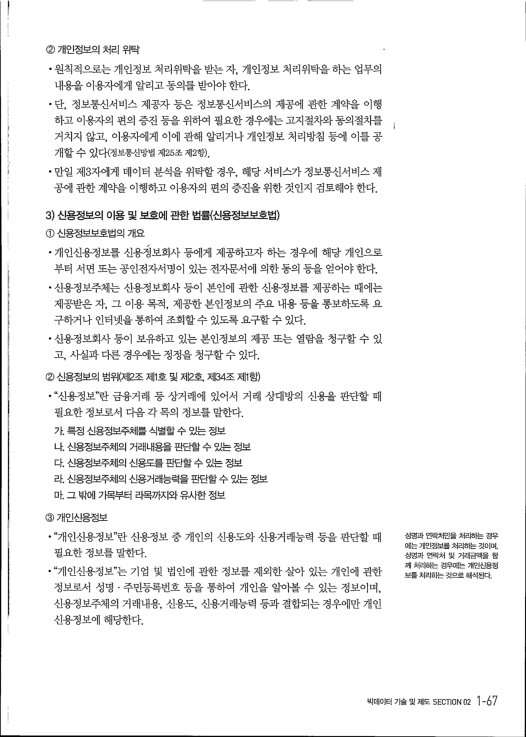
② 개인정보의 처리 위탁

- 원칙적으로는 개인정보 처리위탁을 받는 자 , 개인정보 처리위탁을하는 업무의
내용을 이용자에게 알리고 동의를 받아야 한다．

- 단 , 정보통신서비스 제공자 등은 정보통신서비스의 제공에 관한 계약을 이행
하고 이용자의 펀의 증진 등을 위하여 필요한 경우에는 고지절차와 동의절차를 거치지 않고 , 이용자에게 이에 관해 알리거나 개인정보 처리방침 등에 이를 공

#### 개할 수 있다（정보통신망법 제25조 제2힝〕
．

- 만일 제3자에게 데이터 분석을 위탁할 경우 , 해당 서비스가 정보통신서비스 제
공에 관한 계약을 이행하고 이용자의 편의 증진을 위한 것인지 검토해야 한다． 3) 신용정보의 이용 및 보호에 관한 법률（신용정보보호법） ① 신용정보보호법의 개요

- 개인신용정보를 신용정보회사 등에게 제공하고자 하는 경우에 해당 개인으로
부터 서면 또는 공인전자서명이 있는 전자문서에 의한 동의 등을 얻어야 한다．

- 신용정보주쳬는 신용정보회사 등이 본인에 관한 신용정보를 제공하는 때에는
제공받은 자 , 그 이용 목적 , 제공한 본인정보의 주요 내용 등을 통보하도록 요 구하거나 인터넷을 통하여 조회할 수 있도록 요구할 수 있다．

- 신용정보회사 등이 보유하고 있는 본인정보의 제공 또는 열람을 청구할 수 있
고 , 사실과 다른 경우에는 정정을 청구할 수 있다． ② 신용정보의 범위（제2조 제1호 및 제2호， 제34조 제1항）

- " 신용정보 " 란 금융거래 등 상거래에 있어서 거래 상대방의 신용을 판단할 때
필요한 정보로서 다음 각 목의 정보를 말한다． 가. 특정 신용정보주체를 식별할 수 있는 정보 나. 신용정보주체의 거래내용을 판단할 수 있는 정보 다 . 신용정보주체의 신용도를 판단할 수 있는 정보 라 . 신용정보주체의 신용거래능력을 판단할 수 있는 정보 마. 그 밖에 가목부터 라목까지와 유사한 정보 ③ 개인신용정보

- " 개인신용정보 " 란 신용정보 중 개인의 신용도와 신용거래능력 등을 판단할 때 
필요한 정보를 말한다．

- " 개인신용정보 " 는 기업 및 법인에 관한 정보를 제외한 살아 있는 개인에 관한
#### 정보로서 성명 · 주민등록번호 등을 통하여 개인을 알아볼 수 있는 정보이며，
신용정보주쳬의 거래내용 , 신용도 , 신용거래능력 등과 결합되는 경우에만 개인 신용정보에 해당한다．

> 성명과 연락처만을 처리하는 경우 
에는 개인정보를 처리하는 것이며． 성명과 연락처 및 거래금액을 함 께 처리하는 경우에는 개인신용정 보를 처리하는 것으로 해석된다．

> 빅데이터기술및제도SECTION 02 ㅏ 
7

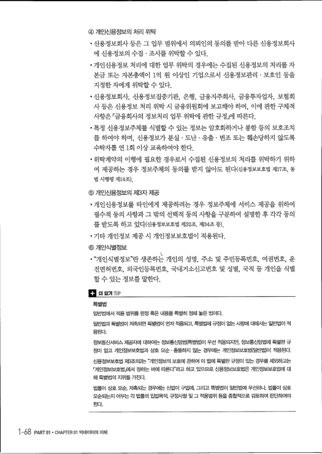
④ 개인신용정보의 처리 위탁

- 신용정보회사 등은 그 업무 범위에서 의뢰인의 동의를 받아 다른 신용정보회사
#### 에 신용정보의 수집 · 조사를 위탁할 수 있다．
- 개인신용정보 처리에 대한 업무 위탁의 경우에는 수집된 신용정보의 처리를 자
#### 본금 또는 자본총액이 1억 원 이상인 기업으로서 신용정보관리 · 보호인 등을
지정한 자에게 위탁할 수 있다．

- 신용정보회사 , 신용정보집중기관 , 은행 , 금융지주회사 , 금융투자업자 , 보험회
사 등은 신용정보 처리 위탁 시 긍융위원회에 보고해야 하며 , 이에 관한 구쳬적 사항은 「긍응회사의 정보처리 업무 위탁에 관한 규정」에 따른다．

- 특정 신용정보주쳬를 식별할 수 있는 정보는 암호화하거나 봉함 등의 보호조치
#### 를 하여야 하며 , 신용정보가 분실 · 도난 · 유출 · 변조 또는 훼손당하지 않도록
수탁자를 연 1회 이상 교육하여야 한다．

- 위탁계약의 이행에 필요한 경우로서 수집된 신용정보의 처리를 위탁하기 위하
여 제공하는 경우 정보주쳬의 동의를 받지 않아도 된다（신용정보보호법 제17조 , 동

#### 법 시행령 제14조）.
⑤ 개인신용정보의 제3자 제공

- 개인신용정보를 타인에게 제공하려는 경우 정보주쳬에 서비스 제공을 위하여
필수적 동의 사항과 그 밖의 선택적 동의 사항을 구분하여 설명한 후 각각 동의 를 받도록 하고 있다（신용정보보호법 제32조 , 제34조등）.

- 기타 개인정보 제공 시 개인정보보호법이 적용된다．
⑥ 개인식별정보

- “개인식별정보，
，란생존히른 개인의 성명 ，주소 및 주민등록번호  ，여권번호 ，운 전면허번호 , 외국인등록번호 , 국내거소신고번호 및 성별 , 국적 등 개인을 식별 할 수 있는 정보를 말한다． 특별법 일반법에서 적용 범위를 한정 흑은 내용을 특별히 정해 놓은 법이다． 일빈법과 특벌법이 저犧되면 특별법이 먼저 적용돠I긱 특별법에 규정이 없는 사항에 대해서는 일반법이 적 용된다． 정보톰신서비스 저居자에 대하여는 정보통신망법（특별법）이 우선 적용되지만. 정보통신망법에 특별한 규 정이 없고 개인정보보호법과 상호 모순 · 홅콜하지 않는 경우에는 개인정보보호법（일반법）이 적용된다． 신용정보보호법 제3조의2는 " 개인정보의 雎르에 관하여 이 법에 특별한 규정이 있는 경우를 제외하고는 「개인정보보호법」에서 정하는 바에 따른다 " 라고 하고 있으므로 신용정보보호법은 개인정보보호법에 대 해 특별법의 지위를 가진다． 법률이 상호 모순. 저촉되는 경우에는 신법이 구법에 , 그리고 특별법이 일반법에 우선하나, 법률이 상호 모순되는지 여부는 각 법률의 입법목적 , 규정사항 및 그 적용범위 등을 종합적으로 검토하여 판단하여야 한다． ㅑ 8 PARTU1 · CHAPTER 01 빅데이터의 이해

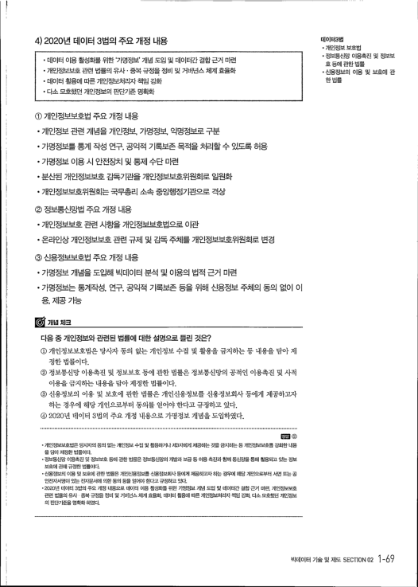
4) 2020년 데이터 3법의 주요 개정 내용

- 데이터 이용 활성화를 위한 ' 가명정보 ' 개념 도입 및 데이터간 결합 근거 마련
- 개인정보보호 관련 법률의 유사 · 중복 규정을 정비 및 거버넌스 체겨I 효율화
- 데이터 횔용에 따른 개인정보처리자 책임 강화
- 다소 모호했던 개인정보의 판단기준 명확화
① 개인정보보호법 주요 개정 내용

- 개인정보 관련 개념을 개인정보 가명정보， 익명정보로 구분
- 가명정보를 통계 작성 연구 , 공익적 기록보존 목적을 처리할 수 있도록 허용
- 가명정보 이용 시 안전장치 및 통제 수단 마련
- 분산된 개인정보보호 감독기관을 개인정보보호위원회로 일원화
- 개인정보보호위원회는 국무총리 소속 중앙행정기관으로 격상
② 정보통신망법 주요 개정 내용

- 개인정보보호 관련 사항을 개인정보보호법으로 이관
- 온라인상 개인정보보호 관련 규제 및 감독 주체를 개인정보보호위원회로 변경
③ 신용정보보호법 주요 개정 내용

- 가명정보 개념을 도입해 빅데이터 분석 및 이용의 법적 근거 마련
- 가명정보는 통계작성 , 연구 , 공익적 기록보존 등을 위해 신용정보 주체의 동의 없이 이
용, 제공 가능 다음 중 개인정I와 관련된 법률에 대한 설명으로 틀린 것은？ ① 개인정보보호법은 당사자 동의 없는 개인정보 수집 및 활용을 금지하는 등 내용을 담아 제 정한 법률이다． ② 정보통신망 이용촉진 및 정보보호 등에 관한 법률은 정보통신망의 공적인 이용촉진 및 사적 이용을 금지하는 내용을 담아 제정한 법률이다． ③ 신용정보의 이용 및 보호에 관한 법률은 개인신용정보를 신용정보회사 등에게 제공하고자 하는 경우에 해당 개인으로부터 동의를 얻어야 한다고 규정하고 있다． ④2020년 데이터 3법의 주요 개정 내용으로 가명정보 개념을 도입하였다．

- 개인첫브보羸법은 당사자의 동의 없는 개인정보 수집 및 활용하거나 제3자에게 저腿｝하는 것을 금지하는등 개인젓보보ㅎ름 강화한 내용 
을 담아 제정한 법률이다．

- 정보됩쑈」망 이용촉진 및 적보보ㅎ 등게 관한 법뮴은 정보틥쑈」망의 개발과 보급 등 이용 촉진과 함께 통신망을 통해 활용되고 있는 정보
보호에 관ㅎfl.구겯拒l 법률이다．

- 신용정보의 이용 및 보호에 관한 법률은 개인신용정보를 신용정보회사 등게게 저隧戮하고자 하는 경두녘게 해당 개인으로부터 서연 또는 공
인전자서영이 있는 전자문서에 의한 동의 등을 얻어야 한다j펴구정하고 있다．

- 2020년 데이터 3법의 주요 개정 내용으로 데이터 이용 활성화를 위한 가영정보 개념 도입 및 데이터간 결합 근거 마련 , 개인젱쉰보호
관련 법률의 유사 중복 구정을 정비 및 거버넌스 체계 효율화, 데이터 활용에 따른 개인정보처리자 책임 강화. 다소 모호했던 개인정보 의 판단기준을 명확화하였다．

> 데이터3법
> - 개인정보 보호법
> - 정보통신망 이용촉진 딪［ 정보보
> 호등에 관한 법률
> - 신용정보의 이용 및 보호에 관
> 한 법률
> ㅌ레②
> 빅더I이터기술및제도SECTION 02 ㅑ 
9

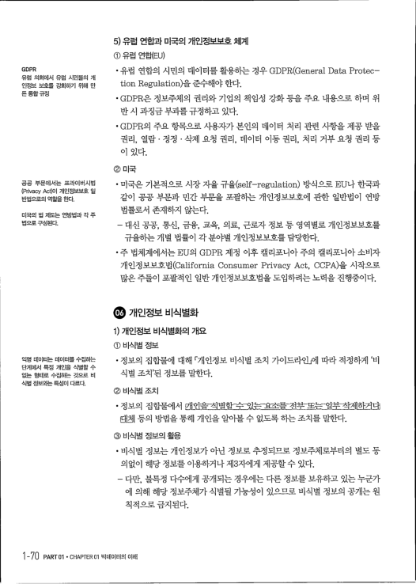
5) 유럽 연합과 미국의 개인정보보호 체계 ① 유럽 연합(Eu)

- 유럽 연합의 시민의 데이터를 활용하는 경우 GDPR(General Data Protec-
tion Regulation）을준수해야 한다． GDPR 유럽 의회에서 유럽 시민들의 개 인정보 보호를 강화하기 위해 만 든통솥縣구정

- GDPR은 정보주쳬의 권리와 가업의 책임성 강화 등을 주요 내용으로 하며 위
반 시 과징금 부과를 予정하고 있다．

- GDPR의 주요 항목으로 사용자가 본인의 데이터 처리 관런 사항을 제공 받을
#### 권리 , 열람 · 정정 · 삭제 요청 권리 , 데이터 이동 권리 , 처리 거부 요청 권리 등
이 있다． ② 미국

- 미국은 기본적으로 시장 자율 구율（self-regulation) 방식으로 EU나 한국과
공공 부문에서는 프라이버시법 (Privacy Act）이 개인정보보호 일 같이 공공 부문과 민간 부문을 포괄하는 개인정보보호에 관한 일반법이 연방 반법으로의 역할을 한다． 법률로서 존재하지 않는다． 미국의 법 제도는 연방법과 각 주 법으로 구성된다．

- 대신 공공 , 통신 , 금융 , 교육 , 의료 , 근로자 정보 등 영역별로 개인정보보호를
규율하는 개별 법률이 각 분야별 개인정보보호를 담당한다．

- 주 법쳬계에서는 EU의 GDPR 제정 이후 캘리포니아 주의 캘리포니아 소비자
개인정보보호법（California Consumer Privacy Act, CCPA）을 시작으로 많은 주들이 포괄적인 일반 개인정보보호법을 도입하려는 노력을 진행중이다 .

.

개인정보 비식별화 1) 개인정보 비식별화의 개요 ① 비식별 정보

- 정보의 집합물에 대해 「개인정보 비식별 조치 가이드라인」에 따라 적정하게 ' 비
익명 데이터는 데이터를 수집하는 단계에서 특정 개인을 식별할 수 없는 형태로 수집하는 것으로 비 식별 조치 ' 된 정보를 말한다． 식별 정보와는특성이 다르다． ② 비식별 조치

- 정보의 집합물에서 매"이숄면식별학샌논있튼요소를ㅍ진부：逕，一임부r착제하거다l
吼쳬 등의 방법을 통해 개인을 알아볼 수 없도록 하는 조치를 말한다． ③ 비식별 정보의 활용

- 비식별 정보는 개인정보가 아닌 정보로 추정되므로 정보주쳬로부터의 별도 동
의없이 해당 정보를 이용하거나 제3자에게 제공할 수 있다．

- 다만 , 불특정 다수에게 공개되는 경우에는 다른 정보를 보유하고 있는 누군가
에 의해 해당 정보주쳬가 식별될 가능성이 있으므로 비식별 정보의 공개는 원 칙적으로 금지된다． 1-70 PART01 * CHAPTER01 빅데이터의 이해

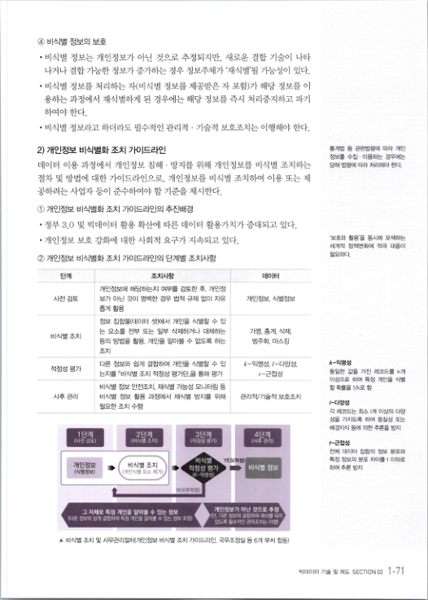
④ 비식별 정보의 보호

- 비식별 정보는 개인정보가 아닌 것으로 추정되지만 , 새로운 결합 기술이 나타
#### 나거나 결합 가능한 정보가 증가하는 경우 정보주체가 ' 재식별 ' 될 가능성이 있다．
- 비식별 정보를 처리하는 자（비식별 정보를 제공받은 자 포함）가 해당 정보를 이
용하는 과정에서 재식별하게 된 경우에는 해당 정보를 즉시 처리중지하고 파기 하여야 한다．

#### · 비식별 정보라고 하더라도 필수적인 관리적 · 기술적 보호조치는 이행해야 한다．
2) 개인정보 비식별화 조치 가이드라인 데이터 이용 과정에서 개인정보 침해 · 방지를 위해 개인정보를 비식별 조치하는 절차 및 방법에 대한 가이드라인으로 , 개인정보를 비식별 조치하여 이용 또는 제 공하려는 사업자 등이 준수하여야 할 기준을 제시한다． ① 개인정보 비식별화 조치 가이드라인의 추진배경

- 정부 3.0 및 빅데이터 활용 확산에 따른 데이터 활용가치가 증대되고 있다．
- 개인정보 보호 강화예 대한 사회적 요구가 지속되고 있다．
② 개인정보 비식별화 조치 가이드라인의 단계별 조차사항 데이터 단계 조치사항 개인정보에 해당하는지 여부를 검토한 후 , 개인정 개인정보식별정보 사전 검토 보가 아닌 것이 명백한 경우 법적 규제 없이 자유 롭게 활용 정보 집합물《데이터 셋）에서 개인을 식별할 수 있 는 요소를 전부 또는 일부 삭제하거나 대체하는 剖F.

錢 -I- 비식별 조치 등의 방법을 활용 , 개인을 알아볼 수 없도록 하는 조치 다른 정보와 쉽게 결합하여 개인을 식별할 수 있 *－익명성．/－다양성， 적정성 평가 는지를 「비식별 조치 적정성 평가단」을 통해 평가

- 
r－근접성 - 비식별 정보 안전瑟 , 재식별 가능성 모니터링 등 軟 ㅎ ㅂ 적 술 적 ja 사후 관리 비식별 정보 활용 과정에서 재식별 방ㅈ屠 위해 필요한 조치 수행 3단계 《적정성 평가》 珊pㅔ （사전 겁토） 2단계 〈비식별 조치） 개인정보 《식별정보） 비식별 조치 （개인식별 요소 제거） , 개인정보가 아닌 것으로 추청 （단， 다른 정보와 결합하여 재식별 되지 않도록 필수석인 관리조치논 이행） 그 자체로 톡정 개인을 알아볼 수 있는 정보 r다른 정보외 쉽게 결합ㅎ］여 특졍 개인올 알아몰 수 있는 정보 포항） ▲ 비식별 조치 및 사두관리절차（개인정보 비식별 조치 가이드라인 . 국무조정실 등 6개 부처 합동）

> 통계법 등 관련법령에 따라 개인
> 정보를 수집 · 이용하는 경우에는
> 당해 법령에 따라 처리해야 한다．
> ‘보호와 활용'을 동시에 모색하는
> 세계적 정책변화에 적극 대응이
> 필요하다．
> *－익명성
> 동일한 값을 가진 레코드를 k개
> 이상으로 하《겨 특정 개인을 식별 
할 확률을 1/（로 함

> /－다양성 
각 레코드는 최소 매 이상의 다양 성을 가지도록 하여 동질성 또는

> 배경지식 뒹게 의한 추론을 방지
> '－근접성 
전체 데이터 집합의 정보 분포와 특정 정보의 분포 차이를 t 이하로 하여 추론 방지

> 빅데이터 기술 및 제도 SECTION 02 1 -71
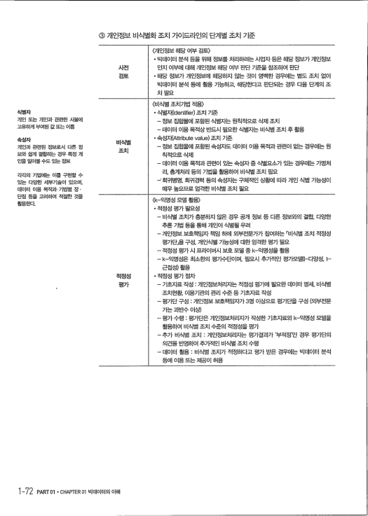
③ 개인정보 비식별화 조치 가이드라인의 단계별 조치 기준 〈개인정보 해당 여부 검토＞

- 빅데이터 분석 등을 위해 정보를 처리하려는 사업자 등은 해당 정보가 개인정보
인지 여부에 대해 개인정보 해당 여부 판단 기준을 참조하여 판단 사전 검토

- 해당 정보가 개인정보에 해당하지 않는 것이 명백한 경우에는 별도 조치 없이
빅데이터 분석 등에 흴용 가능하ㅍ 해당힌다고 핀단되는 경우 다음 단계의 조 치 필요 ＜비식별 조치기법 적용〉 식별자 개인 또는 개인과 곤븟크한 사물에 고유하게 부여된 값 또는 이름

- 식별자ㅇdentifier) 조치 기준 
- 정보 집합믈에 포함된 식별자는 원칙적으로 삭제 조치
- 데이터 이용 목적상반드시 필요한 식별자는 비식별 조치 후 활용
- 속성자（Attribute value) 조치 기준 
- 정보 집합쿨게 포함된 속성자도 데이터 이용 목적과 관련이 없는 경우에는 원
속성자 개인과 관련된 정보로서 다른 정 보와 쉽게 결합하는 경우 특정 개 인을 알아볼 수도 있는 정보 비식별 조치 칙적으로삭제

- 데이터 이용 목적과 곤昱크《기 있는 속성자 중 식별요소가 있는 경우에는 가명처
리 , 총계처리 등의 기법을 활용하여 비식별 조치 필요 각각의 기법에는 이를 구헌할 수 있는 다양한 세부기술이 있으며， 데이터 이용 목적과．기법별 장· 단점 등을 고려하여 적절한 것을 굽 희귀병명 , 희귀경력 등의 속셩자는 구체적인 상황에 따라 개인 식별 가능성이 매우 높으므로 엄격한 비식별 조치 필요 (k－익명성 모델 횔용＞ 횔용한다．

- 적정성 평가 필요성
- 비식별 조치가 豁：하지 않은 경우 공개 정보 등 다른 정보와의 결합, 다양한
추론 기법 등을 통해 개인이 식벌될 우려

- 개인정보 보호책임자 책임 하에 외부전문가가 참여하는 「비식별 조치 적정성
평가단」을 구성 , 개인식별 가능성에 대한 엄격한 평가 필요

- 적정성 펑가 시 프라이버시 보호 모델 중 (－익명성을 횔용 
카（－익명츤은 최소한의 평가수단이며 , 필요시 추가적인 평가모델（I－다양성 , t- 근접성） 활용

- 적정성 평가 절차 
- 기초차료 작성 : 개인정보처리자는 적정성 평가에 필요한 데이터 명세 , 비식별
적정성 평가 조치현황, 이용기관의 관리 수준 등 기초차료 작성

- 펑가단 구성 : 개인정보 보호책임자가 3명 이상으로 평가단을 구셩 （외부전문
가는 과반수 이상）

- 펑가 수행 : 평가단은 개인정보처리자가 작성한 기초지료와 (－익명성 모델을
활용하여 비식별 조치 수준의 적정성을 펑가 －추가 비식별 조치 : 개인정보처리자는 평가결과가 ' 부적정 ' 인 경우 펑가단의 의견을 반영하여 추가적인 비식별 조치 수행

- 데이터 횔용 : 비식별 조치가 적정하다고 평가 받은 경우에는 빅데이터 분석
등에 이용 또는 제공이 허용 1-72 PART01 · CHAPTER01 빅데이터의 이해

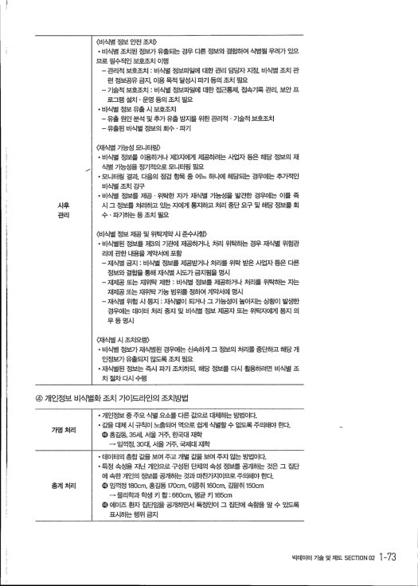
〈비식별 정보 안전 조치＞

- 비식별 조치된 정보가 유출되는 경우 다른 정보와 결합하여 식별될 우려가 있으
므로 필수적인 보호조치 이행

- 관리적 보호조치 : 비식별 정보파일에 대한 관리 담당자 지정 , 비식별 조치 관
련 정보공유 금지 , 이용 목적 달성시 파기 등의 조치 필요

- 기술적 뿌ㅎ不치 : 비식별 정보파일에 대한 접근통제 , 접속기록 관리 , 보안 프
로그램 설치 · 운영 등의 조치 필요

- 비식별 정보 유출 시 ㅂㅎ下치
- 유출 원인 분석 및 추가 유출 방지를 위한 관리적 · 기술적 브ㅎ不치
- 유출된 비식별 정보의 회수 · 파기
〈재식별 가능성 모니터링〉

- 비식별 정보를 이용하거나 제3차에게 저隧，하려는 사업자 등은 해당 정보의 재
식별 가능성을 정기적으로 모니터링 필요 궂／

- 모니터링 결과. 다음의 점검 항목 중 어느 하나에 해당되는 경우에는 추가적인
비식별 조치 강구

- 비식별 정보를 제공 · 위탁한 자가 재식별 가능성을 발견한 경우에는 이를 즉
시 그 정보를 처리하고 있는 자에게 통지하고 처리 중단 요구 및 해당 정보를 회 사후 수 · 파기하는 등 조치 필요 관리 ＜비식별 정보 저居 및 위탁계약 시 긁사항＞

- 비식별된 정보를 제3의 기관에 저居하거나. 처리 위탁하는 경우 재식별 위험관
리에 관한 내용을 계약서에 포함

- 재식별 금지 : 비식별 정보를 저隧：받거나 처리를 위탁 받은 사업자 등은 다른
정．보돠 결합을 통해 재식별 시도가 금지됨을 명시

- 재저곧 또는 재위탁 제한 : 비식별 정보를 제공하거나 처리를 위탁하는 자는
재저꼼 또는 재위탁 가능 범위를 정하여 계약서에 명시

- 재식별 위험 시 통지 : 재식별이 되거나 그 가능성이 높아지는 상황이 발생한
경우에는 데이터 처리 중지 및 비식별 정보 저居자 또는 위탁자에게 통지 의 무 등 명시 〈재식별 시 조치요령＞

- 비식별 정보가 재식별된 경우에는 신속하게 그 정보의 처리를 중단하고 해당 개
인정보가 유출되지 않도록 조치 필요

- 재식벌된 정보는 즉시 파기 조치하되 , 해당 정보를 다시 횔용하려면 비식별 조
치 절차 다시 수행 ④ 개인정보 비식별화 조치 가이드라인의 조치방법

- 개인정보 중 주요 식별 요소를 다른 값으로 대체하는 방법이다．
- 값을 대체 시 규칙이 노출되어 역으로 쉽게 식별할 수 없도록 주의해야 한다． 
c[I 홍길동, 35세 , 서울 거주. 한국대 재학 →임꺽정 , 30대 , 서울 거주. 국제대 재학 가명 처리

- 데이터의 총합 값을 보여 주고 개별 값을 보여 주지 않는 방법이다．
- 특정 속성을 지닌 개인으로 구성된 딘떼의 속셩 정보를 공개하는 것은 그 집단
에 속한 개인의 정보를 공개하는 것과 마찬가지이므로 주의해야種따． c[I 임꺽정 180cm , 홍길동 170cm . 이콩쥐 160cm , 김팥쥐 150cm → 물리학과 학생 키 합 : 660cm , 평균 키 165cm cl 에이즈 환자 집단임을 공개하면서 특정인이 그 집단에 속함을 알 수 있도록 총계 처리 끄치하는 행위 금지

> 빅데이터 기술및제도 SECTION 02 1 -73
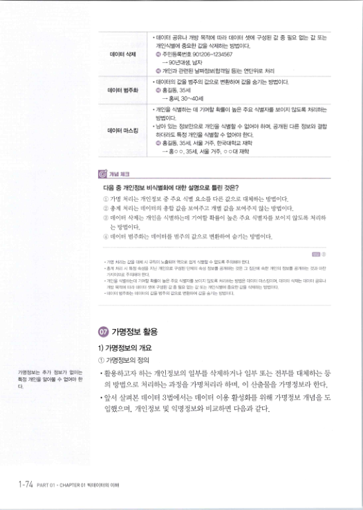
- 데이터 공유나 개방 목적에 따라 데이터 셋에 구성된 값 중 필요 없는 값 또는
개인식별에 중요한 값을 삭제하는 방법이다． .lI 주민등록번호 901206-1234567 데이터 삭제 →90년대생 , 남자 c[I 개인과 관련된 날짜정보（합격일 등）는 연단위로 처리

- 데이터의 값을 범주의 값으로 변환하여 값을 숨기는 방법이다． 
c[I 훙길동 , 35세 → 홍씨． 30'40세 데이터 범주화

- 개인을 식별하는 데 기여할 확률이 높은 주요 식별자를 보이지 않도록 처리하는
방법이다 .

- 남아 있는 정보만으로 개인을 식별할 수 없어야 하며 , 공개된 다른 정보와 결합
데이터 마스킹 하더라도 특정 개인을 식별할 수 없어야 한다 .

o 홍길동 . 35제 . 서울 거주 , 한국대학교 재학 → 홍○ 0 ,35세 , 서울 거주 , 00대 재학 다음 중 개인정보 비식별화에 대한 설명으로 틀린 것은？ ① 가명 처리는 개인정보 중 주요 식별 요소를 다른 값으로 대체하는 방법이다． ② 총계 처리는 데이터의 총합 값을 보여주고 개별 값을 보여주지 않는 방법이다． ③ 데이터 삭제는 개인을 식별하는데 기여할 확률이 높은 주요 식별자를 보이지 않도록 처리하 는 방법이다． ④ 데이터 범주화는 데이터를 범주의 값으로 변환하여 숨기는 방법이다．

- 가명 처리는 값을 대체 시 규칙이 노출되어 역으로 쉽게 식별할 수 없도록 주의해야 힌빠．
- 총계 처리 시 특정 속성을 지닌 개인으로 구성된 단처H 속성 첫보를 공개하는 것은 그 집단에 속한 개인의 정보를 공개하는 것과 마찬
가지이므로 주의해야 한다．

- 개인을 식별하는데 기여할 확률이 높은 주요 식별자를 보oI 
않도록 처ㄹ同는 방법은 더”〕隅 아스킹이며 . 더泊同 삭처怜굿 더ㅐ）H 공유나 개방 목적에 따라 데이터 셋에 구성된 값 중 필요 없는 값 또는 개인식별에 중요한 값을 삭제하는 빙땝이다，

* 데이터 범주화는 데이터의 값을 범주의 값으로 변환하여 값을 숨기는 방법이다．
#### ㅇ 가명정보 활용
1) 가명정보의 개요 ① 가명정보의 정의 가명정보는 추가 정보가 없이는 특정 개인을 알아볼 수 없어야 한

- 활용하고자 하는 개인정보의 일부를 삭제하거나 일부 또는 전부를 대쳬하는 등
의 방법으로 처리하는 과정을 가명처리라 하며 , 이 산출물을 가명정보라 한다． 다．

- 앞서 살펴본 데이터 3법에서는 데이터 이용 활성화를 위해 가명정보 개념을 도
입했으며 , 개인정보 및 익명정보와 비교하면 다음과 같다． ㅏ 4 PART01 . CHAPTER01 빅데이터의이해

#### ri ③
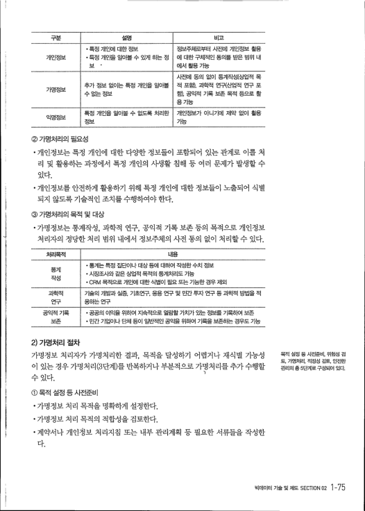
구분 설명 비고 개인정보

- 특정 개인에 대한 정보
정보주처隍부터 사전에 개인정보 흴용 0ㅔ 대한 구체적인 동의를 받은 범위 내

- 특정 개인을 알아볼 수 있게 하는 정 
보 ' 에서 횔용 가능 사전에 동의 없이 통계작성（상업적 목 적 포함） , 과학적 연구《산업적 연구 포 가명정보 추가 짇槍i 없이는 특정 개인을 알아볼 함） , 공익적 기록 보존 목적 등으로 활 용 가능 수 없는 정보 익명정보 특정 개인을 일아볼 수 없도록 처리한 개인정보가 아니기에 제약 없이 횔용 정보 가능 ② 가명처리의 필요성

- 개인정보는 특정 개인에 대한 다양한 정보들이 포함되어 있는 관계로 이를 처
리 및 활용하는 과정에서 특정 개인의 사생활 침해 등 여러 문제가 발생할 수 있다．

- 개인정보를 안전하게 활용하기 위해 특정 개인에 대한 정보들이 노출되어 식별
되지 않도록 기술적인 조치를 수행하여야 한다． ③ 가명처리의 목적 및 대상

#### · 가명정보는 통계작성 , 과학적 연구 , 공익적 기록 보존 등의 목적으로 개인정보
처리자의 정당한 처리 범위 내에서 정보주쳬의 사전 동의 없이 처리할 수 있다． 처리목적 내용 뒈 一一

- 통계는 특정 집단이나 대상 등에 대하여 작성한 수치 정보
- 시장조사와 같은 상업적 목적의 통계처리도 가능 
- CRM 목적으로 개인에 대한 식별이 필요 또는 가능한 경우 제외
기술의 개발과 실증, 기초연구. 응용 연구 및 민간 투자 연구 등 과학적 방법을 적 과학적 용하는연구 연구

- 공공의 이익을 위하여 지속적으로 열람할 가치가 있는 정보를 기록하여 보존
공익적 기록

- 민간 기업이나 단체 등이 일반적인 공익을 위하여 기록을 보존하는 경우도 가능
보존 2) 가명처리 절차

#### 가명정보 처리자가 가명처리한 결과 , 목적을 달성하기 어렵거나 재식별 가능성
이 있는 경우 가명처리（3단계）를 반복하거나 부분적으로 가명처리를 추가 수행할 놈 수 있다． ① 목적 설정 등 사전준비

- 가명정보 처리 목적을 명확하게 설정한다．
- 가명정보 처리 목적의 적합성을 검토한다．
- 계약서나 개인청보 처리지침 또는 내부 관리계획 등 필요한 서류들을 작성한
다．

> 목적 설정 등 사전준비 . 위험성 검
> 토， 가명처리 . 적정성 검토， 안전한 
관리의 총 5단계로 구성되어 있다．

> 빅데이터 기술 및 제도 SECTION02 1-75
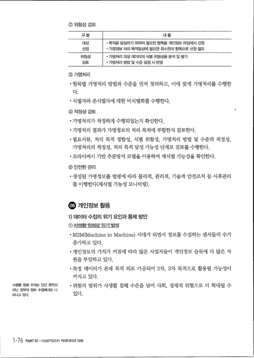
② 위험성 검토 구분 내용

- 목적을 달성하기 위하여 필요한 항목을 개인정보 파일0牀 선정
대상

- 가명정보 처리 목적달성에 필요한 최소한의 항목으로 선정 필요
선정 위험성 검토

- 가명처리 대상 데이터의 식별 위험성을 분석 및 평가 
- 가명처리 방법 및 수준 설정 시 반영
③ 가명처리

- 항목별 가명처리 방법과 수준을 먼저 정의하고 , 이에 맞게 가명처리를 수행한
다．

- 식별자와 준식별자에 대한 비식별화를 수행한다．
④ 적정성 검토

- 가명처리가 적정하게 수행되었는지 확인한다．
- 가명처리 결과가 가명정보의 처리 목적에 부합한지 검토한다．
#### · 필요서류 , 처리 목적 정합성 , 식별 위험성 , 가명처리 방법 및 수준의 적정성，
#### 가명처리의 적정성 , 처리 목적 달성 가능성 단계로 검토를 수행한다．
- 프라이버시 기반 추론방지 모델을 이용하여 재식별 가능성을 확인한다．
⑤ 안전한 관리

#### · 생성된 가명정보를 법령에 따라 물리적 , 관리적 , 기술적 안전조치 등 사후관리 
를 이행한다（재식별 가능성 모니터링）.

.

개인정보 활용 1) 데이터 수집의 위기 요인과 통제 방안 ① 鑒控브활효흐＂隱－위기－빚삥

- M2M(Machine to Machine) 시대가 되면서 정보를 수집하는 센서들의 수가
증가하고 있다．

- 개인정보의 가치가 커짐에 따라 많은 사업자들이 개인정보 습득에 더 많은 자
원을 투입하고 있다．

#### · 특정 데이터가 본래 목적 외로 가공되어 2차 , 3차 목적으로 활용될 가능성이
커지고 있다．

#### · 위험의 범위가 사생활 침해 수준을 넘어 사회 , 경제적 위협으로 더 확대될 수
사생활 침해 우려는 민간 뿐만이 아닌 정부의 정보 수집에서도 나 타나고 있다． 있다． 1-76 PART01 · CNAPTER01 빅데이터의 이해

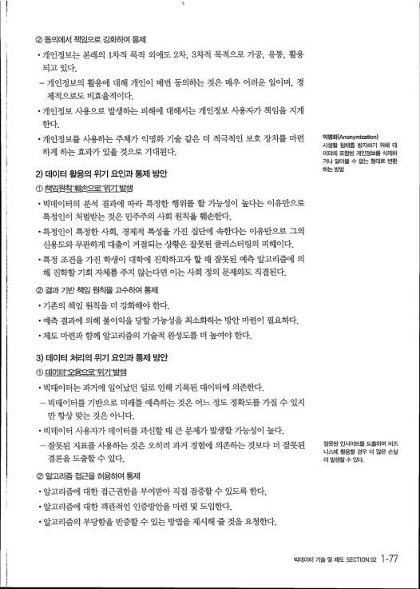
② 동의에서 책임으로 강화하여 통제

#### · 개인정보는 본래의 1차적 목적 외에도 2차 , 3차적 목적으로 가공 , 유통 , 활용
되고 있다．

- 개인정보의 활용에 대해 개인이 매번 동의하는 것은 매우 어려운 일이며 , 경
제적으로도 비효율적이다．

- 개인정보 사용으로 발생하는 피해에 대해서는 개인정보 사용자가 책임을 지게
한다．

- 개인정보를 사용하는 주쳬가 익명화 기술 같은 더 적극적인 보호 장치를 마련
하게 하는 효과가 있을 것으로 기대된다． 2) 데이터 활용의 위기 요인과 통제 방안 ① 챔있원칙훼손：으로훗亡tl발생

- 빅데이터의 분석 결과에 따라 특정한 행위를 할 가능성이 높다는 이유만으로
특정 인이 처벌받는 것은 민주주의 사회 원칙을 훼손한다．

#### · 특정인이 특정한 사회 , 경제적 특정을 가진 집단에 속한다는 이유만으로 그의
신용도와 무관하게 대출이 거절되는 상황은 잘못된 클러스터링의 피해이다．

- 특정 조건을 가진 학생이 대학에 진학하고자 할 때 잘못된 예측 알고리즘에 의
해 진학할 기회 자쳬를 주지 않는다면 이는 사회 정의 문제와도 직결된다． ② 결과 기반 책임 원칙을 고수하여 통제

- 기존의 책임 원칙을 더 강화해야 한다．
- 예측 결과에 의해 불이익을 당할 가능성을 최소화하는 방안 마런이 필요하다．
- 제도 마런과 함께 알고리즘의 기술적 완성도를 더 높여야 한다 .
3) 데이터 처리의 위기 요인과 통제 방안

#### ① 데희틔‘谿으 雀빌쌩
- 빅데이터는 과거에 일어났던 일로 인해 기록돤 데이터에 의존한다．
- 빅데이터를 기반으로 미래블 예측하는 것은 어느 정도 정확도를 가질 수 있지 
만 항상 맞는 것은 아니다．

- 빅데이터 사용자가 데이터를 과신할 때 큰 문제가 발생할 가능성이 높다．
- 잘못된 지표를 사용하는 것은 오히려 과거 경험에 의존하는 것보다 더 잘못된
결론을 도출할 수 있다． ② 알고리즘 접근을‘허용하여 통제

- 알고리즘에 대한 접근권한을 부여받마 직접 검증할 수 있도록 한다．
- 알고리즘에 대한 객관적인 인증방안을 마런 및 도입한다．
- 알고리즘의 부당함을 반증할 수 있는 방법을 제시해 줄 것을 요청한다．
> 익명화《Anonymization)
> 사생활 침해를 방지하기 위해 데
> 이터에 포함된 개인정보를 삭제하
> 거나 알아볼 수 없는 형태로 변환
> 하는 방법
> 잘못돈l 인새기트를 도출하여 비즈
> 니스에 활용할 경우 더 많은 손실 
이 발생할 수 있다．

> 빅데이터기술및제도SECTION 02 1 -77
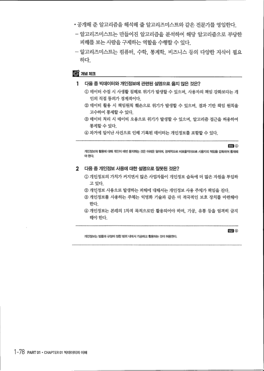
- 공개해 준 알고리즘을 해석해 줄 알고리즈미스트와 같은 전문가를 영입한다．
- 알고리즈미스트는 만들어진 알고리즘을 분석하여 해당 알고리즘으로 부당한
피해를 보는 사람을 구제하는 역할을 수행할 수 있다．

- 알고리즈미스트는 컴퓨터 , 수학 , 통계학 , 비즈니스 등의 다양한 지식이 필요
하다． 1 다음중 빅데이터와개인정보에 관련된 설명으로옳지 않은 것은？ ①） 데이터 수집 시 사생활 침해로 위기가 발생할 수 있으며 , 사용자의 책임 강화보다는 개 인의 직접 동의가 경제적이다． ② 데이터 활용 시 책임원칙 훼손으로 위기가 발생할 수 있으며 , 결과 기반 책임 원칙을 고수하여 통제할 수 있다． ③ 데이터 처리 시 데이터 오용으로 위기가 발생할 수 있으며 , 알고리즘 접근을 허용하여 통제할 수 있다． ④ 과거에 일어난 사건으로 인해 기록된 데이터는 개인정보를 포함할 수 있다． 개인정보의 활용께 대해 개인이 매번 동의하는 것은 어려운 일이며 , 경제적으로 비효율적이므르 사용자의 책임을 강화하여 통제해 야 한다． 2 다음중 개인정보사용에 대한설명으로 잘못된 것은？ ① 개인정보의 가치가 커지면서 많은 사업자들이 개인정보 습득에 더 많은 자원을 투입하 고 있다． ② 개인정보 사용으로 발생하는 피해에 대해서는 개인정보사용 주쳬가 책임을 진다． ③ 개인정보를 사용하는 주쳬는 익명화 기술과 같은 더 적극적인 보호 장치를 마련해야 한다． ④ 개인정보는 본래의 11차적 목적으로만 활용되어야 하며 , 가공 , 유통 등을 엄격히 금지 해야 한다． 개인정보는 법률＝嘶구정이 정한 범위 내에서 가공하고 활용하는 것이 허용된다． 1-78 PART 01 . CHAPTER 01 빅데이터의 이해

> ㅁ레 ①
> E비 ④
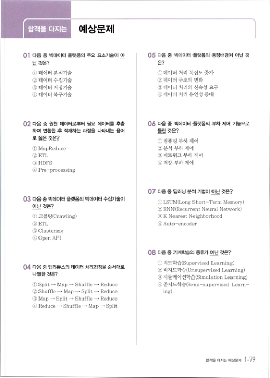
## 합격을 다지는 
예상문제 05 다음 중 빅데이터 플랫폼의 등장배경이 아닌 것 01 다음 중 빅데이터 플랫폼의 주요 요소기술이 아 닌 것은？ 은？ ① 데이터 처리 복잡도 증가 ② 데이터 구조의 변화 ③ 데이터 처리의 신속정 요구 ④ 데이터 처리 유연성 증대 ① 데이터 분석기술 ② 데이터 수집기술 ③데이터 저장기술 ④ 데이터 복구기술 06 다음 중 빅데이터 플랫폼의 부하 제어 기능으로 02 다음 중 원천 데이터로부터 필요 데이터를 추출 틀린 것은？ 하여 변환한 후 적재하는 과정을 나타내는 용어 로 옳은 것은？ ① 컴퓨팅 부하 제어 ② 분석 부하 제어 ③ 네트워크 부하 제어 ④ 저장 부하 제어 D MapReduce ②ETL ③HDFS ④Pre-processing 07 다음 중 딥러닝 분석 기법이 아닌 것은？ 03 다음 중 빅데이터 플랫폼의 빅데이터 수집기술이 @ LSTM(Long Short-Term Memory) ② RNN(Recurrent Neural Network) 아닌 것은？ ① 크롤링（Crawling) ②ETL ③Clustering ④Open API 《죠 K Nearest Neighborhood ④ Auto-encoder 08 다음 중 기계학습의 종류가 아닌 것은？ ① 지도학습（Supervised Learning) ② 비지도학습（Unsupervised Learning) ③ 시뮬레이션학습（Simulation Learning) ④준지도학습（Semi-supervised Learn- ing) 04 다음 중 맵리듀스의 데이터 처리과정을 순서대로 나열한 것은？ D Split - Map - Shuffle - Reduce ② Shuffle - Map -. Split - Reduce ③ Map - Split - Shuffle - Reduce ④ Reduce - Shuffle - Map - Split

> 합격을다지는예상문제 ㅑ 9
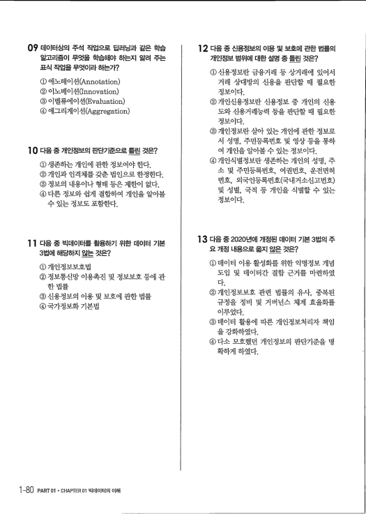
09 데이터상의 주석 작업으로 딥러닝과 같은 학습 12 다음 중 신용정보의 이용 및 보호에 관한 법률의 개인礖 범위에 대한 설명 중 틀린 것은？ 알고리즘이 무엇을 학습해야 하는지 알려 주는 표식 작업을 무엇이라 하는가？ ① 신용정보란 금융거래 등 상거래에 있어서 거래 상대방의 신경을 판단할 때 필요한 ① 애노테이션（Annotation) ② 이노베이션（Innovation) ③ 이벨류에이션（Evaluation) ④ 애그리게이션（Aggregation) 정보이다． ② 개인신용정보란 신용정보 중 개인의 신용 도와 신용거래능력 등을 판단할 때 필요한 정보이다． ③ 개인정보란 살아 있는 개인에 관한 정보로 서 성명 , 주민등록번호 및 영상 등을 통하 여 개인을 알아볼 수 있는 정보이다． ④개인식별정보란생존하는개인의 성명 , 주 소 및 주민등록번호 , 여권번호 , 운전면허 번호 , 외국인등록번호（국내거소신고번호） 및 성별 , 국적 등 개인을 식별할 수 있는 정보이다 .

10 다음 중 개인정보의 판단기준으로 툴린 것은？ ① 생존하는 개인에 관한 정보여야 한다． ② 개인과 인격쳬를 갖춘 법인으로 한정한다． ③ 정보의 내용이나 형태 등은 제한이 없다． ④ 다른 정보와 쉽게 결합하여 개인을 알아볼 수 있는 정보도 포함한다． 13 다음 중 2020년에 개정된 데이터 기본 3법의 주 요 개정 내용으로 옳지 않은 것은？ 11 다음 중 빅데이터를 활용하기 위한 데이터 기본 3법에 해당하지 않는 것은？ ① 데이터 이용 활성화를 위한 익명정보 개넘 도입 및 데이터간 결합 근거를 마련하였 ① 개인정보보호법 ② 정보통신망 이용촉진 및 정보보호 등에 관 한 법률 ③ 신용정보의 이용 및 보호에 관한 법률 ④ 국가정보화 기본법 다． ②개인정보보호 관련 법률의 유사 , 중복된 규정을 정비 및 거버넌스 쳬계 효율화를 이루었다． ③ 데이터 활용에 따른 개인정보처리자 책임 을 강화하였다． ④ 다소 모호했던 개인정보의 판단기준을 명 확하게 하였다． 1-80 PART01 . CHAPTER01 빅데이터의 이해

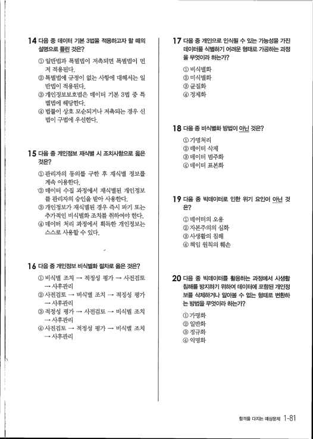
14 다음 중 데이터 기본 3법을 적용하고자 할 때의 17 다음 중 개인으로 인식될 수 있는 가능성을 가진 설명으로 틀린 것은？ 데이터를 식별하기 어려운 형태로 가공하는 과정 을 무엇이라 하는가？ ① 일반법과 특별법이 저촉되면 특별법이 먼 저 적용된다． ②특별법에 규정이 없는 사항에 대해서는 일 반법이 적용된다． ③ 개인정보보호법은 데이터 기본 3법 중 특 별법에 해당한다． ④ 법률이 상호 모순되거나 저촉되는 경우 신 법이 구법에 우선한다． ① 비식별화 ② 미식별화 ③균질화 ④ 정제화 18 다음 중 비식별화 방법이 아닌 것은？ ① 가명처리 ② 데이터 삭제 ③데이터 범주화 ④ 데이터 표본화 1 5 다음 중 개인정보 재식별 시 조치사항으로 옳은 것은？ ①관리자의 동의를 구한 후 재식별 정보를 계속 이용한다． ‘②데이터 수집 과정에서 재식별된 개인정보 를 관리자의 승인을 받아 사용한다． ③ 개인정보가 재식별된 경우 즉시 파기 또는 추가적인 비식별화 조치를 취하여야 한다． ④데이터 처리 과정에서 획득한 개인정보는 스스로 사용할 수 있다．

#### 1 9 다음 중 빅데이터로 인한 위기 요인이 아닌 것
은？ ① 데이터의 오용 ② 자본주의의 심화 ③ 사생활의 침해 ④ 책임 원칙의 훼손 1 6 다음 중 개인정보 비식별화 절차로 옳은 것은？ ① 비식별 조치 －→ 적정성 평가 －→ 사전검토

- 사후관리 
②사전검토 → 비식별 조치 → 적정성 평가 → 사후관리 ③ 적정성 평가 → 사전검토 → 비식별 조치 → 사후관리 ④사전검토 → 적정성 평가 → 비식별 조치 → 사후관리 20 다음 중 빅데이터를 횔용하는 과정에서 사생활 침해를 방지하기 위하여 데이터에 포함된 개인정 보를 삭제하게나 알아볼 수 없는 형태로 변환하 는 방법을 무엇이라 하는가？ ①가명화 ② 일반화 ③ 정규화 ④ 익명화

> 합격을다지는예상문제 1-81
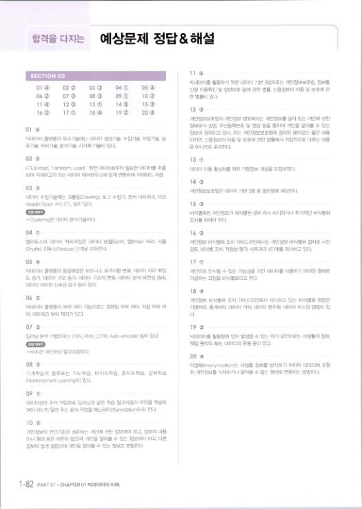
## 예상문제 정답＆해설
11 ④ .… ………… … ………∼…………………………………→ …… SECTION 02 빅데이터를 활용하기 위한 데이터 기본 3법으로는 개인정보보호법 정보통 0l ④ 02 ② 03 ③ 05 （④ l0 ② 04D 신망 이용촉진 및 정보보호 용）ㅔ 관한 법률 . 신용정보의 이용 및 보호에 관 06 ② il ④ 07 （軫 08 c) 09 ① 한 법률이 있다． 12 ③ 13 (j:) 14 〈휼：) 15 ③ 12 ③  .

③ .

③ .. .. .. ... ... . . ... ... .... .... .... .... ........ ........ ... . ...... ... .... .. ... .... ... .

...... .... .

17 (j:) 19 ② 20 （軫 16 ② 18 @) 개인정보보호법의 개인정보 범위에서는 개인정보를 살아 있는 개인에 관한 정보로서 성명 , 주민등록번호 및 영상 등을 통하여 개인을 알아볼 수 있는 01 ④ …… ……………… … … … ∼……………………………－…… 정보라 정의하고 있다． 이는 개인정보보호법에 정의된 왕거로는 옳은 내용 빅데이터 플랫폼의 요소기술에는 데이터 생성기술． 수집기술 . 저장기술． 공 이지만 , 신용정보의 이용 및 보호0ㅔ 관한 법률게서 직접적으로 다루는 내용 은 아니므로 주의한다， 유기술． 처리기술 , 분석기술 , 시각화 기술이 있다． 02 ② … … …… … … ……………………………………… … 13 ① ETL(Extract, Transform, Load) : 원천 데이터로부터 필요한 데이터를 추출 데이터 이용 활성화를 위한 가명정보 개념을 도입하였다， 하여 적재하고자 하는 데이터 웨어하우스에 맞게 변환하여 적재하는 과정 14 c) …… …… 03 ③ ( …… …………………………∼ ∼ …………… 개인정보보호법은 데이터 기본 3법 증 일반법에 해당한다． 데이터 수집기쉽비는 크롤링（Crawling). 로그 수집기 . 센서 네트워크． RSS Reader/Open API, ETL 등이 있다． 15 ③ ............................... ..... ............ .................. ....................... ...... ...... ................ ...... .......

齟軻囹．· 비식별화된 개인정보가 재식별된 경우 즉시 파기하거나 추가적인 비식별화

- Clustering은 데이터 분석기술이다．
조치를 하여야 한다． 04 (j：》 16 ② ………………………………∼…∼…………………………………－6 맵리듀스의 데이터 처리과정은 데이터 분할（Split), 맵（Map) 처리． 셔플 개인정보 비식별화 조치 가이드라인에서는 개인정보 비식별화 절차로 사전 (Shuffle), 리듀r늬Reduce) 단켸로 이어진다． 검토， 비식별 조치． 적정성 평가． 사후관리 4단계를 제시하고 있다』 OS ④ … … ……………… …… ………∼……………… 17 <j:>  .

<j:> .

<j:> .

<j:> .

<j:> ....... ............................................ ................ .... .. .... ....................................................... ..

빅데이터 플랫폼의 등장배경은 비즈니스 요구사항 변화, 데이터 처리 복잡 도 증가. 데이터 규모 증가． 데이터 구조의 변화. 데이터 분석 유연성 증대． 개인으로 인식될 수 있는 가능성을 가진 데이터를 식별하기 어려운 형태로 가공하는 과정을 비식별화라고 한다． 데이터 처리의 신속성 요구 등이 있다， 18 ④ …… ……… …… … 06 ② 개인정보 비식별화 조치 개기드라인에서 제시하고 있는 비식별화 방법은 빅데이터 플랫폼의 부하 제어 기능으로는 컴퓨팅 부하 제어， 저장 부하 제 가명처리． 총계처리， 데이터 삭제， 데이터 범주화. 데이터 마스킹 방법이 있 어 . 네트워크 부하 제어가 있다； 다， 07 ③ 19 ② ……一…… … ∼ ………………… 딥러닝 분석 기법으로는 CNN. RNN. LSTM, Auto-encoder 등이 있다． －饉. ·

- KNN은 머신러닝 알고리즘이다．
빅데이터를 활용흔뻬 있어 발생할 수 있는 위기 요인으로는 사생활의 침해， 책임 원칙의 훼손， 데이터의 오용 등이 있다； 20 ④ 08 ③ 익명화（Anonymizalion＞는 사생활 침해를 방지하기 위하여 데이터에 포함 된 개인정보를 삭제하거나 알아볼 수 없는 형태로 변환하는 벋볕」이다． 기계학습의 종류로는 지도학습， 비지도학습 . 준지도학습， 강화학습 (Reinforcement Learning）이 있다 09 ① 데이터상의 주석 작업으로 딥러닝과 같은 학습 알고리즘이 무엇을 학습하 여야 하는지 알려 주는 표식 작업을 애노테이션（annotation）이라 한다． 10 ② 개인정보의 판단기준은 생존하는 개인에 관한 정보여야 하고 , 정보의 내용 이나 형태 등은 제한이 없으며 . 개인을 알아볼 수 있는 정보여야 하고， 다른 정보와 쉽게 결합하여 개인을 알아볼 수 있는 정보도 포함한다． 1 -82 PART 01 . CHAPTER 01 빅데이터의 이해
