# PART 04. 분석결과 해석 및 활용

## CHAPTER 01 분석결과 해석 및 활용
분석결과 표현 및 해석에 중요하게 사용되는 데이터 시각화에 대해서 학습합니다. 시각화 유형(시간, 공간, 관계, 분포 비교 시각화)에 적합한 시각화 도구들의 특징과 장·단점을 비교해서 이해하는 것이 중요합니다. 분석모형 전개 단계의 역할과 필요 작업들도 정확하게 알아야 합니다.

| 출제 빈도       |
| :-------------- |
| SECTION 01: 15% |
| SECTION 02: 60% |
| SECTION 03: 25% |

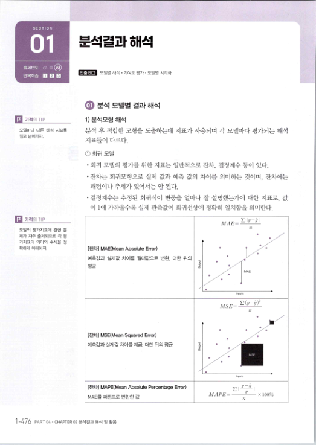

# SECTION 01 분석결과 해석

> **빈출 태그**
> - 모델별 해석, 기여도 평가, 모델별 시각화

## 01 분석 모델별 결과 해석

### 1) 분석모형 해석
분석 후 적합한 모형을 도출하는 데 지표가 사용되며 각 모델마다 평가되는 지표들이 다르다.

#### ① 회귀 모델
- 회귀 모델의 평가를 위한 지표는 일반적으로 **잔차**, **결정계수** 등이 있다.
- **잔차**는 회귀모형으로 실제 값과 예측 값의 차이를 의미하는 것이며, 잔차에는 패턴이나 추세가 있어서는 안 된다.
- **결정계수**는 추정된 회귀식이 변동을 얼마나 잘 설명했는가에 대한 지표로, 값이 1에 가까울수록 실제 관측값이 회귀선상에 정확히 일치함을 의미한다.

> **기적의 TIP**
> 모델의 평가지표에 관한 문제가 자주 출제되므로 각 평가지표의 의미와 수식을 정확하게 이해하자.

| 지표                                         | 설명                     | 수식                                   |
| :------------------------------------------- | :----------------------- | :------------------------------------- |
| **MAE**<br>(Mean Absolute Error)             | 잔차의 절댓값 평균       | $\frac{1}{n} \sum                      | y_i - \hat{y}_i             | $ |
| **MSE**<br>(Mean Squared Error)              | 잔차의 제곱 평균         | $\frac{1}{n} \sum (y_i - \hat{y}_i)^2$ |
| **MAPE**<br>(Mean Absolute Percentage Error) | MAE를 퍼센트로 변환한 값 | $\frac{100\%}{n} \sum                  | \frac{y_i - \hat{y}_i}{y_i} | $ |

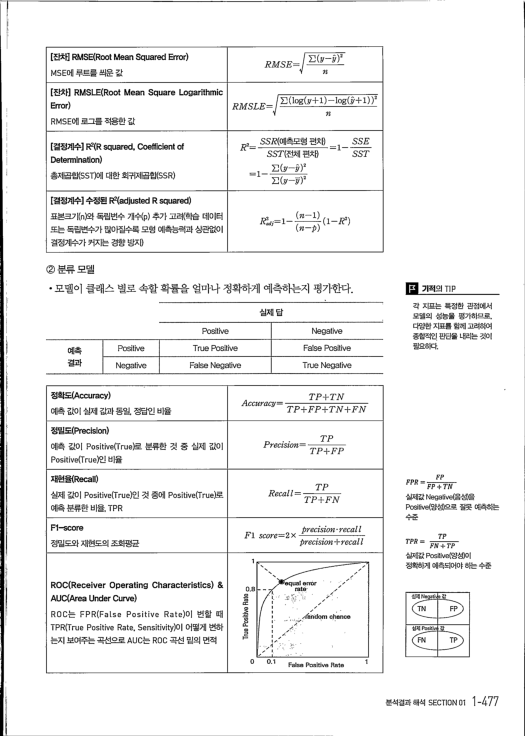

| 지표                                                 | 설명                                                                                                    | 수식                                                              |
| :--------------------------------------------------- | :------------------------------------------------------------------------------------------------------ | :---------------------------------------------------------------- |
| **RMSE**<br>(Root Mean Squared Error)                | MSE에 루트를 씌운 값                                                                                    | $\sqrt{\frac{1}{n} \sum (y_i - \hat{y}_i)^2}$                     |
| **RMSLE**<br>(Root Mean Square Logarithmic Error)    | RMSE에 로그를 적용한 값                                                                                 | $\sqrt{\frac{1}{n} \sum (\log(y_i + 1) - \log(\hat{y}_i + 1))^2}$ |
| **결정계수 $R^2$**<br>(Coefficient of Determination) | 총제곱합(SST)에 대한 회귀제곱합(SSR)의 비율                                                             | $R^2 = \frac{SSR}{SST} = 1 - \frac{SSE}{SST}$                     |
| **수정된 $R^2$**<br>(Adjusted R-squared)             | 표본크기($n$)와 독립변수 개수($p$)를 추가 고려하여, 독립변수가 많아질수록 결정계수가 커지는 경향을 방지 | $R^2_{adj} = 1 - (1-R^2) \frac{n-1}{n-p-1}$                       |

#### ② 분류 모델
- 모델이 클래스 별로 속할 확률을 얼마나 정확하게 예측하는지 평가한다.

| 지표                          | 설명                                                                                            | 수식                                                          |
| :---------------------------- | :---------------------------------------------------------------------------------------------- | :------------------------------------------------------------ |
| **정확도**<br>(Accuracy)      | 예측 값이 실제 값과 동일, 정답인 비율                                                           | $\frac{TP + TN}{TP + FP + TN + FN}$                           |
| **정밀도**<br>(Precision)     | 예측 값이 Positive(True)로 분류한 것 중 실제 값이 Positive(True)인 비율                         | $\frac{TP}{TP + FP}$                                          |
| **재현율**<br>(Recall)        | 실제 값이 Positive(True)인 것 중에 Positive(True)로 예측 분류한 비율 (민감도, Sensitivity, TPR) | $\frac{TP}{TP + FN}$                                          |
| **F1-score**                  | 정밀도와 재현율의 조화평균                                                                      | $2 \times \frac{Precision \times Recall}{Precision + Recall}$ |
| **ROC Curve**                 | FPR(False Positive Rate)이 변할 때 TPR(True Positive Rate)이 어떻게 변하는지 보여주는 곡선      |                                                               |
| **AUC**<br>(Area Under Curve) | ROC 곡선 밑의 면적                                                                              |                                                               |

> **NOTE**
> 각 지표는 특정한 관점에서 모델의 성능을 평가하므로, 다양한 지표를 함께 고려하여 종합적인 판단을 내리는 것이 필요하다.

> **용어 정리**
> - **FPR**: 실제 Negative를 Positive로 잘못 예측한 비율 ($FP / (FP + TN)$)
> - **TPR (Recall)**: 실제 Positive를 Positive로 맞춘 비율 ($TP / (TP + FN)$)

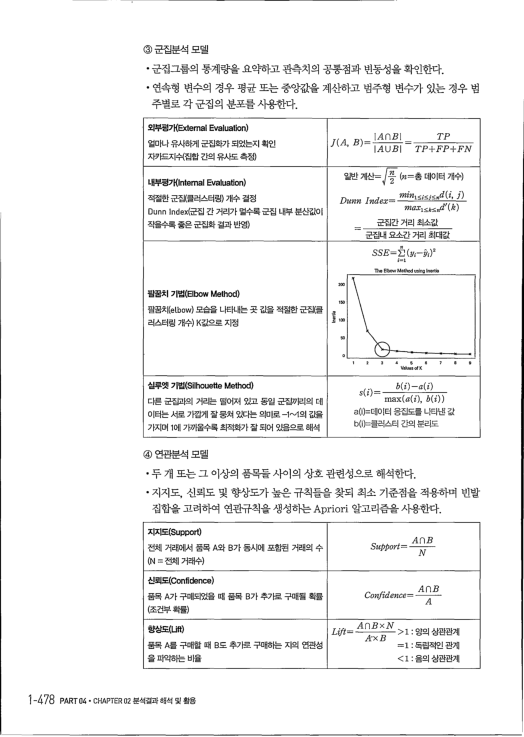

#### ③ 군집분석 모델
- 군집그룹의 통계량을 요약하고 관측치의 공통점과 변동성을 확인한다.
- 연속형 변수의 경우 평균 또는 중앙값을 계산하고 범주형 변수가 있는 경우 범주별로 각 군집의 분포를 사용한다.

**외부평가 (External Evaluation)**
- 자카드 지수 (Jaccard Index): 집합 간의 유사도 측정. 얼마나 유사하게 군집화가 되었는지 확인.
  $$ J(A, B) = \frac{|A \cap B|}{|A \cup B|} = \frac{TP}{TP + FP + FN} $$

**내부평가 (Internal Evaluation)**
- 적절한 군집(클러스터링) 개수 결정.
- **Dunn Index**: 군집 간 거리가 멀수록, 군집 내부 분산값이 작을수록 좋은 군집화 결과 반영.
  $$ DI = \frac{\min(\text{군집 간 거리})}{\max(\text{군집 내 요소 간 거리})} $$
- **실루엣 기법 (Silhouette Method)**: 다른 군집과의 거리는 떨어져 있고 동일 군집끼리의 데이터는 서로 가깝게 잘 뭉쳐 있다는 의미로 -1 ~ 1의 값을 가지며 1에 가까울수록 최적화가 잘 되어 있음으로 해석.
- **팔꿈치 기법 (Elbow Method)**: SSE(Sum of Squared Errors)가 급격히 줄어들다가 완만해지는 지점(팔꿈치 모습)을 적절한 군집 수($K$)로 지정.

#### ④ 연관분석 모델
- 두 개 또는 그 이상의 품목들 사이의 상호 관련성으로 해석한다.
- 지지도, 신뢰도 및 향상도가 높은 규칙들을 찾되 최소 기준점을 적용하며 빈발 집합을 고려하여 연관규칙을 생성하는 Apriori 알고리즘을 사용한다.

| 지표                       | 설명                                                                   | 수식                                                    |
| :------------------------- | :--------------------------------------------------------------------- | :------------------------------------------------------ |
| **지지도**<br>(Support)    | 전체 거래에서 품목 A와 B가 동시에 포함된 거래의 수 ($N$ = 전체 거래수) | $P(A \cap B)$                                           |
| **신뢰도**<br>(Confidence) | 품목 A가 구매되었을 때 품목 B가 추가로 구매될 확률 (조건부확률)        | $P(B \| A) = \frac{P(A \cap B)}{P(A)}$                  |
| **향상도**<br>(Lift)       | 품목 A를 구매할 때 B도 추가로 구매하는지의 연관성을 파악하는 비율      | $\frac{P(B \| A)}{P(B)} = \frac{P(A \cap B)}{P(A)P(B)}$ |

> **향상도 해석**
> - Lift > 1: 양의 상관관계
> - Lift = 1: 독립적인 관계
> - Lift < 1: 음의 상관관계

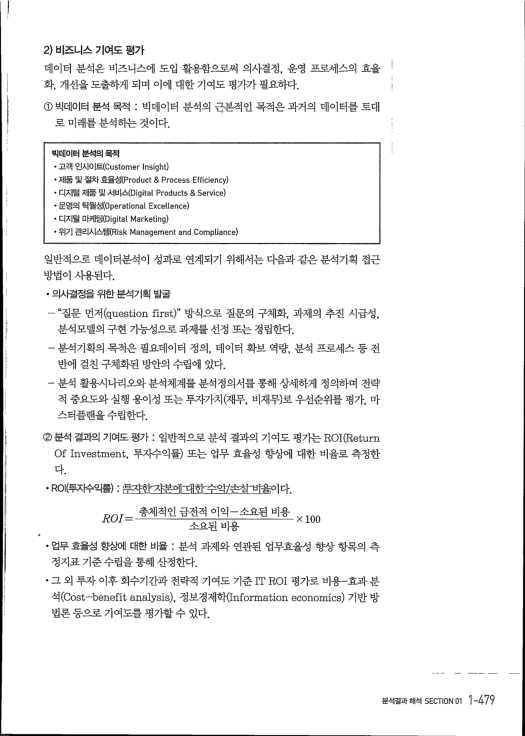

### 2) 비즈니스 기여도 평가
데이터 분석은 비즈니스에 도입 활용함으로써 의사결정, 운영 프로세스의 효율화, 개선을 도출하게 되며 이에 대한 기여도 평가가 필요하다.

#### ① 빅데이터 분석 목적
빅데이터 분석의 근본적인 목적은 과거의 데이터를 토대로 미래를 분석하는 것이다.
- 고객 인사이트 (Customer Insight)
- 제품 및 절차 효율성 (Product & Process Efficiency)
- 디지털 제품 및 서비스 (Digital Products & Service)
- 운영의 탁월성 (Operational Excellence)
- 디지털 마케팅 (Digital Marketing)
- 위기 관리시스템 (Risk Management and Compliance)

일반적으로 데이터 분석이 성과로 연계되기 위해서는 다음과 같은 분석기획 접근 방법이 사용된다.
- 의사결정을 위한 분석기획 발굴
- "**질문 먼저(Question First)**" 방식으로 질문의 구체화, 과제의 추진 시급성, 분석모델의 구현 가능성으로 과제를 선정 또는 정립한다.
- 분석기획의 목적은 필요 데이터 정의, 데이터 확보 역량, 분석 프로세스 등 전반에 걸친 구체화된 방안의 수립에 있다.
- 분석 활용 시나리오와 분석체계를 분석정의서를 통해 상세하게 정의하며 전략적 중요도와 실행 용이성 또는 투자가치(재무, 비재무)로 우선순위를 평가, 마스터플랜을 수립한다.

#### ② 분석 결과의 기여도 평가
일반적으로 분석 결과의 기여도 평가는 **ROI(Return Of Investment, 투자수익률)** 또는 **업무 효율성 향상에 대한 비율**로 측정한다.

- **ROI (투자수익률)**: 투자한 자본에 대한 수익/손실 비율이다.
  $$ ROI = \frac{\text{총체적인 금전적 이익} - \text{소요된 비용}}{\text{소요된 비용}} \times 100 $$
- **업무 효율성 향상에 대한 비율**: 분석 과제와 연관된 업무효율성 향상 항목의 측정지표 기준 수립을 통해 산정한다.
- 그 외 투자 이후 회수기간과 전략적 기여도 기준 IT ROI 평가로 **비용-효과 분석(Cost-benefit analysis)**, **정보경제학(Information economics)** 기반 방법론 등으로 기여도를 평가할 수 있다.

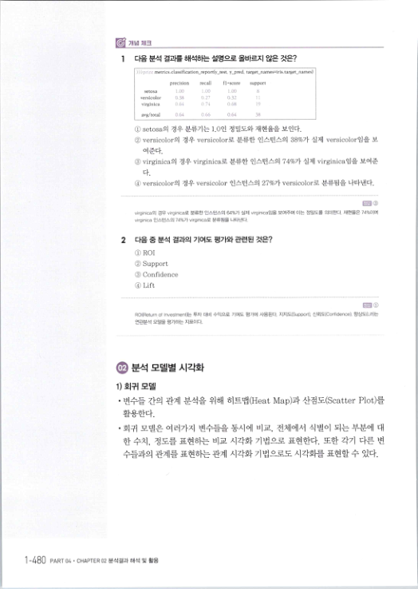

> **예제 1**
> 다음 분석 결과를 해석하는 설명으로 올바르지 않은 것은?
> ```python
> metrics.classification_report(y_test, y_pred, target_names=iris.target_names)
>              precision    recall  f1-score   support
> setosa            1.00      1.00      1.00         8
> versicolor        0.27      0.32      0.38        11
> virginica         0.64      0.74      0.68        19
> avg/total         0.64      0.66      0.64        38
> ```
> ① setosa의 경우 분류기는 1.0인 정밀도와 재현율을 보인다.
> ② versicolor의 경우 versicolor로 분류한 인스턴스의 38%가 실제 versicolor임을 보여준다.
> ③ virginica의 경우 virginica로 분류한 인스턴스의 74%가 실제 virginica임을 보여준다.
> ④ versicolor의 경우 versicolor 인스턴스의 27%가 versicolor로 분류됨을 나타낸다.
>
> **해설**
> ② 정밀도(precision)는 0.27, 재현율(recall)은 0.32, F1-score는 0.38이다. 따라서 38%는 F1-score를 의미한다.
> ③ virginica의 재현율은 0.74이며, 이는 실제 virginica 인스턴스의 74%가 virginica로 분류됨을 나타낸다. 재현율에 대한 설명이다.
> ④ versicolor의 정밀도는 0.27이며, 이는 versicolor로 분류한 인스턴스의 27%가 실제 versicolor임을 의미한다.

> **예제 2**
> 다음 중 분석 결과의 기여도 평가와 관련된 것은?
> ① ROI ② Support ③ Confidence ④ Lift
>
> **해설**
> **ROI(Return of Investment)**는 투자 대비 수익으로 기여도 평가에 사용된다. Support, Confidence, Lift는 연관분석 모델 평가 지표이다.

## 02 분석 모델별 시각화

### 1) 회귀 모델
- 변수들 간의 관계 분석을 위해 **히트맵(Heat Map)**과 **산점도(Scatter Plot)**를 활용한다.
- 회귀 모델은 여러가지 변수들을 동시에 비교, 전체에서 식별이 되는 부분에 대한 수치, 정도를 표현하는 비교 시각화 기법으로 표현한다. 또한 각기 다른 변수들과의 관계를 표현하는 관계 시각화 기법으로도 시각화를 표현할 수 있다.

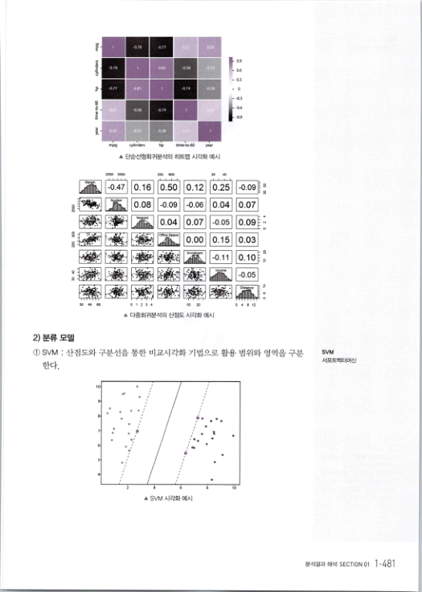

▲ 단순선형회귀분석의 히트맵 시각화 예시

▲ 다중회귀분석의 산점도 시각화 예시

### 2) 분류 모델
#### ① SVM
산점도와 구분선을 통한 비교시각화 기법으로 활용 범위와 영역을 구분한다.

▲ SVM 시각화 예시

> **SVM**
> 서포트 벡터 머신

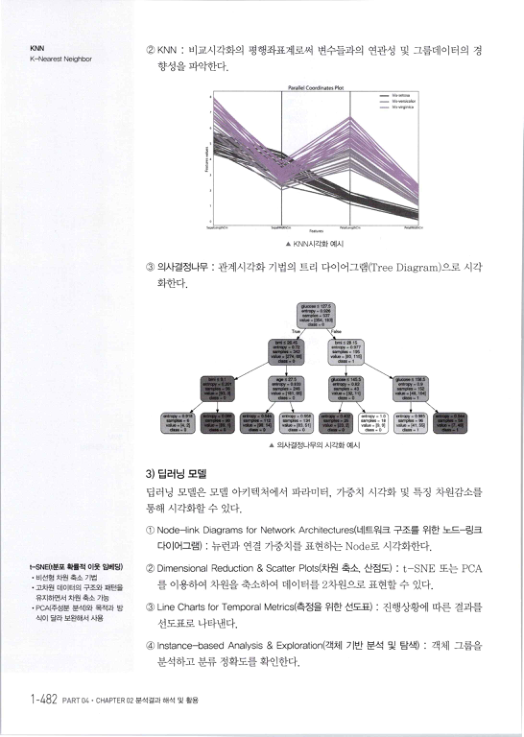

#### ② KNN (K-Nearest Neighbor)
비교시각화의 평행좌표계(Parallel Coordinates Plot)로써 변수들과의 연관성 및 그룹데이터의 경향성을 파악한다.

▲ KNN 시각화 예시

#### ③ 의사결정나무 (Decision Tree)
관계시각화 기법의 트리 다이어그램(Tree Diagram)으로 시각화한다.

▲ 의사결정나무의 시각화 예시

### 3) 딥러닝 모델
딥러닝 모델은 모델 아키텍처에서 파라미터, 가중치 시각화 및 특징 차원감소를 통해 시각화할 수 있다.

#### ① Node-link Diagrams for Network Architectures (네트워크 구조를 위한 노드-링크 다이어그램)
뉴런과 연결 가중치를 표현하는 Node로 시각화한다.

#### ② Dimensional Reduction & Scatter Plots (차원 축소 & 산점도)
**t-SNE** 또는 **PCA**를 이용하여 차원을 축소하여 데이터를 2차원으로 표현할 수 있다.

> **t-SNE (t-Distributed Stochastic Neighbor Embedding)**
> - 비선형 차원 축소 기법
> - 고차원 데이터의 구조와 패턴을 유지하면서 차원 축소 가능
> - PCA(주성분 분석)와 목적과 방식이 달라 보완해서 사용

#### ③ Line Charts for Temporal Metrics (측정을 위한 선도표)
진행상황에 따른 결과를 선도표로 나타낸다.

#### ④ Instance-based Analysis & Exploration (객체 기반 분석 및 탐색)
객체 그룹을 분석하고 분류 정확도를 확인한다.

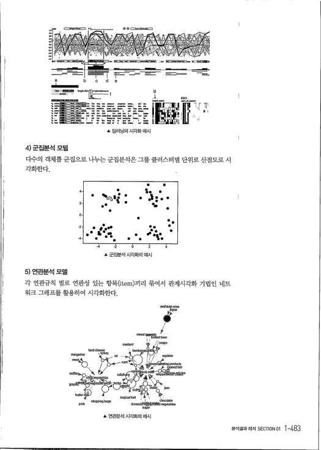

▲ 딥러닝의 시각화 예시

### 4) 군집분석 모델
다수의 객체를 군집으로 나누는 군집분석은 그룹 클러스터별 단위로 산점도로 시각화한다.

▲ 군집분석 시각화의 예시

### 5) 연관분석 모델
각 연관규칙 별로 연관성 있는 항목(item)끼리 묶여서 관계시각화 기법인 네트워크 그래프를 활용하여 시각화한다.

▲ 연관분석 시각화의 예시

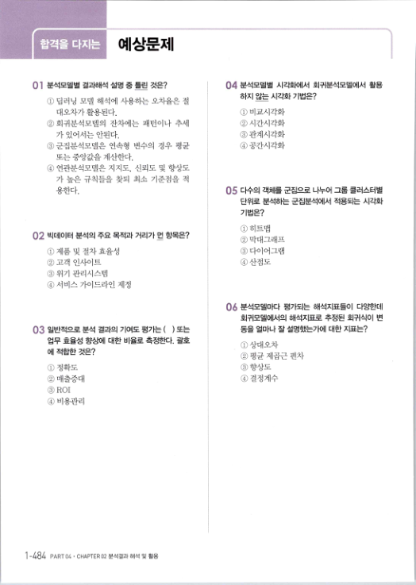

## 예상문제

**01. 분석모델별 결과해석 설명 중 틀린 것은?**
① 딥러닝 모델 해석에 사용하는 오차율은 절대오차가 활용된다.
② 회귀분석모델의 잔차에는 패턴이나 추세가 있어서는 안 된다.
③ 군집분석모델은 연속형 변수의 경우 평균 또는 중앙값을 계산한다.
④ 연관분석모델은 지지도, 신뢰도 및 향상도가 높은 규칙들을 찾되 최소 기준점을 적용한다.

> **정답** ①
> 딥러닝 모델 해석에 사용하는 오차율은 상대오차나 평균 제곱근 편차(RMSE) 등을 사용한다.

**02. 빅데이터 분석의 주요 목적과 거리가 먼 항목은?**
① 제품 및 절차 효율성 ② 고객 인사이트 ③ 위기 관리시스템 ④ 서비스 가이드라인 제정

> **정답** ④
> 빅데이터 분석의 근본적인 목적은 과거의 데이터를 토대로 미래를 분석하는 성격으로 서비스 가이드라인 제정과는 거리가 멀다.

**03. 일반적으로 분석 결과의 기여도 평가는 ( ) 또는 업무 효율성 향상에 대한 비율로 측정한다. 괄호에 적합한 것은?**
① 정확도 ② 매출증대 ③ ROI ④ 비용관리

> **정답** ③
> 일반적으로 분석 결과의 기여도 평가는 ROI(Return Of Investment, 투자수익률) 또는 업무 효율성 향상에 대한 비율로 측정한다.

**04. 분석모델별 시각화에서 회귀분석모델에서 활용하지 않는 시각화 기법은?**
① 비교시각화 ② 시간시각화 ③ 관계시각화 ④ 공간시각화

> **정답** ④
> 회귀모델은 여러 변수들을 비교 관계를 표현하는 시각화 및 시계열모형의 시간시각화를 활용한다.

**05. 다수의 객체를 군집으로 나누어 그룹 클러스터별 단위로 분석하는 군집분석에서 적용되는 시각화 기법은?**
① 히트맵 ② 막대그래프 ③ 다이어그램 ④ 산점도

> **정답** ④
> 다수의 객체를 군집으로 나누는 군집분석은 그룹 클러스터별 단위로 산점도로 시각화한다.

**06. 분석모델마다 평가되는 해석지표들이 다양한데 회귀모델에서의 해석지표로 추정된 회귀식이 변동을 얼마나 잘 설명했는가에 대한 지표는?**
① 상대오차 ② 평균 제곱근 편차 ③ 향상도 ④ 결정계수

> **정답** ④
> 회귀모델의 해석지표인 결정계수는 추정된 회귀식이 변동을 얼마나 잘 설명했는가에 대한 지표로 값이 1에 가까울수록 실제 관측값이 회귀선상에 정확히 일치함을 의미한다.

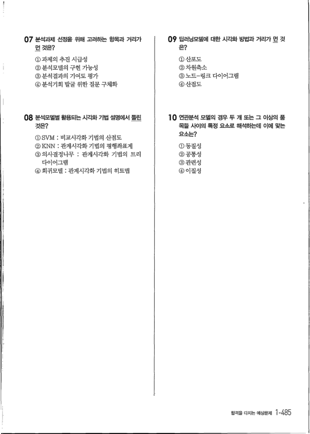

### 7) 시간 시각화

**1) 시간 시각화 정의**
- 시간에 따른 데이터의 변화를 표현하는 것으로 일정기간에 걸쳐 진행되는 변화와 트렌드를 추적하는데 주로 사용된다.
- 데이터의 경향성(트렌드, trend)을 파악하는데 주로 사용된다.
- 시간 데이터는 특정 시점의 값을 표현하는 **이산형**과 변화하는 값을 표현하는 **연속형**으로 구분할 수 있으며, 시간 데이터의 전후 관계를 분석하는 것이 핵심이다.

**시간 시각화의 데이터 특징과 도구 유형**

| 유형               | 주요 특징 및 도구                                                                                                    |
| :----------------- | :------------------------------------------------------------------------------------------------------------------- |
| **이산형(분절형)** | - 특정 시점 또는 특정 시간의 구간 값을 표현한다.<br>- **도구**: 막대그래프, 누적막대그래프, 묶은막대그래프, 점그래프 |
| **연속형**         | - 어떤 구간에서 지속적으로 변화하는 값을 표현한다.<br>- **도구**: 꺾은선그래프, 계단그래프, 추세선                   |

▲ 월별 실업자수 변화 (통계청-경제인구활동조사)

**2) 막대그래프**
- 데이터 값을 길이로 표현한 막대를 배치함으로써 상대적인 차이를 한눈에 알아보도록 표현하는 방법이다.
- 시간축(가로축, x축)은 주로 시간 순서대로 정렬된 특정 시점을 나타내며, 값축(세로축, y축)은 그래프의 크기(범위)를 나타낸다.
- 막대에 색상을 표시함으로써 데이터의 상태나 특징을 다르게 표현할 수 있다.
- 데이터 값은 막대의 길이에만 영향을 미치며, 막대의 폭이나 간격과는 무관하다.

▲ 기업의 월별 매출을 보여주는 막대그래프

> **기적의 TIP**
> 0 이상의 값을 표현하는 경우 값 축은 항상 0부터 시작해야 정확한 크기를 비교할 수 있다.

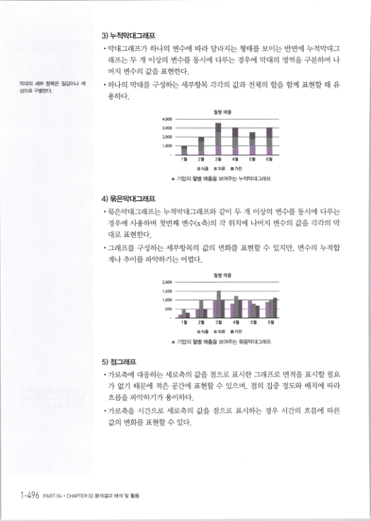

**3) 누적막대그래프**
- 막대그래프가 하나의 변수에 따라 달라지는 형태를 보이는 반면에 누적막대그래프는 두 개 이상의 변수를 동시에 다루는 경우에 막대의 영역을 구분하여 나머지 변수의 값을 표현한다.
- 하나의 막대를 구성하는 세부항목 각각의 값과 전체의 합을 함께 표현할 때 유용하다. (세부 항목은 질감이나 색상으로 구별한다.)

▲ 기업의 월별 매출을 보여주는 누적막대그래프

**4) 묶은막대그래프**
- 묶은막대그래프는 누적막대그래프와 같이 두 개 이상의 변수를 동시에 다루는 경우에 사용하며 첫 번째 변수(x축)의 각 위치에 나머지 변수의 값을 각각의 막대로 표현한다.
- 그래프를 구성하는 세부항목의 값의 변화를 표현할 수 있지만, 변수의 누적합계나 추이를 파악하기는 어렵다.

▲ 기업의 월별 매출을 보여주는 묶은막대그래프

**5) 점그래프**
- 가로축에 대응하는 세로축의 값을 점으로 표시한 그래프로 면적을 표시할 필요가 없기 때문에 적은 공간에 표현할 수 있으며, 점의 집중 정도와 배치에 따라 흐름을 파악하기가 용이하다.
- 가로축을 시간으로 세로축의 값을 점으로 표시하는 경우 시간의 흐름에 따른 값의 변화를 표현할 수 있다.

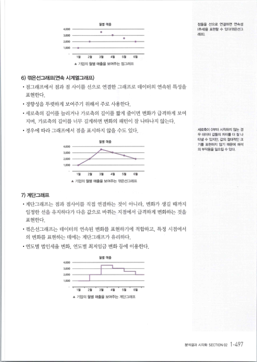

▲ 기업의 월별 매출을 보여주는 점그래프

**6) 꺾은선그래프 (연속 시계열그래프)**
- 점그래프에서 점과 점 사이를 선으로 연결한 그래프로 데이터의 연속된 특성을 표현한다.
- 경향성을 뚜렷하게 보여주기 위해서 주로 사용한다.
- 세로축의 길이를 늘리거나 가로축의 길이를 짧게 줄이면 변화가 급격하게 보여지며, 가로축의 길이를 너무 길게 하면 변화의 패턴이 잘 나타나지 않는다.
- 경우에 따라 그래프에서 점을 표시하지 않을 수도 있다.

▲ 기업의 월별 매출을 보여주는 꺾은선그래프

**7) 계단그래프**
- 계단그래프는 점과 점 사이를 직접 연결하는 것이 아니라, 변화가 생길 때까지 일정한 선을 유지하다가 다음 값으로 바뀌는 지점에서 급격하게 변화하는 것을 표현한다.
- 꺾은선그래프는 데이터의 연속된 변화를 표현하기에 적합하고, 특정 시점에서의 변화를 표현하는 데에는 계단그래프가 유리하다.
- 연도별 법인세율 변화, 연도별 최저임금 변화 등에 이용한다.

▲ 기업의 월별 매출을 보여주는 계단그래프

> **기적의 TIP**
> 점들을 선으로 연결하면 연속성(추세)을 표현할 수 있다 (꺾은선그래프).
> 세로축이 0부터 시작하지 않는 경우 데이터 값들의 차이를 더 잘 나타낼 수 있지만, 값의 절대적인 크기를 표현하지 않기 때문에 해석의 부작용을 일으킬 수 있다.

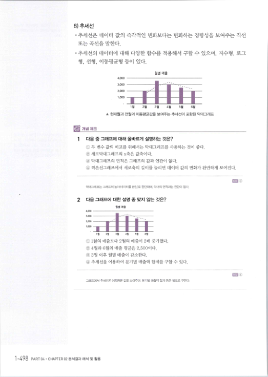

**8) 추세선**
- 추세선은 데이터 값의 즉각적인 변화보다는 변화하는 경향성을 보여주는 직선 또는 곡선을 말한다.
- 추세선의 데이터에 대해 다양한 함수를 적용해서 구할 수 있으며, 지수형, 로그형, 선형, 이동평균형 등이 있다.

▲ 현재월과 전월의 이동평균값을 보여주는 추세선이 포함된 막대그래프

**(1) 다음 중 그래프에 대해 올바르게 설명하는 것은?**
① 두 변수 값의 비교를 위해서는 막대그래프를 사용하는 것이 좋다.
② 세로막대그래프의 x축은 값축이다.
③ 막대그래프의 면적은 그래프의 값과 연관이 없다.
④ 꺾은선그래프에서 세로축의 길이를 늘리면 데이터 값의 변화가 완만하게 보여진다.

> **정답** ③
> 막대그래프는 그래프의 높이(데이터를 환산)로 판단하며, 막대의 면적과는 연관이 없다.

**(2) 다음 그래프에 대한 설명 중 맞지 않는 것은?**
*(월별 매출 막대그래프 및 추세선 예시)*
① 1월의 매출보다 2월의 매출이 2배 증가했다.
② 4월과 6월의 매출 평균은 2,500이다.
③ 3월 이후 월별 매출이 감소한다.
④ 추세선을 이용하여 분기별 매출액 합계를 구할 수 있다.

> **정답** ④
> 그래프에서 추세선은 이동평균 값을 보여주며, 분기별 매출액 합계 등은 별도로 구한다.

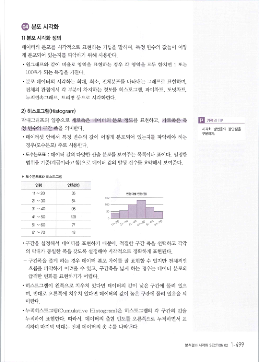

### 8) 분포 시각화

**1) 분포 시각화 정의**
데이터의 분포를 시각적으로 표현하는 기법을 말하며, 특정 변수의 값들이 어떻게 분포되어 있는지를 파악하기 위해 사용한다.
- 원그래프와 같이 비율로 영역을 표현하는 경우 각 영역을 모두 합치면 1 또는 100%가 되는 특징을 가진다.
- 분포 데이터의 시각화는 최대, 최소, 전체분포를 나타내는 그래프로 표현하며, 전체의 관점에서 각 부분이 차지하는 정보를 히스토그램, 파이차트, 도넛차트, 누적연속그래프, 트리맵 등으로 시각화한다.

**2) 히스토그램 (Histogram)**
막대그래프의 일종으로 세로축은 데이터의 분포 정도를 표현하고, 가로축은 특정 변수의 구간 폭을 의미한다.
- 데이터셋 안에서 특정 변수의 값이 어떻게 분포되어 있는지를 파악해야 하는 경우(도수분포) 주로 사용한다.
- **도수분포표**: 데이터 값의 다양한 산출 분포를 보여주는 목록이나 표이다. 일정한 범위를 기준(계급이라고 함)으로 데이터 값의 발생 건수를 요약해서 보여준다.

**도수분포표와 히스토그램**
(도수분포표 예시: 연령 대별 인원)

- 구간을 설정해서 데이터를 표현하기 때문에, 적절한 구간 폭을 선택하고 각각의 막대가 동일한 폭을 갖도록 설정해야 시각적으로 정확하게 표현된다.
- 구간폭을 좁게 하는 경우 데이터 분포 차이를 잘 표현할 수 있지만 전체적인 흐름을 파악하기 어려울 수 있고, 구간폭을 넓게 하는 경우는 데이터 분포의 급격한 변화를 표현하기가 어렵다.
- 히스토그램이 왼쪽으로 치우쳐 있다면 데이터의 값이 낮은 구간에 몰려 있으며, 반대로 오른쪽에 치우쳐 있다면 데이터의 값이 높은 구간에 몰려 있음을 의미한다.
- **누적히스토그램(Cumulative Histogram)**은 히스토그램의 각 구간의 값을 누적하여 표현한다. 따라서, 데이터의 출현 빈도를 오른쪽으로 누적하면서 표시하며 마지막 막대는 전체 데이터의 총 수를 나타낸다.

> **기적의 TIP**
> 시각화 방법들의 장단점을 구분하자.

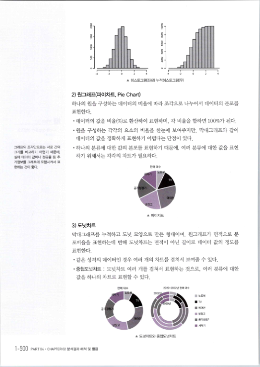

▲ 히스토그램(좌)과 누적히스토그램(우)

**3) 원그래프 (파이차트, Pie Chart)**
하나의 원을 구성하는 데이터의 비율에 따라 조각으로 나누어서 데이터의 분포를 표현한다.
- 데이터의 값을 비율(%)로 환산하여 표현하며, 각 비율을 합하면 100%가 된다.
- 원을 구성하는 각각의 요소의 비율을 한눈에 보여주지만, 막대그래프와 같이 데이터의 값을 정확하게 표현하기 어렵다는 단점이 있다.
- 하나의 분류에 대한 값의 분포를 표현하기 때문에, 여러 분류에 대한 값을 표현하기 위해서는 각각의 차트가 필요하다.
- 그래프의 조각만으로는 서로 간의 크기를 비교하기 어렵기 때문에, 실제 데이터 값이나 점유율 등 추가 정보를 그래프에 포함시켜서 표현하는 것이 좋다.

▲ 파이차트

**4) 도넛차트**
막대그래프를 누적하고 도넛 모양으로 만든 형태이며, 원그래프가 면적으로 분포비율을 표현하는데 반해 도넛차트는 면적이 아닌 길이로 데이터 값의 정도를 표현한다.
- 같은 성격의 데이터인 경우 여러 개의 차트를 겹쳐서 보여줄 수 있다.
- **중첩도넛차트**: 도넛차트 여러 개를 겹쳐서 표현하는 것으로, 여러 분류에 대한 값을 하나의 차트로 표현할 수 있다.

▲ 도넛차트와 중첩도넛차트

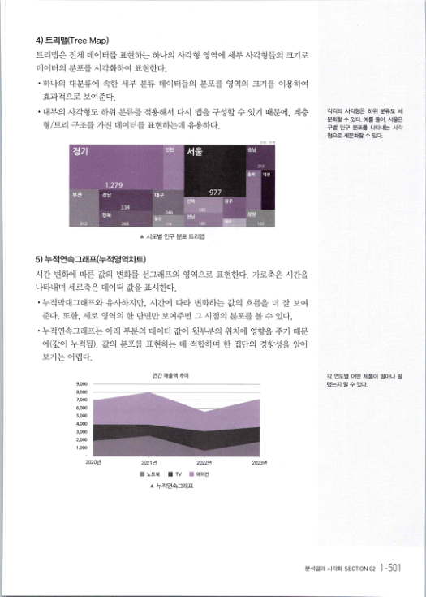

**5) 트리맵 (Tree Map)**
트리맵은 전체 데이터를 표현하는 하나의 사각형 영역에 세부 사각형들의 크기로 데이터의 분포를 시각화하여 표현한다.
- 하나의 대분류에 속한 세부 분류 데이터들의 분포를 영역의 크기를 이용하여 효과적으로 보여준다.
- 내부의 사각형도 하위 분류를 적용해서 다시 맵을 구성할 수 있기 때문에, **계층형/트리 구조**를 가진 데이터를 표현하는데 유용하다.
- 예: 시도별 인구 분포 트리맵 (각각의 사각형은 하위 분류도 세분화할 수 있다. 예를 들어, 서울은 구별 인구 분포를 나타내는 사각형으로 세분화할 수 있다.)

▲ 시도별 인구 분포 트리맵

**6) 누적연속그래프 (누적영역차트)**
시간 변화에 따른 값의 변화를 선그래프의 영역으로 표현한다. 가로축은 시간을 나타내며 세로축은 데이터 값을 표시한다.
- 누적막대그래프와 유사하지만, 시간에 따라 변화하는 값의 흐름을 더 잘 보여준다. 또한, 세로 영역의 한 단면만 보여주면 그 시점의 분포를 볼 수 있다.
- 누적연속그래프는 아래 부분의 데이터 값이 윗부분의 위치에 영향을 주기 때문에(값이 누적됨), 값의 분포를 표현하는 데 적합하며 한 집단의 경향성을 알아보기는 어렵다. (각 연도별 어떤 제품이 얼마나 팔렸는지 알 수 있다.)

▲ 누적연속그래프 (연간 매출액 추이 예시)

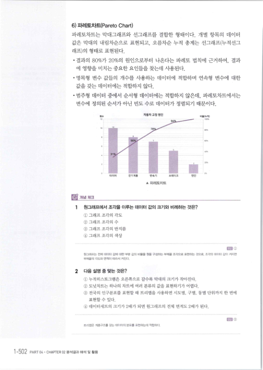

**7) 파레토차트 (Pareto Chart)**
파레토차트는 막대그래프와 선그래프를 결합한 형태이다. 개별 항목의 데이터 값은 막대의 내림차순으로 표현되고, 오름차순 누적 총계는 선그래프(누적선그래프)의 형태로 표현된다.
- 결과의 80%가 20%의 원인으로부터 나온다는 **파레토 법칙**에 근거하여, 결과에 영향을 미치는 중요한 요인들을 찾는데 사용된다.
- **명목형 변수** 값들의 개수를 사용하는 데이터에 적합하며 연속형 변수에 대한 값을 갖는 데이터에는 적합하지 않다.
- 범주형 데이터 중에서 순서형 데이터에는 적합하지 않은데, 파레토차트에서는 변수에 정의된 순서가 아닌 빈도 수로 데이터가 정렬되기 때문이다.

▲ 파레토차트 (자동차 고장원인 예시)

**개념체크**

**1. 원그래프에서 조각을 이루는 데이터 값의 크기와 비례하는 것은?**
① 그래프 조각의 각도 ② 그래프 조각의 수 ③ 그래프 조각의 반지름 ④ 그래프 조각의 색상

> **정답** ①
> 원그래프는 전체 데이터 값에 대한 부분 비율을 원을 구성하는 부채꼴 조각으로 표현하는 것으로 조각의 데이터 값이 커지면 부채꼴의 각도와 면적이 따라서 커진다.

**2. 다음 설명 중 맞는 것은?**
① 누적히스토그램은 오른쪽으로 갈수록 막대의 크기가 작아진다.
② 도넛차트는 하나의 차트에 여러 분류의 값을 표현하기가 어렵다.
③ 전국의 인구분포를 표현할 때 트리맵을 사용하면 시도별, 구별, 동별 단위까지 한 번에 표현할 수 있다.
④ 데이터세트의 크기가 2배가 되면 원그래프의 전체 면적도 2배가 된다.

> **정답** ③
> 트리맵은 계층 구조를 갖는 데이터의 분포를 표현하는데 적합하다.

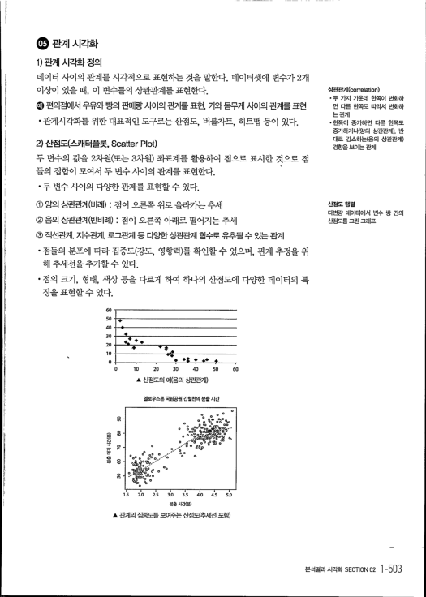

### 9) 관계 시각화

**1) 관계 시각화 정의**
- 데이터 사이의 관계를 시각적으로 표현하는 것을 말한다. 데이터셋에 변수가 2개 이상이 있을 때, 이 변수들의 상관관계를 표현한다.
- 예: 편의점에서 우유와 빵의 판매량 사이의 관계를 표현, 키와 몸무게 사이의 관계를 표현
- 관계시각화를 위한 대표적인 도구로는 **산점도**, **버블차트**, **히트맵** 등이 있다.

**2) 산점도 (Scatter Plot)**
두 변수의 값을 2차원(또는 3차원) 좌표계를 활용하여 점으로 표시한 것으로 점들의 집합이 모여서 두 변수 사이의 관계를 표현한다.
- 두 변수 사이의 다양한 관계를 표현할 수 있다.
  - ① 양의 상관관계(비례): 점이 오른쪽 위로 올라가는 추세
  - ② 음의 상관관계(반비례): 점이 오른쪽 아래로 떨어지는 추세
  - ③ 직선관계, 지수관계, 로그관계 등 다양한 상관관계 함수로 유추될 수 있는 관계
- 점들의 분포에 따라 집중도(강도, 영향력)를 확인할 수 있으며, 관계 추정을 위해 추세선을 추가할 수 있다.
- 점의 크기, 형태, 색상 등을 다르게 하여 하나의 산점도에 다양한 데이터의 특징을 표현할 수 있다.

▲ 산점도의 예 (음의 상관관계) / 옐로우스톤 국립공원 간헐천의 분출 시간

> **산점도 행렬**
> 다변량 데이터에서 변수 쌍 간의 산점도를 그린 그래프

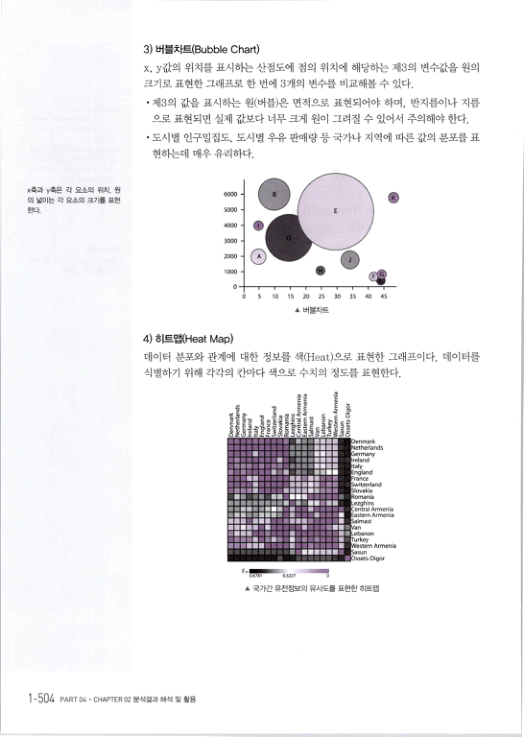

**3) 버블차트 (Bubble Chart)**
x, y값의 위치를 표시하는 산점도에 점의 위치에 해당하는 제3의 변수값을 원의 크기로 표현한 그래프로 한 번에 3개의 변수를 비교해볼 수 있다.
- 제3의 값을 표시하는 원(버블)은 **면적**으로 표현되어야 하며, 반지름이나 지름으로 표현되면 실제 값보다 너무 크게 원이 그려질 수 있어서 주의해야 한다.
- 도시별 인구밀집도, 도시별 우유 판매량 등 국가나 지역에 따른 값의 분포를 표현하는데 매우 유리하다. (x축과 y축은 각 요소의 위치, 원의 넓이는 각 요소의 크기를 표현한다.)

▲ 버블차트

**4) 히트맵 (Heat Map)**
데이터 분포와 관계에 대한 정보를 색(Heat)으로 표현한 그래프이다. 데이터를 식별하기 위해 각각의 칸마다 색으로 수치의 정도를 표현한다.

▲ 국가간 유전적 유사도를 표현한 히트맵

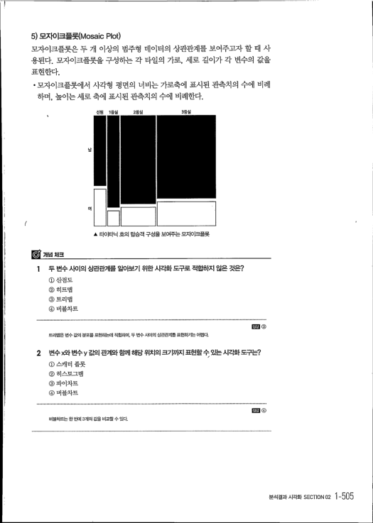

**5) 모자이크 플롯 (Mosaic Plot)**
모자이크 플롯은 두 개 이상의 범주형 데이터의 상관관계를 보여주고자 할 때 사용된다. 모자이크 플롯을 구성하는 각 타일의 가로, 세로 길이가 각 변수의 값을 표현한다.
- 모자이크 플롯에서 사각형 평면의 너비는 가로축에 표시된 관측치의 수에 비례하며, 높이는 세로축에 표시된 관측치의 수에 비례한다.

▲ 타이타닉 호의 탑승객 구성을 보여주는 모자이크플롯

**1. 두 변수 사이의 상관관계를 알아보기 위한 시각화 도구로 적합하지 않은 것은?**
① 산점도 ② 히트맵 ③ 트리맵 ④ 버블차트

> **정답** ③
> 트리맵은 변수 값의 분포를 표현하는데 적합하며, 두 변수 사이의 상관관계를 표현하기는 어렵다.

**2. 변수 x와 변수 y값의 관계와 함께 해당 위치의 크기까지 표현할 수 있는 시각화 도구는?**
① 스캐터 플롯 ② 히스토그램 ③ 파이차트 ④ 버블차트

> **정답** ④
> 버블차트는 한 번에 3개의 값을 비교할 수 있다.

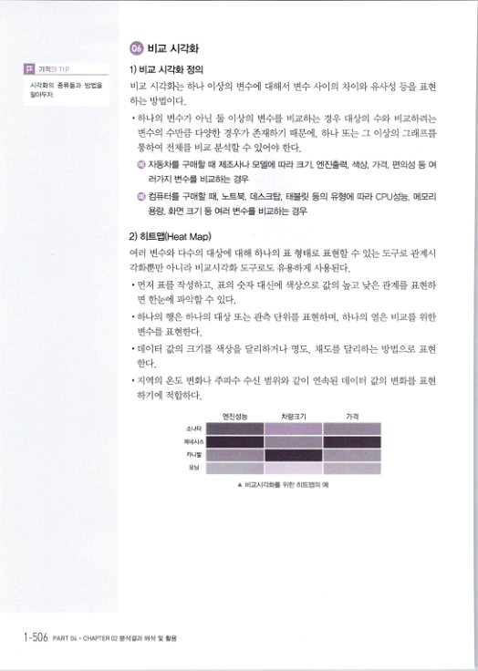

### 10) 비교 시각화

**1) 비교 시각화 정의**
비교 시각화는 하나 이상의 변수에 대해서 변수 사이의 차이와 유사성 등을 표현하는 방법이다.
- 하나의 변수가 아닌 둘 이상의 변수를 비교하는 경우 대상의 수와 비교하려는 변수의 수만큼 다양한 경우가 존재하기 때문에, 하나 또는 그 이상의 그래프를 통하여 전체를 비교 분석할 수 있어야 한다.
  - 예: 자동차를 구매할 때 제조사나 모델에 따라 크기, 엔진출력, 색상, 가격, 편의성 등 여러가지 변수를 비교하는 경우
  - 예: 컴퓨터를 구매할 때 노트북, 데스크탑, 태블릿 등의 유형에 따라 CPU성능, 메모리 용량, 화면 크기 등 여러 변수를 비교하는 경우

> **기적의 TIP**
> 시각화의 종류들과 방법을 익혀두자.

**2) 히트맵 (Heat Map)**
여러 변수와 다수의 대상에 대해 하나의 표 형태로 표현할 수 있는 도구로 관계 시각화뿐만 아니라 비교 시각화 도구로도 유용하게 사용된다.
- 먼저 표를 작성하고, 표의 숫자 대신에 색상으로 값의 높고 낮은 관계를 표현하면 한눈에 파악할 수 있다.
- 하나의 행은 하나의 대상 또는 관측 단위를 표현하며, 하나의 열은 비교를 위한 변수를 표현한다.
- 데이터 값의 크기를 색상을 달리하거나 명도, 채도를 달리하는 방법으로 표현한다.
- 지역의 온도 변화나 주파수 수신 범위와 같이 연속된 데이터 값의 변화를 표현하기에 적합하다.

▲ 비교 시각화를 위한 히트맵의 예 (엔진성능, 차량크기, 가격 비교)

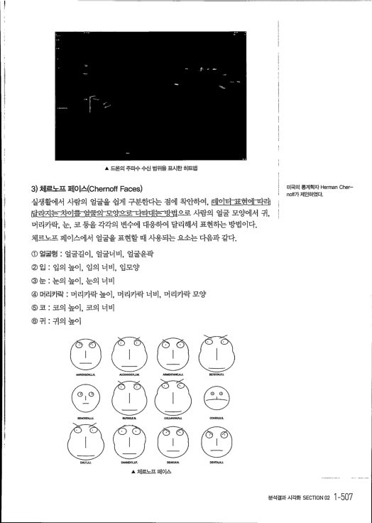

▲ 드론의 주파수 수신 범위를 표시한 히트맵

**3) 체르노프 페이스 (Chernoff Faces)**
실생활에서 사람의 얼굴을 쉽게 구분한다는 점에 착안하여, 데이터의 값에 따라 달라지는 차이를 얼굴의 모양으로 나타내는 방법으로 사람의 얼굴 모양에서 귀, 머리카락, 눈, 코 등을 각각의 변수에 대응하여 달리해서 표현하는 방법이다.
- 체르노프 페이스에서 얼굴을 표현할 때 사용되는 요소는 다음과 같다.
  - ① 얼굴형: 얼굴길이, 얼굴너비, 얼굴윤곽
  - ② 입: 입의 높이, 입의 너비, 입모양
  - ③ 눈: 눈의 높이, 눈의 너비
  - ④ 머리카락: 머리카락높이, 머리카락너비, 머리카락모양
  - ⑤ 코: 코의 높이, 코의 너비
  - ⑥ 귀: 귀의 높이

> **기적의 TIP**
> 미국의 통계학자 Herman Chernoff가 제안하였다.

▲ 체르노프 페이스

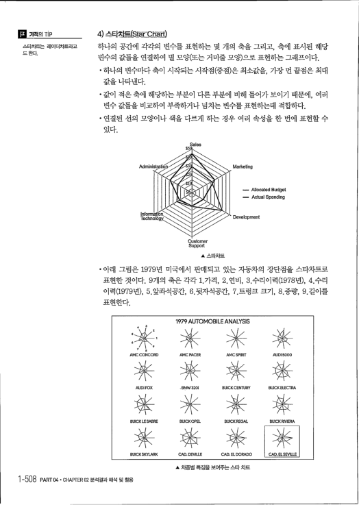

**4) 스타차트 (Star Chart)**
하나의 공간에 각각의 변수를 표현하는 몇 개의 축을 그리고, 축에 표시된 해당 변수의 값들을 연결하여 별 모양(또는 거미줄 모양)으로 표현하는 그래프이다.
(레이더차트라고도 한다.)
- 하나의 변수마다 축이 시작되는 시작점(중점)은 최소값을, 가장 먼 끝점은 최대값을 나타낸다.
- 값이 적은 축에 해당하는 부분이 다른 부분에 비해 들어가 보이기 때문에, 여러 변수 값들을 비교하여 부족하거나 넘치는 변수를 표현하는데 적합하다.
- 연결된 선의 모양이나 색을 다르게 하는 경우 여러 속성을 한 번에 표현할 수 있다.

▲ 스타차트

- 아래 그림은 1979년 미국에서 판매되고 있는 자동차의 장단점을 스타차트로 표현한 것이다. 9개의 축은 각각 1.가격, 2.연비, 3.수리이력(1978년), 4.수리이력(1979년), 5.앞좌석공간, 6.뒷좌석공간, 7.트렁크 크기, 8.중량, 9.길이를 표현한다.

▲ 차종별 특징을 보여주는 스타 차트


**07. 분석과제 선정을 위해 고려하는 항목과 거리가 먼 것은?**
① 과제의 추진 시급성 ② 분석모델의 구현 가능성 ③ 분석결과의 기여도 평가 ④ 분석기회 발굴 위한 질문 구체화

> **정답** ③
> 빅데이터 분석 목적에 따른 분석과제 선정과 별개로 분석 결과의 기여도 평가 정의가 필요하다. (문제 7번은 앞부분 내용 재등장으로 보임, 중복 확인 필요하나 일단 OCR대로 정리)

**08. 분석모델별 활용되는 시각화 기법 설명에서 틀린 것은?**
① SVM: 비교시각화 기법의 산점도
② KNN: 관계시각화 기법의 평행좌표계
③ 의사결정나무: 관계시각화 기법의 트리 다이어그램
④ 회귀모델: 관계시각화 기법의 히트맵

> **정답** ②
> KNN은 비교시각화 기법의 평행좌표계로써 변수들과의 연관성 및 그룹데이터의 경향성을 파악한다. (*해설 오류 가능성 있음, 앞의 8번 문제와 동일*)

**09. 딥러닝모델에 대한 시각화 방법과 거리가 먼 것은?**
① 산포도 ② 차원축소 ③ 노드-링크 다이어그램 ④ 산점도

> **정답** ①

**10. 연관분석 모델의 경우 두 개 또는 그 이상의 품목들 사이의 특정 요소로 해석하는데 이에 맞는 것은?**
① 동질성 ② 공통성 ③ 관련성 ④ 이질성

> **정답** ③

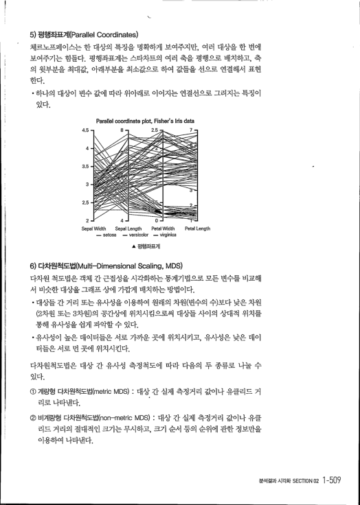

**5) 평행좌표계 (Parallel Coordinates)**
체르노프 페이스는 한 대상의 특징을 명확하게 보여주지만, 여러 대상을 한 번에 보여주기는 힘들다. 평행좌표계는 스타차트의 여러 축을 평행으로 배치하고, 축의 윗부분을 최대값, 아래부분을 최소값으로 하여 값들을 선으로 연결해서 표현한다.
- 하나의 대상이 변수 값에 따라 위아래로 이어지는 연결선으로 그려지는 특징이 있다.

▲ 평행좌표계 (Iris data 예시)

**6) 다차원척도법 (Multi-Dimensional Scaling, MDS)**
다차원 척도법은 객체 간 근접성을 시각화하는 통계기법으로 모든 변수를 비교해서 비슷한 대상을 그래프 상에 가깝게 배치하는 방법이다.
- 대상들 간 거리 또는 유사성을 이용하여 원래의 차원(변수의 수)보다 낮은 차원(2차원 또는 3차원)의 공간상에 위치시킴으로써 대상들 사이의 상대적 위치를 통해 유사성을 쉽게 파악할 수 있다.
- 유사성이 높은 데이터들은 서로 가까운 곳에 위치시키고, 유사성은 낮은 데이터들은 서로 먼 곳에 위치시킨다.

**다차원척도법의 종류**
① **계량형 다차원척도법 (Metric MDS)**: 대상 간 실제 측정거리 값이나 유클리드 거리로 나타낸다.
② **비계량형 다차원척도법 (Non-metric MDS)**: 대상 간 실제 측정거리 값이나 유클리드 거리의 절대적인 크기는 무시하고, 크기 순서 등의 **순위**에 관한 정보만을 이용하여 나타낸다.

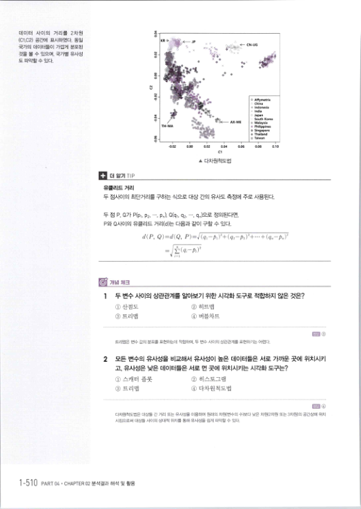

▲ 다차원척도법 예시 (데이터 사이의 거리를 2차원 공간에 표현하여 국가별 유사성 파악)

> **유클리드 거리 (Euclidean Distance)**
> 두 점 사이의 최단거리를 구하는 식으로 대상 간의 유사도 측정에 주로 사용된다.
> 두 점 $P, Q$가 $P(p_1, p_2, \dots, p_n)$, $Q(q_1, q_2, \dots, q_n)$로 정의된다면, $P$와 $Q$ 사이의 유클리드 거리($d$)는 다음과 같이 구할 수 있다.
> $$ d(P, Q) = \sqrt{(q_1-p_1)^2 + (q_2-p_2)^2 + \dots + (q_n-p_n)^2} = \sqrt{\sum_{i=1}^{n}(q_i-p_i)^2} $$

**1. 두 변수 사이의 상관관계를 알아보기 위한 시각화 도구로 적합하지 않은 것은?**
① 산점도 ② 히트맵 ③ 트리맵 ④ 버블차트

> **정답** ③
> 트리맵은 변수 값의 분포를 표현하는데 적합하며, 두 변수 사이의 상관관계를 표현하기는 어렵다.

**2. 모든 변수의 유사성을 비교해서 유사성이 높은 데이터들은 서로 가까운 곳에 위치시키고, 유사성은 낮은 데이터들은 서로 먼 곳에 위치시키는 시각화 도구는?**
① 스캐터 플롯 ② 히스토그램 ③ 트리맵 ④ 다차원척도법

> **정답** ④
> 다차원척도법은 대상들 간 거리 또는 유사성을 이용하여 원래의 차원보다 낮은 차원의 공간상에 위치시킴으로써 대상들 사이의 상대적 위치를 통해 유사성을 쉽게 파악할 수 있다.

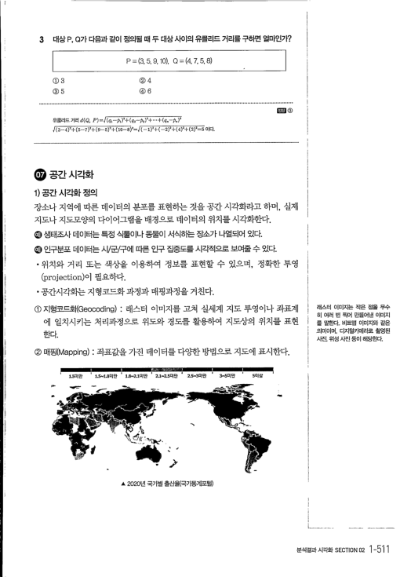

**3. 대상 P, Q가 다음과 같이 정의될 때 두 대상 사이의 유클리드 거리를 구하면 얼마인가?**
$P=(3, 5, 9, 10), Q=(4, 7, 5, 8)$
① 3 ② 5 ③ 4 ④ 6

> **정답** ②
> 유클리드 거리 $d(P, Q) = \sqrt{(4-3)^2 + (7-5)^2 + (5-9)^2 + (8-10)^2} = \sqrt{1^2 + 2^2 + (-4)^2 + (-2)^2} = \sqrt{1+4+16+4} = \sqrt{25} = 5$

### 11) 공간 시각화

**1) 공간 시각화 정의**
장소나 지역에 따른 데이터의 분포를 표현하는 것을 공간 시각화라고 하며, 실제 지도나 지도모양의 다이어그램을 배경으로 데이터의 위치를 시각화한다.
- 생태조사 데이터는 특정 식물이나 동물이 서식하는 장소가 나열되어 있다.
- 인구분포 데이터는 시/군/구에 따른 인구 집중도를 시각적으로 보여줄 수 있다.
- 위치와 거리 또는 색상을 이용하여 정보를 표현할 수 있으며, 정확한 **투영(Projection)**이 필요하다.
- 공간시각화는 지형코드화 과정과 매핑과정을 거친다.
  - ① **지형코드화 (Geocoding)**: 래스터 이미지를 고쳐 실세계 지도 투영이나 좌표계에 일치시키는 처리과정으로 위도와 경도를 활용하여 지도상의 위치를 표현한다.
  - ② **매핑 (Mapping)**: 좌표값을 가진 데이터를 다양한 방법으로 지도에 표시한다.

> **기적의 TIP**
> 래스터 이미지는 작은 점을 무수히 여러 번 찍어 만들어낸 이미지를 말한다. 비트맵 이미지와 같은 의미이며, 디지털카메라로 촬영된 사진, 위성 사진 등이 해당한다.

▲ 2020년 국가별 출산율 (공간 시각화 예시)

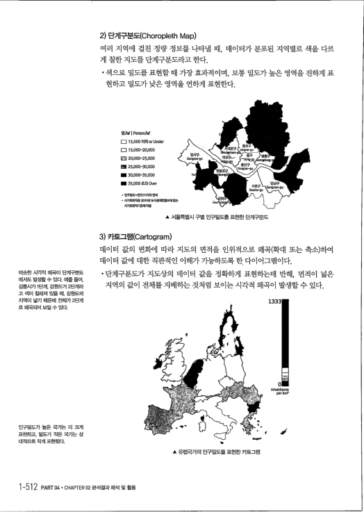

**2) 단계구분도 (Choropleth Map)**
여러 지역에 걸친 정량 정보를 나타낼 때, 데이터가 분포된 지역별로 색을 다르게 칠한 지도를 단계구분도라고 한다.
- 색으로 밀도를 표현할 때 가장 효과적이며, 보통 밀도가 높은 영역을 진하게 표현하고 밀도가 낮은 영역을 연하게 표현한다.

▲ 서울특별시 구별 인구밀도를 표현한 단계구분도

**3) 카토그램 (Cartogram)**
데이터 값의 변화에 따라 지도의 면적을 인위적으로 왜곡(확대 또는 축소)하여 데이터 값에 대한 직관적인 이해가 가능하도록 한 다이어그램이다.
- 단계구분도가 지도상의 데이터 값을 정확하게 표현하는데 반해, 면적이 넓은 지역의 값이 전체를 지배하는 것처럼 보이는 시각적 왜곡이 단계구분도에서 발생할 수 있다. (예: 강릉시가 1단계, 강원도가 2단계라고 색이 칠해져 있을 때, 강원도의 지역이 넓기 때문에 전체가 2단계로 왜곡되어 보일 수 있다.)
- 카토그램은 이러한 시각적 왜곡 현상을 줄여준다. 인구밀도가 높은 국가는 더 크게 표현하고, 밀도가 작은 국가는 상대적으로 작게 표현한다.

▲ 유럽국가의 인구밀도를 표현한 카토그램

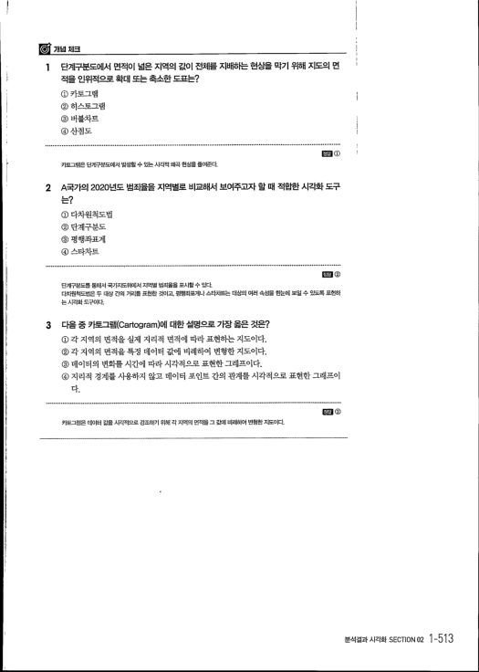

**1. 단계구분도에서 면적이 넓은 지역의 값이 전체를 지배하는 현상을 막기 위해 지도 면적을 인위적으로 확대 또는 축소한 도표는?**
① 카토그램 ② 히스토그램 ③ 버블차트 ④ 산점도

> **정답** ①
> 카토그램은 단계구분도에서 발생할 수 있는 시각적 왜곡 현상을 줄여준다.

**2. A국가의 2020년도 범죄율을 지역별로 비교해서 보여주고자 할 때 적합한 시각화 도구는?**
① 다차원척도법 ② 단계구분도 ③ 평행좌표계 ④ 스타차트

> **정답** ②
> 단계구분도를 통해서 국가 지도 위에서 지역별 범죄율을 표시할 수 있다.

**3. 다음 중 카토그램(Cartogram)에 대한 설명으로 가장 옳은 것은?**
① 각 지역의 면적을 실제 지리적 면적에 따라 표현하는 지도이다.
② 각 지역의 면적을 특정 데이터 값에 비례하여 변형한 지도이다.
③ 데이터의 변화를 시간에 따라 시각적으로 표현한 그래프이다.
④ 지리적 경계를 사용하지 않고 데이터 포인트 간의 관계를 시각적으로 표현한 그래프이다.

> **정답** ②
> 카토그램은 데이터 값을 시각적으로 강조하기 위해 각 지역의 면적을 그 값에 비례하여 변형한 지도이다.

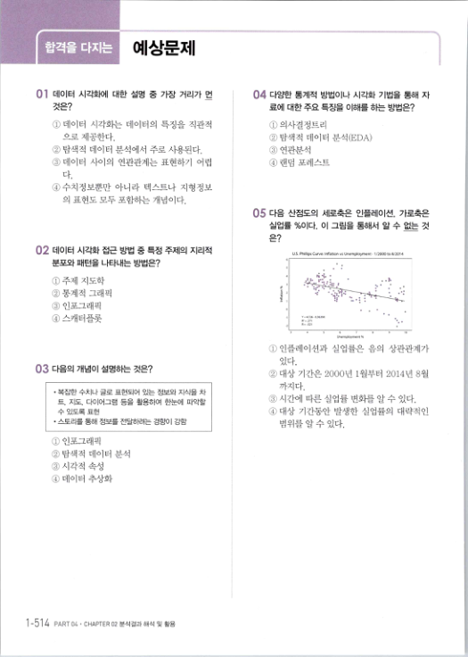

1 단계구분도에서 면적이 넓은 지역의 값이 전체를 지배하는 헌상을 막기 위해 지묘 면 적을 인위적으로 확대 또는 축소한 도표는？ ① 카토그램 ② 히스토그램 ③ 버블차트 ④산점도 카토그린은 단계구분도에서 발생함수 있는 시각적 와曆주 현상을 줄여준다． 2 A국가의 2020년도 범죄율을 지역별로 비교해서 보여주고차 할 때 적합한 시각화 도구 는？ ① 다차원척도법 ② 단계구분도 ③ 평행좌표계 ④ 스타차트 단까구분도를통해서 국가지도위에서 지역별 범조隱율표시할수 있다． 다차원척도법은 두 대상 간의 거리를 표헌한 것이고， 펑행좌표계나 스타치트는 대상의 여러 속성을 한눈에 보일 수 있도록 표현하 는시각화도구이다． 3 다음중카뢰L램（Cartogram）에 대한설명으로가장옳은것은？ ① 각 지역의 면적을 실제 지리적 면적에 따라 표현하는 지도이다． ② 각 지역의 면적을 특정 데이터 값에 비례하여 변형한 지도이다． ③ 데이터의 변화를 시간에 따라 시각적으로 표현한 그래프이다． ④ 지리적 경계를 사용하지 않고 데이터 포인트 간의 관계를 시각적으로 표현한 그래프이 다． 카토그랭은 데이터 값을 시각적으로 강조하기 위해 각 지역의 면견을 그 값에 비례하여 변형한 ㅈ匠이다．

> -
#### El
> 塔n②
> 目昌睡）
> 분석걸과시각화SECTION02 1-513

## 예상문제
0】 데이터 시각화에 대한 설명 중 가장 거리가 먼 04 다양한 통계적 방법이나 시각화 기법을 통해 자 료에 대한 주요 특징을 이해를 하는 방법은？ 것은？ ①데이터 시각화는 데이터의 특징을 직관적 으로 제공한다． ② 탐색적 데이터 분적에서 주로 사용된다． ③데이터 사이의 연관관계는 표현하기 어렵 ① 의사결정트리 ② 탐색적 데이터 분적（EDA) ③ 연관분석 ④ 랜덤 포레스트 다． ④수치정보뿐만 아니라 텍스트나 지형정보 의 표현도 모두 포함하는 개념이다． 05 다음 산점도의 세로축은 인플레이션 , 가로축은 실업률 ％이다 . 이 그림을 통해서 알 수 없는 것 은？ (J 데이터 시각화 접근 방법 중 특정 주제의 지리적 분포와 패턴을 나타내는 방법은？ U.S. PhimPS Curve: Inflation vs Ursemployme能 1/2이）0 to 8/2014 ① 주제 지도학 ② 통계적 그래픽 ③ 인포그래픽 ④ 스캐터플롯 , ，

- 
手 ㄷ 으 분 ， .

'· . · Y 늬 `7교6 弘，6松x ㅐ』 侈 』7` 크 4 톰 .

7 8 L衲enn한｀ymenr% ① 인플레이션과 실업률은 음의 상관관계가 있다． 03 다음의 개념이 설명하는 것은？ ／堧） 대상 기간은 2000년 1월부터 2014년 8월 까지다． ③ 시간에 따른 실업률 변화를 알 수 있다． ④ 대상 기간동안 발생한 실업률의 대략적인 범위를 알 수 있다．

- 복잡한 수치나 글로 표현되어 있는 정보와 지식을 차
트， 지도 . 다이어그램 등을 활용하여 한눈에 파악할 수 있도록 표현

- 스토리를 통해 정보를 전달하려는 경향이 강함
① 인포그래픽 ② 탐색적 데이터 분석 ③ 시각적 속성 ④ 데이터 추상화 1-引 4 PART 04 . CHAPTER 02 분석결과 해석 및 활용

# ＊
。

… 粃 吟

> ㅑ
- - *
- 
> `.

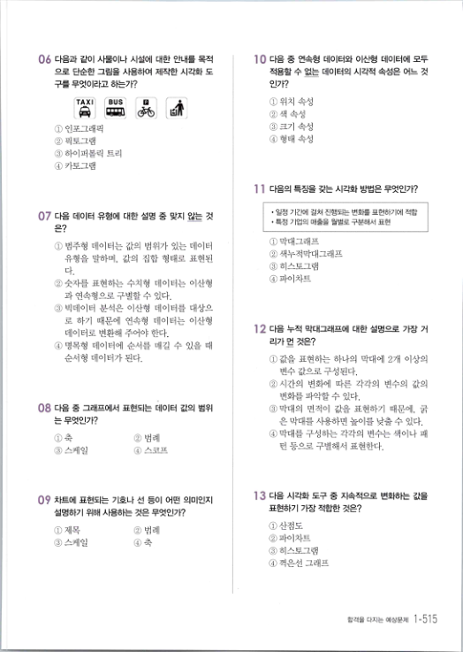

**10. 다음 중 연속형 데이터와 이산형 데이터에 모두 적용할 수 없는 데이터의 시각적 속성은 어느 것인가?**
① 위치 속성 ② 색 속성 ③ 크기 속성 ④ 형태 속성

> **정답** ④
> 형태 속성은 삼각형, 원, 사각형 등 각각의 독립된 모양으로 데이터를 표현하는 것으로 연속형 데이터를 표현하기에 적합하지 않다.

**11. 다음의 특징을 갖는 시각화 방법은 무엇인가?**
- 일정 기간에 걸쳐 진행되는 변화를 표현하기에 적합
- 특정 기업의 매출을 월별로 구분해서 표현

① 막대그래프 ② 누적막대그래프 ③ 히스토그램 ④ 파이차트

> **정답** ①
> 막대그래프는 시간축과 값축으로 구성되며, 일정 기간에 걸쳐 진행되는 값의 변화를 표현하기에 적합하다.

**12. 다음 누적 막대그래프에 대한 설명으로 가장 거리가 먼 것은?**
① 값을 표현하는 하나의 막대에 2개 이상의 변수 값으로 구성된다.
② 시간의 변화에 따른 각각의 변수의 값의 변화를 파악할 수 있다.
③ 막대의 면적이 값을 표현하기 때문에, 굵은 막대를 사용하면 높이를 낮출 수 있다.
④ 막대를 구성하는 각각의 변수는 색이나 패턴 등으로 구별해서 표현한다.

> **정답** ③
> 막대그래프에서 굵기는 데이터 값과 상관이 없다. 막대의 길이(높이)가 값을 나타낸다.

**13. 다음 시각화 도구 중 지속적으로 변화하는 값을 표현하기 가장 적합한 것은?**
① 산점도 ② 파이차트 ③ 히스토그램 ④ 꺾은선 그래프

> **정답** ④
> 꺾은선 그래프는 시간에 따라 변화하는 데이터를 비교해서 표현하는데 적합한 시각화 도구이다. 산점도는 두 변수 간의 관계, 파이차트는 비율, 히스토그램은 분포를 표현하는데 적합하다.

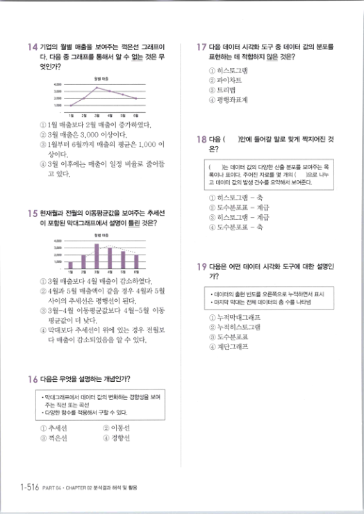

**14. 기업의 월별 매출을 보여주는 꺾은선 그래프이다. 다음 중 그래프를 통해서 알 수 없는 것은 무엇인가?**
(그래프: x축 월, y축 매출액)
① 1월 매출보다 2월 매출이 증가하였다.
② 3월 매출은 3,000 이상이다.
③ 1월부터 6월까지 매출의 평균은 1,000 이상이다.
④ 3월 이후에는 매출이 일정 비율로 줄어들고 있다.

> **정답** ④
> 3월 이후부터 매출이 일정한 값만큼 줄어들고 있다. (일정 비율인지는 그래프만으로 정확히 확인하기 어렵거나, 실제 값의 변화가 선형적 감소를 의미할 수 있음)

**15. 현재월과 전월의 이동평균값을 보여주는 추세선이 포함된 막대그래프에서 설명이 틀린 것은?**
(그래프 설명 생략)
① 3월 매출보다 4월 매출이 감소하였다.
② 4월과 5월 매출액이 같을 경우 4월과 5월 사이의 추세선은 평행선이 된다.
③ 3월-4월 이동평균값보다 4월-5월 이동평균값이 더 낮다.
④ 막대보다 추세선이 위에 있는 경우 전월보다 매출이 감소되었음을 알 수 있다.

> **정답** ②
> 4월의 이동평균값은 3월과 4월 매출의 평균이고, 5월의 이동평균값은 4월과 5월 매출의 평균이기 때문에 추세선이 평행선으로 나타나기 위해서는 3월, 4월, 5월의 매출이 동일해야 한다.

**16. 다음은 무엇을 설명하는 개념인가?**
- 막대그래프에서 데이터 값의 변화하는 경향성을 보여주는 직선 또는 곡선
- 다양한 함수를 적용해서 구할 수 있다.

① 추세선 ② 이동선 ③ 꺾은선 ④ 경향선

> **정답** ①
> 추세선은 데이터 값의 즉각적인 변화보다는 변화하는 경향성을 보여주는 직선 또는 곡선을 말한다.

**17. 다음 데이터 시각화 도구 중 데이터 값의 분포를 표현하는 데 적합하지 않은 것은?**
① 히스토그램 ② 파이차트 ③ 트리맵 ④ 평행좌표계

> **정답** ④
> 평행좌표계는 스타차트처럼 하나 이상의 대상에 대한 특징을 보여주는 것으로 데이터 값의 분포를 표현하기에는 적합하지 않다.

**18. 다음 ( ) 안에 들어갈 말로 맞게 짝지어진 것은?**
( )는 데이터 값의 다양한 산출 분포를 보여주는 목록이나 표이다. 주어진 자료를 몇 개의 ( )으로 나누고 데이터 값의 발생 건수를 요약해서 보여준다.
① 히스토그램 - 축 ② 도수분포표 - 계급 ③ 히스토그램 - 계급 ④ 도수분포표 - 축

> **정답** ②
> 도수분포표는 주어진 자료의 범위를 몇 개의 구간(계급)으로 나누고 해당 구간의 데이터 값의 빈도를 표시하는 표이다.

**19. 다음은 어떤 데이터 시각화 도구에 대한 설명인가?**
- 데이터의 출현 빈도를 오른쪽으로 누적하면서 표시
- 마지막 막대는 전체 데이터의 총 수를 나타냄

① 누적막대그래프 ② 누적히스토그램 ③ 도수분포표 ④ 계단그래프

> **정답** ②
> 누적히스토그램은 히스토그램의 각 구간의 값을 누적시켜서 표현한다. 따라서, 데이터의 출현 빈도를 오른쪽으로 누적하면서 표시하며 마지막 막대는 전체 데이터의 총 수를 나타낸다.

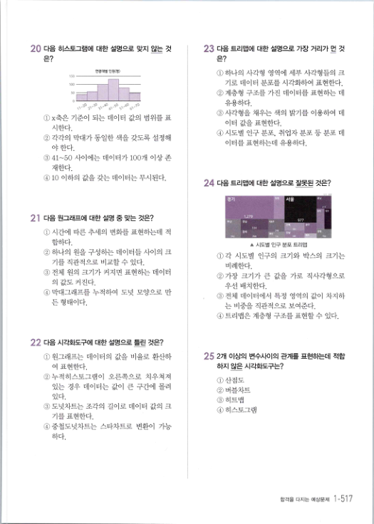

**20. 다음 히스토그램에 대한 설명으로 맞지 않는 것은?**
(히스토그램 그래프: 연령대별 인원)
① x축은 기준이 되는 데이터 값의 범위를 표시한다.
② 각각의 막대가 동일한 색을 갖도록 설정해야 한다.
③ 41~50 사이에는 데이터가 100개 이상 존재한다.
④ 10 이하의 값을 갖는 데이터는 무시된다.

> **정답** ②
> 히스토그램은 동일한 폭을 갖도록 하는 것이 중요하며, 색을 통일할 필요는 없다.

**21. 다음 원그래프에 대한 설명 중 맞는 것은?**
① 시간에 따른 추세의 변화를 표현하는데 적합하다.
② 하나의 원을 구성하는 데이터들 사이의 크기를 직관적으로 비교할 수 있다.
③ 전체 원의 크기가 커지면 표현하는 데이터의 값도 커진다.
④ 막대그래프를 누적하여 도넛 모양으로 만든 형태이다.

> **정답** ②
> 원그래프(파이차트)는 구성하는 데이터들 사이의 비율로 원을 조각내어 표현하기 때문에 구성요소 사이의 직관적인 비교가 가능하다. 원의 크기와 데이터의 값은 무관하며, 막대그래프를 누적하여 도넛 모양으로 만든 형태는 도넛 차트이다.

**22. 다음 시각화도구에 대한 설명으로 틀린 것은?**
① 원그래프는 데이터의 값을 비율로 환산하여 표현한다.
② 누적히스토그램이 오른쪽으로 치우쳐져 있는 경우 데이터는 값이 큰 구간에 몰려 있다.
③ 도넛차트는 조각의 길이로 데이터 값의 크기를 표현한다.
④ 중첩도넛차트는 스타차트로 변환이 가능하다.

> **정답** ②
> 누적히스토그램은 데이터 값의 분포에 상관없이 항상 오른쪽으로 치우쳐있다(누적되므로 증가함).
> (해설 오류 가능성: "누적히스토그램이 오른쪽으로 갈수록 커진다"는 당연한 것이고, "오른쪽으로 치우쳐져 있다"는 표현이 데이터 분포의 편향(Skewness)을 말하는 것이라면 히스토그램을 의미할 수 있음. 하지만 문제의 의도는 누적히스토그램의 특성을 묻는 것으로 보임.)

**23. 다음 트리맵에 대한 설명으로 가장 거리가 먼 것은?**
① 하나의 사각형 영역에 세부 사각형들의 크기로 데이터 분포를 시각화하여 표현한다.
② 계층형 구조를 가진 데이터를 표현하는 데 유용하다.
③ 사각형을 채우는 색의 밝기를 이용하여 데이터 값을 표현한다.
④ 시도별 인구분포, 취업자분포 등 분포 데이터를 표현하는데 유용하다.

> **정답** ③
> 사각형의 **크기**를 이용해서 데이터 값을 표현한다. (색의 밝기를 이용하는 것은 히트맵이다.)

**24. 다음 트리맵에 대한 설명으로 잘못된 것은?**
① 각 시도별 인구의 크기와 박스의 크기는 비례한다.
② 가장 크기가 큰 값을 가로 직사각형으로 우선 배치한다.
③ 전체 데이터에서 특정 영역의 값이 차지하는 비중을 직관적으로 보여준다.
④ 트리맵은 계층형 구조를 표현할 수 있다.

> **정답** ②
> 트리맵은 사각형의 크기를 이용해서 데이터 값을 표현하며, 사각형의 모양과 색상은 값과 관련이 없다. 배치 방식은 알고리즘에 따라 다르다.

**25. 2개 이상의 변수 사이의 관계를 표현하는데 적합하지 않은 시각화도구는?**
① 산점도 ② 버블차트 ③ 히트맵 ④ 히스토그램

> **정답** ④
> 히스토그램은 변수의 구간에 대해서 데이터의 분포정도를 표현하는 도구로 분포시각화에 주로 사용된다. 관계 시각화는 산점도, 버블차트, 히트맵 등을 사용한다.

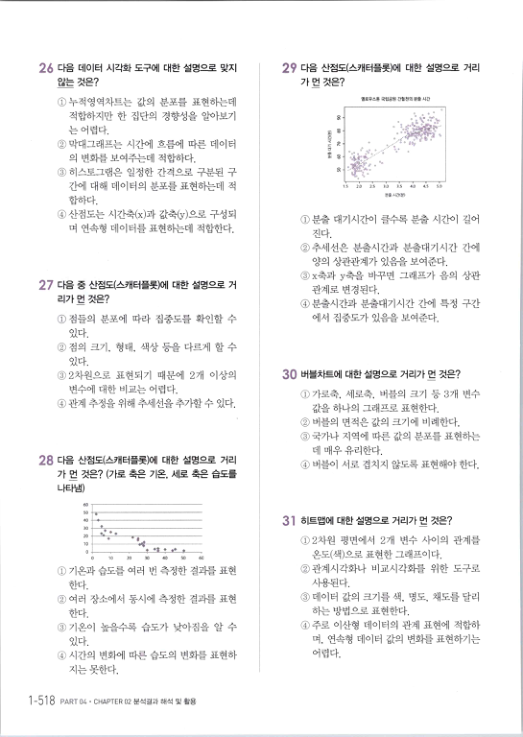

**26. 다음 산점도(스캐터플롯)에 대한 설명으로 거리가 먼 것은?**
(그래프: x=분출 대기시간, y=분출 시간)
① 분출 대기시간이 클수록 분출 시간이 길어진다.
② 추세선은 분출시간과 분출대기시간 간에 양의 상관관계가 있음을 보여준다.
③ x축과 y축을 바꾸면 그래프가 음의 상관관계로 변경된다.
④ 분출시간과 분출대기시간 간에 특정 구간에서 집중도가 있음을 보여준다.

> **정답** ④
> x축과 y축을 바꾸더라도 데이터의 상관관계 방향(양/음)은 변하지 않는다. 오른쪽 위로 향하는 경향은 여전할 것이다.
> (※ 정답이 ④번으로 OCR되어 있는데, 해설은 "x축과 y축을 바꾸면..." 부분에 대한 설명이 29번 문제 해설에 있는 것으로 보임. 번호가 섞였을 수 있음. 문제 26의 보기를 보면 ③번이 명백히 틀린 설명임. 정답을 확인해봐야 함. 일단 ③번이 틀린 설명임(음의 상관관계로 바뀌지 않음).)
> *OCR 정답: ④로 표기됨, 하지만 내용은 29번 해설 참조?* -> 29번 해설에 "x축과 y축을 바꾸더라도..." 내용이 있음.

**27. 다음 중 산점도(스캐터플롯)에 대한 설명으로 거리가 먼 것은?**
① 점들의 분포에 따라 집중도를 확인할 수 있다.
② 점의 크기, 형태, 색상 등을 다르게 할 수 있다.
③ 2차원으로 표현되기 때문에 2개 이상의 변수에 대한 비교는 어렵다.
④ 관계 추정을 위해 추세선을 추가할 수 있다.

> **정답** ③
> 산점도는 점의 색상, 모양 등을 이용해 3개 이상의 변수를 표현할 수도 있으며, 3차원 산점도도 가능하다. 버블차트 등을 통해 확장이 가능하다.

**28. 다음 산점도(스캐터플롯)에 대한 설명으로 거리가 먼 것은?**
(그래프: x=기온, y=습도. 점들이 우하향 분포)
① 기온과 습도를 여러 번 측정한 결과를 표현한다.
② 여러 장소에서 동시에 측정한 결과를 표현한다.
③ 기온이 높을수록 습도가 낮아짐을 알 수 있다.
④ 시간의 변화에 따른 습도의 변화를 표현하지는 못한다.

> **정답** ②
> 산점도는 두 변수 간의 관련성을 보여주는 것으로, 이 그래프만으로는 여러 장소에서 동시에 측정했는지, 한 장소에서 여러 번 측정했는지 정확히 알기 어렵지만, 보통 시계열이나 반복 측정 데이터를 표현한다. "여러 장소"라는 정보는 그래프에 나타나지 않는다.

**29. 다음 데이터 시각화 도구에 대한 설명으로 맞지 않는 것은?**
① 누적영역차트는 값의 분포를 표현하는데 적합하지만 한 집단의 경향성을 알아보기는 어렵다.
② 막대그래프는 시간에 흐름에 따른 데이터의 변화를 보여주는데 적합하다.
③ 히스토그램은 일정한 간격으로 구분된 구간에 대해 데이터의 분포를 표현하는데 적합하다.
④ 산점도는 시간축(x)과 값축(y)으로 구성되며 연속형 데이터를 표현하는데 적합하다.

> **정답** ④ (OCR상 29번 정답이 ④인지 ③인지 헷갈리나 해설은 "시간시각화의 대표적인 도구는..."이라고 함)
> ④ 산점도는 두 변수의 값을 좌표계에 표시한 것으로, 반드시 시간축을 포함해야 하는 것은 아니다. 시간 시각화의 대표적인 도구는 막대그래프, 꺾은선그래프이다.

**30. 버블차트에 대한 설명으로 거리가 먼 것은?**
① 가로축, 세로축, 버블의 크기 등 3개 변수 값을 하나의 그래프로 표현한다.
② 버블의 면적은 값의 크기에 비례한다.
③ 국가나 지역에 따른 값의 분포를 표현하는 데 매우 유리하다.
④ 버블이 서로 겹치지 않도록 표현해야 한다.

> **정답** ④
> 버블차트에서 x, y 값이 유사하여 서로 근접하게 위치하는 경우 버블이 겹칠 수도 있다.

**31. 히트맵에 대한 설명으로 거리가 먼 것은?**
① 2차원 평면에서 2개 변수 사이의 관계를 온도(색)으로 표현한 그래프이다.
② 관계시각화나 비교시각화를 위한 도구로 사용된다.
③ 데이터 값의 크기를 색, 명도, 채도를 달리하는 방법으로 표현한다.
④ 주로 이산형 데이터의 관계 표현에 적합하며, 연속형 데이터 값의 변화를 표현하기는 어렵다.

> **정답** ④
> 히트맵은 이산형 데이터나 연속형 데이터 모두 표현이 가능하다.

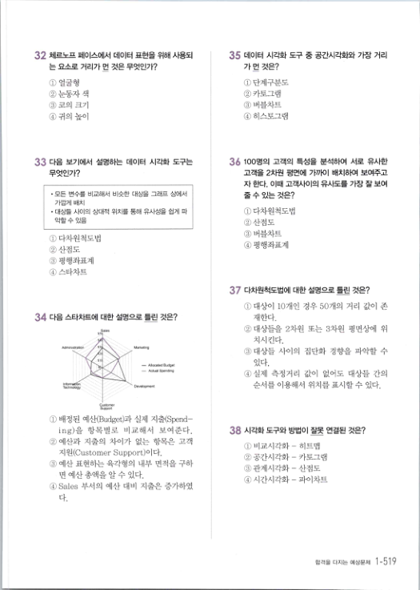

**32. 체르노프 페이스에서 데이터 표현을 위해 사용되는 요소로 거리가 먼 것은 무엇인가?**
① 얼굴형 ② 눈동자 색 ③ 코의 크기 ④ 귀의 높이

> **정답** ②
> 체르노프 페이스에서 눈은 높이와 너비를 사용한다. 색상은 보통 사용되지 않는다.

**33. 다음 보기에서 설명하는 데이터 시각화 도구는 무엇인가?**
- 모든 변수를 비교해서 비슷한 대상을 그래프 상에서 가깝게 배치
- 대상들 사이의 상대적 위치를 통해 유사성을 쉽게 파악할 수 있음

① 다차원척도법 ② 산점도 ③ 버블차트 ④ 평행좌표계

> **정답** ①
> 다차원 척도법(MDS)은 모든 변수를 비교해서 비슷한 대상을 그래프 상에 가깝게 배치하는 방법이다.

**34. 다음 스타차트에 대한 설명으로 틀린 것은?**
(스타차트 이미지)
① 배정된 예산(Budget)과 실제 지출(Spending)을 항목별로 비교해서 보여준다.
② 예산과 지출의 차이가 없는 항목은 고객 지원(Customer Support)이다.
③ 예산 표현하는 육각형의 내부 면적을 구하면 예산 총액을 알 수 있다.
④ Sales 부서의 예산 대비 지출은 증가하였다.

> **정답** ③
> 예산 총액은 6개 항목에 대응하는 예산 값을 모두 더한 것이다. 면적이 총액을 의미하지는 않는다.

**35. 데이터 시각화 도구 중 공간시각화와 가장 거리가 먼 것은?**
① 단계구분도 ② 카토그램 ③ 버블차트 ④ 히스토그램

> **정답** ④
> 히스토그램은 분포시각화 도구이다. 버블차트는 지도와 함께 사용될 때 공간시각화 도구로 사용될 수 있다.

**36. 100명의 고객의 특성을 분석하여 서로 유사한 고객을 2차원 평면에 가까이 배치하여 보여주고자 한다. 이때 고객사이의 유사도를 가장 잘 보여줄 수 있는 것은?**
① 다차원척도법 ② 산점도 ③ 평행좌표계 ④ 스타차트

> **정답** ①
> 다차원 척도법은 객체 간 근접성을 시각화하는 통계기법이다.

**37. 다차원척도법에 대한 설명으로 틀린 것은?**
① 대상이 10개인 경우 50개의 거리 값이 존재한다.
② 대상들을 2차원 또는 3차원 평면상에 위치시킨다.
③ 대상들 사이의 집단화 경향을 파악할 수 있다.
④ 실제 측정거리 값이 없어도 대상들 간의 순서를 이용해서 위치를 표시할 수 있다.

> **정답** ①
> 다차원척도법에서 대상이 n개인 경우 거리 값은 $n(n-1)/2$ 개가 존재한다. 대상이 10개인 경우 $10 \times 9 / 2 = 45$, 즉 45개가 존재한다.

**38. 시각화 도구와 방법이 잘못 연결된 것은?**
① 비교시각화 - 히트맵
② 공간시각화 - 카토그램
③ 관계시각화 - 산점도
④ 시간시각화 - 파이차트

> **정답** ④
> 파이차트는 분포시각화를 위한 도구이다. 시간시각화는 막대그래프, 꺾은선그래프 등이 있다.

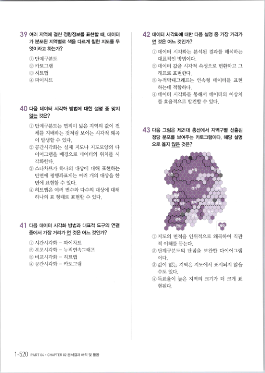

**39. 여러 지역에 걸친 정량정보를 표현할 때, 데이터가 분포된 지역별로 색을 다르게 칠한 지도를 무엇이라고 하는가?**
① 단계구분도 ② 카토그램 ③ 히트맵 ④ 파이차트

> **정답** ①
> 여러 지역에 걸친 정량 정보를 나타낼 때, 데이터가 분포된 지역별로 색을 다르게 칠한 지도를 단계구분도라고 한다.

**40. 다음 데이터 시각화 방법에 대한 설명 중 맞지 않는 것은?**
① 단계구분도는 면적이 넓은 지역의 값이 전체를 지배하는 것처럼 보이는 시각적 왜곡이 발생할 수 있다.
② 공간시각화는 실제 지도나 지도모양의 다이어그램을 배경으로 데이터의 위치를 시각화한다.
③ 스타차트가 하나의 대상에 대해 표현하는 반면에 평행좌표계는 여러 개의 대상을 한 번에 표현할 수 있다.
④ 히트맵은 여러 변수와 다수의 대상에 대해 하나의 표 형태로 표현할 수 있다.

> **정답** ③
> 스타차트도 여러 개의 대상을 하나의 차트에 동시에 표현할 수 있다.

**41. 다음 데이터 시각화 방법과 대표적 도구의 연결 중에서 가장 거리가 먼 것은 어느 것인가?**
① 시간시각화 - 파이차트
② 분포시각화 - 누적연속그래프
③ 비교시각화 - 히트맵
④ 공간시각화 - 카토그램

> **정답** ①
> 시간시각화의 대표적인 도구는 막대그래프, 꺾은선그래프이다.

**42. 데이터 시각화에 대한 다음 설명 중 가장 거리가 먼 것은 어느 것인가?**
① 데이터 시각화는 분석된 결과를 해석하는 대표적인 방법이다.
② 데이터 값을 시각적 속성으로 변환하고 그래프로 표현한다.
③ 누적막대그래프는 연속형 데이터를 표현하는데 적합하다.
④ 데이터 시각화를 통해서 데이터의 이상치를 효율적으로 발견할 수 있다.

> **정답** ③
> 누적막대그래프는 이산형(분절형) 데이터를 표현하는데 적합하다.

**43. 다음 그림은 제21대 총선에서 지역구별 선출된 정당 분포를 보여주는 카토그램이다. 해당 설명으로 옳지 않은 것은?**
① 지도의 면적을 인위적으로 왜곡하여 직관적 이해를 돕는다.
② 단계구분도의 단점을 보완한 다이어그램이다.
③ 값이 없는 지역은 지도에서 표시되지 않을 수도 있다.
④ 득표율이 높은 지역의 크기가 더 크게 표현된다.

> **정답** ④
> 지역의 크기는 투표권(의석수)이 많은 지역을 크게 표현하고 있으며, 영역의 크기는 득표율과 상관이 없다. (카토그램의 기준 변수에 따라 다르지만, 문맥상 득표율이 아닌 의석수/인구비례일 가능성이 높음)

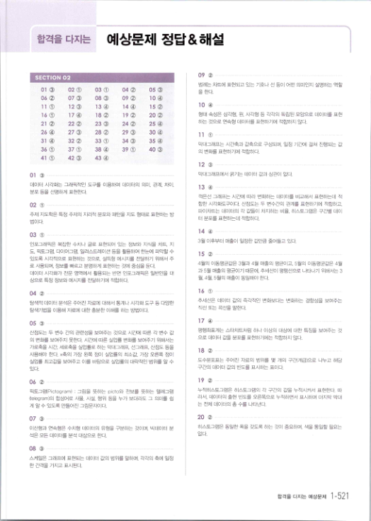
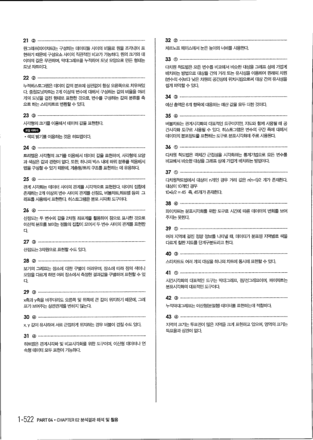

(예상문제 정답 & 해설은 위 문제들에 통합하여 정리하였음)


# SECTION 03. 분석결과 활용

**출제빈도** (하), **빈출 태그**: 분석 방법론, 계획수립, 적용, 보고서 작성, 모니터링, 리모델링

### 1. 분석모형 전개

**1) 빅데이터 분석 방법론**
빅데이터 분석을 위한 방법론은 데이터마이닝을 위한 방법론을 프로젝트 특성에 맞추어 적용한다. 대표적인 데이터마이닝 방법론으로는 **CRISP-DM**, **SEMMA**, **KDD** 등이 있으며, 한국데이터산업진흥원에서는 빅데이터 분석 프로젝트를 위한 참조모델을 제시하고 있어, 이 모델을 각 프로젝트의 상황에 맞추어 적용할 수 있다.

- **빅데이터 분석 방법론 참조모델(한국데이터산업진흥원)**은 데이터 분석 프로젝트를 위해 표준적으로 적용할 수 있는 프로세스를 5단계로 정리해서 보여준다.

**① 분석기획(Planning)**: 분석하려는 비즈니스를 이해하고 분석 목표와 범위를 설정하는 단계이다. 비즈니스 이해 및 범위 설정, 프로젝트 정의 및 계획 수립, 프로젝트 위험계획 수립 등의 작업을 수행한다.
**② 데이터 준비(Preparing)**: 프로젝트에 필요한 데이터의 범위와 요건을 정의하고 기준에 맞도록 데이터를 수집, 가공, 준비한다. 필요데이터 정의, 데이터 스토어 설계, 데이터 수집 및 정합성 점검 등의 작업을 수행한다.
**③ 데이터 분석(Analyzing)**: 준비단계에서 확보된 데이터를 이용하여 다양한 분석 작업을 수행한다. 분석용 데이터 준비, 텍스트 분석, 탐색적 분석, 모델링, 모델 평가 및 검증, 모델적용 및 운영방안 수립 등의 작업을 수행한다.
**④ 시스템 구현(Developing)**: 개발된 분석 모델을 운영중인 시스템에 적용하거나 프로토타입을 구현할 필요성이 있는 경우 이 단계를 진행한다. 단순한 분석과제에서는 생략할 수 있다. 설계 및 구현, 시스템 테스트 및 운영 등의 작업을 수행한다.
**⑤ 평가 및 전개(Deployment)**: 모델의 성능을 유지하고 주기적으로 개선하는 노력을 하기 위해 모델발전계획을 수립하고 프로젝트의 성과를 정량적, 정성적으로 평가하고 최종 보고서를 작성한 후 프로젝트를 종료한다.

> **기적의 TIP**
> 빅데이터 분석 방법론 참조 모델과 CRISP-DM, KDD, SEMMA 분석방법론에 대한 자세한 내용은 PART 01 - CHAPTER 02 데이터 분석 계획 부분을 참고한다.

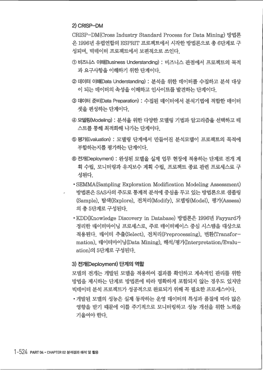

**2) CRISP-DM**
CRISP-DM (Cross Industry Standard Process for Data Mining) 방법론은 1996년 유럽연합의 ESPRIT 프로젝트에서 시작한 방법론으로 총 6단계로 구성되며, 빅데이터 프로젝트에서 보편적으로 쓰인다.

① **비즈니스 이해(Business Understanding)**: 비즈니스 관점에서 프로젝트의 목적과 요구사항을 이해하기 위한 단계이다.
② **데이터 이해(Data Understanding)**: 분석을 위한 데이터를 수집하고 분석 대상이 되는 데이터의 속성을 이해하고 인사이트를 발견하는 단계이다.
③ **데이터 준비(Data Preparation)**: 수집된 데이터에서 분석기법에 적합한 데이터셋을 편성하는 단계이다.
④ **모델링(Modeling)**: 분석을 위한 다양한 모델링 기법과 알고리즘을 선택하고 테스트를 통해 최적화해 나가는 단계이다.
⑤ **평가(Evaluation)**: 모델링 단계에서 만들어진 분석모델이 프로젝트의 목적에 부합하는지를 평가하는 단계이다.
⑥ **전개(Deployment)**: 완성된 모델을 실제 업무 현장에 적용하는 단계로 전개 계획 수립, 모니터링과 유지보수 계획 수립, 프로젝트 종료 관련 프로세스로 구성된다.

- **SEMMA (Sampling, Exploration, Modification, Modeling, Assessment)** 방법론은 SAS사의 주도로 통계적 분석에 중심을 두고 있는 방법론으로 샘플링, 탐색, 전처리, 모델링, 평가의 총 5단계로 구성된다.
- **KDD (Knowledge Discovery in Database)** 방법론은 1996년 Fayyad가 정리한 데이터마이닝 프로세스로, 주로 데이터베이스 중심 시스템을 대상으로 적용된다. 데이터 추출(Select), 전처리(Preprocessing), 변환(Transformation), 데이터마이닝(Data Mining), 해석/평가(Interpretation/Evaluation)의 5단계로 구성된다.

**3) 전개(Deployment) 단계의 역할**
모델의 전개는 개발된 모델을 적용하여 결과를 확인하고 계속적인 관리를 위한 방법을 제시하는 단계로 방법론에 따라 명확하게 포함되지 않는 경우도 있지만 빅데이터 분석 프로젝트가 성공적으로 완료되기 위해 꼭 필요한 프로세스이다.
- 개발된 모델의 성능은 실제 동작하는 운영 데이터의 특징과 품질에 따라 많은 영향을 받기 때문에 이를 주기적으로 모니터링하고 성능 개선을 위한 노력을 기울여야 한다.


모델의 전개 단계에서 주로 이루어지는 작업은 다음과 같다．

#### ① 분석결과 활용 계획 수립 : 빅데이터 분석 결과를 어떻게 업무에 반영할 것인지
에 대한 액션 플랜을 만들고 업무 성과를 지속적으로 모니터링 할 수 있는 방 안을 수립한다． ② 분석결과 적용과 보고서 작성 : 분적 모델과 결과를 업무 현장에 적용하고 업무 데이터베이스 시스템 일부로 포함한다 . 성과측정 지표에 따라분석 성과를측 정하고 개선 계획을 수립한다． ③분석모형 모니터링 : 빅데이터 분석이 끝나면 각 현업부서에서 분석 결과를 활 용하게 되는데 , 이때 이전에 수립한 활용방안이 계획대로 잘 수행되고 있는지 모니터링 한다 .

#### ④분석모형 리모델링 : 분석 모형이 변화된 업무와 데이터를 지속적으로 수용할 
수 있도록 데이터 품질 검토, 알고리즘 개선, 매개변수 최적화 등 리모델링 과정을 진행한다.

> 텬레 ③
> 郞脛）
> 분석결과활용SECTION 03 1-525
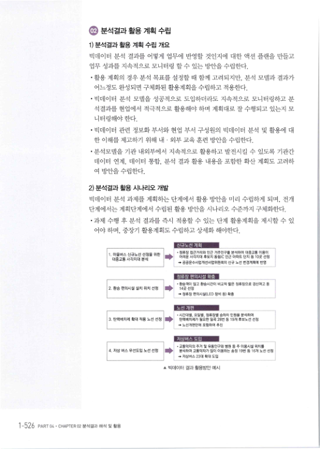
분석결과 활용 계획 수립 1) 분석결과 활용 계획 수립 개요 빅데이터 분적 결과를 어떻게 업무에 반영할 것인지에 대한 액션 플랜을 만들고 업무 성과를 지속적으로 모니터링 할 수 있는 방안을 수립한다．

- 활용 계획의 경우 분석 목표를 설정할 때 함께 고려되지만 , 분석 모델과 결과가
어느정도 완성되면 구쳬화된 활용계획을 수립하고 적용한다．

- 빅데이터 분석 모델을 성공적으로 도입하더라도 지속적으로 모니터링하고 분
석결과를 현업에서 적극적으로 활용해야 하며 계획대로 잘 수행되고 있는지 모 니터 링해야 한다 .

#### · 빅데이터 관련 정보화 부서와 현업 부서 구성원의 빅데이터 분적 및 활용에 대 
한 이해를 제고하기 위해 내 · 외부 교육 훈련 방안을 수립한다．

- 분석모델을 기관 내외부에서 지속적으로 활용하고 발전시킬 수 있도록 기관간
#### 데이터 연계 , 데이터 통합 , 분적 결과 활용 내용을 포함한 확산 계획도 고려하
여 방안을 수립한다． 2) 분석결과 활용 시나리오 개발

#### 빅데이터 분석 과제를 계획하는 단계에서 활용 방안을 미리 수립하게 되며 , 전개
단계에서는 계획단계에서 수립된 활용 방안을 시나리오 수준까지 구쳬화한다．

- 과제 수행 후 분적 결과를 즉시 적용할 수 있는 단계 활용계획을 제시할 수 있
#### 어야하며 , 중장기 활용계획도수립하고상세화해야한다．
- 정류장 접근거리와 인근 거주인구를 분석하여 대중교통 이용이 
어려운 사각지대 후보지 동램（= 인근 아파트 단지 둥 기）곳 선정 → 공공운수사업개선사업위원회의 신규 노선 변경계획에 반영 1 . 마읕버스 신규노선 선정을 위한 대충교통 사각지대 분석 정류장 편의시설 확충

- 환승객이 많고 환승시간히 비교적 짧은 정류장으로 경신여고 등 
14굿 선정

2. 환숭 편의시설 섧치 위치 선정
今 정류장 편의시설《LED 장비 등） 확충

## →
- 시간대별． 요일별． 정류장별 숭하차 인원을 분석하여 
탄력배차제가 필요한 일곡 28번 등 19개 후보노선 선정 → 노선개편안에 포함하여 추진

# 3 탄력배차제 확대 적용 노선 선정 
L ___- 저상버스 도입

- 교통약자의 주거 및 유동인구와 병원 등 주 이용시섧 위치률 
분석하여 교통약자가 많이 이용하는 송졍 19번 동 16개 노선 선정 .* 저상버스 23대 확대 도입

### 0
4. 저상 버스 우선도입 노선 선정
▲ 빅데이터 결과 활용빙단 예시 1-526 PART 04 . CHAPTER 02 분석결과해석 및 활용

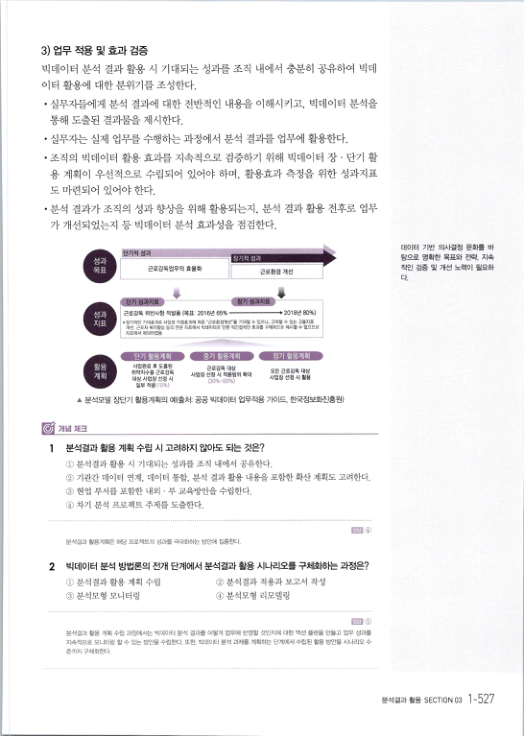
3) 업무 적용 및 효과 검증 빅데이터 분석 결과 활용 시 기대되는 성과를 조직 내에서 충분히 공유하여 빅데 이터 활용에 대한 분위기를 조성한다．

- 실무자들에게 분석 결과에 대한 전반적인 내용을 이해시키고 , 빅데이터 분적을
통해 도출된 결과물을 제시한다．

- 실무자는 실제 업무를 수행하는 과정에서 분적 결과를 업무에 활용한다．
#### · 조직의 빅데이터 활용 효과를 지속적으로 검증하기 위해 빅데이터 장 · 단기 활
용 계획이 우선적으로 수립되어 있어야 하며 , 활용효과 측정을 위한 성과지표 도 마련되어 있어야 한다．

#### · 분적 결과가 조직의 성과 향상을 위해 활용되는지 , 분석 결과 활용 전후로 업무
가 개선되었는지 등 빅데이터 분석 효과성을 점검한다． 근로강독업무의 효욜화 근로환경 개선

## - 
### 2. 분석결과 적용과 보고서 작성

**1) 분석결과 적용과 성과평가**

- 빅데이터 분석 결과 활용 시 기대되는 성과를 조직 내에서 충분히 공유하고 실
무자들에게 분석 결과에 대한 전반적인 내용을 이해시키고 실제 업무에 적용하 는 방법 및 활용 방안을 모색한다．

- 실무자가 분석 결과를 업무에 어떻게 적용하였는지 .확인하고 개선해야할 사항 
이 있으면 분석모델 리모델링에 반영할 수 있도록 한다． ' 분석기획단계에서 설정된 기준에 따라 프로젝트의 성과를 정량적 , 정성적으로 평가하고 프로젝트 성과 평가서를 작성한다． ① 성과를 측정할 항목을 정하괴 항목에 따라 측정식 , 측정주체 , 기간, 주기를 결정한다， ② 계획된 성과 측정 방법에 따라 성과를 측정하고 예상 성과지표와 비교한다~ ③ 실제 성과가 목표치보다 부족하면 먼저 목표치 설정에 문제가 없는지 파악하고， 문제 가 딥〕［다면 분석과제의 개선사항을 검토한다.

④ 성과 평가를 문서화하고 관련 부서 및 조직과 공유한다.

**2) 최종보고서 작성**
프로젝트 진행과정의 모든 산출물 및 프로세스를 정리하여 자산화하고 최종보고서를 작성하여 의사소통 절차에 따라 보고하고 프로젝트를 종료한다.
프로젝트 최종보고서에 포함되는 내용은 다음과 같다.
① 프로젝트 개요: 목표, 범위, 일정, 비용
② 프로젝트 수행 조직
③ 프로젝트 단계별 산출물 요약
④ 성과평가 결과
⑤ 모니터링 및 개선 계획

> El @
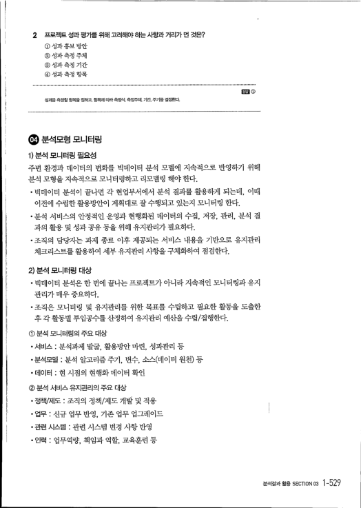
### 4. 분석모형 모니터링

**1) 분석 모니터링 필요성**

- 빅데이터 분석이 끝나면 각 현업부서에서 분석 결과를 활용하게 되는데 , 이때
이전에 수립한 활용방안이 계획대로 잘 수행되고 있는지 모니터링 한다．

- 분적 서비스의 안정적안운영과 현행화된 데이터의 수집 , 저장 , 관리 , 분석 결
과의 활용 및 성과 공유 등을 위해 유지관리가 필요하다．

- 조직의 담당자는 과제 종료 이후 제공되는 서비스 내용을 기반으로 유지관리
쳬크리스트를 활용하여 세부 유지관리 사항을 구쳬화하여 점검한다． 2) 분석 모니터링 대상

- 빅데이터 분석은 한 번에 끝나는 프로젝트가 아니라 지속적인 모니터링과 유지
관리가 매우 중요하다．

- 조직은 모니터링 및 유지관리를 위한 목표를 수립하고 필요한 활동을 도출한
후 각 활동별 투입공수를 산정하여 유지관리 예산을 수립／집행한다． ① 분석 모니터링의 주요 대상

- 서비스 : 분석과제 발굴 , 활용방안 마련 , 성과관리 등
- 분석모델 : 분석 알고리즘주기 , 변수 , 소스（데이터 원천） 등
- 데이터 : 현 시점의 현행화 데이터 확인
② 분석 서비스 유지관리의 주요 대상

#### · 정책／제도 : 조직의 정책／제도 개발 및 적용
#### · 업무 : 쵸脯予 업무 반영 , 기존 업무 업그레이드
#### · 관련 시스템 : 관련 시스템 변경 사항 반영
- 인력 : 업무역량 , 책임과 역할 , 교육훈린 등
> 분석결과활용SECTION 03 ㅑ 29
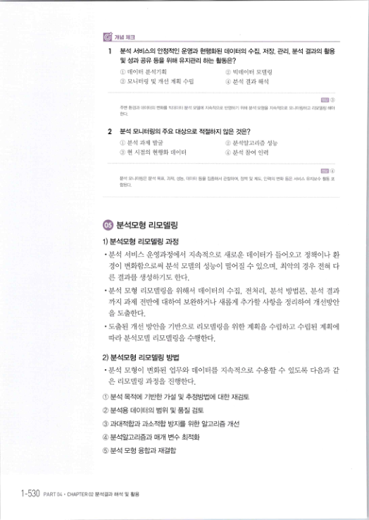
### 5. 분석모형 리모델링

**1) 분석모형 리모델링 과정**

- 분석 서비스 운영과정에서 지속적으로 새로운 데이터가 들어오고 정책이나 환
경이 변화함으로써 분적 모델의 성능이 떨어질 수 있으며 , 최악의 경우 전혀 다 른 결과를 생성하기도 한다．

- 분적 모형 리모델링을 위해서 데이터의 수집 , 전처리 , 분석 방법론 , 분적 결과
까지 과제 전반에 대하여 보완하거나 새롭게 추가할 사항을 정리하여 개선방안 을 도출한다．

- 도출된 개선 방안을 기반으로 리모델링을 위한 계획을 수립하고 수립된 계획에
따라 분석모델 리모델링을 수행한다． 2) 분석모형 리모델링 방법

- 분석 모형이 변화된 업무와 데이터를 지속적으로 수용할 수 있도록 다음과 같 
은 리모델링 과정을 진행한다.
① 분석 목적에 기반한 가설 및 추정방법에 대한 재검토
② 분석용 데이터의 범위 및 품질 검토
③ 과대적합과 과소적합 방지를 위한 알고리즘 개선
## 예상문제

01. 분석모형 전개 단계에서 이루어지는 활동으로 거리가 먼 것은?
① 완성된 모델을 실제 업무 현장에 적용한다.
② 개발된 분석 모델을 실제 운영데이터에서 동작시키고 성능을 평가한다.
③ 업무 적용 결과에 따라 분석 모델을 수정한다.
④ 분석 모델 개발을 위한 데이터를 준비한다.

> **정답** ④
> 데이터의 준비는 분석 모델을 개발하기 전에 이루어지며, 필요한 데이터의 범위를 설정하고 가공한다.

02. 분석모형 리모델링에서 수행하는 활동으로 적합하지 않은 것은?
① 데이터 품질 검토
② 분석 알고리즘 개선
③ 매개변수 최적화
④ 분석 알고리즘 적합도 검정

> **정답** ④
> 분석 알고리즘 적합도 검정은 분석 모형 평가 과정에서 이루어지며, 검정 결과에 따라 리모델링 단계에서는 데이터 품질 검토, 분석 알고리즘 개선, 매개변수 최적화 등의 작업이 이루어진다.

03. 분석결과 활용 계획 수립 시 고려할 사항으로 가장 거리가 먼 것은?
① 분석업무의 성과목표를 수립하고 측정할 수 있는 성과지표를 설정한다.
② 분석결과 활용을 위한 내·외부 교육 훈련 방안을 수립한다.
③ 분석결과 활용을 위한 임시조직(TFT)을 신설한다.
④ 결과활용을 위한 시나리오를 개발한다.

> **정답** ③
> 분석결과 활용은 장기적 관점에서 진행해야 하며, 임시조직에서 담당하는 것보다는 업무부서를 확대하거나 장기적으로 전담하는 조직을 갖추는 것이 효율적이다.
